对课程表、学生成绩表、教师信息表、学生信息表4个表进行多表连接查询。

1，课程表

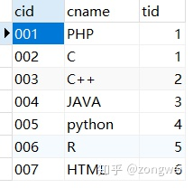共7个课程

2，学生成绩表


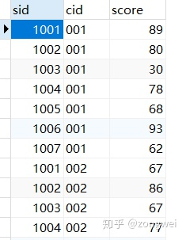sid：学生编号，cid：课程编号，score：成绩，共53条

3，教师信息表

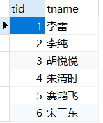tid：教师编号，tname：教师名字

4，学生信息表

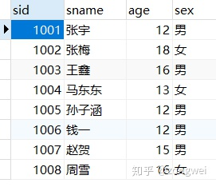sid：学生编号，sname：学生姓名，age：年龄，sex：性别，共8名学生

1． 查询平均成绩大于60分的同学的学号和平均成绩

```text
    SELECT sid,avg(score) "平均分" FROM sc GROUP BY sid HAVING 平均分>60;
```

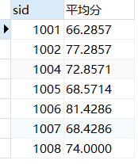

2． 查询所有同学的学号、姓名、选课数、总成绩

```text
SELECT s.sid as "学号",sname,COUNT(*) "选课数",SUM(score) "总成绩"
from student s INNER JOIN sc
ON s.sid=sc.sid
GROUP BY s.sid;
```

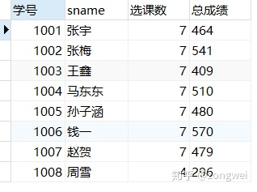

\3. 查询学过“李纯”老师课的同学的学号、姓名

```text
SELECT s.sid,sname FROM student s INNER JOIN sc ON s.sid=sc.sid
INNER JOIN course c ON sc.cid=c.cid
INNER JOIN teacher t ON c.tid=t.tid
WHERE tname="李纯";
```

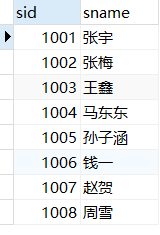

\4. 查询没学过“李雷”老师课的同学的学号、姓名

```text
SELECT sid,sname FROM student WHERE sid not in(SELECT sid from sc 
WHERE cid in(SELECT cid FROM course WHERE tid in(SELECT tid FROM teacher WHERE tname="李雷")));
```

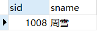

\5. 查询学过“001”并且也学过编号“003”课程的同学的学号、姓名

```text
SELECT s.sid,sname FROM student s
INNER JOIN 
(SELECT sid FROM sc WHERE cid=001) a
ON s.sid=a.sid
INNER JOIN 
(SELECT sid FROM sc WHERE cid=003) b
ON a.sid=b.sid;
```

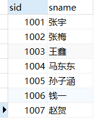

\6. 查询各科成绩最高分和最低分

```text
SELECT c.cid "课程ID",cname "课程名",MAX(score) "最高分",MIN(score) "最低分"
FROM course c INNER JOIN sc 
ON c.cid=sc.cid
GROUP BY c.cid;
```

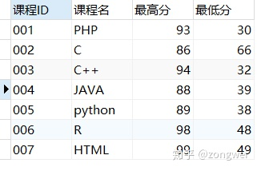

\7. 查询没有学全所有课的同学的学号、姓名

```text
SELECT s.sid,sname,COUNT(*) "选课数" FROM sc INNER JOIN student s
ON sc.sid=s.sid
GROUP BY s.sid
HAVING 选课数<(SELECT COUNT(*) FROM course);
```

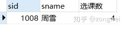