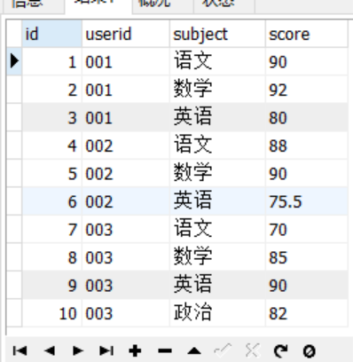
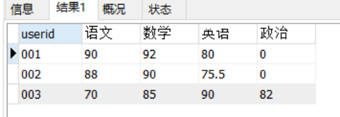
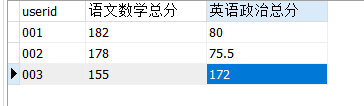
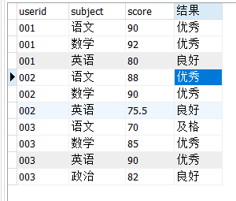
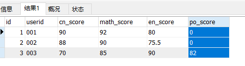
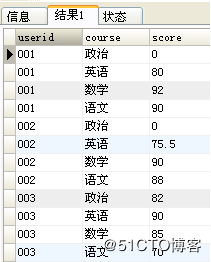

## **行转列**

即将原本同一列下多行的不同内容作为多个字段，输出对应内容。

建表语句

```mysql
DROP TABLE IF EXISTS tb_score;
CREATE TABLE tb_score(
    id INT(11) NOT NULL auto_increment,
    userid VARCHAR(20) NOT NULL COMMENT '用户id',
    subject VARCHAR(20) COMMENT '科目',
    score DOUBLE COMMENT '成绩',
    PRIMARY KEY(id)
)ENGINE = INNODB DEFAULT CHARSET = utf8;
```

插入数据

```mysql
INSERT INTO tb_score(userid,subject,score) VALUES ('001','语文',90);
INSERT INTO tb_score(userid,subject,score) VALUES ('001','数学',92);
INSERT INTO tb_score(userid,subject,score) VALUES ('001','英语',80);
INSERT INTO tb_score(userid,subject,score) VALUES ('002','语文',88);
INSERT INTO tb_score(userid,subject,score) VALUES ('002','数学',90);
INSERT INTO tb_score(userid,subject,score) VALUES ('002','英语',75.5);
INSERT INTO tb_score(userid,subject,score) VALUES ('003','语文',70);
INSERT INTO tb_score(userid,subject,score) VALUES ('003','数学',85);
INSERT INTO tb_score(userid,subject,score) VALUES ('003','英语',90);
INSERT INTO tb_score(userid,subject,score) VALUES ('003','政治',82);
```

查询数据表中的内容（即转换前的结果）

```
SELECT * FROM tb_score
```



先来看一下转换后的结果：



*可以看出，这里行转列是将原来的subject字段的多行内容选出来，作为结果集中的不同列，并根据userid进行分组显示对应的score。*

**1、使用case...when....then 进行行转列**

```
SELECT userid,
SUM(CASE `subject` WHEN '语文' THEN score ELSE 0 END) as '语文',
SUM(CASE `subject` WHEN '数学' THEN score ELSE 0 END) as '数学',
SUM(CASE `subject` WHEN '英语' THEN score ELSE 0 END) as '英语',
SUM(CASE `subject` WHEN '政治' THEN score ELSE 0 END) as '政治' 
FROM tb_score 
GROUP BY userid
```


```
SELECT DATE,
SUM(CASE `RST` WHEN '胜' THEN 1 ELSE 0 END) as '胜',
SUM(CASE `RST` WHEN '负' THEN 1 ELSE 0 END) as '负',
FROM 表 
GROUP BY DATE
```


**2、使用IF() 进行行转列：**

```
SELECT userid,
SUM(IF(`subject`='语文',score,0)) as '语文',
SUM(IF(`subject`='数学',score,0)) as '数学',
SUM(IF(`subject`='英语',score,0)) as '英语',
SUM(IF(`subject`='政治',score,0)) as '政治' 
FROM tb_score 
GROUP BY userid
```

注意点：

（1）SUM() 是为了能够使用GROUP BY根据userid进行分组，因为每一个userid对应的subject="语文"的记录只有一条，所以SUM() 的值就等于对应那一条记录的score的值。

假如userid ='001' and subject='语文' 的记录有两条，则此时SUM() 的值将会是这两条记录的和，同理，使用Max()的值将会是这两条记录里面值最大的一个。但是正常情况下，一个user对应一个subject只有一个分数，*因此可以使用SUM()、MAX()、MIN()、AVG()等聚合函数都可以达到行转列的效果。*

（2）IF(`subject`='语文',score,0) 作为条件，即对所有subject='语文'的记录的score字段进行SUM()、MAX()、MIN()、AVG()操作，如果score没有值则默认为0。


CASE [col_name] WHEN [value1] THEN [result1]…ELSE [default] END；

可以做更多的条件判断

如:  求出每个学生的  语文数学总分   英语政治总分



```mysql
select userid,
sum(CASE WHEN `subject`='语文' THEN score WHEN `subject`='数学' THEN score ELSE 0  END) '语文数学总分',
sum(CASE WHEN `subject`='英语' THEN score WHEN `subject`='政治' THEN score ELSE 0  END) '英语政治总分'
from tb_score group by userid
```


不仅仅可以用在聚合函数里哦，也可以直接用在搜索字段上:

如: 查询学生成绩，   

```
< 60分           不及格    
>=60分 < 75分    及格   
>=75分 < 85     良好   
>=85 < 100      优秀   
100             完美
```




```mysql
select userid,`subject`,score,
CASE  
	WHEN score < 60 THEN '不及格'
	WHEN score >= 60 AND score < 75 THEN '及格'
	WHEN score >= 75 AND score < 85 THEN '良好'
	WHEN score >= 85 AND score < 100 THEN '优秀'
	WHEN score = 100 THEN '完美'
END '结果'
FROM tb_score
```

## **列转行**

建表语句：

```mysql
CREATE TABLE tb_score1(
    id INT(11) NOT NULL auto_increment,
    userid VARCHAR(20) NOT NULL COMMENT '用户id',
    cn_score DOUBLE COMMENT '语文成绩',
    math_score DOUBLE COMMENT '数学成绩',
    en_score DOUBLE COMMENT '英语成绩',
    po_score DOUBLE COMMENT '政治成绩',
    PRIMARY KEY(id)
)ENGINE = INNODB DEFAULT CHARSET = utf8;
```

插入数据：

```mysql
INSERT INTO tb_score1(userid,cn_score,math_score,en_score,po_score) VALUES ('001',90,92,80,0);
INSERT INTO tb_score1(userid,cn_score,math_score,en_score,po_score) VALUES ('002',88,90,75.5,0);
INSERT INTO tb_score1(userid,cn_score,math_score,en_score,po_score) VALUES ('003',70,85,90,82);
```

查询数据表中的内容（即转换前的结果）

```mysql
SELECT * FROM tb_score1
```


转换后：

*本质是将userid的每个科目分数分散成一条记录显示出来。*

直接上SQL：

```
SELECT userid,'语文' AS course,cn_score AS score FROM tb_score1
UNION ALL
SELECT userid,'数学' AS course,math_score AS score FROM tb_score1
UNION ALL
SELECT userid,'英语' AS course,en_score AS score FROM tb_score1
UNION ALL
SELECT userid,'政治' AS course,po_score AS score FROM tb_score1
ORDER BY userid
```

这里将每个userid对应的多个科目的成绩查出来，通过UNION ALL将结果集加起来，达到上图的效果。

附：UNION与UNION ALL的区别（摘）：

*1.对重复结果的处理：UNION会去掉重复记录，UNION ALL不会；*

*2.对排序的处理：UNION会排序，UNION ALL只是简单地将两个结果集合并；*

*3.效率方面的区别：因为UNION 会做去重和排序处理，因此效率比UNION ALL慢很多；*