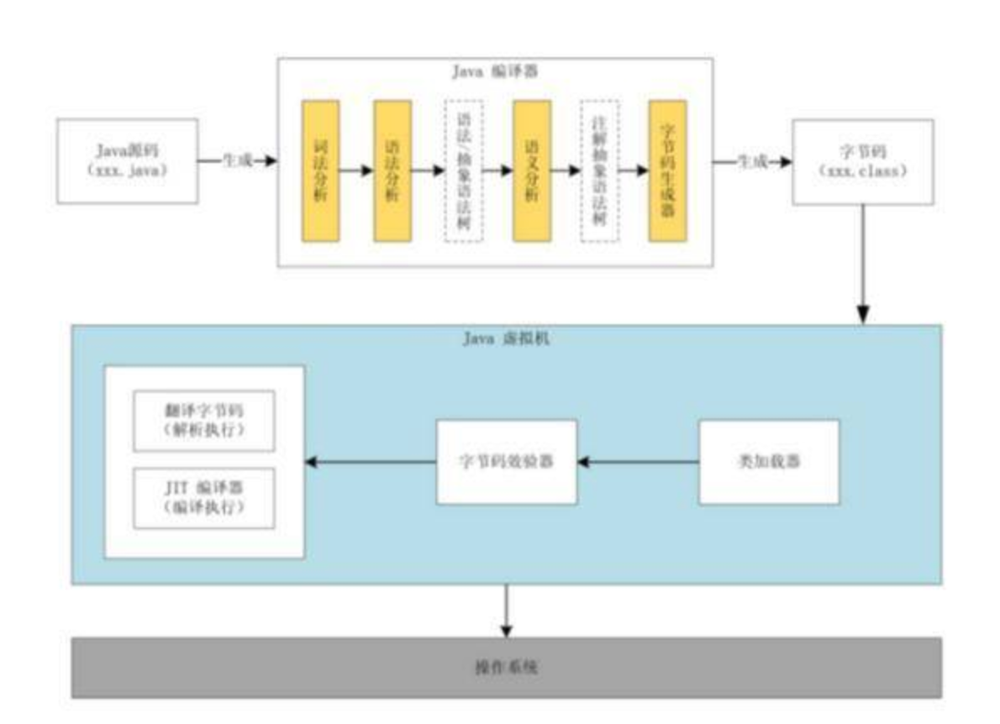

# 高频多线程相关面试题

## 1、Java中实现多线程有几种方法

（1）继承Thread类；

（2）实现Runnable接口；

（3）实现Callable接口通过FutureTask包装器来创建Thread线程；

（4）使用ExecutorService、Callable、Future实现有返回结果的多线程（也就是使用了ExecutorService来管理前面的三种方式）。

## 2、如何停止一个正在运行的线程

（1）使用退出标志，使线程正常退出，也就是当run方法完成后线程终止。

（2）使用stop方法强行终止，但是不推荐这个方法，因为stop和suspend及resume一样都是过期作废的方法。

（3）使用interrupt方法中断线程。

```java
class MyThread extends Thread {
	volatile Boolean stop = false;
	public void run() {
		while (!stop) {
			System.out.println(getName() + " is running");
			try {
				sleep(1000);
			}
			catch (InterruptedException e) {
				System.out.println("week up from blcok...");
				stop = true;
				// 在异常处理代码中修改共享变量的状态
			}
		}
		System.out.println(getName() + " is exiting...");
	}
}
class InterruptThreadDemo3 {
	public static void main(String[] args) throws InterruptedException {
		MyThread m1 = new MyThread();
		System.out.println("Starting thread...");
		m1.start();
		Thread.sleep(3000);
		m1.interrupt();
		// 阻塞时退出阻塞状态
		Thread.sleep(3000);
		// 主线程休眠3秒以便观察线程m1的中断情况
		System.out.println("Stopping application...");
	}
}
```

## 3、notify()和notifyAll()有什么区别？

notify可能会导致死锁，而notifyAll则不会

任何时候只有一个线程可以获得锁，也就是说只有一个线程可以运行synchronized 中的代码使用notifyall,可以唤醒所有处于wait状态的线程，使其重新进入锁的争夺队列中，而notify只能唤醒一个。

wait() 应配合while循环使用，不应使用if，务必在wait()调用前后都检查条件，如果不满足，必须调用notify()唤醒另外的线程来处理，自己继续wait()直至条件满足再往下执行。

notify() 是对notifyAll()的一个优化，但它有很精确的应用场景，并且要求正确使用。不然可能导致死锁。正确的场景应该是 WaitSet中等待的是相同的条件，唤醒任一个都能正确处理接下来的事项，如果唤醒的线程无法正确处理，务必确保继续notify()下一个线程，并且自身需要重新回到WaitSet中。

## 4、sleep()和wait() 有什么区别？

对于sleep()方法，我们首先要知道该方法是属于Thread类中的。而wait()方法，则是属于Object类中的。

sleep()方法导致了程序暂停执行指定的时间，让出cpu该其他线程，但是他的监控状态依然保持者，当指定的时间到了又会自动恢复运行状态。在调用sleep()方法的过程中，线程不会释放对象锁。

当调用wait()方法的时候，线程会放弃对象锁，进入等待此对象的等待锁定池，只有针对此对象调用notify()方法后本线程才进入对象锁定池准备，获取对象锁进入运行状态。

## 5、volatile 是什么?可以保证有序性吗?

一旦一个共享变量（类的成员变量、类的静态成员变量）被volatile修饰之后，那么就具备了两层语义：

（1）保证了不同线程对这个变量进行操作时的可见性，即一个线程修改了某个变量的值，这新值对其他线程来说是立即可见的,volatile关键字会强制将修改的值立即写入主存。

（2）禁止进行指令重排序。

volatile 不是原子性操作

什么叫保证部分有序性?

当程序执行到volatile变量的读操作或者写操作时，在其前面的操作的更改肯定全部已经进行，且结果已经对后面的操作可见；在其后面的操作肯定还没有进行；

```java
x = 2;//语句1
y = 0;//语句2
flag = true;//语句3
x = 4;//语句4
y = -1;//语句5
```

由于flag变量为volatile变量，那么在进行指令重排序的过程的时候，不会将语句3放到语句1、语句2前面，也不会讲语句3放到语句4、语句5后面。但是要注意语句1和语句2的顺序、语句4和语句5的顺序是不作任何保证的。

使用 Volatile 一般用于 状态标记量 和 单例模式的双检锁

## 6、Thread 类中的start() 和 run() 方法有什么区别？

start()方法被用来启动新创建的线程，而且start()内部调用了run()方法，这和直接调用run()方法的效果不一样。当你调用run()方法的时候，只会是在原来的线程中调用，没有新的线程启动，start()方法才会启动新线程。

## 7、为什么wait, notify 和 notifyAll这些方法不在thread类里面？

明显的原因是JAVA提供的锁是对象级的而不是线程级的，每个对象都有锁，通过线程获得。如果线程需要等待某些锁那么调用对象中的wait()方法就有意义了。如果wait()方法定义在Thread类中，线程正在等待的是哪个锁就不明显了。简单的说，由于wait，notify和notifyAll都是锁级别的操作，所以把他们定义在Object类中因为锁属于对象。

## 8、为什么wait和notify方法要在同步块中调用？

（1）只有在调用线程拥有某个对象的独占锁时，才能够调用该对象的wait(),notify()和notifyAll()方法。

（2）如果你不这么做，你的代码会抛出IllegalMonitorStateException异常。

（3）还有一个原因是为了避免wait和notify之间产生竞态条件。

wait()方法强制当前线程释放对象锁。这意味着在调用某对象的wait()方法之前，当前线程必须已经获得该对象的锁。因此，线程必须在某个对象的同步方法或同步代码块中才能调用该对象的wait()方法。

在调用对象的notify()和notifyAll()方法之前，调用线程必须已经得到该对象的锁。因此，必须在某个对象的同步方法或同步代码块中才能调用该对象的notify()或notifyAll()方法。

调用wait()方法的原因通常是，调用线程希望某个特殊的状态(或变量)被设置之后再继续执行。调用notify()或notifyAll()方法的原因通常是，调用线程希望告诉其他等待中的线程:"特殊状态已经被设置"。这个状态作为线程间通信的通道，它必须是一个可变的共享状态(或变量)。

## 9、Java中interrupted 和 isInterruptedd方法的区别？

interrupted() 和 isInterrupted()的主要区别是前者会将中断状态清除而后者不会。Java多线程的中断机制是用内部标识来实现的，调用Thread.interrupt()来中断一个线程就会设置中断标识为true。当中断线程调用静态方法Thread.interrupted()来检查中断状态时，中断状态会被清零。而非静态方法isInterrupted()用来查询其它线程的中断状态且不会改变中断状态标识。简单的说就是任何抛出InterruptedException异常的方法都会将中断状态清零。无论如何，一个线程的中断状态有有可能被其它线程调用中断来改变。

## 10、Java中synchronized 和 ReentrantLock 有什么不同？

相似点：

这两种同步方式有很多相似之处，它们都是加锁方式同步，而且都是阻塞式的同步，也就是说当如果一个线程获得了对象锁，进入了同步块，其他访问该同步块的线程都必须阻塞在同步块外面等待，而进行线程阻塞和唤醒的代价是比较高的。

区别：

这两种方式最大区别就是对于Synchronized来说，它是java语言的关键字，是原生语法层面的互斥，需要jvm实现。而ReentrantLock它是JDK 1.5之后提供的API层面的互斥锁，需要lock()和unlock()方法配合try/finally语句块来完成。

Synchronized进过编译，会在同步块的前后分别形成monitorenter和monitorexit这个两个字节码指令。在执行monitorenter指令时，首先要尝试获取对象锁。如果这个对象没被锁定，或者当前线程已经拥有了那个对象锁，把锁的计算器加1，相应的，在执行monitorexit指令时会将锁计算器就减1，当计算器为0时，锁就被释放了。如果获取对象锁失败，那当前线程就要阻塞，直到对象锁被另一个线程释放为止。

由于ReentrantLock是java.util.concurrent包下提供的一套互斥锁，相比Synchronized，ReentrantLock类提供了一些高级功能，主要有以下3项：

（1）等待可中断，持有锁的线程长期不释放的时候，正在等待的线程可以选择放弃等待，这相当于Synchronized来说可以避免出现死锁的情况。

（2）公平锁，多个线程等待同一个锁时，必须按照申请锁的时间顺序获得锁，Synchronized锁非公平锁，ReentrantLock默认的构造函数是创建的非公平锁，可以通过参数true设为公平锁，但公平锁表现的性能不是很好。

（3）锁绑定多个条件，一个ReentrantLock对象可以同时绑定对个对象。

## 11、有三个线程T1,T2,T3,如何保证顺序执行？

在多线程中有多种方法让线程按特定顺序执行，你可以用线程类的join()方法在一个线程中启动另一个线程，另外一个线程完成该线程继续执行。为了确保三个线程的顺序你应该先启动最后一个(T3调用T2，T2调用T1)，这样T1就会先完成而T3最后完成。

实际上先启动三个线程中哪一个都行，因为在每个线程的run方法中用join方法限定了三个线程的执行顺序。

```java
public class JoinTest2 {
	// 1.现在有T1、T2、T3三个线程，你怎样保证T2在T1执行完后执行，T3在T2执行完后执行
	public static void main(String[] args) {
		final Thread t1 = new Thread(new Runnable() {
			@Override
			public void run() {
				System.out.println("t1");
			}
		}
		);
		@Override
		public void run() {
			try {
				// 引用t1线程，等待t1线程执行完
				t1.join();
			}
			catch (InterruptedException e) {
				e.printStackTrace();
			}
			System.out.println("t2");
		}
	}
	);
	Thread t3 = new Thread(new Runnable() {
		@Override
		public void run() {
			try {
				// 引用t2线程，等待t2线程执行完
				t2.join();
			}
			catch (InterruptedException e) {
				e.printStackTrace();
			}
			System.out.println("t3");
		}
	}
	);
	t3.start();
	//这里三个线程的启动顺序可以任意，大家可以试下！
	t2.start();
	t1.start();
}
}
```

## 12、SynchronizedMap和ConcurrentHashMap有什么区别？

SynchronizedMap()和Hashtable一样，实现上在调用map所有方法时，都对整个map进行同步。而ConcurrentHashMap的实现却更加精细，它对map中的所有桶加了锁。所以，只要有一个线程访问map，其他线程就无法进入map，而如果一个线程在访问ConcurrentHashMap某个桶时，其他线程，仍然可以对map执行某些操作。

所以，ConcurrentHashMap在性能以及安全性方面，明显比Collections.synchronizedMap()更加有优势。同时，同步操作精确控制到桶，这样，即使在遍历map时，如果其他线程试图对map进行数据修改，也不会抛出ConcurrentModificationException。

## 13、什么是线程安全

线程安全就是说多线程访问同一代码，不会产生不确定的结果。

在多线程环境中，当各线程不共享数据的时候，即都是私有（private）成员，那么一定是线程安全的。但这种情况并不多见，在多数情况下需要共享数据，这时就需要进行适当的同步控制了。

线程安全一般都涉及到synchronized， 就是一段代码同时只能有一个线程来操作 不然中间过程可能会产生不可预制的结果。

如果你的代码所在的进程中有多个线程在同时运行，而这些线程可能会同时运行这段代码。如果每次运行的ArrayList不是线程安全的。

## 14、Thread类中的yield方法有什么作用？

Yield方法可以暂停当前正在执行的线程对象，让其它有相同优先级的线程执行。它是一个静态方法而且只保证当前线程放弃CPU占用而不能保证使其它线程一定能占用CPU，执行yield()的线程有可能在进入到暂停状态后马上又被执行。

## 15、Java线程池中submit() 和 execute()方法有什么区别？

两个方法都可以向线程池提交任务，execute()方法的返回类型是void，它定义在Executor接口中, 而submit()方法可以返回持有计算结果的Future对象，它定义在ExecutorService接口中，它扩展了Executor接口，其它线程池类像ThreadPoolExecutor和ScheduledThreadPoolExecutor都有这些方法。

## 16、说一说自己对于 synchronized 关键字的了解

synchronized关键字解决的是多个线程之间访问资源的同步性，synchronized关键字可以保证被它修饰的方法或者代码块在任意时刻只能有一个线程执行。

另外，在 Java 早期版本中，synchronized属于重量级锁，效率低下，因为监视器锁（monitor）是依赖于底层的操作系统的 Mutex Lock 来实现的，Java 的线程是映射到操作系统的原生线程之上的。如果要挂起或者唤醒一个线程，都需要操作系统帮忙完成，而操作系统实现线程之间的切换时需要从用户态转换到内核态，这个状态之间的转换需要相对比较长的时间，时间成本相对较高，这也是为什么早期的synchronized 效率低的原因。庆幸的是在 Java 6 之后 Java 官方对从 JVM 层面对synchronized 较大优化，所以现在的 synchronized 锁效率也优化得很不错了。JDK1.6对锁的实现引入了大量的优化，如自旋锁、适应性自旋锁、锁消除、锁粗化、偏向锁、轻量级锁等技术来减少锁操作的开销。

## 17、说说自己是怎么使用 synchronized 关键字，在项目中用到了吗

synchronized关键字最主要的三种使用方式：

（1）修饰实例方法: 作用于当前对象实例加锁，进入同步代码前要获得当前对象实例的锁

（2）修饰静态方法: 也就是给当前类加锁，会作用于类的所有对象实例，因为静态成员不属于任何一个实例对象，是类成员（ static 表明这是该类的一个静态资源，不管new了多少个对象，只有一份）。所以如果一个线程A调用一个实例对象的非静态 synchronized 方法，而线程B需要调用这个实例对象所属类的静态 synchronized 方法，是允许的，不会发生互斥现象，因为访问静态 synchronized 方法占用的锁是当前类的锁，而访问非静态 synchronized 方法占用的锁是当前实例对象锁。

（3）修饰代码块: 指定加锁对象，对给定对象加锁，进入同步代码库前要获得给定对象的锁。

总结： synchronized 关键字加到 static 静态方法和 synchronized(class)代码块上都是是给 Class 类上锁。synchronized 关键字加到实例方法上是给对象实例上锁。尽量不要使用 synchronized(String a) 因为JVM中，字符串常量池具有缓存功能！

## 18、什么是线程安全？Vector是一个线程安全类吗？

如果你的代码所在的进程中有多个线程在同时运行，而这些线程可能会同时运行这段代码。如果每次运

行结果和单线程运行的结果是一样的，而且其他的变量 的值也和预期的是一样的，就是线程安全的。

## 19、 volatile关键字的作用？

一旦一个共享变量（类的成员变量、类的静态成员变量）被volatile修饰之后，那么就具备了两层语义：

（1）保证了不同线程对这个变量进行操作时的可见性，即一个线程修改了某个变量的值，这新值对其他线程来说是立即可见的。

（2）禁止进行指令重排序。

（3）volatile本质是在告诉jvm当前变量在寄存器（工作内存）中的值是不确定的，需要从主存中读取；synchronized则是锁定当前变量，只有当前线程可以访问该变量，其他线程被阻塞住。

（4）volatile仅能使用在变量级别；synchronized则可以使用在变量、方法、和类级别的。

（5）volatile仅能实现变量的修改可见性，并不能保证原子性；synchronized则可以保证变量的修改可见性和原子性。

（6）volatile不会造成线程的阻塞；synchronized可能会造成线程的阻塞。

（7）volatile标记的变量不会被编译器优化；synchronized标记的变量可以被编译器优化。

## 20、常用的线程池有哪些？

（1）newSingleThreadExecutor：创建一个单线程的线程池，此线程池保证所有任务的执行顺序按照任务的提交顺序执行。

（2）newFixedThreadPool：创建固定大小的线程池，每次提交一个任务就创建一个线程，直到线程达到线程池的最大大小。

（3）newCachedThreadPool：创建一个可缓存的线程池，此线程池不会对线程池大小做限制，线程池大小完全依赖于操作系统（或者说JVM）能够创建的最大线程大小。

（4）newScheduledThreadPool：创建一个大小无限的线程池，此线程池支持定时以及周期性执行任务的需求。

（5）newSingleThreadExecutor：创建一个单线程的线程池。此线程池支持定时以及周期性执行任务的需求。

## 21、简述一下你对线程池的理解

（如果问到了这样的问题，可以展开的说一下线程池如何用、线程池的好处、线程池的启动策略）合理利用线程池能够带来三个好处。

（1）降低资源消耗。通过重复利用已创建的线程降低线程创建和销毁造成的消耗。

（2）提高响应速度。当任务到达时，任务可以不需要等到线程创建就能立即执行。

（3）提高线程的可管理性。线程是稀缺资源，如果无限制的创建，不仅会消耗系统资源，还会降低系统的稳定性，使用线程池可以进行统一的分配，调优和监控。

## 22、Java程序是如何执行的

我们日常的工作中都使用开发工具（IntelliJ IDEA 或 Eclipse 等）可以很方便的调试程序，或者是通过打包工具把项目打包成 jar 包或者 war 包，放入 Tomcat 等 Web 容器中就可以正常运行了

（1）先把 Java 代码编译成字节码，也就是把 .java 类型的文件编译成 .class 类型的文件。这个过程的大致执行流程：Java 源代码 -> 词法分析器 -> 语法分析器 -> 语义分析器 -> 字符码生成器 -> 最终生成字节码，其中任何一个节点执行失败就会造成编译失败；

（2）把 class 文件放置到 Java 虚拟机，这个虚拟机通常指的是 Oracle 官方自带的 Hotspot JVM；

（3）Java 虚拟机使用类加载器（Class Loader）装载 class 文件；

（4）类加载完成之后，会进行字节码效验，字节码效验通过之后 JVM 解释器会把字节码翻译成机器码交由操作系统执行。但不是所有代码都是解释执行的，JVM 对此做了优化，比如，以 Hotspot 虚拟机来说，它本身提供了 JIT（Just In Time）也就是我们通常所说的动态编译器，它能够在运行时将热点代码编译为机器码，这个时候字节码就变成了编译执行。Java 程序执行流程图如下：



