## 0.学习目标

### 能够理解多线程基础知识

### 能够说出JMM内存模型

### 能够说出并发编程的三大特性

### 能够描述Java线程池体系架构

### 线程池的实际应用场景


## 1.并发编程之多线程基础

### 1.1 线程与进程区别

```
进程：是执行中一段程序，即一旦程序被载入到内存中并准备执行，它就是一个进程。进程是表示资源分配的的基本概念，又是调度运行的基本单位，是系统中的并发执行的单位。

线程：单个进程中执行中每个任务就是一个线程。线程是进程中执行运算的最小单位。

一个线程只能属于一个进程，但是一个进程可以拥有多个线程。多线程处理就是允许一个进程中在同一时刻执行多个任务。

线程是一种轻量级的进程，与进程相比，线程给操作系统带来侧创建、维护、和管理的负担要轻，意味着线程的代价或开销比较小。
  
每个正在系统上运行的程序都是一个进程。每个进程包含一到多个线程。线程是一组指令的集合，或者是程序的特殊段，它可以在程序里独立执行。也可以把它理解为代码运行的上下文。所以线程基本上是轻量级的进程，它负责在单个程序里执行多任务。通常由操作系统负责多个线程的调度和执行。

使用线程可以把占据时间长的程序中的任务放到后台去处理，程序的运行速度可能加快，在一些等待的任务实现上如用户输入、文件读写和网络收发数据等，线程就比较有用了。在这种情况下可以释放一些珍贵的资源如内存占用等等。

如果有大量的线程,会影响性能，因为操作系统需要在它们之间切换，更多的线程需要更多的内存空间，线程的中止需要考虑其对程序运行的影响。通常块模型数据是在多个线程间共享的，需要防止线程死锁情况的发生。

总结:进程是所有线程的集合，每一个线程是进程中的一条执行路径。
```

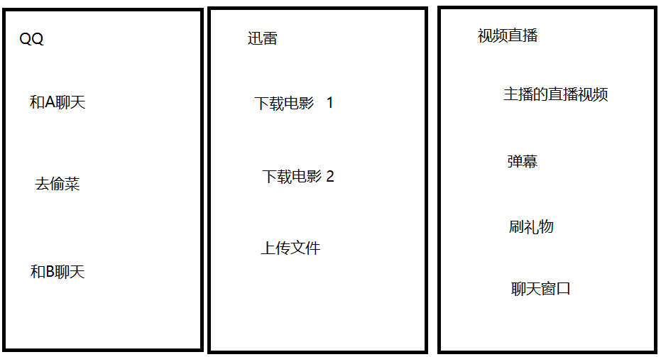

### 1.2 为什么要使用多线程？

```
思考生活问题？
现在有1000顿的水，目前只有小明一个人去打水，但是小明每小时打水200顿，现在要求一小时内把水全部打完，请问怎么解决？
如果小明一个人将水全部打完需要五个小时。
解决办法:
在加四个人同时打水，分别为小军、小红、小玲、小小，加上小明一共五个人同时去打水，五个人每小时打水200千克，那么一小时后就可以完成打完一顿水。


总结: 多线程的好处提高程序的效率。 
     充分发挥多核计算机的优势 

```

### 1.3 多线程应用场景？

```
答:主要能体现到多线程提高程序效率。
多线程最多的场景：web服务器本身；各种专用服务器（如游戏服务器）；
TOMCAT  Hystrix  Dubbo 
多线程的常见应用场景：
1、后台任务，例如：定时向大量（100w以上）的用户发送邮件；

2、异步处理，例如：统计结果、记录日志、发送短信等；
    controller (){  
        insert();
        new Thread(); // MQ 
        // 直接返回结果   
    }
3、分布式计算、分片下载、断点续传    （文件  2.8G）    500KB

小结： 任务量比较大，通过多线程可以提高效率时
	  需要异步处理时
	  占用系统资源，造成阻塞的工作时
	  都可以采用多线程提高效率
```

### 1.4 多线程创建方式  Thread 

#### 1.4.1.继承Thread类

```java
public class A1_线程创建_继承Thread {
    public static void main(String[] args) {
        MyThread myThread = new MyThread();
        myThread.start(); // 启动线程   
        
    }
    // 继承Thread类  实现run方法
    static class MyThread extends Thread{
        @Override
        public void run() {
            for (int i = 0; i < 1000; i++) {
                System.out.println("输出打印"+i);
            }
        }
    }
}

```

#### 1.4.2.实现Runnable接口

```java
public class A2_线程创建_实现Runnable {
    public static void main(String[] args) {    
        Thread thread = new Thread(new MyRunnable());
        thread.start();
    }
    // 实现Runnable接口  实现run方法
    static class MyRunnable implements Runnable {
        @Override
        public void run() {
            for (int i = 0; i < 1000; i++) {
                System.out.println("输出:"+i);
            }
        }
    }
}
```

```
上面两个哪个好？
Thread类继承存在单继承的局限性，而接口不会
体现数据共享的概念(JMM内存模型图)，代码可以被多个线程共享，代码和数据独立
Runnable实现线程可以对线程进行复用，因为runnable是轻量级对象，而Thread不行，它是重量级对象
```

#### 1.4.3.使用匿名内部类

```java
public static void main(String[] args) {
        //使用匿名内部类方式创建Runnable实例
        Thread t1 = new Thread(new Runnable(){
            @Override
            public void run() {
                for (int i = 0; i < 1000; i++) {
                    System.out.println("输出"+i);
                }
            }
        });
        t1.start();
        // lambda 表达式简化语法
        Thread t2 = new Thread(()->{
            for (int i = 0; i < 1000; i++) {
                System.out.println("输出"+i);
            }
        });
        t2.start();
}
```

#### 1.4.4.实现Callable接口

```java
public class A3_线程创建_实现Callable {
    public static void main(String[] args) {
        //FutureTask包装我们的任务，FutureTask可以用于获取执行结果
        FutureTask<Integer> ft = new FutureTask<>(new MyCallable());
        //创建线程执行线程任务
        Thread thread = new Thread(ft);
        thread.start();
        try {
            //得到线程的执行结果
            Integer num = ft.get();
            System.out.println("得到线程处理结果:" + num);
        } catch (InterruptedException e) {
            e.printStackTrace();
        } catch (ExecutionException e) {
            e.printStackTrace();
        }
    }
    // 实现Callable接口，实现带返回值的任务
    static class MyCallable implements Callable<Integer> {
        @Override
        public Integer call() throws Exception {
            int num = 0;
            for (int i = 0; i < 1000; i++) {
                System.out.println("输出"+i);
                num += i;
            }
            return num;
        }
    }
}
```

### 1.5 用户线程与守护线程

```
Java分为两种线程：用户线程和守护线程

所谓守护线程是指在程序运行的时候在后台提供一种通用服务的线程，比如垃圾回收线程就是一个很称职的守护者，并且这种线程并不属于程序中不可或缺的部分。因 此，当所有的非守护线程结束时，程序也就终止了，同时会杀死进程中的所有守护线程。反过来说，只要任何非守护线程还在运行，程序就不会终止。

守护线程和用户线程的没啥本质的区别：唯一的不同之处就在于虚拟机的离开：如果用户线程已经全部退出运行了，只剩下守护线程存在了，虚拟机也就退出了。 因为没有了被守护者，守护线程也就没有工作可做了，也就没有继续运行程序的必要了。

将线程转换为守护线程可以通过调用Thread对象的setDaemon(true)方法来实现。在使用守护线程时需要注意一下几点：

(1) thread.setDaemon(true)必须在thread.start()之前设置，否则会跑出一个IllegalThreadStateException异常。你不能把正在运行的常规线程设置为守护线程。

(2) 在Daemon线程中产生的新线程也是Daemon的。

(3) 守护线程应该永远不去访问固有资源，如文件、数据库，因为它会在任何时候甚至在一个操作的中间发生中断。
```

```java
public class B1_线程基础_用户线程守护线程 {
    public static void main(String[] args) {
        // 守护线程
        Thread t1 = new Thread(() -> {
            for (int i = 0; i < 100; i++) {
                try {
                    Thread.sleep(200);
                    System.out.println("t1 输出" + i);
                } catch (InterruptedException e) {
                    e.printStackTrace();
                }
            }
        });
        t1.setDaemon(true);
        t1.start();
        // 用户线程
        Thread t2 = new Thread(() -> {
            for (int i = 0; i < 100; i++) {
                try {
                    Thread.sleep(50);
                } catch (InterruptedException e) {
                    e.printStackTrace();
                }
                System.out.println("t2 输出" + i);
            }
        });
        t2.start();
    }
}
```

### 1.6 线程优先级

```
 线程的切换是由线程调度控制的,我们无法通过代码来干涉,但是我们通过提高线程的优先级来最大程度的改善线程获取时间片的几率。

    线程的优先级被划分为10级,值分别为1-10,其中1最低,10最高。线程提供了3个常量来表示最低,最高,以及默认优先级:

    Thread.MIN_PRIORITY   1

    Thread.MAX_PRIORITY   10

    Thread.NORM_PRIORITY   5

    void setPriority(int priority):设置线程的优先级。
```

```java
public class B2_线程基础_线程优先级 {
    public static void main(String[] args) {
        // 守护线程
        Thread t1 = new Thread(() -> {
            for (int i = 0; i < 10000; i++) {
                try {
                    System.out.println("t1 输出" + i);
                } catch (Exception e) {
                    e.printStackTrace();
                }
            }
        });
        t1.setPriority(5);
        t1.start();
        // 用户线程
        Thread t2 = new Thread(() -> {
            for (int i = 0; i < 10000; i++) {
                System.out.println("t2 输出" + i);
            }
        });
        t2.setPriority(5);
        t2.start();
    }
}
```

### 1.7 线程常用API

| 常用线程api方法                     |                                                    |
| ----------------------------------- | -------------------------------------------------- |
| start()                             | 启动线程                                           |
| getID()                             | 获取当前线程ID      Thread-编号  该编号从0开始     |
| getName()                           | 获取当前线程名称                                   |
| Stop（）                            | 停止线程,（已废弃）                                |
| getPriority();                      | 返回线程的优先级                                   |
| boolean isAlive()                   | 测试线程是否处于活动状态                           |
| isDaemon():                         | 测试线程是否为守护线程                             |
| isInterrupted();   线程.interrupt() | 测试线程是否已经中断                               |
| Thread.currentThread()              | 获取当前线程对象                                   |
| Thread.state getState()             | 获取线程的状态                                     |
| **常用线程构造****函数**            |                                                    |
| Thread（）                          | 分配一个新的 Thread 对象                           |
| Thread（String name）               | 分配一个新的 Thread对象，具有指定的 name正如其名。 |
| Thread（Runable r）                 | 分配一个新的 Thread对象                            |
| Thread（Runable r, String name）    | 分配一个新的 Thread对象                            |


```java
public static void main(String[] args) {
        Thread t1 = new Thread(() -> {
            for (int i = 0; i < 100; i++) {
                try {
                    Thread.sleep(50);
//                    System.out.println("t1 输出" + i);
                } catch (Exception e) {
                    e.printStackTrace();
                }
            }
            System.out.println("执行完毕");
        });
        t1.setName("呼啦嘿线程1号");
        t1.start();
        while (true){
            try {
                Thread.sleep(30);
            } catch (InterruptedException e) {
                e.printStackTrace();
            }
            long id = t1.getId();// 分配的线程ID
            String name = t1.getName();// 线程的名称
            int priority = t1.getPriority();// 优先级
            Thread.State state = t1.getState();// 线程的状态
            boolean alive = t1.isAlive(); //true 活动   false 运行完毕
            boolean daemon = t1.isDaemon();//true 守护线程  false 用户线程
            boolean interrupted = t1.isInterrupted();
            System.out.println("线程ID:"+id + " 线程名称:"+name + " 线程优先级:" + priority);
            System.out.println("线程状态:"+state + " 线程是否活动中:"+alive + " 线程是否守护线程:" + daemon);
            System.out.println("线程是否中断:"+interrupted );
        }
    }
```

### 1.8 多线程运行状态

```
新建状态 (NEW)
	当用new操作符创建一个线程时， 例如new Thread(r)，线程还没有开始运行，此时线程处在新建状态。 当一个线程处于新生状态时，程序还没有开始运行线程中的代码
就绪状态 
	一个新创建的线程并不自动开始运行，要执行线程，必须调用线程的start()方法。当线程对象调用start()方法即启动了线程，start()方法创建线程运行的系统资源，并调度线程运行run()方法。当start()方法返回后，线程就处于就绪状态。
	处于就绪状态的线程并不一定立即运行run()方法，线程还必须同其他线程竞争CPU时间，只有获得CPU时间才可以运行线程。因为在单CPU的计算机系统中，不可能同时运行多个线程，一个时刻仅有一个线程处于运行状态。因此此时可能有多个线程处于就绪状态。对多个处于就绪状态的线程是由运行时系统的线程调度程序(*thread scheduler*)来调度的。
运行状态 (RUNNABLE)
	当线程获得CPU时间后，它才进入运行状态，真正开始执行run()方法.
阻塞状态 (WAITING)(TIMED_WAITING)(BLOCKED)
	线程运行过程中，可能由于各种原因进入阻塞状态:
		1>线程通过调用sleep方法进入睡眠状态；
		2>线程调用一个在I/O上被阻塞的操作，即该操作在输入输出操作完成之前不会返回到它的调用者；
		3>线程试图得到一个锁，而该锁正被其他线程持有；
		4>线程在等待某个触发条件；
死亡状态 (TERMINATED)
	有两个原因会导致线程死亡：
		1) run方法正常退出而自然死亡，
		2) 一个未捕获的异常终止了run方法而使线程猝死。
为了确定线程在当前是否存活着（就是要么是可运行的，要么是被阻塞了），需要使用isAlive方法。如果是可运行或被阻塞，这个方法返回true； 如果线程仍旧是new状态且不是可运行的， 或者线程死亡了，则返回false.
```

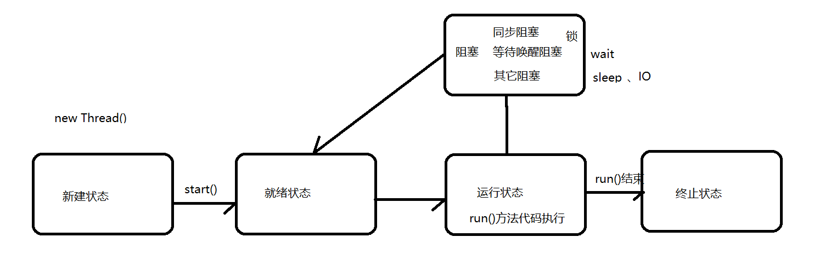


### 1.9 线程常用API 2

#### 1.9.1 常用API-sleep方法

```
 Thread的静态方法sleep用于使当前线程进入阻塞状态：
 static void sleep(long ms)
 
 该方法会使当前线程进入阻塞状态指定毫秒,当阻塞指定毫秒后,当前线程会重写进入Runnable状态,等待分配时间片。
```

#### 1.9.2 常用API- yield方法

```
Thread的静态方法yield:

static void yield()

该方法用于使当前线程主动让片出当次CPU时间片回到Runnable状态,等待分配时间片.
```

#### 1.9.3 常用API- join方法

```
 Thread的方法join:
 线程调用了join方法，那么就要一直运行到该线程运行结束，才会运行其他进程. 这样可以控制线程执行顺序。
```

**面试题：现在有T1、T2、T3三个线程，你怎样保证T2在T1执行完后执行，T3在T2执行完后执行**

```java
public class B3_线程基础_join方法 {
    public static void main(String[] args) {
        Thread t1 = new Thread(()->{
            for (int i = 0; i < 10; i++) {
                System.out.println("t1 ========> " + i);
            }
        });
        Thread t2 = new Thread(()->{
            for (int i = 0; i < 10; i++) {
                System.out.println("t2 ========> " + i);
            }
        });
        Thread t3 = new Thread(()->{
            for (int i = 0; i < 10; i++) {
                System.out.println("t3 ========> " + i);
            }
        });
        t1.start();
        t2.start();
        t3.start();
    }
}
```


```java
	// 现在有T1、T2、T3三个线程，你怎样保证T2在T1执行完后执行，T3在T2执行完后执行
    public static void main(String[] args) {
        final Thread t1 = new Thread(()->{
            for (int i = 0; i < 10; i++) {
                System.out.println("t1 ========> " + i);
            }
        });
        final Thread t2 = new Thread(()->{
            try {
                t1.join();
            } catch (InterruptedException e) {
                e.printStackTrace();
            }
            for (int i = 0; i < 10; i++) {
                System.out.println("t2 ========> " + i);
            }
        });
        Thread t3 = new Thread(()->{
            try {
                t2.join();
            } catch (InterruptedException e) {
                e.printStackTrace();
            }
            for (int i = 0; i < 10; i++) {
                System.out.println("t3 ========> " + i);
            }
        });
        t1.start();
        t2.start();
        t3.start();
    }
```


**常用API- stop 和 interrupt  **

```
在开发中，经常会遇到需要停止一个正在运行的线程的场景，以前的做法是通过Thread.stop() 的方式来停止具体的线程，但是这个方法目前是被废弃掉的，不推荐使用。不推荐使用的原因如下：

1、该方式是通过立即抛出ThreadDeath异常来达到停止线程的目的，而且此异常抛出可能发生在程序的任何一个地方，包括catch、finally等语句块中。

2、由于抛出ThreadDeatch异常，会导致该线程释放所持有的所有的锁，而且这种释放的时间点是不可控制的，可能会导致出现线程安全问题和数据不一致情况，比如在同步代码块中在执行数据更新操作时线程被突然停止。

   因此，为了避免Thread.stop()带来的问题，推荐使用被称作为Interrupt（中断）的协作机制来停止一个正在运行的线程。在JVM中，每个线程都有一个与之关联的Boolean属性，被称之为中断状态，可以通过Thread.currentThread().isInterrupted()来获取当前线程的中断状态，初始值为false。中断状态仅仅是线程的一个属性，用以表明该线程是否被中断。
```


```java
public class B4_线程基础_停止线程 {
    // 使用stop 和 interrupted 停止线程
    public static void main(String[] args) {
        Thread t1 = new Thread(()->{
            while (true){
                try {
                    boolean interrupted = Thread.currentThread().isInterrupted();
                    if (interrupted){
                        System.out.println("当前线程为中断状态");
                        break;
                    }else {
                        System.out.println("线程执行中....");
                    }
                } catch (Exception e) {
                    e.printStackTrace();
                }
            }
        });
        t1.start();
        try {
            Thread.sleep(2000);
            t1.interrupt(); //中断线程
        } catch (InterruptedException e) {
            e.printStackTrace();
        }
    }
}
```

## 2.并发编程之线程安全

### 2.1 什么是线程安全？

#### 2.1.1 线程安全问题

```
1. 什么是线程安全问题？
   多线程操作共享变量，导致访问数据出问题。
    
2. 出现线程安全问题的条件
   有多个线程
   有共享数据
   其中一个线程修改了共享数据
```


当多个线程访问更改共享变量时候，就会出现线程安全问题，导致脏数据。

线程安全问题都是由全局变量及静态变量引起的。若每个线程中对全局变量、静态变量只有读操作，而无写操作，一般来说，这个全局变量是线程安全的；若有多个线程同时执行写操作，一般都需要考虑线程同步，否则的话就可能影响线程安全。

举例说明：假设售票系统有1000张票，A和B同时来买票，如果是线程不安全，那么可能售票系统可能出现1000-1去<font color=red><b>同时执行</b></font>的情况，最终结果是A和B都买完后剩下999张票，而不是998张。

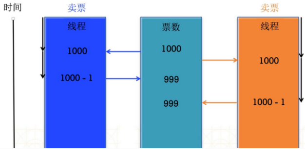

#### 2.1.2 模拟售票案例

- 我们来模拟电影院的售票窗口，实现多个窗口同时卖“速度与激情8”这场电影票，多个窗口一起卖这100张票。

- 什么是线程安全问题。

  线程安全问题的原因：多个线程在操作同一个共享资源的时候，可能出现线程安全问题。

- 通过加睡眠实现模拟多线程下访问共享变量的线程安全问题。

```java
/**
 * 需求：我们来模拟电影院的售票窗口，实现多个窗口同时卖“速度与激情8”这场电影票(多个窗口一起卖这100张票)。
 * 分析: 多个窗口相当于多线程, 每个窗口做的事情是一样的,卖100张票(任务放到Runnable中)
 */
public class C1_线程安全_售票案例 {
    // 总票数
    static  int ticket = 100;
    public static void main(String[] args) {
        Runnable runnable = () ->{
            // 循环买票
            while (true){
                try {
                    Thread.sleep(1);
                } catch (InterruptedException e) {
                    e.printStackTrace();
                }
                    if (ticket > 0) {
                        ticket--;
                        System.out.println(Thread.currentThread().getName()+
                                "卖了一张票，剩余：" + ticket);
                    } else {
                        // 票没了
                        break;
                    }
            }
        };

        // 创建3个线程
        Thread t1 = new Thread(runnable,"窗口1");
        Thread t2 = new Thread(runnable,"窗口2");
        Thread t3 = new Thread(runnable,"窗口3");
        t1.start();
        t2.start();
        t3.start();
    }
 }
```

**测试结果：**

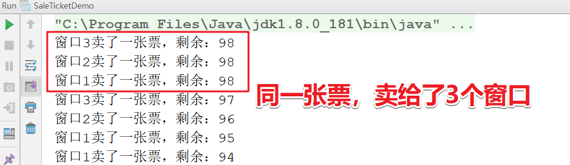

这也是超买的的现象，为什么会出现这种情况呢？要从jvm的内存模型设计开始。

### 2.2 JMM内存模型

```
Java内存模型(即Java Memory Model，简称JMM)。 
	JMM本身是一种抽象的概念，并不真实存在，它描述的是一组规则或规范，通过这组规范定义了程序中各个变量（包括实例字段，静态字段和构成数组对象的元素）的访问方式。由于JVM运行程序的实体是线程，而每个线程创建时JVM都会为其创建一个工作内存(有些地方称为栈空间)，用于存储线程私有的数据。而Java内存模型中规定所有变量都存储在主内存，主内存是共享内存区域，所有线程都可以访问。
	线程对变量的操作(读取赋值等)必须在工作内存中进行，首先要将变量从主内存拷贝的自己的工作内存空间，然后对变量进行操作，操作完成后再将变量写回主内存，不能直接操作主内存中的变量，工作内存中存储着主内存中的变量副本拷贝，前面说过，工作内存是每个线程的私有数据区域，因此不同的线程间无法访问对方的工作内存，线程间的通信(传值)必须通过主内存来完成，其简要访问过程如下图：
```

 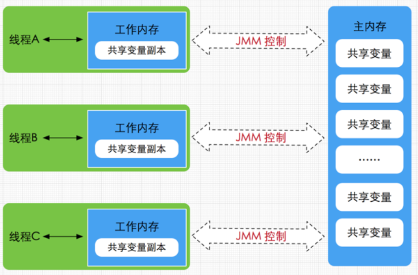


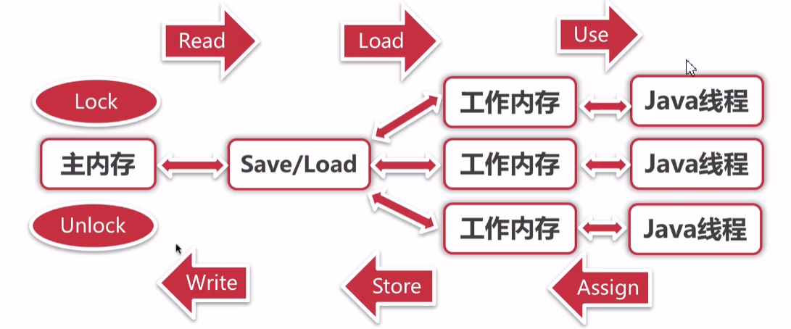

```
1. lock(锁定)：作用于主内存的变量，把一个变量标记为一条线程独占状态

2. unlock(解锁)：作用于主内存的变量，把一个处于锁定状态的变量释放出来，释放后的变量才可以被其他线程锁定

3. read(读取)：作用于主内存的变量，把一个变量值从主内存传输到线程的工作内存中，以便随后的load动作使用

4. load(载入)：作用于工作内存的变量，它把read操作从主内存中得到的变量值放入工作内存的变量副本中

5. use(使用)：作用于工作内存的变量，把工作内存中的一个变量值传递给执行引擎

6. assign(赋值)：作用于工作内存的变量，它把一个从执行引擎接收到的值赋给工作内存的变量

7. store(存储)：作用于工作内存的变量，把工作内存中的一个变量的值传送到主内存中，以便随后的write的操作

8. write(写入)：作用于工作内存的变量，它把store操作从工作内存中的一个变量的值传送到主内存的变量中
```

```
小结:
	如果要把一个变量从主内存中复制到工作内存中，就需要按顺序地执行read和load操作，如果把变量从工作内存中同步到主内存中，就需要按顺序地执行store和write操作。但Java内存模型只要求上述操作必须按顺序执行，而没有保证必须是连续执行。

面试区分:
	需要注意的是，JMM与Java内存区域的划分是不同的概念层次，更恰当说JMM描述的是一组规则，通过这组规则控制程序中各个变量在共享数据区域和私有数据区域的访问方式。
	JMM是围绕原子性，有序性、可见性展开的。JMM与Java内存区域唯一相似点，都存在共享数据区域和私有数据区域，在JMM中主内存属于共享数据区域，从某个程度上讲应该包括了堆和方法区，而工作内存数据线程私有数据区域，从某个程度上讲则应该包括程序计数器、虚拟机栈以及本地方法栈。或许在某些地方，我们可能会看见主内存被描述为堆内存，工作内存被称为线程栈，实际上他们表达的都是同一个含义。
```

### 2.3 java并发编程三大特性

```
正因为有了JMM内存模型，以及java语言的设计，所以在并发编程当中我们可能会经常遇到下面几种问题。
这几种问题 我们称为并发编程的三大特性：
```

#### 2.3.1 原子性

```
原子性，即一个操作或多个操作，要么全部执行并且在执行的过程中不被打断，要么全部不执行。（提供了互斥访问，在同一时刻只有一个线程进行访问）

互斥锁：这种线程一旦得到锁，其他需要锁的线程就会阻塞等待锁的释放  （悲观锁）

CAS操作的就是乐观锁，每次不加锁而是假设没有冲突而去完成某项操作，如果因为冲突失败就重试，直到成功为止。


1、synchronized （互斥锁）    
2、Lock（互斥锁）


3、原子类（CAS 乐观锁）
```

#### 2.3.2 可见性

```
当多个线程访问同一个变量时，一个线程修改了这个变量的值，其他线程能够立即看得到修改的值。
若两个线程在不同的cpu，那么线程1改变了i的值还没刷新到主存，线程2又使用了i，那么这个i值肯定还是之前的，线程1对变量的修改线程没看到这就是可见性问题。 
```

```java
// 演示可见性的案例
public class C2_线程安全_可见性案例 {
    private static boolean flag = false;
    public static void main(String[] args) throws InterruptedException {
        new Thread(()->{
            System.out.println("1号线程启动 执行while循环");
            long num =0;
            while (!flag){
                num++;
            }
            System.out.println("num = " + num);
        }).start();

        Thread.sleep(1000);

        new Thread(()->{
            System.out.println("2号线程启动 更改变量 flag为true");
            setStop();
        }).start();
    }

    private static void setStop(){
        flag = true;
    }
}

```

```
已经将结果设置为fasle为什么？还一直在运行呢。
原因:线程之间是不可见的，读取的是副本，没有及时读取到主内存结果。

使用： volatile  关键字即可保证变量的可见性
```

#### 2.3.3 有序性

```
程序执行的顺序按照代码的先后顺序执行。
一般来说处理器为了提高程序运行效率，可能会对输入代码进行优化，它不保证程序中各个语句的执行先后顺序同代码中的顺序一致，但是它会保证程序最终执行结果和代码顺序执行的结果是一致的。如下：

int a = 10;    //语句1
a = a + 3;    //语句2
int r = 2;    //语句W3
 r = a*a;     //语句4   

则因为指令重排序(happen-before)，他还可能执行顺序为 2-1-3-4，1-3-2-4
但绝不可能 2-1-4-3，因为这打破了依赖关系。
显然重排序对单线程运行是不会有任何问题，而多线程就不一定了，所以我们在多线程编程时就得考虑这个问题了。
```

```java
// 演示有序性的案例
public class C3_线程安全_有序性 {
    public static void main(String[] args) throws InterruptedException {
        for(int i=0;i<500000;i++){
C3_线程安全_有序性.State state = new C3_线程安全_有序性.State();
            ThreadA threadA=new ThreadA(state);
            ThreadB threadB=new ThreadB(state);
            threadA.start();
            threadB.start();
            threadA.join();
            threadB.join();
        }
    }
    static class ThreadA extends Thread{
        private final C3_线程安全_有序性.State state;
        ThreadA(C3_线程安全_有序性.State state) {
            this.state = state;
        }
        public void run(){
            state.a=1;
            state.b=1;
            state.c=1;
            state.d=1;
        }
    }
    static class ThreadB extends Thread{
        private final C3_线程安全_有序性.State state;
        ThreadB(C3_线程安全_有序性.State state) {
            this.state = state;
        }
        public void run(){
            if(state.b==1 && state.a==0){
                System.out.println("b==1");
            }
            if(state.c==1 && (state.b==0 || state.a == 0)){
                System.out.println("c==1");
            }
            if(state.d==1 && (state.a==0 || state.b==0 || state.c==0)){
                System.out.println("d==1");
            }
        }
    }
    static class State {
        public  int a = 0;
        public  int b = 0;
        public  int c = 0;
        public  int d = 0;
    }
}
```


### 2.4 volatile  

```
volatile 关键字的作用是变量在多个线程之间可见。并且能够保证所修饰变量的有序性：

1、 保证变量的可见性：当一个被volatile关键字修饰的变量被一个线程修改的时候，其他线程可以立刻得到修改之后的结果。当一个线程向被volatile关键字修饰的变量写入数据的时候，虚拟机会强制它被值刷新到主内存中。当一个线程用到被volatile关键字修饰的值的时候，虚拟机会强制要求它从主内存中读取。


2、 屏蔽指令重排序：指令重排序是编译器和处理器为了高效对程序进行优化的手段，它只能保证程序执行的结果时正确的，但是无法保证程序的操作顺序与代码顺序一致。这在单线程中不会构成问题，但是在多线程中就会出现问题。非常经典的例子是在单例方法中同时对字段加入volatile，就是为了防止指令重排序。
```

```java
1.状态标记量

2.单例双检锁
class Singleton{
    private volatile static Singleton instance = null;
    private Singleton() {
    }
    public static Singleton getInstance() {
        if(instance==null) {
            synchronized (Singleton.class) {
                if(instance==null)
                    instance = new Singleton();
            }
        }
        return instance;
    }
}
```


### 2.5 synchronized

```
关键字synchronized可以保证在同一时刻，只有一个线程可以执行某个方法或某个代码块，同时synchronized可以保证一个线程的变化可见（可见性），即可以代替volatile
```

#### 2.5.1 使用方法

```
1.普通同步方法（实例方法），锁是当前实例对象 ，进入同步代码前要获得当前实例的锁
2.静态同步方法，锁是当前类的class对象 ，进入同步代码前要获得当前类对象的锁
3.同步方法块，锁是括号里面的对象，对给定对象加锁，进入同步代码库前要获得给定对象的锁
```

```java
/**
 * 需求：我们来模拟电影院的售票窗口，实现多个窗口同时卖“速度与激情8”这场电影票(多个窗口一起卖这100张票)。
 * 分析: 多个窗口相当于多线程, 每个窗口做的事情是一样的,卖100张票(任务放到Runnable中)
 */
public class C1_线程安全_售票案例_syn {
    // 总票数
    static  int ticket = 100;
    public static void main(String[] args) {
        Object o1 = new Object();
        Runnable runnable = () ->{
            // 循环买票
            while (true){
                try {
                    Thread.sleep(1);
                } catch (InterruptedException e) {
                    e.printStackTrace();
                }
                synchronized (o1){
                    if (ticket > 0) {
                        ticket--;
                        System.out.println(Thread.currentThread().getName()+
                                "卖了一张票，剩余：" + ticket);
                    } else {
                        // 票没了
                        break;
                    }
                }
            }
        };

        // 创建3个线程
        Thread t1 = new Thread(runnable,"窗口1");
        Thread t2 = new Thread(runnable,"窗口2");
        Thread t3 = new Thread(runnable,"窗口3");
        t1.start();
        t2.start();
        t3.start();
    }
 }
```

#### 2.5.2 工作原理

```
JVM 是通过进入、退出对象监视器( Monitor )来实现对方法、同步块的同步的。
具体实现是在编译之后在同步方法调用前加入一个 monitor.enter 指令，在退出方法和异常处插入  monitor.exit 的指令。
其本质就是对一个对象监视器( Monitor )进行获取，而这个获取过程具有排他性从而达到了同一时刻只能一个线程访问的目的。
而对于没有获取到锁的线程将会阻塞到方法入口处，直到获取锁的线程 monitor.exit 之后才能尝试继续获取锁。
```

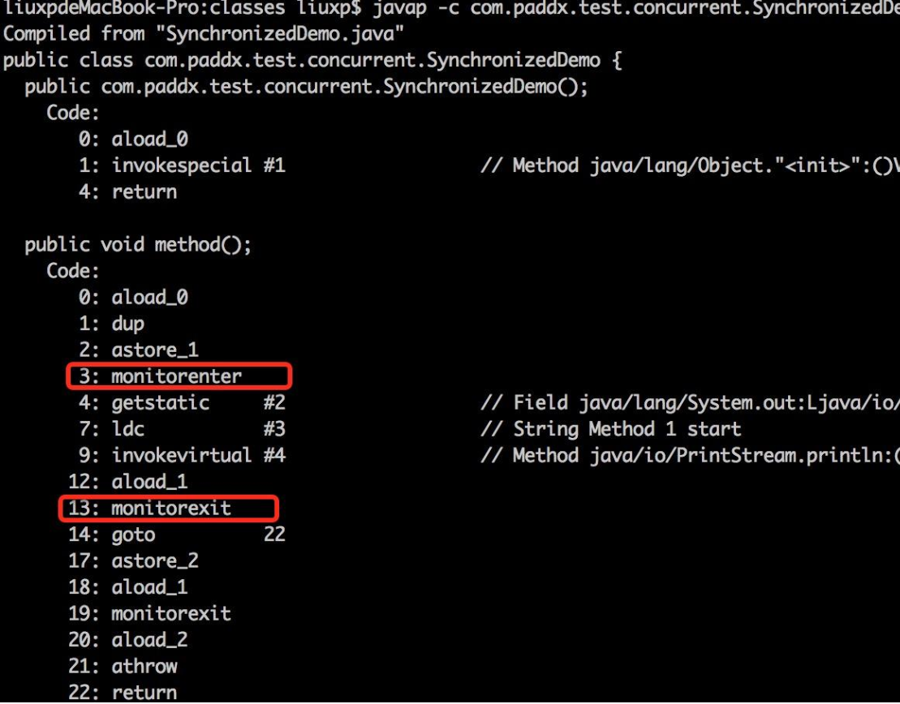

​	

```
在头部信息中可以存储锁的相关信息，所以使用synchronized关键字必须有对象作为锁。


对象头    锁  001    类的信息    GC年龄  hashcode

实例数据   id=1  name=xiaoming

对其填充   8B   60B + 4B 
```

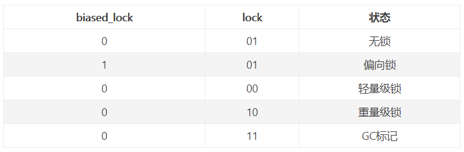


```java

static class A{
        public static void main(String[] args) {
            A a = new A();
            
            a.fun1();
            
            a.fun2();
            
            A.fun3();
        }
    // this
        public synchronized void fun1(){
            // 代码1
        }
        public synchronized void fun2(){
            // 代码2
        }
    // 类.class对象
        public synchronized static void fun3(){
        }
}
```

```
小结：

注意:
对象如同锁，持有锁的线程可以在同步中执行 
没持有锁的线程即使获取CPU的执行权，也进不去 

同步的前提： 
1.必须要有两个或者两个以上的线程 
2.必须是多个线程使用同一个锁 


优缺点：
好处：解决了多线程的安全问题 
弊端：多个线程需要判断锁，较为消耗资源、抢锁的资源。 

修饰方法注意点：
**synchronized 修饰方法使用锁是当前this锁。**
**synchronized 修饰静态方法使用锁是当前类的字节码对象**
```

#### 2.5.3 多线程死锁 

```java
public class C4_线程安全_死锁 {
    public static void main(String[] args) throws InterruptedException {
        Object o1 = new Object();//一号锁
        Object o2 = new Object();//二号锁
        new Thread(()->{
            synchronized (o1){//获取o1锁
                try {
                    Thread.sleep(1000);
                    synchronized (o2){//获取o2锁
                        System.out.println("线程1执行");
                    }
                } catch (InterruptedException e) {
                    e.printStackTrace();
                }
            }
        }).start();
        new Thread(()->{
            synchronized (o2){//获取o2锁
                try {
                    Thread.sleep(1000);
                    synchronized (o1){//获取o1锁
                        System.out.println("线程2执行");
                    }
                } catch (InterruptedException e) {
                    e.printStackTrace();
                }
            }
        }).start();
    }
}
```

### 2.6 J.U.C   之lock锁  java utils concurrent

```
在 jdk1.5 之后，并发包中新增了 Lock 接口(以及相关实现类)用来实现锁功能，Lock 接口提供了与 synchronized 关键字类似的同步功能，但需要在使用时手动获取锁和释放锁。
```

#### 2.6.1 lock锁用法

```java
  Lock lock  = new ReentrantLock();

  lock.lock();
  try{
	//可能会出现线程安全的操作
     
  }finally{
	//一定在finally中释放锁
	//也不能把获取锁在try中进行，因为有可能在获取锁的时候抛出异常
    lock.unlock();
  }
```

#### 2.6.2 案例演示

```java
public class C1_线程安全_售票案例_lock {
    // 总票数
    static  int ticket = 100;
    public static void main(String[] args) {
        ReentrantLock lock = new ReentrantLock();
        Runnable runnable = () -> {
            // 循环买票
            while (true) {
                lock.lock();
                try {
                    Thread.sleep(10);
                    // 获得锁
                    if (ticket > 0) {
                        ticket--;
                        System.out.println(Thread.currentThread().getName() +
                                "卖了一张票，剩余：" + ticket);
                    } else {
                        break;
                    }

                } catch (InterruptedException e) {
                    e.printStackTrace();
                } finally {
                    // 释放锁
                    lock.unlock();
                }
            }
        };

        // 创建3个线程
        Thread t1 = new Thread(runnable, "窗口1");
        Thread t2 = new Thread(runnable, "窗口2");
        Thread t3 = new Thread(runnable, "窗口3");
        t1.start();
        t2.start();
        t3.start();
    }
 }
```

**提供trylock尝试获取锁的方案**

```java
public class C4_线程安全_Lock锁 {
    private ArrayList<Integer> arrayList = new ArrayList<Integer>();
    private Lock lock = new ReentrantLock();    //注意这个地方
    public static void main(String[] args)  {
        final C4_线程安全_Lock锁 test = new C4_线程安全_Lock锁();
         
        new Thread(){
            public void run() {
                test.insert(Thread.currentThread());
            };
        }.start();
         
        new Thread(){
            public void run() {
                test.insert(Thread.currentThread());
            };
        }.start();
    }    
    public void insert(Thread thread) {
        if(lock.tryLock()) {
            try {
                System.out.println(thread.getName()+"得到了锁");
                Thread.sleep(2000);
                for(int i=0;i<5;i++) {
                    arrayList.add(i);
                }
            } catch (Exception e) {
                // TODO: handle exception
            }finally {
                System.out.println(thread.getName()+"释放了锁");
                lock.unlock();
            }
        } else {
            System.out.println(thread.getName()+"获取锁失败");
        }
    }
}
```

**支持读写锁**

```java
public class C4_线程安全_Lock锁3{
    private ReentrantReadWriteLock rwl = new ReentrantReadWriteLock();
    public static void main(String[] args)  {
        final C4_线程安全_Lock锁3 test = new C4_线程安全_Lock锁3();
        new Thread(){
            public void run() {
                test.get(Thread.currentThread());
            };
        }.start();
        new Thread(){
            public void run() {
                test.get(Thread.currentThread());
            };
        }.start();
    }
    public  void get(Thread thread) {
        rwl.readLock().lock();
        try {
            for (int i = 0; i < 20; i++) {
                try {
                    Thread.sleep(500);
                } catch (InterruptedException e) {
                    e.printStackTrace();
                }
                System.out.println(thread.getName()+"正在进行读操作");
            }
            System.out.println(thread.getName()+"读操作完毕");
        } finally {
            rwl.readLock().unlock();
        }
    }
}
```

#### 2.6.3 lock与synchronized区别

```
1）Lock是一个接口，而synchronized是Java中的关键字，synchronized是内置的语言实现；
   synchronized关键字可以直接修饰方法，也可以修饰代码块， 而lock只能修饰代码块
   
2）synchronized在发生异常时，会自动释放线程占有的锁，因此不会导致死锁现象发生；而Lock在发生异常时，如果没有主动通过unLock()去释放锁，则很可能造成死锁现象，因此使用Lock时需要在finally块中释放锁；

3）Lock可以让等待锁的线程响应中断，而synchronized却不行，使用synchronized时，等待的线程会一直等待下去，不能够响应中断；

4）通过Lock可以知道有没有成功获取锁，而synchronized却无法办到。(提供tryLock)

5）Lock可以提高多个线程进行读操作的效率。(提供读写锁)

在性能上来说，如果竞争资源不激烈，两者的性能是差不多的，而当竞争资源非常激烈时（即有大量线程同时竞争），此时Lock的性能要远远优于synchronized。所以说，在具体使用时要根据适当情况选择。
```


### 2.7 ThreadLocal  线程局部变量

```
ThreadLocal叫做线程变量，意思是ThreadLocal中填充的变量属于当前线程，该变量对其他线程而言是隔离的。ThreadLocal为变量在每个线程中都创建了一个副本，那么每个线程可以访问自己内部的副本变量。

主要应用场景: 
1、在进行对象跨层传递的时候，使用ThreadLocal可以避免多次传递，打破层次间的约束。

存储用户登录信息
L1  T1   .user1      controller      service    dao   ThreadLocal  

L2  T2   .user2     controller  service     ThreadLocal.user2
2、线程间数据隔离

3、进行事务操作，用于存储线程事务信息。

4、数据库连接，Session会话管理。 
```


### 2.8 CAS JAVA乐观锁实现  

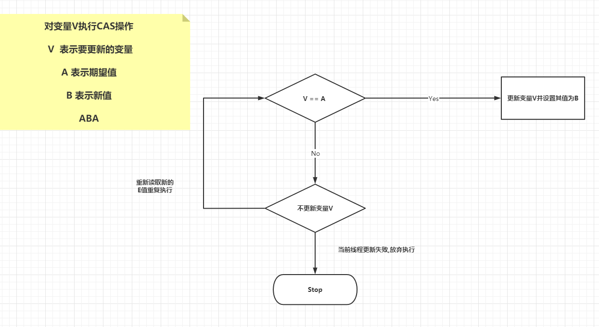

```
CAS是英文单词Compare And Swap的缩写，翻译过来就是比较并替换。

CAS机制当中使用了3个基本操作数：内存地址V，旧的预期值A，要修改的新值B。

更新一个变量的时候，只有当变量的预期值A和内存地址V当中的实际值相同时，才会将内存地址V对应的值修改为B。

看到这 有没有感觉和我们在数据库中通过version实现乐观锁比较像呢~~ CAS是通过java中 unsafe类中的代码实现,   native boolean compareAndSwapInt 
 
可以看到 方法是由native修饰的，也是通过底层C++代码实现的。 并且unsafe中的方法中有安全限制，我们是无法直接调用的。  我可以通过调用封装好的一些原子类 

如: AtomicInteger int类型的原子类， 提供int的修改原子操作。

ABA问题：
因为CAS需要在操作值的时候检查下值有没有发生变化，如果没有发生变化则更新，但是如果一个值原来是A，变成了B，又变成了A，那么使用CAS进行检查时会发现它的值没有发生变化，但是实际上却变化了。
```

## 3.并发编程之J.U.C - 线程池API

处理大量任务: 

2000任务


8线程


for(2000){

   2000 线程

}


 

### 3.1 什么是线程池

```
Java中的线程池是运用场景最多的并发框架，几乎所有需要异步或并发执行任务的程序
都可以使用线程池。在开发过程中，合理地使用线程池能够带来3个好处。

第一：降低资源消耗。通过重复利用已创建的线程降低线程创建和销毁造成的消耗。
第二：提高响应速度。当任务到达时，任务可以不需要等到线程创建就能立即执行。
第三：提高线程的可管理性。线程是稀缺资源，如果无限制地创建，不仅会消耗系统资源，
还会降低系统的稳定性，使用线程池可以进行统一分配、调优和监控。但是，要做到合理利用
线程池，必须对其实现原理了如指掌。
```

### 3.2 线程池作用

```
线程池是为突然大量爆发的线程设计的，通过有限的几个固定线程为大量的操作服务，减少了创建和销毁线程所需的时间，从而提高效率。

如果一个线程的时间非常长，就没必要用线程池了(不是不能作长时间操作，而是不宜。)，况且我们还不能控制线程池中线程的开始、挂起、和中止。
```

### 3.3 线程池体系结构

```
java.util.concurrent.Executor 负责线程的使用和调度的根接口
		|--ExecutorService 子接口： 线程池的主要接口
				|--ThreadPoolExecutor 线程池的实现类
				|--ScheduledExceutorService 子接口： 负责线程的调度
					|--ScheduledThreadPoolExecutor : 继承ThreadPoolExecutor，实现了ScheduledExecutorService
			
工具类 ： Executors
Executors.newFixedThreadPool() : 
创建固定大小的线程池
Executors.newCachedThreadPool() : 
缓存线程池，线程池的数量不固定，可以根据需求自动的更改数量。
Executors.newSingleThreadExecutor() : 
创建单个线程池。 线程池中只有一个线程ScheduledExecutorService Executors.newScheduledThreadPool() : 
创建固定大小的线程，可以延迟或定时的执行任务
```

| 关键类或接口                       | 含义                                                         |
| ---------------------------------- | ------------------------------------------------------------ |
| **Executor**                       | 是一个接口，它是Executor框架的基础，<br>它将任务的提交与任务的执行分离开来 |
| **ExecutorService**                | 线程池的主要接口,是Executor的子接口                          |
| **ThreadPoolExecutor**             | 是线程池的核心实现类，用来执行被提交的任务                   |
| **ScheduledThreadPoolExecutor**    | 另一个关键实现类，可以进行延迟或者定期执行任务。ScheduledThreadPoolExecutor比Timer定时器更灵活，<br>功能更强大 |
| Future接口与FutureTask实现类       | 代表异步计算的结果                                           |
| Runnable接口和Callable接口的实现类 | 都可以被ThreadPoolExecutor或<br>ScheduledThreadPoolExecutor执行的任务 |
| **Executors**                      | 线程池的工具类，可以快捷的创建线程池                         |

#### 3.3.1 Executor

```
线程池就是线程的集合，线程池集中管理线程，以实现线程的重用，降低资源消耗，提高响应速度等。线程用于执行异步任务，单个的线程既是工作单元也是执行机制，从JDK1.5开始，为了把工作单元与执行机制分离开，Executor框架诞生了，它是一个用于统一创建任务与运行任务的接口。框架就是异步执行任务的线程池框架。
```

#### 3.3.2 ThreadPoolExecutor

```
Executor框架的最核心实现是ThreadPoolExecutor类，通过传入不同的参数，就可以构造出适用于不同应用场景下的线程池，那么它的底层原理是怎样实现的呢，下面就来介绍下ThreadPoolExecutor线程池的运行过程。
```

**核心构造器参数**

| 组件                         | 含义                                                         |
| ---------------------------- | ------------------------------------------------------------ |
| **int corePoolSize**         | 核心线程池的大小                                             |
| **int maximumPoolSize**      | 最大线程池的大小                                             |
| **BlockingQueue workQueue**  | 用来暂时保存任务的工作队列                                   |
| **RejectedExecutionHandler** | 当ThreadPoolExecutor已经关闭或ThreadPoolExecutor已经饱和时(达到了最大线程池的大小且工作队列已满)，execute()方法将要调用的Handler |
| long keepAliveTime,          | 表示空闲线程的存活时间。                                     |
| TimeUnit                     | 表示keepAliveTime的单位。                                    |
| ThreadFactory threadFactory  | 指定创建线程的线程工厂                                       |

```java
public class E1_线程池_线程池运行原理{
    public static void main(String[] args) {
       ThreadPoolExecutor executor = new ThreadPoolExecutor(
               2,
               5,
               10,
               TimeUnit.SECONDS,
               new ArrayBlockingQueue<Runnable>(10),
               new ThreadPoolExecutor.AbortPolicy());
        for (int i = 0; i < 20; i++) {
            try {
                executor.execute(new MyRunnable("第"+(i+1)+"号线程"));
            } catch (Throwable e) {
                System.out.println("丢弃任务: " + (i+1) );
            }
        }
    }
    static class MyRunnable implements Runnable{
        private String name;
        public MyRunnable(String name) {
            this.name = name;
        }
        @Override
        public void run() {
            System.out.println(name);
            while (true){
                //让线程一直执行
            }
        }
    }
}
```

**线程池的三种队列**

**1.SynchronousQueue**

```
SynchronousQueue没有容量，是无缓冲等待队列，是一个不存储元素的阻塞队列，会直接将任务交给消费者，必须等队列中的添加元素被消费后才能继续添加新的元素。
使用SynchronousQueue阻塞队列一般要求maximumPoolSizes为无界，避免线程拒绝执行操作。
```

**2.LinkedBlockingQueue**

```
LinkedBlockingQueue是一个无界缓存等待队列。当前执行的线程数量达到corePoolSize的数量时，剩余的元素会在阻塞队列里等待。（所以在使用此阻塞队列时maximumPoolSizes就相当于无效了），每个线程完全独立于其他线程。生产者和消费者使用独立的锁来控制数据的同步，即在高并发的情况下可以并行操作队列中的数据。
```

**3.ArrayBlockingQueue**

```
ArrayBlockingQueue是一个有界缓存等待队列，可以指定缓存队列的大小，当正在执行的线程数等于corePoolSize时，多余的元素缓存在ArrayBlockingQueue队列中等待有空闲的线程时继续执行，当ArrayBlockingQueue已满时，加入ArrayBlockingQueue失败，会开启新的线程去执行，当线程数已经达到最大的maximumPoolSizes时，再有新的元素尝试加入ArrayBlockingQueue时会报错。
```

```java
public static void main(String[] args) {
        BlockingQueue<Integer> queue = new SynchronousQueue<>();
        //生产者线程
        Thread t1 = new Thread(()->{
            for (int i=0;i<20;i++){
                try {
                    System.out.println("装入数据:" + i);
                    queue.put(i);
                } catch (InterruptedException e) {
                    e.printStackTrace();
                }
            }
        });
        //消费者线程
        Thread t2 = new Thread(()->{
            while (true){
                try {
                    System.out.println("2秒后取数据");
                    Thread.sleep(2000);
                } catch (InterruptedException e) {
                    e.printStackTrace();
                }
                try {
                    System.out.println(queue.take());
                } catch (InterruptedException e) {
                    e.printStackTrace();
                }
            }
        });
        t1.start();
        t2.start();
    }
```

#### 3.3.3 线程池原理剖析

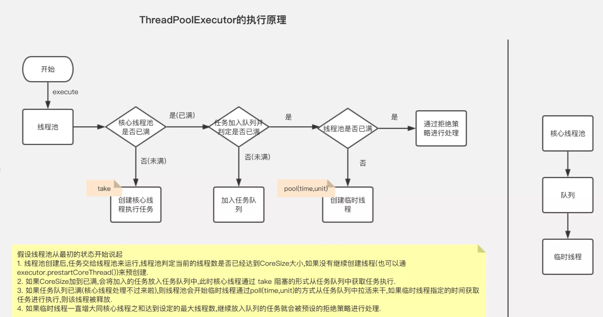

```
提交一个任务到线程池中，线程池的处理流程如下：

1、判断线程池里的核心线程是否都在执行任务，如果不是（核心线程空闲或者还有核心线程没有被创建）则创建一个新的工作线程来执行任务。如果核心线程都在执行任务，则进入下个流程。

2、线程池判断工作队列是否已满，如果工作队列没有满，则将新提交的任务存储在这个工作队列里。如果工作队列满了，则进入下个流程。

3、判断线程池里的线程是否都处于工作状态，如果没有，则创建一个新的工作线程来执行任务。如果已经满了，则交给饱和策略来处理这个任务。


```

### 3.4 Executors线程池工具类

```
Executors是线程池的工具类，提供了四种快捷创建线程池的方法：
newCachedThreadPool
创建一个可缓存线程池，如果线程池长度超过处理需要，可灵活回收空闲线程，若无可回收，则新建线程。
newFixedThreadPool 
创建一个定长线程池，可控制线程最大并发数，超出的线程会在队列中等待。
newSingleThreadExecutor 
创建一个单线程化的线程池，它只会用唯一的工作线程来执行任务，保证所有任务按照指定顺序(FIFO, LIFO, 优先级)执行。
newScheduledThreadPool 创建一个定长线程池，支持延时的处理及周期性任务执行。
```

#### 3.4.1 newCachedThreadPool

创建一个可缓存线程池，如果线程池长度超过处理需要，可灵活回收空闲线程，若无可回收，则新建线程。示例代码如下：

```java
// 无限大小线程池 jvm自动回收
public static void main(String[] args) {
        // 创建线程池
        ExecutorService es = Executors.newCachedThreadPool();
        // 会创建出10个线程   分别执行任务
        for (int i = 0; i < 10; i++) {
            es.execute(()->{
                for (int j = 0; j < 10; j++) {
                    try {
                        Thread.sleep(100);
                    } catch (InterruptedException e) {
                        e.printStackTrace();
                    }
                    System.out.println(Thread.currentThread().getName() + ":" + j);
                }
            });
        }
        es.shutdown();
}

```

 

**总结: **线程池为无限大，当执行第二个任务时第一个任务已经完成，会复用执行第一个任务的线程，而不用每次新建线程。

```java
public static ExecutorService newCachedThreadPool() {
        return new ThreadPoolExecutor(0, Integer.MAX_VALUE,
                                      60L, TimeUnit.SECONDS,
                                      new SynchronousQueue<Runnable>());
}

```


#### 3.4.2 newFixedThreadPool

创建一个定长线程池，可控制线程最大并发数，超出的线程会在队列中等待。示例代码如下：

```java
public static void main(String[] args) {
        // 创建线程池
        ExecutorService es = Executors.newFixedThreadPool(2);
        // 会创建出10个线程   分别执行任务
        for (int i = 0; i < 10; i++) {
            es.execute(()->{
                try {
                    Thread.sleep(400);
                } catch (InterruptedException e) {
                    e.printStackTrace();
                }
                for (int j = 0; j < 10; j++) {
                    System.out.println(Thread.currentThread().getName() + ":" + j);
                }
            });
        }
        es.shutdown();
}
```

**定长线程池的大小最好根据系统资源进行设置。如Runtime.getRuntime().availableProcessors()**

```java
public static ExecutorService newFixedThreadPool(int nThreads) {
        return new ThreadPoolExecutor(nThreads, nThreads,
                                      0L, TimeUnit.MILLISECONDS,
                                      new LinkedBlockingQueue<Runnable>());
}
```

#### 3.4.4 newSingleThreadExecutor

创建一个单线程化的线程池，它只会用唯一的工作线程来执行任务，保证所有任务按照指定顺序(FIFO, LIFO, 优先级)执行。示例代码如下：

```java
public static void main(String[] args) {
        // 创建线程池
        ExecutorService es = Executors.newSingleThreadExecutor();
        // 会创建出10个线程   分别执行任务
        for (int i = 0; i < 10; i++) {
            es.execute(()->{
                try {
                    Thread.sleep(400);
                } catch (InterruptedException e) {
                    e.printStackTrace();
                }
                for (int j = 0; j < 10; j++) {
                    System.out.println(Thread.currentThread().getName() + ":" + j);
                }
            });
        }
        es.shutdown();
    }
```

**注意: 结果依次输出，相当于顺序执行各个任务。**

```java
public static ExecutorService newSingleThreadExecutor() {
        return new FinalizableDelegatedExecutorService
            (new ThreadPoolExecutor(1, 1,
                                    0L, TimeUnit.MILLISECONDS,
                                    new LinkedBlockingQueue<Runnable>()));
}
```

#### 3.4.3 newScheduledThreadPool

**创建一个定长线程池，支持定时及周期性任务执行。延迟执行示例代码如下：**

```java
public static void scheduledExecutor(){
        ScheduledExecutorService newScheduledThreadPool = Executors.newScheduledThreadPool(5);
        newScheduledThreadPool.scheduleAtFixedRate(new Runnable() {
            public void run() {
                System.out.println("i:" + 1);
            }
        }, 3, 2,TimeUnit.SECONDS);
    }
```

```java
// 调度线程池 的核心实现类， 它是ThreadPoolExecutor的子类
// ScheduledExecutorService 接口也是 ExecutorService的子接口
public class ScheduledThreadPoolExecutor
        extends ThreadPoolExecutor
        implements ScheduledExecutorService 
```

```java
// 构建方法也是通过ThreadPoolExecutor构建
public ScheduledThreadPoolExecutor(int corePoolSize) {
        super(corePoolSize, Integer.MAX_VALUE, 0, NANOSECONDS,
              new DelayedWorkQueue());
    }
```

## 4.并发编程之线程间的通信

### 4.1 什么是多线程之间通信

```
多个线程在处理同一个资源，并且任务不同时，需要线程通信来帮助解决线程之间对同一个变量的使用或操作。
于是我们引出了等待唤醒机制：（wait()、notify()）


wait()、notify()、notifyAll()是三个定义在Object类里的方法，可以用来控制线程的状态。

这三个方法最终调用的都是jvm级的native方法。随着jvm运行平台的不同可能有些许差异。

如果对象调用了wait方法就会使持有该对象的线程把该对象的控制权交出去，然后处于等待状态。

如果对象调用了notify方法就会通知某个正在等待这个对象的控制权的线程可以继续运行。

如果对象调用了notifyAll方法就会通知所有等待这个对象控制权的线程继续运行。

　　 注意: wait()方法的调用必须放在synchronized方法或synchronized块中。 
　　 

```

### 4.2 wait与sleep区别

```
对于sleep()方法，我们首先要知道该方法是属于Thread类中的。而wait()方法，则是属于Object类中的。

sleep()方法导致了程序暂停执行指定的时间，让出cpu该其他线程，但是他的监控状态依然保持者，当指定的时间到了又会自动恢复运行状态。

在调用sleep()方法的过程中，线程不会释放对象锁。

而当调用wait()方法的时候，线程会放弃对象锁，进入等待此对象的等待锁定池，只有针对此对象调用notify()方法后本线程才进入对象锁定池准备

获取对象锁进入运行状态。

```


### 4.3 实战面试题 （了解笔试题）

#### 4.3.1 两个线程，交替打印1~100  A线程负责打印奇数   B线程负责打印偶数。

**实现效果**

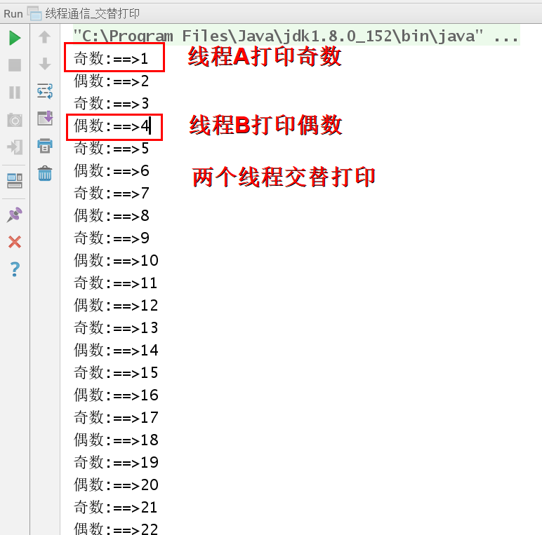

**案例代码**

```java
/**
 * 使用wait 和 notify实现两个线程 交替打印1到100
 * 一个线程专门打印奇数
 * 一个线程专门打印偶数
 冒泡
 二分
 单例: 
 线程:
 */
public class D1_线程通信_交替打印案例 {
    public static void main(String[] args) {
        NumberMode numberMode = new NumberMode();
        new Thread(new PrintJiNum(numberMode)).start(); //启动奇数线程
        new Thread(new PrintOuNum(numberMode)).start(); //启动偶数线程
    }

    static class NumberMode {
        public int num = 1;
    }

    static class PrintJiNum implements Runnable{//奇数线程任务
        NumberMode numberMode;
        public PrintJiNum(NumberMode numberMode) {
            this.numberMode = numberMode;
        }

        @Override
        public void run() {
            while (numberMode.num<100){
                synchronized (numberMode){
                    if(numberMode.num%2!=0){
                        //打印奇数
                        System.out.println("奇数:"+numberMode.num);
                        numberMode.num++;
                        numberMode.notify();
                    }else {
                        try {
                            System.out.println("奇数线程休息");
                            numberMode.wait();
                        } catch (InterruptedException e) {
                            e.printStackTrace();
                        }

                    }
                }
            }
        }
    }

    static class PrintOuNum implements Runnable{//偶数线程任务
        NumberMode numberMode;
        public PrintOuNum(NumberMode numberMode) {
            this.numberMode = numberMode;
        }

        @Override
        public void run() {
            while (numberMode.num<100){
                synchronized (numberMode){
                    if(numberMode.num%2==0){
                        //打印奇数
                        System.out.println("偶数:"+numberMode.num);
                        numberMode.num++;
                        numberMode.notify();
                    }else {
                        try {
                            System.out.println("偶数线程休息");
                            numberMode.wait();
                        } catch (InterruptedException e) {
                            e.printStackTrace();
                        }
                    }
                }
            }
        }
    }
}
```


#### 4.3.2 多线程实现生产消费者模式(wait、notify实现)

**生产消费模式概念**

```
生产者消费者模式是并发、多线程编程中经典的设计模式，生产者和消费者通过分离的执行工作解耦，简化了开发模式，生产者和消费者可以以不同的速度生产和消费数据。

生产者消费者模式的好处：
1. 它简化的开发，你可以独立地或并发的编写消费者和生产者，它仅仅只需知道共享对象是谁
2. 生产者不需要知道谁是消费者或者有多少消费者，对消费者来说也是一样
3. 生产者和消费者可以以不同的速度执行
4. 分离的消费者和生产者在功能上能写出更简洁、可读、易维护的代码

```


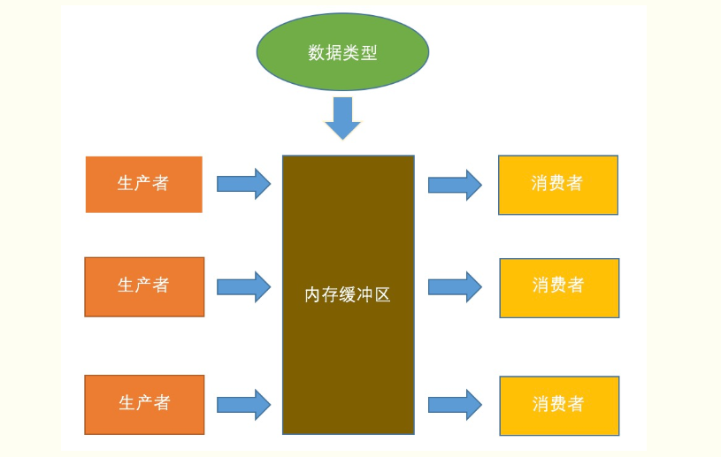

 

```
经典 生产消费者面试题 (wait、notify 实现)
* 生产线加工生产汽车
* 4S店 存放生产的汽车  4  0
* 消费者在4S店购买汽车

```

**设计思路**

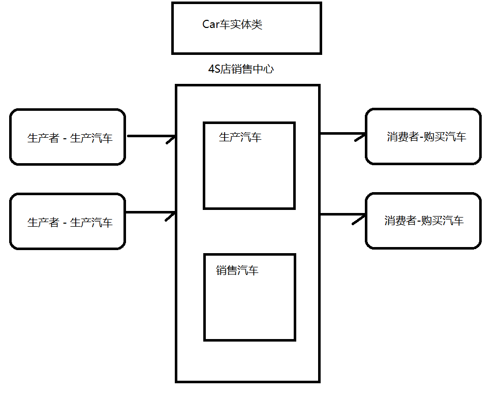

**代码实现**

```java
/**
    经典 生产消费者面试题 (wait、notify 实现)
 * 4S店存放生产的汽车
 * 生产者线程生产汽车
 * 消费者线程购买汽车
 *
 * 4S店最多只能存放4台车，如果达到4台车生产者停止生产
 * 如果4S店没有库存车，消费需等待有库存后，方可购买
 */
public class D2_线程通信_生产消费4S店案例 {
    static final int CAR_STORE_NUM = 4;
    static  int CAR_NUM = 1;
    public static void main(String[] args) {
        Car4S car4S = new Car4S();
        Thread product1 = new Thread(new ProductCar(car4S));
        Thread consumer1 = new Thread(new ConsumerCar(car4S));
        product1.start();
        consumer1.start();
    }
    // 生产者 生产汽车的任务
    static class ProductCar implements Runnable{
        Car4S car4S;
        public ProductCar(Car4S car4S) {//通过构造器传入4s店对象
            this.car4S = car4S;
        }
        @Override
        public void run() {
            while (true){
                synchronized (car4S){
                    if(car4S.cars.size()>=CAR_STORE_NUM){
                        System.out.println("当前库存已满,生产者休息");
                        try {
                            car4S.wait();
                        } catch (InterruptedException e) {
                            e.printStackTrace();
                        }
                    }else {
                        Car car = new Car();
                        car.setName(CAR_NUM+"");
                        car4S.cars.push(car);
                        System.out.println("生产汽车==>"+car.getName());
                        CAR_NUM++;
                        car4S.notify();
                    }
                }
            }
        }
    }
    // 消费者 购买汽车的任务
    static class ConsumerCar implements Runnable{
        Car4S car4S;
        public ConsumerCar(Car4S car4S) {//通过构造器传入4s店对象
            this.car4S = car4S;
        }
        @Override
        public void run() {
            while (true){
                synchronized (car4S){
                    if(car4S.cars.size()==0){
                        System.out.println("当前4S店无库存,消费者休息");
                        try {
                            car4S.wait();
                        } catch (InterruptedException e) {
                            e.printStackTrace();
                        }
                    }else {
                        Car poll = car4S.cars.poll();
                        System.out.println("购买到汽车==>"+poll.getName());
                        car4S.notify();
                    }
                }
            }
        }
    }
    static class Car4S {
        LinkedList<Car> cars = new LinkedList();
    }
    // 车实体类
    static class Car{
        private String name;
        public String getName() {
            return name;
        }
        public void setName(String name) {
            this.name = name;
        }
    }
}
```

## 5.面试题汇总

**简述线程、进程、程序的基本概念？**

```
进程 我们把运行中的程序叫做进程,每个进程都会占用内存与CPU资源,进程与进程之间互相独立.
线程 线程就是进程中的一个执行单元，负责当前进程中程序的执行。一个进程可以包含多个线程。一个进程包含了多个线程就是多线程。多线程可以提高程序的并行运行效率。是操作系统能够进行运算调度的最小单位。它被包含在进程之中，是进程中的实际运作单位。
程序是含有指令和数据的文件，被存储在磁盘或其他的数据存储设备中，也就是说程序是静态的代码。
```

**创建线程的几种方法**

```
见课件
```
**线程有什么优缺点？**

```
优点：
1. 在多核CPU中，通过并行计算提高程序性能. 比如一个方法的执行比较耗时，现在把这个方法逻辑拆分，分为若干个线程并发执行，提高程序效率。
2. 可以解决网络等待、io响应导致的耗时问题。
3. 可以随时停止任务
4. 可以分别设置各个任务的优先级以优化性能
5. 提高CPU的使用率.提高网络资源的利用率

缺点：
1. 线程也是程序，所以线程需要占用内存，线程越多占用内存也越多；
2. 线程之间对共享资源的访问会相互影响，必须解决竞用共享资源的问题；
3. 多线程存在上下文切换问题
CPU 通过时间片分配算法来循环执行任务，当前任务执行一个时间片后会切换到下一个任务。但是，在切换前会保存上一个任务的状态，以便下次切换回这个任务时，可以再加载这个任务的状态。所以任务从保存到再加载的过程就需要进行上下文切换，本身就会占用cpu资源。

```
**start 和 run 方法有什么区别？**

```
调用start方法方可启动线程，而run方法只是thread类中的一个普通方法调用，还是在主线程里执行。

```
**可以直接调用Thread类的run()方法么**

**Thread类的 sleep 方法和对象的 wait 方法都可以让线程暂停执行，它们有什么区别？**

```
1、sleep()方法是属于Thread类中的，而wait()方法，则是属于Object类中的。

2、sleep()方法导致了程序暂停执行指定的时间，让出cpu给其他线程，但是他的监控状态依然保持着，当指定的时间到了又会自动恢复运行状态。所以在调用sleep()方法的过程中，线程不会释放对象锁。

3、调用wait()方法的时候，线程会放弃对象锁，进入等待此对象的等待锁定池，只有针对此对象调用notify()方法后本线程才进入对象锁定池准备获取对象锁进入运行状态。
```
**notify 和 notifyAll 有什么区别？**

```
notify方法只唤醒一个等待（对象的）线程并使该线程开始执行。所以如果有多个线程等待一个对象，这个方法只会唤醒其中一个线程，选择哪个线程取决于操作系统对多线程管理的实现。

notifyAll 会唤醒所有等待(对象的)线程，尽管哪一个线程将会第一个处理取决于操作系统的实现。如果当前情况下有多个线程需要被唤醒，推荐使用notifyAll 方法。

```
**sleep、join、yield 方法有什么区别？**

```
t.join()方法会使主线程进入等待池并等待t线程执行完毕后才会被唤醒。并不影响同一时刻处在运行状态的其他线程。t.join()中的t优先执行，当t执行完后才会执行其他线程。能够使得线程之间的并行执行变成串行执行。
线程调用了join方法，那么就要一直运行到该线程运行结束，才会运行其他进程. 这样可以控制线程执行顺序。

thread.yield()  让CPU的时间片尽量切换其他线程去执行

```

**两个线程之间是如何通信的呢？**

```
wait，notify等机制
synchronized
volatile

thread.join(), object.wait(), object.notify(), CountdownLatch, CyclicBarrier, FutureTask, Callable 等。

```
**线程生命周期(几种状态)**

```
线程的状态以及状态之间的相互转换： 　
**1、新建状态(New)：**新创建了一个线程对象。 　　
**2、就绪状态(Runnable)**：线程对象创建后，其他线程调用了该对象的start()方法。该状态的线程位于可运行线程池中，变得可运行，等待获取CPU的使用权。 　　
**3、运行状态(Running)：**就绪状态的线程获取了CPU，执行程序代码。 　　
**4、阻塞状态(Blocked)：**阻塞状态是线程因为某种原因放弃CPU使用权，暂时停止运行。直到线程进入就绪状态，才有机会转到运行状态。
**5、死亡状态(Dead)：**线程执行完了或者因异常退出了run()方法，该线程结束生命周期。等待被销毁。
```
**为什么代码会重排序？**

```
重排序是指编译器和处理器为了优化程序性能而对指令序列进行重新排序的一种手段。
```
**介绍一下java中的线程池**

```
java线程池的工作原理和数据库连接池的差不多，因为每次重新创建线程 都是很耗资源的操作，所以我们可以建立一个线程池，这样当需要用到线程 进行某些操作时，就可以直接去线程池里面找到空闲的线程，这样就可以直接 使用，而不用等到用到的时候再去创建，用完之后可以把该线程重新放入线程池 供其他请求使用从而提高应用程序的性能。
```
**用户线程和守护线程有什么区别**

```
当我们在Java程序中创建一个线程，
它就被称为用户线程。
一个守护线程是在后台执行并且不会阻止JVM终止的线程。
当没有用户线程在运行的时候，JVM关闭程序并且退出。
一个守护线程创建的子线程依然是守护线程
比如说我们java中的GC回收 就是一个守护线程
```
**你对线程优先级的理解是什么？**

```
每一个线程都是有优先级的，一般来说，高优先级的线程在运行时会具有优先权，但这依赖于线程调度的实现，这个实现是和操作系统相关的(OS dependent)。我们可以定义线程的优先级，但是这并不能保证高优先级的线程会在低优先级的线程前执行。线程优先级是一个int变量(从1-10)，1代表最低优先级，10代表最高优先级
```
**线程池的优点**

```
重用线程池中的线程,减少因对象创建,销毁所带来的性能开销;
能有效的控制线程的最大并发数,提高系统资源利用率,同时避免过多的资源竞争,避免堵塞;
能够多线程进行简单的管理,使线程的使用简单、高效。
```
**线程池框架Executor**

```
java中的线程池是通过Executor框架实现的，
Executor 框架包括类：
Executor，Executors，ExecutorService，
ThreadPoolExecutor ，
Callable和Future、FutureTask的使用等
Executor: 所有线程池的接口,只有一个方法。
ExecutorService: 增加Executor的行为，是Executor实现类的最直接接口。
Executors： 提供了一系列工厂方法用于创先线程池，返回的线程池都实现了ExecutorService 接口。
ThreadPoolExecutor：线程池的具体实现类,一般用的各种线程池都是基于这个类实现的
corePoolSize：线程池的核心线程数,线程池中运行的线程数也永远不会超过 corePoolSize 个,默认情况下可以一直存活。可以通过设置allowCoreThreadTimeOut为True,此时 核心线程数就是0,此时keepAliveTime控制所有线程的超时时间。
maximumPoolSize：线程池允许的最大线程数;
keepAliveTime： 指的是空闲线程结束的超时时间;
unit ：是一个枚举，表示 keepAliveTime 的单位;
workQueue：表示存放任务的BlockingQueue Runnable队列。
BlockingQueue:阻塞队列（BlockingQueue）是java.util.concurrent下的主要用来控制线程同步的工具。
```


 **Java关键字volatile与synchronized作用与区别?**
```
1,volatile 它所修饰的变量不保留拷贝，直接访问主内存中的。 在Java内存模型中，有main memory，每个线程也有自己的memory (例如寄存器）。为 了性 能，一个线程会在自己的memory中保持要访问的变量的副本。这样就会出现同一个变量在某个瞬间， 在一个线 程的memory中的值可能与另外一个线程memory中的值，或者main memory中的值不一致的情况。一 个变量 声明为volatile，就意味着这个变量是随时会被其他线程修改的，因此不能将它cache在线程memory 中。
2， synchronized 当它用来修饰一个方法或者一个代码块的时候，能够保证在同一时刻最多只有一个线程执行该段代 码。 -、当两个并发线程访问同一个对象object中的这个synchronized( this)同步代码块时 ，一个 时间内只能有一个线程得到执行。另一个线程必须等待当前线程执行完这个代码块以后才能执行该代码块 二、 然而，当一个线程访问object的一个synchronized(this)同步代码块时，另一个线 程仍然 可以访问该object中的非synchronized (this)同步代码块。
3、 尤其关键的是，当一个线程访问object的一个synchronized(this)同步代码块时， 其他线 程对object中所有其它synchronized (this)同步代码块的访问将被阻塞。
4、当一个线程访问object的一个synchronized (this)同步代码块时，它就获得了这个 object的对象锁。结果，其它线程对该object对象所有同步代码部分的访问都被暂时阻塞。
5、以上规则对其它对象锁同样适用.
```


 **同步方法和同步块，哪个是更好的选择？**
```
同步块是更好的选择，因为它不会锁住整个对象
（当然你也可以让它锁住整个对象）。
同步方法会 锁住整 个对象，哪怕这个类中有多个不相关联的同步块，
这通常会导致他们停止执行并需要等待获得这个对象上
```


 **Lock和synchronized**
```
1）Lock是一个接口，而synchronized是Java中的关键字，synchronized是内置的语言实现；

2）synchronized在发生异常时，会自动释放线程占有的锁，因此不会导致死锁现象发生；而Lock在发生异常时，如果没有主动通过unLock()去释放锁，则很可能造成死锁现象，因此使用Lock时需要在finally块中释放锁；

3）Lock可以让等待锁的线程响应中断，而synchronized却不行，使用synchronized时，等待的线程会一直等待下去，不能够响应中断；

4）通过Lock可以知道有没有成功获取锁，而synchronized却无法办到。

5）Lock可以提高多个线程进行读操作的效率。

　　在性能上来说，如果竞争资源不激烈，两者的性能是差不多的，而当竞争资源非常激烈时（即有大量线程同时竞争），此时Lock的性能要远远优于synchronized。所以说，在具体使用时要根据适当情况选择。
```


**并发安全之volatile**

```
当我们使用volatile关键字去修饰变量的时候，

所以线程都会直接读取该变量并且不缓存它。

这就确保了线程读取到的变量是同内存中是一致的。
```


**并发安全之synchronized**

```
在多线程并发访问资源（这类资源称为临街资源）的时候，由于割裂来了原子操作，所以会导致数据不一致的情况。为了避免这种情况，需要使用同步机制，同步机制能够保证多线程并发访问数据的时候不会出现数据不一致的情况。

一种同步机制是使用synchronized关键字，这种机制也称为互斥锁机制，这就意味着同一时刻只能有一个线程能够获取到锁，获得的锁也被称为互斥锁。其他需要获取该互斥锁的线程只能被阻塞，直到获取到该锁的线程释放锁。在Java中，每个类都有一个内置锁，之所以如此，是因为Java并发专家认为这样可以避免显式创建锁。
```


**并发安全之Lock**

```
Lock是java在1.5以后提供的线程安全接口，里面定义了几个方法：
如:
lock()、tryLock()、tryLock(long time, TimeUnit unit)和lockInterruptibly()是用来获取锁的。unLock()方法是用来释放锁的
Lock lock = ...;
if(lock.tryLock()) { //获取锁
try{
//处理任务
}catch(Exception ex){
 }finally{
     lock.unlock();   //释放锁
 } 


}else {
//如果不能获取锁，则直接做其他事情
}
使用Lock必须要求我们手动释放锁。 （lock.unlock()方法）

不然可能造成死锁。
```

**不可变对象对多线程有什么帮助**

```
前面有提到过的一个问题，

不可变对象保证了对象的内存可见性，

对不可变对象的读取不需要进行额外的同步手段，

提升了代码执行效率。 前面有提到过的一个问题，

不可变对象保证了对象的内存可见性，对不可变对象的读取不需要进行额外的同步手段，

提升了代码执行效率。 前面有提到过的一个问题，不可变对象保证了对象的内存可见性，

对不可变对象的读取不需要进行额外的同步手段，提升了代码执行效率。
```

**volatile关键字在Java中有什么作用？**

```
当我们使用volatile关键字去修饰变量的时候，

所以线程都会直接读取该变量并且不缓存它。

这就确保了线程读取到的变量是同内存中是一致的。
```

**同步方法和同步块**

```
同步块，这意味着同步块之外的代码是异步执行的，这比同步整个方法更提升代码的效率。

请知道一条原则：同步的范围越小越好。

借着这一条，我额外提一点，虽说同步的范围越少越好，但是在Java虚拟机中还是存在着一种叫做锁粗化的优化方法，这种方法就是把同步范围变大。

这是有用的，比方说StringBuffer，它是一个线程安全的类，自然最常用的append()方法是一个同步方法，我们写代码的时候会反复append字符串，

这意味着要进行反复的加锁->解锁，这对性能不利，因为这意味着Java虚拟机在这条线程上要反复地在内核态和用户态之间进行切换，因此Java虚拟机会将多次append方法调用的代码进行一个锁粗化的操作，将多次的append的操作扩展到append方法的头尾，变成一个大的同步块，这样就减少了加锁-->解锁的次数，有效地提升了代码执行的效率。
```

**常见线程名词解释**

```
主线程：JVM调用程序main()所产生的线程。
当前线程：这个是容易混淆的概念。一般指通过Thread.currentThread()来获取的进程。
后台线程：指为其他线程提供服务的线程，也称为守护线程。JVM的垃圾回收线程就是一个后台线程。
用户线程和守护线程的区别在于，是否等待主线程依赖于主线程结束而结束
前台线程：是指接受后台线程服务的线程，其实前台后台线程是联系在一起，就像傀儡和幕后操纵者一样的关系。傀儡是前台线程、幕后操纵者是后台线程。由前台线程创建的线程默认也是前台线程。可以通过isDaemon()和setDaemon()方法来判断和设置一个线程是否为后台线程。
```

**线程类的一些常用方法：** 

```
sleep(): 强迫一个线程睡眠Ｎ毫秒。 　　

isAlive(): 判断一个线程是否存活。 　　

join(): 等待线程终止。 　　

activeCount(): 程序中活跃的线程数。 　　

enumerate(): 枚举程序中的线程。

currentThread(): 得到当前线程。 　　

isDaemon(): 一个线程是否为守护线程。 　　

setDaemon(): 设置一个线程为守护线程。(用户线程和守护线程的区别在于，是否等待主线程依赖于主线程结束而结束) 　　

setName(): 为线程设置一个名称。 　　

wait(): 强迫一个线程等待。 　　

notify(): 通知一个线程继续运行。 　　

setPriority(): 设置一个线程的优先级。
```

**什么是死锁**

```
死锁就是两个或两个以上的线程被无限的阻塞，线程之间相互等待所需资源。这种情况可能发生在当两个线程尝试获取其它资源的锁，而每个线程又陷入无限等待其它资源锁的释放，除非一个用户进程被终止。就 JavaAPI 而言，线程死锁可能发生在一下情况。 当两个线程相互调用 Thread.join () 当两个线程使用嵌套的同步块，一个线程占用了另外一个线程必需的锁，互相等待时被阻塞就有可能出现死锁
```

**线程调度器(Thread Scheduler)和时间分片(Time Slicing)**

```
线程调度器是一个操作系统服务，它负责为Runnable状态的线程分配CPU时间。一旦我们创建一个线程并启动它，它的执行便依赖于线程调度器的实现。 时间分片是指将可用的CPU时间分配给可用的Runnable线程的过程。分配CPU时间可以基于线程优先级或者线程等待的时间。线程调度并不受到Java虚拟机控制，所以由应用程序来控制它是更好的选择（也就是说不要让你的程序依赖于线程的优先级）。
```
