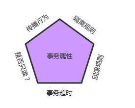
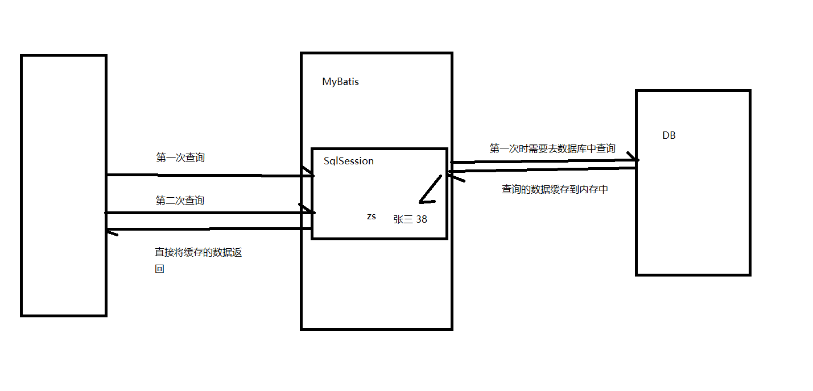
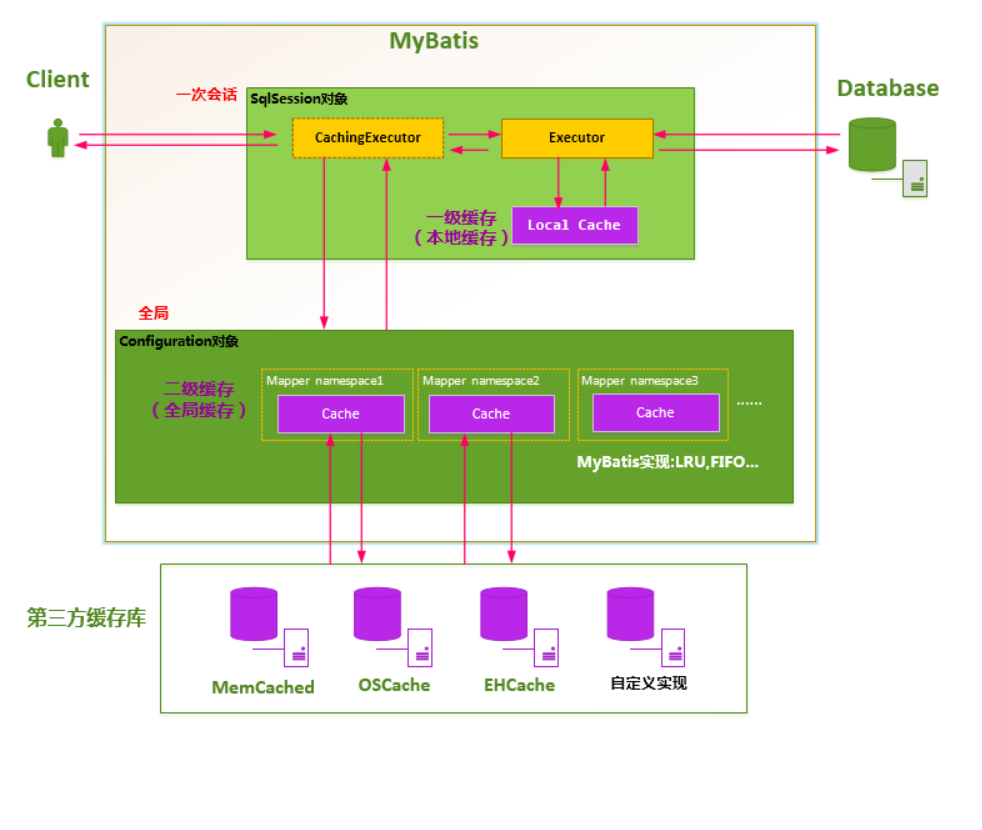

# 面试热点讲解

## Spring

### **扩展: bean的循环依赖问题**

A 依赖 B   B 依赖 A 产生闭环，称为循环依赖

- **Spring 默认允许单例对象的属性注入 所产生的循环依赖**

```
单例对象的循环依赖 Spring通过3级缓存来解决

比如一个类A中有一个属性是B类，B类中有一个属性是A类，这时看Spring是怎么解决他们的相互依赖的。

1. getBean(a)被调用 构建a对象开始
	1.1 通过反射创建对象
	1.2 将a对象存入到early缓存中，如果开启循环依赖 在三级缓存中对外暴露
	1.3 实现a 的属性依赖注入, 需要引用b对象 触发b的构建
2. getBean(b)被调用 构建b对象开始
	1.1 通过反射创建对象
	1.2 将b对象存入到early缓存中,如果开启循环依赖 在三级缓存中对外暴露
	1.3 实现b 的属性依赖注入, 需要引用a对象，在缓存中读取到a的早期对象
	1.4 完成对象的构建
3. a得到 getBean(b) 的返回值后，也完成了属性注入 完成构建

```

| 源码                  | 级别     | 描述                                                         |
| --------------------- | -------- | ------------------------------------------------------------ |
| singletonObjects      | 一级缓存 | 用于存放完全初始化好的 bean，从该缓存中取出的 bean 可以直接使用 |
| earlySingletonObjects | 二级缓存 | 存放原始的 bean 对象（尚未填充属性），用于解决循环依赖       |
| singletonFactories    | 三级缓存 | 存放 bean 工厂对象，用于解决循环依赖                         |

**小结：**

- 如果对象都是多例对象 会报循环依赖异常
- 如果是单例对象:
- ​          如果是通过构造器依赖的属性, 会报循环依赖异常
- ​          如果是通过属性依赖产生的循环依赖, 默认允许循环依赖
- ​          设置allowCircularReferences为false 会报循环依赖异常


```java
protected void customizeBeanFactory(DefaultListableBeanFactory beanFactory) {
   if (this.allowBeanDefinitionOverriding != null) {
      beanFactory.setAllowBeanDefinitionOverriding(this.allowBeanDefinitionOverriding);
   }
   if (this.allowCircularReferences != null) {
      beanFactory.setAllowCircularReferences(this.allowCircularReferences);
   }
}
```


### **扩展:  bean的覆盖问题**

默认情况: 同一个配置文件中出现id相同的bean会报错

​                 不同的配置文件出现id相同的bean  后加载的bean会将先加载的bean覆盖掉

​	          称为bean的覆盖

bean的覆盖不会报错，但可能影响我们的项目 ， 可以通过属性设置 不允许bean的覆盖

**allowBeanDefinitionOverriding**设置为false


### **扩展:  bean的生命周期**

> **spring 容器中的bean的完整生命周期一共分为十一步完成。**

> **1.bean对象的实例化**

> **2.封装属性，也就是设置properties中的属性值**

> **3.如果bean实现了BeanNameAware，则执行setBeanName方法,也就是bean中的id值**

> **4.如果实现BeanFactoryAware或者ApplicationContextAware ，需要设置setBeanFactory或者上下文对象setApplicationContext**

> **5.如果存在类实现BeanPostProcessor后处理bean，执行postProcessBeforeInitialization，可以在初始化之前执行一些方法**

> **6.如果bean实现了InitializingBean，则执行afterPropertiesSet，执行属性设置之后的操作**

> **7.调用<bean　init-method="">执行指定的初始化方法**

> **8.如果存在类实现BeanPostProcessor则执行postProcessAfterInitialization，执行初始化之后的操作**

> **9.执行自身的业务方法**

> **10.如果bean实现了DisposableBean，则执行spring的的销毁方法**

> **11.调用<bean　destory-method="">执行自定义的销毁方法。**


如果了解了Spring生命周期，在系统的架构搭建过程中，能够更优雅的进行架构的设计

分布式调度任务的统一配置处理:

```java
/**
 * @description: 合同计费JOB
 */
@Slf4j
@ElasticJobTask(jobName = "ContractChargeJob",cron = "0/10 * * * * ? *",desc = "合同计费JOB")
public class ContractChargeJob implements SimpleJob {
    @Override
    public void execute(ShardingContext shardingContext) {

    }
}
```

```java
/**
 * @description: 合同到期处理JOB
 */
@Slf4j
@ElasticJobTask(jobName = "ContractCloseJob",cron = "0/10 * * * * ? *",desc = "合同到期处理JOB")
public class ContractCloseJob implements SimpleJob {
    @Override
    public void execute(ShardingContext shardingContext) {
        log.info("job start:{}",LocalDateTime.now());
        log.info("job end:{}",LocalDateTime.now());
    }
}
```

```java
/**
 * 实现ApplicationContextAware接口 Spring在创建完所有的bean之后，会通过setApplicationContext方法将Spring容器作为参数传递给applicationContext变量，接下来就可以通过applicationContext变量来访问Spring容器本身所有的bean以及其它信息。
 * InitializingBean接口为bean提供了初始化方法的方式，只包括afterPropertiesSet方法，凡是继承该接口的类，在初始化bean的时候会执行该方法。一般用这个接口在Spring初始化bean之后做一些初始化操作。
 * <p>
 * 实现ApplicationContextAware是为了通过注解获取IOC容器的bean，不需要直接传入对象进来
 * 实现InitializingBean是为了在所有bean初始化完成后，执行操作，这里elasticjob配置需要等zk等其他对象都初始化完成后再初始化
 */
@Component
@Slf4j
public class ElasticJobConfig implements ApplicationContextAware, InitializingBean {
    ... 略 ...
        
    @Override
    public void setApplicationContext(ApplicationContext applicationContext) throws BeansException {
        // 获取到了IOC容器实例
        this.applicationContext = applicationContext;
    }
    @Override
    public void afterPropertiesSet() throws Exception {
        //根据注解名称，获取对应的bean名称和bean对象
        Map<String, Object> registerJobs = applicationContext.getBeansWithAnnotation(ElasticJobTask.class);
        //循环job对象
        for (Map.Entry<String, Object> entry : registerJobs.entrySet()) {
            try {
                //获取job对象
                Object object = entry.getValue();
                //判断是否是elascitcJob
                if (!(object instanceof ElasticJob)) {
                    throw new ClassCastException("【" + object.getClass().getName() + "】 The class type is not com.dangdang.ddframe.job.api.ElasticJob");
                }
                ... 注册所有要执行的任务 ...
                springJobScheduler.init();
            } catch (Exception e) {
                log.error("【ElasticJobConfig】注册任务异常", e);
            }
        }
    }
}

```

**这就是SpringBean的完整生命周期：**

```
第一步：实例化对象
第二部: 设置属性
十月 10, 2019 11:23:27 上午 org.springframework.context.support.ClassPathXmlApplicationContext doClose
第三步：设置bean的名称也就是spring容器中的名称，也就是id值student
第四步：了解工厂信息ApplicationContext
第五步执行初始化之前执行的方法
第六步：属性设置后执行的方法
第七步：执行自己配置的初始化方法
信息: Closing org.springframework.context.support.ClassPathXmlApplicationContext@2e0fa5d3: startup date [Thu Oct 10 11:23:27 CST 2019]; root of context hierarchy
第八步执行初始化之后执行的方法
第九步：执行对象本身的业务方法
第十步：执行spring的销毁方法
第十一步：执行自定义的销毁方法

```

### 扩展:  Spring事务的配置

Spring关于Spring事务的处理分为**手动编程实现** 和 **声明式事务** 

**编程式事务**

**代码片段**

```java
    TransactionTemplate tt = new TransactionTemplate(); // 新建一个TransactionTemplate
    Object result = tt.execute(
        new TransactionCallback(){  
            public Object doTransaction(TransactionStatus status){  
                updateOperation();  
                return resultOfUpdateOperation();  
            }  
    }); // 执行execute方法进行事务管理
```

**声明式事务**

需要进行配置，Spring中关于事务的配置总是由三个组成部分，分别是DataSource、TransactionManager和代理机制这三部分，无论哪种配置方式，一般变化的只是代理机制这部分。DataSource、TransactionManager这两部分只是会根据数据访问方式有所变化，比如使用Hibernate进行数据访问时，DataSource实际为SessionFactory，TransactionManager的实现为HibernateTransactionManager。

**声明式事务，根据代理机制的不同可分为4种配置：**

```
**使用Tx标签配置的拦截器(AOP的方式)**
```

```xml
<?xml version="1.0" encoding="UTF-8"?>
<beans xmlns="http://www.springframework.org/schema/beans"
       xmlns:xsi="http://www.w3.org/2001/XMLSchema-instance"
       xmlns:context="http://www.springframework.org/schema/context" xmlns:tx="http://www.springframework.org/schema/tx"
       xmlns:aop="http://www.springframework.org/schema/aop"
       xsi:schemaLocation="http://www.springframework.org/schema/beans http://www.springframework.org/schema/beans/spring-beans.xsd http://www.springframework.org/schema/context http://www.springframework.org/schema/context/spring-context.xsd http://www.springframework.org/schema/tx http://www.springframework.org/schema/tx/spring-tx.xsd http://www.springframework.org/schema/aop http://www.springframework.org/schema/aop/spring-aop.xsd">

    <!-- 配置 事务管理器 -->
    <bean id="transactionManager"
          class="org.springframework.jdbc.datasource.DataSourceTransactionManager">
        <!-- 配置数据源 -->
        <property name="dataSource" ref="dataSource"></property>
    </bean>


    <!-- 配置 通知 -->
    <!-- 通知 -->
    <tx:advice id="txAdvice" transaction-manager="transactionManager">
        <tx:attributes>
            <!-- 传播行为 -->
            <tx:method name="save*" propagation="REQUIRED" />
            <tx:method name="insert*" propagation="REQUIRED" />
            <tx:method name="add*" propagation="REQUIRED" />
            <tx:method name="create*" propagation="REQUIRED" />
            <tx:method name="delete*" propagation="REQUIRED" />
            <tx:method name="update*" propagation="REQUIRED" />
            <tx:method name="find*" propagation="SUPPORTS" read-only="true" />
            <tx:method name="select*" propagation="SUPPORTS" read-only="true" />
            <tx:method name="get*" propagation="SUPPORTS" read-only="true" />
        </tx:attributes>
    </tx:advice>
    <!-- 配置 切面 -->
    <aop:config>
        <aop:advisor advice-ref="txAdvice"
                     pointcut="execution(* com.yxj.service.*.*(..))" />
    </aop:config>
</beans>
```

```
**全注解配置**
```

```xml
<?xml version="1.0" encoding="UTF-8"?>
<beans xmlns="http://www.springframework.org/schema/beans"
       xmlns:xsi="http://www.w3.org/2001/XMLSchema-instance"
       xmlns:context="http://www.springframework.org/schema/context" xmlns:tx="http://www.springframework.org/schema/tx"
       xmlns:aop="http://www.springframework.org/schema/aop"
       xsi:schemaLocation="http://www.springframework.org/schema/beans http://www.springframework.org/schema/beans/spring-beans.xsd http://www.springframework.org/schema/context http://www.springframework.org/schema/context/spring-context.xsd http://www.springframework.org/schema/tx http://www.springframework.org/schema/tx/spring-tx.xsd http://www.springframework.org/schema/aop http://www.springframework.org/schema/aop/spring-aop.xsd">

    <!-- 配置 事务管理器 -->
    <bean id="transactionManager"
          class="org.springframework.jdbc.datasource.DataSourceTransactionManager">
        <!-- 配置数据源 -->
        <property name="dataSource" ref="dataSource"></property>
    </bean>
    <!-- 开启注解 -->
    <context:annotation-config />
    <context:component-scan base-package="cn.itcast.trans" />
    <!-- 配置事务注解 -->
    <tx:annotation-driven transaction-manager="transactionManager"/>
</beans>
```

```
**在需要加事务的地 使用 @Transactional 注解**
```

```java
@Service
@Transactional
public class AccountServiceImpl implements AccountService {
```


### 扩展:  事务的基本属性:

事务属性可以理解成事务的一些基本配置，描述了事务策略如何应用到方法上。事务属性包含了5个方面




关于事务的基本属性，在spring中的 TransactionDefinition 接口中进行了定义（了解下就好）

```java
public interface TransactionDefinition {
    // 7种传播特性
    int PROPAGATION_REQUIRED = 0;
    int PROPAGATION_SUPPORTS = 1;
    int PROPAGATION_MANDATORY = 2;
    int PROPAGATION_REQUIRES_NEW = 3;
    int PROPAGATION_NOT_SUPPORTED = 4;
    int PROPAGATION_NEVER = 5;
    int PROPAGATION_NESTED = 6;
    // 4种隔离级别
    int ISOLATION_DEFAULT = -1;//代表 使用数据库默认的隔离级别
    int ISOLATION_READ_UNCOMMITTED = 1;
    int ISOLATION_READ_COMMITTED = 2;
    int ISOLATION_REPEATABLE_READ = 4;
    int ISOLATION_SERIALIZABLE = 8;
    // 超时时间 （事务必须在多少秒内完成）
    int TIMEOUT_DEFAULT = -1;

    int getPropagationBehavior();

    int getIsolationLevel();

    int getTimeout();
	
    // 是否只读
    boolean isReadOnly();

    String getName();
}
```

**事务注解可以直接通过属性进行设置**

```java
public @interface Transactional {
    String value() default "";

    Propagation propagation() default Propagation.REQUIRED;

    Isolation isolation() default Isolation.DEFAULT;

    int timeout() default -1;

    boolean readOnly() default false;

    Class<? extends Throwable>[] rollbackFor() default {};

    String[] rollbackForClassName() default {};

    Class<? extends Throwable>[] noRollbackFor() default {};

    String[] noRollbackForClassName() default {};
}
```

**使用tx标签配置时，可以直接通过tx标签内的属性进行配置**

```xml
<tx:advice id="txAdvice" transaction-manager="transactionManager">
    <tx:attributes>
        <!-- 直接在tx标签的属性中配置 -->
        <tx:method name="save*" propagation="REQUIRED" timeout="" isolation="" read-only=""/>
        <tx:method name="insert*" propagation="REQUIRED" />
        <tx:method name="add*" propagation="REQUIRED" />
        <tx:method name="create*" propagation="REQUIRED" />
        <tx:method name="delete*" propagation="REQUIRED" />
        <tx:method name="update*" propagation="REQUIRED" />
        <tx:method name="find*" propagation="SUPPORTS" read-only="true" />
        <tx:method name="select*" propagation="SUPPORTS" read-only="true" />
        <tx:method name="get*" propagation="SUPPORTS" read-only="true" />
    </tx:attributes>
</tx:advice>
```

### 扩展:  事务传播级别设置

事务的第一个方面是传播行为（propagation behavior）。当事务方法被另一个事务方法调用时，必须指定事务应该如何传播。例如：方法可能继续在现有事务中运行，也可能开启一个新事务，并在自己的事务中运行。Spring定义了七种传播行为：

| 传播行为                     | 含义                                                         |
| ---------------------------- | ------------------------------------------------------------ |
| **PROPAGATION_REQUIRED**     | 表示当前方法必须运行在事务中。如果当前事务存在，方法将会在该事务中运行。否则，会启动一个新的事务 |
| **PROPAGATION_SUPPORTS**     | 表示当前方法不需要事务上下文，但是如果存在当前事务的话，那么该方法会在这个事务中运行 |
| PROPAGATION_MANDATORY        | 表示该方法必须在事务中运行，如果当前事务不存在，则会抛出一个异常 |
| **PROPAGATION_REQUIRES_NEW** | 表示当前方法必须运行在它**自己的事务中**。一个新的事务将被启动。如果存在当前事务，在该方法执行期间，当前事务会被挂起。 |
| PROPAGATION_NOT_SUPPORTED    | 表示该方法不应该运行在事务中。如果存在当前事务，在该方法运行期间，当前事务将被挂起。如果使用JTATransactionManager的话，则需要访问TransactionManager |
| PROPAGATION_NEVER            | 表示当前方法不应该运行在事务上下文中。如果当前正有一个事务在运行，则会抛出异常 |
| PROPAGATION_NESTED           | 表示如果当前已经存在一个事务，那么该方法将会在嵌套事务中运行。嵌套的事务可以独立于当前事务进行单独地提交或回滚。如果当前事务不存在，那么其行为与PROPAGATION_REQUIRED一样。注意各厂商对这种传播行为的支持是有所差异的。可以参考资源管理器的文档来确认它们是否支持嵌套事务 |

### 扩展:  事务隔离级别设置

| 隔离级别                   | 含义                                                         |
| -------------------------- | ------------------------------------------------------------ |
| ISOLATION_DEFAULT          | 使用后端数据库默认的隔离级别                                 |
| ISOLATION_READ_UNCOMMITTED | 最低的隔离级别，允许读取尚未提交的数据变更，可能会导致脏读、幻读或不可重复读 |
| ISOLATION_READ_COMMITTED   | 允许读取并发事务已经提交的数据，可以阻止脏读，但是幻读或不可重复读仍有可能发生 |
| ISOLATION_REPEATABLE_READ  | 对同一字段的多次读取结果都是一致的，除非数据是被本身事务自己所修改，可以阻止脏读和不可重复读，但幻读仍有可能发生 |
| ISOLATION_SERIALIZABLE     | 最高的隔离级别，完全服从ACID的隔离级别，确保阻止脏读、不可重复读以及幻读，也是最慢的事务隔离级别，因为它通常是通过完全锁定事务相关的数据库表来实现的 |


### 扩展:  其它事务属性的设置

**是否只读**

事务的第三个特性是它是否为只读事务。如果事务只对后端的数据库进行该操作，数据库可以利用事务的只读特性来进行一些特定的优化。通过将事务设置为只读，你就可以给数据库一个机会，让它应用它认为合适的优化措施。

**超时时间**

为了使应用程序很好地运行，事务不能运行太长的时间。因为事务可能涉及对后端数据库的锁定，所以长时间的事务会不必要的占用数据库资源。事务超时就是事务的一个定时器，在特定时间内事务如果没有执行完毕，那么就会自动回滚，而不是一直等待其结束。

**回滚规则**

事务五边形的最后一个方面是一组规则，这些规则定义了哪些异常会导致事务回滚而哪些不会。默认情况下，事务只有遇到运行期异常时才会回滚，而在遇到检查型异常时不会回滚（这一行为与EJB的回滚行为是一致的） 
但是你可以声明事务在遇到特定的检查型异常时像遇到运行期异常那样回滚。同样，你还可以声明事务遇到特定的异常不回滚，即使这些异常是运行期异常。


### 扩展:  AOP实现 web接口日志/用户行为日志

**定义注解**

```java
/**
 * 注解类
 */
@Target(ElementType.METHOD)  // 注解应用的地方   （方法上）
@Retention(RetentionPolicy.RUNTIME) // 运行时 应用
public @interface Log {
    String value() default "";
}
```


**定义日志切面类**

```java
@Aspect //注解  当前类  变为切面类
@Component
public class LogAspect {
    @Autowired
    LogService logService;
    Logger logger = LoggerFactory.getLogger(LogAspect.class);
    /**
     * 所有  用 @Log 注解  标注的方法  归 这个 切面类处理
     */
    @Pointcut("@annotation(com.aisile.crowd_funding.common.annotion.Log)")
    public void Pointcut(){
    }
}
```

**定义环绕通知**

```java
// 在环绕通知中 获取注解信息 执行方法信息 参数信息  记录到日志表中
@Around("Pointcut()")
    public Object arount(ProceedingJoinPoint point){
        Object result = null;
        try {
            long startTime = System.currentTimeMillis();
            result = point.proceed();

            MethodSignature signature = (MethodSignature)point.getSignature();
            Method method = signature.getMethod();

            String name = method.getName();
            System.out.println("方法名:"+name);
            String className = method.getDeclaringClass().getName();
            System.out.println("类名:"+className);
            Object[] args = point.getArgs();
            StringBuilder stringBuilder = new StringBuilder("参数信息:");
            if(args!=null&& args.length>0){
                for (int i = 0; i < args.length; i++) {
                    stringBuilder.append(args[i].toString());
                }
            }
            Log annotation = method.getAnnotation(Log.class);
            System.out.println("方法要做的事:"+annotation.value());
            long endTime = System.currentTimeMillis();
            System.out.println("方法执行的时间:"+(endTime-startTime));
        } catch (Throwable e) {
            e.printStackTrace();
            // 异常处理
        } finally {
            // 最终处理
        }
        return result;
    }
```

**将日志注解标注在要处理的方法中**

```java
	@Log("用户查询账户列表")
    @RequestMapping("/list")
    public String list(Model model){
        List<Account> all = accountService.findAll();
        // 查询全部账户金额
        model.addAttribute("list",all);
        return "account/list";
    }
    @Log("张三给李四转钱")
    @RequestMapping("/zhangtoli")
    public String zhangtoli(String money) throws Exception{
        // 张三给李四转钱
        accountService.zsToLs(Double.valueOf(money));
        return "redirect:list";
    }
    @Log("测试事务传播特性")
    //测试事务传播特性   PROPAGATION_REQUIRED
    @RequestMapping("/testTransRequired")
    public String test1() throws Exception{
        // 测试事务传播特性
        accountService.A();
        return "redirect:list";
    }
```

### 扩展:  统一异常处理

```java
@ControllerAdvice
public class MyExceptionHandler {
    @ExceptionHandler
    public String execeptionHandler(
            HttpServletResponse response,
            HttpServletRequest request,
            Exception e){
        System.out.println("异常处理");
        return "error/500";
    }
}
```

## Mybatis

### mybatis的多表查询 

**多对一、一对一**

> 1对1，多对1 都是实体类里面关联另一个实体类

```java
public class Account {
    private Integer id;
    private Integer uid;
    private double money;
    // 每个账户都关联一个User
    User user;
}
```

> 在xml中定义映射关系， 使用association代表关联一个实体类， property映射的属性名，javaType该属性的实体类类型，fetchType是否延迟加载，column用于执行select方法所传递的参数,select需要执行的mapper方法的全限定名称

```xml
<resultMap id="BaseResultMap" type="com.itcast.domain.Account">
    <id column="id" property="id"/>
    <result column="uid" property="uid"/>
    <result column="money" property="money"/>
    <!-- account中 有一个属性为实体类user 以及user对应的映射 -->
    <association property="user" javaType="User" fetchType="eager" column="uid" select="com.itcast.dao.IUserMapper.findById">
        <id column="id" property="id"></id>
        <result column="sex" property="sex"></result>
        <result column="address" property="address"></result>
        <result column="birthday" property="birthday"></result>
        <result column="username" property="username"></result>
    </association>
</resultMap>
```

**一对多，多对多**

> 对多，实体类中会有一个集合属性

```java
public class User {
    private Integer id;
    private String username;
    private Date birthday;
    private String sex;
    private String address;
    // 对多，实体类中会有一个集合属性
    private List<Account> list;
}
```

> 在xml中定义映射关系，因为是一个集合 所以使用collection标签，ofType代表集合中实体类的类型，其他属性和上面对一的情况一致

```xml
<resultMap id="userMap" type="User">
    <id column="id" property="id"/>
    <result column="username" property="username"/>
    <result column="birthday" property="birthday"/>
    <result column="address" property="address"/>
    <result column="sex" property="sex"/>
    <collection property="list" ofType="Account" column="id" select="com.itcast.dao.IAccountMapper.findByUserId">
        <id column="id" property="id"></id>
        <result column="uid" property="uid"></result>
        <result column="money" property="money"></result>
    </collection>
</resultMap>
```


**延迟加载的问题**

> 要使用延迟加载，需要在配置文件中开启延迟加载开关

```xml
<settings>
    <!-- 开启延迟加载 -->
    <setting name="lazyLoadingEnabled" value="true"/>
</settings>
```

> 在关联查询中，通过fetchType设置是否延迟加载，  lazy表示延迟加载 eager表示立即加载

```xml
<association property="user" javaType="User" fetchType="lazy" column="uid" select="com.itcast.dao.IUserMapper.findById">
    <id column="id" property="id"></id>
    <result column="sex" property="sex"></result>
    <result column="address" property="address"></result>
    <result column="birthday" property="birthday"></result>
    <result column="username" property="username"></result>
</association>
```

```xml
<collection property="list" ofType="Account" fetchType="lazy" column="id" select="com.itcast.dao.IAccountMapper.findByUserId">
    <id column="id" property="id"></id>
    <result column="uid" property="uid"></result>
    <result column="money" property="money"></result>
</collection>
```

### mybatis的缓存机制 

**一级缓存**

一级缓存的范围是同一个SqlSession对象，当我们使用SqlSession对象进行查询时mybatis会帮我们把查询的数据存入到内存中，当我们在这个SqlSession中再一次执行同样的查询操作时，我们就可以直接去缓存中获取数据。

**一级缓存是默认开启的**



**一级缓存的生命周期**

> a. MyBatis在开启一个数据库会话时，会 创建一个新的SqlSession对象，SqlSession对象中会有一个新的Executor对象，Executor对象中持有一个新的PerpetualCache对象；当会话结束时，SqlSession对象及其内部的Executor对象还有PerpetualCache对象也一并释放掉。

> b. 如果SqlSession调用了close()方法，会释放掉一级缓存PerpetualCache对象，一级缓存将不可用；

> c. 如果SqlSession调用了clearCache()，会清空PerpetualCache对象中的数据，但是该对象仍可使用；

> d.SqlSession中执行了任何一个update操作(update()、delete()、insert()) ，都会清空PerpetualCache对象的数据，但是该对象可以继续使用；


**二级缓存**

二级缓存是mapper级别的缓存，多个SqlSession共享，其作用域是mapper的同一个namespace，不同的SqlSession两次执行相同的namespace下的sql语句，且向sql中传递的参数也相同，即最终执行相同的sql语句，则第一次执行完毕会将数据库中查询的数据写到缓存（内存），第二次查询时会从缓存中获取数据，不再去底层数据库查询，从而提高查询效率。

**二级缓存的配置**

 **MyBatis二级缓存的划分**
MyBatis并不是简单地对整个二级缓存分配整个Cache缓存对象，而是将缓存划分的更细，即是Mapper级别的，即每一个Mapper都可以拥有一个Cache对象，具体如下：

a.为每一个Mapper分配一个Cache缓存对象（使用<cache>节点配置）；

b.多个Mapper共用一个Cache缓存对象（使用<cache-ref>节点配置）；

**mybatis的二级缓存配置**

> MyBatis支持二级缓存的总开关：全局配置变量参数   cacheEnabled=true

> 该select语句所在的Mapper，配置了<cache> 或<cached-ref>节点，并且有效

> 该select语句的参数 useCache=true

**一级缓存和二级缓存的使用顺序**

如果你的MyBatis使用了二级缓存，并且你的Mapper和select语句也配置使用了二级缓存，那么在执行select查询的时候，MyBatis会先从二级缓存中取输入，其次才是一级缓存，即MyBatis查询数据的顺序是：

```
           二级缓存    ———>    一级缓存    ——>    数据库


```

**二级缓存的实现**

MyBatis对二级缓存的设计非常灵活，它自己内部实现了一系列的Cache缓存实现类，并提供了各种缓存刷新策略如LRU，FIFO等等；另外，MyBatis还允许用户自定义Cache接口实现，用户是需要实现org.apache.ibatis.cache.Cache接口，然后将Cache实现类配置在<cache  type="">节点的type属性上即可；除此之外，MyBatis还支持跟第三方内存缓存库如Memecached的集成

总之，使用MyBatis的二级缓存有三个选择:

```
    1.MyBatis自身提供的缓存实现；

    2.用户自定义的Cache接口实现；

    3.跟第三方内存缓存库的集成；


```

### mybatis的批量操作 

> 1.方式1, 通过mybatis的动态标签，已批量新增为例   比较常用

```xml
<!-- 批量新增-->
<insert id="batchSave" parameterType="java.util.List">
    INSERT INTO lp_user_test_batch
    (
    id,
    user_id,
    user_name
    )
    VALUES
    <foreach collection="list" item="item" index="index" separator=",">
        (
        #{item.id,jdbcType=BIGINT},
        #{item.userId,jdbcType=VARCHAR},
        #{item.userName,jdbcType=VARCHAR}
        )
    </foreach>
</insert>
```

> 2.方式2,通过mybatis的批处理特性，批量提交 ，比方式一略慢一些

**定义一条sql语句**

```xml
<!-- 批量新增-->
<insert id="batchSave" parameterType="java.util.List">
    INSERT INTO lp_user_test_batch
    (
    id,
    user_id,
    user_name
    )
    VALUES
        (
        #{item.id,jdbcType=BIGINT},
        #{item.userId,jdbcType=VARCHAR},
        #{item.userName,jdbcType=VARCHAR}
        )
   
</insert>
```

**利用 MyBatis 批处理特性，批量提交(ExecutorType.BATCH)**

```java
/**
 * 利用 MyBatis 批处理特性，批量提交
 */
public void batchInsert(List<UserTestBatchDO> testBatchDAOList) {
    //集合非空
    if (CollectionUtils.isEmpty(testBatchDAOList)) {
        return;
    }
    //批处理方式 SqlSession
    SqlSession sqlSession = sqlSessionFactory.openSession(ExecutorType.BATCH);
    //获得对应的Mapper
    UserTestBatchDOMapper userTestBatchDOMapper = sqlSession.getMapper(UserTestBatchDOMapper.class);
    try {
        for (UserTestBatchDO testBatchDO : testBatchDAOList) {
            userTestBatchDOMapper.insert(testBatchDO);
        }
        //统一提交
        sqlSession.commit();
    } catch (Exception e) {
        //没有提交的数据可以回滚
        sqlSession.rollback();
    } finally {
        //关闭 sqlSession
        sqlSession.close();
    }
}
```

> 方式三，方便单条控制事务，  但非常耗时，每循环一次都需要与数据库做一次交互
>
> java程序循环调用单条修改语句
> 执行方式：一条sql ,程序循环执行
>
> ```java
> for (UserTestBatchDO userTestBatch : testBatchDAOList) {
>     userTestBatchDOMapper.updateByUserId(userTestBatch);
> }
> ```


