# 学习目标

### 能够描述运行时数据区域

### 能够说出垃圾回收机制

### 能够说出JVM的类加载机制

### 能够说出双亲委托模型 

### 能够使用JVM性能监控工具

### 能够说出JVM性能调优


# JVM优化及面试热点分析

## jvm的组成

```
类加载器（ClassLoader）
运行时数据区（Runtime Data Area）
执行引擎（Execution Engine）
本地库接口（Native Interface）
```

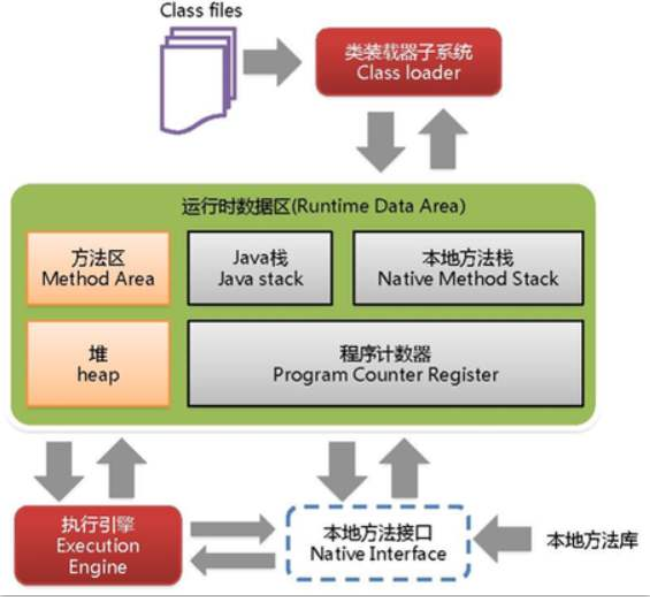

```
首先通过类加载器（ClassLoader）会把 Java 代码转换成字节码，
运行时数据区（Runtime Data Area）再把字节码加载到内存中，而字节码文件只是 JVM 的一套指令集规范，并不能直接交给底层操作系统去执行，因此需要特定的命令解析器执行引擎（Execution Engine），
将字节码翻译成底层系统指令，再交由 CPU 去执行，而这个过程中需要调用其他语言的本地库接口（Native Interface）来实现整个程序的功能
```

## java 内存管理机制

对于Java程序员来说，在虚拟机自动内存管理机制的帮助下，不再需要为每一个new的操作去写对应的内存管理操作，不容器出现内存泄漏和内存溢出问题，由虚拟机管理内存一切都看起来很美好。不过，也正是因为我们把内存控制的权利交给了虚拟机，一旦出现内存泄漏和溢出方面的问题，如果不了解虚拟机是怎么样使用内存的，那么排查错误将会变得特别的困难。 所以，接下来我们要一层一层接下内存管理机制的面试来了解它究竟是怎样实现的。

### 运行时数据区域

Java虚拟机在执行Java程序的过程中会把它所管理的内存划分为若干个不同的数据区域。这些区域都有各自的用途，以及创建和销毁的时间。根据1.7 java虚拟机规范,jvm在运行时主要分为以下几个运行时内存区域：

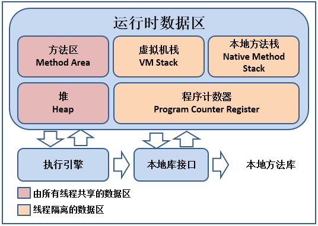

#### 程序计数器

```
线程私有。可看作是**当前线程所执行的字节码的行号指示器**，字节码解释器的工作是通过改变这个计数值来读取下一条要执行的字节码指令。

多线程是通过线程轮流切换并分配处理器执行时间来实现的，任何一个时刻，一个内核只能执行一条线程中的指令。**为了线程切换后能恢复到正确的执行位置，每条线程都需要一个独立的程序计数器**。这就是一开始说的“线程私有”。如果线程正在执行的方法是Java方法，计数器记录的是虚拟机字节码的指令地址；如果是Native方法，计数器值为空。
```

**程序计数器是唯一一个在Java虚拟机规范中没有规定OOM(OutOfMemoryError)情况的区域**。

#### Java虚拟机栈

```
线程私有，生命周期和线程相同。Java虚拟机栈描述的是Java方法的内存模型：每个方法在执行时都会创建一个栈帧，存储**局部变量表、操作数栈、动态链接、方法出口信息**，每一个方法从调用到结束，就对应这一个栈帧在虚拟机栈中的进栈和出栈过程。局部变量表保存了各种基本数据类型（int、double、char、byte等
）、对象引用（不是对象本身）和returnAddress类型（指向了一条字节码地址）。


* 方法执行的过程：
  方法被调用前：创建栈帧
  方法执行：栈帧入栈
  方法执行后：栈帧出栈
  
  

栈的空间大小设置：  -Xss 为jvm启动的每个线程分配的内存大小
```

- **线程请求的栈深度大于虚拟机所允许的深度，抛出StackOverflowError；**
- **虚拟机栈扩展时无法申请到足够的内存，抛出OutOfMemoryError。**

**StackOverflowError**

```java
/**
 * 栈超出最大深度：StackOverflowError
 * VM args: -Xss128k
 **/
public class StackSOF {
    private int stackLength = 1;
    public void stackLeak(){
        stackLength++;
        stackLeak();
    }
    public static void main(String[] args) {
        StackSOF stackSOF = new StackSOF();
        try {
            stackSOF.stackLeak();
        } catch (Throwable e) {
            System.out.println("当前栈深度:" + stackSOF.stackLength);
            e.printStackTrace();
        }
    }
}
```

```java
java.lang.StackOverflowError
当前栈深度:30170
	at cn.itcast.jvm.StackSOF.stackLeak(StackSOF.java:11)
	at cn.itcast.jvm.StackSOF.stackLeak(StackSOF.java:11)
    
方法递归调用，造成深度过深，产生异常
```

**OutOfMemoryError（代码谨慎使用，会引起电脑卡死  ）** 

```java
/**
 * 栈内存溢出： OOM
 * VM Args: -Xss2m
 **/
public class StackOOM {
    private void dontStop(){
        while (true){
        }
    }
    public void stackLeakByThread(){
        while(true){
            Thread t = new Thread(new Runnable() {
                public void run() {
                    dontStop();
                }
            });
            t.start();
        }
    }
    public static void main(String[] args) {
        StackOOM stackOOM = new StackOOM();
        stackOOM.stackLeakByThread();
    }
}
```

```
Exception in thread "main"  java.lang.OutOfMemoryError:unable to create new native thread
```

单线程下栈的内存出现问题了，都是报StackOverflow的异常，只有在多线程的情况下，当新创建线程无法在分配到新的栈内存资源时，会报内存溢出。

#### 本地方法栈

```
上述虚拟机栈为JVM执行Java方法服务，本地方法则为执行Native服务。其他和虚拟机栈类似，也会抛出StackOverflowError、OutOfMemoryError。
```

#### Java堆

```
常说的“栈内存”、“堆内存”，其中前者指的是虚拟机栈，后者说的就是Java堆了。**Java堆是被线程共享的**。在虚拟机启动时被创建。Java堆是Java虚拟机所管理的内存中最大的一块。Java堆的作用是存放对象实例，Java堆可以处于物理上不连续的内存空间中，只要求逻辑上连续即可。
	Java堆是垃圾收集器管理的主要区域，因此很多时候也被称作"GC堆",从内存回收的角度看，现在收集器都基本采用分代回收的算法 所以Java堆呢还可以细分为：新生代、老年代。  在细致一点的有：Eden空间、From Survivor空间、To Survivor空间。   

堆的空间大小设置：   -Xms java堆启动时内存   -Xmx java堆可扩展的最大内存
```

```
内存泄漏：Memory Leak  一个无用的对象，应该被回收，却因为某种原因一直未被回收


内存溢出：Memory Overflow  对象确实都应该活着，这个时候内存不够用了


-Xms 设置堆的初始值    200m
-Xmx 设置堆的最大值    200m
```

**案例：**

```java
/**
 * 堆内存溢出演示
 * VM Args: -Xms20m -Xmx20m 
 **/
public class HeapOOM {
    public static void main(String[] args) throws InterruptedException {
        List<byte[]> list = new ArrayList<byte[]>();
        int i=0;
        while (true){
            list.add(new byte[1024]);
        }
    }
}
```

```java
java.lang.OutOfMemoryError: Java heap space
Dumping heap to java_pid18828.hprof ...
Heap dump file created [20924845 bytes in 0.060 secs]
Exception in thread "main" java.lang.OutOfMemoryError: Java heap space
	at cn.itcast.jvm.HeapOOM.main(HeapOOM.java:15)
```

#### 方法区

```
也被称为永久代 1.7  
Perm  :  永久代 

也被称为元数据空间 1.8
MetaSpace: 元数据空间


是线程共享的区域。存储已被虚拟机加载的类信息 、 常量、 静态变量、即使编译器编译后的代码等数据。方法区无法满足内存分配需求时，抛出OutOfMemoryError。JVM规范被没要求这个区域需要实现垃圾收集，因为这个区域回收主要针对的是类和常量池的信息回收，回收结果往往难以令人满意。
运行时常量池：是方法区的一部分。Java语言不要求常量只能在编译期产生，换言之，在运行期间也能将新的常量放入。

方法区空间大小设置： 
-XX:PermSize 方法区的初始值大小
-XX:MaxPermSize 方法区的最大值


1.8之后设置： 
-XX:MetaspaceSize  方法区的初始值大小
-XX:MaxMetaspaceSize  方法区的最大值
```

**OutOfMemoryError**

```java
/**
 * 方法区 OOM
 * VM Args: -XX:PermSize10m -XX:MaxPermSize10m   1.8移除永生代
 * VM Args:-XX:MetaspaceSize=10m -XX:MaxMetaspaceSize=10m   
 **/
public class PermOOM {
    public static void main(final String[] args) {
        while (true){
            Enhancer enhancer = new Enhancer();
            enhancer.setSuperclass(PermOOM.class);
            enhancer.setUseCache(false);
            enhancer.setCallback(new MethodInterceptor() {
                public Object intercept(Object o, Method method, Object[] objects, MethodProxy methodProxy) throws Throwable {
                    return methodProxy.invoke(o,args);
                }
            });
            enhancer.create();
        }
    }
}
```

```
Exception in thread "main" java.lang.OutOfMemoryError: Metaspace
	at java.lang.Class.forName0(Native Method)
	at java.lang.Class.forName(Class.java:348)
	at net.sf.cglib.core.ReflectUtils.defineClass(ReflectUtils.java:386)
	at net.sf.cglib.core.AbstractClassGenerator.create(AbstractClassGenerator.java:219)
	at net.sf.cglib.proxy.Enhancer.createHelper(Enhancer.java:377)
	at net.sf.cglib.proxy.Enhancer.create(Enhancer.java:285)
	at cn.itcast.jvm.PermOOM.main(PermOOM.java:24)

Process finished with exit code 1
```

```
Cglib动态代理可以动态创建代理类，这些代理类的Class会动态的加载入内存中，存入到方法区。所以当我们把方法区内存调小后便可能会产生方法区内存溢出,1.8之前的JDK我们可以称方法区为永久代 :PermSpace 1.8之后方法区改为MetaSpace 元空间。
```

## GC垃圾回收机制

```
说起垃圾收集（Garbage Clollection , GC）,大家肯定都不陌生，目前内存的动态分配与内存回收技术已经非常成熟，那么我们为什么还要去了解GC和内存分配呢?原因很简单：当需要排查各种内存溢出、内存泄漏问题时，当垃圾收集成为系统达到更高并发量的瓶颈时。 我们就需要对这些自动化的技术实施必要的监控和条件。

	在我们的java运行时内存当中，程序计数器、Java虚拟机栈、本地方法栈 3个区域都是随线程生而生，随线程灭而灭，因此这个区域的内存分配和回收都具备了确定性，所以在这几个区域不需要太多的考虑垃圾回收问题，因为方法结束了，内存自然就回收了。但Java堆不一样，它是所有线程共享的区域，我们只有在程序处于运行期间时才能知道会创建哪些对象，这个区域的内存分配和内存回收都是动态的，所以垃圾收集器主要关注的就是这部分的内存。
	
关于回收的知识点，我们会从以下几方面去讲解：
1. 什么样的对象需要回收
2. 垃圾收集的算法（如何回收）
3. 垃圾收集器（谁来回收）
4. 内存分配与回收策略（回收细节） 
```

### 对象已死吗

在Java堆中存放着Java世界中几乎所有的对象实例，垃圾收集器在对堆进行回收前，第一件事情就是要确定这些对象之中哪些还存活着，哪些已经死去（即不可能在被任何途径使用的对象）


如何判断对象是否死亡，主要有两种算法：   **引用计数法**和**可达性分析算法**

主流的商业虚拟机基本使用的是 **可达性分析算法**  

#### 可达性分析算法

```
基本思路：通过系列的称为 GC Roots 的对象作为起始点，从这些节点开始向下搜索，搜索走过的路径成为引用连，
当一个对象到GC Roots没有任何引用链相连时，则证明此对象是不可达的，会被判断为可回收的对象。

如图: 对象5,6,7 虽然互相有关联，但是他们到GC Roots是不可达的，所以它们会被判定为可回收的对象。
```

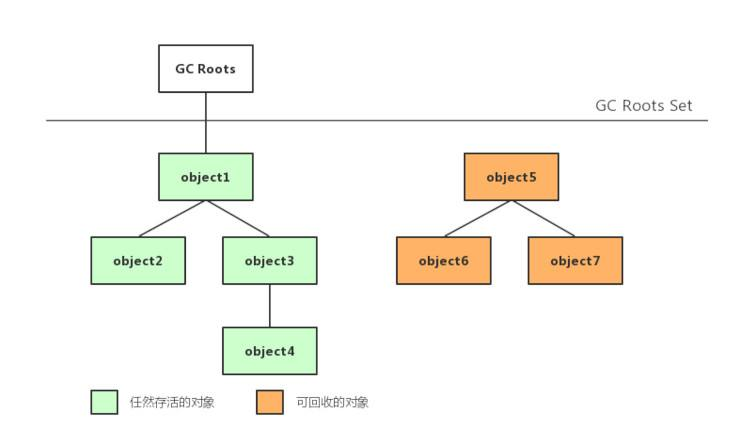

#### 可作为GC Roots节点的对象

```
虚拟机栈中 (栈帧中的本地变量表) 引用的对象  
（通俗的讲: 正在执行的方法,中的变量所引用的对象）

方法区中类静态属性引用的对象
(被加载的类，中的静态属性或常量所引用的对象)

方法区中常量的引用对象


本地方法栈中引用的对象   native
```

### 垃圾收集算法

#### 标记-清除算法

标记—清除算法是最基础的收集算法，过程分为标记和清除两个阶段，首先标记出需要回收的对象，之后由虚拟机统一回收已标记的对象。这种算法的主要不足有两个：
 1、效率问题，**标记和清除的效率都不高**；
 2、空间问题，**对象被回收之后会产生大量不连续的内存碎片，当需要分配较大对象时，由于找不到合适的空闲内存而不得不再次触发垃圾回收动作**。

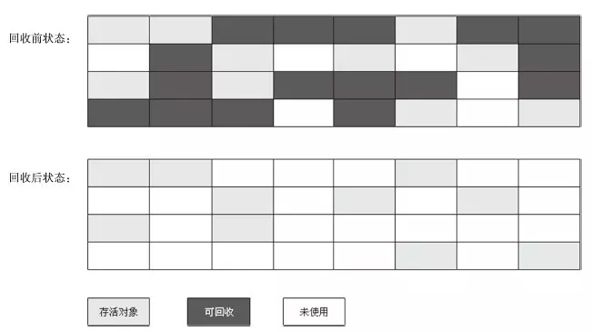

#### 复制算法

为了解决效率问题，复制算法出现了。算法的基本思路是：**将内存划分为大小相等的两部分，每次只使用其中一半，当第一块内存用完了，就把存活的对象复制到另一块内存上，然后清除剩余可回收的对象，这样就解决了内存碎片问题。我们只需要移动堆顶指针，按顺序分配内存即可，简单高效。**但是算法的缺点也很明显：
 1、**它浪费了一半的内存**，这太要命了。
 2、如果对象的存活率很高，我们可以极端一点，假设是100%存活，那么我们需要将所有对象都复制一遍，并将所有引用地址重置一遍。**复制这一工作所花费的时间，在对象存活率达到一定程度时，将会变的不可忽视。**

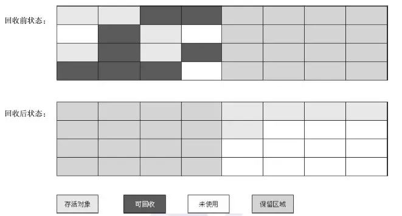


这种收集算法经常被采用到新生代，因为新生代中的对象 绝大部分都是 朝生夕死，所以并不需要按照1：1的比例来划分内存空间，而是将内存分为一块较大的Eden空间和两块较小的Survivor空间，每次使用Eden和其中一块Survivor。当回收时，将Eden和Survivor中还存活着的对象一次性的复制到另外一块Survivor空间上，最后清理Eden和刚才用过的Survivor空间，HotSpot默认的空间比例是 8:1 ,如图：

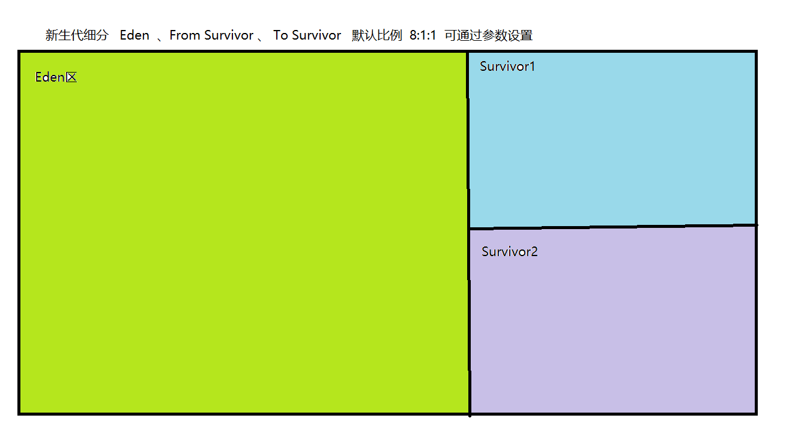

```
分配担保： 我们没办法保证每次回收都只有不多于10%的对象存活，当Survivor空间不够时，需要依赖其他内存（这里指老年代）进行分配担保。
```


#### 标记-整理算法

根据老年代的特点，有人提出了另一种改进后的“标记—清除”算法：标记—整理算法。
 **标记：它的第一个阶段与标记/清除算法是一模一样的，均是遍历GC Roots，然后将存活的对象标记。**
 **整理：移动所有存活的对象，且按照内存地址次序依次排列，然后将末端内存地址以后的内存全部回收。因此，第二阶段才称为整理阶段。**


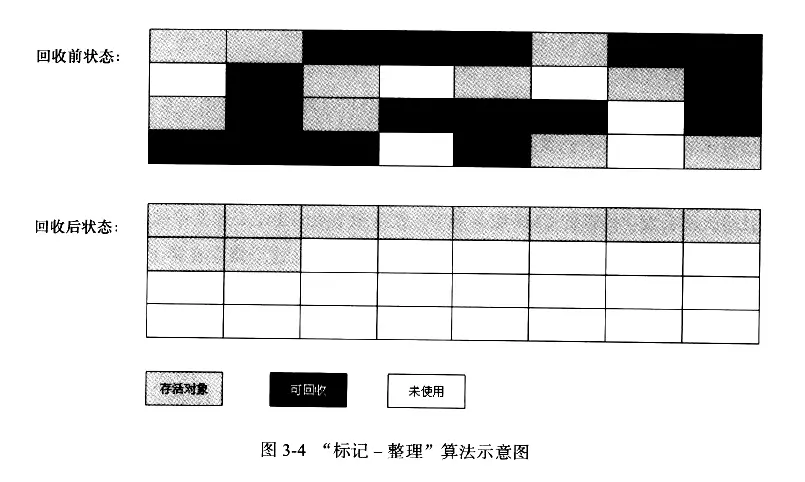


可以看到，标记的存活对象将会被整理，按照内存地址依次排列，而未被标记的内存会被清理掉。如此一来，当我们需要给新对象分配内存时，JVM只需要持有一个内存的起始地址即可，这比维护一个空闲列表显然少了许多开销。

不难看出，**标记/整理算法不仅可以弥补标记/清除算法当中，内存区域分散的缺点，也消除了复制算法当中，内存减半的高额代价，可谓是一举两得。**


#### 分代收集算法

现代商业虚拟机垃圾收集大多采用分代收集算法。主要思路是根据对象存活生命周期的不同将内存划分为几块。一般是把Java堆分为新生代和老年代，然后根据各个年代的特点采用最合适的收集算法。**新生代中，对象的存活率比较低，所以选用复制算法，老年代中对象存活率高且没有额外空间对它进行分配担保，所以使用“标记-清除”或“标记-整理”算法进行回收**。

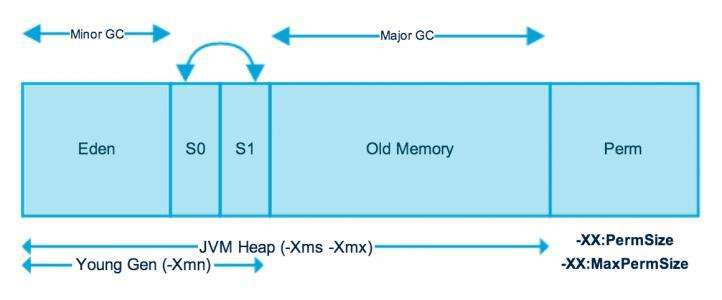

### 分代垃圾回收策略

```
1.对象是在Eden区进行分配，如果Eden区没有足够空间时触发一次 Minor GC
JVM提供 -XX:+PrintGCDetails这个收集器日志参数


2.占用内存较大的对象，对于虚拟机内存分配是一个坏消息，虚拟机提供了一个 -XX:PretenureSizeThreshold
让大于这个设置的对象直接存入老年代。

3.长期存入的对象会存入老年代。
	虚拟机给每个对象定义了一个Age年龄计数器,对象在Eden中出生并经过第一次Minor GC后仍然存活，对象年龄+1，此后每熬过一次Minor GC则对象年龄+1,当年龄增加到一定程度默认15岁，就会晋升到老年代。 、
	可通过参数设置晋升年龄 -XX:MaxTenuringThreshold 

 Minor GC 和 Full GC的区别
 新生代GC(Minor GC):指发生在新生代的垃圾收集动作，Minor GC非常频繁，一般回收速度也很快
 
 老年代GC(Full GC/Major GC):指发生在老年代的GC，出现Full GC 一般会伴随一次 Minor GC,Full GC的速度要慢很多，一般要比Minor GC慢10倍
```


### 垃圾收集器  HotSpot  JDK1.8（自己阅读）

如果说收集算法是内存回收的方法论，那么垃圾收集器就是内存回收的具体实现。下图是HotSpot虚拟机所包含的所有垃圾收集器：

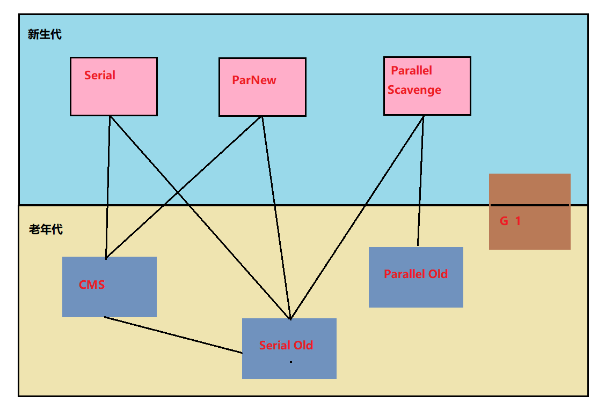

从JDK3(1.3)开始，HotSpot团队一直努力朝着高效收集、减少停顿(STW: Stop The World)的方向努力，也贡献了从串行到CMS乃至最新的G1在内的一系列优秀的垃圾收集器。上图展示了JDK的垃圾回收大家庭，以及相互之间的组合关系。

```
HotSpot虚拟机：
Serial：最早的单线程串行垃圾回收器。
Serial Old：Serial 垃圾回收器的老年版本，同样也是单线程的，可以作为 CMS 垃圾回收器的备选预案。
ParNew：是 Serial 的多线程版本。
Parallel 和 ParNew 收集器类似是多线程的，但 Parallel 是吞吐量优先的收集器，可以牺牲等待时间换取系统的吞吐量。
Parallel Old 是 Parallel 老生代版本，Parallel 使用的是复制的内存回收算法，Parallel Old 使用的是标记-整理的内存回收算法。
CMS：一种以获得最短停顿时间为目标的收集器，非常适用 B/S 系统。
G1：一种兼顾吞吐量和停顿时间的 GC 实现，是 JDK 9 以后的默认 GC 选项。

STW
STW:Stop The World  是指由于虚拟机在后台发起垃圾收集时，会暂停所有其他的用户工作线程，造成用户应用暂时性停止。从JDK1.3开始，HotSpot虚拟机开发团队一直为消除或者减少工作线程因为内存回收而导致停顿而努力着。用户线程的停顿时间不短缩短，但仍无法完全消除。


```

**下面就几种典型的组合应用进行简单的介绍**：

#### 串行收集器

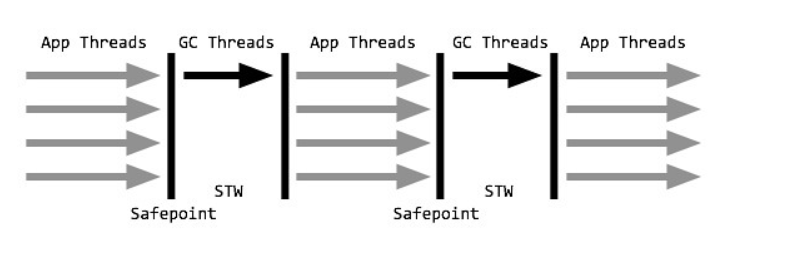

**串行收集器组合 Serial + Serial Old**

```
串行收集器是最基本、发展时间最长、久经考验的垃圾收集器，也是client模式下的默认收集器配置。
串行收集器采用单线程stop-the-world的方式进行收集。当内存不足时，串行GC设置停顿标识，待所有线程都进入安全点(Safepoint)时，应用线程暂停，串行GC开始工作，采用单线程方式回收空间并整理内存。单线程也意味着复杂度更低、占用内存更少，但同时也意味着不能有效利用多核优势。事实上，串行收集器特别适合堆内存不高、单核甚至双核CPU的场合。

开启选项：-XX:+UseSerialGC
```

#### 并行收集器

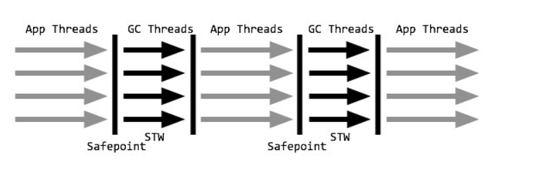

**并行收集器组合 Parallel Scavenge + Parallel Old**   

```
并行收集器是以关注吞吐量为目标的垃圾收集器，也是server模式下的默认收集器配置，对吞吐量的关注主要体现在年轻代Parallel Scavenge收集器上。

并行收集器与串行收集器工作模式相似，都是stop-the-world方式，只是暂停时并行地进行垃圾收集。年轻代采用复制算法，老年代采用标记-整理，在回收的同时还会对内存进行压缩。关注吞吐量主要指年轻代的Parallel Scavenge收集器，通过两个目标参数-XX:MaxGCPauseMills和-XX:GCTimeRatio，调整新生代空间大小，来降低GC触发的频率。并行收集器适合对吞吐量要求远远高于延迟要求的场景，并且在满足最差延时的情况下，并行收集器将提供最佳的吞吐量。  
 
开启选项：-XX:+UseParallelGC或-XX:+UseParallelOldGC(可互相激活)
```

#### 并发清除收集器   

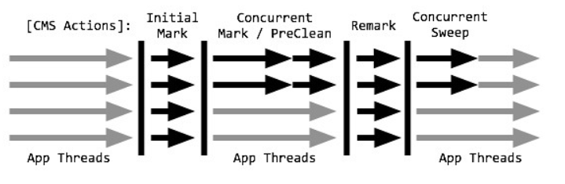

**并发标记清除收集器组合 ParNew + CMS (老年代)   +   Serial Old (担保)**

```
并发标记清除(CMS)是以关注延迟为目标、十分
优秀的垃圾回收算法，开启后，年轻代使用STW式的并行收集，老年代回收采用CMS进行垃圾回收，对延迟的关注也主要体现在老年代CMS上。

年轻代ParNew与并行收集器类似，而老年代CMS每个收集周期都要经历：初始标记、并发标记、重新标记、并发清除。其中，初始标记以STW的方式标记所有的根对象；并发标记则同应用线程一起并行，标记出根对象的可达路径；在进行垃圾回收前，CMS再以一个STW进行重新标记，标记那些由mutator线程(指引起数据变化的线程，即应用线程)修改而可能错过的可达对象；最后得到的不可达对象将在并发清除阶段进行回收。值得注意的是，初始标记和重新标记都已优化为多线程执行。CMS非常适合堆内存大、CPU核数多的服务器端应用，也是G1出现之前大型应用的首选收集器。

但是CMS并不完美，它有以下缺点：  标记 清除    产生碎片 

由于并发进行，CMS在收集与应用线程会同时会增加对堆内存的占用，也就是说，CMS必须要在老年代堆内存用尽之前完成垃圾回收，否则CMS回收失败时，将触发担保机制，串行老年代收集器将会以STW的方式进行一次GC，从而造成较大停顿时间；
标记清除算法无法整理空间碎片，老年代空间会随着应用时长被逐步耗尽，最后将不得不通过担保机制对堆内存进行压缩。CMS也提供了参数-XX:CMSFullGCsBeForeCompaction(默认0，即每次都进行内存整理)来指定多少次CMS收集之后，进行一次压缩的Full GC。

开启选项：-XX:+UseConcMarkSweepGC

```

#### Garbage First (G1)      

G1(Garbage First)垃圾收集器是当今垃圾回收技术最前沿的成果之一。早在JDK7就已加入JVM的收集器大家庭中，成为HotSpot重点发展的垃圾回收技术。同优秀的CMS垃圾回收器一样，G1也是关注最小时延的垃圾回收器，也同样适合大尺寸堆内存的垃圾收集，官方也推荐使用G1来代替选择CMS。G1最大的特点是引入分区的思路，弱化了分代的概念，合理利用垃圾收集各个周期的资源，解决了其他收集器甚至CMS的众多缺陷。

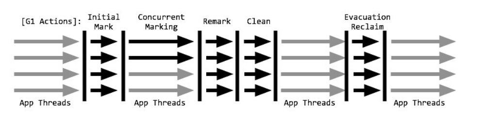

```
G1垃圾收集器也是以关注延迟为目标、服务器端应用的垃圾收集器，被HotSpot团队寄予取代CMS的使命，也是一个非常具有调优潜力的垃圾收集器。虽然G1也有类似CMS的收集动作：初始标记、并发标记、重新标记、清除、转移回收，并且也以一个串行收集器做担保机制，但单纯地以类似前三种的过程描述显得并不是很妥当。事实上，G1收集与以上三组收集器有很大不同：

G1的设计原则是"首先收集尽可能多的垃圾(Garbage First)"。因此，G1并不会等内存耗尽(串行、并行)或者快耗尽(CMS)的时候开始垃圾收集，而是在内部采用了启发式算法，在老年代找出具有高收集收益的分区进行收集。同时G1可以根据用户设置的暂停时间目标自动调整年轻代和总堆大小，暂停目标越短年轻代空间越小、总空间就越大；
G1采用内存分区(Region)的思路，将内存划分为一个个相等大小的内存分区，回收时则以分区为单位进行回收，存活的对象复制到另一个空闲分区中。由于都是以相等大小的分区为单位进行操作，因此G1天然就是一种压缩方案(局部压缩)；
G1虽然也是分代收集器，但整个内存分区不存在物理上的年轻代与老年代的区别，也不需要完全独立的survivor(to space)堆做复制准备。G1只有逻辑上的分代概念，或者说每个分区都可能随G1的运行在不同代之间前后切换；
G1的收集都是STW的，但年轻代和老年代的收集界限比较模糊，采用了混合(mixed)收集的方式。即每次收集既可能只收集年轻代分区(年轻代收集)，也可能在收集年轻代的同时，包含部分老年代分区(混合收集)，这样即使堆内存很大时，也可以限制收集范围，从而降低停顿。


开启选项：-XX:+UseG1GC
```

## JVM类加载机制

**概述**

- 负责将 Class 加载到 JVM 中
- 审查每个类由谁加载（父优先的等级加载机制）
- 将 Class 字节码重新解析成 JVM 统一要求的对象格式

#### 类加载的时机

**什么情况下需要开始类加载呢？**

```
1.在遇到 new、putstatic、getstatic、invokestatic 字节码指令时，如果类尚未初始化，则需要先触发初始化。

new User(); 

User.aa 

User.staticFun()

2.对类进行反射调用时，如果类还没有初始化，则需要先触发初始化。

User.class.newInstance();

3.初始化一个类时，如果其父类还没有初始化，则需要先初始化父类。

User extends Person

User == >   初始化Person 


4.虚拟机启动时，用于需要指定一个包含 main() 方法的主类，虚拟机会先初始化这个主类。

```

#### 加载类的过程

**类从被加载到虚拟机内存中开始，直到卸载出内存为止，它的整个生命周期包括了：加载、验证、准备、解析、初始化、使用和卸载这7个阶段。其中，验证、准备和解析这三个部分统称为连接（linking）。 **

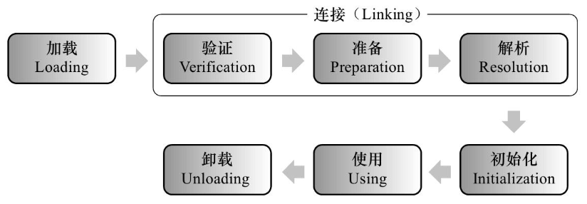

**加载**

```
基本概念：该过程完成查找并加载类的class文件。该class文件可以来自本地磁盘或者网络等。
	Java规范中并没有规定 Class 对象的存放位置，对于Hot Spot 虚拟机来说，Class 对象虽然是对象，但却是存放在方法区中。
	
```

**验证**

```
基本概念：确保类型的正确性，比如class文件的格式是否正确、语义是否符合语法规定、字节码是否可以被JVM安全执行等
1. 验证魔数  0xcafebabe  证明是.class
2. 验证虚拟机版本   
3. 语法是否符合规定

验证总体上分为4个阶段： 文件格式验证、元数据验证、字节码验证、符号引用验证。
```

**准备**

```
基本概念：为类的静态变量分配内存，并赋初值。基本类型的变量赋值为初始值，比如int类型的赋值为0，引用类型赋值为null。

static String str = "小明";
static int i = 255

static String str = null
static int i = 0


“准备”阶段是正式为类变量（仅仅是类变量，即 static 修饰的变量）分配内存并设置类变量初始值（除了 final 变量初始值是数据类型的零值，并不是类构造器<clinit> 方法中的初始值）的阶段，这些变量所使用的内存都将在方法区中进行。

```

**解析**  

```
基本概念：将符号引用转为直接引用。比如方法中调用了其他方法，方法名可以理解为符号引用，而直接引用就是使用指针直接引用方法。
”解析“阶段是虚拟机将常量池内的符号引用替换为直接引用的过程，

class Person {
    private Student student = new Student();
    
}


主要针对 类或接口、字段、类方法、接口方法、方法类型、方法句柄 和 调用限定符 7类符号引用进行。
```

**初始化**

```
基本概念：初始化，则是为标记为常量值的字段赋值的过程。换句话说，只对static修饰的变量或语句块进行初始化。如果初始化一个类的时候，其父类尚未初始化，则优先初始化其父类。如果同时包含多个静态变量和静态代码块，则按照自上而下的顺序依次执行。

class Person {
    static String str = "小明"
	static int i = 1
	
	static {
        // 在初始化的时候执行一次
	}
}

new Person()
Person.class
main
```


#### 类加载器

**概念**

“将class文件加载进JVM的方法区，并在方法区中创建一个java.lang.Class对象作为外界访问这个类的接口。”实现这一动作的代码模块称为类加载器。

```
类和类加载器:
对于任意一个类，都需要由加载它的类加载器和这个类本身一同确立其在虚拟机中的唯一性。 通俗点说： 比较两个类是否“相等”，只有在这两个类是由同一个类加载器加载的前提下才用意义，否则，即使这两个类来源于同一个Class文件，被同一个虚拟机加载，只要加载它们的类加载器不同，那这两个类就必定不相等。
	这里的“相等”  包括： Class对象的 equals() 方法、isInstance()方法，也包括 instanceof关键字


```

```java
/**
 * 使用自定义类加载器加载Class对象
 * 系统默认类加载器加载Class 对象
 * 属于两个不同的类
 **/
public class ClassLoaderTest1 {
    public static void main(String[] args)  throws Exception{
        // 自定义 类加载器
        ClassLoader myLoader = new ClassLoader() {
            @Override
            public Class<?> loadClass(String name) throws ClassNotFoundException {
                try {
                    String fileName = name.substring(name.lastIndexOf(".")+1) + ".class";
                    InputStream in = getClass().getResourceAsStream(fileName);
                    if(in == null){
                        return super.loadClass(name);
                    }
                    byte[] b = new byte[in.available()];
                    in.read(b);
                    return defineClass(name,b,0,b.length);
                } catch (IOException e) {
                    e.printStackTrace();
                }
                return super.loadClass(name);
            }
        };
        //使用自定义类加载器加载出来的Class对象
        Class c1 = myLoader.loadClass("cn.itcast.jvm.ClassLoaderTest1");
        //使用系统默认的类加载器加载出来的Class对象
        Class c2 = ClassLoaderTest1.class;
        //结果为false
        System.out.println(c1==c2);
    }
}
```


#### 类加载器的分类

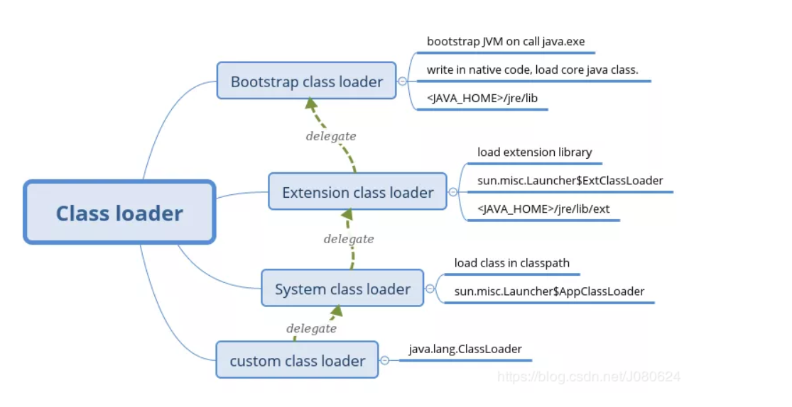


**启动类加载器(BootStrap ClassLoader,又称根加载器)**  

```
每次执行 java 命令时都会使用该加载器为虚拟机加载核心类。
该加载器是由 native code 实现，而不是 Java 代码，加载类的路径为 <JAVA_HOME>/jre/lib。
特别的 <JAVA_HOME>/jre/lib/rt.jar 中包含了 sun.misc.Launcher 类，
而 sun.misc.Launcher$ExtClassLoader 和 sun.misc.Launcher$AppClassLoader 都是 sun.misc.Launcher的内部类，所以拓展类加载器和系统类加载器都是由启动类加载器加载的。
```

**扩展类加载器(Extension ClassLoader)**

```
用于加载拓展库中的类。拓展库路径为<JAVA_HOME>/jre/lib/ext/。
实现类为 sun.misc.Launcher$ExtClassLoader。
```

**应用程序类加载器(App ClassLoader)**

```
负责加载用户classpath下的class文件，又叫系统加载器，其父类是Extension。
它是应用最广泛的类加载器。它从环境变量classpath或者系统属性java.class.path所指定的目录中记载类，是用户自定义加载器的默认父加载器。
实现类为 sun.misc.Launcher$AppClassLoader
```

**自定义类加载器**

```
用户自定义类加载器，继承自System ClassLoader
```

#### 双亲委派模型

**基本概念**

```
如果一个类加载器收到了加载类的请求，它首先将请求交由父类加载器加载；若父类加载器加载失败，当前类加载器才会自己加载类。


bootstrap : java.lang.Object.class

                   
appClassLoader : java.lang.Object.class


```

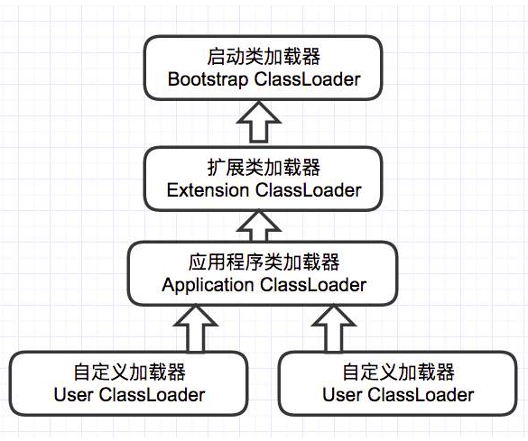

**作用**  

```
像java.lang.Object这些存放在rt.jar中的类，无论使用哪个类加载器加载，最终都会委


java.lang.Object.class  
派给最顶端的启动类加载器加载，从而使得不同加载器加载的Object类都是同一个。 

Object.class       Object.class
```

**双亲委派模型的代码在java.lang.ClassLoader类中的loadClass函数中实现：**

```java
protected Class<?> loadClass(String name, boolean resolve)
        throws ClassNotFoundException
    {
        synchronized (getClassLoadingLock(name)) {
            // 检查类是否被加载
            Class<?> c = findLoadedClass(name);
            if (c == null) {
                long t0 = System.nanoTime();
                try {
                	//若未加载，则调用父类加载器的loadClass方法
                    if (parent != null) {
                        c = parent.loadClass(name, false);
                    } else {
                    	// 没有父类则调用 BootstrapClassLoader
                        c = findBootstrapClassOrNull(name);
                    }
                } catch (ClassNotFoundException e) {
                    // 若该方法抛出ClassNotFoundException异常，表示父类加载器无法加载
                }
                if (c == null) {
                    // 则当前类加载器调用findClass加载类
                    long t1 = System.nanoTime();
                    c = findClass(name);
                    // this is the defining class loader; record the stats
                    sun.misc.PerfCounter.getParentDelegationTime().addTime(t1 - t0);
                    sun.misc.PerfCounter.getFindClassTime().addElapsedTimeFrom(t1);
                    sun.misc.PerfCounter.getFindClasses().increment();
                }
            }
            if (resolve) {
                resolveClass(c);
            }
            return c;
        }
    }
```

**过程小结**

```
1.首先检查类是否被加载；
2.若未加载，则调用父类加载器的loadClass方法；
3.若该方法抛出ClassNotFoundException异常，表示父类加载器无法加载，则当前类加载器调用findClass加载类；
4.若父类加载器可以加载，则直接返回Clas象。
```

1. 内存溢出问题排查

jconsole   监控到项目中内存出现问题

jmap  将堆内存快照进行打印

jprofiler 分析内存快照，定位到占用内存比较大的对象

调整堆内存的大小  -Xms    -Xmx

## JVM性能监控与故障处理工具

有没有解决过生产环境的问题?

内存溢出问题的排查

CPU使用率百分百的排查


### 概述

```
	假如我们需要排查定位一些系统问题， 知识、经验是关键基础，数据是依据，那么工具就是运用知识处理数据的手段。这里面指的数据包括：运行日志、异常堆栈、GC日志、线程快照、堆转储快照等等。 经常使用适当的虚拟机监控和分析的工具可以加快我们分析数据、定位解决问题的速度。

	我们可能都知道，在JDK的安装目录中有 "java.exe"、"javac.exe"这两个命令行工具，但可能很多人都不了解bin目录中其它命令行的作用。每当JDK版本更新后，这个目录下总是默默的多出了一些命令行。接下来，我们就要去了解这些工具，主要去了解监视虚拟机和故障处理的一些工具。
```

### JDK的命令行工具

#### **jps:虚拟机进程状况工具**

```
可以列出当前系统正在运行的虚拟机进程

命令格式：
jps [options] [hostid]
```

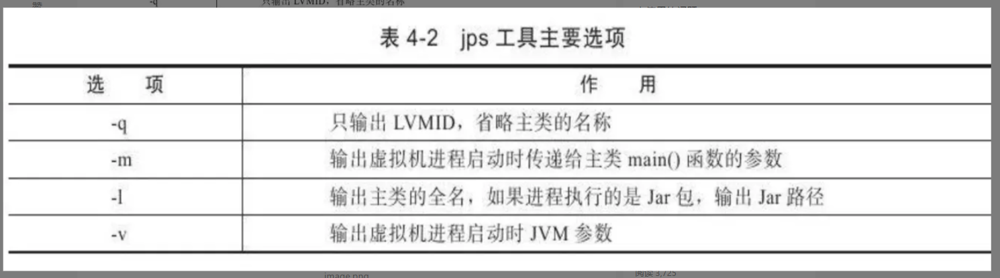


#### **jmap:java内存映像工具**

```

用于生成堆转储快照，一般称为heapdump 或 dump文件，如果不使用jmap命令 也很暴力的通过：
-XX:+HeapDumpOnOutOfMemoryError参数，可以让虚拟机出现OOM异常之后自动生成dump文件。

如：-XX:+HeapDumpOnOutOfMemoryError -XX:HeapDumpPath=D:/test.hprof
    在发生OOM时打印快照， 并且指定快照的路径

命令格式：
jmap [option] vmid

//将904虚拟机的内存映像存储到当前文件夹的ddd.hprof文件中
jmap -dump:format=b,file=ddd.hprof 2509
```

#### JProfiler:虚拟机堆转储快照分析工具

```
与jmap搭配使用，用于分析dump文档，内置了http服务器，可以在浏览器中进行分析   
```


> Java堆内存OOM是经常会见到的异常，"java.lang.OutOfMemoryError" 跟着会提示 "Java heap space",要解决这个区域的异常，一般的手段是先通过内存映像分析工具对Dump出来的堆转储快照进行分析 
>
> (分析工具  采用Idea + JProfiler神器  安装方法：https://blog.csdn.net/wytocsdn/article/details/79258247)

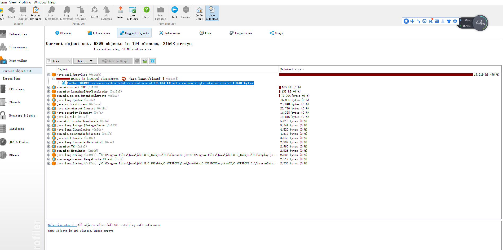

```
通过dump文件进行分析，重点确认内存中的对象是否是必要的，也就是先要分析是内存泄漏还是内存溢出的问题，如果是内存泄漏 可通过工具进一步查询泄漏对象到CG Roots的引用连， 找到无法回收的原因。
如果不存在泄露，可以检查虚拟机的堆参数(-Xmx 与 -Xms),看看是否可以调大一些。
```

#### **jstack:java堆栈跟踪工具**

```java
用于生成虚拟机当前时刻的线程快照，线程快照就是当前虚拟机内每一条线程正在执行的方法堆栈的集合。用于分析线程死锁、死循环、请求外部资源时间过长等常见原因
显示指定JVM的线程快照
jstack pid 
jstack pid > xxx.txt
项目准备：
在linux系统模拟生产环境
通过 nohup java -jar 项目jar.jar > 日志文件 &  启动项目
让我们的springboot项目在后台运行，并且将运行日志输出到指定目录
启动项目命令:

nohup java \
-Djava.rmi.server.hostname=192.168.200.151 \
-Dcom.sun.management.jmxremote \
-Dcom.sun.management.jmxremote.port=1099 \
-Dcom.sun.management.jmxremote.authenticate=false \
-Dcom.sun.management.jmxremote.ssl=false \
-Xms200m -Xmx200m \
-jar jvmDemo.jar >myDemo.log 2>&1 &
    

    上面命令含义：后台运行java项目  、 开启允许远程连接监控 允许的端口1099  
                未设置登录认证
                开启堆内存溢出时转存快照，   快照的地址    
生产环境排查 CPU飙高,解决方案：
1.使用 top命令查看CPU情况   
2.得到内存高的进程ID
3.top -p pid -H     2752
    

4.查看最高的线程PID 因为是十进制的 需要进行16进制的转换
	printf "%x" pid
5.jstack pid > pid.log
6.   /线程ID 模糊查询
7. 线程的状态是Runnable 代表线程正在运行
8. 根据下面详细的方法调用信息，定位到具体方法

//使用Springboot快速创建一个项目 提供一个增删改查的方法
public String findAll(boolean t){

        while (t){
            //--
        }
        return "循环完毕";
}

生产环境排查 死锁：
通过jstack命令  可以直接识别死锁

//死锁代码
public String findAll2(){
        Object o1 = new Object();
        Object o2 = new Object();
        new Thread(()->{
            synchronized (o1){
                try {
                    Thread.sleep(1000);
                    synchronized (o2){
                        System.out.println("线程1执行");
                    }
                } catch (InterruptedException e) {
                    e.printStackTrace();
                }
            }
        }).start();
        new Thread(()->{
            synchronized (o2){
                try {
                    Thread.sleep(1000);
                    synchronized (o1){
                        System.out.println("线程2执行");
                    }
                } catch (InterruptedException e) {
                    e.printStackTrace();
                }
            }
        }).start();
        return "死锁方法调用完毕";
    }
    

// 线程快照 提示我们发生死锁
Found one Java-level deadlock:
=============================
"Thread-3":
  waiting to lock monitor 0x000000000172ae38 (object 0x00000000ee89cbb0, a java.lang.Object),
  which is held by "Thread-2"
"Thread-2":
  waiting to lock monitor 0x00007ff26c0062c8 (object 0x00000000ee89cbc0, a java.lang.Object),
  which is held by "Thread-3"
// 死锁的详细信息
Java stack information for the threads listed above:
===================================================
"Thread-3":
	at com.example.demo.UserService.lambda$findAll2$1(UserService.java:44)
	- waiting to lock <0x00000000ee89cbb0> (a java.lang.Object)
	- locked <0x00000000ee89cbc0> (a java.lang.Object)
	at com.example.demo.UserService$$Lambda$460/67019755.run(Unknown Source)
	at java.lang.Thread.run(Thread.java:748)
"Thread-2":
	at com.example.demo.UserService.lambda$findAll2$0(UserService.java:32)
	- waiting to lock <0x00000000ee89cbc0> (a java.lang.Object)
	- locked <0x00000000ee89cbb0> (a java.lang.Object)
	at com.example.demo.UserService$$Lambda$459/221862972.run(Unknown Source)
	at java.lang.Thread.run(Thread.java:748)

        
        
内存溢出排查
-XX:+HeapDumpOnOutOfMemoryError -XX:HeapDumpPath=D:/test.hprof
```


### JDK的可视化工具

```
JDK除了提供大量的命令行工具外，还有两个功能强大的可视化工具：JConsole 和 VisualVM ,这两个工具是JDK的正式成员，功能非常强大！
```

#### jconsole:Java监视与管理控制台

通过jdk/bin目录下的 jconsole.exe启动JConsole,将会自动的搜索出本机的所有java虚拟机进程

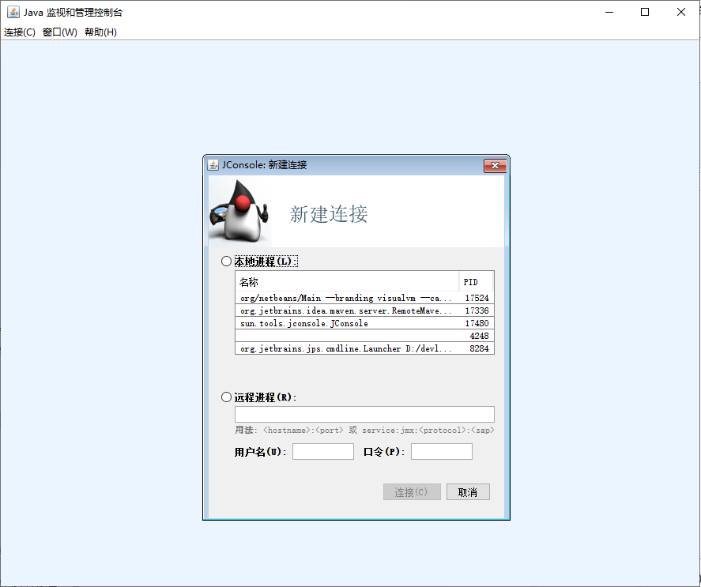

```
在本地进程中会列出本地 正在运行的java虚拟机列表，也可以远程连接其他服务器的java服务器,现在我们选择
JConsoleTest1的进程，并且将堆的大小固定在100MB, 每个隔一小段时间向集合中装入128KB的数据，并注意JConsole监控中个数据指标的变化。
```

```java
/**
 * VM Args: -Xms100m -Xmx100m -XX:+UseSerialGC
 **/
public class JConsoleTest1 {
    static class OOMObject{
        public byte[] placeholder = new byte[128*1024];
    }
    public static void fillHeap(int num) throws InterruptedException {
        List<OOMObject> list = new ArrayList<OOMObject>();
        for (int i = 0; i < num; i++) {
            Thread.sleep(100);
            list.add(new OOMObject());
        }
        System.gc();
        Thread.sleep(5000);
    }

    public static void main(String[] args) throws InterruptedException {
        fillHeap(500);

        fillHeap(1000);
    }
}
```


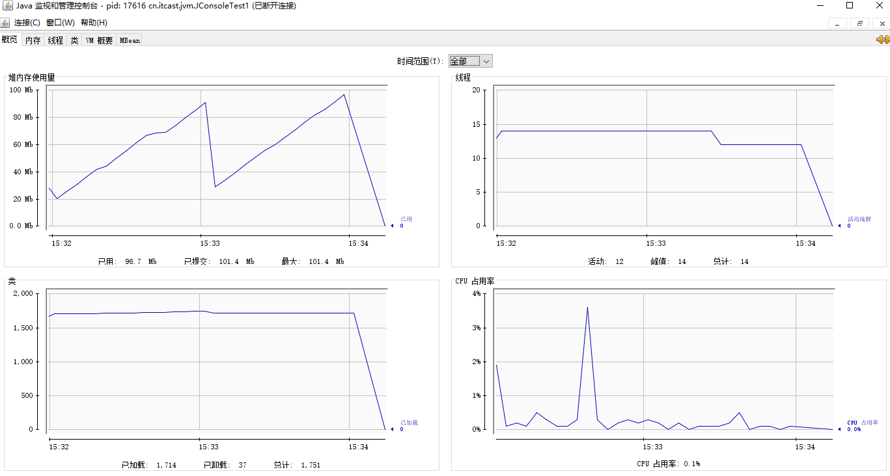


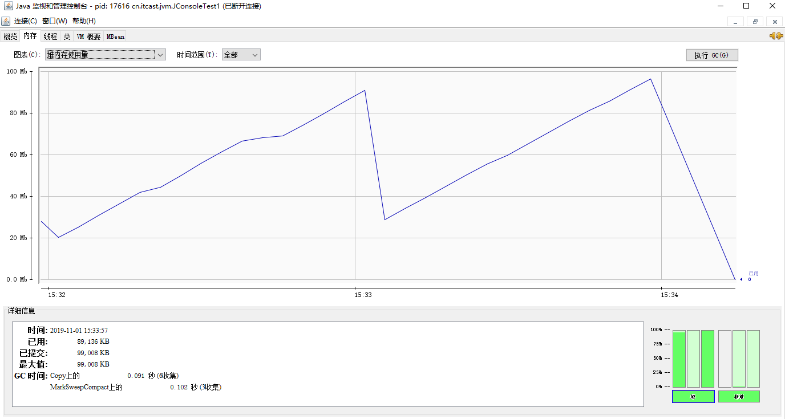


## JVM调优小结

```
JVM参数调优实际上没有具体的答案，要根据不同的实战场景进行对应的设置，还需要不断的调试和磨合，设置的不好，JVM不断执行Full GC，导致整个系统变得很慢，网站停滞时间能达10秒以上，这种情况如果没隔几分钟就来一次，自己都受不了。这种停滞在测试的时候看不出来，只有网站pv达到数十万/天的时候问题就暴露出来了。
所以对于JVM调优的话术，我们可以这么说，结合我们公司之前的经验，对于JVM调优我们可以从下面方向进行分析：
互联网项目   64 Linux Centos6.5  8GB

1：如果服务器硬件性能足够，建议采用64位操作系统，Linux下64位的jdk比32位jdk要慢一些，但是吃得内存更多，吞吐量更大。


2：XMX和XMS设置一样大，MaxPermSize和MinPermSize设置一样大，这样可以减轻伸缩堆大小带来的压力。


3:  -Xmn年轻代的大小，      并行：吞吐量       并发：低延迟  
	-XX:NewRadio年轻代和年老代的比值，
	Sun建议 年轻代与年老代的比例：3/8
	
	
4:  垃圾回收器的选择：
		      
	响应时间优先的应用:并发收集器 ParNew + CMS（老年代）     或者 G1 
	                                + Serial Old (STW)
	
	吞吐量优先的应用：并行收集器  Parallel Scavenge + Parallel Old
	使用并发收集器，肯定就是追求最小的响应时间，所以应该减少年轻代，加大年老代，这样可以利用年老代的并发CMS收集器来减少响应时间。
	使用并发收集器，一般是最求吞吐量优先的应用，会加大年轻代，缩小年老代。这样可以在年轻代回收掉大部分短期对象，减少中期对象，而老年代只存少部分长时间存活的对象。
	（年老代的并发收集器使用标记,清除算法,所以不会对堆进行压缩.当收集器回收时,他会把相邻的空间进行合并,这样可以分配给较大的对象.但是,当堆空间较小时,运行一段时间以后,就会出现"内存碎片",如果并发收集器找不到足够的空间,那么并发收集器将会停止,然后使用传统的标记,清除方式进行回收.如果出现"碎片",可能需要进行如下配置:
-XX:+UseCMSCompactAtFullCollection:使用并发收集器时,开启对年老代的压缩.
-XX:CMSFullGCsBeforeCompaction=0:上面配置开启的情况下,这里设置多少次Full GC后,对年老代进行压缩
）

5：调试的时候设置一些打印参数
	如：	-XX:+PrintClassHistogram 
		 -XX:+HeapOnOutOfMerroryError
		 -XX:+PrintGCDetails 
		 -XX:+PrintGCTimeStamps 
		 -XX:+PrintHeapAtGC 
		 -Xloggc:log/gc.log
   这样可以让jvm虚拟机打印出类加载的情况，堆转储的快照，GC的详细回收日志 等等日志信息
	
6：当系统发生停顿的时候可能是GC的问题也可能是程序的问题，还有内存飙高，系统响应慢的时候，多利用jvm的监控工具实时注意jvm虚拟机的情况。 如可以通过jmap转储堆内存情况，通过jstack可以打印出线程的快照，在通过JProfiler或者JVisoulVM的分析工具进行分析。  -- 这里可以加入JVM调优案例

7：仔细了解自己的应用，如果用了缓存，那么年老代应该大一些

8：垃圾回收时promotion failed是个很头痛的问题，一般可能是两种原因产生
第一个原因是救助空间不够，救助空间里的对象还不应该被移动到年老代，但年轻代又有很多对象需要放入救助空间；第二个原因是年老代没有足够的空间接纳来自年轻代的对象；这两种情况都会转向Full GC，网站停顿时间较长。
第一个原因我的最终解决办法是去掉救助空间，
设置-XX:SurvivorRatio=65536 -XX:MaxTenuringThreshold=0即可

第二个原因我的解决办法是设置CMSInitiatingOccupancyFraction为某个值（假设70），这样年老代空间到70%时就开始执行CMS，年老代有足够的空间接纳来自年轻代的对象。
```

```
服务器： centos 6.4    linux64位操作系统   8G内存：   70~80 

B/S   低延迟    并发垃圾收集   CMS 

每日百万PV，无压力：   

$JAVA_ARGS .= " -Dresin.home=$SERVER_ROOT 
-server  
-Xms6000M    //堆初始值内存  
-Xmx6000M    //堆的最大内存     8G   70%
-Xmn500M     //新生代内存    CMS 老年代    3 / 8
-XX:PermSize=500M    //永久代初始值 M 
-XX:MaxPermSize=500M //永久代最大值 
-XX:SurvivorRatio=65536 //新生代救助区和Eden区比值这么设置实际上是去掉救助区
-XX:MaxTenuringThreshold=0  //新生代对象晋升老年的代年龄，设置0
-Xnoclassgc  //不开启class收集
-XX:+DisableExplicitGC  //禁止 System.gc()显示调用，防止手残党
-XX:+UseParNewGC       //年轻代垃圾收集器  ParNewGC
-XX:+UseConcMarkSweepGC   //年老代垃圾收集器 CMS
// ParNew + CMS (老年代)   +   Serial Old (担保)   STW
// CMS 无法收集时 会使用串行收集器  
// 标记 清除  会产生内存碎片  
-XX:+UseCMSCompactAtFullCollection  //开启内存压缩功能   
-XX:CMSFullGCsBeforeCompaction=0  // 几次FullGC后出发碎片清理
-XX:+CMSClassUnloadingEnabled   //开启永久代回收
-XX:-CMSParallelRemarkEnabled 
-XX:CMSInitiatingOccupancyFraction=80  //老年代占用多少时 进行老年代回收
// 调优参数的打印
-XX:+PrintClassHistogram  //打印class加载信息   
-XX:+PrintGCDetails  //打印GC详细信息 
-XX:+PrintGCTimeStamps  //打印GC时间戳信息
-XX:+PrintHeapAtGC   //打印GC 堆的信息
-Xloggc:log/gc.log "; // GC的日志的地址


综合浏览量（PV）：即Page View, 即页面浏览量或点击量，用户每次刷新即被计算一次。
并发连接数 = PV / 统计时间 * 页面衍生连接次数 * http响应时间 * 因数 / web服务器数量
页面衍生连接次数: 一个HTML页面可能会请求好几次http连接，如外部的css, js,图片等,可以估算一下，或者用10,可根据实际情况改变
http响应时间: 可以使用1秒或更少,可根据实际情况改变
因数: 一般使用5即可,可根据实际情况计算后推出
web服务器数量: web服务器数量

(1000000PV / 86400秒 * 5个派生连接数 * 2秒内响应 * 5倍峰值) / 1台Web服务器  约 600左右并发~1000
```


## JVM相关面试题汇总

**说一下 JVM 的主要组成部分？及其作用？**

```
类加载器（ClassLoader）
运行时数据区（Runtime Data Area）
执行引擎（Execution Engine）
本地库接口（Native Interface）
组件的作用： 首先通过类加载器（ClassLoader）会把 Java 代码转换成字节码，运行时数据区（Runtime Data Area）再把字节码加载到内存中，而字节码文件只是 JVM 的一套指令集规范，并不能直接交给底层操作系统去执行，因此需要特定的命令解析器执行引擎（Execution Engine），将字节码翻译成底层系统指令，再交由 CPU 去执行，而这个过程中需要调用其他语言的本地库接口（Native Interface）来实现整个程序的功能
```

**说一下 JVM 运行时数据区？详细介绍下每个区域的作用?**

```
程序计数器（Program Counter Register）：当前线程所执行的字节码的行号指示器
Java 虚拟机栈（Java Virtual Machine Stacks）：用于存储局部变量表、操作数栈、动态链接、方法出口等信息；
本地方法栈（Native Method Stack）：与虚拟机栈的作用是一样的，只不过虚拟机栈是服务 Java 方法的，而本地方法栈是为虚拟机调用 Native 方法服务的；
Java 堆（Java Heap）：Java 虚拟机中内存最大的一块，是被所有线程共享的，几乎所有的对象实例都在这里分配内存；
方法区（Methed Area）：用于存储已被虚拟机加载的类信息、常量、静态变量、即时编译后的代码等数据。
```

**java中都有哪些类加载器**

```
启动类加载器（Bootstrap ClassLoader）
扩展类加载器（Extension ClassLoader）
应用程序类加载器（Application ClassLoader）

自定义类加载器：通过继承ClassLoader抽象类，实现loadClass方法
```

**哪些情况会触发类加载机制**

```
1.在遇到 new、putstatic、getstatic、invokestatic 字节码指令时，如果类尚未初始化，则需要先触发初始化。    
2.对类进行反射调用时，如果类还没有初始化，则需要先触发初始化。
3.初始化一个类时，如果其父类还没有初始化，则需要先初始化父类。
4.虚拟机启动时，用于需要指定一个包含 main() 方法的主类，虚拟机会先初始化这个主类。
```

**什么是双亲委派模型？**

```
如果一个类加载器收到了类加载的请求，它首先不会自己去加载这个类，而是把这个请求委派给父类加载器去完成，每一层的类加载器都是如此，这样所有的加载请求都会被传送到顶层的启动类加载器中，只有当父加载无法完成加载请求（它的搜索范围中没找到所需的类）时，子加载器才会尝试去加载类。
```

**说一下类装载的执行过程？**

```
类装载分为以下 5 个步骤：

加载：根据查找路径找到相应的 class 文件然后导入；
检查：检查加载的 class 文件的正确性；
准备：给类中的静态变量分配内存空间；
解析：虚拟机将常量池中的符号引用替换成直接引用的过程。符号引用就理解为一个标示，而在直接引用直接指向内存中的地址；
初始化：对静态变量和静态代码块执行初始化工作。
```

**怎么判断对象是否可以被回收？**

```
一般有两种方法来判断：

引用计数器：为每个对象创建一个引用计数，有对象引用时计数器 +1，引用被释放时计数 -1，当计数器为 0 时就可以被回收。它有一个缺点不能解决循环引用的问题；

可达性分析：从 GC Roots 开始向下搜索，搜索所走过的路径称为引用链。当一个对象到 GC Roots 没有任何引用链相连时，则证明此对象是可以被回收的。

```

**哪些变量可以作为GC Roots**

```
虚拟机栈中 (栈帧中的本地变量表) 引用的对象 
方法区中类静态属性引用的对象
方法区中常量的引用对象
本地方法栈中引用的对象
```

**Java** **中都有哪些引用类型？**

```
强引用：发生 gc 的时候不会被回收。
软引用：有用但不是必须的对象，在发生内存溢出之前会被回收。
弱引用：有用但不是必须的对象，在下一次GC时会被回收。
虚引用（幽灵引用/幻影引用）：无法通过虚引用获得对象，用途是在gc时返回一个通知。
```

**说一下 JVM 有哪些垃圾回收算法？**

```
标记-清除算法：标记无用对象，然后进行清除回收。缺点：效率不高，无法清除垃圾碎片。

标记-整理算法：标记无用对象，让所有存活的对象都向一端移动，然后直接清除掉端边界以外的内存。

复制算法：按照容量划分二个大小相等的内存区域，当一块用完的时候将活着的对象复制到另一块上，然后再把已使用的内存空间一次清理掉。
缺点：内存使用率不高，只有原来的一半。

分代算法：根据对象存活周期的不同将内存划分为几块，一般是新生代和老年代，新生代基本采用复制算法，老年代采用标记整理或标记清楚算法。
```

**说一下 JVM 有哪些垃圾回收器？**

```
Serial：最早的单线程串行垃圾回收器。
Serial Old：Serial 垃圾回收器的老年版本，同样也是单线程的，可以作为 CMS 垃圾回收器的备选预案。
ParNew：是 Serial 的多线程版本。
Parallel 和 ParNew 收集器类似是多线程的，但 Parallel 是吞吐量优先的收集器，可以牺牲等待时间换取系统的吞吐量。
Parallel Old 是 Parallel 老生代版本，Parallel 使用的是复制的内存回收算法，Parallel Old 使用的是标记-整理的内存回收算法。
CMS：一种以获得最短停顿时间为目标的收集器，非常适用 B/S 系统。
G1：一种兼顾吞吐量和停顿时间的 GC 实现，是 JDK 9 以后的默认 GC 选项。

```

**简述分代垃圾回收器是怎么工作的？**

```
分代回收器有两个分区：老生代和新生代，新生代默认的空间占比总空间的 1/3，老生代的默认占比是 2/3。

新生代使用的是复制算法，新生代里有 3 个分区：Eden、To Survivor、From Survivor，它们的默认占比是 8:1:1，它的执行流程如下：

所有新创建对象，都会在Eden区分配，当Eden装不下新对象时触发新生代的垃圾回收，
把 Eden + From Survivor 存活的对象复制到 To Survivor 区；
清空 Eden 和 From Survivor 分区；
From Survivor 和 To Survivor 分区交换，From Survivor 变 To Survivor，To Survivor 变 From Survivor。
每次在 From Survivor 到 To Survivor 移动时都存活的对象，年龄就 +1，当年龄到达 15（默认配置是 15）时，升级为老生代。大对象也会直接进入老生代。

老生代当空间占用到达某个值之后就会触发全局垃圾收回，一般使用标记整理的执行算法。以上这些循环往复就构成了整个分代垃圾回收的整体执行流程。

```

**Minor GC与Full GC分别在什么时候发生？**

```
新生代内存不够用时候发生Minor GC也叫 Young GC，
老年代内存不够用时候发生Major GC也可以称为 Full GC 
```

 **有没有在生产环境下进行过JVM调优，说说过程?**

```
基于 jmap + jprofiler 内存溢出问题排查, 使用 -Xmx -Xms设置调整堆大小

基于 jstack + jconsole cpu飙高问题排查, 通过对栈快照定位代码问题

基于 JVM 参数调优
```

**常用的 JVM 调优的参数都有哪些？**

```
-Xms2g：初始化推大小为 2g；
-Xmx2g：堆最大内存为 2g；
-Xmn500M 设置年轻代为500m;
-XX:PermSize=500M ；  1.8之后采用 MetaspaceSize
-XX:MaxPermSize=500M ；  1.8之后采用 MaxMetaspaceSize
-XX:NewRatio=4：设置年轻的和老年代的内存比例为 1:4；
-XX:SurvivorRatio=8：设置新生代 Eden 和 Survivor 比例为 8:2；
-XX:+UseConcMarkSweepGC：指定使用 CMS + Serial Old 垃圾回收器组合；
-XX:+PrintGC：开启打印 gc 信息；
-XX:+PrintGCDetails：打印 gc 详细信息。
-XX:MaxDirectMemorySize : 设置直接内存的大小
```

