# 微服务中分布式锁实现与原理分析

### 引言

现在的IT市场，分布式架构已经成为了企业中的主流架构，几乎绝大部分的企业在招聘中都有微服务相关技术，或SOA面向服务架构 或至少了解分布式架构的相关技术，不可否认分布式架构可以给企业带来非常多的好处，但也带来了更多的挑战:

**使用分布式系统的优势：**

- 1.增大系统容量。我们的业务量越来越大，而要能应对越来越大的业务量，一台机器的性能已经无法满足了，我们需要多台机器才能应对大规模的应用场景。所以，我们需要垂直或是水平拆分业务系统，让其变成一个分布式的架构。
- 2.加强系统可用。我们的业务越来越关键，需要提高整个系统架构的可用性，这就意味着架构中不能存在单点故障。这样，整个系统不会因为一台机器出故障而导致整体不可用。所以，需要通过分布式架构来冗余系统以消除单点故障，从而提高系统的可用性。
- 3.因为模块化，所以系统模块重用度更高
- 4.因为软件服务模块被拆分，开发和发布速度可以并行而变得更快
- 5.系统扩展性更高
- 6.团队协作流程也会得到改善

**使用分布式系统面对的挑战：**

- 1.架构设计变得复杂（分布式锁，分布式事务）
- 2.部署单个服务会比较快，但是如果一次部署需要多个服务，部署会变得复杂（持续集成持续部署）
- 3.系统的吞吐量会变大，但是响应时间会变长
- 4.运维复杂度会因为服务变多而变得很复杂
- 5.架构复杂导致学习曲线变大
- 6.测试和排错的复杂度增大(链路追踪，分布式日志)
- 7.服务的治理和调度变得困难和复杂

### 第一章：演示案例-超卖问题分析

**环境搭建** 

1：使用spring快速构建一个秒杀抢购的场景，如下：

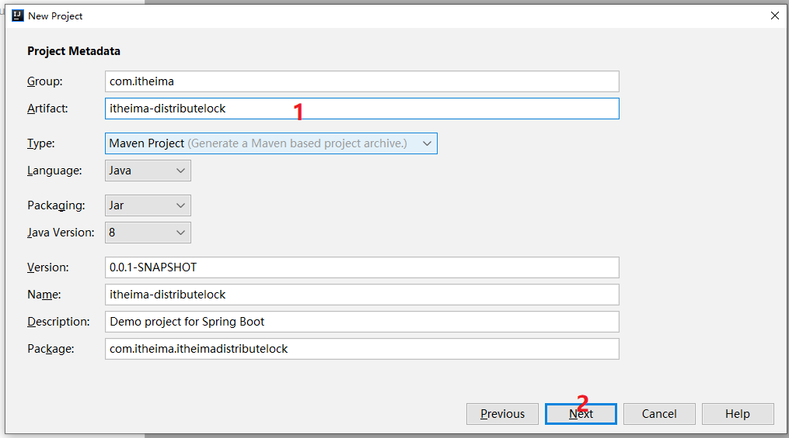

2：导入依赖

```xml
		<dependency>
            <groupId>org.springframework.boot</groupId>
            <artifactId>spring-boot-starter-jdbc</artifactId>
        </dependency>
        <dependency>
            <groupId>org.springframework.boot</groupId>
            <artifactId>spring-boot-starter-web</artifactId>
        </dependency>
        <dependency>
            <groupId>mysql</groupId>
            <artifactId>mysql-connector-java</artifactId>
            <scope>runtime</scope>
            <version>5.1.10</version>
        </dependency>
        <dependency>
            <groupId>org.projectlombok</groupId>
            <artifactId>lombok</artifactId>
            <optional>true</optional>
        </dependency>
        <dependency>
            <groupId>org.springframework.boot</groupId>
            <artifactId>spring-boot-starter-test</artifactId>
            <scope>test</scope>
        </dependency>
        <dependency>
            <groupId>org.apache.zookeeper</groupId>
            <artifactId>zookeeper</artifactId>
            <version>3.4.14</version>
        </dependency>
        <dependency>
            <groupId>com.101tec</groupId>
            <artifactId>zkclient</artifactId>
            <version>0.10</version>
        </dependency>
        <dependency>
            <groupId>org.redisson</groupId>
            <artifactId>redisson</artifactId>
            <version>3.11.2</version>
        </dependency>
        <dependency>
            <groupId>redis.clients</groupId>
            <artifactId>jedis</artifactId>
            <version>2.10.2</version>
        </dependency>
        <dependency>
            <groupId>org.apache.commons</groupId>
            <artifactId>commons-pool2</artifactId>
            <version>2.6.2</version>
        </dependency>
        <dependency>
            <groupId>com.alibaba</groupId>
            <artifactId>druid-spring-boot-starter</artifactId>
            <version>1.1.18</version>
        </dependency>
        <dependency>
            <groupId>com.alibaba</groupId>
            <artifactId>fastjson</artifactId>
            <version>1.2.38</version>
        </dependency>
        <dependency>
            <groupId>org.apache.commons</groupId>
            <artifactId>commons-lang3</artifactId>
            <version>3.6</version>
        </dependency>
        <dependency>
            <groupId>org.apache.curator</groupId>
            <artifactId>curator-framework</artifactId>
            <version>4.2.0</version>
        </dependency>
        <dependency>
            <groupId>org.apache.curator</groupId>
            <artifactId>curator-recipes</artifactId>
            <version>4.2.0</version>
        </dependency>
```

3：连接数据库信息

```properties
server.port=9898

#druid
spring.datasource.url=jdbc:mysql://localhost:3306/kekeb;og?useUnicode=true&characterEncoding=utf-8&allowMultiQueries=true&useSSL=false
spring.datasource.username=root
spring.datasource.password=root
spring.datasource.driver-class-name=com.mysql.jdbc.Driver
spring.datasource.type=com.alibaba.druid.pool.DruidDataSource

```

4：数据表信息

```sql
SET FOREIGN_KEY_CHECKS=0;
-- ----------------------------
-- Table structure for tb_goods
-- ----------------------------
DROP TABLE IF EXISTS `tb_goods`;
CREATE TABLE `tb_goods` (
  `goods_code` varchar(255) DEFAULT NULL,
  `goods_num` int(11) DEFAULT NULL
) ENGINE=InnoDB DEFAULT CHARSET=utf8;
-- ----------------------------
-- Records of tb_goods
-- ----------------------------
INSERT INTO `tb_goods` VALUES ('banala', '234');
INSERT INTO `tb_goods` VALUES ('dress', '356789');
INSERT INTO `tb_goods` VALUES ('shirt', '2334');
INSERT INTO `tb_goods` VALUES ('apple', '0');

```

5：GoodStockDao.java用于扣库存和记录购买信息

```java
@Repository
public class GoodStockDao {

    @Autowired
    private JdbcTemplate jdbcTemplate;


    // 1： 没有加锁的代码，不会请求延时而阻塞
    //2： 如果加了synchronized那么就上锁，

    // 查询商品的查询对应商品的库存
    public int getStock(String goodId){
        try{
            String sql = "select goods_num from tb_goods where goods_code = ?";
            Integer integer = jdbcTemplate.queryForObject(sql,Integer.class,goodId);
            return  integer;
        }catch(Exception ex){
            ex.printStackTrace();
           return 0;
        }
    }


    // 扣减商品的库存数
    @Transactional(rollbackFor = Exception.class)
    public boolean buy(String userId,String goodId,int stock){
        //商品数量减去1
        String sql = "update tb_goods set goods_num = goods_num - "+stock+" where goods_code = ?";
        //String sql = "update tb_goods set goods_num = goods_num - "+stock+" where goods_code = ? and  goods_num -"+stock+">=0";
        int count = jdbcTemplate.update(sql,goodId);
        if(count!=1){
            throw  new BuyException("商品扣减失败...");
        }
        // 添加记录
        String insertSQL = "insert into tb_records (goods_code,user_id,stock) values (?,?,?)";
        int count2 = jdbcTemplate.update(insertSQL,goodId,userId,stock);
        if(count2!=1){
            throw  new BuyException("商品扣减失败...");
        }
        return true;
    }

}

```

6：GoodsSerivice.java

```java
@Service
@Scope("prototype")
public class GoodsSerivice {
	@Autowired
	private GoodStockDao goodStockDao;
	public boolean buy(String userId,String goodId,int buyNum){
		boolean result = false;
		int num = goodStockDao.getStock(goodId);
		if(num < buyNum){
			System.out.println("商品库存不足，不在扣减....");
			return false;
		}
		System.out.println("用户"+userId+",扣减商品："+goodId+"，数量：" + buyNum);
		result =goodStockDao.buy(userId,goodId,buyNum);
		System.out.println("用户"+userId+",扣减商品之后："+goodId+"，结果是：" + result);
		return result;
	}
}

```

### 第二章：解决超卖问题 -- Java中的锁

**目标**

掌握lock和synchorized的应用

**场景分析**

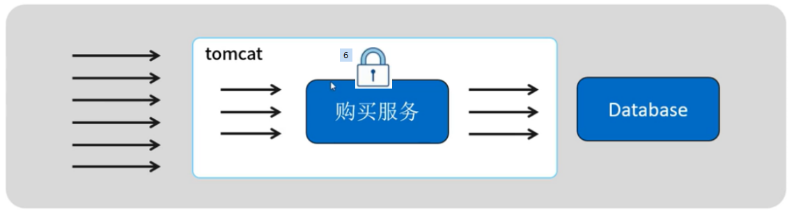

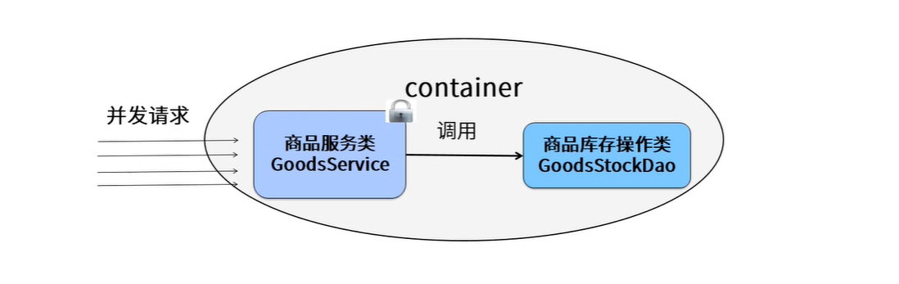

**结合案例场景分析**

**synchronized版本**

```java
/**
 * 使用JVM中提供的锁:
 *   synchronized
 */
@Service("goodsSyncService")
@Scope("prototype")
public class GoodsSyncSerivice  implements GoodsService {
	@Autowired
	private GoodStockDao goodStockDao;
	@Transactional(rollbackFor = Exception.class)
	public synchronized   boolean buy(String userId,String goodId,int buyNum){
		boolean result;
		int num = goodStockDao.getStock(goodId);
		if(num < buyNum){
			System.out.println("商品库存不足，不在扣减....");
			return false;
		}
		System.out.println("用户"+userId+",扣减商品："+goodId+"，数量：" + buyNum);
		result =goodStockDao.buy(userId,goodId,buyNum);
		System.out.println("用户"+userId+",扣减商品之后："+goodId+"，结果是：" + result);
		return result;
	}
}
```

**Lock版本**

```java
@Service
@Scope("prototype")
public class GoodsLockSerivice {
	@Autowired
	private GoodStockDao goodStockDao;
	Lock lock = new ReentrantLock();
	public  boolean buy(String userId,String goodId,int buyNum){
		lock.lock();
		try {
			boolean result = false;
			int num = goodStockDao.getStock(goodId);
			if(num < buyNum){
				System.out.println("商品库存不足，不在扣减....");
				return false;
			}
			System.out.println("用户"+userId+",扣减商品："+goodId+"，数量：" + buyNum);
			result =goodStockDao.buy(userId,goodId,buyNum);
			System.out.println("用户"+userId+",扣减商品之后："+goodId+"，结果是：" + result);
			return result;
		}finally {
			lock.unlock();
		}
	}
}

```


### 第三章：分布式锁的概念和实现方案：

**概述：**

何谓分布式锁？

在分布式系统中，常常 需要去协调他们的动作。如果不同的系统或是同一个系统的不同主机之间共享了一个或一组资源，那么访问这些资源的时候，往往需要互斥来防止彼此干扰来保证一致性，在这种情况下，便需要使用到分布式锁。

分布式锁是： 控制分布式系统之间 同步访问共享资源 的一种方式。

**分布式锁架构如下：**

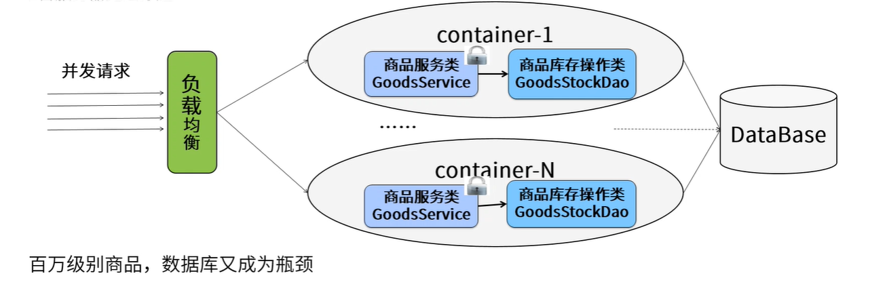

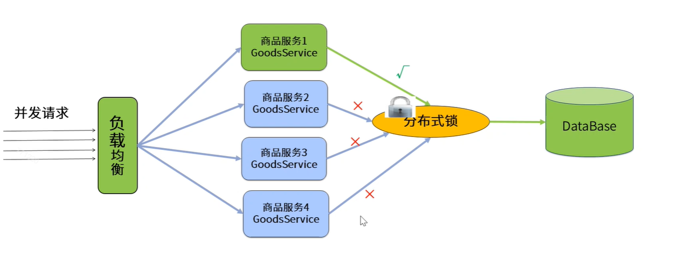

在实际应用开发过程中：项目都是集群部署的，采用的机制是都是用nginx+tomcat来完成集群部署，这个时候每一个服务器都是独立的jvm环境。分布式锁解决方案如下：

分布式锁是控制分布式系统之间同步访问共享资源的一种方式。在分布式系统中，常常需要协调他们的动作。如果不同的系统或是同一个系统的不同主机之间共享了一个或一组资源，那么访问这些资源的时候，往往需要互斥来防止彼此干扰来保证一致性，在这种情况下，便需要使用到分布式锁。

我们来假设一个最简单的秒杀场景：数据库里有一张表，column分别是商品ID，和商品ID对应的库存量，秒杀成功就将此商品库存量-1。现在假设有1000个线程来秒杀两件商品，500个线程秒杀第一个商品，500个线程秒杀第二个商品。我们来根据这个简单的业务场景来解释一下分布式锁。 

通常具有秒杀场景的业务系统都比较复杂，承载的业务量非常巨大，并发量也很高。这样的系统往往采用分布式的架构来均衡负载。那么这1000个并发就会是从不同的地方过来，商品库存就是共享的资源，也是这1000个并发争抢的资源，这个时候我们需要将并发互斥管理起来。这就是分布式锁的应用。 


**实现分布式锁的几种方案**

- 基于数据库实现:

  基于数据库的悲观锁 for update（行锁）实现（写入的并发的太大）

- 基于zookeeper实现:

​      基于zookeeper的文件系统及通知机制

- 基于redis的实现（推荐）:

​      基于redis单线程模型+setnx


### 第四章：解决超卖问题 -- 数据库的锁

**分析**

- 必须使用mysql的innodb引擎，在更新删除的时候，有行锁的功能
- 如果你是oracle数据库，那么就需要在语句上指定 for update

**场景分析**


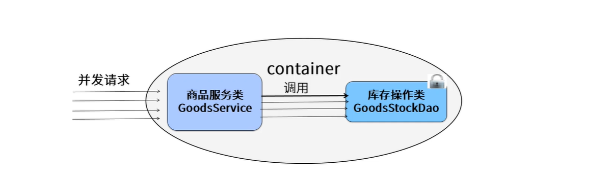

- 如果大量的请求和并发都怼到商品服务，这个始化可能会引发超卖和脏读的现象.

**存在问题**

- 数据库的压力过大，很容易造成死锁，
- 因为mysql数据库服务器本身处理的并发是有限的，连接资源不够用。所以这种解决方案在实际生产中不建议使用。


**贴近生产环境的数据库性能报告**

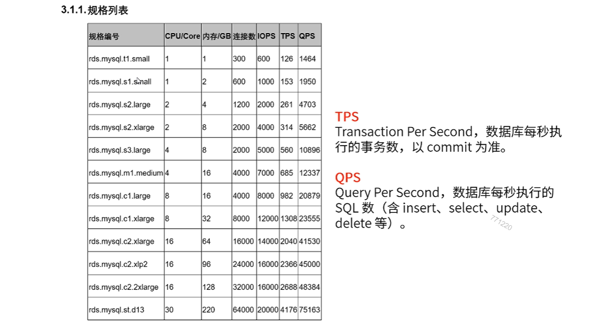

**分布式锁需要具备那些条件：**

- 互斥性：和我们本地锁一样互斥性是最基本的，但是分布式锁需要保证在不同节点的不同线程互斥。
- 可重入性：同一个节点上的同一个线程如果获取了锁之后，那么也可以再次获取这个锁。

- 锁超时：和本地锁一样支持锁超时，防止死锁。(redis expiretime)

- 锁的续约: 当程序响应时间过长时，能够续约锁的时间

- 高效：高可用：加锁和解锁需要高效，同时也需要保证高可用防止分布式锁失效，可以增加降级。
- 支持阻塞和非阻塞：和ReentrantLock一样支持Lock和tryLock以及tryLock(long timeout)。 
- 支持公平锁和非公平锁：公平锁的意思是按照请求加锁的顺序获取锁，非公平锁就相反是无序的，这个一般来说实现的比较少。


### 第五章：分布式锁实现 -- 基于Redis

#### 5.1 Jedis框架实现 

主要采用redis命令**setnx**（set if not exist）、**setex**（set expire value）实现

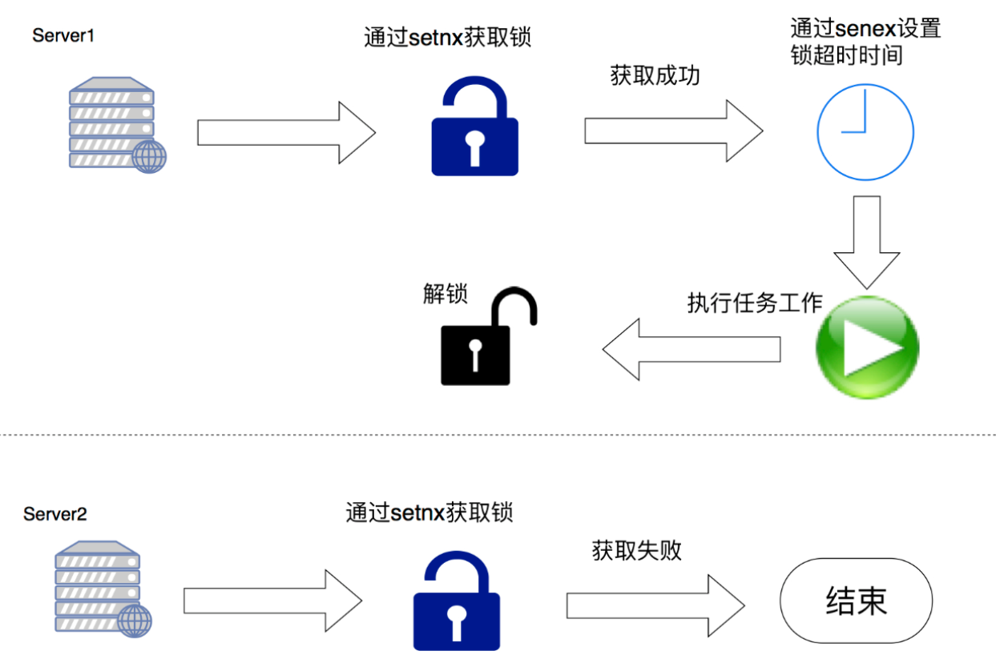


```java
/**
 * 分布式锁  redis实现
 * 未实现: 可重入 公平锁  锁的自动续约
 **/
@Component
public class DistrbutelockByRedis {
    public static final String UNLOCK_LUA;
    static {
        StringBuilder sb = new StringBuilder();
        sb.append("if redis.call(\"get\",KEYS[1]) == ARGV[1] ");
        sb.append("then ");
        sb.append("    return redis.call(\"del\",KEYS[1]) ");
        sb.append("else ");
        sb.append("    return 0 ");
        sb.append("end ");
        UNLOCK_LUA = sb.toString();
    }
    /**
     * // 如果存成功了  代表  得到了 锁
      // 如果  没存成功   接着尝试
     * @param jedis
     * @param lockKey
     * @param requestId
     * @param expireSecond
     */
    public void lock(Jedis jedis, String lockKey, String requestId, int expireSecond){
        long startTime = System.currentTimeMillis();
        while (true){
            // 获取锁  true
            boolean b = setLock(jedis, lockKey, requestId, expireSecond);
            // break
            if(b){
                break;
            }
            long endTime = System.currentTimeMillis();
            // 超时处理   如果  在超时时间内  还是没获取到锁  抛出 异常
            if((endTime-startTime)>30000){
                throw new RuntimeException("加锁超时");
            }
        }
    }
    public boolean setLock(Jedis jedis, String lockKey, String requestId, int expireSecond){
        String set = jedis.set(lockKey, requestId, "nx", "ex", expireSecond);
        // 尝试往redis当中  存一条数据   order_lock_key
        if("OK".equalsIgnoreCase(set)){
            return true;
        }
        return false;
    }
    /**
     * 释放锁
     */
    public void unlock(Jedis jedis, String lockKey, String requestId){
        long startTime = System.currentTimeMillis();
        while (true){
            // 获取锁  true
            boolean b = releaseLock(jedis,lockKey,requestId);
            // break
            if(b){
                break;
            }
            long endTime = System.currentTimeMillis();
            // 超时处理   如果  在超时时间内  还是没获取到锁  抛出 异常
            if((endTime-startTime)>30000){
                throw new RuntimeException("加锁超时");
            }
        }
    }
    /**
     * 释放锁 使用了lua脚本
     * ("if redis.call(\"get\",KEYS[1]) == ARGV[1] ");
     *         sb.append("then ");
     *         sb.append("    return redis.call(\"del\",KEYS[1]) ");
     *         sb.append("else ");
     *         sb.append("    return 0 ");
     *         sb.append("end ");
     * @param jedis
     * @param lockKey
     * @param requestId
     * @return
     */
    public boolean releaseLock(Jedis jedis, String lockKey, String requestId){
        List<String> keys = new ArrayList<>();
        keys.add(lockKey);
        List<String> vals = new ArrayList<>();
        vals.add(requestId);
        Long eval = (Long)jedis.eval(UNLOCK_LUA, keys, vals);
        if(eval!=null && eval>0){
            return true;
        }
        return false;
    }
}
```

自己使用操作redis的框架手写分布式锁仅仅是学习或是为了理解时使用，很多细节没有考虑到，如果要实现一个高可用的分布式锁优先使用成熟的开源框架，避免重复造轮子。

#### 5.2 Redission框架实现

**概述**

Redisson 的分布式可重入锁RLock.java对象继承了java.util.concurrent.Lock的接口，同时还支持过期解锁。下面是Redis官网提供的java组件。

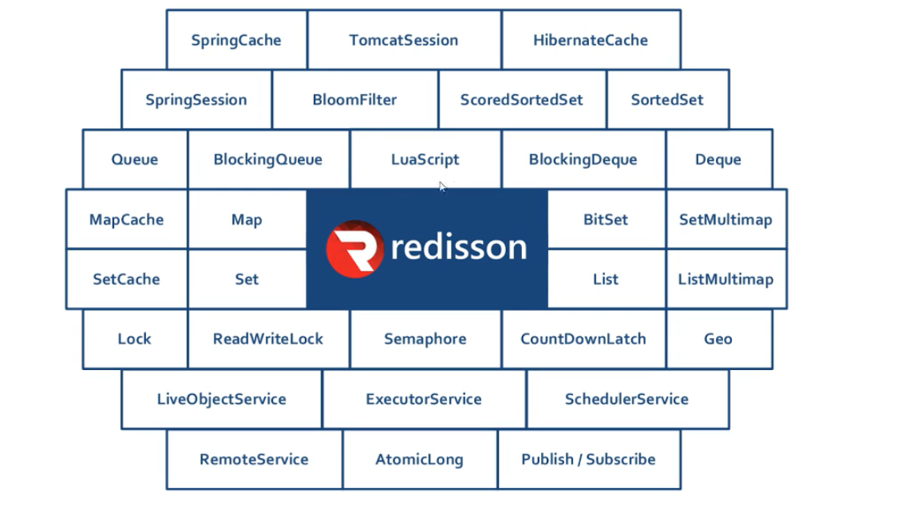

**步骤**

1：导入依赖

```xml
 <dependency>
     <groupId>org.redisson</groupId>
     <artifactId>redisson</artifactId>
     <version>3.9.1</version>
 </dependency>
```

2：初始化RLock

```java
public class RedssionLock {
	public static RLock getLock() {
		Config config = new Config();
		//指定使用单节点部署方式
		config.useSingleServer()
              .setAddress("redis://127.0.0.1:6379");
		config.useSingleServer().setConnectionPoolSize(500);//设置对于master节点的连接池中连接数最大为500
		config.useSingleServer().setIdleConnectionTimeout(10000);//如果当前连接池里的连接数量超过了最小空闲连接数，而同时有连接空闲时间超过了该数值，那么这些连接将会自动被关闭，并从连接池里去掉。时间单位是毫秒。
		config.useSingleServer().setConnectTimeout(30000);//同任何节点建立连接时的等待超时。时间单位是毫秒。
		config.useSingleServer().setTimeout(3000);//等待节点回复命令的时间。该时间从命令发送成功时开始计时。
		config.useSingleServer().setPingTimeout(30000);
		//获取RedissonClient对象
		RedissonClient redisson = Redisson.create(config);
		//获取锁对象
		RLock rLock = redisson.getLock("lock.lock");
		return rLock;
	}
	public static void main(String[] args) {
		System.out.println(getLock());
	}
}

```

线程类

```java
@Service
@Scope("prototype")
public class GoodsRediskLockSerivice {
	@Autowired
	private GoodStockDao goodStockDao;
	Lock lock = RedssionLock.getLock();
	public  boolean buy(String userId,String goodId,int buyNum){
		lock.lock();
		try {
			boolean result = false;
			int num = goodStockDao.getStock(goodId);
			if(num < buyNum){
				System.out.println("商品库存不足，不在扣减....");
				return false;
			}
			System.out.println("用户"+userId+",扣减商品："+goodId+"，数量：" + buyNum);
			result =goodStockDao.buy(userId,goodId,buyNum);
			System.out.println("用户"+userId+",扣减商品之后："+goodId+"，结果是：" + result);
			return result;
		}finally {
			lock.unlock();
		}
	}
}
```

其运行结果是一致的。

5.3 Redission框架实现分布式锁流程

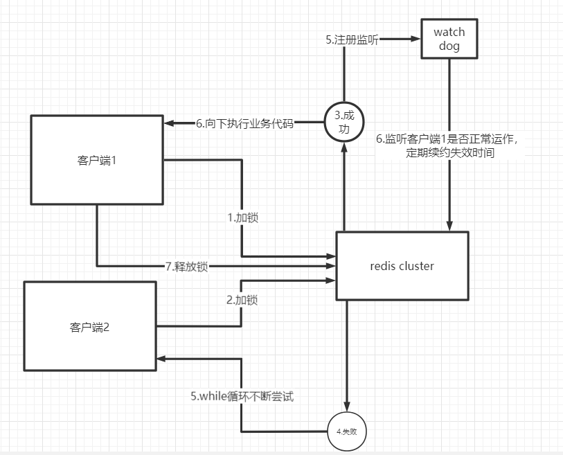

**1）加锁机制**

咱们来看上面那张图，现在某个客户端要加锁。如果该客户端面对的是一个redis cluster集群，他首先会根据hash节点选择一台机器。

**这里注意**，仅仅只是选择一台机器！这点很关键！

紧接着，就会发送一段lua脚本到redis上，那段lua脚本如下所示：

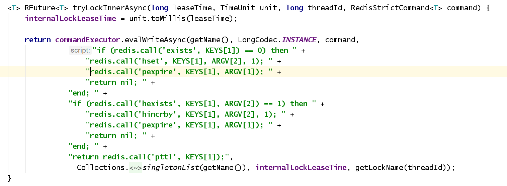

**5.2.1 加锁机制**

```
那么，这段lua脚本是什么意思呢？
KEYS[1]代表的是你加锁的那个key，比如说：
RLock lock = redisson.getLock("myLock");
这里你自己设置了加锁的那个锁key就是“myLock”。

ARGV[1]代表的就是锁key的默认生存时间，默认30秒。
ARGV[2]代表的是加锁的客户端的ID，类似于下面这样：
8743c9c0-0795-4907-87fd-6c719a6b4586:1

给大家解释一下，第一段if判断语句，就是用“exists myLock”命令判断一下，如果你要加锁的那个锁key不存在的话，你就进行加锁。
如何加锁呢？很简单，用下面的命令：
             客户端ID                              加锁次数
hset myLock 8743c9c0-0795-4907-87fd-6c719a6b4586:1 1
```

**5.2.2 互斥机制**

```lua
-- 执行这个if成立 说明没加锁 如果不成立走下一个if   lock.lock 
if (redis.call('exists', KEYS[1]) == 0) then
    -- hset myLock 8743c9c0-0795-4907-87fd-6c719a6b4586:1     1 
    -- hset lock.lock   UUID:线程ID   加锁的次数(可重入锁)
	redis.call('hset', KEYS[1], ARGV[2], 1); 
    -- 设置失效时间毫秒值
    redis.call('pexpire', KEYS[1], ARGV[1]); " +
    return nil;
end; 
-- 判断 key:锁名 argv:客户端ID == 1 代表对应的客户端已经存在
-- 说明该客户端有锁之后 再一次尝试获取锁  ==> 可重入锁
if (redis.call('hexists', KEYS[1], ARGV[2]) == 1) then
	-- 加锁次数+1
	redis.call('hincrby', KEYS[1], ARGV[2], 1);
      -- 设置失效时间毫秒值
    redis.call('pexpire', KEYS[1], ARGV[1]); 
    return nil; 
end;
-- 如果上面两个都不满足说明 锁被占用 且不是当前客户端 返回失效时间
return redis.call('pttl', KEYS[1]);
```

**5.2.3 支持可重入锁机制**

那如果客户端1都已经持有了这把锁了，结果可重入的加锁会怎么样呢？

如:

```java

RLock lock = RedssionLock.getLock();

lock.lock(30, TimeUnit.SECONDS);
// 一坨坨外部代码
// 嵌套功能也需要加锁
lock.lock(30, TimeUnit.SECONDS);    2

lock.unlock();                     1
// 嵌套功能解锁
// 整个方法解锁
lock.unlock();                     0
```

**5.2.4 锁的自动续约**

Redission通过内部实现**watch dog**机制自动延期机制,客户端1加锁的锁key默认生存时间才30秒，如果超过了30秒，客户端1还想一直持有这把锁，怎么办呢？简单！只要客户端1一旦加锁成功，就会启动一个watchdog看门狗，**他是一个后台线程，会每隔10秒检查一下，如果客户端1存活且还持有锁key**，那么就会不断的延长锁key的生存时间。

```java
 protected RFuture<Boolean> renewExpirationAsync(long threadId) {
        return commandExecutor.evalWriteAsync(getName(), LongCodec.INSTANCE, RedisCommands.EVAL_BOOLEAN,
                "if (redis.call('hexists', KEYS[1], ARGV[2]) == 1) then " +
                    "redis.call('pexpire', KEYS[1], ARGV[1]); " +
                    "return 1; " +
                "end; " +
                "return 0;",
            Collections.<Object>singletonList(getName()), 
            internalLockLeaseTime, getLockName(threadId));
    }
```

**5.2.5 释放锁机制**

如果执行lock.unlock()，就可以释放分布式锁，此时的业务逻辑也是非常简单的。

 其实说白了，就是每次都对myLock数据结构中的那个加锁次数减1。

 如果发现加锁次数是0了，说明这个客户端已经不再持有锁了，此时就会用：

“del myLock”命令，从redis里删除这个key。

 然后呢，另外的客户端2就可以尝试完成加锁了。

```java
protected RFuture<Boolean> unlockInnerAsync(long threadId) {
        return commandExecutor.evalWriteAsync(getName(), LongCodec.INSTANCE, RedisCommands.EVAL_BOOLEAN,
                                              myLock  111   1 
                "if (redis.call('hexists', KEYS[1], ARGV[3]) == 0) then " +
                    "return nil;" +
                "end; " +
                "local counter = redis.call('hincrby', KEYS[1], ARGV[3], -1); " +
                "if (counter > 0) then " +
                    "redis.call('pexpire', KEYS[1], ARGV[2]); " +
                    "return 0; " +
                "else " +
                    "redis.call('del', KEYS[1]); " +                                      
                    "redis.call('publish', KEYS[2], ARGV[1]); " +
                    "return 1; "+
                "end; " +
                "return nil;",
                Arrays.<Object>asList(getName(), getChannelName()), LockPubSub.UNLOCK_MESSAGE, internalLockLeaseTime, getLockName(threadId));

    }
```

**5.2.6 支持公平锁**

```
// Redission内置了公平锁的实现

RLock mylock = redisson.getFairLock("mylock");

// 按照客户端执行顺序按顺序获取锁
```

### 第六章：分布式锁实现 -- 基于Zookeeper

**zookeeper概述的快速回顾**

Zookeeper是一个分布式的，开源的分布式应用协调服务，是Hadoop和Hbase的组件。

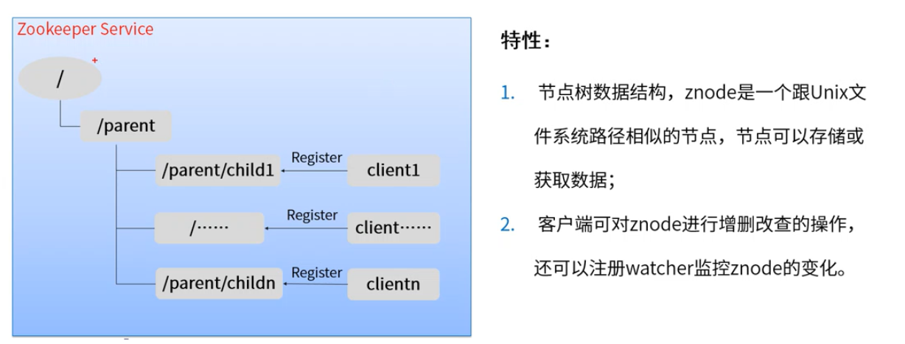

注意：Zookeeper的znode没有相对路径的概念。

**特点：**

1：实现相对简单

2：可靠性高

3：性能较好

**安装**

下载地址：http://mirror.bit.edu.cn/apache/zookeeper/zookeeper-3.4.14/

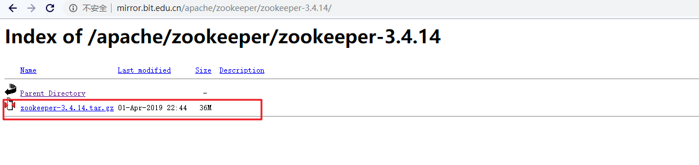

2：下载以后直接解压即可。然后修改配置`zoo_sample.conf`为`zoo.cfg`


3：然后启动zkServer.cmd即可。但是有一个前提：电脑必须安装jdk1.8+的环境变量。因为zk是java开发的，必须配置java的环境才可以启动。

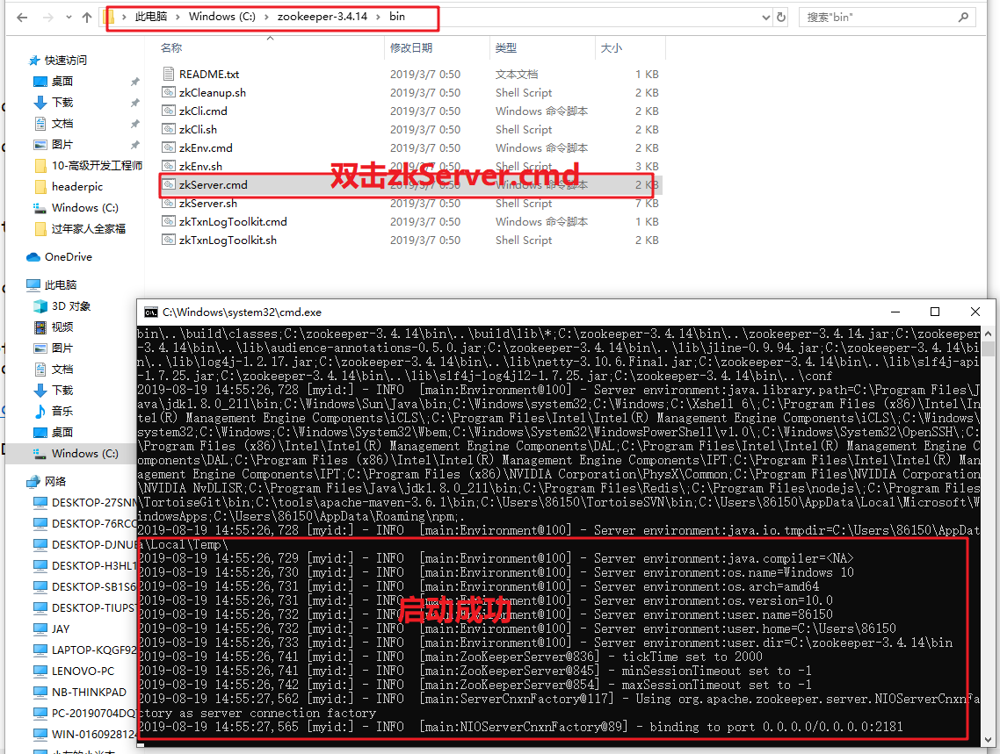


4：zkCli.cmd 命令行工具

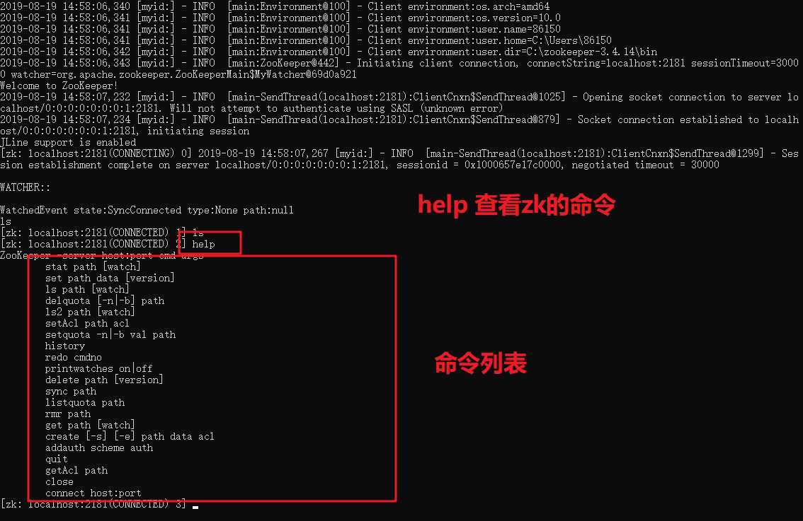

常见的节点的执行命令：


```properties
> ls / 查看
> create /test 1234 创建节点
> get /test  获取节点内容
> delete /test 删除节点
> set /test 3345 修改节点内容

> create /test 789
> create -s /zk-test 123 命令创建zk-test顺序节点
# 临时节点一定关闭链接或者客户端就会自动清楚掉。
> create -e /test2/linshi 45678 
```

**目标：**

实现zookeeper分布式锁

zookeeper的典型应用常见


#### 6.1 方案一: 创建临时节点实现分布式锁


分布式锁解构：

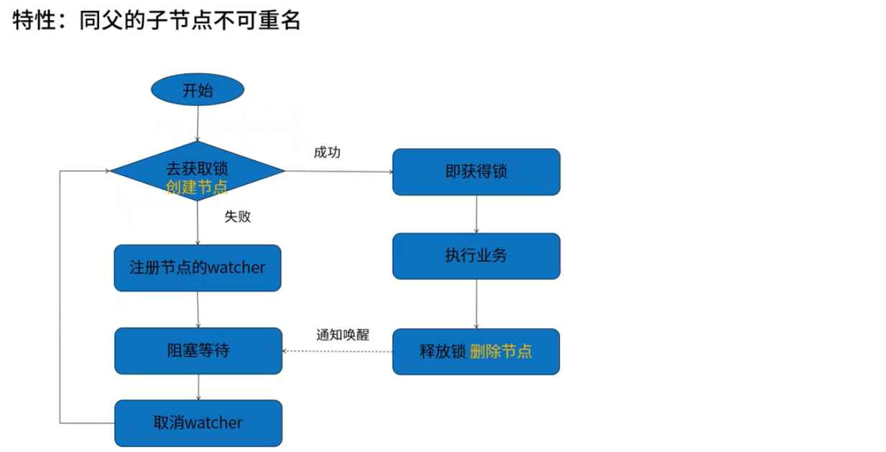

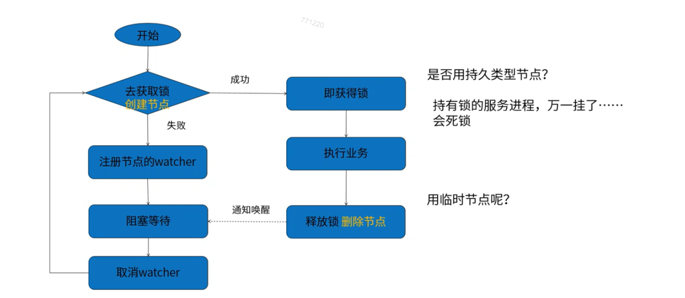

案例分析：秒杀扣除库存 countdownlatch

zookeeper分布式锁

```java
public class ZKDistributeLock implements Lock {

    // znode父节点，用来收集和归纳是那种业务的锁
    private String lockPath;
    //zkclient客户端
    private ZkClient zkClient;
    // 初始化客户端和目录
    public ZKDistributeLock(String lockPath){
        if(lockPath==null || lockPath.trim().equals("")){
            throw  new IllegalArgumentException("参数lockpath不能为空......");
        }
        this.lockPath = lockPath;
        // 连接zookeeper
        zkClient = new ZkClient("localhost:2181");
        // 设置序列化
        zkClient.setZkSerializer(new MyZkSerializer());
    }


    @Override
    public void lock() {
        if(!tryLock()){
            //如果已经获取到锁了，那么久挂起.等待
            waitForLock();//这里一定要找个可以阻塞线程的机制，那么久是：CountDownLatch或者CyclicBarrier
            //再次尝试获取lock
            lock();
        }
    }

    // 等待挂起锁，找个能阻塞线程执行的。
    private void waitForLock(){
        // 定义线程阻塞，并发屏障
        CountDownLatch countDownLatch = new CountDownLatch(1);
        // 监听节点变化
        IZkDataListener listener = new IZkDataListener() {
            @Override
            public void handleDataChange(String dataPath, Object data) throws Exception {
            }
            @Override
            public void handleDataDeleted(String dataPath) throws Exception {
                //如果节点被删除，立马释放。什么叫节点被删除呢？就是去调用unlock的时候执行 `zkClient.delete(lockPath);` 的时候回触发
                //说明释放锁了，那么放行让别的线程去执行获取锁操作。
                System.out.println("********************收到节点删除***************************");
                countDownLatch.countDown();
            }
        };

        // 监听节点变化
        zkClient.subscribeDataChanges(lockPath,listener);

        // 否则阻塞自己
        if(this.zkClient.exists(lockPath)){
            try{
                //被挂起
                countDownLatch.await();
            }catch(Exception ex){
               ex.printStackTrace();
            }
        }
        // 取消注册
        zkClient.unsubscribeDataChanges(lockPath,listener);
    }
    @Override
    public void lockInterruptibly() throws InterruptedException {
    }
    @Override
    public boolean tryLock() {//不会阻塞
        try{
            //创建临时节点，如果节点已经存在就会出现异常ZkNoNodeException，利用这个zk的这个特性
            //刚好满足排他性。
            zkClient.createEphemeral(lockPath);
        }catch(ZkNodeExistsException ex){
            return false;
        }
        return true;
    }
    @Override
    public void unlock() {
        // 删除节点，释放锁
        zkClient.delete(lockPath);
    }
    @Override
    public boolean tryLock(long time, TimeUnit unit) throws InterruptedException {
        return false;
    }
    @Override
    public Condition newCondition() {
        return null;
    }
}
```

业务类

```java
@Service
@Scope("prototype")
public class GoodsDistributeSerivice {

	@Autowired
	private GoodStockDao goodStockDao;

	//定义锁
	private Lock lock =  new ZKDistributeLock("/zklock");
	public boolean buy(String userId,String goodId,int buyNum){
		boolean result = false;
		lock.lock();
		try {
			int num = goodStockDao.getStock(goodId);
			if(num - buyNum < 0){
				System.out.println("商品库存不足，不在扣减....");
				return false;
			}
			System.out.println("用户"+userId+",扣减商品："+goodId+"，数量：" + buyNum);
			result =goodStockDao.buy(userId,goodId,buyNum);
			System.out.println("用户"+userId+",扣减商品之后："+goodId+"，结果是：" + result);
		}finally {
			lock.unlock();
		}
		return result;
	}
}

```

运行结果如中会频繁的进入到zk的因为删除临时节点带来的`惊群效应`。

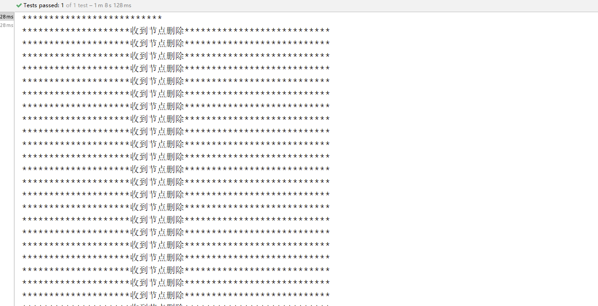

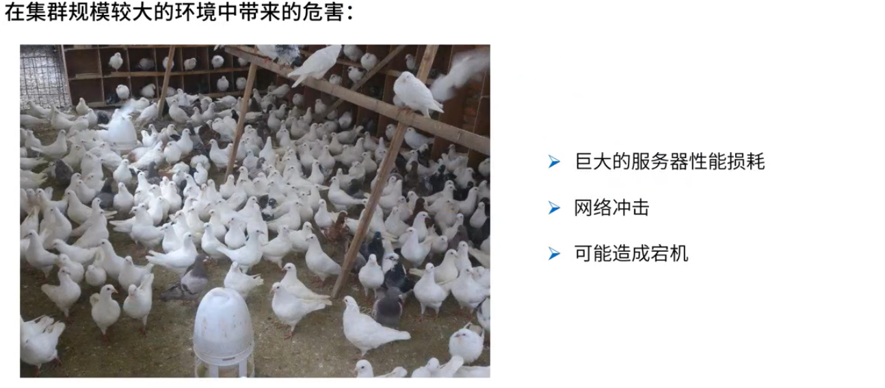

==为什么会出现这种问题呢？因为每一个请求都会在zk去监听`/zklock`节点。 这个时候因为堆积了很多的临时节点。因为每个服务器现在都超过200个请求，每一个请求都要监听。如果有一个znode被删除掉。zk就会对每一个线程进行通知一次。假如这里有10台服务器，请求是200，那么久有2000个请求监听节点，还要zk删除一个节点，zkclient会把自己的节点通知一次，然后也会把其他的1999个监听者也通知一次打印节点被删除了。==

#### 6.1 方案二: 创建临时顺序节点实现分布式锁


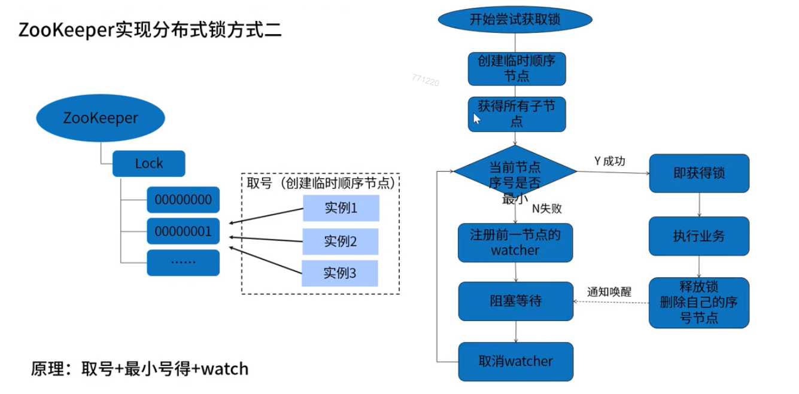

```java
public class ZKDistributeImproveLock implements Lock {

    // znode 父节点
    private String lockPath;
    //zkclient客户端
    private ZkClient zkClient;
    //获取当前自己创建的节点，就相当于我在银行取票：当前我的序号
    private ThreadLocal<String> currentPath = new ThreadLocal<>();
    // 我关注的前一个人的序号。
    private ThreadLocal<String> beforePath = new ThreadLocal<>();

    // 初始化客户端和目录
    public ZKDistributeImproveLock(String lockPath){
        if(lockPath==null || lockPath.trim().equals("")){
            throw  new IllegalArgumentException("参数lockpath不能为空......");
        }
        this.lockPath = lockPath;
        zkClient = new ZkClient("localhost:2181");
        zkClient.setZkSerializer(new MyZkSerializer());
        //初始化父节点
        if(!this.zkClient.exists(lockPath)){
            try{
                this.zkClient.createPersistent(lockPath);
            }catch(ZkNodeExistsException ex){
               ex.printStackTrace();
            }
        }
    }


    @Override
    public void lock() {
        if(!tryLock()){
            //如果已经获取到锁了，那么久挂起.等待
            waitForLock();//这里一定要找个可以阻塞线程的机制，那么久是：CountDownLatch或者CyclicBarrier
            //再次尝试获取lock
            lock();
        }
    }

    // 等待挂起锁，找个能阻塞线程执行的。
    private void waitForLock(){
        // 定义线程阻塞
        CountDownLatch countDownLatch = new CountDownLatch(1);

        IZkDataListener listener = new IZkDataListener() {
            @Override
            public void handleDataChange(String dataPath, Object data) throws Exception {
            }
            @Override
            public void handleDataDeleted(String dataPath) throws Exception {
                //如果节点被删除，立马释放。什么叫节点被删除呢？就是去调用unlock的时候执行 `zkClient.delete(lockPath);` 的时候回触发
                //说明释放锁了，那么放行让别的线程去执行获取锁操作。
                System.out.println("********************收到节点删除***************************");
                countDownLatch.countDown();
            }
        };

        // 监听节点变化
        zkClient.subscribeDataChanges(this.beforePath.get(),listener);

        // 否则阻塞自己
        if(this.zkClient.exists(this.beforePath.get())){
            try{
                //被挂起
                countDownLatch.await();
            }catch(Exception ex){
               ex.printStackTrace();
            }
        }
        // 取消注册
    zkClient.unsubscribeDataChanges(this.beforePath.get(),listener);
    }
    @Override
    public void lockInterruptibly() throws InterruptedException {
    }
    @Override
    public boolean tryLock() {//不会阻塞
        // 1：首先判断当前有没有元素，如果没有就创建一个
        if(this.currentPath.get() == null || !this.zkClient.exists(this.currentPath.get())){
            String node = this.zkClient.createEphemeralSequential(lockPath+"/","locked");
            //代表我以后取到号了。
            currentPath.set(node);
        }
        // 2：获取所有的子目录
        List<String> childrens = this.zkClient.getChildren(lockPath);
        // 3: 排序childrens
        Collections.sort(childrens);
        // 4:判断当前节点是否是最小
        if(currentPath.get().equals(lockPath+"/"+childrens.get(0))){
            return true;
        }else{
            //取前面一个 取得字节的索引号
            int currentIndex = childrens.indexOf(currentPath.get().substring(lockPath.length() + 1));
            String  node = lockPath + "/" + childrens.get(currentIndex - 1);
            beforePath.set(node);
        }
        return false;
    }
    @Override
    public void unlock() {
        if(this.currentPath.get()!=null) {
            zkClient.delete(this.currentPath.get());
            this.currentPath.set(null);
        }
    }
    @Override
    public boolean tryLock(long time, TimeUnit unit) throws InterruptedException {
        return false;
    }
    @Override
    public Condition newCondition() {
        return null;
    }
}
```

### 第七章：分布式锁方案比较和总结

**图解**


1：从理解的难易程度角度（从低到高）

数据库>  redis   > zookeeper

2：从实现的复杂性角度（ 从高到低 ）

zookeeper >  redis（Redisson）  > 数据库 

3：从性能角度（从高到低）

redis   >   zookeeper   >   数据库

4：从可靠性角度（从高到低）

zookeeper  >  redis  > 数据库

- [x] 不管是那种分布式锁实现，没有在所有场合都是完美的，所以根据不同的应用场景选择最合适的实现方式。
- [x] 分布式环境中，对资源进行上锁有时候是很重要的，比如抢购某一资源，这时候使用分布式锁就可以很好的控制资源。

我们为什么选择Redis的方案: 

  1.Redis完全基于内存的 ,性能比Zookeeper高很多

  2.另外基于Redission框架的实现已经相对非常高可用，而且api简单很容易整合到项目中。

​     互斥性

​     可重入

​    锁的超时

​     锁的自动续约

​    高可用

​    容错

​    springboot + springcloud  eureka    redis  

3. 而且redis也是大部分公司的选择，因为redis在其它的使用场景也很多，公司往往都会搭建redis集群。  

存在的问题:

 在redis master实例宕机的时候，可能导致多个客户端同时完成加锁。


# 相关面试题

**什么是分布式锁?**

```
 在分布式系统之间，保证某些系统资源同步访问的一种方式。
 
 如: 减库存的接口  多应用访问时都要对库存数据做操作，可能会造成超卖问题
 可以通过分布式锁解决。
 (JVM锁无法解决: 因为对应的库存服务会做集群)
 (数据库的悲观锁: 可以解决但是性能比较低)
```

**分布式锁的使用场景?**

```
库存操作

积分操作

钱包操作
```

**能否基于JDK提供的锁实现分布式锁?**

```
JVM锁无法解决: 因为对应的库存服务会做集群
```

**分布式锁有哪些实现方式?**

​	**基于数据库实现**

```
可以通过数据库的悲观锁 (行锁)实现,
在查询库存数量用于修改时，在select语句后加上 for update

其它客户端访问时，如果当前库存有客户端在操作,会产生阻塞。
```

​	**基于Redis实现**

```
基于Redis的单线程模型， 不同的客户端并发操作数据时 通过redis 的setnx方案尝试谁能在redis中存储数据，能存储代表获取到锁， 当操作完毕后再删除掉对应的key

Redission框架实现了 基于Redis的高可用分布式锁
```

​	**基于zookeeper实现**

```
基于zookeeper的文件系统和watch监听机制实现分布式锁, 大概实现思路: 多个客户端要操作资源时，在指定目录节点下 创建临时节点， 节点序号最小的算占有锁，当执行完毕后删除对应节点，下一个最小的节点占有锁。
```

**分布式锁实现方案对比总结?**

```
基于数据库实现，最简单，性能不好，并发量少时可用

基于Redis的Redission方案是主推方案，实现了公平锁、可重入锁、支持redis集群、锁的自动续约，我们项目中使用的是Redission, 不过在redis master节点宕机后，有多个客户端获取到同一个锁的风险。

基于zookeeper性能对比redis稍慢一些，强一致性的zk 在leader宕机后会出现短时间的不可用。
```

**Redission实现分布式锁RLock的原理?**

```
加锁(lock)
	1. 每一个竞争锁的客户端都会有一个唯一编号(UUID:线程ID)
	2. 加锁使用lua脚本，保证多个命令的原子性
		脚本中考虑到了客户端的互斥
		考虑到相同客户端的重入锁
		// 锁的格式  
		      锁名      客户端ID                         重入锁次数
        hset myLock 8743c9c0-0795-4907-87fd-6c719a6b4586:1 1
锁的自动续约
	加锁后会启动一个watchdog看门狗，是一个后台线程，会每隔10秒检查一下，如果客户端存活且还持有锁key，会续约锁的超时时间

解锁(unlock)
	也是使用lua脚本 进行解锁
		脚本先判断是否有 hexist 锁名称 客户端ID 对应的信息 
			不包含: 代表没有获得对应的锁,返回锁的失效时间
			
			如果包含: 会对value部分减1 ，在判断结果是否大于0
			         大于0代表这个重入锁还没有完全解开
			          
			         如果不大于0 则删除锁 del key

```

**ZK如何实现分布式锁简述?**

```
方案一: 创建临时节点实现分布式锁
	客户端尝试创建指定文件节点,创建成功占有锁，没创建成功监听文件节点变化，如果文件节点删除 再次尝试 创建指定文件节点 . 成功占有锁后，如果执行完毕代码 删除掉对应文件节点代表释放锁。  这种方式会存在惊群效应，当多个客户端等待锁释放时，如果锁释放多个客户端会同时尝试创建文件节点，给zk带来很大并发压力，性能不好
	
方案二: 创建临时顺序节点实现分布式锁
	客户端尝试在指定文件节点目录下，创建临时有序文件节点， 每个节点都有编号，当前编号最小的文件节点 为获取到锁，执行代码。  每个等待锁的客户端 都监听它上一个节点的变化。 如果上一个节点被删除了 当前节点编号 变为最小  相当于获取到锁

```


