# 一、SpringBoot内容回顾

### 面试点: SpringBoot的介绍

**原有Spring优缺点分析**

```
虽然Spring的组件代码是轻量级的，但它的配置却是重量级的。一开始，Spring用XML配置，而且是很多XML配置。Spring 2.5引入了基于注解的组件扫描，这消除了大量针对应用程序自身组件的显式XML配置。Spring 3.0引入了基于Java的配置，这是一种类型安全的可重构配置方式，可以代替XML。

所有这些配置都代表了开发时的损耗。因为在思考Spring特性配置和解决业务问题之间需要进行思维切换，所以编写配置挤占了编写应用程序逻辑的时间。和所有框架一样，Spring实用，但与此同时它要求的回报也不少。

除此之外，项目的依赖管理也是一件耗时耗力的事情。在环境搭建时，需要分析要导入哪些库的坐标，而且还需要分析导入与之有依赖关系的其他库的坐标，一旦选错了依赖的版本，随之而来的不兼容问题就会严重阻碍项目的开发进度。
```

**SpringBoot解决上述Spring的缺点**

```
SpringBoot对上述Spring的缺点进行的改善和优化，基于约定优于配置的思想，可以让开发人员不必在配置与逻辑业务之间进行思维的切换，全身心的投入到逻辑业务的代码编写中，从而大大提高了开发的效率，一定程度上缩短了项目周期。
```

**SpringBoot的特点**

```
- 为基于Spring的开发提供更快的入门体验
- 开箱即用，没有代码生成，也无需XML配置。同时也可以修改默认值来满足特定的需求

- 提供了一些大型项目中常见的非功能性特性，如嵌入式服务器、安全、指标，健康检测、外部配置等

- SpringBoot不是对Spring功能上的增强，而是提供了一种快速使用Spring的方式
```

### 面试点: 起步依赖(starter)依赖介绍

```
起步依赖本质上是一个Maven项目对象模型（Project Object Model，POM），定义了对其他库的传递依赖，这些东西加在一起即支持某项功能。
* 简单的说，起步依赖就是将具备某种功能的坐标打包到一起，并提供一些默认的功能。

例如，如果你想使用 Sping 和 JPA 访问数据库，只需要你的项目包含 spring-boot-starter-data-jpa 依赖项，你就可以完美进行。

常用starters:
spring-boot-starter-amqp
	整合了Spring操作RabbitMQ的相关依赖
spring-boot-starter-data-elasticsearch
	整合了Spring操作es的相关依赖
spring-boot-starter-jdbc
	整合了JDBC相关依赖, 比如JDBC的事务 Hikaricp数据库连接池
spring-boot-starter-data-redis
	整合了Spring操作redis的相关依赖
spring-boot-starter-thymeleaf
	整合了基于thymeleaf引擎作为视图的相关依赖
spring-boot-starter-web
	整合了web功能的相关依赖 如: SpringMVC  内置的tomcat
```

### 面试点: @SpringBootApplication注解介绍

使用该注解配置的类，称为SpringBoot应用启动的引导类，@SpringBootApplication注解等同于同时使用@Configuration、@EnableAutoConfiguration和@ComponentScan及其默认属性。 

**@Configuration :**   

```
 当前类可以作为一个配置类使用，可以使用@Bean配置容器对象
```

**@EnableAutoConfiguration：**

```
开启自动配置功能，如果若发现任何不愿使用的特定自动配置类，可以使用@EnableAutoConfiguration的排除属性。

//By using "exclude"

@EnableAutoConfiguration(exclude={DataSourceAutoConfiguration.class})
```

**@ComponentScan:** 

```
开启组件扫描  默认会扫描此引导类的所有同级目录和下级目录的Spring注解，如果想自定义扫描的范围可以 通过 scanBasePackages定义扫描路径
```

### 面试点: 自动配置原理：

```
1. @SpringBootApplication注解中包含了@EnableAutoConfiguration代表开启自动装配
2. @EnableAutoConfiguration注解会去spring-boot-autoconfigure工程下寻找 META-INF/spring.factories 文件,读取里面的自动装配配置类清单
3. 这些类都在此工程中是一些提前写好的配置类，每个类都声明了@Configuration注解，并且通过@Bean注解提前配置了我们所需要的的各种实例,和默认的配置。
4. 但是，这些配置不一定生效，因为有`@ConditionalOn`条件注解，满足一定条件配置才会生效 如： @ConditionalOnClass(某类.class) 工程中必须包含一些相关的类时，配置才会生效
5. 我们只需要引入了相关依赖（启动器），@ConditionalOnClass(某类.class)条件成立，自动配置生效。

这就是自动装配的原理，也是为什么说springboot的理念 约定大于配置

也就是说我们只需要引入Springboot提供的starter启动器，对应的功能即可使用，如果我们需要更改默认设置，只需要在application.yml配置文件中覆盖默认属性即可，而且默认的属性都有语法提示，更改起来也很方便
```


# 二、 微服务的概念回顾

### 面试点: 微服务介绍

```
微服务概念:
微服务架构是使用一套小服务来开发单个应用的方式或途径，每个服务基于单一业务能力构建，运行在自己的进程 中，并使用轻量级机制通信，通常是HTTP API，并能够通过自动化部署机制来独立部署。这些服务可以使用不同的 编程语言实现，以及不同数据存储技术，并保持低限度的集中式管理。

微服务特点：
- 单一职责：微服务中每一个服务都对应唯一的业务能力，做到单一职责 
- 微：微服务的服务拆分粒度很小，例如一个用户管理就可以作为一个服务。每个服务虽小，但“五脏俱全”。
- 面向服务：面向服务是说每个服务都要对外暴露Rest风格服务接口API。并不关心服务的技术实现，做到与平台 和语言无关，也不限定用什么技术实现，只要提供Rest的接口即可。 
- 自治：自治是说服务间互相独立，互不干扰 
  - 团队独立：每个服务都是一个独立的开发团队，人数不能过多。
  - 技术独立：因为是面向服务，提供Rest接口，使用什么技术没有别人干涉 
  - 前后端分离：采用前后端分离开发，提供统一Rest接口，后端不用再为PC、移动端开发不同接口 
  - 数据库分离：每个服务都使用自己的数据源 
  - 部署独立，服务间虽然有调用，但要做到服务重启不影响其它服务。有利于持续集成和持续交付。每个服 务都是独立的组件，可复用，可替换，降低耦合，易维护


与SOA架构的区别:
微服务架构与SOA都是对系统进行拆分；微服务架构基于SOA思想，可以把微服务当做去除了ESB的SOA。ESB是 SOA架构中的中心总线，设计图形应该是星形的，而微服务是去中心化的分布式软件架构。两者比较类似，但其实也 有一些差别：
```

### 面试点: 服务间的通信方式

```
无论是微服务还是SOA，都面临着服务间的远程调用。那么服务间的远程调用方式有哪些呢？

常见的远程调用方式有以下2种：

- RPC：Remote Produce Call远程过程调用，RPC基于Socket，工作在会话层。自定义数据格式，速度快，效率高。早期的webservice，现在热门的dubbo，都是RPC的典型代表

- Http：http其实是一种网络传输协议，基于TCP，工作在应用层，规定了数据传输的格式。现在客户端浏览器与服务端通信基本都是采用Http协议，也可以用来进行远程服务调用。缺点是消息封装臃肿，优势是对服务的提供和调用方没有任何技术限定，自由灵活，更符合微服务理念。

现在热门的Rest风格，就可以通过http协议来实现。
区别：RPC的机制是根据语言的API（language API）来定义的，而不是根据基于网络的应用来定义的。

```

### 面试点: SpringCloud介绍

```
Spring Cloud是Spring旗下的项目之一，用于实现微服务架构，Spring擅长的就是集成，把世界上好的框架拿过来，集成到自己的项目中。 Spring Cloud也是一样，它将现在非常流行的一些技术通过Spring和Springboot整合到一起,可以让我们开发人员能够非常方便的引入到微服务架构中

例如:
- Eureka：注册中心 
- Zuul、Gateway：服务网关 
- Ribbon：负载均衡 
- Feign：服务调用 
- Hystrix：熔断器
- Config: 配置中心

springcloud的版本是以英文单词命名（伦敦地铁站名）:

```

### 面试点: Springboot、SpringCloud、微服务

```
微服务，是一种架构的设计思想

Spring Cloud是微服务架构的一套具体解决方案

Spring Boot 是基于Spring 的一套快速配置脚手架

微服务和Springboot: 微服务中的单个服务可以基于Springboot快速开发

SpringCloud和Springboot: SpringCloud是基于SpringBoot开发的，所以SpringCloud依赖SpringBoot
```


### 面试点: Spring Cloud和Dubbo对比

```
或许很多人会说Spring Cloud和Dubbo的对比有点不公平，Dubbo只是实现了服务治理，而Spring Cloud下面有33个子项目（可能还会新增）分别覆盖了微服务架构下的方方面面，服务治理只是其中的一个方面，一定程度来说，Dubbo只是Spring Cloud Netflix中的一个子集。
```

|              | Dubbo     | Spring Cloud                 |
| ------------ | --------- | ---------------------------- |
| 服务注册中心 | Zookeeper | Spring Cloud Netflix Eureka  |
| 服务调用方式 | RPC       | REST API                     |
| 服务网关     | 无        | Spring Cloud Netflix Zuul    |
| 熔断器       | 不完善    | Spring Cloud Netflix Hystrix |
| 分布式配置   | 无        | Spring Cloud Config          |
| 服务跟踪     | 无        | Spring Cloud Sleuth          |
| 消息总线     | 无        | Spring Cloud Bus             |
| 数据流       | 无        | Spring Cloud Stream          |
| 批量任务     | 无        | Spring Cloud Task            |
| ……           | ……        | ……                           |

# 三、 SpringCloud核心组件知识点回顾

## 注册中心 eureka

### 面试点: eureka组件介绍

```
Eureka是Netflix开源的服务注册中心，SpringCloud将其集成在SpringCloud Netflix中，实现服务的注册和发现。
```

### 面试点: eureka的工作原理

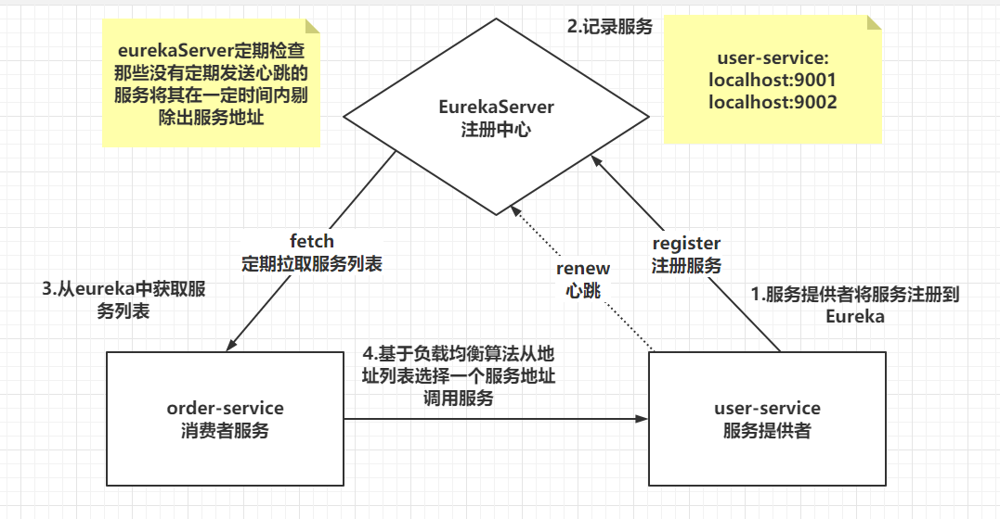

```
Eureka 主要包含两个组件： Eureka Server 和 Eureka Client。 

Eureka Server提供服务发现的功能,各个微服务会将自己的信息注册到Eureka Server。
EurekaClient即服务提供者,将其信息注册到Eureka Server上面。
微服务会周期性（默认30秒）地向Eureka Server 发送心跳以维持自己的注册状态，如果Eureka Server 在一定时间（默认90秒）没有接受到某个微服务实例的心跳，Eureka Server 将会注销该实例。
默认情况下，Eureka Server 同时也是 Client， 多个Eureka Server 实例之间可以通过复制的方法， 来实现服务注册表数据的同步。
Eureka Client 会缓存服务注册表中的信息，所以 Eureka Client 无须每次调用微服务都要先查询Eureka Server，能有效地缓解Eureka Server的压力，而且即使所有的Eureka Server节点都宕掉，Client 依然可以根据缓存中信息找到服务提供者。
```

### 面试点: eureka的服务续约

服务启动后会注册到EurekaServer中， 注册成功后会定时向EurekaServer发送心跳,默认心跳间隔30秒,如果没有发送心跳默认90秒后服务失效， 这两个参数都可以通过服务中配置。

```yml
eureka:
  instance:
    ip-address: 127.0.0.1 # 实例IP地址
    prefer-ip-address: true # 优先使用IP地址
    lease-expiration-duration-in-seconds: 90  #服务到期失效时间
    lease-renewal-interval-in-seconds: 30     #服务续约(renew)的间隔
```

### 面试点: eureka的服务失效剔除

在EurekaServer中，会有定时器定时查看服务列表是否有失效的服务，默认定时检查的间隔时间是60秒，如果查看到失效服务后会从服务列表中剔除。如果开启了自我保护模式有可能无法剔除。

```yml
eureka:
  client:
    service-url:
      defaultZone: http://127.0.0.1:10086/eureka
    register-with-eureka: false  # 不注册自己
    fetch-registry: false  # 不拉取服务
  server:
    enable-self-preservation: false # 关闭自我保护模式（默认是打开的）
    eviction-interval-timer-in-ms: 60000 # 失效剔除时间间隔 
```

### 面试点: eureka的自我保护机制

默认情况下,EurekaServer会开启自我保护模式，自我保护模式是一种应对网络异常的安全保护措施。它的架构哲学是宁可同时保留所有微服务（健康的微服务和不健康的微服务都会保留），也不盲目注销任何健康的微服务。使用自我保护模式，可以让Eureka集群更加的健壮、稳定。

```yml
enable-self-preservation: false # 关闭自我保护模式（默认是打开的）
```

```
当服务未按时进行心跳续约时，Eureka会统计服务实例最近15分钟心跳续约的比例是否低于了85%。在生产环境下，因为网络延迟等原因，心跳失败实例的比例很有可能超标，但是此时就把服务剔除列表并不妥当，因为服务可能没有宕机。Eureka在这段时间内不会剔除任何服务实例，直到网络恢复正常。生产环境下这很有效，保证了大多数服务依然可用，不过也有可能获取到失败的服务实例，因此服务调用者必须做好服务的失败容错。
```

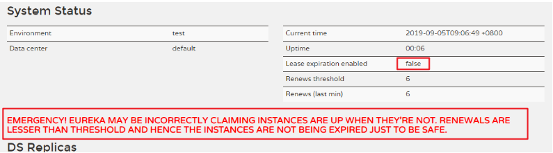

### 面试点: 如何保证eureka高可用

通过多台eurekaServer实例，互相注册可以形成高可用的集群Eureka中心。多个Eureka Server之间也会互相注册为服务，当服务提供者注册到Eureka Server集群中的某个节点时，该节点会把服务的信息同步给集群中的每个节点，从而实现数据同步。因此，无论客户端访问到Eureka Server集群中的任意一个节点，都可以获取到完整的服务列表信息。而作为客户端，需要把信息注册到每个Eureka中

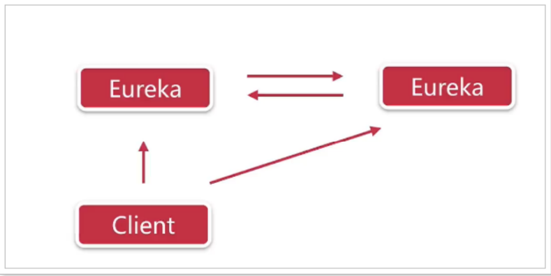


### 面试点: eureka和zookeeper的对比

**zookeeper的CAP理论**

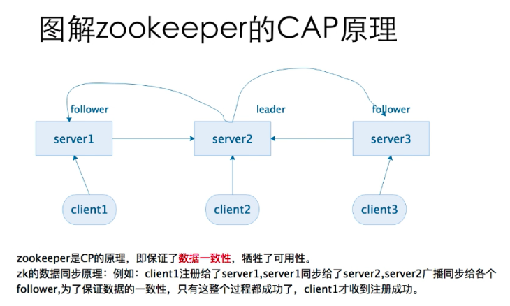

当leader出现网络故障的情况下：

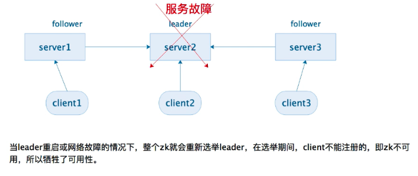

只有等整个系统成功选举之后，系统才恢复注册，故zk未了保证数据的一致性，牺牲了可用性，CP有一个致命的缺点，就是在一个大型的分布式系统中，网络是非常复杂的，leader出现了故障的频率是非常高的，而且很容易引发雪崩现象，所以很多大型分布式系统都不选择zk的原因。

**Eureka的CAP理论**

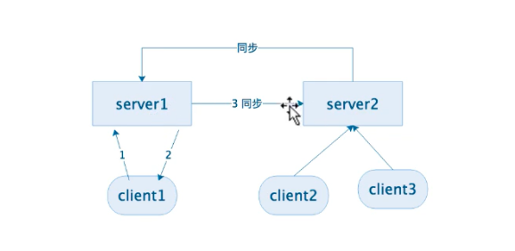

Eureka的原理是：AP，即保证可用性，牺牲了一致性。


## 负载均衡 ribbon

### 面试点: ribbon组件介绍

Ribbon提供了轮询、随机两种负载均衡算法（默认是轮询）可以实现从地址列表中使用负载均衡算法获取地址进行服务调用。

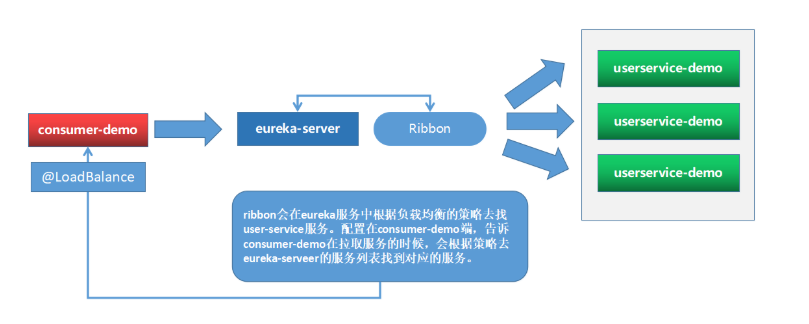

### 面试点: ribbon的工作原理

1. 在实例化RestTemplate的时候使用@LoadBalanced，服务地址直接可以使用服务名。

2. 加了注解后相当于给RestTemplate对象加了一个拦截器,对象的方法调用后会被拦截器处理

3. 源码中LoadBalancerInterceptor内的拦截方法 intercept会拦截请求

4. 拦截方法中会使用负载均衡器执行请求this.loadBalancer.execute(请求)

   ​	 负载均衡器 截取出服务名称 如: user-service

   ​         根据服务名称得到服务器列表

   ​         根据配置的负载均衡规则从服务列表中选择一个服务器地址

   ​         执行该服务地址请求

### 面试点: ribbon的负载均衡策略

ribbon默认的负载均衡规则是轮询

```yml
user-service:
	ribbon:
		NFLoadBalancerRuleClassName: 	com.netflix.loadbalancer.RandomRule
```

**内置负载均衡规则类策略**

主要记录: 

RoundRobinRule 轮询规则

WeightedResponseTimeRule 权重

RandomRule   随机

| **规则类**                | **规则描述**                                                 |
| ------------------------- | ------------------------------------------------------------ |
| RoundRobinRule            | 简单轮询服务列表来选择服务器。它是Ribbon默认的负载均衡规则。 |
| AvailabilityFilteringRule | 可用服务器过滤规则                                           |
| WeightedResponseTimeRule  | 为每一个服务器赋予一个权重值。服务器响应时间越长，这个服务器的权重就越小。这个规则会随机选择服务器，这个权重值会影响服务器的选择。 |
| ZoneAvoidanceRule         | 以区域可用的服务器为基础进行服务器的选择。使用Zone对服务器进行分类，这个Zone可以理解为一个机房、一个机架等。 |
| BestAvailableRule         | 忽略哪些短路的服务器，并选择并发数较低的服务器。             |
| RandomRule                | 随机选择一个可用的服务器。                                   |
| Retry                     | 重试机制的选择逻辑                                           |

## 熔断器 hystrix

### 面试点: hystrix组件介绍

Hystrix是Netflix开源的一个延迟和容错库，用于隔离访问远程服务、第三方库，防止出现级联失败。

### 面试点: hystrx的工作原理

**微服务雪崩**

微服务中，服务间调用关系错综复杂，一个请求，可能需要调用多个微服务接口才能实现，会形成非常复杂的调用链路

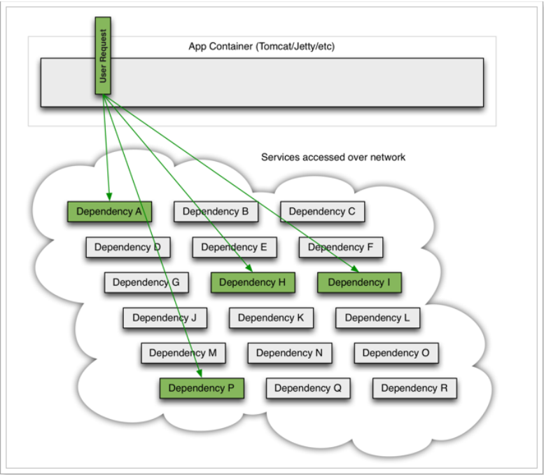

如图，一次业务请求，需要调用A、P、H、I四个服务，这四个服务又可能调用其它服务。
如果此时，某个服务出现异常：

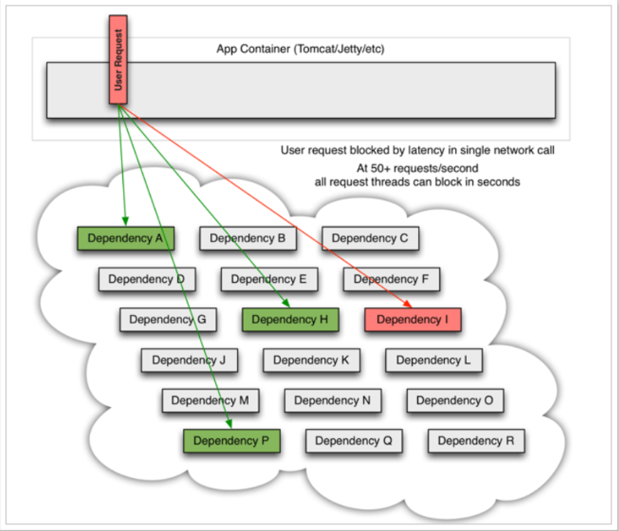

例如： 微服务I 发生异常，请求阻塞，用户请求就不会得到响应，则tomcat的这个线程不会释放，于是越来越多的
用户请求到来，越来越多的线程会阻塞：

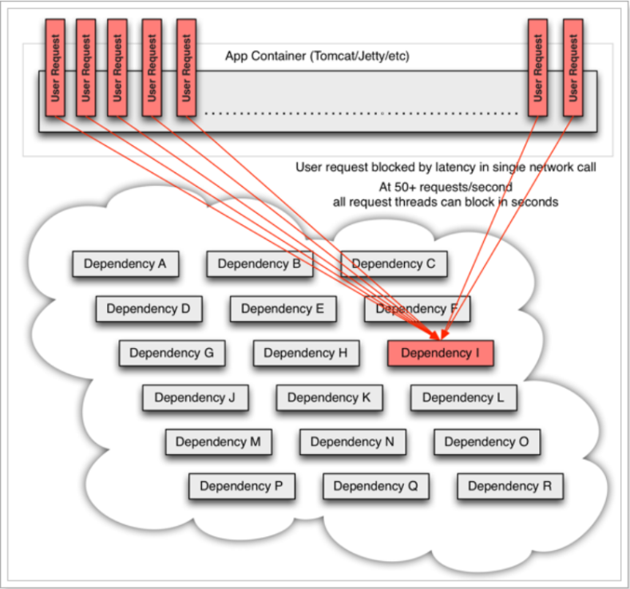

服务器支持的线程和并发数有限，请求一直阻塞，会导致服务器资源耗尽，从而导致所有其它服务都不可用，形成雪崩效应。这就好比，一个汽车生产线，生产不同的汽车，需要使用不同的零件，如果某个零件因为种种原因无法使用，那么就会造成整台车无法装配，陷入等待零件的状态，直到零件到位，才能继续组装。  此时如果有很多个车型都需要这个
零件，那么整个工厂都将陷入等待的状态，导致所有生产都陷入瘫痪。一个零件的波及范围不断扩大。

**Hystrix如何解决雪崩**

```
Hystrix的线程隔离
Hystrix的服务熔断
Hystrix的服务降级
```

**Hystrix的线程隔离**

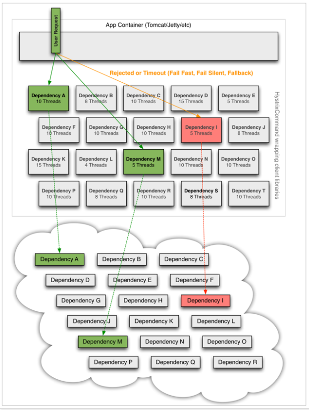

线程隔离：Hystrix为每个依赖服务调用分配一个小的线程池，如果线程池已满调用将被立即拒绝，默认不采用排队，加速失败判定时间。用户的请求将不再直接访问服务，而是通过线程池中的空闲线程来访问服务，如果线程池已满，或者请求超时，则会进行降级处理

**Hystrix的服务熔断**

```
在服务熔断中，使用的熔断器，也叫断路器，其英文单词为：Circuit Breaker熔断机制与家里使用的电路熔断原理类似；当如果电路发生短路的时候能立刻熔断电路，避免发生灾难。在分布式系统中应用服务熔断后；服务调用方可以自己进行判断哪些服务反应慢或存在大量超时，可以针对这些服务进行主动熔断，防止整个系统被拖垮。Hystrix的服务熔断机制，可以实现弹性容错；当服务请求情况好转之后，可以自动重连。通过断路的方式，将后续请求直接拒绝，一段时间（默认5秒）之后允许部分请求通过，如果调用成功则回到断路器关闭状态，否则继续打开，拒绝请求的服务。
```

**Hystrix的服务降级**

```
服务降级：优先保证核心服务，而非核心服务不可用或弱可用。

用户的请求故障时，不会被阻塞，更不会无休止的等待或者看到系统崩溃，至少可以看到一个执行结果（例如返回友好的提示信息） 。服务降级虽然会导致请求失败，但是不会导致阻塞，而且最多会影响这个依赖服务对应的线程池中的资源，对其它服务没有响应。
```

### 面试点: hystrix的配置

1. 引入起步依赖

```xml
<!-- 熔断starter依赖 -->
        <dependency>
            <groupId>org.springframework.cloud</groupId>
            <artifactId>spring-cloud-starter-netflix-hystrix</artifactId>
        </dependency>
```

2. 开启熔断功能

```java
@EnableCircuitBreaker // 开启断路器
```

3. 配置熔断

```java
@GetMapping("{id}")
@HystrixCommand(fallbackMethod = "findByIdFailback")
public String findById(@PathVariable("id")Integer id){
    if(id==1){
       throw new RuntimeException();
    }
    // 路径直接写服务名称+调用路径
    String url = "http://user-service/user/" + id;
    log.info("调用路径== {}",url);
    return restTemplate.getForObject(url, String.class);
}
public String findByIdFailback(Integer id){
    log.error("调用失败  id值 {}  ",id);
    return "对不起，网络出现异常，查询失败";
}
```

4. 熔断配置

```yml
hystrix:
  command:
    default:
      execution:
        isolation:
          thread: # 响应超时时间  默认1秒
            timeoutInMilliseconds: 2000
      circuitBreaker: # 熔断机制
        errorThresholdPercentage: 50 # 触发熔断错误比例阈值，默认值50% 也就是说requestVolumeThreshold 出现错误得次数超过5层就会激活熔断
        sleepWindowInMilliseconds: 10000 # 熔断后休眠时长，默认值5秒
        requestVolumeThreshold: 10 # 熔断触发最小请求次数，默认值是20
```

## 服务调用 feign

### 面试点: feign组件介绍

Spring Cloud提供了声明式服务调用组件—Feign。Feign是Netflix开发的声明式、模板的化Http客户端。可以基于接口的编程方式，开发者只需要声明接口和配置注解，在调度接口方法时，Spring Cloud根据配置来调度对应的REST风格的请求，从其他微服务系统中获取数据。 一句话 Feign可以帮助我们更加便捷，优雅的调用Http API

### 面试点: feign的工作原理

1. 引入feign的依赖

```xml
<dependency>
    <groupId>org.springframework.cloud</groupId>
    <artifactId>spring-cloud-starter-openfeign</artifactId>
</dependency>
```

2. 开启Feign功能

```java
@SpringCloudApplication
@EnableFeignClients // 开启Feign就可以不用配置RestTemplate了
public class ConsumeServiceApplication {
    public static void main(String[] args) {
        SpringApplication.run(ConsumeServiceApplication.class, args);
    }
}
```

3. 定义Feign客户端接口

```java
@FeignClient(value = "user-service")
public interface UserClient {
    // http://user-service/user/1
    @GetMapping("/user/{id}")
    String findById(@PathVariable("id") Integer id);
}
```

### 面试点: feign的负载均衡

feign内置了ribbon实现了负载均衡，可以直接通过配置更改

```yml
user-service:
  ribbon:
    NFLoadBalancerRuleClassName: com.netflix.loadbalancer.RandomRule #RoundRobinRule
#可以切换轮询 和 随机测试负载均衡效果
ribbon:
  ConnectTimeout: 1000 # 连接超时时长
  ReadTimeout: 2000 # 数据通信超时时长
  MaxAutoRetries: 0 # 当前服务器的重试次数
  MaxAutoRetriesNextServer: 0 # 重试多少次服务
  OkToRetryOnAllOperations: false # 是否对所有的请求方式都重试
```

### 面试点: feign的服务熔断

Feign内置了Hystrix熔断器，需要在配置文件中开启

```yaml
feign:
  hystrix:
    enabled: true # 开启Feign的熔断功能
```

在FeignClient注解中 加入fallback属性 指定的类需要实现当前UserFeignClient接口

```java
@FeignClient(value="user-service",fallback = UserClientFallback.class) 
public interface UserFeginClient {
    @GetMapping("/user/{id}")
    public String getUser(@PathVariable("id")Long id);
}
```

```java
@Component
public class UserClientFallback implements UserFeginClient {
    public String getUser(Long id){
        return "用户异常，服务器繁忙，请退下....";
    }
}
```

### 面试点: feign的日志调试

配置Feign在调用过程中的日志情况

```java
@Configuration
public class FeignConfig {
    @Bean
    public Logger.Level feignLoggerLevel() {
        //记录所有请求和响应的明细，包括头信息、请求体、元数据
        // NONE 不记录任何信息，默认值
        // BASIC 记录请求方法，请求URL，状态码和用时
        // HEADERS 在BASIC的基础上在记录一些常用信息
        // FULL 记录请求和响应的全部内容。
        return Logger.Level.FULL;
    }
}
```

在FeignClient注解中引入配置

```java
@FeignClient(value = "user-service",
        fallback = UserClientFailback.class,
        configuration = FeignConfig.class)
public interface UserClient {
    // http://user-service/user/1
    @GetMapping("/user/{id}")
    String findById(@PathVariable("id") Integer id);
}
```

```yaml
# 设置com.itcast包下的日志级别debug
logging:
  level:
    com.itcast: debug
```

## 服务网关 gateway

### 面试点: gateway网关组件介绍

API网关是一个服务器，是系统对外的唯一入口。API网关封装了系统内部架构，为每个客户端提供一个定制的API。API网关的核心要点：所有的客户端和消费者都通过统一的网关接入微服务，在网关层处理所有需要统一处理的非业务功能。 在Spring Cloud中网关的服务组件主要有 Zuul 和 Gateway

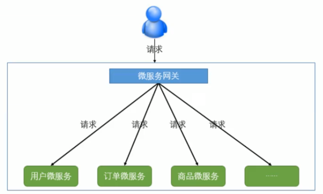


### 面试点: gateway网关组件的工作原理

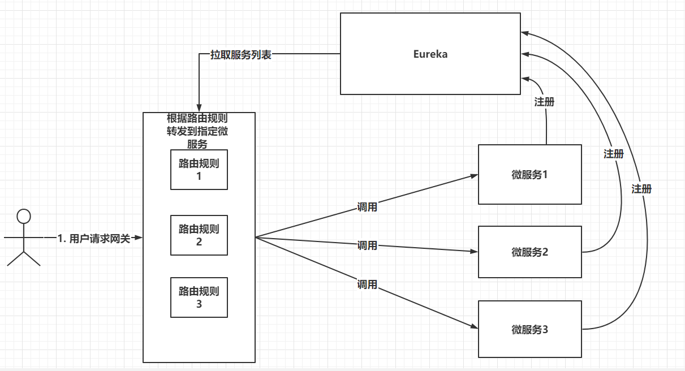

**核心概念**

**路由（route）** 路由信息的组成：由一个ID、一个目的URL、一组断言工厂、一组Filter 。如果路由断言为真，说明请求URL和配置路由匹配

**断言（Predicate）** SpringCloudGateway中的断言函数输入类型是Spring5.0框架中的ServerWebExchange.断言函数允许开发者去定义匹配来自于HttpRequest中的任何信息比如请求头和参数

**过滤器(Filter)** 一个标准的Spring Web Filter.  这里分为两种类型。

分别是GateWay Filter 和 Global Filter. 过滤器Filter将会对请求和响应进行修改处理

### 面试点: gateway中路由的配置

```xml
<!-- 网关的starter依赖 -->
<dependency>
	<groupId>org.springframework.cloud</groupId>
	<artifactId>spring-cloud-starter-gateway</artifactId>
</dependency>
```

```yml
server:
  port: 10010
spring:
  application:
    name: gateway-server
  cloud:
    gateway:
      routes:
        # 路由id，可以任意
        - id: user-service-route
          # 代理的服务地址
          uri: lb://user-service
          # 路由断言： 可以匹配映射路径 至少有一个断言
          predicates:
            - Path=/user/**
        # 路由id，可以任意
        - id: order-service-route
          # 代理的服务地址
          uri: lb://order-service
          # 路由断言： 可以匹配映射路径 至少有一个断言
          predicates:
            - Path=/order/**
          # 局部过滤器: 作用于该路由 如果想让所有路由请求都生效可以配置默认过滤器或全局过滤器
          filters:
            - PrefixPath=/user
       # 跨域的配置
       globalcors:
        cors-configurations:
          '[/**]':
            #允许所有来源路径跨域请求
            allowedOrigins:
              - "*"
eureka:
  client:
    service-url:
      defaultZone: http://127.0.0.1:10086/eureka
  instance:
    prefer-ip-address: true
```

**面向服务的路由:**

代理的服务地址，如果用户的请求满足断言的要求这请求会请求到uri的地址中, 网关内置了ribbon负载均衡器，所以我们可以直接使用服务名作为路径,也可以在配置中设置负载均衡

```
uri: lb://user-service
```

**断言的配置:**

断言的作用,是判断请求是否满足全部的断言，断言至少配置一个，如果全部满足则会将调用uri执行请求

```
predicates:
	- Path=/order/**
```

**内置过滤器的配置:**

局部过滤器: 作用于指定路由 如果想让所有路由请求都生效可以配置默认过滤器或全局过滤器.

断言的作用是判断请求满足不满足条件

而过滤器则和web中的filter功能类似, 我们可以在请求时对请求做一些处理

也可以在处理完毕响应时对响应做一些处理

```
filters:
	- PrefixPath=/user
```

**跨域的配置:**

```yml
	   # 跨域的配置
       globalcors:
        cors-configurations:
          '[/**]':
            #允许所有来源路径跨域请求
            allowedOrigins:
              - "*"
```

### 面试点: gateway中自定义过滤器

断言和过滤器都是可以自定义的， 我们写一个类实现GlobalFilter接口代表声明了一个过滤器, 具体过滤功能要实现 filter方法 该方法有两个参数:

ServerWebExchange  封装了请求和响应对象

​	通过此对象修改请求或响应的内容

GatewayFilterChain   过滤器链对象

​	过滤器可以有多个 ,执行完过滤处理后 调用chain.filter(exchange)执行下一个过滤器;

```java
@Component
public class MyGlobalFilter implements GlobalFilter, Ordered {
    @Override
    public Mono<Void> filter(ServerWebExchange exchange, GatewayFilterChain chain) {
        System.out.println("全局过滤器MyGlobalFilter触发==>");
        HttpHeaders headers = exchange.getRequest().getHeaders();
        //判断请求头中是否包含token
        if(headers.containsKey("token")){
            // 包含正常放行
            return chain.filter(exchange);
        }else {
            // 不包含 显示无权限状态
            ServerHttpResponse response = exchange.getResponse();
            response.setStatusCode(HttpStatus.UNAUTHORIZED);//状态无权限
            return response.setComplete();
        }
    }
    @Override
    public int getOrder() {
        // 过滤器执行顺序 值越小优先级越高
        return 1;
    }
}
```

# 四、 SpringCloud进阶组件回顾

## 配置中心 config

### 面试点: config配置中心组件介绍

SpringCloud Config为微服务架构中的微服务提供集中化的外部配置支持，配置服务器为各个不同微服务应用的所有换进提供了一个中心化的外部配置。

### 面试点: config配置中心的工作原理

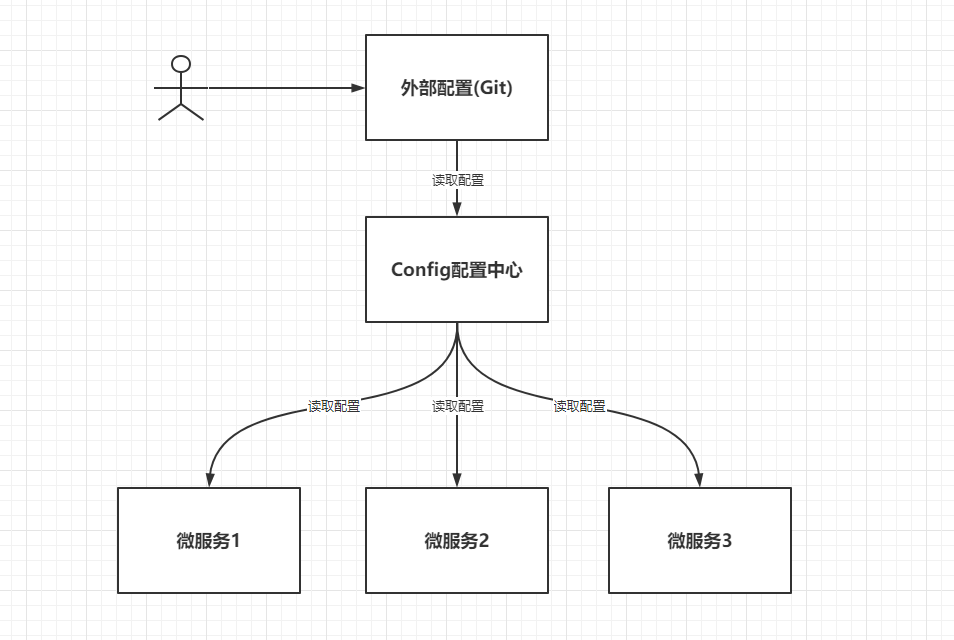

## 消息通知 bus

### 面试点: bus消息总线组件介绍

Spring cloud bus通过轻量消息代理连接各个分布的节点，管理和传播所有分布式项目中的消息，其实本质是利用了MQ的广播机制在分布式的系统中传播消息，目前常用的有Kafka和RabbitMQ。利用bus的机制可以做很多的事情，其中配置中心客户端刷新就是典型的应用场景之一，我们用一张图来描述bus在配置中心使用的机制。

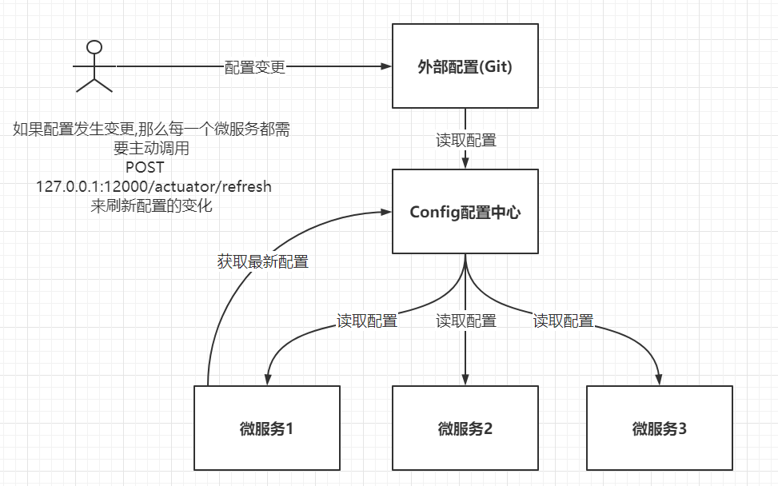

### 面试点: bus消息总线的工作原理

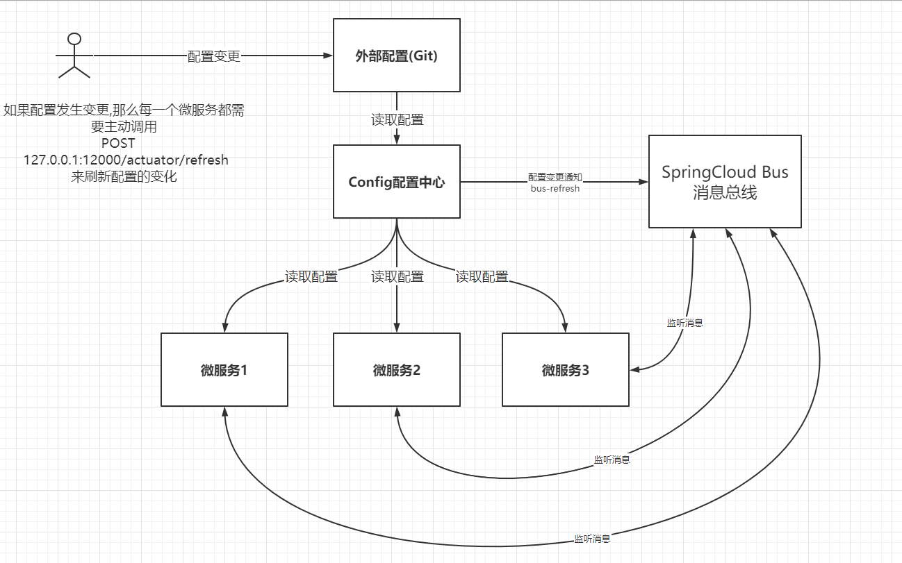

## 链路追踪 Sleuth

### 面试点：Sleuth链路追踪介绍

微服务架构是一个分布式架构，它按业务划分服务单元，一个分布式系统往往有很多个服务单元。由于服务单元数量众多，业务的复杂性，如果出现了错误和异常，很难去定位。主要体现在，一个请求可能需要调用很多个服务，而内部服务的调用复杂性，决定了问题难以定位。所以微服务架构中，必须实现分布式链路追踪，去跟进一个请求到底有哪些服务参与，参与的顺序又是怎样的，从而达到每个请求的步骤清晰可见，出了问题，很快定位。

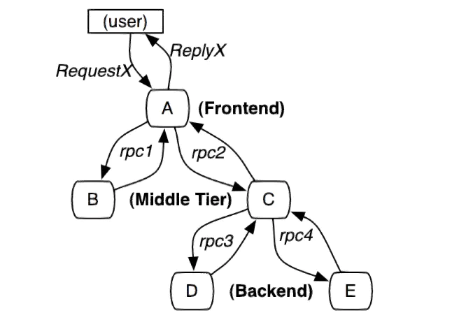

SpringCloud Sleuth组件可以为我们收集 链路追踪数据

```
链路追踪数据术语:
Span：基本工作单元，例如，在一个新建的span中发送一个RPC等同于发送一个回应请求给RPC，span通过一个64位ID唯一标识，trace以另一个64位ID表示，span还有其他数据信息，比如摘要、时间戳事件、关键值注释(tags)、span的ID、以及进度ID(通常是IP地址) 
span在不断的启动和停止，同时记录了时间信息，当你创建了一个span，你必须在未来的某个时刻停止它。

Trace：一系列spans组成的一个树状结构，例如，如果你正在跑一个分布式大数据工程，你可能需要创建一个trace。
```

收集到的数据如何分析、存储、查看呢? 我们需要一些可以帮助理解系统行为、用于分析性能问题的工具，以便发生故障的时候，能够快速定位和解决问题，这就是所谓的 APM（应用性能管理）。

目前主要的一些 APM 工具有: **Cat**、**Zipkin**、**SkyWalking**；

### 面试点：Sleuth+ZipKin链路追踪的工作原理

```xml
		<dependency>
			<groupId>org.springframework.cloud</groupId>
			<artifactId>spring-cloud-starter-sleuth</artifactId>
		</dependency>
		<dependency>
			<groupId>org.springframework.cloud</groupId>
			<artifactId>spring-cloud-sleuth-zipkin</artifactId>
		</dependency>
```


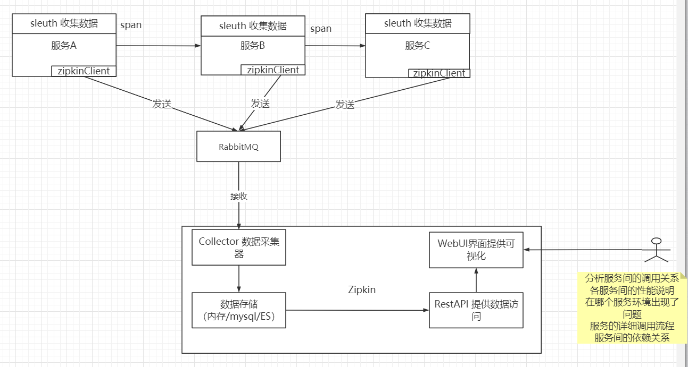