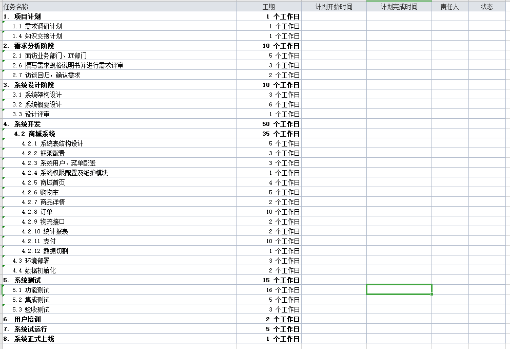

# 电商项目生命周期

### 背景阐述

XX商贸股份有限公司, 现需要开发一套网上商城来从事网上商品销售的业务，由于该商贸公司无技术团队，现急需软件公司能为其开发这款网上商城。简称A公司

北京XX软件技术有限公司，主要是一家提供软件开发的IT公司，有自己的软件团队，承接各类的软件开发工作，主做互联网项目。 简称B公司


B公司的销售 得知 A公司有商城软件开发的需求，便进行了销售公关，最终拿下这个项目。 

在这个商城项目中

A公司 为 甲方

B公司 为 乙方


(互联网公司自己的项目 和 外包公司的外包项目流程不同 )

### 软件公司的组织结构

下面介绍下，乙方公司的大体组织结构


### 项目的里程碑流程

#### 需求分析阶段

当销售团队和客户沟通完毕，产生意向后，产品部的需求工程师会参与进来，和客户讨论要实现的需求，进行梳理修改形成**需求文档**。形成需求文档后， 研发部、测试部、产品要进行会议进行需求的确认，如果需求确认后 研发部经理需要进行项目工程报价。 将需求分析说明书及报价反馈给客户，如果客户端觉得可以进入签订开发合同环节。

( 如果是政府或事业单位项目，需要走招投标流程 )

详见资料 ==> 需求分析说明书


#### 正式合同签订

甲方乙方需要在开始项目之前，签订开发合同产生法律效应


合同主要定义了 项目金额、验收标准、验收时间等内容， 这样合同签订完毕后 乙方需要按照指定时间完成软件的开发，甲方也会在不同的阶段支付项目款

#### 设计阶段-概要设计

概要设计--产生软件概要设计说明书，说明系统模块划分、选择的技术路线等，整体说明软件的实现思路。并且需要指出关键技术难点等。     

产出物：概要设计文档

#### 设计阶段-详细设计

  详细设计--产生软件详细设计说明书，对概要设计的进一步细化，一般由各部分的担当人员依据概要设计分别完成，然后在集成，是具体的实现细节。理论上要求可以照此编码。

产出物：详细设计文档

#### 设计阶段-原型设计

原型设计是产品人员将需求进行可视化，开发人员可以通过原型图更清楚的了解需求的效果，UI设计人员可以根据原型图进行UI页面的设计，测试人员可以根据原型图进行测试用例的设计。


常用原型设计工具: 墨刀   Axure


产出物： 原型

#### 设计阶段-数据库设计

根据需求或原型，进行数据库表的设计，有哪些表 表中有哪些字段，字段都是什么类型， 表与表之间的联系。


常用数据库建模工具: PowerDesigner 


**产出物：数据库文档**

#### 开发阶段-分工与计划

在这里我把开发阶段写到了设计的后面，实际有可能在需求定下来后就会进行分工，分工主要按照需求对工作量进行分工。 具体的分工可以通过一个Excel表格来定义， 也可以通过项目管理工具来分派任务。



但用excel表格管理效率非常低，而且不同的项目不同的人会产生非常多的表格，企业一般会使用项目管理系统

这里我们介绍一款开源的项目管理系统： 禅道


#### 开发阶段-编码

不同的公司会有关于开发的一些规范，如 阿里巴巴Java开发手册，会定义统一的命名风格，注释风格 对于初到单位的同学，如果公司有对应的编码规范文档那就按照规范文档的要求写，如果没有可以参照公司之前代码的风格来开发


另外现在很多企业采用的是前后端分离的模式开发,前端和后端需要统一参照接口文档的标准来进行编码, 公司不同接口文档由谁来定制也不同，有的需要前端提供，有的需要后端提供。 如后端提供， 可以直接通过手写的方式 写个word或Excel  描述清楚接口即可。  还有很多公司会采用生成接口文档的方式，如用的比较多的 Swagger  API文档

```
接口描述: 学习计划额外信息获取接口
URL:skuStudyPlanOtherList	
请求方式: GET
传入参数:
	skuId	String	学习计划ID
返回参数:
	oTitle	String	额外信息块标题
	oList	Array	额外信息块内容列表
	oList:text	String	文本信息
	oList:image	String	图片地址
	
结果示例:
{
	"status": "10000",
	"msg": "success",
	"token": "lingxiangjiaoyu123456789!@#$",
	"result": [{
			"oTitle": "适宜人群",
			"oList": [{
				"text": "想要成为理财师的人\n从事金融行业服务的人员",
				"image": ""
			}, {
				"text": "还是相关建业奥的说明",
				"image": “"
			}]
		},
		{
			"oTitle": "内容简介",
			"oList": [{
				"text": “",
				"image": "http://jiujing.oss-cn-beijing.aliyuncs.com/beerPicList/011b66f0-bf08-4e42-b36e-42e11ab320f7.jpg"
			}, {
				“text": 一些相关建业的说明”,
				"image": ""
			}]
		}
	]
}
```


开发工具:

**idea    eclipse  myeclipse**

构建工具:

**maven   gradle  ant**

代码版本工具:

**git       svn**


产出物：源码

#### 开发阶段-测试

当需求确定以后，测试就会准备测试用例，测试用例就是如何对项目进行测试的一些例子。 当开发完成功能的时候 会发布到测试环境进行测试。 测试的bug会提交到项目管理系统中  如: 禅道


开发人员会在系统中，查看由自己负责的bug   对bug进行解决 


产出物：测试报告

#### 交付阶段-压力测试

压力测试是代码开发完毕后，需要进行的性能测试手段，通过模拟大批量用户的并发访问操作，从而可以预测系统在大量用户并发发访问操作的情况下，系统可以响应的时间及服务器资源占用等性能情况。


产出物：压力测试报告

#### 交付阶段-实施部署

测试阶段完毕后，实施人员会将项目部署到客户的服务器上，包括数据库 各类项目 web服务器等等。


产出物：安装与部署手册

#### 交付阶段-验收阶段

完成部署后，所谓验收阶段主要是检查项目的各运行情况是否满足需求，各类文档和源码是否齐全。 完成验收会支付一部分项目款。 试用运行一段时间后会进行最终验收 支付全部项目尾款。


### 相关软件或系统的使用

#### Axure原型设计使用演示


#### PowerDesigner使用演示


#### Swagger 接口生成框架使用演示

引入依赖

```xml
<!-- swagger2 接口框架依赖  start-->
        <dependency>
            <groupId>io.springfox</groupId>
            <artifactId>springfox-swagger2</artifactId>
            <version>2.9.2</version>
        </dependency>
        <dependency>
            <groupId>io.springfox</groupId>
            <artifactId>springfox-swagger-ui</artifactId>
            <version>2.9.2</version>
        </dependency>
        <!-- swagger2 接口框架依赖 end-->
```

swagger配置

```java
@Configuration
@EnableSwagger2
public class SwaggerConfig {
    @Bean
    public Docket createRestApi() {
        return new Docket(DocumentationType.SWAGGER_2)
                .pathMapping("/")
                .select()
                .apis(RequestHandlerSelectors.basePackage("com.swagger"))
                .paths(PathSelectors.any())
                .build().apiInfo(new ApiInfoBuilder()
                        .title("SpringBoot整合Swagger接口文档")
                        .description("SpringBoot整合Swagger，描述信息......")
                        .version("1.0") // 版本
                        .contact(new Contact("mrchen","blog.csdn.net","aaa@gmail.com"))
                        .build());
    }
}

```

需要生成接口文档的Controller类中加入注解

```java
/**
 * @作者 itcast
 * @创建日期 2020/8/5 15:31
 **/
@RestController
@RequestMapping("user")
@Api(tags = "用户管理相关接口")
public class UserController {
    @ApiOperation("根据id查询用户的接口")
    @ApiImplicitParam(name = "id", value = "用户id", defaultValue = "1", required = true)
    @GetMapping("{id}")
    public User findById(@PathVariable Integer id){
        User user = new User();
        user.setId(id);
        user.setName("id为"+id +"的用户信息");
        return user;
    }
    @ApiOperation("查询用户集合的接口")
    @GetMapping
    public List<User> findAll(){
        List<User> list = new ArrayList<>();
        return list;
    }
    @ApiOperation("添加用户的接口")
    @PostMapping
    public boolean addUser(@RequestBody User user){
        return true;
    }
    @ApiOperation("删除用户的接口")
    @DeleteMapping("{id}")
    @ApiImplicitParam(name = "id", value = "用户id", defaultValue = "1", required = true)
    public boolean delUser(@PathVariable Integer id){
        return true;
    }
    @ApiOperation("修改用户的接口")
    @PutMapping
    public boolean updateUser(@RequestBody User user){
        return true;
    }
}
```

实体类中也可以加入注解进行描述

```java
@Data
@ApiModel(value = "用户实体类")
public class User {
    @ApiModelProperty(value = "用户ID")
    private Integer id;
    @ApiModelProperty(value = "用户名称")
    private String name;
    @ApiModelProperty(value = "用户年龄")
    private Integer age;
}
```

输入 http://localhost:8080/swagger-ui.html 即可访问接口


也可以将接口文档导出 

需要pom中配置插件

```xml
<build>
        <plugins>
            <plugin>
                <groupId>org.springframework.boot</groupId>
                <artifactId>spring-boot-maven-plugin</artifactId>
            </plugin>
            <plugin>
                <groupId>io.github.swagger2markup</groupId>
                <artifactId>swagger2markup-maven-plugin</artifactId>
                <version>1.3.3</version>
                <configuration>
                    <!--swagger页面可以看到-->
                    <swaggerInput>http://localhost:8080/v2/api-docs</swaggerInput>
                    <!--生成多个文件-->
<!--                    <outputDir>./docs/asciidoc/generated/all</outputDir>-->
                    <!--生成单个文件-->
                    <outputFile>./docs/asciidoc/generated/${artifactId}-api</outputFile>
                    <config>
                        <!-- 除了ASCIIDOC之外，还有MARKDOWN和CONFLUENCE_MARKUP可选 -->
                        <swagger2markup.markupLanguage>ASCIIDOC</swagger2markup.markupLanguage>
                    </config>
                </configuration>
                <executions>
                    <execution>
                        <phase>generate-sources</phase>
                        <goals>
                            <goal>convertSwagger2markup</goal>
                        </goals>
                    </execution>
                </executions>
            </plugin>
            <plugin>
                <groupId>org.asciidoctor</groupId>
                <artifactId>asciidoctor-maven-plugin</artifactId>
                <version>1.5.6</version>
                <dependencies>
                    <dependency>
                        <groupId>org.asciidoctor</groupId>
                        <artifactId>asciidoctorj-pdf</artifactId>
                        <version>1.5.0-alpha.16</version>
                    </dependency>
                    <dependency>
                        <groupId>org.jruby</groupId>
                        <artifactId>jruby-complete</artifactId>
                        <version>9.2.8.0</version>
                    </dependency>
                </dependencies>
                <configuration>
                    <!--asciidoc文件所在路径-->
                    <sourceDirectory>./docs/asciidoc/generated</sourceDirectory>
                    <headerFooter>true</headerFooter>
                    <doctype>book</doctype>
                    <sourceHighlighter>coderay</sourceHighlighter>
                    <attributes>
                        <!--菜单栏在左边-->
                        <toc>left</toc>
                        <!--多标题排列-->
                        <toclevels>3</toclevels>
                        <!--自动打数字序号-->
                        <sectnums>true</sectnums>
                    </attributes>
                </configuration>
                <executions>
                    <execution>
                        <id>output-html</id>
                        <phase>generate-resources</phase>
                        <goals>
                            <goal>process-asciidoc</goal>
                        </goals>
                        <configuration>
                            <backend>html5</backend>
                            <outputDirectory>./docs/asciidoc/html</outputDirectory>
                        </configuration>
                    </execution>
                    <execution>
                        <id>output-pdf</id>
                        <phase>generate-resources</phase>
                        <goals>
                            <goal>process-asciidoc</goal>
                        </goals>
                        <configuration>
                            <backend>pdf</backend>
                            <outputDirectory>./docs/asciidoc/pdf</outputDirectory>
                        </configuration>
                    </execution>
                </executions>
            </plugin>
        </plugins>
    </build>

```

使用 maven compiler 编译代码时就会生成文档


#### 禅道的安装与使用演示

下载禅道安装包，这里选用linux64位一键安装包

https://www.zentao.net/dynamic/zentaopms12.4-80248.html

将安装包上传到linux系统中 

**将安装包直接解压到/opt目录下**不要 解压到别的目录再拷贝到/opt/，因为这样会导致文件的所有者和读写权限改变， 也不要解压后把整个目录777权限

```
tar -zxvf  ZenTaoPMS.7.3.stable.zbox_32.tar.gz -C /opt
```

**设置端口** 

ap代表apache服务器端口

mp代表mysql服务器端口

```
/opt/zbox/zbox -ap 8080 -mp 3307
```

**启动禅道**

```shell
# 命令开启Apache和Mysql。
/opt/zbox/zbox start 
# 命令停止Apache和Mysql。
/opt/zbox/zbox stop 
# 命令重启Apache和Mysql。
/opt/zbox/zbox restart 
```

**访问禅道**

http://192.168.12.130:8080/ 

默认的用户名密码:  admin 123456

设置密码: Aa123456


登录后需要修改密码


**演示功能:** 

产品经理可以在此软件设置产品提需求

项目经理可以在此软件管理项目分配任务

测试人员可以在此软件测试项目提出Bug

研发人员可以在此软件接收任务、解决bug

。。。

。。。