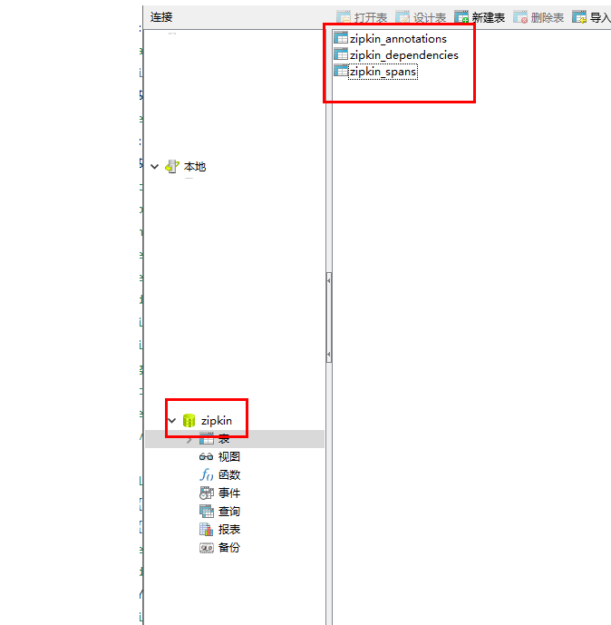

# 链路追踪解决方案  

## 链路追踪

**简介**

 一个分布式系统由若干分布式服务构成，每一个请求会经过多个业务系统并留下足迹，但是这些分散的数据对于问题排查，或是流程优化都很有限。要能做到追踪每个请求的完整链路调用，收集链路调用上每个服务的性能数据，计算性能数据和比对性能指标（SLA），甚至能够再反馈到服务治理中，那么这就是分布式跟踪的目标。在业界：淘宝的鹰眼， 京东的Hydra实现了这个目标，这里要介绍的是twitter 的 zipkin。

**相关概念**

- Span：基本工作单元，例如，在一个新建的span中发送一个RPC等同于发送一个回应请求给RPC，span通过一个64位ID唯一标识，trace以另一个64位ID表示，span还有其他数据信息，比如摘要、时间戳事件、关键值注释(tags)、span的ID、以及进度ID(通常是IP地址) 。


- Trace：一系列spans组成的一个树状结构，例如，如果你正在跑一个分布式大数据工程，你可能需要创建一个trace。

**Sleuth简介**

Spring Cloud Sleuth为服务之闻的调用提供链路追踪， 通过Sleuth可以很清楚地了解到一个服务请求经过了哪些服务，每个服务处理花费了多长时间，从而让我们可以很方便地理清各微服务间的调用关系.此外， Sleuth还可以帮助我们：

- 耗时分析：通过Sleuth可以很方便地了解到每个采样请求的耗时从而分析出哪些服务调用比较耗时
- 链路优化：对于调用比较频繁的服务，可以针对这些服务实施一些优化措施.

Spring Cloud Sleuth集成了zipkin组件， 将信息发送到ZipKin， 利用ZipKin的存储来存储信息， 利用Zip Kin UI来展示数据。

sleuth组件主要负责链路追踪数据的采集

**ZipKin简介**

1、Zipkin是一个致力于收集分布式服务的时间数据的分布式跟踪系统。

2、Zipkin 主要涉及四个组件：collector（数据采集）,storage（数据存储）,search（数据查询）,UI（数据展示）。

3、github源码地址:*https://github.com/openzipkin/zipkin*。

4、Zipkin提供了可插拔数据存储方式：In-Memory，MySql, Cassandra, Elasticsearch；本文为了测试方便以In-Memory方式进行存储，个人推荐Elasticsearch，关于更多的存储方式可以参考github。

5、ZipKin运行环境需要Jdk8支持。


**实现步骤：**

1. 下载并启动 zipkin服务器

2. 在需要的微服务中设置zipkin的连接地址

3. 在配置类中开启数据采样设置

   ​	在spring Cloud为F版本的时候，已经不需要自己构建Zipkin Server了，只需要下载jar即可，下载地址：

   [https://dl.bintray.com/openzipkin/maven/io/zipkin/java/zipkin-server/](https://dl.bintray.com/openzipkin/maven/io/zipkin/java/zipkin-server/)

   下载完成jar 包之后，可以将jar放入工程中，然后右键运行，也可以到jar包目录下，运行如下命令：　

   ```
    java -jar zipkin-server-2.12.9-exec.jar
   ```


启动成功后通过:http://localhost:9411 即可访问


在order-service和user-service的依赖中 加入zipkin的客户端起步依赖

```xml
<dependency>
    <groupId>org.springframework.cloud</groupId>
    <artifactId>spring-cloud-starter-zipkin</artifactId>
</dependency>
```

在order-service和user-service的依赖中加入下面配置

```yaml
spring:
  zipkin:
    base-url: http://localhost:9411 # zipkin服务端的地址
    sender:
      type: web
  sleuth:
    sampler:
      probability: 1 # 采样率 百分百采样
```

重启order服务后 调用路径 http://localhost:9101/order/4

依赖关系：


调用链路追踪：可以根据各种条件，查询微服务的调用记录


分析调用过程: 


调用详情： 每个环境的详情信息


刷新zipkin网址 即可查询到该请求,并可以分析该请求的执行流程，都经过了哪些服务消耗的时间怎样，如果有异常是在哪个环节出现的异常


## 链路追踪数据持久化

**思路:**

zipkin支持多种数据存储方案，如： 内存、mysql、Elasticsearch，默认情况下存储到内存中，可以通过更改配置来变更 关于具体该如何配置需要查看官方提供源码的配置文件

配置文件地址:

https://github.com/openzipkin/zipkin/blob/master/zipkin-server/src/main/resources/zipkin-server-shared.yml

**实现方式：**

- 准备mysql数据库和表(zipkin提供)

- 启动zipkin时指定对应参数

准备mysql数据库和表(zipkin提供的) 

创建zipkin数据库,导入课件中提供的zipkin.sql




更改启动参数

查看zipkin的配置文件，可以发现默认的存储类型为 mem内存中

我们可以通过 STORATE_TYPE=mysql 参数替代默认值


找到下面的mysql存储配置，可以看到mysql的相关配置信息 按照要求传入参数替代默认参数即可


参考配置:

```shell
java -jar zipkin-server-2.12.9-exec.jar --STORAGE_TYPE=mysql --MYSQL_HOST=127.0.0.1 --MYSQL_TCP_PORT=3306 --MYSQL_USER=root --MYSQL_PASS=root --MYSQL_DB=zipkin
```

## 线路追踪数据采集优化

**思路:**  

zipkin支持消息中间件形式的数据采集方式,我们可以通过更改数据的采集方式来采集数据

**使用方式:**

1. 准备rabbitmq服务器

2. 修改zipkin服务端，接收rabbitmq队列消息

3. 修改zipkin客户端，将消息使用rabbitmq方式发送到mq服务器


准备rabbitmq服务器


修改zipkin服务端，接收rabbitmq队列消息

查看配置文件，发现zipkin已经开启了rabbitmq的采集方式，不过地址为空 

我们只需要添加rabbitmq的地址参数即可


```shell
java -jar zipkin-server-2.12.9-exec.jar --RABBIT_ADDRESSES=127.0.0.1:5672
```

修改zipkin客户端，将消息使用rabbitmq方式发送到mq服务器

1) 所有需要采集信息的微服务 ，引入操作rabbitmq的依赖

```xml
<dependency>
    <groupId>org.springframework.amqp</groupId>
    <artifactId>spring-rabbit</artifactId>
</dependency>
```

2）修改配置文件

```yaml
# 添加rabbitmq的参数， 如果都是默认值可不配
spring:
  rabbitmq:
    host: localhost
    port: 5672
    username: guest
    password: guest
```

```yaml
# 修改zipkin 中的sender type为rabbit
spring:
  application:
    name: order-service
  zipkin:
    base-url: http://localhost:9411 # zipkin服务端的地址
  	sender:
      type: rabbit
  sleuth:
    sampler:
      probability: 1
```

重启user，order 和 网关服务

在次测试访问 打开rabbitmq查看，多了一个zipkin的队列


可以尝试关闭zipkin服务端，在次调用访问路径

该队列中会出现未被消费的消息 启动ZipKin服务端后消息被消费

这样我们又使用RabbitMQ对我们的微服务和链路追踪服务器ZipKin进行了解耦合


微服务日志ELK解决方案 

微服务分布式调度解决方案

