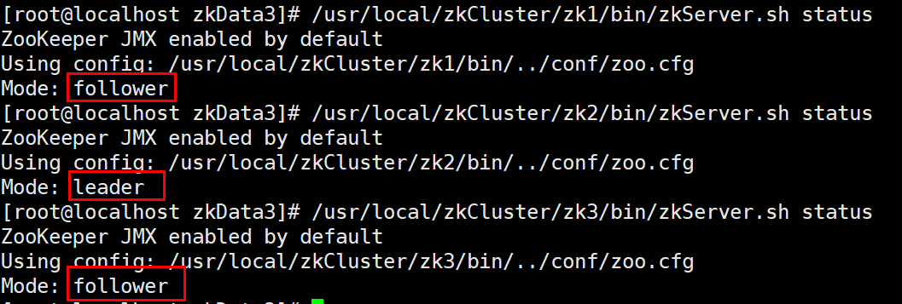

# Zookeeper快速入门

### Zookeeper概念介绍

ZooKeeper是一个分布式的，开源应用协调服务，是Google的Chubby一个开源的实现，是Hadoop和Hbase的重要组件。它是一个为分布式应用提供一致性服务的软件

**Zookeeper设计目的**

- 最终一致性：client不论连接到那个Server，展示给它的都是同一个视图。
- 可靠性：具有简单、健壮、良好的性能、如果消息m被到一台服务器接收，那么消息m将被所有服务器接收。
- 实时性：Zookeeper保证客户端将在一个时间间隔范围内获得服务器的更新信息，或者服务器失效的信息。但由于网络延时等原因，Zookeeper不能保证两个客户端能同时得到刚更新的数据，如果需要最新数据，应该在读数据之前调用sync()接口。
- 等待无关（wait-free）：慢的或者失效的client不得干预快速的client的请求，使得每个client都能有效的等待。
- 原子性：更新只能成功或者失败，没有中间状态。
- 顺序性：包括全局有序和偏序两种：全局有序是指如果在一台服务器上消息a在消息b前发布，则在所有Server上消息a都将在消息b前被发布；偏序是指如果一个消息b在消息a后被同一个发送者发布，a必将排在b前面。

**zookeeper的本质: 1. 文件系统     2. wather监听通知机制**

**1、文件系统**

Zookeeper维护一个树形节点的数据结构： 


每个子目录项如 NameService 都被称作为 znode(目录节点)，和文件系统一样，我们能够自由的增加、删除znode，在一个znode下增加、删除子znode，唯一的不同在于znode是可以存储数据的。

有四种类型的znode：

- **PERSISTENT-持久化目录节点**

  客户端与zookeeper断开连接后，该节点依旧存在

- **PERSISTENT_SEQUENTIAL-持久化顺序编号目录节点**

  客户端与zookeeper断开连接后，该节点依旧存在，只是Zookeeper给该节点名称进行顺序编号

- **EPHEMERAL-临时目录节点**

  客户端与zookeeper断开连接后，该节点被删除

- **EPHEMERAL_SEQUENTIAL-临时顺序编号目录节点**

  客户端与zookeeper断开连接后，该节点被删除，只是Zookeeper给该节点名称进行顺序编号

**2、 监听通知机制**

客户端注册监听它关心的目录节点，当目录节点发生变化（数据改变、被删除、子目录节点增加删除）时，zookeeper会通知客户端。

就这么简单，下面我们看看Zookeeper能做点什么呢？

### Zookeeper的基本操作

**zookeeper安装**

官网下载地址: https://zookeeper.apache.org/releases.html

```shell
课件提供的是 3.4.14版本

上传至linux服务器

解压:
[root@localhost ~]# tar -zxvf zookeeper-3.4.14.tar.gz -C /usr/local/

进入zookeeper配置目录:
[root@localhost conf]# cd /usr/local/zookeeper-3.4.14/conf/

可以看到下列文件，zoo_sample.cfg是提供的样例配置
[root@localhost conf]# ls
configuration.xsl  log4j.properties  zoo_sample.cfg

将样例配置更名为 zoo.cfg
[root@localhost conf]# scp zoo_sample.cfg zoo.cfg

启动zookeeper服务即可:
cd /usr/local/zookeeper-3.4.14/bin/

启动ZK服务: ./zkServer.sh start
查看ZK服务状态: ./zkServer.sh status
停止ZK服务: ./zkServer.sh stop
重启ZK服务: ./zkServer.sh restart


使用客户端连接zookeeper:
./zkCli.sh 
```

**zookeeper基本操作**

创建命令: create  节点名称  节点值

```
create /test t 

create /test/t_1 t1

注意：目录必须一层层的创建,并且目录只能唯一

创建有序节点：create -s /lock/mylock  testval

创建临时节点：create -e /temp   testval

临时节点保存了当前会话，会话结束，节点也会删除，但是不会立马删除，会有一个心跳时间
```

删除命令：delete

```
节点只能一层一层的删除

删除节点和节点下所有子节点 使用: rmr 
```

修改命令：set

```
set /test 值

set path 值  version 
```

查询命令：get

```
演示watch操作

开启一个终端 get /test watch  检查节点值变化的监听

开启另外一个终端 set /test 值

会发现终端的变化

开启一个监控目录变化的监听  ls /mulu wath 检查目录变化的监听
```

**节点参数说明（了解）:**

```
czxid; // 该数据节点被创建时的事务id
mzxid; // 该数据节点被修改时最新的事物id
ctime; // 该数据节点创建时间
mtime; // 该数据节点最后修改时间
version; // 当前节点版本号（可以理解为修改次数，每修改一次值+1）
cversion;// 子节点版本号（子节点修改次数，每修改一次值+1）
aversion; // 当前节点acl版本号（acl节点被修改次数，每修改一次值+1）
ephemeralOwner; // 临时节点标示，当前节点如果是临时节点，则存储的创建者的会话id（sessionId），如果不是，那么值=0
dataLength;// 当前节点数据长度
umChildren; // 当前节点子节点个数
pzxid; // 当前节点的父级节点事务ID
```

### Zookeeper的应用场景

**场景一:  命名服务/注册中心(文件系统)**

```
命名服务是指通过指定的名字来 获取资源 或者 服务的地址 ，利用zk创建一个全局的路径，即是 唯一 的路径，这 个路径就可以作为一个名字，指向集群中的集群，提供的服务的地址，或者一个远程的对象等等。
```

**场景二: 分布式配置管理**

```
程序分布式的部署在不同的机器上，将程序的配置信息放在zk的znode 下，当有配置发生改变时，也就是 znode发生变化时，可以通过改变zk中某个目录节点的内容，利用 watcher 通知给各个客户端，从而更改配置。
```

**场景三: Zookeeper集群管理**

```
所有机器约定在父目录下 创建临时目录节点 ，然后监听父目录节点的子节点变化消息。
一旦有机 器挂掉，该机器与 zookeeper的连接断开，其所创建的临时目录节点被删除， 
所有其他机器都收到通知：某个 兄弟目录被删除 ，于是，所有人都知道：它挂掉了。 
新机器加入也是类似， 所有机器收到通知：新兄弟目录加入
```

**场景四: Zookeeper实现分布式锁**

```
有了zookeeper的一致性文件系统，锁的问题变得容易。锁服务实现可以分为两种方式.
一个是保持独占 ，另一个是控制时序 。 
对于第一类，我们将zookeeper上的一个 znode 看作是一把锁 ，通过createznode的方式来实现。所有客户 端都去创建 /distribute_lock 节点，最终成功创建的那个客户端也即拥有了这把锁。用完删除掉自己创建的 distribute_lock 节点就释放出锁。

弊端: 惊群效应   释放锁时会通知所有其它节点,其它节点会竞争锁，如果在高并发情况会带来性能的影响。

对于第二类， /distribute_lock 已经预先存在，所有客户端在它下面创建临时顺序编号目录节点，编号最小的获得锁 ，用完删除，依次方便。 且因为是有序的也实现了公平锁
```

**场景五... 六... 七.......**


#### 分布式配置Demo

演示zookeeper的分布式配置中心

```
-- 在zookeeper中创建 /username   znode节点 代表我们的配置
create /username xiaoming
```

准备maven项目,并引入zookeeper客户端依赖

```xml
<dependencies>
	<dependency>
        <groupId>org.apache.zookeeper</groupId>
        <artifactId>zookeeper</artifactId>
        <version>3.4.12</version>
	</dependency>
</dependencies>
```

创建演示类，模拟客户端读取zookeeper中的配置信息，并监听变化

```java
/**
 * 分布式配置中心demo
 * @author 
 */
public class ZooKeeperProSync implements Watcher {
    private static CountDownLatch connectedSemaphore = new CountDownLatch(1);
    //zk客户端对象
    private static ZooKeeper zk = null;
    //状态对象
    private static Stat stat = new Stat();
    public static void main(String[] args) throws Exception {
        //zookeeper配置数据存放路径
        String path = "/username";
        //连接zookeeper并且注册一个默认的监听器
        zk = new ZooKeeper("192.168.12.129:2181",10000,new ZooKeeperProSync());
        //等待zk连接成功的通知
        connectedSemaphore.await();
        //获取path目录节点的配置数据，并注册默认的监听器
        System.out.println("当前配置的值==>" + new String(zk.getData(path, true, stat)));
        Thread.sleep(Integer.MAX_VALUE);
    }
    public void process(WatchedEvent event) {
        if (KeeperState.SyncConnected == event.getState()) {  //zk连接成功通知事件
            if (EventType.None == event.getType() && null == event.getPath()) {
                connectedSemaphore.countDown();
            } else if (event.getType() == EventType.NodeDataChanged) {  //zk目录节点数据变化通知事件
                try {
                    System.out.println("配置已修改，新值为：" + new String(zk.getData(event.getPath(), true, stat)));
                } catch (Exception e) {
                }
            }
        }
    }
}
```

修改启动类可运行多个实例


分别运行两次ZookeeperProSync类,可以看到两个客户端都得到了配置中心的值


使用linux客户端输入命令更高 username节点的值

```
set /username wahaha
```

查看控制台变化


### Zookeeper的集群说明

Zookeeper的使用场景远远不止上面所说的，既然在分布式的架构下，Zookeeper有那么多的使用场景，自然在生产环境中 对于zookeeper本身也是需要高可用方案的，那就是Zookeeper集群:

#### **Zookeeper集群工作原理**

在zookeeper的集群中，各个节点共有下面3种角色和4种状态：
**角色：leader、follower、observer**
**状态：leading、following、observing、looking**

**集群中的角色说明:**

leader 领导者

```
leader 服务器是整个ZK集群的核心，负责响应所有对ZooKeeper状态变更的请求。它会将每个状态更新请求进行排序和编号，以便保证整个集群内部消息处理的FIFO。主要的职责： 
1.处理事务请求（添加、修改、删除）和非事务请求，也是事务请求的唯一调度和处理者，能够保证集群事务处理的顺序；
2.集群内部各服务器的调度者；
```

follower 跟随者

```
从角色名字上可以看出，follower服务器是ZooKeeper集群状态的跟随者，主要的职责：
1.处理客户端非事务请求，如果请求是事务请求，会转发事务请求给 leader 服务器；
2.参与事务请求 Proposal 的投票（leader发起的提案，要求follower投票，需要半数以上follower节点通过，leader才会commit数据）；
3.参与 Leader 选举的投票；
```

ObServer 观察者

```
观察ZooKeeper集群中的最新状态变化并将这些状态变化同步到observer服务器上。observer的工作原理与follower角色基本一致，而它和follower 角色唯一的不同在于observer不参与任何形式的投票，包括事务请求Proposal的投票（Zookeeper的Znode变更是要过半数投票通过，随着机器的增加，由于网络消耗等原因必然导致投票成本增加，从而导致写性能的下降）和leader选举的投票。只是简单的接收投票结果，因此我们增加再多的Observer，也不会影响集群的写性能。除了这个差别，其他的和Follower基本上完全一样。
```

**每个Server在工作过程中有4种状态：**

- LOOKING：当前Server不知道leader是谁，正在搜寻。
- LEADING：当前Server即为选举出来的leader。
- FOLLOWING：leader已经选举出来，当前Server与之同步。
- OBSERVING：observer的行为在大多数情况下与follower完全一致，但是他们不参加选举和投票，而仅仅接受(observing)选举和投票的结果。

#### **zookeeper集群演示:**

课程中，我们采用一台机器搭建3台zookeeper的伪集群方式演示:

创建文件夹，准备3份zookeeper

```shell
# 创建文件夹 
mkdir /usr/local/zkCluster

# 准备第一份zookeeper (直接将上面单机版zookeeper拷贝过来即可)
cp -rf /usr/local/zookeeper-3.4.14 /usr/local/zkCluster/zk1

# 更改配置
vi /usr/local/zkCluster/zk1/conf/zoo.cfg

# 将dataDir变更(数据的存放目录 后面会创建)
dataDir=/usr/local/zkCluster/data/zkData1
# zk的端口号 (后面两台注意变更)
clientPort=2181
# 添加集群配置
# 说明集群为3台服务器，因为是本机IP一样，不同机器换IP即可
# server.id : 数字为集群节点的ID  
# 修改后保存
server.1=127.0.0.1:2888:3888
server.2=127.0.0.1:2889:3889
server.3=127.0.0.1:2890:3890

# 在根据zk1 拷贝两份zk
cp -rf /usr/local/zkCluster/zk1 /usr/local/zkCluster/zk2
cp -rf /usr/local/zkCluster/zk1 /usr/local/zkCluster/zk3

# 分别修改zk2 和 zk3中的配置文件 (主要修改:dataDir和端口)
vi /usr/local/zkCluster/zk2/conf/zoo.cfg 
dataDir=/usr/local/zkCluster/data/zkData2
clientPort=2182

vi /usr/local/zkCluster/zk3/conf/zoo.cfg 
dataDir=/usr/local/zkCluster/data/zkData3
clientPort=2183

# 下图为zk2 的配置情况
```


准备存放数据的目录 及 集群ID文件

```shell
# 创建节点1目录 及 myid文件用于存储集群id
mkdir -p /usr/local/zkCluster/data/zkData1
vi /usr/local/zkCluster/data/zkData1/myid
输入:  1    保存退出

# 创建节点2目录 及 myid文件用于存储集群id

mkdir -p /usr/local/zkCluster/data/zkData2
vi /usr/local/zkCluster/data/zkData2/myid
输入:  2    保存退出

# 创建节点3目录 及 myid文件用于存储集群id

mkdir -p /usr/local/zkCluster/data/zkData3
vi /usr/local/zkCluster/data/zkData3/myid
输入:  3    保存退出

# myid的值一定不要设置错 它的值对应配置中server.XXX的值
# 创建完记得查看一下值是否正确
cat /usr/local/zkCluster/data/zkData1/myid
```


启动3台zookeeper:

```
/usr/local/zkCluster/zk1/bin/zkServer.sh start
/usr/local/zkCluster/zk2/bin/zkServer.sh start
/usr/local/zkCluster/zk3/bin/zkServer.sh start
```


查看3台zookeeper角色

```
/usr/local/zkCluster/zk1/bin/zkServer.sh status
/usr/local/zkCluster/zk2/bin/zkServer.sh status
/usr/local/zkCluster/zk3/bin/zkServer.sh status
```



测试集群:

```
# 连接不同的节点 设置数据  会立刻同步到其它节点

# 停止leader角色节点，会产生重新选举，新的leader节点会产生

# 停止的节点恢复后 变为follower节点
```


附录: 配置说明

```
tickTime：这个时间是作为 Zookeeper 服务器之间或客户端与服务器之间维持心跳的时间间隔，也就是每个 tickTime 时间就会发送一个心跳。

initLimit：这个配置项是用来配置 Zookeeper 接受客户端（这里所说的客户端不是用户连接 Zookeeper 服务器的客户端，而是 Zookeeper 服务器集群中连接到 Leader 的 
Follower 服务器）初始化连接时最长能忍受多少个心跳时间间隔数。当已经超过 10个心跳的时间（也就是 tickTime）长度后 Zookeeper 服务器还没有收到客户端的返回信息，那么表明这个客户端连接失败。总的时间长度就是 10*2000=20 秒

syncLimit：这个配置项标识 Leader 与 Follower 之间发送消息，请求和应答时间长度，最长不能超过多少个 tickTime 的时间长度，总的时间长度就是 5*2000=10秒

dataDir：顾名思义就是 Zookeeper 保存数据的目录，默认情况下，Zookeeper 将写数据的日志文件也保存在这个目录里。

clientPort：这个端口就是客户端连接 Zookeeper 服务器的端口，Zookeeper 会监听这个端口，接受客户端的访问请求。

server.A=B：C：D：其中 A 是一个数字，表示这个是第几号服务器；B 是这个服务器的 ip 地址；C 表示的是这个服务器与集群中的 Leader 服务器交换信息的端口；D 表示的是万一集群中的 Leader 服务器挂了，需要一个端口来重新进行选举，选出一个新的 Leader，而这个端口就是用来执行选举时服务器相互通信的端口。如果是伪集群的配置方式，由于 B 都是一样，所以不同的 Zookeeper 实例通信端口号不能一样，所以要给它们分配不同的端口号。
```


#### 原子广播及Zab协议

Zookeeper的核心是原子广播，这个机制保证了各个Server之间的同步。实现这个机制的协议叫做Zab协议（ZooKeeper Atomic Broadcast protocol）。Zab协议有两种模式，它们分别是恢复模式（Recovery选主）和广播模式（Broadcast同步）。当服务启动或者在领导者崩溃后，Zab就进入了恢复模式，当领导者被选举出来，且大多数Server完成了和leader的状态同步以后，恢复模式就结束了。状态同步保证了leader和Server具有相同的系统状态。

**选举机制(扩展阅读):**

https://blog.csdn.net/hxpjava1/article/details/81003125

https://blog.csdn.net/wyqwilliam/article/details/83537139

为了保证事务的顺序一致性，zookeeper采用了递增的事务id号（zxid）来标识事务。所有的提议（proposal）都在被提出的时候加上了zxid。实现中zxid是一个64位的数字，它高32位是epoch用来标识leader关系是否改变，每次一个leader被选出来，它都会有一个新的epoch，标识当前属于那个leader的统治时期。低32位用于递增计数。

**如何保障分布式一致性(扩展阅读):**


```
首先客户端所有的写请求都由一个Leader接收，而其余的都是Follower(从者)
Leader 负责将一个客户端事务请求，转换成一个 事务Proposal，并将该 Proposal 分发给集群中所有的 Follower(备份) ，也就是向所有 Follower 节点发送数据广播请求（或数据复制）记住这里发送给的不光是数据本身，还有其他的，相当于包装 分发之后Leader需要等待所有Follower的反馈（Ack请求），在Zab协议中，只要超过半数的Follower进行了正确的反馈后（也就是收到半数以上的Follower的Ack请求），那么 Leader 就会再次向所有的 Follower发送 Commit 消息，要求其将上一个 事务proposal 进行提交。就是相当于通过，如果是用dubbo进行微服务就是zookeeper这个协调服务通过了，开始往服务端发送数据

ZAB协议的原理

发现：必须有一个Leader，而Leader拥有一个Follower的列表，里面是可以通讯的Follower，为后面的同步，广播做准备

同步：Leader 要负责将本身的数据与 Follower 完成同步，做到多副本存储。这样也是提现了CAP中的高可用和分区容错。Follower将队列中未处理完的请求消费完成后，写入本地事务日志中

广播：Leader 可以接受客户端新的事务Proposal请求，将新的Proposal请求广播给所有的 Follower。
```


# Dubbo回顾及面试细节

### 基础概念回顾

##### 什么是RPC

RPC(Remote Procedure Call)：远程过程调用，它是一种通过网络从远程计算机程序上请求服务，而不需要了解底层网络技术的思想。

Dubbo：是阿里集团开源的一个极为出名的 RPC 框架，在很多互联网公司和企业应用中广泛使用。协议和序列化框架都可以插拔是极其鲜明的特色。

Apache Dubbo 是一款高性能、轻量级的开源Java RPC框架，它提供了三大核心能力：面向接口的远程方法调用，智能容错和负载均衡，以及服务自动注册和发现。


##### 节点角色说明

| 节点        | 角色说明                               |
| ----------- | -------------------------------------- |
| `Provider`  | 暴露服务的服务提供方                   |
| `Consumer`  | 调用远程服务的服务消费方               |
| `Registry`  | 服务注册与发现的注册中心               |
| `Monitor`   | 统计服务的调用次数和调用时间的监控中心 |
| `Container` | 服务运行容器                           |

##### 调用关系说明

1. 服务容器负责启动，加载，运行服务提供者。
2. 服务提供者在启动时，向注册中心注册自己提供的服务。
3. 服务消费者在启动时，向注册中心订阅自己所需的服务。
4. 注册中心返回服务提供者地址列表给消费者，如果有变更，注册中心将基于长连接推送变更数据给消费者。
5. 服务消费者，从提供者地址列表中，基于软负载均衡算法，选一台提供者进行调用，如果调用失败，再选另一台调用。
6. 服务消费者和提供者，在内存中累计调用次数和调用时间，定时每分钟发送一次统计数据到监控中心。


### 快速入门

##### 搭建父工程

**创建dubbo-demo工程**

```xml
<?xml version="1.0" encoding="UTF-8"?>
<project xmlns="http://maven.apache.org/POM/4.0.0"
         xmlns:xsi="http://www.w3.org/2001/XMLSchema-instance"
         xsi:schemaLocation="http://maven.apache.org/POM/4.0.0 http://maven.apache.org/xsd/maven-4.0.0.xsd">
    <modelVersion>4.0.0</modelVersion>

    <groupId>org.example</groupId>
    <artifactId>dubbo_demo</artifactId>
    <packaging>pom</packaging>
    <version>1.0-SNAPSHOT</version>
    <modules>
        <module>dubbo-interface</module>
        <module>dubbo-provider</module>
        <module>dubbo-consumer</module>
    </modules>

    <dependencyManagement>
        <dependencies>
            <dependency>
                <groupId>org.springframework.boot</groupId>
                <artifactId>spring-boot-dependencies</artifactId>
                <version>2.1.4.RELEASE</version>
                <type>pom</type>
                <scope>import</scope>
            </dependency>
        </dependencies>
    </dependencyManagement>

    <build>
        <plugins>
            <plugin>
                <groupId>org.apache.maven.plugins</groupId>
                <artifactId>maven-compiler-plugin</artifactId>
                <version>3.8.0</version>
                <configuration>
                    <encoding>UTF-8</encoding>
                    <source>1.8</source>
                    <target>1.8</target>
                </configuration>
            </plugin>
        </plugins>
    </build>
</project>
```

##### 搭建接口服务子工程

右键创建服务工程-定义服务接口和实体类 dubbo-interface

定义实体类User

```java
/**
 * @作者 itcast
 * @创建日期 2020/6/23 16:16
 **/
public class User implements Serializable {
    private Integer id;
    private String name;
    public Integer getId() {
        return id;
    }
    public void setId(Integer id) {
        this.id = id;
    }
    public String getName() {
        return name;
    }
    public void setName(String name) {
        this.name = name;
    }
}
```

定义服务接口

```java
/**
 * 用户服务接口
 */
public interface UserService {
    /**
     * 根据ID查询用户
     * @param id
     * @return
     */
    public User findById(Integer id);
}
```

##### 搭建服务提供者工程

创建maven子工程 dubbo-provider服务提供者工程

引入依赖

```xml
<?xml version="1.0" encoding="UTF-8"?>
<project xmlns="http://maven.apache.org/POM/4.0.0"
         xmlns:xsi="http://www.w3.org/2001/XMLSchema-instance"
         xsi:schemaLocation="http://maven.apache.org/POM/4.0.0 http://maven.apache.org/xsd/maven-4.0.0.xsd">
    <parent>
        <artifactId>dubbo_demo</artifactId>
        <groupId>org.example</groupId>
        <version>1.0-SNAPSHOT</version>
    </parent>
    <modelVersion>4.0.0</modelVersion>
    <artifactId>dubbo-provider</artifactId>
    <dependencies>
        <!--springboot 起步依赖-->
        <dependency>
            <groupId>org.springframework.boot</groupId>
            <artifactId>spring-boot-starter</artifactId>
        </dependency>
        <!-- 引入服务接口 -->
        <dependency>
            <artifactId>dubbo-interface</artifactId>
            <groupId>org.example</groupId>
            <version>1.0-SNAPSHOT</version>
        </dependency>
        <!-- dubbo的起步依赖 -->
        <dependency>
            <groupId>org.apache.dubbo</groupId>
            <artifactId>dubbo-spring-boot-starter</artifactId>
            <version>2.7.3</version>
        </dependency>
        <!-- zookeeper的起步依赖 -->
        <dependency>
            <groupId>org.apache.dubbo</groupId>
            <artifactId>dubbo-dependencies-zookeeper</artifactId>
            <version>2.7.3</version>
            <type>pom</type>
            <exclusions>
                <exclusion>
                    <groupId>org.slf4j</groupId>
                    <artifactId>slf4j-log4j12</artifactId>
                </exclusion>
            </exclusions>
        </dependency>
    </dependencies>
</project>
```

设置配置文件application.yml

```yml
dubbo:
  application:
    name: user-service  # 服务应用的名称
  registry:
    address: zookeeper://192.168.12.129:2181 # 注册中心的地址
  protocol:
    name: dubbo   # 调用的协议
    port: 20881   # 服务端口
```

启动类

```java
/**
 * @作者 itcast
 * @创建日期 2020/6/23 16:30
 **/
@SpringBootApplication
@EnableDubbo
public class DubboProviderStarter {
    public static void main(String[] args) {
        SpringApplication.run(DubboProviderStarter.class,args);
    }
}
```

服务实现类

```java
/**
 * UserService服务的实现类
 * @作者 itcast
 * @创建日期 2020/6/23 16:27
 **/
@Service
@Component
public class UserServiceImpl implements UserService {
    @Value("${dubbo.protocol.port}")
    int port;
    public User findById(Integer id) {
        User user = new User();
        user.setId(id);
        user.setName("id为"+id+"的用户信息==> 当前提供服务的端口==>"+port);
        return user;
    }
}
```

##### 搭建服务消费者

创建maven工程,dubbo-consumer服务消费者工程

**引入依赖**

```xml
<?xml version="1.0" encoding="UTF-8"?>
<project xmlns="http://maven.apache.org/POM/4.0.0"
         xmlns:xsi="http://www.w3.org/2001/XMLSchema-instance"
         xsi:schemaLocation="http://maven.apache.org/POM/4.0.0 http://maven.apache.org/xsd/maven-4.0.0.xsd">
    <parent>
        <artifactId>dubbo_demo</artifactId>
        <groupId>org.example</groupId>
        <version>1.0-SNAPSHOT</version>
    </parent>
    <modelVersion>4.0.0</modelVersion>
    <artifactId>dubbo-consumer</artifactId>
    <dependencies>
        <!-- web起步依赖 -->
        <dependency>
            <groupId>org.springframework.boot</groupId>
            <artifactId>spring-boot-starter-web</artifactId>
        </dependency>
        <!-- 服务接口 -->
        <dependency>
            <artifactId>dubbo-interface</artifactId>
            <groupId>org.example</groupId>
            <version>1.0-SNAPSHOT</version>
        </dependency>
        <!-- dubbo起步依赖 -->
        <dependency>
            <groupId>org.apache.dubbo</groupId>
            <artifactId>dubbo-spring-boot-starter</artifactId>
            <version>2.7.3</version>
        </dependency>
        <!-- zk客户端的依赖 -->
        <dependency>
            <groupId>org.apache.dubbo</groupId>
            <artifactId>dubbo-dependencies-zookeeper</artifactId>
            <version>2.7.3</version>
            <type>pom</type>
            <exclusions>
                <exclusion>
                    <groupId>org.slf4j</groupId>
                    <artifactId>slf4j-log4j12</artifactId>
                </exclusion>
            </exclusions>
        </dependency>
    </dependencies>
</project>
```

**配置application.yml**

```yml
dubbo:
  application:
    name: consumer # 消费者的服务名称
  registry:
    address: zookeeper://192.168.12.129:2181 # 注册中心地址
server:
  port: 9001 
```

**启动类**

```java
/**
 * @作者 itcast
 * @创建日期 2020/6/23 16:48
 **/
@SpringBootApplication
@EnableDubbo
public class DubboConsumerStarter {
    public static void main(String[] args) {
        SpringApplication.run(DubboConsumerStarter.class,args);
    }
}
```

**controller引用消费者**

```java
/**
 * @作者 itcast
 * @创建日期 2020/6/23 16:48
 **/
@RestController
@RequestMapping("user")
public class UserController {
    @Reference
    UserService userService;
    @GetMapping("{id}")
    public User findById(@PathVariable Integer id){
        return userService.findById(id);
    }
}
```

**测试访问**


### dubbo面试细节

##### **dubbo的协议设置**


可设置的取值: 

```
dubbo（默认推荐）： 单一长连接和 NIO 异步通讯，适合《大并发》《小数据》量的服务
调用，以及消费者远大于提供者。传输协议 TCP，异步，Hessian 序列化；

http： 基于 Http 表单提交的远程调用协议，使用 Spring 的HttpInvoke 实现。多个短连接，传输协议 HTTP，传入参数大小混合，提供者个数多于消费者，需要给应用程序和浏览器 JS 调用；


rmi： 采用 JDK 标准的 rmi 协议实现，传输参数和返回参数对象需要
实现 Serializable 接口，使用 java 标准序列化机制，使用阻塞式短连
接，传输数据包大小混合，消费者和提供者个数差不多，可传文件，
传输协议 TCP。

webservice： 基于 WebService 的远程调用协议，集成 CXF 实现，
提供和原生 WebService 的互操作。多个短连接，基于 HTTP 传输，
同步传输，适用系统集成和跨语言调用；

hessian： 集成 Hessian 服务，基于 HTTP 通讯，采用 Servlet 暴露
服务，Dubbo 内嵌 Jetty 作为服务器时默认实现，提供与 Hession 服
务互操作。多个短连接，同步 HTTP 传输，Hessian 序列化，传入参
数较大，提供者大于消费者，提供者压力较大，可传文件；

memcache： 基于 memcached 实现的 RPC 协议

redis： 基于 redis 实现的 RPC 协议

```

序列化性能测试:

```xml
<dependency>
     <groupId>com.caucho</groupId>
     <artifactId>hessian</artifactId>
     <version>4.0.62</version>
</dependency>
```

```java
/**
 * 要序列化的实体类
 * @作者 itcast
 * @创建日期 2020/8/16 16:07
 **/
@Data
@NoArgsConstructor
@AllArgsConstructor
public class User implements Serializable {
    private Integer id;
    private String name;
    private Integer age;
}
```

```java
public class SerialTest {
	/**
	 * 基于hession 实现的对象序列化方法
	 * @param t
	 * @param <T>
	 * @return
	 */
	public static <T> byte[] hessionSerialize(T t){
		byte[] data = null;
		try {
			ByteArrayOutputStream os = new ByteArrayOutputStream();
			HessianOutput output = new HessianOutput(os);
			output.writeObject(t);
			data = os.toByteArray();
		} catch (Exception e) {
			e.printStackTrace();
		}
		return data;
	}

	/**
	 * 基于hession2实现的序列化功能
	 * @param t
	 * @param <T>
	 * @return
	 */
	public static <T> byte[] hession2Serialize(T t){
		byte[] data = null;
		try {
			ByteArrayOutputStream os = new ByteArrayOutputStream();
			Hessian2Output output = new Hessian2Output(os);
			output.writeObject(t);
			output.getBytesOutputStream().flush();
			output.completeMessage();
			output.close();
			data = os.toByteArray();
		} catch (Exception e) {
			e.printStackTrace();
		}
		return data;
	}

	/**
	 * 基于JDK实现的序列化功能
	 * @param t
	 * @param <T>
	 * @return
	 */
	public static <T> byte[] jdkSerialize(T t){
		byte[] data = null;
		try {
			ByteArrayOutputStream os = new ByteArrayOutputStream();
			ObjectOutputStream output = new ObjectOutputStream(os);
			output.writeObject(t);
			output.flush();
			output.close();
			data = os.toByteArray();
		} catch (Exception e) {
			e.printStackTrace();
		}
		return data;
	}
	public static <T> T jdkDeserialize(byte[] data){
		if(data==null){
			return null;
		}
		Object result = null;
		try {
			ByteArrayInputStream is = new ByteArrayInputStream(data);
			ObjectInputStream input = new ObjectInputStream(is);
			result = input.readObject();
		} catch (Exception e) {
			e.printStackTrace();
		}
		return (T)result;
	}
	/**
	 * 基于hession的反序列化
	 * @param data
	 * @param <T>
	 * @return
	 */
	@SuppressWarnings("unchecked")
	public static <T> T hessionDeserialize(byte[] data){
		if(data==null){
			return null;
		}
		Object result = null;
		try {
			ByteArrayInputStream is = new ByteArrayInputStream(data);
			HessianInput input = new HessianInput(is);
			result = input.readObject();
		} catch (Exception e) {
			e.printStackTrace();
		}
		return (T)result;
	}

	/**
	 * 基于hession2的反序列化
	 * @param data
	 * @param <T>
	 * @return
	 */
	@SuppressWarnings("unchecked")
	public static <T> T hession2Deserialize(byte[] data){
		if(data==null){
			return null;
		}
		Object result = null;
		try {
			ByteArrayInputStream is = new ByteArrayInputStream(data);
			Hessian2Input input = new Hessian2Input(is);
			result = input.readObject();
		} catch (Exception e) {
			e.printStackTrace();
		}
		return (T)result;
	}
	
	public static void main(String[] args) {
		User stu = new User(1,"hessian",22);

		byte[] hessionResult = hessionSerialize(stu);
		System.out.println("hessian1 序列化结果长度 = "+hessionResult.length);
		byte[] hession2Result = hession2Serialize(stu);
		System.out.println("hessian2 序列化结果长度 = "+hession2Result.length);
		byte[] jdkResult = jdkSerialize(stu);
		System.out.println("jdk 序列化结果长度 = "+jdkResult.length);

		User student = hessionDeserialize(hessionResult);
		System.out.println("hession1 反序列化结果实体类 = "+student);

		User student2 = hession2Deserialize(hession2Result);
		System.out.println("hession2 反序列化结果实体类 = "+student2);

		User student3 = jdkDeserialize(jdkResult);
		System.out.println("JDK 反序列化结果实体类 = "+student3);
	}
}
```

```
hessian1 序列化结果长度 = 58
hessian2 序列化结果长度 = 45
jdk 序列化结果长度 = 199
hession1 反序列化结果实体类 = User(id=1, name=hessian, age=22)
hession2 反序列化结果实体类 = User(id=1, name=hessian, age=22)
JDK 反序列化结果实体类 = User(id=1, name=hessian, age=22)
```

可以看出: JDK序列化后的结果长度最大 其次是hession1  结果最小的hession2,那么在网络传输中 数据量越少 传输速度越快  在性能上:  hession2 > hession > jdk


##### **dubbo的注册中心设置**


如果配置zookeeper集群:

方式一:

```yml
dubbo:
  application:
    name: user-service  # 服务应用的名称
  registry:
    address: 192.168.12.129:2181,192.168.12.129:2182,192.168.12.129:2183 # 注册中心的地址列表
    protocol: zookeeper # 注册中心协议名称
  protocol:
    name: dubbo   # 调用的协议
    port: 20882   # 服务端口
```

方式二:

```yml
dubbo:
  application:
    name: user-service  # 服务应用的名称
  registry:
    address: zookeeper://192.168.12.129:2181?backup=192.168.12.129:2182,192.168.12.129:2183 # 注册中心的地址
  protocol:
    name: dubbo   # 调用的协议
    port: 20882   # 服务端口
```

```
Zookeeper 注册中心(推荐使用)
基于分布式协调系统 Zookeeper 实现，采用Zookeeper 的 watch 机制实现数据变更


Multicast 注册中心
Multicast 注册中心不需要任何中心节点，只要广播地址，就能进行服务注册和发现。基于网络中组播传输实现


redis 注册中心
基于 redis 实现，采用 key/Map 存储，住 key 存储
服务名和类型，Map 中 key 存储服务 URL，value 服务过期时间。基
于 redis 的发布/订阅模式通知数据变更；

```


##### **dubbo的负载均衡**

配置的属性名称： `roundrobin/random/leastactive/consistenthash`

- RandomLoadBalance：随机
- LeastActiveLoadBalance：最少活跃调用数算法，活跃数越小，表明该服务效率越高
- ConsistentHashLoadBalance：hash 一致性算法，相同参数的请求总是发到同一提供者
- RoundRobinLoadBalance：轮询算法

默认的是随机

- xml配置

```xml
<dubbo:service interface="..." loadbalance="roundrobin" />
<dubbo:reference interface="..." loadbalance="roundrobin" />
```

- 注解配置
  如果是基于注解，配置如下

```java
@Service(loadbalance = "random" ,weight = 10)
public class HelloServiceImpl implements IHelloService{
```

```java
@Reference(loadbalance = "random")
IHelloService helloServic
```

##### **dubbo的集群容错**

默认：failover 重试，默认3次。

- failover 重试

当出现失败，重试其它服务器。(缺省)

通常用于读操作，但重试会带来更长延迟。

可通过 retries="2" 来设置重试次数(不含第一次)。

> retries="2" 会重试3次

- failfast 快速失败

快速失败，只发起一次调用，失败立即报错

通常用于非幂等性的写操作，比如新增记录

- failsafe 失败安全

出现异常时，直接忽略。
通常用于写入审计日志等操作。

- failback

后台记录失败请求，定时重发。
通常用于消息通知操作

- forking 

并行调用多个服务器，只要一个成功即返回

通常用于实时性要求较高的读操作，但需要浪费更多服务资源。
可通过 forks="2" 来设置最大并行数

- broadcast  广播

广播调用所有提供者，逐个调用，任意一台报错则报错


设置延时时间3000 这样消费者调用时会超时  触发集群容错机制

```java
@Override
    public User findById(Integer id) {
        try {
            Thread.sleep(3000);
        } catch (InterruptedException e) {
            e.printStackTrace();
        }
        System.out.println("id为=>" +id + "  的用户信息 服务端口:"+port);
        User user = new User();
        user.setId(id);
        user.setName("id为=>" +id + "  的用户信息 服务端口:"+port);
        return user;
    }
```


> 服务调用方xml配置
>
> 默认的容错机制   会额外重试两次
>
> ```xml
> <dubbo:reference cluster="failover" retries="2"/>
> ```
>
> 服务调用方注解配置
>
> ```java
> @Reference(cluster = "failover",retries=2)
> ```

消费者被调用了3次

```
id为=>1  的用户信息 服务端口:20881
id为=>1  的用户信息 服务端口:20881
id为=>1  的用户信息 服务端口:20881
```


##### **dubbo的超时设置**

超时的设置 在服务的消费者和服务的提供者中都可以设置，一般建议在服务的提供者中设置,因为服务的提供者会更知道自己服务的性能情况:

```

@Service(loadbalance = "roundrobin",cluster = "failfast",timeout = 4000)

```

##### **dubbo的服务降级**

异常降级：比如访问一个请求发生了错误，但是我们希望有一个兜底的策略，这个时候可以返回一个默认的结果

在服务的消费者中，定义服务降级处理类 也要实现服务接口

```java
/**
 * 服务降级处理
 * @作者 itcast
 * @创建日期 2020/6/24 10:22
 **/
public class UserServiceFailback implements UserService {
    @Override
    public User findById(Integer id) {
        User user = new User();
        user.setId(-1);
        user.setName("获取名称出错");
        return user;
    }
}

```

```java
@RestController
@RequestMapping("user")
public class UserController {
    // 指定服务降级处理类
    @Reference(mock = "com.itcast.consumer.service.failback.UserServiceFailback")
    UserService userService;
    @GetMapping("{id}")
    public User findById(@PathVariable Integer id){
        return userService.findById(id);
    }
}
```

测试调用消费者-远程服务超时或出错后执行服务降级方法


##### **dubbo的多版本支持(灰度发布)**

在Dubbo中接口类并不能唯一确定一个服务，在dubbo中接口+服务分组+版本号才能唯一确定一个服务。

**服务分组:**

当一个接口有多种实现时，可以用 group 区分。

```java
// 服务的提供方在暴露服务时 指定分组名称
@Service(loadbalance = "roundrobin",cluster = "failfast",timeout = 2000,group = "mysql")

// 服务的消费方在引用服务时，也要指定分组名称
@Reference(mock = "com.itcast.consumer.service.failback.UserServiceFailback",group = "mysql")
```

**服务版本:**

当我们对接口做了一些升级之后不希望马上全部切换，可以用版本号的方式来支持不同版本的访问

```java
@Service(loadbalance = "roundrobin",cluster = "failfast",timeout = 2000,group = "mysql",version = "1.0.0")
```

 ```java
// 消费端在引用服务时需要指定版本号
@Reference(mock = "com.itcast.consumer.service.failback.UserServiceFailback",group = "mysql",version = "2.0.0")
UserService userService;
 ```

**多版本支持 (版本灰度):**

```
可以按照以下的步骤进行版本迁移：
1. 在低压力时间段，先升级一半提供者为新版本
2. 再将所有消费者升级为新版本
3. 然后将剩下的一半提供者升级为新版本 
```

##### dubbo的服务治理(dubbo-admin)

dubbo-admin：[dubbo-admin介绍](http://dubbo.apache.org/zh-cn/blog/dubbo-admin.html)
github地址：<https://github.com/apache/dubbo-admin>

在这个界面的readme文件中官方已经给出了安装步骤，观察项目代码结构，可以看到里面有dubbo-admin-server和dubbo-admin-ui两个，其实就是前后端，server提供服务api，ui负责展示数据，因此我们需要两个都进行编译部署：

```
1. dubbo-admin-server:   server服务端springboot编写
2. dubbo-admin-ui:   dubbo管理端的页面
```


1.将dubbo-admin项目clone到本地

2.更改server端注册中心配置 dubbo-admin-server\src\main\resources\application.properties


1. 打包程序 在项目根目录下 输入: mvn clean package


打包时间会很长，除了mavn项目下载依赖外，前端的项目也会需要下载依赖

1. 运行dubbo后台管理端

   ```
   dubbo-admin-distribution\target\dubbo-admin-0.2.0-SNAPSHOT.jar
   
   # 运行后台管理端  使用默认端口8080
   java -jar dubbo-admin-0.2.0-SNAPSHOT.jar
   
   # 访问地址
   http://localhost:8080/
   
   ```

   

   


# dubbo+zk面试高频问题

**dubbo相关需要重点关注**

**【面试题】- Dubbo支持的协议**

```
dubbo（默认）： 单一长连接和 NIO 异步通讯，适合大并发小数据量的服务
调用，以及消费者远大于提供者。传输协议 TCP，异步，Hessian 序
列化；

rmi： 采用 JDK 标准的 rmi 协议实现，传输参数和返回参数对象需要
实现 Serializable 接口，使用 java 标准序列化机制，使用阻塞式短连
接，传输数据包大小混合，消费者和提供者个数差不多，可传文件，
传输协议 TCP。 多个短连接，TCP 协议传输，同步传输，适用常规的
远程服务调用和 rmi 互操作。在依赖低版本的 Common-Collections
包，java 序列化存在安全漏洞；

webservice： 基于 WebService 的远程调用协议，集成 CXF 实现，
提供和原生 WebService 的互操作。多个短连接，基于 HTTP 传输，
同步传输，适用系统集成和跨语言调用；

http： 基于 Http 表单提交的远程调用协议，使用 Spring 的

HttpInvoke 实现。多个短连接，传输协议 HTTP，传入参数大小混
合，提供者个数多于消费者，需要给应用程序和浏览器 JS 调用；

hessian： 集成 Hessian 服务，基于 HTTP 通讯，采用 Servlet 暴露
服务，Dubbo 内嵌 Jetty 作为服务器时默认实现，提供与 Hession 服
务互操作。多个短连接，同步 HTTP 传输，Hessian 序列化，传入参
数较大，提供者大于消费者，提供者压力较大，可传文件；

memcache： 基于 memcached 实现的 RPC 协议

redis： 基于 redis 实现的 RPC 协议
```

**【面试题】- dubbo 推荐用什么协议？使用该协议有哪些优缺点**

```
传入传出参数数据包较小（建议小于100K），消费者比提供者个数多，单一消费者无法压满提供者，尽量不要用dubbo协议传输大文件或超大字符串。
```

**【面试题】- dubbo超时时间的设置**

```
通过timeout属性配置超时时间,  服务的提供者和消费者都可以配置， 
尽量在服务提供者中配置，因为服务的提供者会对自己提供的服务情况更清楚
超时时间不要设置太大(1~5S),会影响并发性能问题
```

**【面试题】- dubbo自动重试机制**

```
dubbo在调用服务不成功时，默认会重试2次。Dubbo的路由机制，会把超时的请求路由到其他机器上，而不是本机尝试，所以 dubbo的重试机制也能一定程度的保证服务的质量
```

**【面试题】- dubbo支持的注册中心**

```
Zookeeper 注册中心
基于分布式协调系统 Zookeeper 实现，采用Zookeeper 的 watch 机制实现数据变更

nacos 注册中心
Nacos 是 Dubbo 生态系统中重要的注册中心实现，其中 dubbo-registry-nacos 则是 Dubbo 融合 Nacos 注册中心的实现。

redis 注册中心
基于 redis 实现，采用 key/Map 存储，住 key 存储
服务名和类型，Map 中 key 存储服务 URL，value 服务过期时间。基
于 redis 的发布/订阅模式通知数据变更；

Multicast 注册中心
Multicast 注册中心不需要任何中心节点，只要广播地址，就能进行服务注册和发现。基于网络中组播传输实现
```

**【面试题】- dubbo集群的负载均衡策略**

```
随机
按权重设置随机概率。在一个截面上碰撞的概率高，但调用量越大分布越均匀，而且按概率使用权重后也比较均匀，有利于动态调整提供者权重。(权重可以在dubbo管控台配置)

轮循
按公约后的权重设置轮循比率。存在慢的提供者累积请求问题，比如：第二台机器很慢，但没挂，当请求调到第二台时就卡在那，久而久之，所有请求都卡在调到第二台上。

最少活跃调用数
相同活跃数的随机，活跃数指调用前后计数差。使慢的提供者收到更少请求，因为越慢的提供者的调用前后计数差会越大。

一致性Hash
相同参数的请求总是发到同一提供者。当某一台提供者挂时，原本发往该提供者的请求，基于虚拟节点，平摊到其它提供者，不会引起剧烈变动。
```

**【面试题】- dubbo支持哪些序列化方式?**

```
dubbo序列化：阿里尚未开发成熟的高效java序列化实现，阿里不建议在生产环境使用它

hessian2序列化(默认推荐)：hessian是一种跨语言的高效二进制序列化方式。但这里实际不是原生的hessian2序列化，而是阿里修改过的hessian lite，它是dubbo RPC默认启用的序列化方式

json序列化：目前有两种实现，一种是采用的阿里的fastjson库，另一种是采用dubbo中自己实现的简单json库，但其实现都不是特别成熟，而且json这种文本序列化性能一般不如上面两种二进制序列化。

java序列化：主要是采用JDK自带的Java序列化实现，性能很不理想。
```

**【面试题】- 注册中心宕机，服务间是否可以继续通信**

```
可以通信的，启动dubbo时，消费者会从zk拉取注册的生产者的地址接口等数据，缓存在本地。每次调用时，按照本地存储的地址进行调用；

但前提是你没有增加新的服务，如果你要调用新的服务，则是不能办到的。

另外如果服务的提供者全部宕机，服务消费者会无法使用，并无限次重连等待服务者恢复；
```

**【面试题】- dubbo与spring的关系**

```
Dubbo 采用全 Spring 配置方式，透明化接入应用，对应用没有任何
API 侵入，只需用 Spring 加载 Dubbo 的配置即可
```

**【面试题】- Dubbo使用的是什么通信框架?**

```
NIO Netty框架
```

**【面试题】- Dubbo的集群容错方案**

```
Failover Cluster(默认):
失败自动切换，当出现失败，重试其它服务器。通常用于读操作，但
重试会带来更长延迟。
Failfast Cluster
快速失败，只发起一次调用，失败立即报错。通常用于非幂等性的写
操作，比如新增记录。
Failsafe Cluster
失败安全，出现异常时，直接忽略。通常用于写入审计日志等操作。
Failback Cluster
失败自动恢复，后台记录失败请求，定时重发。通常用于消息通知操
作。
Forking Cluster
并行调用多个服务器，只要一个成功即返回。通常用于实时性要求较
高的读操作，但需要浪费更多服务资源。可通过 forks="2" 来设置最
大并行数。
Broadcast Cluster
广播调用所有提供者，逐个调用，任意一台报错则报错 。通常用于通
知所有提供者更新缓存或日志等本地资源信息。
```

**【面试题】- Dubbo 和 Spring Cloud 的关系？**

```
Dubbo 是 SOA 时代的产物，它的关注点主要在于服务的调用，流
量分发、流量监控和熔断。而 Spring Cloud 诞生于微服务架构时
代，考虑的是微服务治理的方方面面，另外由于依托了 Spirng、
Spirng Boot 的优势之上，两个框架在开始目标就不一致，Dubbo
定位服务治理、Spirng Cloud 是一个生态。

最大的区别：Dubbo 底层是使用 Netty 这样的 NIO 框架，是基于
TCP 协议传输的，配合以 Hession 序列化完成 RPC 通信。
而 SpringCloud 是基于 Http 协议+Rest 接口调用远程过程的通信，
相对来说，Http 请求会有更大的报文，占的带宽也会更多。但是
REST 相比 RPC 更为灵活，服务提供方和调用方的依赖只依靠一纸契
约，不存在代码级别的强依赖。
```

**【面试题】- ZooKeeper是什么？**

```
ZooKeeper是一个 分布式 的，开放源码的分布式 应用程序协调服务
```

**【面试题】- ZooKeeper提供了什么(本质)？**

```
1、 文件系统 2、 通知机制
```

**【面试题】- Zookeeper文件系统**

```
 Zookeeper提供一个多层级的节点命名空间（节点称为znode）。与文件系统不同的是，这些节点 都可以设置 关联的数据 ，而文件系统中只有文件节点可以存放数据而目录节点不行。Zookeeper为了保证高吞吐和低延 迟，在内存中维护了这个树状的目录结构，这种特性使得Zookeeper 不能用于存放大量的数据 ，每个节点的存 放数据上限为 1M 。
```

**【面试题】- Zookeeper通知机制**

```
client端会对某个znode建立一个watcher 事件 ，当该znode发生变化时，这些client会收到zk的通知， 然后client可以根据znode变化来做出业务上的改变等。

```

**【面试题】- 四种类型的znode**

```
1、 PERSISTENT- 持久化目录节点 客户端与zookeeper断开连接后，该节点依旧存在
2、 PERSISTENT_SEQUENTIAL- 持久化顺序编号目录节点
客户端与zookeeper断开连接后，该节点依旧存在，只是Zookeeper给该节点名称进行顺序编号
3、 EPHEMERAL- 临时目录节点
客户端与zookeeper断开连接后，该节点被删除
4、 EPHEMERAL_SEQUENTIAL- 临时顺序编号目录节点客户端与zookeeper断开连接后，该节点被删除，只是Zookeeper给该节点名称进行顺序编号。
```

**【面试题】- Zookeeper的应用场景？**

```
1、命名服务 2、配置管理 3、集群管理 4、分布式锁 5、队列管理
```

**【面试题】- Zk的配置管理（文件系统、通知机制）**

```
程序分布式的部署在不同的机器上，将程序的配置信息放在zk的znode 下，当有配置发生改变时，也就是 znode发生变化时，可以通过改变zk中某个目录节点的内容，利用 watcher 通知给各个客户端，从而更改配置。
```

**【面试题】- Zookeeper集群管理（文件系统、通知机制）**

```
所谓集群管理无在乎两点： 是否有机器退出和加入、选举 master 。 对于第一点，所有机器约定在父目录下 创建临时目录节点 ，然后监听父目录节点的子节点变化消息。一旦有机 器挂掉，该机器与 zookeeper的连接断开，其所创建的临时目录节点被删除， 所有其他机器都收到通知：某个 兄弟目录被删除 ，于是，所有人都知道：它上船了。 新机器加入也是类似， 所有机器收到通知：新兄弟目录加入 ，highcount又有了，对于第二点，我们稍微改变 一下， 所有机器创建临时顺序编号目录节点，每次选取编号最小的机器作为 master 就好。
```

**【面试题】- Zookeeper分布式锁（文件系统、通知机制）**

```
有了zookeeper的一致性文件系统，锁的问题变得容易。锁服务可以分为两类，一个是保持独占 ，另一个是控制时序 。 对于第一类，我们将zookeeper上的一个 znode 看作是一把锁 ，通过createznode的方式来实现。所有客户 端都去创建 /distribute_lock 节点，最终成功创建的那个客户端也即拥有了这把锁。用完删除掉自己创建的 distribute_lock 节点就释放出锁。(惊群)
对于第二类， /distribute_lock 已经预先存在，所有客户端在它下面创建临时顺序编号目录节点，和选 master一样， 编号最小的获得锁 ，用完删除，依次方便。
```

**【面试题】 - 作为注册中心使用，zookeeper和eureka的区别**

```
1、Zookeeper当master挂了，重新进行leader选举，这点类似于redis的哨兵机制，在选举期间Zookeeper是不可用的。这时Zookeeper集群会瘫痪，这也是Zookeeper的CP，保持节点的一致性，牺牲了A/高可用。

2、而Eureka不会，即使Eureka有部分挂掉，还有其他节点可以使用的，他们保持平级的关系，只不过信息有可能不一致，这就是AP，牺牲了C/一致性。并且Eureka还提供了自我保护机制（15分钟内超过85%的服务节点没有心跳/down）保障服务的高可用。
```

**高级部分 了解：**

**【面试题】- Zookeeper工作原理**

```
Zookeeper 的核心是 原子广播 ，这个机制保证了 各个 Server 之间的同步 。实现这个机制的协议叫做Zab 协议 。Zab协议有两种模式，它们分别是 恢复模式（选主） 和 广播模式（同步） 。当服务启动或者在领导者崩溃 后，Zab就进入了恢复模式，当领导者被选举出来，且大多数Server完成了和 leader的状态同步以后，恢复 模式就结束了。状态同步保证了leader和Server具有相同的系统状态。
```

**【面试题】- Zookeeper 下 Server工作状态**

```
每个Server在工作过程中有三种状态： LOOKING：当前Server 不知道 leader 是谁 ，正在搜寻 LEADING：当前Server即为选举出来的leader FOLLOWING：leader已经选举出来，当前Server与之同步。
```

**【面试题】- Zookeeper同步流程**

```
选完Leader以后，zk就进入状态同步过程。
1、Leader等待server连接；
2、Follower连接leader，将最大的zxid发送给leader；
3、Leader根据follower的zxid确定同步点；
4、完成同步后通知follower 已经成为uptodate状态；
5、Follower收到uptodate消息后，又可以重新接受client的请求进行服务了。
```

**【面试题】- 机器中为什么会有leader？**

```
在分布式环境中，有些业务逻辑只需要集群中的某一台机器进行执行， 其他的机器可以共享这个结果 ，这样可 以大大 减少重复计算 ， 提高性能 ，于是就需要进行leader选举。
```

**【面试题】- zk节点宕机如何处理？**

```
Zookeeper本身也是集群，推荐配置不少于3个服务器。Zookeeper自身也要保证当一个节点宕机时，其他 节点会继续提供服务。 如果是一个Follower宕机，还有2台服务器提供访问，因为Zookeeper上的数据是有多个副本的，数据并不 会丢失； 如果是一个Leader宕机，Zookeeper会选举出新的Leader。 ZK集群的机制是只要超过半数的节点正常，集群就能正常提供服务。只有在ZK节点挂得太多，只剩一半或不 到一半节点能工作，集群才失效。 所以 3个节点的cluster可以挂掉1个节点(leader可以得到2票>1.5) 2个节点的cluster就不能挂掉任何1个节点了(leader可以得到1票<=1) 。
```

**【面试题】- zookeeper watch机制**

```
Watch机制官方声明：一个Watch事件是一个一次性的触发器，当被设置了Watch的数据发生了改变的时 候，则服务器将这个改变发送给设置了Watch的客户端，以便通知它们。 Zookeeper机制的特点：
1、一次性触发数据发生改变时，一个watcher event会被发送到client，但是client
只会收到一次这样的信息 。
2、watcher event异步发送watcher的通知事件从server发送到client是 异步 的，这就存在一个问题，不同 的客户端和服务器之间通过socket进行通信，由于 网络延迟或其他因素导致客户端在不通的时刻监听到事件 ， 由于Zookeeper本身提供了 ordering guarantee ，即客户端监听事件后，才会感知它所监视 znode 发生了变化 。所以我们使用Zookeeper不能期望能够监控到节点每次的变化。Zookeeper 只能保证最终的一致性， 而无法保证强一致性 。
3、数据监视Zookeeper有数据监视和子数据监视getdata() and exists()设置数据监视，getchildren()设置了 子节点监视。
4、注册watcher getData 、 exists 、 getChildren。
5、触发watcher create 、 delete 、 setData。
6、 setData() 会触发znode上设置的data watch（如果set成功的话）。一个成功的 create() 操作会触发被 创建的znode上的数据watch，以及其父节点上的child watch。而一个成功的 delete() 操作将会同时触发一 个znode的data watch和child watch（因为这样就没有子节点了），同时也会触发其父节点的child watch。
7、当一个客户端 连接到一个新的服务器上时，watch将会被以任意会话事件触发。当 与一个服务器失去连接的时候，是无法接收到watch的。而当client 重新连接时，如果需要的话，所有先前注册过的watch，都会被重 新注册。通常这是完全透明的。只有在一个特殊情况下， watch 可能会丢失 ：对于一个未创建的znode的 exist watch，如果在客户端断开连接期间被创建了，并且随后在客户端连接上之前又删除了，这种情况下，这 个watch事件可能会被丢失。
8、Watch是轻量级的，其实就是本地JVM的 Callback ，服务器端只是存了是否有设置了Watcher的布尔类型。

```

**【面试题】- zookeeper是如何选取主leader的？（zookeeper选举机制）**

```
当leader崩溃或者leader失去大多数的follower，这时zk进入恢复模式，恢复模式需要重新选举出一个新的 leader，让所有的Server都恢复到一个正确的状态。Zk的选举算法有两种：一种是基于basic paxos实现 的，另外一种是基于fast paxos算法实现的。系统默认的选举算法为 fast paxos 。
1、Zookeeper选主流程(basic paxos)
（1）选举线程由当前Server发起选举的线程担任，其主要功能是对投票结果进行统计，并选出推荐的 Server；
（2）选举线程首先向所有Server发起一次询问(包括自己)；
（3）选举线程收到回复后，验证是否是自己发起的询问(验证zxid是否一致)，然后获取对方的id(myid)，并存 储到当前询问对象列表中，最后获取对方提议的leader相关信息(id,zxid)，并将这些信息存储到当次选举的投 票记录表中；
（4）收到所有Server回复以后，就计算出zxid最大的那个Server，并将这个Server相关信息设置成下一次 要投票的Server；
（5）线程将当前zxid最大的Server设置为当前Server要推荐的Leader，如果此时获胜的Server获得n/2 + 1的Server票数，设置当前推荐的leader为获胜的Server，将根据获胜的Server相关信息设置自己的状 态，否则，继续这个过程，直到leader被选举出来。 通过流程分析我们可以得出：要使Leader获得多数 Server的支持，则Server总数必须是奇数2n+1，且存活的Server的数目不得少于n+1. 每个Server启动后 都会重复以上流程。在恢复模式下，如果是刚从崩溃状态恢复的或者刚启动的server还会从磁盘快照中恢复数据和会话信息，zk会记录事务日志并定期进行快照，方便在恢复时进行状态恢复。

2、Zookeeper选主流程(fast paxos)
fast paxos流程是在选举过程中，某Server首先向所有Server提议自己要成为leader，当其它Server收到提 议以后，解决epoch和 zxid的冲突，并接受对方的提议，然后向对方发送接受提议完成的消息，重复这个流程，最后一定能选举出Leader。

```

