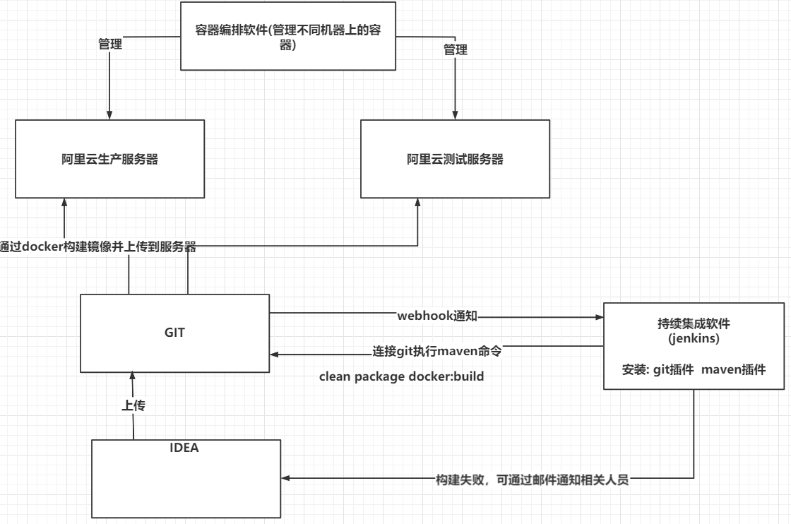
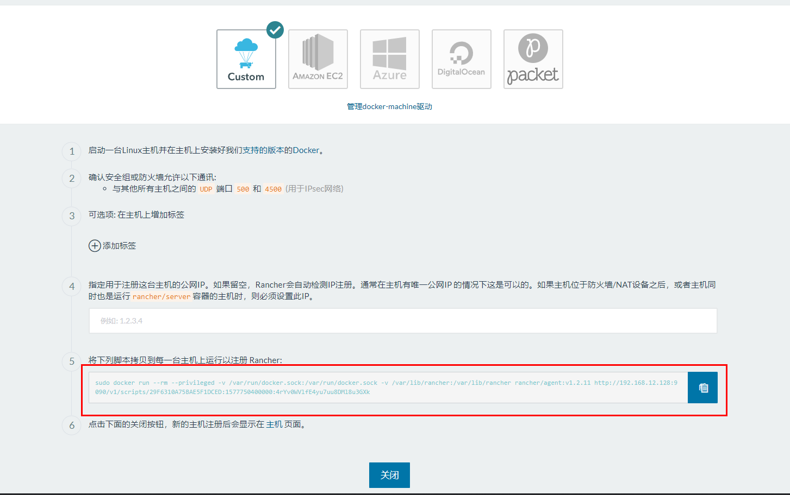

# 企业级微服务部署解决方案

##### 基于jar包最简单的部署方案

##### 基于通过dockerfile构建docker镜像的方案

##### idea工程中配置docker插件，自动完成镜像的构建与上传


## 准备工作

#### **准备基础镜像**

Dockerfile是由一系列命令和参数构成的脚本，这些命令应用于基础（原始）镜像并最终创建一个自定义的新的镜像。

1、对于开发人员：可以为开发团队提供一个完全一致的开发环境；

2、对于测试人员：可以直接拿开发时所构建的镜像或者通过Dockerfile文件构建一个新的镜像开始工作了；

3、对于运维人员：在部署时，可以实现应用的无缝移植。

```
此命令用于查询指定名称的容器和队列 与学习无关:

// 查询所有容器   名称中包含(rancher)    只打印第一列值
docker ps -a | grep rancher | awk '{print $1}'

// 查看所有镜像   名称中包含rancher    只打印第三列值
docker images | grep rancher | awk '{print $3}'

// 删除所有tag为none的镜像

```

**常用命令(参考)**

| 命令                               | 作用                                                         |
| ---------------------------------- | ------------------------------------------------------------ |
| FROM image_name:tag                | 定义了使用哪个基础镜像启动构建流程                           |
| MAINTAINER user_name               | 声明镜像的创建者                                             |
| ENV key value                      | 设置环境变量 (可以写多条)                                    |
| RUN command                        | 是Dockerfile的核心部分(可以写多条) mkdir /usr/xxx            |
| ADD source_dir/file dest_dir/file  | 将宿主机的文件复制到容器内，如果是一个压缩文件，将会在复制后自动解压 |
| COPY source_dir/file dest_dir/file | 和ADD相似，但是如果有压缩文件并不能解压                      |
| WORKDIR path_dir                   | 设置工作目录                                                 |
| EXPOSE port1 prot2                 | 用来指定端口，使容器内的应用可以通过端口和外界交互           |
| CMD argument                       | 在构建容器时使用，会被docker run 后的argument覆盖            |
| ENTRYPOINT argument                | 入口点，容器启动后会执行的命令，比如启动mysql。效果和CMD相似，但是并不会被docker run指定的参数覆盖 |
| VOLUME                             | 将本地文件夹或者其他容器的文件挂载到容器中                   |

**使用脚本创建镜像**

目标：创建一个安装有jdk1.8的centos的docker基础镜像

步骤：

（1）创建目录，用来存放脚本、要安装的资源等。

```shell
mkdir -p ~/dockerjdk8
```

（2）下载jdk-8u181-linux-x64.tar.gz并上传到服务器（虚拟机）中的/usr/local/dockerjdk8目录

```shell
#将文件移动到指定目录：
mv ~/jdk-8u181-linux-x64.tar.gz ~/dockerjdk8
```

（3）创建文件Dockerfile

```
vi Dockerfile
```

内容参考如下：

```shell
#依赖的基础镜像名称和ID，如果本地不存在，则自动下载
FROM centos
#指定镜像创建者信息
MAINTAINER mrchen
#切换当前的工作目录，进入容器化，默认进入的目录
WORKDIR /usr
#容器中创建java的目录
RUN mkdir /usr/local/java
#将容器外的文件（相对、绝对路径均可）拷贝到容器内指定的目录，并自动解压
ADD jdk-8u161-linux-x64.tar.gz /usr/local/java/
#容器中配置java环境变量
ENV JAVA_HOME /usr/local/java/jdk1.8.0_161
ENV JRE_HOME $JAVA_HOME/jre
ENV CLASSPATH $JAVA_HOME/lib/dt.jar:$JAVA_HOME/lib/tools.jar:$JRE_HOME/lib:$CLASSPATH
ENV PATH $JAVA_HOME/bin:$PATH
```

【提示】

基础镜像暂无需设置入口点。

（4）执行命令构建镜像

参考命令：

```shell
# 注意后边的空格和点，不要省略
docker build -t centosjdk8 .
```

#### 搭建私有注册中心

**私有注册中心搭建**

（1）拉取私有仓库镜像（此步可省略）

```
docker pull registry
```

（2）启动私有仓库容器

```
docker run -id -p 5000:5000 --name myregistry registry
```

（3）查看检验是否安装启动成功。

打开浏览器 输入地址

```
http://192.168.12.131:5000/v2/_catalog
```

看到 {"repositories":[]} ，表示私有仓库搭建成功并且内容为空

**镜像上传至私有注册中心**

目标：将前面自己制作的`centosjdk8`的镜像上传到私服仓库中。

第一步：当前docker信任私有注册中心

（1）修改daemon.json，让 docker信任私有仓库地址

修改文件：

```shell
vi /etc/docker/daemon.json
```

添加如下内容，保存退出。

```json
{
"insecure-registries":["192.168.18.131:5000"]
}
```

注意：该文件中如有多个内容，比如有之前配置的私服镜像地址，用英文逗号隔开，参考如下：

```json
{
"registry-mirrors": ["https://docker.mirrors.ustc.edu.cn"]
,"insecure-registries":["192.168.18.131:5000"]
}
```

（2）重启docker 服务和私服

```
systemctl restart docker
#可以省略（如果创建容器时带有--restart always）
docker start myregistry

```

第二步：修改镜像的相关信息，重打标记

（1）创建标记（tag）此镜像为私有仓库的镜像

```shell
docker tag centos_jdk1.8 192.168.18.131:5000/centos_jdk1.8
```

提示：打标记从某中角度说，就是复制一份，重命名一下。

（2）上传标记的镜像

```
docker push 192.168.18.131:5000/centos_jdk1.8

```

稍等片刻，完成后，通过浏览器访问私服仓库镜像列表即可。

```
{"repositories":["centos-jdk8"]}
```

**仓库网址**: http://192.168.18.131:5000/v2/_catalog

## 基于docker的服务部署

#### **开启docker远程访问**

```
vi /lib/systemd/system/docker.service
```

开启端口2375  ，备用端口7654

```shell
ExecStart=/usr/bin/dockerd -H tcp://0.0.0.0:2375 -H unix:///var/run/docker.sock -H tcp://0.0.0.0:7654
```

保存后,重启docker

```
systemctl daemon-reload & systemctl restart docker
```

检查docker是否监听了2375端口：

有监听结果代表启动成功

```
netstat -ano | grep 2375
```

本地浏览器访问:

有结果代表能够远程访问docker

```
http://192.168.18.131:2375/version
```

如果访问不了，可能是防火墙问题，可以关闭防火墙

```
systemctl stop firewalld
systemctl disable firewalld 
需重启:
reboot
```

#### 修改项目配置

**引入spring-boot-maven-plugin插件并配置:**

```xml
<build>
        <finalName>app</finalName>
        <plugins>
            <!-- 打jar包时如果不配置该插件，打出来的jar包没有清单文件 -->
            <plugin>
                <groupId>org.springframework.boot</groupId>
                <artifactId>spring-boot-maven-plugin</artifactId>
            </plugin>
            <!-- 插件网址:https://github.com/spotify/docker-maven-plugin -->
            <plugin>
                <groupId>com.spotify</groupId>
                <artifactId>docker-maven-plugin</artifactId>
                <version>1.2.0</version>
                <configuration>
                    <imageName>192.168.18.129:5000/${project.artifactId}:${project.version}</imageName>
                    <baseImage>centosjdk8</baseImage>
                    <entryPoint>["java","-jar","/${project.build.finalName}.jar"]</entryPoint>
                    <resources>
                        <resource>
                           <targetPath>/</targetPath>
                           <directory>${project.build.directory}</directory>
                           <include>${project.build.finalName}.jar</include>
                        </resource>
                    </resources>
                    <dockerHost>http://192.168.18.129:2375</dockerHost>
                </configuration>
            </plugin>
        </plugins>
    </build>
```

配置后 在maven的管理页面刷新一下，会出现docker插件 并有一些可执行的命令

#### 执行docker构建

**执行mvn clean package docker:build -DpushImage**

```
该命令是由4个命令组成
clean 代表清空之前maven的打包信息
package 重新打包最新代码
docker:build 使用docker的build命令构建镜像
-DpushImage  推送镜像到仓库
```

在docker中通过docker images查看

上传成功！！

启动成功即可访问:

```
docker run -id --name=容器名称 -p 9002:9002 镜像ID
```

## 理解持续集成

#### 什么是持续集成

  持续集成 Continuous integration ，简称CI & CD
  随着软件开发复杂度的不断提高，团队开发成员间如何更好地协同工作以确保软件
开发的质量已经慢慢成为开发过程中不可回避的问题。尤其是近些年来，敏捷（Agile）
在软件工程领域越来越红火，如何能再不断变化的需求中快速适应和保证软件的质量也
显得尤其的重要。
  持续集成正是针对这一类问题的一种软件开发实践。它倡导团队开发成员必须经常
集成他们的工作，甚至每天都可能发生多次集成。而每次的集成都是通过自动化的构建
来验证，包括自动编译、发布和测试，从而尽快地发现集成错误，让团队能够更快的开
发内聚的软件。

#### 持续集成的特点

它是一个自动化的周期性的集成测试过程，从检出代码、编译构建、运行测试、结果
记录、测试统计等都是自动完成的，无需人工干预；
需要有专门的集成服务器来执行集成构建；
需要有代码托管工具支持，我们下一小节将介绍Git以及可视化界面Gogs的使用

#### 持续集成作用

保证团队开发人员提交代码的质量，减轻了软件发布时的压力；
持续集成中的任何一个环节都是自动完成的，无需太多的人工干预，有利于减少重复
过程以节省时间、费用和工作量；




## 持续集成演示_搭建GIT仓库

基于git实现的代码仓库有很多，像我们熟知的 Gitee、GitHub、Gitlab等等，都是支持持续集成的，我们把带上推送到git时，git仓库会触发一个webhooks事件通知对应配置的持续集成软件，触发持续集成软件的对应操作。 课程中我们搭建一个精简的开源Git仓库-Gogs

Gogs 的目标是打造一个最简单、最快速和最轻松的方式搭建自助 Git 服务。使用 Go 语
言开发使得 Gogs 能够通过独立的二进制分发，并且支持 Go 语言支持的 所有平台，包
括 Linux、Mac OS X、Windows 以及 ARM 平台。
地址：https://gitee.com/Unknown/gogs

#### 安装git版本仓库

Gitee 码云      GitHub 

GitLab 开源     

Gogs 轻量 

下载gogs

```
docker pull gogs/gogs
```

创建容器

```
docker run -d --name=gogs -p 10022:22 -p 3000:3000 -v /var/gogsdata:/data gogs/gogs
```


#### 配置git仓库

(1) 在地址栏输入 http://192.168.12.128:3000 会首次运行安装程序页面，我们可以选择一种数据库作为gogs数据的存储,最简单的是选择SQLite3。 如果对于规模较大的公司可以选择mysql


主要数据库的选择及localhost部分设置成虚拟机的IP 然后点击立即安装


点击安装进入登录页面，我们需要先注册账户 根据表格创建好账户，要记得用户名和密码哦.


注册完毕后登录gogs


点击 + 号创建仓库


为了便于演示，这里我们只需要填写一个仓库名称即可， 可见性不要勾选。

然后点击创建仓库

#### 上传代码到git仓库

首先在idea中开启git版本控制


右键项目，选择git配置远程仓库的地址


复制gogs中对应仓库地址


复制到idea中


上传代码到gogs

1. add到当前分支
2. commit到当前分支
3. 推送到远程仓库


刷新gogs中仓库 代码已经上传完成


## 持续集成演示_搭建Jenkins

Jenkins，原名Hudson，2011年改为现在的名字，它 是一个开源的实现持续集成的
软件工具。官方网站：http://jenkins-ci.org/ 。
  Jenkins 能实施监控集成中存在的错误，提供详细的日志文件和提醒功能，还能用图
表的形式形象地展示项目构建的趋势和稳定性。
  特点：
**易配置**：提供友好的GUI配置界面；
**变更支持**：Jenkins能从代码仓库（Subversion/CVS）中获取并产生代码更新列表并
输出到编译输出信息中；
支持永久链接：用户是通过web来访问Jenkins的，而这些web页面的链接地址都是
永久链接地址，因此，你可以在各种文档中直接使用该链接；
**集成E-Mail/RSS/IM**：当完成一次集成时，可通过这些工具实时告诉你集成结果（据
我所知，构建一次集成需要花费一定时间，有了这个功能，你就可以在等待结果过程
中，干别的事情）；
**JUnit/TestNG**测试报告：也就是用以图表等形式提供详细的测试报表功能；
**支持分布式构建**：Jenkins可以把集成构建等工作分发到多台计算机中完成；
文件指纹信息：Jenkins会保存哪次集成构建产生了哪些jars文件，哪一次集成构建使
用了哪个版本的jars文件等构建记录；
**支持第三方插件**：使得 Jenkins 变得越来越强大

#### 安装jenkins

下载jenkins

```
docker pull jenkins/jenkins:lts-centos7 
```

创建jenkins容器

```
docker run -d --name myjenkins -p 8888:8080 jenkins/jenkins:lts-centos7
```

#### 配置jenkins

第一次使用jenkins需要做很多配置,将资源中的 default.json maven的安装包 jdk的安装包上传到linux服务器，配置时会使用到。


##### **配置镜像加速**:

jenkins官方镜像下载速度特别慢，需要配置国内镜像。

参考解决方法:

https://blog.csdn.net/u013788943/article/details/103822785

课件中已经提供了老师修改后的default.json 只需要复制到镜像替换原来的即可

```
# 将当前文件夹下的default.json文件复制到容器中
docker cp ./default.json myjenkins:/var/jenkins_home/updates/default.json

# 替换后重启jenkins
docker restart myjenkins
```


##### **访问配置**

输入 http://192.168.12.128:8888 访问jenkins,提示需要解锁


```
# 进入到容器
docker exec -it -u root myjenkins bash

# 查看密钥
cat /var/jenkins_home/secrets/initialAdminPassword
```


复制密钥 到浏览器 并点击继续

jenkins的很多功能都需要插件来完成，我们先安装好推荐的插件


等待插件安装: 

如果镜像没配置成功这里会超级慢


##### **新建用户**

填写用户名密码后点击保存并完成


弹出的实例IP没问题也是保存并完成，然后点击开始使用jenkins


进入到jenkins欢迎页面


##### **安装maven插件**

点击系统管理  -->  插件管理 


在可选插件页签  输入maven  勾选 Maven Integration 后下载插件


##### **安装git插件**

和上面一样 安装git插件


##### 全局工具配置

将maven和jdk的压缩包拷贝到容器中


```
# 将资源拷贝到容器
docker cp ./jdk-8u45-linux-x64.rpm myjenkins:/usr/local/
docker cp ./apache-maven-3.6.3-bin.tar.gz myjenkins:/usr/local/

# 进入容器 以root用户角色进入
docker exec -it -u root myjenkins bash

```

**安装jdk**

```
cd /usr/local
# 安装jdk 会被安装到这个目录: /usr/java/jdk1.8.0_45
rpm -ivh jdk-8u171-linux-x64.rpm

# 配置环境变量
vi /etc/profile

export JAVA_HOME=/usr/java/jdk1.8.0_45
export CLASSPATH=.:$JAVA_HOME/lib/dt.jar:$JAVA_HOME/lib/tools.jar
export PATH=$JAVA_HOME/bin:$PATH

# 使配置生效
source /etc/profile
```

**安装maven**

```
cd /usr/local
# 解压maven
tar -zxvf apache-maven-3.6.3-bin.tar.gz

# 配置阿里云镜像 /usr/local/apache-maven-3.6.3/conf
vi /usr/local/apache-maven-3.6.3/conf/settings.xml


<!-- 阿里云仓库 -->
<mirror>
	<id>alimaven</id>
	<mirrorOf>central</mirrorOf>
	<name>aliyun maven</name>  		    <url>http://maven.aliyun.com/nexus/content/repositories/central/</url>
</mirror>
```


**全局工具配置-jdk**

点击 系统管理 --> 全局工具配置  


点击新增jdk


**全局工具配置-maven**


#### 创建maven任务

点击新建任务


填写项目名称,选择任务模板,点击确定


在源码页签选择git,并输入git的项目地址


选择要构建的项目对应的pom 及 要执行的命令


```
命令:
# 清除   打包    构建docker镜像
clean package docker:build
# 清除  打包    构建docker镜像  推送到镜像仓库
clean package docker:build ‐DpushImage

最后点击“保存”按钮
```

回到主页面，点击右侧按钮 ，开始自动构建


点击进度条，即可查看该任务输出日志


第一次运行时需要下载maven相关依赖


到最后可以看到maven构建成功


查看docker中已经有了我们的镜像


## 持续集成演示_搭建Rancher

Rancher是一个开源的企业级全栈化容器部署及管理平台。Rancher为容器提供一揽
子基础架构服务：CNI兼容的网络服务、存储服务、主机管理、负载均衡、防护墙……
Rancher让上述服务跨越公有云、私有云、虚拟机、物理机环境运行，真正实现一键式应
用部署和管理。
 https://www.cnrancher.com/


#### 安装rancher

下载rancher

```
docker pull rancher/server
```

创建rancher容器

```
docker run -d --name=myrancher -p 9090:8080 rancher/server
```

输入: http://192.168.12.128:9090 即可访问rancher web页面

切换至中文界面，点击右下角的English 在弹出菜单中选择中文


#### rancher初始化

##### 添加环境

Rancher 支持将资源分组归属到多个环境。 每个环境具有自己独立的基础架构资源及服
务，并由一个或多个用户、团队或组织所管理。
例如，您可以创建独立的“开发”、“测试”及“生产”环境以确保环境之间的安全隔离，将“开
发”环境的访问权限赋予全部人员，但限制“生产”环境的访问权限给一个小的团队。

1. 选择 default --> 环境管理 菜单 

点击添加环境 进入到添加页面


2. 填写名称 点击创建按钮


3. 还可以按照上述规则创建多个环境


可以通过下拉菜单选择不同的环境


##### 配置主机

选择环境，可以配置该环境所对应的主机 如: 上面的下拉框选择生产环境 mypro_prod

接下来需要配置生产环境所对应的服务器地址

基础架构的下拉框下点击主机  然后在点击添加主机


点击保存按钮:


复制红框的脚本内容:



将上面复制的内容 到我们的虚拟机中执行:


执行完后 回到主机页面，稍等一会刷新页面可以看到主机信息 代表rancher已经连接到我们的服务器啦~


##### 创建容器

点击基础架构下的容器选项，即可进入到容器管理页面，可以看到当前服务器的容器列表

点击添加容器按钮即可创建新容器


填写名称、描述、端口映射等容器信息

点击下面的创建 即可创建容器，我们在centos上通过命令创建一样的


回到容器列表可以看到 我们的项目已经创建好容器运行了


在浏览器上尝试访问


基于webhooks触发rancher实现服务的自动升级:

```
https://rancher.com/docs/rancher/v1.6/zh/cattle/webhook-service/#%E5%9F%BA%E4%BA%8E-docker-hub-webhooks-%E5%8D%87%E7%BA%A7%E6%9C%8D%E5%8A%A1

触发的参数:
{
    "push_data": {
        "tag": "0.0.1-SNAPSHOT"
    },
    "repository": {
        "repo_name": "192.168.12.128:5000/order_service"
    }
}
```


jenkins在构建任务后 调用rancher的脚本

```
curl "http://192.168.12.128:9090/v1-webhooks/endpoint?key=n2FgRip4SMsYOH60FUo9joHTCPlmyVgNmfOIZeMT&projectId=1a7" \
-H "Content-Type:application/json" \
-d "{\"push_data\": {\"tag\": \"0.0.1-SNAPSHOT\"},\"repository\": {\"repo_name\": \"192.168.12.128:5000/order_service\"}}"
```


频繁的更新服务，会旧的镜像会被覆盖，产生很多 tag为none的镜像

```
-- 删除 tag为none的镜像
docker images|grep none|awk '{print $3}'|xargs docker rmi
```


持续部署小结:

```
公司的部署方案 主要采用的是 
自动化持续集成持续部署方案:

GitLab (代码版本仓库) + Jenkins (持续集成平台)  + Rancher (容器管理平台)


我们开发人员负责在每个微服务中配置好dockermaven插件, 将代码上传到git上。

上传到git上后，触发gitLab的push事件, gitlab会向jenkins发送webhooks通知

jenkins的自动构建任务被触发， 
jenkins 采用maven和git插件，连接git仓库获取最新代码调用mvn命令执行构建 (mvn clean package docker:build -DpushImage)
任务构建成功后，镜像被推送到镜像仓库, 在jenkins的后置方法中  使用webhooks通知
Rancher进行服务升级。

rancher接收到通知后， 触发指定标签服务的升级操作 会根据新镜像生成的容器服务替换旧的服务
```


## 再谈微服务部署


- nginx 服务器单独独立部署(至少2台)

- 网关服务器独立部署(至少2台)

- 注册中心服务器独立部署(至少2台)

- 数据库服务器独立部署（至少2台）

- 基础服务 服务器（至少2台）

  基础用于部署提供基础功能的微服务，如：配置中心、认证中心、定时任务中心。。

- 中间件服务 服务器(至少2台)

  部署各类中间件，如果存储系统(fastdfs) 缓存系统(redis) 消息队列(rabbimt)

- 业务服务 服务器(至少2台)

  主要为我们写的业务服务系统，商品服务 订单服务 等等


以上方案，只是大概举例的基础部署架构，实际情况可以根据访问情况灵活扩展，如项目搜索的访问量特别大，可以随时创建更多的容器来应对， 而且对于运维部署这件事情会有专门的运维人员专职负责，我们只需要了解大概的部署架构流程即可。


**nginx:** 两台服务器   主备模式 

　HA(High Available)：高可用性集群，是保证业务连续性的有效解决方案，一般有两个或两个以上的节点，且分为活动节点及备用节点。


keepalive是一款可以实现高可靠的软件，通常部署在2台服务器上，分为一主一备。Keepalived可以对本机上的进程进行检测，一旦Master检测出某个进程出

现问题，将自己切换成Backup状态，然后通知另外一个节点切换成Master状态。


**nginx配置简单说明**

```json

#Nginx所用用户和组，window下不指定  
#user  niumd niumd;  
  
#工作的子进程数量（通常等于CPU数量或者2倍于CPU）  
worker_processes  2;  
  
#错误日志存放路径  
#error_log  logs/error.log;  
#error_log  logs/error.log  notice;  
error_log  logs/error.log  info;  
  
#指定pid存放文件  
pid        logs/nginx.pid;  
  
events {  
    #使用网络IO模型linux建议epoll，FreeBSD建议采用kqueue，window下不指定。  
    #use epoll;  
      
    #允许最大连接数  
    worker_connections  2048;  
}  
  
http {  
    include       mime.types;  
    default_type  application/octet-stream;  
  
        #定义日志格式  
    log_format  main  '$remote_addr - $remote_user [$time_local] $request '  
                      '"$status" $body_bytes_sent "$http_referer" '  
                      '"$http_user_agent" "$http_x_forwarded_for"';  
  
    #access_log  off;  
    access_log  logs/access.log;  
  
    client_header_timeout  3m;  
    client_body_timeout    3m;  
    send_timeout           3m;  
   
    client_header_buffer_size    1k;  
    large_client_header_buffers  4 4k;  
  
    sendfile        on;  
    tcp_nopush      on;  
    tcp_nodelay     on;  
  
    #keepalive_timeout  75 20;  
  
    include    gzip.conf; 
	# 反向代理服务器列表
    upstream myTomcat { 
	  # nginx可以自动实现负载均衡
      server 192.168.18.128:8086;   # 微服务网关01
	  server 192.168.18.128:8087;   # 微服务网关02
	  server 192.168.18.128:8088;   # 微服务网关03
    }  
	# 微服务工程 server
    server {    
            listen       80;  
			# 通过hostname 匹配请求
            server_name  api.itcast.cn;     
            location / {  
                    proxy_connect_timeout   3;  
                    proxy_send_timeout      30;  
                    proxy_read_timeout      30;  
					# 匹配到请求反向代理到网关
                    proxy_pass http://myTomcat;  
            }        
    }
	# 前端工程 server
	server {  
            listen       80;  
			# 通过hostname 匹配请求
            server_name  www.itcast.cn;     
            location / {  
				 # 静态工程去指定的目录下去查找
				 # 或者在用nginx服务器部署
                 root E:\staticHtml;  
            }        
    } 	
}
```

# 企业级日志解决方案ELK

## 日志基础简单回顾

当服务都部署到服务器之后，如果对日志没有做处理 要想去看每个服务产生的日志，变得非常的麻烦，而日志功能本身对我们排查服务中出现的一些问题 非常的重要。

日志可以协助我们的调试和开发。在开发中尽量使用日志的方式来调试，是我们推荐的做法。尽量避免使用System.out.println. 因为很多时候我们调试完毕都要进行删除调试代码。留下会给程序增加运行时间。而日志可以很方便的控制级别就可以控制是否输入，而支持存储的形态很多。比如数据库，文件等。所以日志是我们开发中必不可少的一环。

**日志级别的优先级**


 debug > info >  warn > error

如果级别是：debug ，debug和 info以及error都会输出


如果级别是：info ，那么只会打印初：info和error


如果级别是error,只会打印：error


开发中我们使用最多的是info 和 error, info用于一些重要方法中各个环节的打印，如 入参、完成订单创建、完成支付时等等，而error主要是出现了错误时，比如报异常的时候，比如某个参数检查不合要求的时候

```java
/**
* 金融项目中 
*/
@Override
	public void dealSuccessBusiness(TradeRecord tradeRecord, PayOrderResultBean payOrderResultBean) {
		logger.info("开始处理正常还款代收成功业务, 订单号为{}", tradeRecord.getTradeNo());
		BorrowRepayMents repaymentModel = clientRepaymentManager.getRepaymentById(tradeRecord.getBusinessId());
		Borrow borrow = clientBorrowManager.findBorrowById(repaymentModel.getBorrowId());
		// 获取还款人的资金记录ID
		UserFunds paymentFunds = clientUserFundsManager.getUserFundsByUserId(tradeRecord.getInUserId());
		// 如果该标属于游艇宝或者酒店宝,做其他处理
		if (borrow.getInvestType() == InvestType.YACHT_INVEST.getValue()
				|| borrow.getInvestType() == InvestType.HOTEL_INVEST.getValue()) {
			doHotelRepay(tradeRecord, borrow, paymentFunds, repaymentModel);
			return;
		}

		// 查询投资本标的所有投资数据
		List<BorrowInvest> borrowInvestList = clientBorrowInvestManager.getInvestListOrderByAmount(borrow.getId());
		// 生产分账还款详细list
		List<BorrowRepayMentDetail> repayMentDetailList = Lists.newArrayList();
		// 批量代付list
		List<BatchPayTradeBean> batchPayTradeBeanList = Lists.newArrayList();
		List<TradePayBean> tradePayBeanList = Lists.newArrayList();
		List<TradeRecord> tradeRecordList = Lists.newArrayList();
		// 处理投资人分帐信息
		dealTradePay(tradeRecord, repaymentModel, borrow, borrowInvestList, repayMentDetailList, batchPayTradeBeanList,
				tradePayBeanList, tradeRecordList);

		// 还款人资金流水,生成冻结资金流水
		UserFundRecordDetail fundRecordDetail = getUserFundRecordDetail(tradeRecord, paymentFunds);
		// 用户资金变动
		paymentFunds.setFreeze(fundRecordDetail.getAfterFreeze());

		// 更新债权记录
		repaymentModel.setRealTime(new Date());
		。。。

		logger.info("批量代付给理财人开始...");
		StringBuilder sb = new StringBuilder("");
		for (BatchPayTradeBean batchPayTradeBean : batchPayTradeBeanList) {
			if (batchPayTradeBean.getTradeBeanList() == null || batchPayTradeBean.getTradeBeanList().isEmpty()) {
				continue;
			}
			logger.info("批量代付发送消息为:{}", batchPayTradeBean);
			PayOrderBean payOrderBean = sinaOrderService.createBatchHostingPayTrade(batchPayTradeBean);
			logger.info("批量代付返回消息为:{}", payOrderBean);
			if (payOrderBean.getOrderStatus() == OrderStatus.FAILED
					|| (payOrderBean.getTradeStatus() != null && payOrderBean.getTradeStatus() == OrderStatus.FAILED)) {
				sb.append("订单批次号为");
				sb.append(batchPayTradeBean.getTradeNo());
				sb.append("失败原因为");
				sb.append(payOrderBean.toString());
			}
		}
		if (StringUtils.isNotBlank(sb.toString())) {
			throw new RuntimeException(sb.toString());
		}

		// 发送标的信息到网贷
		try {
			Borrow borrowTemp = clientBorrowManager.findBorrowById(borrow.getId());
			if (null != borrowTemp
					&& (InvestType.MJ_INVEST.getValue() == borrowTemp.getInvestType() || InvestType.YYFQ_INVEST
							.getValue() == borrowTemp.getInvestType())
					&& BorrowStatus.OVER.getValue() == borrowTemp.getStatus()) {
				netLoanService.productStatusUpdate(borrow.getId(), ProductStatus.END);
				netLoanService.transactionData(borrow.getId());
			}
		} catch (Exception e) {
			logger.error("标的信息发送网贷异常!borrowId{},Exception:{}", borrow.getId(), e);
		}

		// 处理代收完成之后发短信
		doActivity(tradeRecord, repaymentModel, borrow);
		logger.info("订单号为{}的业务处理完成", tradeRecord.getTradeNo());
	}
```


```java
@Override
    public PayInfoVO charge4WechatJSAPI(String skuId, Integer skuType, String userId, Integer chargeId,
                                        String openId, Integer buyType, String inviterUserId, String inviterPhone) throws Exception {
        
        logger.info("userId is {}, type is {}, chargeId is {}", userId, chargeId);
        PayInfoVO vo  = new PayInfoVO();
        WeChatPayInfo weChatPayInfo = null;
        weChatPayInfo = doWeChatPay4JSAPI(skuId, skuType, userId, chargeId, openId, buyType, inviterUserId, inviterPhone);
        vo.setWeChatPayINfo(weChatPayInfo);
        return vo;
    }
/**
     * 调起微信支付并生成订单
     * @param userId
     * @param chargeId
     * @return
     * @throws Exception
     */
    private WeChatPayInfo doWeChatPay4JSAPI(String skuId, Integer skuType, String userId, Integer chargeId,
                                            String openId, Integer buyType, String inviterUserId, String inviterPhone) throws Exception{
        WeChatPayInfo weChatPayInfo = null;
        TChargeItems item = chargeItemsService.getObj(chargeId);
        if (null == item) {
            logger.error("=======================调用微信支付接口失败, 充值项不存在 chargeItem is {}", chargeId);
            throw new Exception();
        }
        // 订单金额
        Integer price = item.getPrice();
        // 创建订单
        UserChargeOrder order = createOrder(PayType.WECHAT, ChargeType.ANDROID, userId, price, skuType, skuId, buyType);
        if (null == userChargeOrderService.getObj(order.getId())) {
            logger.error("=======================调用微信支付接口失败, 生成充值订单失败");
            return weChatPayInfo;
        }
        // 创建该订单的邀请者信息（用于给销售算业绩）
        if (!StringUtils.isEmpty(inviterUserId)) {
            UserChargeOrderInviter orderInviter = new UserChargeOrderInviter();
            orderInviter.setId(CommonUtils.uuidGen());
            orderInviter.setUserChargeOrderId(order.getId());
            orderInviter.setInviterUserId(inviterUserId);
            orderInviter.setInviterUserPhone(inviterPhone);
            int count = userChargeOrderInviterMapper.insertSelective(orderInviter);
            logger.info("inviter order insert success, count is {}, info is {}", count, JSON.toJSONString(orderInviter));
        }
        weChatPayInfo = new WeChatPayInfo();
        String orderNo = order.getOrderNo();
        JSONObject jsonObject = paySign(orderNo, item.getName(), openId, price);
        List<NameValuePair> payments = (List<NameValuePair> )jsonObject.get("params");
        for (NameValuePair pm: payments) {
            String nanme = pm.getName();
            String val = pm.getValue();
            switch (nanme) {
            case "appId":
                weChatPayInfo.setAppid(val);
                break;
            case "nonceStr":
                weChatPayInfo.setNoncestr(val);
                break;
            case "package":
                weChatPayInfo.setPerpayid(val);
                break;
            case "timeStamp":
                weChatPayInfo.setTimestamp(val);
                break;
            case "paySign":
                weChatPayInfo.setSign(val);
                break;
            }
        }
        return weChatPayInfo;
    }
```


## 日志的实现

Springboot项目中已经自带了 log日志的实现 

```xml
<dependency>
      <groupId>org.springframework.boot</groupId>
      <artifactId>spring-boot-starter-logging</artifactId>
      <version>2.1.16.RELEASE</version>
      <scope>compile</scope>
</dependency>
```


通过application.properties设置日志级别和日志要输出的目录

```properties
logging.level.root=info
logging.path=D:/myLog
```


在代码中 

```java
// 获取logger对象
private final Logger logger = LoggerFactory.getLogger(OrderController.class);

// 或者也可以使用Lombok提供的注解 

@Slf4j 或 @Log4j2 
// 即可以使用log对象进行日志的打印
log.info("method is {} , params is {}","findById",id);
        if(id==5){
            log.error("method is {} , params is {} , msg is {}","findById",id,"id不能为5");
            return null;
}
```


## 分布式日志解决方案ELK

但微服务是分布式的，服务会非常多，如果每个微服务都把日志输出到各自的日志文件中，对应开发人员排查日志 简直是一场灾难。 那么如何解决分布式日志管理的问题呢?  比较常见的方案 ELK

**概念**

**ELK**是**Elasticsearch**、**Logstash**、**Kibana**三大开源框架首字母大写简称。市面上也被成为**Elastic Stack**。

Elasticsearch是一个基于Lucene、分布式、通过Restful方式进行交互的近实时搜索平台框架。像类似百度、谷歌这种大数据全文搜索引擎的场景都可以使用Elasticsearch作为底层支持框架，可见Elasticsearch提供的搜索能力确实强大,市面上很多时候我们简称Elasticsearch为es。

Logstash是ELK的中央数据流引擎，用于从不同目标（文件/数据存储/MQ）收集的不同格式数据，经过过滤后支持输出到不同目的地（文件/MQ/redis/elasticsearch/kafka等）。

Kibana可以将elasticsearch的数据通过友好的页面展示出来，提供实时分析的功能。

通过上面对ELK简单的介绍，我们知道了ELK字面意义包含的每个开源框架的功能。市面上很多开发只要提到ELK能够一致说出它是一个日志分析架构技术栈总称，但实际上ELK不仅仅适用于日志分析，它还可以支持其它任何数据分析和收集的场景，日志分析和收集只是更具有代表性。并非唯一性。

**传统日志方案**


**ELK分布式日志方案**


## ELK演示案例

##### 启动ELK

下载整合了ES Kibana LogStatsh的镜像

```
docker pull sebp/elk:771 
```

创建容器并启动

```
docker run -d --name elk -p 5601:5601 -p 9200:9200 -p 5044:5044  sebp/elk:771
```

端口说明

```
5601 - Kibana web 接口
9200 - Elasticsearch JSON 接口
5044 - Logstash 日志接收接口
```

查看启动日志

```
docker logs -f elk
```

可能出现的错误

```
max virtual memory areas vm.max_map_count [65530] is too low, increase to at least [262144]

切换到root用户修改配置sysctl.conf
vi /etc/sysctl.conf 

添加下面配置：
vm.max_map_count=655360

并执行命令：
sysctl -p

然后，重新启动elk，即可启动成功。
docker start elk
```

输入: http://192.168.12.133:9200 查看下面画面代表es启动成功


输入: http://192.168.12.133:5601 查看下面画面代表kibana启动成功


##### 配置LogStatsh

启动成功后 我们需要做下简单的配置，首先是LogStatsh的配置.


进入到容器中

```
docker exec -it -u root elk bash
```

编辑logStatsh的配置

```
vim /etc/logstash/conf.d/02-beats-input.conf
```

覆盖配置

input为输入的配置，output为输出的配置

```
input {    
    tcp {         
        port => 5044         
        codec => json_lines             
    } 
} 
output{  
    elasticsearch { 
    	hosts => ["localhost:9200"] 
    } 
}
```

修改完毕后exit退出，然后重启容器

```
docker restart elk
```


##### 配置项目

项目中添加依赖

```xml
<dependency>
    <groupId>net.logstash.logback</groupId>
    <artifactId>logstash-logback-encoder</artifactId>
    <version>5.2</version>
</dependency>
```

添加日志配置文件logback.xml

```xml
<?xml version="1.0" encoding="UTF-8"?>
<!--该日志将日志级别不同的log信息保存到不同的文件中 -->
<configuration>
    <include resource="org/springframework/boot/logging/logback/defaults.xml" />
    <springProperty scope="context" name="springAppName"
                    source="spring.application.name" />
    <!-- 日志在工程中的输出位置 -->
    <property name="LOG_FILE" value="${BUILD_FOLDER:-build}/${springAppName}" />
    <!-- 控制台的日志输出样式 -->
    <property name="CONSOLE_LOG_PATTERN"
              value="%clr(%d{yyyy-MM-dd HH:mm:ss.SSS}){faint} %clr(${LOG_LEVEL_PATTERN:-%5p}) %clr(${PID:- }){magenta} %clr(---){faint} %clr([%15.15t]){faint} %m%n${LOG_EXCEPTION_CONVERSION_WORD:-%wEx}}" />
    <!-- 控制台输出 -->
    <appender name="console" class="ch.qos.logback.core.ConsoleAppender">
        <filter class="ch.qos.logback.classic.filter.ThresholdFilter">
            <level>INFO</level>
        </filter>
        <!-- 日志输出编码 -->
        <encoder>
            <pattern>${CONSOLE_LOG_PATTERN}</pattern>
            <charset>utf8</charset>
        </encoder>
    </appender>
    <!-- 为logstash输出的JSON格式的Appender -->
    <appender name="logstash"
              class="net.logstash.logback.appender.LogstashTcpSocketAppender">
        <destination>192.168.12.128:5044</destination>
        <!-- 日志输出编码 -->
        <encoder
                class="net.logstash.logback.encoder.LoggingEventCompositeJsonEncoder">
            <providers>
                <timestamp>
                    <timeZone>UTC</timeZone>
                </timestamp>
                <pattern>
                    <pattern>
                        {
                        "severity": "%level",
                        "service": "${springAppName:-}",
                        "trace": "%X{X-B3-TraceId:-}",
                        "span": "%X{X-B3-SpanId:-}",
                        "exportable": "%X{X-Span-Export:-}",
                        "pid": "${PID:-}",
                        "thread": "%thread",
                        "class": "%logger{40}",
                        "rest": "%message"
                        }
                    </pattern>
                </pattern>
            </providers>
        </encoder>
    </appender>

    <!-- 日志输出级别 -->
    <root level="INFO">
        <appender-ref ref="console" />
        <appender-ref ref="logstash" />
    </root>
</configuration>

```

application.properties中指定服务名称

```properties
spring.application.name=user_service
```


##### kibana查看日志

点击Management


创建索引匹配格式:  2填写*即可 


设置匹配格式logstatsh*


1下拉框选择@timestamp 以时间戳排序


创建后 在发现中心查看日志


```
1. 是需要显示的字段
2. 是可选过滤字段
3. 日志的显示区域
```


在启动另一个微服务 查看日志情况吧


##### 基于Redis异步发送日志

基于TCP的方式性能不是最好的，在生产环境中需要配置异步输出日志方案，可以采用redis的方案，或mq的方案。 这里我们主要演示下基于redis 的异步日志输出方案

**准备redis**

```
docker pull redis

docker run -d --name=myredis -p 6379:6379 redis

```

**logstatsh中的配置变更** 

key代表在redis中使用的key  data_type代表使用redis的数据类型是list

进入到容器中

```
docker exec -it -u root elk bash
```

编辑logStatsh的配置

```
vim /etc/logstash/conf.d/02-beats-input.conf
```

覆盖配置

input为输入的配置，output为输出的配置

```
input {
 redis {
  codec => json
  host => "192.168.12.133"
  port => 6379
  key => "data-mgr"
  data_type => "list"
 }
} 
output{  
    elasticsearch { 
    	hosts => ["localhost:9200"] 
    } 
}
```

修改完毕后exit退出，然后重启容器

```
docker restart elk
```

**项目中的变更**

通过此依赖可以向redis中发送日志信息

```xml
		<dependency>
            <groupId>com.cwbase</groupId>
            <artifactId>logback-redis-appender</artifactId>
            <version>1.1.5</version>
        </dependency>
```

日志配置变更

```xml
<?xml version="1.0" encoding="UTF-8"?>
<!--该日志将日志级别不同的log信息保存到不同的文件中 -->
<configuration>
    <include resource="org/springframework/boot/logging/logback/defaults.xml" />
    <springProperty scope="context" name="springAppName"
                    source="spring.application.name" />
    <!-- 日志在工程中的输出位置 -->
    <property name="LOG_FILE" value="${BUILD_FOLDER:-build}/${springAppName}" />


    <!-- 控制台的日志输出样式 -->
    <property name="CONSOLE_LOG_PATTERN"
              value="%clr(%d{yyyy-MM-dd HH:mm:ss.SSS}){faint} %clr(${LOG_LEVEL_PATTERN:-%5p}) %clr(${PID:- }){magenta} %clr(---){faint} %clr([%15.15t]){faint} %m%n${LOG_EXCEPTION_CONVERSION_WORD:-%wEx}}" />


    <!-- 控制台输出 -->
    <appender name="console" class="ch.qos.logback.core.ConsoleAppender">
        <filter class="ch.qos.logback.classic.filter.ThresholdFilter">
            <level>INFO</level>
        </filter>
        <!-- 日志输出编码 -->
        <encoder>
            <pattern>${CONSOLE_LOG_PATTERN}</pattern>
            <charset>utf8</charset>
        </encoder>
    </appender>
    <!-- 为logstash输出的JSON格式的Appender -->
    <appender name="LOGSTASH" class="com.cwbase.logback.RedisAppender">
        <source>mySource</source>
        <sourcePath>mySourcePath</sourcePath>
        <type>appName</type>
        <tags>dev</tags>
        <host>192.168.12.133</host>
        <port>6379</port>
        <key>data-mgr</key>
        <callerStackIndex>1</callerStackIndex>
    </appender>
    <!-- 异步处理 日志输出到redis-->
    <appender name="ASYNC" class="ch.qos.logback.classic.AsyncAppender">
        <appender-ref ref="LOGSTASH" />
    </appender>
    <!-- 日志输出级别 -->
    <root level="INFO">
        <appender-ref ref="console" />
        <appender-ref ref="ASYNC" />
    </root>
</configuration>

```

重启项目 可以看到日志被发送到了redis中


启动elk后 会读取redis中的数据


