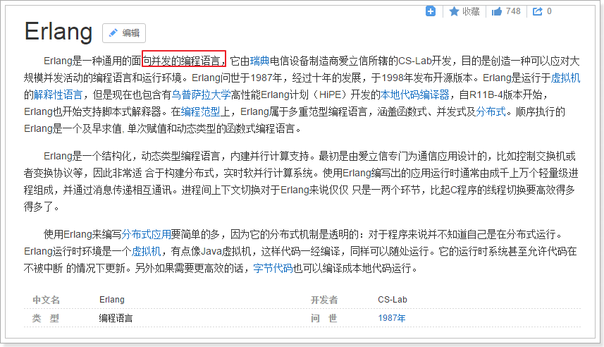
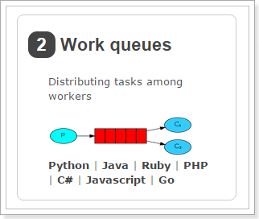
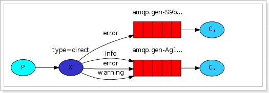

学习目标： 

- 理解消息队列的概念、使用场景

- 掌握AMQP的协议模型和相关概念

- 会实现RabbitMQ的安装

- 掌握RabbitMQ的生产者和消费者的代码编写。

- 理解RabbitMQ的工作模式

- 掌握SpringBoot整合RabbitMQ

- 理解消息可靠性投递

- 使用mq实现邮件发送案例

  

# 第一章 RabbitMQ概述

## 1、什么是MQ

消息队列，即 MQ，Message Queue   

先进先出   数据结构


消息队列是典型的：生产者(消息投递方)、消费者模型。

生产者不断向消息队列中生产消息，消费者不断的从队列中获取消息。因为消息的生产和消费都是异步的，而且只关心消息的发送和接收，没有业务逻辑的侵入，这样就实现了生产者和消费者的解耦。

## 2、为什么要用MQ

MQ在企业中有很多的应用场景，例如：

- 异步调用
- 业务解耦
- 流量削峰

### 【1】异步调用

例如这样的场景：用户注册后，需要发注册邮件和注册短信。

1）传统做法（同步调用）：

将注册信息持久化后，发送注册邮件，再发送注册短信。三个业务全部完成后，返回给客户端。


用户注册后，要等待发送邮件、发送短信等业务逐个串行执行，整个业务耗时300ms。

2）MQ调用（异步调用）

引入MQ以后，执行流程如图：


用户注册成功，直接向MQ发送消息，然后业务结束，用户拿到结果，耗时105ms。

邮件、短信服务都监听MQ消息，接收到消息后各自完成自己业务，互不干扰。

整个注册业务流程大大简化，耗时也缩短了很多倍，并发能力就会有极大的提升。


### 【2】业务解耦

例如系统A执行完业务，系统B需要得到系统A的业务结果，此时可以系统A中调用系统B（系统A中耦合了系统B的业务）。

此时如果系统C、系统D都有类似需求，那么系统A的业务逻辑还要继续修改，违反了开闭原则。

 

此时，可以利用MQ来解耦，让商品微服务发送消息通知，而相关的其它系统监听MQ即可：

 


### 【3】流量削峰

数据库的并发能力有限，往往称为业务执行的性能瓶颈。

例如我们的服务只能支持500的并发，然而又每秒1000甚至更高的服务流量涌入，服务肯定会崩溃的。

 

此时，利用MQ来作为缓冲，就像大坝一样，高并发流量涌入，先放到MQ中缓存起来，后续系统再慢慢取出并处理即可：

 


## 3、AMQP和JMS

MQ是消息通信的模型，不是具体实现。现在实现MQ的有两种主流方式：AMQP、JMS。


两者间的区别和联系：

- JMS是定义了统一的接口，来对消息操作进行统一；AMQP是通过规定协议来统一数据交互的格式
- JMS限定了必须使用Java语言；AMQP只是协议，不规定实现方式，因此是跨语言的。
- JMS规定了两种消息模型；而AMQP的消息模型更加丰富


## 4、常见MQ产品   

常见的消息组件有：Kafka、ActiveMQ、RabbitMQ、RocketMQ ，关于他们之间的对比也有各种各样的讨论，下面我们看看关于它们的总结：


ActiveMQ现在已经很少使用，社区不太活跃，放弃。

RabbitMQ并发能力强、消息延时低、高可用、管理界面丰富，并且最重要的是：社区非常活跃，出现BUG都能及时解决。

Kafka和RocketMQ的特点都是高吞吐量，但是kafka消息可靠性比较一般，而且消息不保证有序性。

RocketMQ弥补了Kafka的缺点，不过是阿里开源，社区不太活跃，文档也不够丰富。

对应中小型企业，建议使用RabbitMQ，大中型公司，建议使用RocketMQ。

## 5、RabbitMQ介绍

RabbitMQ是基于AMQP的一款消息管理系统

官网： http://www.rabbitmq.com/

官方教程：http://www.rabbitmq.com/getstarted.html


 

RabbitMQ基于Erlang语言开发：




# 第二章 下载和安装

官网下载地址：http://www.rabbitmq.com/download.html

快速入门地址：<https://www.rabbitmq.com/getstarted.html>

详细查看下发的资料： 课程以windows为主

 

安装步骤-查看文档资料 

## 1、界面总览


## 2、用户权限管理

我们新建的itcast用户，不具备访问权限，如图：


我们需要添加对virtual hosts的访问权限，点击itcast用户，进入用户管理界面，然后添加权限：


添加权限以后，可以看到用户已经具备了访问权：

 


# 第三章 RabbitMQ-开发入门

## 1、架构模型

​		RabbitMQ是由erlang语言开发，基于AMQP（Advanced Message Queue 高级消息队列协议）协议实现的消息队列，它是一种应用程序之间的通信方法，消息队列在分布式系统开发中应用非常广泛。RabbitMQ官方地址：http://www.rabbitmq.com


组成部分说明： 

- Broker：消息队列服务进程，此进程包括两个部分：Exchange和Queue
- Exchange：消息队列交换机，按一定的规则将消息路由转发到某个队列，对消息进行过虑。
- Queue：消息队列，存储消息的队列，消息到达队列并转发给指定的
- Producer：消息生产者，即生产方客户端，生产方客户端将消息发送
- Consumer：消息消费者，即消费方客户端，接收MQ转发的消息。

## 2、五种消息模型

RabbitMQ提供了6种消息模型，但是第6种其实是RPC，并不是MQ，因此不予学习。那么也就剩下5种。

但是其实3、4、5这三种都属于订阅模型，只不过进行路由的方式不同。


新建项目rabbit-demo用于API方式操作rabbitmq


ConnectionUtil：链接工具类

```java
package com.itheima.rabbitmq.utils;

import com.rabbitmq.client.Connection;
import com.rabbitmq.client.ConnectionFactory;

import java.io.IOException;
import java.util.concurrent.TimeoutException;

/**
 * @ClassName ConnectionUtil.java
 * @Description MQ链接工具
 */
public class ConnectionUtil {

    /***
     * @description 链接工具类
     * @return: com.rabbitmq.client.Connection
     */
    public static Connection getConnection() throws IOException, TimeoutException {
        //创建链接工厂
        ConnectionFactory connectionFactory = new ConnectionFactory();
        //指定链接地址
        connectionFactory.setHost("192.168.112.129");
        //指定端口号
        connectionFactory.setPort(5672);
        //设置虚拟机，一个mq服务可以设置多个虚拟机，每个虚拟机就相当于一个独立的mq
        connectionFactory.setVirtualHost("/itheima");
        //设置账户
        connectionFactory.setUsername("admin");
        //设置密码
        connectionFactory.setPassword("pass");
        //创建链接
        return connectionFactory.newConnection();
    }
}

```

测试链接工具：

```java
package com.itheima.rabbitmq;

import static org.junit.Assert.assertTrue;

import com.rabbitmq.client.Connection;
import org.junit.Test;

import java.io.IOException;
import java.util.concurrent.TimeoutException;


public class ConnectionUtilTest {

    @Test
    public void getConnectioTsest() throws IOException, TimeoutException {
        Connection connection = ConnectionUtil.getConnection();
        System.out.println("链接到："+connection.toString());
    }
}
```


### 【1】基本消息模型

#### 【1.1】流程说明

基本消息模型图：

 

在上图的模型中，有以下概念：

- P：生产者，也就是要发送消息的程序
- C：消费者：消息的接受者，会一直等待消息到来。
- queue：消息队列，图中红色部分。类似一个邮箱，可以缓存消息；生产者向其中投递消息，消费者从其中取出消息。

我们在控制台 先创建一个虚拟主机对象：  使用默认账号和密码  admin登录即可

 

admin用于操作虚拟主机权限

 

#### 【1.2】生产者代码

BasicMessageSend生产者发送消息到mq：

```java
package com.itheima.rabbitmq.basic;

import com.itheima.rabbitmq.basic.utils.ConnectionUtil;
import com.rabbitmq.client.Channel;
import com.rabbitmq.client.Connection;

import java.io.IOException;
import java.util.concurrent.TimeoutException;

/**
 * @ClassName MessageSend.java
 * @Description 消息发送
 */
public class BasicMessageSend {

    public static  String queueName = "basic-message";

    /***
     * @description 发送基本信息
     */
    public static void main(String[] args) throws IOException, TimeoutException {
        //获得链接
        Connection connection = ConnectionUtil.getConnection();
        //从链接中获得通道，有了通道才能操作
        Channel channel = connection.createChannel();
        /**
         * 参数明细
         * 1、queue 队列名称
         * 2、durable 是否持久化，如果持久化，mq重启后队列还在
         * 3、exclusive 是否独占连接，队列只允许在该连接中访问，如果connection连接关闭队列则自动删除,如果将此参数设置true可用于临时队列的创建
         * 4、autoDelete 自动删除，队列不再使用时是否自动删除此队列，如果将此参数和exclusive参数设置为true就可以实现临时队列（队列不用了就自动删除）
         * 5、arguments 参数，可以设置一个队列的扩展参数，比如：可设置存活时间
         */
        channel.queueDeclare(queueName,false,false,false,null);
        //消息体
        String message ="Hello World";
        //参数：String exchange, String routingKey, BasicProperties props, byte[] body
        /**
         * 参数明细：
         * 1、exchange，交换机，如果不指定将使用mq的默认交换机（设置为""）
         * 2、routingKey，路由key，交换机根据路由key来将消息转发到指定的队列，
         * 如果使用默认交换机，routingKey设置为队列的名称
         * 3、props，消息的属性
         * 4、body，消息内容
         */
        channel.basicPublish("",queueName,null,message.getBytes());
        //关闭通道
        channel.close();
        //关闭链接
        connection.close();
    }

}

```

控制台：

  

进入队列页面，可以看到新建了一个队列basic-message：

  

**点击队列名称**，进入详情页，可以查看消息：

  

在控制台查看消息并不会将消息消费，所以消息还在。

#### 【1.3】消费者代码

BasicMessageRecv接受消息

```java
package com.itheima.rabbitmq.basic;

import com.itheima.rabbitmq.basic.utils.ConnectionUtil;
import com.rabbitmq.client.*;

import java.io.IOException;
import java.util.concurrent.TimeoutException;

/**
 * @ClassName BasicMessageRecv.java
 * @Description 消息接受
 */
public class BasicMessageRecv {

    public static String queueName = "basic-message";

    public static void main(String[] args) throws IOException, TimeoutException {
        //获得链接
        Connection connection = ConnectionUtil.getConnection();
        //链接通道
        Channel channel = connection.createChannel();
        //创建队列
        channel.queueDeclare(queueName,false,false,false,null);
        //消费
        DefaultConsumer defaultConsumer = new DefaultConsumer(channel){
            @Override
            public void handleDelivery(String consumerTag,
                                       Envelope envelope,
                                       AMQP.BasicProperties properties,
                                       byte[] body)
                    throws IOException {
                String message = new String(body);
                System.out.println("接受信息："+message);
            }
        };
        //1、处理队列 2、自动签收 3、消费端
        channel.basicConsume(queueName,true,defaultConsumer);
    }
}

```

控制台：

 

这个时候，队列中的消息就没了：

 

#### 【1.4】ACK签收

##### 【1.4.1】自动ACK存在的问题

先执行发送消息BasicMessageSend，观察控制面板


在BasicMessageRecv中做如下，添加消费端的异常


执行消费BasicMessageRecv，可以发现消费发生了异常，实际没有真实对消息处理，但消费端接受到消息，则会直接消费然后自动签收


##### 【1.4.2】手动ACK操作

通过刚才的案例可以看出，消息一旦被消费者接收，队列中的消息就会被删除。

那么问题来了：RabbitMQ怎么知道消息被接收了呢？

如果消费者领取消息后，还没执行操作就挂掉了呢？或者抛出了异常？消息消费失败，但是RabbitMQ无从得知，这样消息就丢失了！

因此，RabbitMQ有一个ACK机制。当消费者获取消息后，会向RabbitMQ发送回执ACK，告知消息已经被接收。不过这种回执ACK分两种情况：

- 自动ACK：消息一旦被接收，消费者自动发送ACK
- 手动ACK：消息接收后，不会发送ACK，需要手动调用

大家觉得哪种更好呢？

这需要看消息的重要性：

- 如果消息不太重要，丢失也没有影响，那么自动ACK会比较方便
- 如果消息非常重要，不容丢失。那么最好在消费完成后手动ACK，否则接收消息后就自动ACK，RabbitMQ就会把消息从队列中删除。如果此时消费者宕机，那么消息就丢失了。

我们之前的测试都是自动ACK的，如果要手动ACK，需要改动我们的代码：

```java
package com.itheima.rabbitmq.basic;

import com.itheima.rabbitmq.basic.utils.ConnectionUtil;
import com.rabbitmq.client.*;

import java.io.IOException;
import java.util.concurrent.TimeoutException;

/**
 * @ClassName BasicMessageRecvACK.java
 * @Description 消息签收-ACK问题
 */
public class BasicMessageRecvACK {

    public static String queueName = "basic-message";

    public static void main(String[] args) throws IOException, TimeoutException, InterruptedException {
        //获得链接
        Connection connection = ConnectionUtil.getConnection();
        //链接通道
        Channel channel = connection.createChannel();
        //创建队列
        channel.queueDeclare(queueName,false,false,false,null);
        //消费
        DefaultConsumer defaultConsumer = new DefaultConsumer(channel){
            @Override
            public void handleDelivery(String consumerTag,
                                       Envelope envelope,
                                       AMQP.BasicProperties properties,
                                       byte[] body)
                    throws IOException {
                String message = new String(body);
                System.out.println("接受信息："+message);
            }
        };
        //1、处理队列 2、自动签收:这里设置为false 3、消费端
        channel.basicConsume(queueName,false,defaultConsumer);
    }

}

```

此时再次发送消息


启动BasicMessageRecvACK


控制台的信息，处于未签收状态


关闭测试，观察控制台，信息又回到准备状态


由此可以发现在我们未签收的情况下，客户端即使接受到了消息，也不会签收，而需要我们手工签收，修改BasicMessageRecvACK进行-==手工签收 channel.basicAck(envelope.getDeliveryTag(),false);==

```java
package com.itheima.rabbitmq.basic;

import com.itheima.rabbitmq.basic.utils.ConnectionUtil;
import com.rabbitmq.client.*;

import java.io.IOException;
import java.util.concurrent.TimeoutException;

/**
 * @ClassName BasicMessageRecvACK.java
 * @Description 消息签收-ACK问题
 */
public class BasicMessageRecvACK {

    public static String queueName = "basic-message";

    public static void main(String[] args) throws IOException, TimeoutException, InterruptedException {
        //获得链接
        Connection connection = ConnectionUtil.getConnection();
        //链接通道
        Channel channel = connection.createChannel();
        //创建队列
        channel.queueDeclare(queueName,false,false,false,null);
        //消费
        DefaultConsumer defaultConsumer = new DefaultConsumer(channel){
            @Override
            public void handleDelivery(String consumerTag,
                                       Envelope envelope,
                                       AMQP.BasicProperties properties,
                                       byte[] body)
                    throws IOException {
                String message = new String(body);
                System.out.println("接受信息："+message);
                //delivery Tag，以便 Consumer 可以在消息确认时告诉 RabbitMQ 到底是哪条消息被确认了
                //multiple 取值为 false 时，表示通知 RabbitMQ 当前消息被确认；
                //如果为 true，则额外将比第一个参数指定的 delivery tag 小的消息一并确认
                channel.basicAck(envelope.getDeliveryTag(),false);
            }
        };
        //1、处理队列 2、自动签收:这里设置为false 3、消费端
        channel.basicConsume(queueName,false,defaultConsumer);
    }

}

```

此时再次发送消息


使用BasicMessageRecvACKTest接受消息


### 【2】work消息模型

#### 【2.1】流程说明

Work queues，也被称为（Task queues），任务模型。

当消息处理比较耗时的时候，可能生产消息的速度会远远大于消息的消费速度。长此以往，消息就会堆积越来越多，无法及时处理。此时就可以使用work 模型：**让多个消费者绑定到一个队列，共同消费队列中的消息**。队列中的消息一旦消费，就会消失，因此任务是不会被重复执行的。

 

角色：

- P：生产者：任务的发布者
- C1：消费者，领取任务并且完成任务，假设完成速度较慢
- C2：消费者2：领取任务并完成任务，假设完成速度快

【话外音】

处理生成过多的问题

#### 【2.2】生产者代码

添加WorkMessageSend，这里我们批量添加10跳消息

```java
package com.itheima.rabbitmq.work;

import com.itheima.rabbitmq.basic.utils.ConnectionUtil;
import com.rabbitmq.client.Channel;
import com.rabbitmq.client.Connection;

import java.io.IOException;
import java.util.concurrent.TimeoutException;

/**
 * @ClassName WorkMessageSend.java
 * @Description work的消息发送
 */
public class WorkMessageSend {

    public static String queueName = "work-queue";

    public static void main(String[] args) throws IOException, TimeoutException {
        //获得连接
        Connection connection = ConnectionUtil.getConnection();
        //获得通道
        Channel channel = connection.createChannel();
        //声明队列
        channel.queueDeclare(queueName,false,false,false,null);
        for (int i=0;i<10;i++){
            String message ="task..."+i;
            channel.basicPublish("",queueName,null,message.getBytes());
            System.out.println("发送："+message);
        }
        //关闭通道
        channel.close();
        //关闭链接
        connection.close();
    }
}

```


#### 【2.3】消费者代码

WorkMessageRecvA：消费段A，做消费的时候休息一下，慢一些

```java
package com.itheima.rabbitmq.work;

import com.itheima.rabbitmq.utils.ConnectionUtil;
import com.rabbitmq.client.*;

import java.io.IOException;
import java.util.concurrent.TimeoutException;

/**
 * @ClassName WorkMessageRecv.java
 * @Description 消费A：相对慢一些
 */
public class WorkMessageRecvA {

    public static String queueName = "work-queue";

    public static void main(String[] args) throws IOException, TimeoutException {
        //获得链接
        Connection connection = ConnectionUtil.getConnection();
        //获得通道
        Channel channel = connection.createChannel();
        //设置速度,一次只拉取一条信息【细节】这个属性只有在手工签收的模式下才起作用
        channel.basicQos(1);
        //队列声明
        channel.queueDeclare(queueName,false,false,false,null);
        DefaultConsumer defaultConsumer = new DefaultConsumer(channel){
            @Override
            public void handleDelivery(String consumerTag,
                                       Envelope envelope,
                                       AMQP.BasicProperties properties,
                                       byte[] body)
                    throws IOException {
                try {
                    String message = new String(body);
                    System.out.println("消费端A接受："+message);
                    //手工签收
                    channel.basicAck(envelope.getDeliveryTag(),false);
                    //休息一下
                    Thread.sleep(100);
                }catch (Exception e){
                    //异常返回队列
                    channel.basicNack(envelope.getDeliveryTag(),false,true);
                }
            }
        };
        //开启手工签收
        channel.basicConsume(queueName,false,defaultConsumer);
    }

}

```

WorkMessageRecvB   较快一方

```java
package com.itheima.rabbitmq.work;

import com.itheima.rabbitmq.basic.utils.ConnectionUtil;
import com.rabbitmq.client.*;

import java.io.IOException;
import java.util.concurrent.TimeoutException;

/**
 * @ClassName WorkMessageRecvB.java
 * @Description 消费B
 */
public class WorkMessageRecvB {

    public static String queueName = "work-queue";

    public static void main(String[] args) throws IOException, TimeoutException {
        //获得通道
        Connection connection = ConnectionUtil.getConnection();
        //获得队列
        Channel channel = connection.createChannel();
        //创建队列
        channel.queueDeclare(queueName,false,false,false,null);
        DefaultConsumer defaultConsumer = new DefaultConsumer(channel){
            @Override
            public void handleDelivery(String consumerTag,
                                       Envelope envelope,
                                       AMQP.BasicProperties properties,
                                       byte[] body)
                    throws IOException {
                try {
                    String message = new String(body);
                    System.out.println("消费B接受"+message);
                    channel.basicAck(envelope.getDeliveryTag(),false);
                }catch (Exception e){
                    channel.basicNack(envelope.getDeliveryTag(),false,true);
                }

            }
        };
        channel.basicConsume(queueName,false,defaultConsumer);
    }

}

```

启动WorkMessageRecA和WorkMessageRecvB，使用WorkMessageSend发送10跳消息：


可以发现，**两个消费者各自消费了5条消息**，而且各不相同，这就实现了任务的分发。

#### 【2.4】能者多劳原则

刚才的实现有问题吗？

- WorkMessageRecvA比WorkMessageRecvB的效率要低，一次任务的耗时较长
- 然而两人最终消费的消息数量是一样的
- WorkMessageRecvB大量时间处于空闲状态，消费者1一直忙碌

现在的状态属于是把任务平均分配，正确的做法应该是**消费越快的人，消费的越多**。

怎么实现呢？

我们可以修改设置，让消费者同一时间只接收一条消息，这样处理完成之前，就不会接收更多消息，就可以让处理快的人，接收更多消息 

 

==注意的是：prefetchCount在手动ACK下才生效，自动ack不生效。==

再次测试：WorkMessageRecvA消费1条：WorkMessageRecvB：消费9条


### 【3】订阅模型-Fanout

Fanout，英文翻译是扇出，我觉得在MQ中叫广播更合适。

#### 【3.1】流程说明

流程图：

 

在广播模式下，消息发送流程是这样的：

- 1）  可以有多个消费者
- 2）  每个**消费者有自己的queue**（队列）
- 3）  每个**队列都要绑定到Exchange**（交换机）
- 4）  **生产者发送的消息，只能发送到交换机**，交换机来决定要发给哪个队列，生产者无法决定。
- 5）  交换机把消息发送给绑定过的所有队列
- 6）  队列的消费者都能拿到消息。实现一条消息被多个消费者消费

#### 【3.2】生产者代码

生成者值得注意的是：

```properties
声明Exchange，不再声明Queue
发送消息到Exchange，不再发送到Queue
```

```java
package com.itheima.rabbitmq.fanout;

import com.itheima.rabbitmq.utils.ConnectionUtil;
import com.rabbitmq.client.BuiltinExchangeType;
import com.rabbitmq.client.Channel;
import com.rabbitmq.client.Connection;

import java.io.IOException;
import java.util.concurrent.TimeoutException;

/**
 * @ClassName FanoutMessageSend.java
 * @Description Fanout发送消息
 */
public class FanoutMessageSend {

    //交换机
    private static  String exchangeName="fanout-exchange";

    //队列A
    private static String queueNameA= "fanout-queue-A";

    //队列A
    private static String queueNameB= "fanout-queue-B";

    public static void main(String[] args) throws IOException, TimeoutException {
        //获得链接
        Connection connection = ConnectionUtil.getConnection();
        //创建通道
        Channel channel = connection.createChannel();
        //声明队列
        channel.queueDeclare(queueNameA,false,false,false,null);
        channel.queueDeclare(queueNameB,false,false,false,null);
        //声明交换机：注意指定类型FANOUT
        channel.exchangeDeclare(exchangeName, BuiltinExchangeType.FANOUT,false,false,null);
        //队列绑定交换机
        channel.queueBind(queueNameA,exchangeName,"");
        channel.queueBind(queueNameB,exchangeName,"");
        //发送消息，此时直接发送到交换机上
        String message = "FanoutMessageSend...";
        channel.basicPublish(exchangeName,"",null,message.getBytes());
        System.out.println("发送："+message);
        channel.close();
        connection.close();
    }
}

```

 

 点入fanout-exchange


查看队列


#### 【3.3】消费者代码

FanoutMessageRecvA

```java
package com.itheima.rabbitmq.fanout;

import com.itheima.rabbitmq.utils.ConnectionUtil;
import com.rabbitmq.client.*;

import java.io.IOException;
import java.util.concurrent.TimeoutException;

/**
 * @ClassName FanoutMessageRecv.java
 * @Description fanout消息签收
 */
public class FanoutMessageRecvA {

    //交换机
    private static  String exchangeName="fanout-exchange";

    //队列A
    private static String queueNameA= "fanout-queue-A";


    public static void main(String[] args) throws IOException, TimeoutException {
        //获得链接
        Connection connection = ConnectionUtil.getConnection();
        //创建队列
        Channel channel = connection.createChannel();
        //声明队列
        channel.queueDeclare(queueNameA,false,false,false,null);
        //队列绑定交换机
        channel.queueBind(queueNameA,exchangeName,"");
        // 定义队列的消费者
        DefaultConsumer consumer = new DefaultConsumer(channel) {
            // 获取消息，并且处理，这个方法类似事件监听，如果有消息的时候，会被自动调用
            @Override
            public void handleDelivery(String consumerTag,
                                       Envelope envelope,
                                       AMQP.BasicProperties properties,
                                       byte[] body)
                throws IOException {
                // body 即消息体
                String msg = new String(body);
                System.out.println(" 消费端A : " + msg + "!");
            }
        };
        // 监听队列，自动返回完成
        channel.basicConsume(queueNameA, true, consumer);
    }
}

```

要注意代码中：**队列需要和交换机绑定**

启动FanoutMessageRecvA


查看控制台


FanoutMessageRecvB

```java
package com.itheima.rabbitmq.fanout;

import com.itheima.rabbitmq.utils.ConnectionUtil;
import com.rabbitmq.client.*;

import java.io.IOException;
import java.util.concurrent.TimeoutException;

/**
 * @ClassName FanoutMessageRecvB.java
 * @Description 消费端B
 */
public class FanoutMessageRecvB {

    //交换机
    private static  String exchangeName="fanout-exchange";

    //队列A
    private static String queueNameB= "fanout-queue-B";

    public static void main(String[] args) throws IOException, TimeoutException {
        //获得链接
        Connection connection = ConnectionUtil.getConnection();
        //获得通道
        Channel channel = connection.createChannel();
        //声明队列
        channel.queueDeclare(queueNameB,false,false,false,null);
        //声明队列绑定交换机
        channel.queueBind(queueNameB,exchangeName,"");
        DefaultConsumer defaultConsumer = new DefaultConsumer(channel){
            @Override
            public void handleDelivery(String consumerTag,
                                       Envelope envelope,
                                       AMQP.BasicProperties properties,
                                       byte[] body)
                    throws IOException {
                // body 即消息体
                String msg = new String(body);
                System.out.println(" 消费端B : " + msg + "!");
            }
        };
        // 监听队列，自动返回完成
        channel.basicConsume(queueNameB, true, defaultConsumer);
    }
}

```

启动FanoutMessageRecvB：


==扇出方式： 两个队列彼此独立，互不干扰！==

### 【4】订阅模型-Direct

#### 【4.1】流程说明

在Fanout模式中，一条消息，会被所有订阅的队列都消费。但是，在某些场景下，我们希望不同的消息被不同的队列消费。这时就要用到Direct类型的Exchange。

 在Direct模型下：

- 队列与交换机的绑定，不能是任意绑定了，而是要指定一个`RoutingKey`（路由key）
- 消息的发送方在 向 Exchange发送消息时，也必须指定消息的 `RoutingKey`。
- Exchange不再把消息交给每一个绑定的队列，而是根据消息的`Routing Key`进行判断，只有队列的`Routingkey`与消息的 `Routing key`完全一致，才会接收到消息


流程图：

 

图解：

- P：生产者，向Exchange发送消息，发送消息时，会指定一个routing key。
- X：Exchange（交换机），接收生产者的消息，然后把消息递交给 与routing key完全匹配的队列
- C1：消费者，其所在队列指定了需要routing key 为 error 的消息
- C2：消费者，其所在队列指定了需要routing key 为 info、error、warning 的消息

#### 【4.2】生产者代码

此处我们模拟商品的增删改，发送消息的RoutingKey分别是：insert、update、delete

```java
package com.itheima.rabbitmq.direct;

import com.itheima.rabbitmq.utils.ConnectionUtil;
import com.rabbitmq.client.BuiltinExchangeType;
import com.rabbitmq.client.Channel;
import com.rabbitmq.client.Connection;

import java.io.IOException;
import java.util.concurrent.TimeoutException;

/**
 * @ClassName DirectMessageSend.java
 * @Description Direct类型消息发送
 */
public class DirectMessageSend {

    //交换机
    private static  String exchangeName="direct-exchange";
    //队列A
    private static String queueNameA= "direct-queue-A";
    //队列A
    private static String queueNameB= "direct-queue-B";

    public static void main(String[] args) throws IOException, TimeoutException {
        //创建链接
        Connection connection = ConnectionUtil.getConnection();
        //创建通道
        Channel channel = connection.createChannel();
        //声明队列
        channel.queueDeclare(queueNameA,false,false,false,null);
        channel.queueDeclare(queueNameB,false,false,false,null);
        //声明交换机
        channel.exchangeDeclare(exchangeName, BuiltinExchangeType.DIRECT,false,false,null);
        //队列绑定交换机
        channel.queueBind(queueNameA,exchangeName,"insert");
        channel.queueBind(queueNameB,exchangeName,"delete");
        channel.queueBind(queueNameB,exchangeName,"update");
        //发送消息
        String message ="DirectMessageSend";
        channel.basicPublish(exchangeName,"insert",null,message.getBytes());
        channel.basicPublish(exchangeName,"delete",null,message.getBytes());
        channel.basicPublish(exchangeName,"update",null,message.getBytes());
        System.out.println("发送："+message);
        channel.close();
        connection.close();
    }
}

```

查看控制台


点击direct-exchange


查看队列


#### 【4.3】消费者代码

DirectMessageRecvA消费insert的信息

```java
package com.itheima.rabbitmq.direct;

import com.itheima.rabbitmq.utils.ConnectionUtil;
import com.rabbitmq.client.*;

import java.io.IOException;
import java.util.concurrent.TimeoutException;

/**
 * @ClassName DirectMessageRecvA.java
 * @Description direct消费A
 */
public class DirectMessageRecvA {

    //交换机
    private static  String exchangeName="direct-exchange";
    //队列A
    private static String queueNameA= "direct-queue-A";

    public static void main(String[] args) throws IOException, TimeoutException {
        //获得连接
        Connection connection = ConnectionUtil.getConnection();
        //获得通道
        Channel channel = connection.createChannel();
        //声明队列
        channel.queueDeclare(queueNameA,false,false,false,null);
        //队列绑定交换机
        channel.queueBind(queueNameA,exchangeName,"insert");
        //接受消息
        DefaultConsumer defaultConsumer = new DefaultConsumer(channel){
            @Override
            public void handleDelivery(String consumerTag,
                                       Envelope envelope,
                                       AMQP.BasicProperties properties,
                                       byte[] body)
                    throws IOException {
                // no work to do
                String message = new String(body);
                System.out.println("消费A:"+message);
            }
        };
        //自动签收
        channel.basicConsume(queueNameA,true,defaultConsumer);
    }
}

```


DirectMessageRecvB消费：delete，update

```java
package com.itheima.rabbitmq.direct;

import com.itheima.rabbitmq.utils.ConnectionUtil;
import com.rabbitmq.client.*;

import java.io.IOException;
import java.util.concurrent.TimeoutException;

/**
 * @ClassName DirectMessageRecvB.java
 * @Description direct消费B
 */
public class DirectMessageRecvB {

    //交换机
    private static  String exchangeName="direct-exchange";
    //队列A
    private static String queueNameB= "direct-queue-B";

    public static void main(String[] args) throws IOException, TimeoutException {
        //获得连接
        Connection connection = ConnectionUtil.getConnection();
        //获得通道
        Channel channel = connection.createChannel();
        //声明队列
        channel.queueDeclare(queueNameB,false,false,false,null);
        //队列绑定交换机
        channel.queueBind(queueNameB,exchangeName,"delete");
        channel.queueBind(queueNameB,exchangeName,"update");
        //接受消息
        DefaultConsumer defaultConsumer = new DefaultConsumer(channel){
            @Override
            public void handleDelivery(String consumerTag,
                                       Envelope envelope,
                                       AMQP.BasicProperties properties,
                                       byte[] body)
                    throws IOException {
                // no work to do
                String message = new String(body);
                System.out.println("消费B:"+message);
            }
        };
        //自动签收
        channel.basicConsume(queueNameB,true,defaultConsumer);
    }
}

```


### 【5】订阅模型-Topic

#### 【5.1】流程说明

`Topic`类型的`Exchange`与`Direct`相比，都是可以根据`RoutingKey`把消息路由到不同的队列。只不过`Topic`类型`Exchange`可以让队列在绑定`Routing key` 的时候使用通配符！

图示：

 

`Routingkey` 一般都是有一个或多个单词组成，多个单词之间以”.”分割，例如： `item.insert`

 通配符规则：

`#`：匹配一个或多个词 user.#     : user.A, user.b.c.qweqwe

`*`：匹配不多不少恰好1个词 user.*  : user.a         

举例：

`item.#`：能够匹配`item.spu.insert` 或者 `item.spu`

`item.*`：只能匹配`item.spu`

解释：

- 红色Queue：绑定的是`usa.#` ，因此凡是以 `usa.`开头的`routing key` 都会被匹配到
- 黄色Queue：绑定的是`#.news` ，因此凡是以 `.news`结尾的 `routing key` 都会被匹配

#### 【5.3】生产者代码

使用topic类型的Exchange，发送消息的routing key 

可以根据  user.update      product.insert      user.insert  测试

```java
package com.itheima.rabbitmq.topic;

import com.itheima.rabbitmq.utils.ConnectionUtil;
import com.rabbitmq.client.BuiltinExchangeType;
import com.rabbitmq.client.Channel;
import com.rabbitmq.client.Connection;

import java.io.IOException;
import java.util.concurrent.TimeoutException;

/**
 * @ClassName TopicMessageSend.java
 * @Description Topic消息发送
 */
public class TopicMessageSend {

    //交换机
    private static  String exchangeName="topic-exchange";

    public static void main(String[] args) throws IOException, TimeoutException {
        //获得连接
        Connection connection = ConnectionUtil.getConnection();
        //获得通道
        Channel channel = connection.createChannel();
        //声明交换机
        channel.exchangeDeclare(exchangeName, BuiltinExchangeType.TOPIC,false,false,null);
        //发送第一个消息
        String message_user_update ="TopicMessageSend-user_update";
        channel.basicPublish(exchangeName,"user.update",null,message_user_update.getBytes());

        //发送第二个消息
        String message_product_insert ="TopicMessageSend-product_insert";
        channel.basicPublish(exchangeName,"product.insert",null,message_product_insert.getBytes());

        //发送第三个消息
        String message_user_insert ="TopicMessageSend-user_insert";
        channel.basicPublish(exchangeName,"user.insert",null,message_user_insert.getBytes());

        channel.close();
        connection.close();
    }
}

```

第一次发送的消息不会被消费，因为此时为绑定queue,只是完成交换机创建


#### 【5.3】消费者代码

TopicMessageRecv消费段A:product.#

```java
package com.itheima.rabbitmq.topic;

import com.itheima.rabbitmq.utils.ConnectionUtil;
import com.rabbitmq.client.*;

import java.io.IOException;
import java.util.concurrent.TimeoutException;

/**
 * @ClassName TopicMessageRecvA.java
 * @Description TopicMessageRecv消费段A:product.#
 */
public class TopicMessageRecvA {

    //交换机
    private static  String exchangeName="topic-exchange";

    //队列A
    private static String queueNameA= "topic-queue-A";

    public static void main(String[] args) throws IOException, TimeoutException {
        //获得连接
        Connection connection = ConnectionUtil.getConnection();
        //获得通道
        Channel channel = connection.createChannel();
        //声明队列
        channel.queueDeclare(queueNameA,false,false,false,null);
        //绑定交换机
        channel.queueBind(queueNameA,exchangeName,"product.#");
        //消费信息
        DefaultConsumer defaultConsumer = new DefaultConsumer(channel){
            @Override
            public void handleDelivery(String consumerTag,
                                       Envelope envelope,
                                       AMQP.BasicProperties properties,
                                       byte[] body)
                    throws IOException {
                String message = new String(body);
                System.out.println("消费A"+message);
            }
        };
        //签收
        channel.basicConsume(queueNameA,true,defaultConsumer);
    }
}

```


```java
package com.itheima.rabbitmq.topic;

import com.itheima.rabbitmq.utils.ConnectionUtil;
import com.rabbitmq.client.*;

import java.io.IOException;
import java.util.concurrent.TimeoutException;

/**
 * @ClassName TopicMessageRecvB.java
 * @Description TopicMessageRecv消费段B:*.insert
 */
public class TopicMessageRecvB {
    //交换机
    private static  String exchangeName="topic-exchange";

    //队列A
    private static String queueNameB= "topic-queue-B";

    public static void main(String[] args) throws IOException, TimeoutException {
        //获得连接
        Connection connection = ConnectionUtil.getConnection();
        //获得通道
        Channel channel = connection.createChannel();
        //声明队列
        channel.queueDeclare(queueNameB,false,false,false,null);
        //绑定交换机
        channel.queueBind(queueNameB,exchangeName,"*.insert");
        //消费信息
        DefaultConsumer defaultConsumer = new DefaultConsumer(channel){
            @Override
            public void handleDelivery(String consumerTag,
                                       Envelope envelope,
                                       AMQP.BasicProperties properties,
                                       byte[] body)
                    throws IOException {
                String message = new String(body);
                System.out.println("消费B"+message);
            }
        };
        //签收
        channel.basicConsume(queueNameB,true,defaultConsumer);
    }
}
```


## 3、消息持久化

为了提高并发能力，MQ的数据默认是在内存中存储的，包括交换机、队列、消息。

这样就会出现数据安全问题，如果服务宕机，存储在MQ中未被消费的消息都会丢失。

所以我们需要将交换机、队列、消息持久化到硬盘，以防服务宕机。

交换机持久化：

 

队列持久化：

 

消息持久化：


# 第四章 Spring AMQP 【重点】

## 1、springboot-rabbit-简介

Spring AMQP的页面：<http://projects.spring.io/spring-amqp/> 


注意这里一段描述：

> ​     Spring-amqp是对AMQP协议的抽象实现，而spring-rabbit 是对协议的具体实现，也是目前的唯一实现。底层使用的就是RabbitMQ。


## 2、springboot-rabbit-案例

### 【1】生产端构建

新建项目rabbit-product


#### 【1.1】配置pom.xml

```xml
<?xml version="1.0" encoding="UTF-8"?>
<project xmlns="http://maven.apache.org/POM/4.0.0" xmlns:xsi="http://www.w3.org/2001/XMLSchema-instance"
         xsi:schemaLocation="http://maven.apache.org/POM/4.0.0 https://maven.apache.org/xsd/maven-4.0.0.xsd">
    <modelVersion>4.0.0</modelVersion>
    <parent>
        <groupId>org.springframework.boot</groupId>
        <artifactId>spring-boot-starter-parent</artifactId>
        <version>2.1.17.RELEASE</version>
        <relativePath/> <!-- lookup parent from repository -->
    </parent>
    <groupId>com.itheima.rabbitmq</groupId>
    <artifactId>rabbit-product</artifactId>
    <version>1.0.0-SNAPSHOT</version>
    <name>rabbit-product</name>

    <dependencies>
        <!--springboot-对web支持-->
        <dependency>
            <groupId>org.springframework.boot</groupId>
            <artifactId>spring-boot-starter-web</artifactId>
        </dependency>
        
        <!--springboot-对rabbit支持-->
        <dependency>
            <groupId>org.springframework.boot</groupId>
            <artifactId>spring-boot-starter-amqp</artifactId>
        </dependency>

        <!--springboot-对test支持-->
        <dependency>
            <groupId>org.springframework.boot</groupId>
            <artifactId>spring-boot-starter-test</artifactId>
            <scope>test</scope>
        </dependency>
    </dependencies>

    <build>
        <plugins>
            <plugin>
                <groupId>org.springframework.boot</groupId>
                <artifactId>spring-boot-maven-plugin</artifactId>
            </plugin>
        </plugins>
    </build>

</project>
```

#### 【1.2】配置yml文件

```yml
server:
  port: 8080 #端口
spring:
  application:
    name: rabbit-product #项目名称
  rabbitmq:
    host: 192.168.112.129 #mq地址
    port: 5672 #mq端口
    virtual-host: /itheima #虚拟机名称
    username: admin #账号
    password: pass #密码
logging:
  config: classpath:logback.xml
```

#### 【1.3】RabbitMqConfig配置

```java
package com.itheima.rabbitmq.config;

import com.rabbitmq.client.AMQP;
import org.springframework.amqp.core.*;
import org.springframework.beans.factory.annotation.Qualifier;
import org.springframework.context.annotation.Bean;
import org.springframework.context.annotation.Configuration;

/**
 * @ClassName RabbitMqConfig.java
 * @Description rabbitMq配置
 */
@Configuration
public class RabbitMqConfig {

    //direct的队列和交换机
    public static String queueName_direct = "boot.queue.direct";
    public static String rouTingkey_direct = "user.insert";
    public static String exchangeName_direct ="boot.direct";

    //fanout的队列和交换机
    public static String queueName_fanout_a = "boot.queue.fanout.a";
    public static String queueName_fanout_b = "boot.queue.fanout.b";
    public static String exchangeName_fanout ="boot.fanout";

    //topic的队列和交换机
    public static String queueName_topic_a = "boot.queue.topic.a";
    public static String rouTingkey_topic_a = "topic_a.#";
    public static String queueName_topic_b = "boot.queue.topic.b";
    public static String rouTingkey_topic_b = "topic_b.#";
    public static String exchangeName_topic ="boot.topic";

//------------------------------------------------------------------------------------

    //声明directQueue
    @Bean
    public Queue directQueue(){
        return new Queue(queueName_direct,true);
    }

    //声明directExchange
    @Bean
    public Exchange directExchange(){
        return new DirectExchange(exchangeName_direct,true,false);
    }
    //声明directQueue绑定directExchange
    @Bean
    public Binding bindingDirectExchange(
            @Qualifier("directQueue") Queue queue,
            @Qualifier("directExchange") Exchange exchange){
        return BindingBuilder.bind(queue).to(exchange).with("user.insert").noargs();
    }

//------------------------------------------------------------------------------------

    //声明fanoutQueueA
    @Bean
    public Queue fanoutQueueA(){
        return new Queue(queueName_fanout_a,true);
    }

    //声明fanoutQueueB
    @Bean
    public Queue fanoutQueueB(){
        return new Queue(queueName_fanout_b,true);
    }

    //声明fanoutExchange
    @Bean
    public Exchange fanoutExchange(){
        return  new FanoutExchange(exchangeName_fanout,true,false);
    }

    //声明fanoutQueueA绑定fanoutExchange
    @Bean
    public Binding bindingFanoutExchangeA(
            @Qualifier("fanoutQueueA") Queue queue,
            @Qualifier("fanoutExchange") Exchange exchange){
        return BindingBuilder.bind(queue).to(exchange).with("").noargs();
    }

    //声明fanoutQueueB绑定fanoutExchange
    @Bean
    public Binding bindingFanoutExchangeB(
            @Qualifier("fanoutQueueB") Queue queue,
            @Qualifier("fanoutExchange") Exchange exchange){
        return BindingBuilder.bind(queue).to(exchange).with("").noargs();
    }

//------------------------------------------------------------------------------------

    //声明topicQueueA
    @Bean
    public Queue topicQueueA(){
        return new Queue(queueName_topic_a,true);
    }

    //声明topicQueueB
    @Bean
    public Queue topicQueueB(){
        return new Queue(queueName_topic_b,true);
    }

    //声明topicExchange
    @Bean
    public Exchange topicExchange(){
        return  new TopicExchange(exchangeName_topic,true,false);
    }

    //声明topicQueueA绑定topicExchange
    @Bean
    public Binding bindingTopicExchangeA(
            @Qualifier("topicQueueA") Queue queue,
            @Qualifier("topicExchange") Exchange exchange){
        return BindingBuilder.bind(queue).to(exchange).with(rouTingkey_topic_a).noargs();
    }

    //声明topicQueueB绑定topicExchange
    @Bean
    public Binding bindingTopicExchangeB(
            @Qualifier("topicQueueB") Queue queue,
            @Qualifier("topicExchange") Exchange exchange){
        return BindingBuilder.bind(queue).to(exchange).with(rouTingkey_topic_b).noargs();
    }
}

```

#### 【1.4】MessageController

当我们启动springboot之后，在springIOC中会注册一个RabbitTemplate的实例化对象，在我们要使用RabbitTemplate的时候直接注入RabbitTemplate即可

```java
package com.itheima.rabbitmq.web;

import com.itheima.rabbitmq.config.RabbitMqConfig;
import org.springframework.amqp.rabbit.core.RabbitTemplate;
import org.springframework.beans.factory.annotation.Autowired;
import org.springframework.web.bind.annotation.RequestMapping;
import org.springframework.web.bind.annotation.RestController;

import java.util.UUID;

/**
 * @ClassName BasicMessageController.java
 * @Description TODO
 */
@RestController
@RequestMapping("message")
public class MessageController {

    @Autowired
    RabbitTemplate rabbitTemplate;

    /***
     * @description direct信息
     * @return
     * @return: java.lang.String
     */
    @RequestMapping("direct-send")
    public String directSend(){
        //唯一标识
        String uuid = UUID.randomUUID().toString();
        String message = "directSend:"+UUID.randomUUID().toString();
        rabbitTemplate.convertAndSend(
                RabbitMqConfig.exchangeName_direct,
                RabbitMqConfig.rouTingkey_direct,
                message);
        return  "directSend-OK";
    }

    /***
     * @description fanout-send信息
     * @return
     * @return: java.lang.String
     */
    @RequestMapping("fanout-send")
    public String fanoutSend(){
        //唯一标识
        String uuid = UUID.randomUUID().toString();
        String message = "fanoutSend:"+UUID.randomUUID().toString();
        rabbitTemplate.convertAndSend(
                RabbitMqConfig.exchangeName_fanout,
                null,
                message);
        return  "fanoutSend-OK";
    }

    /***
     * @description topic-send信息
     * @return
     * @return: java.lang.String
     */
    @RequestMapping("topic-send")
    public String topicSend(){
        //唯一标识
        String uuidA = UUID.randomUUID().toString();
        String messageA = "topicSend-A:"+UUID.randomUUID().toString();
        rabbitTemplate.convertAndSend(
                RabbitMqConfig.exchangeName_topic,
                "topic_a.woman",
                messageA);

        //唯一标识
        String uuidB = UUID.randomUUID().toString();
        String messageB = "topicSend-B:"+UUID.randomUUID().toString();
        rabbitTemplate.convertAndSend(
                RabbitMqConfig.exchangeName_topic,
                "topic_b.man",
                messageB);

        return  "topicSend-OK";
    }

}

```

RabbitTemplate为我们提供了很多丰富的API，让我们方便的使用rabbitmq


### 【2】消费端构建

新建项目rabbit-comsume，构建方式和rabbit-product相同

#### 【2.1】配置pom.xml

```xml
<?xml version="1.0" encoding="UTF-8"?>
<project xmlns="http://maven.apache.org/POM/4.0.0" xmlns:xsi="http://www.w3.org/2001/XMLSchema-instance"
         xsi:schemaLocation="http://maven.apache.org/POM/4.0.0 https://maven.apache.org/xsd/maven-4.0.0.xsd">
    <modelVersion>4.0.0</modelVersion>
    <parent>
        <groupId>org.springframework.boot</groupId>
        <artifactId>spring-boot-starter-parent</artifactId>
        <version>2.4.1</version>
        <relativePath/> <!-- lookup parent from repository -->
    </parent>
    <groupId>com.itheima.rabbitmq</groupId>
    <artifactId>rabbit-comsume</artifactId>
    <version>1.0.0-SNAPSHOT</version>
    <name>rabbit-comsume</name>

    <dependencies>
        <!--springboot-对web支持-->
        <dependency>
            <groupId>org.springframework.boot</groupId>
            <artifactId>spring-boot-starter-web</artifactId>
        </dependency>

        <!--springboot-对rabbit支持-->
        <dependency>
            <groupId>org.springframework.boot</groupId>
            <artifactId>spring-boot-starter-amqp</artifactId>
        </dependency>

        <!--springboot-对test支持-->
        <dependency>
            <groupId>org.springframework.boot</groupId>
            <artifactId>spring-boot-starter-test</artifactId>
            <scope>test</scope>
        </dependency>
    </dependencies>

</project>
```

#### 【2.2】配置yml文件

```yml
server:
  port: 8081 #端口
spring:
  application:
    name: rabbit-comsume #项目名称
  rabbitmq:
    host: 192.168.112.129 #mq地址
    port: 5672 #mq端口
    virtual-host: /itheima #虚拟机名称
    username: admin #账号
    password: pass #密码
logging:
  config: classpath:logback.xml
```

#### 【2.3】编辑监听

DirectMessageReceiver

```java
package com.itheima.rabbitmq.listen;

import com.rabbitmq.client.Channel;
import org.springframework.amqp.core.Message;
import org.springframework.amqp.rabbit.annotation.RabbitHandler;
import org.springframework.amqp.rabbit.annotation.RabbitListener;
import org.springframework.stereotype.Component;

/**
 * @ClassName DirectBasicMessageReceiver.java
 * @Description TODO
 */
@Component
//监听的队列名称 boot.queue.direct
@RabbitListener(queues = "boot.queue.direct")
public class DirectMessageReceiver {

    @RabbitHandler
    public void process(String rabbitMessage, Channel channel, Message message) throws Exception {

        //        int i = 1/0;
        long deliveryTag = message.getMessageProperties().getDeliveryTag();
        try {
            System.out.println("DirectBasicMessageReceiver消费者收到消息  : " + rabbitMessage);
            //签收消息
            channel.basicAck(deliveryTag, false);
        }catch (Exception ex){
            // 拒绝消费当前消息，如果第二参数传入true，就是将数据重新丢回队列里，那么下次还会消费这消息。
            // 设置false，就是告诉服务器，我已经知道这条消息数据了，因为一些原因拒绝它，而且服务器也把这个消息丢掉就行
            // channel.basicReject(deliveryTag, true);
        }
    }
}

```

FanoutMessageReceiverA

```java
package com.itheima.rabbitmq.listen;

import com.rabbitmq.client.Channel;
import org.springframework.amqp.core.Message;
import org.springframework.amqp.rabbit.annotation.RabbitHandler;
import org.springframework.amqp.rabbit.annotation.RabbitListener;
import org.springframework.stereotype.Component;


/**
 * @Description：FanoutMessageReceiverA
 */
@Component
//监听的队列名称 boot.queue.fanout.a
@RabbitListener(queues = "boot.queue.fanout.a")
public class FanoutMessageReceiverA {

    @RabbitHandler
    public void process(String rabbitMessage, Channel channel, Message message) throws Exception {
        long deliveryTag = message.getMessageProperties().getDeliveryTag();
        try {
            System.out.println("FanoutMessageReceiverA消费者收到消息  : " + rabbitMessage);
            //签收消息
            channel.basicAck(deliveryTag, false);
        }catch (Exception ex){
            // 拒绝消费当前消息，如果第二参数传入true，就是将数据重新丢回队列里，那么下次还会消费这消息。
            // 设置false，就是告诉服务器，我已经知道这条消息数据了，因为一些原因拒绝它，而且服务器也把这个消息丢掉就行
            // channel.basicReject(deliveryTag, true);
        }

    }

}
```

FanoutMessageReceiverB

```java
package com.itheima.rabbitmq.listen;

import com.rabbitmq.client.Channel;
import org.springframework.amqp.core.Message;
import org.springframework.amqp.rabbit.annotation.RabbitHandler;
import org.springframework.amqp.rabbit.annotation.RabbitListener;
import org.springframework.stereotype.Component;

/**
 * @Description：FanoutMessageReceiverB
 */
@Component
//监听的队列名称 boot.queue.fanout.b
@RabbitListener(queues = "boot.queue.fanout.b")
public class FanoutMessageReceiverB {

    @RabbitHandler
    public void process(String rabbitMessage, Channel channel, Message message) throws Exception {
        long deliveryTag = message.getMessageProperties().getDeliveryTag();
        try {
            System.out.println("FanoutMessageReceiverB消费者收到消息  : " + rabbitMessage.toString());
            //签收消息
            channel.basicAck(deliveryTag, false);
        }catch (Exception ex){
            // 拒绝消费当前消息，如果第二参数传入true，就是将数据重新丢回队列里，那么下次还会消费这消息。
            // 设置false，就是告诉服务器，我已经知道这条消息数据了，因为一些原因拒绝它，而且服务器也把这个消息丢掉就行
            // channel.basicReject(deliveryTag, true);
        }

    }

}
```

TopicMessageReceiverA

```java
package com.itheima.rabbitmq.listen;

import com.rabbitmq.client.Channel;
import org.springframework.amqp.core.Message;
import org.springframework.amqp.rabbit.annotation.RabbitHandler;
import org.springframework.amqp.rabbit.annotation.RabbitListener;
import org.springframework.stereotype.Component;

/**
 * @Description：TopicMessageReceiverA
 */
@Component
@RabbitListener(queues = "boot.queue.topic.a")
public class TopicMessageReceiverA {

    @RabbitHandler
    public void process(String rabbitMessage, Channel channel, Message message) throws Exception {
        long deliveryTag = message.getMessageProperties().getDeliveryTag();
        try {
            System.out.println("TopicMessageReceiverA消费者收到消息  : " + rabbitMessage.toString());
            //签收消息
            channel.basicAck(deliveryTag, false);
        }catch (Exception ex){
            // 拒绝消费当前消息，如果第二参数传入true，就是将数据重新丢回队列里，那么下次还会消费这消息。
            // 设置false，就是告诉服务器，我已经知道这条消息数据了，因为一些原因拒绝它，而且服务器也把这个消息丢掉就行
            // channel.basicReject(deliveryTag, true);
        }
    }

}
```

TopicMessageReceiverB

```java
package com.itheima.rabbitmq.listen;

import com.rabbitmq.client.Channel;
import org.springframework.amqp.core.Message;
import org.springframework.amqp.rabbit.annotation.RabbitHandler;
import org.springframework.amqp.rabbit.annotation.RabbitListener;
import org.springframework.stereotype.Component;

/**
 * @Description TopicMessageReceiverB.java
 */
@Component
@RabbitListener(queues = "boot.queue.topic.b")
public class TopicMessageReceiverB {

    @RabbitHandler
    public void process(String rabbitMessage, Channel channel, Message message) throws Exception {
        long deliveryTag = message.getMessageProperties().getDeliveryTag();
        try {
            System.out.println("TopicMessageReceiverB消费者收到消息  : " + rabbitMessage.toString());
            //签收消息
            channel.basicAck(deliveryTag, false);
        }catch (Exception ex){
            // 拒绝消费当前消息，如果第二参数传入true，就是将数据重新丢回队列里，那么下次还会消费这消息。
            // 设置false，就是告诉服务器，我已经知道这条消息数据了，因为一些原因拒绝它，而且服务器也把这个消息丢掉就行
            // channel.basicReject(deliveryTag, true);
        }
    }
}
```

## 3、rabbitMQ高级设置

### 【1】重试机制的设置

RabbitMQ自动补偿机制触发:(多用于调用第三方接口)
```
当我们的消费者在处理我们的消息的时候,程序抛出异常情况下触发自动补偿(默认无限次数重试)

应该对我们的消息重试设置间隔重试时间,比如消费失败最多只能重试5次,间隔3秒(防止重复消费,幂等问题)

如果重试后还未消费默认丢弃，如果配置了死信队列，会发送到死信队列中
```

```yml
listener:
  simple:
    #手动签收
    acknowledge-mode: manual
    #并发消费者初始化值
    concurrency: 10
    #并发消费者的最大值
    max-concurrency: 20
    #每个消费者每次监听时可拉取处理的消息数量
    prefetch: 5
    retry:
      #是否开启消费者重试（为false时关闭消费者重试，这时消费端代码异常会一直重复收到消息）
      enabled: true
      #最大重试次数
      max-attempts: 2
      #重试间隔时间（单位毫秒）
      initial-interval: 5000
      #重试最大时间间隔（单位毫秒）:当前时间间隔<max-interval（重试最大时间间隔）
      max-interval: 1200000
      #应用于前一重试间隔的乘法器:当前时间间隔=上次重试间隔*multiplier。
      multiplier: 2
```

### 【2】如何保证消息可达

**生产者发消息的可靠性**

​		一旦channel进入confirm模式，所有在该信道上发布的消息都将会被指派一个唯一的ID（从1开始），一旦消息被投递到所有匹配的队列之后，rabbitMQ就会发送一个ACK给生产者（包含消息的唯一ID），这就使得生产者知道消息已经正确到达目的队列了。如果rabbitMQ没能处理该消息，则会发送一个Nack消息给你，你可以进行重试操作。处理Ack和Nack的代码如下所示

```yml
rabbitmq:
  host: 192.168.112.129
  port: 5672
  username: admin
  password: pass
  #确认消息已发送到交换机(Exchange)
  publisher-confirms: true
  #确认消息已发送到队列(Queue)
  publisher-returns: true
```

​	**消息队列数据的可靠性**

为了提高并发能力，MQ的数据默认是在内存中存储的，包括交换机、队列、消息。

这样就会出现数据安全问题，如果服务宕机，存储在MQ中未被消费的消息都会丢失。

所以我们需要将交换机、队列、消息持久化到硬盘，以防服务宕机。

交换机持久化：

 

队列持久化：

 

消息持久化：


​	**消费者消费数据的可靠性**

​		消费者丢数据一般是因为采用了自动确认消息模式。这种模式下，消费者会自动确认收到信息。这时rabbitMQ会立即将消息删除，这种情况下，如果消费者出现异常而未能处理消息，就会丢失该消息。至于解决方案，采用手动确认消息即可：


# 第五章  MQ完成邮件发送

 

当用户量骤增的情况下： 我们将邮件的发送功能和用户的核心业务拆分：

分析： 当用户进行数据库核心业务操作时，将邮件发送的工作交由 mq来完成，因此，当前的服务不需要等待邮件投递成功之后，再给用户响应！  只要数据库操作完成，立刻给客户响应

使用：  SpringBoot+Email  +   RabbitMQ   完成案例实现！

## 1、SpringBoot 完成邮件的投递

准备工作： 登录自己的开通邮件的 以163为例      ：

 

生成自己唯一的授权码

 

- rabbit-product的pom中添加

```xml
 <!--springboot邮件发送-->
<dependency>
    <groupId>org.springframework.boot</groupId>
    <artifactId>spring-boot-starter-mail</artifactId>
</dependency>
```

- 配置邮件发送参数  yaml文件

```yaml
spring:
  application:
    name: rabbit-product #项目名称
  mail:
    username: shuwenqi1984@163.com
    password: CMOJHASAPVSICYHZ  # 自己的邮件授权码
    host: smtp.163.com
    port: 25
    default-encoding: UTF-8
    protocol: smtp
```

- MessageController中添加

```java
    @Autowired
    JavaMailSender javaMailSender;

    @RequestMapping("send-email")
    public String sendEmail(){
        SimpleMailMessage message = new SimpleMailMessage();
        message.setSubject("传智健康官方邮件");
        message.setText("你好，请保持好验证码：7788，打死都不能泄露给你的同桌");
        message.setTo("shuwenqi@itcast.cn");
        message.setFrom("shuwenqi1984@163.com");
        javaMailSender.send(message);
        return "sendEmail-OK";
    }
```

查收邮件：

 

## 2、RabbitMQ优化邮件的投递【作业】

搭建项目环境： 在业务层 生产者 添加mq的邮件发送代码：

项目环境说明： 基于spring amqp+dubbo+zookeeper 完成邮件发送！


学员作业：

- 基于之前的用户管理系统- 在用户注册的业务模块中，使用mq - 完成邮件发送功能！

- 学员实战

- 测试 ： 基于**apizza**模拟用户注册

1. 启动 生产者和消费者  和 监听器 3个模块
2. 使用Apizza进行测试

 

3. 163邮箱查收邮件：

 

