# 《Redis基础》


# 学习目标

1. 概念
   1. 能够理解NOSQL的概念
   2. 能够说出redis的常用数据类型
2. 五种数据类型的命令
   1. **<font color="red">能够使用redis的string操作命令</font>**
   2. 能够使用redis的hash操作命令
   3. 能够使用redis的list操作命令
   4. 能够使用redis的set操作命令
3. 能够说出redis的两种持久化机制(了解)
4. **<font color="red">能够使用jedis对redis进行操作</font>**(通过Java访问Redis)


# 学习内容

## 一. NoSQL非关系型数据库概述

### 1.1 NoSQL概念

- Not Only SQL (不仅仅是SQL), 泛指非关系型数据库，通常用于提升数据查询的速度，有时也叫缓存。Redis是非关系型数据库的一种。非关系型数据库不能代替关系型数据库，只是关系型数据库的补充。

```markdown
 #非关系和关系型数据库
1. 关系型数据库 (正面战场)
		mysql,oracle,sqlserver,access,db2...
		最典型的数据结构是表，由二维表及其之间的联系所组成的一个数据组织
	a. 优点：
        1、易于维护：都是使用表结构，格式一致；
        2、使用方便：SQL语言通用，可用于复杂查询；
        3、复杂操作：支持SQL，可用于一个表以及多个表之间非常复杂的查询。
	b. 缺点：
        1、存储在硬盘上, 所以读写性能比较差，尤其是海量数据的高效率读写；
        2、固定的表结构，灵活度稍欠；
        3、高并发读写需求，传统关系型数据库来说，硬盘I/O是一个很大的瓶颈。


2. 非关系型数据库(游击队)
		非关系型数据库严格上不是一种数据库，应该是一种数据结构化存储方法的集合可以是文档或者键值对等。
    a. 优点：
        1、格式灵活：存储数据的格式可以是key,value形式、文档形式、图片形式等等，文档形式、图片形式等等，使用灵活，应用场景广泛，而关系型数据库则只支持基础类型。
        2、速度快：nosql可以使用硬盘或者内存作为载体，而关系型数据库只能使用硬盘；
        3、高扩展性；
        4、成本低：nosql数据库部署简单，基本都是开源软件。

	b. 缺点：
        1、不提供sql支持，学习和使用成本较高；
        2、一般没有事务处理；
        3、数据结构相对复杂，复杂查询方面稍欠。
```


```markdown
#NoSQL数据库的四大分类
按存储的格式分成：
1. 键值(Key-Value)存储数据库
		这一类数据库主要会使用到一个哈希表，这个表中有一个特定的键和一个指针指向特定的数据。今天学习的Redis就是这种类型。Redis是使用C语言编写的(键值的类型很熟悉,但跟java不一样)，免费开源的。

2. 列存储数据库
		通常是用来应对分布式存储的海量数据。键仍然存在，但是它们的特点是指向了多个列。如：Cassandra, HBase, Riak.
3. 文档型数据库
		文档型数据库可以看作是键值数据库的升级版，允许嵌套键值对。而且文档型数据库比键值数据库的查询效率更高。如：CouchDB, MongoDb。国内也有文档型数据库SequoiaDB，已经开源。
4. 图形(Graph)数据库
		图形结构的数据库同其他行列以及刚性结构的SQL数据库不同，它是使用灵活的图形模型，并且能够扩展到多个服务器上。

```


### 1.2 为什么要使用NOSQL

具体表现为对如下三高问题的解决：

**High Performance - 数据库高并发访问** 

​	在同一个时间点，同时有海量的用户并发访问。往往要达到每秒上万次读写请求。关系数据库应付上万次SQL查询还勉强顶得住，但是应付上万次SQL写数据请求，硬盘IO就已经无法承受了。

- 如天猫的双11，从凌晨0点到2点这段时间，每秒达到上千万次的访问量。

- 12306春运期间，过年回家买火车抢票的时间，用户不断查询有没有剩余票。

**Huge Storage - 海量数据的存储** 

​	数据库中数据量特别大，数据库表中每天产生海量的数据。

​	类似QQ，微信，微博，每天用户产生海量的用户动态，每天产生几千万条记录。对于关系数据库来说，在一张几亿条记录的表里面进行SQL查询，效率是极其低下乃至不可忍受的。

**High Scalability && High Availability- 高可扩展性和高可用性的需求** 

​	关系型数据库进行扩展和升级是比较麻烦的一样事，对于很多需要提供24小时不间断服务的网站来说，对数据库系统进行升级和扩展是非常痛苦的事情，往往需要停机维护和数据迁移。

​	非关系型数据库可以通过不断的添加服务器节点来实现扩展，而不需对原有的数据库进行维护。

 

## 二. Redis的安装和启动

```markdown
#1. redis简介
　	Redis（Remote Dictionary Server )，即远程字典服务，是一个开源免费的使用C语言编写、支持网络、可基于内存亦可持久化的日志型、Key-Value的nosql数据库，并提供多种语言的API。	
#2. 主要特点
	1). 性能极高 – Redis能读的速度是110000次/s,写的速度是81000次/s 。
	2). 丰富的数据类型 – Redis支持 Strings, Lists, Hashes, Sets 及 Ordered Sets 数据类型操作。
	3). Redis运行在内存中但是可以持久化到磁盘
#3. 运用
	简单来说 redis 就是一个数据库，不过与传统关系型数据库不同的是redis 的数据是存在内存中的，所以读写速度非常快，因此 redis 被广泛应用于缓存方向.
```

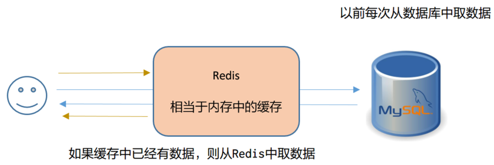  


### 1.1 Windows版Redis的下载

- 官网提供了Linux版的Redis下载

  http://redis.io/download

- Windows版的Redis，下载地址如下：

  https://github.com/MSOpenTech/redis/tags

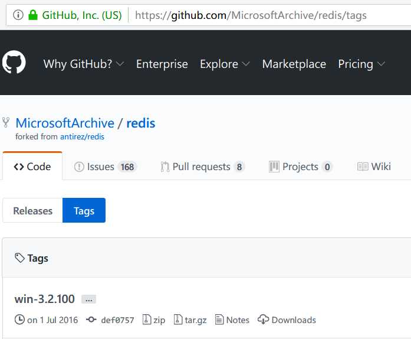


### 1.2 Windows版Redis的安装

​	Windows版的安装及其简单，解压Redis压缩包完成即安装完毕

- 安装的注意事项：

1. 直接解压到任意一个目录即可
2. 不要有中文的目录
3. 目录层次不要太深
4. 硬盘要空闲最少大于内存的容量

### 1.3 Redis的目录文件 

| **目录或文件**           | **作用**                                  |
| ------------------------ | ----------------------------------------- |
| **redis-benchmark.exe**  | 性能测试的工具                            |
| **redis-check-aof.exe**  | 对AOF文件进行检查和修改工具               |
| **redis-check-dump.exe** | 对RDB文件进行检查和修改工具               |
| **redis-cli.exe**        | 命令行方式客户端连接工具                  |
| **redis-server.exe**     | 服务器启动文件                            |
| **redis.window.conf**    | redis在window下的配置文件，这是个文本文件 |

### 1.4 Windows版Redis的启动与关闭 

#### 启动

运行redis-server.exe文件就可以启动服务器

端口号：6379

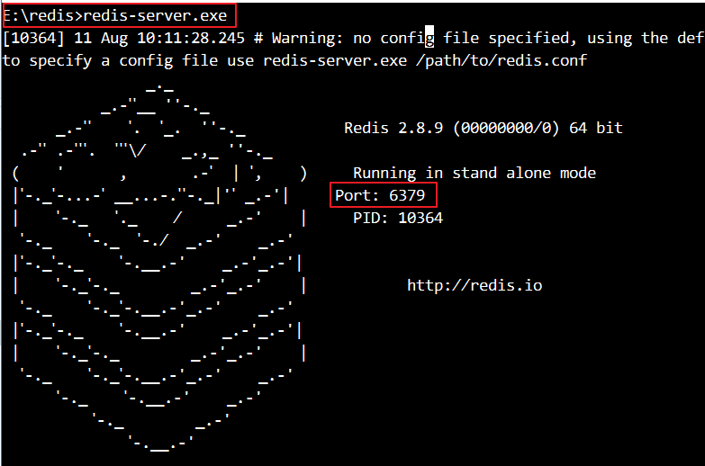 

#### 关闭

也可以直接关闭窗口

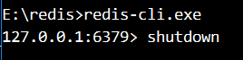 

#### 客户端

启动方法：redis-cli.exe


#### 总结

```markdown
#1. 安装redis
1. 解压redis-2.8.9.zip 即可
2. 启动
		点击 redis-server.exe 启动服务端
		点击 redis-cli 启动客户端
3. 如果启动服务端闪退, 请看资料	
4. 做一个配置:
		a. 给redis-server.exe 创建一个桌面快捷方式
		b. 修改快捷方式的目标(右单击属性): 
			C:\develop\redis-2.8.9\redis-server.exe redis.windows.conf
		c. 以后点击这个快捷方式,就是启动服务端
        d. 意义: 每次启动都会读取配置文件
        
        注意:(win10)  "C:\develop\redis-2.8.9\redis-server.exe" redis.windows.conf 
	
```


## 三. redis的操作

​	redis是一种高级的key-value的存储系统，**键是string类型**，其中value支持五种数据类型

| 值的数据类型 | 值的格式说明                                         |
| ------------ | ---------------------------------------------------- |
| string       | 字符串类型，类似于Java中String                       |
| hash         | 由键值对组成，类似于Java中Map                        |
| list         | 列表类型，类似于Java中List，元素是有序，可以重复。   |
| set          | 集合类型，类似于Java中Set，元素是无序，不可重复      |
| zset         | 有序的集合类型，每个元素有一个分数用来决定它的顺序。 |

### 3.1 <font color="red">string类型的操作命令</font>(重要)

```markdown
#特点
1. 字符串类型是Redis中最为基础的数据存储类型
2. 二进制安全, 存储不涉及编解码操作
3. 最多可以容纳的数据长度是512M
4. 注意 : json在java中也是字符串

#常用命令
1. 增
		1. 存一个值：set key value
		2. 存多个值：mset key1 value1 key2 value2 (multi)
2. 查
		1. 获取指定key的值：get key
		2. 获取多个指定key的值：mget key1 key2
3. 删
		删除指定key的值：del key[key2...] 
4. 改:
		set 已存在的key 新value(覆盖)
```

 

| 命令      | 功能                                                     |
| --------- | -------------------------------------------------------- |
| set 键 值 | 添加或修改一个键和值，键不存在就是添加，存在就是修改     |
| get 键    | 获取值，如果存在就返回值，不存在返回nil(就是C语言中NULL) |
| del 键    | 删除指定的键和值，返回删除的个数                         |


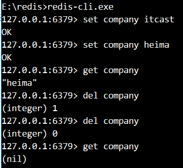 


### 3.2 hash类型的操作命令

```markdown
#特点
	1. Redis中的Hash类型可以看成是键和值都是String类型的Map容器
	2. 每一个Hash可以存储4G个键值对。
	3. 该类型非常适合于存储对象的信息。如一个用户有姓名，密码，年龄等信息，则可以有username、password和age等键。

#常用命令
1. 增
		1. hset key field value
		2. hmset key field1 value1 field2 value2 ...
2. 查
		1. hget key field
		2. hmget key field1 field2
		3. hgetall key
3. 删
		1. hdel key[filed1 filed2...]  (删除一个或多个字段)
		2. del key 可以删除整个键值对 (通用的)
```


它的存储结构如下：

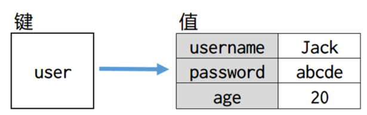 

### 

| 命令                     | 功能                               |
| ------------------------ | ---------------------------------- |
| hset 键 字段 值          | 添加键，字段，值                   |
| hget 键 字段             | 通过键，字段得到值                 |
| hmset 键 字段 值 字段 值 | multiply多个，一次添加多个字段和值 |
| hmget 键 字段 字段       | 通过键，获取多个字段和值           |
| hdel 键 字段 字段        | 删除一个或多个字段的值             |
| hgetall 键               | 得到这个键下所有的字段和值         |

**演示**

1. 创建hash类型的键为user，并且添加一个字段为username，值为newboy
2. 向user中添加字段为password，值为12345
3. 向user中添加字段为age，值为18
4. 分别得到user中的username、password和age的字段值
5. 向user中同时添加多个字段和值，birthday 2018-01-01 sex male

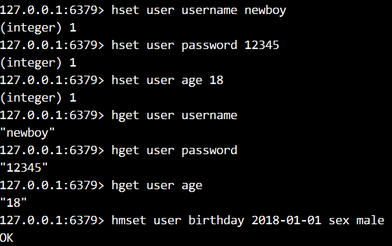 

1. 同时取得多个字段：age 和 sex
2. 得到user中所有的字段和值
3. 删除user中的生日和密码字段

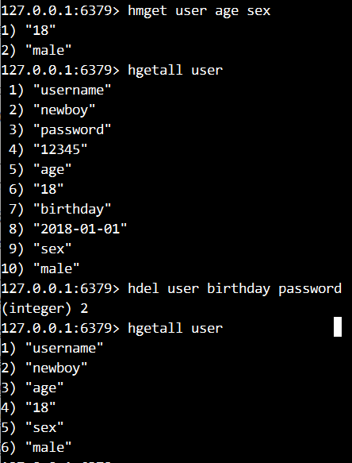 


### 3.3 list类型的操作命令

```markdown
#特点
    1. 在Redis中，List类型是按照插入顺序排序的字符串链表。(可以左右操作)
    2. 有序(插入顺序),有索引,可重复
    3. 如果该键并不存在，Redis将为该键创建一个新的链表。与此相反，如果链表中所有的元素均被移除，那么该键也将会被从数据库中删除
    4. List中可以包含的最大元素数量是4G个

# 常用命令
1. 增
		1. lpush key value1[value2...] (left : addFirst)
		2. rpush key value1[value2...] (right : addLast)
2. 查
		1. lrange key start end (闭区间 : 两边都包括)
		2. lrange key 0 -1  (查询所有)
		3. lindex key index  (索引 : 0基  左边第一个0, 右边第一个索引-1)
3. 删
		1. lpop key 
		2. rpop key
```


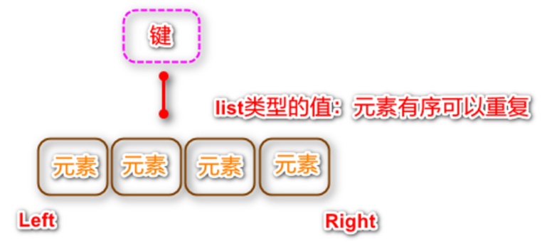 


| 命令                | 行为                                                         |
| ------------------- | ------------------------------------------------------------ |
| lpush 键 元素 元素  | left 从左边向指定的键中添加1个或多个元素，返回列表中元素的个数 |
| rpush 键 元素 元素  | right 从右边向指定的键中添加1个或多个元素                    |
| lpop 键             | 从左边删除一个元素，返回被删除的元素                         |
| rpop 键             | 从右边删除一个元素，返回被删除的元素                         |
| lrange 键 开始 结束 | 得到键中指定范围的元素的数据<br />每个元素都有一个索引号，从左向右0~n<br />从右向左索引号：-1~-(n+1)，每个元素有2个索引号<br />如果要取出整个列表中所有的元素，索引号应该是：0~-1 |
| llen 键             | 获取列表的长度                                               |


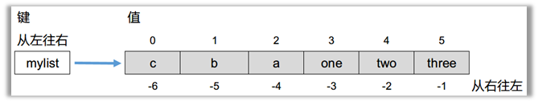

**演示**

1. 向mylist键的列表中，从左边添加a b c三个元素

2. 从右边添加one two three三个元素

3. 查询所有的元素

4. 从右边添加一个重复的元素three

   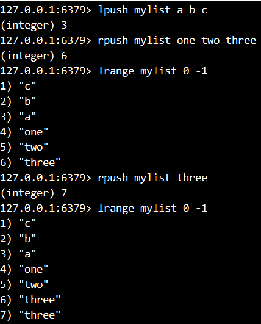 

5. 删除最右边的元素three

6. 删除最左边的元素c

7. 获取列表中元素的个数

   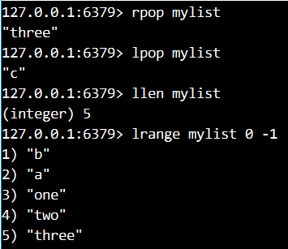 


### 3.4 set类型的操作命令

```markdown
#特点
   	1. 无序,无索引, 不可重复
    2. Set可包含的最大元素数量是4G

# 常用命令
1. 增
		1. sadd key value[value2...]
2. 查
		1. smembers key(查询所有value)
		2. scard key(查询value的数量)
		3. sismember key value (判断指定的元素是否存在，存在返回1，否则返回0)
3. 删
		1. spop key : 随机删除
		2. srem key members[member1,member2...] : 删除指定元素
```

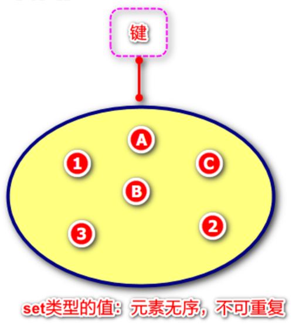

### 

| 命令              | 行为                                                   |
| ----------------- | ------------------------------------------------------ |
| sadd 键 元素 元素 | 向一个键中添加1个或多个元素                            |
| smembers 键       | 得到这个集合中所有的元素                               |
| sismember 键 元素 | 判断指定的元素在集合中是否存在，存在返回1，不存在返回0 |
| srem 键 元素 元素 | 通过键删除一个或多个元素                               |

**演示**

1. 向myset集合中添加A B C 1 2 3 六个元素

2. 再向myset中添加B元素，看能否添加成功

3. 显示所有的成员，发现与添加的元素顺序不同，元素是无序的

4. 删除其中的C这个元素，再查看结果

   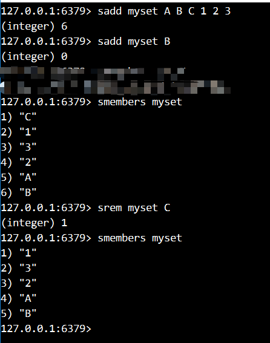 

5. 判断A是否在myset集合中

6. 判断D是否在myset集合中

   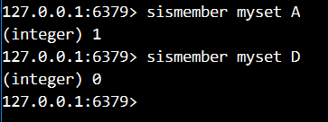 


### 3.5 zset类型的操作命令

```markdown
#特点
    1. 每个元素都会关联一个分数
    2. 排序(按score大小排序) , 支持左右索引
    2. 一个元素(score,value) 其中score可重复,value不可重复
    3. 应用 : 排行版
#常用命令
1. 增
		1. zadd key score1 member1[score2 member2...]
2. 查
		1. zcard key
		2. zrange key start stop[withscores]
		3. zrevrange key start stop[withscores]  (reverse)

3. 删
		1. zrem key member[member2...]	
```


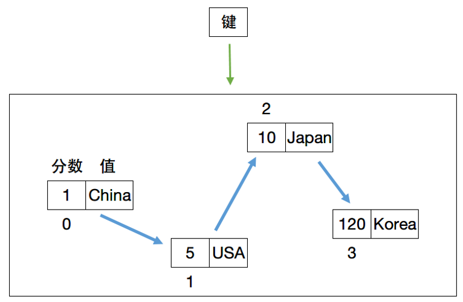


| **命令**                                        | **行为**                                        |
| ----------------------------------------------- | ----------------------------------------------- |
| **zadd** **键** **分数** **值** **分数** **值** | 添加1个或多个元素，每个元素都有一个分数         |
| **zrange** **键** **开始索引** **结束索引**     | 获取指定范围的元素，得到所有的元素，索引是0到-1 |
| **zrem 键 值 值**                               | 删除一个或多个值                                |
| **zcard** **键**                                | 得到元素个数                                    |
| **zrank** **键** **值**                         | 得到元素的索引号                                |
| **zscore 键 值**                                | 得到元素的分数                                  |


**演示**

1. 添加键country，分数是10，值是Japan

2. 添加键country，分数是5，值是USA，添加键country，分数是50，值是Russian

3. 添加键country，分数是1，值是China，分数是120，值是Korea

4. 查询country中所有的元素

   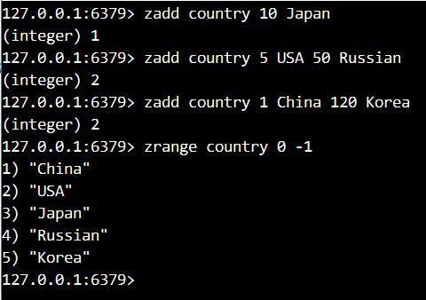 

5. 查询Japan的索引号(从0开始)

6. 删除值为USA的元素

7. 查询country中还有多少个元素

8. 显示Russian的分数值

   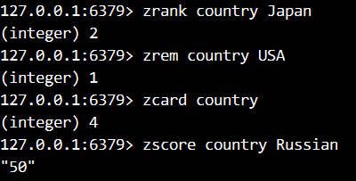 

### 

### 3.6 Redis的通用命令


| **命令**                       | **功能**                                                     |
| ------------------------------ | ------------------------------------------------------------ |
| **keys 匹配字符**              | 查询所有的键，可以使用通配符<br />***** 匹配多个字符<br />**?** 匹配1个字符 |
| **del** **键1** **键2**        | 删除任何的值类型，而且可以同时删除多个键                     |
| **exists** **键**              | 判断指定的键是否存在                                         |
| **type** **键**                | 判断指定的键，值的类型。返回是类型的名字                     |
| **select** **数据库编号**      | 选择其它的数据库(默认16个仓库)                               |
| **move** **键** **数据库编号** | 将当前数据库中指定的键移动到另一个数据库中                   |

**演示**

1. 添加字符串name的值为zhangsan

2. 显示所有的键

3. 显示所有以my开头的键

4. 显示所有my后面有三个字符的键

5. 添加一个字符串：name2 lisi

6. 添加一个list：name3 a b c d

    

7. 显示所有的键

8. 一次删除name2和name3这两个键，其中name2和name3是不同的类型，显示所有键

9. 分别判断name和name2是否存在

    

10. 分别判断name user myset mylist分别是什么类型

11. 切换数据库到15，向15中添加一个name2 wangwu，得到name2的值显示。

12. 将15中的name2移到0中

13. 切换到数据库0，显示所有的键

 

### 3.7 图形化的客户端工具

#### **3.7.1 客户端工具Redis Desktop Manager的安装**

1. 欢迎页面

   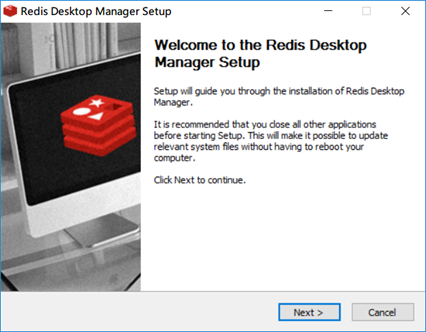 

2. 软件的许可协议，接受即可

   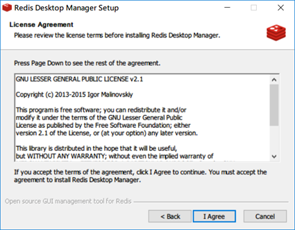 

3. 选择安装的位置

   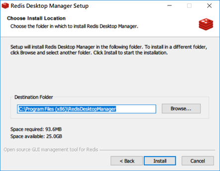 

4. 复制文件

   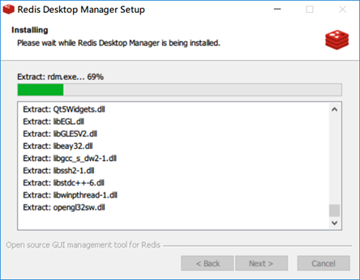 

5. 完成安装

   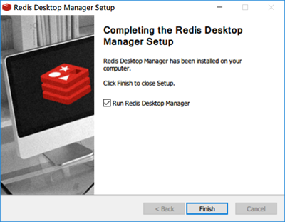 


#### 3.7.2 客户端工具连接

直接安装提供的客户端软件即可，双击桌面图标执行

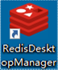 

启动后出现如下登录界面：

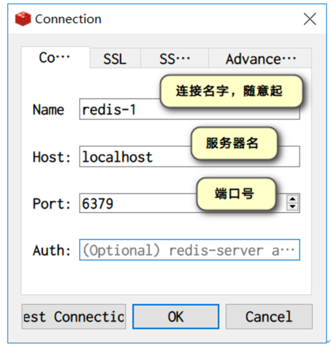 

​	一个Redis服务器可以包括多个数据库，客户端可以只连接Redis中某个数据库，就好比一个mysql服务器中创建多个数据库，客户端连接时指定连接到哪个数据库。
​	Redis中有db0-db15编号的16个数据库。我们不能创建新的数据库，也不能删除数据库。数据库中也没有表的结构，客户端默认连接第0个数据库。

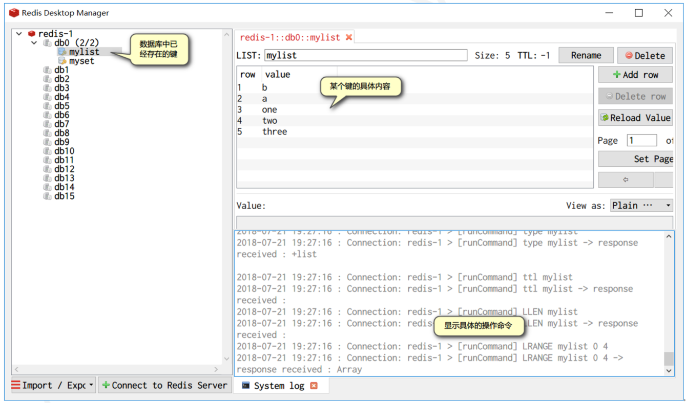


## 四. Redis的持久化[了解]

**问：把客户端和服务端都关闭了，再重新开启服务器和客户端，数据会不会丢失？**

```
如果redis不能持久化, 数据都在内存中,断电数据就销毁.

可能会部分丢失，redis服务器有持久化功能,是每隔一段时间写入一次内存中数据到硬盘上。
```

**什么是Redis的持久化：**

概念：将内存中数据，写在硬盘文件上。服务器关闭，电脑重启数据也不会丢失。

**Redis持久化的两种方式：**

1. RDB：Redis DataBase 默认的持久化方式，以二进制的方式将数据写入文件中。每隔一段时间写入一次。
2. AOF：Append Only File 以文本文件的方式记录用户的每次操作，数据还原时候，读取AOF文件，模拟用户的操作，将数据还原。

### 4.1 RDB持久化机制

```markdown
# 优点
1. 方便备份与恢复
		整个Redis数据库将只包含一个文件，默认是dump.rdb，这对于文件备份和恢复而言是非常完美的。因为我们可以非常轻松的将一个单独的文件压缩后再转移到其它存储介质上。一旦系统出现灾难性故障，我们可以非常容易的进行恢复。
2. 性能最大化
		对于Redis的服务进程而言，在开始持久化时，它唯一需要做的只是分叉出子进程，由子进程完成这些持久化的工作，这样就可以极大的避免服务进程执行IO操作了。
3. 启动效率更高
		相比于AOF机制，如果数据集很大，RDB的启动效率会更高

#缺点
1. 不能完全避免数据丢失
		因为RDB是每隔一段时间写入数据，所以系统一旦在定时持久化之前出现宕机现象，此前没有来得及写入磁盘的数据都将丢失。
2. 会导致服务器暂停的现象
		由于RDB是通过子进程来协助完成数据持久化工作的，因此当数据集较大时，可能会导致整个服务器停止服务几百毫秒，甚至是1秒钟。

```


#### 4.1 1RDB持久化机制的配置

在redis.windows.conf配置文件中的SNAPSHOTTING中有如下说明：

| **语法**                       | **说明**                                 |
| ------------------------------ | ---------------------------------------- |
| **save <时间间隔> <修改键数>** | 过多久(单位是秒)，修改了多少个键(增删改) |

 	如下面配置的是RDB方式数据持久化时机，必须两个条件都满足的情况下才进行持久化的操作：

| **关键字** | **时间(秒)** | **修改键数** | **解释**                 |
| ---------- | ------------ | ------------ | ------------------------ |
| **save**   | **900**      | **1**        | 到了15分钟修改了1个键    |
| **save**   | **300**      | **10**       | 到了5分钟修改了10个键    |
| **save**   | **60**       | **10000**    | 到了1分钟，修改了1万个键 |

#### 4.1.2 演示：RDB持久化

1. 修改redis.windows.conf 文件的101行
  添加1行：save 20 3 (表示20秒内修改3个键，则写入到dump.rdb文件中)

2. 使用指定的配置文件启动服务器：redis-server redis.windows.conf 

3. 向数据库中添加2个键，直接关闭服务器窗口。再开启服务器，查看所有的keys，刚才添加的数据丢失。

   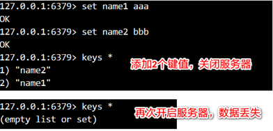 

4. 在客户端添加3个键，发现服务器端有如下输出信息，表示写入到数据库dump.rdb文件中

   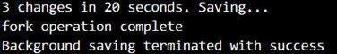 

5. 直接关闭服务器窗口，再开启服务器，查看所有的keys，数据没有丢失。

   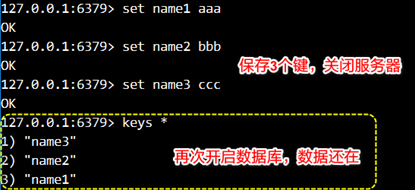 


### 4.2  AOF的存储方式[了解]

```markdown
# AOF持久化机制优点
		AOF包含一个格式清晰、易于理解的日志文件用于记录所有的修改操作。也可以通过该文件完成数据的重建。该机制可以带来更高的数据安全性，所有的操作都是异步完成的。

# AOF持久化机制缺点
	1. 文件比RDB更大：对于相同数量的数据集而言，AOF文件通常要大于RDB文件。
	2. 运行效率比RDB更慢：根据同步策略的不同，AOF在运行效率上往往会慢于RDB。
```


| **Redis中提供了3种AOF同步策略** | **说明**                     |
| ------------------------------- | ---------------------------- |
| **每秒同步**                    | 每过一秒中记录一次           |
| **每修改同步**                  | 每次修改(增删改)都会记录一次 |
| **不同步**                      | 不记录任何操作               |


#### 4.2.1 AOF持久化机制配置

**AOF默认是关闭的，首先需要开启AOF模式**

| **参数配置**            | **说明**                                                     |
| ----------------------- | ------------------------------------------------------------ |
| **appendonly   no/yes** | 默认是no，关闭。如果要打开，设置成yes。<br />如果打开的AOF，RDB中存储的数据读取不出来。 |

**AOF持久化时机**

这三种策略只能选择其中一种

| **关键字**      | **持久化时机** | **解释**   |
| --------------- | -------------- | ---------- |
| **appendfsync** | **everysec**   | 每秒记录   |
| **appendfsync** | **always**     | 每修改记录 |
| **appendfsync** | **no**         | 不记录     |


#### 4.2.2 演示：AOF的持久化

1. 打开AOF的配置，找到APPEND ONLY MODE配置块，392行。设置appendonly yes

2. 通过redis-server redis.windows.conf 启动服务器，在服务器目录下出现appendonly.aof文件。大小是0个字节。

3. 添加3个键和值

   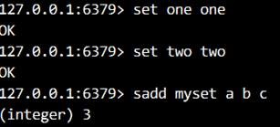 

4. 打开appendonly.aof文件，查看文件的变化。会发现文件记录了所有操作的过程。                                     


### 4.3 AOF重写机制介绍[了解]

**为什么需要AOF 重写**

​	为了解决AOF文件体积膨胀的问题，Redis提供了AOF重写功能：Redis服务器可以创建一个新的AOF文件来替代现有的AOF文件，新旧两个文件所保存的数据库状态是相同的，但是新的AOF文件不会包含任何浪费空间的冗余命令，通常体积会较旧AOF文件小很多。

**AOF 文件重写的实现原理**

​	AOF重写并不需要对原有AOF文件进行任何的读取，写入，分析等操作，这个功能是通过读取服务器当前的数据库状态来实现的。

```
# 假设服务器对键list执行了以下命令
127.0.0.1:6379> RPUSH list "A" "B"
(integer) 2
127.0.0.1:6379> RPUSH list "C"
(integer) 3
127.0.0.1:6379> RPUSH list "D" "E"
(integer) 5
127.0.0.1:6379> LPOP list
"A"
127.0.0.1:6379> LPOP list
"B"
127.0.0.1:6379> RPUSH list "F" "G"
(integer) 5
127.0.0.1:6379> LRANGE list 0 -1
1) "C"
2) "D"
3) "E"
4) "F"
5) "G"
127.0.0.1:6379>
```

**结果**

当前列表键list在数据库中的值就为["C","D", "E", "F", "G"]。要使用尽量少的命令来记录list键的状态，最简单的方式不是去读取和分析现有AOF文件的内容，，而是直接读取list键在数据库中的当前值，然后用一条RPUSH
list "C" "D" "E" "F" "G"代替前面的6条命令。

**结论**

因为AOF如果记录每一步操作，文件会越来越大，通过AOF的重写，可以缩小AOF文件的尺寸。同样可以达到数据还原效果


#### 4.3.1 AOF重写触发的方式

1. 手动触发：用户通过调用bgrewriteaof手动触发
2. 自动触发：如果全部满足的话，就触发自动的AOF重写操作：
   1. 没有RDB持久化/AOF持久化在执行，没有bgrewriteaof在进行；
   2. 当前AOF文件大小要大于redis.conf配置的auto-aof-rewrite-min-size大小；
   3. 当前AOF文件大小和最后一次重写后的大小之间的比率等于或者等于指定的增长百分比（在配置文件设置了auto-aof-rewrite-percentage参数，不设置默认为100%）

#### **4.3.2 演示：AOF手动重写**

1. 关闭服务器，删除生成的aof和rdb文件

   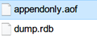 

2. 执行以下命令

   1. 从右边添加一个键为list，值为A B
   2. 从右边添加C
   3. 从右边添加D E
   4. 从左边弹出一个元素
   5. 从左边弹出一个元素
   6. 从右边添加元素F G
   7. 显示列表中的所有元素

   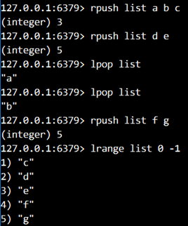 

3. 输入命令：bgrewriteaof，则aof被重写

    

4. 生成旧的文件

    

5. 服务器上出现提示

   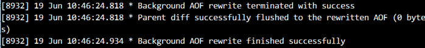 


#### 4.3.3 演示：AOF后台自动重写 

1. 关闭服务器，删除生成的aof和rdb文件

2. 修改配置文件如下：

   ```
   # 大于原来的50%就自动重写
   auto-aof-rewrite-percentage 50
   # 自动重写的最小尺寸
   auto-aof-rewrite-min-size 100b
   ```

3. 带配置文件启动服务器： redis-server redis.windows.conf

4. 进行如下操作

   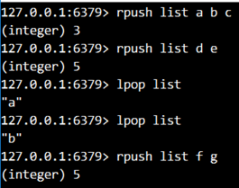 

5. 生成的重写文件

   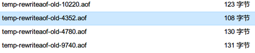 

6. 服务器端的输出

   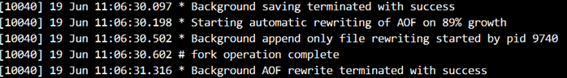 


## <font color="red">五. Jedis的使用</font>

### 5.1 Jedis的介绍

Redis不仅可以使用命令来操作，现在基本上主流的语言都有API支持，比如Java、C#、C++、PHP、Node.js、Go等。

在官方网站里列一些Java的客户端，有Jedis、Redisson、Jredis、JDBC-Redis等其中官方推荐使用Jedis和Redisson。 使用Jedis操作redis需要导入jar包如下：

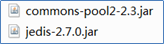 


### 5.2 Jedis类常用方法

注：每个方法就是redis中的命令名，方法的参数就是命令的参数。

在每次访问Redis数据库的时候，都需要创建一个Jedis对象。每个Jedis对象似于JDBC中Connection对象，类似于mybatis中session对象。

| **连接和关闭**              | **功能**                                                     |
| --------------------------- | ------------------------------------------------------------ |
| **new Jedis(host,   port)** | 创建Jedis连接对象，参数：<br />host: 服务器地址<br />port：端口号6379 |
| **void close()**            | 关闭连接                                                     |


| **对string操作的方法**           | **说明**               |
| -------------------------------- | ---------------------- |
| **set(String key,String value)** | 添加字符串类型的键和值 |
| **String get(String key)**       | 通过键得到字符串的值   |
| **del(String ... keys)**         | 删除一个或多个键       |


| **对hash操作的方法**                           | **说明**                              |
| ---------------------------------------------- | ------------------------------------- |
| **hset(String key,String field,String value)** | 添加一个hash类型的键，字段和值        |
| **Map<String,String> hgetall(String key)**     | 通过一个键得到所有的字段和值，返回Map |

| **对list操作的方法**                                     | **说明**                 |
| -------------------------------------------------------- | ------------------------ |
| **lpush(String key,String...values)**                    | 从左边添加多个值到list中 |
| **List\<String> lrange(String key,long start,long end)** | 通过键得到指定范围的元素 |

| **对set操作的方法**                   | **说明**                 |
| ------------------------------------- | ------------------------ |
| **sadd(String key,String...values)**  | 添加一个或多个元素       |
| **Set\<String> smembers(String key)** | 通过键得到集合所有的元素 |

| 对zset操作的方法                                          | 说明                   |
| --------------------------------------------------------- | ---------------------- |
| **zadd(String key, double score, String member)**         | 添加一个键，分数和值   |
| **Set\<String> zrange(String key, long start, long end)** | 查询一个指定范围的元素 |


### 5.3 案例：Jedis的基本操作

**需求**

​	使用Jedis上面的方法来访问Redis，向服务器中写入字符串，并且取出打印控制台上。

**操作步骤：**

1. 创建Jedis对象，指定服务器地址和端口号
2. 向服务器写入

3. 从服务器中读取上面的数据打印输出

4. 关闭Jedis对象，释放资源
5. 通过客户端查看数据库中是否有数据

**代码**

```java
package com.itheima;

import redis.clients.jedis.Jedis;

import java.util.List;

/*
向服务器中写入字符串和list类型
 */
public class Demo1 {

    public static void main(String[] args) {
        //1.创建连接
        Jedis jedis = new Jedis("localhost", 6379);

        //2.向Redis中写入字符串和list类型
        jedis.set("person", "张三");
        jedis.lpush("cities", "广州", "深圳", "东莞");

        //3.取出字符串和list
        String person = jedis.get("person");
        List<String> cities = jedis.lrange("cities", 0, -1);

        //4.关闭连接
        jedis.close();

        //5.打印到控制台
        System.out.println("person: " + person);
        System.out.println("cities: " + cities);
    }

}
```


### <font color="red">5.4 Jedis连接池的使用</font>

#### 5.4.1 jedis连接池的基本概念

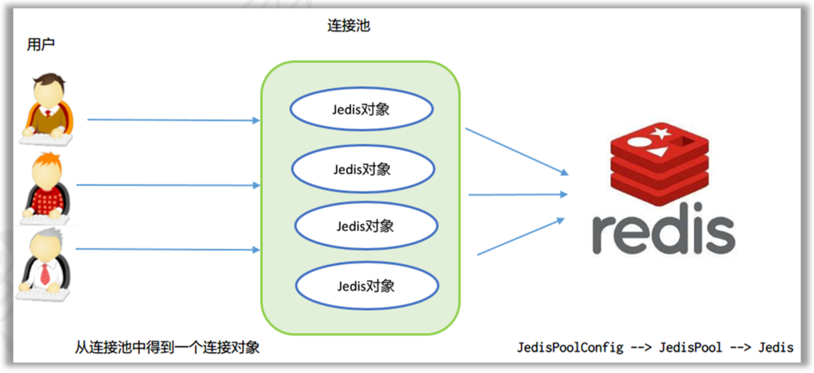

​	jedis连接资源的创建与销毁是很消耗程序性能，所以jedis为我们提供了jedis的连接池技术，jedis连接池在创建时初始化一些连接对象存储到连接池中，使用jedis连接资源时不需要自己创建jedis对象，而是从连接池中获取一个资源进行redis的操作。使用完毕后，不需要销毁该jedis连接资源，而是将该资源归还给连接池，供其他请求使用。

#### 5.4.2 Jedis连接池API

| **JedisPoolConfig配置类**   | **功能说明**           |
| --------------------------- | ---------------------- |
| **JedisPoolConfig()**       | 创建一个配置对象       |
| **void setMaxTotal()**      | 设置连接池的最大连接数 |
| **void setMaxWaitMillis()** | 设置最长等待时间       |

| **JedisPool连接池类**                   | **说明**                                                     |
| --------------------------------------- | ------------------------------------------------------------ |
| **JedisPool(配置对象,服务器名,端口号)** | 创建一个连接池，参数：<br />1. 上面的配置对象<br />2. 服务器名<br />3. 端口号 |
| **Jedis getResource()**                 | 从连接池中得到一个连接对象Jedis                              |

#### 5.4.3 JedisPool的基本使用


``` java
package com.itheima;

import redis.clients.jedis.Jedis;
import redis.clients.jedis.JedisPool;
import redis.clients.jedis.JedisPoolConfig;

import java.util.Set;

/**
 * 1. 使用连接池得到连接对象Jedis
 * 2. 创建set集合，写入到Redis中
 */
public class Demo2 {


    public static void main(String[] args) {
        //1.创建连接池的配置对象
        JedisPoolConfig config = new JedisPoolConfig();
        //设置2个参数，最大连接数，最长等待时间
        config.setMaxTotal(10);
        config.setMaxWaitMillis(2000);

        //2.创建连接池，使用上面的配置对象
        JedisPool pool = new JedisPool(config, "localhost", 6379);

        //3.从连接池中得到连接对象
        Jedis jedis = pool.getResource();

        //4.使用Jedis连接对象，添加set集合
        jedis.sadd("students", "孙悟空", "白骨精", "哪吒");

        //5.得到set集合，并且输出
        Set<String> students = jedis.smembers("students");
        System.out.println("students:" + students);

        //6.关闭连接对象
        jedis.close();
        pool.close();
    }

}
```

### 

### 5.5 案例：编写jedis连接池工具类

#### 5.5.1 ResourceBundle类

作用：简单化了Java属性配置文件的读取

| **java.util.ResourceBundle类**                      | **功能**                                                     |
| --------------------------------------------------- | ------------------------------------------------------------ |
| **static ResourceBundle getBundle("配置文件基名")** | 读取指定的配置文件<br />返回ResourceBundler对象<br />只需要指定主文件名即可，不用指定扩展名。 |
| **String getString("键名")**                        | 读取配置文件中指定的键，返回相应的值                         |

**ResourceBundle类的使用案例**

jedis.properties 文件

```
# 最大连接数
maxTotal=10
# 最长等待时间
maxWaitMillis=2000
# 主机名
host=localhost
# 端口号
port=6379
```

```java
package com.itheima;

import java.util.ResourceBundle;

public class Demo3 {

    public static void main(String[] args) {
        //1.指定配置文件名，得到ResourceBundle对象
        ResourceBundle bundle = ResourceBundle.getBundle("jedis");

        //2.读取端口号
        String port = bundle.getString("port");

        System.out.println(port);
    }
}

```

#### 5.5.2 Jedis连接池工具类的实现

**jedis.properties配置文件**

```
# 主机名
host=localhost
# 端口号
port=6379
# 最大连接数
maxTotal=20
# 最长等待时间
maxWaitMillis=3000
```

**JedisUtils.java**

```java
package com.itheima.utils;

import redis.clients.jedis.Jedis;
import redis.clients.jedis.JedisPool;
import redis.clients.jedis.JedisPoolConfig;

import java.util.ResourceBundle;

/**
 * 得到Jedis对象的工具类
 */
public class JedisUtils {

    private static JedisPool pool;

    //在静态代码块中创建连接对象
    static {
        //1.创建配置对象
        JedisPoolConfig config = new JedisPoolConfig();

        //2.设置配置对象的参数，从属性文件中读取
        ResourceBundle bundle = ResourceBundle.getBundle("jedis");
        String host = bundle.getString("host");

        int maxTotal = Integer.parseInt(bundle.getString("maxTotal"));
        int maxWaitMillis = Integer.parseInt(bundle.getString("maxWaitMillis"));
        int port = Integer.parseInt(bundle.getString("port"));

        config.setMaxWaitMillis(maxWaitMillis);
        config.setMaxTotal(maxTotal);

        //3.创建连接池
        pool = new JedisPool(config, host, port);
    }

    /**
     * 得到连接对象的方法
     */
    public static Jedis getJedis() {
        //从连接池中得到一个连接对象
        return pool.getResource();
    }
}

```

**使用工具类**

``` java
package com.itheima;

import com.itheima.utils.JedisUtils;
import redis.clients.jedis.Jedis;

import java.util.Map;

/**
 * 1. 使用工具类，得到Jedis对象
 * 2. 创建一个hash类型的键和值
 * 3. 读取hash类型的值，并且输出
 */
public class Demo4 {

    public static void main(String[] args) {
        //使用工具类，得到Jedis对象
        Jedis jedis = JedisUtils.getJedis();

        //创建一个hash类型的键和值
        jedis.hset("employee", "username", "NewBoy");
        jedis.hset("employee", "salary", "3000");

        //读取hash类型的值，并且输出
        Map<String, String> employee = jedis.hgetAll("employee");
        System.out.println(employee);

        jedis.close();
    }

}
```


## 六. 综合案例

```markdown
# 场景
		很多像好友列表,商品列表等数据, 这些数据会动态变化, 但是变化的频率又不高
# 案例
		前端页面加载好的时候, 从服务器的数据库中获取一个好友列表数据显示在网页上
		
# 问题
	1. 现在的好友列表数据,用户每次请求,都从mysql数据库获取
	2. mysql数据库的数据在硬盘上, 频繁读写效率太低了
# 缓存
	1. 用户第一次访问, 缓存中没有数据,就从mysql中获取,获取往缓存里面放一份
	2. 用户再次访问,缓存中有数据, 就直接用缓存中获取
	3. 缓存: redis数据库(运行内存中)
# 编码
	1. 从redis中获取数据,如果直接返回
	2. 如果没有缓存数据,就从mysql数据库中获取,记得往redis中存一份

# 新问题
	1. 如果用户增删改了好友列表数据, 缓存数据就过期了
	2. 解决: 只要用户增删改, 重新查询mysql数据库,同步到redis中

```


**导入数据库脚本**

```mysql
CREATE TABLE `user` (
  `id` int(11) NOT NULL AUTO_INCREMENT,
  `name` varchar(32) DEFAULT NULL,
  `password` varchar(32) DEFAULT NULL,
  PRIMARY KEY (`id`)
);

INSERT INTO `user` VALUES (1, '张三', '123');
INSERT INTO `user` VALUES (2, '李四', '123');
INSERT INTO `user` VALUES (3, '王五', '123');
INSERT INTO `user` VALUES (4, '赵六', '123');
INSERT INTO `user` VALUES (5, '田七', '123');
INSERT INTO `user` VALUES (6, '孙八', '123');
INSERT INTO `user` VALUES (7, '张三丰', '123');
INSERT INTO `user` VALUES (8, '张无忌', '123');
INSERT INTO `user` VALUES (9, '李寻欢', '123');
INSERT INTO `user` VALUES (10, '王维', '123');
INSERT INTO `user` VALUES (11, '李白', '123');
INSERT INTO `user` VALUES (12, '杜甫', '123');
INSERT INTO `user` VALUES (13, '李贺', '123');
INSERT INTO `user` VALUES (14, '李逵', '123');
INSERT INTO `user` VALUES (15, '宋江', '123');
INSERT INTO `user` VALUES (16, '王英', '123');
INSERT INTO `user` VALUES (17, '鲁智深', '123');
INSERT INTO `user` VALUES (18, '武松', '123');
INSERT INTO `user` VALUES (19, '张薇', '123');
INSERT INTO `user` VALUES (20, '张浩', '123');
INSERT INTO `user` VALUES (21, '刘小轩', '123');
INSERT INTO `user` VALUES (22, '刘浩宇', '123');
INSERT INTO `user` VALUES (23, '刘六', '123');
```

**编写实体类**

```java
public class User {
    private Integer id;
    private String name;
    private String password;

    @Override
    public String toString() {
        return "User3{" +
                "id=" + id +
                ", name='" + name + '\'' +
                ", password='" + password + '\'' +
                '}';
    }

    public Integer getId() {
        return id;
    }

    public void setId(Integer id) {
        this.id = id;
    }

    public String getName() {
        return name;
    }

    public void setName(String name) {
        this.name = name;
    }

    public String getPassword() {
        return password;
    }

    public void setPassword(String password) {
        this.password = password;
    }
}

```

**代码**  

```html
<!DOCTYPE html>
<html lang="zh-CN">
<head>
    <meta charset="UTF-8">
    <title>Title</title>
    <script src="js/jquery-3.3.1.min.js"></script>
</head>
<body>
    <h1>好友列表</h1>
    <ul id="mylist">
    </ul>
    <!--
        前端页面加载好的时候, 从服务器的数据库中获取一个好友列表数据显示在网页上
    -->
    <script>
        $(function () {
            $.get("/day10/FriendServlet",function (result) {
                //TODO:
                console.log(result);
                for(let user of result){
                    $("#mylist").append(` <li>${user.name}</li>`)
                }
            })
        })
    </script>
</body>
</html>
```


```java
@WebServlet("/FriendServlet")
public class FriendServlet extends HttpServlet {

    protected void doGet(HttpServletRequest request, HttpServletResponse response) throws ServletException, IOException {
        this.doPost(request, response);
    }

    protected void doPost(HttpServletRequest request, HttpServletResponse response) throws ServletException, IOException {

        FriendService service = new FriendService();
        String json = service.findAllUser();

           response.setContentType("application/json;charset=utf-8");
        response.getWriter().print(json);
    }

}
```


```java
/*
*   业务层:
*       	1. 从redis中获取数据,如果直接返回
	        2. 如果没有缓存数据,就从mysql数据库中获取,记得往redis中存一份
* */
public class FriendService {

    public String findAllUser() throws JsonProcessingException {
        //1. 从redis中获取数据,如果直接返回
        Jedis jedis = JedisUtils.getResource();
        String json = jedis.get("friend_list_cache");
        if(json == null){
            // 2. 如果没有缓存数据,就从mysql数据库中获取,记得往redis中存一份
            SqlSession session = SqlSessionUtil.getSession(true);
            UserDao dao = session.getMapper(UserDao.class);
            List<User> list = dao.findAllUser();
            json = new ObjectMapper().writeValueAsString(list);
            session.close();

            //记得往redis中放一份
            jedis.set("friend_list_cache",json);
            System.out.println("从mysql中获取");
        }else{
            System.out.println("从redis中获取");
        }
        jedis.close();

        return json;
    }
}

```


```java
public interface UserDao {
    @Select("select * from user")
    List<User> findAllUser();
}
```

