# 课堂笔记

# 1.redis

~~~
redis是nosql类型的数据库，nosql指的是非关系型数据库。数据与数据之间是没有任何关联的。

mysql是关系型数据库，表与表之间是存在联系的。

因为随着时代的进步，现在都是大数据的时代，需要存储的数据量非常的庞大。传统关系型数据库在存储和处理大数据存在瓶颈。就是因为关系型数据库在处理数据时需要进行关系的校验。所以有了这种非关系型数据库。

redis就是非关系型，就是key-value格式存储数据的。

redis支持的基本的5种数据类型：
	string   list   hash    set   sortedset
	
redis是将数据存储到内存的。速度快。	
~~~


# 2.redis的安装

## 2.1 基本安装

~~~
1.解压
2.redis.server.exe即可执行
~~~

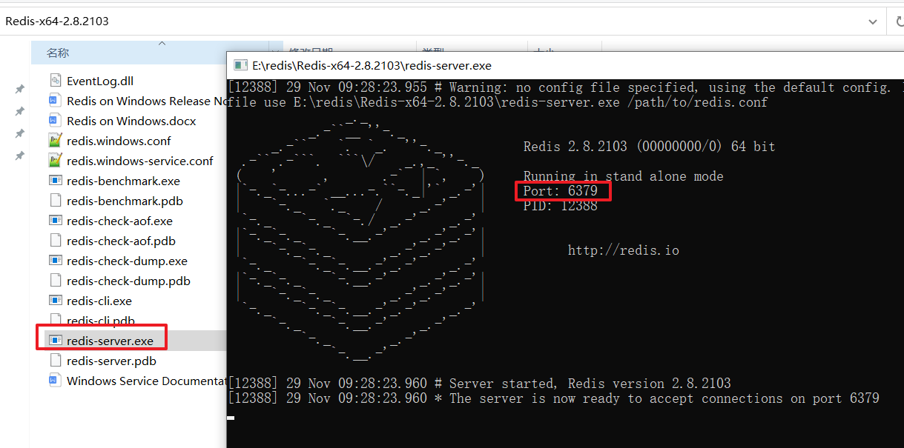

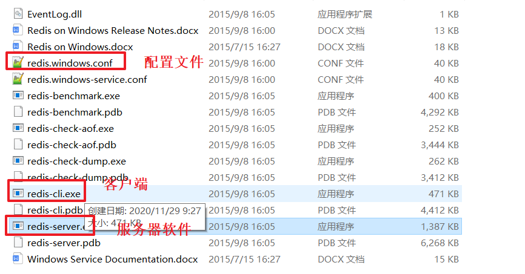


## 2.2 redis吃c盘问题（注意redis版本）

修改redis.windows.conf的配置

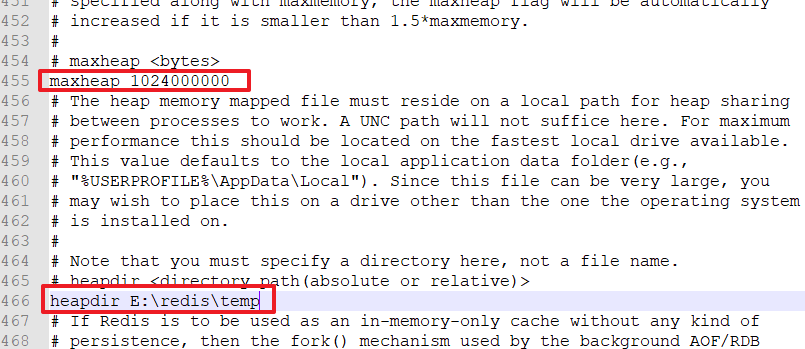

按照配置启动

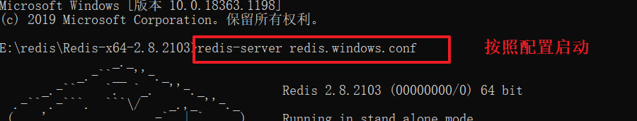


## 2.3 将redis安装成后台服务

redis的解压目录下最后的官方文档

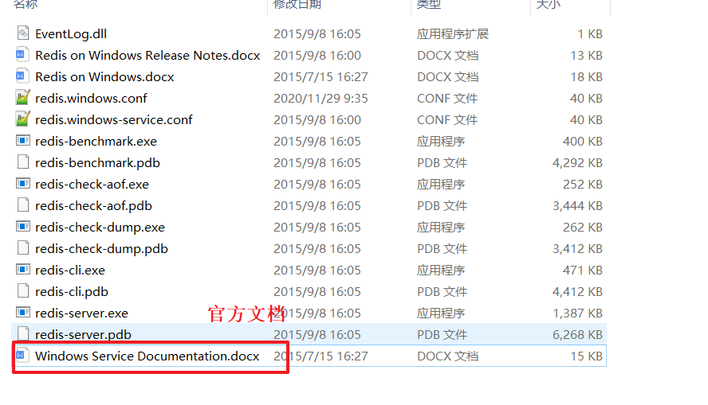

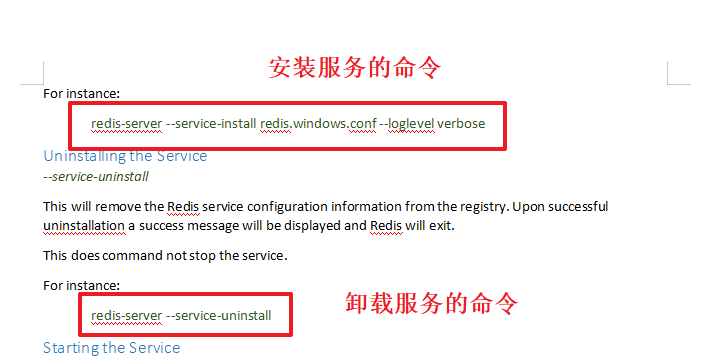

安装到后台服务的操作:


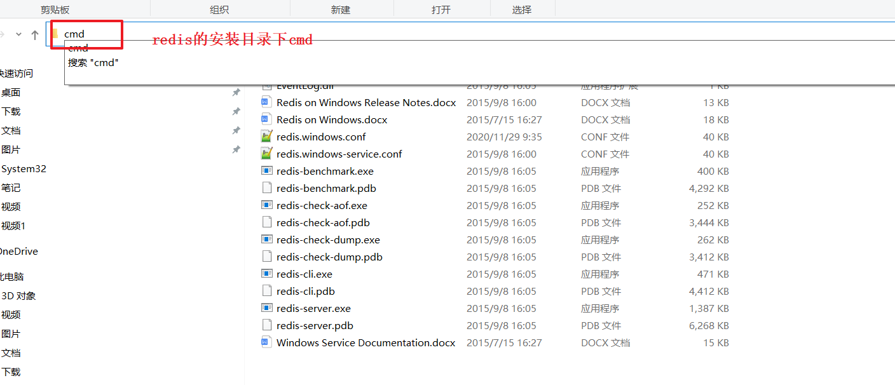


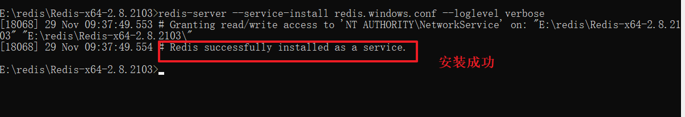


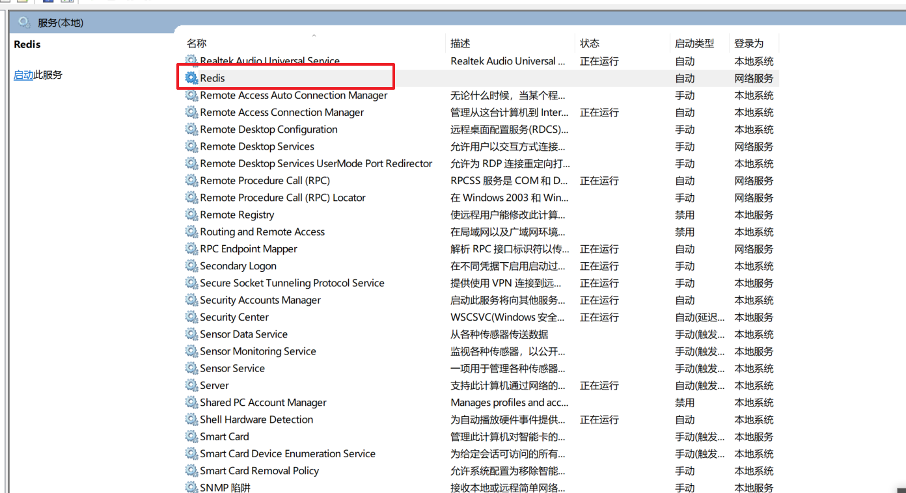


## 2.4 注意：

~~~
1.如果是redis的其他版本，那么吃c盘的操作不一样。
2.你安装好了，就不要在动安装位置了。
3.不要有中文目录或者空格。
~~~


## 2.5 redis的客户端工具

傻瓜式安装

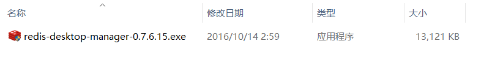

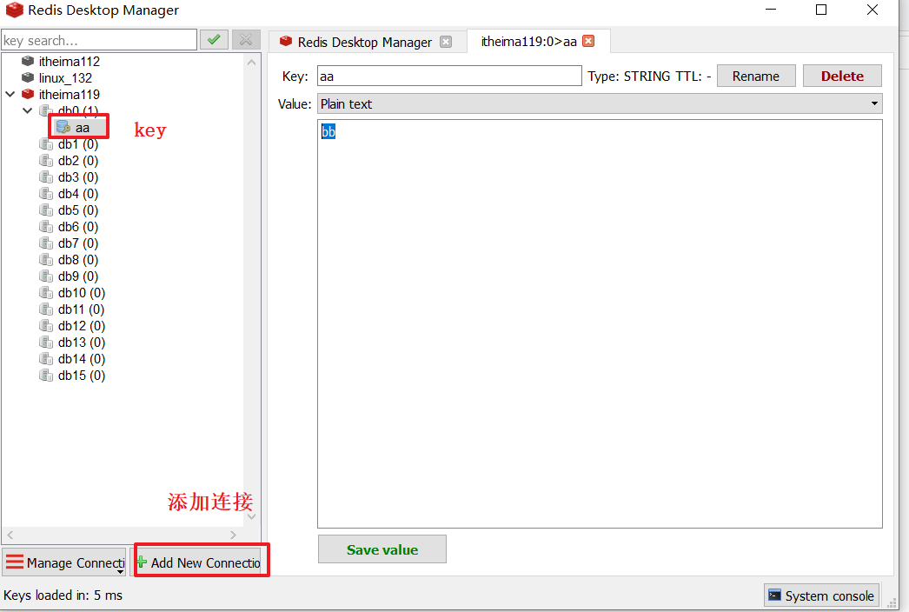


# 3.redis的操作（了解）

## 3.1 String类型（常用）

~~~~
set key  value   存储数据
get key  通过key获取数据
incr  key  将key对应的数值加1
mset key value [key value]  批量存储
mget key [key..]  批量获取
setex  key seconds  value  将数据存储指定的时间   （热点数据）
~~~~

## 3.2 hash类型（常用）

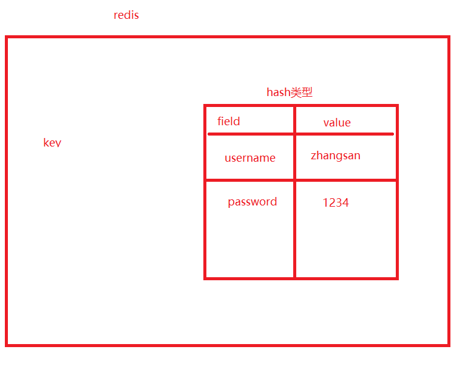

~~~
hset key  field  value   存储值
hget key  field          获取值
hmset key  field  value[field  value]   批量存储
hmget key  field  [field..]  批量获取
hkeys  key  获取所有的键
hvals  key  获取hash中所有的值
~~~


## 3.3 list类型


~~~
lpush  key  value  向列表的左边添加内容
rpush key value  右边。。。
lpop key  获取列表左边的第一个元素，并且删除
rpop key 右边的
llen   key   获取列表的长度
lindex  key  index 获取指定索引的值

~~~


## 3.4  set

~~~
相对于list来说无序不重复

sadd  key  value1 [value2...]  添加
srem  key  value  删除集合中指定的值
smembers key  获取集合中所有的值
spop  key 随机弹出集合中的值
~~~


## 3.5 sortedset

~~~
有序不重复，通过score进行排序

zadd  key   score  value  [score  value]  添加数据
zrange  key  start  value  通过索引返回索引区间内的值
zrangebyscore key  min  max  返回分数区间内的值

~~~


## 3.6 keys相关

~~~
select  index  选择指定的数据库
del key  删除指定的key
flushall  删除所有库中的所有数据
type  key  查看这个key存储的数据的类型
exists  key  查看这个key是否存在
expire  key seconds  给指定的key设置过期时间。
~~~


# 4 jedis操作

~~~
java代码操作redis
jedis： 只是针对redis的命令做了基本封装
redisson: 针对redis的一些命令做了高级封装，还提供了很多常用的redis的解决方案：分布式锁，布隆过滤器。。
~~~


## 4.1 jedis基本操作

~~~
1.引入依赖
2.建立连接
3.通过连接对象调用api操作redis
4.释放资源。
~~~


```xml
<dependencies>
    <!--jedis依赖-->
    <dependency>
        <groupId>redis.clients</groupId>
        <artifactId>jedis</artifactId>
        <version>2.9.0</version>
    </dependency>

</dependencies>
```


~~~java
package com.itheima.jedis;

import redis.clients.jedis.Jedis;

public class JedisTest {
    public static void main(String[] args) {


        //1.创建连接
        Jedis jedis = new Jedis("localhost",6379);
        //2.调用api,jedis的api和redis的命令一样
//        jedis.setex("username",100,"lisi");
//        String username = jedis.get("username");
//        System.out.println(username);


        jedis.hset("myset222","username","zhangsan");

        //3.释放资源
        jedis.close();
    }
}

~~~


## 4.2 jedis连接池

~~~
步骤：
1.创建连接池配置信息对象
2.根据连接池配置创建连接池对象
3.从连接池获取连接对象
4.通过api操作redis
5.释放资源
~~~

```java
package com.itheima.jedis;

import redis.clients.jedis.Jedis;
import redis.clients.jedis.JedisPool;
import redis.clients.jedis.JedisPoolConfig;

public class JedisPoolTest {
    public static void main(String[] args) {

//        1.创建连接池配置信息对象
        JedisPoolConfig config = new JedisPoolConfig();
        //连接最大等待时间
        config.setMaxWaitMillis(10000);
        //最大连接数
        config.setMaxTotal(20);
        //最大空闲连接数
        config.setMaxIdle(8);
//        2.根据连接池配置创建连接池对象
        JedisPool jedisPool = new JedisPool(config,"localhost",6379);
//        3.从连接池获取连接对象
        Jedis jedis = jedisPool.getResource();
//        4.通过api操作redis
        String username = jedis.hget("myset222","username");
        System.out.println(username);
//        5.释放资源
        jedis.close();

    }
}
```

## 4.3 jedis工具类抽取

~~~
1.创建jedis.properties存放配置参数
2.提供工具类
	a.读取配置
	b.创建连接池对象
	c.提供公共的静态方法，提供连接对象
	d.提供公共的静态方法，释放资源
~~~


~~~properties
redis.host=localhost
redis.port=6379
redis.maxTotal=10
redis.maxIdle=5
redis.maxWaitMillis=10000
~~~

JedisUtils.java

```java
package com.itheima.utils;

import redis.clients.jedis.Jedis;
import redis.clients.jedis.JedisPool;
import redis.clients.jedis.JedisPoolConfig;

import java.util.ResourceBundle;

public class JedisUtils {

    private static int port = 0;
    private static String host = "";
    private static long maxWaitMillis = 0;
    private static int maxTotal = 0;
    private static int maxIdle = 0;

    private static JedisPool jedisPool = null;
    static {
        //读取配置,专门用来读取classpath下的properties文件的
        //classpath:就是用于存放字节码文件的目录
        ResourceBundle rb = ResourceBundle.getBundle("jedis");

        port = Integer.parseInt(rb.getString("redis.port"));
        host = rb.getString("redis.host");
        maxWaitMillis = Long.parseLong(rb.getString("redis.maxWaitMillis"));
        maxTotal = Integer.parseInt(rb.getString("redis.maxTotal"));
        maxIdle = Integer.parseInt(rb.getString("redis.maxIdle"));

        //创建连接池对象
        JedisPoolConfig config = new JedisPoolConfig();
        config.setMaxIdle(maxIdle);
        config.setMaxTotal(maxTotal);
        config.setMaxWaitMillis(maxWaitMillis);

        jedisPool = new JedisPool(config,host,port);
    }

    public static Jedis getJedis(){
        return jedisPool.getResource();
    }

    public static void release(Jedis jedis){
        if(jedis!=null){
            jedis.close();
        }

    }

    public static void main(String[] args) {
        Jedis jedis = JedisUtils.getJedis();
        jedis.set("username","aaa");
        JedisUtils.release(jedis);
    }
}
```


# 5.redis的持久化机制（了解）

~~~
持久化：长时间的保存数据。
redis是将数据保存在内存中，所以软件关闭，内存中的数据丢失。


redis关闭，内存中的数据丢失了。但是当redis重新打开的时候，redis会根据当前的持久化机制，找到对应的数据文件，然后将文件中的数据，重新读取到内存中了。
~~~

## 5.1 RDB持久化机制

~~~
redis默认采用的是RDB持久化机制。
~~~

rdb持久化机制

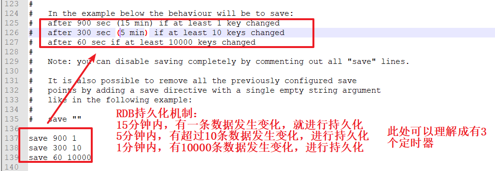


rdb持久化机制保存数据的文件：

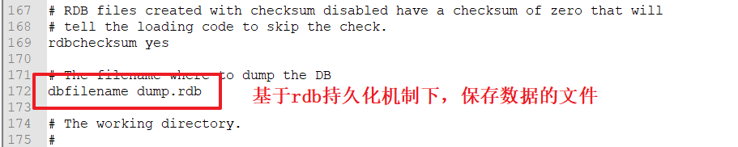


rdb持久化机制保存的数据格式：key：value格式将数据保存到dump.rdb文件中了

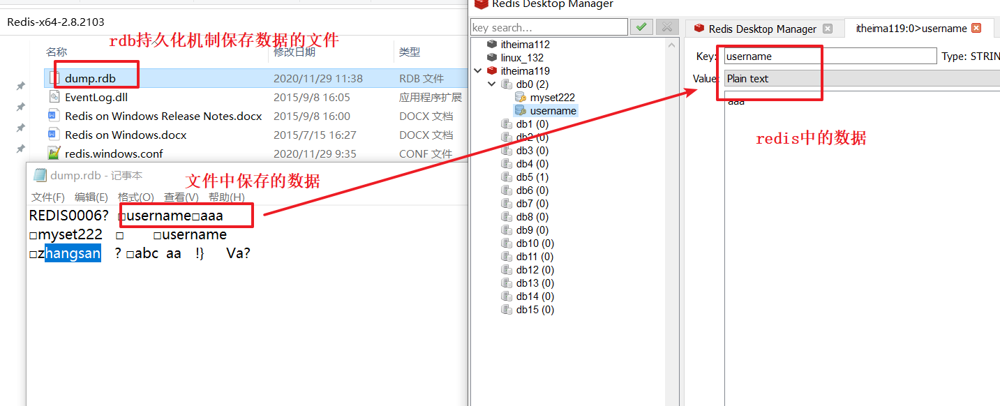


## 5.2 AOF持久化机制

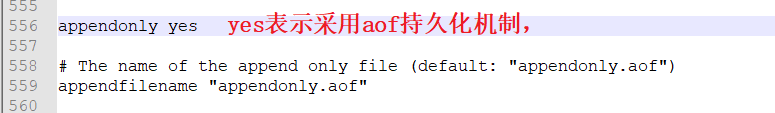


AOF持久化机制：

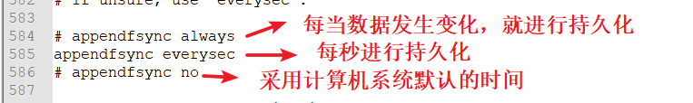


AOF持久化机制保存数据的文件：

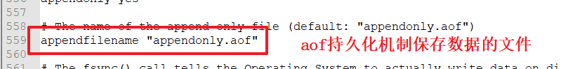


AOF持久化文件保存数据的格式：将当前时间内（上一次持久化到本次持久化这段时间内）新的命令保存到文件中的。

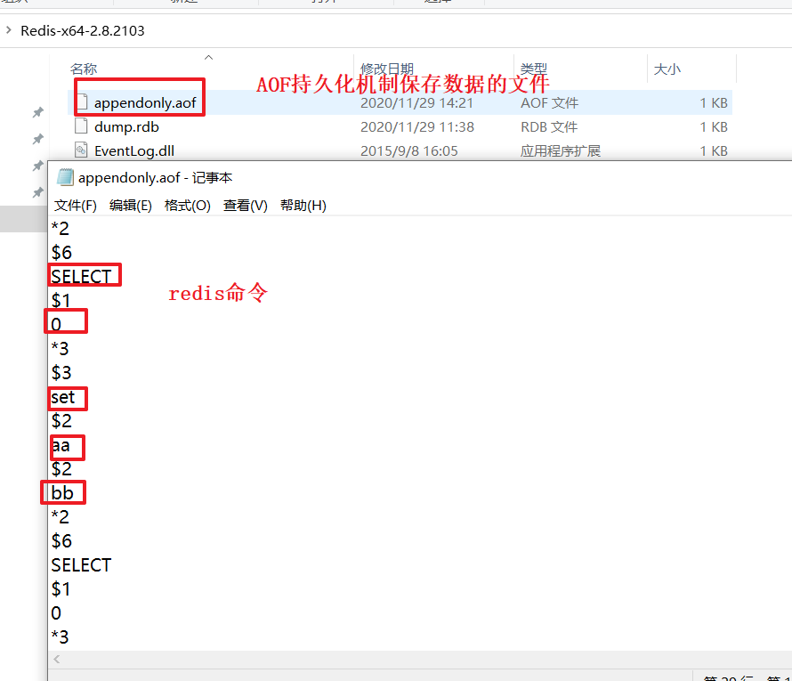

## 5.3 AOF文件的重写机制

~~~
AOF持久化机制下，在数据文件中会存在大量的无效命令（例如：一开始set了，后来del）

所以我们需要清除AOF数据文件中的无效命令。这就是AOF重写机制
说白了：将当前内存中的数据重新生成一份命令文件，替代原有的AOF数据文件。
~~~


如何进行aof重写机制？

~~~
1.手动重写 bgrewriteaof
2.自动重写，需要满足如下3个条件
	a.当前没有重写机制正在执行。
	b.满足配置文件中auto-aof-rewrite-min-size配置的大小
	c.满足配置文件中auto-aof-rewrite-percentage 配置的aof文件增长百分比。
	
~~~


## 5.4 对比

~~~
RDB:
	1.容易丢失数据
	2.io次数少，redis性能较高
	3.数据直接以key：value保存到磁盘上
AOF:
	1.数据安全性更高。
	2.io次数多，redis性能较低。
	3.命令追加的形式保存到磁盘的。
~~~


# 6.redisson（扩展）

~~~
java中需要将user保存到redis中，如何保存？  目前无法存储。
redisson封装了数据保存到redis的操作，让我们注重应用，而无需计较数据如何保存的。
~~~

~~~
https://github.com/redisson/redisson/wiki/2.-%E9%85%8D%E7%BD%AE%E6%96%B9%E6%B3%95
redisson的学习网站
~~~


~~~
使用步骤：
1.引入redisson依赖
2.调用redissonapi操作redis即可。
~~~

```xml
<!--redisson依赖-->
<dependency>
    <groupId>org.redisson</groupId>
    <artifactId>redisson</artifactId>
    <version>3.12.0</version>
</dependency>
```


```java
package com.itheima.redisson;

import com.itheima.pojo.User;
import org.redisson.Redisson;
import org.redisson.api.RBucket;
import org.redisson.api.RedissonClient;
import org.redisson.config.Config;

public class RedissonTest {

    public static void main(String[] args) {
        //创建配置信息独享
        Config config = new Config();
        //useSingleServer：采用单个节点
        config.useSingleServer().setAddress("redis://127.0.0.1:6379");
        //根据配置创建redisson客户端对象
        RedissonClient redisson = Redisson.create(config);

        //数据库的数据
        User user = new User();
        user.setAge(23);
        user.setUsername("zhangsan");
        user.setPassword("123");

        //使用redisson的分布式通用对象桶来操作java中的对象
        /**
         * getBucket(key);   key就是redis的key，
         */
        //获取通用对象桶对象，这个桶对象只是用来暂时的存储数据的。
        RBucket<User> userBucket = redisson.getBucket("user");
        //将user对象保存到redis中。
        //userBucket.set(user);

        //获取redis中的user独享
        User redisUser = userBucket.get();
        System.out.println(redisUser);

        //释放资源
        redisson.shutdown();
    }
}
```


# 7.案例：缓存用户数据

## 7.1缓存的概念

~~~
缓存：将数据保存到内存中，提升数据访问的速度。

java中什么样的数据适合做缓存？一段时间内，不经常改变的数据可以做缓存。
~~~

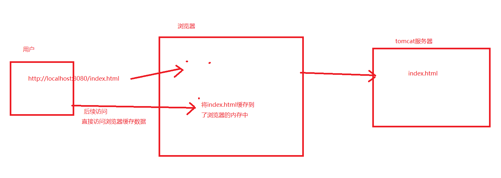


## 7.2案例的流程

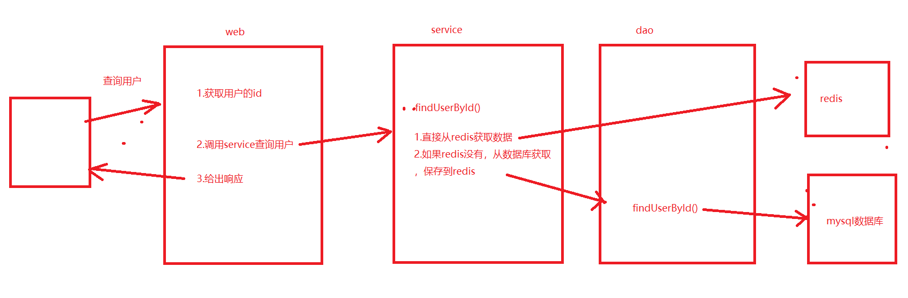


## 7.3 代码实现

工具类：

```java
package com.itheima.utils;

import org.redisson.Redisson;
import org.redisson.api.RedissonClient;
import org.redisson.config.Config;

public class RedissonUtils {

    private static RedissonClient redisson  = null;
    static {
        //创建配置信息独享
        Config config = new Config();
        //useSingleServer：采用单个节点
        config.useSingleServer().setAddress("redis://127.0.0.1:6379");
        //根据配置创建redisson客户端对象
        redisson = Redisson.create(config);
    }

    public static RedissonClient getRedissonClient(){
        return redisson;
    }
}
```

service改造：

```java
@Override
public Contact findUserById(String id) {


    //1.优先从redis获取数据
    RedissonClient client = RedissonUtils.getRedissonClient();
    RBucket<Contact> bucket = client.getBucket("contact:" + id);
    long time3 = System.currentTimeMillis();
    Contact contact = bucket.get();
    long time4 = System.currentTimeMillis();
    if(contact==null){
        //2.如果没有，从数据库获取，并且保存到reids中即可
        ContactMapper contactMapper = SqlSessionUtil.getSession().getMapper(ContactMapper.class);
        long time1 = System.currentTimeMillis();
        contact = contactMapper.findContactById(id);
        long time2=  System.currentTimeMillis();
        bucket.set(contact);
        System.out.println("从数据库获取数据:"+(time2-time1));
    }else{
        System.out.println("从redis获取数据了:"+(time4-time3));
    }


   return contact;
}
```


# 8redis使用时的一些实际问题（扩展）

~~~
1.缓存穿透
	查询一条redis和数据库都不存在的数据的。
	大量的穿透，会导致数据库的压力过大。严重导致数据库的宕机。
	
	如何解决？
	a.针对查询的key进行格式的校验。
	b.限流器（redisson中有）。限定同一个用户在一段时间内访问同一个方法的次数。

2.缓存击穿
	查询一条数据库存在但是redis不存在的数据。
	大量的用户，同时访问同一条数据，然后同时访问数据库，造成数据库压力过大。
	
	如何解决？
	a.加锁。（redisson的分布式锁）


3.雪崩
	大量的数据同时失效。导致大量的用户访问数据时，出现击穿。曹成数据库压力过大。
	
	如何解决？
		针对不同的数据，设置不同的过期时间。
~~~


# 9.总结

~~~
1.reids介绍
	非关系型数据库，以key/value格式存储数据的。数据是保存到内存中。
2.redis的安装
3.redis的命令：（了解）
	set key value
	setex key seconds value: 存储指定的时间。
	expire key seconds 设置key的生存时间
4.jedis：redis命令的基本封装。
5.redis的持久化机制（了解）
	RDB和AOF
6.redisson(侧重于redis的应用。实际应用过程中的解决方案)	
	学习网站
	https://github.com/redisson/redisson/wiki/7.-%E5%88%86%E5%B8%83%E5%BC%8F%E9%9B%86%E5%90%88

7.案例：（需要实现）
8.实际使用redis的问题：
	缓存击穿   缓存穿透   缓存雪崩   缓存预热

9.redis做缓存（重要）
	什么样的数据适合做缓存：  一定时间内，很少改变的数据。
	基于缓存查询的流程：优先查redis缓存，如果没有查询数据库，并且保存到缓存
	基于缓存的数据更新的流程：先更新数据库，然后删除缓存数据。
~~~

