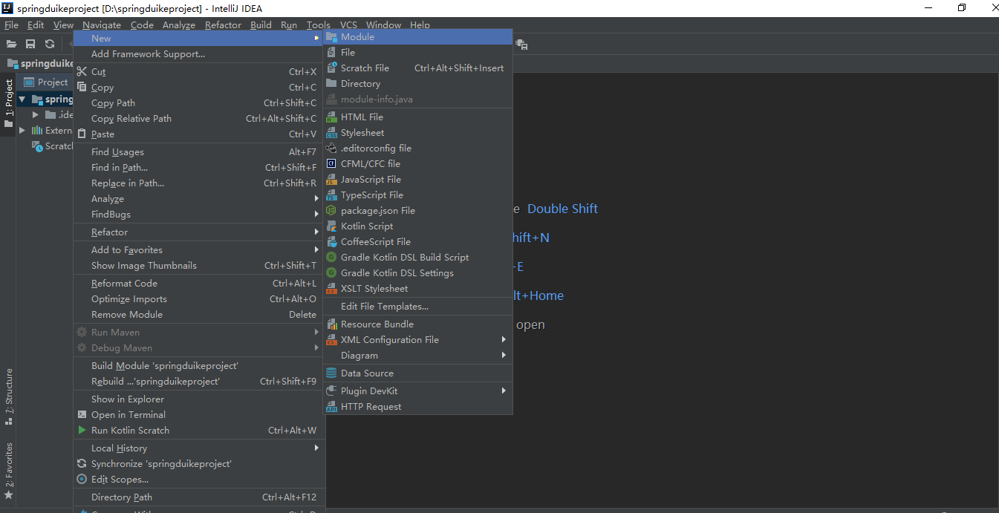
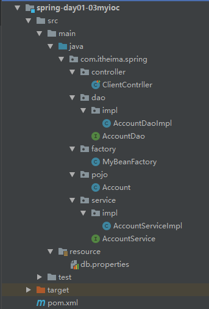
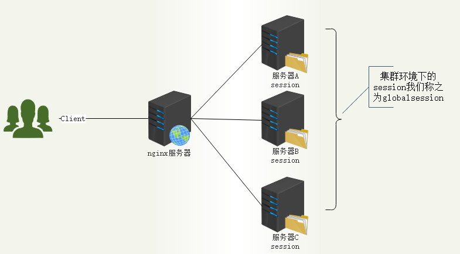

rtypora-copy-images-to: img

# Spring-day01

## 目录

[TOC]


## 学习目标

~~~html
1、了解Spring框架；
2、了解Spring框架的两大核心；
3、理解IOC的概念；
4、掌握Spring基于xml的IOC配置；
5、了解Spring中的工厂结构；
6、掌握Spring的bean标签的配置；
7、掌握spring的di注入机制
~~~

## 第一章 Spring概述

### 1、为什么要学习spring？

如果让本人用一句话去回答这个问题，那么我只能说：在J2EE的学习之路上，spring给我带来了开发的春天，让我们从JSP、sevlet的高耦合的开发中彻底的解救出来。

- spring是目前最主流的框架

- spring是学习后面课程（比如：springboot、springcloud等）的基础

### 2、Spring概述【了解】

#### 【1】Spring是什么

Spring是一个开源框架，Spring的核心是控制反转（IoC）和面向切面（AOP）。简单来说，Spring是一个分层的JavaSE/EE full-stack(一站式) 轻量级开源框架。

轻量级：与EJB对比，依赖资源少，销毁的资源少。
分层： 一站式，每一个层都提供的解决方案

- web层：struts2，spring-MVC

- service层：spring

- dao层：hibernate，mybatis ， jdbcTemplate  --> spring-data


#### 【2】Spring发展历程

Spring的发展历史：
1997年IBM提出了EJB的思想
1998年，SUN制定开发标准规范EJB1.0
1999年，EJB1.1发布
2001年，EJB2.0发布
2003年，EJB2.1发布
2006年，EJB3.0发布

Rod Johnson（spring之父）
	Expert One-to-One J2EE Design and Development(2002)
	阐述了J2EE使用EJB开发设计的优点及解决方案

​	Expert One-to-One J2EE Development without EJB(2004)
	阐述了J2EE开发不使用EJB的解决方式（Spring雏形）

2017年9月份发布了spring的最新版本--spring 5.0通用版（GA）

#### 【3】Spring优势

Spring 出现是为了解决JavaEE 实际问题：

- 方便解耦，简化开发  （IOC）

  Spring就是一个大工厂（容器），可以将所有对象创建和依赖关系维护，交给Spring管理

  Spring工厂是用于生成bean

- AOP编程的支持

  ​	Spring提供面向切面编程，可以方便的实现对程序进行权限拦截、运行监控等功能

- 声明式事务的支持

  ​	只需要通过配置就可以完成对事务的管理，而无需手动编程

- 方便程序的测试

  ​	Spring对Junit4支持，可以通过注解方便的测试Spring程序

- 方便集成各种优秀框架

  ​	Spring不排斥各种优秀的开源框架，其内部提供了对各种优秀框架（如：Struts、Hibernate、MyBatis、Quartz等）的直接支持

- 降低JavaEE API的使用难度

  ​	Spring 对JavaEE开发中非常难用的一些API（JDBC、JavaMail、远程调用等），都提供了封装，使这些API应用难度大大降低

基于这些特性，我们也会俗称Spring为开发架构的**粘合剂**。


#### 【4】Spring体系结构

官网：https://spring.io/

Spring框架至今已集成了20多个模块，这些模块分布在以下模块中：

~~~html
核心容器（Core Container）
数据访问/集成（Data Access/Integration）层
Web层
AOP（Aspect Oriented Programming）模块
植入（Instrumentation）模块
消息传输（Messaging）
测试（Test）模块
~~~


### 3、Spring核心

Spring为企业级开发提供了丰富的功能，这些功能的底层都依赖于它的两个核心特性：

- 控制反转（Inversion of Control，**IOC**）

- 面向切面编程（aspect-oriented programming,**AOP**）

```shell
#画外音
	IOC和AOP是一种技术吗？不！他们是一种思想
```


## 第二章 IOC概念和作用【理解】


### 1、IOC概念

IoC 全称为 Inversion of Control，翻译为 “控制反转”。

#### 【1】控制什么

控制对象的创建和销毁

#### 【2】反转什么

将对象的控制权（创建和销毁）交给IOC容器

### 2、IOC作用

#### 【1】IOC作用概述

```
IOC的作用：解耦
```

 我们知道在面向对象设计的软件系统中，它的底层都是由N个对象构成的，各个对象之间通过相互合作，最终实现系统地业务逻辑 ，如图所示：


IOC理论提出的观点：借助于“第三方”实现具有依赖关系的对象之间的解耦。 如图所示：


  大家看到了吧，由于引进了中间位置的“第三方”，也就是IOC容器，使得A、B、C、D这4个对象没有了耦合关系，齿轮之间的传动全部依靠“第三方”了，全部对象的控制权全部上缴给“第三方”IOC容器，所以，IOC容器成了整个系统的关键核心，它起到了一种类似“粘合剂”的作用，把系统中的所有对象粘合在一起发挥作用，如果没有这个“粘合剂”，对象与对象之间会彼此失去联系，这就是有人把IOC容器比喻成“粘合剂”的由来。 


 我们再来做个试验：把上图中间的IOC容器隐藏，然后再来看看这套系统 


 我们现在看到的画面，就是我们要实现整个系统所需要完成的全部内容。这时候，A、B、C、D这4个对象之间已经没有了耦合关系，彼此毫无联系，这样的话，当你在实现A的时候，根本无须再去考虑B、C和D了，对象之间的依赖关系已经降低到了最低程度。

#### 【2】生活中IOC解耦场景描述

回家场景代码描述

1、创建一个车

2、使用车

3、回收车


#### 【3】场景代码（1）

##### 【2.1】目标

```shell
1、用代码描述用车场景
2、分析依赖的问题
```

##### 【3.2】实现

```shell
#步骤：
    【1】创建pojo、service.controller层
    【2】创建基础类：Audi;CarService；XiaoWang
    【3】使用CarService调用Audi
```

###### 【3.2.1】创建项目

新建spring-day01-01car结构如下





###### 【3.2.2】pojo层

```java
package com.itheima.spring.pojo;

/**
 * @Description：奥迪车
 */
public class Audi {

    /**
     * @Description 启动
     */
    public void start(){
        System.out.println("奥迪启动。。。。");
    }

    /**
     * @Description 运行
     */
    public void run(){
        System.out.println("奥迪运行。。。。");
    }

    /**
     * @Description 停止
     */
    public void stop(){
        System.out.println("奥迪熄火。。。。");
    }
}

```

```java
package com.itheima.spring.pojo;

/**
 * @Description：宝马车
 */
public class Bmw {


    public void start(){
        System.out.println("宝马启动");
    }

    public void run(){
        System.out.println("驾驶宝马");
    }

    public void stop(){
        System.out.println("宝马熄火");
    }
}
```


###### 【3.2.3】service层

```java
package com.itheima.spring.service;

import com.itheima.spring.pojo.Audi;

/**
 * @Description：车辆使用场景
 */
public class CarService {

    /**
     * @Description 回家
     */
    public void gotoHome(){
        Audi audi = new Audi();
        audi.start();
        audi.run();
        audi.start();
        System.out.println("到家了。。。");
    }

    /**
     * @Description 上班
     */
    public void gotoWork(){
        Audi audi = new Audi();
        audi.start();
        audi.run();
        audi.start();
        System.out.println("到家了。。。");
    }

    /**
     * @Description 约会
     */
    public void gotoFindmm(){
        Audi audi = new Audi();
        audi.start();
        audi.run();
        audi.start();
        System.out.println("到约会地点。。。");
    }
}


```

###### 【3.2.4】controller层

```java
package com.itheima.spring.controller;

import com.itheima.spring.service.CarService;
import org.junit.jupiter.api.Test;

/**
 * @Description：小王的生活场景
 */
public class XiaoWang {

    @Test
    public void needGotoHome(){
        CarService carService = new CarService();
        carService.gotoHome();
    }

    @Test
    public void needGotoWork(){
        CarService carService = new CarService();
        carService.gotoWork();
    }

    @Test
    public void needGotoFindMM(){
        CarService carService = new CarService();
        carService.gotoFindMM();
    }
}

```


##### 【3.3】场景小结

~~~html
1、回家、上班、约会多个场景小王都需要依赖车
~~~


```
2、换车之后都要修改CarService的业务代码
```


#### 【4】方案一：interface

##### 【4.1】思考

```
1、咱们想一下，小王是需要一辆宝马？需要一辆奥迪？其实小王只是需要一辆车？
	同学们之前我们是不是学习过接口的概念，这里我们能不能抽象出一个Car的接口呢？
```

##### 【4.2】目标

```shell
1、使用接口与实现分离的方式解耦
```

##### 【4.3】实现

```shell
#步骤：
    【1】添加Car的接口
    【2】Audi、Bmw实现Car接口
    【3】修改CarService
```

###### 【4.3.1】添加Car接口

```java
package com.itheima.spring.pojo;

/**
 * @Description：车接口
 */
public interface Car {

    public void start();

    public void run();

    public void stop();
}

```

###### 	【4.3.2】实现Car接口

```java
package com.itheima.spring.pojo;

/**
 * @Description：奥迪
 */
public class Audi implements Car{

    public void start(){
        System.out.println("奥迪启动");
    }

    public void run(){
        System.out.println("驾驶奥迪");
    }

    public void stop(){
        System.out.println("奥迪熄火");
    }
}

```

```java
package com.itheima.spring.pojo;

/**
 * @Description：宝马
 */
public class Bmw implements Car {

    public void start(){
        System.out.println("宝马启动");
    }

    public void run(){
        System.out.println("驾驶宝马");
    }

    public void stop(){
        System.out.println("宝马熄火");
    }
}

```

###### 	【4.3.3】修改CarService

```java
package com.itheima.spring.service;

import com.itheima.spring.pojo.Audi;
import com.itheima.spring.pojo.Car;

/**
 * @Description：车辆使用场景
 */
public class CarService {

    Car audi = new Audi();

    /**
     * @Description 回家
     */
    public void gotoHome(){
//        Audi audi = new Audi();
        audi.start();
        audi.run();
        audi.start();
        System.out.println("到家了。。。");
    }

    /**
     * @Description 上班
     */
    public void gotoWork(){
//        Audi audi = new Audi();
        audi.start();
        audi.run();
        audi.start();
        System.out.println("到家了。。。");
    }

    /**
     * @Description 约会
     */
    public void gotoFindmm(){
//        Audi audi = new Audi();
        audi.start();
        audi.run();
        audi.start();
        System.out.println("到约会地点。。。");
    }
}

```

##### 【4.4】方案一小结

```shell
1、局部变量提到成员变量解耦
2、接口与实现分离解耦
3、Car bmw = new Bmw();的时候还是需要指定实现类，由此可以看出，没有本质上解决强依赖的问题
#【话外音】
	#难道上班、约会、回家之前小王自己造个车吗？
```

#### 【5】方案二：CarFactroy（2）

##### 【5.1】思考

```
现实生活中，我们不可能在上班、回家、约会之前自己去造车子,而是我们在使用车子之前，去工厂买一辆，车的制造是由汽车工厂完成，我们只需要告诉工厂咱们需要什么牌子的车就好
```

##### 【5.2】目标

```
1、用代码模拟汽车工厂
2、理解IOC控制反转的概念
```

##### 【5.3】实现

```shell
#步骤
	【1】增加汽车工厂
		工厂提供车的方式：可以直接调用的
		生产车过程:知道类全路径，使用反射机制实例化类的对象
	【2】修改CarService，使用工厂
```


###### 	【5.3.1】创建项目

拷贝项目spring-day01-01car建立spring-day01-02car-lv1结构如下：


###### 【5.3.2】添加factory层

```java
package com.itheima.spring.factory;

import com.itheima.spring.pojo.Car;

/**
 * @Description：汽车工厂
 */
public class CarFactroy {

    /**
     * @Description 根据class对象实例化车
     * @param carClass 车辆class对象
     * @return
     */
    public static Car getCar(Class<?> carClass){
        String carClassName = carClass.getName();
        Car car =null;
        try {
            car = (Car) Class.forName(carClassName).newInstance();
        } catch (InstantiationException e) {
            e.printStackTrace();
        } catch (IllegalAccessException e) {
            e.printStackTrace();
        } catch (ClassNotFoundException e) {
            e.printStackTrace();
        }
        return car;
    }

    /**
     * @Description 根据class对象实例化车
     * @param carClassName 车辆class对象全限定名称
     * @return
     */
    public static Car getCar(String carClassName ){
        Car car =null;
        try {
            car = (Car) Class.forName(carClassName).newInstance();
        } catch (InstantiationException e) {
            e.printStackTrace();
        } catch (IllegalAccessException e) {
            e.printStackTrace();
        } catch (ClassNotFoundException e) {
            e.printStackTrace();
        }
        return car;
    }
}


```

###### 【5.3.3】修改CarService

```java
package com.itheima.spring.service;

import com.itheima.spring.factory.CarFactroy;
import com.itheima.spring.pojo.Audi;
import com.itheima.spring.pojo.Car;

/**
 * @Description：车辆使用场景
 */
public class CarService {

    Car audi = CarFactroy.getCar(Audi.class);

    /**
     * @Description 回家
     */
    public void gotoHome(){
//        Audi audi = new Audi();
        audi.start();
        audi.run();
        audi.start();
        System.out.println("到家了。。。");
    }

    /**
     * @Description 上班
     */
    public void gotoWork(){
//        Audi audi = new Audi();
        audi.start();
        audi.run();
        audi.start();
        System.out.println("到公司。。。");
    }

    /**
     * @Description 约会
     */
    public void gotoFindmm(){
//        Audi audi = new Audi();
        audi.start();
        audi.run();
        audi.start();
        System.out.println("到约会地点。。。");
    }
}

```

###### 【5.3.4】方案二小结

```shell
1、程序中汽车工厂生产车的方式：反射实例化汽车对象
2、程序中汽车工厂--IOC容器
```

#### 【6】IOC作用小结

~~~html
IOC-控制反转:
	控制什么：控制对象的创建和销毁；
	反转什么：new-->factory创建；
IOC的作用：
	解耦
IOC是什么：
	工厂： 反射机制实例化对象
~~~


### 3、手写IOC实现【理解】

咱们完成了一个生活中的场景解耦描述，知道了：

- IOC就是一个工厂

#### 【1】思考

~~~properties
1、手写IOC工厂采用什么方式实例化对象？
	方案:反射机制实例化类的对象

2、能不能把实例化的对象，事先加载到集合中？选取什么数据结构的集合合适？
	方案:对象名和对象全限定名是键值对结构，又需要便于存储与查找，使用map集合更适合！
	
3、类似“com.itheima.spring.pojo.Audi”的配置信息怎么处理?
	方案:放到properties文件
~~~

#### 【2】目标

~~~html
1、手写IOC
	反射机制实例化对象
	存储到集合容器
	使用properties文件存储配置
~~~

#### 【3】实现（3）


```
1、创建项目及J2EE三层架构
2、创建pojo对象
3、创建dao对象
4、创建service对象
5、创建controller对象
6、创建properties文件 
7、factory工厂类【重点】
	【1】事先创建集合容器
	【2】事先加载properties文件内容
	【3】反射机制实例化bean对象，并且放入集合容器
	【4】公共的访问方法
```

"accountDao",beanObject

##### 【3.1】创建项目

新建项目spring-day01-03myioc结构如下



```java
package com.heima.spring.pojo;

/**
 * @Description：账户实体类
 */
public class Account {

    //账户编号
    private String Id;

    //账户所有者
    private String accountName;

    //账户余额
    private Float money;

    public Account() {
    }

    public String getId() {
        return Id;
    }

    public void setId(String id) {
        Id = id;
    }

    public String getAccountName() {
        return accountName;
    }

    public void setAccountName(String accountName) {
        this.accountName = accountName;
    }

    public Float getMoney() {
        return money;
    }

    public void setMoney(Float money) {
        this.money = money;
    }

    @Override
    public String toString() {
        return "Account{" +
                "Id='" + Id + '\'' +
                ", accountName='" + accountName + '\'' +
                ", money=" + money +
                '}';
    }
}

```

##### 【3.2】dao层

```java
package com.itheima.spring.dao;

/**
 * @Description：账户dao层
 */
public interface AccountDao {

    /**
     * @Description 新增
     */
    void saveAccount();

    /**
     * @Description 删除
     */
    void delAccount();

    /**
     * @Description 修改
     */
    void updateAccout();

    /**
     * @Description 查询
     */
    void findAccount();


}


```

```java
package com.itheima.spring.dao.impl;

import com.itheima.spring.dao.AccountDao;
import com.itheima.spring.pojo.Account;

/**
 * @Description：
 */
public class AccountDaoImpl implements AccountDao {

    private static  Account account;

    static {
        account = new Account();
        account.setId("010101");
        account.setAccountName("张三");
        account.setMoney(2000F);
    }
    @Override
    public void saveAccount() {
        System.out.println("保存:"+account.toString());
    }

    @Override
    public void delAccount() {
        System.out.println("删除:"+account.toString());
    }

    @Override
    public void updateAccout() {
        System.out.println("修改:"+account.toString());
    }

    @Override
    public void findAccount() {
        System.out.println("查询:"+account.toString());
    }
}


```

##### 【3.3】servic层

```java
package com.itheima.spring.service;

import com.itheima.spring.dao.AccountDao;

/**
 * @Description：用户业务层接口
 */
public interface AccountService {

    /**
     * @Description 新增
     */
    void saveAccount();

    /**
     * @Description 删除
     */
    void delAccount();

    /**
     * @Description 修改
     */
    void updateAccout();

    /**
     * @Description 查询
     */
    void findAccount();

    void setAccountDao(AccountDao accountDao);
}


```

```java
package com.itheima.spring.service.impl;

import com.itheima.spring.dao.AccountDao;
import com.itheima.spring.service.AccountService;

/**
 * @Description：用户业务层接口实现
 */
public class AccountServiceImpl implements AccountService {

    private AccountDao accountDao;

    @Override
    public void saveAccount() {
        accountDao.saveAccount();
    }

    @Override
    public void delAccount() {
        accountDao.delAccount();
    }

    @Override
    public void updateAccout() {
        accountDao.updateAccout();
    }

    @Override
    public void findAccount() {
        accountDao.findAccount();
    }

    @Override
    public void setAccountDao(AccountDao accountDao) {
        this.accountDao = accountDao;
    }
}


```

##### 【3.4】factory层

在resources目录中建立

db.properties

```properties
accountDao = com.itheima.spring.dao.impl.AccountDaoImpl
accountService = com.itheima.spring.service.impl.AccountServiceImpl
```

```java
package com.itheima.spring.factory;

import javafx.beans.binding.ObjectExpression;

import java.io.IOException;
import java.util.*;

/**
 * @Description：bean工厂
 */
public class BeanFactory {

    //1、事先存储容器
    private static Map<String, Object> map = new HashMap<>();
    //2、加载配置文件
    static {
        Properties properties = new Properties();
        try {
            properties.load(BeanFactory.class.getClassLoader().getResourceAsStream("db.properties"));
            Enumeration<?> enumeration = properties.propertyNames();
            while (enumeration.hasMoreElements()) {
                String key = (String) enumeration.nextElement();
                String value = (String) properties.get(key);
                //3、实例化bean
                Object beanObject = Class.forName(value).newInstance();
                //4、放入容器
                map.put(key,beanObject);
            }
        } catch (IOException e) {
            e.printStackTrace();
        } catch (IllegalAccessException e) {
            e.printStackTrace();
        } catch (InstantiationException e) {
            e.printStackTrace();
        } catch (ClassNotFoundException e) {
            e.printStackTrace();
        }
    }


    //5、公共获得bean
    public static Object getBean(String calssName){
       return map.get(calssName);
    }
}


```

##### 【3.5】controller层

~~~java
package com.itheima.spring.controller;

import com.itheima.spring.dao.AccountDao;
import com.itheima.spring.factory.BeanFactory;
import com.itheima.spring.service.AccountService;
import com.itheima.spring.service.Impl.AccountServiceImpl;
import org.junit.Test;

/**
 * @Description：
 */
public class ClientController {
    

   @Test
    public void saveAccount() {
       AccountService accountService = (AccountService) BeanFactory.getBean("accountService");
       accountService.setAccountDao((AccountDao) BeanFactory.getBean("accountDao"));
       accountService.saveAccount();
    }

}


~~~


#### 【4】手写IOC小结

~~~html
我们通过使用工厂模式，实现了表现层——业务层、业务层——持久层的解耦。 
	【实现思路】：
		工厂+反射+配置文件
	【核心思想】：
		【1】读取配置文件中类的全限定名通过反射机制创建对象。  
		【2】把创建出来的对象事先都存起来，当我们使用时可以直接从存储容器中获取。 
			存哪去？   
				由于我们是很多对象，肯定要找个集合来存。这时候有 Map 和 List 供选择。      
				到底选 Map 还是 List 就看我们有没有查找需求。有查找需求，选 Map。   
				所以我们的答案就是在应用加载时，创建一个 Map，用于存放bean对象。
				我们把这个 map 称之为容器。  
			什么是IOC工厂  
				事先加载bean，并且提供一个直接获取bean的方法。
			什么是控制反转    
				主动new对象方式--被动从容器中获取
~~~


## 第三章 基于xml的spring-IOC【重点】

### 1、【入门案例】xml的spring-IOC（4）

#### 【1】思考

```xml
1、我们采用工厂+反射的方式实现了手写IOC工厂，那么spring-IOC的工厂是不是也类似？
	spring框架提供了一个大工厂接口：ApplicationContext==》Beanfactroy

2、手写IOC中的配置文件类型是properties，那么spring-IOC的配置采取的是什么类型？
    spring使用XML格式的文件存储配置
	<bean id="唯一标识" 
          class="实现类的全限定名">
	</bean>

3、spring-IOC是怎么加载配置文件的呢？
	ApplicationContext工厂使用ClassPathXmlApplicationContext加载配置文件

4、手写IOC中的BeanFactory提供一个公共获得bean的方法，那spring-ioc是不是有类似的方法？
	ApplicationContext工厂使用getBean(“id”)方法，用于根据bean的名称获取实例化对象

```

#### 【2】目标

```
1、掌握spring-IOC工厂的创建
2、掌握bean标签的基本配置
3、掌握spring-IOC工厂获得实例化对象的方式
```

#### 【3】实现

```
步骤：
	1、导入依赖
	2、编写bean.xml文件替换properties
	3、使用ClassPathXmlApplicationContext加载bean.xml配置文件
	4、使用ApplicationContext工厂的getBean()方法获得bean
```


##### 【3.1】创建项目

拷贝spring-day01-03myIoc创建spring-day01-04spring-ioc-xml结构如下


##### 【3.2】pom.xml依赖

```xml
<?xml version="1.0" encoding="UTF-8"?>

<project xmlns="http://maven.apache.org/POM/4.0.0" xmlns:xsi="http://www.w3.org/2001/XMLSchema-instance"
  xsi:schemaLocation="http://maven.apache.org/POM/4.0.0 http://maven.apache.org/xsd/maven-4.0.0.xsd">
  <modelVersion>4.0.0</modelVersion>

  <groupId>com.itheima.spring</groupId>
  <artifactId>spring-day01-04spring-ioc-xml</artifactId>
  <version>1.0-SNAPSHOT</version>

  <name>spring-day01-04spring-ioc-xml</name>
  <!-- FIXME change it to the project's website -->
  <url>http://www.example.com</url>

  <properties>
    <project.build.sourceEncoding>UTF-8</project.build.sourceEncoding>
    <!-- spring版本 -->
    <spring.version>5.1.11.RELEASE</spring.version>
  </properties>

  <dependencies>
    <dependency>
      <groupId>junit</groupId>
      <artifactId>junit</artifactId>
      <version>4.11</version>
    </dependency>
    <dependency>
      <groupId>org.springframework</groupId>
      <artifactId>spring-context</artifactId>
      <version>${spring.version}</version>
    </dependency>
  </dependencies>

  <build>
  </build>
</project>

```

##### 【3.3】spring配置文件bean.xml


初建时候bean.xml的结构如下

```xml
<?xml version="1.0" encoding="UTF-8"?>
<beans xmlns="http://www.springframework.org/schema/beans"
       xmlns:xsi="http://www.w3.org/2001/XMLSchema-instance"
       xsi:schemaLocation="http://www.springframework.org/schema/beans
       http://www.springframework.org/schema/beans/spring-beans.xsd">

</beans>
```


全部改写完成后bean.xml的配置

```xml
<?xml version="1.0" encoding="UTF-8"?>
<beans xmlns="http://www.springframework.org/schema/beans"
       xmlns:xsi="http://www.w3.org/2001/XMLSchema-instance"
       xsi:schemaLocation="http://www.springframework.org/schema/beans
       http://www.springframework.org/schema/beans/spring-beans.xsd">
    <!--bean
        作用:
            声明类交给spring容器
        属性：
            id: 唯一标识
            class:全路径限定名称
        细节：
            默认使用无参构造函数实例化-->
    <bean id="accountDao" class="com.itheima.spring.dao.Impl.AccountDaoImpl"/>

    <bean id="accountService" class="com.itheima.spring.service.Impl.AccountServiceImpl"/>
</beans>
```

##### 【3.4】改造AccountService

```java
package com.itheima.spring.service;

import com.itheima.spring.dao.AccountDao;

/**
 * @Description：账户操作接口
 */
public interface AccountService {

    /**
     * @Description 创建账户
     */
    void createAccount();

    /**
     * @Description 传入accountDao
     * @param 
     * @return 
     */
    void setAccountDao(AccountDao accountDao);
}

```

```java
package com.itheima.spring.service.impl;

import com.itheima.spring.dao.AccountDao;
import com.itheima.spring.dao.impl.AccountDaoImpl;
import com.itheima.spring.service.AccountService;

/**
 * @Description：账户操作实现
 */
public class AccountServiceImpl implements AccountService {

    AccountDao accountDao ;

    @Override
    public void createAccount() {
        accountDao.createAccount();
    }

    @Override
    public void setAccountDao(AccountDao accountDao) {
        this.accountDao = accountDao;
    }
}

```


##### 【3.5】改造ClientController

```java
package com.itheima.spring.controller;

import com.itheima.spring.dao.AccountDao;
import com.itheima.spring.service.AccountService;
import com.itheima.spring.service.impl.AccountServiceImpl;
import org.junit.Test;
import org.springframework.context.ApplicationContext;
import org.springframework.context.support.ClassPathXmlApplicationContext;

/**
 * @Description：客户端
 */
public class ClientContrller {

    /**
     * ApplicationContext:spring-IOC容器
     * ClassPathXmlApplicationContext：容器实现类，加载配置文件
     * applicationContext.getBean：获得容器中的bean对象
     */
    @Test
    public void createAccount(){
        ApplicationContext applicationContext = new ClassPathXmlApplicationContext("bean.xml");
        AccountDao accountDao = (AccountDao) applicationContext.getBean("accountDao");
        AccountService accountService = (AccountService) applicationContext.getBean("accountService");
        accountService.setAccountDao(accountDao);
        accountService.createAccount();
    }
}

```


#### 【4】入门案例小结

~~~html
spring-IOC入门案例，我们了解如下内容：
    1、工厂类：ApplicationContext
    2、工厂配置:
        文件类型：xml
        方式:
        <!--配置accountDao、accountServic说明：
              标签：
                  bean：配置javaBean对象
              属性：
                  id：bean的唯一标识名称
                  class：类的全路径信息
              细节：
                  默认使用无参数构造方法，创建对象
        -->
        <bean id="accountDao" class="com.heima.spring.dao.impl.AccountDaoImpl"></bean>
    3、工厂加载配置:
        ApplicationContext通过ClassPathXmlApplicationContext加载bean.xml配置
    4、工厂获得bean：
        ApplicationContext使用getBean()方法，用于根据bean的名称获取实例化对象
~~~


## 第四章 SpringIOC工厂类【了解】

  

### 1、BeanFactory

#### 【1】作用

Spring里面最顶层的接口，提供了最简单的容器的功能，只定义了实例化对象和拿对象的功能；

#### 【2】方法

```java
public interface BeanFactory {
    //对FactoryBean的转义定义，因为如果使用bean的名字检索FactoryBean得到的对象是工厂生成的对象
    String FACTORY_BEAN_PREFIX = "&";
    
    //根据bean的名字，在IOC容器中得到bean实例，
    *Object getBean(String name) throws BeansException;
    
    //根据bean的名字，在IOC容器中得到bean实例，args：显式参数（必须为非单例模式）
    Object getBean(String name, Object... args) throws BeansException;
    
    //根据bean的名字获得对象，并转换为Class类型
    *<T> T getBean(String name, Class<T> requiredType);
    
    //根据bean的类型获得对象（必须是拥有唯一实现类）
    *<T> T getBean(Class<T> requiredType) throws BeansException;
    
    //根据bean的类型获得对象，args：显式参数
    <T> T getBean(Class<T> requiredType, Object... args) throws BeansException;
    
    //这里提供对bean的检索，看看是否在IOC容器有这个名字的bean
    *boolean containsBean(String name);
    
    //判断这个bean是不是单例 
    *boolean isSingleton(String name) throws NoSuchBeanDefinitionException;
    
    //同时判断这个bean是不是多例 
    *boolean isPrototype(String name) throws NoSuchBeanDefinitionException;
    
    //这里得到bean实例的Class类型  
    *Class<?> getType(String name) throws NoSuchBeanDefinitionException;
    
    //这里得到bean的别名，如果根据别名检索，那么其原名也会被检索出来  
    *String[] getAliases(String name);
```

### 2、ApplicationContext

#### 【1】作用

应用上下文，继承BeanFactory接口，它是Spring的更高级的容器，提供了更多的有用的功能；

1) 国际化（MessageSource）

2) 访问资源，如URL和文件（ResourceLoader）

3) 载入多个（有继承关系）上下文 ，使得每一个上下文都专注于一个特定的层次，比如应用的web层  

4) 消息发送、响应机制（ApplicationEventPublisher）

5) AOP（拦截器）

#### 【2】实现类

**ClassPathXmlApplicationContext**：

~~~html
从类的根路径下加载配置文件  推荐使用这种 
~~~

**FileSystemXmlApplicationContext**

```
从硬盘路径下加载配置文件
```

**AnnotationConfigApplicationContext**

```
基于Java的配置类加载Spring的应用上下文配置
```


~~~java
@Test
    public void createAccountTest(){
        //加载配置文件
        ApplicationContext applicationContext =
                new ClassPathXmlApplicationContext("classpath:bean.xml");
        //获得bean
        AccountDao accountDao = (AccountDao) applicationContext.getBean("accountDao");
        AccountServic accountServic = (AccountServic) applicationContext.getBean("accountServic");
        //set方法指定accountDao
        accountServic.setAccountDao(accountDao);
        //创建账户
        accountServic.createAccount();
    }
~~~


### 3、加载顺序

#### 【1】思考

```
BeanFactory、ApplicationContext都是容器，那么他们的加载顺序有什么不同？
```


#### 【2】目的

```
了解BeanFactory和ApplicationContext的加载顺序
```

#### 【3】实现（5）

```
步骤：
	1、观察ApplicationContext的加载方式
	2、观察BeanFactory的加载方式
	3、比较一下加载顺序
```


##### 【3.1】创建项目

拷贝项目spring-day01-04spring-ioc-xml创建spring-day01-05BeanFactory-ApplicationContext结构如下


在AccountDaoImpl中增加构造函数

```java
public AccountDaoImpl() {
    System.out.println("AccountDaoImpl的实例已经创建");
}
```

##### 【3.3】改造ClientController

```java
package com.itheima.spring.controller;

import com.itheima.spring.dao.AccountDao;
import com.itheima.spring.service.AccountService;
import org.junit.Test;
import org.springframework.beans.factory.BeanFactory;
import org.springframework.beans.factory.xml.XmlBeanFactory;
import org.springframework.context.ApplicationContext;
import org.springframework.context.support.ClassPathXmlApplicationContext;
import org.springframework.core.io.ClassPathResource;
import org.springframework.core.io.Resource;

/**
 * @Description：测试
 */
public class ClientController {


   @Test
    public void saveAccount() {

       /**
        * Spring-IOC容器：ApplicationContext
        * 构建方式：通过ClassPathXmlApplicationContext加载配置文件
        * 使用bean:getBean
        */
       System.out.println("======ApplicationContext开始创建容器=====");
       ApplicationContext applicationContext = new ClassPathXmlApplicationContext("bean.xml");
       System.out.println("======ApplicationContext创建容器完成=====");
       applicationContext.getBean("accountDao");

       System.out.println("======分割线==========");

       System.out.println("======BeanFactory开始创建容器=====");
       Resource resource = new ClassPathResource("bean.xml");
       BeanFactory beanFactory = new XmlBeanFactory(resource);
       System.out.println("======BeanFactory创建容器完成=====");
       beanFactory.getBean("accountDao");
    }

}


```

【3.4】加载顺序


#### 【4】加载顺序小结

```
1.BeanFactory是顶层接口
2.ApplicationContext是子接口
3.它们最大的区别是创建对象的时间不一样(单例的)：
	【BeanFactory】采用的是延迟加载的思想。即什么时候使用对象，什么时候创建
	【ApplicationContext】采用立即创建的思想。即一加载配置文件，立即就创建
```


## 第五章 bean标签详解【重点】

### 1、bean标签作用

```
bean作用：  
	用于配置对象让spring 来创建的。 
    【细节】
	默认情况下调用类的无参构造函数。
```

### 2、bean标签基本属性

| 属性  | 说明                                                         |
| ----- | ------------------------------------------------------------ |
| id    | bean的唯一标识名称                                           |
| class | 实现类的全限定名称                                           |
| name  | bean的名称<br/>     * 多个别名使用 ”,” 分割<br/>     * bean与bean的别名不可以重复 |

>入门案例中我们已经基本使用过

```xml
<?xml version="1.0" encoding="UTF-8"?>
<beans xmlns="http://www.springframework.org/schema/beans"
       xmlns:xsi="http://www.w3.org/2001/XMLSchema-instance"
       xsi:schemaLocation="http://www.springframework.org/schema/beans
       http://www.springframework.org/schema/beans/spring-beans.xsd">
    
    <bean id="accountDao" name="accountDao2,accountDao3" class="com.itheima.spring.dao.impl.AccountDaoImpl"></bean>

    <bean id="accountService"  class="com.itheima.spring.service.impl.AccountServiceImpl"></bean>

</beans>
```


### 3、bean标签作用范围

| 属性  | 说明                                                         |
| ----- | ------------------------------------------------------------ |
| scope | 指定对象的作用范围。    <br/>		* singleton 【默认】: 单例，所有的请求都用一个对象来处理  <br/>		* prototype : 多例，每个请求用一个新的对象来处理 <br/>		* request : WEB 项目中,将对象存入到 request 域中.    <br/>		* session : WEB 项目中,将对象存入到 session 域中.    <br/>		* global session : WEB 项目中,应用在集群环境.如果没有集群环境那么相当于session |

global session图解



#### 【1】思考

```
单例、多例他们分别在什么场景中使用？他们有什么区别？
spring默认单例，不需要修改，不要随意定义成员变量。
多例：资源共用
```

#### 【2】目标

~~~html
1、掌握scope的单例、多例的配置
2、掌握单例和多例的区别
~~~


#### 【3】bean作用域实例（6）

~~~html
步骤：
	1、改造ClientController多次获得对象
	2、装配bean到spring的IOC容器中，修改bean标签中scope的作用域
	3、观察不同作用域下获得的对象内存地址是否一致
~~~

##### 【3.1】创建项目

拷贝项目spring-day01-04spring-ioc-xml创建spring-day01-06bean-scope结构如下


改造ClientController

~~~java
package com.itheima.spring.controller;

import com.itheima.spring.dao.AccountDao;
import com.itheima.spring.service.AccountService;
import org.junit.Test;
import org.springframework.beans.factory.BeanFactory;
import org.springframework.beans.factory.xml.XmlBeanFactory;
import org.springframework.context.ApplicationContext;
import org.springframework.context.support.ClassPathXmlApplicationContext;
import org.springframework.core.io.ClassPathResource;
import org.springframework.core.io.Resource;

import javax.sound.midi.Soundbank;

/**
 * @Description：测试
 */
public class ClientController {
	

    @Test
    public void saveAccount() {

        /**
         * Spring-IOC容器：ApplicationContext
         * 构建方式：通过ClassPathXmlApplicationContext加载配置文件
         * 使用bean:getBean
         */
        ApplicationContext applicationContext = new ClassPathXmlApplicationContext("bean.xml");
        AccountDao accountDaoA = (AccountDao) applicationContext.getBean("accountDao");
        AccountDao accountDaoB = (AccountDao) applicationContext.getBean("accountDao");

        System.out.println("accountDaoA的内存地址："+accountDaoA.hashCode());
        System.out.println("accountDaoB的内存地址："+accountDaoB.hashCode());

    }

}


~~~


##### 【3.2】Bean【默认：singleton】

使用bean标签在bean.xml中装配accountDao的scope="singleton"

~~~xml
<?xml version="1.0" encoding="UTF-8"?>
<beans xmlns="http://www.springframework.org/schema/beans"
       xmlns:xsi="http://www.w3.org/2001/XMLSchema-instance"
       xsi:schemaLocation="http://www.springframework.org/schema/beans
       http://www.springframework.org/schema/beans/spring-beans.xsd">
    <bean id="accountDao" class="com.heima.spring.dao.impl.AccountDaoImpl" scope="singleton"></bean>

    <!--创建accountServic-->
    <bean id="accountServic" class="com.heima.spring.service.impl.AccountServicImpl"></bean>
</beans>
~~~

##### 【3.3】singleton运行结果


##### 【3.4】bean【多例：prototype】

使用bean标签在bean.xml中装配accountDao的scope="prototype"

```xml
<?xml version="1.0" encoding="UTF-8"?>
<beans xmlns="http://www.springframework.org/schema/beans"
       xmlns:xsi="http://www.w3.org/2001/XMLSchema-instance"
       xsi:schemaLocation="http://www.springframework.org/schema/beans
       http://www.springframework.org/schema/beans/spring-beans.xsd">
    <bean id="accountDao" class="com.heima.spring.dao.impl.AccountDaoImpl" scope="prototype"></bean>

    <!--创建accountServic-->
    <bean id="accountServic" class="com.heima.spring.service.impl.AccountServicImpl"></bean>
</beans>
```


#####  【3.5】prototype运行结果


#### 【4】bean作用域小结

```
1、单例和多里创建方式、内存地址
	【singleton单例】：所有请求只创建一个对象，内存地址相同
	【prototype多例】：每次请求都创建新的对象，内存地址不同
2、为什么使用单例?
	节省内存、CPU的开销，加快对象访问速度
3、为什么使用多例?
	如果你给controller中定义很多的属性，那么单例肯定会出现竞争访问，不要在controller层中定义成员变量(dao、service注入的bean)
	当web层的对象是有状态的时候 使用多例，防止并发情况下的互相干扰
4、单例、多例的场景
	单例===》spring中的Dao,Service，controller都是单例的
	多例====》struts2的Action是多实例
```

### 4、bean生命周期

sevlet的生命周期回顾

```
1.被创建：执行init方法，只执行一次

　　--默认情况下，第一次被访问时，Servlet被创建，然后执行init方法；

　　--可以配置执行Servlet的创建时机；

2.提供服务：执行service的doGet、doPost方法，执行多次

3.被销毁：当Servlet服务器正常关闭时，执行destroy方法，只执行一次
```


spring-IOC中不同作用域中bean的生命周期

|                       | 作用范围               | 生命周期                                                     |
| --------------------- | ---------------------- | ------------------------------------------------------------ |
| 单例scope=“singleton” | 所有请求只创建一次对象 | 出生：应用加载，创建容器，对象就被创建<br/>活着：只要容器在，对象一直活着。<br/>死亡：应用卸载，销毁容器，对象就被销毁 |
| 多例scope="prototype" | 每次请求都创建对象     | 出生：应用加载，创建容器，对象使用创建<br/>活着：只要容器在，对象一直活着。<br/>死亡：对象长时间不用，被垃圾回收器回收 |

生命周期方法相关

| 名称           | 说明                     |
| -------------- | ------------------------ |
| init-method    | 指定类中的初始化方法名称 |
| destroy-method | 指定类中销毁方法名称     |


#### 【1】目标

~~~html
1、掌握bean的生命周期配置方式
2、单例和多例下bean的生命周期的区别。
~~~

#### 【2】bean生命周期实例（7）

```
步骤：
	1、创建LifecycBeanServic类
	2、装配LifecycBeanServic
	3、创建测试类
	4、观察默认单例下生命周期
	5、观察多例下生命周期
```


##### 【2.1】创建项目

新建项目spring-day01-07bean-lifecycle


~~~java

package com.itheima.spring.service;

/**
 * @Description：生命周期测试服务
 */
public class LifecycleService {

    public LifecycleService() {
        System.out.println("LifecycleService构造");
    }

    public void init(){
        System.out.println("LifecycleService初始化");
    }

    public void doJob(){
        System.out.println("LifecycleService工作中");
    }

    public void destroy(){
        System.out.println("LifecycleService销毁");
    }
}

~~~


##### 【2.3】装配LifecycleBean

装配bean并且设置问单例：

~~~xml
<?xml version="1.0" encoding="UTF-8"?>
<beans xmlns="http://www.springframework.org/schema/beans"
       xmlns:xsi="http://www.w3.org/2001/XMLSchema-instance"
       xsi:schemaLocation="http://www.springframework.org/schema/beans
       http://www.springframework.org/schema/beans/spring-beans.xsd">

    <bean id="lifecycBeanServic" class="com.heima.spring.service.LifecycBeanServic"
          scope="singleton" init-method="init" destroy-method="destory"></bean>
</beans>
~~~


##### 【2.4】创建ClientController

~~~java
package com.itheima.spring.controller;

import com.itheima.spring.service.LifecycleService;
import org.junit.Test;
import org.springframework.context.ApplicationContext;
import org.springframework.context.support.ClassPathXmlApplicationContext;

/**
 * @Description：客户端
 */
public class ClientContrller {

    /**
     * ApplicationContext:spring-IOC容器
     * ClassPathXmlApplicationContext：容器实现类，加载配置文件
     * applicationContext.getBean：获得容器中的bean对象
     */
    @Test
    public void createAccount(){
        ApplicationContext applicationContext = new ClassPathXmlApplicationContext("bean.xml");
        System.out.println("applicationContext初始化完成");
        LifecycleService lifecycleService = applicationContext.getBean("lifecycleService", LifecycleService.class);
        lifecycleService.doJob();
        System.out.println("applicationContext容器关闭");
        ((ClassPathXmlApplicationContext) applicationContext).close();

    }
}

~~~

##### 【2.5】单例模式下生命周期：


##### 【2.6】多例模式下生命周期

将配置文件中的单例修改为多例

~~~xml
<?xml version="1.0" encoding="UTF-8"?>
<beans xmlns="http://www.springframework.org/schema/beans"
       xmlns:xsi="http://www.w3.org/2001/XMLSchema-instance"
       xsi:schemaLocation="http://www.springframework.org/schema/beans
       http://www.springframework.org/schema/beans/spring-beans.xsd">

    <bean id="lifecycBeanServic" class="com.heima.spring.service.LifecycBeanServic"
          scope="prototype"  init-method="init" destroy-method="destory"></bean>
</beans>

~~~

再次执行方法发现,LifecycleBean被延迟加载了，并且只执行了初始化方法-init,没有执行销毁方法destory.


#### 【3】bean生命周期小结

~~~html
单例对象：scope="singleton"
	一个应用只有一个对象的实例。它的作用范围就是整个应用。
	生命周期：
		对象出生：当应用加载，创建容器时，对象就被创建了。
		对象活着：只要容器在，对象一直活着。
		对象死亡：当应用卸载，销毁容器时，对象就被销毁了。

多例对象：scope="prototype"
	每次访问对象时，都会重新创建对象实例。
	生命周期：
		对象出生：当使用对象时，创建新的对象实例（getBean）。
		对象活着：只要对象在使用中，就一直活着。
		对象死亡：当对象长时间不用时，被垃圾回收器回收。
生命周期方法：
init-method：指定类中的初始化方法名称 
destroy-method：指定类中销毁方法名称
~~~

### 5、bean的实例化方式(8)

bean的实例化方式有以下3种：

- bean缺省构造函数创建    
- 静态factory方法创建   
- 实例化factory方法创建

#### 【1】目标

```
1、掌握bean实例化的三种方式
2、了解3中方式应用场景
```

#### 【2】创建项目

新建项目spring-day01-08bean-instance结构如下


#### 【3】缺省构造函数方式【重点】

##### 【3.1】配置方式

~~~xml
<!--空的构造方法实例化-->
<bean id="account" class="com.heima.spring.pojo.Account"></bean>
~~~

##### 【3.2】注意事项

~~~html
缺省构造函数实例化Bean的方式是Spring中默认的实例化方式；
被实例化的Bean中必须有无参构造；
~~~


#### 【4】静态工厂方法方式

##### 【4.1】配置方式

~~~html
<!--静态工厂实例化-->
    <bean id="accountStatic" class="com.heima.spring.factory.StaticFactory" factory-method="createAccount"></bean>
~~~

##### 【4.2】静态工厂代码

**步骤一：创建静态工厂**

~~~java
package com.heima.spring.factory;

import com.heima.spring.pojo.Account;

/**
 * @Description：静态工厂
 */
public class StaticFactory {

    public static Account createAccount(){
        System.out.println("静态工厂构建！");
        return  new Account();
    }
}

~~~

**步骤二：配置静态工厂**

通过静态工厂中的createAccount方法给我们创建bean

~~~xml
<!--静态工厂实例化-->
    <bean id="accountStatic" class="com.heima.spring.factory.StaticFactory" factory-method="createAccount"></bean>
~~~

#### 【5】实例工厂方法方式

##### 【5.1】配置方式

~~~xml
<!--实例化工厂实例化-->
<bean id="instanceFactory" class="com.heima.spring.factory.InstanceFactory"></bean>
<bean id="accountInstance" factory-bean="instanceFactory" factory-method="createAccount"></bean>
~~~

##### 【5.2】实例工厂代码

**步骤一：创建实例工厂**

```java
package com.heima.spring.factory;

import com.heima.spring.pojo.Account;

/**
 * @Description：实例化工厂
 */
public class InstanceFactory {

    public Account createAccount(){
        System.out.println("实例工厂构建！");
        return  new Account();
    }
    
    public User createUser(){
        System.out.println("实例工厂构建！");
        return  new User();
    }
}

```

#### 【6】bean实例化小结

~~~html
【缺省构造函数方式】
	说明：
		在默认情况下会根据默认缺省构造函数来创建类对象。如果bean中没有默认无参构造函数，将会创建失败。
	场景：
		当各个bean的业务逻辑相互比较独立时，或者与外界关联较少时可以使用

【静态工厂方法方式】
	说明：
        使用工厂中的静态方法创建对象，并装配到 spring的IOC 容器中。
        id 属性：指定 bean 的 id，用于从容器中获取   
        class 属性：指定静态工厂的全限定类名   
        factory-method 属性：指定生产对象的静态方法
	场景：
		统一管理各个bean的创建
		各个bean在创建之前需要相同的初始化处理，则可用静态factory方法进行统一的处理

【实例工厂方法方式】
	说明
        使用工厂中的实例方法创建对象，并装配到容器中。
            1、先把实例工厂做为一个bean装配到 spring容器中。   
            2、然后再引用工厂bean 来调用里面的非静态方法来获取bean并装配到spring的IOC容器中。   
            factory-bean 属性：用于指定实例工厂 bean 的 id。   
            factory-method 属性：用于指定实例工厂中创建对象的方法
	场景：
		1.实例factory方法也作为业务bean控制，可以用于集成其他框架的bean创建管理方法，
		2.能够使bean和factory的角色互换
~~~


### 6、bean标签配置小结

~~~html

	1、bean标签的作用：把自己的类的对象的创建交给Spring管理

	2、基本配置：
		id：IOC工厂中bean实例的唯一标识
		class：实现类的全限定路径
		name：别名 

	3、bean的作用域：
		单例：默认，IOC工厂创建后，立即创建bean的实例对象（bean只会被实例化一次） 
		多例：scope="prototype"  每次从工厂中获取bean的时候，都会创建一个新的对象返回  
		
    4、bean的生命周期：
		单例：
			创建：IOC工厂创建后，立即创建bean的实例对象
			初始化：对象创建完成之后立刻调用
			工作...................
			销毁：IOC工厂卸载，单例bean销毁
		多例：
			出生：应用加载，创建容器，对象使用创建<br/>
			活着：只要容器在，对象一直活着。<br/>
			死亡：对象长时间不用，被垃圾回收器回收

 	5、bean实例化的3种方式：获取对象
        bean缺省构造函数创建    
        静态factory方法创建   
        实例化factory方法创建

~~~


## 第六章 spring的依赖注入（DI）【重点】

### 1、DI是什么？

#### 【1】DI概念 

​	依赖注入：Dependency Injection（简称DI注入）。它是spring框架核心 ioc容器，bean属性值赋值的具体方案

#### 【2】思考

​	在上面的课程中，我们在程序编写时，通过控制反转，把对象的创建交给了 spring，但是这种方式仅仅是降低了代码中的依赖关系，并不会完全消除依赖。例如：我们的业务层仍会调用持久层的方法，如图所示：


 

​	而所谓的依赖注入，可以先简单的理解为由spring框架来帮助我们以解耦的方式将dao传递到service中
目的

```
以解耦的方式给属性进行赋值，简称DI注入。
```

### 2、依赖注入（DI）的2种方式【重点】

DI注入的方式有2种：

- set方法注入

- 构造方法注入

#### 【1】set方法注入（9）

##### 【1.1】目标

~~~html
使用类中属性的set方法，给属性赋值。
注意，赋值的操作不是我们硬编码的，而是通过配置的方式，让spring框架来为我们注入。
要求：
   1、bean中必须提供属性的set方法
   2、bean标签中通过proprety标签注入属性
~~~


##### 【1.2】实现

```
步骤：
    1、为属性提供set方法
    2、修改bean.xml的property注入
```


###### 【1.2.1】创建项目

拷贝spring-day01-04spring-ioc-xml创建spring-day01-09bean-di-set结构如下


###### 【1.2.2】修改AccountServicImpl提供属性的set方法

~~~java
package com.heima.spring.service.impl;

import com.heima.spring.dao.AccountDao;
import com.heima.spring.service.AccountServic;

/**
 * @Description：账户服务实现类
 */
public class AccountServicImpl implements AccountServic {


    AccountDao accountDao ;

    @Override
    public void createAccount() {
        accountDao.createAccount();
    }

    /**
     * @Description 提供set方法
     */
    public void setAccountDao(AccountDao accountDao) {
        this.accountDao = accountDao;
    }
}

~~~


###### 【1.2.3】编写bean.xml

~~~xml
<?xml version="1.0" encoding="UTF-8"?>
<beans xmlns="http://www.springframework.org/schema/beans"
       xmlns:xsi="http://www.w3.org/2001/XMLSchema-instance"
       xsi:schemaLocation="http://www.springframework.org/schema/beans
       http://www.springframework.org/schema/beans/spring-beans.xsd">

    <!--
    bean:实例化对象
    id：bean的唯一标示
    class：实现类的全路径（反射使用）
    细节：默认使用无参数构造函数实例化
    -->
    <bean id="accountDao" class="com.heima.spring.dao.impl.AccountDaoImpl">
    </bean>

    <bean id="accountService" class="com.heima.spring.service.impl.AccountServiceImpl">
        <property name="accountDao" ref="accountDao"></property>
    </bean>

</beans>
~~~


###### 【1.2.4】ClientController测试

~~~java
package com.heima.spring.controller;

import com.heima.spring.dao.AccountDao;
import com.heima.spring.service.AccountService;
import org.junit.jupiter.api.Test;
import org.springframework.context.ApplicationContext;
import org.springframework.context.support.ClassPathXmlApplicationContext;

/**
 * @Description：调用层
 */
public class ClientController {


    @Test
    public  void  createAccountTest(){
        //加载bean.xml
        ApplicationContext applicationContext =
                new ClassPathXmlApplicationContext("classpath:bean.xml");
        //获取accountDao accountDao实例化的bean
        AccountService accountService = (AccountService) applicationContext.getBean("accountService");
        //执行
        accountService.createAccount();
    }
}

~~~


##### 【1.3】set方法注入小结

~~~html
set注入要求：
	1、bean中必须提供属性的set方法
	2、在bean标签中通过proprety标签注入属性
~~~

#### 【2】构造函数注入（10）

##### 【2.1】目标

~~~html
	使用类中的构造函数，给成员变量赋值。
	注意，赋值的操作不是我们硬编码的，而是通过配置的方式，让spring框架来为我们注入。
    要求：
        1、bean对象需要创建有参数的构造方法
        2、在配置文件中通过constructor-arg标签注入属性
~~~

##### 【2.2】实现

###### 【2.1】创建项目

拷贝spring-day01-09bean-di-set创建spring-day01-10bean-di-construction结构如下


###### 【2.2】修改AccountServicImpl添加构造函数

~~~java
package com.heima.spring.service.impl;

import com.heima.spring.dao.AccountDao;
import com.heima.spring.service.AccountServic;

/**
 * @Description：账户服务实现
 */
public class AccountServicImpl implements AccountServic {


    AccountDao accountDao ;

    /**
     * @Description 构造函数
     */
    public AccountServicImpl(AccountDao accountDao) {
        this.accountDao = accountDao;
    }

    @Override
    public void createAccount() {
        accountDao.createAccount();
    }
}

~~~


###### 【2.3】编写bean.xml

~~~xml
<?xml version="1.0" encoding="UTF-8"?>
<beans xmlns="http://www.springframework.org/schema/beans"
       xmlns:xsi="http://www.w3.org/2001/XMLSchema-instance"
       xsi:schemaLocation="http://www.springframework.org/schema/beans
       http://www.springframework.org/schema/beans/spring-beans.xsd">

    <bean id="accountDao" class="com.heima.spring.dao.impl.AccountDaoImpl"></bean>

    <!--创建accountServic使用构造函数-->
    <bean id="accountServic" class="com.heima.spring.service.impl.AccountServicImpl">
        <constructor-arg name="accountDao" ref="accountDao"></constructor-arg>
    </bean>
</beans>
~~~


###### 【2.4】ClientController测试

~~~java
package com.heima.spring.controller;

import com.heima.spring.service.AccountServic;
import org.junit.jupiter.api.Test;
import org.springframework.context.ApplicationContext;
import org.springframework.context.support.ClassPathXmlApplicationContext;

/**
 * @Description：调用层
 */
public class ClientController {

    @Test
    public void createAccountTest(){
        //加载配置文件
        ApplicationContext applicationContext =
                new ClassPathXmlApplicationContext("classpath:bean.xml");
        //获得bean
        AccountServic accountServic = (AccountServic) applicationContext.getBean("accountServic");
        //创建账户
        accountServic.createAccount();
    }

}

~~~


##### 【2.3】构造函数注入小结

~~~html
构造方式：
    默认：
        使用无参数构造方法，创建对象
    set方式：
        property 指定属性
        name：按属性名
        ref：指定注入bean的Id
    构造函数：
        constructor-arg：构造函数
        name：按属性名
        index：按下标注
        type:按类型
~~~


### 3、依赖注入的简单配置【了解】

简单名称空间注入只是set方法注入和构造方法注入的简化方式，其本质是相同的

#### 【1】P标签方式（set方法）（11）

##### 【1.1】目标

```
p名称空间注入，就是set方法注入。其本质在于简化配置,
bean.xml中添加
空间名: xmlns:p="http://www.springframework.org/schema/p"
```

##### 【1.2】实现

###### 【1.2.1】创建项目

拷贝spring-day01-9bean-di-set创建spring-day01-11bean-di-p结构如下


###### 【1.2.2】修改bean.xml

```xml
<?xml version="1.0" encoding="UTF-8"?>
<beans xmlns="http://www.springframework.org/schema/beans"
       xmlns:xsi="http://www.w3.org/2001/XMLSchema-instance"
       xmlns:p="http://www.springframework.org/schema/p"
       xsi:schemaLocation="http://www.springframework.org/schema/beans
       http://www.springframework.org/schema/beans/spring-beans.xsd">

    <!--
    bean:实例化对象
    id：bean的唯一标示
    class：实现类的全路径（反射使用）
    细节：默认使用无参数构造函数实例化
    -->
    <bean id="accountDao" class="com.heima.spring.dao.impl.AccountDaoImpl">
    </bean>

    <bean id="accountService" class="com.heima.spring.service.impl.AccountServiceImpl" p:accountDao-ref="accountDao">

    </bean>

</beans>
```

###### 【1.2.3】ClientController测试


#### 【2】C标签方式（构造函数）（12）

##### 【2.1】目标

```
c名称空间注入，就是构造函数注入。其本质在于简化配置,
空间名: xmlns:c="http://www.springframework.org/schema/c"
```

##### 【2.2】实现

###### 【2.1.1】创建项目

拷贝spring-day01-10bean-di-construction创建spring-day01-12bean-di-c结构如下


###### 【2.1.2】修改bean.xml

~~~html
<?xml version="1.0" encoding="UTF-8"?>
<beans xmlns="http://www.springframework.org/schema/beans"
       xmlns:xsi="http://www.w3.org/2001/XMLSchema-instance"
       xmlns:c="http://www.springframework.org/schema/c"
       xsi:schemaLocation="http://www.springframework.org/schema/beans
       http://www.springframework.org/schema/beans/spring-beans.xsd">

    <!--
    bean:实例化对象
    id：bean的唯一标示
    class：实现类的全路径（反射使用）
    细节：默认使用无参数构造函数实例化
    -->
    <bean id="accountDao" class="com.heima.spring.dao.impl.AccountDaoImpl">
    </bean>

    <bean id="accountService" class="com.heima.spring.service.impl.AccountServiceImpl" c:accountDao-ref="accountDao">
    </bean>
</beans>
~~~

###### 【2.1.3】ClientController测试


#### 【3】简单配置小结

```
P名称空间注入，就是set方法注入。其本质在于简化配置,
空间名：xmlns:p="http://www.springframework.org/schema/p

c名称空间注入，就是构造函数注入。其本质在于简化配置,
空间名: xmlns:c="http://www.springframework.org/schema/c"

```


### 4、复杂类型的注入（13）【了解】

我们知道了自定对象，及基础对象的注入方式,那么数组、List、Set、Map、Properties是怎么配置的呢？

#### 【1】目标

~~~html
给类中的复杂的属性注入数据，比如集合或者数组， 我们这里介绍注入数组、List、Set、Map、Properties。
~~~

#### 【2】实现

##### 【2.1】创建项目

拷贝spring-day01-12bean-di-c创建spring-day01-13bean-di-all结构如下


##### 【2.2】创建Account

~~~java
package com.itheima.spring.pojo;

import java.util.*;

/**
 * @Description：账户实体类
 */
public class Account {

    //账户编号
    private String Id;

    //账户所有者
    private String accountName;

    //账户余额
    private Float money;

    private String[] myStrs;

    private List<String> myList;

    private Set<String> mySet;

    private Map<String, String> myMap;

    private Properties myProps;

    public Account() {
    }

    public String getId() {
        return Id;
    }

    public void setId(String id) {
        Id = id;
    }

    public String getAccountName() {
        return accountName;
    }

    public void setAccountName(String accountName) {
        this.accountName = accountName;
    }

    public Float getMoney() {
        return money;
    }

    public void setMoney(Float money) {
        this.money = money;
    }

    public String[] getMyStrs() {
        return myStrs;
    }

    public void setMyStrs(String[] myStrs) {
        this.myStrs = myStrs;
    }

    public List<String> getMyList() {
        return myList;
    }

    public void setMyList(List<String> myList) {
        this.myList = myList;
    }

    public Set<String> getMySet() {
        return mySet;
    }

    public void setMySet(Set<String> mySet) {
        this.mySet = mySet;
    }

    public Map<String, String> getMyMap() {
        return myMap;
    }

    public void setMyMap(Map<String, String> myMap) {
        this.myMap = myMap;
    }

    public Properties getMyProps() {
        return myProps;
    }

    public void setMyProps(Properties myProps) {
        this.myProps = myProps;
    }

    @Override
    public String toString() {
        return "Account{" +
                "Id='" + Id + '\'' +
                ", accountName='" + accountName + '\'' +
                ", money=" + money +
                ", myStrs=" + Arrays.toString(myStrs) +
                ", myList=" + myList +
                ", mySet=" + mySet +
                ", myMap=" + myMap +
                ", myProps=" + myProps +
                '}';
    }
}

~~~


##### 【2.3】编写bean.xml

~~~xml
 <?xml version="1.0" encoding="UTF-8"?>
<beans xmlns="http://www.springframework.org/schema/beans"
       xmlns:xsi="http://www.w3.org/2001/XMLSchema-instance"
       xsi:schemaLocation="http://www.springframework.org/schema/beans
       http://www.springframework.org/schema/beans/spring-beans.xsd">
    <bean id="account" class="com.heima.spring.pojo.Account">
        <property name="id" value="1111"></property>
        <property name="accountName" value="小王"></property>
        <property name="money" value="2000"></property>
        <!--
        注入集合属性：
        使用set方法注入集合属性：
        array:一般用来设置数组
        list:一般用来设置list集合
        map:一般用来设置map集合
        props:一般用来设置properties
     -->
        <property name="myStrs">
            <array>
                <value>AAA</value>
                <value>BBB</value>
                <value>CCC</value>
            </array>
        </property>
        <property name="myList">
            <list>
                <value>AAA</value>
                <value>BBB</value>
                <value>CCC</value>
            </list>
        </property>
        <property name="mySet">
            <set>
                <value>AAA</value>
                <value>BBB</value>
                <value>CCC</value>
            </set>
        </property>
        <property name="myMap">
            <map>
                <entry key="name1" value="AAA"></entry>
                <entry key="name2" value="BBB"></entry>
                <entry key="name3" value="CCC"></entry>
            </map>
        </property>
        <property name="myProps">
            <props>
                <prop key="name1">AAA</prop>
                <prop key="name2">BBB</prop>
                <prop key="name3">CCC</prop>
            </props>
        </property>
    </bean>
</beans>
~~~


##### 【2.4】controller测试

~~~java
package com.heima.spring.controller;

import com.heima.spring.pojo.Account;
import org.junit.jupiter.api.Test;
import org.springframework.context.ApplicationContext;
import org.springframework.context.support.ClassPathXmlApplicationContext;

/**
 * @Description：调用层
 */
public class ClientController {

    @Test
    public void createAccountTest(){
        //加载配置文件
        ApplicationContext applicationContext =
                new ClassPathXmlApplicationContext("classpath:bean.xml");
        //获得bean
        Account account = (Account) applicationContext.getBean("account");
        //打印结果
        System.out.println("account的对象信息"+account.toString());
    }

}

~~~

【运行结果】


#### 【3】复杂对象注入小结 

~~~html
 使用set方法注入集合属性：
    array:一般用来设置数组
    list:一般用来设置list集合
    map:一般用来设置map集合
    props:一般用来设置properties
~~~


课后作业：

1、刷视频

2、第三章到第六章代码刷一遍

3、预习