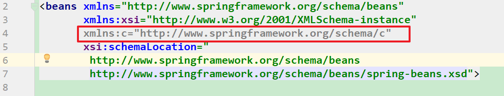

# 课堂笔记

# 1.spring的介绍

~~~
spring的2大核心思想：
1.ioc :  控制反转，将对象的创建权利交给了spring工厂。（就是类似我们之前学习的工厂模式）
2.aop :  面向切面的编程，在不修改源码的情况下，对代码的功能进行增强。（底层就是动态代理）

spring的优点：
	1.ioc，解耦
	2.aop，不修改源码进行功能的增强。
	3.可以整合第三方技术 (ioc)
	4.声明式事务的支持 （底层是aop）
~~~

spring的体系结构：


# 2.工厂模式（复习）

## 2.1 面向接口的编程

~~~
需求：浏览器请求登录，后台servlet调用service，service通过输出语句实现业务

1.创建web工程
2.创建servlet，
3.对于service，先创建接口，再创建接口的实现类。
4.反射+配置的方式创建service对象
~~~


beans.properties

```properties
userService=com.itheima.service.impl.UserServiceImpl
```

servlet

```java
package com.itheima.web;

import com.itheima.service.UserService;
import com.itheima.service.impl.UserServiceImpl;

import javax.servlet.ServletException;
import javax.servlet.annotation.WebServlet;
import javax.servlet.http.HttpServlet;
import javax.servlet.http.HttpServletRequest;
import javax.servlet.http.HttpServletResponse;
import java.io.IOException;
import java.util.ResourceBundle;

@WebServlet(urlPatterns = "/loginServlet")
public class LoginServlet extends HttpServlet {

    @Override
    protected void doGet(HttpServletRequest request, HttpServletResponse response) throws ServletException, IOException {
        doPost(request, response);
    }

    @Override
    protected void doPost(HttpServletRequest request, HttpServletResponse response) throws ServletException, IOException {

        UserService userService = null;

        //反射机制，创建对象
        //1.读取配置文件
        ResourceBundle rb = ResourceBundle.getBundle("beans");
        String userServiceClassPath = rb.getString("userService");
        //2.反射机制创建对象
        try {
            userService = (UserService) Class.forName(userServiceClassPath).newInstance();
        } catch (InstantiationException e) {
            e.printStackTrace();
        } catch (IllegalAccessException e) {
            e.printStackTrace();
        } catch (ClassNotFoundException e) {
            e.printStackTrace();
        }

        userService.login();
    }
}
```

service接口和实现类

```java
package com.itheima.service;

public interface UserService {

    public void login();
}
```

```java
package com.itheima.service.impl;

import com.itheima.service.UserService;

public class UserServiceImpl implements UserService {
    @Override
    public void login() {
        System.out.println("登录业务代码实现");
    }
}
```


小结：

~~~
1.service层先写接口，然后再在impl包下声明接口的实现类。实现类比接口名多了Impl
2.service对象的创建，采用反射+配置的方式
~~~


## 2.2 工厂模式

~~~
工厂模式：专门用于创建对象的工具类。通过配置+反射的方式创建对象。
~~~

### 2.2.1 多例工厂改造案例

beans.properties

```properties
userService=com.itheima.service.impl.UserServiceImpl
```

PrototypeFactory

```java
package com.itheima.utils;

import java.util.ResourceBundle;

public class PrototypeFactory {

    /**
     *  步骤：
     *  1.提供一个公共方法，方法的变量就是要创建bean的唯一标识，也是配置文件中的key
     *  2.这个方法通过反射+配置创建对象
     *      a.根据bean的唯一标识读取配置中的参数
     *      b.反射机制创建对象
     */

    public static Object getBean(String beanName){
        // a.根据bean的唯一标识读取配置中的参数
        ResourceBundle rb = ResourceBundle.getBundle("beans");
        String classPath = rb.getString(beanName);
        //  b.反射机制创建对象
        Object o = null;
        try {
            o = Class.forName(classPath).newInstance();
        } catch (InstantiationException e) {
            e.printStackTrace();
        } catch (IllegalAccessException e) {
            e.printStackTrace();
        } catch (ClassNotFoundException e) {
            e.printStackTrace();
        }
        return o;
    }


}
```

servlet

```java
package com.itheima.web;

import com.itheima.service.UserService;
import com.itheima.service.impl.UserServiceImpl;
import com.itheima.utils.PrototypeFactory;

import javax.servlet.ServletException;
import javax.servlet.annotation.WebServlet;
import javax.servlet.http.HttpServlet;
import javax.servlet.http.HttpServletRequest;
import javax.servlet.http.HttpServletResponse;
import java.io.IOException;
import java.util.ResourceBundle;

@WebServlet(urlPatterns = "/loginServlet")
public class LoginServlet extends HttpServlet {

	//从工厂去获取对象
    private UserService userService = (UserService) PrototypeFactory.getBean("userService");

    @Override
    protected void doGet(HttpServletRequest request, HttpServletResponse response) throws ServletException, IOException {
        doPost(request, response);
    }

    @Override
    protected void doPost(HttpServletRequest request, HttpServletResponse response) throws ServletException, IOException {

//        UserService userService = null;
//
//        //反射机制，创建对象
//        //1.读取配置文件
//        ResourceBundle rb = ResourceBundle.getBundle("beans");
//        String userServiceClassPath = rb.getString("userService");
//        //2.反射机制创建对象
//        try {
//            userService = (UserService) Class.forName(userServiceClassPath).newInstance();
//        } catch (InstantiationException e) {
//            e.printStackTrace();
//        } catch (IllegalAccessException e) {
//            e.printStackTrace();
//        } catch (ClassNotFoundException e) {
//            e.printStackTrace();
//        }

        userService.login();
    }
}
```

service不变。


小结：

~~~
因为当前工厂类，对于同一个key，调用多次，创建的是不同的对象。即多例
~~~

### 2.2.2 单例工厂

~~~
作用：对于一个key，调用多次创建对象的方法，得到的是同一个对象。即单例
单例：相对于多例的好处，节省资源。
使用单例的前提：不存在线程安全问题

单例实现的核心思路；
	第一次创建的对象保存起来，后续直接获取创建好的对象使用即可。
	第一次何时创建：
		a.第一次调用方法时创建
		b.初始化时全部创建
~~~

单例工厂1：第一次使用时创建

```java
package com.itheima.utils;

import java.util.HashMap;
import java.util.Map;
import java.util.ResourceBundle;

public class SingletonFactory1 {

    /**
     *  对象创建原则：第一次使用时创建
     *
     *  单例工厂实现步骤：
     *  1.声明一个map集合，用于存放工厂创建的对象。
     *  2.声明一个方法，用于获取工厂创建的对象
     *      a.优先从map中获取，如果后，直接返回
     *      b.如果没有，那么创建，并且保存到map
     *
     */

    private static Map<String,Object> beansMap = new HashMap<>();

    private static Object getBean(String beanName){
        // a.优先从map中获取，如果后，直接返回
        Object obj = beansMap.get(beanName);
        if(obj==null){
            //b.如果没有，那么创建，并且保存到map
            ResourceBundle rb = ResourceBundle.getBundle("beans");
            String classPath = rb.getString(beanName);
            try {
                obj = Class.forName(classPath).newInstance();
            } catch (InstantiationException e) {
                e.printStackTrace();
            } catch (IllegalAccessException e) {
                e.printStackTrace();
            } catch (ClassNotFoundException e) {
                e.printStackTrace();
            }
            beansMap.put(beanName,obj);
        }
        return obj;
    }


    public static void main(String[] args) {
        Object userService = getBean("userService");
        Object userService2 = getBean("userService");
        System.out.println(userService);
        System.out.println(userService2);
    }
}
```

单例工厂2：初始化的时候全部创建,static静态代理吗

```java
package com.itheima.utils;

import java.util.HashMap;
import java.util.Map;
import java.util.ResourceBundle;
import java.util.Set;

public class SingletonFactory2 {

    /**
     *  对象创建原则：初始化的时候全部创建,static静态代理吗
     *
     *  单例工厂实现步骤：
     *  1.声明一个map集合，用于存放工厂创建的对象。
     *  2.static代码块，创建所有对象
     *      a.读取所有配置信息
     *      b.遍历，创建对象，
     *      c.保存到map集合
     *
     *  3.提供公共方法，从map中获取对象即可
     *
     */

    // 1.声明一个map集合，用于存放工厂创建的对象。
    private static Map<String,Object> beansMap = new HashMap<>();

    //2.static代码块，创建所有对象
    static {
        // a.读取所有配置信息
        ResourceBundle rb = ResourceBundle.getBundle("beans");
        Set<String> keys = rb.keySet();
        // b.遍历，创建对象，
        for(String key:keys){
            //通过每个key，获取key对应的值
            String classPath = rb.getString(key);
            Object obj = null;
            try {
                obj = Class.forName(classPath).newInstance();
            } catch (InstantiationException e) {
                e.printStackTrace();
            } catch (IllegalAccessException e) {
                e.printStackTrace();
            } catch (ClassNotFoundException e) {
                e.printStackTrace();
            }
            //c.保存到map集合
            beansMap.put(key,obj);
        }
        System.out.println("工厂初始化，所有bean对象创建成功");
    }

    private static Object getBean(String beanName){
        return beansMap.get(beanName);
    }


    public static void main(String[] args) {
        Object userService = getBean("userService");
        Object userService2 = getBean("userService");
        System.out.println(userService);
        System.out.println(userService2);
    }
}
```

### 2.2.3 小结：

~~~
工厂分为单例工厂和多例工厂：
多例工厂：
	1.每次调用方法时创建对象
	2.工厂销毁，对象是无法销毁的。
单例工厂：
	什么时候创建对象：
		a.第一次调用时创建
		b.工厂初始化时创建
	工厂销毁，对象可以销毁。	
~~~


# 3.spring的ioc

## 3.1 快速入门

~~~
步骤：
0.创建se工程即可。
1.引入spring的依赖 ，spring-context
2.创建接口和实现类
3.在spring的配置中配置要创建的对象
4.通过工厂去获取对象
~~~

0.创建se工程即可。

1.引入spring的依赖 ，spring-context

```xml
<dependencies>
    <!--spring的ioc相关依赖-->
    <dependency>
        <groupId>org.springframework</groupId>
        <artifactId>spring-context</artifactId>
        <version>5.0.6.RELEASE</version>
    </dependency>
</dependencies>
```

2.创建接口和实现类

```java
package com.itheima.service;

public interface UserService {

    public void login();
}
```


```java
package com.itheima.service.impl;

import com.itheima.service.UserService;

public class UserServiceImpl implements UserService {
    @Override
    public void login() {
        System.out.println("登录的业务");
    }
}
```

3.在spring的配置中配置要创建的对象

配置文件模板：


```xml
<?xml version="1.0" encoding="UTF-8"?>
<beans xmlns="http://www.springframework.org/schema/beans"
    xmlns:xsi="http://www.w3.org/2001/XMLSchema-instance"
    xsi:schemaLocation="
        http://www.springframework.org/schema/beans http://www.springframework.org/schema/beans/spring-beans.xsd">

    <!-- bean definitions here -->

</beans>
```


配置内容：

```xml
<?xml version="1.0" encoding="UTF-8"?>
<beans xmlns="http://www.springframework.org/schema/beans"
       xmlns:xsi="http://www.w3.org/2001/XMLSchema-instance"
       xsi:schemaLocation="
        http://www.springframework.org/schema/beans http://www.springframework.org/schema/beans/spring-beans.xsd">

    <!-- bean definitions here -->

    <!--
        id:唯一标识
        class:实现类的全路径
    -->
    <bean id="userService" class="com.itheima.service.impl.UserServiceImpl"></bean>
</beans>
```


4.通过工厂去获取对象

```java
package com.itheima.test;

import com.itheima.service.UserService;
import org.springframework.context.ApplicationContext;
import org.springframework.context.support.ClassPathXmlApplicationContext;

public class SpringIocTest {

    public static void main(String[] args) {


        //1.获取spring工厂
        //在spring中，配置文件的路径加上classpath:一定是正确的，如果不加classpath:有时候正确，有时候不正确。
        // classpath: 特指类路径下，就是用于存放字节码文件的classes目录
        ApplicationContext ac = new ClassPathXmlApplicationContext("classpath:applicationContext.xml");
        //2.通过spring工厂获取对象
        UserService userService = (UserService) ac.getBean("userService");
        userService.login();
        System.out.println(userService);
    }
}
```


小结：

~~~
1.引入依赖  spring-context
2.编写spring的配置
	<bean id=唯一标识  class=实现类的全路径>
	
3.spring的api获取工厂，通过工厂获取对象
	配置文件前面加上classpath:
~~~


## 3.2 spring工厂介绍

 


~~~
BeanFactory: 工厂类的顶层接口
ApplicationContext: BeanFactory子接口

2者对于对象创建的时机不一样。在单例的情况下
ApplicationContext: 工厂初始化时创建对象
BeanFactory:第一次获取对象时创建对象。

多例情况下：都是每次获取时，每次创建。
~~~

```java
package com.itheima.test;

import com.itheima.service.UserService;
import org.springframework.beans.factory.BeanFactory;
import org.springframework.beans.factory.xml.XmlBeanFactory;
import org.springframework.context.ApplicationContext;
import org.springframework.context.support.ClassPathXmlApplicationContext;
import org.springframework.core.io.ClassPathResource;
import org.springframework.core.io.Resource;

public class CompareFactoryTest {

    public static void main(String[] args) {


        //1.获取spring工厂
        //在spring中，配置文件的路径加上classpath:一定是正确的，如果不加classpath:有时候正确，有时候不正确。
        // classpath: 特指类路径下，就是用于存放字节码文件的classes目录
        System.out.println("************工厂初始化start*****************");
        //ApplicationContext ac = new ClassPathXmlApplicationContext("classpath:applicationContext.xml");


        Resource resource = new ClassPathResource("applicationContext.xml");
        BeanFactory ac = new XmlBeanFactory(resource);

        System.out.println("************工厂初始化end*****************");
        //2.通过spring工厂获取对象
        UserService userService = (UserService) ac.getBean("userService");
        userService.login();
        System.out.println(userService);
    }
}
```


## 3.3 bean标签的详解

```xml
<!--
    装配对象到spring容器，spring容器？就是spring的工厂。

    id:唯一标识，一般需要与接口同名，见名知意。
    class:实现类的全路径，底层反射机制创建对象。
    name:bean的别名。多个bean的别名不要一样。这个属性一般不用的，因为有id。
    scope: bean的作用范围
            prototype:多例的。
            singleton: 默认值，单例的。常用（推荐使用，因为节省资源。）

    destroy-method: 对象销毁时，要调用的方法
    init -method:   对象创建时，要调用的方法

-->
```


## 3.4 bean的生命周期：

~~~
bean标签的2个属性：
destroy-method: 对象销毁时，要调用的方法
init -method:   对象创建时，要调用的方法
~~~


代码演示：

实现类：添加init方法和destroy方法

```java
package com.itheima.service.impl;

import com.itheima.service.UserService;

public class UserServiceImpl implements UserService {

    public UserServiceImpl() {
        System.out.println("userService对象创建了");
    }

    @Override
    public void login() {
        System.out.println("登录的业务");
    }

    public void init(){
        System.out.println("对象创建时要调用的init方法");
    }


    public void destroy(){
        System.out.println("对象销毁时要调用的destroy方法");
    }
}
```

测试类：

```java
package com.itheima.test;

import org.springframework.context.ApplicationContext;
import org.springframework.context.support.ClassPathXmlApplicationContext;

public class BeanLifeCycleTest {

    public static void main(String[] args) {
        //获取工厂：
        System.out.println("**********工厂初始化stat**********8");
        /*
            ApplicationContext: 这个接口没有close方法
            要演示工厂的销毁，借助这个类型，ClassPathXmlApplicationContext
         */
        ClassPathXmlApplicationContext ac = new ClassPathXmlApplicationContext("classpath:applicationContext.xml");
        System.out.println("**********工厂初始化end**********8");
        //获取工厂中的对象
        //Object userService = ac.getBean("userService2");
        Object userService = ac.getBean("userService3");
        //销毁工厂
        ac.close();
    }
}
```


配置：

```xml
<?xml version="1.0" encoding="UTF-8"?>
<beans xmlns="http://www.springframework.org/schema/beans"
       xmlns:xsi="http://www.w3.org/2001/XMLSchema-instance"
       xsi:schemaLocation="
        http://www.springframework.org/schema/beans http://www.springframework.org/schema/beans/spring-beans.xsd">

    <!-- bean definitions here -->

  
	<!-- 单例对象的生命周期测试 -->
    <!--<bean  id="userService2"  destroy-method="destroy" init-method="init"-->
           <!--class="com.itheima.service.impl.UserServiceImpl" ></bean>-->

    <!-- 多例对象的测试 -->
    <bean  id="userService3" scope="prototype"  destroy-method="destroy" init-method="init"
           class="com.itheima.service.impl.UserServiceImpl" ></bean>
</beans>
```

单例对象的生命周期：


多例对象的生命周期：


小结：

~~~
applicationContext工厂来说：
下面的销毁指的是调用了bean的destroy-method指定的方法。


	单例：
		工厂初始化时，就创建对象
		工厂销毁时，销毁对象。
		销毁对象：调用destroy方法，然后解除工厂对于对象的引用。
		
	多例：
		每次调用getBean方法，就创建对象，
		工厂销毁，对象不会被销毁。
		对象何时销毁呢？只能被垃圾回收机制回收。
		
注意：
	spring的销毁对象，只是表示调用了对象的destroy方法。但是对象如果还被引用这，那么对象还是能够使用的。
	
	Person person = new Person();  开辟一块内存空间，声明person变量，变量指向了这块内存的地址。
	person = null; 只是将person变量指向了一块空的地址。但是保存person对象的内存还在
	只有等待垃圾回收机制，去回收那块内存。
~~~

## 3.5 spring创建对象的3种方式

第一种：直接反射机制创建

例如：如下配置就是反射机制创建直接创建对象


第二种：工厂类的静态方法。

~~~
需求：spring要创建mybaits的mapper接口的对象。
无法使用第一种：因为这个mapper接口没有实现类。

实现：
1.创建一个工厂类，听过一个静态方法
2.这个静态方法通过指定的api来创建对象
3.在spring的核心配置中，配置对象即可
~~~

工厂类：

~~~java
package com.itheima.factory;

import com.itheima.service.UserService;
import com.itheima.service.impl.UserServiceImpl;

public class BeansFactory1 {

    //mybatis的mapper对象的创建，此处体现的工厂类的静态方法的思想是：对于无法直接创建的对象，例如没有实现类，我们
    //可以将这样的api用一个方法来封装，然后通过调用这个方法，来创建这个对象。
//    public static UserMapper getUserMapper(){
//        UserMapper userMapper = sqlSession.getMapper(UserMapper.class);
//        return userMapper;
//    }

    /**
     *  一般用于创建第三方技术的对象，例如：mybatis的mapper对象
     * @return
     */
    public static UserService getUserService(){
		//此处直接new，但是这样的对象其实使用第一种方法更好。
        return new UserServiceImpl();
    }
}
~~~


配置文件：

```xml
<!--
    第二种方式： 工厂类的静态方法
    一般用于无法直接通过反射机制创建的对象，例如：mybatis的mapper对象

-->
<bean id="userService4" class="com.itheima.factory.BeansFactory1" factory-method="getUserService"></bean>
```

测试类：

```java
package com.itheima.test;

import org.springframework.context.ApplicationContext;
import org.springframework.context.support.ClassPathXmlApplicationContext;

public class CreateBeanTest {

    public static void main(String[] args) {
        ApplicationContext ac = new ClassPathXmlApplicationContext("classpath:applicationContext.xml");

        Object userService4 = ac.getBean("userService4");
        System.out.println(userService4);
    }
}
```


说白了：我们可以通过调用一个类的静态方法得到一个对象：


第三种方式：工厂类的动态方法

~~~
实现步骤：
1.复制静态工厂，将静态方法改写成动态方法
2.配置工厂的对象
3.配置调用工厂的方法即可
~~~


工厂类：方法改写成动态

```java
package com.itheima.factory;

import com.itheima.service.UserService;
import com.itheima.service.impl.UserServiceImpl;

public class BeansFactory2 {


    /**
     *  一般用于创建第三方技术的对象，例如：mybatis的mapper对象
     * @return
     */
    public  UserService getUserService(){

        return new UserServiceImpl();
    }
}
```

2.配置工厂的对象
3.配置调用工厂的方法即可

~~~xml
  <!--
        第三种方式： 工厂类的动态方法
    -->
    <!-- 创建工厂对象-->
    <bean id="beanFactory2" class="com.itheima.factory.BeansFactory2"></bean>
    <bean id="userService5" factory-bean="beanFactory2" factory-method="getUserService"></bean>
~~~


测试类：

```java
package com.itheima.test;

import org.springframework.context.ApplicationContext;
import org.springframework.context.support.ClassPathXmlApplicationContext;

public class CreateBeanTest {

    public static void main(String[] args) {
        ApplicationContext ac = new ClassPathXmlApplicationContext("classpath:applicationContext.xml");

        //获取工厂类的静态方法创建的对象
        Object userService4 = ac.getBean("userService4");
        System.out.println(userService4);

        ////获取工厂类的动态方法创建的对象
        Object userService5 = ac.getBean("userService5");
        System.out.println(userService5);
    }
}
```


小结：

~~~
创建对象的3种方式：
1.直接通过反射机制创建
	<bean id=id,class=实现类全路径>
	
下面2种都是对于无法通过第一种方式创建的对象而设计的，例如mybatis的mapper对象的创建。	
2.工厂类的静态方法
    <bean id="id"
          class="工厂类"
          factory-method="工厂类的静态方法"></bean>

3.工厂类的动态方法
	<bean id="工厂对象的标识" class="工厂类"></bean>
    <bean id="userService5" factory-bean="工厂对象" factory-method="工厂对象的动态方法"></bean>
~~~


## 3.6 依赖注入（重要）

### 3.6.1 为什么需要依赖注入

~~~
什么是依赖注入(DI)：
	spring在创建对象的时候，给对象的属性赋值，叫做依赖注入。
~~~

为什么需要依赖注入：

~~~
通过案例来演示： spring去演示
	1.创建dao层接口和实现类
	2.创建service接口和实现类，service得调用dao
	2.main方法代表web层，main要调用service
	4.mapper和service对象全部用spring去创建
	5.测试
~~~

dao接口和实现类

```java
package com.itheima.dao;

public interface UserMapper {

    public void findUser();
}
```

```java
package com.itheima.dao.impl;

import com.itheima.dao.UserMapper;

public class UserMapperImpl implements UserMapper {
    @Override
    public void findUser() {
        System.out.println("从数据库查询用户");
    }
}
```


service接口和实现类

```java
package com.itheima.service;

public interface UserService {

    public void login();
}
```


```java
package com.itheima.service.impl;

import com.itheima.dao.UserMapper;
import com.itheima.service.UserService;

public class UserServiceImpl implements UserService {

    private UserMapper userMapper;

    @Override
    public void login() {
        //调用dao方法
        userMapper.findUser();
    }
}
```

spring的配置文件


```xml
<?xml version="1.0" encoding="UTF-8"?>
<beans xmlns="http://www.springframework.org/schema/beans"
       xmlns:xsi="http://www.w3.org/2001/XMLSchema-instance"
       xsi:schemaLocation="
        http://www.springframework.org/schema/beans http://www.springframework.org/schema/beans/spring-beans.xsd">

    <!-- bean definitions here -->

    <!--创建service-->
    <bean id="userService" class="com.itheima.service.impl.UserServiceImpl"></bean>
    <!--创建dao-->
    <bean id="userMapper" class="com.itheima.dao.impl.UserMapperImpl"></bean>
</beans>
```

main方法执行测试：

```java
package com.itheima.web;

import com.itheima.service.UserService;
import org.springframework.context.ApplicationContext;
import org.springframework.context.support.ClassPathXmlApplicationContext;

public class UserServlet {
    public static void main(String[] args) {

        //调用service
        ApplicationContext ac = new ClassPathXmlApplicationContext("classpath:applicationContext.xml");
        UserService userService = (UserService) ac.getBean("userService");
        userService.login();
    }
}
```

结果：空指针异常，service中的属性是空值，所以空指针异常。


问题：

~~~
类的成员变量何时赋值？
创建对象的时候赋值。
但是此处的对象是spring创建的，所以，spring在创建对象的时候，得给对象的属性赋值。（依赖注入）
~~~

最终问题解决：

~~~xml
<!--创建service-->
    <bean id="userService" class="com.itheima.service.impl.UserServiceImpl">
        <!-- 给userMapper属性赋值，userMapper属性得提供set方法
            ref:指向spring创建的userMapper对象
        -->
        <property name="userMapper" ref="userMapper"></property>
    </bean>
~~~


### 3.6.2 构造方式依赖注入

~~~
演示步骤：
1.复制一个userServiceImpl,声明多个属性，提供一个多参数构造
2.bean标签创建对象，并且给属性赋值
~~~

实现类：

```java
public class UserServiceImpl2 implements UserService {


    private String username;
    private int age;
    private String gameName;
    private UserMapper userMapper;


    public UserServiceImpl2(String username, int age, String gameName, UserMapper userMapper) {
        this.username = username;
        this.age = age;
        this.gameName = gameName;
        this.userMapper = userMapper;
    }

    @Override
    public void login() {

    }
}
```

配置：

```xml
<bean id="userService2" class="com.itheima.service.impl.UserServiceImpl2">
    <!--
        通过构造的方式，给构造方法的参数赋值

        确定参数的属性：
            name:通过参数名，来确定参数
            type:通过参数的类型来确定参数
            index：通过参数的索引来确定参数

        确定值的属性：
            value:基本类型的属性赋值
            ref: reference,引用型属性的赋值，来自于spring创建的对象的唯一标识
    -->
    <!-- name属性确定参数，常用-->
    <constructor-arg name="gameName" value="王者荣耀"  ></constructor-arg>
    <constructor-arg name="age" value="10"></constructor-arg>
    <constructor-arg name="username" value="小学生"></constructor-arg>
    <constructor-arg name="userMapper" ref="userMapper"></constructor-arg>

    <!--type属性确定参数 ,如果一个类型有多个，那么按照顺序赋值，-->
   <!-- <constructor-arg type="java.lang.String" value="幼儿园"></constructor-arg>
    <constructor-arg type="int" value="6"></constructor-arg>
    <constructor-arg type="java.lang.String" value="吃鸡"></constructor-arg>
    <constructor-arg type="com.itheima.dao.UserMapper" ref="userMapper"></constructor-arg>-->

    <!-- index属性确定参数，索引从0开始-->
   <!-- <constructor-arg index="0" value="幼儿园"></constructor-arg>
    <constructor-arg index="1" value="6"></constructor-arg>
    <constructor-arg index="2" value="吃鸡"></constructor-arg>
    <constructor-arg  index="3" ref="userMapper"></constructor-arg>-->
</bean>
```

测试：断点查看属性

```java
package com.itheima.web;

import com.itheima.service.UserService;
import org.springframework.context.ApplicationContext;
import org.springframework.context.support.ClassPathXmlApplicationContext;

public class DITest {

    public static void main(String[] args) {
        ApplicationContext ac = new ClassPathXmlApplicationContext("classpath:applicationContext.xml");
        UserService userService = (UserService) ac.getBean("userService2");
        System.out.println(userService);
    }
}
```


小结：

~~~
1.如果我们显示提供了有参构造，那么就没有无参构造了
2.通过bean标签的字表前<constructor-arg>来通过构造方式进行依赖注入
3. 
	用于确定属性的
		name:通过参数名，来确定参数
         type:通过参数的类型来确定参数
         index：通过参数的索引来确定参数
	用于确定值的
		 value:基本类型的属性赋值
         ref: reference,引用型属性的赋值，来自于spring创建的对象的唯一标识
~~~


### 3.6.3 set方式依赖注入

~~~
1.复制userService2，改名为UserService3,提供属性的set方法
2.做配置
~~~

```java
package com.itheima.service.impl;

import com.itheima.dao.UserMapper;
import com.itheima.service.UserService;

public class UserServiceImpl3 implements UserService {


    private String username;
    private int age;
    private String gameName;
    private UserMapper userMapper;


    public void setAaa(String bbbb){

    }

    public void setUsername(String username) {
        this.username = username;
    }

    public void setAge(int age) {
        this.age = age;
    }

    public void setGameName(String gameName) {
        this.gameName = gameName;
    }

    public void setUserMapper(UserMapper userMapper) {
        this.userMapper = userMapper;
    }

    @Override
    public void login() {

    }
}
```

配置：

```xml
<bean id="userService3" class="com.itheima.service.impl.UserServiceImpl3">
    <!--
        property：通过属性的set方法赋值
            name: 是set方法的名字去掉set后的驼峰命名。
            value：基本类型赋值
            ref：引用型类型赋值

            对于底层：
            name->首字母大写->前面拼接set->反射机制获取方法。
    -->
    <property name="userMapper" ref="userMapper"></property>
    <property name="username" value="张三"></property>
    <property name="age" value="23"></property>
    <property name="gameName" value="源神"></property>
    <!-- 此处没有aaa属性，只有setAaa()方法，所以此处的name是set方法名（去掉set关键字）-->
    <property name="aaa" value="ssss"></property>
</bean>
```

测试类：

```java
package com.itheima.web;

import com.itheima.service.UserService;
import org.springframework.context.ApplicationContext;
import org.springframework.context.support.ClassPathXmlApplicationContext;

public class DITest {

    public static void main(String[] args) {
        ApplicationContext ac = new ClassPathXmlApplicationContext("classpath:applicationContext.xml");
        UserService userService = (UserService) ac.getBean("userService3");
        System.out.println(userService);
    }
}
```

小结：

```xml
<!--
    property：通过属性的set方法赋值
        name: 是set方法的名字去掉set后的驼峰命名。
        value：基本类型赋值
        ref：引用型类型赋值

        对于底层：
        name->首字母大写->前面拼接set->反射机制获取方法。
-->
```

### 3.6.4 简写方式（了解）

~~~
构造方式通过c名称空间进行简写
set方式通过p名称空间进行简写
~~~

c名称空间方式：

~~~
1.引入c名称空间
2.配置 xmlns:c="http://www.springframework.org/schema/c"
~~~

引入c名称空间：




配置：

```xml
<!-- 实现类是userService2,因为有构造方式
	引用型的属性，在后面追加ref即可
-->
<bean id="userService22" class="com.itheima.service.impl.UserServiceImpl2"
      c:username="李四"
      c:age="24"
      c:gameName="打豆豆"
      c:userMapper-ref="userMapper"></bean>
```


p名称空间简写：

~~~
1.引入p名称空间  xmlns:p="http://www.springframework.org/schema/p
2.配置
~~~

1.引入p名称空间


2.配置，此处使用实现类UserServiceImpl3,因为有属性的set方法

```xml
<bean id="userService33" class="com.itheima.service.impl.UserServiceImpl3"
        p:username="王五"
        p:age="25"
        p:gameName="干饭"
        p:userMapper-ref="userMapper"></bean>
```


小结：

~~~
需要引入对应的名称空间，本质还是构造和set方式
~~~


### 3.6.5  复杂类型的注入（了解）

~~~
步骤：
1.提供userService4实现类，声明复杂类型的属性，list，set，map
2.配置
~~~

实现类：

```java
package com.itheima.service.impl;

import com.itheima.dao.UserMapper;
import com.itheima.service.UserService;

import java.util.List;
import java.util.Map;
import java.util.Set;

public class UserServiceImpl4 implements UserService {


    private List<String> gamesList;
    private Set<String> schoolSet;
    private Map<String,String> map;

    public List<String> getGamesList() {
        return gamesList;
    }

    public void setGamesList(List<String> gamesList) {
        this.gamesList = gamesList;
    }

    public Set<String> getSchoolSet() {
        return schoolSet;
    }

    public void setSchoolSet(Set<String> schoolSet) {
        this.schoolSet = schoolSet;
    }

    public Map<String, String> getMap() {
        return map;
    }

    public void setMap(Map<String, String> map) {
        this.map = map;
    }

    @Override
    public void login() {

    }
}
```

配置：

```xml
<!-- 复杂类型依赖注入-->
<bean id="userService4" class="com.itheima.service.impl.UserServiceImpl4">
    <property name="gamesList">
        <list>
            <value>dnf</value>
            <value>lol</value>
            <value>cf</value>
            <value>dota</value>
        </list>
    </property>

    <property name="schoolSet">
        <set>
            <value>传智播客</value>
            <value>北大</value>
            <value>清华</value>
        </set>
    </property>
    <property name="map">
        <map>
            <entry key="a" value="aa"></entry>
            <entry key="b" value="bb"></entry>
        </map>
    </property>
</bean>
```


# 4.总结

~~~
1.spring的介绍
   优点：
   	a.ioc解耦
   	b.aop方便功能增强
   	c.方便整合其他第三优秀技术
   	d.事务管理很方便
2.工厂模式（理解）
	单例（创建对象有2种时机），多例
3.掌握
	bean标签的详解：
	<bean id="唯一标识" class="实现类的全路径" scope="单例/多例" init-method="初始化是要调用的方法"
	destroy-method="销毁时要调用的方法">
	
	生命周期：（理解）
	单例：
		工厂初始化时，就创建对象
		工厂销毁时，销毁对象。
		销毁对象：调用destroy方法，然后解除工厂对于对象的引用。
		
	多例：
		每次调用getBean方法，就创建对象，
		工厂销毁，对象不会被销毁。
		对象何时销毁呢？只能被垃圾回收机制回收。
		
	spring创建对象的3种方式
    	1.直接反射机制创建
    	2.工厂类的静态方法（一般用于创建第三方技术的对象，例如mybatis的mapper对象）
    	3.工厂类的动态方法
	
	依赖注入（重要）：spring创建对象的时候，给对象的属性赋值
		1.构造方式
			<constructor-arg  name="属性名" value/ref="值">
		2.set方式
			<property name="set的方法名，去掉set关键字" value/ref="值">
		
		3.c名称空间和p名称空间（了解）
		4.复杂类型（了解）
~~~

