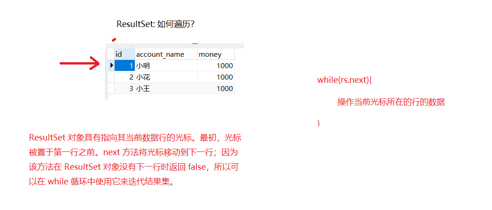
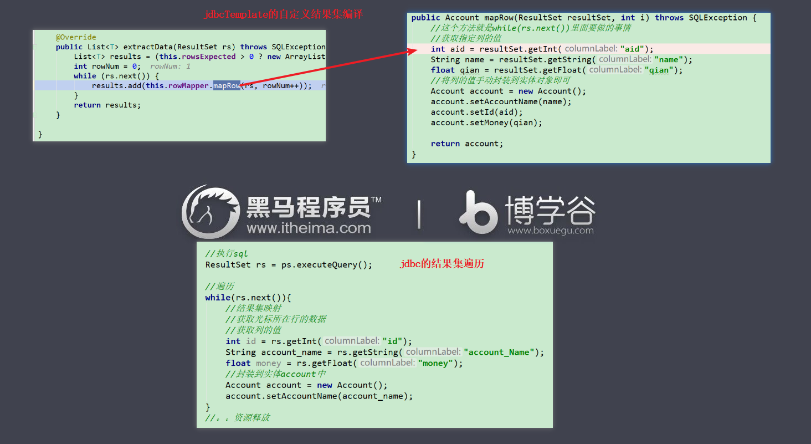
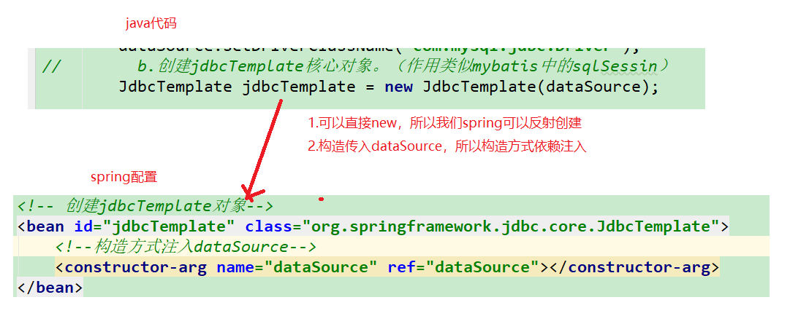
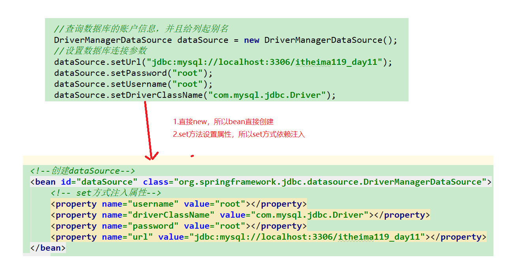
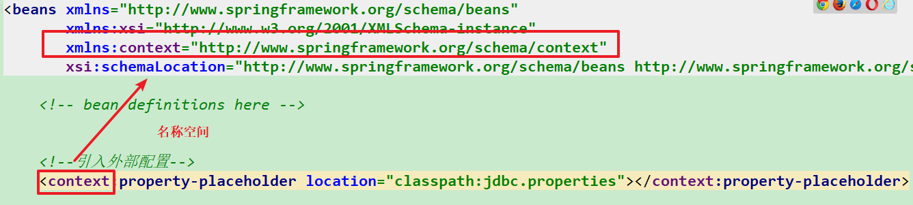
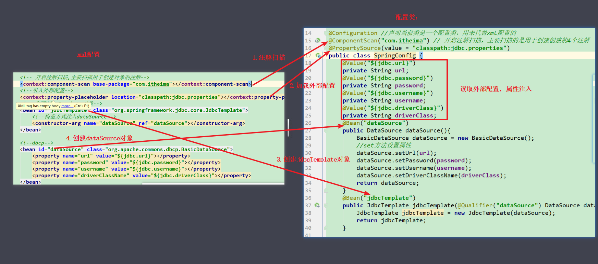
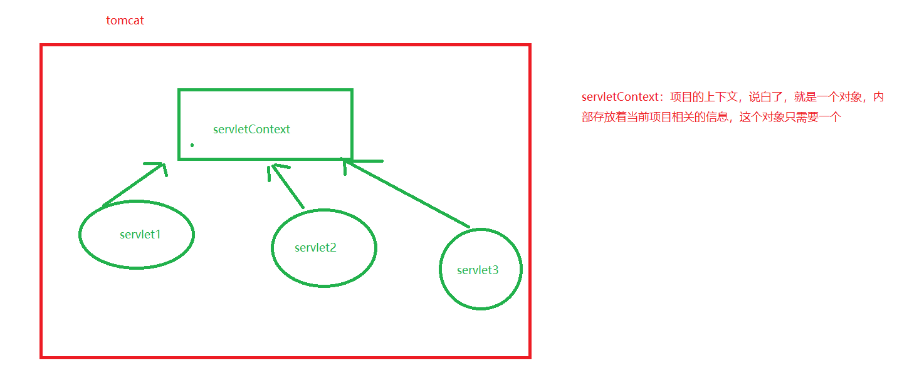

# 课堂笔记

# 1.jdbcTemplate （了解）

## 1.1 jdbcTemplate的介绍

~~~
这是spring提供的对于jdbc的封装，用于操作数据库的。相对mybatis，我们常用是mybatis。
~~~

## 1.2 jdbcTemplate快速入门

~~~
步骤：
1.引入依赖，spring-context,spring-jdbc,
2.准备数据库和实体
3.jdbcTemplate的api来操作数据库
	a.创建数据源（数据库连接池），使用spring自带的数据库连接池
	b.创建jdbcTemplate核心对象。（作用类似mybatis中的sqlSessin）
	c.通过jdbcTemplate直接操作数据库即可
~~~


1.引入依赖，spring-context,spring-jdbc,

```xml
<dependencies>
    <!-- spring的所有依赖需要保持一致。否则会报错。-->
    <!-- spring的ioc相关-->
    <dependency>
        <groupId>org.springframework</groupId>
        <artifactId>spring-context</artifactId>
        <version>5.0.6.RELEASE</version>
    </dependency>
    <!-- spring的jdbcTemplate-->
    <dependency>
        <groupId>org.springframework</groupId>
        <artifactId>spring-jdbc</artifactId>
        <version>5.0.6.RELEASE</version>
    </dependency>
    <!--mysql驱动-->
    <dependency>
        <groupId>mysql</groupId>
        <artifactId>mysql-connector-java</artifactId>
        <version>5.1.38</version>
    </dependency>

</dependencies>

```

2.准备数据库和实体

~~~sql
/*创建账户表*/
create table account(
	id int primary key auto_increment,
	account_name varchar(40),
	money float
)ENGINE=InnoDB character set utf8 collate utf8_general_ci;

/*初始化新增三个账户*/
insert into account(account_name,money) values('小明',1000);
insert into account(account_name,money) values('小花',1000);
insert into account(account_name,money) values('小王',1000);
~~~


```java
package com.itheima.pojo;

public class Account {
    private int id;
    private String accountName;
    private float money;

    public int getId() {
        return id;
    }

    public void setId(int id) {
        this.id = id;
    }

    public String getAccountName() {
        return accountName;
    }

    public void setAccountName(String accountName) {
        this.accountName = accountName;
    }

    public float getMoney() {
        return money;
    }

    public void setMoney(float money) {
        this.money = money;
    }

    @Override
    public String toString() {
        return "Account{" +
                "id=" + id +
                ", accountName='" + accountName + '\'' +
                ", money=" + money +
                '}';
    }
}
```


3.jdbcTemplate的api来操作数据库
	a.创建数据源（数据库连接池），使用spring自带的数据库连接池
	b.创建jdbcTemplate核心对象。（作用类似mybatis中的sqlSessin）
	c.通过jdbcTemplate直接操作数据库即可


```java
package com.itheima.jdbc;

import org.springframework.jdbc.core.JdbcTemplate;
import org.springframework.jdbc.datasource.DriverManagerDataSource;

public class JdbcQucikStartTest {

    public static void main(String[] args) {
//        a.创建数据源（数据库连接池），使用spring自带的数据库连接池

        DriverManagerDataSource dataSource = new DriverManagerDataSource();
        //设置数据库连接参数
        dataSource.setUrl("jdbc:mysql://localhost:3306/itheima119_day11");
        dataSource.setPassword("root");
        dataSource.setUsername("root");
        dataSource.setDriverClassName("com.mysql.jdbc.Driver");
//        b.创建jdbcTemplate核心对象。（作用类似mybatis中的sqlSessin）
        JdbcTemplate jdbcTemplate = new JdbcTemplate(dataSource);

//        c.通过jdbcTemplate直接操作数据库即可
        jdbcTemplate.update("INSERT  into account values(?,?,?)",null,"张三丰",1111);

    }
}
```


## 1.3 CRUD操作

测试类

~~~java
package com.itheima.jdbc;

import com.itheima.pojo.Account;
import org.springframework.jdbc.core.BeanPropertyRowMapper;
import org.springframework.jdbc.core.JdbcTemplate;
import org.springframework.jdbc.datasource.DriverManagerDataSource;

import java.util.List;

public class JdbcCRUDTest {
    public static void main(String[] args) {
//        a.创建数据源（数据库连接池），使用spring自带的数据库连接池

        DriverManagerDataSource dataSource = new DriverManagerDataSource();
        //设置数据库连接参数
        dataSource.setUrl("jdbc:mysql://localhost:3306/itheima119_day11");
        dataSource.setPassword("root");
        dataSource.setUsername("root");
        dataSource.setDriverClassName("com.mysql.jdbc.Driver");
//        b.创建jdbcTemplate核心对象。（作用类似mybatis中的sqlSessin）
        JdbcTemplate jdbcTemplate = new JdbcTemplate(dataSource);


//        1.新增一个账户
   //     jdbcTemplate.update("INSERT  into account values(?,?,?)",null,"张三丰",1111);


//        2.根据用户id修改用户
       //   jdbcTemplate.update("update account set money=? where id = ?",2222,4);


//        3.根据用户id删除用户,企业开发都是逻辑删除
          //jdbcTemplate.update("delete from account where id = ?",4);


//        4.查询所有用户
        /**
         *  mybatis： 数据库的查询结果如何封装到实体的呢？
         *      1.autoMapping = true, 自动映射，列名和实体的属性名一致。
         *      2.手动建立映射关系<resultMap></>   column列和property属性的映射关系
         *
         *  jdbcTemplate的RowMapper是一个接口，用于指定结果结如何映射到实体的。
         *      1.自动映射  BeanPropertyRowMapper  ,等同于mybatis中的autoMapping = true.
         *      2.手动映射，自定义实现类，实现RowMapper接口，实现方法。
         */
        //spring的版本不一样，这里有的有泛型，有的没有泛型
//        List<Account> accountList = jdbcTemplate.query("select * from account", new BeanPropertyRowMapper<Account>(Account.class));
//        for(Account account:accountList){
//            System.out.println(account);
//        }


//        5.查询当前用户个数

//        Integer totalCount = jdbcTemplate.queryForObject("select count(*) from account", Integer.class);
//        System.out.println("用户的总数量："+totalCount);

        //6.查询id为1的用户
        Account account = jdbcTemplate.queryForObject("select * from account where id = 1",new BeanPropertyRowMapper<Account>(Account.class));
        System.out.println(account);
    }
}

~~~

小结：

~~~
增删改： jdbcTemplate.update(sql,args..);
		args：可变参数
		
如果查询的数据封装成单个对象（基本类型，pojo）
	jdbcTemplate.queryForObject(sql,结果集映射,args);
如果查询的数据封装成集合
	jdbcTemplate.query(sql,结果集映射,args);

针对于结果集映射，
	如果是基本类型：我们直接写基本类型的包装类；
如果是pojo类型，
	a.new BeanPropertyRowMapper(); 类似mybaits中autoMapping=ture.结果集的自动映射
	b.我们需要自定义实现类，实现RowMapper接口，进行自定义结果集映射。 作用类似mybaits中<ResultMap>
~~~


## 1.4 RowMapper接口

~~~
jdbcTemplate中,RowMapper接口，是用来定义结果集如何映射到实体对象的。
1.jdbcTemplate已经提供了当前接口的实现类，BeanPropertyRowMapper,底层就是反射机制，根据列名找到对应的属性名，进行结果集的映射的。作用类似mybaits的autoMapping=true.前提条件：列名和属性名一致

2.自定义实现类，实现RowMapper结果
~~~


jdbc结果集的遍历



jdbcTemplate自定义结果集遍历和jdbc结果集遍历对比，一样的。




代码演示：

测试类：结果集映射采用自定义的

```java
package com.itheima.jdbc;

import com.itheima.pojo.Account;
import com.itheima.rowMapper.AccountRowMapper;
import org.springframework.jdbc.core.BeanPropertyRowMapper;
import org.springframework.jdbc.core.JdbcTemplate;
import org.springframework.jdbc.datasource.DriverManagerDataSource;

import java.sql.Connection;
import java.sql.DriverManager;
import java.sql.PreparedStatement;
import java.sql.ResultSet;
import java.util.List;

public class RowMapperTest {
    public static void main(String[] args) {

        //查询数据库的账户信息，并且给列起别名
        DriverManagerDataSource dataSource = new DriverManagerDataSource();
        //设置数据库连接参数
        dataSource.setUrl("jdbc:mysql://localhost:3306/itheima119_day11");
        dataSource.setPassword("root");
        dataSource.setUsername("root");
        dataSource.setDriverClassName("com.mysql.jdbc.Driver");
//        b.创建jdbcTemplate核心对象。（作用类似mybatis中的sqlSessin）
        JdbcTemplate jdbcTemplate = new JdbcTemplate(dataSource);

        //执行sql，查询数据库,此处无法自动映射，需要手动建立映射关系
//        List<Account> accountList = jdbcTemplate.query("select id aid,account_name name,money qian from account",
//                new BeanPropertyRowMapper<Account>(Account.class));

        List<Account> accountList = jdbcTemplate.query("select id aid,account_name name,money qian from account",
                new AccountRowMapper());

        for(Account account:accountList){
            System.out.println(account);
        }
    }

    //回顾jdbc
    public void jdbcDemo() throws Exception{
        //加载驱动
        Class.forName("....");

        //创建连接
        Connection connection = DriverManager.getConnection("..");

        //创建statement
        PreparedStatement ps = connection.prepareStatement("sql...");

        //执行sql
        ResultSet rs = ps.executeQuery();

        //遍历
        while(rs.next()){
            //结果集映射
            //获取光标所在行的数据
            //获取列的值
            int id = rs.getInt("id");
            String account_name = rs.getString("account_Name");
            float money = rs.getFloat("money");
            //封装到实体account中
            Account account = new Account();
            account.setAccountName(account_name);
        }
        //。。资源释放
    }

}
```

自定义rowMapper

```java
package com.itheima.rowMapper;

import com.itheima.pojo.Account;
import org.springframework.jdbc.core.RowMapper;

import java.sql.ResultSet;
import java.sql.SQLException;

public class AccountRowMapper implements RowMapper {

    /**
     *
     * @param resultSet  代表光标所在行的一行数据
     * @param i
     * @return
     * @throws SQLException
     */
    @Override
    public Account mapRow(ResultSet resultSet, int i) throws SQLException {
        //这个方法就是while(rs.next())里面要做的事情
        //获取指定列的值
        int aid = resultSet.getInt("aid");
        String name = resultSet.getString("name");
        float qian = resultSet.getFloat("qian");
        //将列的值手动封装到实体对象即可
        Account account = new Account();
        account.setAccountName(name);
        account.setId(aid);
        account.setMoney(qian);

        return account;
    }
}
```


## 1.5 案例（重要，掌握spring的ioc的使用）

~~~
需求： 完整对于数据库的查询操作，分层实现，没有web层，并且使用spring完成

 步骤：
1.创建se工程，引入依赖，spring-context，spring-jdbc，mysql，
2.创建dao层的接口和实现类，实现类完整对于数据库的操作
3.创建service，service调用dao
4.测试service的方法
5.由spring创建service对象，创建dao对象，创建dao需要的jdbcTemplate对象 （当前案例核心）
6.测试，引入4.12版本的单元测试，进行单元测试
~~~

 步骤：
1.创建se工程，引入依赖，spring-context，spring-jdbc，mysql，

```xml
<dependencies>
    <dependency>
        <groupId>org.springframework</groupId>
        <artifactId>spring-jdbc</artifactId>
        <version>5.0.6.RELEASE</version>
    </dependency>
    <dependency>
        <groupId>org.springframework</groupId>
        <artifactId>spring-context</artifactId>
        <version>5.0.6.RELEASE</version>
    </dependency>
    <dependency>
        <groupId>mysql</groupId>
        <artifactId>mysql-connector-java</artifactId>
        <version>5.1.38</version>
    </dependency>
    <!--单元测试，4.12版本以上，下午的spring整合junit必须要求4.12版本及以上-->
    <dependency>
        <groupId>junit</groupId>
        <artifactId>junit</artifactId>
        <version>4.12</version>
    </dependency>


</dependencies>
```

2.创建dao层的接口和实现类，实现类完整对于数据库的操作

pojo

~~~java
package com.itheima.pojo;

public class Account {

    private int id;
    private String accountName;
    private float money;

    @Override
    public String toString() {
        return "Account{" +
                "id=" + id +
                ", accountName='" + accountName + '\'' +
                ", money=" + money +
                '}';
    }

    public int getId() {
        return id;
    }

    public void setId(int id) {
        this.id = id;
    }

    public String getAccountName() {
        return accountName;
    }

    public void setAccountName(String accountName) {
        this.accountName = accountName;
    }

    public float getMoney() {
        return money;
    }

    public void setMoney(float money) {
        this.money = money;
    }
}

~~~

接口和实现类：

```java
package com.itheima.dao;

import com.itheima.pojo.Account;

import java.util.List;

public interface AccountDao {

    public List<Account> findAll();
}
```


```java
package com.itheima.dao.impl;

import com.itheima.dao.AccountDao;
import com.itheima.pojo.Account;
import org.springframework.jdbc.core.BeanPropertyRowMapper;
import org.springframework.jdbc.core.JdbcTemplate;
import org.springframework.jdbc.datasource.DriverManagerDataSource;

import java.util.List;

public class AccountDaoImpl implements AccountDao {

    //操作数据库的核心对象
    private JdbcTemplate jdbcTemplate;

    public void setJdbcTemplate(JdbcTemplate jdbcTemplate) {
        this.jdbcTemplate = jdbcTemplate;
    }

    @Override
    public List<Account> findAll() {
        String sql = "select * from account";
        return jdbcTemplate.query(sql,new BeanPropertyRowMapper<Account>(Account.class));
    }


}
```


3.创建service，service调用dao

接口和实现类：

```java
package com.itheima.service;

import com.itheima.pojo.Account;

import java.util.List;

public interface AccountService {

    public List<Account> findAll();
}
```

```java
package com.itheima.service.impl;

import com.itheima.dao.AccountDao;
import com.itheima.pojo.Account;
import com.itheima.service.AccountService;

import java.util.List;

public class AccountServiceImpl implements AccountService {

    //声明dao对象
    private AccountDao accountDao;

    public void setAccountDao(AccountDao accountDao) {
        this.accountDao = accountDao;
    }

    @Override
    public List<Account> findAll() {
        return accountDao.findAll();
    }
}
```

5.由spring创建service对象，创建dao对象，创建dao需要的jdbcTemplate对象 （当前案例核心）

```xml
<?xml version="1.0" encoding="UTF-8"?>
<beans xmlns="http://www.springframework.org/schema/beans"
       xmlns:xsi="http://www.w3.org/2001/XMLSchema-instance"
       xsi:schemaLocation="
        http://www.springframework.org/schema/beans http://www.springframework.org/schema/beans/spring-beans.xsd">

    <!-- bean definitions here -->

    <!--创建service-->

    <bean id="accountService" class="com.itheima.service.impl.AccountServiceImpl">
        <!--accountDao属性的依赖注入-->
        <property name="accountDao" ref="accountDao"></property>
    </bean>


    <!-- 创建dao-->
    <bean id="accountDao" class="com.itheima.dao.impl.AccountDaoImpl">
        <!-- set方式依赖注入jdbcTemplate-->
        <property name="jdbcTemplate" ref="jdbcTemplate"></property>
    </bean>

    <!-- 创建jdbcTemplate对象-->
    <bean id="jdbcTemplate" class="org.springframework.jdbc.core.JdbcTemplate">
        <!--构造方式注入dataSource-->
        <constructor-arg name="dataSource" ref="dataSource"></constructor-arg>
    </bean>


    <!--创建dataSource-->
    <bean id="dataSource" class="org.springframework.jdbc.datasource.DriverManagerDataSource">
        <!-- set方式注入属性-->
        <property name="username" value="root"></property>
        <property name="driverClassName" value="com.mysql.jdbc.Driver"></property>
        <property name="password" value="root"></property>
        <property name="url" value="jdbc:mysql://localhost:3306/itheima119_day11"></property>
    </bean>
</beans>
```







6.测试，引入4.12版本的单元测试，进行单元测试

选中接口，ctrl+shift+t

```java
package com.itheima.service;

import com.itheima.pojo.Account;
import org.junit.Before;
import org.junit.Test;
import org.springframework.context.ApplicationContext;
import org.springframework.context.support.ClassPathXmlApplicationContext;

import java.util.List;

import static org.junit.Assert.*;

public class AccountServiceTest {

    //从spring容器中获取
    private AccountService accountService;

    //@Before: 在执行测试之前先执行的方法
    @Before
    public void before(){

        //1.获取spring容器
        ApplicationContext ac = new ClassPathXmlApplicationContext("classpath:applicationContext.xml");
        //2.获取容器中的对象
        accountService =(AccountService) ac.getBean("accountService");
    }


    @Test
    public void findAll() {

        List<Account> accountList = accountService.findAll();
        for(Account account:accountList){
            System.out.println(account);
        }
    }
}
```


小结：

~~~
主要掌握spring的ioc的使用
核心：
1.在我们java代码中，所有涉及对象的创建全部应该交由spring进行管理
2.spring改如何创建对象，得看这个对象创建的java代码如何去编写。	
~~~


## 1.6 spring引入外部配置(掌握)

~~~
需求：将数据库连接池的配置提取到外部properties中

1.创建jdbc.properties配置文件，配置数据库连接参数，注意：key加上前缀jdbc.
2.spring中引入外部配置，通过${key} 语法获取配置中的参数
~~~

jdbc.properties注意：key加上前缀jdbc.

```properties
jdbc.username=root
jdbc.password=root
jdbc.url=jdbc:mysql://localhost:3306/itheima119_day11
jdbc.driverClass=com.mysql.jdbc.Driver
```


spring配置：




数据库连接池配置

```xml
<!--创建dataSource-->
<bean id="dataSource" class="org.springframework.jdbc.datasource.DriverManagerDataSource">
    <!-- set方式注入属性-->
    <!--<property name="username" value="root"></property>-->
    <!--<property name="driverClassName" value="com.mysql.jdbc.Driver"></property>-->
    <!--<property name="password" value="root"></property>-->
    <!--<property name="url" value="jdbc:mysql://localhost:3306/itheima119_day11"></property>-->


    <property name="username" value="${jdbc.username}"></property>
    <property name="driverClassName" value="${jdbc.driverClass}"></property>
    <property name="password" value="${jdbc.password}"></property>
    <property name="url" value="${jdbc.url}"></property>
</bean>
```


## 1.7 spring管理其他数据源（掌握）

spring自定义数据源：

```xml
<!--创建dataSource-->
<bean id="dataSource" class="org.springframework.jdbc.datasource.DriverManagerDataSource">
    <!-- set方式注入属性-->
    <!--<property name="username" value="root"></property>-->
    <!--<property name="driverClassName" value="com.mysql.jdbc.Driver"></property>-->
    <!--<property name="password" value="root"></property>-->
    <!--<property name="url" value="jdbc:mysql://localhost:3306/itheima119_day11"></property>-->


    <property name="username" value="${jdbc.username}"></property>
    <property name="driverClassName" value="${jdbc.driverClass}"></property>
    <property name="password" value="${jdbc.password}"></property>
    <property name="url" value="${jdbc.url}"></property>
</bean>
```


阿里巴巴的DruidDataSource

```xml
<!--阿里巴巴德鲁伊连接池-->
<dependency>
    <groupId>com.alibaba</groupId>
    <artifactId>druid</artifactId>
    <version>1.0.9</version>
</dependency>
```


```xml
<!-- 德鲁伊连接池-->
<bean id="dataSource" class="com.alibaba.druid.pool.DruidDataSource">
    <property name="url" value="${jdbc.url}"></property>
    <property name="password" value="${jdbc.password}"></property>
    <property name="username" value="${jdbc.username}"></property>
    <property name="driverClassName" value="${jdbc.driverClass}"></property>
</bean>
```

C3p0数据库连接池CombolPooledDataSource

```xml
<!--c3p0-->
<dependency>
    <groupId>c3p0</groupId>
    <artifactId>c3p0</artifactId>
    <version>0.9.1.2</version>
</dependency>
```

```xml
<!-- c3p0-->
<bean id="dataSource" class="com.mchange.v2.c3p0.ComboPooledDataSource">
    <property name="jdbcUrl" value="${jdbc.url}"></property>
    <property name="password" value="${jdbc.password}"></property>
    <property name="user" value="${jdbc.username}"></property>
    <property name="driverClass" value="${jdbc.driverClass}"></property>
</bean>
```


dbcp数据库连接池   BasicDataSource

```xml
<!-- dbcp -->
<dependency>
    <groupId>commons-dbcp</groupId>
    <artifactId>commons-dbcp</artifactId>
    <version>1.4</version>
</dependency>
```

```xml
<!--dbcp-->
<bean id="dataSource" class="org.apache.commons.dbcp.BasicDataSource">
    <property name="url" value="${jdbc.url}"></property>
    <property name="password" value="${jdbc.password}"></property>
    <property name="username" value="${jdbc.username}"></property>
    <property name="driverClassName" value="${jdbc.driverClass}"></property>
</bean>
```


# 2.ioc注解（掌握，重点）

## 2.0 注意

使用spring的ioc注解，需要开启注解扫描。

```xml
<!-- 开启注解扫描,主要扫描用于创建对象的4个注解-->
<context:component-scan base-package="com.itheima"></context:component-scan>
```
## 2.1 上午的案例进行注解改造

~~~
1.在spring的配置中添加注解扫描，并且删除service和dao对象的创建
2.通过在实现类上添加@Component注解来创建对象
3.通过在属性上添加@Autowired来给属性进行赋值。
4.测试即可
~~~

xml配置：

```xml
<?xml version="1.0" encoding="UTF-8"?>
<beans xmlns="http://www.springframework.org/schema/beans"
       xmlns:xsi="http://www.w3.org/2001/XMLSchema-instance"
       xmlns:context="http://www.springframework.org/schema/context"
       xsi:schemaLocation="http://www.springframework.org/schema/beans http://www.springframework.org/schema/beans/spring-beans.xsd http://www.springframework.org/schema/context http://www.springframework.org/schema/context/spring-context.xsd">

    <!-- bean definitions here -->

    <!-- 开启注解扫描,主要扫描用于创建对象的注解-->
    <context:component-scan base-package="com.itheima"></context:component-scan>

    <!--引入外部配置-->
    <context:property-placeholder location="classpath:jdbc.properties"></context:property-placeholder>


    <!-- 创建jdbcTemplate对象-->
    <bean id="jdbcTemplate" class="org.springframework.jdbc.core.JdbcTemplate">
        <!--构造方式注入dataSource-->
        <constructor-arg name="dataSource" ref="dataSource"></constructor-arg>
    </bean>


   
    <!--dbcp-->
    <bean id="dataSource" class="org.apache.commons.dbcp.BasicDataSource">
        <property name="url" value="${jdbc.url}"></property>
        <property name="password" value="${jdbc.password}"></property>
        <property name="username" value="${jdbc.username}"></property>
        <property name="driverClassName" value="${jdbc.driverClass}"></property>
    </bean>
</beans>
```


实现类：

```java
package com.itheima.dao.impl;

import com.itheima.dao.AccountDao;
import com.itheima.pojo.Account;
import org.springframework.beans.factory.annotation.Autowired;
import org.springframework.jdbc.core.BeanPropertyRowMapper;
import org.springframework.jdbc.core.JdbcTemplate;
import org.springframework.jdbc.datasource.DriverManagerDataSource;
import org.springframework.stereotype.Component;

import java.util.List;


@Component("accountDao")
public class AccountDaoImpl implements AccountDao {

    //操作数据库的核心对象
    @Autowired
    private JdbcTemplate jdbcTemplate;

    public void setJdbcTemplate(JdbcTemplate jdbcTemplate) {
        this.jdbcTemplate = jdbcTemplate;
    }

    @Override
    public List<Account> findAll() {
        String sql = "select * from account";
        return jdbcTemplate.query(sql,new BeanPropertyRowMapper<Account>(Account.class));
    }


}
```


```java
package com.itheima.service.impl;

import com.itheima.dao.AccountDao;
import com.itheima.pojo.Account;
import com.itheima.service.AccountService;
import org.springframework.beans.factory.annotation.Autowired;
import org.springframework.stereotype.Component;

import java.util.List;

@Component("accountService")
public class AccountServiceImpl implements AccountService {

    //声明dao对象
    @Autowired
    private AccountDao accountDao;

    public void setAccountDao(AccountDao accountDao) {
        this.accountDao = accountDao;
    }

    @Override
    public List<Account> findAll() {
        return accountDao.findAll();
    }
}
```

测试：


## 2.2 用于创建对象的注解

~~~
演示步骤：
1.引入依赖
2.创建service和dao
3.通过注解创建对象
~~~

依赖：

```xml
<dependencies>
    <dependency>
        <groupId>org.springframework</groupId>
        <artifactId>spring-context</artifactId>
        <version>5.0.6.RELEASE</version>
    </dependency>
</dependencies>
```

spring的配置：

```xml
<?xml version="1.0" encoding="UTF-8"?>
<beans xmlns="http://www.springframework.org/schema/beans"
       xmlns:xsi="http://www.w3.org/2001/XMLSchema-instance"
       xmlns:context="http://www.springframework.org/schema/context"
       xsi:schemaLocation="http://www.springframework.org/schema/beans http://www.springframework.org/schema/beans/spring-beans.xsd http://www.springframework.org/schema/context http://www.springframework.org/schema/context/spring-context.xsd">

    <!-- bean definitions here -->

    <!-- 开启注解扫描-->
    <context:component-scan base-package="com.itheima"></context:component-scan>
</beans>
```

service和dao

```java
package com.itheima.dao.impl;

import com.itheima.dao.UserDao;
import org.springframework.stereotype.Component;
import org.springframework.stereotype.Repository;

//@Component("userDao")
@Repository("userDao")
public class UserDaoImpl implements UserDao {
}
```

```java
package com.itheima.service.impl;

import com.itheima.dao.UserDao;
import com.itheima.service.UserService;
import org.springframework.stereotype.Component;
import org.springframework.stereotype.Service;

//@Component("userService")
//@Component
@Service
public class UserServiceImpl implements UserService {


    /**
     *
     *  对于一个注解，如果只有value属性有值，那么value属性可以省略
     *   例如：  @Component(value="123")  ->  @Component("123")
     *
     *  用于创建对象的注解：
     *      1.@Component:  表示这个spring的一个组件。用于创建不属于3层的对象。
     *              value属性就是bean的唯一标识,如果不写，就是类名的驼峰命名
     *  我们实际开发，经常用于service层对象和dao层对象和web层对象的创建，所以我们spring提供@Component的3个衍生注解。
     *      下列3个衍生注解的作用和@Component的作用是一样的，只是单词不一样。更加语义化。
     *
     *      2.@Controller,  用于controller层（web层）对象的创建
     *      3.@Service，用于service层对象的创建
     *      4.@Repository，用于dao层对象的创建
     *
     *
     */

    private UserDao userDao;
}
```


小结：

~~~
用于创建对象的注解
1.@Controller  : 用于controller层（web层）对象的创建
2.@Repository: 用于dao层对象的创建
3.@Service: 用于service层对象的创建
4.@component: 用于非3层对象的创建
	value属性就是对象的唯一标识。如果不写，默认类名的驼峰命名就是bean的标识
作用和用法是一模一样，只是单词的语义化不一样。
~~~


## 2.3 用于依赖注入的注解

service:

```java
package com.itheima.service.impl;

import com.itheima.dao.UserDao;
import com.itheima.service.UserService;
import org.springframework.beans.factory.annotation.Autowired;
import org.springframework.beans.factory.annotation.Qualifier;
import org.springframework.beans.factory.annotation.Value;
import org.springframework.stereotype.Component;
import org.springframework.stereotype.Service;

import javax.annotation.Resource;

//@Component("userService")
//@Component
@Service
public class UserServiceImpl implements UserService {


    /**
     *
     *  对于一个注解，如果只有value属性有值，那么value属性可以省略
     *   例如：  @Component(value="123")  ->  @Component("123")
     *
     *  用于创建对象的注解：
     *      1.@Component:  表示这个spring的一个组件。用于创建不属于3层的对象。
     *              value属性就是bean的唯一标识,如果不写，就是类名的驼峰命名
     *  我们实际开发，经常用于service层对象和dao层对象和web层对象的创建，所以我们spring提供@Component的3个衍生注解。
     *      下列3个衍生注解的作用和@Component的作用是一样的，只是单词不一样。更加语义化。
     *
     *      2.@Controller,  用于controller层（web层）对象的创建
     *      3.@Service，用于service层对象的创建
     *      4.@Repository，用于dao层对象的创建
     *
     *
     *
     *  用于依赖注入的注解
     *      1.@Autowired :直接按照属性的类型给属性注入值。按照变量声明的类型，从spring的容器中获取当前类型的
     *                      对象，注入给当前属性。
     *                    如果按照类型找到多个对象，默认将按照变量的名字作为bean的唯一标识去寻找bean，如果有，就注入进来
     *                    如果没有，就报错。
     *
     *     2.@Qualifier : 必须结合@Autowired一起使用，基于自动按照类型注入的情况下，选择指定的bean进行注入。
     *
     *
     *     3.@Resource(name="bean的唯一标识") 直接选择指定标识的bean注入进来。
     *
     *
     *     4.@Value : 用于给基本类型的属性赋值
     *
     */

//    @Autowired
//    @Qualifier("userDao1")
    @Resource(name = "userDao2")
    private UserDao userDao;

    @Value("23")
    private int age;

    @Value("张三")
    private String name;

    public UserDao getUserDao() {
        return userDao;
    }
}
```


测试类：

```java
package com.itheima.test;

import com.itheima.service.impl.UserServiceImpl;
import org.springframework.context.ApplicationContext;
import org.springframework.context.support.ClassPathXmlApplicationContext;

public class IocTest {

    public static void main(String[] args) {


        ApplicationContext ac = new ClassPathXmlApplicationContext("classpath:applicationContext.xml");
        UserServiceImpl userService = (UserServiceImpl) ac.getBean("userServiceImpl");
        Object userDao1 = ac.getBean("userDao1");
        Object userDao2 = ac.getBean("userDao2");


        System.out.println("userDao1:"+userDao1);
        System.out.println("userDao2:"+userDao2);

        System.out.println(userService.getUserDao());
      //  System.out.println(userDao);

    }
}
```


小结：

~~~
 用于依赖注入的注解
  1.@Autowired :直接按照属性的类型给属性注入值。按照变量声明的类型，从spring的容器中获取当前类型的
                   对象，注入给当前属性。如果按照类型找到多个对象，默认将按照变量的名字作为bean的唯一标					识去寻找bean，如果有，就注入进来如果没有，就报错。
 
  2.@Qualifier : 必须结合@Autowired一起使用，基于自动按照类型注入的情况下，选择指定的bean进行注入。

  3.@Resource(name="bean的唯一标识") 直接选择指定标识的bean注入进来。
 
  4.@Value : 用于给基本类型的属性赋值
~~~


## 2.4 声明周期相关的注解

```java
package com.itheima.dao.impl;

import com.itheima.dao.UserDao;
import org.springframework.context.annotation.Scope;
import org.springframework.stereotype.Component;
import org.springframework.stereotype.Repository;

import javax.annotation.PostConstruct;
import javax.annotation.PreDestroy;

//@Component("userDao")
@Repository("userDao1")
//@Scope("prototype")
public class UserDaoImpl implements UserDao {


    /**
     *   用于生命周期相关的注解
     *
     *      1.@Scope: 用于指定单例或者多例的，默认单例
     *      2.@PostConstruct  : 用于指定初始化时要调用的方法
     *      3.@PreDestroy  : 用于指定对象销毁前调用的方法
     */
    @PostConstruct
    public void init(){
        System.out.println("对象初始化时要调用的方法");
    }

    @PreDestroy
    public void destroy(){
        System.out.println("对象销毁时要调用的方法");
    }


```

测试类：

```java
package com.itheima.test;

import com.itheima.service.impl.UserServiceImpl;
import org.springframework.context.ApplicationContext;
import org.springframework.context.support.ClassPathXmlApplicationContext;

public class IocTest {

    public static void main(String[] args) {


        ClassPathXmlApplicationContext ac = new ClassPathXmlApplicationContext("classpath:applicationContext.xml");
        UserServiceImpl userService = (UserServiceImpl) ac.getBean("userServiceImpl");
        Object userDao1 = ac.getBean("userDao1");
        Object userDao2 = ac.getBean("userDao1");

        System.out.println(userDao1);
        System.out.println(userDao2);

        //销毁
        ac.close();

//        Object userDao2 = ac.getBean("userDao2");
//
//
//        System.out.println("userDao1:"+userDao1);
//        System.out.println("userDao2:"+userDao2);
//
//        System.out.println(userService.getUserDao());
      //  System.out.println(userDao);

    }
}
```


小结：

~~~
@Scope: 用于指定单例或者多例，value=singleton/prototype
@PostContruct: 指定对象初始化时要调用的方法
@PreDestroy ：指定对象销毁时要调用的方法
~~~


## 2.5 纯注解开发

~~~
舍弃xml配置文件，核心就是使用一个配置类来替代配置文件

步骤： 
1.创建一个类，添加@Configuration注解，表示这是一个配置类，用来替代xml配置文件
2.在配置类上添加注解@ComponentScan(); 来开启注解扫描
3.在配置类上添加注解@PropertySource(); 来引入外部配置
4.通过@Bean将方法的返回值装配到spring容器中
5.测试时，根据配置类创建spring容器
~~~

xml配置和纯注解配置类对应关系图：




使用配置类代替配置文件

```java
package com.itheima.config;

import org.apache.commons.dbcp.BasicDataSource;
import org.springframework.beans.factory.annotation.Qualifier;
import org.springframework.beans.factory.annotation.Value;
import org.springframework.context.annotation.Bean;
import org.springframework.context.annotation.ComponentScan;
import org.springframework.context.annotation.Configuration;
import org.springframework.context.annotation.PropertySource;
import org.springframework.jdbc.core.JdbcTemplate;

import javax.sql.DataSource;

@Configuration //声明当前类是一个配置类，用来代替xml配置的
@ComponentScan("com.itheima") // 开启注解扫描，主要扫描的是用于创建创建的4个注解
@PropertySource(value = "classpath:jdbc.properties")
public class SpringConfig {

    //1.基本类型属性赋值@Value,因为读取外部配置 ${key}
    // 此处是读取外部配置，将读取的值注入给当前的属性
    @Value("${jdbc.url}")
    private String url;
    @Value("${jdbc.password}")
    private String password;
    @Value("${jdbc.username}")
    private String username;
    @Value("${jdbc.driverClass}")
    private String driverClass;

    /**
     *   @Bean("dataSource"): 将方法的返回值装配到spring容器
     *                      value就是bean的唯一标识
     *                      如果不写，默认方法名就是bean的唯一标识
     *
     */
    @Bean("dataSource")
    public DataSource dataSource(){
        BasicDataSource dataSource = new BasicDataSource();
        //set方法设置属性
        dataSource.setUrl(url);
        dataSource.setPassword(password);
        dataSource.setUsername(username);
        dataSource.setDriverClassName(driverClass);
        return dataSource;
    }


    /*
        @Qualifier,用于方法的参数时，可以单独使用。
        可以认为，此处省略了@Autowired
        
        @Qualifier这个注解也可以省略，因为spring会自动按照类型进行
     */
    @Bean("jdbcTemplate")
    public JdbcTemplate jdbcTemplate(@Qualifier("dataSource") DataSource dataSource){
        JdbcTemplate jdbcTemplate = new JdbcTemplate(dataSource);
        return jdbcTemplate;
    }

}
```


测试类：注意根据spring配置类创建spring容器

```java
package com.itheima.service;

import com.itheima.config.SpringConfig;
import com.itheima.pojo.Account;
import org.apache.commons.dbcp.BasicDataSource;
import org.junit.Before;
import org.junit.Test;
import org.springframework.context.ApplicationContext;
import org.springframework.context.annotation.AnnotationConfigApplicationContext;
import org.springframework.context.support.ClassPathXmlApplicationContext;

import java.util.List;

import static org.junit.Assert.*;

public class AccountServiceTest {

    //从spring容器中获取
    private AccountService accountService;

    //@Before: 在执行测试之前先执行的方法
    @Before
    public void before(){

        //1.获取spring容器
        //ApplicationContext ac = new ClassPathXmlApplicationContext("classpath:applicationContext.xml");

        //根据配置类创建spring容器
        ApplicationContext ac = new AnnotationConfigApplicationContext(SpringConfig.class);

        //2.获取容器中的对象
        accountService =(AccountService) ac.getBean("accountService");
    }


    @Test
    public void findAll() {

        List<Account> accountList = accountService.findAll();
        for(Account account:accountList){
            System.out.println(account);
        }
    }
}
```


优化：将属于jdbc的配置抽取到JdbcConfig配置中

通过@Import 引入其他配置类

SpringConfig.java

```java
package com.itheima.config;

import org.apache.commons.dbcp.BasicDataSource;
import org.springframework.beans.factory.annotation.Qualifier;
import org.springframework.beans.factory.annotation.Value;
import org.springframework.context.annotation.*;
import org.springframework.jdbc.core.JdbcTemplate;

import javax.sql.DataSource;

@Configuration //声明当前类是一个配置类，用来代替xml配置的
@ComponentScan("com.itheima") // 开启注解扫描，主要扫描的是用于创建创建的4个注解
@PropertySource(value = "classpath:jdbc.properties")
@Import(JdbcConfig.class)  //导入其他配置类
public class SpringConfig {


}
```


JdbcConfig.java

```java
package com.itheima.config;

import org.apache.commons.dbcp.BasicDataSource;
import org.springframework.beans.factory.annotation.Qualifier;
import org.springframework.beans.factory.annotation.Value;
import org.springframework.context.annotation.Bean;
import org.springframework.jdbc.core.JdbcTemplate;

import javax.sql.DataSource;

public class JdbcConfig {
    //1.基本类型属性赋值@Value,因为读取外部配置 ${key}
    // 此处是读取外部配置，将读取的值注入给当前的属性
    @Value("${jdbc.url}")
    private String url;
    @Value("${jdbc.password}")
    private String password;
    @Value("${jdbc.username}")
    private String username;
    @Value("${jdbc.driverClass}")
    private String driverClass;

    /**
     *   @Bean("dataSource"): 将方法的返回值装配到spring容器
     *                      value就是bean的唯一标识
     *                      如果不写，默认方法名就是bean的唯一标识
     *
     */
    @Bean("dataSource")
    public DataSource dataSource(){
        BasicDataSource dataSource = new BasicDataSource();
        //set方法设置属性
        dataSource.setUrl(url);
        dataSource.setPassword(password);
        dataSource.setUsername(username);
        dataSource.setDriverClassName(driverClass);
        return dataSource;
    }


    /*
        @Qualifier,用于方法的参数时，可以单独使用。
        可以认为，此处省略了@Autowired

        @Qualifier这个注解也可以省略，因为spring会自动按照类型进行
     */
    @Bean("jdbcTemplate")
    public JdbcTemplate jdbcTemplate(@Qualifier("dataSource") DataSource dataSource){
        JdbcTemplate jdbcTemplate = new JdbcTemplate(dataSource);
        return jdbcTemplate;
    }
}
```


小结：

~~~
1.@Configuration声明当前类是一个配置类，用来代替xml配置文件
2.@ComponentScan 注解扫描
3.@PropertySource 引入外部properties配置文件
4.@Bean 将方法的返回值装配到spring容器
5.@Import 引入其他配置类
~~~


# 3.spring整合junit（掌握）

~~~
0.引入spring的单元测试依赖，spring-test,注意，junit的依赖要高于4.11
1.通过@RunWith使用spring的运行器来替换junit的运行器。
	junit运行器：可以认为就是针对@Test注解进行解析的那个类。
	spring的运行器：除了可以针对@Test注解进行解析，还会自动的帮我们去创建spring容器。
2.通过@ContextConfiguration 来告知spring的运行器配置文件或者配置的位置，从而方便去创建spring容器	
~~~

单元测试的依赖：

```xml
<dependency>
    <groupId>org.springframework</groupId>
    <artifactId>spring-test</artifactId>
    <version>5.0.6.RELEASE</version>
</dependency>
```

spring采用xml配置版本的测试：

```java
package com.itheima.service;

import com.itheima.pojo.Account;
import org.apache.commons.dbcp.BasicDataSource;
import org.junit.Before;
import org.junit.Test;
import org.junit.runner.RunWith;
import org.springframework.beans.factory.annotation.Autowired;
import org.springframework.context.ApplicationContext;
import org.springframework.context.support.ClassPathXmlApplicationContext;
import org.springframework.test.context.ContextConfiguration;
import org.springframework.test.context.junit4.SpringJUnit4ClassRunner;

import java.util.List;

import static org.junit.Assert.*;


@RunWith(SpringJUnit4ClassRunner.class) //使用spring的运行器，来替代原有的运行器，多出了创建spring容器的功能
@ContextConfiguration("classpath:applicationContext.xml") //告知spring的运行器，配置文件的位置
public class AccountServiceTest {

    //从spring容器中获取
    @Autowired  //自动装配，
    private AccountService accountService;

    @Test
    public void findAll() {

        List<Account> accountList = accountService.findAll();
        for(Account account:accountList){
            System.out.println(account);
        }
    }
}
```

spring采用配置类：

```java
package com.itheima.service;

import com.itheima.config.SpringConfig;
import com.itheima.pojo.Account;
import org.apache.commons.dbcp.BasicDataSource;
import org.junit.Before;
import org.junit.Test;
import org.junit.runner.RunWith;
import org.springframework.beans.factory.annotation.Autowired;
import org.springframework.context.ApplicationContext;
import org.springframework.context.annotation.AnnotationConfigApplicationContext;
import org.springframework.context.support.ClassPathXmlApplicationContext;
import org.springframework.test.context.ContextConfiguration;
import org.springframework.test.context.junit4.SpringJUnit4ClassRunner;

import java.util.List;

import static org.junit.Assert.*;

@RunWith(SpringJUnit4ClassRunner.class)
@ContextConfiguration(classes = SpringConfig.class) //spring的配置类
public class AccountServiceTest {

    //从spring容器中获取
    @Autowired
    private AccountService accountService;


    @Test
    public void findAll() {

        List<Account> accountList = accountService.findAll();
        for(Account account:accountList){
            System.out.println(account);
        }
    }
}
```


小结：

~~~
1.引入spring-test依赖，junit的依赖要高于或者等于4.12的版本
2.在测试类上添加@RunWith 注解来使用spring的运行器替换原有junit的运行器
3.在测试类上添加@ContextConfiguration配置 spring的配置文件或者配置类的位置
	value属性用于配置配置文件的位置
	classes:属性用于配置配置类
~~~


# 4.总结

~~~
1.jdbcTemplate : 了解
	不要求闭着眼睛能写，但是看到代码，能看得懂。
	下列需要掌握
	此处的案例，使用jdbcTemplate和3层开发来完整数据库的操作。（主要掌握spring的ioc思想。）
	a.编程中，对象的创建交给spring管理。
	b.spring创建对象需要根据java代码分析
	
	spring引入外部配置：
		<context:property-placeholder location="classpath:jdbc.properties"></context:property-placeholder>
		
	spring管理其他数据源

注解开发： 需要开启注解扫描的	 
1.用于创建对象的注解：
	@Service: 用于service层对象的创建
	@Repository:  用于到dao层对象的创建
	@Controller: 用于controller层对象的创建
	@Component: 用于不属于3层的对象的创建

2.用于属性注入的
	@Autowired : 自动根据属性的类型进行注入，如果一个类型有多个，按照属性名去找bean进行注入
				如果找不到报错。
	@Qualifier: 基于@Autowired自动按照类型寻找的基础上，然后选择指定id的bean装配进来
    @Resouce(name=beanId): 直接指定id的bean，然后注入进来
    @Value : 基本类型的属性注入
    
3.生命周期相关：
	@Scope: 单例多例
	@PostConstruct : 指定创建时要调用 
	@PreDestroy:  指定销毁时要调用
	
4.纯注解开发
	核心：使用配置类来代替配置文件
	1.@Configuration : 声明当前类是一个配置类
	2.@ComponentScan : 开启注解扫描
	3.@PropertySource : 引入外部配置
	4.@Bean ： 将方法的返回值装配spring容器
	5.@Import : 导入其他配置类
	
5.spring整合单元测试
	1.@RunWith : 替换junit的运行器
	2.@ContextConfiguration : 告知spring的运行器，spring的配置文件或者配置类的位置。
~~~


# 5 spring的监听器（扩展）

## 5.1 将spring运用到web工程

~~~
1.创建web工程
2.创建servlet，调用service
3.service使用spring去创建
~~~

依赖：

```xml
<dependencies>
    <dependency>
        <groupId>javax.servlet</groupId>
        <artifactId>javax.servlet-api</artifactId>
        <version>3.0.1</version>
        <scope>provided</scope>
    </dependency>
    <dependency>
        <groupId>org.springframework</groupId>
        <artifactId>spring-context</artifactId>
        <version>5.0.6.RELEASE</version>
    </dependency>
```

spring创建service

```xml
<?xml version="1.0" encoding="UTF-8"?>
<beans xmlns="http://www.springframework.org/schema/beans"
       xmlns:xsi="http://www.w3.org/2001/XMLSchema-instance"
       xsi:schemaLocation="
        http://www.springframework.org/schema/beans http://www.springframework.org/schema/beans/spring-beans.xsd">

    <!-- bean definitions here -->

    <bean id="userService" class="com.itheima.service.impl.UserServiceImpl"></bean>

</beans>
```

service

```java
package com.itheima.service;

public interface UserService {
    public void login();
}
```

```java
package com.itheima.service.impl;

import com.itheima.service.UserService;

public class UserServiceImpl implements UserService {
    @Override
    public void login() {
        System.out.println("登录");
    }
}
```


servlet

```java
package com.itheima.web;

import com.itheima.service.UserService;
import org.springframework.context.ApplicationContext;
import org.springframework.context.support.ClassPathXmlApplicationContext;

import javax.servlet.ServletException;
import javax.servlet.annotation.WebServlet;
import javax.servlet.http.HttpServlet;
import javax.servlet.http.HttpServletRequest;
import javax.servlet.http.HttpServletResponse;
import java.io.IOException;

@WebServlet(urlPatterns = "/userServlet")
public class UserServlet extends HttpServlet {

    @Override
    protected void doGet(HttpServletRequest request, HttpServletResponse response) throws ServletException, IOException {
        doPost(request, response);
    }

    @Override
    protected void doPost(HttpServletRequest request, HttpServletResponse response) throws ServletException, IOException {

        //获取service对象
        ApplicationContext ac = new ClassPathXmlApplicationContext("classpath:applicationContext.xml");
        UserService userService = (UserService) ac.getBean("userService");

        //调用service对象的方法
        userService.login();
    }
}
```


## 5.2 servletContextListenner监听器

```java
package com.itheima.listener;

import javax.servlet.ServletContext;
import javax.servlet.ServletContextEvent;
import javax.servlet.ServletContextListener;

public class SpringListener implements ServletContextListener {

    /**
     *  ServletContextListener : 用于监听servletContext对象的创建和销毁的
     * @param servletContextEvent : 监听事件对象，内部存放着被监听的对象的信息
     */
    @Override
    public void contextInitialized(ServletContextEvent servletContextEvent) {
        System.out.println("tomcat启动，servletContext对象创建，调用该方法");
        
        //获取被监听的servletContext对象
        ServletContext servletContext = servletContextEvent.getServletContext();
    }

    @Override
    public void contextDestroyed(ServletContextEvent servletContextEvent) {
        System.out.println("tomcat停止，servletContext对象销毁，调用该方法");
    }


}
```


servletContext域对象




## 5.3 使用监听器，将spring介入到web工程

~~~
步骤：
1.监听器创建spring容器
2.并且保存到servletContext域中
3.servlet从servletContext域中获取spring容器即可
~~~


web.xml

```xml
<?xml version="1.0" encoding="UTF-8"?>
<web-app xmlns="http://xmlns.jcp.org/xml/ns/javaee"
         xmlns:xsi="http://www.w3.org/2001/XMLSchema-instance"
         xsi:schemaLocation="http://xmlns.jcp.org/xml/ns/javaee http://xmlns.jcp.org/xml/ns/javaee/web-app_3_1.xsd"
         version="3.1">


    <!-- 项目相关的配置-->
    <context-param>
        <param-name>configLocation</param-name>
        <param-value>classpath:applicationContext.xml</param-value>
    </context-param>


    <listener>
        <listener-class>com.itheima.listener.SpringListener</listener-class>
    </listener>
</web-app>
```


spring的监听器

```java
package com.itheima.listener;

import org.springframework.context.ApplicationContext;
import org.springframework.context.support.ClassPathXmlApplicationContext;

import javax.servlet.ServletContext;
import javax.servlet.ServletContextEvent;
import javax.servlet.ServletContextListener;

public class SpringListener implements ServletContextListener {

    /**
     *  ServletContextListener : 用于监听servletContext对象的创建和销毁的
     * @param servletContextEvent : 监听事件对象，内部存放着被监听的对象的信息
     */
    @Override
    public void contextInitialized(ServletContextEvent servletContextEvent) {
        System.out.println("**********spring容器初始化start***********");
        //获取servletContext域对象
        ServletContext servletContext = servletContextEvent.getServletContext();

        //获取web.xml配置文件中的配置信息
        String configLocation = servletContext.getInitParameter("configLocation");


        //1.创建spring容器
        ApplicationContext ac = new ClassPathXmlApplicationContext(configLocation);
        //2.存放到servletContext域中
        servletContext.setAttribute("ac",ac);
        System.out.println("**************spring容器初始化end***********");
    }

    @Override
    public void contextDestroyed(ServletContextEvent servletContextEvent) {

    }


}
```


servlet从servletContext域中获取spring容器

```java
package com.itheima.web;

import com.itheima.service.UserService;
import org.springframework.context.ApplicationContext;
import org.springframework.context.support.ClassPathXmlApplicationContext;

import javax.servlet.ServletException;
import javax.servlet.annotation.WebServlet;
import javax.servlet.http.HttpServlet;
import javax.servlet.http.HttpServletRequest;
import javax.servlet.http.HttpServletResponse;
import java.io.IOException;

@WebServlet(urlPatterns = "/userServlet")
public class UserServlet extends HttpServlet {

    @Override
    protected void doGet(HttpServletRequest request, HttpServletResponse response) throws ServletException, IOException {
        doPost(request, response);
    }

    @Override
    protected void doPost(HttpServletRequest request, HttpServletResponse response) throws ServletException, IOException {

        /**
         * 这样写是不行的，因为如果servlet很多，那么每个servlet都需要创建一次容器。浪费资源
         *
         * 如何解决：
         *     在web工程中，
         *     1.我们只能创建一次spring容器。
         *                 a. servlet的init方法  + <load-on-startup>1</load-on-startup>
         *                 b. servletContextListener 的 初始化方法
         *     2.而且这个spring容器应该能够被所有的servlet所使用。  servletContext域对象
         *
         *
         *
         */
        //获取service对象
       // ApplicationContext ac = new ClassPathXmlApplicationContext("classpath:applicationContext.xml");


        //从servletContext域中获取容器
        ApplicationContext ac = (ApplicationContext) getServletContext().getAttribute("ac");

        UserService userService = (UserService) ac.getBean("userService");

        //调用service对象的方法
        userService.login();
    }
}
```


## 5.4 spring的监听器

~~~
1.引入spring-web依赖
2.在web.xml中配置spring的监听器
3.在web.xml中配置spring的配置文件的位置，方便spring的监听器创建spring容器
~~~

~~~xml
  <dependency>
            <groupId>org.springframework</groupId>
            <artifactId>spring-web</artifactId>
            <version>5.0.6.RELEASE</version>
        </dependency>
~~~

web.xml

```xml
<context-param>
    <param-name>contextConfigLocation</param-name>
    <param-value>classpath:applicationContext.xml</param-value>
</context-param>

<listener>
    <listener-class>org.springframework.web.context.ContextLoaderListener</listener-class>
</listener>s
```

servlet

```java
package com.itheima.web;

import com.itheima.service.UserService;
import org.springframework.beans.factory.annotation.Autowired;
import org.springframework.context.ApplicationContext;
import org.springframework.context.support.ClassPathXmlApplicationContext;
import org.springframework.web.context.WebApplicationContext;

import javax.servlet.ServletException;
import javax.servlet.annotation.WebServlet;
import javax.servlet.http.HttpServlet;
import javax.servlet.http.HttpServletRequest;
import javax.servlet.http.HttpServletResponse;
import java.io.IOException;

@WebServlet(urlPatterns = "/userServlet")
public class UserServlet extends HttpServlet {

    //无法装配，因为servlet不是spring创建的
//    @Autowired
//    private UserService userService;
    @Override
    protected void doGet(HttpServletRequest request, HttpServletResponse response) throws ServletException, IOException {
        doPost(request, response);
    }

    @Override
    protected void doPost(HttpServletRequest request, HttpServletResponse response) throws ServletException, IOException {

        /**
         * 这样写是不行的，因为如果servlet很多，那么每个servlet都需要创建一次容器。浪费资源
         *
         * 如何解决：
         *     在web工程中，
         *     1.我们只能创建一次spring容器。
         *                 a. servlet的init方法  + <load-on-startup>1</load-on-startup>
         *                 b. servletContextListener 的 初始化方法
         *     2.而且这个spring容器应该能够被所有的servlet所使用。  servletContext域对象
         *
         *
         *
         */
        //获取service对象
       // ApplicationContext ac = new ClassPathXmlApplicationContext("classpath:applicationContext.xml");


        //从servletContext域中获取容器
       // ApplicationContext ac = (ApplicationContext) getServletContext().getAttribute("ac");
        ApplicationContext ac = (ApplicationContext)getServletContext().getAttribute(WebApplicationContext.ROOT_WEB_APPLICATION_CONTEXT_ATTRIBUTE) ;
        UserService userService = (UserService) ac.getBean("userService");

        //调用service对象的方法
        userService.login();
    }
}
```