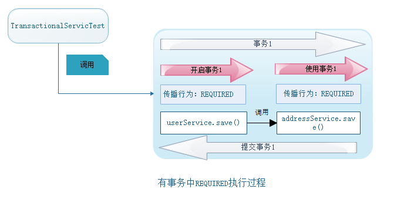
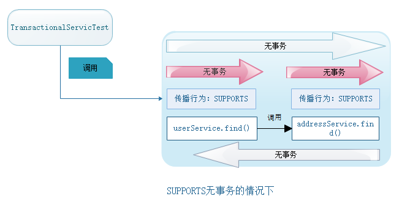

Spring-day03


## 目录

[TOC]

## 学习目标

```shell
1、理解AOP的相关概念
2、理解动态代理的原理及使用
3、编写spring AOP中不同通知类型
4、应用spring AOP中的注解
5、熟练spring的事务管理的方式和常用接口
6、理解事务的隔离级别
7、掌握事务的传播行为
8、完成spring声明式事务案例
```


## 第一章 AOP概述

### 1、什么是AOP？

#### 【1】AOP定义

AOP（Aspect Oriented Programming），即面向切面编程。
	通过预编译方式（静态代理）或运行期（动态代理）实现程序功能的统一维护（增强）的一种技术。

AOP是OOP的延续，是软件系统开发中的一个热点，也是spring框架的一个重点。

利用AOP可以实现【业务逻辑】各个部分的隔离，从而使得业务逻辑各个部分的耦合性降低，提高程序的可重用性，同时提高开发效率
	
简单理解：
	AOP是【面向切面编程】，使用【动态代理】技术，实现在【不修改java源代码】的情况下，运行时实现方法功能的【增强】

#### 【2】具象化理解

【具象化是抽象化的反义词】

要理解切面编程，就需要先理解什么是切面。

​	生活中：

​		用刀把面包切成数片，切开的每一片面包的切口就是切面==》摸果酱、加蔬菜

​		菜，锅、炉子共同来完成炒菜，锅与炉子，菜与锅就是切面==》锅有没有热、菜有没有熟、炉子火力够不够

​	编程中：

​		web层==>service层==>dao层，每一层之间也是一个切面，对象与对象之间，方法与方法之间，模块与模块之间都是一个个切面。

web层   ==>          service层       ==>     dao层

​	我们一般做活动功能的时候，一般对每一个活动接口都会做活动是否有效校验（是否活动时间内）、是不是需要用户登录校验。如如所示：


 这有个问题就是，有多少活动接口，就要多少次代码copy。对于一个“懒人”，这是不可容忍的。好，提出一个公共方法，每个接口都来调用这个接口。这里有点切面的味道了。 


 同样有个问题，我虽然不用每次都copy代码了，但是，每个接口总得要调用这个方法吧。于是就有了切面的概念，我将方法注入到接口调用的某个地方（切点），而红框中就是面向切面编程。 


在不修改业务代码的情况下，使用AOP进行切面编程，对原有功能进行【增强】

### 2、AOP的优势及使用场景

#### 【1】优势

​	非侵入性：使用动态代理技术，不修改java源代码对已有方法功能进行增强

```properties
说明：
	1、我们开发好了分享活动主业务代码
	2、需求人员需要填活动校验的代码
	3、我们有不想修改主业务代码掺杂活动校验的代码
	4、此时我们可以用AOP的方式开发
```

​	高内聚：集中处理某一个关注点，方便维护

```properties
说明:
	AOP的切面只关注活动校验的代码
```

​	易移植：可以方便的增加、删除、修改某一个关注点的切入业务

```properties
说明：
	活动校验规则发生改变，我们可以及时修改，而不需要修改主业务代码
```


#### 【2】使用场景

大多情况下，都是适用于非功能性需求中

- ​	权限控制


- ​	日志收集


- ​	缓存设置


- ​	分布式追踪


- ​	异常处理


- ​	事务控制


### 3、AOP实现原理

AOP的底层实现需要依赖于动态代理技术；
动态代理就是在程序运行期间，不修改源码对已有方法进行增强。

## 第二章 代理模式

### 1、代理模式概念

我很忙，忙的没空理你，那你要找我呢，就先找我的代理人吧，那代理人总要知道被代理人能做哪些事情不能做哪些事情吧，那就是两个人具备同一个接口，被代理人虽然不想干活，但是代理的人能干活呀。

生活中的房屋中介


### 2、代理模式分类

静态代理：

​		【定义】

​				在程序运行之前，代理类.class文件就已经被创建

​		【实现】

​				由程序员创建或特定工具自动生成源代码，在对其编译	

动态代理：

​		【定义】

​				程序运行时通过反射机制动态创建的，对方法的【增强】，不需要修改源码

​		【实现】

​				基于接口：JDK动态代理
​				基于子类：CGLib动态代理

### 3、静态代理（1）

#### 【1】目标

```
使用静态代理的方式，完成通过房产中介租房的操作；
```

#### 【2】实现

生活中的房屋中介抽象：


```
步骤：
1、创建项目；
2、定义接口：HouseAgencyCompany及接口中租房的方法：rentingHouse；
3、定义房主类：HouseOwner 中介类 HouseProxy均实现接口HouseAgencyCompany；
4、租客类Customer调用HouseProxy完成租房
```

##### 【2.1】创建项目

新建项目spring-day03-01house-staticProxy


##### 【2.2】定义HouseAgencyCompany

```java
package com.itheima.project;

/**
 * @Description：中介公司
 */
public interface HouseAgencyCompany {

    /**
     * @Description 租房子
     */
    void rentingHouse();
}
```

##### 【2.3】定义HouseOwner、HouseProxy

```java
package com.itheima.spring;

/**
 * @Description：被代理人（房东）
 */
public class HouseOwner implements HouseAgencyCompany {

    @Override
    public void rentingHouse() {
        System.out.println("房东签合同");
    }
}

```

```java
package com.itheima.spring;

/**
 * @Description：中介（代理人）
 */
public class HouseProxy implements HouseAgencyCompany {

    /**
     * 被代理人
     */
    private HouseOwner houseOwner;

    public HouseProxy() {
        this.houseOwner = new HouseOwner();
    }

    @Override
    public void rentingHouse() {
        System.out.println("中介带看房子");
        System.out.println("中介约房东");
        houseOwner.rentingHouse();
        System.out.println("中介完成租房");
    }
}

```


##### 【2.4】定义Customer

```java
package com.itheima.spring;

import org.junit.jupiter.api.Test;

/**
 * @Description：租客
 */
public class Customer {

    @Test
    public void needHouse(){
        HouseOwner houseOwner  = new HouseOwner();
        houseOwner.rentingHouse();
        System.out.println("==================================");
        HouseAgencyCompany houseAgencyCompany = new HouseProxy();
        houseAgencyCompany.rentingHouse();
    }
}

```

##### 【2.5】运行结果


#### 【3】静态代理小结

```
1、静态代理：在程序运行前手动创建代理类，代理类和目标类需要实现相同接口；
```

### 4、动态代理

#### 【1】思考

```
静态代理有什么问题？
	如果目标类中有多个方法都需要增强，我们得为每一个服务都得创建代理类，工作量太大，不易管理。同时接口一旦发生改变，代理类也得相应修改
```

#### 【2】动态代理概述

​			代理类在程序运行时创建的方式被成为动态代理。也就是说，代理类并不是在Java代码中定义的，而是在运行时根据我们在Java代码中的动态生成的。相比于静态代理，动态代理的优势在于可以很方便的对代理类的函数进行统一的处理，而不用修改每个代理类的函数。

#### 【3】jdk动态代理（2）

jdk动态代理:

​		必须基于接口

 **java.lang.reflect.Proxy：**
		Java动态代理机制的主类，提供了一组静态方法来为一组接口动态地生成代理类及其实例。

```java
//方法1: 该方法用于获取指定动态代理对象所关联的调用处理器
static InvocationHandler getInvocationHandler(Object proxy)
 
//方法2：该方法用于获取关联于指定类装载器和一组接口的动态代理对象
static Class getProxyClass(ClassLoader loader, Class[] interfaces)
 
//方法3：该方法用于判断指定类对象是否是一个动态代理类
static boolean isProxyClass(Class cl)
 
//方法4：该方法用于为指定类装载器、一组接口及调用处理器生成动态代理对象：1、类加载器 2、接口数组、调用处理器（增强部分的业务代码）
static Object newProxyInstance(ClassLoader loader, Class[] interfaces, InvocationHandler h)
```

**java.lang.reflect.InvocationHandler：**
 调用处理器接口，它自定义了一个invoke方法，用于集中处理在动态代理对象上的方法调用，通常在该方法中实现对委托类的代理访问。每次生成动态代理对象时都需要指定一个实现了该接口的调用处理器对象。

InvocationHandler的核心方法：

```java
//该方法负责集中处理动态代理类上的所有方法调用。
//第一个参数是代理对象，第二个参数是被调用的方法对象，第三个方法是调用参数。
//调用处理器根据这三个参数进行预处理或分派到委托类实例上反射执行。
Object invoke(Object proxy, Method method, Object[] args)
```

##### 【3.1】目标

```
使用jdk动态代理的方式，增强租房方法,使得租房方法前后打印输入日志信息；
```

##### 【3.2】实现

###### 【3.2.1】创建项目

拷贝spring-day03-01house-staticProxy创建spring-day03-02house-jdkProxy


###### 【3.2.2】删除HouseProxy

###### 【3.2.3】修改Customer

```java
package com.itheima.project;

import org.junit.Test;

import java.lang.reflect.InvocationHandler;
import java.lang.reflect.Method;
import java.lang.reflect.Proxy;

/**
 * @Description：租客
 */
public class Customer {

    HouseOwner houseOwner = new HouseOwner();

    @Test
    public void needHouse(){

        HouseAgencyCompany houseProxy = (HouseAgencyCompany) Proxy.newProxyInstance(houseOwner.getClass().getClassLoader(),
                houseOwner.getClass().getInterfaces(), new InvocationHandler() {
                    @Override
                    public Object invoke(Object proxy, Method method, Object[] args) throws Throwable {
                        System.out.println("中介公司让中介带客户看房");
                        Object object = method.invoke(houseOwner, args);
                        System.out.println("中介公司让中介完成租房业务");
                        return object;
                    }
                });
        houseProxy.rentingHoues();

    }
}


```

###### 【3.2.4】测试结果


##### 【3.3】小结

~~~html
1、JDK动态代理：基于接口的；
2、JDK动态代理实现要点：
		Proxy类
		newProxyInstance静态方法
		InvocationHandler增强方法
~~~


#### 【4】cglib动态代理（3）

##### 【4.1】思考

```
如果目标类没有实现接口呢?
	那么就无法使用JDK的动态代理，因此这种方式有其局限性，必须实现一个接口。
可以使用的方案：
	使用CGLIB动态代理：基于子类（包含本类）
```

**net.sf.cglib.proxy.Enhancer**

 Enhancer类是CGLib中的一个字节码增强器，作用用于生成代理对象，跟上一章所学的Proxy类相似，常用方式为： 

```java
 //方法1：该方法用于为指定目标类、回调对象 1、类的类型，2、调用处理器
 public static Object create(Class type, Callback callback)
```

**net.sf.cglib.proxy.MethodInterceptor**

```java
//方法1：
Object intercept(Object var1, Method var2, Object[] var3, MethodProxy var4) throws Throwable;
```

##### 【4.2】实现

###### 【4.2.1】创建项目

拷贝spring-day03-01house-staticProxy创建spring-day03-03house-cglibProxy


```xml
<!--cglib依赖-->
<dependency>
    <groupId>cglib</groupId>
    <artifactId>cglib</artifactId>
    <version>3.1</version>
</dependency>
```

###### 【4.2.2】删除HouseProxy和HouseAgencyCompany


###### 【4.2.3】修改Customer

```java
package com.itheima.spring;

import net.sf.cglib.proxy.Enhancer;
import net.sf.cglib.proxy.MethodInterceptor;
import net.sf.cglib.proxy.MethodProxy;
import org.junit.Test;

import java.lang.reflect.Method;

/**
 * @Description：
 */
public class Customer {


    @Test
    public void needHouse(){
        System.out.println("=====================");
        //代理模式下的租房
        HouseOwner houseOwnerProxy = (HouseOwner) Enhancer.create(HouseOwner.class,
                new MethodInterceptor() {
            @Override
            public Object intercept(Object o, Method method,
                                    Object[] objects, MethodProxy methodProxy) throws Throwable {
                //增强
                System.out.println("中介小王：带你看房子");
                //返回结果
                return  methodProxy.invokeSuper(o, objects);
            }
        });

        houseOwnerProxy.renttingHouse();
    }
}

```

###### 【4.2.4】测试结果


##### 【4.3】小结

```
1、Cglib动态代理：基于类，无需实现接口；
2、被代理的目标类不能被final修饰
```

#### 【5】动态代理小结

```
通过动态代理可以完成对已有方法的功能的增强：
1、JDK动态代理
	要求：
		被代理对象至少实现一个接口
	应用场景：
		被代理对象有接口

2、CGLIB动态代理
	要求：
		被代理类上不能用static、final修饰
	应用场景：
		被代理对象没有实现接口
```


### 5、手写AOP(4)

在前面的课程中我们手写过自己的IOC，那么下面我们在自己IOC的基础上手写自己的AOP

#### 【1】思考


```
1、我们在自定义IOC中我们实例化对象采用反射机制，如果需要对bean增强应该怎么做？
实例化过程不是直接实例化目标类，而是通过代理工厂使用动态代理实例化代理类
```

#### 【2】目标

```
1、手写aop
	【1】使用动态代理实现增强打印信息（不修改saveAccount()）
	【2】理解什么时候被代理==>bean初始化的时候，就为其生成代理类
```


#### 【3】实现

```
步骤：
	1、添加proxy层，添加CglibProxy实现MethodInterceptor、JdkProxy实现InvocationHandler
	2、添加ProxyBeanFactory，根据目标类是否有接口判断选择jdk和cglib
	3、修改BeanFactory
```

##### 【3.1】创建项目

拷贝spring-day01-03myioc创建spring-day03-04myaop


##### 【3.2】添加proxy层

```java
package com.itheima.spring.proxy;

import java.lang.reflect.InvocationHandler;
import java.lang.reflect.Method;

/**
 * @Description：jdk动态代理
 */
public class JdkProxy implements InvocationHandler {

    private Object targClass;

    private String joinPoint = "saveAccount";

    public JdkProxy(Object targClass) {
        this.targClass = targClass;
    }

    @Override
    public Object invoke(Object proxy, Method method, Object[] args) throws Throwable {
        Object object = null;
        if (joinPoint.equals(method.getName())){
            System.out.println("JDK增强："+method.getName());
        }
        object = method.invoke(targClass, args);
        return object;
    }
}


```


```java
package com.itheima.spring.proxy;

import net.sf.cglib.proxy.MethodInterceptor;
import net.sf.cglib.proxy.MethodProxy;

import java.lang.reflect.Method;

/**
 * @Description：cglib动态代理
 */
public class CglibProxy implements MethodInterceptor {

    private Object targClass;

    private String joinPoint = "saveAccount";

    public CglibProxy(Object targClass) {
        this.targClass = targClass;
    }

    @Override
    public Object intercept(Object o, Method method, Object[] objects, MethodProxy methodProxy) throws Throwable {
        Object object = null;
        if (joinPoint.equals(method.getName())){
            System.out.println("Cglib增强："+method.getName());
        }
        object = method.invoke(targClass, objects);
        return object;
    }
}
```

##### 【3.3】添加ProxyBeanFactory

```java
package com.itheima.spring.factory;

import com.itheima.spring.proxy.CglibProxy;
import com.itheima.spring.proxy.JdkProxy;
import net.sf.cglib.proxy.Enhancer;

import java.lang.reflect.Proxy;

/**
 * @Description：工厂bean的动态代理
 */
public class BeanProxyFactory {
	//我为谁干活
    private Object targClass;

    //传入目标类
    public BeanProxyFactory(Object targClass) {
        this.targClass = targClass;
    }

    public Object getBean() {
        //获得对应类的接口
        Class<?>[] interfaces = targClass.getClass().getInterfaces();
        Object object = null;
        //接口数目大于0
        if (interfaces.length>0){
            //jdk代理
            JdkProxy jdkProxy = new JdkProxy(targClass);
            object = Proxy.newProxyInstance(targClass.getClass().getClassLoader(), interfaces, jdkProxy);
        }else {
            //cglib代理
            CglibProxy cglibProxy  = new CglibProxy(targClass);
            object = Enhancer.create(targClass.getClass(), cglibProxy);
        }
        return object;
    }
}

```

##### 【3.4】修改MyBeanFactory

```java
package com.itheima.spring.factory;

import javafx.beans.binding.ObjectExpression;

import java.io.IOException;
import java.util.*;

/**
 * @Description：bean工厂
 */
public class BeanFactory {

    //1、事先存储容器
    private static Map<String, Object> map = new HashMap<>();
    //2、加载配置文件
    static {
        Properties properties = new Properties();
        try {
            properties.load(BeanFactory.class.getClassLoader().getResourceAsStream("db.properties"));
            Enumeration<?> enumeration = properties.propertyNames();
            while (enumeration.hasMoreElements()) {
                String key = (String) enumeration.nextElement();
                String value = (String) properties.get(key);
                //3、实例化bean
                //Object beanObject = Class.forName(value).newInstance();
                BeanProxyFactory beanProxyFactory = new BeanProxyFactory(Class.forName(value).newInstance());
                Object beanObject = beanProxyFactory.getBean();
                //4、放入容器
                map.put(key,beanObject);
            }
        } catch (IOException e) {
            e.printStackTrace();
        } catch (ClassNotFoundException e) {
            e.printStackTrace();
        } catch (IllegalAccessException e) {
            e.printStackTrace();
        } catch (InstantiationException e) {
            e.printStackTrace();
        }
    }


    //5、公共获得bean
    public static Object getBean(String calssName){
       return map.get(calssName);
    }
}


```

##### 【3.5】测试结果

可以看出：在调用service、dao层业务，我们在不改动代码的情况下，达到了增强的目标


#### 【4】手写AOP小结

```
1、什么时候加入切面?
	在初始化IOC的时候，我们使用动态代理的方式加入切面（AOP）
2、为什么使用AOP？
	不需要修改业务，可以达到业务增强的目的
```


## 第三章 Spring中的AOP【重点】

通过前面课程我们手写了一个自己的AOP，下面我们对照自己的AOP去理解一下AOP相关术语

### 1、AOP相关术语

```shell
#Joinpoint（连接点）:
	在spring中，连接点指的都是方法（指的是那些要被增强功能的候选方法）

#Pointcut（切入点）:
	切入点是指我们要对哪些Joinpoint进行拦截的定义。

#Advice（通知）:
	通知指的是拦截到Joinpoint之后要做的事情。即增强的功能
	通知类型：前置通知、后置通知、异常通知、最终通知、环绕通知

#Target（目标对象）:
	被代理的对象。

#Proxy（代理对象）:
	一个类被AOP织入增强后，即产生一个结果代理类。

#Weaving（织入）:
	织入指的是把增强用于目标对象。创建代理对象的过程

#Aspect（切面）:
	切面指的是切入点和通知的结合`
```

这些名词在我们手写AOP中对应关系：


### 2、基于xml的Spring-AOP（5）

#### 【1】AOP的标签说明表

| 属性                                                         | 说明       |
| ------------------------------------------------------------ | ---------- |
| < aop:config >                                               | 声明AOP    |
| <aop:aspect  id="唯一标识" ref="通知bean的ID">               | 声明切面   |
| <aop:pointcut  id="连接点ID" expression="连接点表达式">< /aop:pointcut > | 声明连接点 |
| <aop:before method="通知方法" pointcut-ref="连接点ID">< /aop:before > | 前置通知   |
| <aop:after-returning method="通知方法" pointcut-ref="连接点ID">< /aop:after-returning > | 后置通知   |
| <aop:after-throwing method="通知方法" pointcut-ref="连接点ID">< /aop:after-throwing > | 异常通知   |
| <aop:after method="通知方法" pointcut-ref="连接点ID">< /aop:after > | 最终通知   |
| <aop:around method="通知方法" pointcut-ref="连接点ID">< /aop:around > | 环绕通知   |

#### 【2】案例

##### 【2.1】思考

​	我们知道了关于AOP的术语，以及基础标签有那些，那他们是怎么使用的呢？

##### 【2.2】目标

```
1、掌握springAOP的xml配置
2、给业务增加执行日志
```

##### 【2.3】实现

```
步骤：
	1、增加日志通知bean-->交给spring容器管理
	2、导入springAOP依赖
	3、在bean.xml中配置springAOP
```

###### 【2.3.1】创建项目

拷贝spring-day02-13spring-test-xml创建spring-day03-05spring-aop-xml


###### 【2.3.2】导入springAOP依赖

```xml
	<!--spring aop相关-->
    <dependency>
      <groupId>org.springframework</groupId>
      <artifactId>spring-aspects</artifactId>
      <version>${spring.version}</version>
    </dependency>
```


###### 【2.3.3】创建LogInfoService

```java
package com.itheima.spring.service;

import org.aspectj.lang.JoinPoint;

/**
 * @Description：日志服务
 */
public interface LogInfoService {

    /**
     * @Description 记录日志
     */
    void createLogInfo(JoinPoint joinPoint);
}

```

**JoinPoint 对象**

JoinPoint对象封装了SpringAop中切面方法的信息,在切面方法中添加JoinPoint参数,就可以获取到封装了该方法信息的JoinPoint对象

| 方法名                    | 功能                                                         |
| ------------------------- | ------------------------------------------------------------ |
| Signature getSignature(); | 获取封装了署名信息的对象,在该对象中可以获取到目标方法名,Class等信息 |
| Object[] getArgs();       | 获取传入目标方法的参数对象                                   |
| Object getTarget();       | 获取被代理的对象                                             |
| Object getThis();         | 获取代理对象                                                 |

###### 【2.3.4】创建LogInfoServiceImpl

```java
package com.itheima.spring.service.impl;

import com.itheima.spring.service.LogInfoService;
import org.aspectj.lang.JoinPoint;
import org.aspectj.lang.reflect.MethodSignature;

import java.lang.reflect.Method;

/**
 * @Description：日志服务实现
 */
public class LogInfoServiceImpl implements LogInfoService {

    @Override
    public void createLogInfo(JoinPoint joinPoint) {
        MethodSignature methodSignature = (MethodSignature) joinPoint.getSignature();
        Method method = methodSignature.getMethod();
        System.out.println("logInfo的内容："+method.getName());
    }
}

```

###### 【2.3.5】编辑bean.xml

```xml
<?xml version="1.0" encoding="UTF-8"?>
<beans xmlns="http://www.springframework.org/schema/beans"
       xmlns:xsi="http://www.w3.org/2001/XMLSchema-instance"
       xmlns:context="http://www.springframework.org/schema/context"
       xmlns:aop="http://www.springframework.org/schema/aop"
       xsi:schemaLocation="http://www.springframework.org/schema/beans
        http://www.springframework.org/schema/beans/spring-beans.xsd
        http://www.springframework.org/schema/context
        http://www.springframework.org/schema/context/spring-context.xsd
        http://www.springframework.org/schema/aop
        http://www.springframework.org/schema/aop/spring-aop.xsd
">

    <context:property-placeholder location="classpath*:db.properties"/>

    <context:component-scan base-package="com.itheima.spring"/>

    <bean id="dataSource" class="com.alibaba.druid.pool.DruidDataSource">
        <property name="driverClassName" value="${dataSource.driverClassName}"/>
        <property name="url" value="${dataSource.url}"/>
        <property name="username" value="${dataSource.username}"/>
        <property name="password" value="${dataSource.password}"/>
    </bean>

    <bean id="jdbcTemplate" class="org.springframework.jdbc.core.JdbcTemplate">
        <property name="dataSource" ref="dataSource"/>
    </bean>

    <!--配置日志通知bean-->
    <bean id="logInfoService" class="com.itheima.spring.service.impl.LogInfoServiceImpl"/>
    <!--第一步：声明AOP-->
    <aop:config>
        <!--第二步：声明切面，注入通知-->
        <aop:aspect id="logInfoAspect" ref="logInfoService">
            <!--第三步：声明切点-->
            <aop:pointcut id="logInfoPointcut" expression="execution(* com.itheima.spring.service.impl.AccountServiceImpl.findAll())"/>
            <!--第四步：配置后置通知-->
            <aop:after method="createLogInfo" pointcut-ref="logInfoPointcut"/>
        </aop:aspect>
    </aop:config>

</beans>
```

###### 【2.3.6】测试

执行AccountControllerTest的queryAll()


##### 【2.4】入门案例小结

```xml
1、springAOP的配置方式
    <!--配置日志通知bean-->
    <bean id="logInfoService" class="com.itheima.spring.service.impl.LogInfoServiceImpl"/>
    <!--第一步：声明AOP-->
    <aop:config>
        <!--第二步：声明切面，注入通知-->
        <aop:aspect id="logInfoAspect" ref="logInfoService">
            <!--第三步：声明切点-->
            <aop:pointcut id="logInfoPointcut" expression="execution(* com.itheima.spring.service.impl.AccountServiceImpl.findAll())"/>
            <!--第四步：配置最终置通知-->
            <aop:after method="createLogInfo" pointcut-ref="logInfoPointcut"/>
        </aop:aspect>
    </aop:config>

2、怎么获取连接点的方法、参数等信息
	MethodSignature methodSignature = (MethodSignature) joinPoint.getSignature();

3、怎么配置切点表达式？
	expression="execution(* 			com.itheima.spring.controller.AccountController.queryAll())"
```

### 3、切点表达式

#### 【1】execution

**表达式语法：**

~~~html
execution([修饰符] 返回值类型 包名.类名.方法名(参数))
~~~

**写法说明：**

```java
//全匹配方式：
	public java.util.List com.itheima.spring.service.impl.AccountServiceImpl.queryAll()
//访问修饰符可以省略	
	java.util.List com.itheima.spring.service.impl.AccountServiceImpl.queryAll()
//返回值可以使用*号，表示任意返回值
	* com.itheima.spring.service.impl.AccountServiceImpl.queryAll()
//包名可以使用*号，表示任意包，但是有几级包，需要写几个*
	* *.*.*.*.*.AccountServiceImpl.queryAll()
//使用..来表示当前包，及其子包
	* *..AccountServiceImpl.queryAll()
//类名可以使用*号，表示任意类
	* *..*.queryAll()
//方法名可以使用*号，表示任意方法
	* *..*.*()
//参数列表可以使用*，表示参数可以是任意数据类型，但是必须有参数
	* *..*.*(*)
//参数列表可以使用..表示有无参数均可，有参数可以是任意类型
	* *..*.*(..)
//全通配方式：不推荐
	* *..*.*(..)
```

**注：**
	通常情况下，我们都是对业务层的方法进行增强，所以切入点表达式都是切到业务层实现类。

```java
* com.itheima.spring.service.impl.*.*(..)
```


#### 【2】对象匹配

**语法：**

~~~html
bean(accountService)    //匹配名为accountService的bean
bean(*Service)  		//匹配Spring容器中所有以Service结尾的bean
~~~

例如：

```xml
<aop:pointcut id="logPointcut" expression="bean(accountController)"></aop:pointcut>
```

### 4、通知类型（6）

#### 【1】5种通知类型

```properties
1、前置通知：
	在目标方法执行前执行
2、后置正常通知：
	在目标方法正常返回后执行。它和异常通知只能执行一个
3、异常通知：
	在目标方法发生异常后执行。它和后置通知只能执行一个
4、最终通知：
	无论目标方法正常返回，还是发生异常都会执行
5、环绕通知： 
	在目标方法执行前后执行该增强方法
```

| 配置                                                         | 说明     |
| ------------------------------------------------------------ | -------- |
| <aop:before method="通知方法" pointcut-ref="连接点ID">< /aop:before > | 前置通知 |
| <aop:after-returning method="通知方法" pointcut-ref="连接点ID">< /aop:after-returning > | 后置通知 |
| <aop:after-throwing method="通知方法" pointcut-ref="连接点ID">< /aop:after-throwing > | 异常通知 |
| <aop:after method="通知方法" pointcut-ref="连接点ID">< /aop:after > | 最终通知 |
| <aop:around method="通知方法" pointcut-ref="连接点ID">< /aop:around > | 环绕通知 |

#### 【2】目标

```
通过案例理解AOP的5中通知方式
```

#### 【3】实现

##### 【3.1】创建项目

拷贝spring-day03-05spring-aop-xml创建spring-day03-06spring-aop-xml-inform


##### 【3.2】修改LogInfoService

添加5中通知接口

```java
package com.itheima.spring.service;


import org.aspectj.lang.JoinPoint;
import org.aspectj.lang.ProceedingJoinPoint;

/**
 * @Description：日志服务
 */
public interface LogInfoService {

    /**
     * @Description 前置通知
     */
    void beforeLogInfo(JoinPoint joinPoint);

    /**
     * @Description 后置正常返回通知
     */
    void afterReturningLogInfo(JoinPoint joinPoint);

    /**
     * @Description 异常通知
     */
    void afterThrowingLogInfo(JoinPoint joinPoint);

    /**
     * @Description 最终通知
     */
    void afterLogInfo(JoinPoint joinPoint);

    /**
     * @Description 环绕通知
     * @param  joinPoint 执行proceed方法的作用是让目标方法执行
     * @return
     */
    Object aroundLogInfo(ProceedingJoinPoint joinPoint);
}


```

##### 【3.3】修改LogInfoServiceImpl

```java
package com.itheima.spring.service.impl;

import com.itheima.spring.service.LogInfoService;
import org.aspectj.lang.JoinPoint;
import org.aspectj.lang.ProceedingJoinPoint;
import org.aspectj.lang.reflect.MethodSignature;

import java.lang.reflect.Method;

/**
 * @Description：
 */
public class LogInfoServiceImpl implements LogInfoService {


    @Override
    public void beforeLogInfo(JoinPoint joinPoint) {
        MethodSignature methodSignature = (MethodSignature) joinPoint.getSignature();
        Method method = methodSignature.getMethod();
        System.out.println("前置通知："+method.getName());
    }

    @Override
    public void afterReturningLogInfo(JoinPoint joinPoint) {
        MethodSignature methodSignature = (MethodSignature) joinPoint.getSignature();
        Method method = methodSignature.getMethod();
        System.out.println("后置正常通知："+method.getName());
    }

    @Override
    public void afterThrowingLogInfo(JoinPoint joinPoint) {
        MethodSignature methodSignature = (MethodSignature) joinPoint.getSignature();
        Method method = methodSignature.getMethod();
        System.out.println("后置异常通知："+method.getName());
    }

    @Override
    public void afterLogInfo(JoinPoint joinPoint) {
        MethodSignature methodSignature = (MethodSignature) joinPoint.getSignature();
        Method method = methodSignature.getMethod();
        System.out.println("后置最终通知："+method.getName());
    }

    @Override
    public Object aroundLogInfo(ProceedingJoinPoint joinPoint) {
        MethodSignature methodSignature = (MethodSignature) joinPoint.getSignature();
        Method method = methodSignature.getMethod();
        try {
            System.out.println("环绕-前置通知："+method.getName());
            Object object = joinPoint.proceed();
            System.out.println("环绕-后置正常通知："+method.getName());
            return object;
        } catch (Throwable throwable) {
            System.out.println("环绕-后置异常通知："+method.getName());
            throw new RuntimeException(throwable);
        }finally {
            System.out.println("环绕-最终通知："+method.getName());
        }
    }
}
```

##### 【3.4】配置通知

```xml
<?xml version="1.0" encoding="UTF-8"?>
<beans xmlns="http://www.springframework.org/schema/beans"
       xmlns:xsi="http://www.w3.org/2001/XMLSchema-instance"
       xmlns:context="http://www.springframework.org/schema/context"
       xmlns:aop="http://www.springframework.org/schema/aop"
       xsi:schemaLocation="http://www.springframework.org/schema/beans
        http://www.springframework.org/schema/beans/spring-beans.xsd
        http://www.springframework.org/schema/context
        http://www.springframework.org/schema/context/spring-context.xsd
        http://www.springframework.org/schema/aop
        http://www.springframework.org/schema/aop/spring-aop.xsd
">

    <context:property-placeholder location="classpath*:db.properties"/>

    <context:component-scan base-package="com.itheima.spring"/>

    <bean id="dataSource" class="com.alibaba.druid.pool.DruidDataSource">
        <property name="driverClassName" value="${dataSource.driverClassName}"/>
        <property name="url" value="${dataSource.url}"/>
        <property name="username" value="${dataSource.username}"/>
        <property name="password" value="${dataSource.password}"/>
    </bean>

    <bean id="jdbcTemplate" class="org.springframework.jdbc.core.JdbcTemplate">
        <property name="dataSource" ref="dataSource"/>
    </bean>

    <!--配置日志通知bean-->
    <bean id="logInfoService" class="com.itheima.spring.service.impl.LogInfoServiceImpl"/>

    <!--第一步：声明AOP-->
    <aop:config>
        <!--第二步：声明切面，注入通知-->
        <aop:aspect id="logInfoAspect" ref="logInfoService">
            <!--第三步：声明切点-->
            <aop:pointcut id="logInfoPointcut" expression="execution(* com.itheima.spring.service.impl.AccountServiceImpl.findAll())"/>
            <!--第四步：配置通知-->
            <aop:before method="beforeLogInfo" pointcut-ref="logInfoPointcut"/>
            <aop:after-returning method="afterReturningLogInfo" pointcut-ref="logInfoPointcut"/>
            <aop:after-throwing method="afterThrowingLogInfo" pointcut-ref="logInfoPointcut"/>
            <aop:after method="afterLogInfo" pointcut-ref="logInfoPointcut"/>
            <aop:around method="aroundLogInfo" pointcut-ref="logInfoPointcut"/>
        </aop:aspect>
    </aop:config>

</beans>
```

##### 【3.5】无异常执行

执行AccountControllerTest的findAll()方法


##### 【3.6】修改AccountServiceImpl

增加异常

```java
package com.itheima.spring.service.impl;

import com.itheima.spring.dao.AccountDao;
import com.itheima.spring.pojo.Account;
import com.itheima.spring.service.AccountService;
import org.springframework.beans.factory.annotation.Autowired;
import org.springframework.stereotype.Component;

import java.util.List;

/**
 * @Description：用户业务层
 */
@Component("accountService")
public class AccountServiceImpl implements AccountService {

    @Autowired
    private AccountDao accountDao;

    @Override
    public int saveAccount(Account account) {
        return accountDao.saveAccount(account);
    }

    @Override
    public int deleteAccountById(int id) {
        return accountDao.deleteAccountById(id);
    }

    @Override
    public int updateAccountById(Account account) {
        return accountDao.updateAccountById(account);
    }

    @Override
    public Account findAccountById(int id) {
        return accountDao.findAccountById(id);
    }

    @Override
    public List<Account> findAll() {
        double i = 1/0;
        return accountDao.findAll();
    }

    @Override
    public Integer countAccount() {
        return accountDao.countAccount();
    }

}


```

##### 【3.7】异常执行


不配置环绕通知的情况


#### 【4】小结

```properties
1、前置通知：
	在目标方法执行前执行
2、后置通知：
	在目标方法正常返回后执行。它和异常通知只能执行一个
3、异常通知：
	在目标方法发生异常后执行。它和后置通知只能执行一个
4、最终通知：
	无论目标方法正常返回，还是发生异常都会执行
5、环绕通知： 
	在目标方法执行前后执行该增强方法
```


### 5、基于xml+annotation的Spring-AOP(7)

#### 【1】AOP基础注解XML对照表

| xml                    | 注解            | 说明         |
| ---------------------- | --------------- | ------------ |
| <aop:aspect >          | @Aspect         | 声明切面     |
| <aop:before >          | @Before         | 前置通知     |
| <aop:after-returning > | @AfterReturning | 后置正常通知 |
| <aop:after-throwing >  | @AfterThrowing  | 后置异常通知 |
| <aop:after >           | @After          | 最终通知     |
| <aop:around >          | @Around         | 环绕通知     |

@Before、@AfterReturning、@AfterThrowing、@After、@Around可以直接配置切入点

```java
@Before(value = "execution(* *..AccountServiceImpl.queryAll())")
```

【注解生效】

在bean.xml中配置:

```xml
<!--开启AOP注解-->
<aop:aspectj-autoproxy />
```


#### 【2】基于xml+annotation案例

##### 【2.1】目标

```
1、回顾IOC的注解、DI注解
1、使用注解替换AOP的部分XML配置
2、掌握spring-aop的注解配置
```

##### 【2.2】实现

###### 【2.2.1】创建项目

拷贝spring-day03-06spring-aop-xml-inform创建spring-day03-07spring-aop-xml-annotation


###### 【2.2.2】修改配置文件

添加启动aop的自动代理

```xml
<!--启动aop的自动代理-->
<aop:aspectj-autoproxy></aop:aspectj-autoproxy>
```

记得添加IOC自动扫描配置

```xml
<!--启动自动注解-->
<context:component-scan base-package="com.itheima"></context:component-scan>
```

完整配置：

```xml
<?xml version="1.0" encoding="UTF-8"?>
<beans xmlns="http://www.springframework.org/schema/beans"
        xmlns:xsi="http://www.w3.org/2001/XMLSchema-instance"
        xmlns:context="http://www.springframework.org/schema/context"
        xmlns:aop="http://www.springframework.org/schema/aop"
        xsi:schemaLocation="http://www.springframework.org/schema/beans
        http://www.springframework.org/schema/beans/spring-beans.xsd
        http://www.springframework.org/schema/context
        http://www.springframework.org/schema/context/spring-context.xsd
        http://www.springframework.org/schema/aop
        http://www.springframework.org/schema/aop/spring-aop.xsd">

    <!--读取外部根目录下资源配置文件-->
    <context:property-placeholder location="classpath:db.properties"></context:property-placeholder>

    <!--启动aop的自动代理-->
    <aop:aspectj-autoproxy></aop:aspectj-autoproxy>

    <!--启动自动注解-->
    <context:component-scan base-package="com.itheima"></context:component-scan>

    <!--配置出druidDataSource数据源-->
    <bean id="druidDataSource" class="com.alibaba.druid.pool.DruidDataSource">
        <property name="driverClassName" value="${dataSource.driverClassName}"></property>
        <property name="url" value="${dataSource.url}"></property>
        <property name="username" value="${dataSource.username}"></property>
        <property name="password" value="${dataSource.password}"></property>
    </bean>

    <!--配置jdbc查询模板，注入druidDataSource数据源-->
    <bean id="jdbcTemplate" class="org.springframework.jdbc.core.JdbcTemplate">
        <property name="dataSource" ref="druidDataSource"></property>
    </bean>
    
</beans>
```

###### 【2.2.3】bean托管spring-IOC

此处内容为spring-day02中学习的IOC及DI的注解内容（详见spring-day03-07spring-aop-annotation项目）

【2.2.4】配置LogInfoServiceImpl

```java
package com.itheima.spring.service.impl;

import com.itheima.spring.service.LogInfoService;
import org.aspectj.lang.JoinPoint;
import org.aspectj.lang.ProceedingJoinPoint;
import org.aspectj.lang.annotation.*;
import org.aspectj.lang.reflect.MethodSignature;
import org.springframework.stereotype.Component;

import java.lang.reflect.Method;

/**
 * @Description：
 */
@Component
@Aspect
public class LogInfoServiceImpl implements LogInfoService {


    @Override
    @Before("execution(* com.itheima.spring.service.impl.AccountServiceImpl.findAll())")
    public void beforeLogInfo(JoinPoint joinPoint) {
        MethodSignature methodSignature = (MethodSignature) joinPoint.getSignature();
        Method method = methodSignature.getMethod();
        System.out.println("前置通知："+method.getName());
    }

    @Override
    @AfterReturning("execution(* com.itheima.spring.service.impl.AccountServiceImpl.findAll())")
    public void afterReturningLogInfo(JoinPoint joinPoint) {
        MethodSignature methodSignature = (MethodSignature) joinPoint.getSignature();
        Method method = methodSignature.getMethod();
        System.out.println("后置正常通知："+method.getName());
    }

    @Override
    @AfterThrowing("execution(* com.itheima.spring.service.impl.AccountServiceImpl.findAll())")
    public void afterThrowingLogInfo(JoinPoint joinPoint) {
        MethodSignature methodSignature = (MethodSignature) joinPoint.getSignature();
        Method method = methodSignature.getMethod();
        System.out.println("后置异常通知："+method.getName());
    }

    @Override
    @After("execution(* com.itheima.spring.service.impl.AccountServiceImpl.findAll())")
    public void afterLogInfo(JoinPoint joinPoint) {
        MethodSignature methodSignature = (MethodSignature) joinPoint.getSignature();
        Method method = methodSignature.getMethod();
        System.out.println("后置最终通知："+method.getName());
    }

    @Override
    @Around("execution(* com.itheima.spring.service.impl.AccountServiceImpl.findAll())")
    public Object aroundLogInfo(ProceedingJoinPoint joinPoint) {
        MethodSignature methodSignature = (MethodSignature) joinPoint.getSignature();
        Method method = methodSignature.getMethod();
        try {
            System.out.println("环绕-前置通知："+method.getName());
            Object object = joinPoint.proceed();
            System.out.println("环绕-后置正常通知："+method.getName());
            return object;
        } catch (Throwable throwable) {
            System.out.println("环绕-后置异常通知："+method.getName());
            throw new RuntimeException(throwable);
        }finally {
            System.out.println("环绕-最终通知："+method.getName());
        }
    }
}


```

###### 【2.2.4】运行测试

运行AccountControllerTest的queryAll


##### 【2.3】小结

```
1、@Aspect
	声明当前类使用切面类（通知类）
2、@Before
	前置通知：目标方法执行之前执行
3、@AfterReturning
	后置通知：目标方法执行完成之后执行
4、@AfterThrowing
	异常通知：目标方法发生异常时执行
5、@After
	最终通知：不管有没有异常，一定会执行。
6、@Around
	环绕通知：手动执行目标方法，完成各类通知的配置。
```

### 6、基于全annotation的Spring-AOP(8)

#### 【1】AOP配置注解说明表

| XML                       | 注解                    | 说明        |
| ------------------------- | ----------------------- | ----------- |
| <aop:aspectj-autoproxy /> | @EnableAspectJAutoProxy | 开启注解AOP |

#### 【2】基于全annotation案例

##### 【2.1】目标

```
1、回顾IOC的配置注解
1、使用AOP配置类注解替换的剩余XML配置
2、掌握spring-aop的配置类注解
```

##### 【2.2】实现

###### 【2.2.1】创建项目

拷贝spring-day03-07spring-aop-xml-annotation创建spring-day03-08spring-aop-annotation


###### 【2.2.2】添加DbConfig

```java
package com.itheima.spring.config;

import com.alibaba.druid.pool.DruidDataSource;
import org.springframework.beans.factory.annotation.Qualifier;
import org.springframework.beans.factory.annotation.Value;
import org.springframework.context.annotation.Bean;
import org.springframework.context.annotation.Configuration;
import org.springframework.context.annotation.PropertySource;
import org.springframework.jdbc.core.JdbcTemplate;

import javax.sql.DataSource;

/**
 * @Description：
 */
@Configuration
@PropertySource(value={"classpath:db.properties"})
public class DbConfig {

    @Value("${dataSource.driverClassName}")
    public String driverClassName;

    @Value("${dataSource.url}")
    public String url;

    @Value("${dataSource.username}")
    public String username;

    @Value("${dataSource.password}")
    public String password;

    @Bean(name = "druidDataSource")
    public DataSource createDataSource() {
        DruidDataSource dataSource = new DruidDataSource();
        dataSource.setDriverClassName(driverClassName);
        dataSource.setUrl(url);
        dataSource.setUsername(username);
        dataSource.setPassword(password);
        return dataSource;
    }

    @Bean(name = "jdbcTemplate")
    public JdbcTemplate createJdbcTemplate(@Qualifier("druidDataSource") DataSource dataSource) {
        return new JdbcTemplate(dataSource);
    }

}

```

###### 【2.2.3】添加SpringConfig

添加@EnableAspectJAutoProxy启动AOP

```java
package com.itheima.spring.config;

import org.springframework.context.annotation.ComponentScan;
import org.springframework.context.annotation.Configuration;
import org.springframework.context.annotation.EnableAspectJAutoProxy;
import org.springframework.context.annotation.Import;


/**
 * @Description：
 */
@Configuration
@ComponentScan(value = {"com.itheima"})
@Import( value = {DbConfig.class})
@EnableAspectJAutoProxy
public class SpringConfig {


}

```

【2.2.4】修改AccountControllerTest

```java
package com.itheima.spring;

import com.itheima.spring.config.SpringConfig;
import com.itheima.spring.controller.AccountController;
import com.itheima.spring.pojo.Account;
import org.junit.Before;
import org.junit.Test;
import org.junit.runner.RunWith;
import org.springframework.beans.factory.annotation.Autowired;
import org.springframework.context.ApplicationContext;
import org.springframework.context.support.ClassPathXmlApplicationContext;
import org.springframework.test.context.ContextConfiguration;
import org.springframework.test.context.junit4.SpringJUnit4ClassRunner;

import java.util.List;

/**
 * <b>ClassName：AccountControllerTest
 *
 * @author ：Shuwq
 * @version ：1.0.0
 * @date ：2019/11/18 10:35
 * @Description：测试
 */
@RunWith(SpringJUnit4ClassRunner.class)
@ContextConfiguration(classes = SpringConfig.class)
public class AccountControllerTest {

    @Autowired
    private AccountController accountController;

    /**
     * 创建用户
     */
    @Test
    public void saveAccount() {
        Account account = new Account();
        account.setAccountName("张三");
        account.setMoney(2000F);
        int flag = accountController.saveAccount(account);
        System.out.println("创建用户受影响行数："+flag);

    }

    /**
     * 删除用户
     */
    @Test
    public void deleteAccountById() {
        int id = 7;
        int flag =accountController.deleteAccountById(id);
        System.out.println("删除用户受影响行数："+flag);
    }

    /**
     * 修改用户
     */
    @Test
    public void updateAccountById() {
        Account account = new Account();
        account.setId(5);
        account.setAccountName("张三");
        account.setMoney(2000F);
        int flag =accountController.updateAccountById(account);
        System.out.println("修改用户受影响行数："+flag);
    }


    /**
     * 按ID查询用户
     */
    @Test
    public void queryAccountById() {
        int id = 5;
        Account account =accountController.queryAccountById(id);
        System.out.println("按ID查询用户:"+account.toString());
    }

    /**
     * 查询所有用户
     */
    @Test
    public void queryAll() {
        List<Account> list = accountController.queryAll();
    }

    /**
     * 统计用户个数
     */
    @Test
    public void countAccount() {
       int flag =  accountController.countAccount();
       System.out.println("统计用户个数:"+flag);
    }
}

```

###### 【2.2.4】运行测试

运行AccountControllerTest的queryAll


##### 【2.3】小结

```
@EnableAspectJAutoProxy AOP的配置类
```


## 第四章 Spring的事务管理【重点】

### 1、事务的回顾

#### 【1】事务的定义

 		是数据库操作的最小工作单元，是作为单个逻辑工作单元执行的一系列操作，这些操作作为一个整体一起向系统提交，要么都执行、要么都不执行；事务是一组不可再分割的操作集合 

#### 【2】事务的ACID原则

事务具有4个基本特性：原子性、一致性、隔离性、持久性。也就是我们常说的ACID原则

- **原子性**（Atomicity）：
      一个事务已经是一个不可再分割的工作单位。事务中的全部操作要么都做；要么都不做

  ```properties
  例如：A和B两个人一共1000元，A给B转账100元，A付款100元，B收款100元，
  	 A的付款行为和B的收款行为要么都成功，要么都失败
  ```

- **一致性**（Consistency）：
       事务的执行使数据从一个状态转换为另一个状态，但是对于整个数据的完整性保持稳定。 

  ```properties
  例如：A和B两个人一共1000元，无论A,B两人互相转账多少次，A和B两个人总额都应该是1000元
  ```

- **隔离性**（Isolation）：
       事务允许多个用户对同一个数据进行并发访问，而不破坏数据的正确性 和完整性。同时，并行事务的修改必须与其他并行事务的修改相互独立。 

  ```properties
  例如：万达影院有《叶问4》电影票100张，允许所有人同时去淘票票上购票，当第100张电影票被A,B,C3人同时购买，如果A拿到第100张电影票，但是还在犹豫要不要付钱，则B,C必须等待A的决定，如果A决定付钱，B.C就无法抢到票，如果A超时不付钱，则这第100张电影票回归票池,从新分配。
  ```

- **持久性**（Durability）：
  	一个事务一旦提交，它对数据库中数据的改变会永久存储起来。其他操作不会对它产生影响

  ```properties
  例如：万达影院有《叶问4》电影票100张,100张电影票销售完毕，对于每个购买者来说，他的购买记录已经产生,即使退票，他之前的购买记录也不会消失。
  ```

### 2、spring事务API介绍【了解】

#### 【1】PlatformTransactionManager

##### 【1.1】PlatformTransactionManager作用

​				PlatformTransactionManager【事务平台管理器】：是一个接口，定义了获取事务、提交事务、回滚事务的接口

##### 【1.2】PlatformTransactionManager接口

```java
public interface PlatformTransactionManager {
 
    //根据事务定义TransactionDefinition，获取事务
    TransactionStatus getTransaction(TransactionDefinition definition);
    //提交事务
    void commit(TransactionStatus status);
    //回滚事务
    void rollback(TransactionStatus status);

}
```

##### 【1.3】PlatformTransactionManager实现类

事务平台管理器PlatformTransactionManager定义了标准，他有如下经常使用的实现

| PlatformTransactionManager的实现类                           | 说明                       |
| ------------------------------------------------------------ | -------------------------- |
| org.springframework.jdbc.datasource.DataSourceTransactionManager | DataSource 数据源的事务    |
| org.springframework.orm.hibernateX.HibernateTransactionManager | Hibernate 事务管理器。     |
| org.springframework.orm.jpa.JpaTransactionManager            | JPA 事务管理器             |
| org.springframework.transaction.jta.JtaTransactionManager    | 多个数据源的全局事务管理器 |
| org.springframework.orm.jdo.JdoTransactionManager            | JDO 事务管理器             |

#### 【2】TransactionDefinition

##### 【2.1】TransactionDefinition作用

 TransactionDefinition【事务定义信息】：是一个接口,定义了事务隔离级别、事务传播行为、事务超时时间、事务是否只读 

##### 【2.2】TransactionDefinition接口

```java
public interface TransactionDefinition {
    /**********************事务传播行为类型常量***********************************/
　　 //事务传播行为类型：如果当前没有事务，就新建一个事务，如果已经存在一个事务中，加入到这个事务中。
    int PROPAGATION_REQUIRED = 0;
    //事务传播行为类型：支持当前事务，如果当前没有事务，就以非事务方式执行。 
    int PROPAGATION_SUPPORTS = 1;
    //事务传播行为类型：当前如果有事务，Spring就会使用该事务；否则会抛出异常
    int PROPAGATION_MANDATORY = 2;
    //事务传播行为类型：新建事务，如果当前存在事务，把当前事务挂起。 
    int PROPAGATION_REQUIRES_NEW = 3;
    //事务传播行为类型：以非事务方式执行操作，如果当前存在事务，就把当前事务挂起。 
    int PROPAGATION_NOT_SUPPORTED = 4;
    //事务传播行为类型：即使当前有事务，Spring也会在非事务环境下执行。如果当前有事务，则抛出异常
    int PROPAGATION_NEVER = 5;
    //事务传播行为类型：如果当前存在事务，则在嵌套事务内执行。
    int PROPAGATION_NESTED = 6;

     /**********************事务隔离级别常量***********************************/
    //MySQL默认采用ISOLATION_REPEATABLE_READ，Oracle采用READ__COMMITTED级别。）
    //隔离级别：默认的隔离级别（）
    int ISOLATION_DEFAULT = -1;
    //隔离级别：读未提交(最低)
    int ISOLATION_READ_UNCOMMITTED = Connection.TRANSACTION_READ_UNCOMMITTED;
    //隔离级别：读提交
    int ISOLATION_READ_COMMITTED = Connection.TRANSACTION_READ_COMMITTED;
    //隔离级别：可重复度
    int ISOLATION_REPEATABLE_READ = Connection.TRANSACTION_REPEATABLE_READ;
    //隔离级别：序列化操作（最高）
    int ISOLATION_SERIALIZABLE = Connection.TRANSACTION_SERIALIZABLE;

    //默认事务的超时时间
    int TIMEOUT_DEFAULT = -1;

    //获取事务的传播行为
    int getPropagationBehavior();
    
    //获取事务的隔离级别
    int getIsolationLevel();
    
    //获取超时时间
    int getTimeout();
    
    //是否只读
    boolean isReadOnly();
    
    //事务名称
    String getName();
}
```

##### 【2.3】事务隔离级别

###### 【2.3.1】为什么要事务隔离？

 如果没有定义事务隔离级别:

-  **脏读** ：

  ​	在一个事务中读取到了另外一个事务修改的【未提交的数据】，而导致多次读取同一个数据返回的结果不一致 （必须要解决的）

```properties
例如：
    1.事务1，小明的原工资为1000, 财务人员将小明的工资改为了8000【但未提交事务】
    2.事务2，小明读取自己的工资 ,发现自己的工资变为了8000，欢天喜地！
    3.事务1，财务发现操作有误，回滚了操作,小明的工资又变为了1000
      像这样,小明读取的工资数8000是一个脏数据
```

-  **不可重复读** ：

  ​	在一个事务中读取到了另外一个事务修改的【已提交的数据】，而导致多次读取同一个数据返回的结果不一致 

```properties
例如：
    1.事务1，小明读取了自己的工资为1000,操作还没有完成 
    2.事务2，这时财务人员修改了小明的工资为2000,并提交了事务.
    3.事务1，小明再次读取自己的工资时，工资变为了2000
```

- **幻读**（虚读）：

  ​	 一个事务读取了几行记录后，另一个事务插入一些记录，幻读就发生了。再后来的查询中，第一个事务就会发现有些原来没有的记录 

```properties
例如：   
   1.事务1,财务统计所有工资为5000的员工有10人。
   2.事务2,人事向user表插入了一条员工记录，工资也为5000
   3.事务1,财务再次读取所有工资为5000的员工 共读取到了11条记录，明明刚刚是10人啊？产生幻觉了？
```

事务隔离就是帮助我们解决：脏读、不可重复读、幻读（虚读）

###### 【2.3.2】spring事务隔离级别

隔离级别由低到高【读未提交】=>【读已提交】=>【可重复读】=>【序列化操作】

| 隔离级别                   | 说明                       | 脏读 | 不可重复读 | 幻读 |
| -------------------------- | -------------------------- | :--: | :--------: | :--: |
| ISOLATION_DEFAULT          | spring默认数据库的隔离级别 |  --  |     --     |  --  |
| ISOLATION_READ_UNCOMMITTED | 读未提交                   |  √   |     √      |  √   |
| ISOLATION_READ_COMMITTED   | 读已提交                   |  ×   |     √      |  √   |
| ISOLATION_REPEATABLE_READ  | 可重复读                   |  ×   |     ×      |  √   |
| ISOLATION_SERIALIZABLE     | 序列化操作                 |  ×   |     ×      |  ×   |

对大多数数据库来说就是：READ_COMMITTED(读已提交)

MySQL默认采用：REPEATABLE_READ(可重复读)，

Oracle采用：READ__COMMITTED() 

Spring的隔离级别默认数据库的隔离级别:ISOLATION_DEFAULT

##### 【2.4】事务传播行为

事务传播行为：指的就是当一个事务方法被另一个事务方法调用时，这个事务方法应该如何进行。


| 传播行为      | 说明                                                         |
| ------------- | ------------------------------------------------------------ |
| REQUIRED      | 当前如果有事务，Spring就会使用该事务；否则会开始一个新事务（增、删、改） |
| SUPPORTS      | 当前如果有事务，Spring就会使用该事务；否则不会开始一个新事务（查询） |
| MANDATORY     | 当前如果有事务，Spring就会使用该事务；否则会抛出异常         |
| REQUIRES_NEW  | 当前如果有事务，把当前事务挂起，新建事务                     |
| NOT_SUPPORTED | 当前有事务，Spring也会在非事务环境下执行。如果当前有事务，则该事务挂起 |
| NEVER         | 当前有事务，Spring也会在非事务环境下执行。如果当前有事务，则抛出异常 |
| NESTED        | 当前有事务，则在嵌套事务中执行。如果没有，那么执行情况与REQUIRED一样 |

【默认】REQUIRED:当前如果有事务，Spring就会使用该事务；否则会开始一个新事务




SUPPORTS：当前如果有事务，Spring就会使用该事务；否则不会开始一个新事务




MANDATORY：当前如果有事务，Spring就会使用该事务；否则会抛出异常


REQUIRES_NEW:新建事务，如果当前存在事务，把当前事务挂起。


NOT_SUPPORTED：Spring不会执行事务中的代码。代码总是在非事务环境下执行，如果当前有事务，则该事务挂起


NEVER：即使当前有事务，Spring也会在非事务环境下执行。如果当前有事务，则抛出异常


NESTED： 如果当前存在事务，则在嵌套事务内执行，如果当前不存在事务，则创建一个新的事务，同REQUIRED

嵌套事务:

​		使用数据库中的保存点来实现，即嵌套事务回滚不影响外部事务，但外部事务回滚将导致嵌套事务回滚 


只要增删改：加事务 REQUIRED

只要查询：不加事务 SUPPORTS

非主要业务不对主业务造成影响：REQUIRES_NEW

必须在有事务的环境运行：MANDATORY

##### 【2.5】事务超时时间

int TIMEOUT_DEFAULT = -1

以秒为单位进行设置。如果设置为-1（默认值），表示没有超时限制。在企业项目中使用默认值即可

##### 【2.6】是否只读

  boolean isReadOnly()： 

​				true为只读,

​				false为读写。

【设置规则】：

​        增删改事务：false
​        查的话：true

#### 【3】TransactionStatus

##### 【3.1】TransactionStatus作用

 TransactionStatus 用于保存当前事物状态 ，定义了一个简单的控制事务执行和查询事务状态的方法 

##### 【3.2】TransactionStatus接口

```java
public interface TransactionStatus extends SavepointManager, Flushable {
    //是否一个新的事务
    boolean isNewTransaction();
    //是否有存储点（存储过程中用到）
    boolean hasSavepoint();//
    //将事务设置为只能回滚，不允许提交 
    void setRollbackOnly();
    //查询事务是否已有回滚标志
    boolean isRollbackOnly();
    //刷新事务
    void flush();
    //查询事务是否结束
    boolean isCompleted();
 }
```

#### 【4】API小结

【事务隔离级别】


【事务传播行为】


【spring事务工作】

1、Spring框架进行事务的管理，首先使用TransactionDefinition对事务进行定义。
2、PlatformTransactionManager根据TransactionDefinition的定义信息进行事务的管理。
3、在事务管理过程中产生一系列的状态：保存到TransactionStatus中。

### 3、spring声明式事务【重点】

声明式事务：

```properties
	建立在AOP之上的，其本质是对方法前后进行拦截，然后在目标方法开始之前创建或者加入一个事务，在执行完目标方法之后根据执行情况提交或者回滚事务。声明式事务最大的优点就是不需要通过编程的方式管理事务，这样就不需要在业务逻辑代码中掺杂事务管理的代码，只需在配置文件中做相关的事务规则声明即可
```

编程式事务(很少使用)：

```properties
	相比声明式事务的非侵入式的开发方式，编程式事务需要自己通过编程式事务管理使用TransactionTemplate或者直接使用底层的PlatformTransactionManager来实现事务
```

#### 【1】思考

1、声明式事务是依赖于AOP的，他如何依赖的？

2、在J2EE的三层模式中，我们的事务管理放在那一层更合适？

```properties
【dao层】   
	事务加在dao层，那么只要与数据库做增删改，就需要提交一次事务；
	如此做事务的特性就发挥不出来，特别是事务的一致性，当出现并发问题时，从数据库查到的数据都有可能存在所偏差。
     
【service层】   
	一般情况下，service层调用多个dao层的方法，在service添加事务，使用一个事务处理多次数据库的请求，事务的特性也会充分的发挥出来。  
 
【controller层】 
	此层主要是控制层，负责的是请求响应，组装数据，返回响应结果，而并不处理具体业务逻辑
	
【画外音】
	记住一句话：千千万万不要在controller中直接使用dao,要不你会掉大坑里面！！！
```

#### 【2】基于xml的声明式事务

##### 【2.1】基础交易场景（09）

###### 【2.1.1】目标

```
1、演示交易场景
2、演示异常交易场景
```

```
步骤：
	1、修改AccountDao增加支付方法
	2、创建DealService,定义交易方法
	3、创建DealserviceImpl实现DealService
	4、配置DealService交于springIOC
	5、创建DealServiceTest
	6、在DealserviceImpl制造异常，观察交易结果
```

###### 【2.1.1】创建项目

拷贝spring-day03-05spring-aop-xml创建spring-day03-09spring-tx-xml


###### 【2.1.2】修改AccountDao增加支付方法

```java
package com.itheima.spring.dao;

import com.itheima.spring.pojo.Account;

import java.util.List;

/**
 * @Description：账户dao接口
 */
public interface AccountDao {

    /**
     * 保存账户
     * @param account
     */
    int saveAccount(Account account);

    /**
     * 根据id删除账户
     * @param id
     */
    int deleteAccountById(int id);

    /**
     * 根据id更新账户信息
     * @param account
     */
    int updateAccountById(Account account);

    /**
     * 根据id查询账户信息
     * @param id
     */
    Account findAccountById(int id);

    /**
     * 查询所有账户信息
     * @return
     */
    List<Account> findAll();

    /**
     * 查询所有账户个数
     * @return
     */
    Integer countAccount();

    /**
     * @Description 交易
     * @param id 交易账号Id
     * @param money 交易金额
     * @return
     */
    Integer dealMoney(Integer id , Float money);
}


```

```java
package com.itheima.spring.dao.impl;

import com.itheima.spring.dao.AccountDao;
import com.itheima.spring.mapper.AccountMapper;
import com.itheima.spring.pojo.Account;
import org.springframework.beans.factory.annotation.Autowired;
import org.springframework.jdbc.core.BeanPropertyRowMapper;
import org.springframework.jdbc.core.JdbcTemplate;
import org.springframework.stereotype.Component;

import java.util.List;

/**
 * @Description：查询所有用户
 */
@Component("accountDao")
public class AccountDaoImpl implements AccountDao {

    @Autowired
    private JdbcTemplate jdbcTemplate;

    @Override
    public int saveAccount(Account account) {
        String sql = "INSERT INTO `account` ( `account_name`, `money`) VALUES ( ?, ?)";
        return jdbcTemplate.update(sql, account.getAccountName(),account.getMoney());
    }

    @Override
    public int deleteAccountById(int id) {
        String sql = "delete from `account` where id =?";
        return jdbcTemplate.update(sql,id);
    }

    @Override
    public int updateAccountById(Account account) {
        String sql = "update account set account_name=?,money=? where id = ?";
        return jdbcTemplate.update(sql, account.getAccountName(),account.getMoney(),account.getId());
    }

    @Override
    public Account findAccountById(int id) {
        String sql = "select * from account where id =?";
        return jdbcTemplate.queryForObject(sql, new AccountMapper(),id);
    }

    @Override
    public List<Account> findAll() {
        String sql = "select * from account";
        return jdbcTemplate.query(sql, new AccountMapper());
    }

    @Override
    public Integer countAccount() {
        String sql = "select count(1) from account";
        return jdbcTemplate.queryForObject(sql, Integer.class);
    }

    @Override
    public Integer dealMoney(Integer id, Float money) {
        String sql = "update account set money = money+? where id = ? and money+?>=0";
        return jdbcTemplate.update(sql, money,id,money);
    }


}


```

###### 【2.1.3】创建DealService,定义交易方法

```java
package com.itheima.spring.service;

/**
 * @Description：交易接口
 */
public interface DealService {

    /**
     * @Description 支付操作
     * @param money 金额
     * @param payId 支付账号ID
     * @param rePayId 收款账号
     * @return
     */
    Integer doDeal(Float money,Integer payId, Integer rePayId);


    /**
     * @Description 打印账户信息
     * @param payId 支付账号ID
     * @param rePayId 收款账号
     * @return
     */
    void printAccountInfo(Integer payId, Integer rePayId);


}


```

###### 【2.1.4】创建DealserviceImpl

```java
package com.itheima.spring.service.impl;

import com.itheima.spring.dao.AccountDao;
import com.itheima.spring.pojo.Account;
import com.itheima.spring.service.AccountService;
import com.itheima.spring.service.DealService;
import com.sun.org.apache.bcel.internal.generic.NEW;
import org.springframework.aop.ThrowsAdvice;
import org.springframework.beans.factory.annotation.Autowired;
import org.springframework.stereotype.Service;

/**
 * @Description：交易接口实现
 */
@Service("dealService")
public class DealServiceImpl implements DealService {

    @Autowired
    private AccountDao accountDao;

    @Override
    public Integer doDeal(Float money, Integer payAccountId, Integer receiptAccountId) {
        int flag = 0;
        flag = accountDao.dealMoney(payAccountId, -money);
        if (flag==0){
            throw new RuntimeException("交易不成功");
        }

        flag= flag+accountDao.dealMoney(receiptAccountId, money);
        if (flag==1){
            throw new RuntimeException("交易不成功");
        }
        return flag;
    }

    @Override
    public void printAccountInfo(Integer payId, Integer rePayId) {
        Account payAccount = accountDao.findAccountById(payId);
        System.out.println("支付者账号余额："+payAccount.getMoney());
        Account receiptAccount = accountDao.findAccountById(rePayId);
        System.out.println("收款者账户余额："+receiptAccount.getMoney());
        Float sumMoney = payAccount.getMoney()+receiptAccount.getMoney();
        System.out.println("两人账户总余额："+sumMoney);
    }


}


```

###### 【2.1.5】修改ClientController

增加doDeal方法

```java
 package com.itheima.spring.controller;

import com.itheima.spring.pojo.Account;
import com.itheima.spring.service.AccountService;
import com.itheima.spring.service.DealService;
import org.junit.Test;
import org.springframework.beans.factory.annotation.Autowired;
import org.springframework.context.ApplicationContext;
import org.springframework.context.support.ClassPathXmlApplicationContext;
import org.springframework.stereotype.Component;

import java.util.List;

/**
 * @Description：客户端
 */
@Component("clientController")
public class ClientController {

    @Autowired
    private AccountService accountService;

    @Autowired
    private DealService dealService;

    /**
     * 创建用户
     */
    public int saveAccount(Account account) {
        return accountService.saveAccount(account);
    }

    /**
     * 删除用户
     */
    public int deleteAccountById(int id) {
        return accountService.deleteAccountById(id);
    }

    /**
     * 修改用户
     */
    public int updateAccountById(Account account) {
        return accountService.updateAccountById(account);
    }


    /**
     * 按ID查询用户
     */
    public Account findAccountById(int id) {
        return accountService.findAccountById(id);
    }

    /**
     * 查询所有用户
     */
    public List<Account> findAll() {
        return accountService.findAll();
    }

    /**
     * 统计用户个数
     */
    public Integer countAccount() {
        return accountService.countAccount();
    }


    /**
     * 交易
     */
    public void doDeal(){
        System.out.println("交易之前：");
        dealService.printAccountInfo(1, 2);
        dealService.doDeal(100F, 1, 2);
        System.out.println("交易之后：");
        dealService.printAccountInfo(1, 2);
    }

}


```

###### 【2.1.6】编辑ClientControllergTest

```java
package com.itheima.spring;

import com.itheima.spring.controller.ClientController;
import com.itheima.spring.pojo.Account;
import org.junit.Before;
import org.junit.Test;
import org.junit.runner.RunWith;
import org.springframework.beans.factory.annotation.Autowired;
import org.springframework.context.ApplicationContext;
import org.springframework.context.support.ClassPathXmlApplicationContext;
import org.springframework.test.context.ContextConfiguration;
import org.springframework.test.context.junit4.SpringJUnit4ClassRunner;

import java.util.List;

/**
 * @Description：测试
 */
@RunWith(SpringJUnit4ClassRunner.class)
@ContextConfiguration(value = "classpath:bean.xml")
public class ClientControllergTest {

    @Autowired
    private ClientController clientController;


//    @Before
//    public void before(){
//        ApplicationContext applicationContext = new ClassPathXmlApplicationContext("bean.xml");
//        clientController = (ClientController) applicationContext.getBean("clientController");
//    }

    /**
     * 创建用户
     */
    @Test
    public void saveAccount() {
        Account account = new Account();
        account.setAccountName("张三");
        account.setMoney(2000F);
        int flag = clientController.saveAccount(account);
        System.out.println("创建用户受影响行数："+flag);

    }

    /**
     * 删除用户
     */
    @Test
    public void deleteAccountById() {
        int id = 7;
        int flag =clientController.deleteAccountById(id);
        System.out.println("删除用户受影响行数："+flag);
    }

    /**
     * 修改用户
     */
    @Test
    public void updateAccountById() {
        Account account = new Account();
        account.setId(5);
        account.setAccountName("张三");
        account.setMoney(2000F);
        int flag =clientController.updateAccountById(account);
        System.out.println("修改用户受影响行数："+flag);
    }


    /**
     * 按ID查询用户
     */
    @Test
    public void findAccountById() {
        int id = 5;
        Account account =clientController.findAccountById(id);
        System.out.println("按ID查询用户:"+account.toString());
    }

    /**
     * 查询所有用户
     */
    @Test
    public void findAll() {
        List<Account> list = clientController.findAll();
        list.forEach(n->{
            System.out.println("查询所有用户："+n.toString());
        });
    }

    /**
     * 统计用户个数
     */
    @Test
    public void countAccount() {
        int flag =  clientController.countAccount();
        System.out.println("统计用户个数:"+flag);
    }

    @Test
    public void doDeal(){
        clientController.doDeal();
    }
}


```

###### 【2.1.7】无异常交易结果

执行ClientControllergTest中的doDeal测试

【打印日志】


【数据库结果】


我们可以看见支付前后，2人拥有的总金额都是2000

###### 【2.1.8】异常情况下交易结果

在DealserviceImpl制造异常

```java
@Override
    public Integer doDeal(Float money, Integer payAccountId, Integer receiptAccountId) {
        int flag = 0;
        flag = accountDao.dealMoney(payAccountId, -money);
        if (flag==0){
            throw new RuntimeException("交易不成功");
        }
        //制造异常
        double i = 1/0;
        flag= flag+accountDao.dealMoney(receiptAccountId, money);
        if (flag==1){
            throw new RuntimeException("交易不成功");
        }
        return flag;
    }
```

执行ClientControllergTest中的doDeal测试

【日志打印】


【数据库】


###### 【2.1.9】问题

```
【无异常】：貌似交易一切正常
【有异常】：！！！毁所有！！！
		  支付前2人拥有的总金额是2200,发生异常时：2人拥有的总金额变成1100，100块钱呢？100块钱呢？
		  ！！！这样的事情发生在交易中是毁灭性的问题！！！！
```

##### 【2.2】事务交易场景(10)

配置前咱们先看一下要用到哪些标签

###### 【2.2.1】spring-tx标签说明表

| 属性                                                         | 说明                                                         |
| ------------------------------------------------------------ | ------------------------------------------------------------ |
| <aop:advisor advice-ref="txAdvice" pointcut-ref="切点ID"></aop:advisor > | 建立事务通知与切点关系                                       |
| <tx:advice id="txAdvice" transaction-manager="transactionManager"> | 配置通知                                                     |
| <tx:attributes >                                             | 声明事务属性                                                 |
| <tx:method name="do*"  propagation="REQUIRED" read-only="false"/> | name：方法名称可以使用通配符*<br/>isolation：事务隔离级别<br/>propagation：事务传播行为<br/>read-only：是否只读事务<br/>timeout：配置事务超时<br/>rollback-for：发生异常时，回滚<br/>no-rollback-for：发生异常时不回滚 |

###### 【2.2.2】目标

```
1、掌握spring-tx的配置
2、使用spring声明式事务解决基础交易场景中异常下的交易不正常问题
```

```
步骤：
	1、导入spring-tx的依赖
	2、编辑applicationContext.xml配置文件
```

###### 【2.2.3】创建项目

拷贝spring-day03-09spring-tx-xml创建spring-day03-10spring-tx-xml-lv1


###### 【2.2.4】导入spring-tx依赖

```xml
<!--spring tx 相关-->
    <dependency>
      <groupId>org.springframework</groupId>
      <artifactId>spring-tx</artifactId>
      <version>${spring.version}</version>
    </dependency>
```

###### 【2.2.5】配置spring-tx配置

（1）配置一个事务管理器

```xml
<bean id="transactionManager" class="org.springframework.jdbc.datasource.DataSourceTransactionManager">
        <!-- 注入DataSource -->
        <property name="dataSource" ref="druidDataSource"></property>
    </bean>
```

（2）配置事务通知增强

```xml
<!--spring-tx的增强-->
    <tx:advice id="txAdvice" transaction-manager="transactionManager">
        <tx:attributes>
            <!--tx:method标签：配置业务方法的名称规则，说明：
                name：方法名称规则，可以使用通配符*
                isolation：事务隔离级别，使用默认值即可
                propagation：事务传播行为，增/删/改方法使用REQUIRED。查询方法使用SUPPORTS。
                read-only：是否只读事务。增/删/改方法使用false。查询方法使用true。
                timeout：配置事务超时。使用默认值-1即可。永不超时。
                rollback-for：发生某种异常时，回滚；发生其它异常不回滚。没有默认值，任何异常都回滚
                no-rollback-for：发生某种异常时不回滚；发生其它异常时回滚。没有默认值，任何异常都回滚。
            -->
            <tx:method name="*" isolation="DEFAULT" propagation="REQUIRED" />
        </tx:attributes>
    </tx:advice>
```

（3）配置AOP依赖（建立事务通知增强与切点方法之间关系）

```xml
<aop:pointcut id="txAdvicePointcut" expression="execution(* com.itheima.spring.service.impl.*.*(..))"></aop:pointcut>
        <aop:advisor advice-ref="txAdvice" pointcut-ref="txAdvicePointcut"></aop:advisor>
```

（4）完整配置

```xml
<?xml version="1.0" encoding="UTF-8"?>
<beans xmlns="http://www.springframework.org/schema/beans"
       xmlns:xsi="http://www.w3.org/2001/XMLSchema-instance"
       xmlns:context="http://www.springframework.org/schema/context"
       xmlns:aop="http://www.springframework.org/schema/aop"
       xmlns:tx="http://www.springframework.org/schema/tx"
       xsi:schemaLocation="http://www.springframework.org/schema/beans
        http://www.springframework.org/schema/beans/spring-beans.xsd
        http://www.springframework.org/schema/context
        http://www.springframework.org/schema/context/spring-context.xsd
        http://www.springframework.org/schema/aop
        http://www.springframework.org/schema/aop/spring-aop.xsd
        http://www.springframework.org/schema/tx
        http://www.springframework.org/schema/tx/spring-tx.xsd
">

    <context:property-placeholder location="classpath*:db.properties"/>

    <context:component-scan base-package="com.itheima.spring"/>

    <bean id="dataSource" class="com.alibaba.druid.pool.DruidDataSource">
        <property name="driverClassName" value="${dataSource.driverClassName}"/>
        <property name="url" value="${dataSource.url}"/>
        <property name="username" value="${dataSource.username}"/>
        <property name="password" value="${dataSource.password}"/>
    </bean>

    <bean id="jdbcTemplate" class="org.springframework.jdbc.core.JdbcTemplate">
        <property name="dataSource" ref="dataSource"/>
    </bean>

    <!--1、配置事务管理器-->
    <bean id="transactionManager" class="org.springframework.jdbc.datasource.DataSourceTransactionManager">
        <property name="dataSource" ref="dataSource"/>
    </bean>

    <!--2、配置事务-->
    <tx:advice id="txAdvice" transaction-manager="transactionManager">
        <tx:attributes>
            <tx:method name="doDeal" isolation="DEFAULT" propagation="REQUIRED"/>
        </tx:attributes>
    </tx:advice>

    <!--配置日志通知bean-->
    <bean id="logInfoService" class="com.itheima.spring.service.impl.LogInfoServiceImpl"/>
    
    <aop:config>
        <!--3、配置事务切点-->
        <aop:pointcut id="txPointcut" expression="execution(* com.itheima.spring.service.*.*(..))"/>
        <!--4、增强-->
        <aop:advisor advice-ref="txAdvice" pointcut-ref="txPointcut"/>
        <aop:aspect id="logInfoAspect" ref="logInfoService">
            <aop:pointcut id="logInfoPointcut" expression="execution(* com.itheima.spring.service.impl.AccountServiceImpl.findAll())"/>
            <aop:after method="createLogInfo" pointcut-ref="logInfoPointcut"/>
        </aop:aspect>
    </aop:config>

</beans>
```


###### 【2.2.6】无异常交易结果


支付结果是正常的，支付前后总额都是2000

###### 【2.2.7】异常情况下交易结果

发生异常


数据库回滚


###### 【2.2.8】小结

```xml
【spring-tx配置】
	1、配置事务管理器，注入数据源
	<bean id="transactionManager" class="org.springframework.jdbc.datasource.DataSourceTransactionManager">
        <!-- 注入DataSource -->
        <property name="dataSource" ref="druidDataSource"></property>
    </bean>

	2、配置事务通知增强
	<!--spring-tx的增强-->
    <tx:advice id="txAdvice" transaction-manager="transactionManager">
        <tx:attributes>
            <!--tx:method标签：配置业务方法的名称规则，说明：
                name：方法名称规则，可以使用通配符*
                isolation：事务隔离级别，使用默认值即可
                propagation：事务传播行为，增/删/改方法使用REQUIRED。查询方法使用SUPPORTS。
                read-only：是否只读事务。增/删/改方法使用false。查询方法使用true。
                timeout：配置事务超时。使用默认值-1即可。永不超时。
                rollback-for：发生某种异常时，回滚；发生其它异常不回滚。没有默认值，任何异常都回滚
                no-rollback-for：发生某种异常时不回滚；发生其它异常时回滚。没有默认值，任何异常都回滚。
            -->
            <tx:method name="*" isolation="DEFAULT" propagation="REQUIRED" />
        </tx:attributes>
    </tx:advice>

	3、建立事务通知增强与切点、方法关系
	<aop:pointcut id="txAdvicePointcut" expression="execution(* com.itheima.spring.service.impl.*.*(..))"></aop:pointcut>
        <aop:advisor advice-ref="txAdvice" pointcut-ref="txAdvicePointcut"></aop:advisor>

【事务管理位置】
	service
【细节】
	事务不能管理private方法，因为AOP切不到私有方法
	
```


#### 【3】基于xml+annotation的声明式事务

我们了解xml的spring-tx配置，老路线，咱们来是用下他的annotation配置

##### 【3.1】 **@Transactional注解** 

@Transactional是spring提供的事务注解

【使用范围】：

​		 可以作用于接口、接口方法、类以及类方法上（修饰符:公共方法）。

【细节】

​		当作用于类上时,该类的所有 public 方法将都具有该类型的事务属性

​		同时，我们也可以在方法级别使用该标注来覆盖类级别的定义 

【使用建议】

​		 @Transactional 注解可以作用于接口、接口方法、类以及类方法上，但是 Spring 建议不要在接口或者接口方法上使用该注解，因为这只有在使用基于接口的代理时它才会生效。另外， @Transactional 注解应该只被应用到 public 方法上，这是由 Spring AOP 的本质决定的。如果你在 protected、private 或者默认可见性的方法上使用 @Transactional 注解，这将被忽略，也不会抛出任何异常。 

如果你能记住下面使用规则，你可以直接用在接口上！！！

```
@Transactional 加于private方法, 无效
@Transactional 加于未加入接口的public方法, 再通过普通接口方法调用, 无效
@Transactional 加于接口方法后, 被本类普通接口方法直接调用, 无效
@Transactional 加于接口方法后, 无论下面调用的是private或public方法, 都有效
@Transactional 加于接口方法后, 被本类普通接口方法通过接口调用, 有效
@Transactional 加于接口方法后, 被它类的接口方法调用, 有效
@Transactional 加于接口方法后, 被它类的私有方法调用后, 有效
```

个人建议：都是设置在接口实现类中重写接口的方法上

【属性】

| 属性                   | 类型                               | 说明                                   |
| ---------------------- | ---------------------------------- | -------------------------------------- |
| value                  | String                             | 可选的限定描述符，指定使用的事务管理器 |
| propagation            | enum: Propagation                  | 可选的事务传播行为设置                 |
| isolation              | enum: Isolation                    | 可选的事务隔离级别设置                 |
| readOnly               | boolean                            | 读写或只读事务，默认读写               |
| timeout                | int (in seconds granularity)       | 事务超时时间设置                       |
| rollbackFor            | Class对象数组，必须继承自Throwable | 导致事务回滚的异常类数组               |
| rollbackForClassName   | 类名数组，必须继承自Throwable      | 导致事务回滚的异常类名字数组           |
| noRollbackFor          | Class对象数组，必须继承自Throwable | 不会导致事务回滚的异常类数组           |
| noRollbackForClassName | 类名数组，必须继承自Throwable      | 不会导致事务回滚的异常类名字数组       |

【注解生效】

```xml
<!--开启事务注解驱动-->
<tx:annotation-driven></tx:annotation-driven>
```

##### 【3.2】目标

```
1、回顾的springIOC注解
2、回顾DI注解
3、回顾springIOC生效配置
4、回顾springAOP注解
5、回顾springAOP生效配置
6、使用注解替换spring-tx的部分XML配置
```

##### 【3.3】实现(11)

```
步骤：
	1、使用springIOC和springAOP基础注解改项目
	2、配置XML使springIOC和springAOP基础注解生效
	3、配置springtx注解
	4、配置XML使springtx注解生效
	5、观察交易
```

###### 【3.3.1】创建项目

拷贝spring-day03-10spring-tx-xml-lv1创建spring-day03-11spring-tx-xml-annotation


###### 【3.3.2】IOC和AOP基础注解改项目

回顾内容，此处笔记中不赘述，如何配置可以见spring-day03-07spring-aop-xml+annotation项目代码


###### 【3.3.3】XML使IOC和AOP基础注解生效

在bean.xml添加如下配置

```xml
<!--自动扫描注解bean生效-->
<context:component-scan base-package="com.itheima.spring"/>
<!--开启AOP注解-->
<aop:aspectj-autoproxy/>
```

###### 【3.3.4】改造DealServiceImpl

配置springtx注解添加@Transactional(propagation = Propagation.REQUIRED,readOnly = false)

```java
package com.itheima.spring.service.impl;

import com.itheima.spring.dao.AccountDao;
import com.itheima.spring.pojo.Account;
import com.itheima.spring.service.AccountService;
import com.itheima.spring.service.DealService;
import com.sun.org.apache.bcel.internal.generic.NEW;
import org.springframework.aop.ThrowsAdvice;
import org.springframework.beans.factory.annotation.Autowired;
import org.springframework.stereotype.Service;
import org.springframework.transaction.annotation.Propagation;
import org.springframework.transaction.annotation.Transactional;

/**
 * @Description：交易接口实现
 */
@Service("dealService")
public class DealServiceImpl implements DealService {

    @Autowired
    private AccountDao accountDao;

    @Override
    @Transactional(propagation = Propagation.REQUIRED,readOnly = false)
    public Integer doDeal(Float money, Integer payAccountId, Integer receiptAccountId) {
        int flag = 0;
        flag = accountDao.dealMoney(payAccountId, -money);
        if (flag==0){
            throw new RuntimeException("交易不成功");
        }
        //制造异常
        double i = 1/0;
        flag= flag+accountDao.dealMoney(receiptAccountId, money);
        if (flag==1){
            throw new RuntimeException("交易不成功");
        }
        return flag;
    }

    @Override
    public void printAccountInfo(Integer payAccountId, Integer receiptAccountId) {
        Account payAccount = accountDao.findAccountById(payAccountId);
        System.out.println("支付者账号余额："+payAccount.getMoney());
        Account receiptAccount = accountDao.findAccountById(receiptAccountId);
        System.out.println("收款者账户余额："+receiptAccount.getMoney());
        Float sumMoney = payAccount.getMoney()+receiptAccount.getMoney();
        System.out.println("两人账户总余额："+sumMoney);

    }
}

```

###### 【3.3.5】生效@Transactional

在bean.xml添加如下配置

```xml
<!--配置事务注解生效-->
<tx:annotation-driven/>
```

【bean.xml完整配置】

```xml
<?xml version="1.0" encoding="UTF-8"?>
<beans xmlns="http://www.springframework.org/schema/beans"
       xmlns:xsi="http://www.w3.org/2001/XMLSchema-instance"
       xmlns:context="http://www.springframework.org/schema/context"
       xmlns:aop="http://www.springframework.org/schema/aop"
       xmlns:tx="http://www.springframework.org/schema/tx"
       xsi:schemaLocation="http://www.springframework.org/schema/beans
        http://www.springframework.org/schema/beans/spring-beans.xsd
        http://www.springframework.org/schema/context
        http://www.springframework.org/schema/context/spring-context.xsd
        http://www.springframework.org/schema/aop
        http://www.springframework.org/schema/aop/spring-aop.xsd
        http://www.springframework.org/schema/tx
        http://www.springframework.org/schema/tx/spring-tx.xsd
">
    <!--读取外部根目录下资源配置文件-->
    <context:property-placeholder location="classpath*:db.properties"/>

    <!--自动扫描注解bean生效-->
    <context:component-scan base-package="com.itheima.spring"/>

    <!--配置出druidDataSource数据源-->
    <bean id="dataSource" class="com.alibaba.druid.pool.DruidDataSource">
        <property name="driverClassName" value="${dataSource.driverClassName}"/>
        <property name="url" value="${dataSource.url}"/>
        <property name="username" value="${dataSource.username}"/>
        <property name="password" value="${dataSource.password}"/>
    </bean>
    
    <!--配置JdbcTemlate模板-->
    <bean id="jdbcTemplate" class="org.springframework.jdbc.core.JdbcTemplate">
        <property name="dataSource" ref="dataSource"/>
    </bean>

    <!--1、配置事务管理器-->
    <bean id="transactionManager" class="org.springframework.jdbc.datasource.DataSourceTransactionManager">
        <property name="dataSource" ref="dataSource"/>
    </bean>

    <!--2、配置事务-->
    <tx:annotation-driven/>

    <!--开启AOP注解-->
    <aop:aspectj-autoproxy/>

</beans>
```

###### 【3.3.6】异常下测试交易

发生异常


数据库回滚


###### 【3.3.7】小结

```xml
【@Transactional】
	作用：标记事务
	细节：当作用于类上时,该类的所有public方法将都具有该类型的事务属性
		同时，我们也可以在方法级别使用该标注来覆盖类级别的定义 
【注解生效】
	<tx:annotation-driven/>
```

#### 【4】基于annotation的声明式事务

##### 【4.1】@EnableTransactionManagement

| 注解                         | xml                                             | 说明     |
| ---------------------------- | ----------------------------------------------- | -------- |
| @EnableTransactionManagement | < tx:annotation-driven></tx:annotation-driven > | 开始事务 |

##### 【4.2】目标

```
1、回顾IOC和AOP配置类注解替换剩余xml
2、回顾资源配置类注解加载外部文件
3、使用声明式事务配置类注解替换剩余xml
```

##### 【4.3】实现（12）

```
1、添加Dbconfig配置类
2、添加TransactionConfig配置类
3、添加springconfig配置类
4、改造DealServiceTest的加载方式
```

###### 【4.3.1】创建项目

拷贝spring-day03-11spring-tx-xml+annotation创建spring-day03-12spring-tx-annotation


###### 【4.3.2】添加DbConfig

```java
package com.itheima.spring.config;

import com.alibaba.druid.pool.DruidDataSource;
import org.springframework.beans.factory.annotation.Qualifier;
import org.springframework.beans.factory.annotation.Value;
import org.springframework.context.annotation.Bean;
import org.springframework.context.annotation.Configuration;
import org.springframework.context.annotation.PropertySource;
import org.springframework.jdbc.core.JdbcTemplate;

import javax.sql.DataSource;

/**
 * @Description：配置
 */
@Configuration
@PropertySource("db.properties")
public class DbConfig {

    @Value("${dataSource.driverClassName}")
    private String driverClassName;

    @Value("${dataSource.url}")
    private String url;

    @Value("${dataSource.username}")
    private String username;

    @Value("${dataSource.password}")
    private String password;

    @Bean(name = "druidDataSource")
    public DataSource createDataSource() {
        DruidDataSource dataSource = new DruidDataSource();
        dataSource.setDriverClassName(driverClassName);
        dataSource.setUrl(url);
        dataSource.setUsername(username);
        dataSource.setPassword(password);
        return dataSource;
    }

    @Bean(name = "jdbcTemplate")
    public JdbcTemplate createJdbcTemplate(@Qualifier("druidDataSource") DataSource dataSource) {
        return new JdbcTemplate(dataSource);
    }
}

```

###### 【4.3.3】添加Springconfig

```java
package com.itheima.spring.config;

import org.springframework.context.annotation.ComponentScan;
import org.springframework.context.annotation.Configuration;
import org.springframework.context.annotation.EnableAspectJAutoProxy;
import org.springframework.context.annotation.Import;

/**
 * @Description：spring配置文件
 */
@Configuration
@ComponentScan(basePackages = "com.itheima.spring")
@Import(DbConfig.class)
//开启AOP
@EnableAspectJAutoProxy
public class SpringConfig {
}


```


###### 【4.3.4】添加TransactionConfig

```java
package com.itheima.spring.config;

import org.springframework.beans.factory.annotation.Qualifier;
import org.springframework.context.annotation.Bean;
import org.springframework.context.annotation.Configuration;
import org.springframework.jdbc.datasource.DataSourceTransactionManager;
import org.springframework.test.context.ContextConfiguration;
import org.springframework.transaction.annotation.EnableTransactionManagement;

import javax.sql.DataSource;

/**
 * @Description：事务配置文件
 */
@Configuration
//开启事务管理器
@EnableTransactionManagement
public class TransactionConfig {

    /**
     * @Description 配置事务管理器
     * @param dataSource 数据源
     * @return
     */
    @Bean("transactionManager")
    public DataSourceTransactionManager transactionManager(@Qualifier("druidDataSource") DataSource dataSource){
        DataSourceTransactionManager transactionManager = new DataSourceTransactionManager();
        transactionManager.setDataSource(dataSource);
        return transactionManager;
    }
}


```

###### 【4.3.5】改造ClientControllergTest

```java
package com.itheima.spring;

import com.itheima.spring.config.SpringConfig;
import com.itheima.spring.controller.ClientController;
import com.itheima.spring.pojo.Account;
import org.junit.Before;
import org.junit.Test;
import org.junit.runner.RunWith;
import org.springframework.beans.factory.annotation.Autowired;
import org.springframework.context.ApplicationContext;
import org.springframework.context.support.ClassPathXmlApplicationContext;
import org.springframework.test.context.ContextConfiguration;
import org.springframework.test.context.junit4.SpringJUnit4ClassRunner;

import java.util.List;

/**
 * @Description：测试
 */
@RunWith(SpringJUnit4ClassRunner.class)
@ContextConfiguration(classes = SpringConfig.class)
public class ClientControllergTest {

    @Autowired
    private ClientController clientController;


//    @Before
//    public void before(){
//        ApplicationContext applicationContext = new ClassPathXmlApplicationContext("bean.xml");
//        clientController = (ClientController) applicationContext.getBean("clientController");
//    }

    /**
     * 创建用户
     */
    @Test
    public void saveAccount() {
        Account account = new Account();
        account.setAccountName("张三");
        account.setMoney(2000F);
        int flag = clientController.saveAccount(account);
        System.out.println("创建用户受影响行数："+flag);

    }

    /**
     * 删除用户
     */
    @Test
    public void deleteAccountById() {
        int id = 7;
        int flag =clientController.deleteAccountById(id);
        System.out.println("删除用户受影响行数："+flag);
    }

    /**
     * 修改用户
     */
    @Test
    public void updateAccountById() {
        Account account = new Account();
        account.setId(5);
        account.setAccountName("张三");
        account.setMoney(2000F);
        int flag =clientController.updateAccountById(account);
        System.out.println("修改用户受影响行数："+flag);
    }


    /**
     * 按ID查询用户
     */
    @Test
    public void findAccountById() {
        int id = 5;
        Account account =clientController.findAccountById(id);
        System.out.println("按ID查询用户:"+account.toString());
    }

    /**
     * 查询所有用户
     */
    @Test
    public void findAll() {
        List<Account> list = clientController.findAll();
        list.forEach(n->{
            System.out.println("查询所有用户："+n.toString());
        });
    }

    /**
     * 统计用户个数
     */
    @Test
    public void countAccount() {
        int flag =  clientController.countAccount();
        System.out.println("统计用户个数:"+flag);
    }

    @Test
    public void doDeal(){
        clientController.doDeal();
    }
}


```

###### 【4.3.6】异常下测试交易

发生异常


数据库回滚


##### 【4.4】小结

```java
【spring-tx】
	使注解起效@EnableTransactionManagement
【画外音】
	记住也需要配置
	
    /**
     * @Description 配置事务管理器
     * @param dataSource 数据源
     * @return
     */
    @Bean("transactionManager")
    public DataSourceTransactionManager transactionManager(@Qualifier("druidDataSource") DataSource dataSource){
        DataSourceTransactionManager transactionManager = new DataSourceTransactionManager();
        transactionManager.setDataSource(dataSource);
        return transactionManager;
    }
```


