# 课堂笔记

# 1.aop

## 1.1aop的介绍

~~~
aop:面向切面的编程，使用动态代理技术，在不修改源码的情况下，对业务功能进行增强
~~~


## 1.2动态代理（理解）

### 1.2.1 静态代理

~~~
需求：演员案例，经济人对明星的功能进行增强

代理模式：
1.创建演员接口IActor,和实现类Wangbaoqiang
2.创建代理类（songzhe），实现IActor接口
3.将wangbaoqian 声明为代理类（songzhe）的成员变量即可

~~~

工程结构：

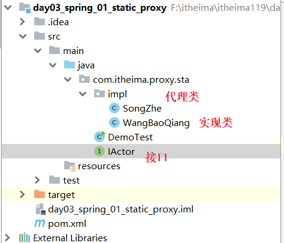


接口：

```java
package com.itheima.proxy.sta;

public interface IActor {

    public void sing();

    public void dance();
}
```


实现类：

```java
package com.itheima.proxy.sta.impl;

import com.itheima.proxy.sta.IActor;

public class WangBaoQiang implements IActor {
    @Override
    public void sing() {
        System.out.println("王宝强唱歌");
    }

    @Override
    public void dance() {
        System.out.println("王宝强跳舞");
    }
}
```

代理类：

```java
package com.itheima.proxy.sta.impl;

import com.itheima.proxy.sta.IActor;

public class SongZhe implements IActor {

    private WangBaoQiang wangBaoQiang = new WangBaoQiang();

    @Override
    public void sing() {
        System.out.println("增强的功能：宋哲经纪人和其他人洽谈唱歌的业务");
        //执行原有功能，调用原有对象的原有方法
        wangBaoQiang.sing();
    }

    @Override
    public void dance() {
        System.out.println("增强的功能：宋哲经纪人和其他人洽谈跳舞的业务");
        //执行原有功能，调用原有对象的原有方法
        wangBaoQiang.dance();
    }
}
```

测试类：

```java
package com.itheima.proxy.sta;

import com.itheima.proxy.sta.impl.SongZhe;
import com.itheima.proxy.sta.impl.WangBaoQiang;

public class DemoTest {

    public static void main(String[] args) {

       // IActor actor = new WangBaoQiang();

        //接受代理对象
        IActor actor = new SongZhe();
        actor.sing();
        actor.dance();

    }
}
```

测试结果：

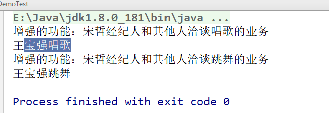


小结：

~~~
静态代理：
1.代理类是我们自定义的。
2.代理类中，需要声明被代理对象，作用，为了方便调用原有功能
~~~


### 1.2.2 静态代理的优化

#### 1.初步优化

~~~
优化目标：   将代理类的所有方法的实现，抽取到同一个工具类的同一个方法中。

步骤：
1.创建一个工具类MyInvocationHandler
2.声明一个方法叫做invoke，
3.将代理类Songzhe所有方法的实现全部移植到invoke方法中
4.代理类Songzhe所有的方法全部调用MyInvocationHandler的invoke方法。
~~~

工程结构：

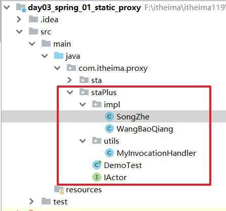


工具类：

```java
package com.itheima.proxy.staPlus.utils;

import com.itheima.proxy.staPlus.impl.WangBaoQiang;

public class MyInvocationHandler {

    private WangBaoQiang wangBaoQiang = new WangBaoQiang();

    public void invoke(){


        System.out.println("增强的功能：宋哲经纪人和其他人洽谈唱歌的业务");
        //执行原有功能，调用原有对象的原有方法
        wangBaoQiang.sing();


        System.out.println("增强的功能：宋哲经纪人和其他人洽谈跳舞的业务");
        //执行原有功能，调用原有对象的原有方法
        wangBaoQiang.dance();
    }
}
```

代理类：


```java
package com.itheima.proxy.staPlus.impl;

import com.itheima.proxy.staPlus.IActor;
import com.itheima.proxy.staPlus.utils.MyInvocationHandler;

public class SongZhe implements IActor {


    private MyInvocationHandler ih = new MyInvocationHandler();

    @Override
    public void sing() {
      ih.invoke();
    }

    @Override
    public void dance() {
      ih.invoke();
    }
}
```

执行结果：

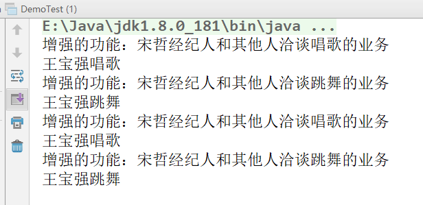


存在问题：sing方法会将dance的功能也执行了。所以我们应该根据调用invoke方法的调用者来判断在invoke里面到底应该执行哪个具体的方法。


#### 2.优化

~~~
1.在invoke方法中声明Method类型的参数，将调用者传递给invoke即可。
2.invoke中，根据method判断，调用功能
~~~

工具类：

```java
package com.itheima.proxy.staPlus.utils;

import com.itheima.proxy.staPlus.impl.WangBaoQiang;

import java.lang.reflect.Method;

public class MyInvocationHandler {

    private WangBaoQiang wangBaoQiang = new WangBaoQiang();

    public void invoke(Method method){

        //获取方法的名字
        String methodName = method.getName();
        if("sing".equals(methodName)){
            System.out.println("增强的功能：宋哲经纪人和其他人洽谈唱歌的业务");
            //执行原有功能，调用原有对象的原有方法
            wangBaoQiang.sing();
        }else if("dance".equals(methodName)){
            System.out.println("增强的功能：宋哲经纪人和其他人洽谈跳舞的业务");
            //执行原有功能，调用原有对象的原有方法
            wangBaoQiang.dance();
        }

    }
}
```


代理类：

```java
package com.itheima.proxy.staPlus.impl;

import com.itheima.proxy.staPlus.IActor;
import com.itheima.proxy.staPlus.utils.MyInvocationHandler;

import java.lang.reflect.Method;

public class SongZhe implements IActor {

    private MyInvocationHandler ih = new MyInvocationHandler();

    private static Method m1 = null;
    private static Method m2 = null;

    static {
        //获取接口的字节码文件
        Class clazz = IActor.class;
        //获取字节码文件中的方法
        try {
            m1 = clazz.getMethod("sing",null);
            m2 = clazz.getMethod("dance",null);
        } catch (NoSuchMethodException e) {
            e.printStackTrace();
        }
    }

    @Override
    public void sing() {
      ih.invoke(m1);
    }

    @Override
    public void dance() {
      ih.invoke(m2);
    }
}
```

测试结果：

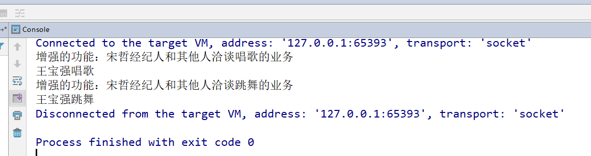


#### 3.优化

~~~
将MyInvocationHandler中的执行原有功能的原有方法使用反射来完成
~~~

```java
package com.itheima.proxy.staPlus.utils;

import com.itheima.proxy.staPlus.impl.WangBaoQiang;

import java.lang.reflect.InvocationTargetException;
import java.lang.reflect.Method;

public class MyInvocationHandler {

    private WangBaoQiang wangBaoQiang = new WangBaoQiang();

    public void invoke(Method method){

        //获取方法的名字
        String methodName = method.getName();
        if("sing".equals(methodName)){
            System.out.println("增强的功能：宋哲经纪人和其他人洽谈唱歌的业务");
            //执行原有功能，调用原有对象的原有方法
            //wangBaoQiang.sing();
        }else if("dance".equals(methodName)){
            System.out.println("增强的功能：宋哲经纪人和其他人洽谈跳舞的业务");
            //执行原有功能，调用原有对象的原有方法
            //wangBaoQiang.dance();
        }
        //执行原有功能
        try {
            method.invoke(wangBaoQiang,null);
        } catch (IllegalAccessException e) {
            e.printStackTrace();
        } catch (InvocationTargetException e) {
            e.printStackTrace();
        }

    }
}
```


#### 4.小结

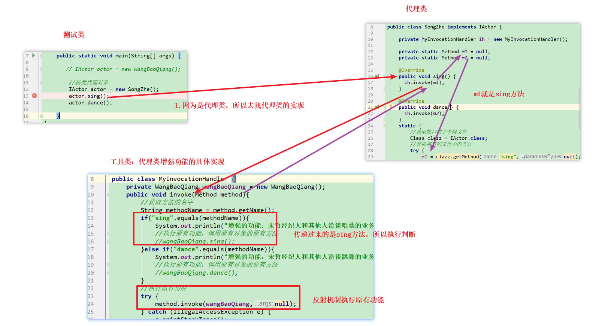

~~~
静态代理：
1.Songzhe是自定义代理类
2.MyInvocationHandler是代理类功能的具体实现
~~~


### 1.2.3 jdk动态代理

~~~
步骤:
1.创建IActor接口，和实现类WangBaoQian
2.测试类中，直接jdk动态代理创建对象
~~~

工程结构：

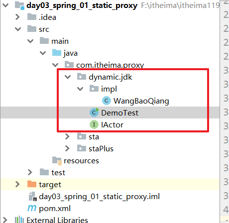


接口和实现类：

```java
package com.itheima.proxy.dynamic.jdk;

public interface IActor {

    public void sing();

    public void dance();
}
```


```java
package com.itheima.proxy.dynamic.jdk.impl;


import com.itheima.proxy.dynamic.jdk.IActor;

public class WangBaoQiang implements IActor {
    @Override
    public void sing() {
        System.out.println("王宝强唱歌");
    }

    @Override
    public void dance() {
        System.out.println("王宝强跳舞");
    }
}
```


测试类：

```java
package com.itheima.proxy.dynamic.jdk;

import com.itheima.proxy.dynamic.jdk.impl.WangBaoQiang;

import java.lang.reflect.InvocationHandler;
import java.lang.reflect.Method;
import java.lang.reflect.Proxy;

public class DemoTest {

    public static void main(String[] args) {

        IActor wangBaoQiang = new WangBaoQiang();
        ClassLoader classLoader = wangBaoQiang.getClass().getClassLoader();
        Class<?>[] interfaces = wangBaoQiang.getClass().getInterfaces();
        //jdk动态代理
        //参数1：类加载器
        //参数2：实现的接口
        //参数3：处理器
        IActor Songzhe =(IActor) Proxy.newProxyInstance(classLoader, interfaces, new InvocationHandler() {
            /**
             *
             * @param proxy  代理对象本身，Songzhe
             * @param method 被代理的方法
             * @param args   方法的参数
             * @return
             * @throws Throwable
             */
            @Override
            public Object invoke(Object proxy, Method method, Object[] args) throws Throwable {

                String methodName = method.getName();
                if("sing".equals(methodName)){
                    System.out.println("增强的功能：宋哲洽谈唱歌的业务");
                }else if("dance".equals(methodName)){
                    System.out.println("增强的功能：宋哲洽谈跳舞的业务");
                }
                //执行原有功能
                method.invoke(wangBaoQiang,args);

                return null;
            }
        });

        //调用代理类的功能：
        Songzhe.sing();

        Songzhe.dance();

    }
}
```

查看jdk代理类的字节码文件

-Dsun.misc.ProxyGenerator.saveGeneratedFiles=true

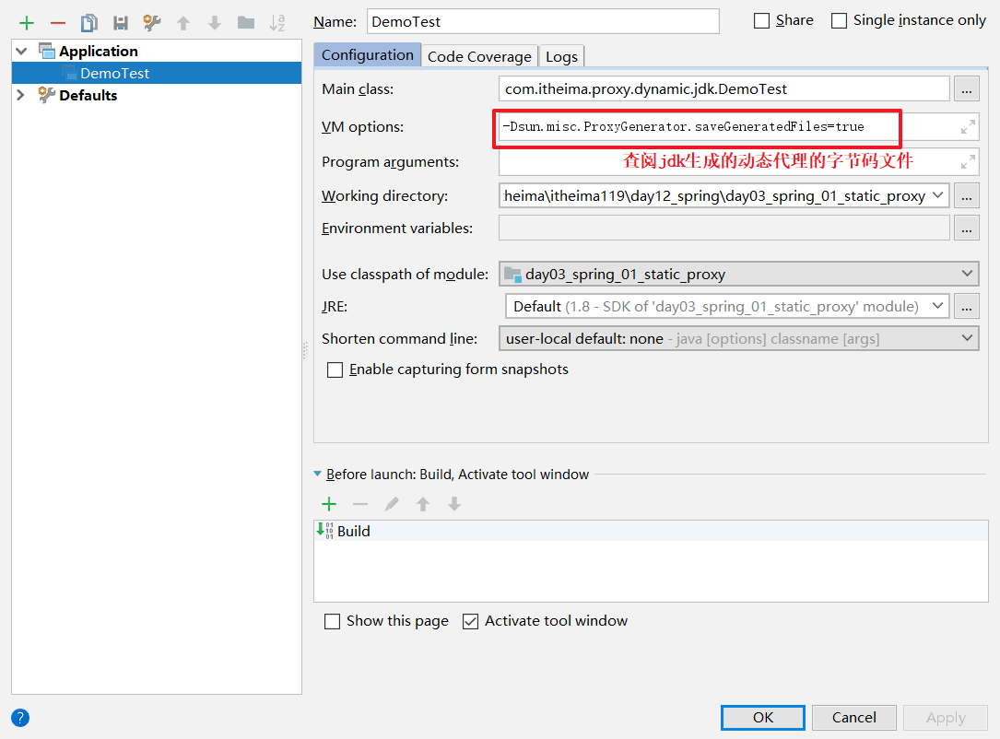


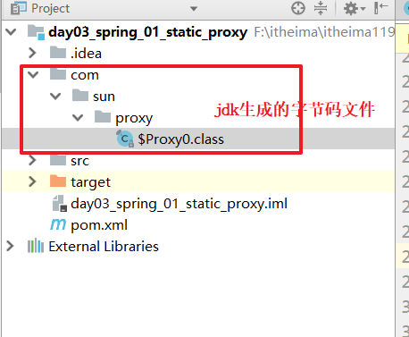

```java
//
// Source code recreated from a .class file by IntelliJ IDEA
// (powered by Fernflower decompiler)
//

package com.sun.proxy;

import com.itheima.proxy.dynamic.jdk.IActor;
import java.lang.reflect.InvocationHandler;
import java.lang.reflect.Method;
import java.lang.reflect.Proxy;
import java.lang.reflect.UndeclaredThrowableException;

public final class $Proxy0 extends Proxy implements IActor {
    private static Method m1;
    private static Method m4;
    private static Method m2;
    private static Method m3;
    private static Method m0;

    public $Proxy0(InvocationHandler var1) throws  {
        super(var1);
    }

    public final boolean equals(Object var1) throws  {
        try {
            return (Boolean)super.h.invoke(this, m1, new Object[]{var1});
        } catch (RuntimeException | Error var3) {
            throw var3;
        } catch (Throwable var4) {
            throw new UndeclaredThrowableException(var4);
        }
    }

    public final void dance() throws  {
        try {
            super.h.invoke(this, m4, (Object[])null);
        } catch (RuntimeException | Error var2) {
            throw var2;
        } catch (Throwable var3) {
            throw new UndeclaredThrowableException(var3);
        }
    }

    public final String toString() throws  {
        try {
            return (String)super.h.invoke(this, m2, (Object[])null);
        } catch (RuntimeException | Error var2) {
            throw var2;
        } catch (Throwable var3) {
            throw new UndeclaredThrowableException(var3);
        }
    }

    public final void sing() throws  {
        try {
            super.h.invoke(this, m3, (Object[])null);
        } catch (RuntimeException | Error var2) {
            throw var2;
        } catch (Throwable var3) {
            throw new UndeclaredThrowableException(var3);
        }
    }

    public final int hashCode() throws  {
        try {
            return (Integer)super.h.invoke(this, m0, (Object[])null);
        } catch (RuntimeException | Error var2) {
            throw var2;
        } catch (Throwable var3) {
            throw new UndeclaredThrowableException(var3);
        }
    }

    static {
        try {
            m1 = Class.forName("java.lang.Object").getMethod("equals", Class.forName("java.lang.Object"));
            m4 = Class.forName("com.itheima.proxy.dynamic.jdk.IActor").getMethod("dance");
            m2 = Class.forName("java.lang.Object").getMethod("toString");
            m3 = Class.forName("com.itheima.proxy.dynamic.jdk.IActor").getMethod("sing");
            m0 = Class.forName("java.lang.Object").getMethod("hashCode");
        } catch (NoSuchMethodException var2) {
            throw new NoSuchMethodError(var2.getMessage());
        } catch (ClassNotFoundException var3) {
            throw new NoClassDefFoundError(var3.getMessage());
        }
    }
}
```

动态代理的流程：

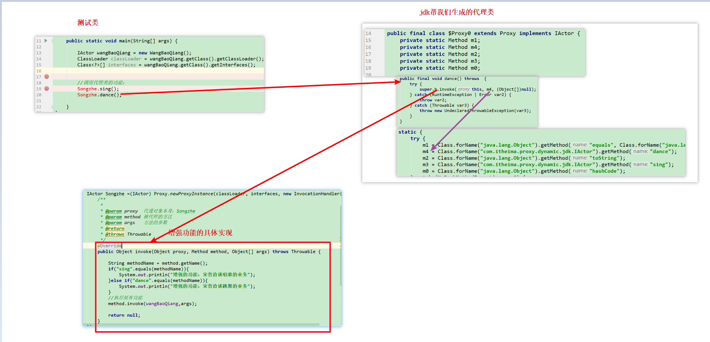


~~~
jdk的动态代理：
1.代理类是jdk生成的
2.匿名内部类InvocationHandler就是代理功能的具体实现
~~~


### 1.2.4 cglib动态代理

~~~
因为jdk的动态代理的本质是基于接口的新实现，而如果没有接口，我们需要直接针对实现类做增强，那么需要使用继承。而cglib针对这一操作做了类似jdk的封装
~~~


~~~
1.引入cglib依赖
2.直接创建实现类WangBaoQaing
3.测试类使用cglib代理api创建动态代理对象
~~~

工程结构：

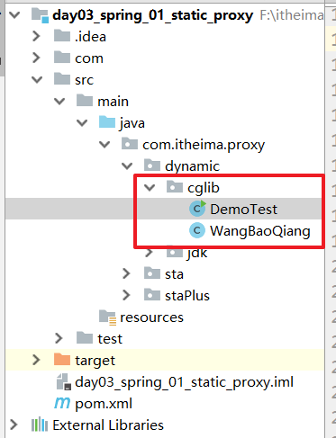


依赖：

```xml
<dependencies>
    <dependency>
        <groupId>cglib</groupId>
        <artifactId>cglib</artifactId>
        <version>3.1</version>
    </dependency>
</dependencies>
```

实现类：

```java
package com.itheima.proxy.dynamic.cglib;


public class WangBaoQiang {

    public void sing() {
        System.out.println("王宝强唱歌");
    }


    public void dance() {
        System.out.println("王宝强跳舞");
    }
}
```

测试类：

```java
package com.itheima.proxy.dynamic.cglib;

import net.sf.cglib.proxy.Enhancer;
import net.sf.cglib.proxy.MethodInterceptor;
import net.sf.cglib.proxy.MethodProxy;

import java.lang.reflect.Method;

public class DemoTest {

    public static void main(String[] args) {

        WangBaoQiang wangBaoQiang = new WangBaoQiang();


        /**
         *  参数1：被代理对象的实现类本身
         *  参数2：功能的具体实现，作用类似jdk代理中的InvocationHandler
         */
        //cglib的api
        WangBaoQiang Songzhe =(WangBaoQiang) Enhancer.create(WangBaoQiang.class, new MethodInterceptor() {

            /**
             *
             * @param o   代理对象本身，没有暖用
             * @param method  被代理的方法
             * @param objects  方法的参数
             * @param methodProxy  代理方法本身，没有用
             * @return
             * @throws Throwable
             */
            @Override
            public Object intercept(Object o, Method method, Object[] objects, MethodProxy methodProxy) throws Throwable {

                String methodName = method.getName();
                if("sing".equals(methodName)){
                    System.out.println("增强的功能:洽谈唱歌业务");
                }else if("dance".equals(methodName)){
                    System.out.println("增强的功能:洽谈跳舞业务");
                }
                //执行原有功能
                method.invoke(wangBaoQiang,objects);

                return null;
            }
        });

        Songzhe.dance();

    }
}
```

测试结果：

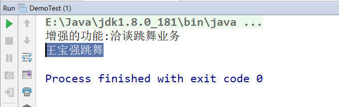


### 1.2.5 模拟aop

~~~
aop:spring通过动态代理技术对功能进行增强，我们通过spring容器获取到的是代理对象。

实现步骤：
spring容器：就是工厂，从spring容器获取代理对象，就是工厂创建的是代理对象。
~~~

工程结构：

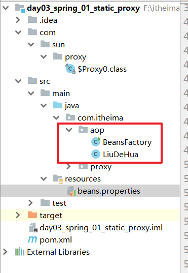


实现类：

```java
package com.itheima.aop;

public class LiuDeHua {

    public void act(){
        System.out.println("表演");
    }
}
```

工厂类；

```java
package com.itheima.aop;

import net.sf.cglib.proxy.Enhancer;
import net.sf.cglib.proxy.MethodInterceptor;
import net.sf.cglib.proxy.MethodProxy;

import java.lang.reflect.InvocationHandler;
import java.lang.reflect.Method;
import java.lang.reflect.Proxy;
import java.util.ResourceBundle;

public class BeansFactory {

    public static Object getBean(String beanName){

        //1.读取配置
        ResourceBundle rb = ResourceBundle.getBundle("beans");
        String classpath = rb.getString(beanName);
        //2.反射机制创建对象

        Object proxyObj = null;
        try {
            //原有对象
           final Object liu = Class.forName(classpath).newInstance();

            //获取代理对象,根据接口判断到底时候哪种代理技术
            Class<?>[] interfaces = liu.getClass().getInterfaces();
            if(interfaces.length==0){
                //没有接口，使用cglib代理
                System.out.println("没有接口，使用cglib代理");
                proxyObj = Enhancer.create(liu.getClass(), new MethodInterceptor() {
                    @Override
                    public Object intercept(Object o, Method method, Object[] objects, MethodProxy methodProxy) throws Throwable {

                        System.out.println("cglib增强");
                        //原有功能
                        return method.invoke(liu,objects);
                    }
                });
            }else{
                //使用jdk代理
                System.out.println("有接口，使用jdk代理");
                proxyObj = Proxy.newProxyInstance(liu.getClass().getClassLoader(), interfaces, new InvocationHandler() {
                    @Override
                    public Object invoke(Object proxy, Method method, Object[] args) throws Throwable {
                        System.out.println("jdk增强");
                        return method.invoke(liu,args);
                    }
                });
            }
        } catch (InstantiationException e) {
            e.printStackTrace();
        } catch (IllegalAccessException e) {
            e.printStackTrace();
        } catch (ClassNotFoundException e) {
            e.printStackTrace();
        }
        return proxyObj;
    }

    public static void main(String[] args) {
        LiuDeHua liuDeHua = (LiuDeHua) getBean("classpath");
        liuDeHua.act();

    }
}
```

### 1.2.6 小结

~~~
jdk代理：基于接口的实现的
cglib代理：基于实现类的继承的
spring的aop会自动的根据是否有接口来决定使用jdk代理或者cglib代理
~~~


## 1.3 spring的AOP（掌握）

### 1.3.1 aop的专业术语

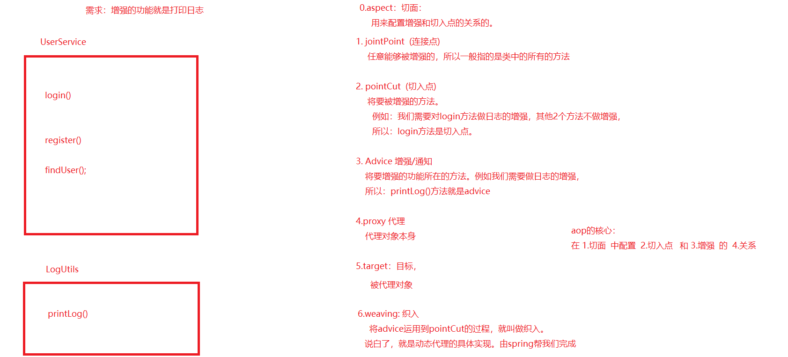


~~~
切面：用于配置增强和切入点的关系的
切入点：将要进行增强的方法
增强：将要增强的功能所在的方法

aop配置的核心：  在切面中配置切入点和增强的关系
~~~


### 1.3.2 xml方式

~~~
需求：在业务中进行日志的增强
	
步骤：
0.引入spring-context,spring-test,spring-aspect
1.创建service接口和实现类
2.spring在创建service对象
3.创建增强类LogUtils和增强方法pringLog
4.开始aop配置
5.测试
~~~

工程结构：

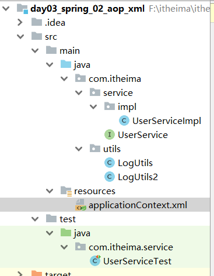


依赖：

```xml
<dependencies>

    <dependency>
        <groupId>junit</groupId>
        <artifactId>junit</artifactId>
        <version>4.12</version>
    </dependency>
    <dependency>
        <groupId>org.springframework</groupId>
        <artifactId>spring-context</artifactId>
        <version>5.0.6.RELEASE</version>
    </dependency>
    <dependency>
        <groupId>org.springframework</groupId>
        <artifactId>spring-test</artifactId>
        <version>5.0.6.RELEASE</version>
    </dependency>
    <!-- spring的aop相关-->
    <dependency>
        <groupId>org.springframework</groupId>
        <artifactId>spring-aspects</artifactId>
        <version>5.0.6.RELEASE</version>
    </dependency>


</dependencies>
```

service接口和实现类：

```java
package com.itheima.service;

public interface UserService {

    public void login();
}
```


```java
package com.itheima.service.impl;

import com.itheima.service.UserService;

public class UserServiceImpl implements UserService{


    @Override
    public void login() {
        System.out.println("登录功能");
    }
}
```


增强类：

```java
package com.itheima.utils;

public class LogUtils {


    public void printLog(){
        System.out.println("**********输出日志*********");
    }
}
```


spring配置：

```xml
<?xml version="1.0" encoding="UTF-8"?>
<beans xmlns="http://www.springframework.org/schema/beans"
       xmlns:xsi="http://www.w3.org/2001/XMLSchema-instance"
       xmlns:aop="http://www.springframework.org/schema/aop"
       xsi:schemaLocation="http://www.springframework.org/schema/beans
       http://www.springframework.org/schema/beans/spring-beans.xsd
       http://www.springframework.org/schema/aop
       http://www.springframework.org/schema/aop/spring-aop.xsd">

    <!-- bean definitions here -->

    <bean id="userService" class="com.itheima.service.impl.UserServiceImpl"></bean>

    <!--spring的aop配置
        核心：  在1.切面中 配置 2.切入点 和3.增强 的4.关系
    -->


    <!-- 创建增强所在类的对象-->
    <bean id="logUtils" class="com.itheima.utils.LogUtils"></bean>

    <!-- 声明一段aop配置-->
    <aop:config>
        <!-- 声明切面，内部开始aop配置
            ref:指向增强所在类的对象
        -->
        <aop:aspect ref="logUtils">
            <!--
                before: 增强和切入点的关系，增强在切入点之前执行
                method: 增强
            -->
            <aop:before method="printLog"
                        pointcut="execution(public void com.itheima.service.impl.UserServiceImpl.login())" ></aop:before>
        </aop:aspect>
    </aop:config>


</beans>
```


测试类：

```java
package com.itheima.service;

import org.junit.Test;
import org.junit.runner.RunWith;
import org.springframework.beans.factory.annotation.Autowired;
import org.springframework.test.context.ContextConfiguration;
import org.springframework.test.context.junit4.SpringJUnit4ClassRunner;

import static org.junit.Assert.*;

@RunWith(SpringJUnit4ClassRunner.class)
@ContextConfiguration("classpath:applicationContext.xml")
public class UserServiceTest {

    @Autowired
    private UserService userService;
    @Test
    public void login() {
        userService.login();
    }
}
```


测试结果：

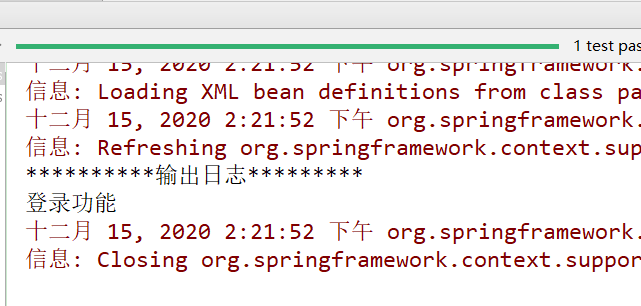


小结：

~~~
aop配置的核心：
在切面中配置切入点和增强的关系

<aop:config>
	<aop:aspect ref="增强类的对象">
		<aop:before  method="增强的方法名" pointcut="" >
	</aop:aspect>
</aop:config>
~~~


### 1.3.3  切入点表达式

~~~

                切入点表达式
                    语法：
                        修饰符   返回值   包名.类名.方法名(参数)

                   1.完整写法
                    public void com.itheima.service.impl.UserServiceImpl.login()

                   2.修饰符可以省略
                      void com.itheima.service.impl.UserServiceImpl.login()

                   3.可以使用*代表任意返回值
                      * com.itheima.service.impl.UserServiceImpl.login()

                   4.*可以代表任意包名,但是一个*代表一级包名
                       * *.*.*.*.UserServiceImpl.login()

                   5. *..可以代表任意多级包名
                       * *..UserServiceImpl.login()

                   6.* 可以代表任意类名
                       * *..*.login()

                   7. * 可以代表任意方法名
                           * *..*.*()

                   8.* 代表任意参数，但是一个参数需要一个*

                   9. ..可以代表任意多个(0,1,2,3..)参数
                        * *..*.*(..)

                   我们的切入点表达式
                    第一：要精准
                    第二：简洁

                   例如：常用切入点表达式：
                    * com.itheima.service.impl.*.*(..)

                    切入点表达式支持逻辑中的或运算
~~~


### 1.3.4 通知类型

~~~
强调：
	通知只规定了增强和切入点的关系，但是没有指定增强和增强的关系。
~~~


~~~xml
  <!--    通知类型：
                    before: 前置通知，增强在切入点之前执行
                    after-returning: 后置通知,增强在切入点之后执行,如果出现异常，就不出现通知了
                    after-throwing: 异常通知，出现异常，执行增强
                    after: 最终通知，无论如何都会执行
                    around: 环绕通知，自定义通知的位置

            -->
            <!-- 前置通知-->
           <!-- <aop:before method="printLog"
                        pointcut="execution( * com.itheima.service.impl.*.*(..) )" ></aop:before>-->

            <!-- 后置通知-->
            <!--<aop:after-returning method="printLog"-->
                        <!--pointcut="execution( * com.itheima.service.impl.*.*(..) )" ></aop:after-returning>-->

            <!-- 异常通知-->
            <!--<aop:after-throwing method="printLog"-->
                        <!--pointcut="execution( * com.itheima.service.impl.*.*(..) )" ></aop:after-throwing>-->


            <!-- 最终通知-->
            <!--<aop:after method="printLog"-->
                        <!--pointcut="execution( * com.itheima.service.impl.*.*(..) )" ></aop:after>-->

            <!--环绕通知-->
            <aop:around method="printLog"
                        pointcut="execution( * com.itheima.service.impl.*.*(..) )" ></aop:around>
~~~


注意：环绕通知需要给增强传递ProceedingJoinPoint参数，这个是执行原有功能，用于在自定义时，判断之前还是之后的参照对象


```java
public void printLog(ProceedingJoinPoint joinPoint){


    try {
        System.out.println("自定义环绕通知：之前执行");
        //执行原有功能
        joinPoint.proceed();
        System.out.println("自定义环绕通知：之后执行");
    } catch (Throwable throwable) {
        System.out.println("自定义环绕通知：异常执行");
        throwable.printStackTrace();
    }finally {
        System.out.println("自定义环绕通知：最终一定执行");
    }
}
```


### 1.3.5 抽取切入点表达式

```xml
<!-- 声明一段aop配置-->
<aop:config>
    <!-- 声明切面，内部开始aop配置
        ref:指向增强所在类的对象
    -->
    <aop:aspect ref="logUtils">
     
        <!--抽取常用切入点表达式-->
        <aop:pointcut id="pt1" expression="execution( * com.itheima.service.impl.*.*(..) )"></aop:pointcut>
        <!--环绕通知
			pointcut-ref： 切入点表达式的唯一标识
		-->
        <aop:around method="printLog" pointcut-ref="pt1"></aop:around>
    </aop:aspect>
</aop:config>
```

### 1.3.6 半注解半xml方式

~~~
步骤：
0.ioc也采用注解方式
1.通过xml配置来开启注解aop
   @Aspect: 声明切面类
   @Before，@After ..声明切入点和增强的关系
   @PointCut 抽取常用切入点
~~~

复制aop的xml工程

spring的xml配置

```xml
<?xml version="1.0" encoding="UTF-8"?>
<beans xmlns="http://www.springframework.org/schema/beans"
       xmlns:xsi="http://www.w3.org/2001/XMLSchema-instance"
       xmlns:aop="http://www.springframework.org/schema/aop"
       xmlns:context="http://www.springframework.org/schema/context"
       xsi:schemaLocation="http://www.springframework.org/schema/beans
       http://www.springframework.org/schema/beans/spring-beans.xsd
       http://www.springframework.org/schema/aop
       http://www.springframework.org/schema/aop/spring-aop.xsd http://www.springframework.org/schema/context http://www.springframework.org/schema/context/spring-context.xsd">


    <!-- 开启注解ioc-->
    <context:component-scan base-package="com.itheima"></context:component-scan>


    <!-- 开启注解aop-->
    <aop:aspectj-autoproxy></aop:aspectj-autoproxy>

</beans>
```

service

```java
@Service
public class UserServiceImpl implements UserService{


    @Override
    public String login(String a,String b) {
        System.out.println("登录功能");
        //int i = 1/0;
        return "string";
    }
}
```

通知类

```java
package com.itheima.utils;

import org.aspectj.lang.ProceedingJoinPoint;
import org.aspectj.lang.annotation.Around;
import org.aspectj.lang.annotation.Aspect;
import org.aspectj.lang.annotation.Before;
import org.aspectj.lang.annotation.Pointcut;
import org.springframework.stereotype.Component;

@Aspect //声明当前这个增强类就是一个切面类
@Component
public class LogUtils {

    /**
     *  在切面中配置切入点和增强的关系
     **/


    /*
        抽取切入点表达式：
        1.声明一个空方法，@PointCut 声明切入点表达式
        2.方法名就是切入点表达式的唯一标识
     */

//
//    @Before("execution(* com.itheima.service.impl.*.*(..))")
//    public void pringLog1(){
//        System.out.println("**********输出日志*********1111111");
//    }

    @Pointcut("execution(* com.itheima.service.impl.*.*(..))")
    public void pt1(){

    }

//    @Before("pt1()")
//    public void pringLog1(){
//        System.out.println("**********输出日志*********1111111");
//    }


    @Around("pt1()")
    public void printLog(ProceedingJoinPoint joinPoint){


        try {
            System.out.println("自定义环绕通知：之前执行");
            //执行原有功能
            joinPoint.proceed();
            System.out.println("自定义环绕通知：之后执行");
        } catch (Throwable throwable) {
            System.out.println("自定义环绕通知：异常执行");
            throwable.printStackTrace();
        }finally {
            System.out.println("自定义环绕通知：最终一定执行");
        }
    }
}
```

运行结果

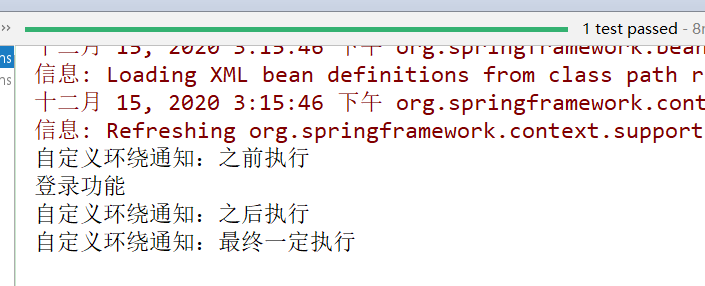


小结：

~~~
1.ioc也采用注解
2.在xml中声明开启注解aop
3.@Aspect用于增强类，表示当前是一个切面类
4.在增强类的方法上（增强）添加关系注解，例如@Before,@Around等等  value值就是切入点表达式
5.可以通过@PointCut抽取常用切入点表达式
	1.空方法，添加@PointCut注解，value就是切入点表达式
	2.方法名就是切入点表达式的唯一标识
~~~


### 1.3.7 纯注解方式

~~~
核心：使用配置类来替代配置文件

步骤：
1.复制上述半注解半xml方式的工程
2.创建一个类，添加注解@Configuration声明这是一个配置类
3.通过@ComponentScan 注解来开启注解扫描
4.通过@EnableAspectJAutoProxy 
~~~

工程结构：删除配置文件

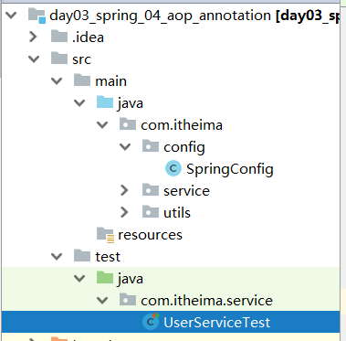


配置类：

```java
package com.itheima.config;

import org.springframework.context.annotation.ComponentScan;
import org.springframework.context.annotation.Configuration;
import org.springframework.context.annotation.EnableAspectJAutoProxy;
import org.springframework.stereotype.Component;

@Configuration //声明当前是一个配置类
@ComponentScan("com.itheima") //开启注解扫描
@EnableAspectJAutoProxy  //开启注解aop
public class SpringConfig {
}
```


测试类：根据配置类创建spring容器

```java
package com.itheima.service;

import com.itheima.config.SpringConfig;
import org.junit.Test;
import org.junit.runner.RunWith;
import org.springframework.beans.factory.annotation.Autowired;
import org.springframework.test.context.ContextConfiguration;
import org.springframework.test.context.junit4.SpringJUnit4ClassRunner;

import static org.junit.Assert.*;

@RunWith(SpringJUnit4ClassRunner.class)
@ContextConfiguration(classes = SpringConfig.class)
public class UserServiceTest {

    @Autowired
    private UserService userService;
    @Test
    public void login() {
        userService.login("a","b");
    }
}
```

测试结果：

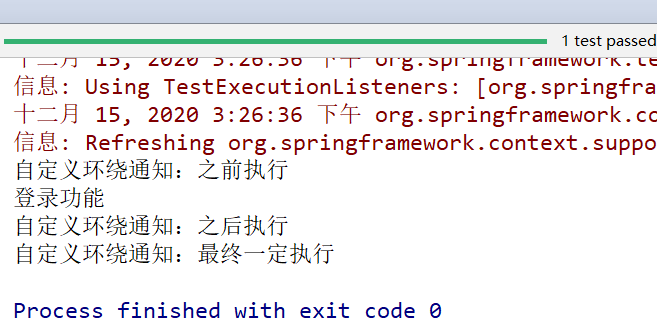


小结：

~~~
@EnableAspectJAutoProxy  //开启注解aop
~~~


# 2.spring的事务

~~~
事务是用于service层的，因为事务需要保证业务的做小的逻辑单元，要保证一个业务中所涉及的所有的sql要么都执行要么都不执行。
~~~


## 2.1 spring事务相关知识介绍

~~~
事务的4大特性：
1.原子性： 不可分割，一组sql，要么都执行，要么都不执行。
2.隔离性：一个事务对于另外一个事务是没有影响。
3.持久性：事务一旦提交，对于数据库的更改是永久的。
4.一致性：无论事务的成功与否，数据库的数据都是满足生活逻辑的。

问题：
	1.脏读： 一个事务读取了另一个事务未提交的数据。
	2.不可重复读。同一个事务中，2次读取数据的结果不一致。另一个事务做的是update操作，
	3.幻读：同一个事务中，2次读取数据的结果不一致。另一个事物做的是insert或者delete操作。
	
事务的隔离级别：
	read uncommited: 读未提交
	read committed; 读已提交
	repeatable read;可重复读
	serizaiable  : 串行化
~~~

## 2.2 spring的事务的api介绍（理解）

#### （1）PlatformTransactionManager

~~~
平台事务管理器，这是一个接口，内部声明了管理事务的方法。
所以针对不同的持久层技术，需要提供不同的实现类。
DataSourceTransactionManager实现类适用于jdbc或者mybatis的事务支持。
~~~

~~~java
public interface PlatformTransactionManager {
 
    //根据事务定义TransactionDefinition，获取事务
    TransactionStatus getTransaction(TransactionDefinition definition);
    //提交事务
    void commit(TransactionStatus status);
    //回滚事务
    void rollback(TransactionStatus status);

}
~~~


#### （2）TransactionDefinition

~~~
事务定义对象，用于在进行事务管理前，设置事务的一些常用属性，例如：事务的隔离级别，事务的传播行为等等。。。
~~~

**事务的隔离级别**

~~~
	read uncommited: 读未提交
	read committed; 读已提交
	repeatable read;可重复读
	serizaiable  : 串行化
	
	用于解决脏读等问题的
~~~

**事务的传播行为**

~~~
用于解决一个service在调用另外一个service时的事务处理方案的
~~~

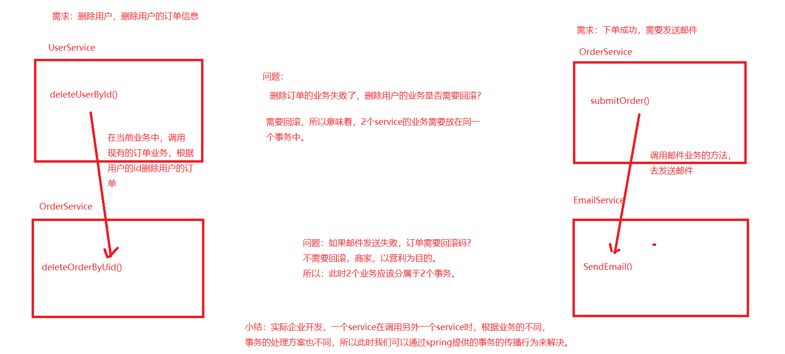


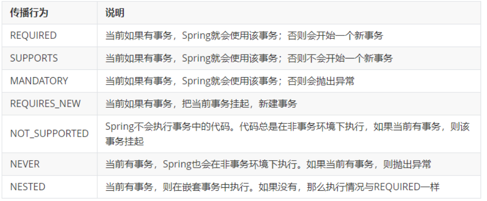

默认值  required,因为常用，说白了，2个业务放在同一个事务中

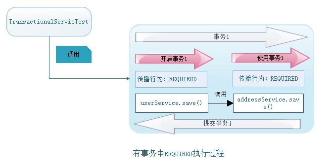


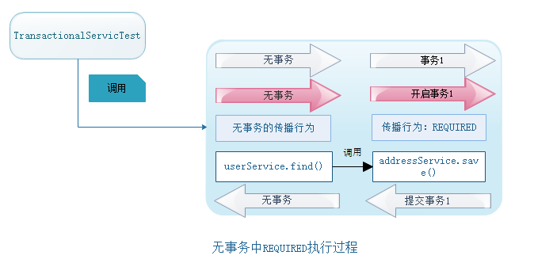


requireds_new:如果当前有事务，将当前事务挂起，开启新的事务

挂起：暂停

说白了：2个业务分属不同的事务，互不影响。


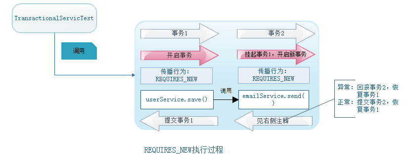


SUPPORTS：当前如果有事务，Spring就会使用该事务；否则不会开始一个新事务

说白了：有事务，就使用，没有事务，就不用。


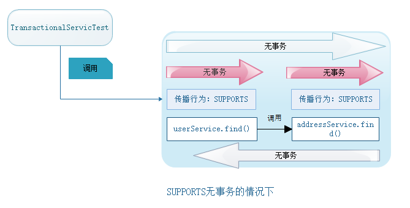


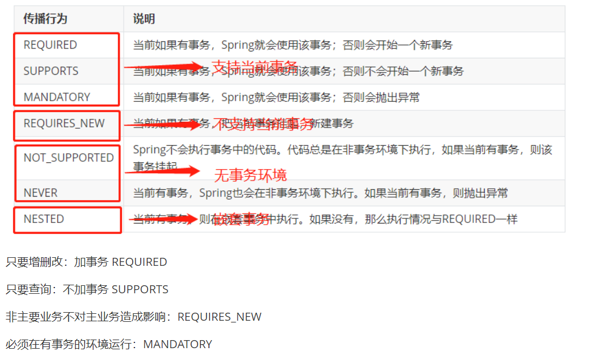


**事务的超时时间**

~~~
默认值是-1，表示事务永不超时。程序会一直等待事务提交。
如果设置10，表示事务如果超过10秒还不提交，事务进行自动回滚。
一般都是-1.
~~~


**事务是否只读**

~~~
如果是查询sql，建议设置为true，表示只读。因为某些支持只读设置的数据库，在做查询时，会做一些性能优化，来提升数据库的性能。
如果是增删改，设置为false,表示读写。

注意：如果是true，但是执行了增删改，会报错。
~~~


#### （3）**TransactionStatus**

~~~
事务的状态信息对象，内部提供了一些api，用户获取当前事务的一些状态信息
~~~

~~~java
public interface TransactionStatus extends SavepointManager, Flushable {
    //是否一个新的事务
    boolean isNewTransaction();
    //是否有存储点（存储过程中用到）
    boolean hasSavepoint();//
    //将事务设置为只能回滚，不允许提交 
    void setRollbackOnly();
    //查询事务是否已有回滚标志
    boolean isRollbackOnly();
    //刷新事务
    void flush();
    //查询事务是否结束
    boolean isCompleted();
 }
~~~


#### 小结

~~~
spring底层管理事务的流程：
1.通过TransactionDefinition 对象来定义事务的属性，例如隔离级别，超时时间等等
2.通过PlatformTransactionManager 对象进行事务的管理，
3.在管理事务的过程中，会将事务的一些状态信息保存到TransactionStatus
~~~


## 2.3 搭建转账案例

~~~
1.创建se工程
2.引入相关依赖，ioc相关的，mysql驱动，spring-jdbc,spring-test,spring-tx,junit
3.创建service和dao，service调用dao
4.spring的ioc创建service，dao，jdbcTemplate,数据源
5.测试功能
~~~

工程结构：

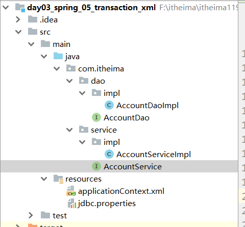

2.依赖：

~~~xml
  <dependencies>
        <dependency>
            <groupId>junit</groupId>
            <artifactId>junit</artifactId>
            <version>4.12</version>
        </dependency>
        <dependency>
            <groupId>mysql</groupId>
            <artifactId>mysql-connector-java</artifactId>
            <version>5.1.26</version>
        </dependency>
        <dependency>
            <groupId>org.springframework</groupId>
            <artifactId>spring-tx</artifactId>
            <version>5.0.6.RELEASE</version>
        </dependency>
        <dependency>
            <groupId>org.springframework</groupId>
            <artifactId>spring-context</artifactId>
            <version>5.0.6.RELEASE</version>
        </dependency>
        <dependency>
            <groupId>org.springframework</groupId>
            <artifactId>spring-test</artifactId>
            <version>5.0.6.RELEASE</version>
        </dependency>
        <dependency>
            <groupId>org.springframework</groupId>
            <artifactId>spring-jdbc</artifactId>
            <version>5.0.6.RELEASE</version>
        </dependency>


    </dependencies>
~~~

dao

```java
package com.itheima.dao.impl;

import com.itheima.dao.AccountDao;
import org.springframework.jdbc.core.JdbcTemplate;

public class AccountDaoImpl implements AccountDao {
    private JdbcTemplate jdbcTemplate;

    public void setJdbcTemplate(JdbcTemplate jdbcTemplate) {
        this.jdbcTemplate = jdbcTemplate;
    }

    @Override
    public int updateAccount(String name, double money) {

        String sql = "update account set money=money+? where account_name=? and money+?>=0";
        //返回值是sql语句影响的行数，如果是1，标识成功，如果是0，标识失败
        int num = jdbcTemplate.update(sql, money, name, money);
        return num;
    }
}
```

service

```java
package com.itheima.service.impl;

import com.itheima.dao.AccountDao;
import com.itheima.service.AccountService;

public class AccountServiceImpl implements AccountService {

    private AccountDao accountDao;

    public void setAccountDao(AccountDao accountDao) {
        this.accountDao = accountDao;
    }

    @Override
    public void transfer(String outUser, String inUser, double money) {

        //付款人付款，
        int i = accountDao.updateAccount(outUser, (0 - money));
        if(i==0){
            System.out.println("账户余额不足，付款失败");
            return;
        }

        int a = 1/0;
        //收款人收款
        accountDao.updateAccount(inUser,money);
    }
}
```


spring配置创建对象


```xml
<?xml version="1.0" encoding="UTF-8"?>
<beans xmlns="http://www.springframework.org/schema/beans"
       xmlns:xsi="http://www.w3.org/2001/XMLSchema-instance"
       xmlns:context="http://www.springframework.org/schema/context"
       xsi:schemaLocation="http://www.springframework.org/schema/beans http://www.springframework.org/schema/beans/spring-beans.xsd http://www.springframework.org/schema/context http://www.springframework.org/schema/context/spring-context.xsd">


    <!--引入外部配置-->
    <context:property-placeholder location="classpath:jdbc.properties"></context:property-placeholder>
    <!-- bean definitions here -->

    <bean id="accountService" class="com.itheima.service.impl.AccountServiceImpl">
        <property name="accountDao" ref="accountDao"></property>
    </bean>

    <bean id="accountDao" class="com.itheima.dao.impl.AccountDaoImpl">
        <property name="jdbcTemplate" ref="jdbcTemplate"></property>
    </bean>

    <bean id="jdbcTemplate" class="org.springframework.jdbc.core.JdbcTemplate">
        <constructor-arg name="dataSource" ref="dataSource"></constructor-arg>
    </bean>

    <bean id="dataSource" class="org.springframework.jdbc.datasource.DriverManagerDataSource">
        <property name="driverClassName" value="${jdbc.driverClass}"></property>
        <property name="username" value="${jdbc.username}"></property>
        <property name="url" value="${jdbc.url}"></property>
        <property name="password" value="${jdbc.password}"></property>
    </bean>
</beans>
```

jdbc.propertis

```properties
jdbc.username=root
jdbc.password=root
jdbc.driverClass=com.mysql.jdbc.Driver
jdbc.url=jdbc:mysql://localhost:3306/itheima119_day11
```


测试类：

```java
package com.itheima.service;

import org.junit.Test;
import org.junit.runner.RunWith;
import org.springframework.beans.factory.annotation.Autowired;
import org.springframework.test.context.ContextConfiguration;
import org.springframework.test.context.junit4.SpringJUnit4ClassRunner;

import static org.junit.Assert.*;

@RunWith(SpringJUnit4ClassRunner.class)
@ContextConfiguration("classpath:applicationContext.xml")
public class AccountServiceTest {


    @Autowired
    private AccountService accountService;

    @Test
    public void transfer() {
        String outUser = "小明";
        String inUser = "小花";
        double money = 500;
        accountService.transfer(outUser,inUser,money);
    }
}
```


测试结果：

没有事务的情况下，小明少了500块，被银行吞了。

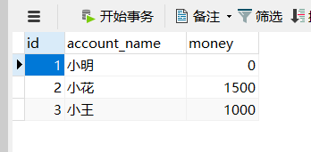


## 2.4 xml版本的事务

~~~
1.创建一个适用于jdbctemplate的事务管理器对象 DataSourceTransactionManager
2.配置事务的策略（超时时间，事务隔离级别，事务的传播行为）
3.配置事务的aop

~~~


```xml
<!--
    配置事务管理器对象，即aop中的增强所类对象。里面定义了事务的管理的方法，就是我们要增强的功能
    id:建议就叫做transactionManager
-->
<bean id="transactionManager" class="org.springframework.jdbc.datasource.DataSourceTransactionManager">
    <property name="dataSource" ref="dataSource"></property>
</bean>

<!--
    配置事务的策略
    注意：此处的名称空间使用tx名称空间的
    id：策略的唯一标识
    transaction-manager：平台事务管理器对象,默认值就是transactionManager
-->
<tx:advice id="ad1" transaction-manager="transactionManager">
    <tx:attributes>
        <!--
            propagation: 事务的传播行为
            isolation="DEFAULT" 事务的隔离级别
            timeout:事务的超时时间
            read-only:事务是否只读

            method: 针对切入点进行更加详细的划分，根据不同的方法配置不同的事务策略
        -->
        <tx:method name="*" propagation="REQUIRED" isolation="DEFAULT" timeout="-1" read-only="false"/>

        <!--<tx:method name="select*" propagation="SUPPORTS" isolation="DEFAULT" timeout="-1" read-only="true"/>-->
        <!--<tx:method name="update*" propagation="REQUIRED" isolation="DEFAULT" timeout="-1" read-only="false"/>-->
        <!--<tx:method name="delete*" propagation="REQUIRED" isolation="DEFAULT" timeout="-1" read-only="false"/>-->
        <!--<tx:method name="insert*" propagation="REQUIRED" isolation="DEFAULT" timeout="-1" read-only="false"/>-->
    </tx:attributes>
</tx:advice>

<!-- 配置事务的aop
    在 1切面中配置 2增强和 3切入点的 4关系
     增强和关系都是固定的，框架的好处就是能给我们配置好的，都已经搞定了。
     所以，针对于事务的aop，spring简化了配置，只需要指定切入点即可
-->
<!-- 声明开始aop配置-->
<aop:config>
    <aop:pointcut id="pt1" expression="execution(* com.itheima.service.impl.*.*(..))"></aop:pointcut>
    <aop:advisor advice-ref="ad1" pointcut-ref="pt1"></aop:advisor>
</aop:config>
```

因为有事务管理，所以出现异常，账户回滚，余额不变

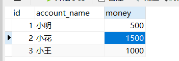


## 2.5 半xml半注解版本的事务

~~~
前提：ioc使用注解方式
在需要添加事务管理的方法或者接口或者实现类上添加注解@Transactional 即可
~~~

ioc注解：

spring的xml配置：开启注解ioc，删除对象的创建，删除事务的xml配置，开启注解事务

```xml
<?xml version="1.0" encoding="UTF-8"?>
<beans xmlns="http://www.springframework.org/schema/beans"
       xmlns:xsi="http://www.w3.org/2001/XMLSchema-instance"
       xmlns:context="http://www.springframework.org/schema/context"
       xmlns:tx="http://www.springframework.org/schema/tx"
       xsi:schemaLocation="http://www.springframework.org/schema/beans
       http://www.springframework.org/schema/beans/spring-beans.xsd
       http://www.springframework.org/schema/context
       http://www.springframework.org/schema/context/spring-context.xsd
       http://www.springframework.org/schema/tx
       http://www.springframework.org/schema/tx/spring-tx.xsd">


    <!-- 开启注解扫描-->
    <context:component-scan base-package="com.itheima"></context:component-scan>

    <!--引入外部配置-->
    <context:property-placeholder location="classpath:jdbc.properties"></context:property-placeholder>
    <!-- bean definitions here -->


    <bean id="jdbcTemplate" class="org.springframework.jdbc.core.JdbcTemplate">
        <constructor-arg name="dataSource" ref="dataSource"></constructor-arg>
    </bean>

    <bean id="dataSource" class="org.springframework.jdbc.datasource.DriverManagerDataSource">
        <property name="driverClassName" value="${jdbc.driverClass}"></property>
        <property name="username" value="${jdbc.username}"></property>
        <property name="url" value="${jdbc.url}"></property>
        <property name="password" value="${jdbc.password}"></property>
    </bean>


    <!--
        配置事务管理器对象，即aop中的增强所类对象。里面定义了事务的管理的方法，就是我们要增强的功能
        id:建议就叫做transactionManager
    -->
    <bean id="transactionManager" class="org.springframework.jdbc.datasource.DataSourceTransactionManager">
        <property name="dataSource" ref="dataSource"></property>
    </bean>


    <!--开启注解事务-->
   <tx:annotation-driven></tx:annotation-driven>
</beans>
```


service和dao使用注解ioc


```java
package com.itheima.dao.impl;

import com.itheima.dao.AccountDao;
import org.springframework.beans.factory.annotation.Autowired;
import org.springframework.jdbc.core.JdbcTemplate;
import org.springframework.stereotype.Repository;

@Repository
public class AccountDaoImpl implements AccountDao {


    @Autowired
    private JdbcTemplate jdbcTemplate;

    public void setJdbcTemplate(JdbcTemplate jdbcTemplate) {
        this.jdbcTemplate = jdbcTemplate;
    }

    @Override
    public int updateAccount(String name, double money) {

        String sql = "update account set money=money+? where account_name=? and money+?>=0";
        //返回值是sql语句影响的行数，如果是1，标识成功，如果是0，标识失败
        int num = jdbcTemplate.update(sql, money, name, money);
        return num;
    }
}
```


```java
package com.itheima.service.impl;

import com.itheima.dao.AccountDao;
import com.itheima.service.AccountService;
import org.springframework.beans.factory.annotation.Autowired;
import org.springframework.stereotype.Service;
import org.springframework.transaction.annotation.Transactional;

@Service
public class AccountServiceImpl implements AccountService {

    @Autowired
    private AccountDao accountDao;

    public void setAccountDao(AccountDao accountDao) {
        this.accountDao = accountDao;
    }
	//此处@Transactional注解属性，可以配置事务的策略信息
    @Transactional
    @Override
    public void transfer(String outUser, String inUser, double money) {

        //付款人付款，
        int i = accountDao.updateAccount(outUser, (0 - money));
        if(i==0){
            System.out.println("账户余额不足，付款失败");
            return;
        }

        //int a = 1/0;
        //收款人收款
        accountDao.updateAccount(inUser,money);
    }
}
```

注解事务：在service的实现类或者接口或者方法上添加@  @Transactional

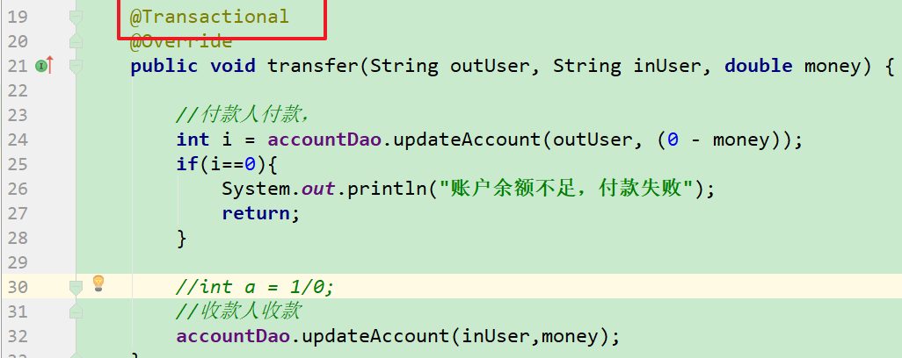

## 2.6 纯注解版本的事务

~~~
核心：使用配置类代替配置文件
步骤：
1.创建配置类，添加@Configuration
2.通过@ComponentScan注解开启注解扫描
3.通过@PropertySource 注解引入外部配置
4.创建一个JdbcConfig配置类，提供3个方法，创建jdbcTemplate，dataSource,transactionManager对象，
	方法添加注解@Bean
5.spring的配置类@Import导入JdbcConfig
6.spring的配置类添加@EnableTransactionManagement
7.测试时，配置spring配置类
~~~


SpringConfig.java

```java
package com.itheima.config;

import org.springframework.context.annotation.ComponentScan;
import org.springframework.context.annotation.Configuration;
import org.springframework.context.annotation.Import;
import org.springframework.context.annotation.PropertySource;
import org.springframework.transaction.annotation.EnableTransactionManagement;

@Configuration
@ComponentScan("com.itheima")
@PropertySource("classpath:jdbc.properties")
@Import(JdbcConfig.class)
@EnableTransactionManagement
public class SpringConfig {
}
```


JdbcConfig.java

```java
package com.itheima.config;


import org.springframework.beans.factory.annotation.Value;
import org.springframework.context.annotation.Bean;
import org.springframework.jdbc.core.JdbcTemplate;
import org.springframework.jdbc.datasource.DataSourceTransactionManager;
import org.springframework.jdbc.datasource.DriverManagerDataSource;

import javax.sql.DataSource;

public class JdbcConfig {

    @Value("${jdbc.url}")
    private String url;
    @Value("${jdbc.username}")
    private String username;
    @Value("${jdbc.password}")
    private String password;
    @Value("${jdbc.driverClass}")
    private String driverClass;


    @Bean
    public DataSource dataSource(){
        DriverManagerDataSource dataSource = new DriverManagerDataSource();
        dataSource.setDriverClassName(driverClass);
        dataSource.setUsername(username);
        dataSource.setPassword(password);
        dataSource.setUrl(url);
        return dataSource;
    }


    @Bean
    public JdbcTemplate jdbcTemplate(DataSource dataSource){

        JdbcTemplate jdbcTemplate = new JdbcTemplate(dataSource);
        return jdbcTemplate;
    }

    @Bean
    public DataSourceTransactionManager transactionManager(DataSource dataSource){
        DataSourceTransactionManager transactionManager = new DataSourceTransactionManager();
        transactionManager.setDataSource(dataSource);
        return transactionManager;
    }
}
```

测试类：

```java
package com.itheima.service;

import com.itheima.config.SpringConfig;
import org.junit.Test;
import org.junit.runner.RunWith;
import org.springframework.beans.factory.annotation.Autowired;
import org.springframework.test.context.ContextConfiguration;
import org.springframework.test.context.junit4.SpringJUnit4ClassRunner;

import static org.junit.Assert.*;

@RunWith(SpringJUnit4ClassRunner.class)
@ContextConfiguration(classes = SpringConfig.class)
public class AccountServiceTest {


    @Autowired
    private AccountService accountService;

    @Test
    public void transfer() {
        String outUser = "小明";
        String inUser = "小花";
        double money = 500;
        accountService.transfer(outUser,inUser,money);
    }
}
```

小结：

~~~
开启注解事务：  @EnableTransactionManagement
~~~

