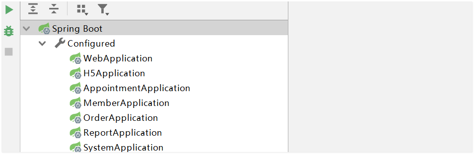

# 【工具使用】

# idea如何开启Run DashBoard左下角:Run

前言 
具体了解一下Run Dashboard 
一、设置前的使用方法 
二、使用Run Dashboard的好处 
三、如何配置自动启动Run Dashboard 

  在配置spring boot项目时，2018版本的idea项目启动中，会弹出一个窗口Run Dashboard,每次都要点击一下，才能正常使用，那么如何设置Run Dashboard自动使用呢？ 


具体了解一下Run Dashboard
一、设置前的使用方法
  1.需要点击上图中的第一选项； 
  2.出来下面的窗口


二、使用Run Dashboard的好处
  使我们**配置的项目可视化，一眼看到底**，方便spring boot项目重新配置、Run、Debug，简化了我们的操作步骤。 

三、如何配置自动启动Run Dashboard
  1.找到.idea下面的workspace.xml文件 
  2.在下面的代码中加入一段配置代码 
  源代码位置

```xml
<component name="RunDashboard">
  <option name="ruleStates">
      <list>
        <RuleState>
          <option name="name" value="ConfigurationTypeDashboardGroupingRule" />
        </RuleState>
        <RuleState>
          <option name="name" value="StatusDashboardGroupingRule" />
        </RuleState>
      </list>
   </option>
    <option name="contentProportion" value="0.22874807" />
  </component>
```

  添加配置代码 ，追加一段

在标签内天机一组<option>

```xml
<option name="configurationTypes">
      <set>
        <option value="SpringBootApplicationConfigurationType" />
      </set>
</option>
```

  3.大功告成，idea启动后Run Dashboard 在项目中自动启动。 

最终配置

```xml
<component name="RunDashboard">
    <option name="ruleStates">
      <list>
        <RuleState>
          <option name="name" value="ConfigurationTypeDashboardGroupingRule" />
        </RuleState>
        <RuleState>
          <option name="name" value="StatusDashboardGroupingRule" />
        </RuleState>
      </list>
    </option>
    <option name="configurationTypes">
      <set>
        <option value="SpringBootApplicationConfigurationType" />
      </set>
    </option>
  </component>
```

