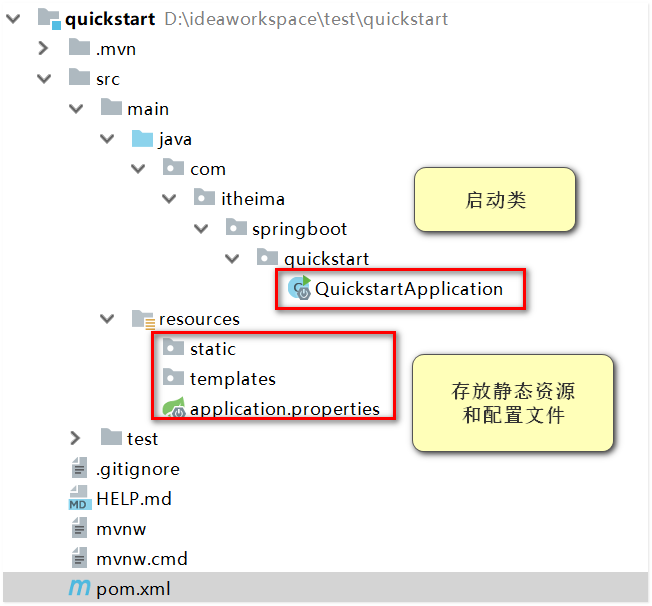
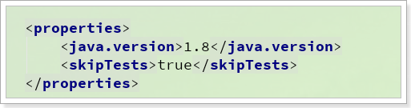
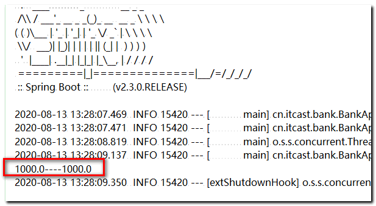
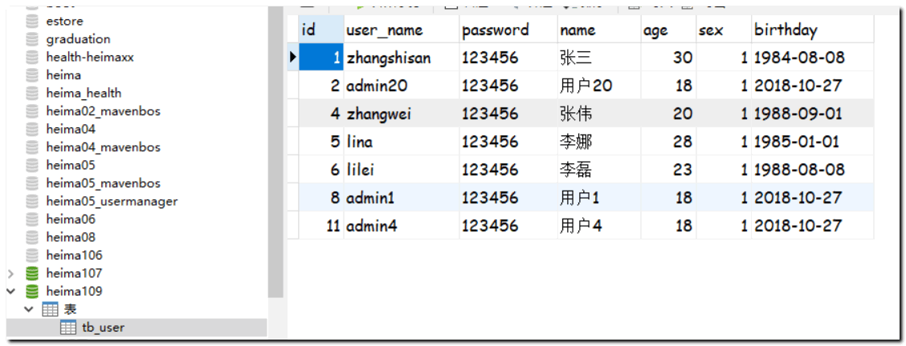
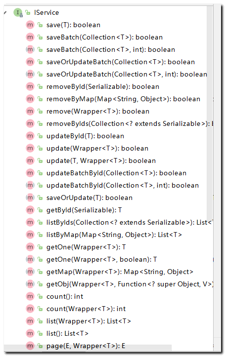
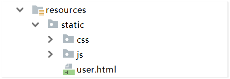
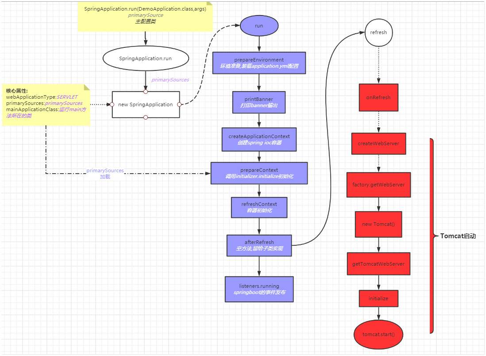
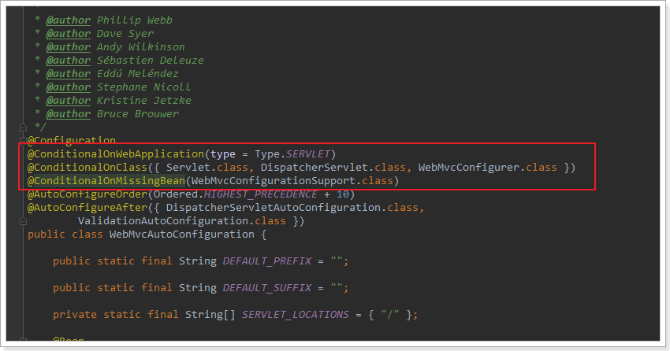

# SpringBoot学习

## 学习目标

- 掌握SpringBoot开发流程
- 掌握java配置代替xml配置常用注解作用
- 能够使用SpringBoot整合常用框架
- 能够完成当天整合案例
- 理解SpringBoot自动配置流程

## 统一开发环境

为了保证大家学习效率，尽可能减少不必要的错误，希望大家运行环境与老师一致：

- 开发工具：Idea   sts
- JDK版本：1.8
- mysql版本：5.6或5.7    

# 1. 认识SpringBoot

在这一部分，我们主要完成下述目标：

- 什么是SpringBoot
- 为什么要学习SpringBoot
- SpringBoot的特点
- 快速入门


简化  配置 

高效  ： 搭建  自动配置   版本统一  


## 1.1.什么是SpringBoot

SpringBoot是Spring项目中的一个子工程，与我们所熟知的Spring-framework 同属于spring的产品:


我们可以看到下面的一段介绍：

> Takes an opinionated view of building production-ready Spring applications. Spring Boot favors convention over configuration and is designed to get you up and running as quickly as possible.

翻译一下：

> 用一些固定的方式来构建生产级别的spring应用。Spring Boot 推崇约定大于配置的方式以便于你能够尽可能快速的启动并运行程序。

其实人们把Spring Boot 称为**搭建程序的`脚手架**`。

其最主要作用就是帮我们快速的构建庞大的spring项目，并且尽可能的减少一切xml配置，做到开箱即用，迅速上手，让我们关注与业务而非配置。让开发java项目更加快捷、简单！


## 1.2.为什么使用SpringBoot

- **复杂的配置**

  项目各种配置其实是开发时的损耗， 因为在思考 Spring 特性配置和解决业务问题之间需要进行思维切换，所以写配置挤占了写应用程序逻辑的时间。

- **“混乱”的依赖管理**

  项目的依赖管理也是件吃力不讨好的事情。决定项目里要用哪些库就已经够让人头痛的了，你还要知道这些库的哪个版本和其他库不会有冲突，这难题实在太棘手。并且，依赖管理也是一种损耗，添加依赖不是写应用程序代码。一旦选错了依赖的版本，随之而来的不兼容问题毫无疑问会是生产力杀手。

掌握了SpringBoot以后，我开发快捷，高效！

那么，为什么SpringBoot有这么大的魔力呢？

> Spring Boot 简化了基于Spring的应用开发，只需要“run”就能创建一个独立的、生产级别的Spring应用。Spring Boot为Spring平台及第三方库提供开箱即用的设置（提供默认设置，存放默认配置的包就是starter），这样我们就可以简单的开始。多数Spring Boot应用只需要很少的Spring配置。

我们可以使用SpringBoot创建java应用，并使用**java –jar 启动它**，就能得到一个生产级别的web工程。

从此我们开发web项目也无需打war了！

## 1.3.SpringBoot快速入门

接下来，我们就来利用SpringBoot搭建一个web工程，体会一下SpringBoot的魅力所在！

### 1.3.1.创建工程

选择 new Project：

 

使用Spring的初始化模板搭建项目：不需要再选择maven创建工程了！

**此种方式注意： 网络要求很高！ 网络不好不建议此种创建方式！**

 

填写maven坐标信息：

  

选择所需的起步依赖： 目前最新版本：2.3.4   可以先选择，后续我们再切换成2.3.0版本


选择项目的存储位置：

  

**如果网络不畅或者不好的情况 建议手动搭建项目工程： maven工程即可 pom导入**

```xml
 默认 版本 2.3.4 可以先选择  配置文件里面修改成：2.3.0 
    <parent>
        <groupId>org.springframework.boot</groupId>
        <artifactId>spring-boot-starter-parent</artifactId>
        <version>2.3.0.RELEASE</version>
    </parent>
   <properties>
        <java.version>1.8</java.version>
    </properties>

       <dependencies>
        <dependency>
            <groupId>org.springframework.boot</groupId>
            <artifactId>spring-boot-starter-web</artifactId>
        </dependency>

        <dependency>
            <groupId>org.projectlombok</groupId>
            <artifactId>lombok</artifactId>
            <optional>true</optional>
        </dependency>
        <dependency>
            <groupId>org.springframework.boot</groupId>
            <artifactId>spring-boot-starter-test</artifactId>
            <scope>test</scope>
            <exclusions>
                <exclusion>
                    <groupId>org.junit.vintage</groupId>
                    <artifactId>junit-vintage-engine</artifactId>
                </exclusion>
            </exclusions>
        </dependency>
    </dependencies>
   <build>
        <plugins>
            <plugin>
                <groupId>org.springframework.boot</groupId>
                <artifactId>spring-boot-maven-plugin</artifactId>
            </plugin>
        </plugins>
    </build>
```


###  1.3.2.编写controller

编写一个controller，提供一个可以访问的接口：

 

代码如下： **注意controller 位置 必须在启动类的包所在的路径或者更短路径**

```java

@RestController  //  该注解 =  @Controller+@ResponseBody 结合体
public class HelloController {

    @GetMapping("hello")
    public  String   hello(){
        return "你好 黑马114";
    }

}

```

启动访问

### 1.3.3.SpringBoot启动项目

#### 启动方式一： 直接main方法启动

最简单的启动方式，就是在项目中，找到main函数，直接运行即可：

```java
@SpringBootApplication
public class QuickstartApplication {

    public static void main(String[] args) {

        SpringApplication.run(QuickstartApplication.class, args);
    }

}
```

启动日志： 有些同学 端口8080 如果被占用 ，启动会失败，因为sp启动默认端口 8080！


可以看到tomcat启动了，监听了8080端口。在页面访问：http://localhost:8080/bank/hello即可

**如果出现端口冲突** 可以修改默认端口号：resouces目录下的 application.properties   再次启动即可

```properties
server.port=8010
```


我们在浏览器直接输入地址： localhost:8010/hello即可

 

#### 启动方式二：使用plugins插件启动 

第二种方式：idea 工具

 

```
双击： spring-boot:run
```

可以看到tomcat启动了，监听了8080端口。在页面访问：http://localhost:8080/bank/hello即可

#### 启动方式三：通过java -jar 启动

第三种方式，也就是将来打包发布时运行的方式。

此种方式： springboot插件 起到关键作用：先： package 打包  再 执行 java  -jar  xxx.jar  命令

```xml
<build>
    <plugins>
        <plugin>
            <groupId>org.springframework.boot</groupId>
            <artifactId>spring-boot-maven-plugin</artifactId>
        </plugin>
    </plugins>
</build>
```

后续**生产环境**最常用的一种方式，**一般开发中很少出现将工程打成：war！！**

首先要对项目进行打包，**需要进入项目根目录**，执行maven命令：  然后我们发现在**target目录下会生成**项目jar包

```
mvn clean package
```

不过，在输入命令前，我们可以在项目的pom文件中添加一个properties属性，打包时跳过单元测试：

```xml
<skipTests>true</skipTests>
```

如图：

 

运行后结果：


然后进入项目目录下的target目录，可以看到一个打包好的jar包：

 

输入命令，运行jar包： java -jar

```java
java -jar bank-0.0.1-SNAPSHOT.jar
```


## 1.4.SpringBoot做了什么？

可以看到我们利用SpringBoot搭建好工程，**即可直接编写controller**，开始专注业务开发，省去了所有的配置、依赖管理，非常简单！

那么这些省去的配置、依赖SpringBoot是什么时候帮我们完成的呢？

### 1.4.1.SpringBoot依赖管理

首先来看SpringBoot如何帮我们管理依赖及其版本信息。

打开项目的pom.xml文件，可以看到我们的项目依赖比较简单：

```xml
<?xml version="1.0" encoding="UTF-8"?>
<project xmlns="http://maven.apache.org/POM/4.0.0" xmlns:xsi="http://www.w3.org/2001/XMLSchema-instance"
         xsi:schemaLocation="http://maven.apache.org/POM/4.0.0 http://maven.apache.org/xsd/maven-4.0.0.xsd">
    <modelVersion>4.0.0</modelVersion>
    <parent>
        <groupId>org.springframework.boot</groupId>
        <artifactId>spring-boot-starter-parent</artifactId>
        <version>2.3.0.RELEASE</version>
        <relativePath/> <!-- lookup parent from repository -->
    </parent>
    <groupId>cn.itcast</groupId>
    <artifactId>bank</artifactId>
    <version>0.0.1-SNAPSHOT</version>
    <name>bank</name>
    <description>Demo project for Spring Boot</description>

    <properties>
        <java.version>1.8</java.version>
        <skipTests>true</skipTests>
    </properties>

    <dependencies>
        <dependency>
            <groupId>org.springframework.boot</groupId>
            <artifactId>spring-boot-starter-web</artifactId>
        </dependency>
        <dependency>
            <groupId>org.projectlombok</groupId>
            <artifactId>lombok</artifactId>
            <optional>true</optional>
        </dependency>
        <dependency>
            <groupId>org.springframework.boot</groupId>
            <artifactId>spring-boot-starter-test</artifactId>
            <scope>test</scope>
        </dependency>
    </dependencies>

    <build>
        <plugins>
            <plugin>
                <groupId>org.springframework.boot</groupId>
                <artifactId>spring-boot-maven-plugin</artifactId>
            </plugin>
        </plugins>
    </build>

</project>
```

这里包含了4部分内容，分别是：

- 父工程配置

```xml
	<parent>
        <groupId>org.springframework.boot</groupId>
        <artifactId>spring-boot-starter-parent</artifactId>
        <version>2.3.0.RELEASE</version>
        <relativePath/> <!-- lookup parent from repository -->
    </parent>
```

- Properties配置

```xml
 <properties>
        <java.version>1.8</java.version>
        <skipTests>true</skipTests>
    </properties>
```

- 依赖启动器 - sp通过不同的启动器依赖 完成相关的所有依赖

```xml
<dependencies>
        <dependency>
            <groupId>org.springframework.boot</groupId>
            <artifactId>spring-boot-starter-web</artifactId>
        </dependency>
        <dependency>
            <groupId>org.projectlombok</groupId>
            <artifactId>lombok</artifactId>
            <optional>true</optional>
        </dependency>
        <dependency>
            <groupId>org.springframework.boot</groupId>
            <artifactId>spring-boot-starter-test</artifactId>
            <scope>test</scope>
        </dependency>
    </dependencies>
```

- 插件 ： sp需要的打包插件

```xml
      <plugins>
            <plugin>
                <groupId>org.springframework.boot</groupId>
                <artifactId>spring-boot-maven-plugin</artifactId>
            </plugin>
        </plugins>
```


#### 1）父工程配置

这个项目有一个父工程配置：


可以看到使用的SpringBoot版本是最新的2.1.6RELEASE 版本。跟入这个pom查看，发现又继承了另一个父工程：

 

继续跟入，发现里面已经管理了各种依赖及其版本了，列举一部分大家看：

 

因此，我们的项目需要引入依赖时，**只需要指定坐标，版本都有SpringBoot管理，避免了依赖间的冲突**。

#### 2）Properties：

properties中主要定义了项目的JDK版本：

 

#### 3）依赖项：

这里我们总共引入了3个依赖启动项：

 

看看项目中实际引入了哪些jar包：当我们引入了相关的starter ，**springboot 会自动将相关依赖自动导入**

 

-----------------

当我们移除两个spring-boot-starter命名的依赖项时，可以发现所有的jar都消失了：

 

也就是说，在下面的这个依赖项（starter）中：

```xml
<!--web工程起步依赖-->
<dependency>
    <groupId>org.springframework.boot</groupId>
    <artifactId>spring-boot-starter-web</artifactId>
</dependency>
```

定义好了一个web工程所需的所有依赖，当我们引入依赖时，无需像以前那样一个一个寻找需要的依赖坐标并且验证版本是否冲突，开发时**只需要引入这个starter即可**！

#### 4）插件：

最后是一个插件：  commons  pom

```xml
<build>
    <plugins>
        <plugin>
            <groupId>org.springframework.boot</groupId>
            <artifactId>spring-boot-maven-plugin</artifactId>
        </plugin>
    </plugins>
</build>
```

这个是SpringBoot工程在打包时用到的插件，后续打包，springboot会根据此插件，进行应用程序打包！

**切记不可以缺少**！

上述插件：所在的模块 一定是一个独立应用程序  +  （启动类  main方法！） 

#### 5）总结：

因为SpringBoot对于依赖的管理，我们搭建项目时**只需要引入相关的starter**，无需再依赖引入上话费更多时间，大大提高了开发效率！


### 1.4.2.SpringBoot去xml配置

**在以前**，我们搭建一个web工程，至少需要下列配置文件：

- tomcat配置：web.xml（包括spring监听器、SpringMVC的DispatcherServlet、各种过滤器）
- SpringMVC配置：springmvc.xml（包括注解驱动、视图解析器等）
- Spring配置：applicationContext.xml（包括数据源、Bean扫描、事务等）
- mybatis配置：mybatis-config.xml全局配置，mybatis与spring整合配置、mapper映射文件配置

 完成所有配置需要花费大量时间，每天都淹没在xml的海洋中，整个人生都陷入了被xml支配的恐惧、黑暗当中。直到有一天，SpringBoot如同一页方舟，将你从xml海洋中拯救出来。

事实上，在**Spring3.0开始**，Spring官方就已经开始推荐使用**java配置来代替传统的xml配置**了，我们不妨来回顾一下Spring的历史：

- Spring1.0时代

  在此时因为jdk1.5刚刚出来，注解开发并未盛行，因此一切Spring配置都是xml格式，想象一下所有的bean都用xml配置，细思极恐啊，心疼那个时候的程序员2秒

- Spring2.0时代

  Spring引入了注解开发，但是因为并不完善，因此并未完全替代xml，此时的程序员往往是把xml与注解进行结合，貌似我们之前都是这种方式。

- Spring3.0及以后

  3.0以后Spring的注解已经非常完善了，因此Spring推荐大家使用完全的java配置来代替以前的xml，不过似乎在国内并未推广盛行。然后当SpringBoot来临，人们才慢慢认识到java配置的优雅。

在SpringBoot中，就用Java代码配置代替了以前繁杂的xml配置，而且这些配置都已经放到了SpringBoot提供的jar包中，因此我们引入starter依赖的那一刻，这些配置都已经生效了！

**这就是springBoot的自动配置功能。**

# 2.Java配置代替xml常用注解

回顾Java配置：**来看看java配置如何代替xml配置**。

常用注解：


1. 新搭建一个**简单案例工程**： bank   pom文件配置和 快速入门一致，直接拷贝过来即可！

```xml
   <parent>
        <groupId>org.springframework.boot</groupId>
        <artifactId>spring-boot-starter-parent</artifactId>
        <version>2.3.0.RELEASE</version>
        <relativePath/> <!-- lookup parent from repository -->
    </parent>
<dependencies>
    <dependency>
        <groupId>org.springframework.boot</groupId>
        <artifactId>spring-boot-starter-web</artifactId>
    </dependency>

    <dependency>
        <groupId>org.projectlombok</groupId>
        <artifactId>lombok</artifactId>
        <optional>true</optional>
    </dependency>
    <dependency>
        <groupId>org.springframework.boot</groupId>
        <artifactId>spring-boot-starter-test</artifactId>
        <scope>test</scope>
        <exclusions>
            <exclusion>
                <groupId>org.junit.vintage</groupId>
                <artifactId>junit-vintage-engine</artifactId>
            </exclusion>
        </exclusions>
    </dependency>
</dependencies>

<build>
    <plugins>
        <plugin>
            <groupId>org.springframework.boot</groupId>
            <artifactId>spring-boot-maven-plugin</artifactId>
        </plugin>
    </plugins>
</build>
```

 比如现在有一个类Bank.java，需要将配置文件里面的数据注入进来 

 

```java
package cn.itcast.bank.config;

import lombok.Data;

@Data
public class Bank {
    /**
     * 单笔交易的最大限额，单位是分
     */
    private Double maxAmountPerDeal;

    /**
     * 每日交易总量的最大限额
     */
    private Double maxAmountTotal;
}
```

注意：这里通过了@Data注解给当前类添加getter和setter方法，如果你没有lombok插件，可以自己编写getter和setter方法。

2. 在配置文件里面，配置转账的数据：

**application.properties**文件中配置相关数据： 

```properties
# 自定义配置文件数据 当日最大金额数 和  当日单笔最大金额数
pay.nopassword.maxAmountPerDeal=1000
pay.nopassword.maxAmountTotal=1000
```

我现在的目标：

**Bank类获取配置文件信息，进行属性注入**

**并且将Bank类实例化，注入到ioc容器中。**

## 2.1.java类配置

Spring提供了下面一些注解，用于代替xml的配置：

- `@Configuration`：声明一个类作为配置类，代替xml文件
- `@Bean`：声明在方法上，将方法的返回值加入Bean容器，代替`<bean>`标签
- `@Value`：属性注入
- `@PropertySource`：指定外部属性文件，不过，**在SpringBoot项目中，application.properties会作为默认读取，因此这里不需要这个注解。**

示例代码： 添加一个**配置类** 获取 properties文件里面的配置信息

使用注解： @Value+spEL表达式

```java
@Configuration
public class BankProperties {

    // @Value+${} spel表达式 +注解可以读取 springboot 配置文件 获取相关数据
    @Value("${pay.nopassword.maxAmountTotal}")
    private  Double  maxAmountTotal;

    @Value("${pay.nopassword.maxAmountPerDeal}")
    private  Double  maxAmountPerDeal;

    @Bean
      public Bank createBank(){
        Bank bank = new Bank();
        bank.setMaxAmountPerDeal(maxAmountPerDeal);
        bank.setMaxAmountTotal(maxAmountTotal);
        return bank;
      }


}
```

在test目录下：编写测试类：

 

利用@Autowired注解注入Bank对象类的实例：

```java
@SpringBootTest
public class BankTest {
    @Autowired
    private Bank bank;

    @Test
    public  void  test1(){
        System.out.println(bank.getMaxAmountPerDeal()+"========"+bank.getMaxAmountTotal();
    }
}

```

 

 通过Java配置替换xml配置，代码完成！

**注意事项：**  编写的启动类和测试类 注意位置！

 

## 2.2.属性注入优化一

上面的入门案例中，属性注入通过@Value注解注入，每一个属性都需要添加一个@Value注解，如果属性较多，就会比较麻烦。

因此SpringBoot对这种属性注入做了优化，采用了**约定大于配置**的方式，简化了配置。

看代码：去除@Value注解，但是要遵从约定：  实体属性名 == 配置文件的key

通过注解：@ConfigurationProperties(prefix = "pay.nopassword")  

该注解可以自动加载配置文件数据 按照约定配置即可。 

 

编写配置类2： 将配置类 BankProperties 注释掉！  启用 BankProperties2

```java
@Configuration
public class BankProperties2 {
 // BankProperties 记得注释掉 避免干扰。。。

    @Bean
    @ConfigurationProperties(prefix = "pay.nopassword")// 按照约定： 将配置文件信息注入到对象中
      public Bank createBank(){
        Bank bank = new Bank();
        return bank;
      }


}
```

是不是非常简单！！没有看到任何的属性set，一切都交给了SpringBoot自己完成了。不过必须遵循一些约定。

需要遵循的约定：

- `@ConfigurationProperties(prefix = "pay.nopassword")`定义的prefix前缀要跟application.properties中需要注入的属性的前缀一致。这里是`pay.nopassword`.

   

- Bank类的成员变量名，必须跟application.properties中需要注入的属性的后半部分一致

  

- Bank类的成员变量需要**提供getter和setter方法**

再次测试：

 


## 2.3.属性注入优化二(终极)

@ConfigurationProperties注解： 在目标类上添加此注解，那么这个类可以从配置文件中直接加载数据

前面的两种方案，无论如何优化，都还是要通过一个`@Configuration`类结合`@Bean`来声明一个实例。

事实上，如果满足上述约定，我们甚至不需要定义`@Configuration`类结合`@Bean`的方法。

将前面实例的`BankProperties`都移除！

我们演示最后一种注入方式。 此种方式最简单： **不需要配置类！**

在需要注入的数据的类上添加注解：@ConfigurationProperties ，然后将当前对象实例化 存放到IOC容器中即可！

```java
@Data
@ConfigurationProperties(prefix = "pay.nopassword")// 从配置文件中直接加载数据
@Component//  将bank 直接放入到ioc容器中即可
public class Bank {

    private  Double maxAmountPerDeal;
    private  Double maxAmountTotal;

}
```

运行测试类：

```java
@SpringBootTest
class BankTest {

    @Autowired
    private Bank bank;

    @Test
    void test1(){
        System.out.println(bank.getMaxAmountPerDeal()+"----"+bank.getMaxAmountTotal());
    }

}
```

方式二： 因为配置文件的数据已经注入给目标对象Bank了， 我们只需要将对象注入到ioc容器中即可：

可以在启动类上添加注解：@EnableConfigurationProperties   

这样就**不需要再实体Bean上添加@Component** 

 

```java
@SpringBootApplication
@EnableConfigurationProperties //类上有@ConfigureationProperties 实例化 存放到ioc容器中
public class BankApplication {

    public static void main(String[] args) {
        SpringApplication.run(BankApplication.class, args);
        System.out.println("=====++++++______");

    }

} 
```

**注意事项：**

如果在操作过程中：出现警告： 代码可以正常运行，不影响开发，但是看着难受：可以如下操作

 

Spring Boot1.5以上版本@ConfigurationProperties取消location注解，1.5版本后改变了@ConfigurationProperties注解的使用，我用的是2.3.+版本，自然会有这个问题。

**解决方案**： pom.xml添加一个依赖即可

```xml
<dependency>
    <groupId>org.springframework.boot</groupId>
    <artifactId>spring-boot-configuration-processor</artifactId>
    <optional>true</optional>
</dependency>
```

**阶段小结：**

```
@EnableConfigurationProperties

@ConfigurationProperties(prefix = "pay.nopassword")// 从配置文件中直接加载数据
```


## 2.4.YAML配置文件

SpringBoot默认读取的配置文件名称可以是application.properties或者application.yml，其中application.yml采用一种完全不同与properties的语法风格.

**properties加载的优先级高于 yaml文件，避免冲突，可以将applicaiton.properties文件删除掉**

 

代码：

```yaml
pay:
  nopassword:
    maxAmountPerDeal: 1000 # 免密支付单次交易最大限额
    maxAmountTotal: 5000 # 免密支付每日交易最大限额
```

层次比较清晰，可以看出`maxAmountPerDeal`和`maxAmountTotal`拥有一个共同的前缀属性。需要额外注意的是：

- 最后的值和`:`之间必须**有一个空格**
- **换行后要缩进两个空格**

运行结果与properties并无不同。

## 2.5.注入对象或集合（了解）

属性注入可以注入的数据类型包括：

- 各种基本数据类型
- 对象类型
- Map集合
- 上述类型的List或Set集合或数组

### 2.5.1.注入Map类型

我们在`application.yml`中添加两行配置：

```yaml
pay:
  nopassword:
    maxAmountPerDeal: 1000 # 免密支付单次交易最大限额
    maxAmountTotal: 5000 # 免密支付每日交易最大限额
    user: #用户 map集合
      name: 传智-你好
      age: 21
```

按照约定，在`Bank`中，必须有一个变量，名称为`user`，但是我们可以看到`user`后面的值不是一个基本数据类型，而是`key-value`结构。因此，我们可以用一个Map来接收：

```java
@Data
@ConfigurationProperties(prefix = "pay.nopassword")
public class Bank{
    /**
     * 单笔交易的最大限额，单位是分
     */
    private long maxAmountPerDeal;

    /**
     * 每日交易总量的最大限额
     */
    private long maxAmountTotal;

    /**
     * 注入Map类型数据
     */
    private Map<String, Object> user;
}
```

测试：


### 2.5.2.注入Bean

在刚才的案例中，我们用Map来接收key-value对这样的数据结构，其实也可以用对象来接收，只要我们定义一个po类，变量包含name和age即可:

```java
package cn.itcast.bank.pojo;

import lombok.Data;

@Data
public class User {
    private String name;
    private int age;
}
```

然后，修改Bank类中的变量类型为User类型：

 

要注意，User如果是内部类，这里要求user**必须自己实例化出来**。

然后再次Debug跟踪测试：属性值也同样注入到对象中！ 

### 2.5.3.注入集合

当然，我们也可以注入List或Set类型，不过语法特殊，来看示例：

```yaml
pay:
  nopassword:
    maxAmountPerDeal: 1000 # 免密支付单次交易最大限额
    maxAmountTotal: 5000 # 免密支付每日交易最大限额
    user: #用户
      name: 传智一哥
      age: 21
      girls:
        - 刘亦菲
        - 范冰冰
        - 古力娜扎
        - 迪丽热巴
        - 柳岩
```

我们给user添加一个变量叫做girls，值有多个，换行缩进，然后以 `-` 开头，加一个`空格`，后面写值。

我们用List集合接收（这里用Set集合或者数组都可以）：

```java

@Data
public class User {
    private String name;
    private int age;
    private List<String> girls;
}
```

再次执行测试类集合注入到对象中完成！ 


## 2.6.配置切换

开发环境、测试环境、生成环境的配置会有或多或少的差异，如果每次切换环境，都需要修改配置文件，这不仅容易出错，而且还很麻烦。

SpringBoot允许提前编写各个环境的配置文件，然后在不同场景，指定使用不同的配置文件。但是文件的命名要符合规范。

- 首先，核心文件是application.yml，不能少。
- 然后，可以定义application-xxx.yml，这里的xxx就是环境名称。例如application-dev.xml，代表开发环境。
- 最后，在application.yml或环境变量中，通过spring.profiles.active来指定环境名称，如dev，声明要用的配置

示范：

### 1）先定义3个配置yml：

 

dev配置：

```yaml
pay:
  nopassword:
    maxAmountPerDeal: 1 # 免密支付单次交易最大限额
    maxAmountTotal: 5000 # 免密支付每日交易最大限额
    user: #用户
      name: 传智一哥
      age: 18
      girls:
        - 刘亦菲
        - 范冰冰
        - 柳岩
```

prod配置：

```yaml
pay:
  nopassword:
    maxAmountPerDeal: 2000 # 免密支付单次交易最大限额
    maxAmountTotal: 10000 # 免密支付每日交易最大限额
    user: #用户
      name: 传智一哥
      age: 21
      girls:
        - 古力娜扎
        - 迪丽热巴
```

### 2）指定profile

application.yml主配置文件中激活目标yaml文件：

```yaml
spring:
  profiles:
    active: dev
```

这里指向了dev环境


# 3.SpringBoot整合案例

目标：springboot 改造员工管理系统(  springboot  mp   springmvc  vue )

新建一个sp工程来完成综合案例实现！

主要学习：实际开发中如何用SpringBoot整合常用框架。

准备环境： 老师下发的资料包中获取

- 数据库脚本和实体类
- 页面原型
- 相关的依赖配置

 

## 3.1.整合SpringMVC

SpringMVC的基本配置包括：

- 服务端口
- DispatcherServlet映射路径
- DispatcherServlet启动顺序
- 注解驱动（AnnotationDriven）
- 视图解析器（ViewResolver）

上述配置基本不需要编码，都是通过配置文件指定。

我们来看看在SpringBoot中怎么完成。

在新建普通的maven工程中 将之前的pom拷贝过来

 

```xml
  <parent>
        <groupId>org.springframework.boot</groupId>
        <artifactId>spring-boot-starter-parent</artifactId>
        <version>2.3.0.RELEASE</version>
        <relativePath/> <!-- lookup parent from repository -->
    </parent>
    <dependencies>
        <dependency>
            <groupId>org.springframework.boot</groupId>
            <artifactId>spring-boot-starter-web</artifactId>
        </dependency>
        <!--光速连接池-->
        <dependency>
            <groupId>org.springframework.boot</groupId>
            <artifactId>spring-boot-starter-jdbc</artifactId>
        </dependency>

        <!--mybatis-plus 启动器 -->
        <dependency>
            <groupId>com.baomidou</groupId>
            <artifactId>mybatis-plus-boot-starter</artifactId>
            <version>3.3.2</version>
        </dependency>
        <!--mp依赖包-->
        <dependency>
            <groupId>com.baomidou</groupId>
            <artifactId>mybatis-plus-extension</artifactId>
            <version>3.3.2</version>
        </dependency>

        <dependency>
            <groupId>mysql</groupId>
            <artifactId>mysql-connector-java</artifactId>
        </dependency>

        <dependency>
            <groupId>org.projectlombok</groupId>
            <artifactId>lombok</artifactId>
            <optional>true</optional>
        </dependency>
        <dependency>
            <groupId>org.springframework.boot</groupId>
            <artifactId>spring-boot-starter-test</artifactId>
            <scope>test</scope>
        </dependency>

        <dependency>
            <groupId>org.springframework.boot</groupId>
            <artifactId>spring-boot-configuration-processor</artifactId>
            <optional>true</optional>
        </dependency>
    </dependencies>

    <build>
        <plugins>
            <plugin>
                <groupId>org.springframework.boot</groupId>
                <artifactId>spring-boot-maven-plugin</artifactId>
            </plugin>
        </plugins>
    </build>

```

我们引入spring-boot-starter-web的那一刻，已经**触发了SpringBoot的自动配置**，SpringMVC已经完成基本配置，并且可以使用了。

**我们只需要在启动类所在的包的有效路径直接编写Controller即可完成springmvc开发**

一切变得非常简单：不需要之前的xml配置文件  

**修改application.yml文件中的属性值** 如下：

3. 配置yaml文件 -   **今天只配置端口即可** 其他配置可以不配置！

```yaml
server:
  port: 8081  # 修改 服务tomcat默认端口号

spring:
  servlet:
    multipart:
      max-file-size: 20MB    # 后续重新设置上传文件大小
      max-request-size: 10MB
  mvc:
    servlet:
      path: /    # 修改DispatcherServlet映射路径
      load-on-startup: 1   # 修改Servlet随tomcat一起初始化
logging:
  level:
    com.itheima: debug      # 日志级别 debug  
```

4. 访问静态资源文件

**源码：WebMvcAutoConfiguration.java**源码中找到**addResourceHandlers**方法


 

 

示例： 一般开发我们都习惯使用static 默认路径：

 **resources/static目录  名称和位置不可以更改**

 

访问静态页面： 输入静态资源请求url地址即可：

 


## 3.2.整合数据源DataSource

**以前**的DataSource是通过XML来配置完成的，类似这样：

```xml
<!-- 配置连接池 -->
<bean id="dataSource" class="com.alibaba.druid.pool.DruidDataSource"
      init-method="init" destroy-method="close">
    <property name="url" value="${jdbc.url}" />
    <property name="username" value="${jdbc.username}" />
    <property name="password" value="${jdbc.password}" />
</bean>
淘汰！！！
```

但是，在SpringBoot中已经自动完成了对数据源的配置，需要我们引入starter以激活，我们在项目中添加依赖：

```xml
        <dependency>
            <groupId>mysql</groupId>
            <artifactId>mysql-connector-java</artifactId>
        </dependency>
        <dependency>
            <groupId>org.springframework.boot</groupId>
            <artifactId>spring-boot-starter-jdbc</artifactId>
        </dependency>
```

首先 ： 创建一个空的数据库  ： heimaxx   数据库的账号和密码 root 

而在引入JDBC的时候，SpringBoot还自动引入了一个连接池：光速

 

HikariCP应该是目前速度最快的连接池了，我们看看它与c3p0的对比：

 

既然SpringBoot已经帮我们配置好了，但是却不知道我们数据库的地址，我们必须告诉它数据库信息，在yaml文件中配置：

```yaml
spring:
  datasource:
    driver-class-name: com.mysql.cj.jdbc.Driver
    url: jdbc:mysql://localhost:3306/heima114?characterEncoding=utf-8&serverTimezone=UTC
    username: root
    password: root
```

再次启动，则没有问题！此时我们就可以获取数据源对象 DataSource!

 

## 3.3.整合Mybatis-Plus

接下来我们学习用SpringBoot整合Mybatis   

### 3.3.1.数据准备

首先需要准备一些基本数据：

- 数据库表及数据
- 对应的实体类
- Mapper接口
- SQL

1）数据库表

这里我们准备了一个银行账户表和几条简单数据：

```mysql
/*
Navicat MySQL Data Transfer

Source Server         : mysql
Source Server Version : 50527
Source Host           : localhost:3306
Source Database       : vuedemo

Target Server Type    : MYSQL
Target Server Version : 50527
File Encoding         : 65001

Date: 2019-10-13 15:38:43
*/

SET FOREIGN_KEY_CHECKS=0;

-- ----------------------------
-- Table structure for tb_user
-- ----------------------------
DROP TABLE IF EXISTS `tb_user`;
CREATE TABLE `tb_user` (
  `id` bigint(20) NOT NULL AUTO_INCREMENT,
  `username` varchar(100) DEFAULT NULL COMMENT '用户名',
  `password` varchar(100) DEFAULT NULL COMMENT '密码',
  `name` varchar(100) DEFAULT NULL COMMENT '姓名',
  `age` int(10) DEFAULT NULL COMMENT '年龄',
  `sex` tinyint(1) DEFAULT NULL COMMENT '性别，1男性，2女性',
  `birthday` date DEFAULT NULL COMMENT '出生日期',
  PRIMARY KEY (`id`),
  UNIQUE KEY `username` (`username`)
) ENGINE=InnoDB AUTO_INCREMENT=12 DEFAULT CHARSET=utf8;

-- ----------------------------
-- Records of tb_user
-- ----------------------------
INSERT INTO `tb_user` VALUES ('1', 'zhangshisan', '123456', '张三', '30', '1', '1984-08-08');
INSERT INTO `tb_user` VALUES ('2', 'admin20', '123456', '用户20', '18', '1', '2018-10-27');
INSERT INTO `tb_user` VALUES ('4', 'zhangwei', '123456', '张伟', '20', '1', '1988-09-01');
INSERT INTO `tb_user` VALUES ('5', 'lina', '123456', '李娜', '28', '1', '1985-01-01');
INSERT INTO `tb_user` VALUES ('6', 'lilei', '123456', '李磊', '23', '1', '1988-08-08');
INSERT INTO `tb_user` VALUES ('8', 'admin1', '123456', '用户1', '18', '1', '2018-10-27');
INSERT INTO `tb_user` VALUES ('11', 'admin4', '123456', '用户4', '18', '1', '2018-10-27');

```

录入到指定的数据库中即可！

 

### 3.3.2.MybatisPlus的starter及配置

 

整合的基本步骤是这样的：

- springboot引入mybatis-plus starter
- 配置yml文件

1）引入starter

SpringBoot官方并没有提供Mybatis的启动器，不过Mybatis[官网](https://github.com/mybatis/spring-boot-starter)自己实现了：

 

```xml
     <!--mybatis-plus 启动器 -->
  			<dependency>
                <groupId>com.baomidou</groupId>
                <artifactId>mybatis-plus-boot-starter</artifactId>
                <version>3.3.2</version>
            </dependency>
            <!--mp依赖包-->
            <dependency>
                <groupId>com.baomidou</groupId>
                <artifactId>mybatis-plus-extension</artifactId>
                <version>3.3.2</version>
            </dependency>
```


2）配置mybatis的相关属性

在**application.yml**中，定义一些mybatis-plus配置：

```yaml
spring:
  datasource:
    driver-class-name: com.mysql.cj.jdbc.Driver
    url: jdbc:mysql://localhost:3306/heima?useUnicode=true&characterEncoding=utf-8&serverTimezone=GMT%2B8
    username: root
    password: root

#mybatis-plus
mybatis-plus:
  type-aliases-package: com.itheima.usermanager.pojo
  configuration:
    #   sql日志显示，这里使用标准显示
    log-impl: org.apache.ibatis.logging.stdout.StdOutImpl
    #  数据库中如果有类似 如  user_name 等命名，会将 _后的字母大写，这里是为了和实体类对应
    map-underscore-to-camel-case: true
```

3）编写Mapper接口

```java
public interface UserMapper extends BaseMapper<User> {
}
```

4）Mapper接口扫描

在启动类上添加Mapper接口扫描包注解： Mapper接口的扫描 要写在启动类上即可！

```java
@SpringBootApplication
@MapperScan(basePackages = "com.itheima.usermanager.mapper")
public class UsermanagerApplication {
    public static void main(String[] args) {
        SpringApplication.run(UsermanagerApplication.class, args);
        System.out.println("=====++++++______");
    }
}

```

### 3.3.3.测试

然后编写一个单元测试：

```java
    @Autowired
    private  UserMapper userMapper;

    @Test
    void test1() throws SQLException {

        System.out.println(userMapper);

    }
```

测试结果：

###  3.3.4 Mybatis-Plus查询数据库表数据

**详见mybatis-plus手册**

 今天先学习入门，后期项目会持续学习mybaits-plus

- **实体类建立和表的映射关系**

```java
@Data
//实体类和表建立映射关系
@TableName(value = "tb_user")
public class User implements Serializable {
 
    // 主键字段名称 id   主键自动增长
    @TableId(value = "id",type = IdType.AUTO)
    private Long id;

    // 用户名  如果 属性名和数据库字段名一致   该注解可以省略
    @TableField(value = "username")
    private String userName;

    // 密码
    private String password;

    // 姓名
    private String name;

    // 年龄
    private Integer age;

    // 性别，1男性，2女性
    private Integer sex;

    // 出生日期
    private String birthday;

}
```

- 测试类：

```java
@Autowired
private  UserMapper userMapper;

@Test
void usermapper() throws SQLException {

    System.out.println(userMapper);
  //  根据id查询对象信息！  1号用户信息
    System.out.println(userMapper.selectById(1));

}
```

测试类效果：


- **通用mapper 使用**

service接口

```java
 public List<User> findAll() ;
     
 public void  saveUser(User user);    
```

业务层实现类注入 mapper ,直接调用 mapper提供的通用api  

```java
@Service
@Transactional
public class UserServiceImpl implements UserService {

    @Autowired
    private UserMapper userMapper;
    @Override
    public List<User> findAll() {
        List<User> users = userMapper.selectList(null);//  select * from  tb_user
        return users;
    }

    @Override
    public void saveUser(User user) {

        userMapper.insert(user); //  iinsert  into  xxxx  values  (#{},#{},#{})

    }
}
```

测试类：

```java
@Autowired
private UserService userService;  //  测试业务层

@Test
public   void  testList() throws SQLException {
    List<User> all = userService.findAll();
    System.out.println(all);
}

@Test
public   void  testsave() throws SQLException {
    User user = new User();  //   @RequestBody    controller
    user.setAge(11);
    user.setName("刘德华");
    user.setPassword("123");
    userService.saveUser(user);

}
```

- **通用service使用**

mp提供了  IService接口 和  ServiceImpl实现类，提供了通用实现 ，我们开发时可以直接调用即可

代码：

```java
@Service
@Transactional
public class UserServiceImpl extends ServiceImpl<UserMapper,User> implements UserService {

    //    演示  sql  实现
    @Override
    public User findUserByUsernameAndPassword(String username, String password) {
        return baseMapper.findUserByUsernameAndPassword(username,password);
    }
}
```

测试类：

```java
@Autowired
private UserService userService;  //  测试业务层
@Test
public   void  testsave() throws SQLException {
    User user = new User();  //   @RequestBody    controller
    user.setAge(11);
    user.setName("郭富城");
    user.setPassword("123");
    userService.save(user);  // service 已经提供
}    
@Test
public   void  testfindAll() throws SQLException {
    List<User> list = userService.list();  //  service提供了list方法
    System.out.println(list);
}
```


### 3.3.5.联调SpringMVC

下面，我们把controller到service再到Mapper的整个调用链走一下。

我们定义一个Service，根据id查询账户，并在Service中调用Mapper：

mybatis-plus 提供了一个通用的业务层对象 ，快速查询数据源提供的基类： ServiceImpl<T，E>

 

该对象已经完成了一部分业务代码实现了！ 我们可以直接使用！无需再写! 

 

在Controller中调用service实现类即可：

```java
@RestController
public class UserController {

    @Autowired
    private UserService  userService;
    @GetMapping("findAll")
    public List<User> findAll(){
        return  userService.list(); //  直接调用  业务层实现的方法 list即可
    }
}
```

重新启动  main方法 启动类

输入地址：localhost:8081/findAll   返回json数据格式！

 

基于之前的vue课程 编写前端和页面原型，完成用户列表查询功能！

在项目的resources目录 下创建一个**static 目录**  添加静态资源 

 

将老师下发的资料拷贝到static 目录即可 ，基于vue 完成user.html页面的开发

html页面

```html
<div id="app">

    <table class="altrowstable" id="alternatecolor">
          <tr>
              <td>用户编号</td>
              <td>用户姓名</td>
              <td>用户密码</td>
              <td>用户性别</td>
              <td>用户年纪</td>
              <td>用户生日</td>
          </tr>
        <!--使用指令  v-for 遍历数据模型 users数据-->
         <tr v-for="user in users">
             <td>{{user.id}}</td>
             <td>{{user.name}}</td>
             <td>{{user.password}}</td>
             <td>{{user.sex==1?'帅':'美'}}</td>
             <td>{{user.age}}</td>
             <td>{{user.birthday}}</td>
         </tr>
    </table>

</div>
```

js:

```js

<script>
    var  vue = new Vue({
        el:"#app",
        //    数据模型
        data:{
            users:[]   //  定义一个 数组 接收后台  json 数据 [{},{},{}]
        },
        created(){
            //   vue初始化     函数会自动调用
            //   页面加载时 立刻发送ajax  访问后台  获取用户数据
            axios.get("findAll").then((res)=>{
              this.users = res.data  //   后台 数据  赋值  数据模型   users
            })
        }
    })
</script>
```

测试 ： 浏览器输入  localhost:8081/user.html

扩展： 复习vue 相关知识点：

- 添加用户删除功能（elementui）
- 添加用户分页查询功能(分页插件+mp分页查询)


------至此 我们今天核心内容完成--------------------

## 4.SpringBoot源码分析(理解即可)

面试的时候，面试官经常会问几个问题：

- 你知道SpringBoot是做什么的吗？
- 你知不知道SpringBoot的项目启动流程？
- 那你懂不懂SpringBoot自动配置的原理呢？

是不是直击灵魂的问题。

要想搞懂SpringBoot原理，只能去跟踪SpringBoot源码。

### 1.1.启动类分析

整个项目 的入口是带有main函数的启动类：BankApplication

```java
package cn.itcast.bank;

import org.springframework.boot.SpringApplication;
import org.springframework.boot.autoconfigure.SpringBootApplication;

@SpringBootApplication
public class BankApplication {

    public static void main(String[] args) {
        SpringApplication.run(BankApplication.class, args);
    }
}
```

这里跟**SpringBoot有关联的部分有两个**，

一个是`SpringApplication.run(BankApplication.class, args);`，

一个就是启动类上的注解：`@SpringBootApplication`。

我们分别跟踪两部分内容。

### 1.2.SpringBoot的启动过程

main函数中的`SpringApplication.run(BankApplication.class, args);`就是项目的入口，也是Spring加载的完整过程，我们从这里开始。

首先跟入run方法，流程如图：


因此，接下来要看的是两部分：

- `new SpringApplication(primarySources)`：构造函数初始化
- `run(args)`：成员的run方法

#### 1.2.1.SpringApplication构造函数

我把跟构造函数有关的几个变量和方法提取出来，方便查看：

```java
// SpringApplication.java

/**
 * 资源加载器,读取classpath下的文件
 */
private ResourceLoader resourceLoader;
/**
 * SpringBoot核心配置类的集合，这里只有一个元素，是我们传入的主函数
 */
private Set<Class<?>> primarySources;
/**
 * 当前项目的应用类型
 */
private WebApplicationType webApplicationType;

/**
 * ApplicationContextInitializer 数组
 */
private List<ApplicationContextInitializer<?>> initializers;
/**
 * ApplicationListener 数组
 */
private List<ApplicationListener<?>> listeners;

public SpringApplication(Class<?>... primarySources) {
    this(null, primarySources);
}
// 核心构造函数
public SpringApplication(ResourceLoader resourceLoader, Class<?>... primarySources) {
    // 1.记录资源加载器
    this.resourceLoader = resourceLoader;
    Assert.notNull(primarySources, "PrimarySources must not be null");
    // 2.将传入的启动类装入集合
    this.primarySources = new LinkedHashSet<>(Arrays.asList(primarySources));
    // 3.判断当前项目的类型，可以是SERVLET、REACTIVE、NONE
    this.webApplicationType = WebApplicationType.deduceFromClasspath();
    // 4.初始化 initializers 数组
    setInitializers((Collection) getSpringFactoriesInstances(ApplicationContextInitializer.class));
    // 5.初始化 listeners 数组
    setListeners((Collection) getSpringFactoriesInstances(ApplicationListener.class));
    this.mainApplicationClass = deduceMainApplicationClass();
}
```

解读：

- `ResourceLoader resourceLoader`：Spring中用来加载资源的加载器
- `Class<?>... primarySources`：这里是启动类，本例中就是BankApplication
- `3.  WebApplicationType.deduceFromClasspath()`：判断当前项目的类型，可以是SERVLET、REACTIVE、NONE，根据当前classpath中包含的class来判断，会影响后续创建的ApplicationContext的类型
- `4. getSpringFactoriesInstances(ApplicationContextInitializer.class)`：获取ApplicationContextInitializer类型的实现类对象数组
- `5.  getSpringFactoriesInstances(ApplicationListener.class)`：获取ApplicationListener类型的实现类对象数组
- `deduceMainApplicationClass()`：没有实际用途，打印日志，输出当前启动类名称

我们只看难点部分，也就是步骤3、4、5


##### 1）deduceFromClasspath()

判断项目类型：

```java
static WebApplicationType deduceFromClasspath() {
    if (ClassUtils.isPresent(WEBFLUX_INDICATOR_CLASS, null) && !ClassUtils.isPresent(WEBMVC_INDICATOR_CLASS, null)
        && !ClassUtils.isPresent(JERSEY_INDICATOR_CLASS, null)) {
        return WebApplicationType.REACTIVE;
    }
    for (String className : SERVLET_INDICATOR_CLASSES) {
        if (!ClassUtils.isPresent(className, null)) {
            return WebApplicationType.NONE;
        }
    }
    return WebApplicationType.SERVLET;
}
```

可以看到判断结果包含3种：

- REACTIVE：要求classpath中包含`org.springframework.web.reactive.DispatcherHandler`，这个是WebFlux中的核心处理器，我们并没有。
- SERVLET：要求classpath中包含`org.springframework.web.servlet.DispatcherServlet`，这是SpringMVC的核心控制器，在classpath中肯定可以找到
- NONE：以上都不满足，就是NONE


##### 2）getSpringFactoriesInstances

在构造函数中被调用了两次，分别加载`ApplicationContextInitializer`和`ApplicationListener`：


`getSpringFactoriesInstances(Class<T> type)` 方法的作用是获得指定接口的实现类的实例集合。

```java
private <T> Collection<T> getSpringFactoriesInstances(Class<T> type) {
    // 调用下面的一个重载方法，参数type就是接口的类型
    return getSpringFactoriesInstances(type, new Class<?>[] {});
}
// 真正的处理逻辑
private <T> Collection<T> getSpringFactoriesInstances(Class<T> type, Class<?>[] parameterTypes, Object... args) {
    ClassLoader classLoader = getClassLoader();
    // 1.先加载指定接口的实现类的名称集合
    Set<String> names = new LinkedHashSet<>(SpringFactoriesLoader.loadFactoryNames(type, classLoader));
    // 2.根据类的名称，创建实例对象
    List<T> instances = createSpringFactoriesInstances(type, parameterTypes, classLoader, args, names);
    // 3.排序
    AnnotationAwareOrderComparator.sort(instances);
    return instances;
}
```

这里关键是第1步中，调用`SpringFactoriesLoader.loadFactoryNames(type, classLoader)`方法，是用来获取指定接口的实现类的名称字符串，而后就可以根据名称创建实例了。

例如我们传递的参数是：`ApplicationContextInitializer.class`，那么获取的就是`ApplicationContextInitializer`下面的实现类的名称字符串集合。

那么这里是如何根据接口找到对应的实现类名称呢？


##### 3）loadFactoryNames加载类名称

那么loadFactoryNames是如何根据接口找到对应的实现类名称呢，继续跟入：

`SpringFactoriesLoader.loadFactoryNames(type, classLoader)`方法：

```java
// SpringFactoriesLoader
/**
  * 使用指定的类加载器，加载{@value #FACTORIES_RESOURCE_LOCATION}中记录的，指定factoryClass
  * 类型的实现类的全路径名。
  * @param factoryClass 需要加载的接口或抽象类
  * @param classLoader 用来加载资源的类加载器
  */
public static List<String> loadFactoryNames(Class<?> factoryClass, @Nullable ClassLoader classLoader) {
    // 获取接口名称
    String factoryClassName = factoryClass.getName();
    // 从loadSpringFactories(classLoader)方法返回的是一个Map：key是接口名称字符串，值是实现类的名称集合
    // 然后就可以调用map的get方法，根据factoryClass名称获取对应的实现类名称数组
    return loadSpringFactories(classLoader).getOrDefault(factoryClassName, Collections.emptyList());
}
```

注意到这里是先调用`loadSpringFactories(classLoader)`方法，此方法方法返回的是一个Map：key是接口名称字符串，值是实现类的名称集合。


那么，`loadSpringFactories`方法是如何读取到这样的map呢？代码如下：

```java
private static Map<String, List<String>> loadSpringFactories(@Nullable ClassLoader classLoader) {
    // 尝试从缓存中获取结果
    MultiValueMap<String, String> result = cache.get(classLoader);
    if (result != null) {
        return result;
    }

    try {
        // 从默认路径加载资源文件，地址是："META-INF/spring.factories"
        Enumeration<URL> urls = (classLoader != null ?
                                 classLoader.getResources(FACTORIES_RESOURCE_LOCATION) :
                                 ClassLoader.getSystemResources(FACTORIES_RESOURCE_LOCATION));
        // 创建空map
        result = new LinkedMultiValueMap<>();
        // 遍历资源路径
        while (urls.hasMoreElements()) {
            // 获取某个路径
            URL url = urls.nextElement();
            UrlResource resource = new UrlResource(url);
            // 加载文件内容，文件中是properties格式，key是接口名，value是实现类的名称以,隔开
            Properties properties = PropertiesLoaderUtils.loadProperties(resource);
            for (Map.Entry<?, ?> entry : properties.entrySet()) {
                // 获取key的 名称
                String factoryClassName = ((String) entry.getKey()).trim();
                // 将实现类字符串变成数组并遍历，然后添加到结果result中
                for (String factoryName : StringUtils.commaDelimitedListToStringArray((String) entry.getValue())) {
                    result.add(factoryClassName, factoryName.trim());
                }
            }
        }
        // 缓存中放一份，下次再加载可以从缓存中读取
        cache.put(classLoader, result);
        return result;
    }
    catch (IOException ex) {
        throw new IllegalArgumentException("Unable to load factories from location [" +
                                           FACTORIES_RESOURCE_LOCATION + "]", ex);
    }
}
```


这个方法是利用`ClassLoader`加载classpath下的所有的`/META-INF/spring.factories`文件。注意：**所有jar包都会被扫描和查找**。

例如，在spring-boot的jar包中，就有这样的文件

 

内容类似这样：

```properties
# PropertySource Loaders
org.springframework.boot.env.PropertySourceLoader=\
org.springframework.boot.env.PropertiesPropertySourceLoader,\
org.springframework.boot.env.YamlPropertySourceLoader

# Run Listeners
org.springframework.boot.SpringApplicationRunListener=\
org.springframework.boot.context.event.EventPublishingRunListener

# Error Reporters
org.springframework.boot.SpringBootExceptionReporter=\
org.springframework.boot.diagnostics.FailureAnalyzers

# Application Context Initializers
org.springframework.context.ApplicationContextInitializer=\
org.springframework.boot.context.ConfigurationWarningsApplicationContextInitializer,\
org.springframework.boot.context.ContextIdApplicationContextInitializer,\
org.springframework.boot.context.config.DelegatingApplicationContextInitializer,\
org.springframework.boot.web.context.ServerPortInfoApplicationContextInitializer

# Application Listeners
org.springframework.context.ApplicationListener=\
org.springframework.boot.ClearCachesApplicationListener,\
org.springframework.boot.builder.ParentContextCloserApplicationListener,\
org.springframework.boot.context.FileEncodingApplicationListener,\
org.springframework.boot.context.config.AnsiOutputApplicationListener,\
org.springframework.boot.context.config.ConfigFileApplicationListener,\
org.springframework.boot.context.config.DelegatingApplicationListener,\
org.springframework.boot.context.logging.ClasspathLoggingApplicationListener,\
org.springframework.boot.context.logging.LoggingApplicationListener,\
org.springframework.boot.liquibase.LiquibaseServiceLocatorApplicationListener
```

根据传入的接口名称，例如`org.springframework.boot.ApplicationListener`，就可以寻找到对应的实现类，例如：

```
org.springframework.boot.ClearCachesApplicationListener,\
org.springframework.boot.builder.ParentContextCloserApplicationListener,\
org.springframework.boot.context.FileEncodingApplicationListener,\
org.springframework.boot.context.config.AnsiOutputApplicationListener,\
org.springframework.boot.context.config.ConfigFileApplicationListener,\
org.springframework.boot.context.config.DelegatingApplicationListener,\
org.springframework.boot.context.logging.ClasspathLoggingApplicationListener
```

得到一个字符串集合并返回。

结束后，把得到的名字集合传递给createSpringFactoriesInstance方法，创建实例

##### 4）createSpringFactoriesInstances创建实例

然后看看`#createSpringFactoriesInstances(Class<T> type, Class<?>[] parameterTypes, ClassLoader classLoader, Object[] args, Set<String> names)` 方法，创建对象的代码：

```java
/**
 * 根据类的全名称路径数组，创建对应的对象的数组
 *
 * @param type 父类类型
 * @param parameterTypes 构造方法的参数类型
 * @param classLoader 类加载器
 * @param args 构造方法参数
 * @param names 类全名称的数组
 */
private <T> List<T> createSpringFactoriesInstances(Class<T> type,
		Class<?>[] parameterTypes, ClassLoader classLoader, Object[] args,
		Set<String> names) {
    // 定义空实例集合
	List<T> instances = new ArrayList<>(names.size()); 
	// 遍历 names 数组
	for (String name : names) {
		try {
			// 获得类名称 name
			Class<?> instanceClass = ClassUtils.forName(name, classLoader);
			// 判断类是否实现自 type 类
			Assert.isAssignable(type, instanceClass);
			// 获得构造方法
			Constructor<?> constructor = instanceClass.getDeclaredConstructor(parameterTypes);
			// 创建对象
			T instance = (T) BeanUtils.instantiateClass(constructor, args);
			instances.add(instance);
		} catch (Throwable ex) {
			throw new IllegalArgumentException("Cannot instantiate " + type + " : " + name, ex);
		}
	}
	return instances;
}

```

基本上就是利用反射根据类名称，获取类的字节码，然后创建对象。

#### 1.2.2.run方法

在完成SpringApplication对象初始化后，会调用其中的run方法，一起看下：

```java
public ConfigurableApplicationContext run(String... args) {
    // 1.计时器，记录springBoot启动耗时
    StopWatch stopWatch = new StopWatch();
    stopWatch.start();
    ConfigurableApplicationContext context = null;
    Collection<SpringBootExceptionReporter> exceptionReporters = new ArrayList<>();
    // 2.配置headLess属性，这个跟AWT有关，忽略即可
    configureHeadlessProperty();
    // 3.获取SpringApplicationRunListener实例数组，默认获取的是EventPublishRunListener
    SpringApplicationRunListeners listeners = getRunListeners(args);
    // 启动监听
    listeners.starting();
    try {
        // 4.创建ApplicationArguments对象
        ApplicationArguments applicationArguments = new DefaultApplicationArguments(args);
        //5.加载属性配置。所有的environment的属性都会加载进来，包括 application.properties 和外部的属性配置
        ConfigurableEnvironment environment = prepareEnvironment(listeners, applicationArguments);
        configureIgnoreBeanInfo(environment);
        // 6.打印Banner
        Banner printedBanner = printBanner(environment);
        // 7.根据WebApplicationType，创建不同的ApplicationContext
        context = createApplicationContext();
        // 8.获取异常报告器
        exceptionReporters = getSpringFactoriesInstances(SpringBootExceptionReporter.class,
                                                         new Class[] { ConfigurableApplicationContext.class }, context);
        // 9.调用各种初始化器的initialize方法，初始化容器
        prepareContext(context, environment, listeners, applicationArguments, printedBanner);
        // 10.准备Bean工厂，调用一个BeanDefinition和BeanFactory的后处理器，初始化各种Bean，初始化tomcat
        refreshContext(context);
        // 11.执行初始化的后置逻辑，默认为空
        afterRefresh(context, applicationArguments);
        // 停止计时器
        stopWatch.stop();
        // 12.打印 Spring Boot 启动的时长日志
        if (this.logStartupInfo) {
            new StartupInfoLogger(this.mainApplicationClass).logStarted(getApplicationLog(), stopWatch);
        }
        // 13.通知监听器，SpringBoot启动完成
        listeners.started(context);
        // 14.调用 ApplicationRunner的运行方法
        callRunners(context, applicationArguments);
    }
    catch (Throwable ex) {
        handleRunFailure(context, ex, exceptionReporters, listeners);
        throw new IllegalStateException(ex);
    }

    try {
        // 通知监听器，SpringBoot正在运行
        listeners.running(context);
    }
    catch (Throwable ex) {
        handleRunFailure(context, ex, exceptionReporters, null);
        throw new IllegalStateException(ex);
    }
    return context;
}

```

<https://www.processon.com/diagraming/5f5ce698e0b34d6f59f03350>



## 1.3.@SpringBootApplication

看完了启动类的构造函数，接下来就是启动类的注解了：`@SpringBootApplication`

我们首先看看@SpringBootApplication这个注解的源码：

点击进入，查看源码：

```java
@Target(ElementType.TYPE)
@Retention(RetentionPolicy.RUNTIME)
@Documented
@Inherited
@SpringBootConfiguration
@EnableAutoConfiguration
@ComponentScan(excludeFilters = { @Filter(type = FilterType.CUSTOM, classes = TypeExcludeFilter.class),
		@Filter(type = FilterType.CUSTOM, classes = AutoConfigurationExcludeFilter.class) })
public @interface SpringBootApplication {

	@AliasFor(annotation = EnableAutoConfiguration.class)
	Class<?>[] exclude() default {};

	@AliasFor(annotation = EnableAutoConfiguration.class)
	String[] excludeName() default {};

	@AliasFor(annotation = ComponentScan.class, attribute = "basePackages")
	String[] scanBasePackages() default {};

	@AliasFor(annotation = ComponentScan.class, attribute = "basePackageClasses")
	Class<?>[] scanBasePackageClasses() default {};
}

```


可以发现@SpringBootApplication上面又包含多个注解，重点的注解有3个：

- @SpringBootConfiguration
- @EnableAutoConfiguration
- @ComponentScan

逐个来看。


### 1.3.1.@SpringBootConfiguration

`org.springframework.boot.@SpringBootConfiguration` 注解，标记这是一个 Spring Boot 配置类。代码如下：

```java
@Target(ElementType.TYPE)
@Retention(RetentionPolicy.RUNTIME)
@Documented
@Configuration
public @interface SpringBootConfiguration {

}

```

可以看到，它上面继承自 `@Configuration` 注解，所以两者功能也一致，都是标记一个类作为**配置类**。而配置类里面可以做各种Java配置，也就是说我们可以在我们的**main函数所在的启动类**中写入java配置。


### 1.3.2.@ComponentScan

我们跟进源码，核心代码是：

```java
/**
 * Configures component scanning directives for use with @{@link Configuration} classes.
 * Provides support parallel with Spring XML's {@code <context:component-scan>} element.
 */
@Retention(RetentionPolicy.RUNTIME)
@Target(ElementType.TYPE)
@Documented
@Repeatable(ComponentScans.class)
public @interface ComponentScan {

	/**
	 * 标记需要扫描的包，与basePackages作用一样
	 */
	@AliasFor("basePackages")
	String[] value() default {};
    
	@AliasFor("value")
	String[] basePackages() default {};

	Class<?>[] basePackageClasses() default {};

	Filter[] includeFilters() default {};

	Filter[] excludeFilters() default {};
	
    // 。。。
}


```


类上的一段注释说明了这个注解的作用：

大概的意思：

> 配置组件扫描的指令。提供了类似与`<context:component-scan>`标签的作用
>
> 通过basePackageClasses或者basePackages属性来指定要扫描的包。如果没有指定这些属性，那么将从声明这个注解的类所在的包开始，扫描包及子包

而我们的@SpringBootApplication注解声明的类就是main函数所在的启动类，因此扫描的包是该类所在包及其子包。因此，**一般启动类会放在一个比较前的包目录中**：

 


### 1.3.3.@EnableAutoConfiguration

关于这个注解，官网上有一段说明：

> The second class-level annotation is `@EnableAutoConfiguration`. This annotation
> tells Spring Boot to “guess” how you want to configure Spring, based on the jar
> dependencies that you have added. Since `spring-boot-starter-web` added Tomcat
> and Spring MVC, the auto-configuration assumes that you are developing a web
> application and sets up Spring accordingly.

简单翻译以下：

> 第二级的注解`@EnableAutoConfiguration`，告诉SpringBoot基于你所添加的依赖，去“猜测”你想要如何配置Spring。比如我们引入了`spring-boot-starter-web`，而这个启动器中帮我们添加了`tomcat`、`SpringMVC`的依赖。此时自动配置就知道你是要开发一个web应用，所以就帮你完成了web及SpringMVC的默认配置了！

总结，SpringBoot内部对大量的**第三方库或Spring内部库进行了默认配置**，这些配置默认**并未生效**。

而`@EnableAutoConfiguration`就像一个开关，或者一个启动者，它会让这些SpringBoot准备的默认配置生效。

那么问题来了：

- 这些默认配置在哪里？
- @EnableAutoConfiguration是如何找到这些配置的？
- @EnableAutoConfiguration是如何从中筛选出想要启用的默认配置的？


## 1.4.@EnableAutoConfiguration

先看下源码：

```java
@Target(ElementType.TYPE)
@Retention(RetentionPolicy.RUNTIME)
@Documented
@Inherited
@AutoConfigurationPackage
@Import(AutoConfigurationImportSelector.class)
public @interface EnableAutoConfiguration {

	String ENABLED_OVERRIDE_PROPERTY ="spring.boot.enableautoconfiguration";

	Class<?>[] exclude() default {};

	String[] excludeName() default {};
}

```


这个注解继承了一个新注解：

 

### 1.4.1.@Import

看源码：

```java
/**
 * Indicates one or more {@link Configuration @Configuration} classes to import.
 *
 * <p>Provides functionality equivalent to the {@code <import/>} element in Spring XML.
 * Allows for importing {@code @Configuration} classes, {@link ImportSelector} and
 * {@link ImportBeanDefinitionRegistrar} implementations, as well as regular component
 * classes 
 */
@Target(ElementType.TYPE)
@Retention(RetentionPolicy.RUNTIME)
@Documented
public @interface Import {

	/**
	 * {@link Configuration}, {@link ImportSelector}, {@link ImportBeanDefinitionRegistrar}
	 * or regular component classes to import.
	 */
	Class<?>[] value();

}

```

`@Import`注解的作用就是**把一个或多个类导入到Spring容器中**。不过，导入的方式多种多样：

- 可以直接通过类名导入：`@Import(User.class)`就是把User这个类导入
- 可以通过`ImportSelector`来导入。而`ImportSelector`是一个接口，**用来获取需要导入的类的名称数组**，
- 通过 `ImportBeanDefinitionRegistrar`来导入一些bean

我们可以看到在@EnableAutoConfiguration使用@Import注解时，传递的参数是：

 

可以看到参数名是：`AutoConfigurationImportSelector`。显然，这是一个`ImportSelector`相关的类，与上述第二种方式一致:


那么什么是`ImportSelector`呢？

### 1.4.2.@ImportSelector

源码：

```java
public interface ImportSelector {

	/**
	 * Select and return the names of which class(es) should be imported based on
	 * the {@link AnnotationMetadata} of the importing @{@link Configuration} class.
	 */
	String[] selectImports(AnnotationMetadata importingClassMetadata);

}

```

基于`AnnotationMetadata`来导入多个`@Configuration`类型的类的名称数组并返回。也就是说这个方法就是去寻找Spring提供的默认配置类的。

那么`AutoConfigurationImportSelector`这个类肯定会实现这个方法，去加载Spring提供的默认配置。


### 1.4.3.AutoConfigurationImportSelector

#### 1）selectImports

这个类实现了ImportSelector，其中会有selectImports方法：

```java
@Override
public String[] selectImports(AnnotationMetadata annotationMetadata) {
    if (!isEnabled(annotationMetadata)) {
        return NO_IMPORTS;
    }
    // 获取元信息
    AutoConfigurationMetadata autoConfigurationMetadata = AutoConfigurationMetadataLoader
        .loadMetadata(this.beanClassLoader);
    // 加载默认配置
    AutoConfigurationEntry autoConfigurationEntry = getAutoConfigurationEntry(autoConfigurationMetadata,
                                                                              annotationMetadata);
    return StringUtils.toStringArray(autoConfigurationEntry.getConfigurations());
}

```

我们关注的方法是：


#### 2）加载并过滤自动配置

跟入方法：

```java
protected AutoConfigurationEntry getAutoConfigurationEntry(AutoConfigurationMetadata autoConfigurationMetadata,
                                                           AnnotationMetadata annotationMetadata) {
    // 1 判断是否开启。如未开启，返回空数组。
    if (!isEnabled(annotationMetadata)) {
        return EMPTY_ENTRY;
    }
    // 2 获得注解的属性（主要获取exclude排除的自动配置项）
    AnnotationAttributes attributes = getAttributes(annotationMetadata);
    // 3 读取@EnableAutoConfiguration相关的默认配置类的名称数组
    List<String> configurations = getCandidateConfigurations(annotationMetadata, attributes);
    // 3.1 移除重复的配置类
    configurations = removeDuplicates(configurations);
    // 4 获得需要排除的配置类
    Set<String> exclusions = getExclusions(annotationMetadata, attributes);
    // 4.1 校验排除的配置类是否合法，没有则跳过检查
    checkExcludedClasses(configurations, exclusions);
    // 4.2 从 configurations 中，移除需要排除的配置类
    configurations.removeAll(exclusions);
    // 5 根据条件（@ConditionalOn注解），过滤掉不符合条件的配置类
    configurations = filter(configurations, autoConfigurationMetadata);
    // 6 触发自动配置类引入完成的事件
    fireAutoConfigurationImportEvents(configurations, exclusions);
    return new AutoConfigurationEntry(configurations, exclusions);
}

```

其中加载配置的核心代码就是：

```java
// 3 读取@EnableAutoConfiguration相关的默认配置类的名称数组
    List<String> configurations = getCandidateConfigurations(annotationMetadata, attributes);

```

#### 3）去哪里加载自动配置？

我们继续跟入**getCandidateConfigurations**这个方法：

```java
// 3 读取@EnableAutoConfiguration相关的默认配置类的名称数组
    List<String> configurations = getCandidateConfigurations(annotationMetadata, attributes);

```

跟进源码：

```java
protected List<String> getCandidateConfigurations(AnnotationMetadata metadata, AnnotationAttributes attributes) {
    // 利用SpringFactoriesLoader加载指定类型对应的类的全路径
    List<String> configurations = SpringFactoriesLoader.loadFactoryNames(EnableAutoConfiguration.class,
getBeanClassLoader());
    // ...
    return configurations;
}

```

继续跟进

```java
SpringFactoriesLoader.loadFactoryNames(EnableAutoConfiguration.class,
getBeanClassLoader());

```

这段代码的`SpringFactoriesLoader.loadFactoryNames()`方法我们已经见过一次了，它会去classpath下的`/META-INF/spring.factories`中寻找。

本例中是找以`EnableAutoConfiguration`为key的配置类的名称：


到此，所有的自动配置类加载完毕

### 1.4.4.加载到的配置如何筛选

刚才加载的所有自动配置类，都可以再spring-boot-autoconfigure包中找到这些自动配置类：

 

还有：

 

非常多，几乎涵盖了现在主流的开源框架，例如：

- redis
- jms
- amqp
- jdbc
- jackson
- mongodb
- jpa
- solr
- elasticsearch

... 等等


我们来看一个我们熟悉的，例如SpringMVC，查看mvc 的自动配置类：

 

打开WebMvcAutoConfiguration：



我们看到这个类上的4个注解：

- `@Configuration`：声明这个类是一个配置类

- `@ConditionalOnWebApplication(type = Type.SERVLET)`

  ConditionalOn，翻译就是在某个条件下，此处就是满足项目的类是是Type.SERVLET类型，也就是一个普通web工程，显然我们就是

- `@ConditionalOnClass({ Servlet.class, DispatcherServlet.class, WebMvcConfigurer.class })`

  这里的条件是OnClass，也就是满足以下类存在：Servlet、DispatcherServlet、WebMvcConfigurer，其中Servlet只要引入了tomcat依赖自然会有，后两个需要引入SpringMVC才会有。**这里就是判断你是否引入了相关依赖，引入依赖后该条件成立，当前类的配置才会生效**！

<https://www.processon.com/diagraming/5f5ceb1b63768959e2e57c52>


# 5.SpringBoot学习总结

来总结下面试官问题的答案：

### 1.5.1.SpringBoot是做什么的？

SpringBoot是一个快速构建项目并简化项目配置的工具，内部集成了Tomcat及大多数第三方应用和Spring框架的默认配置。

与我们学习的SpringMVC和Mybatis并无冲突,SpringBoot提供的这些默认配置，大大简化了SpringMVC、Mybatis等基于Spring的应用的开发。


### 1.5.2.SpringBoot的启动流程

SpringBoot项目启动第一步就是创建SpringApplication的实例，并且调用SpringApplication.run()这个方法。

创建**SpringApplication实例**主要完成三件事情：

- 记录当前启动类字节码
- 判断当前项目类型，普通Servlet、响应式WebFlux、NONE
- 加载/META-INF/spring.factories文件，初始化**ApplicationContextInitializer和ApplicationListener**实例

而后的**run()方法则会创建spring容器**，流程如下：

- 准备监听器，监听Spring启动的各个过程
- 创建并**配置环境参数Environment**
- 创建ApplicationContext
- `prepareContext()`：初始化ApplicationContext，准备运行环境
- `refreshContext(context)`：准备Bean工厂，调用一个BeanDefinition和BeanFactory的后处理器，初始化各种Bean，初始化tomcat
- `afterRefresh()`：拓展功能，目前为空
- 发布容器初始化完毕的事件


### 1.5.3.SpringBoot自动配置原理

SpringBoot为我们提供了各种框架的默认配置，而默认配置生效的步骤如下：

- `@EnableAutoConfiguration`开启自动配置，会去寻找classpath下的`META-INF/spring.factories`文件，读取其中以`EnableAutoConfiguration`为**key的所有类的名称**，这些类就是提前写好的自动配置类
- 这些类都声明了`@Configuration`注解，并且通过`@Bean`注解提前配置了我们所需要的一切实例。完成自动配置
- 但是，这些配置不一定生效，因为有`@ConditionalOn`注解，**满足一定条件才会生效**。比如条件之一：是一些相关的类要存在
- 类要存在，我们只需要引入了相关依赖（starter），依赖有了条件成立，自动配置生效。
- 如果我们自己配置了相关Bean，那么会覆盖默认的自动配置的Bean
- 我们还可以通过配置application.yml文件，来覆盖自动配置中的属性

因此，使用SpringBoot自动配置的关键有两点：

1）启动器starter

要想自动配置生效，只需要引入依赖即可，而依赖版本我们也不用操心，因为只要引入了SpringBoot提供的stater（启动器），就会自动管理依赖及版本了。

因此，玩SpringBoot的第一件事情，就是找starter，SpringBoot提供了大量的默认starter

2）全局配置yaml文件

另外，SpringBoot的默认配置，都会读取默认属性，而这些属性可以通过自定义`application.yaml`文件来进行覆盖。这样虽然使用的还是默认配置，但是配置中的值改成了我们自定义的。

因此，玩SpringBoot的第二件事情，就是通过`application.yaml`来覆盖默认属性值，形成自定义配置。


# 能力目标

基于springboot+mp 整合，基于vue : 完成用户管理系统查询功能

学员完：删除功能


