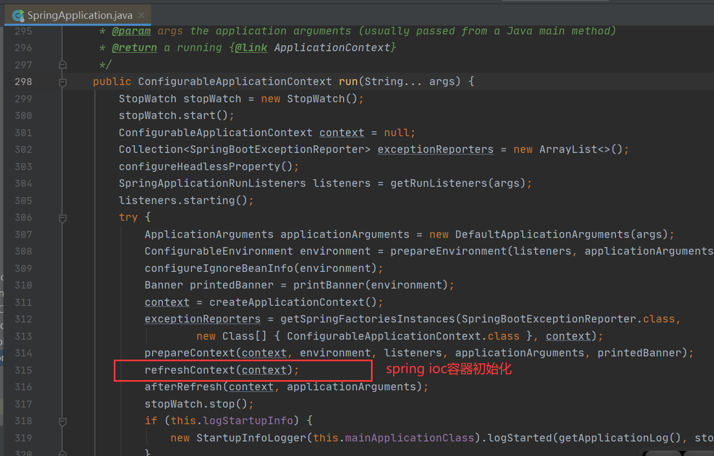
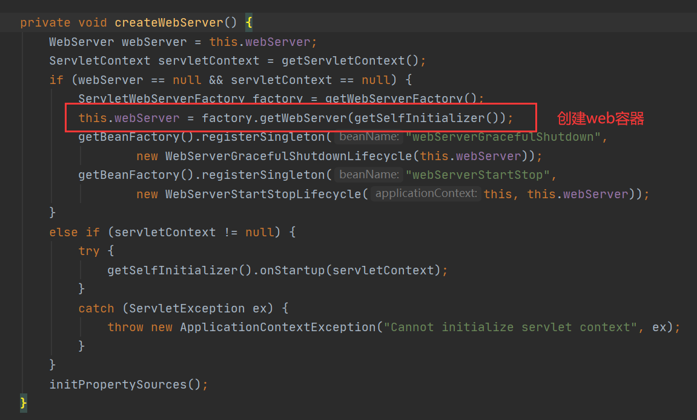

# [SpringBoot内置tomcat启动原理](https://www.cnblogs.com/sword-successful/p/11383723.html)


### 前言

我们在springboot项目里面只是引入了spring-boot-starter-web这个依赖包，然后在我们的main方法运行SpringApplication.run方法就直接启动了一个tomcat服务。那么springboot究竟是如何自动启动tomcat的呢？

### 内置tomcat

springboot开发web工程会引入spring-boot-starter-web依赖，我们仔细看一下这个依赖结构会发现web依赖包自动帮我们依赖了tomcat-embed-core:9.0.35，这个就是springboot帮我们内置好的一个tomcat容器依赖。


### Springboot启动过程

我们跟踪spring的启动程序main方法，进入到SpringApplication.run方法，其中refreshContext(conext);刷新我们的容器就是在做spring ioc的容器初始化，我们的tomcat启动就是在这个方法结束后完成的。



跟进refreshContext，我们可以一直进入到AbstractApplicationContext.refresh,这里是spring ioc容器真正初始化的地方。总共有12大步骤，里面有一个onRefresh方法：


ServletWebServerApplicationContext重写了onRefresh方法:

```java
@Override
	protected void onRefresh() {
		super.onRefresh();
		try {
            //我们的tomcat容器就是在这里创建出来的，并且同时自动启动了
			createWebServer();
		}
		catch (Throwable ex) {
			throw new ApplicationContextException("Unable to start web server", ex);
		}
	}
```



使用TomcatServletWebServerFactory类getWebServer，创建容器:


整个springboot的启动过程如下图:


