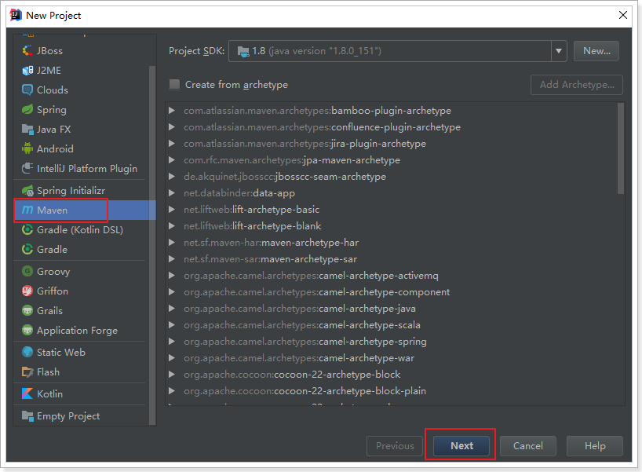
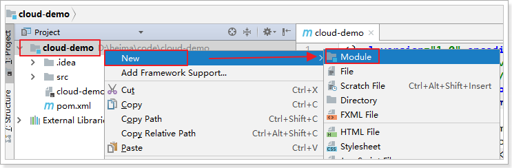
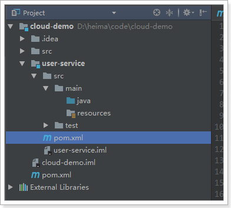
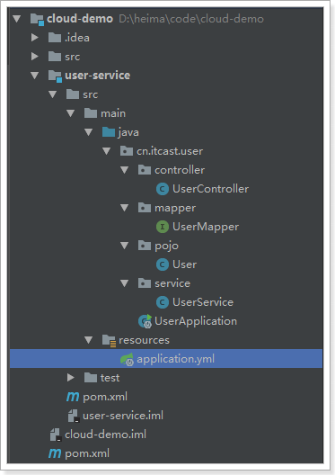
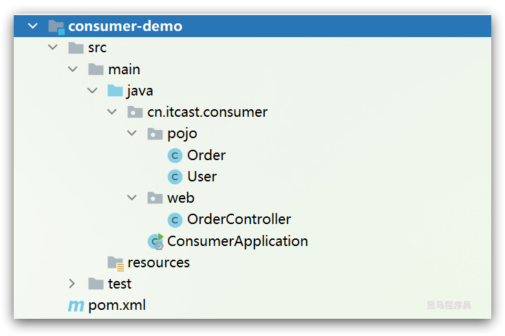
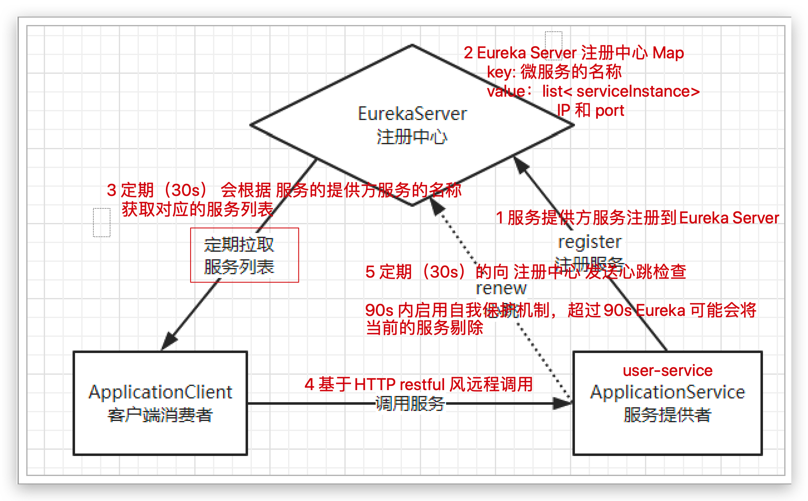

# 0.学习目标

- 了解系统架构的演变
- 了解RPC与Http的区别
- 掌握RestTemplate的简单使用
- 知道什么是SpringCloud
- 独立搭建Eureka注册中心
- 独立配置Robbin负载均衡


# 1.系统架构演变

随着互联网的发展，网站应用的规模不断扩大。需求的激增，带来的是技术上的压力。系统架构也因此也不断的演进、升级、迭代。从单一应用，到垂直拆分，到分布式服务，到SOA，以及现在火热的微服务架构，还有在Google带领下来势汹涌的Service Mesh。我们到底是该乘坐微服务的船只驶向远方，还是偏安一隅得过且过？

其实生活不止眼前的苟且，还有诗和远方。所以我们今天就回顾历史，看一看系统架构演变的历程；把握现在，学习现在最火的技术架构；展望未来，争取成为一名优秀的Java工程师。

## 1.1. 集中式架构（巨石）

当网站流量很小时，只需一个应用，将所有功能都部署在一起，以减少部署节点和成本。此时，用于简化增删改查工作量的数据访问框架(ORM)是影响项目开发的关键。

 

存在的问题：

- 代码耦合，开发维护困难
- 无法针对不同模块进行针对性优化
- 无法水平扩展
- 单点容错率低，并发能力差


## 1.2.垂直拆分

当访问量逐渐增大，单一应用无法满足需求，此时为了应对更高的并发和业务需求，我们根据业务功能对系统进行拆分：

 

优点：

- 系统拆分实现了流量分担，解决了并发问题
- 可以针对不同模块进行优化
- 方便水平扩展，负载均衡，容错率提高

缺点：

- 系统间相互独立，会有很多重复开发工作，影响开发效率

## 1.3.分布式服务

当垂直应用越来越多，应用之间交互不可避免，将核心业务抽取出来，作为独立的服务，逐渐形成稳定的服务中心，使前端应用能更快速的响应多变的市场需求。此时，用于提高业务复用及整合的分布式调用是关键。

 

优点：

- 将基础服务进行了抽取，系统间相互调用，提高了代码复用和开发效率

缺点：

- 系统间耦合度变高，调用关系错综复杂，难以维护


## 1.4.服务治理架构（SOA）

SOA ：面向服务的架构

当服务越来越多，容量的评估，小服务资源的浪费等问题逐渐显现，此时需增加一个调度中心基于访问压力实时管理集群容量，提高集群利用率。此时，用于提高机器利用率的资源调度和治理中心(SOA)是关键


以前出现了什么问题？

- 服务越来越多，需要管理每个服务的地址
- 调用关系错综复杂，难以理清依赖关系
- 服务过多，服务状态难以管理，无法根据服务情况动态管理

服务治理要做什么？

- 服务注册中心，实现服务自动注册和发现，无需人为记录服务地址
- 服务自动订阅，服务列表自动推送，服务调用透明化，无需关心依赖关系
-  动态监控服务状态监控报告，人为控制服务状态

缺点：

- 服务间会有依赖关系，一旦某个环节出错会影响较大
- 服务关系复杂，运维、测试部署困难，不符合DevOps思想


## 1.5.微服务

前面说的SOA，英文翻译过来是面向服务。微服务，似乎也是服务，都是对系统进行拆分。因此两者非常容易混淆，但其实缺有一些差别：

微服务的特点：

- 单一职责：微服务中每一个服务都对应唯一的业务能力，做到单一职责
- 微：微服务的服务拆分粒度很小，例如一个用户管理就可以作为一个服务。每个服务虽小，但“五脏俱全”。
- 面向服务：面向服务是说每个服务都要对外暴露Rest风格服务接口API。并不关心服务的技术实现，做到与平台和语言无关，也不限定用什么技术实现，只要提供Rest的接口即可。
- 自治：自治是说服务间互相独立，互不干扰
  - 团队独立：每个服务都是一个独立的开发团队，人数不能过多。
  - 技术独立：因为是面向服务，提供Rest接口，使用什么技术没有别人干涉
  - 前后端分离：采用前后端分离开发，提供统一Rest接口，后端不用再为PC、移动段开发不同接口
  - 数据库分离：每个服务都使用自己的数据源
  - 部署独立，服务间虽然有调用，但要做到服务重启不影响其它服务。有利于持续集成和持续交付。每个服务都是独立的组件，可复用，可替换，降低耦合，易维护


微服务结构图：


# 2.服务调用方式

上面说过，Dubbo架构的服务调用主要是基于Dubbo协议的RPC调用。SpringCloud的服务调用是基于Http协议的Rest风格调用。两者存在较大的差异。

虽然Dubbo协议和Http协议**都是基于TCP**的传输层协议，但Http协议设计的初衷是基于页面访问（超文本传输），因此两者的数据传输格式存在较大的差异。

## 2.1.Http协议

HTTP请求包括：请求行、请求头、请求体等信息：

- 请求行：包含请求的资源路径，例如 `/user/_doc/1`，是判断要调用的目标方法的重要信息
- 请求头：包含
  - host信息，例如：192.168.150.101:9200，决定了要调用的目标服务器的地址
  - content-type信息：例如 application/json，决定了请求参数的格式
  - accept信息：例如application/json，决定了接收的响应格式信息
  - 其它略。。
- 请求体：包含请求参数信息

当调用者发出一个http请求时流程如下：


可以看到请求参数是由tomcat接收并解码处理的，而我们的java程序只需要负责根据请求path，找到对应的HandlerMethod并调用即可。

其好处包括：

- 可以简化我们的开发
- 调用者与服务提供者完全解耦，只要能发送或处理http请求即可

但缺点也很明显：

- 请求参数编解码过程是tomcat处理，性能完全由tomcat性能来决定，难以进一步优化。
- 请求参数格式固定，有很多冗余数据，略显臃肿，并在一定程度上会影响传输性能


## 2.2.Dubbo协议

而Dubbo协议的调用过程如下图：


调用者需要对请求参数做编码、数据做序列化。被调用者需要对数据做反序列化、头信息做解码，然后完成请求分发和调用。其中数据传输消息格式完全由Dubbo协议自己定制，比较精简。

数据消息格式主要包括：

- 消息头：用于存储一些元信息，比如魔数（Magic），数据包类型（Request/Response），消息体长度（Data Length）等。
- 消息体：用于存储具体的调用消息，比如版本号、接口名、方法名称、参数类型、参数值等。


服务调用者的调用步骤包括：

- 服务调用者与服务提供者建立连接
- 服务调用者准备请求消息（包括消息头和消息体）
- 服务调用者编码消息，并完成消息序列化
- 服务调用者传递消息到提供者
- 提供者解码消息，获取被调用的接口名、方法名、参数类型、参数值等信息
- 找到要调用的方法，派发线程去执行并得到结果
- 将结果封装为标准消息格式
- 序列化响应消息，并传输给调用者


可以看出，Dubbo调用的请求发送、接收、消息的编解码都是由Dubbo框架来实现的。因此消息具备下列优缺点。

优点：

- 请求连接基于Netty框架，是高性能的网络框架
- 请求消息格式由Dubbo定义，简洁高效
- 消息序列化方式多样化，可定制高效的序列化方式，性能有优势

缺点：

- 调用者和提供者者都要使用Java语言
- 提供者需要对外暴露自己的service接口，耦合度高


http协议:

​	优点：低耦合、灵活

​	缺点：性能

dubbo协议：

​	优点：性能，数据格式简介

​	缺点：限定了语言，依赖于服务提供方的接口，耦合高。


## 2.3.Http客户端工具

既然微服务选择了Http，那么我们就需要考虑自己来实现对请求和响应的处理。不过开源世界已经有很多的http客户端工具，能够帮助我们做这些事情，例如：

- HttpClient
- OKHttp
- URLConnection

接下来，不过这些不同的客户端，API各不相同，


Spring提供了一个RestTemplate模板工具类，对基于Http的客户端进行了封装，并且实现了对象与json的序列化和反序列化，非常方便。RestTemplate并没有限定Http的客户端类型，而是进行了抽象，目前常用的3种都有支持：

- HttpClient
- OkHttp
- JDK原生的URLConnection（默认的）


接下来，我们就来测试下RestTemplate的使用。

# 3.远程调用Demo

既然RestTemplate的目的是实现远程调用，那么就需要有一个服务的提供者，和一个服务的调用者，两者必须是独立运行的服务。

但是为了方便项目的学习，我们会创建一个聚合项目，然后把服务的提供者、调用者作为其中的两个模块。

## 3.1.创建父工程

首先，我们创建一个父工程，用来管理依赖，聚合子工程。



编写项目信息：


然后将Pom修改成这样：

```xml
<?xml version="1.0" encoding="UTF-8"?>
<project xmlns="http://maven.apache.org/POM/4.0.0"
         xmlns:xsi="http://www.w3.org/2001/XMLSchema-instance"
         xsi:schemaLocation="http://maven.apache.org/POM/4.0.0 http://maven.apache.org/xsd/maven-4.0.0.xsd">
    <modelVersion>4.0.0</modelVersion>

    <groupId>cn.itcast.demo</groupId>
    <artifactId>cloud-demo</artifactId>
    <version>1.0</version>

    <packaging>pom</packaging>

    <parent>
        <groupId>org.springframework.boot</groupId>
        <artifactId>spring-boot-starter-parent</artifactId>
        <version>2.1.13.RELEASE</version>
        <relativePath/>
    </parent>

    <properties>
        <project.build.sourceEncoding>UTF-8</project.build.sourceEncoding>
        <project.reporting.outputEncoding>UTF-8</project.reporting.outputEncoding>
        <java.version>1.8</java.version>
        <spring-cloud.version>Greenwich.SR5</spring-cloud.version>
        <mysql.version>5.1.47</mysql.version>
    </properties>

    <dependencyManagement>
        <dependencies>
            <!-- springCloud -->
            <dependency>
                <groupId>org.springframework.cloud</groupId>
                <artifactId>spring-cloud-dependencies</artifactId>
                <version>${spring-cloud.version}</version>
                <type>pom</type>
                <scope>import</scope>
            </dependency>
            <!-- mysql驱动 -->
            <dependency>
                <groupId>mysql</groupId>
                <artifactId>mysql-connector-java</artifactId>
                <version>${mysql.version}</version>
            </dependency>
            <!--mybatis-->
            <dependency>
                <groupId>org.mybatis.spring.boot</groupId>
                <artifactId>mybatis-spring-boot-starter</artifactId>
                <version>2.1.1</version>
            </dependency>
        </dependencies>
    </dependencyManagement>
    <dependencies>
        <dependency>
            <groupId>org.projectlombok</groupId>
            <artifactId>lombok</artifactId>
        </dependency>
    </dependencies>
</project>
```

这里已经对大部分要用到的依赖的版本进行了 管理，方便后续使用


## 3.2.服务提供者

我们新建一个项目，对外提供查询用户的服务。

### 3.2.1.创建module

选中父工程：cloud-demo

 

填写module信息：


### 3.2.2.依赖

给user-service中的pom.xml中添加依赖：

```xml
<?xml version="1.0" encoding="UTF-8"?>
<project xmlns="http://maven.apache.org/POM/4.0.0"
         xmlns:xsi="http://www.w3.org/2001/XMLSchema-instance"
         xsi:schemaLocation="http://maven.apache.org/POM/4.0.0 http://maven.apache.org/xsd/maven-4.0.0.xsd">
    <parent>
        <artifactId>cloud-demo</artifactId>
        <groupId>cn.itcast.demo</groupId>
        <version>1.0</version>
    </parent>
    <modelVersion>4.0.0</modelVersion>

    <artifactId>user-service</artifactId>

    <dependencies>
        <dependency>
            <groupId>org.springframework.boot</groupId>
            <artifactId>spring-boot-starter-web</artifactId>
        </dependency>
        <dependency>
            <groupId>mysql</groupId>
            <artifactId>mysql-connector-java</artifactId>
        </dependency>
        <!--mybatis-->
        <dependency>
            <groupId>org.mybatis.spring.boot</groupId>
            <artifactId>mybatis-spring-boot-starter</artifactId>
        </dependency>
    </dependencies>
    <build>
        <plugins>
            <plugin>
                <groupId>org.springframework.boot</groupId>
                <artifactId>spring-boot-maven-plugin</artifactId>
            </plugin>
        </plugins>
    </build>
</project>
```


项目结构：

 


### 3.2.2.编写代码

在resources目录中添加一个application.yml属性文件,这里我们采用了yaml语法，而不是properties：

```yaml
server:
  port: 8081
spring:
  datasource:
    url: jdbc:mysql://localhost:3306/heima
    username: root
    password: 123
    driver-class-name: com.mysql.jdbc.Driver
mybatis:
  type-aliases-package: cn.itcast.user.pojo
  configuration:
    map-underscore-to-camel-case: true
logging:
  level:
    cn.itcast: debug
```

对应的用户表及数据：

```sql
SET FOREIGN_KEY_CHECKS=0;
-- ----------------------------
-- Table structure for `tb_user`
-- ----------------------------
DROP TABLE IF EXISTS `tb_user`;
CREATE TABLE `tb_user` (
  `id` bigint(20) NOT NULL AUTO_INCREMENT,
  `user_name` varchar(100) DEFAULT NULL COMMENT '用户名',
  `password` varchar(100) DEFAULT NULL COMMENT '密码',
  `name` varchar(100) DEFAULT NULL COMMENT '姓名',
  `age` int(10) DEFAULT NULL COMMENT '年龄',
  `sex` tinyint(1) DEFAULT NULL COMMENT '性别，1男性，2女性',
  `birthday` date DEFAULT NULL COMMENT '出生日期',
  `note` varchar(255) DEFAULT NULL COMMENT '备注',
  `created` datetime DEFAULT NULL COMMENT '创建时间',
  `updated` datetime DEFAULT NULL COMMENT '更新时间',
  PRIMARY KEY (`id`),
  UNIQUE KEY `username` (`user_name`)
) ENGINE=InnoDB AUTO_INCREMENT=13 DEFAULT CHARSET=utf8;

-- ----------------------------
-- Records of tb_user
-- ----------------------------
INSERT INTO `tb_user` VALUES ('1', 'Jone', '123456', '张三', '30', '1', '1964-08-08', '张三同学在学Java', '2014-09-19 16:56:04', '2014-09-21 11:24:59');
INSERT INTO `tb_user` VALUES ('2', 'Jack', '123456', '李四', '21', '2', '1995-01-01', '李四同学在传智学Java', '2014-09-19 16:56:04', '2014-09-19 16:56:04');
INSERT INTO `tb_user` VALUES ('3', 'Tom', '123456', '王五', '22', '2', '1994-01-01', '王五同学在学php', '2014-09-19 16:56:04', '2014-09-19 16:56:04');
INSERT INTO `tb_user` VALUES ('4', 'Sandy', '123456', '张伟', '20', '1', '1996-09-01', '张伟同学在传智播客学Java', '2014-09-19 16:56:04', '2014-09-19 16:56:04');
INSERT INTO `tb_user` VALUES ('5', 'Billie', '123456', '李娜', '28', '1', '1988-01-01', '李娜同学在传智播客学Java', '2014-09-19 16:56:04', '2014-09-19 16:56:04');
INSERT INTO `tb_user` VALUES ('6', 'lilei', '123456', '李磊', '23', '1', '1993-08-08', '李磊同学在传智播客学Java', '2014-09-20 11:41:15', '2014-09-20 11:41:15');
INSERT INTO `tb_user` VALUES ('7', 'Rose', '123456', '韩梅梅', '24', '2', '1992-08-08', '韩梅梅同学在传智播客学php', '2014-09-20 11:41:15', '2014-09-20 11:41:15');
INSERT INTO `tb_user` VALUES ('8', 'liuyan', '123456', '柳岩', '21', '2', '1995-08-08', '柳岩同学在传智播客学表演', '2014-09-20 11:41:15', '2014-09-20 11:41:15');
INSERT INTO `tb_user` VALUES ('9', 'liuyifei', '123456', '刘亦菲', '18', '2', '1998-08-08', '刘亦菲同学在传智播客学唱歌', '2014-09-20 11:41:15', '2014-09-20 11:41:15');
INSERT INTO `tb_user` VALUES ('10', 'fanbingbing', '123456', '范冰冰', '25', '2', '1991-08-08', '范冰冰同学在传智播客学表演', '2014-09-20 11:41:15', '2014-09-20 11:41:15');
INSERT INTO `tb_user` VALUES ('11', 'zhengshuang', '123456', '郑爽', '23', '2', '1993-08-08', '郑爽同学在传智播客学习如何装纯', '2014-09-20 11:41:15', '2014-09-20 11:41:15');
INSERT INTO `tb_user` VALUES ('12', 'tangyan', '123456', '唐嫣', '26', '2', '1990-08-08', '唐嫣同学在传智播客学习如何耍酷', '2014-09-20 11:41:15', '2014-09-20 11:41:15');
```


在`user-service`的`cn.itcast.user`包中新建一个启动类：

```java
package cn.itcast.user;

import org.springframework.boot.SpringApplication;
import org.springframework.boot.autoconfigure.SpringBootApplication;
import org.mybatis.spring.annotation.MapperScan;

/**
 * @author 虎哥
 */
@MapperScan("cn.itcast.user.mapper")
@SpringBootApplication
public class UserApplication {
    public static void main(String[] args) {
        SpringApplication.run(UserApplication.class, args);
    }
}

```

在`user-service`的`cn.itcast.user.pojo`包中新建一个实体类：

```java
package cn.itcast.user.pojo;

import com.fasterxml.jackson.annotation.JsonIgnore;
import lombok.Data;

import java.util.Date;

@Data
public class User {

    // 声明id为自增长，并且自动回显id
    private Long id;

    private String userName; // 用户名
    @JsonIgnore
    private String password; // 密码

    private String name;// 姓名

    private Integer age;// 年龄
    @JsonIgnore
    private Integer sex;// 性别，1男性，2女性

    private Date birthday;// 出生日期

    private Date created;// 创建时间

    private Date updated;// 更新时间

    private String note;// 备注

    public String getGender(){
        return sex == 1 ? "男" : "女";
    }
}
```

在`user-service`的`cn.itcast.user.mapper`包中新建一个mapper:

```java
package cn.itcast.user.mapper;

import cn.itcast.user.pojo.User;
import org.apache.ibatis.annotations.Param;
import org.apache.ibatis.annotations.Select;

/**
 * @author 虎哥
 */
public interface UserMapper {
    
    @Select("select * from tb_user where id = #{id}")
    User findById(@Param("id") Long id);
}
```

在`user-service`的`cn.itcast.user.service`包中新建一个Service：

```java
package cn.itcast.user.service;

import cn.itcast.user.mapper.UserMapper;
import cn.itcast.user.pojo.User;
import org.springframework.stereotype.Service;

@Service
public class UserService {

    private final UserMapper userMapper;

    public UserService(UserMapper userMapper) {
        this.userMapper = userMapper;
    }

    public User queryById(Long id) {
        return userMapper.findById(id);
    }
}
```


在`user-service`的`cn.itcast.user.web`包中新建一个对外查询的接口：

```java
package cn.itcast.user.web;

import cn.itcast.user.pojo.User;
import cn.itcast.user.service.UserService;
import org.springframework.web.bind.annotation.GetMapping;
import org.springframework.web.bind.annotation.PathVariable;
import org.springframework.web.bind.annotation.RequestMapping;
import org.springframework.web.bind.annotation.RestController;

@RestController
@RequestMapping("user")
public class UserController {
    
    private final UserService userService;

    public UserController(UserService userService) {
        this.userService = userService;
    }

    @GetMapping("/{id}")
    public User queryById(@PathVariable("id") Long id) {
        return userService.queryById(id);
    }
}
```


项目结构：

 

### 3.2.3.启动并测试：

启动项目，访问接口：http://localhost:8081/user/7

 


## 3.3.服务调用者

这里我们假设一个服务的调用者（消费者）consumer-demo，业务是根据用户id查询订单，步骤如下：

- 前端传递userId信息，我们在consumer-demo的controller中接收。（下面业务都是在consumer-demo中）
- 根据userId去user-service查询用户信息
- 根据userId查询订单信息，并封装用户信息到订单中（不是真实查询数据库，伪造数据即可）
- 返回订单信息到前端


### 3.3.1.创建工程

与上面类似，这里不再赘述，需要注意的是，我们调用user-service的功能，因此不需要mybatis相关依赖了。


pom文件引入了web的starter依赖，而web的starter中会包含RestTemplate相关依赖。

```xml
<?xml version="1.0" encoding="UTF-8"?>
<project xmlns="http://maven.apache.org/POM/4.0.0"
         xmlns:xsi="http://www.w3.org/2001/XMLSchema-instance"
         xsi:schemaLocation="http://maven.apache.org/POM/4.0.0 http://maven.apache.org/xsd/maven-4.0.0.xsd">
    <parent>
        <artifactId>cloud-demo</artifactId>
        <groupId>cn.itcast.demo</groupId>
        <version>1.0-SNAPSHOT</version>
    </parent>
    <modelVersion>4.0.0</modelVersion>

    <artifactId>consumer-demo</artifactId>
    <version>1.0-SNAPSHOT</version>

    <dependencies>
        <dependency>
            <groupId>org.springframework.boot</groupId>
            <artifactId>spring-boot-starter-web</artifactId>
        </dependency>
    </dependencies>
</project>
```

结构：

 


### 3.3.2.实体类

首先准备一个用户实体类，接收查询到的用户信息：

```java
package cn.itcast.consumer.pojo;

import lombok.Data;

@Data
public class User {
    private Long id;
    private String name;
}
```

然后，准备一个Order实体类，代表订单信息：

```java
package cn.itcast.consumer.pojo;

import lombok.AllArgsConstructor;
import lombok.Data;
import lombok.NoArgsConstructor;

/**
 * @author 虎哥
 */
@Data
@NoArgsConstructor
@AllArgsConstructor
public class Order {
    private Long orderId; // 订单id
    private Long userId; // 用户id
    private String userName;// 用户名
    private Long totalFee;// 总金额
}
```


### 3.3.3.远程调用

首先在`consumer-demo`项目的`cn.itcast.consumer`包中新建一个启动类，并且注册一个`RestTemplate`的实例：

```java
package cn.itcast.consumer;

import org.springframework.boot.SpringApplication;
import org.springframework.boot.autoconfigure.SpringBootApplication;
import org.springframework.context.annotation.Bean;
import org.springframework.web.client.RestTemplate;

@SpringBootApplication
public class ConsumerApplication {
	// 注册RestTemplate的对象到Spring的容器中
    @Bean
    public RestTemplate restTemplate() {
        return new RestTemplate();
    }

    public static void main(String[] args) {
        SpringApplication.run(ConsumerApplication.class, args);
    }
}
```

在`consumer-demo`的`cn.itcast.consumer.web`包中新建一个controlle。在controller中直接调用RestTemplate，远程访问user-service的服务接口：

```java
package cn.itcast.consumer.web;

import cn.itcast.consumer.pojo.Order;
import cn.itcast.consumer.pojo.User;
import org.springframework.beans.factory.annotation.Autowired;
import org.springframework.web.bind.annotation.GetMapping;
import org.springframework.web.bind.annotation.PathVariable;
import org.springframework.web.bind.annotation.RequestMapping;
import org.springframework.web.bind.annotation.RestController;
import org.springframework.web.client.RestTemplate;

/**
 * @author 虎哥
 */
@RestController
@RequestMapping("order")
public class OrderController {

    @Autowired
    private RestTemplate restTemplate;

    @GetMapping("{id}")
    public Order findOrderByUserId(@PathVariable("id") Long userId){
        // 1.查询用户信息
        // 1.1.准备url路径
        String url = "http://localhost:8081/user/" + userId;
        // 1.2.调用RestTemplate的getForObject方法，指定url地址和返回值类型
        User user = restTemplate.getForObject(url, User.class);
        // 2.封装订单结果
        return new Order(110L, user.getId(), user.getName(), 179900L);
    }
}
```

RestTemplate会向`http://localhost:8081/user/1`地址发起请求，并且得到响应的JSON数据。然后会将JSON数据反序列化为User类型。


项目结构：

 

### 3.3.3.启动测试

因为我们没有配置端口，那么默认就是8080，我们访问：http://localhost:8080/order/8

 

一个简单的远程服务调用案例就实现了，调用链路如下：


## 3.4.有没有问题？

简单回顾一下，刚才我们写了什么：

user-service：对外提供了查询用户的接口

consumer：通过RestTemplate访问`http://locahost:8081/user/{id}`接口，查询用户数据

存在什么问题？

- 在consumer中，我们把IP和PORT地址硬编码到了代码中，不方便后期维护
- consumer需要记忆user-service的地址，如果出现变更，可能得不到通知，地址将失效
- consumer不清楚user-service的状态，服务宕机也不知道
- user-service只有1台服务，不具备高可用性
- 即便user-service形成集群，consumer还需自己实现负载均衡

其实上面说的问题，概括一下就是分布式服务必然要面临的问题：

- 服务管理（注册中心）
  - 如何自动注册和发现
  - 如何实现状态监管
- 服务如何实现负载均衡
- 服务如何解决容灾问题
- 服务如何实现统一配置

以上的问题，我们都将在SpringCloud中得到答案。


# 4.初识SpringCloud

微服务是一种架构方式，最终肯定需要技术架构去实施。

微服务的实现方式很多，但是最火的莫过于Spring Cloud了。为什么？

- 后台硬：作为Spring家族的一员，有整个Spring全家桶靠山，背景十分强大。
- 技术强：Spring作为Java领域的前辈，可以说是功力深厚。有强力的技术团队支撑，一般人还真比不了
- 群众基础好：可以说大多数程序员的成长都伴随着Spring框架，试问：现在有几家公司开发不用Spring？SpringCloud与Spring的各个框架无缝整合，对大家来说一切都是熟悉的配方，熟悉的味道。
- 使用方便：相信大家都体会到了SpringBoot给我们开发带来的便利，而SpringCloud完全支持SpringBoot的开发，用很少的配置就能完成微服务框架的搭建


## 4.1.简介

SpringCloud是Spring旗下的项目之一，[官网地址：https://spring.io/projects/spring-cloud](https://spring.io/projects/spring-cloud)

Spring最擅长的就是集成，把世界上最好的框架拿过来，集成到自己的项目中。

SpringCloud也是一样，它将现在非常流行的一些技术整合到一起，实现了诸如：配置管理，服务发现，智能路由，负载均衡，熔断器，控制总线，集群状态等等功能。其主要涉及的组件包括：

Netflix：

- Eureka：注册中心 --> consul , zookeeper 
- Zuul：服务网关 --> spring cloud gateway
- Ribbon：负载均衡
- Feign：服务调用
- Hystix：熔断器

## 4.2.版本

SpringCloud的版本命名比较特殊，因为它不是一个组件，而是许多组件的集合，它的命名是以A到Z的为首字母的一些单词（其实是伦敦地铁站的名字）组成：

 

我们在项目中，会是以Finchley的版本。

其中包含的组件，也都有各自的版本，如下表：

| Component                 | Edgware.SR4    | Finchley.SR1  | Finchley.BUILD-SNAPSHOT |
| ------------------------- | -------------- | ------------- | ----------------------- |
| spring-cloud-aws          | 1.2.3.RELEASE  | 2.0.0.RELEASE | 2.0.1.BUILD-SNAPSHOT    |
| spring-cloud-bus          | 1.3.3.RELEASE  | 2.0.0.RELEASE | 2.0.1.BUILD-SNAPSHOT    |
| spring-cloud-cli          | 1.4.1.RELEASE  | 2.0.0.RELEASE | 2.0.1.BUILD-SNAPSHOT    |
| spring-cloud-commons      | 1.3.4.RELEASE  | 2.0.1.RELEASE | 2.0.2.BUILD-SNAPSHOT    |
| spring-cloud-contract     | 1.2.5.RELEASE  | 2.0.1.RELEASE | 2.0.2.BUILD-SNAPSHOT    |
| spring-cloud-config       | 1.4.4.RELEASE  | 2.0.1.RELEASE | 2.0.2.BUILD-SNAPSHOT    |
| spring-cloud-netflix      | 1.4.5.RELEASE  | 2.0.1.RELEASE | 2.0.2.BUILD-SNAPSHOT    |
| spring-cloud-security     | 1.2.3.RELEASE  | 2.0.0.RELEASE | 2.0.1.BUILD-SNAPSHOT    |
| spring-cloud-cloudfoundry | 1.1.2.RELEASE  | 2.0.0.RELEASE | 2.0.1.BUILD-SNAPSHOT    |
| spring-cloud-consul       | 1.3.4.RELEASE  | 2.0.1.RELEASE | 2.0.2.BUILD-SNAPSHOT    |
| spring-cloud-sleuth       | 1.3.4.RELEASE  | 2.0.1.RELEASE | 2.0.2.BUILD-SNAPSHOT    |
| spring-cloud-stream       | Ditmars.SR4    | Elmhurst.SR1  | Elmhurst.BUILD-SNAPSHOT |
| spring-cloud-zookeeper    | 1.2.2.RELEASE  | 2.0.0.RELEASE | 2.0.1.BUILD-SNAPSHOT    |
| spring-boot               | 1.5.14.RELEASE | 2.0.4.RELEASE | 2.0.4.BUILD-SNAPSHOT    |
| spring-cloud-task         | 1.2.3.RELEASE  | 2.0.0.RELEASE | 2.0.1.BUILD-SNAPSHOT    |
| spring-cloud-vault        | 1.1.1.RELEASE  | 2.0.1.RELEASE | 2.0.2.BUILD-SNAPSHOT    |
| spring-cloud-gateway      | 1.0.2.RELEASE  | 2.0.1.RELEASE | 2.0.2.BUILD-SNAPSHOT    |
| spring-cloud-openfeign    |                | 2.0.1.RELEASE | 2.0.2.BUILD-SNAPSHOT    |
| spring-cloud-function     | 1.0.0.RELEASE  | 1.0.0.RELEASE | 1.0.1.BUILD-SNAPSHOT    |

接下来，我们就一一学习SpringCloud中的重要组件。


# 5.Eureka注册中心

是Netflix公司出品，英文直译：发现了，找到了！

## 5.1.认识Eureka

首先我们来解决第一问题，服务的管理。

> 问题分析

在刚才的案例中，user-service对外提供服务，需要对外暴露自己的地址。而consumer（调用者）需要记录服务提供者的地址。将来地址出现变更，还需要及时更新。这在服务较少的时候并不觉得有什么，但是在现在日益复杂的互联网环境，一个项目肯定会拆分出十几，甚至数十个微服务。此时如果还人为管理地址，不仅开发困难，将来测试、发布上线都会非常麻烦，这与DevOps的思想是背道而驰的。

> 网约车

这就好比是 网约车出现以前，人们出门叫车只能叫出租车。一些私家车想做出租却没有资格，被称为黑车。而很多人想要约车，但是无奈出租车太少，不方便。私家车很多却不敢拦，而且满大街的车，谁知道哪个才是愿意载人的。一个想要，一个愿意给，就是缺少引子，缺乏管理啊。

此时滴滴这样的网约车平台出现了，所有想载客的私家车全部到滴滴注册，记录你的车型（服务类型），身份信息（联系方式）。这样提供服务的私家车，在滴滴那里都能找到，一目了然。

此时要叫车的人，只需要打开APP，输入你的目的地，选择车型（服务类型），滴滴自动安排一个符合需求的车到你面前，为你服务，完美！

> Eureka做什么？

Eureka就好比是滴滴，负责管理、记录服务提供者的信息。服务调用者无需自己寻找服务，而是把自己的需求告诉Eureka，然后Eureka会把符合你需求的服务告诉你。

同时，服务提供方与Eureka之间通过`“心跳”`机制进行监控，当某个服务提供方出现问题，Eureka自然会把它从服务列表中剔除。

这就实现了服务的自动注册、发现、状态监控。

## 5.2.原理图

> 基本架构：


renewal：续约

- Eureka-Server：就是服务注册中心（可以是一个集群），对外暴露自己的地址。
- 提供者：启动后向Eureka注册自己信息（地址，服务名称等），并且定期进行服务续约
- 消费者：服务调用方，会定期去Eureka拉取服务列表，然后使用负载均衡算法选出一个服务进行调用。
- 心跳(续约)：提供者定期通过http方式向Eureka刷新自己的状态


## 5.3.入门案例

### 5.3.1.编写EurekaServer

基本步骤如下：

- 创建一个新的微服务，命名为eureka-server
- 引入eureka-server的依赖
- 编写启动类，添加注解@EnableEurekaServer，代表开启eureka-server功能
- 编写application.yml文件，配置端口等信息


接下来我们创建一个项目，启动一个EurekaServer：


依赖：

```xml
<?xml version="1.0" encoding="UTF-8"?>
<project xmlns="http://maven.apache.org/POM/4.0.0"
         xmlns:xsi="http://www.w3.org/2001/XMLSchema-instance"
         xsi:schemaLocation="http://maven.apache.org/POM/4.0.0 http://maven.apache.org/xsd/maven-4.0.0.xsd">
    <parent>
        <artifactId>cloud-demo</artifactId>
        <groupId>cn.itcast.demo</groupId>
        <version>1.0</version>
    </parent>
    <modelVersion>4.0.0</modelVersion>

    <artifactId>eureka-server</artifactId>

    <dependencies>
        <dependency>
            <groupId>org.springframework.cloud</groupId>
            <artifactId>spring-cloud-starter-netflix-eureka-server</artifactId>
        </dependency>
    </dependencies>
    <build>
        <plugins>
            <plugin>
                <groupId>org.springframework.boot</groupId>
                <artifactId>spring-boot-maven-plugin</artifactId>
            </plugin>
        </plugins>
    </build>
</project>
```


编写启动类：

```java
package cn.itcast.eureka;

import org.springframework.boot.SpringApplication;
import org.springframework.boot.autoconfigure.SpringBootApplication;
import org.springframework.cloud.netflix.eureka.server.EnableEurekaServer;

@SpringBootApplication
@EnableEurekaServer // 声明这个应用是一个EurekaServer
public class EurekaServerApplication {
	public static void main(String[] args) {
		SpringApplication.run(EurekaServerApplication.class, args);
	}
}
```

编写配置：

```yaml
server:
  port: 10086
spring:
  application:
    name: eureka-server # 应用名称，会在Eureka中作为服务的id标识（serviceId）
eureka:
  client:
    service-url: # EurekaServer的地址，现在是自己的地址，如果是集群，需要写其它Server的地址。
      defaultZone: http://127.0.0.1:10086/eureka
    #register-with-eureka: false # 不注册自己，默认是true
    #fetch-registry: false #不拉取服务，默认是true

```

启动服务，并访问：http://127.0.0.1:10086

如果配置时，将`register-with-eureka: false`去掉，则能看到`eureka-server`自己也注册为一个微服务了：


总结一下搭建EurekaServer的流程如下：

- 1）引入EurekaServer依赖
- 2）在启动类上添加@EnableEurekaServer注解
- 3）在yaml文件中配置EurekaServer地址


### 5.3.2.服务注册

注册服务：就是让服务提供者user-service把自己的信息注册到EurekaServer上，方便服务消费者去拉取。

流程如下：

- 1）引入eurekaClient依赖
- 2）在application.yml中配置EurekaServer端的地址
- 3）在application.yml中配置服务名称


> 我们在user-service中添加Eureka客户端依赖：

```xml
<!-- Eureka客户端 -->
<dependency>
    <groupId>org.springframework.cloud</groupId>
    <artifactId>spring-cloud-starter-netflix-eureka-client</artifactId>
</dependency>
```


> 修改user-service配置文件，指定eureka地址

```yaml
# ...略
spring:
  application:
    name: user-service
eureka:
  client:
    service-url: # EurekaServer地址
      defaultZone: http://127.0.0.1:10086/eureka/
```

注意：

- 这里我们添加了spring.application.name属性来指定应用名称，将来会作为服务的id使用。


> 重启项目，访问[Eureka监控页面](http://127.0.0.1:10086/eureka)查看

我们发现user-service服务已经注册成功了:


### 5.3.3.服务发现

接下来我们修改consumer-demo，尝试从EurekaServer获取服务提供者user-service的真实IP和端口信息。

流程与服务提供者类似，只要知道eureka服务端地址即可：

- 1）引入eurekaClient依赖
- 2）配置eureka服务端地址
- 3）手动拉取服务提供者的地址


1）添加依赖：

在consumer-demo中，修改pom文件，添加eureka的客户端依赖：

```xml
<!-- Eureka客户端 -->
<dependency>
    <groupId>org.springframework.cloud</groupId>
    <artifactId>spring-cloud-starter-netflix-eureka-client</artifactId>
</dependency>
```

2）修改配置：

在consumer-demo中，修改application.yml，添加eureka地址信息：

```yaml
server:
  port: 8080
spring:
  application:
    name: consumer # 应用名称
eureka:
  client:
    service-url: # EurekaServer地址
      defaultZone: http://127.0.0.1:10086/eureka
```


3）服务拉取

在consumer-demo中，修改ConsumerController，用DiscoveryClient类的方法，根据服务名称，获取服务实例：

```java
package cn.itcast.consumer.web;

import cn.itcast.consumer.pojo.Order;
import cn.itcast.consumer.pojo.User;
import org.springframework.beans.factory.annotation.Autowired;
import org.springframework.cloud.client.ServiceInstance;
import org.springframework.cloud.client.discovery.DiscoveryClient;
import org.springframework.web.bind.annotation.GetMapping;
import org.springframework.web.bind.annotation.PathVariable;
import org.springframework.web.bind.annotation.RequestMapping;
import org.springframework.web.bind.annotation.RestController;
import org.springframework.web.client.RestTemplate;

import java.util.List;

/**
 * @author 虎哥
 */
@RestController
@RequestMapping("order")
public class OrderController {

    @Autowired
    private RestTemplate restTemplate;

    @Autowired
    private DiscoveryClient discoveryClient;

    @GetMapping("{id}")
    public Order findOrderByUserId(@PathVariable("id") Long userId){
        // 1.查询用户信息
        // 1.1.根据服务id(spring.application.name)，获取服务实例列表
        List<ServiceInstance> instances = discoveryClient.getInstances("user-service");
        // 1.2.取出一个服务实例
        ServiceInstance instance = instances.get(0);
        // 1.3.从实例中获取host和port，组成url
        String host = instance.getHost();
        int port = instance.getPort();
        String url = String.format("http://%s:%s/user/%s", host, port, userId);
        // 1.4.调用RestTemplate的getForObject方法，指定url地址和返回值类型
        User user = restTemplate.getForObject(url, User.class);
        // 2.封装订单结果
        return new Order(110L, user.getId(), user.getName(), 179900L);
    }
}
```


4）Debug跟踪运行：

生成的URL：

 

这里的ip是本机的局域网ip。

访问结果：

 


## 5.4.Eureka详解

接下来我们详细讲解Eureka的原理及配置。

### 5.4.1.基础架构



Eureka架构中的三个核心角色：

- 服务注册中心

  Eureka的服务端应用，提供服务注册和发现功能，就是刚刚我们建立的eureka-server

- 服务提供者

  提供服务的应用，可以是SpringBoot应用，也可以是其它任意技术实现，只要对外提供的是Rest风格服务即可。本例中就是我们实现的user-service

- 服务消费者

  消费应用从注册中心获取服务列表，从而得知每个服务方的信息，知道去哪里调用服务方。本例中就是我们实现的consumer

### 5.4.2.高可用的Eureka Server

Eureka Server即服务的注册中心，在刚才的案例中，我们只有一个EurekaServer，事实上EurekaServer也可以是一个集群，形成高可用的Eureka中心。

> 服务同步

多个Eureka Server之间也会互相注册为服务，当服务提供者注册到Eureka Server集群中的某个节点时，该节点会把服务的信息同步给集群中的每个节点，从而实现高可用集群。因此，无论客户端访问到Eureka Server集群中的任意一个节点，都可以获取到完整的服务列表信息。

而作为客户端，需要把信息注册到每个Eureka中：

 

如果有三个Eureka，则每一个EurekaServer都需要注册到其它几个Eureka服务中，例如：有三个分别为10086、10087、10088则：

- 10086要注册到10087和10088上
- 10087要注册到10086和10088上
- 10088要注册到10086和10087上

> 动手搭建高可用的EurekaServer

为了减少启动的数量，我们搭建两台EurekaServer的集群，端口分别为：10086和10087，那么两者互相注册即可。

1）我们修改原来的EurekaServer配置：

```yaml
server:
  port: 10086 # 端口
spring:
  application:
    name: eureka-server # 应用名称，会在Eureka中显示
eureka:
  client:
    service-url: # 配置其他Eureka服务的地址列表，多个以“,”隔开
      defaultZone: http://127.0.0.1:10087/eureka/,http://127.0.0.1:10087/eureka/

```


2）再启动一台eureka服务

注意：idea中一个应用不能启动两次，我们需要重新配置一个启动器：

 

 

但是需要保证两个服务端口不同，因此要配置JVM参数，覆盖配置文件中的端口：


```
-Dserver.port=10087
```

完成后如图：

 

然后启动即可。


3）启动测试：


4）客户端注册服务到集群

因为EurekaServer不止一个，因此eureka的客户端配置服务端地址的时候，service-url参数需要变化。

你需要在user-service和consumer两个服务中修改eureka服务端地址：

```yaml
eureka:
  client:
    service-url: # EurekaServer地址,多个地址以','隔开
      defaultZone: http://127.0.0.1:10086/eureka,http://127.0.0.1:10087/eureka
```


### 5.4.3.Eureka客户端

服务提供者要向EurekaServer注册服务，并且完成服务续约等工作。

> 服务注册

服务提供者在启动时，会检测配置属性中的：`eureka.client.register-with-erueka=true`参数是否正确，事实上默认就是true。如果值确实为true，则会向EurekaServer发起一个Rest请求，并携带自己的元数据信息，Eureka Server会把这些信息保存到一个双层Map结构中。

- 第一层Map的Key就是服务id，一般是配置中的`spring.application.name`属性
- 第二层Map的key是服务的实例id。一般host+ serviceId + port，例如：`locahost:user-service:8081`
- 值则是服务的实例对象，也就是说一个服务，可以同时启动多个不同实例，形成集群。

#### 5.4.3.1 显示注册服务IP

user_service默认注册时使用的是主机名，如果我们想用ip进行注册，可以在**user_service的application.yml**添加配置：

```yaml
eureka:
  instance:
    ip-address: 127.0.0.1 # ip地址
    prefer-ip-address: true # 更倾向于使用ip，而不是host名
    instance-id: ${eureka.instance.ip-address}:${server.port} # 自定义实例的id
```

#### 5.4.3.2 服务心跳续约

在注册服务完成以后，服务提供者会维持一个心跳（定时向EurekaServer发起Rest请求），告诉EurekaServer：“我还活着”。这个我们称为服务的续约（renewal）；

有两个重要参数可以修改服务续约的行为：

```yaml
eureka:
  instance:
    lease-renewal-interval-in-seconds: 30
    lease-expiration-duration-in-seconds: 90
```

- lease-renewal-interval-in-seconds：服务续约(renew)的间隔，默认为30秒
- lease-expiration-duration-in-seconds：服务失效时间，默认值90秒

也就是说，默认情况下每隔30秒服务会向注册中心发送一次心跳，证明自己还活着。如果超过90秒没有发送心跳，EurekaServer就会认为该服务宕机，可能会从服务列表中移除，这两个值在生产环境不要修改，默认即可。

#### 5.4.3.3 获取服务列表

当服务消费者启动是，会检测`eureka.client.fetch-registry=true`参数的值，如果为true，则会从Eureka Server服务的列表只读备份，然后缓存在本地。并且`每隔30秒`会重新获取并更新数据。我们可以通过下面的参数来修改：

```yaml
eureka:
  client:
    registry-fetch-interval-seconds: 30
```

#### 5.4.3.4 服务下线

当服务进行正常关闭操作时，它会触发一个服务下线的REST请求给Eureka Server，告诉服务注册中心：“我要下线了”。服务中心接受到请求之后，将该服务置为下线状态。


#### 5.4.3.5 失效剔除

有时我们的服务可能由于内存溢出或网络故障等原因使得服务不能正常的工作，而服务注册中心并未收到“服务下线”的请求。相对于服务提供者的“服务续约”操作，服务注册中心在启动时会创建一个定时任务，**默认每隔一段时间（默认为60秒）将当前清单中超时（默认为90秒）没有续约的服务剔除，这个操作被称为失效剔除。**

可以通过`eureka.server.eviction-interval-timer-in-ms`参数对其进行修改，单位是毫秒。

#### 5.4.3.6 自我保护机制

我们关停一个服务，就会在Eureka面板看到一条警告：


这是触发了Eureka的自我保护机制。**当服务未按时进行心跳续约时，Eureka会统计服务实例最近15分钟心跳续约的比例是否低于了85%。**在生产环境下，因为网络延迟等原因，心跳失败实例的比例很有可能超标，但是此时就把服务剔除列表并不妥当，因为服务可能没有宕机。Eureka在这段时间内不会剔除任何服务实例，直到网络恢复正常。生产环境下这很有效，保证了大多数服务依然可用，不过也有可能获取到失败的服务实例，因此服务调用者必须做好服务的失败容错。

我们可以通过下面的配置来关停自我保护：

```yaml
eureka:
  server:
    enable-self-preservation: false # 关闭自我保护模式（缺省为打开） 建议生产环境开启自我保护机制
```


### 5.4.4 小结

总结：

- 服务的注册和发现都是可控制的，可以关闭也可以开启。默认都是开启
- 注册后需要心跳，心跳周期默认30秒一次，超过90秒没法认为宕机
- 服务拉取默认30秒拉取一次
- Eureka每个60秒会剔除标记为宕机的服务
- Eureka会有自我保护，当心跳失败比例超过阈值，那么开启自我保护，不再剔除服务。
- Eureka高可用就是多台Eureka互相注册在对方上


# 6.负载均衡Ribbon

在刚才的案例中，我们启动了一个user-service，然后通过DiscoveryClient来获取服务实例信息，然后获取ip和端口来访问。

但是实际环境中，我们往往会开启很多个user-service的集群。此时我们获取的服务列表中就会有多个，到底该访问哪一个呢？

一般这种情况下我们就需要编写负载均衡算法，在多个实例列表中进行选择。

不过Eureka中已经帮我们集成了负载均衡组件：Ribbon，简单修改代码即可使用。

什么是Ribbon：


接下来，我们就来使用Ribbon实现负载均衡。


## 6.1.启动两个服务实例

首先我们启动两个user-service实例，一个8081，一个8082。启动方式参考之前的高可用eureka。

 

Eureka监控面板：


## 6.2.开启负载均衡

接下来，消费者会拉取到两个user-service的实例，需要利用负载均衡算法，从中选择一个。

我们修改`consumeer-demo`中的代码，实现负载均衡。

因为Eureka中已经集成了Ribbon，所以我们无需引入新的依赖。直接修改代码：

在`consumeer-demo`的启动类中，`RestTemplate`的配置方法上添加`@LoadBalanced`注解：

```java
@Bean
@LoadBalanced
public RestTemplate restTemplate() {
    return new RestTemplate();
}
```


修改`consumeer-demo`中的`OrderController`中的调用方式，不再手动获取ip和端口，而是直接通过服务名称调用：

```java
@GetMapping("{id}")
public Order findOrderByUserId(@PathVariable("id") Long userId){
    // 1.查询用户信息
    // 1.1.准备url
    String url = "http://user-service/user/" + userId;
    // 1.2.调用RestTemplate的getForObject方法，指定url地址和返回值类型
    User user = restTemplate.getForObject(url, User.class);
    // 2.封装订单结果
    return new Order(110L, user.getId(), user.getName(), 179900L);
}
```

访问页面，查看结果：

  

完美！


## 6.3.请求链路分析

此时，用户请求的链路是这样的：


流程：

- 1）用户发送请求到consumer-service
- 2）consumer-service根据服务id（user-service）去eureka拉取服务列表
- 3）eureka返回服务列表信息到consumer-service，consumer缓存服务列表，这样下次请求就无需拉取了
- 4）利用Ribbon的负载均衡策略，从列表中选择一个服务
- 5）向选中的服务发送请求


## 6.4.源码跟踪

为什么我们只输入了service名称就可以访问了呢？之前还要获取ip和端口。

显然有人帮我们根据service名称，获取到了服务实例的ip和端口。它就是`LoadBalancerInterceptor`，这个类会在对RestTemplate的请求进行拦截，然后从Eureka根据服务id获取服务列表，随后利用负载均衡算法得到真实的服务地址信息，替换服务id。

我们进行源码跟踪：

### 1）LoadBalancerIntercepor


可以看到这里的intercept方法，拦截了用户的HttpRequest请求，然后做了几件事：

- `request.getURI()`：获取请求uri，本例中就是 http://user-service/user/8
- `originalUri.getHost()`：获取uri路径的主机名，其实就是服务id，`user-service`
- `this.loadBalancer.execute()`：处理服务id，和用户请求。

这里的`this.loadBalancer`是`LoadBalancerClient`类型，我们继续跟入。


### 2）LoadBalancerClient

继续跟入execute方法：


代码是这样的：

- getLoadBalancer(serviceId)：根据服务id获取ILoadBalancer，而ILoadBalancer会拿着服务id去eureka中获取服务列表并保存起来。
- getServer(loadBalancer)：利用内置的负载均衡算法，从服务列表中选择一个。本例中，可以看到获取了8082端口的服务


放行后，再次访问并跟踪，发现获取的是8081：

 

果然实现了负载均衡。


## 6.5.负载均衡策略

在刚才的代码中，可以看到获取服务使通过一个`getServer`方法:

 

我们继续跟入：


继续跟踪源码chooseServer方法，发现这么一段代码：

 

我们看看这个rule是谁：

 

这里的rule默认值是一个`RoundRobinRule`，看类的介绍：

 

这不就是轮询的意思嘛。


我们注意到，这个类其实是实现了接口IRule的，查看一下：

 

定义负载均衡的规则接口。

它有以下实现：

 


修改负载均衡的规则，有两种做法：

方案一：修改配置文件：

SpringBoot也帮我们提供了修改负载均衡规则的配置入口：

```yaml
user-service:
  ribbon:
    NFLoadBalancerRuleClassName: com.netflix.loadbalancer.RandomRule
```

格式是：`{服务名称}.ribbon.NFLoadBalancerRuleClassName`，值就是IRule的实现类。

方案二：注册一个IRule的bean

```java
@Bean
public IRule rule(){
    return new RandomRule();
}
```


其它复杂均衡策略说明：

| **内置负载均衡规则类**    | **规则描述**                                                 |
| ------------------------- | ------------------------------------------------------------ |
| RoundRobinRule            | 简单轮询服务列表来选择服务器。它是Ribbon默认的负载均衡规则。 |
| AvailabilityFilteringRule | 对以下两种服务器进行忽略：<br>（1）在默认情况下，这台服务器如果3次连接失败，这台服务器就会被设置为“短路”状态。短路状态将持续30秒，如果再次连接失败，短路的持续时间就会几何级地增加。注意：可以通过修改配置loadbalancer.<clientName>.connectionFailureCountThreshold来修改连接失败多少次之后被设置为短路状态。默认是3次。<br>（2）并发数过高的服务器。如果一个服务器的并发连接数过高，配置了AvailabilityFilteringRule规则的客户端也会将其忽略。并发连接数的上线，可以由客户端的<clientName>.<clientConfigNameSpace>.ActiveConnectionsLimit属性进行配置。 |
| WeightedResponseTimeRule  | 为每一个服务器赋予一个权重值。服务器响应时间越长，这个服务器的权重就越小。这个规则会随机选择服务器，这个权重值会影响服务器的选择。 |
| ZoneAvoidanceRule         | 以区域可用的服务器为基础进行服务器的选择。使用Zone对服务器进行分类，这个Zone可以理解为一个机房、一个机架等。 |
| BestAvailableRule         | 忽略哪些短路的服务器，并选择并发数较低的服务器。             |
| RandomRule                | 随机选择一个可用的服务器。                                   |
| Retry                     | 重试机制的选择逻辑                                           |


负载均衡的源码流程图：


## 6.6.懒加载（了解）

Ribbon默认是采用懒加载，即第一次访问时才会去创建负载均衡客户端。往往会出现超时。如果需要采用饥饿加载，即项目启动即创建，可以这样配置：

```yaml
ribbon:
  eager-load:
    enabled: true
    clients: 
    - user-service
```


