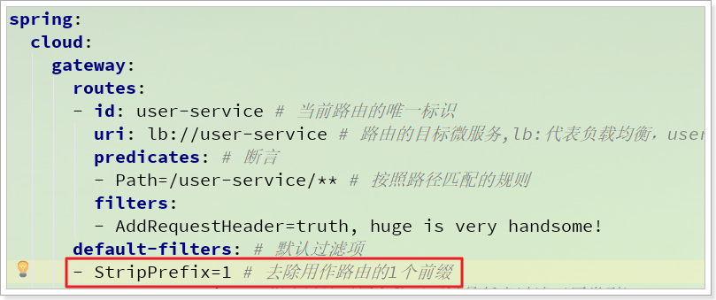
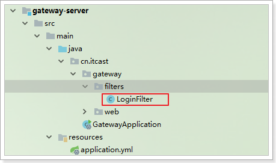
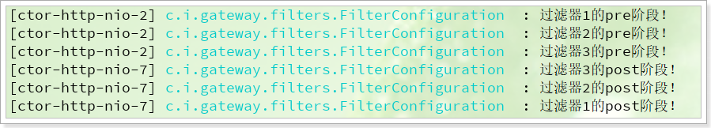
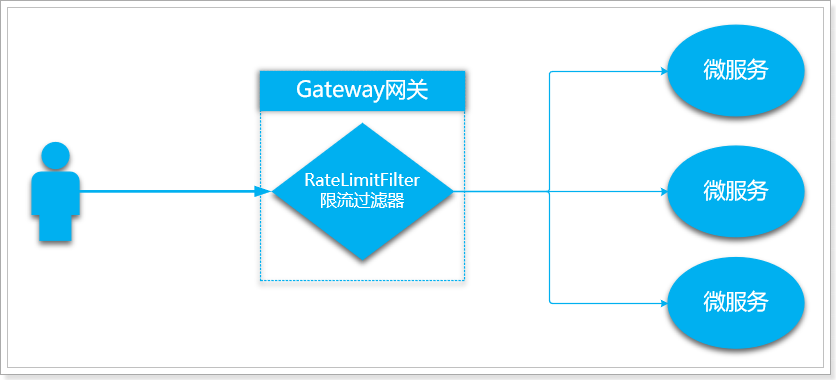

# 0.学习目标

- 会使用Feign进行远程调用
- 会使用Feign整合Hystix
- 能搭建SpringCloudGateway网关
- 能编写Gateway的路由规则
- 能编写Gateway的过滤器
- 能编写Gateway的限流规则


# 1.Hystrix

## 1.1.简介

Hystix,英文意思是豪猪，全身是刺，看起来就不好惹，是一种保护机制。

Hystrix也是Netflix公司的一款组件。

主页：https://github.com/Netflix/Hystrix/


那么Hystix的作用是什么呢？具体要保护什么呢？

Hystix是Netflix开源的一个延迟和容错库，用于隔离访问远程服务、第三方库，防止出现级联失败。

## 1.2.雪崩问题

微服务中，服务间调用关系错综复杂，一个服务的业务，有可能需要调用多个其它微服务，才能完成。

 

如图，如果说，我们需要访问的某个服务，Dependency-I发生了故障，此时，我们应用中，调用Dependency-I的服务，也会故障，造成阻塞。

此时，其它业务似乎不受影响。

 

例如微服务I发生异常，请求阻塞，用户不会得到响应，则tomcat的这个线程不会释放，于是越来越多的用户请求到来，越来越多的线程会阻塞：

 

服务器支持的线程和并发数有限，请求一直阻塞，会导致服务器资源耗尽，从而导致所有其它服务都不可用，形成雪崩效应。

这就好比，一个汽车生产线，生产不同的汽车，需要使用不同的零件，如果某个零件因为种种原因无法使用，那么就会造成整台车无法装配，陷入等待零件的状态，直到零件到位，才能继续组装。  此时如果有很多个车型都需要这个零件，那么整个工厂都将陷入等待的状态，导致所有生产都陷入瘫痪。一个零件的波及范围不断扩大。 


Hystix解决雪崩问题的手段主要是服务降级，包括：

- 线程隔离
- 服务熔断

## 1.3.线程隔离，服务降级

### 1.3.1.原理

线程隔离示意图：

 

解读：

Hystrix为每个服务调用的功能分配一个小的线程池，如果线程池已满调用将被立即拒绝，默认不采用排队.加速失败判定时间。

用户的请求将不再直接访问服务，而是通过线程池中的空闲线程来访问服务，如果**线程池已满**，或者**请求超时**，则会进行降级处理：**返回给用户一个错误提示或备选结果**。


用户的请求故障时，不会被阻塞，更不会无休止的等待或者看到系统崩溃，至少可以看到一个执行结果（例如返回友好的提示信息） 。

服务降级虽然会导致请求失败，但是不会导致阻塞，而且最多占用该服务的线程资源，不会导致整个容器资源耗尽，把故障的影响隔离在线程池内。


### 1.3.2.动手实践

线程隔离的完整步骤包括：

- 1）引入Hystrix的依赖
- 2）添加注解，开启Hystix功能
- 3）给业务编写降级的备用处理逻辑
- 4）给业务添加注解，开启线程隔离功能
- 5）设置触发降级的最长等待时间

现在，consumer-demo是服务的调用者，user-service是服务的提供者，因此consumer-demo需要把调用user-service的业务隔离，避免级联失败。

因此我们接下来的操作都是在consumer-demo中添加的。

#### 1）引入依赖：

在consumer-demo添加Hystix的依赖：

```xml
<dependency>
    <groupId>org.springframework.cloud</groupId>
    <artifactId>spring-cloud-starter-netflix-hystrix</artifactId>
</dependency>
```

#### 2）开启熔断：

在consumer-demo的启动类上添加注解：@EnableCircuitBreaker

```java
@SpringBootApplication
@EnableDiscoveryClient
@EnableCircuitBreaker
public class ConsumerApplication {
	// ...
}
```

可以看到，我们类上的注解越来越多，在微服务中，经常会引入上面的三个注解，于是Spring就提供了一个组合注解：@SpringCloudApplication

  

因此，我们可以使用这个组合注解来代替之前的3个注解。

```java
@SpringCloudApplication
public class ConsumerDemoApplication {
    // ...
}
```


#### 3）编写降级逻辑

当目标服务的调用出现故障，我们希望快速失败，给用户一个友好提示。因此需要提前编写好失败时的降级处理逻辑，然后使用HystixCommond来指定降级的方法。

要注意，因为熔断的降级逻辑方法必须跟正常逻辑方法保证：**相同的参数列表和返回值声明**。因此我们需要定义一个统一返回结果：

在consumer-demo服务中的`cn.itcast.consumer.pojo`中定义一个类：

```java
package cn.itcast.consumer.pojo;

import lombok.AllArgsConstructor;
import lombok.Data;

/**
 * @author 虎哥
 */
@Data
@AllArgsConstructor
public class Result {
    private int stats;
    private String message;
    private Object data;

    public static Result ok(Object data) {
        return new Result(200, "成功！", data);
    }

    public static Result error(String message) {
        return new Result(500, message, null);
    }
}
```


在consumer-demo的ConsumerController中调用user-service的方法上，添加降级逻辑：

```java
@GetMapping("{id}")
@HystrixCommand(fallbackMethod = "queryByIdFallBack")
public Result findOrderByUserId(@PathVariable("id") Long userId) {
    // 1.查询用户信息
    // 1.1.准备url
    String url = "http://user-service/user/" + userId;
    // 1.2.调用RestTemplate的getForObject方法，指定url地址和返回值类型
    User user = restTemplate.getForObject(url, User.class);
    // 2.封装订单结果
    return Result.ok(new Order(110L, user.getId(), user.getName(), 179900L));
}

public Result queryByIdFallBack(Long userId) {
    return Result.error("查询用户[" + userId + "]的订单失败");
}
```


说明：

- `@HystrixCommand(fallbackMethod = "queryByIdFallBack")`：用来声明一个降级逻辑的方法


测试：

正常访问时：


但是当我们将user-service停机时，会发现页面返回了降级处理信息：


#### 4) 超时设置：

在之前的案例中，请求不是立即失败，而是在超过1秒后都会返回错误信息：


这是因为Hystix的默认超时时长为1，我们可以通过配置修改这个值：

```yaml
hystrix:
  command:
    default:
      execution.isolation.thread.timeoutInMilliseconds: 2000
```

这个配置会作用于全局所有方法。


再次测试：


可以发现，请求的时长已经到了2.01s，证明配置生效了。


## 1.4.服务熔断

尽管隔离可以避免服务出现级联失败，但是对于访问**服务I（故障服务）**的其它服务，每次处理请求都要等待数秒直至fallback，显然是对系统资源的浪费。

因此，当Hystix判断一个依赖服务失败比例较高时，就会对其做**熔断处理**：拦截对故障服务的请求，快速失败，不再阻塞等待，就像电路的断路器断开了，保护电路。

### 1.4.1.熔断原理

熔断器，也叫断路器，其英文单词为：Circuit Breaker 


Hystix的熔断状态机模型：


状态机有3个状态：

- Closed：关闭状态（断路器关闭），所有请求都正常访问。
- Open：打开状态（断路器打开），所有请求都会被降级。Hystix会对请求情况计数，当一定时间内失败请求百分比达到阈值，则触发熔断，断路器打开。默认失败比例的阈值是50%，请求次数最少不低于20次。
- Half Open：半开状态，open状态不是永久的，打开后会进入休眠时间（默认是5S）。随后断路器会自动进入半开状态。此时会释放1次请求通过，若这个请求是健康的，则会关闭断路器，否则继续保持打开，再次进行5秒休眠计时。

### 1.4.2.动手实践

为了能够精确控制请求的成功或失败，我们在consumer的调用业务中加入一段逻辑：

```java
@GetMapping("{id}")
@HystrixCommand(fallbackMethod = "queryByIdFallBack")
public Result findOrderByUserId(@PathVariable("id") Long userId) {
    // 故意错误
    if(userId == 1){
        throw new RuntimeException("服务器太忙了！");
    }
    // 1.查询用户信息
    // 1.1.准备url
    String url = "http://user-service/user/" + userId;
    // 1.2.调用RestTemplate的getForObject方法，指定url地址和返回值类型
    User user = restTemplate.getForObject(url, User.class);
    // 2.封装订单结果
    return Result.ok(new Order(110L, user.getId(), user.getName(), 179900L));
}
```

这样如果参数是id为1，一定失败，其它情况都成功。

我们准备两个请求窗口：

- 一个请求：http://localhost:8080/order/1，注定失败
- 一个请求：http://localhost:8080/order/2，肯定成功

熔断器的默认触发阈值是20次请求，不好触发。休眠时间时5秒，时间太短，不易观察，为了测试方便，我们可以通过配置修改熔断策略：

```properties
hystrix:
  command:
    default:
      execution.isolation.thread.timeoutInMilliseconds: 2000
      circuitBreaker:
        errorThresholdPercentage: 50 # 触发熔断错误比例阈值，默认值50%
        sleepWindowInMilliseconds: 10000 # 熔断后休眠时长，默认值5秒
        requestVolumeThreshold: 10 # 触发熔断的最小请求次数，默认20
```

解读：

- requestVolumeThreshold：触发熔断的最小请求次数，默认20，这里我们设置为10，便于触发
- errorThresholdPercentage：触发熔断的失败请求最小占比，默认50%
- sleepWindowInMilliseconds：休眠时长，默认是5000毫秒，这里设置为10，便于观察熔断现象

当我们疯狂访问id为1的请求时（10次左右），就会触发熔断。断路器会进入打开状态，一切请求都会被降级处理。


此时你访问id为2的请求，会发现返回的也是失败，而且失败时间很短，只有20毫秒左右：


# 2.Feign

在前面的学习中，我们使用了Ribbon的负载均衡功能，大大简化了远程调用时的代码：

```java
String baseUrl = "http://user-service/user/";
User user = this.restTemplate.getForObject(baseUrl + id, User.class)
```

如果就学到这里，你可能以后需要编写类似的大量重复代码，格式基本相同，无非参数不一样。有没有更优雅的方式，来对这些代码再次优化呢？

这就是我们接下来要学的Feign的功能了。

## 2.1.简介

有道词典的英文解释：

 

为什么叫伪装？可以把一个远程调用的请求，伪造的像一个本地方法调用一样。

Feign可以把Rest的请求进行隐藏，伪装成类似SpringMVC的Controller一样。你不用再自己拼接url，拼接参数等等操作，一切都交给Feign去做。


项目主页：https://github.com/OpenFeign/feign

## 2.2.快速入门

Feign的使用包括下面几个步骤：

- 引入依赖
- 编写Feign客户端接口（定义出远程调用的接口）
- 添加Feign客户端扫描注解：@EnableFeignClient


### 2.2.1.导入依赖

```xml
<dependency>
    <groupId>org.springframework.cloud</groupId>
    <artifactId>spring-cloud-starter-openfeign</artifactId>
</dependency>
```

### 2.2.2.Feign的客户端

```java
@FeignClient("user-service")
public interface UserClient {

    @GetMapping("/user/{id}")
    User queryById(@PathVariable("id") Long id);
}
```

- 首先这是一个接口，Feign会通过动态代理，帮我们生成实现类。这点跟mybatis的mapper很像
- `@FeignClient`，声明这是一个Feign客户端，同时通过`value`属性指定服务名称
- 接口中的定义方法，完全采用SpringMVC的注解，Feign会根据注解帮我们生成URL，并访问获取结果

改造原来的调用逻辑，使用UserClient访问：

```java
@RestController
@RequestMapping("order")
public class OrderController {

    @Autowired
    private UserClient userClient;

    @GetMapping("{id}")
    public Result findOrderByUserId(@PathVariable("id") Long userId) {
        // 1.查询用户
        User user = userClient.queryById(userId);
        // 2.封装订单结果
        return Result.ok(new Order(110L, user.getId(), user.getName(), 179900L));
    }
}
```

### 2.2.3.开启Feign功能

我们在启动类上，添加注解，开启Feign扫描功能

```java
@SpringCloudApplication
@EnableFeignClients // 开启Feign扫描功能
public class ConsumerDemoApplication {
    public static void main(String[] args) {
        SpringApplication.run(UserConsumerDemoApplication.class, args);
    }
}
```

- 你会发现RestTemplate的注册被我删除了。Feign中已经自动集成了Ribbon负载均衡，因此我们不需要自己定义RestTemplate了

### 2.2.4.启动测试：

访问接口：

 

正常获取到了结果。

## 2.3.负载均衡

Feign中本身已经集成了Ribbon依赖和自动配置：


因此我们不需要额外引入依赖，也不需要再注册`RestTemplate`对象。

Fegin内置的ribbon默认设置了请求超时时长，默认是1000ms，我们可以通过手动配置来修改这个超时时长：

```yaml
ribbon:
  ReadTimeout: 2000 # 读取超时时长
  ConnectTimeout: 1000 # 建立链接的超时时长
```

，因为ribbon内部有重试机制，一旦超时，会自动重新发起请求。如果希望对重试次数做修改，可以添加配置：

```yaml
ribbon:
  ConnectTimeout: 500 # 连接超时时长
  ReadTimeout: 2000 # 数据通信超时时长
  MaxAutoRetries: 0 # 当前服务器的重试次数
  MaxAutoRetriesNextServer: 1 # 重试多少次服务
  OkToRetryOnAllOperations: false # 是否对所有的请求方式都重试
```

另外，如果在Ribbon重试期间，Hystix已经超时，则会终止业务。因此Hystix的超时时间，应该比重试的总时间要大，比如当前案例中，应该配 大于2500*2 = 5000


## 2.4.Hystix支持

Feign默认也有对Hystix的集成：


Feign整合Hystrix需要这样 几步：

- 1.开启feign的hystrix功能
- 2.给feign的客户端方法，编写fallback方法
- 3.配置fallback方法


只不过，默认情况下是关闭的。我们需要通过下面的参数来开启：

```yaml
feign:
  hystrix:
    enabled: true # 开启Feign的熔断功能
```

但是，Feign中的Fallback配置不像Ribbon中那样简单了。

1）首先，我们要定义一个类，实现刚才编写的UserFeignClient，作为fallback的处理类

```java
package cn.itcast.consumer.client;

import cn.itcast.consumer.pojo.User;
import org.springframework.stereotype.Component;

@Component
public class UserClientFallback implements UserClient {
    @Override
    public User queryById(Long id) {
        User user = new User();
        user.setId(id);
        user.setName("用户查询出现异常！");
        return user;
    }
}
```

2）然后在UserFeignClient中，指定刚才编写的实现类

```java
package cn.itcast.consumer.client;

import cn.itcast.consumer.pojo.User;
import org.springframework.cloud.openfeign.FeignClient;
import org.springframework.web.bind.annotation.GetMapping;
import org.springframework.web.bind.annotation.PathVariable;

@FeignClient(value = "user-service", fallback = UserClientFallback.class)
public interface UserClient {

    @GetMapping("/user/{id}")
    User queryById(@PathVariable("id") Long id);
}
```


3）重启测试：

我们关闭user-service服务，然后在页面访问：

 


## 2.5.日志级别

前面讲过，通过`logging.level.xx=debug`来设置日志级别。然而这个对Fegin客户端而言不会产生效果。因为`@FeignClient`注解修改的客户端在被代理时，都会创建一个新的Fegin.Logger实例。我们需要额外指定这个日志的级别才可以。

1）设置cn.itcast包下的日志级别都为debug

```yaml
logging:
  level:
    cn.itcast: debug
```

2）编写配置类，定义日志级别

```java
@Configuration
public class FeignConfig {
    @Bean
    Logger.Level feignLoggerLevel(){
        return Logger.Level.FULL;
    }
}
```

这里指定的Level级别是FULL，Feign支持4种级别：


- NONE：不记录任何日志信息，这是默认值。
- BASIC：仅记录请求的方法，URL以及响应状态码和执行时间
- HEADERS：在BASIC的基础上，额外记录了请求和响应的头信息
- FULL：记录所有请求和响应的明细，包括头信息、请求体、元数据。


3）重启项目，即可看到每次访问的日志：


# 3.Gateway网关

## 3.1.简介

Gateway网关是我们服务的守门神，所有微服务的统一入口。Spring Cloud Gateway 是 Spring Cloud 的一个全新项目，该项目是基于 Spring 5.0，Spring Boot 2.0 和 Project Reactor 等响应式编程和事件流技术开发的网关，它旨在为微服务架构提供一种简单有效的统一的 API 路由管理方式。


在SpringCloudGateway之前，SpringCloud并不自己开发网关，而是使用Netflix公司的Zuul框架，不过zuul2.0更新迭代缓慢，难以满足Spring的更新需求。于是就有了SpringCloudGateway。其不仅提供统一的路由方式，并且基于 Filter 链的方式提供了网关基本的功能，例如：安全，监控/指标，和限流。

SpringCloudGateway是响应式编程，Reactive 基于 ProjectReactive的API来实现，借助于Spring5的新特性：WebFlux来实现的网关，底层的容器是Netty，没有tomcat，因此就没有JavaEE的API。


**核心功能特性**

- 请求路由
- 集成 Hystrix 断路器
- 权限控制
- 限流

加入网关后的服务结构：


**路由**：gateway加入后，一切请求都必须先经过gateway，因此gateway就必须根据某种规则，把请求转发到某个微服务，这个过程叫做路由。

**权限控制**：请求经过路由时，我们可以判断请求者是否有请求资格，如果没有则进行拦截。

**限流**：当请求流量过高时，在网关中按照下流的微服务能够接受的速度来放行请求，避免服务压力过大。


## 3.2.快速入门

首先，我们来研究下Gateway的路由功能，基本步骤如下：

1. 创建SpringBoot工程gateway_server，引入网关依赖
2. 编写启动类
3. 编写基础配置：服务端口，应用名称
4. 编写路由规则
5. 启动网关服务进行测试


### 3.2.1.新建工程

填写基本信息：


添加gateway依赖：

```xml
<?xml version="1.0" encoding="UTF-8"?>
<project xmlns="http://maven.apache.org/POM/4.0.0"
         xmlns:xsi="http://www.w3.org/2001/XMLSchema-instance"
         xsi:schemaLocation="http://maven.apache.org/POM/4.0.0 http://maven.apache.org/xsd/maven-4.0.0.xsd">
    <parent>
        <artifactId>cloud-demo</artifactId>
        <groupId>cn.itcast.demo</groupId>
        <version>1.0-SNAPSHOT</version>
    </parent>
    <modelVersion>4.0.0</modelVersion>

    <artifactId>gateway-server</artifactId>

    <dependencies>
        <dependency>
            <groupId>org.springframework.cloud</groupId>
            <artifactId>spring-cloud-starter-gateway</artifactId>
        </dependency>
    </dependencies>
    <build>
        <plugins>
            <plugin>
                <groupId>org.springframework.boot</groupId>
                <artifactId>spring-boot-maven-plugin</artifactId>
            </plugin>
        </plugins>
    </build>
</project>
```


### 3.2.2.编写启动类

```java
package cn.itcast.gateway;

import org.springframework.boot.SpringApplication;
import org.springframework.boot.autoconfigure.SpringBootApplication;

@SpringBootApplication
public class GatewayApplication {

	public static void main(String[] args) {
		SpringApplication.run(GatewayApplication.class, args);
	}
}
```

### 3.2.3.编写配置

```yaml
server:
  port: 10010 #服务端口
spring: 
  application:  
    name: gateway-server #指定服务名
```

### 3.2.4.编写路由规则

我们需要用gateway来代理consumer服务，先看一下控制面板中的服务状态：


- ip为：127.0.0.1
- 端口为：8080
- 请求路径的规则：`/order/{id}`，路径是以`/order`开头

映射规则：

```yaml
spring:
  application:
    name: gateway-server #指定服务名
  cloud:
    gateway:
      routes:
      - id: consumer # 当前路由的唯一标识
        uri: http://127.0.0.1:8080 # 路由的目标微服务地址
        predicates: # 断言
        - Path=/order/** # 按照路径匹配的规则
```

我们将符合`Path` 规则的一切请求，都代理到 `uri`参数指定的地址

本例中，我们将 `/order/**`开头的请求，代理到http://127.0.0.1:8080


同理，大家思考一下：如果要代理user-service服务，该如何写呢？


参考答案：

```yaml
spring:
  cloud:
    gateway:
      routes:
      - id: consumer # 当前路由的唯一标识
        uri: http://127.0.0.1:8080 # 路由的目标微服务地址
        predicates: # 断言
        - Path=/order/** # 按照路径匹配的规则
      - id: user-service # 当前路由的唯一标识
        uri: http://127.0.0.1:8081 # 路由的目标微服务地址
        predicates: # 断言
        - Path=/user/** # 按照路径匹配的规则
```


### 3.3.5.启动测试：

我们访问：http://localhost:10010/user/8时，符合`/user/**`规则，请求转发到uri：http://localhost:8081/user/8

 

我们访问：http://localhost:10010/order/8，符合`/order/**`的规则，请求转发到urihttp://localhost:8080/order/8

 


## 3.3.面向服务的路由

在刚才的路由规则中，我们把路径对应的服务地址写死了，如果同一服务有多个实例的话，这样做显然就不合理了。

user-service有两个地址：127.0.0.1:8081和127.0.0.1:8082，但我们把请求都转发到了127.0.0.1:8081，那么另一台就无法被访问了。

我们应该根据服务的名称，去Eureka注册中心查找 服务对应的所有实例列表，并且对服务列表进行负载均衡才对！


### 3.3.1.添加Eureka客户端依赖

```xml
<dependency>
    <groupId>org.springframework.cloud</groupId>
    <artifactId>spring-cloud-starter-netflix-eureka-client</artifactId>
</dependency>
```

### 3.3.2.添加Eureka配置

```yaml
eureka:
  client:
    service-url:
      defaultZone: http://127.0.0.1:10086/eureka
```

### 3.3.3.修改映射配置

因为已经有了Eureka客户端，我们可以从Eureka获取服务的地址信息，因此映射时无需指定IP地址，而是通过服务名称来访问，而且gatewa已经集成了Ribbon的负载均衡功能，只需要修改路由的目的地协议即可：


完整代码：

```yaml
server:
  port: 10010 #服务端口
eureka:
  client:
    service-url:
      defaultZone: http://127.0.0.1:10086/eureka
spring:
  application:
    name: gateway-server #指定服务名
  cloud:
    gateway:
      routes:
      - id: user-service # 当前路由的唯一标识
        uri: lb://user-service # 路由的目标微服务地址
        # uri: http://127.0.0.1:8081 # 路由的目标微服务地址
        predicates: # 断言
        - Path=/user/** # 按照路径匹配的规则
      - id: consumer # 当前路由的唯一标识
        uri: lb://consumer # 路由的目标微服务地址
        predicates: # 断言
        - Path=/order/** # 按照路径匹配的规则
```

这里修改了uri的路由方式：

- lb：负载均衡的协议，将来会使用Ribbon实现负载均衡
- user-service：服务的id


### 3.3.4.启动测试

再次启动，这次gateway进行代理时，会利用Ribbon进行负载均衡访问，日志中可以看到使用了负载均衡器：


## 3.4.其它路由方式

Gateway中支持各种路由方式，看官方的目录：


主要包括：

- After Route Predicate Factory、Before Route Predicate Factory和Between Route Predicate Factory：基于请求时间的路由规则
- Cookie Route Predicate Factory：基于cookie值的路由匹配规则
- Header Route Predicate Factory：基于请求头的路由匹配规则
- Host  Route Predicate Factory：基于主机名的路由匹配规则
- Method Route Predicate Factory：基于请求方式的路由匹配规则
- Path Route Predicate Factory：基于请求路径的路由匹配规则
- Query Route Predicate Factory：基于请求参数的路由匹配规则
- RemoteAddr Route Predicate Factory：基于请求者ip地址的路由匹配规则

有兴趣的同学可以自己查看。


## 3.5.局部过滤器

GatewayFilter Factories是Gateway中的局部过滤器工厂，作用于某个特定路由，允许以某种方式修改传入的HTTP请求或返回的HTTP响应。

包括下面的一些过滤工厂：


还包括：


下面我们以几个过滤器的配置为示例：

### 3.5.1.添加请求头

示例：AddRequestHeader GatewayFilter Factory，可以在请求中添加请求头，配置如下：

```yaml
eureka:
  client:
    service-url:
      defaultZone: http://127.0.0.1:10086/eureka
spring:
  cloud:
    gateway:
      routes:
      - id: user-service # 当前路由的唯一标识
        uri: lb://user-service # 路由的目标微服务,lb:代表负载均衡，user-service:代表服务id
        predicates: # 断言
        - Path=/user/** # 按照路径匹配的规则
        filters: # 过滤项
        - AddRequestHeader=truth, huge is very handsome!
```

其中：

- `filters`：就是当前路由规则的所有过滤器配置
- `AddRequestHeader`是添加一个头信息

重启后，再user-service的内部断点，查看请求头：


### 3.5.2.Hystrix

网关做请求路由转发，如果被调用的请求阻塞，需要通过Hystrix来做线程隔离和熔断，防止出现故障。

#### 1）引入Hystrix的依赖

```xml
<dependency>
    <groupId>org.springframework.cloud</groupId>
    <artifactId>spring-cloud-starter-netflix-hystrix</artifactId>
</dependency>
```


#### 2）定义降级处理规则

可以通过default-filter来配置，会作用于所有的路由规则。

```yaml
eureka:
  client:
    service-url:
      defaultZone: http://127.0.0.1:10086/eureka
spring:
  cloud:
    gateway:
      routes:
      - id: user-service # 当前路由的唯一标识
        uri: lb://user-service # 路由的目标微服务,lb:代表负载均衡，user-service:代表服务id
        predicates: # 断言
        - Path=/user/** # 按照路径匹配的规则
        filters:
        - AddRequestHeader=truth, huge is very handsome!
      default-filters: # 默认过滤项
      - name: Hystrix # 指定过滤工厂名称（可以是任意过滤工厂类型）
        args: # 指定过滤的参数
          name: fallbackcmd  # hystrix的指令名
          fallbackUri: forward:/fallbackTest # 失败后的跳转路径
 hystrix:
  command:
    default:
      execution.isolation.thread.timeoutInMilliseconds: 1000 # 失败超时时长
```

- default-filters：默认过滤项，作用于所有的路由规则
  - name：过滤工厂名称，这里指定Hystrix，意思是配置Hystrix类型
  - args：配置过滤工厂的配置
    - name：Hystrix的指令名称，用于配置例如超时时长等信息
    - fallbackUri：失败降级时的跳转路径


#### 3）定义降级的处理函数

定义一个controller，用来编写失败的处理逻辑：

```java
package cn.itcast.gateway.web;

import org.springframework.web.bind.annotation.GetMapping;
import org.springframework.web.bind.annotation.RestController;

import java.util.HashMap;
import java.util.Map;

/**
 * @author 虎哥
 */
@RestController
public class FallbackController {

    @RequestMapping(value = "/fallbackTest")
    public Map<String, String> fallBackController() {
        Map<String, String> response = new HashMap<>();
        response.put("code", "502");
        response.put("msg", "服务超时");
        return response;
    }
}

```


#### 4）启动测试

再UserController的业务中打断点，让请求超时，查看页面的效果：

 

### 3.5.3.路由前缀

#### 1）问题呈现

我们之前用`/user/**`这样的映射路径代表`user-service`这个服务。因此请求`user-service`服务的一切路径要以`/user/**`开头

比如，访问：`localhost:10010/user/2`会被代理到：`localhost:8081/user/2`

现在，我们在`user-service`中的`cn.itcast.user.web`中定义一个新的接口：

```java
package cn.itcast.user.web;

import org.springframework.web.bind.annotation.GetMapping;
import org.springframework.web.bind.annotation.RequestMapping;
import org.springframework.web.bind.annotation.RestController;

/**
 * @author 虎哥
 */
@RestController
@RequestMapping("address")
public class AddressController {

    @GetMapping("me")
    public String myAddress() {
        return "上海市浦东新区航头镇航头路18号传智播客";
    }
}

```

这个接口的路径是`/address/me`，并不是以`/user/`开头。当访问：`localhost:10010/address/me`时，并不符合映射路径，因此会得到404.

无论是 `/user/**`还是`/address/**`都是`user-service`中的一个controller路径，都不能作为网关到user-service的映射路径。

因此我们需要定义一个额外的映射路径，例如：`/user-service`，配置如下：

 

```yaml
spring:
  cloud:
    gateway:
      routes:
      - id: user-service # 当前路由的唯一标识
        uri: lb://user-service # 路由的目标微服务,user-service:代表服务id
        predicates: # 断言
        - Path=/user-service/** # 按照路径匹配的规则
```


那么问题来了:

当我们访问：http://localhost:10010/user-service/user/1时，映射路径`/user-service`指向用户服务，会被代理到：http://localhost:8081/user-service/user/1.

当我们访问：http://localhost:10010/user-service/address/me时，映射路径`/user-service`指向用户服务，会被代理到：http://localhost:8081/user-service/address/me

而在`user-service`中，无论是`/user-service/user/1`还是`/user-service/address/me`都是错误的，因为多了一个`/user-service`。

这个`/user-service`是gateway中的映射路径，不应该被代理到微服务，怎办吧？


#### 2）去除路由前缀

解决思路很简单，当我们访问http://localhost:10010/user-service/user/1时，网关利用`/user-service`这个映射路径匹配到了用户微服务，请求代理时，只要把`/user-service`这个映射路径去除不就可以了吗。

恰好有一个过滤器：StripPrefixFilterFactory可以满足我们的需求。

https://cloud.spring.io/spring-cloud-static/spring-cloud-gateway/2.2.3.RELEASE/reference/html/#the-stripprefix-gatewayfilter-factory

我们修改刚才的路由配置：

 

此时，网关做路由的代理时，就不会把/user-service作为目标请求路径的一部分了。

也就是说，我们访问：http://localhost:10010/user-service/user/1，会代理到：http://localhost:8081/user/1

我们访问：http://localhost:10010/user-service/address/me，会代理到：http://localhost:8081/address/me

试试看：

 

 


## 3.6.全局过滤器

全局过滤器Global Filter 与局部的GatewayFilter会在运行时合并到一个过滤器链中，并且根据`org.springframework.core.Ordered`来排序后执行，顺序可以通过`getOrder()`方法或者`@Order`注解来指定。


### 3.6.1.GlobalFilter接口

来看看全局过滤器的顶级接口：

```java
public interface GlobalFilter {

	/**
	 * Process the Web request and (optionally) delegate to the next {@code WebFilter}
	 * through the given {@link GatewayFilterChain}.
	 * @param exchange the current server exchange
	 * @param chain provides a way to delegate to the next filter
	 * @return {@code Mono<Void>} to indicate when request processing is complete
	 */
	Mono<Void> filter(ServerWebExchange exchange, GatewayFilterChain chain);

}
```

实现接口，就要实现其中的filter方法，在方法内部完成过滤逻辑，其中的参数包括：

- ServerWebExchange：一个类似于Context的域对象，封装了Request、Response等服务相关的属性

   

- GatewayFilterChain：过滤器链，用于放行请求到下一个过滤器

  


### 3.6.2.过滤器顺序

通过添加@Order注解，可以控制过滤器的优先级，从而决定了过滤器的执行顺序。

另外，一个过滤器的执行包括`"pre"`和`"post"`两个过程。在GlobalFilter.filter()方法中编写的逻辑属于pre阶段，在使用GatewayFilterChain.filter().then()的阶段，属于Post阶段。


优先级最高的过滤器，会在pre过程的第一个执行，在post过程的最后一个执行，如图：

 


我们可以在pre阶段做很多事情，诸如：

- 登录状态判断
- 权限校验
- 请求限流等


## 3.7.自定义过滤器

定义过滤器只需要实现GlobalFilter即可，不过我们有多种方式来完成：

- 方式一：定义过滤器类，实现接口
- 方式二：通过@Configuration类结合lambda表达式


### 3.7.1.登录拦截器

现在，我们通过自定义过滤器，模拟一个登录校验功能，逻辑非常简单：

- 获取用户请求参数中的 access-token 参数
- 判断是否为"admin"
  - 如果不是，证明未登录，拦截请求
  - 如果是，证明已经登录，放行请求

代码如下

```java
package cn.itcast.gateway.filters;

import org.apache.commons.lang.StringUtils;
import org.springframework.cloud.gateway.filter.GatewayFilterChain;
import org.springframework.cloud.gateway.filter.GlobalFilter;
import org.springframework.core.annotation.Order;
import org.springframework.http.HttpStatus;
import org.springframework.stereotype.Component;
import org.springframework.web.server.ServerWebExchange;
import reactor.core.publisher.Mono;

/**
 * @author 虎哥
 */
@Order(0) // 通过注解声明过滤器顺序
@Component
public class LoginFilter implements GlobalFilter {
    @Override
    public Mono<Void> filter(ServerWebExchange exchange, GatewayFilterChain chain) {
        // 获取token
        String token = exchange.getRequest().getQueryParams().toSingleValueMap().get("access-token");
        // 判断请求参数是否正确
        if(StringUtils.equals(token, "admin")){
            // 正确，放行
            return chain.filter(exchange);
        }
        // 错误，需要拦截，设置状态码
        exchange.getResponse().setStatusCode(HttpStatus.UNAUTHORIZED);
        // 结束任务
        return exchange.getResponse().setComplete();
    }
}
```

位置如下：

 

测试：带错误参数的情况：

 

带正确参数的情况：

 


### 3.7.2.多过滤器演示（了解）

下面我们通过lambda表达式来定义过滤器：

```java
package cn.itcast.gateway.filters;

import lombok.extern.slf4j.Slf4j;
import org.springframework.cloud.gateway.filter.GlobalFilter;
import org.springframework.context.annotation.Bean;
import org.springframework.context.annotation.Configuration;
import org.springframework.core.annotation.Order;
import reactor.core.publisher.Mono;

/**
 * @author 虎哥
 */
@Slf4j
@Configuration
public class FilterConfiguration {

    @Bean
    @Order(-2)
    public GlobalFilter globalFilter1(){
        return ((exchange, chain) -> {
            log.info("过滤器1的pre阶段！");
            return chain.filter(exchange).then(Mono.fromRunnable(() -> {
                log.info("过滤器1的post阶段！");
            }));
        });
    }

    @Bean
    @Order(-1)
    public GlobalFilter globalFilter2(){
        return ((exchange, chain) -> {
            log.info("过滤器2的pre阶段！");
            return chain.filter(exchange).then(Mono.fromRunnable(() -> {
                log.info("过滤器2的post阶段！");
            }));
        });
    }

    @Bean
    @Order(0)
    public GlobalFilter globalFilter3(){
        return ((exchange, chain) -> {
            log.info("过滤器3的pre阶段！");
            return chain.filter(exchange).then(Mono.fromRunnable(() -> {
                log.info("过滤器3的post阶段！");
            }));
        });
    }
}

```

执行结果如下：




## 3.8.网关限流

网关除了请求路由、身份验证，还有一个非常重要的作用：请求限流。当系统面对高并发请求时，为了减少对业务处理服务的压力，需要在网关中对请求限流，按照一定的速率放行请求。



常见的限流算法包括：

- 计数器算法
- 漏桶算法
- 令牌桶算法

### 3.8.1.令牌桶算法原理

SpringGateway中采用的是令牌桶算法，令牌桶算法原理：

- 准备一个令牌桶，有固定容量，一般为服务并发上限
- 按照固定速率，生成令牌并存入令牌桶，如果桶中令牌数达到上限，就丢弃令牌。
- 每次请求调用需要先获取令牌，只有拿到令牌，才继续执行，否则选择选择等待或者直接拒绝。


### 3.8.2.Gateway中限流

SpringCloudGateway是采用令牌桶算法，其令牌相关信息记录在redis中，因此我们需要安装redis，并引入Redis相关依赖。

#### 1) 引入redis

引入Redis有关依赖：

```xml
<!--redis-->
<dependency>
    <groupId>org.springframework.boot</groupId>
    <artifactId>spring-boot-starter-data-redis-reactive</artifactId>
</dependency>
```

注意：这里不是普通的redis依赖，而是响应式的Redis依赖，因为SpringGateway是基于WebFlux的响应式项目。

在application.yml中配置Redis地址：

```yaml
spring:
  redis:
    host: localhost
```


#### 2) 配置过滤条件key

Gateway会在Redis中记录令牌相关信息，我们可以自己定义令牌桶的规则，例如：

- 给不同的请求URI路径设置不同令牌桶
- 给不同的登录用户设置不同令牌桶
- 给不同的请求IP地址设置不同令牌桶

Redis中的一个Key和Value对就是一个令牌桶。因此Key的生成规则就是桶的定义规则。SpringCloudGateway中key的生成规则定义在`KeyResolver`接口中：

```java
public interface KeyResolver {

	Mono<String> resolve(ServerWebExchange exchange);

}
```

这个接口中的方法返回值就是给令牌桶生成的key。API说明：

- Mono：是一个单元素容器，用来存放令牌桶的key
- ServerWebExchange：上下文对象，可以理解为ServletContext，可以从中获取request、response、cookie等信息


比如上面的三种令牌桶规则，生成key的方式如下：

- 给不同的请求URI路径设置不同令牌桶，示例代码：

  ```java
  return Mono.just(exchange.getRequest().getURI().getPath());// 获取请求URI /us/user/3
  ```

- 给不同的登录用户设置不同令牌桶

  ```java
  return exchange.getPrincipal().map(Principal::getName);// 获取用户
  ```

- 给不同的请求IP地址设置不同令牌桶

  ```java
  return Mono.just(exchange.getRequest().getRemoteAddress().getHostName());// 获取请求者IP
  ```

这里我们选择最后一种，使用IP地址的令牌桶key。

我们在`com.leyou.gateway.config`中定义一个类，配置一个KeyResolver的Bean实例：

```java
package cn.itcast.ratelimit;

import org.springframework.cloud.gateway.filter.ratelimit.KeyResolver;
import org.springframework.stereotype.Component;
import org.springframework.web.server.ServerWebExchange;
import reactor.core.publisher.Mono;

/**
 * @author 虎哥
 */
@Component
public class IpKeyResolver implements KeyResolver {
    @Override
    public Mono<String> resolve(ServerWebExchange exchange) {
        return Mono.just(exchange.getRequest().getRemoteAddress().getHostName());
    }
}
```

#### 3) 配置桶参数

另外，令牌桶的参数需要通过yaml文件来配置，参数有2个：

- `replenishRate`：每秒钟生成令牌的速率，基本上就是每秒钟允许的最大请求数量

- `burstCapacity`：令牌桶的容量，就是令牌桶中存放的最大的令牌的数量

完整配置如下：

```yaml
spring:
  application:
    name: ly-gateway
  cloud:
    gateway:
      default-filters: # 默认过滤项
      - StripPrefix=1 # 去除路由前缀
      - name: Hystrix # 指定过滤工厂名称（可以是任意过滤工厂类型）
        args: # 指定过滤的参数
          name: fallbackcmd  # hystrix的指令名
          fallbackUri: forward:/hystrix/fallback # 失败后的跳转路径
      - name: RequestRateLimiter #请求数限流 名字不能随便写
        args:
          key-resolver: "#{@ipKeyResolver}" # 指定一个key生成器
          redis-rate-limiter.replenishRate: 2 # 生成令牌的速率
          redis-rate-limiter.burstCapacity: 2 # 桶的容量
```

这里配置了一个过滤器：RequestRateLimiter，并设置了三个参数：

- `key-resolver`：`"#{@ipKeyResolver}"`是SpEL表达式，写法是`#{@bean的名称}`，ipKeyResolver就是我们定义的Bean名称

- `redis-rate-limiter.replenishRate`：每秒钟生成令牌的速率

- `redis-rate-limiter.burstCapacity`：令牌桶的容量

这样的限流配置可以达成的效果：

- 每一个IP地址，每秒钟最多发起2次请求
- 每秒钟超过2次请求，则返回429的异常状态码


### 3.8.3.测试

我们快速在浏览器多次访问http://localhost:10010/user-service/user/1，就会得到一个错误：


429：代表请求次数过多，触发限流了。

