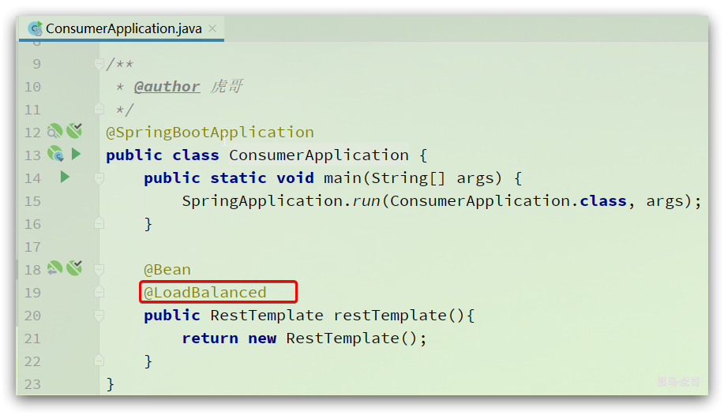
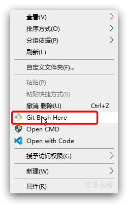
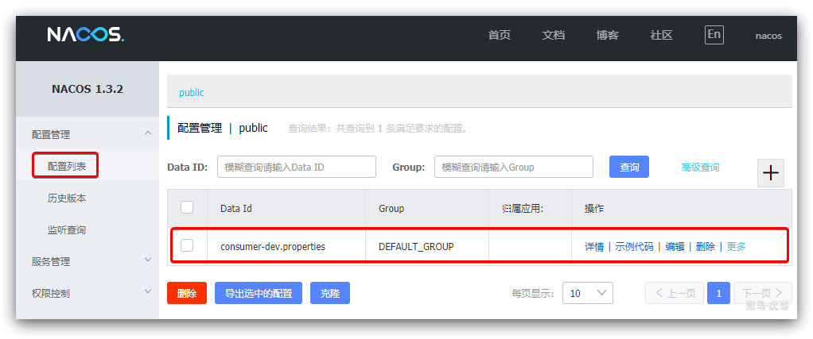
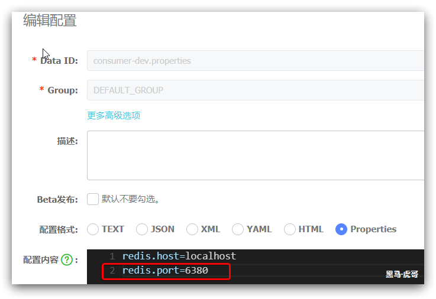

# 0.学习目标

- 能使用SpringCloudConfig实现配置管理
- 能使用SpringCloudBus实现配置刷新
- 会使用Nacos作为注册中心
- 会使用Nacos作为配置中心


# 1.配置中心

当项目上线部署时，往往会部署到数十台甚至数千台服务节点，如果我们需要修改某个配置文件中的内容，就需要逐个服务器去修改，工作量太大而且容易出错。

而统一配置中心就是解决这个问题的。

## 1.1.认识SpringCloudConfig

Spring Cloud Config为分布式系统中的**配置管理**提供服务器和客户端支持。它包含两部分：

- Config Server：是一个可横向扩展、集中式的配置服务器，它用于集中管理应用程序各个环境下的配置，默认使用Git存储配置文件内容，也可以使用SVN存储，或者是本地文件存储。
- Conflnt：是Config Server的客户端，用于操作存储在Config Server中的配置内容。微服务在启动时Config Client会请求Config Server以获取配置文件的内容，请求到后再启动容器并应用配置。

如图：


当用户提交并推送配置到Git仓库时，ConfigServer可以从Git获取到最新的配置，并缓存到本地。而ConfigClient则可以从ConfigServer中获取配置。


## 1.2.准备Git仓库

首先，我们需要准备一个Git仓库，用来保存服务间共享的配置文件。

在任意目录创建一个Git仓库，并添加一个配置文件：

 

然后在consumer.yml中编写一些测试内容：

```yaml
test:
  redis:
    host: localhost
    port: 6379
```


接下来，在gitee.com中创建一个远程库：


并与本地库建立连接，然后将代码push到远程库：


## 1.3.搭建ConfigServer

接下来，我们来搭建一个ConfigServer，

### 1.3.1.创建工程


### 1.3.2.依赖

接下来，在项目的pom.xml中引入一些依赖：

```xml
<?xml version="1.0" encoding="UTF-8"?>
<project xmlns="http://maven.apache.org/POM/4.0.0"
         xmlns:xsi="http://www.w3.org/2001/XMLSchema-instance"
         xsi:schemaLocation="http://maven.apache.org/POM/4.0.0 http://maven.apache.org/xsd/maven-4.0.0.xsd">
    <parent>
        <artifactId>cloud-demo</artifactId>
        <groupId>cn.itcast.demo</groupId>
        <version>1.0-SNAPSHOT</version>
    </parent>
    <modelVersion>4.0.0</modelVersion>

    <artifactId>config-server</artifactId>

    <dependencies>
        <!--eureka依赖-->
        <dependency>
            <groupId>org.springframework.cloud</groupId>
            <artifactId>spring-cloud-starter-netflix-eureka-client</artifactId>
        </dependency>
        <!--config-server依赖-->
        <dependency>
            <groupId>org.springframework.cloud</groupId>
            <artifactId>spring-cloud-config-server</artifactId>
        </dependency>
    </dependencies>
</project>
```

这里引入了两个依赖：

- eureka-client依赖：因为ConfigServer也是一个微服务，需要注册到eureka
- config-serverr依赖：包含ConfigServer的全部功能


### 1.3.3.配置文件

然后在项目的`application.yml`中添加配置：

```yaml
server:
  port: 12580
spring:
  application:
    name: config-server
  cloud:
    config:
      server:
        git:
          uri: https://gitee.com/huyi612/config-test.git # 需要拉取配置的Git仓库地址
eureka:
  client:
    service-url:
      defaultZone: http://127.0.0.1:10086/eureka/ # eureka地址
```

核心配置有两个：

- `spring.cloud.config.server.git.url`：管理的git仓库的地址，将来ConfigServer会去拉取配置
- `eureka.client.service-url`：eureka地址


### 1.3.4.启动类

最后，我们添加一个启动类：

```java
package cn.itcast;

import org.springframework.boot.SpringApplication;
import org.springframework.boot.autoconfigure.SpringBootApplication;
import org.springframework.cloud.config.server.EnableConfigServer;

/**
 * @author 虎哥
 */
@EnableConfigServer
@SpringBootApplication
public class ConfigServer {
    public static void main(String[] args) {
        SpringApplication.run(ConfigServer.class, args);
    }
}
```

在启动类上，通过`@EnableConfigServer`注解来开启ConfigServer的功能。


### 1.3.5.基本测试

启动项目，查看eureka的页面发现服务注册成功：


然后，我们在浏览器输入地址：http://localhost:12580/consumer.yml，结果如下：

 

为什么？

这是因为在SpringCloudConfig中，配置文件访问必须符合下面的路径规范：

```
/{application}/{profile}[/{label}]
/{application}-{profile}.yml
/{label}/{application}-{profile}.yml
```

后缀名同样适用于`.properties`。这是什么意思呢？

- application：应用名，也就是配置文件名，这里是consumer，最好与微服务名称一致
- profile：当前激活的开发环境，也就是SpringBoot中的`spring.profiles.active`属性值，例如：dev环境、prod环境、test环境等，可以自定义
- label：配置文件所在分支，缺省值是master

我们刚刚访问的路径不符合规范，缺少了profile值。

现在，我们在git仓库新添加2个文件：`consumer-dev.yml`、`consumer-prod.yml`


其中，`consumer-dev.yml`内容为：

```yaml
env: dev
```

其中，`consumer-prod.yml`内容为：

```yaml
env: prod
```

文件名后面的`dev`和`prod`就是profile。

我们再次在浏览器访问地址：http://localhost:12580/consumer-dev.yml

 

然后：http://localhost:12580/consumer-prod.yml

 

可以看到，`consumer-dev.yml`和`consumer-prod.yml`将`consumer.yml`中的数据作为了公共数据。


### 1.3.6.分支测试

我们新建一个分支，名为feature：


然后修改feature分支中的`consumer.yml`文件，内容如下：

```yaml
test:
  redis:
    host: localhost
    port: 6379
branch: feature
```

提交以后，在浏览器访问路径：http://localhost:12580/feature/consumer-dev.yml

 


## 1.4.配置ConfigClient

我们已经能够从ConfigServer获取配置文件内容。接下来我们需要在微服务配置ConfigClient，去读取这些配置。

### 1.4.1.引入依赖

首先，在user-service服务中引入config依赖：

```xml
<dependency>
    <groupId>org.springframework.cloud</groupId>
    <artifactId>spring-cloud-starter-config</artifactId>
</dependency>
```


### 1.4.2.配置

接下来，我们要编写配置文件。与之前不同，项目启动要**优先**去读取配置，这些配置可能在后面创建Spring容器，初始化各种Bean的时候用到。

SpringBoot中提供了一个名为`bootstrap.yml`的文件，加载顺序比application.yml优先。

因此我们需要在`consumer`服务创建一个`bootstrap.yml`的文件，内容如下：

```yaml
server:
  port: 8080
spring:
  application:
    name: consumer
  cloud:
    config:
      name: consumer # 配置文件的名称
      profile: dev # 环境
      label: master # 分支
      discovery:
        enabled: true # 通过注册中心寻找ConfigServer
        service-id: config-server # ConfigServer的服务id
eureka:
  client:
    service-url:
      defaultZone: http://127.0.0.1:10086/eureka/
```

然后是`application.yml`，内容做一些修改：

```yaml
logging:
  level:
    cn.itcast: debug
hystrix:
  command:
    default:
      execution.isolation.thread.timeoutInMilliseconds: 2000
```


### 1.4.3.定义属性读取类

接下来，为了测试，我们需要定义一个属性读取类，读取远程加载的consumer-dev.yml中的数据。

在`consumer`中定义一个属性类：

```java
package cn.itcast.consumer.config;

import lombok.Data;
import org.springframework.boot.context.properties.ConfigurationProperties;
import org.springframework.stereotype.Component;

/**
 * @author 虎哥
 */
@Data
@Component
@ConfigurationProperties(prefix = "test.redis")
public class RedisProperties {
    private String host;
    private int port;
}
```


### 1.4.4.测试

为了方便查看结果，我们在`consumer`中定义一个新的controller接口：

```java
package cn.itcast.consumer.web;

import cn.itcast.user.config.RedisProperties;
import org.springframework.beans.factory.annotation.Autowired;
import org.springframework.web.bind.annotation.GetMapping;
import org.springframework.web.bind.annotation.RequestMapping;
import org.springframework.web.bind.annotation.RestController;

/**
 * @author 虎哥
 */
@RestController
@RequestMapping("hello")
public class HelloController {

    @Autowired
    private RedisProperties properties;

    @GetMapping("prop")
    public RedisProperties getProperties(){
        return properties;
    }
}
```


重启user-service后，在浏览器访问：http://localhost:8080/hello/prop，内容如下：

 


## 1.5.手动刷新配置

现在，我们修改git仓库中，master分支的consumer-dev.yml文件，修改端口为6380：

```yaml
env: dev
test:
  redis:
    host: localhost
    port: 6380
```

然后我们访问ConfigServer：http://localhost:12580/consumer-dev.yml：


我们访问consumer：

http://localhost:8080/hello/prop，内容如下：

 

发现consumer的内容没有跟着改变，说明默认情况下config-client并未发现配置变化，新的配置也没有生效。


### 1.5.1.开启刷新功能

如果要让提交在Git的配置立即生效，需要在ConfigClient端做一些配置。

首先，在`consumer`中引入依赖：

```xml
<dependency>
    <groupId>org.springframework.boot</groupId>
    <artifactId>spring-boot-starter-actuator</artifactId>
</dependency>
```

然后，在`consumer`的`application.yml`文件中添加配置：

```yaml
management:
  endpoints:
    web:
      exposure:
        include: "*" # 暴露refresh接口
```

这个配置会对外暴露一个接口：/actuator/refresh，调用该接口即可刷新配置。

**重启consumer服务。**


### 1.5.2.测试

现在，我们修改git仓库中，master分支的consumer-dev.yml文件，内容如下：

```yaml
env: dev
test:
  redis:
    host: localhost
    port: 6381
```

然后我们访问ConfigServer：http://localhost:12580/consumer-dev.yml：


然后，访问http://localhost:8080/hello/prop，内容如下：

 

然后打开客户端工具，访问：http://localhost:8080/actuator/refresh，注意是POST请求：

 

此时，查看user-service的日志：

```
[nio-8081-exec-3] c.c.c.ConfigServicePropertySourceLocator : Fetching config from server at : http://LAPTOP-RICV7F2U:12580/
[nio-8081-exec-3] c.c.c.ConfigServicePropertySourceLocator : Located environment: name=consumer, profiles=[dev], label=master, version=47438af700209fa556184cd104b001088d033232, state=null
```

可以看到，已经重新加载配置。再次访问：http://localhost:8080/hello/prop：

 

可以发现，项目无需重启，只需要访问接口即可实现配置更新！


# 2.消息总线

现在，我们可以通过访问微服务的`/actuator/refresh`接口来手动刷新配置。但是，如果我们的微服务有数百个节点，一个个去手动访问并不现实。有没有办法可以实现配置的自动更新呢？

这里可以使用消息总线来实现，例如Spring Cloud Bus技术。

## 2.1.认识消息总线

在微服务架构体系中，我们通常会使用轻量级的消息代理（MQ）来构建一个共用的消息系统，让所有的微服务节点都连上来。由于该系统中的话题会被所有微服务节点订阅和消费，因此成为：**消息总线**。

我们可以利用**消息总线**方便的实现统一的配置管理和配置动态刷新。

目前，SpringCloud中的SpringCloudBus技术就实现了消息总线的功能，其底层默认是采用RabbitMQ和Kafka来作为消息代理。


利用SpringCloudBus来实现配置动态刷新的流程如图：


## 2.2.安装MQ

略，之前已经学习过MQ的安装，此处略过。


## 2.3.配置ConfigServer

ConfigServer需要做两件事情：

- 连接MQ，并监听消息
- 暴露refresh接口，将来Git会主动调用和通知

### 2.3.1.引入依赖

我们在ConfigServer的pom.xml中引入依赖。

```xml
<!--bus-->
<dependency>
    <groupId>org.springframework.cloud</groupId>
    <artifactId>spring-cloud-starter-bus-amqp</artifactId>
</dependency>
```


### 2.3.2.配置文件

然后修改ConfigServer的application.yml文件，添加两部分内容：

- RabbitMQ地址
- 开启refresh端口

```yaml
server:
  port: 12580
spring:
  application:
    name: config-server
  cloud:
    config:
      server:
        git:
          uri: https://gitee.com/huyi612/config-test.git # 需要拉取配置的Git仓库地址
  rabbitmq:
    host: 192.168.150.101
    username: leyou
    password: 123321
    virtual-host: /
eureka:
  client:
    service-url:
      defaultZone: http://127.0.0.1:10086/eureka/ # eureka地址
management:
  endpoints:
    web:
      exposure:
        include: "*" # 暴露端口
```


## 2.4.配置ConfigClient

接下来，需要在ConfigClient端做相同配置，这里我们修改user-service服务。

### 2.4.1.引入依赖

我们在`consumer`的pom.xml中引入依赖。

```xml
<!--bus-->
<dependency>
    <groupId>org.springframework.cloud</groupId>
    <artifactId>spring-cloud-starter-bus-amqp</artifactId>
</dependency>
```


### 2.4.2.配置文件

然后修改`consumer`的`bootstrap.yml`文件，添加MQ地址后，完整配置如下：

```yaml
server:
  port: 8080
spring:
  application:
    name: consumer
  cloud:
    config:
      name: consumer # 配置文件的名称
      profile: dev # 环境
      label: master # 分支
      discovery:
        enabled: true # 通过注册中心寻找ConfigServer
        service-id: config-server # ConfigServer的服务id
  rabbitmq:
    host: 192.168.150.101
    username: leyou
    password: 123321
    virtual-host: /
eureka:
  client:
    service-url:
      defaultZone: http://127.0.0.1:10086/eureka
```


## 2.5.测试

重启 config-server和consumer服务，可以启动多个consumer服务：

 

修改Git仓库中的master分支下的`consumer-dev.yml`，内容如下：

```yaml
env: dev
test:
  redis:
    host: localhost
    port: 6382
```

然后，在Rest工具中访问ConfigServer的刷新接口：`/actuator/bus-refresh`：

 

然后分别访问两个consumer的接口：http://localhost:8080/hello/prop

 

第二个consumer：http://localhost:8090/hello/prop

 

两个微服务的配置都刷新了！


## 2.6.自动刷新

现在，我们提交了代码后还需要手动调用刷新接口。能不能自动刷新呢？

gitee.com或者github.com这样的远程仓库，都提供了`web hook`功能，允许我们配置一个地址，当有代码提交时，远程库会向配置的地址发送一个POST请求，即可实现自动刷新了！


### 2.6.1.内网穿透

不过，你配置的web hook必须是外网地址，这样才能被gitee.com这样的网站访问到。

参考：《如何实现内网穿透.md》

使用utools工具类实现内网穿透：

我这里的内网穿透地址为：http://jp37w8.natappfree.cc 代理到本机的 12580端口

 


因此，只要访问：http://jp37w8.natappfree.cc/actuator/bus-refresh即可刷新配置

### 2.6.2.配置web hook

现在，我们在gitee.com的仓库中配置一个web hook。

进入管理页面，点击左侧的 web hook 菜单，然后点击添加按钮：


在弹出的页面中填写web hook的表单：


在URL一栏填写刷新配置的endpoint地址，然后点击添加即可。


### 2.6.3.测试

然后在Git仓库提交一次修改，会发现控制台中已经发出web-hook，但是却得到一个400的请求错误信息：

 

查看错误信息，发现是JSON解析错误！

什么原因？

### 2.6.4.monitor端点

查看官网，发现官网中关于自动刷新的解释如下：

> 许多源代码存储库提供程序（例如Github，Gitlab，Gita，Gitee，Gogs或Bitbucket）都通过Webhook通知您存储库中的更改。您可以通过提供者的用户界面将Webhook配置为URL和感兴趣的一组事件。例如，[Github](https://developer.github.com/v3/activity/events/types/#pushevent)使用POST到Webhook，其JSON主体包含提交列表和`X-Github-Event`设置为的标头（）`push`。如果您在`spring-cloud-config-monitor`库上添加依赖项并在Config Server中激活Spring Cloud Bus，那么将`/monitor`启用端点。
>
> 激活Webhook后，Config Server会`RefreshRemoteApplicationEvent`针对其认为可能已更改的应用程序发送目标。可以将变更检测策略化。但是，默认情况下，它会查找与应用程序名称匹配的文件中的更改（例如，`foo.properties`针对`foo`应用程序，而`application.properties`针对所有应用程序）。要覆盖此行为时，可以使用的策略是`PropertyPathNotificationExtractor`，该策略接受请求标头和正文作为参数，并返回已更改文件路径的列表。

可以看出，我们需要在项目中引入：`spring-cloud-config-monitor`依赖，这样就会开启一个`/monitor`的端点，也就是说刷新配置要访问这个路径了。

1）添加依赖

在`config-server`服务中引入依赖：

```xml
<dependency>
    <groupId>org.springframework.cloud</groupId>
    <artifactId>spring-cloud-config-monitor</artifactId>
</dependency>
```

2）配置web-hook

修改web hook的刷新地址为 `/monitor`：

 


### 2.6.5.再次测试


重启`consumer`服务，然后再次修改`consumer.yml`文件中的值为：

```yaml
env: dev
test:
  redis:
    host: localhost
    port: 6385
```

然后测试提交。

访问consumer服务：http://localhost:8080/hello/prop

 

访问另一个consumer服务：http://localhost:8090/hello/prop

 


# 3.Nacos

自从阿里巴巴将自己的微服务组件加入到SpringCloud中，成为现在的SpringCloudAlibaba，目前国内使用SpringCloudAlibaba的也越来越多。特别是其中的Nacos组件，同时具备了Eureka和SpringCloudConfig的功能，得到了很多国内企业的喜爱。

## 3.1.认识Nacos

Nacos 致力于帮助您发现、配置和管理微服务。Nacos 提供了一组简单易用的特性集，帮助您快速实现动态服务发现、服务配置、服务元数据及流量管理。

Nacos 帮助您更敏捷和容易地构建、交付和管理微服务平台。 Nacos 是构建以“服务”为中心的现代应用架构 (例如微服务范式、云原生范式) 的服务基础设施。


官网地址：https://nacos.io/zh-cn/index.html


Nacos 的关键特性包括:

- **服务发现和服务健康监测**

  Nacos 支持基于 DNS 和基于 RPC 的服务发现。服务提供者使用 [原生SDK](https://nacos.io/zh-cn/docs/sdk.html)、[OpenAPI](https://nacos.io/zh-cn/docs/open-API.html)、或一个[独立的Agent TODO](https://nacos.io/zh-cn/docs/other-language.html)注册 Service 后，服务消费者可以使用[DNS TODO](https://nacos.io/zh-cn/docs/xx) 或[HTTP&API](https://nacos.io/zh-cn/docs/open-API.html)查找和发现服务。

  Nacos 提供对服务的实时的健康检查，阻止向不健康的主机或服务实例发送请求。Nacos 支持传输层 (PING 或 TCP)和应用层 (如 HTTP、MySQL、用户自定义）的健康检查。 对于复杂的云环境和网络拓扑环境中（如 VPC、边缘网络等）服务的健康检查，Nacos 提供了 agent 上报模式和服务端主动检测2种健康检查模式。Nacos 还提供了统一的健康检查仪表盘，帮助您根据健康状态管理服务的可用性及流量。

- **动态配置服务**

  动态配置服务可以让您以中心化、外部化和动态化的方式管理所有环境的应用配置和服务配置。

  动态配置消除了配置变更时重新部署应用和服务的需要，让配置管理变得更加高效和敏捷。

  配置中心化管理让实现无状态服务变得更简单，让服务按需弹性扩展变得更容易。

  Nacos 提供了一个简洁易用的UI ([控制台样例 Demo](http://console.nacos.io/nacos/index.html)) 帮助您管理所有的服务和应用的配置。Nacos 还提供包括配置版本跟踪、金丝雀发布、一键回滚配置以及客户端配置更新状态跟踪在内的一系列开箱即用的配置管理特性，帮助您更安全地在生产环境中管理配置变更和降低配置变更带来的风险。


## 3.2.安装Nacos

开发阶段采用单机安装即可。

### 1）下载安装包

在Nacos的GitHub页面，提供有下载链接，可以下载编译好的Nacos服务端或者源代码：

GitHub主页：https://github.com/alibaba/nacos

GitHub的Release下载页：https://github.com/alibaba/nacos/releases


网络不好的同学，可以直接使用课前资料提供的安装包：


### 2）解压

将这个包解压到任意非中文目录下，如图：


目录说明：

- bin：启动脚本
- conf：配置文件
- data：本地数据
- logs：日志

Nacos的默认端口是8848，如果你电脑上的其它进程占用了8848端口，请先尝试关闭该进程。

**如果无法关闭占用8848端口的进程**，也可以进入nacos的conf目录，修改配置文件中的端口：


修改其中的内容：


### 3）启动

启动非常简单，进入bin目录，结构如下：


然后执行命令即可：

- windows命令：

  ```
  startup.cmd -m standalone
  ```

- Linux或Mac的命令：

  ```sh
  sh startup.sh -m standalone
  ```


执行后的效果如图：


### 4）访问

在浏览器输入地址：http://127.0.0.1:8848/nacos即可：


默认的账号和密码都是nacos，进入后：


## 3.3.搭建工程

下面我们通过搭建一个Demo工程，学习下Nacos的基本使用。

### 1）导入

首先，与eureka学习的时候一样，我们也需要准备服务的提供者和消费者，这次我们不再自己写了，而是导入资料中准备好的一个Demo：


项目中包括：

- nacos-demo：父工程，管理依赖
  - user-service：用户服务，提供根据id查询用户的功能，**端口是8081**
  - consumer-service：消费者服务，通过RestTemplate远程查询user-service中的用户信息，**端口是8080**

如图：


### 2）代码流程介绍：

消费者consumer-service的启动类中，定义了RestTemplate：


然后，在consumer的`cn.itcast.consumer.web`包中，提供了一个controller，并远程调用user-service，代码如下：


### 3）访问测试

启动user-service和consumer，然后在浏览器输入地址访问：http://localhost:8080/consumer/rest/1

效果：


## 3.4.Nacos注册中心

Nacos与Eureka一样，都可以作为注册中心使用，并且Nacos实现了SpringCloudCommon中的一些接口，并且提供了对应的自动配置，这就让Nacos的注册中心使用与Eureka几乎一模一样，没有什么学习成本。

### 3.4.1.服务注册

我们先将user-service注册到Nacos，基本步骤如下：

- 导入依赖
- 配置Nacos地址


#### 1）导入依赖

为了统一管理SpringCloudAlibaba的组件版本，我们已经在父工程nacos-demo的pom文件中引入一个依赖，位置在`<dependenciesManagement>`下:


这样，我们在引入alibaba的其它相关组件时就无需指定版本了。


我们在user-service的pom.xml文件中引入依赖：

```xml
<!--alibaba的 Nacos依赖-->
<dependency>
    <groupId>com.alibaba.cloud</groupId>
    <artifactId>spring-cloud-starter-alibaba-nacos-discovery</artifactId>
</dependency>
<!--Spring的健康检测依赖-->
<dependency>
    <groupId>org.springframework.boot</groupId>
    <artifactId>spring-boot-starter-actuator</artifactId>
</dependency>
```


#### 2）配置Nacos地址

我们修改`user-service`的`application.yml`文件，其中配置nacos的地址：

```yaml
spring:
  # 。。。 其它配置略
  cloud:
    nacos:
      discovery:
        server-addr: 127.0.0.1:8848 # nacos服务地址
management:
  endpoints:
    web:
      exposure:
        include: "*" # 暴露健康检测的接口
```


#### 3）启动

重启user-service，然后去访问Nacos的页面：http://127.0.0.1:8848/nacos可以发现：


### 3.4.2.服务发现

服务发现可以用RestTemplate实现，也可以用OpenFeign来实现。

#### 1）引入依赖

在consumer-service的pom文件中，引入依赖：

```xml
<!--alibaba的 Nacos依赖-->
<dependency>
    <groupId>com.alibaba.cloud</groupId>
    <artifactId>spring-cloud-starter-alibaba-nacos-discovery</artifactId>
</dependency>
<!--Spring的健康检测依赖-->
<dependency>
    <groupId>org.springframework.boot</groupId>
    <artifactId>spring-boot-starter-actuator</artifactId>
</dependency>
```


#### 2）配置Nacos地址

在consumer-service的**bootstrap.yaml**文件中，配置nacos地址：

```yaml
spring:
  # 。。。 其它配置略
  cloud:
    nacos:
      discovery:
        server-addr: 127.0.0.1:8848 # nacos服务地址
management:
  endpoints:
    web:
      exposure:
        include: "*" # 暴露健康检测的接口
```


#### 3）RestTemplate服务发现

RestTemplate服务发现和负载均衡与之前玩法完全一样，我们给`consumer-service`的启动类：`ConsumerApplication`中的restTemplate上添加`@LoadBalanced`注解：



然后，修改consumer-service项目中的ConsumerController代码，将请求url中的IP和端口改为服务id：user-service：


重启consumer-service，然后在浏览器测试：


#### 4）Feign服务发现

Feign的负载均衡也与之前没有任何区别。

首先修改consumer-service的启动类ConsumerApplication类，添加`@EnableFeignClients`注解：


然后在consumer-service中的`cn.itcast.consumer.clients`包中，新建一个`UserClient`接口：

```java
package cn.itcast.consumer.clients;

import cn.itcast.consumer.pojo.User;
import org.springframework.cloud.openfeign.FeignClient;
import org.springframework.web.bind.annotation.GetMapping;
import org.springframework.web.bind.annotation.PathVariable;

/**
 * @author 虎哥
 */
@FeignClient("user-service")
public interface UserClient {

    @GetMapping("/user/{id}")
    User queryUserById(@PathVariable("id") Long id);
}
```


然后，在consumer-service的`cn.itcast.consumer.web.ConsumerController`类中添加一段新的代码，使用UserClient来访问：

```java
@Autowired
private UserClient userClient;

@GetMapping("/client/{id}")
public User queryUserById(@PathVariable("id") Long id){
    return userClient.queryUserById(id);
}
```

如图：


重启consumer-service，然后在浏览器测试：


## 3.5.Nacos配置中心

Nacos除了作为注册中心，还可以用来代替SpringCloudConfig作为配置中心。而且SpringCloudConfig在使用是有下列弊端：

- 依赖于外部的Git仓库做配置管理
- 集群中的配置刷新依赖于消息总线SpringCloudBus

而Nacos的配置中心都有自己来实现，包括配置文件管理、文件历史记录都由Nacos自己完成。

微服务只需要监听Nacos即可，无需通过消息总线做配置同步。


### 3.5.1.RestAPI

Nacos中的配置管理都是通过Rest风格的API来实现的，当然也可以通过UI界面来手动完成。其中RestAPI的官方说明如下：https://nacos.io/zh-cn/docs/open-api.html

配置管理的相关API包括：

- [获取配置](https://nacos.io/zh-cn/docs/open-api.html#1.1)
- [监听配置](https://nacos.io/zh-cn/docs/open-api.html#1.2)
- [发布配置](https://nacos.io/zh-cn/docs/open-api.html#1.3)
- [删除配置](https://nacos.io/zh-cn/docs/open-api.html#1.4)


例如，我们要发布一个新的配置，API文档是这样的：

- 请求类型：POST

- 请求路径：/nacos/v1/cs/configs

- 请求参数：

  | 名称    | 类型   | 是否必须 | 描述                                  |
  | :------ | :----- | :------- | :------------------------------------ |
  | tenant  | string | 否       | 租户信息，对应 Nacos 的命名空间ID字段 |
  | dataId  | string | 是       | 配置 ID                               |
  | group   | string | 是       | 配置分组                              |
  | content | string | 是       | 配置内容                              |
  | type    | String | 否       | 配置类型                              |

- 返回参数：boolean


#### 方式一：命令行模式

请求示例：

```sh
 curl -X POST "http://127.0.0.1:8848/nacos/v1/cs/configs?dataId=consumer-dev.properties&group=DEFAULT_GROUP&content=redis.host=localhost%0Aredis.port=6379"
```

这里是利用linux的curl命令发送了一个post请求，参数包括：

- dataId：consumer-dev.properties，其一般格式是：

  ```properties
  ${spring.application.name}-${spring.profiles.active}.${file.extension}
  # {服务名称}-{springboot激活的profile}.{后缀名}
  # consumer：是服务名
  # dev：是SpringBoot激活的profile
  # properties：后缀名
  ```

- group：DEFAULT_GROUP

- content：配置内容，包括

  - redis.host=localhost
  - redis.port=6379

这个命令需要通过linux环境来运行，window的用户可以任意位置鼠标右键，打开一个Git客户端：



然后输入上面的命令即可：


#### 方式二：PostMan

可以使用PostMan测试：


#### 结果：

然后，我们访问本地的Nacos：



点击后面的详情按钮，可以看到详细配置：


### 3.5.2.引入依赖

下面，我们在consumer-service中测试下Nacos的配置中心功能。Nacos的配置中心客户端，需要引入相关依赖。

我们在consumer-service的pom.xml中添加新依赖：

```xml
<!--alibaba的 Nacos配置中心客户端依赖-->
<dependency>
    <groupId>com.alibaba.cloud</groupId>
    <artifactId>spring-cloud-starter-alibaba-nacos-config</artifactId>
</dependency>
```


### 3.5.3.设置配置中心地址

修改consumer-service的bootstrap.yaml文件，添加配置中心Nacos的地址：

```yaml
spring:
  application:
    name: consumer
  profiles:
    active: dev
  cloud:
    nacos:
      discovery:
        server-addr: 127.0.0.1:8848 # nacos服务地址
      config:
        server-addr: 127.0.0.1:8848 # nacos配置中心地址
```

如图：


### 3.5.4.测试配置刷新

我们在consumer-service中已经有一个`cn.itcast.consumer.config.RedisProperties`类，内容如下：

```java
package cn.itcast.consumer.config;

import lombok.Data;
import org.springframework.boot.context.properties.ConfigurationProperties;
import org.springframework.stereotype.Component;

/**
 * @author 虎哥
 */
@Component
@Data
@ConfigurationProperties(prefix = "redis")
public class RedisProperties {
    private String host;
    private int port;
}
```

这个类会尝试读取yaml文件中的reids.host和redis.port两个属性，不过本地配置文件中是没有的，需要去nacos配置中心读取。


另外，我们的consumer-service中，已经有一个接口，可以用来测试该属性的读取效果：


我们重启consumer-service，访问页面：http://127.0.0.1:8080/consumer/hello


我们在nacos的控制台的配置管理界面中，点击编辑按钮：


在弹出的表单中，修改配置，将端口修改为6380：



然后，刷新浏览器，查看属性：


微服务中的属性已经更新为6380了！


# 4.微服务部署

微服务开发中，项目会越来越多，每个项目单独打包部署，非常麻烦。

因此在企业开发中，都会使用docker来完成项目打包部署。

## 4.1.手动打包部署

我们先来看看手动的项目打包部署方式，基本步骤如下：

- 打包项目为一个jar包
- 编写Dockerfile文件
- 上传至虚拟机
- 打包为镜像
- 运行容器

### 4.1.1.打包项目

本例中我们以eureka-server作为打包对象。

项目打包必须用到一个maven插件，我们在eureka-server的pom.xml文件中引入一个依赖：

```xml
<build>
    <finalName>app</finalName>
    <plugins>
        <plugin>
            <groupId>org.springframework.boot</groupId>
            <artifactId>spring-boot-maven-plugin</artifactId>
        </plugin>
    </plugins>
</build>
```

这个是指定项目打包的插件，`<finalName>app</finalName>`指定打包的jar文件名称为`app.jar`

通过idea来打包项目：


打包结果：


### 4.1.2.编写Dockerfile文件

在任意目录下新建一个空文件夹eureka-docker，并在该文件夹内新建一个Dockerfile文件:


Dockerfile内容如下：

```java
# 设置JAVA版本
FROM java:8-alpine
# 指定存储卷, 任何向/tmp写入的信息都不会记录到容器存储层
VOLUME /tmp
COPY app.jar /tmp/app.jar
# 设置JVM运行参数， 这里限定下内存大小，减少开销
ENV JAVA_OPTS="\
-server \
-Xms128m \
-Xmx128m"
EXPOSE 10086
# 入口点， 执行JAVA运行命令
ENTRYPOINT ["java", "-jar", "/tmp/app.jar"]
```

然后将刚才打包的`app.jar`也复制到该目录：


### 4.1.3.上传至虚拟机

将`eureka-docker`文件夹上传到 虚拟机的`/tmp`目录：


### 4.1.4.打包为镜像

进入`/tmp/eureka-docker`目录：

```sh
cd /tmp/eureka-docker/
```

执行打包镜像命令：

```sh
docker build -t eureka-server:1.0 .
```

结果：


查看镜像：


### 4.1.5.运行容器

运行容器：

```sh
docker run -d --name=eureka -p 10086:10086 --network=my-net eureka-server:1.0
```


浏览器测试访问：http://192.168.150.105:10086 


## 4.2.Idea一键部署

手动部署步骤繁琐，因此我们推荐使用Idea的一件部署功能，基本流程如下：

- 1）虚拟机中开启Docker的远程访问功能
- 2）Idea安装Docker插件（如果默认就有可以跳过）
- 3）Idea配置Docker插件，指定虚拟机中的Docker地址
- 4）编写Dockerfile
- 5）连接虚拟机Docker，设置容器信息并启动


### 4.2.1.开启Docker的远程访问功能

修改虚拟机中的docker配置，让其可以远程访问

```shell
 vi /lib/systemd/system/docker.service
```

其中`ExecStart=`后添加配置:

```shell
-H tcp://0.0.0.0:2375 -H unix:///var/run/docker.sock
```

结果如下：


刷新配置，重启服务：

```sh
# 刷新配置
systemctl daemon-reload
# 重启docker
systemctl restart docker
```


### 4.2.2.编写Dockerfile

这次我们以user-service为例来测试。

首先在user-service的pom.xml中添加打包插件：

```xml
<build>
    <finalName>app</finalName>
    <plugins>
        <plugin>
            <groupId>org.springframework.boot</groupId>
            <artifactId>spring-boot-maven-plugin</artifactId>
        </plugin>
    </plugins>
</build>
```

然后修改user-service的application.yml文件，把对mysql、eureka的访问地址做修改，变为mysql和eureka的容器名：

```yaml
spring:
  datasource:
    url: jdbc:mysql://mysql:3306/heima
    username: root
    password: 123
    driver-class-name: com.mysql.jdbc.Driver
  application:
    name: user-service
eureka:
  client:
    service-url: # EurekaServer地址
      defaultZone: http://eureka:10086/eureka/
```

点击maven的package功能，完成打包：


在user-service的根目录下创建一个Dockerfile文件:


并填写下面内容：

```dockerfile
# 设置JAVA版本
FROM java:8-alpine
COPY /target/app.jar /tmp/app.jar
# 设置JVM运行参数， 这里限定下内存大小，减少开销
ENV JAVA_OPTS="\
-server \
-Xms128m \
-Xmx128m"
EXPOSE 8081
# 入口点， 执行JAVA运行命令
ENTRYPOINT ["java", "-jar", "/tmp/app.jar"]
```


### 4.2.3.Idea安装Docker插件

在idea安装Docker插件，如果有了则跳过：


### 4.2.4.Idea配置Docker插件

打开idea配置，按图中步骤添加：


其中的TCP socket地址，应该是你**自己的虚拟机地址**。

然后连接虚拟机：


### 4.2.5.设置容器信息并启动

选择部署一个镜像：


在弹窗中选择：


然后弹窗中填写：


还可以再控制台看到日志信息：


可以在虚拟机中看到打包好的镜像：


在容器中看到正在运行的userservice:


