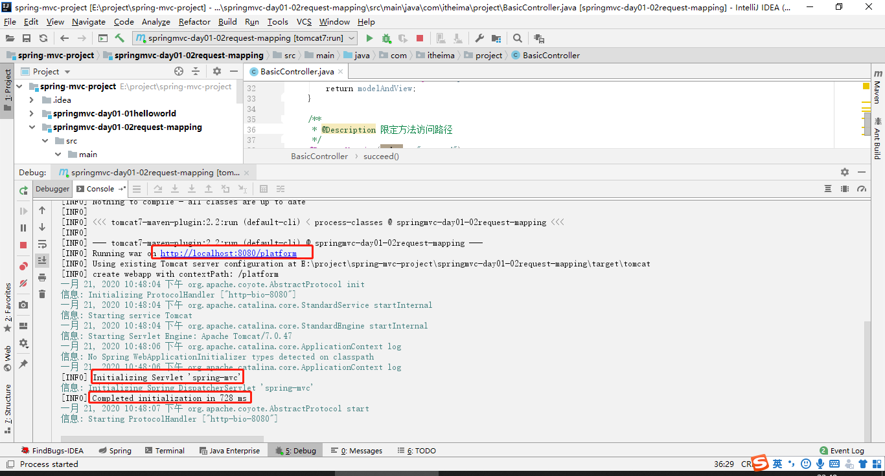

springmvc-day01

## 目录

[TOC]

## 学习目标

```
1、理解什么是三层架构
2、理解MVC是什么，以及与三层架构的关系
3、了解springMVC是什么？能做什么？
4、掌握springMVC的3大组件
5、掌握springMVC的初始化，及访问过程
6、掌握springMVC请求映射规则
7、掌握springMVC的参数绑定
8、掌握参数常用注解
```


## 第一章 SpringMVC基本概念

### 1、三层架构和MVC

#### 【1】三层架构

在以前的企业级架构中，我们是这么分类的：

C/S架构：客户端===>服务器

B/S架构：浏览器===>服务器

目前J2EE中，几乎全部都是B/S架构方式，三层架构如图所示：


#### 【2】MVC是什么

MVC，即 Model 模型、View 视图，及 Controller 控制器。

- Model：模型，承载数据，并对用户提交请求进行计算（处理）的模块。其分为两类：
  一类称为数据承载 Bean：实体类，专门用户承载业务数据的，如 Student、User 等
  一类称为业务处理 Bean：指 Service 或 Dao 对象，专门用于处理用业务的。

- View：视图，为用户提供使用界面，与用户直接进行交互。
- Controller：控制器，用于将用户请求转发给相应的 Model 进行处理，并根据 Model 的计算结果向用户提供相应响应。


MVC 架构程序的工作流程：
 （1）用户通过 View 页面向服务端提出请求，可以是表单请求、超链接请求、AJAX 请求等
 （2）服务端 Controller 控制器接收到请求后对请求进行解析，找到相应的 Model 对用户请求进行处理
 （3）Model 处理后，将处理结果再交给 Controller
 （4）Controller 在接到处理结果后，根据处理结果找到要作为向客户端发回的响应 View 页面。页面经渲染（数据填充）后，再发送给客户端。

#### 【3】三层架构和MVC关系


### 2、SpringMVC概述

#### 【1】springMVC是什么

 一种轻量级的、基于MVC的Web层应用框架。偏前端管理而不是基于业务逻辑层。Spring框架的一个后续产品 

- Spring 为展现层提供的基于 MVC 设计理念的优秀的 Web 框架

- Spring3.0 后全面超越 Struts2，成为最优秀的 MVC 框架。

- Spring MVC 通过一套 MVC 注解，路径映射、参数的适配、视图的渲染

- 支持 REST 风格的 URL 请求。

- 采用了松散耦合可插拔组件结构，比其他 MVC 框架更具扩展性和灵活性。


#### 【2】SpringMVC在三层架构的地位


#### 【3】SpringMVC能干什么

 1) 天生与Spring框架集成，如：(IOC,AOP)

 2) 支持Restful风格

 3) 进行更简洁的Web层开发

 4) 支持灵活的URL到页面控制器的映射

 5) 非常容易与其他视图技术集成，如:Velocity、FreeMarker等等

 6) 因为模型数据不存放在特定的API里，而是放在一个Model里(Map数据结构实现，因此很容易被其他框架使用)

 7) 非常灵活的数据验证、格式化和数据绑定机制、能使用任何对象进行数据绑定，不必实现特定框架的API

 8) 更加简单、强大的异常处理

 9) 对静态资源的支持

 10) 支持灵活的本地化、主题等解析

## 第二章 SpringMVC入门案例

### 1、目标

```
1、掌握SpringMVC的基本配置
2、掌握MVC的执行过程
```

### 2、案例（1）

新建springmvc-day01-01helloworld的web项目

#### 【1】创建maven web项目


手动指定java 为资源目录


手动指定resources为资源目录


在java的路径中建立com.itheima.project的包路径

#### 【2】配置pom.xml

```xml
<?xml version="1.0" encoding="UTF-8"?>

<project xmlns="http://maven.apache.org/POM/4.0.0" xmlns:xsi="http://www.w3.org/2001/XMLSchema-instance"
         xsi:schemaLocation="http://maven.apache.org/POM/4.0.0 http://maven.apache.org/xsd/maven-4.0.0.xsd">
    <modelVersion>4.0.0</modelVersion>

    <groupId>com.itheima.spring</groupId>
    <artifactId>springmvc-day01-01helloworld</artifactId>
    <version>1.0-SNAPSHOT</version>
    <packaging>war</packaging>

    <name>springmvc-day01-01helloworld Maven Webapp</name>
    <!-- FIXME change it to the project's website -->
    <url>http://www.example.com</url>

    <properties>
        <project.build.sourceEncoding>UTF-8</project.build.sourceEncoding>
        <!--spring 版本-->
        <spring.version>5.1.11.RELEASE</spring.version>
    </properties>

    <dependencies>
        <!--上下文容器-->
        <dependency>
            <groupId>org.springframework</groupId>
            <artifactId>spring-context</artifactId>
            <version>${spring.version}</version>
        </dependency>

        <!--spring-mvc依赖-->
        <dependency>
            <groupId>org.springframework</groupId>
            <artifactId>spring-webmvc</artifactId>
            <version>${spring.version}</version>
        </dependency>

        <dependency>
            <groupId>junit</groupId>
            <artifactId>junit</artifactId>
            <version>4.11</version>
            <scope>test</scope>
        </dependency>

    </dependencies>

    <build>
        <finalName>springmvc-day01-01helloworld</finalName>
        <plugins>
      <!-- tomcat7插件,命令： mvn tomcat7:run -DskipTests -->
          <plugin>
            <groupId>org.apache.tomcat.maven</groupId>
            <artifactId>tomcat7-maven-plugin</artifactId>
            <version>2.2</version>
            <configuration>
              <uriEncoding>utf-8</uriEncoding>
              <port>8080</port>
              <path>/platform</path>
            </configuration>
          </plugin>
          <plugin>
            <groupId>org.apache.maven.plugins</groupId>
            <artifactId>maven-compiler-plugin</artifactId>
            <version>3.1</version>
            <configuration>
              <source>8</source>
              <target>8</target>
            </configuration>
          </plugin>
    </plugins>
    </build>
</project>

```


#### 【3】编写配置文件

##### 【3.1】spring-mvc.xml配置


spring-mvc.xml是框架的主配置文件，用于管理springmvc表现层相关的对象。

```xml
<?xml version="1.0" encoding="UTF-8"?>
<beans xmlns="http://www.springframework.org/schema/beans"
       xmlns:xsi="http://www.w3.org/2001/XMLSchema-instance"
       xmlns:context="http://www.springframework.org/schema/context"
       xsi:schemaLocation="http://www.springframework.org/schema/beans
       http://www.springframework.org/schema/beans/spring-beans.xsd
       http://www.springframework.org/schema/context
       http://www.springframework.org/schema/context/spring-context.xsd
">

    <!--配置扫描路径-->
    <context:component-scan base-package="com.itheima.project "/>
    
</beans>
```

##### 【3.2】web.xml配置

默认创建好的web.xml中servlet规范是2.3版本，不能友好的支持EL表达式。需要改成2.5版本

```xml
<?xml version="1.0" encoding="UTF-8"?>
<web-app xmlns:xsi="http://www.w3.org/2001/XMLSchema-instance"
         xmlns="http://java.sun.com/xml/ns/javaee"
         xsi:schemaLocation="http://java.sun.com/xml/ns/javaee
        http://java.sun.com/xml/ns/javaee/web-app_2_5.xsd" version="2.5">
  

</web-app>
```

配置DispatcherServlet

**说明：**在web阶段处理用户请求，我们需要编写相关的Servlet，并且要进行配置。这里springmvc框架其实就是对Servlet进行了封装，它提供了一个统一的Servlet来接收用户请求。它就是赫赫有名的前端控制器：DispatcherServlet。我们需要记住它

```xml
<?xml version="1.0" encoding="UTF-8"?>
<web-app xmlns:xsi="http://www.w3.org/2001/XMLSchema-instance"
         xmlns="http://java.sun.com/xml/ns/javaee"
         xsi:schemaLocation="http://java.sun.com/xml/ns/javaee
        http://java.sun.com/xml/ns/javaee/web-app_2_5.xsd" version="2.5">

  <!-- 配置前端控制器：DispatcherServlet -->
  <servlet>
    <servlet-name>spring-helloworld</servlet-name>
    <servlet-class>org.springframework.web.servlet.DispatcherServlet</servlet-class>
    <!--加载spring-mvc主文件 -->
    <init-param>
      <param-name>contextConfigLocation</param-name>
      <param-value>classpath*:spring-mvc.xml</param-value>
    </init-param>
    <!-- 配置什么时候加载前端控制器，说明：
      1.配置大于等于0的整数，表示在tomcat启动的时候加载
      2.配置小于0的整数，表示在第一次请求到达的时候加载
     -->
    <load-on-startup>1</load-on-startup>
  </servlet>
  <servlet-mapping>
    <servlet-name>spring-helloworld</servlet-name>
    <!-- 配置请求url规则，说明：
       1.*.do，表示以.do结尾的请求进入前端控制器
       2./，表示所有请求都进入前端控制器
    -->
    <url-pattern>/</url-pattern>
  </servlet-mapping>

</web-app>
```


#### 【4】代码开发

在WEB-INF下新建views目录并添加hello.jsp

```jsp
<%@ page contentType="text/html;charset=UTF-8" language="java" %>
<html>
<head>
    <title>springmvc入门案例页面</title>
</head>
<body>
你好，世界！${hello}
</body>
</html>
```

HelloController

```java
package com.itheima.project;

import org.springframework.stereotype.Controller;
import org.springframework.web.bind.annotation.RequestMapping;
import org.springframework.web.servlet.ModelAndView;

/**
 * @Description：helloworld
 */
@Controller
public class HelloController {

    @RequestMapping("/hello")
    public ModelAndView hello(){
        //1、创建模型
        ModelAndView modelAndView = new ModelAndView();
        //2、设置传递对象
        //    第一个参数：键
        //    第二个参数：值
        modelAndView.addObject("hello", "SpringMVC" );
        //3、设置目标页面
        modelAndView.setViewName("/WEB-INF/views/hello.jsp");
        return modelAndView;
    }
}

```

#### 【5】发布运行

启动tomcat


访问

 http://localhost:8080/platform/hello 


### 3、入门案例中执行顺序

#### 【1】启动初始化顺序

​		（1）打包好war包，部署到Tomcat中==》mavne的自动发布插件完成

​		（2）Tomcat启动，加载web.xml文件

​		（3）初始化dispatcherServlet配置

​		（4）根据contextConfigLocation加载spring-mvc.xml配置

​		（5）根据spring-mvc.xml配置初始化bean

​			时序图：


#### 【2】请求处理顺序

（1）浏览器发起 http://localhost:8080/platform/hello 请求

（2）Tomcat调用dispatcherServlet拦截/hello

（3）dispatcherServlet调用一个处理器，解析映射（这里被@RequestMapping注释的方法）【处理器映射器】

（4）dispatcherServlet找到方法，调用一个处理器，调用HelloController中的hello()方法，并解析参数【处理器适配器】

（5）HelloController中的hello()方法有返回值，创建ModelAndVIew（包含响应数据，页面）

（6）dispatcherServlet调用视图解析器，组装响应对象，页面返回给浏览器【视图解析器】


处理器映射器：请求与方法的关系

处理器适配器：参数解析的过程

视图解析器：渲染页面与数据之间的关系

## 第三章 SpringMVC架构体系【了解】

DispatcherServlet中默认配置的加载

```java
public class DispatcherServlet extends FrameworkServlet {
    ......
    //定义DispatcherServlet的默认策略名
    private static final String DEFAULT_STRATEGIES_PATH = "DispatcherServlet.properties";
	......
        
    //从属性文件加载默认策略实现
    static {
            try {
                ClassPathResource resource = new ClassPathResource(DEFAULT_STRATEGIES_PATH, DispatcherServlet.class);
                defaultStrategies = PropertiesLoaderUtils.loadProperties(resource);
            }
            catch (IOException ex) {
                throw new IllegalStateException("Could not load '" + DEFAULT_STRATEGIES_PATH + "': " + ex.getMessage());
            }
        }
    ......
    //初始化各个组件
    protected void initStrategies(ApplicationContext context) {
        // 初始化MultipartResolver 用来处理上传文件 默认是没有处理的，需要在上下文添加MultipartResolver处理器
        initMultipartResolver(context);
        // 初始化LocaleResolver 配置国际化的
        initLocaleResolver(context);
        // 初始化ThemeResolver 通过主题控制页面风格
        initThemeResolver(context);
        // 初始化HandlerMappings 由定义请求和处理程序对象之间映射的对象实现
        initHandlerMappings(context);
        // 初始化HandlerAdapters
        initHandlerAdapters(context);
        // 初始化HandlerExceptionResolvers 异常处理
        initHandlerExceptionResolvers(context);
        // 初始化RequestToViewNameTranslator
        initRequestToViewNameTranslator(context);
        // 初始化ViewResolvers
        initViewResolvers(context);
        // 初始化FlashMapManager
        initFlashMapManager(context);
    }
        
    //加载默认策略
    protected <T> List<T> getDefaultStrategies(ApplicationContext context, Class<T> strategyInterface) {
		......
	}
}
```


### 1、组件介绍

#### 【1】处理器映射器(HandlerMapping)

​		SpringMVC中完成url到Controller映射的组件.DispatcherServlet接收Request,然后从HandlerMapping查找处理Request的Controller 

```properties
根据请求的url路径:
	http://localhost:8080/platform/hello
找到对应的处理器方法:
    @RequestMapping("/hello")
    public ModelAndView hello(){
        ......
    }
```


#### 【2】处理器适配器(HandlerAdapter)

​		 SpringMVC中HandlerMapping获取到执行请求的controller时，DispatcherServlte会根据controller对应的controller类型来调用相应的HandlerAdapter来进行参数处理


尽管springmvc框架默认配置了处理器映射器和适配器。在企业项目中，我们还是需要显示配置处理器映射器和适配器。显示配置的目的：增加其它应用的配置

```xml
<?xml version="1.0" encoding="UTF-8"?>
<beans xmlns="http://www.springframework.org/schema/beans"
       xmlns:xsi="http://www.w3.org/2001/XMLSchema-instance"
       xmlns:context="http://www.springframework.org/schema/context"
       xmlns:mvc="http://www.springframework.org/schema/mvc"
       xsi:schemaLocation="http://www.springframework.org/schema/beans
       http://www.springframework.org/schema/beans/spring-beans.xsd
       http://www.springframework.org/schema/context
       http://www.springframework.org/schema/context/spring-context.xsd
       http://www.springframework.org/schema/mvc
       http://www.springframework.org/schema/mvc/spring-mvc.xsd
       ">
    <!--管理controller的bean-->
    <context:component-scan base-package="com.itheima.project"/>
    
    <!--
        显示配置处理器映射器和处理器适配器，说明：
            第一步：导入mvc名称空间和约束
            第二步：通过注解驱动标签配置
       -->
    <mvc:annotation-driven/>
</beans>
```


#### 【3】视图解析器（ViewResolver）

 根据视图的名称将其解析为 View 类型的视图，如通过 ModelAndView 中的视图名称将其解析成 View，View 是用来渲染页面的，也就是将 Model 填入模板中，生成 html 或其他格式的文件 


```xml
    <!--配置视图解析器-->
    <bean class="org.springframework.web.servlet.view.InternalResourceViewResolver">
        <!--配置视图的公共目录路径（前缀）-->
        <property name="prefix" value="/WEB-INF/views/"/>
        <!--配置视图的扩展名称（后缀）-->
        <property name="suffix" value=".jsp"/>
    </bean>
```

```
RequestMappingHandlerAdapter
```

### 2、请求跟踪【掌握】

#### 【1】架构图解


#### 【2】初始化创建

项目在启动阶段

```java
public class DispatcherServlet extends FrameworkServlet {
    ......
    //初始化各个组件
    protected void initStrategies(ApplicationContext context) {
        // 初始化MultipartResolver 用来处理上传文件 默认是没有处理的，需要在上下文添加		MultipartResolver处理器
        initMultipartResolver(context);
        // 初始化LocaleResolver 配置国际化的
        initLocaleResolver(context);
        // 初始化ThemeResolver 通过主题控制页面风格
        initThemeResolver(context);
        // 初始化HandlerMappings 由定义请求和处理程序对象之间映射的对象实现
        initHandlerMappings(context);
        // 初始化HandlerAdapters
        initHandlerAdapters(context);
        // 初始化HandlerExceptionResolvers 异常处理
        initHandlerExceptionResolvers(context);
        // 初始化RequestToViewNameTranslator
        initRequestToViewNameTranslator(context);
        // 初始化ViewResolvers
        initViewResolvers(context);
        // 初始化FlashMapManager
        initFlashMapManager(context);
    }
        
    //加载默认策略
    protected <T> List<T> getDefaultStrategies(ApplicationContext context, Class<T> strategyInterface) {
		......
	}
}
```


#### 【3】DispatcherServlet拦截

客户端发送http请求呗dispatcherServlet所拦截

```xml
 <!-- 配置前端控制器：DispatcherServlet -->
  <servlet>
    <servlet-name>spring-helloworld</servlet-name>
    <servlet-class>org.springframework.web.servlet.DispatcherServlet</servlet-class>
    <!--加载spring-mvc主文件 -->
    <init-param>
      <param-name>contextConfigLocation</param-name>
      <param-value>classpath*:spring-mvc.xml</param-value>
    </init-param>
    <!-- 配置什么时候加载前端控制器，说明：
      1.配置大于等于1的整数，表示在tomcat启动的时候加载
      2.配置小于0的整数，表示在第一次请求到达的时候加载
     -->
    <load-on-startup>1</load-on-startup>
  </servlet>
  <servlet-mapping>
    <servlet-name>spring-helloworld</servlet-name>
    <!-- 配置请求url规则，说明：
       1.*.do，表示以.do结尾的请求进入前端控制器
       2./，表示所有请求都进入前端控制器
    -->
    <url-pattern>/</url-pattern>
  </servlet-mapping>
```

 DispatcherServlet的核心方法为doService(),doService()中的核心逻辑由doDispatch()实现

```java
protected void doDispatch(HttpServletRequest request, HttpServletResponse response) throws Exception {
			....
            //这里检测是否是文件上传内容
			processedRequest = checkMultipart(request);
			multipartRequestParsed = (processedRequest != request);

			// 获取的处理器映射器
            // 这里返回的不是一个具体的controller，而是HandlerExecutionChain
            // 他封装了handler及拦截器
			mappedHandler = getHandler(processedRequest);
			if (mappedHandler == null) {
				noHandlerFound(processedRequest, response);
				return;
			}

			// 获取的处理器适配器
			HandlerAdapter ha = getHandlerAdapter(mappedHandler.getHandler());
			......
			// 实际处理器适配器执行方法，返回视图
			mv = ha.handle(processedRequest, response, mappedHandler.getHandler());
			.....
    		// 渲染结果
			processDispatchResult(processedRequest, response, mappedHandler, mv, dispatchException);
    ......
}
```
#### 【4】RequestMappingHandlerMapping

getHandler(processedRequest)方法实际上就是从HandlerMapping中找到url和Controller的对应关系 ,具体实现是在抽象类AbstractHandlerMapping中，而RequestMappingHandlerMapping是使用注解方式时所使用的处理器映射器


#### 【5】RequestMappingHandlerAdapter

doDispatch方法中带着从getHandler(processedRequest)获得mappedHandler调用getHandlerAdapter(mappedHandler.getHandler())方法，获得在ApplicationObjectSupport中初始化的List<HandlerAdapter> handlerAdapters中对应的HandlerAdapter


#### 【6】ViewResolver

返回视图之后，processDispatchResult()完成视图的处理

```java
private void processDispatchResult(HttpServletRequest request, HttpServletResponse response,
			@Nullable HandlerExecutionChain mappedHandler, @Nullable ModelAndView mv,
			@Nullable Exception exception) throws Exception {

		.......

		if (mv != null && !mv.wasCleared()) {
            // 去渲染
			render(mv, request, response);
			if (errorView) {
				WebUtils.clearErrorRequestAttributes(request);
			}
		}
		.....
	}
```

调用View的render()方法去渲染

```java
protected void render(ModelAndView mv, HttpServletRequest request, HttpServletResponse response) throws Exception {
		......
    	View view;	
    	......
		view.render(mv.getModelInternal(), request, response);
		......
	}
```

View接口render方法

```java
void render(@Nullable Map<String, ?> model, HttpServletRequest request, HttpServletResponse response)
			throws Exception;
```

View接口实现抽象类AbstractView中的render方法

```java
@Override
public void render(@Nullable Map<String, ?> model, HttpServletRequest request,
                   HttpServletResponse response) throws Exception {

    if (logger.isDebugEnabled()) {
        logger.debug("View " + formatViewName() +
                     ", model " + (model != null ? model : Collections.emptyMap()) +
                     (this.staticAttributes.isEmpty() ? "" : ", static attributes " + this.staticAttributes));
    }

    Map<String, Object> mergedModel = createMergedOutputModel(model, request, response);
    prepareResponse(request, response);
    //渲染输出结果
    renderMergedOutputModel(mergedModel, getRequestToExpose(request), response);
}
```

InternalResourceView的renderMergedOutputModel

```java
@Override
	protected void renderMergedOutputModel(
			Map<String, Object> model, HttpServletRequest request, HttpServletResponse response) throws Exception {

		// 将模型对象设置为请求属性
		exposeModelAsRequestAttributes(model, request);

		// Expose helpers as request attributes, if any.
		exposeHelpers(request);

		// Determine the path for the request dispatcher.
		String dispatcherPath = prepareForRendering(request, response);

		// 获取请求转发对象.
		RequestDispatcher rd = getRequestDispatcher(request, dispatcherPath);
		......
        //请求转发
		rd.forward(request, response);
		}
	}
```


## 第四章 SpringMVC请求映射规则【重点】

追踪一下RequestMappingHandlerMapping的初始化代码：

```java
@Nullable
	private RequestMappingInfo createRequestMappingInfo(AnnotatedElement element) {
		//根据RequestMapping的注解创建请求映射详细
        RequestMapping requestMapping = AnnotatedElementUtils.findMergedAnnotation(element, RequestMapping.class);
		RequestCondition<?> condition = (element instanceof Class ?
				getCustomTypeCondition((Class<?>) element) : getCustomMethodCondition((Method) element));
		return (requestMapping != null ? createRequestMappingInfo(requestMapping, condition) : null);
	}
```

这里从代码中我们可以发现@RequestMapping启到了关键性作用

```
@CrossOrigin
解决跨域问题
```

### 1、@RequestMapping （2）

​	 @RequestMapping是SpringWeb应用程序中最常被用到的注解之一。这个注解会将HTTP请求映射到MVC和REST控制器(什么是REST控制器，暂时不管)的处理方法上。 @RequestMapping可以使用在控制器类的级别或方法的级别上使用 

创建springmvc-day01-02request-mapping结构如下


#### 【1】基本用法

##### 【1.1】目标

```properties
1、掌握@RequestMapping的基本使用
2、掌握@RequestMapping的默认映射
3、掌握@RequestMapping在类级别和方法级别上的作用
```

##### 【1.2】实现

```
1、配置pom.xml
2、配置spring-mvc.xml
3、配置web.xml
4、新增succeed.jsp
4、新建BasicController
```


###### 【1.2.1】配置pom.xml

```xml
<?xml version="1.0" encoding="UTF-8"?>

<project xmlns="http://maven.apache.org/POM/4.0.0" xmlns:xsi="http://www.w3.org/2001/XMLSchema-instance"
  xsi:schemaLocation="http://maven.apache.org/POM/4.0.0 http://maven.apache.org/xsd/maven-4.0.0.xsd">
  <modelVersion>4.0.0</modelVersion>

  <groupId>com.itheima.project</groupId>
  <artifactId>springmvc-day01-02request-mapping</artifactId>
  <version>1.0-SNAPSHOT</version>
  <packaging>war</packaging>

  <name>springmvc-day01-02request-mapping</name>
  <!-- FIXME change it to the project's website -->
  <url>http://www.example.com</url>

  <properties>
    <project.build.sourceEncoding>UTF-8</project.build.sourceEncoding>
    <!--spring版本-->
    <spring.version>5.1.11.RELEASE</spring.version>
  </properties>

  <dependencies>
    <dependency>
      <groupId>org.springframework</groupId>
      <artifactId>spring-context</artifactId>
      <version>${spring.version}</version>
    </dependency>
    <dependency>
      <groupId>org.springframework</groupId>
      <artifactId>spring-webmvc</artifactId>
      <version>${spring.version}</version>
    </dependency>
    <dependency>
      <groupId>junit</groupId>
      <artifactId>junit</artifactId>
      <version>4.11</version>
      <scope>test</scope>
    </dependency>
  </dependencies>

  <build>
    <finalName>springmvc-day01-02request-mapping</finalName>
    <plugins>
      <!-- tomcat7插件,命令： mvn tomcat7:run -DskipTests -->
      <plugin>
        <groupId>org.apache.tomcat.maven</groupId>
        <artifactId>tomcat7-maven-plugin</artifactId>
        <version>2.2</version>
        <configuration>
          <uriEncoding>utf-8</uriEncoding>
          <port>8080</port>
          <path>/platform</path>
        </configuration>
      </plugin>
      <plugin>
        <groupId>org.apache.maven.plugins</groupId>
        <artifactId>maven-compiler-plugin</artifactId>
        <configuration>
          <source>8</source>
          <target>8</target>
        </configuration>
      </plugin>
    </plugins>
  </build>
</project>

```

###### 【1.2.2】配置spring-mvc.xml

```xml
<?xml version="1.0" encoding="UTF-8"?>
<beans xmlns="http://www.springframework.org/schema/beans"
       xmlns:xsi="http://www.w3.org/2001/XMLSchema-instance"
       xmlns:context="http://www.springframework.org/schema/context"
xmlns:mvc="http://www.springframework.org/schema/mvc"
       xsi:schemaLocation="http://www.springframework.org/schema/beans
       http://www.springframework.org/schema/beans/spring-beans.xsd
       http://www.springframework.org/schema/context
       http://www.springframework.org/schema/context/spring-context.xsd
       http://www.springframework.org/schema/mvc
       http://www.springframework.org/schema/mvc/spring-mvc.xsd
">

    <!--配置扫描路径-->
    <context:component-scan base-package="com.itheima.project "/>

    <!--显示配置处理器映射器和处理器适配器，说明：
            第一步：导入mvc名称空间和约束
            第二步：通过注解驱动标签配置-->
    <mvc:annotation-driven/>

</beans>
```

###### 【1.2.3】配置web.xml

```xml
<?xml version="1.0" encoding="UTF-8"?>
<web-app xmlns:xsi="http://www.w3.org/2001/XMLSchema-instance"
         xmlns="http://java.sun.com/xml/ns/javaee"
         xsi:schemaLocation="http://java.sun.com/xml/ns/javaee
        http://java.sun.com/xml/ns/javaee/web-app_2_5.xsd" version="2.5">
  <display-name>Archetype Created Web Application</display-name>

  <servlet>
    <!--前端控制器DispatcherServlet加载-->
    <servlet-name>spring-mvc</servlet-name>
    <servlet-class>org.springframework.web.servlet.DispatcherServlet</servlet-class>
    <!--初始化加载spring-mvc配置-->
    <init-param>
      <param-name>contextConfigLocation</param-name>
      <param-value>classpath*:spring-mvc.xml</param-value>
    </init-param>
    <!--配置1：表示启动就加载
        配置0：表示懒加载-->
    <load-on-startup>1</load-on-startup>
  </servlet>
  <servlet-mapping>
    <servlet-name>spring-mvc</servlet-name>
    <!--配置/代表拦截所有路径-->
    <url-pattern>/</url-pattern>
  </servlet-mapping>
</web-app>

```

###### 【1.2.4】新增succeed.jsp

```html
<%@ page contentType="text/html;charset=UTF-8" language="java" %>
<html>
<head>
    <title>springmvc入门案例页面</title>
</head>
<body>
这个是requestMapping的${content}用法！
</body>
</html>
```

###### 【1.2.5】新增BasicController

```java
package com.itheima.project;

import org.springframework.stereotype.Controller;
import org.springframework.web.bind.annotation.RequestMapping;
import org.springframework.web.servlet.ModelAndView;

import java.util.HashMap;
import java.util.Map;

/**
 * @Description：基本用法
 */
//声明bean
@Controller
//使用限定类的请求路径
@RequestMapping(value = "basic")
public class BasicController {

    /**
     * @Description 此次不限定名称则表示为默认请求方法
     */
    @RequestMapping
    public ModelAndView defaultMapping(){
        //构建对象视图对象
        ModelAndView modelAndView = new ModelAndView();
        //指定视图
        modelAndView.setViewName("/WEB-INF/views/succeed.jsp");
        //传递参数，接受map对象
        Map<String,Object> map = new HashMap<>();
        map.put("content", "默认");
        modelAndView.addAllObjects(map);
        return modelAndView;
    }

    /**
     * @Description 限定方法访问路径
     */
    @RequestMapping(value = "succeed")
    public ModelAndView succeed(){
        //构建对象视图对象
        ModelAndView modelAndView = new ModelAndView();
        //指定视图
        modelAndView.setViewName("/WEB-INF/views/succeed.jsp");
        //传递参数，接受map对象
        Map<String,Object> map = new HashMap<>();
        map.put("content", "基本");
        modelAndView.addAllObjects(map);
        return modelAndView;
    }
}

```

###### 【1.2.6】测试

创建测试方法：




访问http://localhost:8080/platform/basic


访问http://localhost:8080/platform/basic/succeed


##### 【1.3】小结

```properties
@RequestMapping的基本使用
 	先访问类上映射路径，再根据方法路径进一步细化请求
@RequestMapping的默认配置
	不写value值即为默认请求路径

```

#### 【2】处理多个url

##### 【2.1】目标

```
1、掌握@requestMapping的ant风格的请求路径
```

##### 【2.2】实现

添加MultipathController

```java
package com.itheima.project;

import org.springframework.stereotype.Controller;
import org.springframework.web.bind.annotation.RequestMapping;
import org.springframework.web.servlet.ModelAndView;

import java.util.HashMap;
import java.util.Map;

/**
 * @Description：多路径请求映射
 */
@Controller
@RequestMapping(value = "/multipath")
public class MultipathController {

    //@RequestMapping 支持统配符以及ANT风格的路径
    @RequestMapping(value = {"/succeed","succ*","/test/succeed"})
    public ModelAndView succeed(){
        ModelAndView modelAndView = new ModelAndView();
        Map<String,Object> map = new HashMap<>();
        map.put("content", "多路径");
        modelAndView.addAllObjects(map);
        modelAndView.setViewName("/WEB-INF/views/succeed.jsp");
        return  modelAndView;
    }
}

```

##### 【2.3】小结

```properties
在测试中发现，访问下列路径：
http://localhost:8080/platform/multipath/succeed
http://localhost:8080/platform/multipath/succa
http://localhost:8080/platform/multipath/test/succeed
都是可以访问的，且结果是一直的

```

#### 【3】处理http的各种请求方式

 Spring MVC 的 @RequestMapping 注解能够处理 HTTP 请求的方法, 比如 GET, PUT, POST, DELETE 以及 PATCH。  

##### 【3.1】目标

```
掌握@RequestMapping的method配置
```

##### 【3.2】实现

新增DoMethodController

```java
package com.itheima.project;

import org.springframework.stereotype.Controller;
import org.springframework.web.bind.annotation.RequestMapping;
import org.springframework.web.bind.annotation.RequestMethod;
import org.springframework.web.servlet.ModelAndView;

import java.util.HashMap;
import java.util.Map;

/**
 * @Description：处理http的各种请求方式
 */
@Controller
@RequestMapping(value = "domethod")
public class DoMethodController {

    /**
     * @Description get方式
     * method指定访问方式
     */
    @RequestMapping(value = "getmethod",method = RequestMethod.GET)
    public ModelAndView getMethod(){
        //构建对象视图对象
        ModelAndView modelAndView = new ModelAndView();
        //指定视图
        modelAndView.setViewName("/WEB-INF/views/succeed.jsp");
        //传递参数，接受map对象
        Map<String,Object> map = new HashMap<>();
        map.put("content", "getmethod");
        modelAndView.addAllObjects(map);
        return modelAndView;

    }

    /**
     * @Description post方式
     */
    @RequestMapping(value = "postmethod",method = RequestMethod.POST)
    public ModelAndView postMethod(){
//构建对象视图对象
        ModelAndView modelAndView = new ModelAndView();
        //指定视图
        modelAndView.setViewName("/WEB-INF/views/succeed.jsp");
        //传递参数，接受map对象
        Map<String,Object> map = new HashMap<>();
        map.put("content", "postmethod");
        modelAndView.addAllObjects(map);
        return modelAndView;
    }
}


```

使用postman测试


##### 【3.3】小结

```
@RequestMapping中的method属性用于限制http的请求方式
```

#### 【4】处理动态url【扩展】

前面我们使用@RequestMapping处理的路径都是固定的路径，那么怎么动态路径又是怎么处理的呢？

##### 【4.1】目标

```properties
掌握@RequestMapping的动态处理
```

##### 【4.2】实现

新增DoUrlController

```java
package com.itheima.project;

import org.springframework.stereotype.Controller;
import org.springframework.web.bind.annotation.RequestMapping;
import org.springframework.web.servlet.ModelAndView;

import java.util.HashMap;
import java.util.Map;

/**
 * @Description：动态路径匹配
 */
@Controller
@RequestMapping(value = "dourl")
public class DoUrlController {

    @RequestMapping(value = "{matchUrl}")
    public ModelAndView matchUrl() {
        //构建对象视图对象
        ModelAndView modelAndView = new ModelAndView();
        //指定视图
        modelAndView.setViewName("/WEB-INF/views/succeed.jsp");
        //传递参数，接受map对象
        Map<String, Object> map = new HashMap<>();
        map.put("content", "动态路径");
        modelAndView.addAllObjects(map);
        return modelAndView;
    }

    @RequestMapping(value = "{matchUr1}/{matchUr12}")
    public ModelAndView matchUrl2() {
        //构建对象视图对象
        ModelAndView modelAndView = new ModelAndView();
        //指定视图
        modelAndView.setViewName("/WEB-INF/views/succeed.jsp");
        //传递参数，接受map对象
        Map<String, Object> map = new HashMap<>();
        map.put("content", "动态路径2");
        modelAndView.addAllObjects(map);
        return modelAndView;
    }
}


```

##### 【4.3】小结

```properties
1、@requestMapping的多路径使用{}占位符来实现
@RequestMapping(value = "{matchUrl}")匹配路径
	http://localhost:8080/platform/dourl/a
	http://localhost:8080/platform/dourl/user
@RequestMapping(value = "{matchUrl}/{matchUrl2}")
http://localhost:8080/platform/dourl/a/1
	http://localhost:8080/platform/dourl/user/1
【使用场景】
	给其他提供三方接口时候使用，需要配合参数绑定使用，后面我们会说到
```


### 2、@RequestMapping 子类注解

#### 【1】介绍


@RequestMapping 子类注解列表

| 注解           | 等价于                                         | 适用场景           |
| -------------- | ---------------------------------------------- | ------------------ |
| @GetMapping    | @RequestMapping(method = RequestMethod.GET)    | GET:得到资源       |
| @PutMapping    | @RequestMapping(method = RequestMethod.PUT)    | PUT:修改整体内容   |
| @PostMapping   | @RequestMapping(method = RequestMethod.POST)   | POST:新增内容      |
| @DeleteMapping | @RequestMapping(method = RequestMethod.DELETE) | DELETE：删除内容   |
| @PatchMapping  | @RequestMapping(method = RequestMethod.PATCH)  | PATCH:修改部分内容 |

这些标签也可以根据请求方式不同，来限定url的映射关系

#### 【2】目标

```properties
掌握@requestMapping的子类用法：相同路径请求，因请求方式不同而映射的方法不同
```

#### 【3】案例

新增SonMappingController

```java
package com.itheima.project;

import org.springframework.stereotype.Controller;
import org.springframework.web.bind.annotation.*;
import org.springframework.web.servlet.ModelAndView;

import java.util.HashMap;
import java.util.Map;

/**
 * @Description：RequestMapping 子类注解
 */
@Controller
@RequestMapping(value = "sonmapping")
public class SonMappingController {

    @GetMapping
    public ModelAndView get(){
        //构建对象视图对象
        ModelAndView modelAndView = new ModelAndView();
        //指定视图
        modelAndView.setViewName("/WEB-INF/views/succeed.jsp");
        //传递参数，接受map对象
        Map<String,Object> map = new HashMap<>();
        map.put("content", "get");
        modelAndView.addAllObjects(map);
        return modelAndView;
    }

    @PostMapping
    public ModelAndView post(){
        //构建对象视图对象
        ModelAndView modelAndView = new ModelAndView();
        //指定视图
        modelAndView.setViewName("/WEB-INF/views/succeed.jsp");
        //传递参数，接受map对象
        Map<String,Object> map = new HashMap<>();
        map.put("content", "post");
        modelAndView.addAllObjects(map);
        return modelAndView;
    }

    @PutMapping
    public ModelAndView put(){
        //构建对象视图对象
        ModelAndView modelAndView = new ModelAndView();
        //指定视图
        modelAndView.setViewName("/WEB-INF/views/succeed.jsp");
        //传递参数，接受map对象
        Map<String,Object> map = new HashMap<>();
        map.put("content", "put");
        modelAndView.addAllObjects(map);
        return modelAndView;
    }

    @DeleteMapping
    public ModelAndView delete(){
        //构建对象视图对象
        ModelAndView modelAndView = new ModelAndView();
        //指定视图
        modelAndView.setViewName("/WEB-INF/views/succeed.jsp");
        //传递参数，接受map对象
        Map<String,Object> map = new HashMap<>();
        map.put("content", "delete");
        modelAndView.addAllObjects(map);
        return modelAndView;
    }

    @PatchMapping
    public ModelAndView patch(){
        //构建对象视图对象
        ModelAndView modelAndView = new ModelAndView();
        //指定视图
        modelAndView.setViewName("/WEB-INF/views/succeed.jsp");
        //传递参数，接受map对象
        Map<String,Object> map = new HashMap<>();
        map.put("content", "patch");
        modelAndView.addAllObjects(map);
        return modelAndView;
    }
}


```

使用postman测试


#### 【4】小结

```properties
@RequestMapping子类：
    请求路径相同
        http://localhost:8080/platform/sonmapping/son
    但是请求方式不同，执行的方法也不同
【思考】
	这个到底有什么作用？==》后面解答
```


## 第五章 SpringMVC参数绑定【重点】

什么是参数绑定？

例如：登陆的时候，填写账号和密码，然后传给controller，controller需要接受传递过来的账号和密码，登陆成功之后需要返回信息给前台页面，这个接受和传递都可以叫做参数绑定


​	处理器映射器RequestMappingHandlerMapping找到对应urls与Controller的关系后，后续交给 处理器适配器RequestMappingHandlerAdapter来处理，在处理之前由 RequestMappingHandlerAdapter完成参数的绑定，那么我们看下 RequestMappingHandlerAdapter.java类的afterPropertiesSet（line:481）方法初始化相关方法参数解析器。代码如下 ：

```java
@Override
	public void afterPropertiesSet() {
		// Do this first, it may add ResponseBody advice beans
		initControllerAdviceCache();
		//初始化默认参数解析器
		if (this.argumentResolvers == null) {
			List<HandlerMethodArgumentResolver> resolvers = getDefaultArgumentResolvers();
			this.argumentResolvers = new HandlerMethodArgumentResolverComposite().addResolvers(resolvers);
		}
        //初始化绑定参数@InitBinder解析器
		if (this.initBinderArgumentResolvers == null) {
			List<HandlerMethodArgumentResolver> resolvers = getDefaultInitBinderArgumentResolvers();
			this.initBinderArgumentResolvers = new HandlerMethodArgumentResolverComposite().addResolvers(resolvers);
		}
        //初始化默认返回解析器
		if (this.returnValueHandlers == null) {
			List<HandlerMethodReturnValueHandler> handlers = getDefaultReturnValueHandlers();
			this.returnValueHandlers = new HandlerMethodReturnValueHandlerComposite().addHandlers(handlers);
		}
	}
```

我们看下初始化默认参数解析器

```java
private List<HandlerMethodArgumentResolver> getDefaultArgumentResolvers() {
		List<HandlerMethodArgumentResolver> resolvers = new ArrayList<>();

		// 基本注解参数绑定
		resolvers.add(new RequestParamMethodArgumentResolver(getBeanFactory(), false));
		resolvers.add(new RequestParamMapMethodArgumentResolver());
		resolvers.add(new PathVariableMethodArgumentResolver());
		resolvers.add(new PathVariableMapMethodArgumentResolver());
		resolvers.add(new MatrixVariableMethodArgumentResolver());
		resolvers.add(new MatrixVariableMapMethodArgumentResolver());
		resolvers.add(new ServletModelAttributeMethodProcessor(false));
		resolvers.add(new RequestResponseBodyMethodProcessor(getMessageConverters(), this.requestResponseBodyAdvice));
		resolvers.add(new RequestPartMethodArgumentResolver(getMessageConverters(), this.requestResponseBodyAdvice));
		resolvers.add(new RequestHeaderMethodArgumentResolver(getBeanFactory()));
		resolvers.add(new RequestHeaderMapMethodArgumentResolver());
		resolvers.add(new ServletCookieValueMethodArgumentResolver(getBeanFactory()));
		resolvers.add(new ExpressionValueMethodArgumentResolver(getBeanFactory()));
		resolvers.add(new SessionAttributeMethodArgumentResolver());
		resolvers.add(new RequestAttributeMethodArgumentResolver());

		// 基础类型参数绑定
		resolvers.add(new ServletRequestMethodArgumentResolver());
		resolvers.add(new ServletResponseMethodArgumentResolver());
		resolvers.add(new HttpEntityMethodProcessor(getMessageConverters(), this.requestResponseBodyAdvice));
		resolvers.add(new RedirectAttributesMethodArgumentResolver());
		resolvers.add(new ModelMethodProcessor());
		resolvers.add(new MapMethodProcessor());
		resolvers.add(new ErrorsMethodArgumentResolver());
		resolvers.add(new SessionStatusMethodArgumentResolver());
		resolvers.add(new UriComponentsBuilderMethodArgumentResolver());

		// Custom arguments
		if (getCustomArgumentResolvers() != null) {
			resolvers.addAll(getCustomArgumentResolvers());
		}

		// Catch-all
		resolvers.add(new RequestParamMethodArgumentResolver(getBeanFactory(), true));
		resolvers.add(new ServletModelAttributeMethodProcessor(true));

		return resolvers;
	}
```

由此我们可以知道参数的绑定是在处理器适配器中完成的。下面我们看下各种类型绑定方式

### 1、基本用法(3)

#### 【1】需求

```properties
模拟根据用户Id查询用户数据。请求url：
	http://127.0.0.1:8080/platform/findCustomerById?id=1
```

#### 【2】实现

```properties
1、编写pom.xml文件引入依赖
1、编写springmvc配置文件,并添加视图解析器
2、编写web.xml管理springmvc容器
3、编写用户列表页customer-list.jsp
4、编写CustometController的findAll方法
5、编辑用户查看页customer-findOne.jsp
6、编写CustometController的findCustomerById(integer customerId)方法
```

##### 【2.1】创建项目

拷贝springmvc-day01-02request-mapping新建项目springmvc-day01-03argument，结构如下


##### 【2.2】pom.xml中导入依赖

```xml
<?xml version="1.0" encoding="UTF-8"?>

<project xmlns="http://maven.apache.org/POM/4.0.0" xmlns:xsi="http://www.w3.org/2001/XMLSchema-instance"
         xsi:schemaLocation="http://maven.apache.org/POM/4.0.0 http://maven.apache.org/xsd/maven-4.0.0.xsd">
  <modelVersion>4.0.0</modelVersion>

  <groupId>com.itheima.project</groupId>
  <artifactId>springmvc-day01-03argument</artifactId>
  <version>1.0-SNAPSHOT</version>
  <packaging>war</packaging>

  <name>springmvc-day01-03argument</name>
  <!-- FIXME change it to the project's website -->
  <url>http://www.example.com</url>

  <properties>
    <project.build.sourceEncoding>UTF-8</project.build.sourceEncoding>
    <spring.version>5.1.11.RELEASE</spring.version>
    <!--servlet版本-->
    <servlet.version>2.5</servlet.version>
    <!--jsp版本-->
    <jsp.version>2.0</jsp.version>
    <!--jsp版本-->
    <jstl.version>1.2</jstl.version>
  </properties>

  <dependencies>
    <!--springmvc核心包-->
    <dependency>
      <groupId>org.springframework</groupId>
      <artifactId>spring-webmvc</artifactId>
      <version>${spring.version}</version>
    </dependency>
    <!--spring上下文-->
    <dependency>
      <groupId>org.springframework</groupId>
      <artifactId>spring-context</artifactId>
      <version>${spring.version}</version>
    </dependency>
    <dependency>
      <groupId>jstl</groupId>
      <artifactId>jstl</artifactId>
      <version>${jstl.version}</version>
    </dependency>
    <!--jsp依赖-->
    <dependency>
      <groupId>javax.servlet</groupId>
      <artifactId>jsp-api</artifactId>
      <version>${jsp.version}</version>
      <scope>provided</scope>
    </dependency>
    <!---servlet依赖-->
    <dependency>
      <groupId>javax.servlet</groupId>
      <artifactId>servlet-api</artifactId>
      <version>${servlet.version}</version>
      <scope>provided</scope>
    </dependency>
  </dependencies>

  <build>
    <plugins>
      <!-- tomcat7插件,命令： mvn tomcat7:run -DskipTests -->
      <plugin>
        <groupId>org.apache.tomcat.maven</groupId>
        <artifactId>tomcat7-maven-plugin</artifactId>
        <version>2.2</version>
        <configuration>
          <uriEncoding>utf-8</uriEncoding>
          <port>8080</port>
          <path>/platform</path>
        </configuration>
      </plugin>
      <plugin>
        <groupId>org.apache.maven.plugins</groupId>
        <artifactId>maven-compiler-plugin</artifactId>
        <configuration>
          <source>8</source>
          <target>8</target>
        </configuration>
      </plugin>
    </plugins>

  </build>
</project>
```

##### 【2.3】springmvc配置文件

```xml
<?xml version="1.0" encoding="UTF-8"?>
<beans xmlns="http://www.springframework.org/schema/beans"
       xmlns:xsi="http://www.w3.org/2001/XMLSchema-instance"
       xmlns:centext="http://www.springframework.org/schema/context"
       xmlns:mvc="http://www.springframework.org/schema/mvc"
       xsi:schemaLocation="http://www.springframework.org/schema/beans
        http://www.springframework.org/schema/beans/spring-beans.xsd
        http://www.springframework.org/schema/context
        http://www.springframework.org/schema/context/spring-context.xsd
        http://www.springframework.org/schema/mvc
        http://www.springframework.org/schema/mvc/spring-mvc.xsd
        ">
        <!--自动扫描管理controller的beans-->
        <centext:component-scan base-package="com.itheima"/>
        <!--使用注解配置-->
        <mvc:annotation-driven/>

</beans>
```

##### 【2.4】web.xml文件

```xml
<?xml version="1.0" encoding="UTF-8"?>
<web-app xmlns:xsi="http://www.w3.org/2001/XMLSchema-instance"
         xmlns="http://java.sun.com/xml/ns/javaee"
         xsi:schemaLocation="http://java.sun.com/xml/ns/javaee
        http://java.sun.com/xml/ns/javaee/web-app_2_5.xsd" version="2.5">
  <display-name>springmvc-day01-03argument</display-name>

  <servlet>
    <servlet-name>springmvc-day01-03argument</servlet-name>
    <!--前段控制器-->
    <servlet-class>org.springframework.web.servlet.DispatcherServlet</servlet-class>
    <init-param>
      <!--加载spring-mvc配置文件-->
      <param-name>contextConfigLocation</param-name>
      <param-value>classpath*:spring-mvc.xml</param-value>
    </init-param>
    <!--启动就加载-->
    <load-on-startup>1</load-on-startup>
  </servlet>

  <servlet-mapping>
    <servlet-name>springmvc-day01-03argument</servlet-name>
    <!--拦截所有路径-->
    <url-pattern>/</url-pattern>
  </servlet-mapping>
</web-app>

```

##### 【2.5】CustomerController

```java
package com.itheima.project;

import org.springframework.stereotype.Controller;
import org.springframework.web.bind.annotation.RequestMapping;
import org.springframework.web.servlet.ModelAndView;

/**
 * @Description：用户web层实现
 */
@Controller
@RequestMapping(value = "customer")
public class CustomerController {

    /**
     * @Description 查看用户
     */
    @RequestMapping(value = "findCustomerById")
    public ModelAndView findCustomerById(String id){
       	ModelAndView modelAndView = new ModelAndView();
        modelAndView.addObject("content",id);
        modelAndView.setViewName("/WEB-INF/views/succeed.jsp");
        return modelAndView;
    }
}


```

##### 【2.6】succeed.jsp

```
<%@ page contentType="text/html;charset=UTF-8" language="java" %>
<html>
<head>
    <meta http-equiv="Content-Type" content="text/html; charset=UTF-8">
    <title>Title</title>
</head>
<body>
传递过来的ID：${content}
</body>
</html>

```


##### 【2.7】启动测试

 访问http://localhost:8080/platform/customer/findCustomerById?customerId=1

点击查看


#### 【3】小结

```properties
http://localhost:8080/platform/customer/findCustomerById?customerId=1
springMVC自动接收了customerId传递过来的值，访问方式和servlet的方式类似，但是参数绑定是由RequestMappingHandlerAdapter在项目启动的时候就完成绑定。
```


### 2、参数绑定类型

#### 【1】默认支持类型

##### 【1.1】类型介绍

```properties
1.HttpServletRequest：
	作用：通过request，获取请求的参数数据
2.HttpServletResponse：
	作用：通过response，执行响应
3.HttpSession：
	作用：通过session，获取和保存会话域数据
4.Model/ModelMap：
	4.1.Model是一个接口，是模型，用于封装响应的模型数据
	4.2.ModelMap是实现类，使用Model和使用ModelMap，效果是一样的
	4.3.使用Model封装响应的模型数据，就可以不使用ModelAndView，页面视图可以使用字符串响应
```

##### 【1.2】案例

新增DefaultTypeController

```java
package com.itheima.project;

import org.springframework.stereotype.Controller;
import org.springframework.ui.Model;
import org.springframework.ui.ModelMap;
import org.springframework.web.bind.annotation.RequestMapping;
import org.springframework.web.servlet.ModelAndView;

import javax.servlet.http.HttpServletRequest;
import javax.servlet.http.HttpServletResponse;
import javax.servlet.http.HttpSession;
import java.io.IOException;

/**
 * @Description：默认类型的传递
 */
@Controller
@RequestMapping(value = "default-type")
public class DefaultTypeController {

    /**
     * @Description 默认类型的传递
     */
    @RequestMapping
    public ModelAndView defaultType(Model model, ModelMap modelMap, HttpSession session,
                                    HttpServletRequest request, HttpServletResponse response) throws IOException {
        ModelAndView modelAndView = new ModelAndView();
        model.addAttribute("model", "model类型");
        modelMap.addAttribute("modelMap", "modelMap类型");
        session.setAttribute("session", "session类型");
        request.setAttribute("request", "request类型");
        modelAndView.setViewName("/WEB-INF/views/default-type.jsp");
        return  modelAndView;
    }
}


```

新增default-type.jsp

```html
<%@ page contentType="text/html;charset=UTF-8" language="java" %>
<html>
<head>
    <meta http-equiv="Content-Type" content="text/html; charset=UTF-8">
    <title>Title</title>
</head>
<body>
request:${request}<br>
session:${session}<br>
model:${model}<br>
modelMap:${modelMap}
</body>
</html>

```

##### 【1.3】测试

访问 http://localhost:8080/platform/default-type 


#### 【2】基本数据类型

##### 【2.1】类型介绍

```properties
基础数据类型:byte、short、int、long、float、double、char、boolean

包装类型:Byte、Short、Integer、Long、Float、Double、Char、Boolenan

字符串:String 

基础数据类型传递规则：属性名相同
```

##### 【2.2】案例

新增basic-type.jsp

```html
<%@ page contentType="text/html;charset=UTF-8" language="java" %>
<html>
<head>
    <meta http-equiv="Content-Type" content="text/html; charset=UTF-8">
    <title>Title</title>
</head>
<body>
传递参数：${id}
<form method="get" action="${pageContext.request.contextPath}/basic-type/do-basic-type">
    <input name="id" value=""/>
    <input type="submit" value="提交">
</form>
</body>
</html>
```

新增BasicTypeController

```java
package com.itheima.project;

import org.springframework.stereotype.Controller;
import org.springframework.web.bind.annotation.RequestMapping;
import org.springframework.web.bind.annotation.RequestParam;
import org.springframework.web.servlet.ModelAndView;

import javax.servlet.http.HttpServletRequest;
import java.io.IOException;

/**
 * @Description：基础数据类型接受
 */
@Controller
@RequestMapping(value = "basic-type")
public class BasicTypeController {

    /**
     * @Description 去操作页面
     */
    @RequestMapping(value = "to-basic-type")
    public ModelAndView toBasicType(){
        ModelAndView modelAndView = new ModelAndView();
        modelAndView.setViewName("/WEB-INF/views/basic-type.jsp");
        return modelAndView;
    }

    /**
     * @Description 接受表单
     */
    @RequestMapping(value = "do-basic-type")
    public ModelAndView doBasicType(int id){
        ModelAndView modelAndView = new ModelAndView();
        modelAndView.addObject("id", id);
        modelAndView.setViewName("/WEB-INF/views/basic-type.jsp");
        return modelAndView;
    }
}


```

##### 【2.3】测试

访问 http://localhost:8080/platform/basic-type/to-basic-type 


填写内容1点击提交


如果此时我们不填写内容提交会怎么样？


不建议使用简单类型的基础类型（int）。原因是基础类型不能为null值，如果不传递会报异常，改造下BasicTypeController

```java
package com.itheima.project;

import org.springframework.stereotype.Controller;
import org.springframework.web.bind.annotation.RequestMapping;
import org.springframework.web.servlet.ModelAndView;

import javax.servlet.http.HttpServletRequest;
import java.io.IOException;

/**
 * @Description：基础数据类型接受
 */
@Controller
@RequestMapping(value = "basic-type")
public class BasicTypeController {

    /**
     * @Description 去操作页面
     */
    @RequestMapping(value = "to-basic-type")
    public ModelAndView toBasicType(){
        ModelAndView modelAndView = new ModelAndView();
        modelAndView.setViewName("/WEB-INF/views/basic-type.jsp");
        return modelAndView;
    }

    /**
     * @Description 接受表单
     */
    @RequestMapping(value = "do-basic-type")
    public ModelAndView BasicType(Integer id){
        ModelAndView modelAndView = new ModelAndView();
        modelAndView.addObject("id", id);
        modelAndView.setViewName("/WEB-INF/views/basic-type.jsp");
        return modelAndView;
    }
}

```

访问 http://localhost:8080/platform/basic-type/to-basic-type 


#### 【3】pojo(实体类)类型

##### 【3.1】类型介绍

```properties
pojo类型参数传递规则:被调用方法的参数类型及名称与pojo对象中属性类型及名称相同
```

##### 【3.2】案例

新增实体类Customer

```java
package com.itheima.project.pojo;

import java.util.Date;

/**
 * @Description：用户实体类
 */
public class Customer {

    //客户编号(主键)
    private Integer custId;

    //客户名称(公司名称)
    private String custName;

    //客户信息来源
    private String custSource;

    //客户所属行业
    private String custIndustry;

    //客户级别
    private String custLevel;

    //客户联系地址
    private String custAddress;

    //客户联系电话
    private String custPhone;

    //创建时间
    private Date createrTime;

    public Integer getCustId() {
        return custId;
    }

    public void setCustId(Integer custId) {
        this.custId = custId;
    }

    public String getCustName() {
        return custName;
    }

    public void setCustName(String custName) {
        this.custName = custName;
    }

    public String getCustSource() {
        return custSource;
    }

    public void setCustSource(String custSource) {
        this.custSource = custSource;
    }

    public String getCustIndustry() {
        return custIndustry;
    }

    public void setCustIndustry(String custIndustry) {
        this.custIndustry = custIndustry;
    }

    public String getCustLevel() {
        return custLevel;
    }

    public void setCustLevel(String custLevel) {
        this.custLevel = custLevel;
    }

    public String getCustAddress() {
        return custAddress;
    }

    public void setCustAddress(String custAddress) {
        this.custAddress = custAddress;
    }

    public String getCustPhone() {
        return custPhone;
    }

    public void setCustPhone(String custPhone) {
        this.custPhone = custPhone;
    }

    public Date getCreaterTime() {
        return createrTime;
    }

    public void setCreaterTime(Date createrTime) {
        this.createrTime = createrTime;
    }

    @Override
    public String toString() {
        return "Customer{" +
                "custId=" + custId +
                ", custName='" + custName + '\'' +
                ", custSource='" + custSource + '\'' +
                ", custIndustry='" + custIndustry + '\'' +
                ", custLevel='" + custLevel + '\'' +
                ", custAddress='" + custAddress + '\'' +
                ", custPhone='" + custPhone + '\'' +
                ", createrTime=" + createrTime +
                '}';
    }
}


```

新增pojo-type.jsp

```html
<%@ page contentType="text/html;charset=UTF-8" language="java" %>
<html>
<head>
    <meta http-equiv="Content-Type" content="text/html; charset=UTF-8">
    <title>Title</title>
</head>
<body>
customer对象:${customer}
<form method="post" action="${pageContext.request.contextPath}/pojo-type/do-pojo-type">
    <table>
        <tr>
            <th>客户编号</th>
            <td><input name="custId"></td>
        </tr>
        <tr>
            <th>客户名称</th>
            <td><input name="custName"></td>
        </tr>
        <tr>
            <th>信息来源</th>
            <td><input name="custSource"></td>
        </tr>
        <tr>
            <th>所属行业</th>
            <td><input name="custIndustry"></td>
        </tr>
        <tr>
            <th>客户级别</th>
            <td><input name="custLevel"></td>
        </tr>
        <tr>
            <th>联系地址</th>
            <td><input name="custAddress"></td>
        </tr>
        <tr>
            <th>联系电话</th>
            <td><input name="custPhone"></td>
        </tr>
        <%--<tr>--%>
        <%--<th>创建时间</th>--%>
        <%--<td><input name="createrTime"></td>--%>
        <%--</tr>--%>
        <tr>
            <td colspan="2">
                <input type="submit" value="提交"/>
            </td>
        </tr>
    </table>

</form>
</body>
</html>

```

新增PojoTypeController

```java
package com.itheima.project;

import com.itheima.project.pojo.Customer;
import org.springframework.stereotype.Controller;
import org.springframework.web.bind.annotation.RequestMapping;
import org.springframework.web.servlet.ModelAndView;

import java.util.Map;

/**
 * @Description：pojo对象参数绑定
 */
@Controller
@RequestMapping(value = "pojo-type")
public class PojoTypeController {

    /**
     * @Description 去操作页面
     */
    @RequestMapping(value = "to-pojo-type")
    public ModelAndView toPojoType(){
        ModelAndView modelAndView = new ModelAndView();
        modelAndView.setViewName("/WEB-INF/views/pojo-type.jsp");
        return modelAndView;
    }

    /**
     * @Description 传递页面
     */
    @RequestMapping(value = "do-pojo-type")
    public ModelAndView pojoType(Customer customer){
        ModelAndView modelAndView = new ModelAndView();
        System.out.println("接受到的customer信息："+customer.toString());
        modelAndView.addObject("customer", customer.toString());
        modelAndView.setViewName("/WEN-INF/views/pojo-type.jsp");
        return modelAndView;
    }
}

```

##### 【3.3】测试

访问 http://localhost:8080/platform/pojo-type/to-pojo-type 


填写内容，点击提交


##### 【3.4】日期类型处理

这时候我们放开createTime参数，再提交数据


 上面是报错了，Customer.java 的createTime 属性是 Date 类型的，而我们输入的是字符串类型，故绑定不了

我们可以使用@initBinder注解配合 WebDataBinder实现将请求request绑定到复杂属性时的请求字符string到属性的转换 

修改PojoTypeController

```java
package com.itheima.project;

import com.itheima.project.pojo.Customer;
import org.springframework.beans.propertyeditors.CustomDateEditor;
import org.springframework.stereotype.Controller;
import org.springframework.web.bind.WebDataBinder;
import org.springframework.web.bind.annotation.InitBinder;
import org.springframework.web.bind.annotation.RequestMapping;
import org.springframework.web.servlet.ModelAndView;

import java.text.SimpleDateFormat;
import java.util.Date;
import java.util.Map;

/**
 * @Description：pojo对象参数绑定
 */
@Controller
@RequestMapping(value = "pojo-type")
public class PojoTypeController {

    /**
     * @Description 实现时间格式的处理
     */
    @InitBinder
    public void initBinder(WebDataBinder binder){
        SimpleDateFormat simpleDateFormat = new SimpleDateFormat("yyyy-MM-dd HH:mm:ss");
        //new CustomDateEditor(simpleDateFormat, true)的true表示是否可以传递空值
        binder.registerCustomEditor(Date.class, new CustomDateEditor(simpleDateFormat, true));
    }


    /**
     * @Description 去操作页面
     */
    @RequestMapping(value = "to-pojo-type")
    public ModelAndView toPojoType(){
        ModelAndView modelAndView = new ModelAndView();
        modelAndView.setViewName("/WEB-INF/views/pojo-type.jsp");
        return modelAndView;
    }

    /**
     * @Description 传递页面
     */
    @RequestMapping(value = "do-pojo-type")
    public ModelAndView pojoType(Customer customer){
        ModelAndView modelAndView = new ModelAndView();
        System.out.println("接受到的customer信息："+customer.toString());
        modelAndView.addObject("customer", customer.toString());
        modelAndView.setViewName("/WEB-INF/views/pojo-type.jsp");
        return modelAndView;
    }
}

```

访问 http://localhost:8080/platform/pojo-type/to-pojo-type 


填写内容，点击提交


字符串被自动转换为时间格式

#### 【4】复合pojo类型

##### 【4.1】类型介绍

```properties
复合pojo:对象的一个属性值是另外一个类型的对象
例如：Customer类中，我们增加一个属性：private CustomerInfo customerInfo，而CustomerInfo类存储了用户的履历
复合pojo对象传递规则:类中的对象属性名.此对象属性，例如:customerInfo.shool
```

##### 【4.2】案例

增加CustomerInfo类

```java
package com.itheima.project.pojo;

import java.util.Date;

/**
 * @Description：履历信息
 */
public class CustomerInfo {

    //学校
    private String shool;

    //学历
    private String level;

    public String getShool() {
        return shool;
    }

    public void setShool(String shool) {
        this.shool = shool;
    }

    public String getLevel() {
        return level;
    }

    public void setLevel(String level) {
        this.level = level;
    }

    @Override
    public String toString() {
        return "CustomerInfo{" +
                "shool='" + shool + '\'' +
                ", level='" + level + '\'' +
                '}';
    }
}

```

修改Customer类添加CustomerInfo类型的属性

```java
package com.itheima.project.pojo;

import java.util.Date;

/**
 * @Description：用户实体类
 */
public class Customer {

    //客户编号(主键)
    private Integer custId;

    //客户名称(公司名称)
    private String custName;

    //客户信息来源
    private String custSource;

    //客户所属行业
    private String custIndustry;

    //客户级别
    private String custLevel;

    //客户联系地址
    private String custAddress;

    //客户联系电话
    private String custPhone;

    //创建时间
    private Date createrTime;

    //履历
    private CustomerInfo customerInfo;

    public Integer getCustId() {
        return custId;
    }

    public void setCustId(Integer custId) {
        this.custId = custId;
    }

    public String getCustName() {
        return custName;
    }

    public void setCustName(String custName) {
        this.custName = custName;
    }

    public String getCustSource() {
        return custSource;
    }

    public void setCustSource(String custSource) {
        this.custSource = custSource;
    }

    public String getCustIndustry() {
        return custIndustry;
    }

    public void setCustIndustry(String custIndustry) {
        this.custIndustry = custIndustry;
    }

    public String getCustLevel() {
        return custLevel;
    }

    public void setCustLevel(String custLevel) {
        this.custLevel = custLevel;
    }

    public String getCustAddress() {
        return custAddress;
    }

    public void setCustAddress(String custAddress) {
        this.custAddress = custAddress;
    }

    public String getCustPhone() {
        return custPhone;
    }

    public void setCustPhone(String custPhone) {
        this.custPhone = custPhone;
    }

    public Date getCreaterTime() {
        return createrTime;
    }

    public void setCreaterTime(Date createrTime) {
        this.createrTime = createrTime;
    }

    public CustomerInfo getCustomerInfo() {
        return customerInfo;
    }

    public void setCustomerInfo(CustomerInfo customerInfo) {
        this.customerInfo = customerInfo;
    }

    @Override
    public String toString() {
        return "Customer{" +
                "custId=" + custId +
                ", custName='" + custName + '\'' +
                ", custSource='" + custSource + '\'' +
                ", custIndustry='" + custIndustry + '\'' +
                ", custLevel='" + custLevel + '\'' +
                ", custAddress='" + custAddress + '\'' +
                ", custPhone='" + custPhone + '\'' +
                ", createrTime=" + createrTime +
                ", customerInfo=" + customerInfo +
                '}';
    }
}

```

新增pojos-type.jsp

```html
<%@ page contentType="text/html;charset=UTF-8" language="java" %>
<html>
<head>
    <meta http-equiv="Content-Type" content="text/html; charset=UTF-8">
    <title>Title</title>
</head>
<body>
customer:对象${customer}
<form method="post" action="${pageContext.request.contextPath}/pojos-type/do-pojos-type">
    <table>
        <tr>
            <th>客户编号</th>
            <td><input name="custId"></td>
        </tr>
        <tr>
            <th>客户名称</th>
            <td><input name="custName"></td>
        </tr>
        <tr>
            <th>信息来源</th>
            <td><input name="custSource"></td>
        </tr>
        <tr>
            <th>所属行业</th>
            <td><input name="custIndustry"></td>
        </tr>
        <tr>
            <th>客户级别</th>
            <td><input name="custLevel"></td>
        </tr>
        <tr>
            <th>联系地址</th>
            <td><input name="custAddress"></td>
        </tr>
        <tr>
            <th>联系电话</th>
            <td><input name="custPhone"></td>
        </tr>
        <tr>
            <th>创建时间</th>
            <td><input name="createrTime"></td>
        </tr>

    </table>

    <table >
        <tr>
        <th>毕业学校</th>
            <%--传递对象内对象属性时：对象属性名.对象属性--%>
        <td><input name="customerInfo.shool"></td>
        </tr>
        <tr>
        <th>学历</th>
        <td><input name="customerInfo.level"></td>
        </tr>
        <tr>
            <td colspan="2">
                <input type="submit" value="提交"/>
            </td>
        </tr>
    </table>
</form>
</body>
</html>

```

新增PojosTypeController

```java
package com.itheima.project;

import com.itheima.project.pojo.Customer;
import org.springframework.beans.propertyeditors.CustomDateEditor;
import org.springframework.stereotype.Controller;
import org.springframework.web.bind.WebDataBinder;
import org.springframework.web.bind.annotation.InitBinder;
import org.springframework.web.bind.annotation.RequestMapping;
import org.springframework.web.servlet.ModelAndView;

import java.text.SimpleDateFormat;
import java.util.Date;

/**
 * @Description：
 */
@Controller
@RequestMapping(value = "pojos-type")
public class PojosTypeController {

    @InitBinder
    public void initBinder(WebDataBinder webDataBinder){
        SimpleDateFormat dateFormat = new SimpleDateFormat("yyyy-MM-dd hh:mm:dd");
        webDataBinder.registerCustomEditor(Date.class, new CustomDateEditor(dateFormat, true));
    }

    /**
     * @Description 去操作界面
     */
    @RequestMapping(value = "to-pojos-type")
    public ModelAndView toPojosType(){
        ModelAndView modelAndView = new ModelAndView();
        modelAndView.setViewName("/WEB-INF/views/pojos-type.jsp");
        return modelAndView;
    }

    /**
     * @Description 去操作界面
     */
    @RequestMapping(value = "do-pojos-type")
    public ModelAndView doPojosType(Customer customer){
        ModelAndView modelAndView = new ModelAndView();
        modelAndView.setViewName("/WEB-INF/views/pojos-type.jsp");
        modelAndView.addObject("customer", customer.toString());
        return modelAndView;
    }
}

```

##### 【4.3】测试

访问 http://localhost:8080/platform/pojos-type/to-pojos-type 

填写内容


提交


##### 【4.4】中文字符集问题


提交带有中文的表单之后我们发现页面中出现了乱码，怎么处理？这个时候我们需要在web.xml中配置一个过滤器来处理这个问题

配置web.xml

```xml
<?xml version="1.0" encoding="UTF-8"?>
<web-app xmlns:xsi="http://www.w3.org/2001/XMLSchema-instance"
         xmlns="http://java.sun.com/xml/ns/javaee"
         xsi:schemaLocation="http://java.sun.com/xml/ns/javaee
        http://java.sun.com/xml/ns/javaee/web-app_2_5.xsd" version="2.5">
  <display-name>Archetype Created Web Application</display-name>

  <servlet>
    <!--前端控制器DispatcherServlet加载-->
    <servlet-name>spring-mvc</servlet-name>
    <servlet-class>org.springframework.web.servlet.DispatcherServlet</servlet-class>
    <!--初始化加载spring-mvc配置-->
    <init-param>
      <param-name>contextConfigLocation</param-name>
      <param-value>classpath*:spring-mvc.xml</param-value>
    </init-param>
    <!--配置1：表示启动就加载
        配置0：表示懒加载-->
    <load-on-startup>1</load-on-startup>
  </servlet>
  <servlet-mapping>
    <servlet-name>spring-mvc</servlet-name>
    <!--配置/代表拦截所有路径-->
    <url-pattern>/</url-pattern>
  </servlet-mapping>

  <!--字符集处理-->
  <filter>
    <filter-name>CharacterEncodingFilter</filter-name>
    <filter-class>org.springframework.web.filter.CharacterEncodingFilter</filter-class>
    <init-param>
      <param-name>encoding</param-name>
      <param-value>UTF-8</param-value>
    </init-param>
  </filter>
  <filter-mapping>
    <filter-name>CharacterEncodingFilter</filter-name>
    <url-pattern>/*</url-pattern>
  </filter-mapping>

</web-app>

```


#### 【5】数组类型

##### 【5.1】类型介绍

```properties
array的参数:string[]、int[]...
例如:我们在做批量删除的时候，会一次性提交多个ID给后端，
传递规则：表单提交的name是一样的，后台会以array的方式接受
```

##### 【5.2】案例

新建array-type.jsp

```html
<%@ page contentType="text/html;charset=UTF-8" language="java" %>
<html>
<head>
    <meta http-equiv="Content-Type" content="text/html; charset=UTF-8">
    <title>用户列表jsp页面</title>
    <style>
        table {border:1px solid #000000}
        table th{border:1px solid #000000}
        table td{border:1px solid #000000}
    </style>

    <script>

        // 修改用户
        function findCustomerById(id) {
            window.location.href="${pageContext.request.contextPath}/customer/findCustomerById?customerId="+id;
        }
    </script>
</head>
<body>
customerIds数组:${customerIds}
<form method="post" action="${pageContext.request.contextPath}/array-type/do-array-type">
    <table cellpadding="0" cellspacing="0" width="80%">
        <tr>
            <td>
                <input type="submit" value="提交">
            </td>
        </tr>
    </table>
    <table cellpadding="0" cellspacing="0" width="80%">
        <tr>
            <th>编号ID</th>
            <th>公司名称</th>
            <th>信息来源</th>
            <th>所属行业</th>
            <th>级别</th>
            <th>联系地址</th>
            <th>联系电话</th>
            <th>操作</th>
        </tr>
        <tr>
            <td><input type="checkbox" name="customerIds" value="1"></td>
            <td>传智播客</td>
            <td>网络营销</td>
            <td>互联网</td>
            <td>普通客户</td>
            <td>津安创意园</td>
            <td>0208888887</td>
        </tr>
        <tr>
            <td><input type="checkbox" name="customerIds" value="2"></td>
            <td>黑马程序员</td>
            <td>j2ee</td>
            <td>互联网</td>
            <td>VIP客户</td>
            <td>津安创意园</td>
            <td>0208888887</td>
        </tr>
        <tr>
            <td><input type="checkbox" name="customerIds" value="3"></td>
            <td>黑马程序员</td>
            <td>大数据</td>
            <td>互联网</td>
            <td>VIP客户</td>
            <td>津安创意园</td>
            <td>0208888887</td>
        </tr>
    </table>
</form>
</body>

</html>
```

新建ArrayTypeController

```java
package com.itheima.project;

import org.springframework.stereotype.Controller;
import org.springframework.web.bind.annotation.RequestMapping;
import org.springframework.web.servlet.ModelAndView;

/**
 * @Description：数组类型提交
 */
@Controller
@RequestMapping(value = "array-type")
public class ArrayTypeController {

    /**
     * @Description 去操作页面
     */
    @RequestMapping(value ="to-array-type")
    public ModelAndView toArrayType(){
        ModelAndView modelAndView = new ModelAndView();
        modelAndView.setViewName("/WEB-INF/views/array-type.jsp");
        return modelAndView;
    }

    /**
     * @Description 操作页面
     */
    @RequestMapping(value ="do-array-type")
    public ModelAndView doArrayType(String[] customerIds){
        ModelAndView modelAndView = new ModelAndView();
         modelAndView.addObject("customerIds", Arrays.asList(customerIds).toString());
        modelAndView.setViewName("/WEB-INF/views/array-type.jsp");
        return modelAndView;
    }
}

```

##### 【5.3】测试

访问 http://localhost:8080/platform/array-type/to-array-type 

选择所有复选框，点击删除


#### 【6】List集合类型

##### 【6.1】类型介绍

```properties
list参数:list对象不能直接传递，需要构建构建一个对象，对象里面有一个List<T>的属性
list参数传递规则：
	1、后台定义一个对象，对象里面有一个private List<T> list的属性，T为所要传递的list的类型
	2、前台页面name="list[下标].T对象的属性名词"
```

##### 【6.2】案例

新建CustomerListVo，用于页面参数的接收

```java
package com.itheima.project.vo;

import com.itheima.project.pojo.Customer;

import java.util.List;

/**
 * @Description：
 */
public class CustomerListVo {

    //页面传递list
    private List<Customer> list;

    public List<Customer> getList() {
        return list;
    }

    public void setList(List<Customer> list) {
        this.list = list;
    }

    @Override
    public String toString() {
        return "CustomerListVo{" +
                "list=" + list +
                '}';
    }
}


```

新建list-type.jsp

```html
<%@ page contentType="text/html;charset=UTF-8" language="java" %>
<%--导入jstl标签库--%>
<%@ taglib prefix="c" uri="http://java.sun.com/jsp/jstl/core" %>
<html>
<head>
    <meta http-equiv="Content-Type" content="text/html; charset=UTF-8">
    <title>用户列表jsp页面</title>
    <style>
        table {border:1px solid #000000}
        table th{border:1px solid #000000}
        table td{border:1px solid #000000}
    </style>
</head>
<body>
customerListVo:list类型${customerListVo}
<form method="post" action="${pageContext.request.contextPath}/list-type/do-list-type">
    <table cellpadding="0" cellspacing="0" width="80%">
        <tr>
            <td>
                <input type="submit" value="提交">
            </td>
        </tr>
    </table>
    <table cellpadding="0" cellspacing="0" width="80%">
        <tr>
            <th>公司名称</th>
            <th>信息来源</th>
            <th>所属行业</th>
            <th>级别</th>
            <th>联系地址</th>
            <th>联系电话</th>
        </tr>
        <tr>
            <td><input name="list[0].custName"></td>
            <td><input name="list[0].custSource"></td>
            <td><input name="list[0].custIndustry"></td>
            <td><input name="list[0].custLevel"></td>
            <td><input name="list[0].custAddress"></td>
            <td><input name="list[0].custPhone"></td>
        </tr>
        <tr>
            <td><input name="list[1].custName"></td>
            <td><input name="list[1].custSource"></td>
            <td><input name="list[1].custIndustry"></td>
            <td><input name="list[1].custLevel"></td>
            <td><input name="list[1].custAddress"></td>
            <td><input name="list[1].custPhone"></td>
        </tr>
        <tr>
            <td><input name="list[2].custName"></td>
            <td><input name="list[2].custSource"></td>
            <td><input name="list[2].custIndustry"></td>
            <td><input name="list[2].custLevel"></td>
            <td><input name="list[2].custAddress"></td>
            <td><input name="list[2].custPhone"></td>
        </tr>
    </table>
</form>
</body>

</html>


```

新建ListTypeController

```java
package com.itheima.project;

import com.itheima.project.vo.CustomerListVo;
import org.springframework.stereotype.Controller;
import org.springframework.web.bind.annotation.RequestMapping;
import org.springframework.web.servlet.ModelAndView;

import java.util.List;

/**
 * @Description：list属性参数
 */
@Controller
@RequestMapping(value = "list-type")
public class ListTypeController {

    /**
     * @Description 去操作
     */
    @RequestMapping(value = "to-list-type")
    public ModelAndView toListType(){
        ModelAndView modelAndView = new ModelAndView();
        modelAndView.setViewName("/WEB-INF/views/list-type.jsp");
        return modelAndView;
    }

    /**
     * @Description 操作
     */
    @RequestMapping(value = "do-list-type")
    public ModelAndView doListType(CustomerListVo customerListVo){
        ModelAndView modelAndView = new ModelAndView();
        modelAndView.addObject("customerListVo", customerListVo.toString());
        modelAndView.setViewName("/WEB-INF/views/list-type.jsp");
        return modelAndView;
    }

}

```

##### 【7.3】测试

访问 http://localhost:8080/platform/list-type/to-list-type 

填写内容，点击提交


## 第六章 参数常用注解【重点】

### 1、@RequestMapping

前面我们说了@RequsetMapping 的映射规则，这里我们进一步说下此注解在限定传递参数中的作用 

**value， method**

​	value：     指定请求的实际地址；

​	method：  指定请求的method类型， GET、POST、PUT、DELETE等；

**consumes，produces**(不建议指定)

​	consumes： 指定处理请求的提交内容类型（Content-Type），例如application/json, text/html;

​	produces:    指定返回的内容类型，仅当request请求头中的(Accept)类型中包含该指定类型才返回；

 **params，headers** 

​	params： 指定request中必须包含某些参数值是，才让该方法处理。

​	headers：指定request中必须包含某些指定的header值，才能让该方法处理请求。

#### 【1】案例

修改CustomerController中的findCustomerById方法

```java
    /**
     * @Description 查看用户
     * params:指定request中必须包含某些参数值，才让该方法处理
     */
    @RequestMapping(value = "findCustomerById",params = "customerId")
    public ModelAndView findCustomerById(String customerId){
        System.out.println("============传递的用户ID："+customerId);
        ModelAndView modelAndView = new ModelAndView();
        modelAndView.setViewName("/WEB-INF/views/customer-findone.jsp");
        return modelAndView;
    }
```

 访问http://localhost:8080/platform/customer/findCustomerById 不传递customerId参数机会报错


### 2、@PathVariable

@PathVariable绑定URL中的参数值

#### 【1】案例

在CustomerController中新增findCustomerById1方法

```java
     /**
     * @Description 查看用户
     */
    @RequestMapping(value = "findCustomerById1/{id}")
    public ModelAndView findCustomerById1(@PathVariable("id") String customerId){
        ModelAndView modelAndView = new ModelAndView();
        modelAndView.addObject("content",customerId);
        modelAndView.setViewName("/WEB-INF/views/succeed.jsp");
        return modelAndView;
    }
```

访问 http://localhost:8080/platform/customer/findCustomerById1/1 


### 3、@RequestParam

 @RequestParam绑定单个请求数据，既可以是URL中的参数，也可以是表单提交的参数 

它有三个属性：

value:用于设置参数名（别名）

defaultValue:用于对参数设置默认值

required:用于设置是否必需值，默认为true。为true时，如果参数为空，会报错

#### 【1】案例

修改BasicTypeController的doBasicType()方法

```java

    /**
     * @Description 接受表单
     */
    @RequestMapping(value = "do-basic-type")
    public ModelAndView doBasicType(@RequestParam(value = "id",required = false,defaultValue = "1") Integer id){
        ModelAndView modelAndView = new ModelAndView();
        modelAndView.addObject("id", id);
        modelAndView.setViewName("/WEB-INF/views/basic-type.jsp");
        return modelAndView;
    }
```

访问 http://localhost:8080/platform/basic-type/do-basic-type 发现默认传递一个id=1


### 4、@RequestBody

#### 【1】案例

此注解用于接收json类型数据

修改PojoTypeController中doPojoType方法

```java
/**
     * @Description 操作pojo-type页面
     */
    @RequestMapping("do-pojo-type")
    public ModelAndView doPojoType(@RequestBody Customer customer){
        ModelAndView modelAndView = new ModelAndView();
        System.out.println("传递过来的参数："+customer.toString());
        modelAndView.addObject("customer",customer);
        modelAndView.setViewName("/WEB-INF/views/pojo-type.jsp");
        return modelAndView;
    }
```

pom.xml中添加json支持

```xml
<!--jackson版本-->
<jackson.version>2.9.0</jackson.version>
<!--jackson依赖包-->
<dependency>
    <groupId>com.fasterxml.jackson.core</groupId>
    <artifactId>jackson-core</artifactId>
    <version>${jackson.version}</version>
</dependency>
<dependency>
    <groupId>com.fasterxml.jackson.core</groupId>
    <artifactId>jackson-databind</artifactId>
    <version>${jackson.version}</version>
</dependency>
<dependency>
    <groupId>com.fasterxml.jackson.core</groupId>
    <artifactId>jackson-annotations</artifactId>
    <version>${jackson.version}</version>
</dependency>
```

使用postman测试

```json
{
"custId":1,
"custName":"张三",
"createrTime":"2020-04-01 08:00:00"}
```

http://localhost:8080/platform/pojo-type/do-pojo-type


#### 【2】@RequestBody的时间转换


需要注意的是，在接收json数据时，我们之前定义的@InitBinder处理是无效的，这个时候我们就需要使用新的方式在Customer类的createrTime字段上添加

​    //创建时间，入参DateTimeFormat，出参：JsonFormat

```java
@DateTimeFormat(pattern = "yyyy-MM-dd hh:mm:ss")
@JsonFormat(pattern = "yyyy-MM-dd hh:mm:ss",timezone = "GMT+8")
```


```java
package com.itheima.project.pojo;

import com.fasterxml.jackson.annotation.JsonFormat;
import org.springframework.format.annotation.DateTimeFormat;

import java.util.Date;

/**
 * @Description：用户实体类
 */
public class Customer {

    //客户编号(主键)
    private Integer custId;

    //客户名称(公司名称)
    private String custName;

    //客户信息来源
    private String custSource;

    //客户所属行业
    private String custIndustry;

    //客户级别
    private String custLevel;

    //客户联系地址
    private String custAddress;

    //客户联系电话
    private String custPhone;

    //创建时间，入参DateTimeFormat，出参：JsonFormat
    @DateTimeFormat(pattern = "yyyy-MM-dd hh:mm:ss")
    @JsonFormat(pattern ="yyyy-MM-dd hh:mm:ss",timezone = "GMT+8")
    private Date createrTime;

    //履历
    private CustomerInfo customerInfo;

    public Integer getCustId() {
        return custId;
    }

    public void setCustId(Integer custId) {
        this.custId = custId;
    }

    public String getCustName() {
        return custName;
    }

    public void setCustName(String custName) {
        this.custName = custName;
    }

    public String getCustSource() {
        return custSource;
    }

    public void setCustSource(String custSource) {
        this.custSource = custSource;
    }

    public String getCustIndustry() {
        return custIndustry;
    }

    public void setCustIndustry(String custIndustry) {
        this.custIndustry = custIndustry;
    }

    public String getCustLevel() {
        return custLevel;
    }

    public void setCustLevel(String custLevel) {
        this.custLevel = custLevel;
    }

    public String getCustAddress() {
        return custAddress;
    }

    public void setCustAddress(String custAddress) {
        this.custAddress = custAddress;
    }

    public String getCustPhone() {
        return custPhone;
    }

    public void setCustPhone(String custPhone) {
        this.custPhone = custPhone;
    }

    public Date getCreaterTime() {
        return createrTime;
    }

    public void setCreaterTime(Date createrTime) {
        this.createrTime = createrTime;
    }

    public CustomerInfo getCustomerInfo() {
        return customerInfo;
    }

    public void setCustomerInfo(CustomerInfo customerInfo) {
        this.customerInfo = customerInfo;
    }

    @Override
    public String toString() {
        return "Customer{" +
                "custId=" + custId +
                ", custName='" + custName + '\'' +
                ", custSource='" + custSource + '\'' +
                ", custIndustry='" + custIndustry + '\'' +
                ", custLevel='" + custLevel + '\'' +
                ", custAddress='" + custAddress + '\'' +
                ", custPhone='" + custPhone + '\'' +
                ", createrTime=" + createrTime +
                ", customerInfo=" + customerInfo +
                '}';
    }
}
```

