# 课堂笔记

# 1.springmvc介绍

~~~
这是spring的作用域web层的框架。
mvc:开发模式
m:model,模型层
v:view，视图层
c:controller，控制器
~~~

三层开发和mvc的关系：三层开发是mvc开发模式一种具体体现


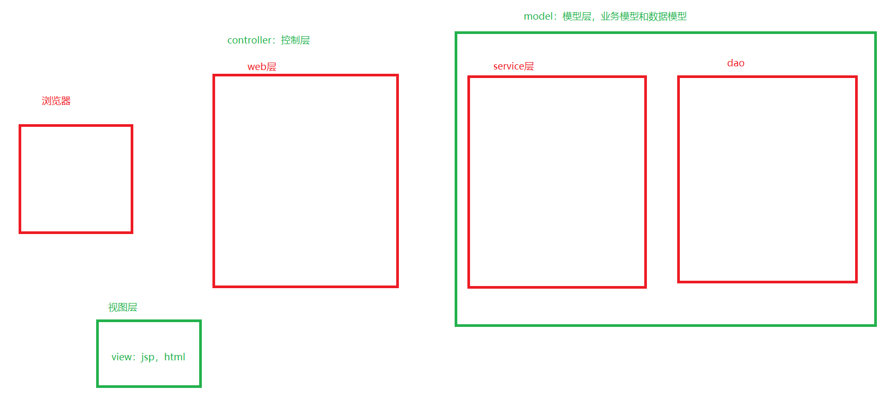


~~~
dao层我们学习了mybatis框架
service层是业务，所以没有框架能够封装
view的话：jsp，html（vue,elementui）
web层：servlet，springmvc的controller来代替servlet

springmvc主要侧重于web层的开发的
servlet的作用：
	1.接受请求，
	2.获取参数
	3.调用service
	4.给出响应
所以controller也拥有相同的功能，更加的简单。	
~~~


# 2.springmvc快速入门

~~~
步骤
1.创建web工程，引入spring-webmvc依赖，servlet依赖
2.创建springmvc的配置文件，开启注解扫描的
3.在web.xml中配置前端控制器DispatcherServlet,作用类似BaseServlet
	在dispatcherServlet中，配置springmvc配置文件的位置，用于创建springmvc容器。
4.创建一个类，添加注解@Controller,表示这是一个控制器
5.在类中创建一个方法，添加注解@RequestMapping(url)来映射路径 ，编写方法  
~~~

工程结构：

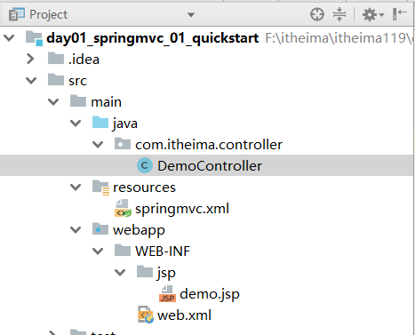

1.创建web工程，引入spring-webmvc依赖，servlet依赖

```xml
<dependencies>
    <dependency>
        <groupId>javax.servlet</groupId>
        <artifactId>javax.servlet-api</artifactId>
        <version>3.0.1</version>
        <scope>provided</scope>
    </dependency>
    <dependency>
        <groupId>org.springframework</groupId>
        <artifactId>spring-webmvc</artifactId>
        <version>5.0.6.RELEASE</version>
    </dependency>

</dependencies>
```

2.创建springmvc的配置文件，开启注解扫描的

```xml
<?xml version="1.0" encoding="UTF-8"?>
<beans xmlns="http://www.springframework.org/schema/beans"
       xmlns:xsi="http://www.w3.org/2001/XMLSchema-instance"
       xmlns:context="http://www.springframework.org/schema/context"
       xsi:schemaLocation="http://www.springframework.org/schema/beans http://www.springframework.org/schema/beans/spring-beans.xsd http://www.springframework.org/schema/context http://www.springframework.org/schema/context/spring-context.xsd">

    <!-- bean definitions here -->

    <!--开启注解扫描-->

    <context:component-scan base-package="com.itheima.controller"></context:component-scan>

</beans>
```

3.在web.xml中配置前端控制器DispatcherServlet,作用类似BaseServlet
	在dispatcherServlet中，配置springmvc配置文件的位置，用于创建springmvc容器。

```xml
<?xml version="1.0" encoding="UTF-8"?>
<web-app xmlns="http://xmlns.jcp.org/xml/ns/javaee"
         xmlns:xsi="http://www.w3.org/2001/XMLSchema-instance"
         xsi:schemaLocation="http://xmlns.jcp.org/xml/ns/javaee http://xmlns.jcp.org/xml/ns/javaee/web-app_3_1.xsd"
         version="3.1">

    <!--
        配置前端控制器DispatcherServlet,作用类似baseServlet,
        用来接收所有的请求，然后分发到具体的controller的

    -->
    <servlet>
        <servlet-name>DispatcherServlet</servlet-name>
        <servlet-class>org.springframework.web.servlet.DispatcherServlet</servlet-class>
        <!-- 配置springmvc配置文件的位置，用于创建springmvc容器-->
        <init-param>
            <param-name>contextConfigLocation</param-name>
            <param-value>classpath:springmvc.xml</param-value>
        </init-param>
        <!--
            servlet默认第一次访问的时候初始化，
            如果配置正整数，代表随着tomcat的启动而初始化
            如果正整数越小，表示启动的优先级越高。
         -->
        <load-on-startup>1</load-on-startup>
    </servlet>

    <servlet-mapping>
        <servlet-name>DispatcherServlet</servlet-name>
        <url-pattern>*.do</url-pattern>
    </servlet-mapping>

</web-app>
```

4.创建一个类，添加注解@Controller,表示这是一个控制器

5.在类中创建一个方法，添加注解@RequestMapping(url)来映射路径 ，编写方法  

```java
package com.itheima.controller;

import org.springframework.stereotype.Controller;
import org.springframework.web.bind.annotation.RequestMapping;
import org.springframework.web.servlet.ModelAndView;

@Controller // 用于controller层对象的创建
public class DemoController {

    @RequestMapping("/hello.do")
    public ModelAndView hello(){
        //model:数据      view：视图
        ModelAndView modelAndView = new ModelAndView();
        //向request域中添加数据
        modelAndView.addObject("msg","hello springmvc!!");
        modelAndView.setViewName("/WEB-INF/jsp/demo.jsp");

        return modelAndView;
    }
}
```

测试结果：浏览器访问地址 http://localhost:8080/hello.do


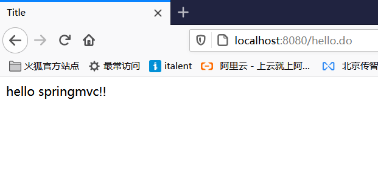

~~~
1.springmvc的配置文件配置注解扫描，因为有@Controller注解
2.在web.xml中配置DispatcherServlet,作用类似BaseServlet,并且配置springmvc配置文件的位置
~~~

# 3.springmvc的流程图

1.springmvc的初始化流程图

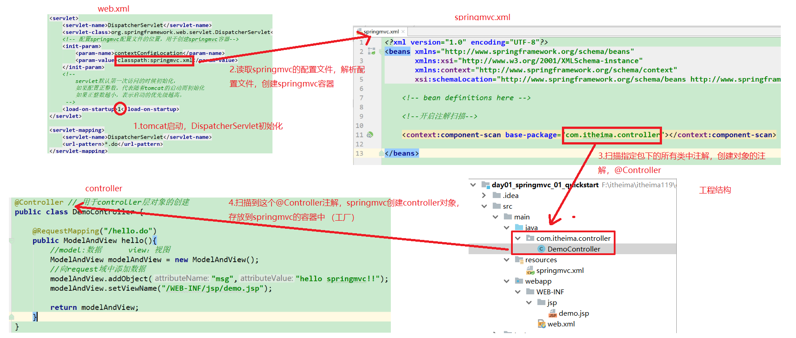


2.发送请求时，springmvc的流程图

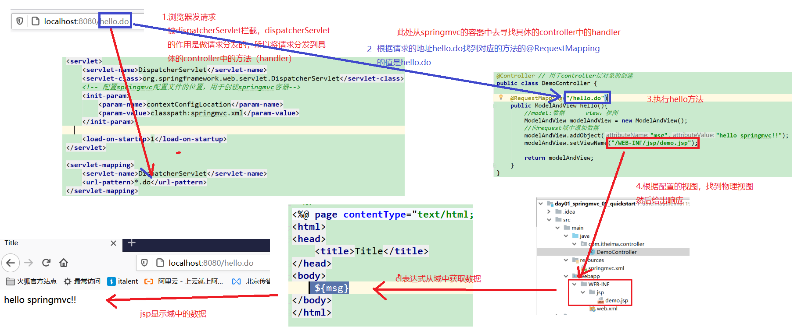

# 4.springmvc的结构图

## 4.1 springmvc的3大组件

**HandlerMapping**: 处理器映射器，作用：根据请求的地址，找到handler，springmvc中默认采用的是基于注解的RequestMappingHandlerMapping,在老版本的springmvc中，不是默认这个实现类。所以为了保障一定采用的是基于注解的handlerMapping,所以我们一般要显示的配置。

如何显示配置：

~~~
<mvc:annotaion-driven></mvc:annotaion-driven>
~~~


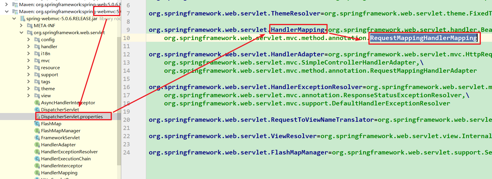

**HandlerAdapter**：处理器适配器，作用，通过一种适配器模式来调用handler。新版本中，默认使用的是RequestMappingHandlerAdapter实现类，但是在老版本的springmvc中，不是采用的基于注解开发的适配器。

所以我们一般显示的配置。

如何显示配置：

~~~
<mvc:annotaion-driven></mvc:annotaion-driven>
~~~


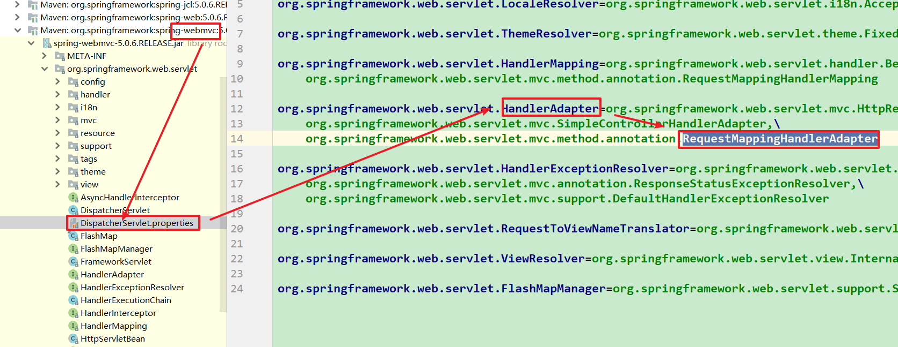


**ViewResolver**：视图解析器，将modelAndView进行解析，得到视图的物理地址和数据，然后给出响应

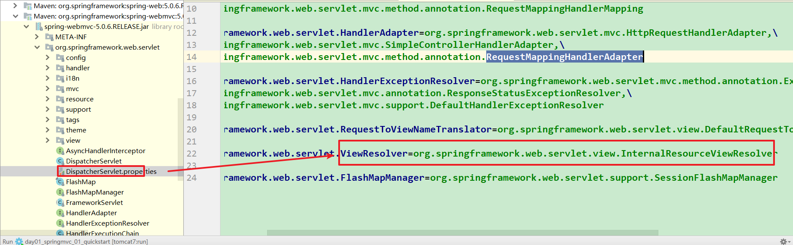


我们如果使用的是jsp视图，我们也可以显示的配置视图解析器，为了方便视图名的编写

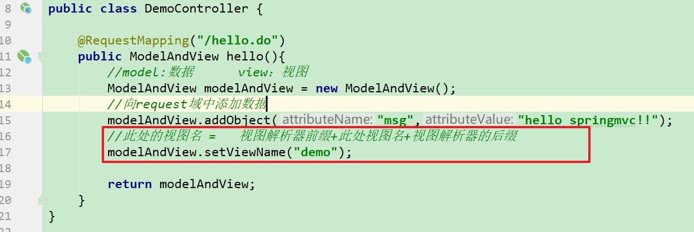

```xml
<!-- 配置视图解析器-->
<bean class="org.springframework.web.servlet.view.InternalResourceViewResolver">
    <!--  /WEB-INF/jsp/demo.jsp   有固定的前缀和固定的后缀-->
    <property name="suffix" value=".jsp"></property>
    <property name="prefix" value="/WEB-INF/jsp/"></property>
</bean>
```

## 4.2 springmvc的架构图（了解）

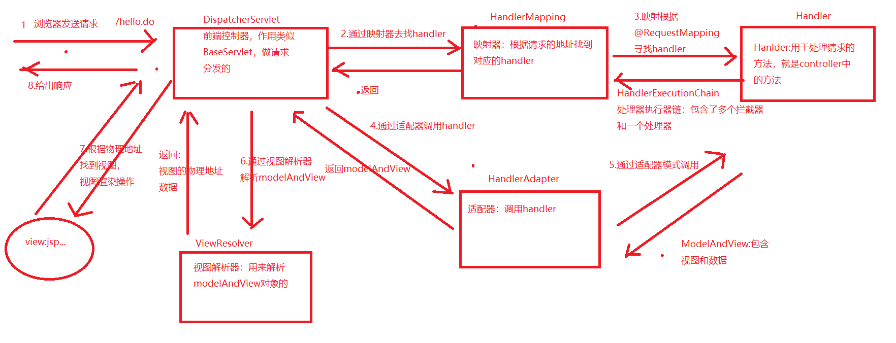


# 5.前端控制器的路径配置


```xml
<!--
    前端控制器，是用来做请求派发的，将请求派发到指定的controller中
    所有的请求都应该经过前端控制器，所以，此处的配置应该能够拦截多个请求。

    servlet的拦截路径配置：
    1.静态资源是由tomcat的web.xml中配置的缺省的servlet来处理的。
    2.所有的jsp请求是由tomcat的web.xml中配置的*.jsp拦截，然后处理jsp请求的。

    全路径  > 通配符   > 扩展名   >   / 缺省的

    1.全路径， /login
    2.扩展名  *.do     可以
    3.通配符  /*     不行，controller能执行，但是静态资源和jsp资源全部被拦截了
    4.缺省的servlet  /   可以，但是无法访问静态资源，所以需要配置释放静态资源
                     <mvc:default-servlet-handler></mvc:default-servlet-handler>

    小结：
    前端控制器的路径有2种配置方式：
    1.扩展名
    2.缺省servlet配置，但是需要配置静态资源的释放
-->
```

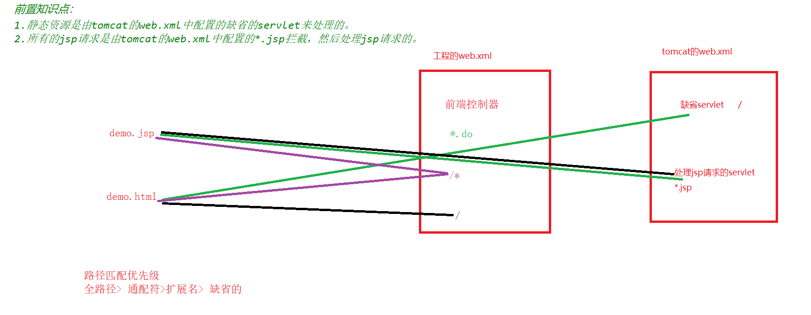

小结：

    前端控制器的路径有2种配置方式：
    1.扩展名
    2.缺省servlet配置，但是需要配置静态资源的释放
    	 <mvc:default-servlet-handler></mvc:default-servlet-handler>


# 6.springmvc的路径映射

```java
package com.itheima.controller;

import org.springframework.stereotype.Controller;
import org.springframework.web.bind.annotation.PathVariable;
import org.springframework.web.bind.annotation.RequestMapping;
import org.springframework.web.bind.annotation.RequestMethod;
import org.springframework.web.servlet.ModelAndView;

@RequestMapping("/url") //在企业开发中，一般用于分类管理url
@Controller
public class UrlController {


    /**
     *      @RequestMapping : 建立handler和url的映射关系
     *
     *      value：数组类型，用于填写映射地址的。
     *      method： 用来限定请求的方式的。值是RequestMethod枚举类型
     *      params: 限定请求的参数
     *
     *
     *      注意：
     *      1.一个路径只能映射到一个handler，一个handler可以映射到多个路径
     *      2.@RequestMapping可以用在类名上，表示父级
     *      3.动态url,路径中使用{key}进行路径的占位，表示一级路径，可以通过@PathVariable(key) 获取路径中占位的值
     *
     *      @RquestMapping的扩展注解：
     *      @GetMapping   等同于 @RequestMapping(method=RequestMethod.get)
     *      @PostMapping:  一次类推
     *      @DeleteMapping:
     *      @PutMapping:
     *
     */
    @RequestMapping({"/demo1","/demo2"})
    public ModelAndView demo1(){

        ModelAndView modelAndView = new ModelAndView();

        modelAndView.addObject("msg","demo1");

        modelAndView.setViewName("demo");

        return modelAndView;
    }

    @RequestMapping(value = "demo3",method = RequestMethod.GET)
    public ModelAndView demo3(){

        ModelAndView modelAndView = new ModelAndView();

        modelAndView.addObject("msg","限定处理get请求");

        modelAndView.setViewName("demo");

        return modelAndView;
    }

    @RequestMapping(value = "demo4",method = RequestMethod.POST)
    public ModelAndView demo4(){

        ModelAndView modelAndView = new ModelAndView();

        modelAndView.addObject("msg","限定处理post请求");

        modelAndView.setViewName("demo");

        return modelAndView;
    }

    /**
     *    params="id"  请求中必须携带id参数
     *    params="!id"  请求中不能携带id参数
     *    params="id=2"  必须携带id，并且必须等于2
     *    params="id!=2" 必须携带id，但是不能等于2
     *    params={"id","name=zhangsan"} 必须携带id，和携带name参数，并且是zhangsan
     * @return
     */
    @RequestMapping(value = "demo5",params = {"id","name=zhangsan"})
    public ModelAndView demo5(){

        ModelAndView modelAndView = new ModelAndView();

        modelAndView.addObject("msg","限定处理post请求");

        modelAndView.setViewName("demo");

        return modelAndView;
    }

    /**
     *  {key} 表示占位
     *  @PathVariable(key)  获取url中的占位的值
     */
    @RequestMapping(value = "/{id}/{name}")
    public ModelAndView demo6(@PathVariable("id") String id,@PathVariable("name") String name){

        ModelAndView modelAndView = new ModelAndView();

        modelAndView.addObject("msg","动态url:"+id+":"+name);

        modelAndView.setViewName("demo");

        return modelAndView;
    }
}
```


# 7springmvc的参数绑定

~~~
参数绑定：前端传递参数，后台如何获取
~~~

演示步骤：

1.前端传递参数

2.后台获取参数

## 7.1 默认参数绑定

```java
/*
    默认参数绑定：
    我们有一些javaweb中常用的参数，直接声明，即可使用

    HttpServletRequest request,  请求
    HttpServletResponse response, 响应
    HttpSession session  session
    Model ：数据模型
        model+string = ModelAndView
 */
@RequestMapping("/defaultParam")
public ModelAndView defaultParam(HttpServletRequest request,
                                 HttpServletResponse response,
                                 HttpSession session){

    System.out.println(request);
    System.out.println(response);
    System.out.println(session);

    ModelAndView modelAndView = new ModelAndView();

    modelAndView.addObject("msg","demo1");

    modelAndView.setViewName("demo");

    return modelAndView;
}
@RequestMapping("/defaultParam2")
public String defaultParam2(Model model){
    
    model.addAttribute("msg","model+string等同于ModelAndView写法");

    return "demo"; //string返回值，默认是视图名
}
```

小结：

~~~
1.对于handler，如果需要使用javaweb常用参数，request，response和session，直接声明即可
2. model+string返回值  来替代  ModelAndView的写法
~~~


## 7.2 基本类型的参数绑定

~~~~
1.前端表单提交数据
2.springmvc获取表单提交的数据
~~~~


form.html

```html
<!DOCTYPE html>
<html lang="en">
<head>
    <meta charset="UTF-8">
    <title>Title</title>
</head>
<body>
    <!--
        绝对路径   http://localhost:8080/虚拟项目名/param/basicParam
        绝对路径简写方法  可以省略协议，ip，端口    /虚拟项目名/param/basicParam

        相对路径： 要访问的资源相对路当前操作资源的路径
            当前操作的资源的路径  http://localhost:8080/虚拟项目名/form.html
            要访问的资源的路径    http://localhost:8080/虚拟项目名/param/basicParam
    -->
    <form action="param/basicParam">
        <table>
            <tr>
                <th>客户编号</th>
                <td><input name="custId"></td>
            </tr>
            <tr>
                <th>客户名称</th>
                <td><input name="custName"></td>
            </tr>
            <tr>
                <th>信息来源</th>
                <td><input name="custSource"></td>
            </tr>
            <tr>
                <th>所属行业</th>
                <td><input name="custIndustry"></td>
            </tr>
            <tr>
                <th>客户级别</th>
                <td><input name="custLevel"></td>
            </tr>
            <tr>
                <th>联系地址</th>
                <td><input name="custAddress"></td>
            </tr>
            <tr>
                <th>联系电话</th>
                <td><input name="custPhone"></td>
            </tr>
            <tr>
                <td colspan="2">
                    <input type="submit" value="提交"/>
                </td>
            </tr>
        </table>
    </form>
</body>
</html>
```

springmvc参数绑定

```java
/**
 *  获取请求中的参数：
 *      使用@RequstParam(表单提交参数的key) 来获取请求中的参数
 *
 *      注意：如果提交参数的key和声明的变量名一致，@RequstParam注解可以省略
 */
@RequestMapping("/basicParam")
public String basicParam(   String custId,
                            String custName,
                            String custSource,
                            String custIndustry,
                            String custLevel,
                        @RequestParam("custAddress") String custAddress,

                         Model model){

    System.out.println(custId+":"+custAddress+":"+custLevel+":"+custName);
    //将数据封装到request域中
    model.addAttribute("msg","基本类型参数绑定");

    return "demo"; //string返回值，默认是视图名
}
```


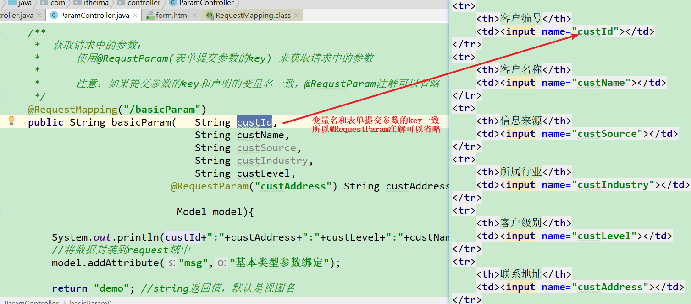

小结：

~~~
基本类型：只需要保证声明的变量名和提交参数的key一致，即可直接使用
		如果不一致，那么必须借助@RequestParam注解来获取请求中的参数
~~~


## 7.3 pojo类型

~~~
1.创建pojo类型Customer,属性和表单提交参数的key一致
2.handler直接声明Customer类型接受数据

演示时间格式问题：
1.引入日志相关
2.在form.html中放开表单相关
3.发送请求，报错，查看日志错误，时间格式造成
4.在controller通过@InitBinder来实现时间格式的处理
~~~

表单：

```html
<!DOCTYPE html>
<html lang="en">
<head>
    <meta charset="UTF-8">
    <title>Title</title>
</head>
<body>
    <!--
        绝对路径   http://localhost:8080/虚拟项目名/param/basicParam
        绝对路径简写方法  可以省略协议，ip，端口    /虚拟项目名/param/basicParam

        相对路径： 要访问的资源相对路当前操作资源的路径
            当前操作的资源的路径  http://localhost:8080/虚拟项目名/form.html
            要访问的资源的路径    http://localhost:8080/虚拟项目名/param/basicParam
    -->
    <form action="/param/pojoParam" method="post">
        <table>
            <tr>
                <th>客户编号</th>
                <td><input name="custId"></td>
            </tr>
            <tr>
                <th>客户名称</th>
                <td><input name="custName"></td>
            </tr>
            <tr>
                <th>信息来源</th>
                <td><input name="custSource"></td>
            </tr>
            <tr>
                <th>所属行业</th>
                <td><input name="custIndustry"></td>
            </tr>
            <tr>
                <th>客户级别</th>
                <td><input name="custLevel"></td>
            </tr>
            <tr>
                <th>联系地址</th>
                <td><input name="custAddress"></td>
            </tr>
            <tr>
                <th>联系电话</th>
                <td><input name="custPhone"></td>
            </tr>
            <!--<tr>-->
                <!--<th>创建时间</th>-->
                <!--<td><input name="createrTime"></td>-->
            <!--</tr>-->
            <tr>
                <td colspan="2">
                    <input type="submit" value="提交"/>
                </td>
            </tr>
        </table>
    </form>
</body>
</html>
```

Customer.java

```java
package com.itheima.pojo;

import java.util.Date;

public class Customer {

    /**
     * 属性名和表单的key一致
     */
    private String custId;
    private String custName;
    private String custSource;
    private String custIndustry;
    private String custLevel;
    private String custAddress;
    private String custPhone;

    private Date createrTime;

    public Date getCreaterTime() {
        return createrTime;
    }

    public void setCreaterTime(Date createrTime) {
        this.createrTime = createrTime;
    }

    @Override
    public String toString() {
        return "Customer{" +
                "custId='" + custId + '\'' +
                ", custName='" + custName + '\'' +
                ", custSource='" + custSource + '\'' +
                ", custIndustry='" + custIndustry + '\'' +
                ", custLevel='" + custLevel + '\'' +
                ", custAddress='" + custAddress + '\'' +
                ", custPhone='" + custPhone + '\'' +
                ", createrTime=" + createrTime +
                '}';
    }


    public String getCustId() {
        return custId;
    }

    public void setCustId(String custId) {
        this.custId = custId;
    }

    public String getCustName() {
        return custName;
    }

    public void setCustName(String custName) {
        this.custName = custName;
    }

    public String getCustSource() {
        return custSource;
    }

    public void setCustSource(String custSource) {
        this.custSource = custSource;
    }

    public String getCustIndustry() {
        return custIndustry;
    }

    public void setCustIndustry(String custIndustry) {
        this.custIndustry = custIndustry;
    }

    public String getCustLevel() {
        return custLevel;
    }

    public void setCustLevel(String custLevel) {
        this.custLevel = custLevel;
    }

    public String getCustAddress() {
        return custAddress;
    }

    public void setCustAddress(String custAddress) {
        this.custAddress = custAddress;
    }

    public String getCustPhone() {
        return custPhone;
    }

    public void setCustPhone(String custPhone) {
        this.custPhone = custPhone;
    }
}
```

handler:

```java
/**
 *  请求提交客户信息，封装到Customer对象
 *
 *  springmvc针对于pojo类型的参数，只需要保证提交参数的key和实体对象的属性名一致
 *  直接在handler中声明pojo类型即可，springmvc自动完成封装。
 */
@RequestMapping("/pojoParam")
public String pojoParam(Customer customer,Model model){

    System.out.println(customer);

    //将数据封装到request域中
    model.addAttribute("msg","pojo参数类型的绑定");

    return "demo"; //string返回值，默认是视图名
}
```


时间问题：

1.引入日志相关

依赖

```xml
<!-- 日志-->
<dependency>
    <groupId>org.slf4j</groupId>
    <artifactId>slf4j-log4j12</artifactId>
    <version>1.6.1</version>
</dependency>
```

配置： 配置文件名必须叫做  log4j.properties

```properties
log4j.appender.a=org.apache.log4j.ConsoleAppender
log4j.appender.a.Target=System.out
log4j.appender.a.layout=org.apache.log4j.PatternLayout
log4j.appender.a.layout.ConversionPattern=%-d{HH:mm:ss,SSS} [%t] [%c]-[%p] %m%n
log4j.appender.b=org.apache.log4j.FileAppender
log4j.appender.b.File=f://travel.log
log4j.appender.b.layout=org.apache.log4j.PatternLayout
log4j.appender.b.layout.ConversionPattern=%-d{yyyy-MM-dd HH:mm:ss,SSS} [%t] [%c]-[%p] %m%n
log4j.rootLogger=debug,a,b
```


2.在form.html中放开表单相关

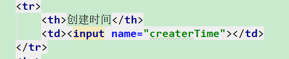

3.发送请求，报错，查看日志错误，时间格式造成

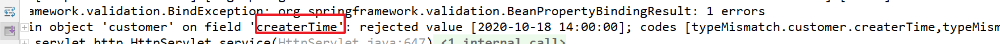


4.在controller通过@InitBinder来实现时间格式的处理

```java
/**
 * @Description 实现时间格式的处理
 */
@InitBinder
public void initBinder(WebDataBinder binder){
    SimpleDateFormat simpleDateFormat = new SimpleDateFormat("yyyy-MM-dd HH:mm:ss");
    //new CustomDateEditor(simpleDateFormat, true)的true表示是否可以传递空值
    binder.registerCustomEditor(Date.class, new CustomDateEditor(simpleDateFormat, true));
}
```

5.测试即可

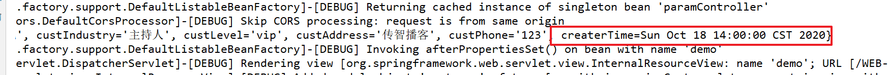


小结：

~~~xml
1.针对于pojo类型，只需要保证实体的属性名和提交参数时的key一致即可
2.针对时间复杂格式，我们需要借助@InitBinder来提供时间格式的转换
3.spring提供了乱码过滤器
	    <!-- 配置spring的乱码过滤器-->
    <filter>
        <filter-name>CharacterEncodingFilter</filter-name>
        <filter-class>org.springframework.web.filter.CharacterEncodingFilter</filter-class>
        <!-- 动态参数：编码格式-->
        <init-param>
            <param-name>encoding</param-name>
            <param-value>utf-8</param-value>
        </init-param>
    </filter>
    <filter-mapping>
        <filter-name>CharacterEncodingFilter</filter-name>
        <url-pattern>/*</url-pattern>
    </filter-mapping>
~~~


## 7.4 复合类型

~~~
1.准备表单
2.准备表单数据对应的实体
3.springmvc数据绑定
~~~

表单：

```html
<!DOCTYPE html>
<html lang="en">
<head>
    <meta charset="UTF-8">
    <title>Title</title>
</head>
<body>
    <!--
        绝对路径   http://localhost:8080/虚拟项目名/param/basicParam
        绝对路径简写方法  可以省略协议，ip，端口    /虚拟项目名/param/basicParam

        相对路径： 要访问的资源相对路当前操作资源的路径
            当前操作的资源的路径  http://localhost:8080/虚拟项目名/form.html
            要访问的资源的路径    http://localhost:8080/虚拟项目名/param/basicParam
    -->
    <form action="/param/complexPojoParam" method="post">
        <table>
            <tr>
                <th>客户编号</th>
                <td><input name="custId"></td>
            </tr>
            <tr>
                <th>客户名称</th>
                <td><input name="custName"></td>
            </tr>
            <tr>
                <th>信息来源</th>
                <td><input name="custSource"></td>
            </tr>
            <tr>
                <th>所属行业</th>
                <td><input name="custIndustry"></td>
            </tr>
            <tr>
                <th>客户级别</th>
                <td><input name="custLevel"></td>
            </tr>
            <tr>
                <th>联系地址</th>
                <td><input name="custAddress"></td>
            </tr>
            <tr>
                <th>联系电话</th>
                <td><input name="custPhone"></td>
            </tr>
            <tr>
                <th>创建时间</th>
                <td><input name="createrTime"></td>
            </tr>
        </table>
        <table >
            <tr>
                <th>毕业学校</th>
                <!--<%&#45;&#45;传递对象内对象属性时：对象属性名.对象属性&#45;&#45;%>-->
                <td><input name="customerInfo.school"></td>
            </tr>
            <tr>
                <th>学历</th>
                <td><input name="customerInfo.level"></td>
            </tr>
            <tr>
                <td colspan="2">
                    <input type="submit" value="提交"/>
                </td>
            </tr>
        </table>
    </form>
</body>
</html>
```

实体

```java
package com.itheima.pojo;

public class CustomerInfo {

    private String school;
    private String level;

    public String getSchool() {
        return school;
    }

    public void setSchool(String school) {
        this.school = school;
    }

    public String getLevel() {
        return level;
    }

    public void setLevel(String level) {
        this.level = level;
    }

    @Override
    public String toString() {
        return "CustomerInfo{" +
                "school='" + school + '\'' +
                ", level='" + level + '\'' +
                '}';
    }
}
```


```java
package com.itheima.pojo;

import java.util.Date;

public class Customer {

    /**
     * 属性名和表单的key一致
     */
    private String custId;
    private String custName;
    private String custSource;
    private String custIndustry;
    private String custLevel;
    private String custAddress;
    private String custPhone;
    private Date createrTime;


    private CustomerInfo customerInfo;

    public CustomerInfo getCustomerInfo() {
        return customerInfo;
    }

    public void setCustomerInfo(CustomerInfo customerInfo) {
        this.customerInfo = customerInfo;
    }

    public Date getCreaterTime() {
        return createrTime;
    }

    public void setCreaterTime(Date createrTime) {
        this.createrTime = createrTime;
    }

    @Override
    public String toString() {
        return "Customer{" +
                "custId='" + custId + '\'' +
                ", custName='" + custName + '\'' +
                ", custSource='" + custSource + '\'' +
                ", custIndustry='" + custIndustry + '\'' +
                ", custLevel='" + custLevel + '\'' +
                ", custAddress='" + custAddress + '\'' +
                ", custPhone='" + custPhone + '\'' +
                ", createrTime=" + createrTime +
                ", customerInfo=" + customerInfo +
                '}';
    }

    public String getCustId() {
        return custId;
    }

    public void setCustId(String custId) {
        this.custId = custId;
    }

    public String getCustName() {
        return custName;
    }

    public void setCustName(String custName) {
        this.custName = custName;
    }

    public String getCustSource() {
        return custSource;
    }

    public void setCustSource(String custSource) {
        this.custSource = custSource;
    }

    public String getCustIndustry() {
        return custIndustry;
    }

    public void setCustIndustry(String custIndustry) {
        this.custIndustry = custIndustry;
    }

    public String getCustLevel() {
        return custLevel;
    }

    public void setCustLevel(String custLevel) {
        this.custLevel = custLevel;
    }

    public String getCustAddress() {
        return custAddress;
    }

    public void setCustAddress(String custAddress) {
        this.custAddress = custAddress;
    }

    public String getCustPhone() {
        return custPhone;
    }

    public void setCustPhone(String custPhone) {
        this.custPhone = custPhone;
    }
}
```


handler

```java
@RequestMapping("/complexPojoParam")
public String complexPojoParam(Customer customer,Model model){

    System.out.println(customer);

    //将数据封装到request域中
    model.addAttribute("msg","复合类型的pojo参数类型的绑定");

    return "demo"; //string返回值，默认是视图名
}
```

测试结果：

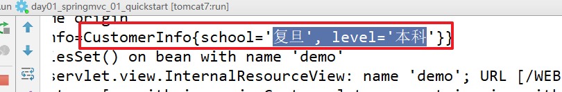

复合类型参数绑定图解：

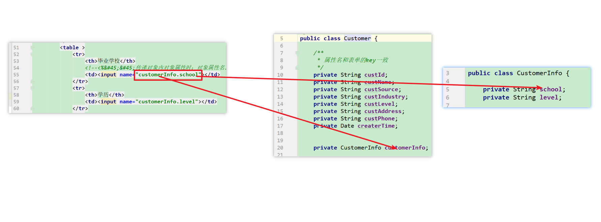

小结：

~~~
如果是复合属性绑定参数：那么前端提交参数的key的语法格式：  对象属性.属性名
~~~


## 7.5 数组类型

~~~
1.前端传递参数是数组
2.后台直接声明数组类型接受即可
~~~

前端提交数组类型的参数：

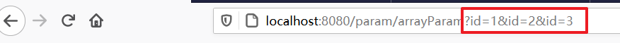


```java
@RequestMapping("/arrayParam")
public String arrayParam(String[] id,Model model){

    System.out.println(Arrays.toString(id));

    //将数据封装到request域中
    model.addAttribute("msg","复合类型的pojo参数类型的绑定");

    return "demo"; //string返回值，默认是视图名
}
```


测试结果：

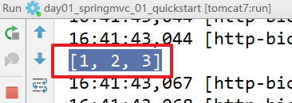


小结：

~~~
针对于前端提交的基本类型的数组格式，hanlder直接声明数组类型的变量即可，变量名和提交参数的key一致。
~~~


## 7.6集合类型（了解）


~~~
1.前端提交多个对象类型的参数，例如提交2个客户信息
2.声明一个包装类，将集合类型作为包装类的属性
3.前端提交参数的格式   集合属性名[index].对象属性名
~~~

表单：

```html
<!DOCTYPE html>
<html lang="en">
<head>
    <meta charset="UTF-8">
    <title>Title</title>
</head>
<body>
<form method="post" action="param/listParam">
    <table cellpadding="0" cellspacing="0" width="80%">
        <tr>
            <td>
                <input type="submit" value="提交">
            </td>
        </tr>
    </table>
    <table cellpadding="0" cellspacing="0" width="80%" border="1px">
        <tr>
            <th>公司名称</th>
            <th>信息来源</th>
            <th>所属行业</th>
            <th>级别</th>
            <th>联系地址</th>
            <th>联系电话</th>
        </tr>
        <tr>
            <td><input name="list[0].custName"></td>
            <td><input name="list[0].custSource"></td>
            <td><input name="list[0].custIndustry"></td>
            <td><input name="list[0].custLevel"></td>
            <td><input name="list[0].custAddress"></td>
            <td><input name="list[0].custPhone"></td>
        </tr>
        <tr>
            <td><input name="list[1].custName"></td>
            <td><input name="list[1].custSource"></td>
            <td><input name="list[1].custIndustry"></td>
            <td><input name="list[1].custLevel"></td>
            <td><input name="list[1].custAddress"></td>
            <td><input name="list[1].custPhone"></td>
        </tr>
        <tr>
            <td><input name="list[2].custName"></td>
            <td><input name="list[2].custSource"></td>
            <td><input name="list[2].custIndustry"></td>
            <td><input name="list[2].custLevel"></td>
            <td><input name="list[2].custAddress"></td>
            <td><input name="list[2].custPhone"></td>
        </tr>
    </table>
</form>
</body>
</html>
```

包装类：

```java
package com.itheima.pojo;

import java.util.List;

public class CustomerVo {

    private List<Customer> list;

    public List<Customer> getList() {
        return list;
    }

    public void setList(List<Customer> list) {
        this.list = list;
    }
}
```


handler

```java
@RequestMapping("/listParam")
public String listParam(CustomerVo customerVo, Model model){

    for(Customer customer:customerVo.getList()){
        System.out.println(customer);
    }

    //将数据封装到request域中
    model.addAttribute("msg","list类型的绑定");

    return "demo"; //string返回值，默认是视图名
}
```


绑定原理：

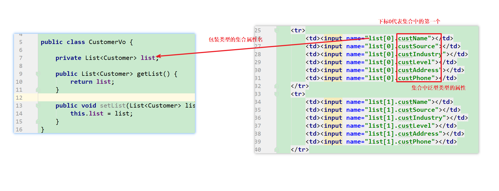


## 7.7 前端传递json类型的数据

~~~
vue的post请求，默认传递的是json格式的数据

步骤：
1.前端vue发出post的ajax请求，提交客户信息
2.后台springmvc获取请求中的json数据
~~~

前端发送vue的postajax请求

```html
<!DOCTYPE html>
<html lang="en">
<head>
    <meta charset="UTF-8">
    <title>Title</title>
</head>
<body>
    <div id="mydiv"></div>
</body>
<script src="vue/vue.js"></script>
<script src="axios/axios-0.18.0.js" ></script>
<script>

    new Vue({
        el:"#mydiv",
        data:{
            customer:{
                custName:"张三",
                custSource:"bank",
                custLevel:"vip",
                custPhone:"123123123"
            }
        },
        created:function () {

            //ajax请求
            axios.post("param/jsonParam",this.customer)
                .then(response=>{

            })
        }
    });

</script>
</html>
```

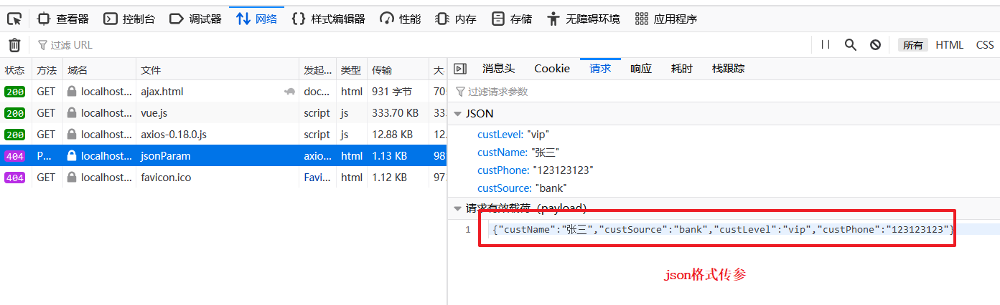


handler:

```java
/**
 * @RequestBody : 将请求中的json格式封装成实体类型
 */
@RequestMapping("/jsonParam")
public String jsonParam(@RequestBody Customer customer, Model model){


    System.out.println(customer);

    //将数据封装到request域中
    model.addAttribute("msg","list类型的绑定");

    return "demo"; //string返回值，默认是视图名
}
```


小结;

~~~
1.@RequestBody : 将请求中的json格式封装成实体类型
2.springmvc解析json，需要配置 <mvc:annotation-driven></mvc:annotation-driven>
3.springmvc默认采用的是jackson的解析方式，所以要引入jackson依赖
~~~


# 8.总结

~~~
1.springmvc的入门
2.3大组件
	HandlerMapping: 映射器，根据地址找handler
	HandlerAdapter: 适配器,执行handler
	ViewResolver: 视图解析器
3.前端控制器的路径配置：
	a. 扩展名配置
	b. 缺省的路径配置，释放静态资源
4.springmvc的路径映射：
	@RequestMapping: 
		value是一个数组，支持多路径配置
		method:用于限定请求的方式
		params：用于限定请求的参数
	1.一个路径只能映射到一个handler，一个handler可以映射到多个路径
    2.@RequestMapping可以用在类名上，表示父级
    3.动态url,路径中使用{key}进行路径的占位，表示一级路径，可以通过@PathVariable(key) 获取路径中占位的值

5.参数绑定：
	1.handler中如果需要使用java中常用参数，直接声明即可
	2.基本类型， hanler中变量名和提交参数的key一致，即可接受
		如果不一致：@RequstParam
	3.pojo类型，实体属性名和提交参数的key一致即可
    4.复合类型：  前端提交参数的格式   对象属性.属性
    5.数组：直接声明
    6.集合的pojo，使用集合包装类，并且前端   集合属性名[index].属性名
    7.前端传递json，后台@RequestBody 进行json解析。
~~~

