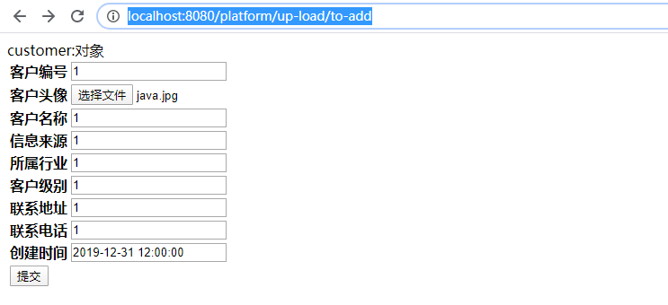
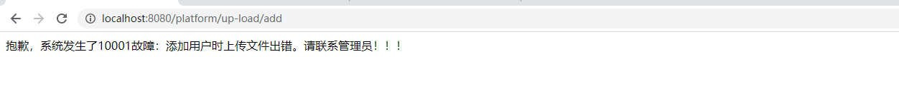

## Springmvc-day02

## 目录

[TOC]

## 学习目标

```
1、重点掌握springmvc返回类型
2、掌握restful的风格
3、掌握springmvc文件上传
4、理解springmvc的异常处理方式
5、重点掌握springmvc的拦截器、拦截器链
```

## 第一章 SpringMVC返回类型【重点】

昨天的课中我们讲述了spring的参数绑定，那么springMVC的返回类型有那些呢？下面我们讲述sprinMVC的返回类型

```properties
#1、void: 
	使用方法的参数requesr的转发和response重定向进行数据传输和页面跳转 
#2、ModelAndView:
	以前前后端不分的情况下，ModelAndView 应该是最最常见的返回值类型了，现在前后端分离后，后端都是以返回 JSON 数据为主了。后端返回 ModelAndView 这个比较容易理解，开发者可以在 ModelAndView 对象中指定视图名称，然后也可以绑定数据，然后返回给页面
#3、String字符串：
	3.1 逻辑视图名:返回 String 最常见的是逻辑视图名，这种时候一般利用默认的参数 Model 来传递数据
	3.2 forward转发:等价于HttpServletRequest转发
	3.3 redirect重定向:等价于HttpServletResponse重定向
#4、json
	目前大多系统都是前后端分离的，也就是说我们只要提供标准的数据格式，给前端访问，而这个标准的数据格式的大家大多使用JSON格式
	

```

拷贝springmvc-day01-03argument新建springmvc-day02-01return-type项目


新增succeed.jsp页面用于接收信息

```
<%@ page contentType="text/html;charset=UTF-8" language="java" %>
<html>
<head>
    <title>springmvc入门案例页面</title>
</head>
<body>
${content}用法！
</body>
</html>
```


### 1、void

没有返回？什么情况？大家不要急，虽然方法无返回，但是我们可以

```properties
HttpServletRequest转发、

HttpServletResponse重定向、

HttpServletResponse直接响应内容等方式达到与前段JSP的数据通讯
```


#### 【1】HttpServletRequest转发

新增VoidTypeController

```java
package com.itheima.project;

import org.springframework.stereotype.Controller;
import org.springframework.web.bind.annotation.RequestMapping;
import org.springframework.web.bind.annotation.RequestParam;

import javax.servlet.ServletException;
import javax.servlet.http.HttpServletRequest;
import javax.servlet.http.HttpServletResponse;
import java.io.IOException;

/**
 * @Description：springmvc的void的参数返回
 */
@Controller
@RequestMapping(value = "void-type")
public class VoidTypeController {

    /**
     * @Description 通过request的转发来访问指定页面
     * 范围：项目内使用
     * 请求次数：1次
     * 可以传递值
     */
    @RequestMapping(value = "request-forward")
    public void requestForward(HttpServletRequest request, HttpServletResponse response){
        try {
            request.setAttribute("content", "request-forward");
            request.getRequestDispatcher("/WEB-INF/views/succeed.jsp")
                    .forward(request, response);
        } catch (ServletException e) {
            e.printStackTrace();
        } catch (IOException e) {
            e.printStackTrace();
        }
    }
}

```

访问： http://localhost:8080/platform/void-type/request-forward 


#### 【2】HttpServletRequest重定向

修改VoidTypeController

```java
package com.itheima.project;

import org.springframework.stereotype.Controller;
import org.springframework.web.bind.annotation.RequestMapping;
import org.springframework.web.bind.annotation.RequestParam;

import javax.servlet.ServletException;
import javax.servlet.http.HttpServletRequest;
import javax.servlet.http.HttpServletResponse;
import java.io.IOException;

/**
 * @Description：springmvc的void的参数返回
 */
@Controller
@RequestMapping(value = "void-type")
public class VoidTypeController {

    /**
     * @Description 通过request的转发来访问指定页面
     * 范围：项目内使用
     * 请求次数：1次
     * 可以传递值
     */
    @RequestMapping(value = "request-forward")
    public void requestForward(HttpServletRequest request, HttpServletResponse response){
        try {
            request.setAttribute("content", "request-forward");
            request.getRequestDispatcher("/WEB-INF/views/succeed.jsp")
                    .forward(request, response);
        } catch (ServletException e) {
            e.printStackTrace();
        } catch (IOException e) {
            e.printStackTrace();
        }
    }

    /**
     * @Description 通过response的重定向访问其他路径
     * 范围：项目内重定向、可以访问其他项目
     * 请求次数：2次
     * 2次请求中无法传递值
     */
    @RequestMapping(value = "response-redirect")
    public void responseRedirect(HttpServletRequest request,HttpServletResponse response){
        try {
            response.sendRedirect("request-forward");
           // response.sendRedirect("http://www.baidu.com");
        } catch (IOException e) {
            e.printStackTrace();
        }
    }
}

```

访问 http://localhost:8080/platform/void-type/response-redirect 

浏览器地址发生变化


#### 【3】HttpServletResponse响应内容

修改VoidTypeController

```java
   package com.itheima.project;

import org.springframework.stereotype.Controller;
import org.springframework.web.bind.annotation.RequestMapping;
import org.springframework.web.bind.annotation.RequestParam;

import javax.servlet.ServletException;
import javax.servlet.http.HttpServletRequest;
import javax.servlet.http.HttpServletResponse;
import java.io.IOException;

/**
 * @Description：springmvc的void的参数返回
 */
@Controller
@RequestMapping(value = "void-type")
public class VoidTypeController {

    /**
     * @Description 通过request的转发来访问指定页面
     * 范围：项目内使用
     * 请求次数：1次
     * 可以传递值
     */
    @RequestMapping(value = "request-forward")
    public void requestForward(HttpServletRequest request, HttpServletResponse response){
        try {
            request.setAttribute("content", "request-forward");
            request.getRequestDispatcher("/WEB-INF/views/succeed.jsp")
                    .forward(request, response);
        } catch (ServletException e) {
            e.printStackTrace();
        } catch (IOException e) {
            e.printStackTrace();
        }
    }

    /**
     * @Description 通过response的重定向访问其他路径
     * 范围：项目内重定向、可以访问其他项目
     * 请求次数：2次
     * 2次请求中无法传递值
     */
    @RequestMapping(value = "response-redirect")
    public void responseRedirect(HttpServletRequest request,HttpServletResponse response){
        try {
//            response.sendRedirect("request-forward");
            response.sendRedirect("http://www.baidu.com");
        } catch (IOException e) {
            e.printStackTrace();
        }

    }

    /**
     * @Description 直接输出字符串在页面
     */
    @RequestMapping(value = "response-return")
    public void responseReturn(HttpServletResponse response){
        response.setContentType("application/json;charset =utf-8");
        String flag = "{\"id\":1,\"name\":\"小明\"}";
        try {
            response.getWriter().write(flag);
        } catch (IOException e) {
            e.printStackTrace();
        }
    }

}

```

访问： http://localhost:8080/platform/void-type/response-return 


### 2、ModelAndView

#### 【1】基本用法

前面的request和response的访问方式是我们在javaweb阶段就掌握的方式，在springMVC中我也可以使用ModelAndview返回页面，从名字我们就可以看出他使用默认支持类model传递数据，然后构建一个view视图返回

新增ModelAndViewTypeController

```java
package com.itheima.project;

import org.springframework.stereotype.Controller;
import org.springframework.ui.Model;
import org.springframework.web.bind.annotation.RequestMapping;
import org.springframework.web.servlet.ModelAndView;

/**
 * @Description：ModelAndView返回类型
 */
@Controller
@RequestMapping(value = "model-view-type")
public class ModelAndViewTypeController {

    /**
     * @Description ModelAndView返回类型
     * 使用默认类型model传递数据
     * 构建视图之后指定视图目标路径跳转 
     */
    @RequestMapping
    public ModelAndView defaultMethod(Model model){
        ModelAndView modelAndView = new ModelAndView();
        model.addAttribute("content", "ModelAndViewType");
        modelAndView.setViewName("/WEB-INF/views/succeed.jsp");
        return modelAndView;
    }
}

```

访问 http://localhost:8080/platform/model-view-type 


#### 【2】优化用法


视图的解析父路径和后缀类型都是一样的，每次这样写，是不是太累赘了？？

配置springMVC的internalResourSlover,修改spring-mvc.xml

```xml
<?xml version="1.0" encoding="UTF-8"?>
<beans xmlns="http://www.springframework.org/schema/beans"
       xmlns:xsi="http://www.w3.org/2001/XMLSchema-instance"
       xmlns:centext="http://www.springframework.org/schema/context"
       xmlns:mvc="http://www.springframework.org/schema/mvc"
       xsi:schemaLocation="http://www.springframework.org/schema/beans
        http://www.springframework.org/schema/beans/spring-beans.xsd
        http://www.springframework.org/schema/context
        http://www.springframework.org/schema/context/spring-context.xsd
        http://www.springframework.org/schema/mvc
        http://www.springframework.org/schema/mvc/spring-mvc.xsd
        ">
        <!--自动扫描管理controller的beans-->
        <centext:component-scan base-package="com.itheima"/>
        <!--使用注解配置-->
        <mvc:annotation-driven/>

        <!--视图解析器配置
        prefix：指定父解析路径
        suffix：指定后组名
            -->
        <bean class="org.springframework.web.servlet.view.InternalResourceViewResolver">
                <property name="prefix" value="/WEB-INF/views/"/>
                <property name="suffix" value=".jsp"/>
        </bean>

</beans>
```

修改ModelAndViewTypeController

```java
package com.itheima.project;

import org.springframework.stereotype.Controller;
import org.springframework.ui.Model;
import org.springframework.web.bind.annotation.RequestMapping;
import org.springframework.web.servlet.ModelAndView;

/**
 * @Description：ModelAndView返回类型
 */
@Controller
@RequestMapping(value = "model-view-type")
public class ModelAndViewTypeController {

    /**
     * @Description ModelAndView返回类型
     * 使用默认类型model传递数据
     * 构建视图之后指定视图目标路径跳转
     */
    @RequestMapping
    public ModelAndView defaultMethod(Model model){
        ModelAndView modelAndView = new ModelAndView();
        model.addAttribute("content", "ModelAndViewType");
        modelAndView.setViewName("succeed");
        return modelAndView;
    }
}


```

访问 http://localhost:8080/platform/model-view-type 


### 3、String字符串（逻辑视图名）

SpringMVC在默认情况下返回字符返回的是逻辑视图名称，也就是我们之前使用的modelAndView.setViewName("succeed")，他也是使用默认支持类model传递数据

#### 【1】返回逻辑视图名

新增StringTypeController

```java
package com.itheima.project;

import org.springframework.stereotype.Controller;
import org.springframework.ui.Model;
import org.springframework.ui.ModelMap;
import org.springframework.web.bind.annotation.RequestMapping;

/**
 * @Description：字符串返回
 */
@Controller
@RequestMapping(value = "string-type")
public class StringTypeController {

    /**
     * @Description 默认情况下的如果返回字符串
     * 会从InternalResourceResolver中配置的父路径找对应的jsp页面
     */
    @RequestMapping(value = "default-method")
    public String defaultMethod(Model model){
        model.addAttribute("content", "string-type");
        return "succeed";
    }
}

```

访问 http://localhost:8080/platform/string-type/default-method 


#### 【2】forward转发

修改StringTypeController

```java
package com.itheima.project;

import org.springframework.stereotype.Controller;
import org.springframework.ui.Model;
import org.springframework.ui.ModelMap;
import org.springframework.web.bind.annotation.RequestMapping;

/**
 * @Description：字符串返回
 */
@Controller
@RequestMapping(value = "string-type")
public class StringTypeController {

    /**
     * @Description 默认情况下的如果返回字符串
     * 会从InternalResourceResolver中配置的父路径找对应的jsp页面
     */
    @RequestMapping(value = "default-method")
    public String defaultMethod(Model model){
        model.addAttribute("content", "string-type");
        return "succeed";
    }

    /**
     * @Description 如果返回forward:+内部请求路径则执行转发操作
     * 格式：forward:+内部请求路径(/类上路径+/方法路径)
     */
    @RequestMapping(value = "forward")
    public String forward(){
        return "forward:/void-type/response-return";
    }
}


```


#### 【3】redirect重定向

修改StringTypeController

```java
package com.itheima.project;

import org.springframework.stereotype.Controller;
import org.springframework.ui.Model;
import org.springframework.ui.ModelMap;
import org.springframework.web.bind.annotation.RequestMapping;

/**
 * @Description：字符串返回
 */
@Controller
@RequestMapping(value = "string-type")
public class StringTypeController {

    /**
     * @Description 默认情况下的如果返回字符串
     * 会从InternalResourceResolver中配置的父路径找对应的jsp页面
     */
    @RequestMapping(value = "default-method")
    public String defaultMethod(Model model){
        model.addAttribute("content", "string-type");
        return "succeed";
    }

    /**
     * @Description 如果返回forward:+内部请求路径则执行转发操作
     * 格式：forward:+内部请求路径(/类上路径+/方法路径)
     */
    @RequestMapping(value = "forward")
    public String forward(){
        return "forward:/void-type/response-return";
    }

    /**
     * @Description 如果返回redirect:+请求路径则执行重定向操作
     * 格式：redirect:+请求路径（可以是外部系统的）
     */
    @RequestMapping(value = "redirect")
    public String redirect(){
        return "redirect:http://www.baidu.com";
    }
}


```

访问 http://localhost:8080/platform/string-type/redirect 直接调到百度

### 4、Json字符串

目前大多系统都是前后端分离的，也就是说我们只要提供标准的数据格式，给前端访问，而这个标准的数据格式的大家大多使用JSON格式

#### 【1】常用注解

| 注解            | 说明                                                         |
| --------------- | ------------------------------------------------------------ |
| @RestController | 注释在类上，生命一个bean，且表示此类中返回类型都是json（@Controller+@ResponseBody） |
| @ResponseBody   | 注解在方法上，表示此方法返回类型为json                       |

#### 【2】案例

【2.1】spring-mvc.xml

springmvc框架，默认使用HttpMessageConverter消息转换器，进行json格式数据转换,在配置使用

< mvc:annotation-driven/ >配置处理器映射器和处理器适配器的时候，默认支持Jackson的数据转换，所以这里

spring-mvc.xml不需要做额外的配合

【2.2】pom.xml支持

这里我们只需要添加jackson的maven依赖即可

```xml
<!--jackson版本-->
<jackson.version>2.9.0</jackson.version>

 <!--jackson依赖包-->
<dependency>
    <groupId>com.fasterxml.jackson.core</groupId>
    <artifactId>jackson-core</artifactId>
    <version>${jackson.version}</version>
</dependency>
<dependency>
    <groupId>com.fasterxml.jackson.core</groupId>
    <artifactId>jackson-databind</artifactId>
    <version>${jackson.version}</version>
</dependency>
<dependency>
    <groupId>com.fasterxml.jackson.core</groupId>
    <artifactId>jackson-annotations</artifactId>
    <version>${jackson.version}</version>
</dependency>
```

【2.3】实现

新增JsonTypeController

```java
package com.itheima.project;

import com.itheima.project.pojo.Customer;
import org.springframework.stereotype.Controller;
import org.springframework.web.bind.annotation.RequestMapping;
import org.springframework.web.bind.annotation.ResponseBody;

import java.util.Date;

/**
 * @Description：
 */
@RequestMapping("json-type")
@Controller
public class JsonTypeController {

    @RequestMapping
    @ResponseBody
    public Customer defaultMethod(){
        Customer customer = new Customer();
        customer.setCustId(1001);
        customer.setCustName("小王");
        customer.setCustLevel("普通客户");
        customer.setCustPhone("15156400000");
        customer.setCustAddress("上海");
        customer.setCreaterTime(new Date());
        customer.setCustIndustry("IT");
        customer.setCustSource("黑马");
        return customer;
    }
}

```

访问 http://localhost:8080/platform/json-type 


修改

```java
package com.itheima.project;

import com.itheima.project.pojo.Customer;
import org.springframework.stereotype.Controller;
import org.springframework.web.bind.annotation.RequestMapping;
import org.springframework.web.bind.annotation.ResponseBody;
import org.springframework.web.bind.annotation.RestController;

import java.util.Date;

/**
 * @Description：json格式
 */
@RequestMapping("json-type")
//@Controller
@RestController
public class JsonTypeController {

    /**
     * @Description 返回json格式
     * @ResponseBody 声明返回格式
     */
    @RequestMapping
//    @ResponseBody
    public Customer defaultMethod(){
        Customer customer = new Customer();
        customer.setCustId(1001);
        customer.setCustName("小王");
        customer.setCustLevel("普通客户");
        customer.setCustPhone("15156400000");
        customer.setCustAddress("上海");
        customer.setCreaterTime(new Date());
        customer.setCustIndustry("IT");
        customer.setCustSource("黑马");
        return customer;
    }
}

```

访问 http://localhost:8080/platform/json-type 


## 第二章 SpringMVC的Restful支持【理解】

### 1、什么是Restful风格

​		REST，即Representational State Transfer的缩写。直接翻译的意思是"表现层状态转化"。 

​		Restful风格 就是一种面向资源服务的API设计方式，它是规范，是标准， 只是提供了一组设计原则和约束条件 .使用URL定位资源，用HTTP动词（GET,POST,DELETE,PATCH）描述操作 ,要理解他，咱们先来搞清楚Restful的规范

```properties
1、强调HTTP应当以资源为中心，并且规范了资源URI的风格；
2、规范了HTTP请求动作（GET、POST、DELETE、PUT、PATCH等）的使用，具有对应的语义
```

 		RESTful的关键是定义：可表示流程元素=>资源的对象。

​		在REST中，每一个对象都是通过URL来表示的，对象用户负责将状态信息打包进每一条消息内，以使得对象的处理总是无状态的。 

​		对象资源：customer

​		请求方式：不同

​		处理方式：不同

/customer/{userId}+PUT==>用户修改

/customer/{userId}/{sendUserId}+PUT===>用户修改还要发邮件

例如：

| 路径        | 请求方式 | 描述                       | 原始                   |
| ----------- | -------- | -------------------------- | ---------------------- |
| /customer   | GET      | 获得用户列表               | /findCustomerAll       |
| /customer   | POST     | 创建用户                   | /saveCustomer          |
| /customer/1 | DELETE   | 删除id=1的用户信息         | /deleteCustomrById     |
| /customer/1 | PUT      | 修改id=1的用户信息整体信息 | /updateCustomerByIdAll |
| /customer/1 | PATCH    | 修改id=1的用户信息部分信息 | /updateCustomerById    |
| /customer/1 | GET      | 查询id=1的用户信息部分信息 | /findCustomerById      |

### 2、Restful的入门案例

Springmvc对restful的支持主要是设置@RequestMapping的method 属性

#### 【1】目标

```
1、使用restful的设计思想，设计用户的增删改查
2、理解请求GET、POST、DELETE、PUT、PATCH
```

#### 【2】案例

##### 【2.1】创建项目

​	拷贝springmvc-day02-01return-type新建springmvc-day02-02restful


##### 【2.2】编写RestfulController

然后编写RestfulController

```java
package com.itheima.project;

import com.itheima.project.pojo.Customer;
import org.springframework.web.bind.annotation.*;

import java.util.ArrayList;
import java.util.Date;
import java.util.List;

/**
 * @Description：Restful实例
 */
@RestController
@RequestMapping("restful")
public class RestfulController {

    /**
     * @Description 使用get方式访问/restful/customer
     */
    @RequestMapping(value = "customer",method = RequestMethod.GET)
    public List<Customer> findAll(){
        List list = new ArrayList();
        for (int i = 0; i < 5; i++) {
            Customer customer = new Customer();
            customer.setCustId(i);
            customer.setCustName("小王"+i);
            customer.setCustLevel("普通客户"+i);
            customer.setCustPhone("15156400000"+i);
            customer.setCustAddress("上海"+i);
            customer.setCreaterTime(new Date());
            customer.setCustIndustry("IT"+i);
            customer.setCustSource("黑马"+i);
            list.add(customer);
        }
        return list;
    }

    /**
     * @Description 使用post方式访问/restful/customer
     */
    @RequestMapping(value = "customer",method = RequestMethod.POST)
    public Boolean addCustomer(@RequestBody Customer customer){
        System.out.println("添加的用户信息："+customer.toString());
        return  Boolean.TRUE;
    }

    /**
     * @Description 使用delete方式访问/restful/customer/1
     */
    @RequestMapping(value = "customer/{customerId}",method = RequestMethod.DELETE)
    public Boolean deleteCustomer(@PathVariable("customerId") String id){
        System.out.println("删除用户信息："+id);
        return Boolean.TRUE;
    }
    
    //        @RequestMapping(value = "customer/{id}",method = RequestMethod.PUT)
    @PutMapping(value = "customer/{id}")
    public Boolean putCustomer(@PathVariable("id")String id){
        System.out.println("全量更新");
        return Boolean.TRUE;
    }

    /**
     * @Description 使用PATCH方式访问/restful/customer/1
     */
    @RequestMapping(value = "customer/{customerId}",method = RequestMethod.PATCH)
    public Boolean patchCustomer(@PathVariable("customerId") String id){
        System.out.println("后续部分更新");
        return Boolean.TRUE;
    }

    /**
     * @Description 使用get方式访问/restful/customer/1
     */
    @RequestMapping(value = "customer/{customerId}",method = RequestMethod.GET)
    public Customer findCustomerById(@PathVariable("customerId") String id){
        Customer customer = new Customer();
        customer.setCustId(1);
        customer.setCustName("小王"+1);
        customer.setCustLevel("普通客户"+1);
        customer.setCustPhone("15156400000"+1);
        customer.setCustAddress("上海"+1);
        customer.setCreaterTime(new Date());
        customer.setCustIndustry("IT"+1);
        customer.setCustSource("黑马"+1);
        return customer;
    }
}


```

##### 【2.3】使用postman测试

(1) 以GET方式访问 http://localhost:8080/platform/restful/customer 


(2)以POST方式访问 http://localhost:8080/platform/restful/customer 

配置 Content-Type 类型为 application/json 


```json
{
    "custId": 1,
    "custName": "小王1",
    "custSource": "黑马1",
    "custIndustry": "IT1",
    "custLevel": "普通客户1",
    "custAddress": "上海1",
    "custPhone": "151564000001",
    "createrTime": 1576832174039
}

```


(3)以DELETE方式访问 http://localhost:8080/platform/restful/customer/1 


(4)以PUT方式访问 http://localhost:8080/platform/restful/customer/1


(5)以PATCH方式访问 http://localhost:8080/platform/restful/customer/1


(6)以GET方式访问 http://localhost:8080/platform/restful/customer/1


#### 【3】小结

```properties
1、restful以资源为中心，去设计系统
2、访问方式不同，路由的方法不同
3、springMVC对restful的支持只要是设置@RequestMapping的method属性,使用子注解
```


## 第三章 SpringMVC文件上传【重点】

### 1、文件上传回顾

#### 【1】文件上传前提

- form表单的“method”属性设置为”post“方式

- form表单的“enctype”属性设置为“multipart/form-data”，默认是“x-www-form-urlencoded”
- form表单中只要需要一个<input type="file">的文本选择域

#### 【2】文件上传分析

​	form表单为默认是“x-www-form-urlencoded”的时候，大多是字符串的方式传递，数据提交到后台之后,数据使用key==>value的方式存储，可以使用request.getParameter()取得

​	form表单为“multipart/form-data”的时候，实际就是二进制流的传输，后台就不能使用普通的string或者简单的pojo对象接受，我们在spring中使用MultipartFile类去接收参数

### 2、搭建图片服务器

#### 【1】图片服务器的意义

在javaWEB阶段同学应该都做过文件上传，我们会把文件上传到项目目录中，访问的时候也是的访问项目的相对目录去加载文件,这样有会有什么样的问题呢？

```properties
集群环境下，相同的项目的会部署在多台服务器中，例如：现在有A,B,C三台服务器，用户第一次通过nginx访问的A服务器，上传了文件，第二次通nginx访问的B服务，这时候去下载之前上传的文件，在B服务器上没有，那就会访问失败。
```


这里我们就需要一个集中提供存放文件，及提供下载和访问文件的服务器，


他的意义在于：

```properties
1、提供统一的文件服务
2、实现业务与非业务功能的分离
3、降低业务服务器的压力
```

#### 【2】基于tomcat搭建文件服务器

##### 【2.1】准备工作

 随便找个盘，新建一个空白文件夹，然后复制几个文件过来，最好是视频图片文字都有。我的是F:\file-service


##### 【2.2】配置tomcat

在tomcat的安装目录中找到conf文件


打开conf找到service.xml


编辑service.xml

在Host节点下配置<Context path="/file-service" docBase="F:\file-service"/>以下为部分代码

```xml
.....      
<Host name="localhost"  appBase="webapps"
      unpackWARs="true" autoDeploy="true">
    <!--设置图片服务器映射路径-->
    <Context path="/file-service" docBase="F:\file-service"/>
    <Valve className="org.apache.catalina.valves.AccessLogValve" directory="logs"
           prefix="localhost_access_log" suffix=".txt"
           pattern="%h %l %u %t &quot;%r&quot; %s %b" />
</Host>
.....
```

在Service节点下找到protocol="HTTP/1.1"的Connector节点，设置访问端口，以下为部分代码

```xml
<Connector port="80" protocol="HTTP/1.1"
               connectionTimeout="20000"
               redirectPort="8443" />
```

启动tomcat


##### 【2.3】访问测试

访问 http://127.0.0.1/file-service/java.jpg 


### 3、SpringMVC文件上传案例

#### 【1】需求

```
1、添加用户的时候，上传用户头像
2、在用户列表展示用户头像
```

#### 【2】实现

```
实现步骤：
1、创建项目
2、导入项目依赖
3、配置CommonsMultipartResolver
4、编写上传service
5、编写controller业务
6、编辑页面
```

##### 【2.1】创建项目

新建项目springmvc-day02-03upload


pojo对象定义

```java
package com.itheima.project.pojo;

import java.util.Date;

/**
 * @Description：用户实体类
 */
public class Customer {

    //客户编号(主键)
    private Integer custId;

    //客户名称(公司名称)
    private String custName;

    //客户信息来源
    private String custSource;

    //客户所属行业
    private String custIndustry;

    //客户级别
    private String custLevel;

    //客户联系地址
    private String custAddress;

    //客户联系电话
    private String custPhone;

    //创建时间
    private Date createrTime;

    //附件信息
    private FileObject fileObject;

    public Integer getCustId() {
        return custId;
    }

    public void setCustId(Integer custId) {
        this.custId = custId;
    }

    public String getCustName() {
        return custName;
    }

    public void setCustName(String custName) {
        this.custName = custName;
    }

    public String getCustSource() {
        return custSource;
    }

    public void setCustSource(String custSource) {
        this.custSource = custSource;
    }

    public String getCustIndustry() {
        return custIndustry;
    }

    public void setCustIndustry(String custIndustry) {
        this.custIndustry = custIndustry;
    }

    public String getCustLevel() {
        return custLevel;
    }

    public void setCustLevel(String custLevel) {
        this.custLevel = custLevel;
    }

    public String getCustAddress() {
        return custAddress;
    }

    public void setCustAddress(String custAddress) {
        this.custAddress = custAddress;
    }

    public String getCustPhone() {
        return custPhone;
    }

    public void setCustPhone(String custPhone) {
        this.custPhone = custPhone;
    }

    public Date getCreaterTime() {
        return createrTime;
    }

    public void setCreaterTime(Date createrTime) {
        this.createrTime = createrTime;
    }

    public FileObject getFileObject() {
        return fileObject;
    }

    public void setFileObject(FileObject fileObject) {
        this.fileObject = fileObject;
    }

    @Override
    public String toString() {
        return "Customer{" +
                "custId=" + custId +
                ", custName='" + custName + '\'' +
                ", custSource='" + custSource + '\'' +
                ", custIndustry='" + custIndustry + '\'' +
                ", custLevel='" + custLevel + '\'' +
                ", custAddress='" + custAddress + '\'' +
                ", custPhone='" + custPhone + '\'' +
                ", createrTime=" + createrTime +
                ", fileObject=" + fileObject +
                '}';
    }
}

```

```java
package com.itheima.project.pojo;

import java.util.Date;

/**
 * @Description：文件上传对象
 */
public class FileObject {

    //主键
    private Integer Id;

    //业务主键
    private Integer businessId;

    //业务类型
    private String businessType;

    //访问路径
    private String pathUrl;

    //后缀名称
    private String suffix;

    //文件名称
    private String fileName;

    //创建时间
    private Date createTime;

    public Integer getId() {
        return Id;
    }

    public void setId(Integer id) {
        Id = id;
    }

    public Integer getBusinessId() {
        return businessId;
    }

    public void setBusinessId(Integer businessId) {
        this.businessId = businessId;
    }

    public String getBusinessType() {
        return businessType;
    }

    public void setBusinessType(String businessType) {
        this.businessType = businessType;
    }

    public String getSuffix() {
        return suffix;
    }

    public void setSuffix(String suffix) {
        this.suffix = suffix;
    }

    public String getPathUrl() {
        return pathUrl;
    }

    public void setPathUrl(String pathUrl) {
        this.pathUrl = pathUrl;
    }

    public String getFileName() {
        return fileName;
    }

    public void setFileName(String fileName) {
        this.fileName = fileName;
    }

    public Date getCreateTime() {
        return createTime;
    }

    public void setCreateTime(Date createTime) {
        this.createTime = createTime;
    }

    @Override
    public String toString() {
        return "FileObject{" +
                "Id='" + Id + '\'' +
                ", businessId='" + businessId + '\'' +
                ", businessType='" + businessType + '\'' +
                ", suffix='" + suffix + '\'' +
                ", pathUrl='" + pathUrl + '\'' +
                ", fileName='" + fileName + '\'' +
                ", createTime=" + createTime +
                '}';
    }
}

```

##### 【2.2】pom.xml依赖

```xml
<!-- 文件上传包版本 -->
<fileupload.version>1.3.1</fileupload.version>
<commonsio.version>2.4</commonsio.version>
<commonscodec.version>1.9</commonscodec.version>


<!-- 文件上传组件依赖 -->
<dependency>
    <groupId>commons-fileupload</groupId>
    <artifactId>commons-fileupload</artifactId>
    <version>${fileupload.version}</version>
</dependency>
<dependency>
    <groupId>commons-io</groupId>
    <artifactId>commons-io</artifactId>
    <version>${commonsio.version}</version>
</dependency>
<dependency>
    <groupId>commons-codec</groupId>
    <artifactId>commons-codec</artifactId>
    <version>${commonscodec.version}</version>
</dependency>
```


##### 【2.3】配置CommonsMultipartResolver

在spring-mvc.xml中添加如下配置

```xml
<!-- 配置文件上传解析器，说明：
           1.文件上传解析器bean的id属性值，必须是文件上传解析器接口名称首字母小写：multipartResolver
        -->
<bean id="multipartResolver" class="org.springframework.web.multipart.commons.CommonsMultipartResolver">
    <!-- Provides "maxUploadSize", "maxInMemorySize" and "defaultEncoding" settings as
                     * bean properties
                  -->
    <!-- maxUploadSize：文件上传大小限制。以字节为单位。
                    10m=10*1024*1024
                 -->
    <property name="maxUploadSize" value="10485760"></property>

    <!-- maxInMemorySize：配置内存缓冲区的大小。以字节为单位。
                    4k=4*1024
                 -->
    <property name="maxInMemorySize" value="4096"></property>

    <!-- defaultEncoding：配置字符集编码 -->
    <property name="defaultEncoding" value="UTF-8"></property>

</bean>
```

##### 【2.4】编写FileObjectService


FileObjectService

```java
package com.itheima.project.service;

import com.itheima.project.pojo.FileObject;
import org.springframework.web.multipart.MultipartFile;

/**
 * @Description：文件处理业务
 */
public interface FileObjectService {

    /**
     * @Description
     * @param multipartFile 上传对象
     * @param businessId 业务主键
     * @param businessType 业务类型
     * @return
     */
    public FileObject upLoad(MultipartFile multipartFile,Integer businessId, String businessType);
}

```

FileObjectServiceImpl

```java
package com.itheima.project.service.impl;

import com.itheima.project.pojo.FileObject;
import com.itheima.project.service.FileObjectService;
import org.springframework.stereotype.Service;
import org.springframework.web.multipart.MultipartFile;

import java.io.File;
import java.io.IOException;
import java.util.Date;
import java.util.UUID;

/**
 * @Description：
 */
@Service
public class FileObjectServiceImpl implements FileObjectService {


    @Override
    public FileObject upLoad(MultipartFile multipartFile, Integer businessId, String businessType) {
        //构建文件对象
        FileObject fileObject =new FileObject();
        if (multipartFile==null){
            return null;
        }
        //关联业务
        fileObject.setBusinessId(businessId);
        fileObject.setBusinessType(businessType);
        String originalFilename = multipartFile.getOriginalFilename();
        //获得后缀名
        String suffix = originalFilename.substring(originalFilename.lastIndexOf("."));
        //构建新文件名称
        String fileName = UUID.randomUUID().toString();
        //构建访问路径
        String pathUrl = businessType+"/"+fileName+suffix;
        //判定文件夹是否创建
        File file = new File("F:/file-service/"+businessType);
        if (!file.exists()){
            file.mkdir();
        }
        //绑定请求路径
        fileObject.setPathUrl(pathUrl);
        //构建上传文件
        file = new File("F:/file-service/" + pathUrl);
        try {
            //文件上传
            multipartFile.transferTo(file);
            fileObject.setCreateTime(new Date());
            System.out.println("文件上传成功！");
            return fileObject;
        } catch (IOException e) {
            e.printStackTrace();
            System.out.println("文件上传失败！");
        }
        return null;
    }
}

```

##### 【2.5】编写controller业务

```java
package com.itheima.project.web;

import com.itheima.project.pojo.Customer;
import com.itheima.project.pojo.FileObject;
import com.itheima.project.service.FileObjectService;
import org.springframework.beans.factory.annotation.Autowired;
import org.springframework.beans.propertyeditors.CustomDateEditor;
import org.springframework.stereotype.Controller;
import org.springframework.ui.Model;
import org.springframework.web.bind.WebDataBinder;
import org.springframework.web.bind.annotation.InitBinder;
import org.springframework.web.bind.annotation.RequestMapping;
import org.springframework.web.multipart.MultipartFile;

import java.text.SimpleDateFormat;
import java.util.Date;

/**
 * @Description：用户controller
 */
@Controller
@RequestMapping("up-load")
public class UpLoadController {

    @Autowired
    FileObjectService fileObjectService;

    public static String CUSTOMER_FILE = "customer_file";

    @InitBinder
    public void initBinder(WebDataBinder webDataBinder){
        SimpleDateFormat dateFormat = new SimpleDateFormat("yyyy-MM-dd hh:mm:ss");
        webDataBinder.registerCustomEditor(Date.class,
                new CustomDateEditor(dateFormat, true));
    }

    /**
     * @Description 跳转页面
     */
    @RequestMapping(value = "to-add")
    public String toAdd(){
        System.out.println("去保存页面");
        return "customer-add";
    }

    /**
     * @Description 添加用户
     * @param
     * @return
     */
    @RequestMapping(value = "add")
    public String add(Customer customer, MultipartFile file,Model model){
        Integer custId =1;
        customer.setCustId(custId);
        System.out.println("customer对象保存成功"+customer.toString());
        FileObject fileObject = fileObjectService.upLoad(file, custId, CUSTOMER_FILE);
        customer.setFileObject(fileObject);
        model.addAttribute("customer", customer);
        model.addAttribute("website", "http://127.0.0.1/file-service/");
        return "customer-list";
    }
}

```

##### 【2.6】编辑jsp页面

customer-add.jsp

```html
<%@ page contentType="text/html;charset=UTF-8" language="java" %>
<html>
<head>
    <meta http-equiv="Content-Type" content="text/html; charset=UTF-8">
    <title>Title</title>
</head>
<body>
customer:对象${customer}
<form method="post" enctype="multipart/form-data" action="${pageContext.request.contextPath}/up-load/add">
    <table>
        <tr>
            <th>客户编号</th>
            <td><input name="custId"></td>
        </tr>
        <tr>
            <th>客户头像</th>
            <td><input type="file" name="file"></td>
        </tr>
        <tr>
            <th>客户名称</th>
            <td><input name="custName"></td>
        </tr>
        <tr>
            <th>信息来源</th>
            <td><input name="custSource"></td>
        </tr>
        <tr>
            <th>所属行业</th>
            <td><input name="custIndustry"></td>
        </tr>
        <tr>
            <th>客户级别</th>
            <td><input name="custLevel"></td>
        </tr>
        <tr>
            <th>联系地址</th>
            <td><input name="custAddress"></td>
        </tr>
        <tr>
            <th>联系电话</th>
            <td><input name="custPhone"></td>
        </tr>
        <tr>
            <th>创建时间</th>
            <td><input name="createrTime"></td>
        </tr>
        <tr>
            <td colspan="2">
                <input type="submit" value="提交"/>
            </td>
        </tr>
    </table>

</form>
</body>
</html>

```

customer-list.jsp

```html
<%@ page contentType="text/html;charset=UTF-8" language="java" %>
<%--导入jstl标签库--%>
<%@ taglib prefix="c" uri="http://java.sun.com/jsp/jstl/core" %>
<html>
<head>
    <meta http-equiv="Content-Type" content="text/html; charset=UTF-8">
    <title>用户列表jsp页面</title>
    <style>
        table {border:1px solid #000000}
        table th{border:1px solid #000000}
        table td{border:1px solid #000000}
    </style>

</head>
<body>
    <table cellpadding="0" cellspacing="0" width="80%">
        <tr>
            <th>编号</th>
            <th>公司名称</th>
            <th>信息来源</th>
            <th>所属行业</th>
            <th>级别</th>
            <th>联系地址</th>
            <th>联系电话</th>
            <th>图片</th>
        </tr>
        <tr>
            <td>${customer.custId}</td>
            <td>${customer.custName}</td>
            <td>${customer.custSource}</td>
            <td>${customer.custIndustry}</td>
            <td>${customer.custLevel}</td>
            <td>${customer.custAddress}</td>
            <td>${customer.custPhone}</td>
            <td></td>
        </tr>
    </table>
</body>

</html>


```

##### 【2.7】测试

访问：


#### 【3】小结

```java
文件上传JSP必要条件
- form表单的“method”属性设置为”post“方式
- form表单的“enctype”属性设置为“multipart/form-data”，默认是“x-www-form-urlencoded”
- form表单中只要需要一个<input type="file">的文本选择域

CommonsMulitpartResolver配置
<bean id="multipartResolver" class="org.springframework.web.multipart.commons.CommonsMultipartResolver">
    <!-- Provides "maxUploadSize", "maxInMemorySize" and "defaultEncoding" settings as
                     * bean properties
                  -->
    <!-- maxUploadSize：文件上传大小限制。以字节为单位。
                    10m=10*1024*1024
                 -->
    <property name="maxUploadSize" value="10485760"></property>

    <!-- maxInMemorySize：配置内存缓冲区的大小。以字节为单位。
                    4k=4*1024
                 -->
    <property name="maxInMemorySize" value="4096"></property>

    <!-- defaultEncoding：配置字符集编码 -->
    <property name="defaultEncoding" value="UTF-8"></property>

</bean>

```


## 第四章 SpringMVC异常处理【理解】

### 1、异常回顾

#### 【1】异常分类


Throwable类有两个直接子类：

​		Exception：出现的问题是可以被捕获的；

​		Error：系统错误，通常由JVM处理

可捕获的异常又可以分为两类：

​		check异常:直接派生自Exception的异常类，必须被捕获或再次声明抛出

​		runtime异常：派生自RuntimeException的异常类。使用throw语句可以随时抛出这种异常对象：

#### 【2】异常处理

在编写代码处理异常时，对于检查异常，有2种不同的处理方式：

​	使用try…catch…finally语句块处理它。

​	在函数签名中使用throws 声明交给函数调用者caller去解决


 try…catch…finally语句块 

```java
try{
     //try块中放可能发生异常的代码。
}catch(Exception exception){
    //发生异常时候处理的方式
    //如果try中没有发生异常，则所有的catch块将被忽略。
}finally{
   //无论异常是否发生，异常是否匹配被处理，finally都会执行。
  //finally主要做一些清理工作，如流的关闭，数据库连接的关闭等。 
}
```

 throw exceptionObject 

```java
public void save(User user){
      if(user  == null) 
          throw new IllegalArgumentException("User对象为空");
      //......
}
```

### 2、异常统一处理思路

在最初说springMVC执行流程时候，我们知道整个流程如下：


也就是说调用处理器映射器==>处理器适配器==>视图解析器的整个过程中，M层（service、dao）发生异常时候，我们把异常throw出来，在抛到dispatcherServlet的时候

```java
protected void doDispatch(HttpServletRequest request, HttpServletResponse response) throws Exception {
......	
processDispatchResult(processedRequest, response, mappedHandler, mv, dispatchException);
......		
}
```

```java
private void processDispatchResult(HttpServletRequest request, HttpServletResponse response,
			@Nullable HandlerExecutionChain mappedHandler, @Nullable ModelAndView mv,
			@Nullable Exception exception) throws Exception {
		if (exception != null) {
			if (exception instanceof ModelAndViewDefiningException) {
				logger.debug("ModelAndViewDefiningException encountered", exception);
				mv = ((ModelAndViewDefiningException) exception).getModelAndView();
			}
			else {
                //处理异常
				Object handler = (mappedHandler != null ? mappedHandler.getHandler() : null);
				mv = processHandlerException(request, response, handler, exception);
				errorView = (mv != null);
			}
		}
		.......
	}
```

最后调用HandlerExceptionResolver异常处理器来处理。

```java
@Nullable
	protected ModelAndView processHandlerException(HttpServletRequest request, HttpServletResponse response,
			@Nullable Object handler, Exception ex) throws Exception {

		// Success and error responses may use different content types
		request.removeAttribute(HandlerMapping.PRODUCIBLE_MEDIA_TYPES_ATTRIBUTE);

		// Check registered HandlerExceptionResolvers...
		ModelAndView exMv = null;
		if (this.handlerExceptionResolvers != null) {
			for (HandlerExceptionResolver resolver : this.handlerExceptionResolvers) {
				exMv = resolver.resolveException(request, response, handler, ex);
				if (exMv != null) {
					break;
				}
			}
		}
		if (exMv != null) {
			if (exMv.isEmpty()) {
				request.setAttribute(EXCEPTION_ATTRIBUTE, ex);
				return null;
			}
			// We might still need view name translation for a plain error model...
			if (!exMv.hasView()) {
				String defaultViewName = getDefaultViewName(request);
				if (defaultViewName != null) {
					exMv.setViewName(defaultViewName);
				}
			}
			if (logger.isTraceEnabled()) {
				logger.trace("Using resolved error view: " + exMv, ex);
			}
			if (logger.isDebugEnabled()) {
				logger.debug("Using resolved error view: " + exMv);
			}
			WebUtils.exposeErrorRequestAttributes(request, ex, getServletName());
			return exMv;
		}

		throw ex;
	}
```

由此我们可以提供一个统一处理的思路

```properties
1、dao->service->controller逐层向上抛出异常
	不建议在dao、service使用try catch
	如果dao、service使用try catch,必须抛出异常
2、自定义一个实现HandlerExceptionResolver接口的类统一处理
	解析异常信息==》自定义异常类
	跳转错误提示页面==》错误统一处理的页面（错误码、错误信息）
```

### 3、异常统一处理实现

#### 【1】自定义异常类

在项目springmvc-day02-03upload添加ProjectException

```java
package com.itheima.project.exception;

/**
 * @Description：自定义异常类
 */
public class ProjectException extends Exception {

    //错误信息
    private String message;

    //错误编码
    private String code;

    public ProjectException() {
    }

    public ProjectException(String message, String code) {
        this.message = message;
        this.code =code;
    }

    @Override
    public String getMessage() {
        return message;
    }

    public void setMessage(String message) {
        this.message = message;
    }

    public String getCode() {
        return code;
    }

    public void setCode(String code) {
        this.code = code;
    }
}

```

#### 【2】XML方式实现

##### 【2.1】自定义异常处理类

新增ProjectExceptionResolver

```java
package com.itheima.project.exception;

import org.springframework.web.servlet.HandlerExceptionResolver;
import org.springframework.web.servlet.ModelAndView;

import javax.servlet.http.HttpServletRequest;
import javax.servlet.http.HttpServletResponse;

/**
 * @Description：自定义异常处理类
 */
public class ProjectExceptionResolver implements HandlerExceptionResolver {

    public ModelAndView resolveException(HttpServletRequest request, HttpServletResponse response,
                                         Object handler, Exception ex) {
        ProjectException projectException = null;
        if (ex instanceof ProjectException){
            projectException = (ProjectException) ex;
        }else {
            projectException = new ProjectException("未知异常", "-1");
        }
        ModelAndView modelAndView = new ModelAndView("error");
        modelAndView.addObject("message", projectException.getMessage());
        modelAndView.addObject("code", projectException.getCode());
        return modelAndView;
    }
}

```

##### 【2.2】修改spring-mvc.xml

添加ProjectExceptionResolver自定义异常处理

```java
<bean class="com.itheima.project.exception.ProjectExceptionResolver"/>
```

##### 【2.3】新增error.jsp

```html
<%@ page language="java" contentType="text/html; charset=UTF-8"
         pageEncoding="UTF-8"%>
<html>
<head>
    <meta http-equiv="Content-Type" content="text/html; charset=UTF-8">
    <title>系统错误提示</title>
</head>
<body>
<p>抱歉，系统发生了${code}故障：${message}。请联系管理员！！！</p>
</body>
</html>
```

##### 【2.4】修改UpLoadController

```java
package com.itheima.project.web;

import com.itheima.project.exception.ProjectException;
import com.itheima.project.pojo.Customer;
import com.itheima.project.pojo.FileObject;
import com.itheima.project.service.FileObjectService;
import org.springframework.beans.factory.annotation.Autowired;
import org.springframework.beans.propertyeditors.CustomDateEditor;
import org.springframework.expression.spel.ast.Projection;
import org.springframework.stereotype.Controller;
import org.springframework.ui.Model;
import org.springframework.web.bind.WebDataBinder;
import org.springframework.web.bind.annotation.InitBinder;
import org.springframework.web.bind.annotation.RequestMapping;
import org.springframework.web.multipart.MultipartFile;

import java.io.IOException;
import java.text.SimpleDateFormat;
import java.util.Date;

/**
 * @Description：用户controller
 */
@Controller
@RequestMapping("up-load")
public class UpLoadController {

    @Autowired
    FileObjectService fileObjectService;

    public static String CUSTOMER_FILE = "customer_file";

    @InitBinder
    public void initBinder(WebDataBinder webDataBinder){
        SimpleDateFormat dateFormat = new SimpleDateFormat("yyyy-MM-dd hh:mm:ss");
        webDataBinder.registerCustomEditor(Date.class,
                new CustomDateEditor(dateFormat, true));
    }

    /**
     * @Description 跳转页面
     */
    @RequestMapping(value = "to-add")
    public String toAdd(){
        System.out.println("去保存页面");
        return "customer-add";
    }

    /**
     * @Description 添加用户
     * @param
     * @return
     */
    @RequestMapping(value = "add")
    public String add(Customer customer, MultipartFile file,Model model) throws ProjectException {
        Integer custId =1;
        customer.setCustId(custId);
        System.out.println("customer对象保存成功"+customer.toString());
        FileObject fileObject = null;
        try {
            fileObject = fileObjectService.upLoad(file, custId, CUSTOMER_FILE);
            //制造异常
            double flag = 1/0;
        } catch (Exception e) {
            throw new ProjectException("添加用户时上传文件出错","10001");
        }
        customer.setFileObject(fileObject);
        model.addAttribute("customer", customer);
        model.addAttribute("website", "http://127.0.0.1/file-service/");
        return "customer-list";
    }
}

```

##### 【2.5】测试

访问 http://localhost:8080/platform/up-load/to-add 


提交


#### 【3】注解方式实现

 使用@ExceptionHandler注解实现异常处理  

##### 【3.1】增加BasicController

```java
package com.itheima.project.web;

import com.itheima.project.exception.ProjectException;
import org.springframework.ui.Model;
import org.springframework.web.bind.annotation.ExceptionHandler;
import org.springframework.web.servlet.ModelAndView;

import javax.servlet.http.HttpServletRequest;

/**
 * @Description：
 */
public class BaseController {
    /** 基于@ExceptionHandler异常处理 */
    @ExceptionHandler
    public String ExceptionHandler(HttpServletRequest request, Exception ex, Model model) {

        ProjectException projectException = null;
        if (ex instanceof ProjectException){
            projectException = (ProjectException) ex;
        }else {
            projectException = new ProjectException("未知异常", "-1");
        }
        model.addAttribute("message", projectException.getMessage());
        model.addAttribute("code", projectException.getCode());
        return "error";
    }
}

```

##### 【3.2】修改spring-mvc.xml配置

注释掉spring-mvc中的添加ProjectExceptionResolver自定义异常处理

```
<!--<bean class="com.itheima.project.exception.ProjectExceptionResolver"/>-->
```

【3.3】修改UpLoadController

修改UpLoadController继承BasicController

```java
package com.itheima.project.web;

import com.itheima.project.exception.ProjectException;
import com.itheima.project.pojo.Customer;
import com.itheima.project.pojo.FileObject;
import com.itheima.project.service.FileObjectService;
import org.springframework.beans.factory.annotation.Autowired;
import org.springframework.beans.propertyeditors.CustomDateEditor;
import org.springframework.expression.spel.ast.Projection;
import org.springframework.stereotype.Controller;
import org.springframework.ui.Model;
import org.springframework.web.bind.WebDataBinder;
import org.springframework.web.bind.annotation.InitBinder;
import org.springframework.web.bind.annotation.RequestMapping;
import org.springframework.web.multipart.MultipartFile;

import java.io.IOException;
import java.text.SimpleDateFormat;
import java.util.Date;

/**
 * @Description：用户controller
 */
@Controller
@RequestMapping("up-load")
public class UpLoadController extends BaseController {

    @Autowired
    FileObjectService fileObjectService;

    public static String CUSTOMER_FILE = "customer_file";

    @InitBinder
    public void initBinder(WebDataBinder webDataBinder){
        SimpleDateFormat dateFormat = new SimpleDateFormat("yyyy-MM-dd hh:mm:ss");
        webDataBinder.registerCustomEditor(Date.class,
                new CustomDateEditor(dateFormat, true));
    }

    /**
     * @Description 跳转页面
     */
    @RequestMapping(value = "to-add")
    public String toAdd(){
        System.out.println("去保存页面");
        return "customer-add";
    }

    /**
     * @Description 添加用户
     * @param
     * @return
     */
    @RequestMapping(value = "add")
    public String add(Customer customer, MultipartFile file,Model model) throws ProjectException {
        Integer custId =1;
        customer.setCustId(custId);
        System.out.println("customer对象保存成功"+customer.toString());
        FileObject fileObject = null;
        try {
            fileObject = fileObjectService.upLoad(file, custId, CUSTOMER_FILE);
            double flag = 1/0;
        } catch (Exception e) {
            throw new ProjectException("添加用户时上传文件出错","10001");
        }
        customer.setFileObject(fileObject);
        model.addAttribute("customer", customer);
        model.addAttribute("website", "http://127.0.0.1/file-service/");
        return "customer-list";
    }
}

```


##### 【3.4】测试

访问 http://localhost:8080/platform/up-load/to-add 


提交


##### 【3.5】@ControllerAdvice

在上面我们在BaseController使用了@ExceptionHandler注解,让需要异常处理的controller继承BaseController以

达到异常的处理，这里我们使用@ControllerAdvice和@ExceptionHandler为所有的controller添加异常处理

```
@ControllerAdvice作用：
	为controller添加增强效果处理
```

修改BaseController

```java
package com.itheima.project.web;

import com.itheima.project.exception.ProjectException;
import org.springframework.ui.Model;
import org.springframework.web.bind.annotation.ControllerAdvice;
import org.springframework.web.bind.annotation.ExceptionHandler;

import javax.servlet.http.HttpServletRequest;

/**
 * @Description：
 */
@ControllerAdvice
public class BaseController {

    /** 基于@ExceptionHandler异常处理 */
    @ExceptionHandler
    public String ExceptionHandler(HttpServletRequest request, Exception ex, Model model) {

        ProjectException projectException = null;
        if (ex instanceof ProjectException){
            projectException = (ProjectException) ex;
        }else {
            projectException = new ProjectException("未知异常", "-1");
        }
        model.addAttribute("message", projectException.getMessage());
        model.addAttribute("code", projectException.getCode());
        return "error";
    }
}

```

修改UpLoadController，不再继承BaseController

##### 【3.6】测试

访问 http://localhost:8080/platform/up-load/to-add 



提交



### 4、小结

```
【1】实现方式
	dao->service->controller逐层向上抛出异常
	自定义一个实现HandlerExceptionResolver接口的类统一处理
【2】集成方式
	需要集成的异常处理能够更具个性化，提供给用户更详细的异常信息，推荐自定义实现HandlerExceptionResolver接口的方式
	不喜欢Spring配置文件或要实现“零配置”，且能接受对原有代码的适当入侵，则建议使用@ExceptionHandler注解方式
```

## 第五章 SpringMVC拦截器【重点】

### 1、SpringMVC拦截器介绍

#### 【1】什么是拦截器

​		javaWeb阶段我们学习过过滤器filter，这里我们学习SpringMVC中一个类似的东西拦截器intercept，那什么是拦截器呢？

【定义】
		在请求controller层前后，及视图渲染之后所执行的方法，他是切面思想的一个实现，用于对请求信息进行拦截处理的机制

【作用】

​		controller请求前后，处理需要拦截的信息，比如日志信息，权限信息等		

#### 【2】过滤器和拦截器

在JavaWEB阶段我们学习了过滤器filter，他也可以在请求servlet前后进行数据的处理，拦截器intercept是不是和他很类似?他们有什么异同呢？

| 比较项           | filter         | HandlerIntercept             |
| ---------------- | -------------- | ---------------------------- |
| 容器             | servlet容器    | spring容器                   |
| 配置位置         | web.xml        | spring-mvc.xml               |
| 思想             | 切面思想       | 切面思想                     |
| 作用范围         | 所有请求起作用 | controller执行方法前后起作用 |
| spring上下文内容 | 不可以访问     | 可以访问                     |
| 实现方式         | 函数回调       | 反射机制                     |

#### 【3】拦截器执行流程


### 2、初识拦截器

#### 【1】 HandlerInterceptor 

在springMVC中我们要定义一个拦截器需要实现HandlerInterceptor接口，接口下有三个方法：

```java
public interface HandlerInterceptor {

	/**
     * 预处理回调方法，实现处理器的预处理（如检查登陆）
     * 返回值：true表示继续流程；false表示流程中断，不会继续调用其他的拦截器或处理器，此时我们需要通过		 * response来产生响应；
   */
	default boolean preHandle(HttpServletRequest request, HttpServletResponse response, Object handler)
			throws Exception {

		return true;
	}

	/**
     * 后处理回调方法，实现处理器的后处理（在渲染视图之前），此时我们可以
	 * 通过modelAndView（模型和视图对象）对模型数据进行处理或对视图进行处理，modelAndView也可能为		 * null。
   */
	default void postHandle(HttpServletRequest request, HttpServletResponse response, Object handler,@Nullable ModelAndView modelAndView) throws Exception {
	}

   /**
    * 整个请求处理完毕回调方法，即在视图渲染完毕时回调，如性能监控中我们可以在此记录结束时间并输出消耗时间，	 * 还可以进行一些资源清理，类似于try-catch-finally中的finally
   */
	default void afterCompletion(HttpServletRequest request, HttpServletResponse response, Object handler,
			@Nullable Exception ex) throws Exception {
	}

}

```


#### 【2】入门案例

##### 【2.1】目标

```
1、掌握springMVC中拦截器定义的方式
2、掌握spring-mvc.xml中拦截器的配置
```

##### 【2.2】实现

###### 【2.2.1】创建项目

拷贝springmvc-day02-03upload新建项目springmvc-day02-04intercept


###### 【2.2.2】新建BasicIntercept

BasicIntercept实现HandlerInterceptor的接口

```java
package com.itheima.project.intercept;

import org.springframework.lang.Nullable;
import org.springframework.web.servlet.HandlerInterceptor;
import org.springframework.web.servlet.ModelAndView;

import javax.servlet.http.HttpServletRequest;
import javax.servlet.http.HttpServletResponse;

/**
 * @Description：定义拦截器
 */
public class BasicIntercept implements HandlerInterceptor{

    @Override
    public boolean preHandle(HttpServletRequest request, HttpServletResponse response, Object handler)
            throws Exception {
        System.out.println("执行：preHandle");
        return true;
    }

    @Override
    public void postHandle(HttpServletRequest request, HttpServletResponse response, Object handler,
                           @Nullable ModelAndView modelAndView) throws Exception {
        System.out.println("执行：postHandle");
    }

    @Override
    public void afterCompletion(HttpServletRequest request, HttpServletResponse response, Object handler,
                                @Nullable Exception ex) throws Exception {
        System.out.println("执行：afterCompletion");
    }
}

```

###### 【2.2.3】spring-mvc中配置拦截器

< mvc:interceptors >中配置：

- 拦截路径

- 拦截器实现类

```xml
<mvc:interceptors>
    <mvc:interceptor>
        <mvc:mapping path="/up-load/to-add"/>
        <bean class="com.itheima.project.intercept.BasicIntercept"/>
    </mvc:interceptor>
</mvc:interceptors>
```

###### 【2.2.4】修改UpLoadController

```java
    @RequestMapping("to-add")
    public String toAdd(){
        System.out.println("执行：toAdd");
        return "customer-add";
    }
```

###### 【2.2.5】测试

访问 http://127.0.0.1:8080/platform/up-load/to-add


修改preHandle()方法返回false


#### 【3】小结

```properties
#preHandle
调用时间:Controller方法处理之前
备注:若返回false，则中断执行，则不会进入postHandle和afterCompletion

#postHandle
调用前提:preHandle返回true
调用时间:Controller方法处理完之后，DispatcherServlet进行视图的渲染之前，也就是说在这个方法中你可以对ModelAndView进行操作
备注:postHandle虽然post打头，但post、get方法都能处理

#afterCompletion
调用前提:preHandle返回true
调用时间:DispatcherServlet进行视图的渲染之后
备注:多用于清理资源
```


### 3、拦截器链

什么是拦截器链？

简单来说就是很多个拦截器串联起来，我们就叫拦截器链

#### 【1】思考

```properties
1、怎么定义多个拦截器
2、拦截器链中的执行顺序是怎样的？
```

#### 【2】案例

##### 【2.1】目标

```properties
1、增加的BasicInterceptA和BasicInterceptB，掌握多个拦截器配置
2、掌握多个拦截器中执行顺序
```

##### 【2.2】新增2个拦截器

在springmvc-day02-04intercept项目的intercept包中创建

```java
package com.itheima.project.intercept;

import org.springframework.lang.Nullable;
import org.springframework.web.servlet.HandlerInterceptor;
import org.springframework.web.servlet.ModelAndView;

import javax.servlet.http.HttpServletRequest;
import javax.servlet.http.HttpServletResponse;

/**
 * @Description：定义拦截器A
 */
public class BasicInterceptA implements HandlerInterceptor {

    @Override
    public boolean preHandle(HttpServletRequest request, HttpServletResponse response, Object handler)
            throws Exception {
        System.out.println("执行：preHandle--A");
        return true;
    }

    @Override
    public void postHandle(HttpServletRequest request, HttpServletResponse response, Object handler,
                           @Nullable ModelAndView modelAndView) throws Exception {
        System.out.println("执行：postHandle--A");
    }

    @Override
    public void afterCompletion(HttpServletRequest request, HttpServletResponse response, Object handler,
                                @Nullable Exception ex) throws Exception {
        System.out.println("执行：afterCompletion--A");
    }
}
```

```java
package com.itheima.project.intercept;

import org.springframework.lang.Nullable;
import org.springframework.web.servlet.HandlerInterceptor;
import org.springframework.web.servlet.ModelAndView;

import javax.servlet.http.HttpServletRequest;
import javax.servlet.http.HttpServletResponse;

/**
 * @Description：定义拦截器B
 */
public class BasicInterceptB implements HandlerInterceptor {

    @Override
    public boolean preHandle(HttpServletRequest request, HttpServletResponse response, Object handler)
            throws Exception {
        System.out.println("执行：preHandle--B");
        return true;
    }

    @Override
    public void postHandle(HttpServletRequest request, HttpServletResponse response, Object handler,
                           @Nullable ModelAndView modelAndView) throws Exception {
        System.out.println("执行：postHandle--B");
    }

    @Override
    public void afterCompletion(HttpServletRequest request, HttpServletResponse response, Object handler,
                                @Nullable Exception ex) throws Exception {
        System.out.println("执行：afterCompletion--B");
    }
}

```

##### 【2.3】新增2个拦截器配置

```XML
  <mvc:interceptors>
        <mvc:interceptor>
            <mvc:mapping path="/up-load/to-add"/>
            <bean class="com.itheima.project.intercept.BasicIntercept"/>
        </mvc:interceptor>
        <mvc:interceptor>
            <mvc:mapping path="/up-load/to-add"/>
            <bean class="com.itheima.project.intercept.BasicInterceptA"/>
        </mvc:interceptor>
        <mvc:interceptor>
            <mvc:mapping path="/up-load/to-add"/>
            <bean class="com.itheima.project.intercept.BasicInterceptB"/>
        </mvc:interceptor>
    </mvc:interceptors>
```

##### 【2.4】测试

分3种情况测试

1、preHandle()全部返回true

2、UpLoadController中有异常

2、BasicInterceptA中preHandle()返回false,其他preHandle()全部true

###### 【2.4.1】preHandle()全部返回true

访问 http://127.0.0.1:8080/platform/up-load/to-add


preHandle()全部返回true时，执行情况如下：

```properties
#preHandle
调用时间:Controller方法处理之前
调用顺序:按配置定义顺序：preHandle==>preHandle--A==>preHandle--B
备注:在拦截器链中，优先执行所有的preHandle()方法

#postHandle
调用前提:preHandle返回true
调用顺序:倒序postHandle--B==>postHandle--A==>postHandle
调用时间:Controller方法处理完之后，DispatcherServlet进行视图的渲染之前，也就是说在这个方法中你可以对ModelAndView进行操作
备注:postHandle虽然post打头，但post、get方法都能处理

#afterCompletion
调用前提:preHandle返回true
调用顺序:倒序afterCompletion--B==>afterCompletion--A==>afterCompletion
调用时间：DispatcherServlet进行视图的渲染之后
备注:多用于清理资源
```


###### 【2.4.2】UpLoadController中有异常

在UpLoadController添加异常

```java
 @RequestMapping("to-add")
    public String toAdd(){
        double flag = 1/0;
        System.out.println("执行：toAdd");
        return "customer-add";
    }

```

访问 http://localhost:8081/platform/client 


```properties
ClientController中有异常，对于过滤器链执行顺序是没有影响的，只是不执行postHandle方法
```


###### 【2.4.3】BasicInterceptA中preHandle()返回false

访问 http://localhost:8081/platform/client 


```properties
如果本身定义的拦截器的preHandle()返回false，则中断执行，则不会进入此拦截器的postHandle和afterCompletion，及后续其他拦截器
```

#### 【3】小结

```properties
#preHandle
调用时间:Controller方法处理之前
调用顺序:按配置定义顺序：preHandle==>preHandle--A==>preHandle--B
备注:在拦截器链中，优先执行所有的preHandle()方法，若其中一个拦截器返回false，则中断执行，且不会进入preHandle()返回false拦截器的postHandle和afterCompletion

#postHandle
调用前提:preHandle返回true
调用顺序:倒序postHandle--B==>postHandle--A==>postHandle
调用时间:Controller方法处理完之后，DispatcherServlet进行视图的渲染之前，也就是说在这个方法中你可以对ModelAndView进行操作
备注:postHandle虽然post打头，但post、get方法都能处理

#afterCompletion
调用前提:preHandle返回true,不受controller异常影响
调用顺序:倒序afterCompletion--B==>afterCompletion--A==>afterCompletion
调用时间：DispatcherServlet进行视图的渲染之后
备注:多用于清理资源

拦截器链：短路与
```

### 4、拦截器应用案例

#### 【1】需求

```properties
用户访问用户添加页面，判断用户是否登录：
    1.如果用户已经登录，可以直接访问用户添加页面
    2.如果用户未登录，先到登录页面执行登录。成功登录以后再访问用户添加页面
```

#### 【2】实现

##### 【2.1】创建项目

拷贝springmvc-day02-04intercept项目springmvc-day02-05login-intercept结构如下：


##### 【2.2】配置拦截器

LoginIntercept中的preHandle()方法实现：

判断session中是否存在customer值，如果有则认为已经登陆，放过拦截。如果没有则认为未登陆，从定向到登陆页面

```java
package com.itheima.project.intercept;

import org.springframework.lang.Nullable;
import org.springframework.web.servlet.HandlerInterceptor;
import org.springframework.web.servlet.ModelAndView;

import javax.servlet.http.HttpServletRequest;
import javax.servlet.http.HttpServletResponse;
import javax.servlet.http.HttpSession;

/**
 * @Description：登陆拦截器
 */
public class LoginIntercept implements HandlerInterceptor {

    @Override
    public boolean preHandle(HttpServletRequest request, HttpServletResponse response, Object handler)
            throws Exception {
        HttpSession session = request.getSession();
        Object object = session.getAttribute("customer");
        if (object!=null){
            System.out.println("用户已登录，放行");
            return true;
        }
        System.out.println("用户未登录，去登陆页面");
        response.sendRedirect(request.getContextPath()+"/customer/to-login");
        return false;
    }
}

```

##### 【2.3】新增CustomerController

```java
package com.itheima.project.web;

import com.itheima.project.pojo.Customer;
import org.springframework.stereotype.Controller;
import org.springframework.web.bind.annotation.RequestMapping;

import javax.servlet.http.HttpSession;
import javax.swing.text.rtf.RTFEditorKit;

/**
 * @Description：
 */
@Controller
@RequestMapping("customer")
public class CustomerController {

    @RequestMapping("to-login")
    public String toLogin(){
        return "to-login";
    }


    @RequestMapping("login")
    public String login(Customer customer, HttpSession session){
        if (!"".equals(customer.getLoginName())&&!"".equals(customer.getPassword())){
            session.setAttribute("customer", customer.getLoginName());
        }
        return "redirect:/up-load/to-add";
    }
}

```

##### 【2.4】to-login.jsp页面

```html
<%@ page contentType="text/html;charset=UTF-8" language="java" %>
<html>
<head>
    <meta http-equiv="Content-Type" content="text/html; charset=UTF-8">
    <title>Title</title>
</head>
<body>
<form method="post" action="${pageContext.request.contextPath}/customer/login">
    <table>
        <tr>
            <th>登陆名称</th>
            <td><input name="loginName"></td>
        </tr>
        <tr>
            <th>密码</th>
            <td><input type="password" name="password"></td>
        </tr>
        <tr>
            <td colspan="2">
                <input type="submit" value="提交"/>
            </td>
        </tr>
    </table>

</form>
</body>
</html>

```

##### 【2.5】测试

直接访问 http://127.0.0.1:8080/platform/up-load/to-add


被LoginIntercept拦截到了 http://localhost:8081/platform/customer/to-login 


点击提交


#### 【3】小结

```
1、拦截器配置的<mvc:mapping path="/up-load/*"/>可以模糊匹配
2、配置多个拦截器的时候，要注意业务拦截逻辑顺序
```

