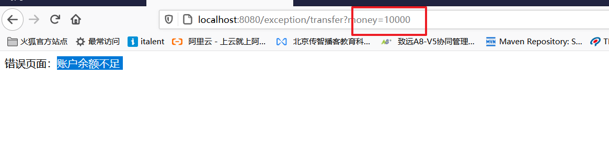

# 课堂笔记

# 0.springmvc入门案例

~~~
1.创建web工程，引入相关依赖
2.springmvc.xml配置中配置内容
    a. 注解扫描
    b. <mvc:annotation-driven> 注解驱动
    c. 配置视图解析器
    d. 释放静态资源
3. web.xml配置 ,前端控制器，配置springmvc配置文件的位置
4.编写controller即可
	
~~~

1.创建web工程，引入相关依赖

```xml
<dependencies>
    <dependency>
        <groupId>org.springframework</groupId>
        <artifactId>spring-webmvc</artifactId>
        <version>5.0.6.RELEASE</version>
    </dependency>
    <dependency>
        <groupId>javax.servlet</groupId>
        <artifactId>javax.servlet-api</artifactId>
        <version>3.0.1</version>
        <scope>provided</scope>
    </dependency>
</dependencies>
```

2.springmvc.xml配置中配置内容
    a. 注解扫描
    b. <mvc:annotation-driven> 注解驱动
    c. 配置视图解析器
    d. 释放静态资源


```xml
<?xml version="1.0" encoding="UTF-8"?>
<beans xmlns="http://www.springframework.org/schema/beans"
       xmlns:xsi="http://www.w3.org/2001/XMLSchema-instance"
       xmlns:context="http://www.springframework.org/schema/context"
       xmlns:mvc="http://www.springframework.org/schema/mvc"
       xsi:schemaLocation="http://www.springframework.org/schema/beans
       http://www.springframework.org/schema/beans/spring-beans.xsd
       http://www.springframework.org/schema/context
       http://www.springframework.org/schema/context/spring-context.xsd
       http://www.springframework.org/schema/mvc
       http://www.springframework.org/schema/mvc/spring-mvc.xsd">

    <!-- bean definitions here -->

    <context:component-scan base-package="com.itheima.controller"></context:component-scan>

    <!-- 注解驱动-->
    <mvc:annotation-driven></mvc:annotation-driven>

    <!-- 视图解析器-->
    <bean class="org.springframework.web.servlet.view.InternalResourceViewResolver">
        <property name="prefix" value="/WEB-INF/jsp/"></property>
        <property name="suffix" value=".jsp"></property>
    </bean>

    <!-- 释放静态资源-->
    <mvc:default-servlet-handler></mvc:default-servlet-handler>

</beans>
```

3. web.xml配置 ,前端控制器，配置springmvc配置文件的位置

  ```xml
  <?xml version="1.0" encoding="UTF-8"?>
  <web-app xmlns="http://xmlns.jcp.org/xml/ns/javaee"
           xmlns:xsi="http://www.w3.org/2001/XMLSchema-instance"
           xsi:schemaLocation="http://xmlns.jcp.org/xml/ns/javaee http://xmlns.jcp.org/xml/ns/javaee/web-app_3_1.xsd"
           version="3.1">
  
      <servlet>
          <servlet-name>DispatcherServlet</servlet-name>
          <servlet-class>org.springframework.web.servlet.DispatcherServlet</servlet-class>
          <init-param>
              <param-name>contextConfigLocation</param-name>
              <param-value>classpath:springmvc.xml</param-value>
          </init-param>
          <load-on-startup>1</load-on-startup>
      </servlet>
  
      <servlet-mapping>
          <servlet-name>DispatcherServlet</servlet-name>
          <url-pattern>/</url-pattern>
      </servlet-mapping>
  </web-app>
  ```

  4.编写controller即可

  ```java
  package com.itheima.controller;
  
  import org.springframework.stereotype.Controller;
  import org.springframework.ui.Model;
  import org.springframework.web.bind.annotation.RequestMapping;
  
  @RequestMapping("/demo")
  @Controller
  public class DemoController {
  
  
      @RequestMapping("/demo1")
      public String demo(Model model){
  
          model.addAttribute("msg","消息");
  
          return "demo";
      }
  }
  ```


测试： http://localhost:8080/demo/demo1


# 1.springmvc的返回值


工程结构：


## 1.1 modelAndView返回值

```java
package com.itheima.controller;

import com.itheima.pojo.User;
import org.springframework.http.HttpStatus;
import org.springframework.stereotype.Controller;
import org.springframework.ui.Model;
import org.springframework.web.bind.annotation.RequestMapping;
import org.springframework.web.bind.annotation.ResponseBody;
import org.springframework.web.bind.annotation.ResponseStatus;
import org.springframework.web.servlet.ModelAndView;

import javax.servlet.http.HttpServletRequest;
import javax.servlet.http.HttpServletResponse;
import java.io.IOException;
import java.util.ArrayList;
import java.util.List;

@RequestMapping("/return")
@Controller
public class Controller_01_Return {

    /*

            ModelAndView: springmvc提供的用于封装响应给浏览器的视图和数据的
                    1.视图名 =  视图解析器的前缀+modelAndView设置的视图名+视图解析器的后缀
                    2.设置的数据，是存放在request域中的
     */
    @RequestMapping("/demo1")
    public ModelAndView demo1(){
        ModelAndView modelAndView = new ModelAndView();

        modelAndView.setViewName("demo");
        //此处将数据放到了map集合而已，dispatcherServlet做渲染的时候保存到了request域中
        modelAndView.addObject("msg","modelAndView返回值类型");

        return modelAndView;
    }

}
```

## 1.2 string返回值

```java
/*
    String返回值：默认就是视图名

    model+string返回值   =   ModelAndView的写法
 */
@RequestMapping("/demo2")
public String demo2(Model model){

    model.addAttribute("msg","string返回值默认视图名");

    return "demo";
}


/*
    string返回值：重定向
 */
@RequestMapping("/demo3")
public String demo3(){

    return "redirect:demo5?type=redirect";
    //return "redirect:/return/demo5?type=redirect";
}

 /*
    string返回值：转发
 */
 @RequestMapping("/demo4")
 public String demo4(HttpServletRequest request){

     request.setAttribute("abc","abc");

     return "forward:demo5?type=forward";
     //return "redirect:/return/demo5?type=redirect";
 }
  @RequestMapping("/demo5")
    public String demo5(Model model,String type,HttpServletRequest request){

        Object abc = request.getAttribute("abc");
        System.out.println(abc);
        model.addAttribute("msg","重定向或者转发的目标handler:"+type);

        return "demo";
    }
```


## 1.3 void类型

~~~java
 /**
     *  void 类型返回值
     *  1.通过原生javaweb技术给出响应
     *  2.没有任何响应，需要添加注解@ResponseStatus(HttpStatus.OK),表示没有任何响应体
     */
    @RequestMapping("/demo6")
    public void demo6(HttpServletResponse response){


        try {
            //重定向
            //response.sendRedirect("demo5");

            //直接给出响应体
            response.getWriter().write("success");
        } catch (IOException e) {
            e.printStackTrace();
        }

    }

    @ResponseStatus(HttpStatus.OK)  //没有任何响应体
    @RequestMapping("/demo7")
    public void demo7(){

        System.out.println("demo7执行了");

    }
~~~

## 1.4 json类型

```java
/*
    json返回值

    注意：1.springmvc对于json的支持，需要开启注解驱动  <mvc:annotation-driven></..>
         2.springmvc默认采用的是jackson，所以我们需要引入jackson依赖

    springmvc中如何返回json
    1.方法直接返回java对象类型
    2.添加注解@ResponseBody即可


    @RestController： 创建controller对象，并且当前controllor中的所有的handler的返回值全部是json格式
 */
/*
    单个json对象
 */
@ResponseBody //通知springmvc，将响应转换成json
@RequestMapping("/demo8")
public User demo8(){
    User user = new User();
    user.setPassword("123");
    user.setUsername("zhangsan");
    user.setAge(23);
    return user;
}

/*
    json数组
 */
@ResponseBody //通知springmvc，将响应转换成json
@RequestMapping("/demo9")
public List<User> demo9(){
    User user = new User();
    user.setPassword("123");
    user.setUsername("zhangsan");
    user.setAge(23);

    User user2 = new User();
    user2.setPassword("1232");
    user2.setUsername("zhangsan2");
    user2.setAge(46);

    List<User> userList = new ArrayList<>();
    userList.add(user);
    userList.add(user2);

    return userList;
}
```


@RestController

```java
package com.itheima.controller;

import com.itheima.pojo.User;
import org.springframework.web.bind.annotation.RequestMapping;
import org.springframework.web.bind.annotation.ResponseBody;
import org.springframework.web.bind.annotation.RestController;

import java.util.ArrayList;
import java.util.List;

@RestController // 创建controller对象，并且，当前controller中的所有的方法的返回值全部是json
@RequestMapping("/returnJson")
public class Controller_02_ReturnJson {


    @RequestMapping("/demo8")
    public User demo8(){
        User user = new User();
        user.setPassword("123");
        user.setUsername("zhangsan");
        user.setAge(23);
        return user;
    }

    /*
        json数组
     */

    @RequestMapping("/demo9")
    public List<User> demo9(){
        User user = new User();
        user.setPassword("123");
        user.setUsername("zhangsan");
        user.setAge(23);

        User user2 = new User();
        user2.setPassword("1232");
        user2.setUsername("zhangsan2");
        user2.setAge(46);

        List<User> userList = new ArrayList<>();
        userList.add(user);
        userList.add(user2);

        return userList;
    }
}
```


## 1.5 小结

~~~
1.ModelAndView : 包含视图名和数据
2.String返回值
	a.string返回值 + model  = ModelAndView
	b.string返回值前加上redirect: 就是重定向
	c.string返回值前加上forward: 就是转发
3.void类型
	a.javaweb技术直接给出响应
	b.如果没有任何响应，我们需要添加@ResposeStatus(HttpStatus.OK)
4.json类型：
	前提条件：
	1.配置mvc注解驱动，因为这个配置内部配置了json的支持
	2.springmvc内部默认支持jackson，所以需要使用jackson依赖
	
	1.方法上直接添加@ResponseBody注解
	2.使用@RestController代替原有的@Controller注解，表示controller中所有的handler的返回值全部是json
	
	
企业开发，一般情况：
1.小企业，如果使用jsp开发，一般采用的是  string返回值+model
2.如果前端是html，前端直接自己实现页面跳转，所有数据来源于ajax请求，所以后台全部是json响应。
~~~


# 2.springmvc的resultful风格(理解)

~~~
resultful风格：一种url设计的风格，请求的地址一样，但是请求的含义不一样，通过请求的方式来区分请求的含义。
~~~


演示步骤：

~~~
演示删改查3个操作，请求的地址一样 /customer/1
1.后台准备RestfulController,提供3个hanlder，分别用于完成删改查
2.postman发送delete和put和get请求
~~~

```java
package com.itheima.controller;

import org.springframework.stereotype.Controller;
import org.springframework.ui.Model;
import org.springframework.web.bind.annotation.PathVariable;
import org.springframework.web.bind.annotation.PutMapping;
import org.springframework.web.bind.annotation.RequestMapping;
import org.springframework.web.bind.annotation.RequestMethod;

@RequestMapping("/restful")
@Controller
public class Controller_03_Restful {

    @RequestMapping(value = "/customer/{id}",method = RequestMethod.GET)
    public String findCustomerById(@PathVariable String id, Model model){

        model.addAttribute("msg","查询客户信息:"+id);

        return "demo";
    }

    @RequestMapping(value = "/customer/{id}",method = RequestMethod.DELETE)
    public String deleteCustomerById(@PathVariable String id, Model model){

        model.addAttribute("msg","删除客户信息:"+id);

        return "demo";
    }
    @PutMapping("/customer/{id}")
    public String updateCustomerById(@PathVariable String id, Model model){

        model.addAttribute("msg","修改客户信息:"+id);

        return "demo";
    }

}
```


测试结果：


~~~
动态路径：/customer/{id}
@PathVariable 获取动态路径中的参数
~~~


# 3.springmvc的文件上传

## 3.1 文件上传的3要素

~~~
1.文件上传需要使用文件上传组件<input type='file'>
2.文件上传的数据格式必须是 multipart/form-data
3.必须是post请求上传文件，因为get请求由提交内容大小的限制
~~~

前端：

```html
<!DOCTYPE html>
<html lang="en">
<head>
    <meta charset="UTF-8">
    <title>Title</title>
</head>
<body>
    <!--
        Content-Type: application/json;  表示请求的参数格式是json
                      application/x-www-form-urlencoded ; 默认的，表示提交的参数格式是key=value&key=value格式
                      multipart/form-data : 专门用于文件上传，将文件转换成字节进行上传

         get请求：有长度的限制
         post请求：没有长度的限制。
    -->
    <form action="fileUpload/upload" method="post" enctype="multipart/form-data">

        <input type="text" name="username"><br>
        <input type="text" name="password"><br>

        <input type="file" name="myimg">
        <input type="submit" value="提交">
    </form>
</body>
</html>
```


文件上传的原理：


## 3.2 springmvc文件上传

~~~
演示步骤:
1.需要文件上传页面
2.配置springmvc的文件解析器，springmvc的文件解析器，底层借助了apache提供的file-upload依赖
3.直接在handler中声明MultiFile类型的变量，变量名和文件提交是的key一致即可
4.调用MultiFile类型的api进行文件存储操作
~~~

1.需要文件上传页面

```html
<!DOCTYPE html>
<html lang="en">
<head>
    <meta charset="UTF-8">
    <title>Title</title>
</head>
<body>
    <!--
        Content-Type: application/json;  表示请求的参数格式是json
                      application/x-www-form-urlencoded ; 默认的，表示提交的参数格式是key=value&key=value格式
                      multipart/form-data : 专门用于文件上传，将文件转换成字节进行上传

         get请求：有长度的限制
         post请求：没有长度的限制。
    -->
    <form action="fileUpload/upload" method="post" enctype="multipart/form-data">

        <input type="text" name="username"><br>
        <input type="text" name="password"><br>

        <input type="file" name="myimg">
        <input type="submit" value="提交">
    </form>
</body>
</html>
```

2.配置springmvc的文件解析器，springmvc的文件解析器，底层借助了apache提供的file-upload依赖

```xml
<!-- apache的文件解析工具-->
<dependency>
    <groupId>commons-fileupload</groupId>
    <artifactId>commons-fileupload</artifactId>
    <version>1.3.1</version>
</dependency>
```

```xml
<!--
        springmvc的文件解析器,
        配置id默认值multipartResolver
-->
<bean id="multipartResolver" class="org.springframework.web.multipart.commons.CommonsMultipartResolver">
    <!-- 解决文件名的中乱编码问题-->
    <property name="defaultEncoding" value="utf-8"></property>
    <!-- 限定上传文件的大小 ，以字节为单位-->
    <property name="maxUploadSize" value="1024000"></property>
</bean>
```


3.直接在handler中声明MultiFile类型的变量，变量名和文件提交是的key一致即可
4.调用MultiFile类型的api进行文件存储操作

```java
package com.itheima.controller;

import org.springframework.http.HttpStatus;
import org.springframework.stereotype.Controller;
import org.springframework.web.bind.annotation.RequestMapping;
import org.springframework.web.bind.annotation.ResponseStatus;
import org.springframework.web.multipart.MultipartFile;

import java.io.File;
import java.io.IOException;

@RequestMapping("/fileUpload")
@Controller
public class Controller_04_FileUpload {

    @ResponseStatus(HttpStatus.OK)
    @RequestMapping("/upload")
    public void upload(MultipartFile myimg){

        //调用api进行文件存储操作
        //获取原文件名
        String filename = myimg.getOriginalFilename();

        //保存文件
        try {
            myimg.transferTo(new File("F:\\"+filename));
        } catch (IOException e) {
            e.printStackTrace();
        }

        System.out.println("接受到请求了");
    }
}
```


小结：

~~~
1.文件上传3要素
	a.配置springmvc的文件解析器，springmvc的文件解析器，底层借助了apache提供的file-upload依赖
	b.直接在handler中声明MultiFile类型的变量，变量名和文件提交是的key一致即可
	c.调用MultiFile类型的api进行文件存储操作	
2.引入apache的fileupload依赖
3.配置springmvc的文件解析器
4.handler中直接声明multipartFile类型的变量即可，调用api进行文件存储
~~~


## 3.3 文件上传的细节问题

### 3.3.1 文件服务器

~~~
需求：
用户在注册时，上传了头像图片，然后用户查询用户信息，需要展示头像图片。
页面需要展示图片，所以意味着图片资源需要被发布。
上传到当前项目？不合适！会导致war包太大。
所以我们应该上传到tomcat的发布的资源下，而且这个资源里面全部存放图片。（图片服务器）
~~~


~~~
搭建文件服务器：
1.在tomcat下创建一个文件夹即可，专门用来保存上传的图片
2.注意同时启动2个tomcat，需要改端口号配置
~~~

文件服务器


### 3.3.2 文件上传到文件服务器

~~~
注意：
1.通过io流保存到服务器位置的磁盘路径   savePath
2.保存到数据库的图片路径，这个路径用于img标签去访问的http协议路径   dbPath
~~~


```java
package com.itheima.controller;

import org.springframework.http.HttpStatus;
import org.springframework.stereotype.Controller;
import org.springframework.ui.Model;
import org.springframework.web.bind.annotation.RequestMapping;
import org.springframework.web.bind.annotation.ResponseStatus;
import org.springframework.web.multipart.MultipartFile;

import java.io.File;
import java.io.IOException;

@RequestMapping("/fileUpload")
@Controller
public class Controller_04_FileUpload {

    //@ResponseStatus(HttpStatus.OK)
    @RequestMapping("/upload")
    public String upload(MultipartFile myimg, Model model){

        //调用api进行文件存储操作
        //获取原文件名
        String filename = myimg.getOriginalFilename();

        //文件保存到文件服务器的路径
        String imgServerPath = "E:\\tomcat\\apache-tomcat-8.5.32\\webapps\\imgServer";
        //文件最终保存的位置
        String savePath = imgServerPath+"\\"+filename;
        //保存文件
        try {


            //myimg.transferTo(new File("F:\\"+filename));
            myimg.transferTo(new File(savePath));
        } catch (IOException e) {
            e.printStackTrace();
        }


        //保存到数据的图片的访问地址
        String dbPath = "http://localhost:8088/imgServer/"+filename;
        model.addAttribute("url",dbPath);
        //System.out.println("接受到请求了");

        //绝对路径
        return "forward:/WEB-INF/jsp/demo.jsp";
    }
}
```


demo.jsp 用于验证dbPath是正确的

```jsp
<%--
  Created by IntelliJ IDEA.
  User: hxc
  Date: 2020/12/17
  Time: 9:46
  To change this template use File | Settings | File Templates.
--%>
<%@ page contentType="text/html;charset=UTF-8" language="java" %>
<html>
<head>
    <title>Title</title>
</head>
<body>
    这是demo.jsp
    ${requestScope.msg}
    当前上传的图片 :
    
</body>
</html>
```


### 3.3.3 文件名重复

~~~
如果2个文件名称重复，那么其中一个文件会将另外一个文件覆盖。
我们针对文件名进行随机命名。UUID
~~~


```java
package com.itheima.controller;

import org.springframework.http.HttpStatus;
import org.springframework.stereotype.Controller;
import org.springframework.ui.Model;
import org.springframework.web.bind.annotation.RequestMapping;
import org.springframework.web.bind.annotation.ResponseStatus;
import org.springframework.web.multipart.MultipartFile;

import java.io.File;
import java.io.IOException;
import java.util.UUID;

@RequestMapping("/fileUpload")
@Controller
public class Controller_04_FileUpload {

    //@ResponseStatus(HttpStatus.OK)
    @RequestMapping("/upload")
    public String upload(MultipartFile myimg, Model model){

        //调用api进行文件存储操作
        //获取原文件名   再加上随机的前缀，确保文件名永远不一致
        String filename = UUID.randomUUID().toString()+ myimg.getOriginalFilename();


        //文件保存到文件服务器的路径
        String imgServerPath = "E:\\tomcat\\apache-tomcat-8.5.32\\webapps\\imgServer";
        //文件最终保存的位置
        String savePath = imgServerPath+"\\"+filename;
        //保存文件
        try {
            //myimg.transferTo(new File("F:\\"+filename));
            myimg.transferTo(new File(savePath));
        } catch (IOException e) {
            e.printStackTrace();
        }


        //保存到数据的图片的访问地址
        String dbPath = "http://localhost:8088/imgServer/"+filename;
        model.addAttribute("url",dbPath);
        //System.out.println("接受到请求了");

        //绝对路径
        return "forward:/WEB-INF/jsp/demo.jsp";
    }
}
```


结果：文件名随机不重复


### 3.3.4 文件的分类管理

~~~
一个黑马旅游项目：有用户的图片信息，有旅游的图片信息，还有其他的图片信息
可以按照图片的类型（按照业务功能模块）进行分类管理
~~~


```java
package com.itheima.controller;

import org.springframework.http.HttpStatus;
import org.springframework.stereotype.Controller;
import org.springframework.ui.Model;
import org.springframework.web.bind.annotation.RequestMapping;
import org.springframework.web.bind.annotation.ResponseStatus;
import org.springframework.web.multipart.MultipartFile;

import java.io.File;
import java.io.IOException;
import java.util.UUID;

@RequestMapping("/fileUpload")
@Controller
public class Controller_04_FileUpload {

    //@ResponseStatus(HttpStatus.OK)
    @RequestMapping("/upload")
    public String upload(MultipartFile myimg, Model model){

        //定义业务模块名称,用户模块
        String businessName = "user";
        //调用api进行文件存储操作
        //获取原文件名   再加上随机的前缀，确保文件名永远不一致
        String filename = UUID.randomUUID().toString()+ myimg.getOriginalFilename();

        //文件保存到文件服务器的路径
        String imgServerPath = "E:\\tomcat\\apache-tomcat-8.5.32\\webapps\\imgServer\\"+businessName;
        //文件最终保存的位置
        String savePath = imgServerPath+"\\"+filename;
        //保存文件
        try {
            //myimg.transferTo(new File("F:\\"+filename));
            File directory = new File(imgServerPath);
            //判断文件夹是否存在
            if(!directory.exists()){
                //创建文件夹
                directory.mkdir();
            }
            myimg.transferTo(new File(savePath));
        } catch (IOException e) {
            e.printStackTrace();
        }
        //保存到数据的图片的访问地址
        String dbPath = "http://localhost:8088/imgServer/"+businessName+"/"+filename;
        model.addAttribute("url",dbPath);
        //System.out.println("接受到请求了");

        //绝对路径
        return "forward:/WEB-INF/jsp/demo.jsp";
    }
}
```

分类管理


# 4.springmvc的异常处理

~~~
异常有2种处理方式：
1.try catch   ,捕获，并且处理。对于调用者来说。就没有异常了。
2.throws ,抛给调用者，由调用者进行处理。
而在springmvc中，dispatcherServlet去调用handler，handler调用service和dao，如果controller，service，dao中出现的异常全部不做处理，往上抛，最终都由dispatcherServlet来进行统一处理。
~~~


## 4.1 xml方式的异常统一处理

~~~
1.自定义业务异常，例如余额不足异常
2.编写controller，在controller中，手动抛出业务异常
3.自定义异常处理类，实现HanlderExceptionResolver接口
4.创建异常处理器对象。<bean>
~~~


1.自定义业务异常，例如余额不足异常


```java
package com.itheima.exception;

public class AccountMoneyNotEnoughException extends Exception {


    public AccountMoneyNotEnoughException() {
        super("账户余额不足");
    }
}
```

2.编写controller，在controller中，手动抛出业务异常

```java
package com.itheima.controller;

import com.itheima.exception.AccountMoneyNotEnoughException;
import org.springframework.http.HttpStatus;
import org.springframework.stereotype.Controller;
import org.springframework.ui.Model;
import org.springframework.web.bind.annotation.RequestMapping;
import org.springframework.web.bind.annotation.ResponseStatus;

@RequestMapping("/exception")
@Controller
public class Controller_05_Exception {


    @RequestMapping("/transfer")
    public String transfer(double money, Model model) throws AccountMoneyNotEnoughException {

        if(money>1000){
            //余额不足,业务异常
            throw new AccountMoneyNotEnoughException();
        }

        model.addAttribute("msg","转账成功");
        return "demo";
    }
}
```

3.自定义异常处理类，实现HanlderExceptionResolver接口

```java
package com.itheima.exceptionResolver;

import com.itheima.exception.AccountMoneyNotEnoughException;
import org.springframework.web.servlet.HandlerExceptionResolver;
import org.springframework.web.servlet.ModelAndView;

import javax.servlet.http.HttpServletRequest;
import javax.servlet.http.HttpServletResponse;

public class MyHandlerExceptionResolver implements HandlerExceptionResolver {
    /**
     * 这个方法就是dispatcherServlet用来处理所有异常的方法
     * @param httpServletRequest  http请求
     * @param httpServletResponse  http响应
     * @param o     handler，就是controller中的方法
     * @param e    抓到的异常
     * @return
     */
    @Override
    public ModelAndView resolveException(HttpServletRequest httpServletRequest,
                                         HttpServletResponse httpServletResponse,
                                         Object o,
                                         Exception e) {

        ModelAndView modelAndView = new ModelAndView();
        //判断异常的类型，针对不同的异常，提供不同的处理方法
        //instanceof 判断是否属于某个类型
        if(e instanceof AccountMoneyNotEnoughException){
            modelAndView.addObject("errorMsg",e.getMessage());
        }else {
            modelAndView.addObject("errorMsg","未知错误，请联系管理员");
        }

        modelAndView.setViewName("error");

        return modelAndView;
    }
}
```

4.创建异常处理器对象。<bean>


测试：




## 4.2 注解方式

~~~
1.创建一个BasicController,创建一个用于进行异常处理的方法，添加注解@ExceptionHandler。标注这个方法就是用于处理当前controller中的异常的。
2.所有的controller都需要这样的方法来处理异常，每个controller继承BasicController即可
~~~


1.注释xml方式


2.创建basicController, @ExceptionHandler作用于异常处理的方法

```java
package com.itheima.controller;

import com.itheima.exception.AccountMoneyNotEnoughException;
import org.springframework.web.bind.annotation.ExceptionHandler;
import org.springframework.web.servlet.ModelAndView;

import javax.servlet.http.HttpServletRequest;
import javax.servlet.http.HttpServletResponse;

public class Controller_06_Basic {


    @ExceptionHandler
    public ModelAndView resolveException(HttpServletRequest httpServletRequest,
                                         HttpServletResponse httpServletResponse,
                                         Object o,
                                         Exception e) {

        ModelAndView modelAndView = new ModelAndView();
        //判断异常的类型，针对不同的异常，提供不同的处理方法
        //instanceof 判断是否属于某个类型
        if(e instanceof AccountMoneyNotEnoughException){
            modelAndView.addObject("errorMsg",e.getMessage());
        }else {
            modelAndView.addObject("errorMsg","未知错误，请联系管理员");
        }

        modelAndView.setViewName("error");

        return modelAndView;
    }
}
```

3.继承BasicController


另一种方式：

在BasicController上添加注解@ControllerAdvice, 表当前类增强其他所有的controller。


# 5.拦截器

## 5.1 拦截器介绍

~~~
拦截器：作用类似过滤器。
过滤器：在请求访问目标资源之前进行预处理
拦截器：在请求访问handler之前进行预处理操纵
~~~


## 5.2 单个拦截器配置

~~~
1.创建一个controller,编写handler
2.创建一个类，实现handlerInterceptor接口
3.在springmvc的配置文件中，配置拦截器
~~~


1.创建一个controller,编写handler

```java
package com.itheima.controller;


import org.springframework.http.HttpStatus;
import org.springframework.stereotype.Controller;
import org.springframework.web.bind.annotation.RequestMapping;
import org.springframework.web.bind.annotation.ResponseStatus;

@RequestMapping("/interceptor")
@Controller
public class Controller_07_Interceptor {


    @RequestMapping("/demo")
    public String demo(){

        System.out.println("controller执行了");

        return "demo";
    }
}
```

2.创建一个类，实现handlerInterceptor接口


```java
package com.itheima.interceptor;

import org.springframework.web.servlet.HandlerInterceptor;
import org.springframework.web.servlet.ModelAndView;

import javax.servlet.http.HttpServletRequest;
import javax.servlet.http.HttpServletResponse;

public class MyInterceptor1 implements HandlerInterceptor {

    @Override
    public boolean preHandle(HttpServletRequest request, HttpServletResponse response, Object handler) throws Exception {

        System.out.println("handler之前执行");
        return true;//false表示拦截，true表示放行
    }

    @Override
    public void postHandle(HttpServletRequest request, HttpServletResponse response, Object handler, ModelAndView modelAndView) throws Exception {
        System.out.println("handler执行之后，但是在视图渲染之前执行");
    }

    @Override
    public void afterCompletion(HttpServletRequest request, HttpServletResponse response, Object handler, Exception ex) throws Exception {
        System.out.println("视图渲染之后执行。");
    }
}
```

3.在springmvc的配置文件中，配置拦截器

```xml
<!--
    异常处理器对象
    这个可以不用id，
-->
<!--<bean class="com.itheima.exceptionResolver.MyHandlerExceptionResolver"></bean>-->

<!-- 声明拦截器配置 -->
<mvc:interceptors>
    <!-- 配置单个拦截器 -->
    <mvc:interceptor>
        <!-- 拦截的路径-->
        <mvc:mapping path="/interceptor/*"/>
        <!-- 配置拦截对象的-->
        <bean class="com.itheima.interceptor.MyInterceptor1"></bean>
    </mvc:interceptor>
</mvc:interceptors>
```


## 5.3 多个拦截器

~~~
按照配置的顺序执行拦截器
~~~


演示：


```xml
<!-- 声明拦截器配置 -->
<mvc:interceptors>
    <!-- 配置单个拦截器 -->
    <mvc:interceptor>
        <!-- 拦截的路径-->
        <mvc:mapping path="/interceptor/*"/>
        <!-- 配置拦截对象的-->
        <bean class="com.itheima.interceptor.MyInterceptor1"></bean>
    </mvc:interceptor>
    <!-- 配置单个拦截器 -->
    <mvc:interceptor>
        <!-- 拦截的路径-->
        <mvc:mapping path="/interceptor/*"/>
        <!-- 配置拦截对象的-->
        <bean class="com.itheima.interceptor.MyInterceptor2"></bean>
    </mvc:interceptor>
    <!-- 配置单个拦截器 -->
    <mvc:interceptor>
        <!-- 拦截的路径-->
        <mvc:mapping path="/interceptor/*"/>
        <!-- 配置拦截对象的-->
        <bean class="com.itheima.interceptor.MyInterceptor3"></bean>
    </mvc:interceptor>
</mvc:interceptors>
```


测试结果：3没有放行


# 6.源码追踪


从servlet的service方法进行跟踪，找到doDispatch方法，这是dispatcherServlet的核心方法


