#   第8章 权限管理（Spring Security）

### 8.1 权限控制管理   

#### 8.1.1 认证和授权概念  

```markdown
前面我们已经完成用户管理系统案例，

接下来我们需要思考2个问题：

问题1：在生产环境下我们如果不登录后台系统就可以完成这些功能操作吗？

答案显然是否定的，要操作这些功能必须首先登录到系统才可以。


问题2：是不是所有用户，只要登录成功就都可以操作所有功能呢？

并不是所有的用户都可以操作这些功能。不同的用户可能拥有不同的权限，这就需要进行授权了。


- 认证：系统提供的用于识别用户身份的功能，通常提供用户名和密码进行登录其实就是在进行认证，认证的目的是让系统知道你是谁。

- 授权：用户认证成功后，需要为用户授权，其实就是指定当前用户可以操作哪些功能。

本章节就是要对后台系统进行权限控制，其本质就是对用户进行认证和授权。

```

**认证过程**：只需要用户表就可以了，可以简单的理解 访问后台管理网站平台 ，用户必须登录才可以访问

```java
在用户登录时可以查询用户表t_user进行校验，判断用户输入的用户名和密码是否正确。
用户名和密码要求：
用户名在所有表记录中要求唯一！非空！  类似该用户的身份标识，类似ID 通常选做 邮箱或手机号 作为用户名
```

**授权过程**： 后续会继续讲解

```java
用户必须完成认证之后才可以进行授权，只有认证通过，我们才会对不同的用户进行授权，
可以根据用户查询其角色，再根据角色查询对应的菜单，这样就确定了用户能够看到哪些菜单。
然后再根据用户的角色查询对应的权限，这样就确定了用户拥有哪些权限。
```

### 8.2 Spring Security简介

- spring  secuirty 框架+Springboot 整合   自动配置说
- spring security 框架：自定义配置 （认证和授权）  重写 **WebSecurityConfigurerAdapter**  3个核心方法
- spring  security 框架 认证和授权流程！（**14-15 过滤器链**）
- 集中式权限管理和分布式权限管理   

实际的企业开发中，我们都会使用权限框架来完成项目的权限开发

目前流行稳定安全级别较高的两大框架：**Apache shiro 和 Spring  security**

基于目前流行spring全家桶开发模式，我们学习spring security框架   

**Spring** **Security**是 Spring提供的安全认证服务的框架， 使用Spring Security可以帮助我们来简化认证和授权的过程。

官网：*https://spring.io/projects/spring-security*

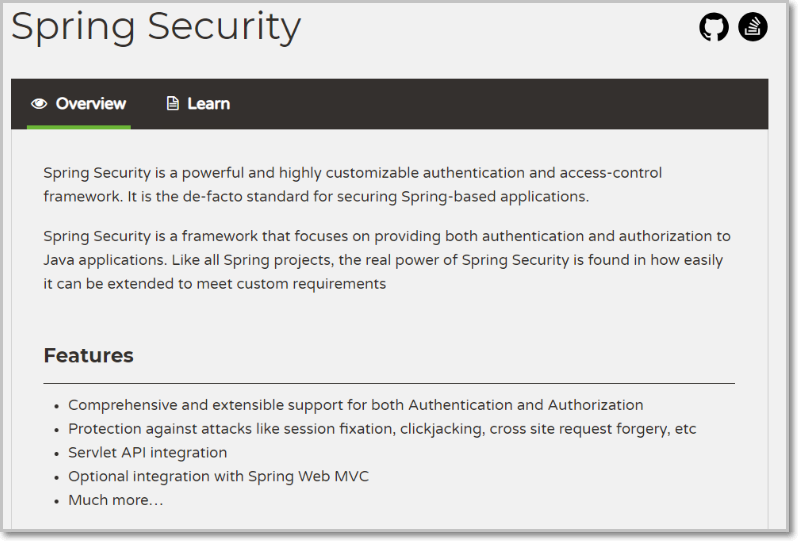

对应的maven坐标：在**工程中**导入

```xml
 			 <dependency>
                <groupId>org.springframework.boot</groupId>
                <artifactId>spring-boot-starter-security</artifactId>
            </dependency>
```

框架认证和授权执行流程：

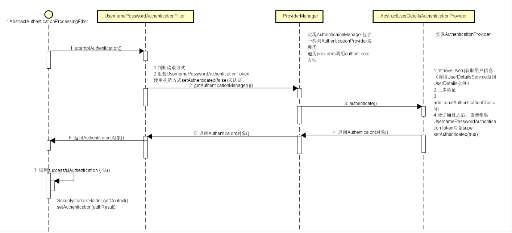 

框架核心过滤器链说明：

```java
- UsernamePasswordAuthenticationFilter认证的filter，经过这些过滤器后SecurityContextHolder中将包含一个完全组装好的Authentication对象，从而使后续鉴权能正常执行。表单认证是最常用的一个认证方式。


- BasicAuthenticationFilter认证filter，经过这些过滤器后SecurityContextHolder中将包含一个完全组装好的Authentication对象，从而使后续鉴权能正常执行

-- LogoutFilter处理退出登录的Filter

```


### 8.3 Spring Security-集中式权限管理

#### 第一步： 搭建权限框架环境-整合用户管理案例

在模块添加spring-security 依赖

```xml
 		<dependency>
            <groupId>org.springframework.boot</groupId>
            <artifactId>spring-boot-starter-security</artifactId>
        </dependency>
```

#### 第二步：启动用户管理项目

浏览器输入： 访问/pages/index.html

效果：

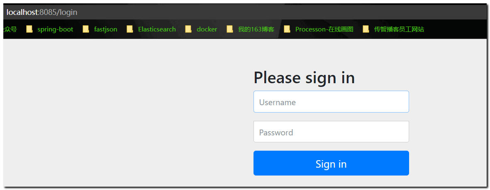 

我们发现，权限框架已经生效了！  需要输入账号和密码进行登录，方可以访问目标资源：index.html

账号和密码 由框架的自动配置类配置!

### 8.4 权限框架学习-内存版认证和redis授权

通过上述案例我们可以看到，

Spring Security将我们项目中的所有资源都保护了起来，要访问这些资源必须要完成认证才可以访问。

通常我们还要解决如下一些问题：

```java
1、项目中我们将所有的资源（所有请求URL）都保护起来，实际环境下往往有一些资源不需要认证也可以访问，也就是可以匿名访问。
比如：电商网站各类商品的页面应该是不需要认证也可以访问，而个人资料需要认证之后才能访问。

2、登录页面是由框架生成的，而我们的项目往往会使用自己的登录页面。

3、直接将用户名和密码配置在了配置文件中，而真实生产环境下的用户名和密码往往保存在数据库中。

4、在配置文件中配置的密码使用明文，这非常不安全，而真实生产环境下密码需要进行加密。

```

**本章节需要对这些问题进行改进。 **  

#### 8.4.0 配置类WebSecurityConfigurerAdapter

详见下发资料：

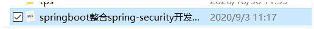 

了解：三个configure方法作用

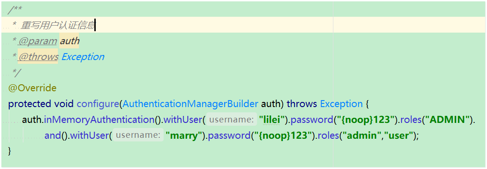 

#### 8.4.1 配置可匿名访问的资源

目标

>   在日常开发中，有一些url的访问时不需要任何权限的控制的，比如css、js、登陆页面等，可以使用springsecurity设置匿名访问路径，即没有任何限制，就能执行方法的url.

步骤实现

##### 第一步：访问css和js

在工程中添加人员js、css或者其他页面：可以从health_web工程中任意复制css和js到测试工程中

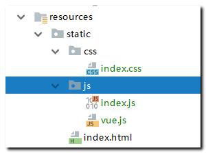   

##### 第二步：设置匿名访问路径

编写配置类继承**WebSecurityConfigurerAdapter** 重写

方法：public void configure(WebSecurity web)指定哪些资源可以匿名访问（即不需要认证就能访问）

```java
   @Override
    public void configure(WebSecurity web) throws Exception {
        web.ignoring().antMatchers("/img/**/*", "/**/*.css", "/**/*.js","/template/**","/plugins/**");
    }
```

##### 第三步：测试访问资源

浏览器直接访问静态资源 css或 js  不需要认证就可以访问

  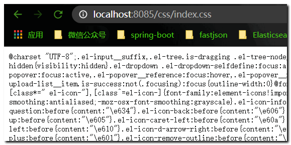  

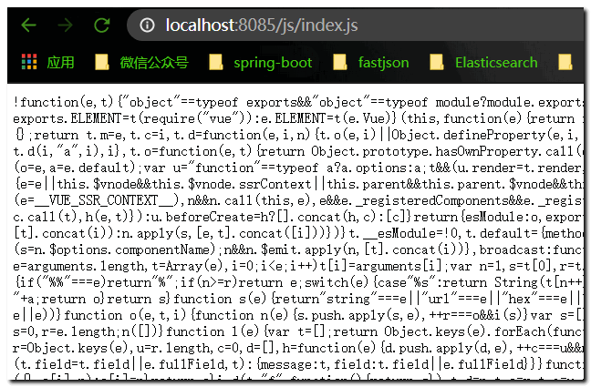 

#### 8.4.2 使用指定的登录页面

在正常开发过程中，肯定不是使用security框架准备的登陆页面，而是使用我们自己的登陆页面，接下来就来学习如何配置自己的登陆页面。

**目标**

使用自定义的登陆页面代替security给我们提供的默认登陆页面

**步骤实现**

##### 第一步：创建login.html

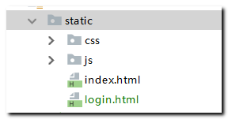 

login.html:

```html
<!DOCTYPE html>
<html>
<head>
    <!-- 页面meta -->
    <meta charset="utf-8">
       <title>登录</title>
</head>
<body>
   <form action="/login.do" method="post">
          用户名：<input type="text" name="username"><br>
          密码： <input type="password" name="password"><br>
           <input type="submit" value="登录">
       </form>
</body>
</html>
```

添加登录成功之后访问的资源

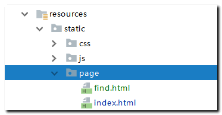 

新建一个目录 page  定义两个资源页面：后续登录成功可以访问

##### 第二步：自定义登陆页面配置

编辑：配置类继承WebSecurityConfigurerAdapter 重写

```java
protected void configure(HttpSecurity http)
```

```java
  @Override
    protected void configure(HttpSecurity http) throws Exception {
        http.formLogin() 								// 定义当需要用户登录时候，转到的登录页面。
                .loginPage("/login.html")	 					// 设置登录页面
                .loginProcessingUrl("/login.do") 			// 表单提交的action 地址：
                .defaultSuccessUrl("/page/index.html")// 登录成功之后，默认跳转的页面
                .and()
                .authorizeRequests().antMatchers("/page/**").authenticated();// 表示 page下的所有资源 都需要认证才可以访问
       }
```

##### 第三步：测试  浏览器访问page/index.html页面 会先要求登录

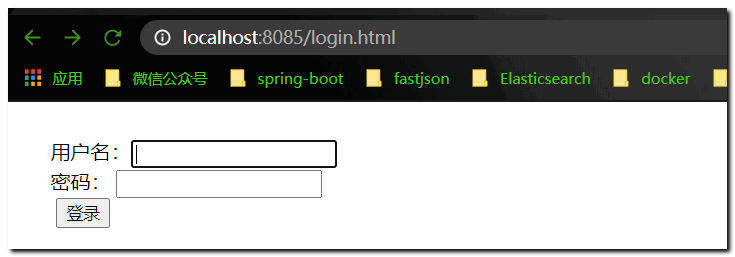 

##### 第四步： 自定义登录用户账号和密码

使用内存版 定义账号和密码   

我们需要重写  **WebSecurityConfigurerAdapter**提供的

```java
protected void configure(AuthenticationManagerBuilder auth) 
```

 ```java
  @Override
    protected void configure(AuthenticationManagerBuilder auth) throws Exception {
        //  基于内存  定义认证用户的账号 、密码 、以及权限关键字
        auth.inMemoryAuthentication().withUser("admin").password("1234").roles("ADMIN");
    }
 ```

重启: 登录表单输入 对应的账号 ： admin   密码  1234  我们登录提交

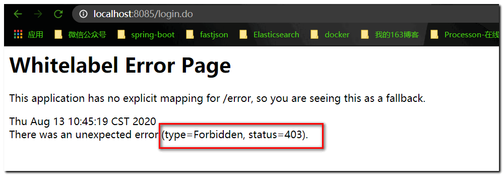 

原因是：security框架认为用户要访问的页面不安全而拒绝进行访问。

我们将自定义登陆页面注释掉之后重新查看security框架给我们准备的登陆页面，查看其源代码如下：

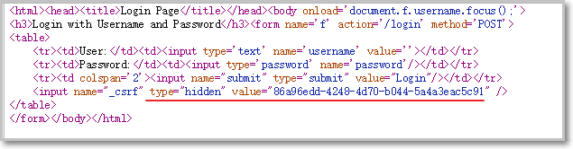 

发现其中有一个隐藏标签设置了一个value，该值在security框架内置的CsrfFilter过滤器中也有一个，security框架为了防止别人使用伪造的登陆页面来访问资源，因此设置了一个安全过滤器，只有当页面提交的隐藏值和过滤器中的页一致时，才允许用户继续访问资源。

解决方案：**关闭CsrfFilter过滤器**

##### 第五步：关闭CsrfFilter过滤器

关闭CsrfFilter过滤器：在configure(HttpSecurity http)  方法中 关闭

```java
   @Override
    protected void configure(HttpSecurity http) throws Exception {
        http.formLogin() 								// 定义当需要用户登录时候，转到的登录页面。
                .loginPage("/login.html")	 					// 设置登录页面
                .loginProcessingUrl("/login.do") 			// 表单提交的action 地址：
                .defaultSuccessUrl("/page/index.html")// 登录成功之后，默认跳转的页面
                .and()
                .authorizeRequests().antMatchers("/page/**").authenticated()// 表示 page下的所有资源 都需要认证才可以访问
                .and()
                .csrf().disable(); //  关闭  csrf过滤器
       }
```

---------------------------

再次测试： 我们发现 产生一个异常：

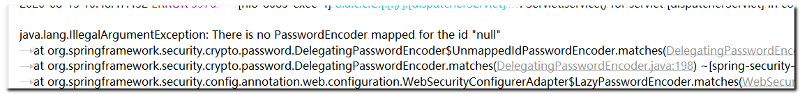 

因为： security框架对于用户认证的密码默认 采用 加盐加密处理： 我们的密码 1234 框架会对其进行加密：

使用到框架的内部加密器对象 PasswordEncoder 对象！

解决方案：

- 方案一

​      密码不要加密，告知框架，密码采用明文处理即可： 直接在密码前添加字符串： {noop}即可

   ```java
configure(AuthenticationManagerBuilder auth)   方法 处理密码
   @Override
    protected void configure(AuthenticationManagerBuilder auth) throws Exception {
        //  基于内存  定义认证用户的账号 、密码 、以及权限关键字
        auth.inMemoryAuthentication().withUser("admin").password("{noop}1234").roles("ADMIN");
    }
   ```

- 方案二

​    告知框架，我们的密码采用PasswordEncoder进行加密，引入注入加密器对象对密码处理即可

```java
- 在配置类中：先注入 PasswordEncoder对象 
  @Bean
    public BCryptPasswordEncoder passwordEncoder() {
        return new BCryptPasswordEncoder();//  密码加密 对象
    }
    
- 对密码进行加密处理 调用encode方法即可  
    @Override
    protected void configure(AuthenticationManagerBuilder auth) throws Exception {
        //  基于内存  定义认证用户的账号 、密码 、以及权限关键字
//        auth.inMemoryAuthentication().withUser("admin").password("{noop}1234").roles("ADMIN");
        String password = passwordEncoder().encode("1234"); //  数据库内存密码加密
            auth.inMemoryAuthentication().passwordEncoder(passwordEncoder()).withUser("admin").password(password).roles("ADMIN");
            //  密码加密器对象 通过passwordEncoder注入给spring security 框架 会自动对表单提交的密码进行加密处理
    }
```

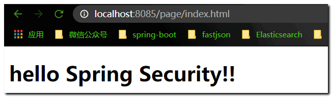 

#### 8.4.3 访问授权资源

只有ADMIN角色才可以访问find.html

1、修改登录用户的授权角色： **QUERY 角色**

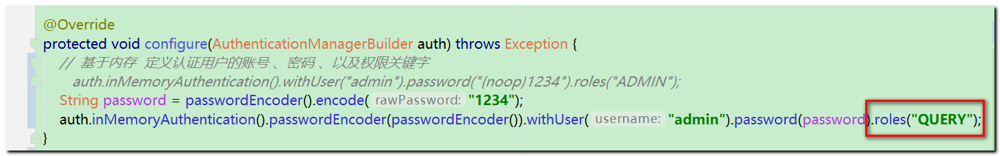 

修改目标资源的访问角色 ADMIN： 

注意授权代码的位置：  **权限和角色授权代码 要放在 认证代码之前**

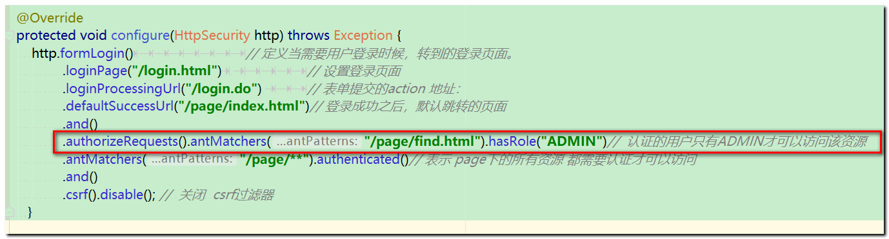 

浏览器访问： index.html 和  find.html 测试：

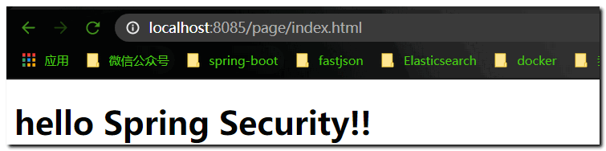 

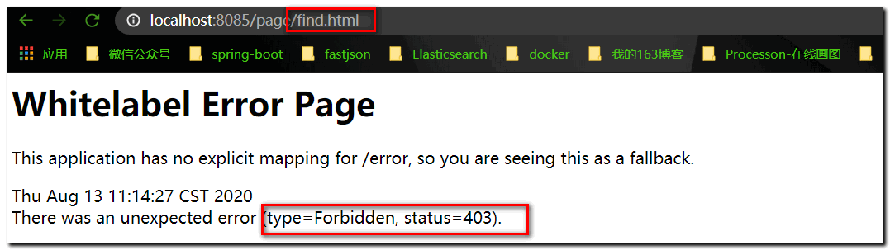 


#### 8.4.4 配置 403无权限友好页面

1. 定义一个友好页面

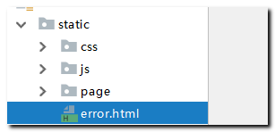 

2. 内容：

```html
<!DOCTYPE html>
<html lang="en">
<head>
    <meta charset="UTF-8">
    <title>Title</title>
</head>
<body>
              <h1>当前页面很火爆。。。。稍后再试！</h1>
</body>
</html>
```

3. 配置403  在  protected void configure(HttpSecurity http)  方法添加 

**exceptionHandling().accessDeniedPage("/error.html") 资源**

```java
    @Override
    protected void configure(HttpSecurity http) throws Exception {
        http.formLogin() 								// 定义当需要用户登录时候，转到的登录页面。
                .loginPage("/login.html")	 					// 设置登录页面
                .loginProcessingUrl("/login.do") 			// 表单提交的action 地址：
                .defaultSuccessUrl("/page/index.html")// 登录成功之后，默认跳转的页面
                .and()
                .authorizeRequests().antMatchers("/page/find.html").hasRole("ADMIN")//  认证的用户只有ADMIN才可以访问该资源
                .antMatchers("/page/**").authenticated()// 表示 page下的所有资源 都需要认证才可以访问
                .and().exceptionHandling().accessDeniedPage("/error.html") // 表示 403 无权限  跳转到友好页面
                .and()
                .csrf().disable(); //  关闭  csrf过滤器
       }

```

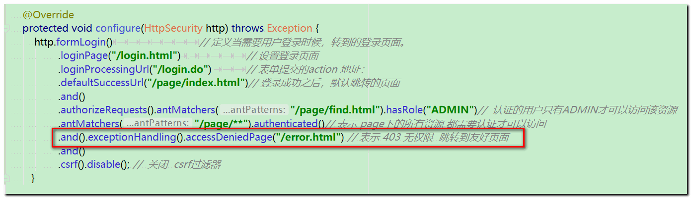 

测试： 浏览器访问find.html 页面

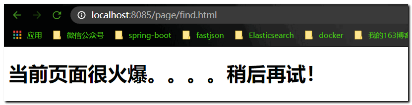 

#### 8.4.5 注解方式权限控制

Spring Security除了可以在配置文件中配置权限校验规则（即通过\<**security:intercept-url**\>标签配置），还可以使用注解方式进行权限的控制。

例如Controller中的某个方法要求必须具有某个权限才可以访问，此时就可以使用Spring Security框架提供的注解方式进行控制。

```java
角色控制：@PreAuthorize("hasRole('ROLE_ADMIN')")

权限控制：@PreAuthorize("hasAuthority('add')")

```

**注解一般作用在方法上。注解使用规则： 不乱用，不嵌套使用**

案例：

目标： 使用注解完成security框架的对于权限和角色的控制。

步骤实现：

#### 第一步：声明使用注解配置权限

在配置类上开启权限注解：

```java
@EnableGlobalMethodSecurity(prePostEnabled = true) //开启方法权限注解支持
public class SpringBootSecurityService extends WebSecurityConfigurerAdapter
```

#### 第二步：使用权限注解  @PreAuthorize()

编写controller 在业务方法上直接添加注解配置权限即可： 

在方法上加入**注解@PreAuthorize**进行权限控制

```java
@RestController
@RequestMapping("/user")
public class UserController {

    @RequestMapping("/addUser.do")  //  spEL  拥有ROLE_ADD 角色可以访问该业务方法
    @PreAuthorize("hasRole('ROLE_ADD')")
    public  String  addUser(){
        System.out.println("----adduser-----");
        return  "add";
    }
}
```

#### 第三步：测试

注意启动类的位置 要可以扫描到

 分别用 zs和lisi 登录 浏览器访问addUser.do方法

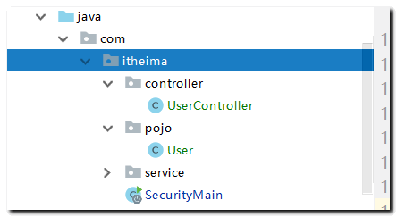 

#### 8.4.6 配置多种校验规则(了解)

在安全设置中，我们还可以根据不同的需求设置不同的权限和角色，比如在access属性中设置表达式如下：

spring-security.xml  配置相关的授权和认证SPEL表达式说明

```java
isAuthenticated()：是否通过认证,通过认证才能访问

hasAuthority('add')：是否拥有add权限，有权限才能访问

hasRole('ROLE_ADMIN')：是否拥有ROLE_ADMIN角色，有角色才能访问

hasRole('ADMIN')： 是否拥有ROLE_ADMIN角色简写方式，框架会自动添加前缀ROLE_。

spEL表达式
其他的表达式说明
    hasRole	用户具备某个角色即可访问资源
    hasAnyRole	用户具备多个角色中的任意一个即可访问资源
    hasAuthority	类似于 hasRole
    hasAnyAuthority	类似于 hasAnyRole
    permitAll	统统允许访问
    denyAll	统统拒绝访问
    isAnonymous	判断是否匿名用户
    isAuthenticated	判断是否认证成功
    isRememberMe	判断是否通过记住我登录的
    isFullyAuthenticated	判断是否用户名/密码登录的
    principle	当前用户
    authentication	从 SecurityContext 中提取出来的用户对象

```

#### 8.4.6 用户登出

**配置logout**

用户完成登录后Spring Security框架会记录当前用户认证状态为已认证状态，即表示用户登录成功了。

那用户如何退出登录呢？我们可以在配置类中进行如下配置：

```java
and()  
    //   logoutUrl  配置处理退出的请求路径     logoutSuccessUrl  退出之后跳转的资源地址   invalidateHttpSession  注销内置session对象
                .logout().logoutUrl("/logout.do").logoutSuccessUrl("/login.html").invalidateHttpSession(true)
```

通过上面的配置可以发现，如果用户要退出登录，只需要请求/logout.do这个URL地址就可以，同时会将当前session失效，最后页面会跳转到login.html页面。 


```java
AuthorityUtils.commaSeparatedStringToAuthorityList（字符串 转换 成 List<GrantedAuthorityUtils>）   

```


 