# Spring-Security框架

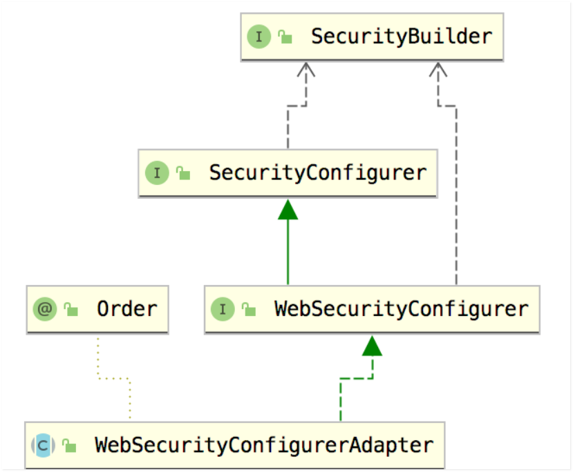 

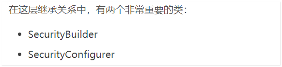 

Spring Security框架 最重要的两个对象：

**SecurityBuilder** 

用来构建过滤器链的，在 HttpSecurity 实现 SecurityBuilder 时，传入的泛型就是 DefaultSecurityFilterChain，所以 SecurityBuilder.build 方法的功能很明确，就是用来**构建一个过滤器链**出来。


**SecurityConfigurer** 中主要是两个方法，**init** 和 **configure**。

init 就是一个初始化方法。而 configure 则是一个配置方法。这里只是规范了方法的定义，具体的实现则在不同的实现类中。

Spring Security 过滤器链中的每一个过滤器，都是通过 xxxConfigurer 来进行配置的，而这些 xxxConfigurer 实际上都是 **SecurityConfigurer** 的实现。

该对象是一个接口，接下来我们可以通过实现类来说明该对象的作用：

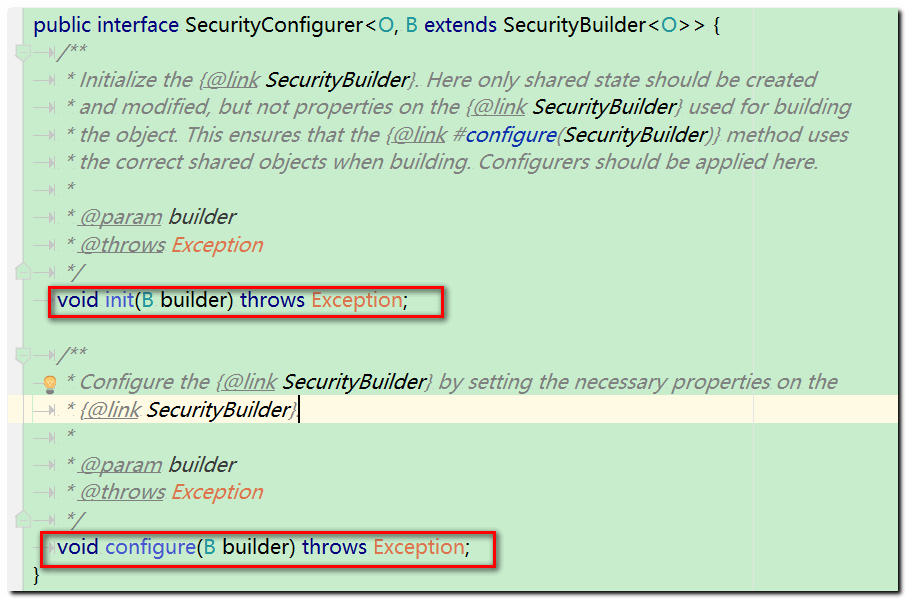 

## 1. WebSecurityConfigurerAdapter（上述接口实现类）

在使用WebSecurityConfigurerAdapter前，

先了解Spring security config配置：
Spring security config具有三个模块，一共有3个builder，认证相关的AuthenticationManagerBuilder和web相关的WebSecurity、HttpSecurity。

```markdown
- 1. AuthenticationManagerBuilder：用来配置全局的认证相关的信息，其实就是AuthenticationProvider和UserDetailsService，前者是认证服务提供商，后者是用户详情查询服务；

- 2. WebSecurity： 全局请求忽略规则配置（比如说静态文件，比如说注册页面）、全局HttpFirewall配置、是否debug配置、全局SecurityFilterChain配置、privilegeEvaluator、expressionHandler、securityInterceptor；

- 3. HttpSecurity：具体的权限控制规则配置。一个这个配置相当于xml配置中的一个标签。各种具体的认证机制的相关配置，OpenIDLoginConfigurer、AnonymousConfigurer、FormLoginConfigurer、HttpBasicConfigurer等。
```

WebSecurityConfigurerAdapter提供了简洁方式来创建WebSecurityConfigurer，其作为基类，可通过实现该类自定义配置类，主要重写这三个方法：

```java
   protected void configure(AuthenticationManagerBuilder auth) throws Exception {}
   public void configure(WebSecurity web) throws Exception {}
   protected void configure(HttpSecurity httpSecurity) throws Exception {}
```

其源码分析：

```java
//1.init初始化：获取HttpSecurity和配置FilterSecurityInterceptor拦截器到WebSecurity 
public void init(final WebSecurity web) throws Exception {
         //获取HttpSecurity
    final HttpSecurity http = getHttp();
     //配置FilterSecurityInterceptor拦截器到WebSecurity
     web.addSecurityFilterChainBuilder(http).postBuildAction(new Runnable() {
         public void run() {
             FilterSecurityInterceptor securityInterceptor = http
                     .getSharedObject(FilterSecurityInterceptor.class);
             web.securityInterceptor(securityInterceptor);
         }
     });
 }
 ......
 //2.获取HttpSecurity的过程
 protected final HttpSecurity getHttp() throws Exception {
 if (http != null) {
     return http;
 }

 DefaultAuthenticationEventPublisher eventPublisher = objectPostProcessor
         .postProcess(new DefaultAuthenticationEventPublisher());
 localConfigureAuthenticationBldr.authenticationEventPublisher(eventPublisher);

 AuthenticationManager authenticationManager = authenticationManager();
 authenticationBuilder.parentAuthenticationManager(authenticationManager);
 Map<Class<? extends Object>, Object> sharedObjects = createSharedObjects();

 http = new HttpSecurity(objectPostProcessor, authenticationBuilder,
         sharedObjects);
 if (!disableDefaults) {
     // 默认的HttpSecurity的配置
     http
                 //添加 CSRF 支持，使用WebSecurityConfigurerAdapter时，默认启用，禁用csrf().disable()
         .csrf().and() 
         //添加WebAsyncManagerIntegrationFilter
         .addFilter(new WebAsyncManagerIntegrationFilter())
         //允许配置异常处理
         .exceptionHandling().and()
         //将安全标头添加到响应
         .headers().and()
         //允许配置会话管理
         .sessionManagement().and()
         //HttpServletRequest之间的SecurityContextHolder创建securityContext管理
         .securityContext().and()
         //允许配置请求缓存
         .requestCache().and()
         //允许配置匿名用户
         .anonymous().and()
         //HttpServletRequestd的方法和属性注册在SecurityContext中
         .servletApi().and()
         //使用默认登录页面
         .apply(new DefaultLoginPageConfigurer<>()).and()
         //提供注销支持
         .logout();
     // @formatter:on
     ClassLoader classLoader = this.context.getClassLoader();
     List<AbstractHttpConfigurer> defaultHttpConfigurers =
             SpringFactoriesLoader.loadFactories(AbstractHttpConfigurer.class, classLoader);

     for(AbstractHttpConfigurer configurer : defaultHttpConfigurers) {
         http.apply(configurer);
     }
 }
 configure(http);
 return http;
 }
 ...
 //3.可重写方法实现自定义的HttpSecurity   
 protected void configure(HttpSecurity http) throws Exception {
 logger.debug("Using default configure(HttpSecurity). If subclassed this will potentially override subclass configure(HttpSecurity).");

 http
     .authorizeRequests()
         .anyRequest().authenticated()
         .and()
     .formLogin().and()
     .httpBasic();
 }
 ....  
```

从源码init初始化模块中的“获取HttpSecurity”和“配置FilterSecurityInterceptor拦截器到WebSecurity”中可以看出，想要spring Security如何知道我们要求所有用户都经过身份验证？ 

Spring Security如何知道我们想要支持基于表单的身份验证？

只要重写**protected void configure(HttpSecurity http) throws Exception方法即可**。

因此我们需要理解HttpSecurity的方法的作用，如何进行配置。


2. HttpSecurity

HttpSecurity基于Web的安全性允许为特定的http请求进行配置。其有很多方法，列举一些常用的如下表：

- csrf()添加 CSRF 支持，使用WebSecurityConfigurerAdapter时，
- openidLogin()用于基于 OpenId 的验证openidLogin().permitAll();
- authorizeRequests()开启使用HttpServletRequest请求的访问限制authorizeRequests().anyRequest().authenticated()
- formLogin()开启表单的身份验证，如果未指定FormLoginConfigurer#loginPage(String)，则将生成默认登录页面
- oauth2Login()开启OAuth 2.0或OpenID Connect 1.0身份验证
- rememberMe()开启配置“记住我”的验证
- addFilter()添加自定义的filter
- addFilterAt()在指定filter相同位置上添加自定义filter
- addFilterAfter()在指定filter位置后添加自定义filter
- requestMatchers()开启配置HttpSecurity，仅当RequestMatcher相匹配时开启
- antMatchers()其可以与authorizeRequests()、RequestMatcher匹配，
- logout()添加退出登录支持。当使用WebSecurityConfigurerAdapter时，这将自动应用。默认情况是，访问URL”/ logout”，使HTTP Session无效来清除用户，清除已配置的任何#rememberMe()身份验证，清除SecurityContextHolder，然后重定向到”/login?success”

HttpSecurity还有很多方法供我们使用，去配置HttpSecurity。由于太多这边就不一一说明，有兴趣可去研究。

3. WebSecurityConfigurerAdapter使用
   WebSecurityConfigurerAdapter示例：

```java
@Configuration
@EnableWebSecurity
public class WebSecurityConfig extends WebSecurityConfigurerAdapter {
 @Autowired
 private MyFilterSecurityInterceptor myFilterSecurityInterceptor;
    
 protected void configure(HttpSecurity http) throws Exception {    
     http
     //request 设置
     .authorizeRequests()   //http.authorizeRequests() 方法中的自定义匹配
     .antMatchers("/resources/**", "/signup", "/about").permitAll() // 指定所有用户进行访问指定的url          
     .antMatchers("/admin/**").hasRole("ADMIN")  //指定具有特定权限的用户才能访问特定目录，hasRole()方法指定用户权限，且不需前缀 “ROLE_“  
     .antMatchers("/db/**").access("hasRole('ADMIN') and hasRole('DBA')")//          
     .anyRequest().authenticated()  //任何请求没匹配的都需要进行验证                                           
     .and()        //login设置  自定义登录页面且允许所有用户登录
     .formLogin()      
     .loginPage("/login") //The updated configuration specifies the location of the log in page  指定自定义登录页面
     .permitAll(); // 允许所有用户访问登录页面. The formLogin().permitAll() 方法
     .and 
     .logout()  //logouts 设置                                                              
     .logoutUrl("/my/logout")  // 指定注销路径                                              
     .logoutSuccessUrl("/my/index") //指定成功注销后跳转到指定的页面                                        
     .logoutSuccessHandler(logoutSuccessHandler)  //指定成功注销后处理类 如果使用了logoutSuccessHandler()的话， logoutSuccessUrl()就会失效                                
     .invalidateHttpSession(true)  // httpSession是否有效时间，如果使用了 SecurityContextLogoutHandler，其将被覆盖                                        
     .addLogoutHandler(logoutHandler)  //在最后增加默认的注销处理类LogoutHandler                
     .deleteCookies(cookieNamesToClear);//指定注销成功后remove cookies
     //增加在FilterSecurityInterceptor前添加自定义的myFilterSecurityInterceptor
     http.addFilterBefore(myFilterSecurityInterceptor, FilterSecurityInterceptor.class);
   }
```


## 2. filter顺序

Spring Security filter顺序：

- ChannelProcessingFilter访问协议控制过滤器，可能会将我们重新定向到另外一种协议,从http转换成
- httpsSecurityContextPersistenceFilter创建SecurityContext安全上下文信息和request结束时清空SecurityContextHolder
- ConcurrentSessionFilter并发访问控制过滤器,主要功能：SessionRegistry中获取SessionInformation来判断session是否过期，从而实现并发访问控制
- HeaderWriterFilter给http response添加一些Header
- CsrfFilter跨域过滤器，跨站请求伪造保护Filter
- LogoutFilter处理退出登录的Filter
- X509AuthenticationFilter添加X509预授权处理机制支持
- CasAuthenticationFilter认证filter，经过这些过滤器后SecurityContextHolder中将包含一个完全组装好的Authentication对象，从而使后续鉴权能正常执行
- **UsernamePasswordAuthenticationFilter**认证的filter，经过这些过滤器后SecurityContextHolder中将包含一个完全组装好的Authentication对象，从而使后续鉴权能正常执行。表单认证是最常用的一个认证方式。
- BasicAuthenticationFilter认证filter，经过这些过滤器后SecurityContextHolder中将包含一个完全组装好的Authentication对象，从而使后续鉴权能正常执行
- SecurityContextHolderAwareRequestFilter此过滤器对ServletRequest进行了一次包装，使得request具有更加丰富的API
- JaasApiIntegrationFilter(JAAS)认证方式filter
- RememberMeAuthenticationFilter记忆认证处理过滤器，即是如果前面认证过滤器没有对当前的请求进行处理，启用了RememberMe功能，会从cookie中解析出用户，并进行认证处理，之后在SecurityContextHolder中存入一个Authentication对象。
- AnonymousAuthenticationFilter匿名认证处理过滤器，当SecurityContextHolder中认证信息为空,则会创建一个匿名用户存入到SecurityContextHolder中
- SessionManagementFilter会话管理Filter，持久化用户登录信息，可以保存到session中，也可以保存到cookie或者redis中
- ExceptionTranslationFilter异常处理过滤器，主要拦截后续过滤器（FilterSecurityInterceptor）操作中抛出的异常。
- FilterSecurityInterceptor安全拦截过滤器类，获取当前请求url对应的ConfigAttribute，并调用accessDecisionManager进行访问授权决策。

spring security的默认filter链:

```java
SecurityContextPersistenceFilter
 ->HeaderWriterFilter
 ->LogoutFilter
 ->UsernamePasswordAuthenticationFilter
 ->RequestCacheAwareFilter
 ->SecurityContextHolderAwareRequestFilter
 ->SessionManagementFilter
 ->ExceptionTranslationFilter
 ->FilterSecurityInterceptor
```


## 5. SpringBoot和SpringSecurity相关注解

**@EnableWebSecurity的作用**
首先,EnableWebSecurity注解是个组合注解,他的注解中,又使用了@EnableGlobalAuthentication注解:

```java
@Retention(RetentionPolicy.RUNTIME)
@Target({ElementType.TYPE})
@Documented
@Import({ // 1
    WebSecurityConfiguration.class,
	SpringWebMvcImportSelector.class, 
    OAuth2ImportSelector.class})
@EnableGlobalAuthentication // 2
@Configuration
public @interface EnableWebSecurity {
    boolean debug() default false;
    }
```

首先,在1处激活了WebSecurityConfiguration配置类,在这个配置类中, 注入了一个非常重要的bean, bean的name为: **springSecurityFilterChain**，这是Spring Secuity的核心过滤器, 这是请求的认证入口。

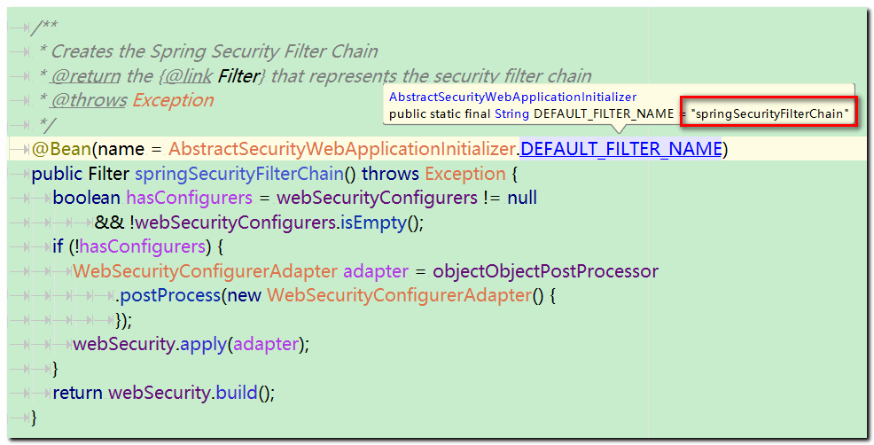 

如果是Servlet 环境，导入WebMvcSecurityConfiguration；

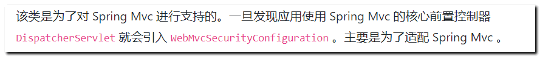 

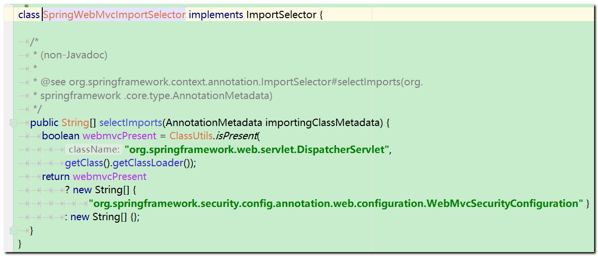 

如果是OAuth2环境，导入OAuth2ClientConfiguration; 后续学习！

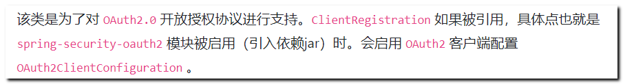 

在2处又使用了EnableGlobalAuthentication 注解, 注解源码为:

```java
@Retention(RetentionPolicy.RUNTIME)
@Target({ElementType.TYPE})
@Documented
@Import({AuthenticationConfiguration.class})
@Configuration
public @interface EnableGlobalAuthentication {
}
```

在这个注解中,激活了AuthenticationConfiguration配置类, 这个类是来配置认证相关的核心类, 

```markdown
Spring Security依赖于全局认证机制，所以这里启用全局认证机制是很自然的事。
注解@EnableGlobalAuthentication又导入了AuthenticationConfiguration用于全局认证机制配置；
AuthenticationConfiguration主要目的用于
配置认证管理器组件AuthenticationManager。
AuthenticationManager会在运行时用于认证请求者身份。
```

这个类的主要作用是,向spring容器中注入AuthenticationManagerBuilder, AuthenticationManagerBuilder其实是使用了建造者模式, 他能建造**AuthenticationManager**, 这个类是用户身份认证的入口。

所以,到这为止,**@EnableWebSecurity注解**有两个作用,

1: 加载了WebSecurityConfiguration配置类, 配置安全认证策略。 - 完成了代理过滤器以及默认的过滤器链创建

2: 加载了AuthenticationConfiguration, 配置了认证信息。 - 完成了用户的认证和授权！


## 6. SpringBoot启动类加载Security流程


1. 启动类注解  @SpringBootApplication

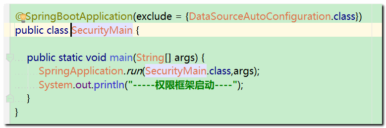 

  通过 @EnableAutoConfiguration  ---> @Import(AutoConfigurationImportSelector.class)

扫描所有的 配置类：  factories

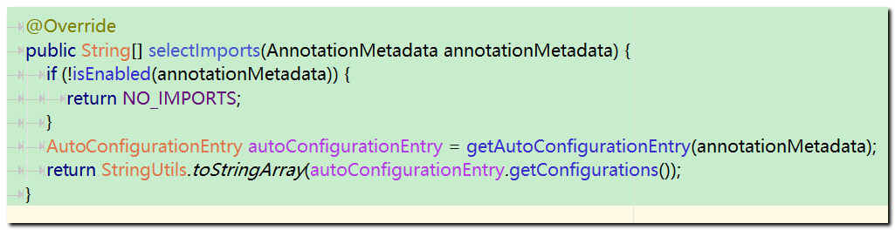 

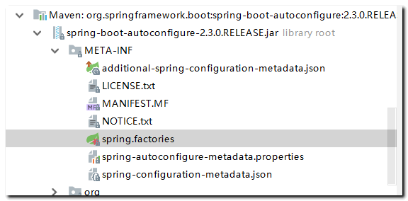 

加载spring security 框架的自动配置

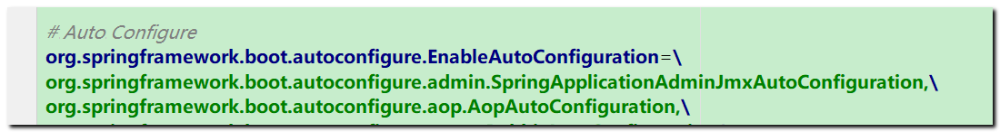 

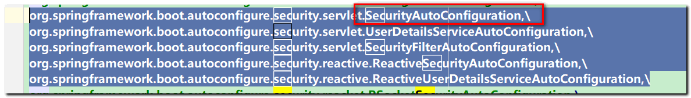 

其中在  UserDetailsServiceAutoConfiguration.java  点进去源码：

```
UserDetailsServiceAutoConfiguration.java

对象中初始化 spring security 初始化账号和密码：

SecurityProperties.class对象中我们可以看到
账号 username : user 
密码 ：uuid随机生成的： 
可以通断点模式 ： 获取密码登录

```

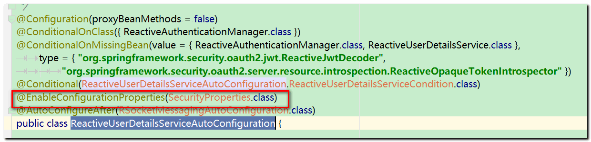

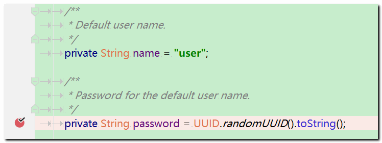 

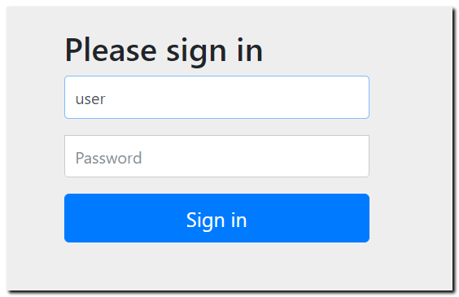 

输入账号 ： user   密码 ： 

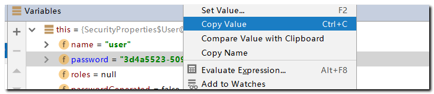 

可以直接登录！


2. SecurityAutoConfiguration.java 中 

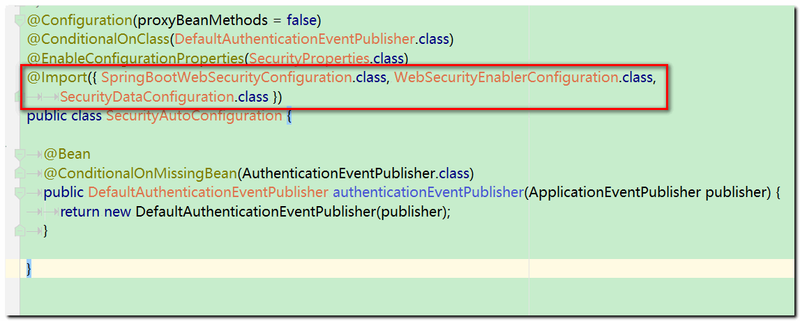 

完成了过滤器链的创建和基本配置  通过 

```java
SpringBootWebSecurityConfiguration  对象直接完成了默认过滤器链的创建和认证配置


@Configuration(proxyBeanMethods = false)
@ConditionalOnClass(WebSecurityConfigurerAdapter.class)
@ConditionalOnMissingBean(WebSecurityConfigurerAdapter.class)
@ConditionalOnWebApplication(type = Type.SERVLET)
public class SpringBootWebSecurityConfiguration {

	@Configuration(proxyBeanMethods = false)
	@Order(SecurityProperties.BASIC_AUTH_ORDER)
	static class DefaultConfigurerAdapter extends WebSecurityConfigurerAdapter {

	}

    
}

WebSecurityConfigurerAdapter  对象中的 init 方法 和  configure方法 
分别完成了过滤器链的创建和认证配置！

```


3. ```
   SecurityFilterAutoConfiguration
   完成了过滤器链代理对象创建
   ```

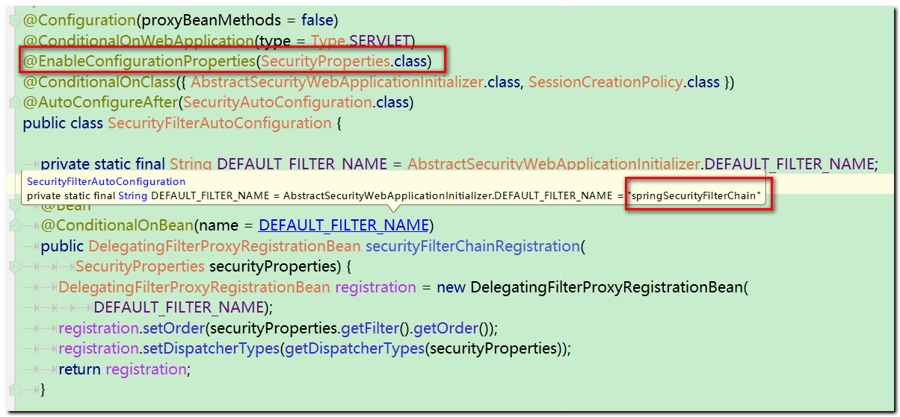

综上所述：

SpringBoot整合Spring Security框架！ 在启动类执行时， 通过java类的配置 完成了

对权限框架过滤器链以及代理过滤器对象的创建，并且完成了基本的用户认证信息！


## 7. 用户自定义权限框架的认证和配置规则

开发中，我们往往需要配置自定义的认证规则： 例如登录表单页面自定义，使用数据库访问真实用户和权限信息，过滤一些通用资源配置等，那么我就需要修改框架的默认配置

Spring Security 框架提供了一个 适配器对象给我们，方便用户可以根据自己的业务需求，修改框架的默认配置

```java
WebSecurityConfigurerAdapter
开发者只需要 编写一个配置类，继承WebSecurityConfigurerAdapter  重写里面的 configure方法
即可完成框架的默认配置！

@EnableWebSecurity //  添加此注解  重写 configure方法即可
public class SpringBootSecurityService extends WebSecurityConfigurerAdapter{

   

}
```


## 8.WebSecurityConfigurerAdapter 重要的方法说明

1. configure 参数   AuthenticationManagerBuilder

```java
protected void configure(AuthenticationManagerBuilder auth) throws Exception {
   this.disableLocalConfigureAuthenticationBldr = true;
}


重写用户认证信息模板：

  @Override
    protected void configure(AuthenticationManagerBuilder auth) throws Exception {
         auth.inMemoryAuthentication().withUser("admin").password("admin").roles("ADMIN");
         
    }

```

2. configure(HttpSecurity http)

用户自定义配置，默认执行的过滤器 可以根据这里的配置规则来实行！

```java
//  源码： 默认的过滤器、表单、认证规则信息初始化
protected void configure(HttpSecurity http) throws Exception {
   logger.debug("Using default configure(HttpSecurity). If subclassed this will potentially override subclass configure(HttpSecurity).");

   http
      .authorizeRequests()
         .anyRequest().authenticated()
         .and()
      .formLogin().and()
      .httpBasic();
}


重写 自定义权限访问规则  
模板如下：
@Override
    protected void configure(HttpSecurity http) throws Exception {
        http.formLogin() 								// 定义当需要用户登录时候，转到的登录页面。
                .loginPage("/login.html")	 					// 设置登录页面
                .loginProcessingUrl("/login.do") 			// 自定义的登录接口
                .defaultSuccessUrl("/pages/main.html")	// 登录成功之后，默认跳转的页面
                .and().authorizeRequests()		// 定义哪些URL需要被保护、哪些不需要被保护
                .antMatchers("/pages/**").authenticated()		// 设置所有人都可以访问登录页面
                .and().csrf().disable()	// 关闭csrf防护
                .headers().frameOptions().sameOrigin()
                .and().logout().logoutUrl("/logout.do").logoutSuccessUrl("/login.html").invalidateHttpSession(true)
        ;			//  iframe放行
       }

```


3. 参数 WebSecurity 

说明：  注意 configure 参数不同！

在 Spring Security 中，有一个资源，如果你希望用户不用登录就能访问，那么一般来说，你有两种配置策略：

第一种就是在 configure(WebSecurity web) 方法中配置放行，像下面这样：

```java
@Override
public void configure(WebSecurity web) throws Exception {
    web.ignoring().antMatchers("/css/**", "/js/**", "/index.html", "/img/**", "/fonts/**", "/favicon.ico", "/verifyCode");
}
```

和 参数 HttpSecurity http 对比：

两种方式最大的区别在于，第一种方式是不走 Spring Security 过滤器链，而第二种方式走 Spring Security 过滤器链，在过滤器链中，给请求放行。

在我们使用 Spring Security 的时候，有的资源可以使用第一种方式额外放行，不需要验证，例如前端页面的静态资源，就可以按照第一种方式配置放行。

有的资源放行，则必须使用第二种方式，

例如登录接口。大家知道，登录接口也是必须要暴露出来的，不需要登录就能访问到的，但是我们却不能将登录接口用第一种方式暴露出来，登录请求必须要走 Spring Security 过滤器链，因为在这个过程中，还有其他事情要做。

简而言之： 该方法 主要给用户配置 ： 通用资源，无需认证，可以直接访问的资源！ 例如： js  /css / html 等

```java
/**
 * Override this method to configure {@link WebSecurity}. For example, if you wish to
 * ignore certain requests.
 */
public void configure(WebSecurity web) throws Exception {
}

自定义配置规则模板：

  静态资源 放行
    @Override
    public void configure(WebSecurity web) throws Exception {
        web.ignoring().antMatchers("/img/**/*", "/**/*.css", "/**/*.js","/template/**","/plugins/**");
    }

```

4. 添加用户密码加密器对象 PasswordEncoder

```java
直接采用@Bean方式 创建该对象 即可
    @Bean
    public BCryptPasswordEncoder passwordEncoder() {
        return new BCryptPasswordEncoder();//  密码加密 对象
    }
```


5. 用户认证数据库版

```java
内存版的用户信息一般开发中不使用，而是采用访问数据库 获取用户的账号、密码、权限信息

   @Override
    protected void configure(AuthenticationManagerBuilder auth) throws Exception {
        auth.userDetailsService(springSecurityUserDetailsService).passwordEncoder(passwordEncoder());
    }
    


其中   springSecurityUserDetailsService  需要我们自定义一个UserDetailService 接口的实现类
重写 loadUserByUsername 方法 查询数据库，获取信息即可！

@Component("springSecurityUserDetailsService")
    public class SpringSecurityUserDetailsService implements UserDetailsService {
        
        @Override
        public UserDetails loadUserByUsername(String username) throws UsernameNotFoundException {
            
            // 在这里  根据用户账号 查询用户信息  封装到 UserDetails对象 返回即可！
            
        }
        
    }
```


6. 补充： WebSecurityConfigurerAdapter 初始化方法 init作用：

init 方法可以算是这里的入口方法了：首先调用 getHttp 方法进行 HttpSecurity 的初始化。

HttpSecurity 的初始化，实际上就是配置了一堆默认的过滤器，配置完成后，最终还调用了 configure(http) 方法，该方法又配置了一些拦截器，不过在实际开发中，我们经常会重写 configure(http) 方法！

```java
public void init(final WebSecurity web) throws Exception {
   final HttpSecurity http = getHttp();
   web.addSecurityFilterChainBuilder(http).postBuildAction(() -> {
      FilterSecurityInterceptor securityInterceptor = http
            .getSharedObject(FilterSecurityInterceptor.class);
      web.securityInterceptor(securityInterceptor);
   });
}
```


