# ssm整合课堂笔记

# 1.ssm整合

## 1.1 ssm整合的思路


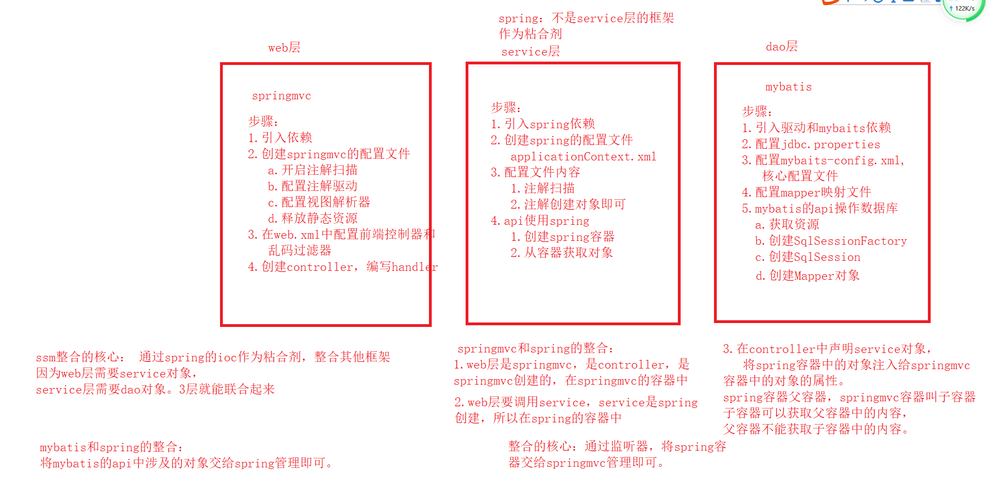


~~~
小结：框架的整合就是层与层之间的调用。
1.ssm的3大框架的基本步骤得记住
2.mybaits和spring进行整合，mapper对象交给spring容器管理
3.springmvc和spring整合的核心，将spring容器通过监听器，交给springmvc即可。
~~~


## 1.2 mybatis单独测试

sql准备

~~~sql
-- ----------------------------
-- Table structure for customer
-- ----------------------------
CREATE TABLE `customer` (
  `cust_id` int(32) NOT NULL AUTO_INCREMENT COMMENT '客户编号(主键)',
  `cust_name` varchar(32) NOT NULL COMMENT '客户名称(公司名称)',
  `cust_source` varchar(32) DEFAULT NULL COMMENT '客户信息来源',
  `cust_industry` varchar(32) DEFAULT NULL COMMENT '客户所属行业',
  `cust_level` varchar(32) DEFAULT NULL COMMENT '客户级别',
  `cust_address` varchar(128) DEFAULT NULL COMMENT '客户联系地址',
  `cust_phone` varchar(64) DEFAULT NULL COMMENT '客户联系电话',
  `cust_create_time` datetime DEFAULT NULL ON UPDATE CURRENT_TIMESTAMP COMMENT '创建时间',
  PRIMARY KEY (`cust_id`)
) ENGINE=InnoDB AUTO_INCREMENT=7 DEFAULT CHARSET=utf8;

-- ----------------------------
-- Records of customer
-- ----------------------------
INSERT INTO `customer` VALUES ('1', '传智播客', '网络营销', '互联网', '普通客户', '津安创意园', '0208888887', '2020-01-03 10:09:24');
INSERT INTO `customer` VALUES ('2', '黑马程序员', '网络营销', '互联网', '普通客户', '津安创意园', '0208888887', '2020-01-03 10:09:27');
INSERT INTO `customer` VALUES ('3', '传智专修学院', '网络营销', '互联网', '普通客户', '津安创意园', '0208888887', '2020-01-03 10:09:31');
INSERT INTO `customer` VALUES ('4', '华山派', '电视广告', '传统媒体', 'VIP', '津安创意园', '0208888886', '2020-01-03 10:09:33');
INSERT INTO `customer` VALUES ('5', '武当派', '电视广告', '传统媒体', 'VIP', '津安创意园', '0208888886', '2020-01-03 10:09:37');
INSERT INTO `customer` VALUES ('6', '丐帮', '电视广告', '传统媒体', 'VIP', '津安创意园', '0208888886', '2020-01-03 10:09:39');
~~~


创建web工程：

~~~
步骤：
1.引入依赖
2.编写jdbc.properties
3.编写mybaits核心配置mybaits-config.xml
  a.引入外部配置
  b.数据源配置
  c.mapper映射文件配置
  d.驼峰映射等等..
4.mapper映射文件
5.测试
  a.加载配置
  b.创建sqlSessionFactory
  c.创建sqlSession
  d.创建mapper对象
~~~

工程结构：

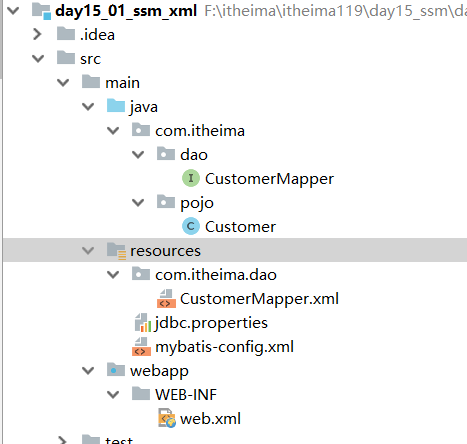


1.引入依赖

```xml
<dependencies>
    <!-- 驱动-->
    <dependency>
        <groupId>mysql</groupId>
        <artifactId>mysql-connector-java</artifactId>
        <version>5.1.38</version>
    </dependency>
    <!-- mybatis依赖-->
    <dependency>
        <groupId>org.mybatis</groupId>
        <artifactId>mybatis</artifactId>
        <version>3.4.6</version>
    </dependency>
    <!-- junit测试-->
    <dependency>
        <groupId>junit</groupId>
        <artifactId>junit</artifactId>
        <version>4.12</version>
    </dependency>


</dependencies>
```

2.编写jdbc.properties

```properties
jdbc.username=root
jdbc.password=root
jdbc.driverClass=com.mysql.jdbc.Driver
jdbc.url=jdbc:mysql://localhost:3306/itheima119_day15
```

3.编写mybaits核心配置mybaits-config.xml
  a.引入外部配置
  b.数据源配置
  c.mapper映射文件配置
  d.驼峰映射等等..

```xml
<?xml version="1.0" encoding="UTF-8" ?>
<!DOCTYPE configuration
        PUBLIC "-//mybatis.org//DTD Config 3.0//EN"
        "http://mybatis.org/dtd/mybatis-3-config.dtd">
<configuration>

    <!-- 引入外部配置-->
    <properties resource="jdbc.properties"></properties>

    <settings>
        <!-- 驼峰映射-->
        <setting name="mapUnderscoreToCamelCase" value="true"/>
    </settings>

    <!-- 别名映射-->
    <typeAliases>
        <package name="com.itheima.pojo"></package>
    </typeAliases>


    <environments default="development">
        <environment id="development">
            <transactionManager type="JDBC"/>
            <dataSource type="POOLED">
                <property name="driver" value="${jdbc.driverClass}"/>
                <property name="url" value="${jdbc.url}"/>
                <property name="username" value="${jdbc.username}"/>
                <property name="password" value="${jdbc.password}"/>
            </dataSource>
        </environment>
    </environments>
    <mappers>
       <package name="com.itheima.dao"></package>
    </mappers>
</configuration>
```

4.mapper映射文件,mapper接口和实体

Customer.java

```java
package com.itheima.pojo;

import java.util.Date;

public class Customer {


    //客户编号(主键)
    private Integer custId;

    //客户名称(公司名称)
    private String custName;

    //客户信息来源
    private String custSource;

    //客户所属行业
    private String custIndustry;

    //客户级别
    private String custLevel;

    //客户联系地址
    private String custAddress;

    //客户联系电话
    private String custPhone;

    //创建时间
    private Date custCreateTime;


    @Override
    public String toString() {
        return "Customer{" +
                "custId=" + custId +
                ", custName='" + custName + '\'' +
                ", custSource='" + custSource + '\'' +
                ", custIndustry='" + custIndustry + '\'' +
                ", custLevel='" + custLevel + '\'' +
                ", custAddress='" + custAddress + '\'' +
                ", custPhone='" + custPhone + '\'' +
                ", custCreateTime=" + custCreateTime +
                '}';
    }

    public Integer getCustId() {
        return custId;
    }

    public void setCustId(Integer custId) {
        this.custId = custId;
    }

    public String getCustName() {
        return custName;
    }

    public void setCustName(String custName) {
        this.custName = custName;
    }

    public String getCustSource() {
        return custSource;
    }

    public void setCustSource(String custSource) {
        this.custSource = custSource;
    }

    public String getCustIndustry() {
        return custIndustry;
    }

    public void setCustIndustry(String custIndustry) {
        this.custIndustry = custIndustry;
    }

    public String getCustLevel() {
        return custLevel;
    }

    public void setCustLevel(String custLevel) {
        this.custLevel = custLevel;
    }

    public String getCustAddress() {
        return custAddress;
    }

    public void setCustAddress(String custAddress) {
        this.custAddress = custAddress;
    }

    public String getCustPhone() {
        return custPhone;
    }

    public void setCustPhone(String custPhone) {
        this.custPhone = custPhone;
    }

    public Date getCustCreateTime() {
        return custCreateTime;
    }

    public void setCustCreateTime(Date custCreateTime) {
        this.custCreateTime = custCreateTime;
    }
}
```

CustomerMapper.java

```java
package com.itheima.dao;

import com.itheima.pojo.Customer;

import java.util.List;

public interface CustomerMapper {

    public List<Customer> findAll();
}
```

CustomerMapper.xml

```xml
<?xml version="1.0" encoding="UTF-8" ?>
<!DOCTYPE mapper
        PUBLIC "-//mybatis.org//DTD Mapper 3.0//EN"
        "http://mybatis.org/dtd/mybatis-3-mapper.dtd">
<!--
   mapper标签:配置各类声明
   namespace：名称空间，由于映射文件可能有多个，为了防止crud语句的唯一标识被重复，需要设置空间名称。
 -->

<mapper namespace="com.itheima.dao.CustomerMapper">
    <!--
        select:查询的statement（声明），用来编写查询语句
        id:语句的唯一标识
        resultType：配置返回的结果集类型
        parameterType：传递的参数类型，可以省略
    -->

    <select id="findAll" resultType="customer">
        select * from customer
    </select>
</mapper>
```

5.测试
  a.加载配置
  b.创建sqlSessionFactory
  c.创建sqlSession
  d.创建mapper对象


```java
package com.itheima.dao;

import com.itheima.pojo.Customer;
import org.apache.ibatis.io.Resources;
import org.apache.ibatis.session.SqlSession;
import org.apache.ibatis.session.SqlSessionFactory;
import org.apache.ibatis.session.SqlSessionFactoryBuilder;
import org.junit.Test;

import java.io.IOException;
import java.io.InputStream;
import java.util.List;

import static org.junit.Assert.*;

public class CustomerMapperTest {

    @Test
    public void findAll() {

        //1.加载资源
        InputStream is = null;
        try {
            is = Resources.getResourceAsStream("mybatis-config.xml");
        } catch (IOException e) {
            e.printStackTrace();
        }
        //2.创建sqlSessionFactory
        SqlSessionFactory sqlSessionFactory = new SqlSessionFactoryBuilder().build(is);
        //3.创建sqlSession
        SqlSession sqlSession = sqlSessionFactory.openSession();

        //4.创建mapper对象
        CustomerMapper customerMapper = sqlSession.getMapper(CustomerMapper.class);
        List<Customer> customerList = customerMapper.findAll();
        for(Customer c:customerList){
            System.out.println(c);
        }

    }
}
```

测试结果：

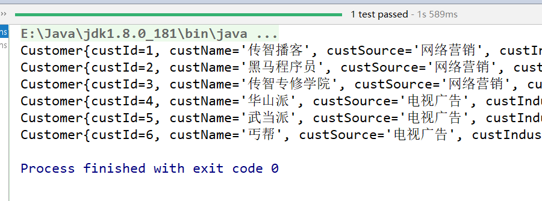


## 1.3 mybatis和spring进行整合

### 1.3.1 初步整合

步骤：

~~~
核心：将mapper对象的创建交给spring管理

1.引入mybatis和spring整合的工具类
2.mybaits的对象交给spring管理
	1.将sqlSessionFactory交给spring管理
	2.将mapper交给spring管理
	3.spring要求，数据源（数据库连接池）要交给spring管理
	4.mybaits中mybatis-config.xml中数据源的配置删除即可
3.编写spring的核心配置applicationContext.xml
	a.数据源
	b.sqlSessionFactory
	c.mapper对象
	d.注解扫描
4.编写service，添加注解，测试service（springjunit）
	采用spring的junit整合测试
~~~

工程结构:

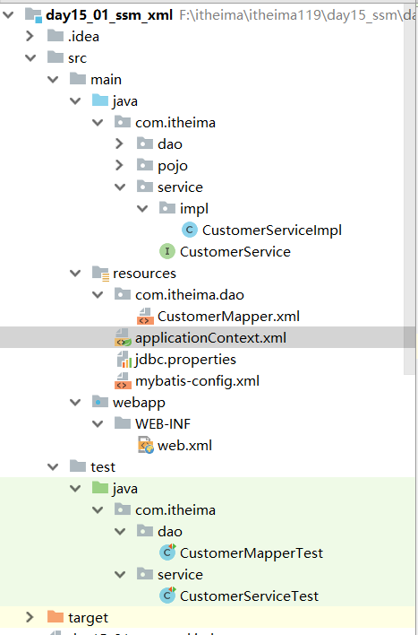


核心：将mapper对象的创建交给spring管理

1.引入mybatis和spring整合的工具类

```xml
<!-- spring的ioc相关-->
<dependency>
    <groupId>org.springframework</groupId>
    <artifactId>spring-context</artifactId>
    <version>5.0.6.RELEASE</version>
</dependency>
<!-- 德鲁伊连接池-->
<dependency>
    <groupId>com.alibaba</groupId>
    <artifactId>druid</artifactId>
    <version>1.0.9</version>
</dependency>
<!-- mybatis和spring整合的工具类，必须要求1.3以上-->
<dependency>
    <groupId>org.mybatis</groupId>
    <artifactId>mybatis-spring</artifactId>
    <version>1.3.0</version>
</dependency>
<!-- spring的单元测试-->
<dependency>
    <groupId>org.springframework</groupId>
    <artifactId>spring-test</artifactId>
    <version>5.0.6.RELEASE</version>
</dependency>
<!-- spring对于数据库的支持-->
<dependency>
    <groupId>org.springframework</groupId>
    <artifactId>spring-jdbc</artifactId>
    <version>5.0.6.RELEASE</version>
</dependency>
```

2.mybaits的对象交给spring管理
	1.将sqlSessionFactory交给spring管理
	2.将mapper交给spring管理
	3.spring要求，数据源（数据库连接池）要交给spring管理
	4.mybaits中mybatis-config.xml中数据源的配置删除即可

```xml
<?xml version="1.0" encoding="UTF-8" ?>
<!DOCTYPE configuration
        PUBLIC "-//mybatis.org//DTD Config 3.0//EN"
        "http://mybatis.org/dtd/mybatis-3-config.dtd">
<configuration>

    <!-- 引入外部配置-->
    <!--<properties resource="jdbc.properties"></properties>-->

    <settings>
        <!-- 驼峰映射-->
        <setting name="mapUnderscoreToCamelCase" value="true"/>
    </settings>

    <!-- 别名映射-->
    <typeAliases>
        <package name="com.itheima.pojo"></package>
    </typeAliases>


    <!-- 数据源-->
    <!--<environments default="development">-->
        <!--<environment id="development">-->
            <!--<transactionManager type="JDBC"/>-->
            <!--<dataSource type="POOLED">-->
                <!--<property name="driver" value="${jdbc.driverClass}"/>-->
                <!--<property name="url" value="${jdbc.url}"/>-->
                <!--<property name="username" value="${jdbc.username}"/>-->
                <!--<property name="password" value="${jdbc.password}"/>-->
            <!--</dataSource>-->
        <!--</environment>-->
    <!--</environments>-->
    <mappers>
       <package name="com.itheima.dao"></package>
    </mappers>
</configuration>
```

3.编写spring的核心配置applicationContext.xml
	a.数据源
	b.sqlSessionFactory
	c.mapper对象
	d.注解扫描

```xml
<?xml version="1.0" encoding="UTF-8"?>
<beans xmlns="http://www.springframework.org/schema/beans"
       xmlns:xsi="http://www.w3.org/2001/XMLSchema-instance"
       xmlns:context="http://www.springframework.org/schema/context"
       xsi:schemaLocation="http://www.springframework.org/schema/beans http://www.springframework.org/schema/beans/spring-beans.xsd http://www.springframework.org/schema/context http://www.springframework.org/schema/context/spring-context.xsd">

    <!-- bean definitions here -->

    
    <!-- 注解扫描-->
    <context:component-scan base-package="com.itheima"></context:component-scan>


    <!-- 引入外部配置-->
    <context:property-placeholder location="classpath:jdbc.properties"></context:property-placeholder>


    <!-- 数据源-->
    <bean id="dataSource" class="com.alibaba.druid.pool.DruidDataSource">
        <property name="password" value="${jdbc.password}"></property>
        <property name="username" value="${jdbc.username}"></property>
        <property name="url" value="${jdbc.url}"></property>
        <property name="driverClassName" value="${jdbc.driverClass}"></property>
    </bean>

    <!-- sqlSessionFactory-->
    <bean id="sqlSessionFactory" class="org.mybatis.spring.SqlSessionFactoryBean">
        <!-- 数据源-->
        <property name="dataSource" ref="dataSource"></property>
        <!--mybatis的配置文件-->
        <property name="configLocation" value="classpath:mybatis-config.xml"></property>
    </bean>

    <!--mapper对象-->
    <bean id="customerMapper" class="org.mybatis.spring.mapper.MapperFactoryBean">
        <!-- 配置mapper的接口-->
        <property name="mapperInterface" value="com.itheima.dao.CustomerMapper"></property>
        <!-- 配置sqlSessionFactory-->
        <property name="sqlSessionFactory" ref="sqlSessionFactory"></property>
    </bean>

</beans>
```


4.编写service，添加注解，测试service（springjunit）
	采用spring的junit整合测试


service接口和实现类：

```java
package com.itheima.service;

import com.itheima.pojo.Customer;

import java.util.List;

public interface CustomerService {

    public List<Customer> findAll();
}
```


实现类：

```java
package com.itheima.service.impl;

import com.itheima.dao.CustomerMapper;
import com.itheima.pojo.Customer;
import com.itheima.service.CustomerService;
import org.springframework.beans.factory.annotation.Autowired;
import org.springframework.stereotype.Service;

import java.util.List;

@Service
public class CustomerServiceImpl implements CustomerService {

    @Autowired
    private CustomerMapper customerMapper;

    @Override
    public List<Customer> findAll() {


        return customerMapper.findAll();
    }
}
```

测试类：

```java
package com.itheima.service;

import com.itheima.pojo.Customer;
import org.junit.Test;
import org.junit.runner.RunWith;
import org.springframework.beans.factory.annotation.Autowired;
import org.springframework.test.context.ContextConfiguration;
import org.springframework.test.context.junit4.SpringJUnit4ClassRunner;

import java.util.List;

import static org.junit.Assert.*;

@RunWith(SpringJUnit4ClassRunner.class)
@ContextConfiguration("classpath:applicationContext.xml")
public class CustomerServiceTest {


    @Autowired
    private CustomerService customerService;

    @Test
    public void findAll() {

        List<Customer> customerList = customerService.findAll();
        for(Customer c:customerList){
            System.out.println(c);
        }
    }
}
```


### 1.3.2 mybatis配置交给spring管理

~~~
mybatis核心配置中的别名映射，驼峰映射，接口扫描全部交给spring管理，mybatis配置中就没有配置信息了。
~~~

spring管理mybaits配置：注意，此处不需要配置mybatis核心配置文件了，否则会报错。

```xml
<!-- sqlSessionFactory-->
<bean id="sqlSessionFactory" class="org.mybatis.spring.SqlSessionFactoryBean">
    <!-- 数据源-->
    <property name="dataSource" ref="dataSource"></property>
    <!--mybatis的配置文件，因为所有的配置交给spring管理了，此处必须删除-->
    <!--<property name="configLocation" value="classpath:mybatis-config.xml"></property>-->

    <!-- 实体别名映射交给spring管理-->
    <property name="typeAliasesPackage" value="com.itheima.pojo"></property>
    <!-- 映射文件的配置-->
    <property name="mapperLocations" value="classpath:mappers/*.xml"></property>
    <!--
    Configuration:里面用来配置myabtis核心配置中settings相关的所有配置
    -->
    <property name="configuration">
        <bean class="org.apache.ibatis.session.Configuration">
            <property name="mapUnderscoreToCamelCase" value="true"></property>
        </bean>
    </property>
</bean>
```

mybatis核心配置中没有内容了

```xml
<?xml version="1.0" encoding="UTF-8" ?>
<!DOCTYPE configuration
        PUBLIC "-//mybatis.org//DTD Config 3.0//EN"
        "http://mybatis.org/dtd/mybatis-3-config.dtd">
<configuration>

    <!-- 引入外部配置-->
    <!--<properties resource="jdbc.properties"></properties>-->

    <!--<settings>-->
        <!--&lt;!&ndash; 驼峰映射&ndash;&gt;-->
        <!--<setting name="mapUnderscoreToCamelCase" value="true"/>-->
    <!--</settings>-->

    <!--&lt;!&ndash; 别名映射&ndash;&gt;-->
    <!--<typeAliases>-->
        <!--<package name="com.itheima.pojo"></package>-->
    <!--</typeAliases>-->


    <!-- 数据源-->
    <!--<environments default="development">-->
        <!--<environment id="development">-->
            <!--<transactionManager type="JDBC"/>-->
            <!--<dataSource type="POOLED">-->
                <!--<property name="driver" value="${jdbc.driverClass}"/>-->
                <!--<property name="url" value="${jdbc.url}"/>-->
                <!--<property name="username" value="${jdbc.username}"/>-->
                <!--<property name="password" value="${jdbc.password}"/>-->
            <!--</dataSource>-->
        <!--</environment>-->
    <!--</environments>-->
    <!--<mappers>-->
       <!--<package name="com.itheima.dao"></package>-->
        <!--&lt;!&ndash;&lt;!&ndash; 映射文件的位置&ndash;&gt;&ndash;&gt;-->
        <!--&lt;!&ndash;<mapper resource="mappers/CustomerMapper.xml"></mapper>&ndash;&gt;-->

    <!--</mappers>-->
</configuration>
```

### 1.3.3 log4j日志

~~~
步骤：
1.引入依赖
2.导入配置
~~~

~~~xml
    <!-- 日志 -->
        <dependency>
            <groupId>org.slf4j</groupId>
            <artifactId>slf4j-log4j12</artifactId>
            <version>1.6.1</version>
        </dependency>
~~~

日志配置

~~~~properties
log4j.appender.a=org.apache.log4j.ConsoleAppender
log4j.appender.a.Target=System.out
log4j.appender.a.layout=org.apache.log4j.PatternLayout
log4j.appender.a.layout.ConversionPattern=%-d{HH:mm:ss,SSS} [%t] [%c]-[%p] %m%n


log4j.appender.b=org.apache.log4j.FileAppender
log4j.appender.b.File=f://travel.log
log4j.appender.b.layout=org.apache.log4j.PatternLayout
log4j.appender.b.layout.ConversionPattern=%-d{yyyy-MM-dd HH:mm:ss,SSS} [%t] [%c]-[%p] %m%n

log4j.rootLogger=debug,a,b
~~~~

### 1.3.4 mapper对象创建的优化

~~~
包扫描方式创建指定包下所有的对象
~~~


```xml
    <!--mapper对象-->
<!--    <bean id="customerMapper" class="org.mybatis.spring.mapper.MapperFactoryBean">
        &lt;!&ndash; 配置mapper的接口&ndash;&gt;
        <property name="mapperInterface" value="com.itheima.dao.CustomerMapper"></property>
        &lt;!&ndash; 配置sqlSessionFactory&ndash;&gt;
        <property name="sqlSessionFactory" ref="sqlSessionFactory"></property>
    </bean>-->


    <!-- 包扫描方式创建指定包下所有的对象-->
    <bean class="org.mybatis.spring.mapper.MapperScannerConfigurer">
        <!-- 此处是value属性，不是ref，因为是bean的名字-->
        <property name="sqlSessionFactoryBeanName" value="sqlSessionFactory"></property>
        <!-- 配置扫描的包-->
        <property name="basePackage" value="com.itheima.dao"></property>
    </bean>
```

### 1.3.5 spring创建对象的第四种方式

~~~
spring创建对象有3种
1.bean标签直接反射机制创建
2.工厂类的静态方法
3.工厂类的动态方法

第四种方式：
FactoryBean接口方式：
如果一个类实现了FactoryBean接口，那么会调用这个结构的getObject()方法来创建对象，然后放到spring容器
~~~

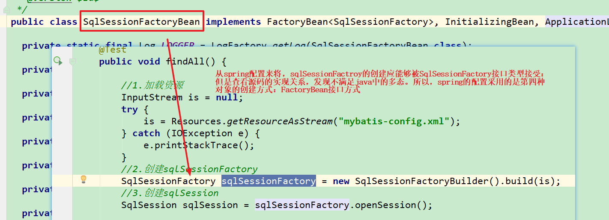


例如：

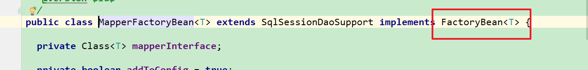


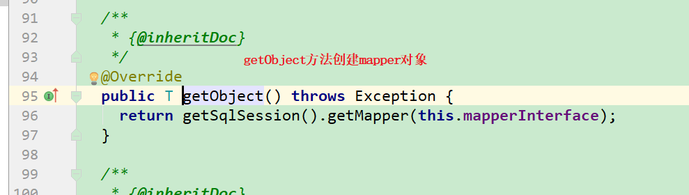


### 1.3.6 小结

~~~
spring和mybaits整合的核心： mybatis中的对象交给spring管理
1.dataSource交给spring管理
2.sqlSessionFactory交给spring管理
3.mapper对象通过扫描的方式创建，交给spring管理
4.mybatis的其他配置交给spring管理

mybatis核心配置就不要了。
~~~


最终项目结构：

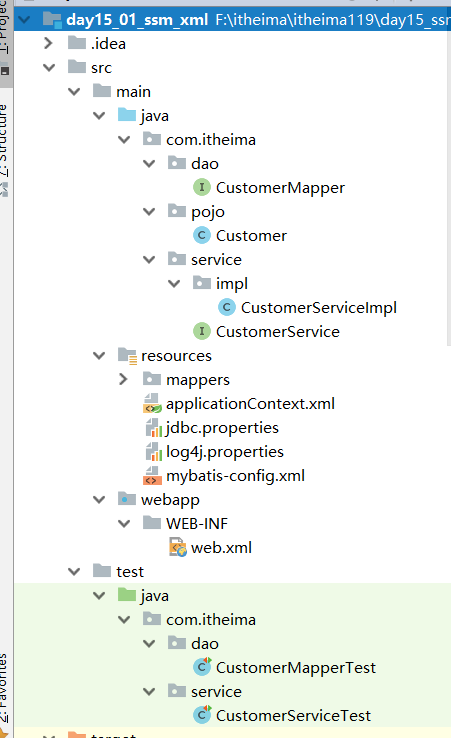


mybaits没有核心配置，只有mapper配置


spring的配置

```xml
<?xml version="1.0" encoding="UTF-8"?>
<beans xmlns="http://www.springframework.org/schema/beans"
       xmlns:xsi="http://www.w3.org/2001/XMLSchema-instance"
       xmlns:context="http://www.springframework.org/schema/context"
       xsi:schemaLocation="http://www.springframework.org/schema/beans http://www.springframework.org/schema/beans/spring-beans.xsd http://www.springframework.org/schema/context http://www.springframework.org/schema/context/spring-context.xsd">

    <!-- bean definitions here -->

    
    <!-- 注解扫描-->
    <context:component-scan base-package="com.itheima"></context:component-scan>


    <!-- 引入外部配置-->
    <context:property-placeholder location="classpath:jdbc.properties"></context:property-placeholder>


    <!-- 数据源-->
    <bean id="dataSource" class="com.alibaba.druid.pool.DruidDataSource">
        <property name="password" value="${jdbc.password}"></property>
        <property name="username" value="${jdbc.username}"></property>
        <property name="url" value="${jdbc.url}"></property>
        <property name="driverClassName" value="${jdbc.driverClass}"></property>
    </bean>

    <!-- sqlSessionFactory-->
    <bean id="sqlSessionFactory" class="org.mybatis.spring.SqlSessionFactoryBean">
        <!-- 数据源-->
        <property name="dataSource" ref="dataSource"></property>
        <!--mybatis的配置文件，因为所有的配置交给spring管理了，此处必须删除-->
        <!--<property name="configLocation" value="classpath:mybatis-config.xml"></property>-->

        <!-- 实体别名映射交给spring管理-->
        <property name="typeAliasesPackage" value="com.itheima.pojo"></property>
        <!-- 映射文件的配置-->
        <property name="mapperLocations" value="classpath:mappers/*.xml"></property>
        <!--
        Configuration:里面用来配置myabtis核心配置中settings相关的所有配置
        -->
        <property name="configuration">
            <bean class="org.apache.ibatis.session.Configuration">
                <property name="mapUnderscoreToCamelCase" value="true"></property>
            </bean>
        </property>
    </bean>

    <!--mapper对象-->
 <!--   <bean id="customerMapper" class="org.mybatis.spring.mapper.MapperFactoryBean">
        &lt;!&ndash; 配置mapper的接口
        <property name="mapperInterface" value="com.itheima.dao.CustomerMapper"></property>
         配置sqlSessionFactory
        <property name="sqlSessionFactory" ref="sqlSessionFactory"></property>
    </bean>&ndash;&gt;-->


    <!-- 包扫描方式创建指定包下所有的对象-->
    <bean class="org.mybatis.spring.mapper.MapperScannerConfigurer">
        <!-- 此处是value属性，不是ref，因为是bean的名字-->
        <property name="sqlSessionFactoryBeanName" value="sqlSessionFactory"></property>
        <!-- 配置扫描的包-->
        <property name="basePackage" value="com.itheima.dao"></property>
    </bean>

</beans>
```


## 1.4 springmvc单独测试


步骤：

~~~
1.引入依赖
2.编写springmvc的核心配置
  a.注解扫描
  b.注解驱动 
  c.视图解析器
  d.释放静态支援
3.web.xml中配置前端控制器DispatcherServlet,还有乱码过滤器
4.编写controller
5.编写jsp页面，抄
~~~


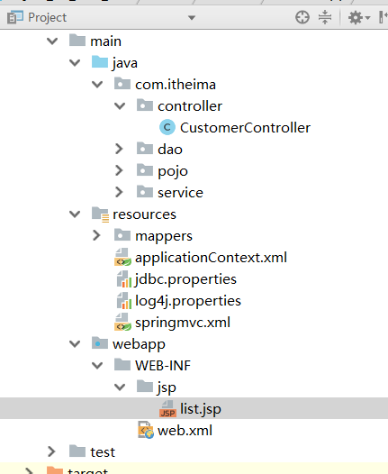

1.引入依赖

```xml
<!-- webmvc相关-->
<dependency>
    <groupId>org.springframework</groupId>
    <artifactId>spring-webmvc</artifactId>
    <version>5.0.6.RELEASE</version>
</dependency>
<!--servlet-->
<dependency>
    <groupId>javax.servlet</groupId>
    <artifactId>javax.servlet-api</artifactId>
    <version>3.0.1</version>
    <scope>provided</scope>
</dependency>
<!-- jstl标签-->
<dependency>
    <groupId>jstl</groupId>
    <artifactId>jstl</artifactId>
    <version>1.2</version>
</dependency>
```

2.编写springmvc的核心配置
  a.注解扫描
  b.注解驱动 
  c.视图解析器
  d.释放静态支援


```xml
<?xml version="1.0" encoding="UTF-8"?>
<beans xmlns="http://www.springframework.org/schema/beans"
       xmlns:xsi="http://www.w3.org/2001/XMLSchema-instance"
       xmlns:context="http://www.springframework.org/schema/context"
       xmlns:mvc="http://www.springframework.org/schema/mvc"
       xsi:schemaLocation="http://www.springframework.org/schema/beans http://www.springframework.org/schema/beans/spring-beans.xsd http://www.springframework.org/schema/context http://www.springframework.org/schema/context/spring-context.xsd http://www.springframework.org/schema/mvc http://www.springframework.org/schema/mvc/spring-mvc.xsd">

    <!-- bean definitions here -->

       
    <!-- 注解扫描-->
    <context:component-scan base-package="com.itheima">
        <!-- 排除controller注解的扫描，因为该注解已经交给了springmvc扫描，spring没必要扫描了-->
        <context:exclude-filter type="annotation" expression="org.springframework.stereotype.Controller"></context:exclude-filter>
    </context:component-scan>


    <!-- 注解驱动-->
    <mvc:annotation-driven></mvc:annotation-driven>


    <!-- 视图解析器-->
    <bean class="org.springframework.web.servlet.view.InternalResourceViewResolver">
        <property name="suffix" value=".jsp"></property>
        <property name="prefix" value="/WEB-INF/jsp/"></property>
    </bean>

    <!-- 释放静态资源-->
    <mvc:default-servlet-handler></mvc:default-servlet-handler>
</beans>
```

3.web.xml中配置前端控制器DispatcherServlet,还有乱码过滤器

```xml
<?xml version="1.0" encoding="UTF-8"?>
<web-app xmlns="http://xmlns.jcp.org/xml/ns/javaee"
         xmlns:xsi="http://www.w3.org/2001/XMLSchema-instance"
         xsi:schemaLocation="http://xmlns.jcp.org/xml/ns/javaee http://xmlns.jcp.org/xml/ns/javaee/web-app_3_1.xsd"
         version="3.1">

    <servlet>
        <servlet-name>DispatcherServlet</servlet-name>
        <servlet-class>org.springframework.web.servlet.DispatcherServlet</servlet-class>
        <!-- springmvc配置文件的位置-->
        <init-param>
            <param-name>contextConfigLocation</param-name>
            <param-value>classpath:springmvc.xml</param-value>
        </init-param>
        <!--启动时加载-->
        <load-on-startup>1</load-on-startup>
    </servlet>

    <servlet-mapping>
        <servlet-name>DispatcherServlet</servlet-name>
        <url-pattern>/</url-pattern>
    </servlet-mapping>


    <!--乱码过滤器-->
    <filter>
        <filter-name>CharacterEncodingFilter</filter-name>
        <filter-class>org.springframework.web.filter.CharacterEncodingFilter</filter-class>
        <init-param>
            <param-name>encoding</param-name>
            <param-value>utf-8</param-value>
        </init-param>
    </filter>
    <filter-mapping>
        <filter-name>CharacterEncodingFilter</filter-name>
        <url-pattern>/*</url-pattern>
    </filter-mapping>
</web-app>
```

4.编写controller

```java
package com.itheima.controller;

import org.springframework.stereotype.Controller;
import org.springframework.web.bind.annotation.RequestMapping;

@Controller
@RequestMapping("/customer")
public class CustomerController {

    @RequestMapping("/findAll")
    public String findAll(){

        return "list";
    }
}
```

5.编写jsp页面，抄

```jsp
<%@ page contentType="text/html;charset=UTF-8" language="java" %>
<%@ page isELIgnored="false" %>
<%--导入jstl标签库--%>
<%@ taglib prefix="c" uri="http://java.sun.com/jsp/jstl/core" %>
<html>
<head>
    <title>用户列表jsp页面</title>
    <style>
        table {border:1px solid #000000}
        table th{border:1px solid #000000}
        table td{border:1px solid #000000}
    </style>

    <script>

        // 添加用户
        function toAdd(id) {
            window.location.href="${pageContext.request.contextPath}/customer/toAdd";
        }

        // 修改用户
        function toUpdate(id) {
            window.location.href="${pageContext.request.contextPath}/customer/toUpdate?customerId="+id;
        }
        // 删除用户
        function  doDel(id) {
            if(confirm("确定要删除吗？")){
                window.location.href="${pageContext.request.contextPath}/customer/doDel?customerId="+id;
            }
        }
    </script>
</head>
<body>
用户列表：<button type="button"  onclick="toAdd()">添加用户</button>
<table cellpadding="0" cellspacing="0" width="80%">
    <tr>
        <th>编号</th>
        <th>公司名称</th>
        <th>信息来源</th>
        <th>所属行业</th>
        <th>级别</th>
        <th>联系地址</th>
        <th>联系电话</th>
        <th>操作</th>
    </tr>
    <c:forEach items="${list}" var="customer">
        <tr>
            <td>${customer.custId}</td>
            <td>${customer.custName}</td>
            <td>${customer.custSource}</td>
            <td>${customer.custIndustry}</td>
            <td>${customer.custLevel}</td>
            <td>${customer.custAddress}</td>
            <td>${customer.custPhone}</td>
            <td>
                <button type="button"  onclick="toUpdate('${customer.custId}')">修改</button>
                <button type="button"  onclick="doDel('${customer.custId}')">删除</button>
            </td>
        </tr>
    </c:forEach>
</table>
</body>

</html>
```


结果：

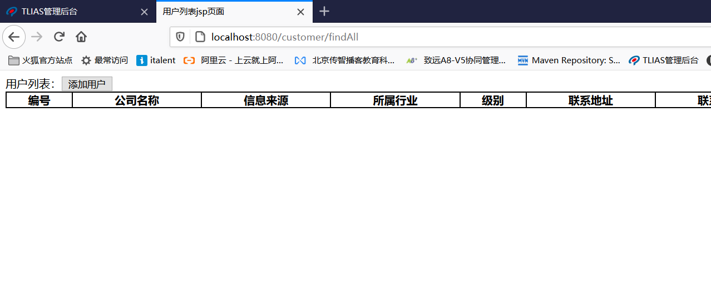


## 1.5 springmvc和spring进行整合


~~~
整合的核心：将spring容器通过监听器告知springmvc即可
步骤： 
1.controller要调用service
2.给controller进行依赖注入service
3.配置spring的监听器，将spring的容器放到servletContext域中，告知springmvc容器的位置
~~~

1.controller要调用service
2.给controller进行依赖注入service

```java
@Controller
@RequestMapping("/customer")
public class CustomerController {

    
    @Autowired
    private CustomerService customerService;
    
    @RequestMapping("/findAll")
    public String findAll(Model model){

        List<Customer> all = customerService.findAll();
        
        model.addAttribute("list",all);
        
        return "list";
    }
}
```


3.配置spring的监听器，将spring的容器放到servletContext域中，告知springmvc容器的位置

```xml
<!-- 配置spring容器的位置-->
<context-param>
    <param-name>contextConfigLocation</param-name>
    <param-value>classpath:applicationContext.xml</param-value>
</context-param>

<!-- spring的监听器-->

<listener>
    <listener-class>org.springframework.web.context.ContextLoaderListener</listener-class>
</listener>
```


测试：

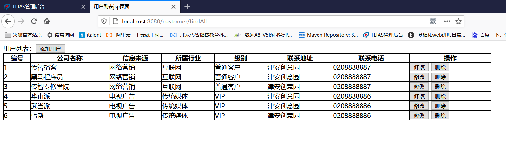


## 1.6 配置文件优化

~~~
模块化配置
applicationContext.xml  用于保存spring的配置
applicationContext_mybatis.xml 用于保存spring整合mybaits相关
applicationContext_springmvc.xml 用于springmvc配置相关
~~~

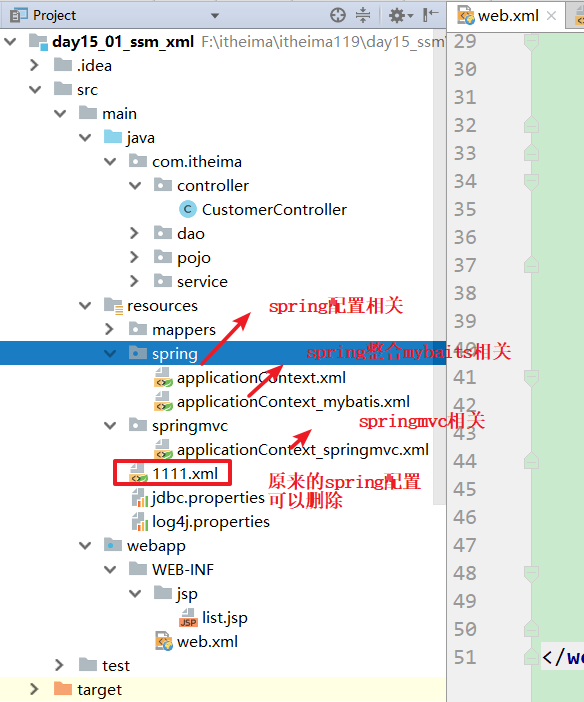


spring配置：

```xml
<?xml version="1.0" encoding="UTF-8"?>
<beans xmlns="http://www.springframework.org/schema/beans"
       xmlns:xsi="http://www.w3.org/2001/XMLSchema-instance"
       xmlns:context="http://www.springframework.org/schema/context"
       xsi:schemaLocation="http://www.springframework.org/schema/beans http://www.springframework.org/schema/beans/spring-beans.xsd http://www.springframework.org/schema/context http://www.springframework.org/schema/context/spring-context.xsd">

    <!-- bean definitions here -->
    <!-- 注解扫描-->
    <context:component-scan base-package="com.itheima">
        <!-- 排除controller注解的扫描，因为该注解已经交给了springmvc扫描，spring没必要扫描了-->
        <context:exclude-filter type="annotation" expression="org.springframework.stereotype.Controller"></context:exclude-filter>
    </context:component-scan>
    

    <!-- 引入外部配置-->
    <context:property-placeholder location="classpath:jdbc.properties"></context:property-placeholder>


</beans>
```

spring整合mybatis配置


```xml
<?xml version="1.0" encoding="UTF-8"?>
<beans xmlns="http://www.springframework.org/schema/beans"
       xmlns:xsi="http://www.w3.org/2001/XMLSchema-instance"
       xsi:schemaLocation="
        http://www.springframework.org/schema/beans http://www.springframework.org/schema/beans/spring-beans.xsd">

    <!-- bean definitions here -->


    <!-- 数据源-->
    <bean id="dataSource" class="com.alibaba.druid.pool.DruidDataSource">
        <property name="password" value="${jdbc.password}"></property>
        <property name="username" value="${jdbc.username}"></property>
        <property name="url" value="${jdbc.url}"></property>
        <property name="driverClassName" value="${jdbc.driverClass}"></property>
    </bean>

    <!-- sqlSessionFactory-->
    <bean id="sqlSessionFactory" class="org.mybatis.spring.SqlSessionFactoryBean">
        <!-- 数据源-->
        <property name="dataSource" ref="dataSource"></property>
        <!--mybatis的配置文件，因为所有的配置交给spring管理了，此处必须删除-->
        <!--<property name="configLocation" value="classpath:mybatis-config.xml"></property>-->

        <!-- 实体别名映射交给spring管理-->
        <property name="typeAliasesPackage" value="com.itheima.pojo"></property>
        <!-- 映射文件的配置-->
        <property name="mapperLocations" value="classpath:mappers/*.xml"></property>
        <!--
        Configuration:里面用来配置myabtis核心配置中settings相关的所有配置
        -->
        <property name="configuration">
            <bean class="org.apache.ibatis.session.Configuration">
                <property name="mapUnderscoreToCamelCase" value="true"></property>
            </bean>
        </property>
    </bean>

    <!--mapper对象-->
    <!--   <bean id="customerMapper" class="org.mybatis.spring.mapper.MapperFactoryBean">
           &lt;!&ndash; 配置mapper的接口
           <property name="mapperInterface" value="com.itheima.dao.CustomerMapper"></property>
            配置sqlSessionFactory
           <property name="sqlSessionFactory" ref="sqlSessionFactory"></property>
       </bean>&ndash;&gt;-->


    <!-- 包扫描方式创建指定包下所有的对象-->
    <bean class="org.mybatis.spring.mapper.MapperScannerConfigurer">
        <!-- 此处是value属性，不是ref，因为是bean的名字-->
        <property name="sqlSessionFactoryBeanName" value="sqlSessionFactory"></property>
        <!-- 配置扫描的包-->
        <property name="basePackage" value="com.itheima.dao"></property>
    </bean>
</beans>
```

springmvc配置

```xml
<?xml version="1.0" encoding="UTF-8"?>
<beans xmlns="http://www.springframework.org/schema/beans"
       xmlns:xsi="http://www.w3.org/2001/XMLSchema-instance"
       xmlns:context="http://www.springframework.org/schema/context"
       xmlns:mvc="http://www.springframework.org/schema/mvc"
       xsi:schemaLocation="http://www.springframework.org/schema/beans http://www.springframework.org/schema/beans/spring-beans.xsd http://www.springframework.org/schema/context http://www.springframework.org/schema/context/spring-context.xsd http://www.springframework.org/schema/mvc http://www.springframework.org/schema/mvc/spring-mvc.xsd">

    <!-- bean definitions here -->

    <!-- 注解扫描-->
    <context:component-scan base-package="com.itheima.controller"></context:component-scan>

    <!-- 注解驱动-->
    <mvc:annotation-driven></mvc:annotation-driven>


    <!-- 视图解析器-->
    <bean class="org.springframework.web.servlet.view.InternalResourceViewResolver">
        <property name="suffix" value=".jsp"></property>
        <property name="prefix" value="/WEB-INF/jsp/"></property>
    </bean>

    <!-- 释放静态资源-->
    <mvc:default-servlet-handler></mvc:default-servlet-handler>
</beans>
```


## 1.7 小结

~~~
1.3大框架单独开发
整合的核心：
service层调用dao层：spring和mybatis整合
   mybatis相关独享交给spring管理
   a.数据源
   b.sqlSessionFactory
   c.mapper对象，包扫描方式创建
   d.mybatis配置移植到spring

controller层调用service层：spring和springmvc整合：
将spring容器通过监听器交给springmvc即可
~~~


# 2.纯注解开发（了解）

~~~
核心： 配置类代替配置文件

步骤：
1.创建一个配置类SpringConfig.java,替代applicationContext.xml
2.创建一个配置类SpringMVCConfig.java,代替applicationContext_springmvc.xml
3.创建一个配置类MyBatisConfig.java，替代applicationContext_mybaits.xml
4.创建一个配置类WebProjectInitConfig来替代web.xml配置
5.在pom.xml中配置插件，表示war包不需要web.xml配置
~~~

SpringConfig.java


```java
package com.itheima.config;

import org.springframework.context.annotation.ComponentScan;
import org.springframework.context.annotation.Configuration;
import org.springframework.context.annotation.Import;
import org.springframework.context.annotation.PropertySource;
import org.springframework.stereotype.Controller;

@Configuration //声明当前类是一个配置类
@ComponentScan(value = "com.itheima",
        excludeFilters = @ComponentScan.Filter(Controller.class)) //注解扫描，排除注解Controller
@PropertySource("classpath:jdbc.properties") //加载外部配置
@Import(MyBatisConfig.class)
public class SpringConfig {
}
```

SpringMVCConfig.java

```java
package com.itheima.config;

import org.springframework.context.annotation.Bean;
import org.springframework.context.annotation.ComponentScan;
import org.springframework.web.servlet.config.annotation.DefaultServletHandlerConfigurer;
import org.springframework.web.servlet.config.annotation.EnableWebMvc;
import org.springframework.web.servlet.config.annotation.WebMvcConfigurationSupport;
import org.springframework.web.servlet.view.InternalResourceViewResolver;

@ComponentScan("com.itheima.controller") //包扫描
@EnableWebMvc  //开启注解驱动
public class SpringMVCConfig extends WebMvcConfigurationSupport {


    @Override
    protected void configureDefaultServletHandling(DefaultServletHandlerConfigurer configurer) {

        //释放静态资源
       configurer.enable();
    }


    @Bean
    public InternalResourceViewResolver viewResolver(){

        InternalResourceViewResolver viewResolver = new InternalResourceViewResolver();

        //设置前缀后缀
        viewResolver.setSuffix(".jsp");
        viewResolver.setPrefix("/WEB-INF/jsp/");

        return viewResolver;
    }

}
```

MyBatisConfig.java

```java
package com.itheima.config;

import com.alibaba.druid.pool.DruidDataSource;
import org.apache.ibatis.session.Configuration;
import org.apache.ibatis.session.SqlSessionFactory;
import org.apache.ibatis.session.SqlSessionFactoryBuilder;
import org.mybatis.spring.SqlSessionFactoryBean;
import org.mybatis.spring.annotation.MapperScan;
import org.springframework.beans.factory.annotation.Value;
import org.springframework.context.annotation.Bean;

import javax.sql.DataSource;


@MapperScan(basePackages = "com.itheima.dao",sqlSessionFactoryRef ="sqlSessionFactory" )
public class MyBatisConfig {

    @Value("${jdbc.password}")
    private String password;

    @Value("${jdbc.url}")
    private String url;

    @Value("${jdbc.username}")
    private String username;

    @Value("${jdbc.driverClass}")
    private String driverClassName;


    @Bean
    public DataSource dataSource(){

        DruidDataSource dataSource = new DruidDataSource();
        dataSource.setPassword(password);
        dataSource.setUsername(username);
        dataSource.setDriverClassName(driverClassName);
        dataSource.setUrl(url);

        return dataSource;
    }


    @Bean
    public SqlSessionFactory sqlSessionFactory(DataSource dataSource){
        SqlSessionFactoryBean sqlSessionFactoryBean = new SqlSessionFactoryBean();

        //属性设置，设置数据源
        sqlSessionFactoryBean.setDataSource(dataSource);

        //设置包扫描
        sqlSessionFactoryBean.setTypeAliasesPackage("com.itheima.pojo");

        //设置configuration
        Configuration configuration = new Configuration();
        configuration.setMapUnderscoreToCamelCase(true);
        sqlSessionFactoryBean.setConfiguration(configuration);


        SqlSessionFactory sqlSessionFactory = null;
        try {
            //spring创建对象的第四种方式，实现FactroyBean接口，会调用getObject()方法创建对象
            sqlSessionFactory = sqlSessionFactoryBean.getObject();
        } catch (Exception e) {
            e.printStackTrace();
        }

        return sqlSessionFactory;
    }

}
```


WebProjctionInitConfig.java

```java
package com.itheima.config;

import org.springframework.web.filter.CharacterEncodingFilter;
import org.springframework.web.servlet.support.AbstractAnnotationConfigDispatcherServletInitializer;

import javax.servlet.FilterRegistration;
import javax.servlet.ServletContext;
import javax.servlet.ServletException;

public class WebProjectInitConfig extends AbstractAnnotationConfigDispatcherServletInitializer{


    @Override
    public void onStartup(ServletContext servletContext) throws ServletException {

        //注册过滤器
        FilterRegistration.Dynamic encodingFilter = servletContext.addFilter("characterEncodingFilter", new CharacterEncodingFilter());

        //配置过滤器的初始化参数
        encodingFilter.setInitParameter("encoding","utf-8");

        //配置过滤器的映射路径
        encodingFilter.addMappingForUrlPatterns(null,false,"/*");

        super.onStartup(servletContext);
    }

    //spring的配置类
    @Override
    protected Class<?>[] getRootConfigClasses() {
        return new Class[]{SpringConfig.class};
    }

    //springmvc的配置类
    @Override
    protected Class<?>[] getServletConfigClasses() {
        return new Class[]{SpringMVCConfig.class};
    }

    // 前端控制器DispatcherServlet的映射路径
    @Override
    protected String[] getServletMappings() {
        return new String[]{"/"};
    }
}
```

pom.xml中声明不需要web.xml打war包

```xml
<!--maven打war的插件-->
<!-- 声明打包时，不需要web.xml -->
<plugin>
    <groupId>org.apache.maven.plugins</groupId>
    <artifactId>maven-war-plugin</artifactId>
    <version>2.4</version>
    <configuration>
        <!-- 声明不需要web.xml-->
        <failOnMissingWebXml>false</failOnMissingWebXml>
    </configuration>
</plugin>
```

