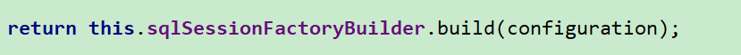

# 课堂笔记

# 1.整合的思路


~~~
小结：
ssm整合的思想：通过spring的ioc的思想进行整合

spring和mybaits整合的思路：使用spring去创建mybaits所需要的对象即可。
         编写applicationContext.xml配置
spring和springmvc整合的思路：将spring容器交给springmvc管理即可。
		 编写web.xml配置，添加一个监听器即可。
~~~

# 2.ssm整合(掌握)

## 2.1 mybaits单独测试

~~~
步骤：
0.数据环境和实体
1.引入mybaits依赖
2.创建mybatis-config.xml
3.创建mapper映射文件
4.通过mybaits的api进行测试

~~~

0.数据环境和实体,创建工程

工程结构：


~~~sql
-- ----------------------------
-- Table structure for customer
-- ----------------------------
CREATE TABLE `customer` (
  `cust_id` int(32) NOT NULL AUTO_INCREMENT COMMENT '客户编号(主键)',
  `cust_name` varchar(32) NOT NULL COMMENT '客户名称(公司名称)',
  `cust_source` varchar(32) DEFAULT NULL COMMENT '客户信息来源',
  `cust_industry` varchar(32) DEFAULT NULL COMMENT '客户所属行业',
  `cust_level` varchar(32) DEFAULT NULL COMMENT '客户级别',
  `cust_address` varchar(128) DEFAULT NULL COMMENT '客户联系地址',
  `cust_phone` varchar(64) DEFAULT NULL COMMENT '客户联系电话',
  `cust_create_time` datetime DEFAULT NULL ON UPDATE CURRENT_TIMESTAMP COMMENT '创建时间',
  PRIMARY KEY (`cust_id`)
) ENGINE=InnoDB AUTO_INCREMENT=7 DEFAULT CHARSET=utf8;

-- ----------------------------
-- Records of customer
-- ----------------------------
INSERT INTO `customer` VALUES ('1', '传智播客', '网络营销', '互联网', '普通客户', '津安创意园', '0208888887', '2020-01-03 10:09:24');
INSERT INTO `customer` VALUES ('2', '黑马程序员', '网络营销', '互联网', '普通客户', '津安创意园', '0208888887', '2020-01-03 10:09:27');
INSERT INTO `customer` VALUES ('3', '传智专修学院', '网络营销', '互联网', '普通客户', '津安创意园', '0208888887', '2020-01-03 10:09:31');
INSERT INTO `customer` VALUES ('4', '华山派', '电视广告', '传统媒体', 'VIP', '津安创意园', '0208888886', '2020-01-03 10:09:33');
INSERT INTO `customer` VALUES ('5', '武当派', '电视广告', '传统媒体', 'VIP', '津安创意园', '0208888886', '2020-01-03 10:09:37');
INSERT INTO `customer` VALUES ('6', '丐帮', '电视广告', '传统媒体', 'VIP', '津安创意园', '0208888886', '2020-01-03 10:09:39');
~~~

Customer.java

```java
package com.itheima.pojo;

import java.util.Date;

public class Customer {

    //客户编号(主键)
    private Integer custId;

    //客户名称(公司名称)
    private String custName;

    //客户信息来源
    private String custSource;

    //客户所属行业
    private String custIndustry;

    //客户级别
    private String custLevel;

    //客户联系地址
    private String custAddress;

    //客户联系电话
    private String custPhone;

    //创建时间
    private Date custCreateTime;

    public Integer getCustId() {
        return custId;
    }

    public void setCustId(Integer custId) {
        this.custId = custId;
    }

    public String getCustName() {
        return custName;
    }

    public void setCustName(String custName) {
        this.custName = custName;
    }

    public String getCustSource() {
        return custSource;
    }

    public void setCustSource(String custSource) {
        this.custSource = custSource;
    }

    public String getCustIndustry() {
        return custIndustry;
    }

    public void setCustIndustry(String custIndustry) {
        this.custIndustry = custIndustry;
    }

    public String getCustLevel() {
        return custLevel;
    }

    public void setCustLevel(String custLevel) {
        this.custLevel = custLevel;
    }

    public String getCustAddress() {
        return custAddress;
    }

    public void setCustAddress(String custAddress) {
        this.custAddress = custAddress;
    }

    public String getCustPhone() {
        return custPhone;
    }

    public void setCustPhone(String custPhone) {
        this.custPhone = custPhone;
    }

    public Date getCustCreateTime() {
        return custCreateTime;
    }

    public void setCustCreateTime(Date custCreateTime) {
        this.custCreateTime = custCreateTime;
    }

    @Override
    public String toString() {
        return "Customer{" +
                "custId=" + custId +
                ", custName='" + custName + '\'' +
                ", custSource='" + custSource + '\'' +
                ", custIndustry='" + custIndustry + '\'' +
                ", custLevel='" + custLevel + '\'' +
                ", custAddress='" + custAddress + '\'' +
                ", custPhone='" + custPhone + '\'' +
                ", custCreateTime=" + custCreateTime +
                '}';
    }
}
```


1.引入mybaits依赖

pom.xml

```xml
<!-- 数据库驱动 -->
<dependency>
    <groupId>mysql</groupId>
    <artifactId>mysql-connector-java</artifactId>
    <version>5.1.38</version>
</dependency>
<!-- mybatis依赖 -->
<dependency>
    <groupId>org.mybatis</groupId>
    <artifactId>mybatis</artifactId>
    <version>3.4.6</version>
</dependency>
<!--junit测试-->
<dependency>
    <groupId>junit</groupId>
    <artifactId>junit</artifactId>
    <version>4.12</version>
</dependency>
```


2.创建mybatis-config.xml

```xml
<?xml version="1.0" encoding="UTF-8" ?>
<!DOCTYPE configuration
        PUBLIC "-//mybatis.org//DTD Config 3.0//EN"
        "http://mybatis.org/dtd/mybatis-3-config.dtd">
<configuration>

    <!-- 引入外部配置-->
    <properties resource="jdbc.properties"></properties>


    <settings>
        <!--驼峰映射-->
        <setting name="mapUnderscoreToCamelCase" value="true"/>
    </settings>


    <typeAliases>
        <!-- 别名映射，默认类名就是实体名称-->
        <package name="com.itheima.pojo"></package>
    </typeAliases>

    <environments default="development">
        <environment id="development">
            <transactionManager type="JDBC"/>
            <dataSource type="POOLED">
                <property name="driver" value="${jdbc.driverClass}"/>
                <property name="url" value="${jdbc.url}"/>
                <property name="username" value="${jdbc.username}"/>
                <property name="password" value="${jdbc.password}"/>
            </dataSource>
        </environment>
    </environments>
    <mappers>
        <!--  包扫描映射文件 -->
       <package name="com.itheima.dao"></package>
    </mappers>
</configuration>
```


3.创建mapper映射文件

```xml
<?xml version="1.0" encoding="UTF-8" ?>
<!DOCTYPE mapper
        PUBLIC "-//mybatis.org//DTD Mapper 3.0//EN"
        "http://mybatis.org/dtd/mybatis-3-mapper.dtd">
<!--
   mapper标签:配置各类声明
   namespace：名称空间，由于映射文件可能有多个，为了防止crud语句的唯一标识被重复，需要设置空间名称。
 -->

<mapper namespace="com.itheima.dao.CustomerMapper">
    <!--
        select:查询的statement（声明），用来编写查询语句
        id:语句的唯一标识
        resultType：配置返回的结果集类型
        parameterType：传递的参数类型，可以省略
    -->

    <select id="findAll" resultType="customer">
        select * from customer
    </select>
</mapper>
```


4.通过mybaits的api进行测试

```java
package com.itheima.dao;

import com.itheima.pojo.Customer;
import org.apache.ibatis.io.Resources;
import org.apache.ibatis.session.SqlSession;
import org.apache.ibatis.session.SqlSessionFactory;
import org.apache.ibatis.session.SqlSessionFactoryBuilder;
import org.junit.Before;
import org.junit.Test;

import java.io.InputStream;
import java.util.List;

import static org.junit.Assert.*;

public class CustomerMapperTest {

    private CustomerMapper customerMapper;

    @Before
    public void setUp() throws Exception {

        //a.获取配置
        InputStream is = Resources.getResourceAsStream("mybatis-config.xml");
        //b.创建sqlSessionFactory
        SqlSessionFactory sqlSessionFactory = new SqlSessionFactoryBuilder().build(is);
        //c.创建sqlSession
        SqlSession sqlSession = sqlSessionFactory.openSession();
        //d.创建mapper对象
        customerMapper = sqlSession.getMapper(CustomerMapper.class);
    }

    @Test
    public void findAll() {
        List<Customer> list = customerMapper.findAll();
        for(Customer c:list){
            System.out.println(c);
        }
    }
}
```

## 2.2 spring和mybaits整合

### 2.2.1 整合的思路

~~~
spring创建mybaits需要的对象
~~~


### 2.2.2 初步整合

~~~
整合步骤：
	1.引入spring的ioc依赖,单元测试依赖，mybaits和spring整合的依赖
	2.创建spring的配置文件applicationContext
	3.spring创建mybaits需要的对象。
~~~

​	1.引入spring的ioc依赖,单元测试依赖，mybaits和spring整合的依赖

```xml
<!--junit测试-->
 <dependency>
     <groupId>junit</groupId>
     <artifactId>junit</artifactId>
     <version>4.12</version>
 </dependency>
 <!-- spring的ioc相关-->
 <dependency>
     <groupId>org.springframework</groupId>
     <artifactId>spring-context</artifactId>
     <version>5.0.6.RELEASE</version>
 </dependency>
 <!-- spring的测试相关-->
 <dependency>
     <groupId>org.springframework</groupId>
     <artifactId>spring-test</artifactId>
     <version>5.0.6.RELEASE</version>
 </dependency>
 <!-- spring和mybatis整合依赖必须使用1.3以上的大版本-->
 <dependency>
     <groupId>org.mybatis</groupId>
     <artifactId>mybatis-spring</artifactId>
     <version>1.3.1</version>
 </dependency>

 <!--spring的jdbc相关-->
<dependency>
    <groupId>org.springframework</groupId>
    <artifactId>spring-jdbc</artifactId>
    <version>5.0.6.RELEASE</version>
</dependency>
 <!-- 阿里巴巴的数据源-->
 <dependency>
     <groupId>com.alibaba</groupId>
     <artifactId>druid</artifactId>
     <version>1.0.9</version>
 </dependency>
```

​	2.创建spring的配置文件applicationContext

​	3.spring创建mybaits需要的对象。

​		a.数据源

```xml
<!-- bean definitions here -->
<!-- 加载外部配置-->
<context:property-placeholder location="classpath:jdbc.properties"></context:property-placeholder>

<!--spring必须要求，数据源交给spring管理-->
<bean id="dataSource" class="com.alibaba.druid.pool.DruidDataSource">

    <property name="url" value="${jdbc.url}"></property>
    <property name="username" value="${jdbc.username}"></property>
    <property name="password" value="${jdbc.password}"></property>
    <property name="driverClassName" value="${jdbc.driverClass}"></property>
</bean>
```

​		b.创建sqlSessionFactory

```xml
<!--创建sqlSessionFactory-->
<bean id="sqlSessionFactory" class="org.mybatis.spring.SqlSessionFactoryBean">
    <!--配置mybaits核心配置文件的位置-->
    <property name="configLocation" value="classpath:mybatis-config.xml"></property>
    <!-- 配置数据源-->
    <property name="dataSource" ref="dataSource"></property>
</bean>
```

​		c.创建mapper对象

```xml
<!-- 创建customerMapper-->
<bean id="customerMapper" class="org.mybatis.spring.mapper.MapperFactoryBean">
    <!-- 注入sqlSessionFactory-->
    <property name="sqlSessionFactory" ref="sqlSessionFactory"></property>
    <!-- 注入接口类型，用于动态代理创建对象-->
    <property name="mapperInterface" value="com.itheima.dao.CustomerMapper"></property>
</bean>
```

​	    d.mybatis核心配置中的数据源配置删除，因为交给spring管理了。


### 2.2.3 mybaits配置优化

~~~
mybaits的所有配置全部交给spring进行管理，mybaits的配置就不需要了。
~~~

~~~xml
    <!--创建sqlSessionFactory-->
    <bean id="sqlSessionFactory" class="org.mybatis.spring.SqlSessionFactoryBean">

        <!-- 配置数据源-->
        <property name="dataSource" ref="dataSource"></property>
        <!-- 别名映射-->
        <property name="typeAliasesPackage" value="com.itheima.pojo"></property>
        <!-- 映射文件配置-->
        <property name="mapperLocations" value="classpath:com/itheima/dao/*.xml"></property>
         <!-- mybatis的settings标签配置-->
        <property name="configuration">
            <bean class="org.apache.ibatis.session.Configuration">
                <property name="mapUnderscoreToCamelCase" value="true"></property>
            </bean>
        </property>
    </bean>
~~~


### 2.2.4 添加日志

~~~
1.引入slf4j依赖
2.创建log4j.properties配置即可

~~~


```xml
<dependency>
    <groupId>org.slf4j</groupId>
    <artifactId>slf4j-log4j12</artifactId>
    <version>1.6.4</version>
</dependency>
```


log4j.properties

```properties
## 输出源：日志输出的目的地
## 输出源的配置语法  log4j.appender.输出源名 = 配置
log4j.appender.a=org.apache.log4j.ConsoleAppender
log4j.appender.a.Target=System.out
log4j.appender.a.layout=org.apache.log4j.PatternLayout
log4j.appender.a.layout.ConversionPattern=%-d{HH:mm:ss,SSS} [%t] [%c]-[%p] %m%n

# 输出源
log4j.appender.b=org.apache.log4j.FileAppender
log4j.appender.b.File=f://travel.log
log4j.appender.b.layout=org.apache.log4j.PatternLayout
log4j.appender.b.layout.ConversionPattern=%-d{yyyy-MM-dd HH:mm:ss,SSS} [%t] [%c]-[%p] %m%n

## 日志输出配置   log4j.rootLogger=日志输出级别,输出源名,输出源名....
log4j.rootLogger=debug,a,b
```

### 2.2.5 mapper配置优化

~~~
包扫描方式创建mapper对象
~~~


```xml
<!--包扫描方式创建所有的mapper对象-->
<bean class="org.mybatis.spring.mapper.MapperScannerConfigurer">
    <property name="basePackage" value="com.itheima.dao" />
    <!-- optional unless there are multiple session factories defined -->
    <property name="sqlSessionFactoryBeanName" value="sqlSessionFactory" />
</bean>
```


### 2.2.6 spring和mybatis整合小结（重点）

~~~
spring创建数据源
spring创建sqlSessionFactory
spring包扫描方式创建mapper对象
mybaits所有配置交个spring管理，
~~~

spring和mybatis整合的完整配置

```xml
<?xml version="1.0" encoding="UTF-8"?>
<beans xmlns="http://www.springframework.org/schema/beans"
       xmlns:xsi="http://www.w3.org/2001/XMLSchema-instance"
       xmlns:context="http://www.springframework.org/schema/context"
       xsi:schemaLocation="http://www.springframework.org/schema/beans http://www.springframework.org/schema/beans/spring-beans.xsd http://www.springframework.org/schema/context http://www.springframework.org/schema/context/spring-context.xsd">

    <!-- bean definitions here -->
    <!-- 加载外部配置-->
    <context:property-placeholder location="classpath:jdbc.properties"></context:property-placeholder>

    <!--spring必须要求，数据源交给spring管理-->
    <bean id="dataSource" class="com.alibaba.druid.pool.DruidDataSource">

        <property name="url" value="${jdbc.url}"></property>
        <property name="username" value="${jdbc.username}"></property>
        <property name="password" value="${jdbc.password}"></property>
        <property name="driverClassName" value="${jdbc.driverClass}"></property>
    </bean>


    <!--创建sqlSessionFactory-->
    <bean id="sqlSessionFactory" class="org.mybatis.spring.SqlSessionFactoryBean">

        <!-- 配置数据源-->
        <property name="dataSource" ref="dataSource"></property>
        <!-- 别名映射-->
        <property name="typeAliasesPackage" value="com.itheima.pojo"></property>
        <!-- 映射文件配置-->
        <property name="mapperLocations" value="classpath:com/itheima/dao/*.xml"></property>
         <!-- mybatis的settings标签配置-->
        <property name="configuration">
            <bean class="org.apache.ibatis.session.Configuration">
                <property name="mapUnderscoreToCamelCase" value="true"></property>
            </bean>
        </property>
    </bean>

    <!-- 创建customerMapper-->
  <!--  <bean id="customerMapper" class="org.mybatis.spring.mapper.MapperFactoryBean">
        &lt;!&ndash; 注入sqlSessionFactory&ndash;&gt;
        <property name="sqlSessionFactory" ref="sqlSessionFactory"></property>
        &lt;!&ndash; 注入接口类型，用于动态代理创建对象&ndash;&gt;
        <property name="mapperInterface" value="com.itheima.dao.CustomerMapper"></property>
    </bean>
-->

    <!--包扫描方式创建所有的mapper对象-->
    <bean class="org.mybatis.spring.mapper.MapperScannerConfigurer">
        <property name="basePackage" value="com.itheima.dao" />
        <!-- optional unless there are multiple session factories defined -->
        <property name="sqlSessionFactoryBeanName" value="sqlSessionFactory" />
    </bean>
</beans>
```

### 2.2.7 spring创建对象的第4种方式（扩展，了解）

~~~
spring创建对象的3种方式：
	1.默认无参构造
	2.工厂类的静态方法
	3.工厂类的动态方法
	
第4种方式：factoryBean接口方式。原理和工厂类的方式类似。	
	只要一个类实现了spring的FactoryBean接口，那么spring在创建对象时，调用了FactoryBean的getObject()方法来创建对象。
~~~


单个mapper的创建





## 2.3.springmvc单独测试

~~~
步骤：
	1.引入依赖
	2.在web.xml中配置
		a.前端控制器
		b.乱码过滤器
	3.在springmvc.xml中配置
    	a.注解扫描
    	b.注解驱动
    	c.视图解析器
    	d.释放静态资源
    3.编写controller
    4.编写list.jsp
~~~

步骤：
	1.引入依赖

```xml
<!-- springmvc相关-->
<dependency>
    <groupId>org.springframework</groupId>
    <artifactId>spring-webmvc</artifactId>
    <version>5.0.6.RELEASE</version>
</dependency>
<!--jstl标签-->
<dependency>
    <groupId>jstl</groupId>
    <artifactId>jstl</artifactId>
    <version>1.2</version>
</dependency>
```

​	2.在web.xml中配置
		a.前端控制器
		b.乱码过滤器

```xml
<?xml version="1.0" encoding="UTF-8"?>
<web-app xmlns="http://xmlns.jcp.org/xml/ns/javaee"
         xmlns:xsi="http://www.w3.org/2001/XMLSchema-instance"
         xsi:schemaLocation="http://xmlns.jcp.org/xml/ns/javaee http://xmlns.jcp.org/xml/ns/javaee/web-app_3_1.xsd"
         version="3.1">

    <!-- 前端控制器-->
    <servlet>
        <servlet-name>DispatcherServlet</servlet-name>
        <servlet-class>org.springframework.web.servlet.DispatcherServlet</servlet-class>
        <init-param>
            <param-name>contextConfigLocation</param-name>
            <param-value>classpath:springmvc.xml</param-value>
        </init-param>
    </servlet>
    <servlet-mapping>
        <servlet-name>DispatcherServlet</servlet-name>
        <url-pattern>/</url-pattern>
    </servlet-mapping>

    <!-- 乱码过滤器 -->
    <filter>
        <filter-name>CharacterEncodingFilter</filter-name>
        <filter-class>org.springframework.web.filter.CharacterEncodingFilter</filter-class>
        <init-param>
            <param-name>encoding</param-name>
            <param-value>utf-8</param-value>
        </init-param>
    </filter>
    <filter-mapping>
        <filter-name>CharacterEncodingFilter</filter-name>
        <url-pattern>/*</url-pattern>
    </filter-mapping>
</web-app>
```


​	3.在springmvc.xml中配置
    	a.注解扫描
    	b.注解驱动
    	c.视图解析器
    	d.释放静态资源

```xml
<?xml version="1.0" encoding="UTF-8"?>
<beans xmlns="http://www.springframework.org/schema/beans"
       xmlns:xsi="http://www.w3.org/2001/XMLSchema-instance"
       xmlns:context="http://www.springframework.org/schema/context"
       xmlns:mvc="http://www.springframework.org/schema/mvc"
       xsi:schemaLocation="http://www.springframework.org/schema/beans http://www.springframework.org/schema/beans/spring-beans.xsd http://www.springframework.org/schema/context http://www.springframework.org/schema/context/spring-context.xsd http://www.springframework.org/schema/mvc http://www.springframework.org/schema/mvc/spring-mvc.xsd">

    <!-- bean definitions here -->
    <!-- 注解扫描-->
    <context:component-scan base-package="com.itheima.controller"></context:component-scan>


    <!-- 注解驱动 -->
    <mvc:annotation-driven></mvc:annotation-driven>

    <!-- 视图解析器-->
    <bean class="org.springframework.web.servlet.view.InternalResourceViewResolver">
        <property name="prefix" value="/WEB-INF/views/"></property>
        <property name="suffix" value=".jsp"></property>
    </bean>

    <!--释放静态资源-->
    <mvc:default-servlet-handler></mvc:default-servlet-handler>
</beans>
```

​    3.编写controller

```java
package com.itheima.controller;

import org.springframework.stereotype.Controller;
import org.springframework.ui.Model;
import org.springframework.web.bind.annotation.RequestMapping;

@Controller
@RequestMapping("/customer")
public class CustomerController {

    @RequestMapping("/findAll")
    public String findAll(Model model){

        return "list";
    }

}
```

​    4.编写list.jsp

```jsp
<%@ page contentType="text/html;charset=UTF-8" language="java" %>
<%@ page isELIgnored="false" %>
<%--导入jstl标签库--%>
<%@ taglib prefix="c" uri="http://java.sun.com/jsp/jstl/core" %>
<html>
<head>
    <title>用户列表jsp页面</title>
    <style>
        table {border:1px solid #000000}
        table th{border:1px solid #000000}
        table td{border:1px solid #000000}
    </style>

    <script>

        // 添加用户
        function toAdd(id) {
            window.location.href="${pageContext.request.contextPath}/customer/toAdd";
        }

        // 修改用户
        function toUpdate(id) {
            window.location.href="${pageContext.request.contextPath}/customer/toUpdate?customerId="+id;
        }
        // 删除用户
        function  doDel(id) {
            if(confirm("确定要删除吗？")){
                window.location.href="${pageContext.request.contextPath}/customer/doDel?customerId="+id;
            }
        }
    </script>
</head>
<body>
用户列表：<button type="button"  onclick="toAdd()">添加用户</button>
<table cellpadding="0" cellspacing="0" width="80%">
    <tr>
        <th>编号</th>
        <th>公司名称</th>
        <th>信息来源</th>
        <th>所属行业</th>
        <th>级别</th>
        <th>联系地址</th>
        <th>联系电话</th>
        <th>操作</th>
    </tr>
    <c:forEach items="${list}" var="customer">
        <tr>
            <td>${customer.custId}</td>
            <td>${customer.custName}</td>
            <td>${customer.custSource}</td>
            <td>${customer.custIndustry}</td>
            <td>${customer.custLevel}</td>
            <td>${customer.custAddress}</td>
            <td>${customer.custPhone}</td>
            <td>
                <button type="button"  onclick="toUpdate('${customer.custId}')">修改</button>
                <button type="button"  onclick="doDel('${customer.custId}')">删除</button>
            </td>
        </tr>
    </c:forEach>
</table>
</body>

</html>
```


## 2.4.spring和springmvc整合

~~~
整合的核心：
	将spring的容器交给springmvc即可。

在web.xml中配置监听器即可。
~~~

```xml
<!-- 配置监听器，将spring的容器交给springmvc即可-->
<!-- 配置spring文件的文件-->
<context-param>
    <param-name>contextConfigLocation</param-name>
    <param-value>classpath:applicationContext.xml</param-value>
</context-param>
<listener>
    <listener-class>org.springframework.web.context.ContextLoaderListener</listener-class>
</listener>
```


## 2.5 配置文件优化

~~~
application.xml  用来存放spring配置相关
application_mybaits.xml用来存放mybaits相关
spring_mvc.xml用来存放springmvc相关配置
mappers目录下存放所有的映射文件
~~~


application.xml

```xml
<?xml version="1.0" encoding="UTF-8"?>
<beans xmlns="http://www.springframework.org/schema/beans"
       xmlns:xsi="http://www.w3.org/2001/XMLSchema-instance"
       xmlns:context="http://www.springframework.org/schema/context"
       xsi:schemaLocation="http://www.springframework.org/schema/beans http://www.springframework.org/schema/beans/spring-beans.xsd http://www.springframework.org/schema/context http://www.springframework.org/schema/context/spring-context.xsd">

    <!-- bean definitions here -->
    <!-- 加载外部配置-->
    <context:property-placeholder location="classpath:jdbc.properties"></context:property-placeholder>
    <!--开启注解扫描-->
    <context:component-scan base-package="com.itheima">
        <!-- 为了排除controller注解的扫描，因为springmvc已经扫描这个注解。-->
        <context:exclude-filter type="annotation" expression="org.springframework.stereotype.Controller"></context:exclude-filter>
    </context:component-scan>
</beans>
```

application_mybaits.xml

```xml
<?xml version="1.0" encoding="UTF-8"?>
<beans xmlns="http://www.springframework.org/schema/beans"
       xmlns:xsi="http://www.w3.org/2001/XMLSchema-instance"
       xsi:schemaLocation="
        http://www.springframework.org/schema/beans http://www.springframework.org/schema/beans/spring-beans.xsd">

    <!-- bean definitions here -->

    <!--spring必须要求，数据源交给spring管理-->
    <bean id="dataSource" class="com.alibaba.druid.pool.DruidDataSource">

        <property name="url" value="${jdbc.url}"></property>
        <property name="username" value="${jdbc.username}"></property>
        <property name="password" value="${jdbc.password}"></property>
        <property name="driverClassName" value="${jdbc.driverClass}"></property>
    </bean>


    <!--创建sqlSessionFactory-->
    <bean id="sqlSessionFactory" class="org.mybatis.spring.SqlSessionFactoryBean">

        <!-- 配置数据源-->
        <property name="dataSource" ref="dataSource"></property>
        <!-- 别名映射-->
        <property name="typeAliasesPackage" value="com.itheima.pojo"></property>
        <!-- 映射文件配置-->
        <property name="mapperLocations" value="classpath:mapper/*.xml"></property>
        <!-- mybatis的settings标签配置
           一旦添加此配置，那么就不能要解析mybaits-config.xml
        -->
        <property name="configuration">
            <bean class="org.apache.ibatis.session.Configuration">
                <property name="mapUnderscoreToCamelCase" value="true"></property>
            </bean>
        </property>
    </bean>

    <!--包扫描方式创建所有的mapper对象-->
    <bean class="org.mybatis.spring.mapper.MapperScannerConfigurer">
        <property name="basePackage" value="com.itheima.dao" />
        <!-- optional unless there are multiple session factories defined -->
        <property name="sqlSessionFactoryBeanName" value="sqlSessionFactory" />
    </bean>
</beans>
```

spring_mvc.xml

```xml
<?xml version="1.0" encoding="UTF-8"?>
<beans xmlns="http://www.springframework.org/schema/beans"
       xmlns:xsi="http://www.w3.org/2001/XMLSchema-instance"
       xmlns:context="http://www.springframework.org/schema/context"
       xmlns:mvc="http://www.springframework.org/schema/mvc"
       xsi:schemaLocation="http://www.springframework.org/schema/beans http://www.springframework.org/schema/beans/spring-beans.xsd http://www.springframework.org/schema/context http://www.springframework.org/schema/context/spring-context.xsd http://www.springframework.org/schema/mvc http://www.springframework.org/schema/mvc/spring-mvc.xsd">

    <!-- bean definitions here -->
    <!-- 注解扫描-->
    <context:component-scan base-package="com.itheima.controller"></context:component-scan>


    <!-- 注解驱动 -->
    <mvc:annotation-driven></mvc:annotation-driven>

    <!-- 视图解析器-->
    <bean class="org.springframework.web.servlet.view.InternalResourceViewResolver">
        <property name="prefix" value="/WEB-INF/views/"></property>
        <property name="suffix" value=".jsp"></property>
    </bean>

    <!--释放静态资源-->
    <mvc:default-servlet-handler></mvc:default-servlet-handler>
</beans>
```

mapper映射文件

```xml
<?xml version="1.0" encoding="UTF-8" ?>
<!DOCTYPE mapper
        PUBLIC "-//mybatis.org//DTD Mapper 3.0//EN"
        "http://mybatis.org/dtd/mybatis-3-mapper.dtd">
<!--
   mapper标签:配置各类声明
   namespace：名称空间，由于映射文件可能有多个，为了防止crud语句的唯一标识被重复，需要设置空间名称。
 -->

<mapper namespace="com.itheima.dao.CustomerMapper">
    <!--
        select:查询的statement（声明），用来编写查询语句
        id:语句的唯一标识
        resultType：配置返回的结果集类型
        parameterType：传递的参数类型，可以省略
    -->

    <select id="findAll" resultType="customer">
        select * from customer
    </select>
</mapper>
```

web.xml


```xml
<?xml version="1.0" encoding="UTF-8"?>
<web-app xmlns="http://xmlns.jcp.org/xml/ns/javaee"
         xmlns:xsi="http://www.w3.org/2001/XMLSchema-instance"
         xsi:schemaLocation="http://xmlns.jcp.org/xml/ns/javaee http://xmlns.jcp.org/xml/ns/javaee/web-app_3_1.xsd"
         version="3.1">

    <!-- 前端控制器-->
    <servlet>
        <servlet-name>DispatcherServlet</servlet-name>
        <servlet-class>org.springframework.web.servlet.DispatcherServlet</servlet-class>
        <init-param>
            <param-name>contextConfigLocation</param-name>
            <param-value>classpath:spring/spring_mvc.xml</param-value>
        </init-param>
    </servlet>
    <servlet-mapping>
        <servlet-name>DispatcherServlet</servlet-name>
        <url-pattern>/</url-pattern>
    </servlet-mapping>

    <!-- 乱码过滤器 -->
    <filter>
        <filter-name>CharacterEncodingFilter</filter-name>
        <filter-class>org.springframework.web.filter.CharacterEncodingFilter</filter-class>
        <init-param>
            <param-name>encoding</param-name>
            <param-value>utf-8</param-value>
        </init-param>
    </filter>
    <filter-mapping>
        <filter-name>CharacterEncodingFilter</filter-name>
        <url-pattern>/*</url-pattern>
    </filter-mapping>


    <!-- 配置监听器，将spring的容器交给springmvc即可-->
    <!-- 配置spring文件的文件-->
    <context-param>
        <param-name>contextConfigLocation</param-name>
        <param-value>classpath:spring/applicationContext*.xml</param-value>
    </context-param>
    <listener>
        <listener-class>org.springframework.web.context.ContextLoaderListener</listener-class>
    </listener>
</web-app>
```


## 2.6 spring监听器的原理（扩展/了解）

### 自定义spring监听器

```java
package com.itheima.listener;

import org.springframework.context.ApplicationContext;
import org.springframework.context.support.ClassPathXmlApplicationContext;

import javax.servlet.ServletContext;
import javax.servlet.ServletContextEvent;
import javax.servlet.ServletContextListener;

public class MyServletContextListener implements ServletContextListener {
    /*
        监听servletContext对象创建时，要调用的方法
        sce：存放着被监听的对象的相关信息
     */
    @Override
    public void contextInitialized(ServletContextEvent sce) {

        System.out.println("**************spring容器初始化start***************");
        ServletContext servletContext = sce.getServletContext();
        //读取web.xml中配置的全局初始化参数
        String classpath = servletContext.getInitParameter("key");
        //创建spring容器
        ApplicationContext ac = new ClassPathXmlApplicationContext(classpath);
        //存放到servletContext域中

        servletContext.setAttribute("ac",ac);

        System.out.println("**************spring容器初始化end***************");
    }

    @Override
    public void contextDestroyed(ServletContextEvent sce) {

    }
}
```

web.mxl

```xml
<?xml version="1.0" encoding="UTF-8"?>
<web-app xmlns="http://xmlns.jcp.org/xml/ns/javaee"
         xmlns:xsi="http://www.w3.org/2001/XMLSchema-instance"
         xsi:schemaLocation="http://xmlns.jcp.org/xml/ns/javaee http://xmlns.jcp.org/xml/ns/javaee/web-app_3_1.xsd"
         version="3.1">


    <!--配置全局参数-->
    <context-param>
        <param-name>key</param-name>
        <param-value>classpath:applicationContext.xml</param-value>
    </context-param>

    <!-- 注册监听器-->
    <listener>
        <listener-class>com.itheima.listener.MyServletContextListener</listener-class>
    </listener>
</web-app>
```

servlet

```java
package com.itheima.web;

import com.itheima.service.UserService;
import com.itheima.service.impl.UserServiceImpl;
import org.springframework.beans.factory.annotation.Autowired;
import org.springframework.context.ApplicationContext;
import org.springframework.context.support.ClassPathXmlApplicationContext;

import javax.servlet.ServletException;
import javax.servlet.annotation.WebServlet;
import javax.servlet.http.HttpServlet;
import javax.servlet.http.HttpServletRequest;
import javax.servlet.http.HttpServletResponse;
import java.io.IOException;

@WebServlet(urlPatterns = "/UserServlet")
public class UserServlet extends HttpServlet {


    @Override
    protected void doGet(HttpServletRequest request, HttpServletResponse response) throws ServletException, IOException {
        doPost(request, response);
    }

    @Override
    protected void doPost(HttpServletRequest request, HttpServletResponse response) throws ServletException, IOException {

        /**
         * 可以，但是不好。
         * 因为如果有多个servlet，那么spring容器会创建多次。
         *
         *  所以：
         *      1.spring容器只要创建1次，然后能够被所有的servlet所共享。 servletContext域对象!
         *      2.创建spring容器的这一段代码应该随着项目的启动而执行，并且只执行一次。
         *          a.
         *              servlet的init方法 + <load-on-startup>1</>
         *          b.
         *              ServletContextListener:servletContext监听器，监听servletContext对象的创建和销毁的。
         *                  servletContext对象何时创建？ tomcat启动
         *                  servletContext对象何时销毁？ tomcat停止。
         *
         *
         */

        //获取spring容器
        ApplicationContext ac = (ApplicationContext) getServletContext().getAttribute("ac");
        UserService userService = (UserService) ac.getBean("userService");

        userService.login();
    }
}
```


# 3.ssm纯注解方式（了解）

~~~
思路：使用配置类替代配置文件
	
步骤：
	1.使用springConfig.java来替代applicationContext.xml
	2.使用MyBatisConfig.java来替代applicationContext_mybaits.xml
	3.使用SpringMvcConfig.java来替代springmvc.xml
	4.ProjectInitConfig.java来替代web.xml配置
	5.在maven中配置打包无需web.xml配置
~~~


SpringConfig.java

```java
package com.itheima.config;

import org.springframework.context.annotation.ComponentScan;
import org.springframework.context.annotation.Configuration;
import org.springframework.context.annotation.PropertySource;
import org.springframework.stereotype.Controller;

/**
 *  1.声明配置类
 *  2.加载外部配置
 *  3.开启注解扫描,并且排除controller注解
 */
@Configuration
@PropertySource("classpath:jdbc.properties")
@ComponentScan(value = "com.itheima",
        excludeFilters =@ComponentScan.Filter(Controller.class))
public class SpringConfig {
}
```


MyBatisConfig.java

```java
package com.itheima.config;

import com.alibaba.druid.pool.DruidDataSource;
import org.apache.ibatis.session.SqlSessionFactory;
import org.mybatis.spring.SqlSessionFactoryBean;
import org.mybatis.spring.annotation.MapperScan;
import org.mybatis.spring.mapper.MapperScannerConfigurer;
import org.springframework.beans.factory.annotation.Value;
import org.springframework.context.annotation.Bean;
import org.springframework.context.annotation.Configuration;
import org.springframework.core.io.support.PathMatchingResourcePatternResolver;

import javax.sql.DataSource;

/**
 *  1.声明当前类是配置类
 *  2.创建dataSource
 *  3.创建SqlSessionFactory
 *  4.创建Mapper对象
 *
 */

@MapperScan(basePackages = "com.itheima.dao",sqlSessionFactoryRef = "sqlSessionFactory")
public class MyBatisConfig {

    @Value("${jdbc.url}")
    private String url;
    @Value("${jdbc.driverClass}")
    private String driverClass;
    @Value("${jdbc.username}")
    private String username;
    @Value("${jdbc.password}")
    private String password;

    //创建数据源
    @Bean
    public DataSource dataSource(){
        DruidDataSource dataSource = new DruidDataSource();

        dataSource.setUrl(url);
        dataSource.setDriverClassName(driverClass);
        dataSource.setUsername(username);
        dataSource.setPassword(password);

        return dataSource;
    }


    //创建sqlSessionFactory
    @Bean
    public SqlSessionFactory sqlSessionFactory(DataSource dataSource){
        SqlSessionFactoryBean sqlSessionFactoryBean = new SqlSessionFactoryBean();
        //设置数据源
        sqlSessionFactoryBean.setDataSource(dataSource);
        //设置别名映射
        sqlSessionFactoryBean.setTypeAliasesPackage("com.itheima.pojo");

        //配置configuration
        org.apache.ibatis.session.Configuration configuration = new org.apache.ibatis.session.Configuration();
        configuration.setMapUnderscoreToCamelCase(true);
        sqlSessionFactoryBean.setConfiguration(configuration);

        try {
            //设置映射文件
            sqlSessionFactoryBean.setMapperLocations(new PathMatchingResourcePatternResolver().getResources("classpath:mapper/*.xml"));

            return sqlSessionFactoryBean.getObject();
        } catch (Exception e) {
            e.printStackTrace();
        }
        return null;
    }


}
```

SpringMvcConfig.java

```java
package com.itheima.config;

import org.springframework.context.annotation.Bean;
import org.springframework.context.annotation.ComponentScan;
import org.springframework.web.servlet.config.annotation.DefaultServletHandlerConfigurer;
import org.springframework.web.servlet.config.annotation.EnableWebMvc;
import org.springframework.web.servlet.config.annotation.WebMvcConfigurationSupport;
import org.springframework.web.servlet.view.InternalResourceViewResolver;

/**
 *  1.继承一个用于springmvc的配置类。
 *  2.配置注解扫描
 *  3.配置注解驱动
 *  4.配置视图解析器
 *  5.配置静态资源的释放
 *
 */
@ComponentScan("com.itheima.controller")
@EnableWebMvc //开启注解驱动
public class SpringMvcConfig extends WebMvcConfigurationSupport {


    //视图解析器
    @Bean
    public InternalResourceViewResolver viewResolver(){
        InternalResourceViewResolver viewResolver = new InternalResourceViewResolver();
        viewResolver.setPrefix("/WEB-INF/views/");
        viewResolver.setSuffix(".jsp");
        return viewResolver;
    }


    //释放静态资源

    @Override
    protected void configureDefaultServletHandling(DefaultServletHandlerConfigurer configurer) {
        configurer.enable();
    }


}
```

ProjectInitConfig.java

```java
package com.itheima.config;

import org.springframework.web.filter.CharacterEncodingFilter;
import org.springframework.web.servlet.support.AbstractAnnotationConfigDispatcherServletInitializer;

import javax.servlet.DispatcherType;
import javax.servlet.FilterRegistration;
import javax.servlet.ServletContext;
import javax.servlet.ServletException;

/**
 * 使用配置类来代替web.xml
 *
 *   1.继承一个AbstractAnnotationConfigDispatcherServletIn....
 */
public class ProjectInitConfig  extends AbstractAnnotationConfigDispatcherServletInitializer{


    @Override
    public void onStartup(ServletContext servletContext) throws ServletException {

        //注册过滤器


        FilterRegistration.Dynamic characterEncodingFilter = servletContext.addFilter("CharacterEncodingFilter", CharacterEncodingFilter.class);
        //设置过滤器的初始化参数
        characterEncodingFilter.setInitParameter("encoding","utf-8");
        //配置过滤器的映射路径
        characterEncodingFilter.addMappingForUrlPatterns(null,true,"/*");

        super.onStartup(servletContext);
    }

    /**
     * spring的配置
     * @return
     */
    @Override
    protected Class<?>[] getRootConfigClasses() {
        return new Class[]{SpringConfig.class};
    }

    /**
     * springmvc配置类
     * @return
     */
    @Override
    protected Class<?>[] getServletConfigClasses() {
        return new Class[]{SpringMvcConfig.class};
    }

    /**
     * 配置dispatcherServlet的映射路径
     * @return
     */
    @Override
    protected String[] getServletMappings() {
        return new String[]{"/"};
    }
}
```

pom.xml

```xml
<!--maven打war的插件-->
<!-- 声明打包时，不需要web.xml -->
<plugin>
    <groupId>org.apache.maven.plugins</groupId>
    <artifactId>maven-war-plugin</artifactId>
    <version>2.4</version>
    <configuration>
        <!-- 声明不需要web.xml-->
        <failOnMissingWebXml>false</failOnMissingWebXml>
    </configuration>
</plugin>
```