# Vue

## 1. vue.js介绍

vue.js是什么？

```java
Vue (读音 /vjuː/，类似于 view) 是一套用于构建用户界面的渐进式javascript框架。
从简单到复杂 逐步深入的学习！
Vue.js的目标是通过尽可能简单的 API实现响应的数据绑定和组合的视图组件。
它不仅易于上手，还便于与第三方库或既有项目整合。
```

**渐进式框架**：Progressive，说明vue.js的轻量，是指一个前端项目可以使用vue.js一两个特性也可以整个项目都用vue.js。


### 1.1. Vue.js与ECMAScript

```java
Vue 不支持 IE8 及以下版本，因为 Vue 使用了 IE8 无法模拟的 ECMAScript 5 特性。

什么是ECMAScript?
ECMAScript（简称ES）是一种规范，规定了浏览器脚本语言的标准,我们平常所说的Js/Javascript是ECMAScript的实现，早期主要应用的ES3，当前主流浏览器都支持ES5、ES6等等，ES8已于2017年发布。
```


### 1.2. vue.js功能介绍

- 声明式渲染

```java
Vue.js 的核心是一个允许采用简洁的模板语法来声明式地将数据渲染进 DOM 的系统。

比如：使用vue.js的插值表达式放在Dom的任意地方，
差值表达式的值将被渲染在Dom中。

通过插值表达式：<div>{{name}}</div>就可以将数据显示在页面上

```

- 条件与循环

```java
dom中可以使用vue.js提供的v-if、v-for等标签，方便对数据进行判断、循环。
```


- 双向数据绑定

```java
Vue 提供v-model指令，它可以轻松实现Dom元素和数据对象之间双向绑定，即修改Dom元素中的值自动修改绑定的数据对象，修改数据对象的值自动修改Dom元素中的值。
```

- 处理用户输入

```java
为了让用户和你的应用进行交互，我们可以用 v-on 指令添加一个事件监听器，通过它调用在 Vue 实例中定义的方法
```

- vue 优点

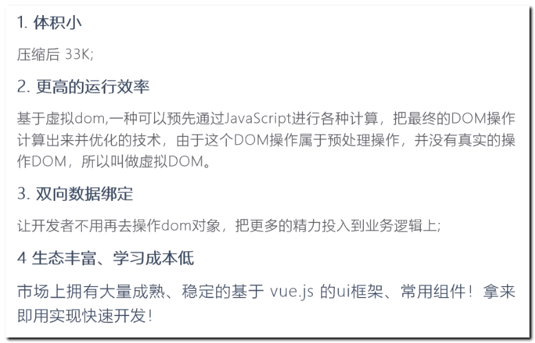

### 1.3 MVVM模式

**vue.js是一个MVVM的框架，理解MVVM有利于学习vue.js。**

MVVM拆分解释为：将视图 UI 和业务逻辑分开

```markdown
- Model:负责数据模型和业务模型  (开发人员要进行相关的代码开发) 

- View:负责页面展示数据 （view负责页面数据的渲染）

- View Model: 模型和视图之间的双向操作（无需开发人员进行代码开发）

- MVVM要解决的问题是将业务逻辑代码与视图代码进行完全分离，使各自的职责更加清晰，后期代码维护更加简单。
```

**说明：**

在MVVM之前，开发人员从后端获取需要的数据模型，然后要通过DOM操作Model渲染到View中。而后当用户操作视图，我们还需要通过DOM获取View中的数据，然后同步到Model中。

而MVVM中的VM要做的事情就是把DOM操作完全封装起来，开发人员不用再关心Model和View之间是如何互相影响的：

- 只要我们Model发生了改变，View上自然就会表现出来。
- 当用户修改了View，Model中的数据也会跟着改变。

把开发人员从繁琐的DOM操作中解放出来，把关注点放在如何操作Model上

 MVVM模型图：

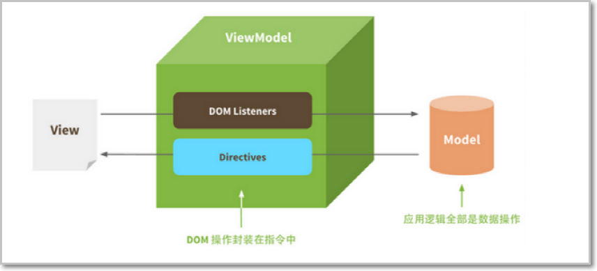

### 1.4 vue安装

vue安装的形式可以有多种的， 可以直接引入对应的Js脚本，也可以使用脚手架安装。

官方：

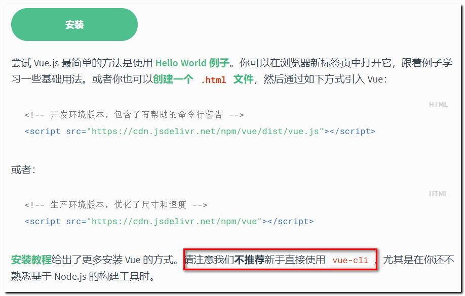 

点击安装 按钮：  vue的版本说明

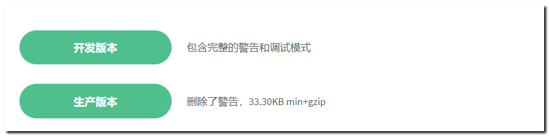 直接使用开发版本即可

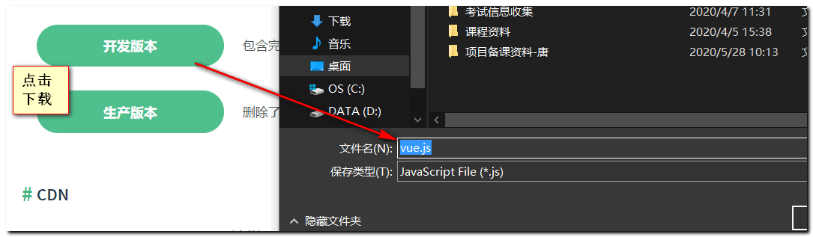 

保存下载的Js脚本到磁盘即可！

老师已经下载好了：

磁盘文件 

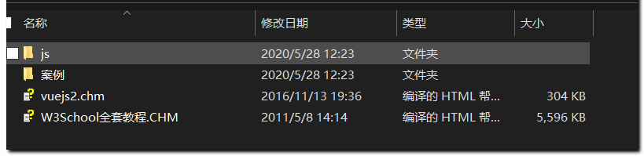 

直接使用js目录下的脚本即可！


## 2. VUE入门程序-先看效果

目标

```markdown
- 完成vue.js的入门开发
- 理解：vue.js的使用方式。
```

本次测试我们在门户目录中创建一个html页面进行测试，完成使用vue来进行视图的渲染。

实现

1.  第一步：创建maven web工程

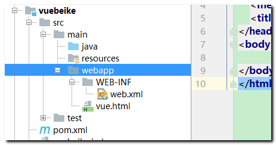 


2. 编写html页面 引入vue脚本

hello-vue.html:

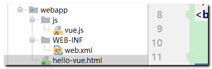 

编写vue入门：

```html
 <div id="app">
                标签获取数据模型绑定数据<br>
                 {{name}}
              <p>
                  {{sex}}
              </p>
          </div>
  <!--js  vue 数据模型层 -->
   <script>

       //   获取  vue 对象    json
             var   vue =  new Vue({
                 el:"#app",  //  el   绑定页面标签
                   //   数据模型声明
                 data:{
                     name:'你好 黑马程序员',
                     age:12,
                     sex:'male'
                 }

             })

   </script>
```

讲解： Vue() 对象 里面两个参数 ： el和 data  

el  : 页面标签元素挂载

data: 展示的数据  格式： {} js对象形式

测试 浏览器访问页面：

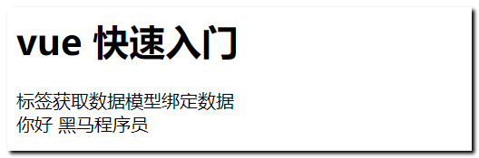 

vue入门程序编写完成！ 大家可以看到 只需要修改数据模型， 页面将自动更新最新的数据！ 省去中间的js代码！

## 3. 快速入门小结说明

开发中： 我们往往先定义好Vue数据模型，然后在页面标签中进行数据模型的绑定！

1. 在Vue对象中声明数据绑定对象

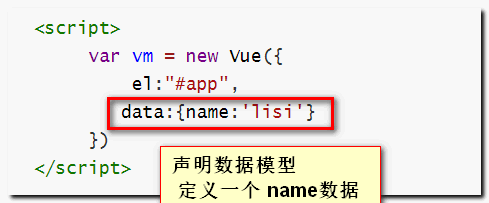 

2. 在页面标签建立好标签-数据模型的关系     **插值表达式**

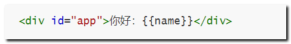 

3. 程序员只需要关注vue对象中的数据对象即可

   通过上述操作： 开发时，我们只需要关注 数据模型对象即可，页面标签数据会自动更新


思想小结： 为什么我们要使用vue? 

```markdown
-  使用vue  可以更快捷的开发，将模型数据和页面展示 分离，开发人员无需开发数据如何更新的问题

-  使用vue  我们只需要关注数据模型的开发！ 注意语法： 一切皆json格式的规则！

-  使用vue  开发步骤简单，1. 先声明数据模型对象，2. 在页面标签位置，展示对应的数据即可
   初学者重点要掌握：  1. 语法  如何声明数据模型对象   2. 页面展示数据{{}}等特定语法
```


## 4. Vue 对象中常用的属性（重点）

### 4.1 创建Vue实例

每个 Vue 应用都是通过用 `Vue` 函数创建一个新的 **Vue 实例**开始的：

```javascript
var vm = new Vue({
  // 选项
})
```

在构造函数中传入一个对象，并且在对象中声明各种Vue需要的数据和方法，

我们要重点先掌握三个属性如下：

- el     挂载页面标签
- data      数据模型对象
- methods   声明函数 绑定 页面监听事件  click   blur  ...keyup...
- created    初始化方法

### 4.2.模板或元素 el

每个Vue实例都需要关联一段Html模板，Vue会基于此模板进行视图渲染。

我们可以通过el属性来指定。

例如一段html模板：

```html
<div id="app">
    
</div>
```

然后创建Vue实例，关联这个div

```js
var vm = new Vue({
	el:"#app"
})
```

这样，Vue就可以基于id为`app`的div元素作为模板进行渲染了。在这个div范围以外的部分是无法使用vue特性的。

### 4.3.数据 data 

当Vue实例被创建时，它会尝试获取在data中定义的所有属性，用于视图的渲染，并且**监视**data中的属性变化，当data发生改变，所有相关的视图都将重新渲染，这就是“响应式“系统。

html：

```html
<div id="app">
    {{name}}
</div>
```

js:

```js
var vm = new Vue({
    el:"#app",
    data:{
        name:"刘德华" //   data 区域 就是我们常说的数据模型对象！
    }
})
```

- name的变化会影响到div标签内的值

### 4.4.方法  methods

Vue实例中除了可以定义data属性，也可以定义方法，并且在Vue的作用范围内使用。

一般方法都会和对应的事件绑定： 

举例：  vue通过 **v-on ：**绑定事件  事件类型，通过冒号：事件类型名称即可 

语法格式： **v-on:click="函数名称"**  点击事件触发对应的函数

html:

```html
  <div id="app">
             你好：{{name}}

             <button  v-on:click="clickMe">点击我</button>

         </div>
```

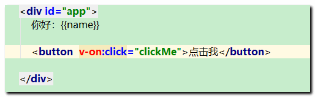 

需要注意： 红色v-on爆红，idea工具问题， 可以通过alt+enter 快捷键即可

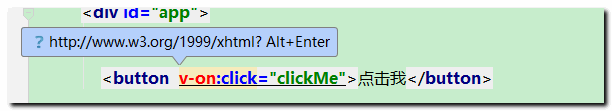 

js:

```js
<script>
               var vm = new Vue({
                   el:"#app",
                   data:{name:'lisi'},
                   methods:{
                                 clickMe:function () {
                                     alert("弹弹弹。。。弹走鱼尾纹")
                                 }
                   }
               })
          </script>
```

测试结果：点击按钮

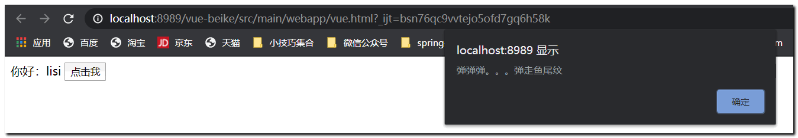 


methods语法： 官方文档

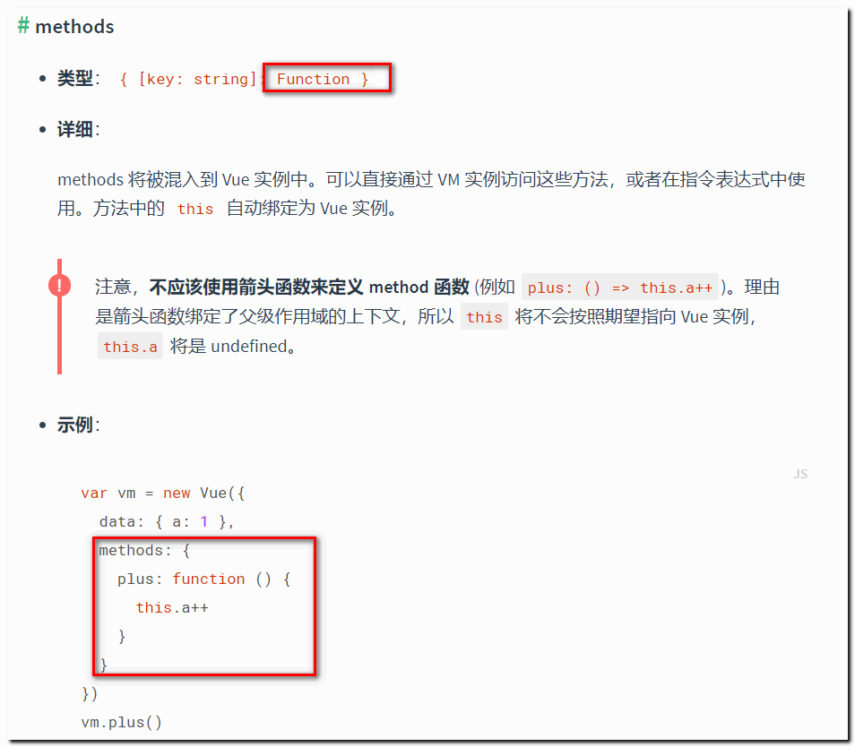 


# 5.VUE指令-进阶学习

## 5.0 插值表达式

花括号 格式：  一般用来获取**vue数据模型中定义的数据**

```
{{表达式}}
```

说明：

- 该表达式支持JS语法，可以调用js内置函数（必须有返回值）如：new Date()
- 表达式必须有返回结果。例如 1 + 1，没有结果的表达式不允许使用，如：var a = 1 + 1;
- 可以直接获取Vue实例中定义的数据或函数
- 插值表达式 **不可以使用在标签内的属性值上** 一定注意！

示例：

导入js 脚本库

```js
<script src="js/vuejs-2.5.16.js"></script>
```

html页面 ：  view层

```html
          <div id="app">
                 <!--插值表达式 可以支持数学和逻辑运算-->
                  {{1+1}}
                {{1==1?'true':'false'}}
                <!--插值表达式可以支持js内置函数-->
                  {{new Date()}}
                <!--获取数据模型中数据-->
                  {{name}}
            </div>
```

JS:  关注模型层数据

```js
			<script>
                  var vm = new Vue({
                      el:"#app",
                      data :{
                          name: '上海校区 黑马程序员'
                      }

                  })
              </script>
```

测试效果：

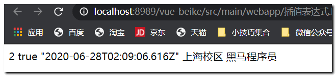 

小结：  插值表达式一般用来获取数据模型中对应的数据，要求书写在标签体中 ，**不可以出现在标签的属性中！**

举例：  在上面的题目中： div 标签 添加一个属性 aa=''{{name}}"

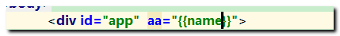 

我们运行程序发现报错！

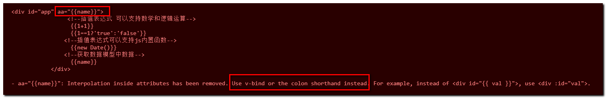

关于标签属性值获取：后续我们讲解v-bind 来解决此问题！


**什么是指令？**

```markdown
- Vue.js的指令是指 v-开头，作用于html标签，提供一些特殊的特性，当指令被绑定到html元素的时候，指令会为被绑定的元素添加一些特殊的行为，可以将指令看成html的一种属性。

指令特征 (Directives) 是带有 v- 前缀的特殊属性，作用于 html标签！  

- 也就是说 在标签中才会运用到指令语法！  数据模型 ：不会涉及到v- 开头的语法！
```


## 5.1 v-text和v-html

标签显示文本数据： 我们也使用**v-text和v-html**指令来替代`{{}}`

```markdown
- v-text 数据绑定标签，将vue对象data中的属性绑定给对应的标签作为内容显示出来，类似js的text属性；

- v-html 类似v-text标签，他是将data的属性作为html语法输出，类似js中的innerHtml属性
```

说明：

- v-text： 将数据输出到元素内部，如果输出的数据有HTML代码，会作为普通文本输出
- v-html：将数据输出到元素内部，如果输出的数据有HTML代码，会被渲染

示例：v-text-html.html

HTML:

```html
<div id="app">
    v-html:<span v-html="hello"></span>
    <br/>
    v-text:<span v-text="hello"></span>
</div>
```

JS:

```js
var vm = new Vue({
    el:"#app",
    data:{
        hello: "<h1>大家好，我是刘德华</h1>"
    }
})
```

效果：

 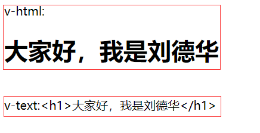 

小结：  v-text  或者 v-html  一般都使用在页面标签，用于显示标签文本或html片段，不常用！


## 5.2 v-model    

上述案例 主要是  数据模型  决定页面数据的展示，实际开发中，我们通常会遇到 用户在页面操作的数据 来更改数据模型中对应的数据！

```java
v-text和v-html可以看做是单向绑定，数据影响了视图渲染，但是反过来就不行。

接下来学习的v-model是双向绑定，视图（View）和模型（Model）之间会互相影响。

既然是双向绑定，一定是在视图中可以修改数据，这样就限定了视图的元素类型

语法：

html标签内部直接输入： v-model="vue定义的变量名称"
    
此时标签中的value值就和vue定义的变量对应的值，形成了双向绑定，当一个值发生改变，另一个也随之改变；

v-model 指令大都数是用在表单 <input>、<textarea> 及 <select> 等元素上创建双向数据绑定。

它会根据控件类型自动选取正确的方法来更新元素。
```

**目前v-model的可使用元素有： **作用范围

- input
- select
- textarea
- checkbox
- radio
- components（Vue中的自定义组件）

基本上除了最后一项，其它都是表单的输入项。

**注意事项**

```markdown
v-model 会忽略所有表单元素的 value、checked、selected 特性的初始值而总是将 Vue 实例的数据作为数据来源。
你应该通过 Js 在组件的 data 选项中声明初始值。
```

举例1：

视图中用户的操作  ----  更改数据模型中绑定的对应数据

```html
<div id="app">

                   <input type="radio" name="sex" value="male" v-model="sex"> 男性
                   <input type="radio" name="sex" value="female" v-model="sex"> 女性
                  <div>
                      你选择了{{sex}}
                  </div>
                <hr>
                 <div>
                       <select name="xueli" v-model="xueli">
                             <option value="chuzhong">初中</option>
                             <option value="gaozhong">高中</option>
                             <option value="daxue">大学</option>
                             <option value="boshi">博士</option>
                       </select>
                 </div>
                <div>
                    你选择了{{xueli}}
                </div>

            </div>


            <script>

                  var vm = new Vue({

                      el:"#app",
                      data :{
                          sex:"female",  //  我们发现  标签中的 checked="checked" 失效
                          xueli:"boshi"   //  标签中初始化的  selected="selected"失效
                      }

                  })
              </script>


```

测试效果： 简而言之： vue数据模型来决定页面的展示，反之也可以！ 双向绑定！

页面第一次打开：

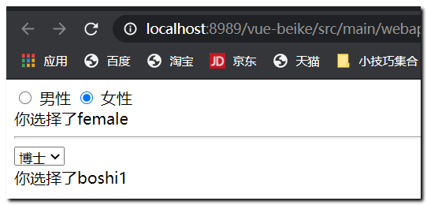 

举例2：

html：多选框 需要在vue中定义一个数组接受

```html
            <div id="app">
                <input type="checkbox"  v-model="ischecked" />是否选中<br/>
                <input type="checkbox"  v-model="language"  value="Java" />Java<br/>
                <input type="checkbox"  v-model="language" value="PHP" />PHP<br/>
                <input type="checkbox"  v-model="language" value="GO" />GO<br/>
                <h1>
                    多选框：{{language}}  ， 单选框：{{ischecked}}
                </h1>
            </div>

            <script type="text/javascript">
                var vm = new Vue({
                    el:"#app",
                    data:{
                        language: [],//   对于多选框 我们用数组array来接受多个选项值！
                        ischecked: true //   对于一个选项框： boolean 来定义
                    }
                })
            </script>
```


效果：

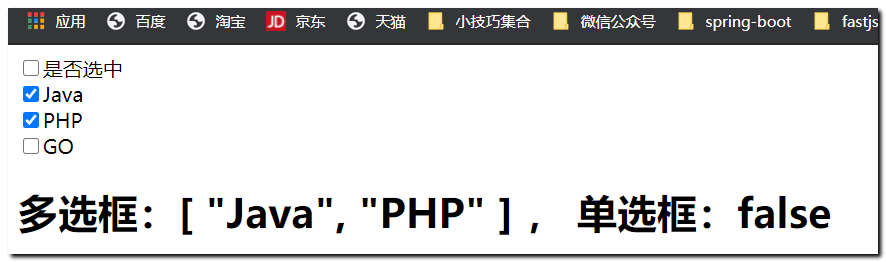 

 小结：

- 页面展示的数据，来源于我们的数据模型  data定义

- 多个`CheckBox`对应一个model时，**model的类型是一个数组**，单个checkbox值是boolean类型
- radio对应的值是input的value值
- `input` 和`textarea` 默认对应的model是字符串
- `select`单选对应字符串，多选对应也是数组


## 5.3 v-on

### 5.3.1. v-on 基本用法

**v-on指令用于给页面元素绑定事件**

语法：

```markdown
v-on:事件名="js片段或函数名" 
缩写 @事件名="js片段或函数名" 
```

简写语法：

```js
@事件名="js片段或函数名"     v-on:click  ==  @click
```

例如v-on:click='add'可以简写为@click='add'

示例：

```html
     <div id="app">
                    <!--事件中直接写js片段 简单的可以这样写  -->
                    <button @click="num++">增加</button><br/>

                    <!--复杂事件 需要指定一个回调函数，必须是Vue实例中定义的函数-->
                    <button @click="decrement">减少</button><br/>

                     <!--显示效果-->
                    <h1>num: {{num}}</h1>
                </div>

                <script type="text/javascript">
                    var app = new Vue({
                        el:"#app",
                        data:{
                            num:0  //  初始化数据模型
                        },
                        methods:{   //  如果出现事件绑定的函数对象  要用 methods来声明事件  语法规则：
                            decrement(){
                                this.num--;  //  在vue 对象里面 ，this 表示当前的 vue对象   获取对应的属性  this.声明的属性名称   注意 this不是点击的标签按钮对象！
                            }
                        }
                    })
                </script>
```

效果：

 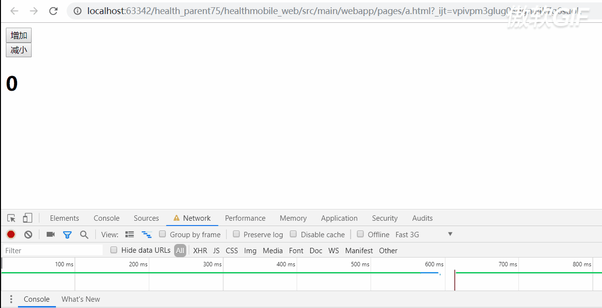


### 5.3.2.v-on 按键修饰符（了解）

Vue 允许为 v-on 在监听键盘事件时添加按键修饰符：

语法：

```js
<!-- 监听回车事件 -->
<input v-on:keyup.enter="submit">
<!-- 缩写语法  表示用户敲击回车 会执行对应的submit函数  submit是函数名称 可以自定义-->
<input @keyup.enter="submit">
```

举例： 用户文本框输入一个字符，显示输入的内容

```html
    <div id="app">

                <input type="text" @keyup.enter="submit"  v-model="username">

                  <p>
                      你输入的内容：{{username}}
                  </p>

            </div>


            <script>

                var vm = new Vue({

                    el:"#app",
                    data :{
                        username:''
                    },
                    methods:{
                        submit() {
                            alert("提交"+this.username)  //  当我们敲击回车时，当前submit函数执行
                        }
                    }

                })
            </script>
```

效果：

输入框输入数据 点击回车键  会有如下效果

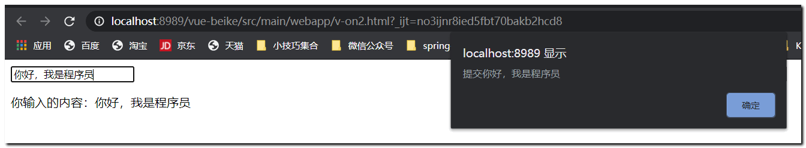 

全部的按键别名：  不需要全部记忆！ 知道用法即可！

- `.enter`
- `.tab`
- `.delete` (捕获 "删除" 和 "退格" 键)
- `.esc`
- `.space`
- `.up`
- `.down`
- `.left`
- `.right`
- `.ctrl`
- `.alt`
- `.shift`
- `.meta`

实例

```html
<input v-on:keyup.enter="submit">   当回车键 被弹起时， 会触发  submit对应的函数！
```

## 5.4.v-bind

### 5.6.1 属性上使用vue数据

**v-bind 用于将vue的值绑定给对应dom的属性值**

主要用于对标签的元素属性赋值

语法：

```js
v-bind:元素属性名="数据模型定义的初试数据"
```

class 与 style 是 HTML 元素的属性，用于设置元素的样式，我们可以用 v-bind 来设置样式属性。

案例一：  我们可以通过元素的 hidden属性来决定该元素是否隐藏 

```html
 <div id="app">

                  原始语法如下：
                <div v-bind:hidden="hiddenValue">v-bind test</div><br>
                 简化写法   :hidden
                <div :hidden="hiddenValue">v-bind test</div>

            </div>
            <script>
                new Vue({
                    el: "#app",
                    data: {
                        hiddenValue:false //  页面元素不影藏 ， 如果是true表示隐藏页面元素
                    }
                })
            </script>
```

效果：  当我们更改 hiddenValue 的 值：  true或 false  刷新页面 效果不同

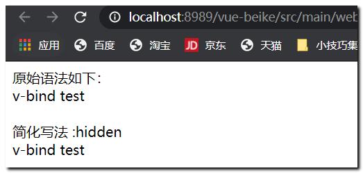 

案例二： 更改div元素的背景色 

```css
在head标签添加一个简单样式

<style>
.red{
            background: red;
        }

    </style>
```

html标签

```html
<div id="app">

    <!--  没用使用vue 添加背景色样式  直接在元素添加class 属性值-->
    <div  class="red">v-bind t1111est</div>
    <br>
    <!--使用vue绑定 添加背景色样式   v-bind:class 来完成属性值-->
    <div  v-bind:class="mycolor">v-bind test</div>

</div>

<script>
    new Vue({
        el: "#app",
        data: {
            mycolor:'red'  //  数据模型 决定标签页面显示的数据
        }
    })
</script>
```

案例改进：**添加事件 来修改颜色样式(扩展)**

我们提前定义了一些CSS样式：

```css
#box {
    width: 100px;
    height: 100px;
    color: darkgray
}
.red{
    background-color: red;
}
.blue{
    background-color: blue;
}
```

然后定义了页面：

```html
  <div id="app">
                <button @click="changeRed">红</button>
                <button @click="changeBlue">蓝</button>
                <div id="box" :class="color">
                    点击按钮，背景会切换颜色哦
                </div>
            </div>

            <script type="text/javascript">
                var vm = new Vue({
                    el: "#app",
                    data: {
                        color: "", // 代表当前的class样式，目前是红
                    },
                    methods:{
                        changeRed(){
                             this.color='red'
                        },
                        changeBlue(){
                            this.color='blue';
                        }
                    }
                })
            </script>
```

效果：

 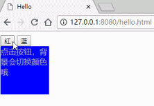

### 5.6.2 class属性的特殊用法（了解）

上面虽然实现了颜色切换，但是语法却比较啰嗦。

Vue对class属性进行了特殊处理，可以接收数组或对象格式

> 语法 我们可以传给 `:class` 一个对象，以动态地切换 class：

```html
<div :class="{ red: true,blue:false }"></div>
```

- 对象中，key是已经定义的class样式的名称，如本例中的：`red`和`blue`
- 对象中，value是一个布尔值，如果为true，则这个样式会生效，如果为false，则不生效。

之前的案例可以改写成这样：

```html
  <div id="app">
                <button @click="change">更改颜色</button>
                <!--
                {red:flag,blue:!flag} 对象中，key是已经定义的class样式的名称，如本例中的：red和blue
                value是一个布尔值，如果为true，则这个样式会生效，如果为false，则不生效。
                -->
                <div id="box" :class="{red:flag,blue:!flag}">
                    点击按钮，背景会切换颜色哦
                </div>
            </div>

            <script type="text/javascript">
                var vm = new Vue({
                    el: "#app",
                    data: {
                        flag:true, // flag表示 当前的样式值
                    },
                    methods:{
                        change(){
                             this.flag=!this.flag
                        }

                    }
                })
            </script>
```

- 首先class绑定的是一个对象：:class="{red:flag,blue:!flag}"
  - red和blue两个样式的值分别是flag和!flag，也就是说这两个样式的生效标记恰好相反，一个生效，另一个失效。
  - flag默认为true，也就是说默认red生效，blue不生效
- 现在只需要一个按钮即可，点击时对flag取反，自然实现了样式的切换

效果：

 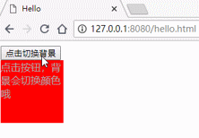 

## 5.5.v-for

遍历数据渲染页面是非常常用的需求，Vue中通过v-for指令来实现。

### 5.4.1.遍历数组

> 语法：

```
v-for="item in items"
```

- items：要遍历的数组，需要在vue的data中定义好。
- item：迭代得到的数组元素的别名

> 示例
>

```html
<div id="app">
    <!--遍历数组 -->
    <table width="100%" border="1px">
          v-for位置：在需要遍历的元素父元素中书写
        <tr v-for="user in users">
            <td >{{user.name}}</td>
            <td v-text="user.gender"></td>
            <td v-text="user.age"></td>
        </tr>
    </table>
</div>

<script>
    var app = new Vue({
        el: "#app",
        data:{
              //  定义数组对象  遍历的数据源
            users:[
                {name:'柳岩', gender:'女', age: 20},
                {name:'有哥', gender:'男', age: 30},
                {name:'范冰冰', gender:'女', age: 24},
                {name:'刘亦菲', gender:'女', age: 18},
                {name:'古力娜扎', gender:'女', age: 25}
            ]
        }
    });
</script>
```

效果：

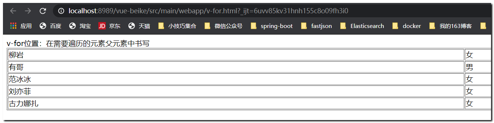  

### 5.4.2.数组角标

在遍历的过程中，如果我们需要知道数组角标，可以指定第二个参数：

> 语法

```
v-for="(item,index) in items"
```

- items：要迭代的数组
- item：迭代得到的数组元素别名
- index：迭代到的当前元素索引，从0开始。

> 示例

```html
    <div id="app">
         <table>
       		<tr v-for="(user,index) in users">
              <!--<td >{{index+1}}</td> 或者下面写法 -->
              <td v-text="index+1"></td>
              <td v-text="user.name"></td>
              <td v-text="user.age"></td>
              <td v-text="user.gender"></td>
          </tr>      
    	</table>
    </div>
```

> 效果：

 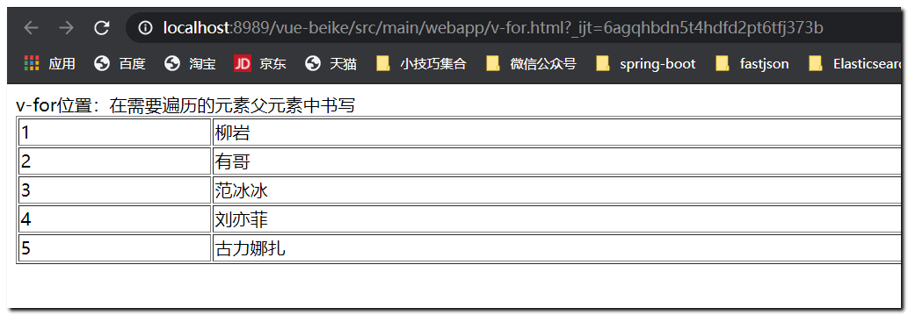

### 5.4.3.遍历对象(了解)

v-for除了可以迭代数组，也可以**迭代对象**。语法基本类似  - 了解即可 不常用！

> 语法：

```js
v-for="value in object"
v-for="(value,key) in object"
v-for="(value,key,index) in object"
```

- 1个参数时，得到的是对象的值
- 2个参数时，第一个是值，第二个是键
- 3个参数时，第一个是值，第二个是键，第三个是索引

> 示例：

```html
<div id="app">
    <!-- 对象遍历-->
    <table>
        <tr v-for="(u,key,index)  in user">
            <td v-text="index"></td>
            <td v-text="key"></td>
            <td v-text="u"></td>
    </table>
</div>

<script type="text/javascript">
    var vm = new Vue({
        el:"#app",
        data:{
            user:{name:'柳岩', gender:'女', age: 21}
        }
    })
</script>
```

> 效果：

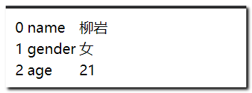 

### 5.4.4.key说明（了解）

当 Vue.js 用 `v-for` 正在更新已渲染过的元素列表时，它默认用“就地复用”策略。

如果数据项的顺序被改变，Vue 将不会移动 DOM 元素来匹配数据项的顺序， 而是简单复用此处每个元素，并且确保它在特定索引下显示已被渲染过的每个元素。 

这个功能可以有效的提高渲染的效率。

但是要实现这个功能，你需要给Vue一些提示，以便它能跟踪每个节点的身份，从而重用和重新排序现有元素，**你需要为每项提供一个唯一 `key` 属性。理想的 `key` 值是每项都有的且唯一的 id。** 

- 这里使用了一个特殊语法：`:key=""` 
- 这里我们绑定的key是数组的索引，应该是唯一的

举例说明：

 没有添加key 

```html
 <div id="app">
    <div>
      <input type="text" v-model="name">
      <button @click="add">添加</button>
    </div>
    <ul>
      <li v-for="(item, i) in list">
        <input type="checkbox"> {{item.name}}
      </li>
    </ul>
<script>
    // 创建 Vue 实例，得到 ViewModel
    var vm = new Vue({
      el: '#app',
      data: {
        name: '',
        newId: 3,
        list: [
          { id: 1, name: '李斯' },
          { id: 2, name: '吕不韦' },
          { id: 3, name: '嬴政' }
        ]
      },
      methods: {
        add() {
         //注意这里是unshift
          this.list.unshift({ id: ++this.newId, name: this.name })
          this.name = ''
        }
      }
    });
  </script>
  </div>
```


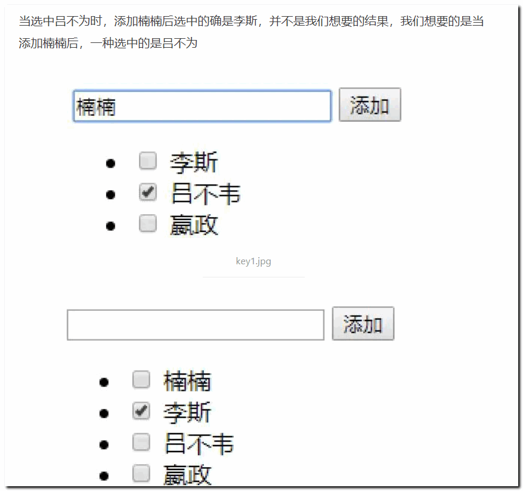 


**添加了key，vue会自动跟踪我们之前选定的选项！**

```html
 <div id="app">
    <div>
      <input type="text" v-model="name">
      <button @click="add">添加</button>
    </div>
    <ul>
      <li v-for="(item, i) in list" :key="item.id">
        <input type="checkbox"> {{item.name}}
      </li>
    </ul>
<script>
    // 创建 Vue 实例，得到 ViewModel
    var vm = new Vue({
      el: '#app',
      data: {
        name: '',
        newId: 3,
        list: [
          { id: 1, name: '李斯' },
          { id: 2, name: '吕不韦' },
          { id: 3, name: '嬴政' }
        ]
      },
      methods: {
        add() {
         //注意这里是unshift
          this.list.unshift({ id: ++this.newId, name: this.name })
          this.name = ''
        }
      }
    });
  </script>
  </div>
```


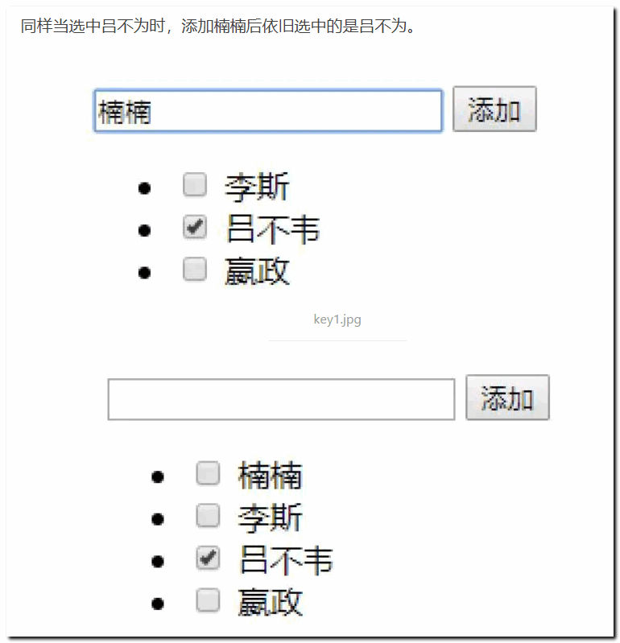 


## 5.6.v-if和v-show

### 5.5.1.v-if &v-else 使用

v-if，顾名思义，条件判断。当得到结果为true时，所在的元素才会被渲染。

> 语法：

```
v-if="布尔表达式"
```

> 示例：

```html
    <div id="app">

                      <div @click="flag=!flag">
                            点击我试试
                      </div>

                        <p v-if="flag">你好 黑马程序员</p>
                        <p v-else>你好 传智播客</p>

            </div>


              <script>

                  var vm = new Vue({
                      el:"#app",
                      data :{
                          flag: true
                      }

                  })
              </script>
```

> 效果：  点击我试试   会看到 p 标签变化，根据条件 显示一个p标签对象

 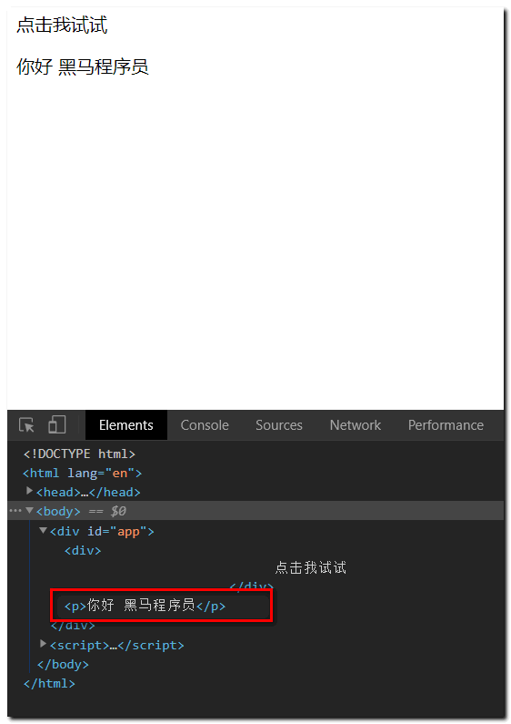

注意：

`v-else` 元素必须紧跟在带 `v-if` 或者 `v-else-if` 的元素的后面，否则它将不会被识别。

### 5.5.2.v-else-if嵌套(了解)

`v-else-if`，顾名思义，充当 `v-if` 的“else-if 块”，可以连续使用：

```html
<div v-if="type=='A'">
  A
</div>
<div v-else-if="type=='B'">
  B
</div>
<div v-else-if="type=='C'">
  C
</div>
<div v-else>
  Not A/B/C
</div>


              <script>

                  var vm = new Vue({
                      el:"#app",
                      data :{
                          type: 'D'
                      }

                  })
              </script>

```

类似于 `v-else`，`v-else-if` 也必须紧跟在带 `v-if` 或者 `v-else-if` 的元素之后。

### 5.5.3.v-show

另一个用于根据条件展示元素的选项是 `v-show` 指令。用法大致一样：

二者区别：

不同的是带有 `v-show` 的元素始终会被渲染并保留在 DOM 中。`v-show` 只是简单地**切换元素的 CSS 属性 `display`。**

v-if和v-show功能差不多，都是用来控制dom的显隐，用法也一样，只是原理不同，当v-if="false"时，**dom被直接删除掉**；为true时，又重新渲染此dom；

示例：

```html
          <div id="app">

                      <div @click="flag=!flag">
                            点击我试试
                      </div>
                        <p v-show="flag">你好 黑马程序员</p>
            </div>


              <script>

                  var vm = new Vue({
                      el:"#app",
                      data :{
                          flag: true
                      }

                  })
              </script>
```

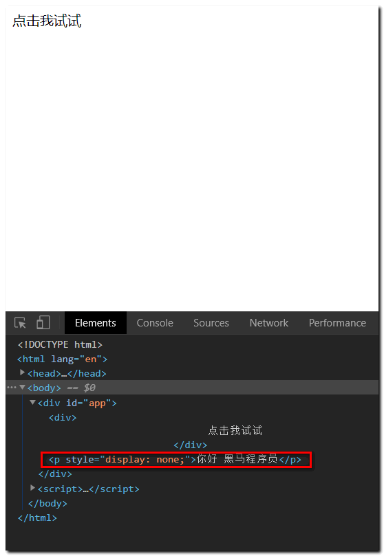 

 **v-show  只是添加样式！  v-if 是直接删除元素！**

----------------

上午回顾：

Vue对象实例声明   ：  var  vue = new Vue({

   el:"#app",

  data：{

​     key:value

},

methods:{

a(){},

b(){},.....

}

})  


## 6. Vue生命周期

```markdown
- 每个 Vue 实例在被创建时都要经过一系列的初始化过程 ：创建实例，装载模板，渲染模板等等。
- Vue为生命周期中的每个状态都设置了监听函数。
- 每当Vue实例处于不同的生命周期时，对应的函数就会被触发调用。
- vue的生命周期中具体做了什么事情我们通常不需要关心，我们只要关注生命周期的8个监听函数。
```

### 6.1 生命周期流程图：


### 6.2 监听函数

vue的整个生命周期中，提供了8个监听函数，以便我们可以在某个生命周期段根据需要做相应的操作：

```js
beforeCreate：在vue实例创建前调用

created：在vue实例创建后调用,这个监听函数是最常用的，这个时候会初始化data数据，通常去后端取数据；

beforeMount：在挂载开始之前被调用 。 什么是挂载？可以将vue对象和视图模板进行关联的过程看作是挂载

mounted：挂载到实例上去之后调用

beforeUpdate：数据更新时调用，发生在虚拟 DOM 重新渲染和打补丁之前

updated：由于数据更改导致的虚拟 DOM 重新渲染和打补丁，在这之后会调用该钩子

beforeDestroy：实例销毁之前调用。在这一步，vue实例仍然完全可用。

destroyed：Vue 实例销毁后调用。调用后，Vue 实例指示的所有东西都会解绑定，所有的事件监听器会被移除，所有的子实例也会被销毁。
 
```

简单案例演示：

html:

```html
<div id="app">
    <h1>{{message}}</h1>
</div>
```

js:

```js
            <script type="text/javascript">
                var vm = new Vue({
                   el: '#app',
                    data: {
                        message: "we are 伐木累!"
                    },
                    beforeCreate: function () {
                        console.group('beforeCreate 创建前状态===============》');
                        console.log("%c%s", "color:red", "el     : " + this.$el); //undefined
                        console.log("%c%s", "color:red", "data   : " + this.$data); //undefined
                        console.log("%c%s", "color:red", "message: " + this.message)
                    },
                    created: function () {
                        console.group('created 创建完毕状态===============》');
                        console.log("%c%s", "color:red", "el     : " + this.$el); //undefined
                        console.log("%c%s", "color:red", "data   : " + this.$data); //已被初始化
                        console.log("%c%s", "color:red", "message: " + this.message); //已被初始化
                    },
                    beforeMount: function () {
                        console.group('beforeMount 挂载前状态===============》el');
                        console.log(this.$el);
                        console.log("%c%s", "color:red", "data   : " + this.$data); //已被初始化
                        console.log("%c%s", "color:red", "message: " + this.message); //已被初始化
                    },
                    mounted: function () {
                        console.group('mounted 挂载结束状态===============》');
                        console.log(this.$el);
                        console.log("%c%s", "color:red", "data   : " + this.$data); //已被初始化
                        console.log("%c%s", "color:red", "message: " + this.message); //已被初始化
                    },
                    beforeUpdate: function () {
                        console.log('beforeUpdate 即将更新渲染=');
                        console.log("%c%s", "color:red", "el     : " + this.$el);
                        console.log(this.$el);
                        console.log("%c%s", "color:red", "data   : " + this.$data);
                        console.log(this.$data);
                        console.log("%c%s", "color:red", "message: " + this.message);

                    },
                    updated: function () {
                        console.group('updated 更新完成状态===============》');
                        console.log("%c%s", "color:red", "el     : " + this.$el);
                        console.log(this.$el);
                        console.log("%c%s", "color:red", "data   : " + this.$data);
                        console.log(this.$data);
                        console.log("%c%s", "color:red", "message: " + this.message);

                    },
                    beforeDestroy: function () {
                        console.group('beforeDestroy 销毁前状态===============》');
                        console.log("%c%s", "color:red", "el     : " + this.$el);
                        console.log(this.$el);
                        console.log("%c%s", "color:red", "data   : " + this.$data);
                        console.log("%c%s", "color:red", "message: " + this.message);
                    },
                    destroyed: function () {
                        console.group('destroyed 销毁完成状态===============》');
                        console.log("%c%s", "color:red", "el     : " + this.$el);
                        console.log(this.$el);
                        console.log("%c%s", "color:red", "data   : " + this.$data);
                        console.log("%c%s", "color:red", "message: " + this.message)
                    }
                })

         // vm.$mount("#app")
            </script>

```

结果：

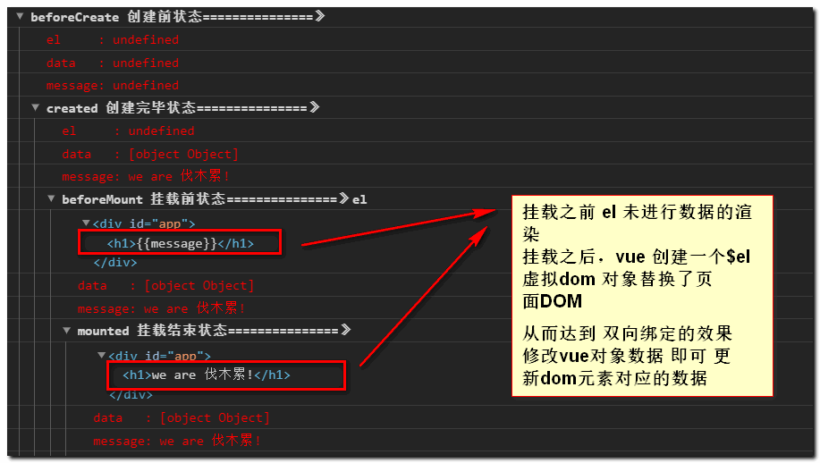  


当在控制台输入一个data数据 更改message 值是，此事  beforeUpdate  和  update 钩子方法触发

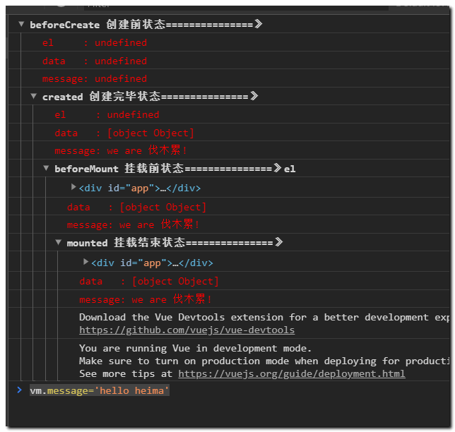  

回车   此时的$el 是虚拟的dom 对象 会立刻更新为 hello heima ! 页面view还未更新最新的数据。

等到update 方法执行 会实现页面view 的数据更新


**小结：** 了解生命周期，**掌握常用的 created方法！**    可以理解 页面标签数据初始化之前执行的方法！

通常在此方法中，**我们发起后台数据请求**，在渲染页面标签数据之前，先获取后台数据，**进行data 数据的模型赋值！**


### 6.3 this对象的说明

我们可以看下在vue内部的this变量是谁，我们在created的时候，打印this

```js
var vm = new Vue({
    el:"#app",
    data:{
        hello: '' // hello初始化为空
    },
    created(){
        this.hello = "hello, world！ 我出生了！";
        console.log(this);
    }
})
```

 控制台的输出：  

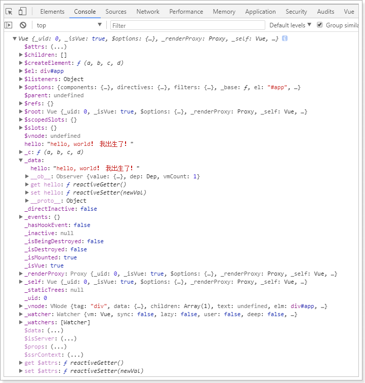 

 

**总结：**

**this就是当前的Vue实例，在Vue对象内部，必须使用this才能访问到Vue中定义的data内属性、方法等**


## 7. Vue之ajax(重点)

```markdown
- vue-resource是Vue.js的插件,提供了使用XMLHttpRequest或JSONP进行Web请求和处理响应的服务。
- 当vue更新到2.0之后，作者就宣告不再对vue-resource更新，而是推荐的axios，
- 在这里大家了解一下vue-resource就可以，因为现在基本使用的都是2.0之后的版本了。
```

vue-resource的github: https://github.com/pagekit/vue-resource

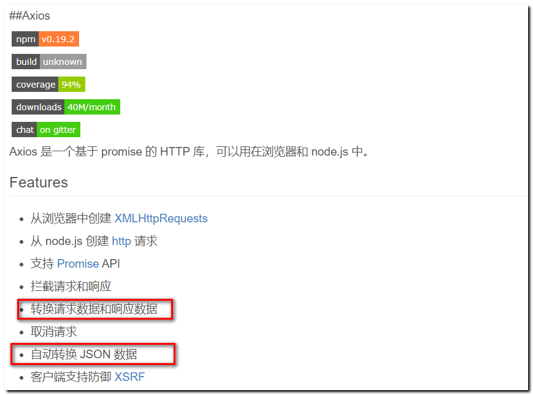 

### 7.1 axios使用

```java
axios是对ajax技术的一种封装，就像jQuery实现ajax封装一样。  
简单来说： ajax技术实现了网页的局部数据刷新，axios实现了对ajax的封装。
```

引入axios

1. 可以用script引入github上的js

\<script src="https://unpkg.com/axios/dist/axios.min.js"\>\</script\>

2. 或者也可以使用资料\\vuejs中的axios-0.18.0js:推荐

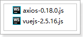 

### 7.2 get请求

**vue-ajax-get.html**

语法：

```js
//发起一个user请求，参数为给定的ID   此种写法 不建议 过于繁琐
axios.get('/user.do?ID=1234')
.then(function(respone){
  console.log(response);
})
.catch(function(error){
  console.log(error);
});

//如果需要传递参数 上面的请求也可选择下面的方式来写
axios.get('/user',{
  params:{
    ID:12345
  }
})
  .then(function(response){
    console.log(response);
  })
  .catch(function(error){
    console.log(error)
  });

实际开发中 我们一般使用 //  lambda表达式语法。。。   推荐写法！
//发送get请求   切记不要在ajax回调函数内使用this  因为此时的this 指的是vue对象
axios.get("/findById.do?id=100").then((res) => {  

        console.log("请求发送成功")  

        }).catch((e) => {  

        console.log("发生异常了：" + e)  

        }).finally(() => {  

        console.log("最终会执行的业务逻辑")  

})  
```

案例：

页面导入脚本

```html
<script src="js/vuejs-2.5.16.js"></script>  
<script src="js/axios-0.18.0.js"></script>  
```

页面内容如下：

```html
<div id="app">

                     {{name}}
                <input type="text" @blur="blurme" v-model="username" >

            </div>

  <script>

                  var vm = new Vue({

                      el:"#app",
                      data :{
                          name:
                          '上海校区 黑马程序员',
                          username:''
                      },
                      created:function(){

                      },
                      methods: {
                          blurme: function () {
                              console.info(this.username)
                              axios.get("vue.html").then((res)=>{
                                  console.info(this); // 切记 this是vue对象 而不是当前标签对象
                                  console.info(res);//  服务器响应的数据  在 res.data中
                              })

                          }

                      }

                          })

              </script>
```

小测效果：

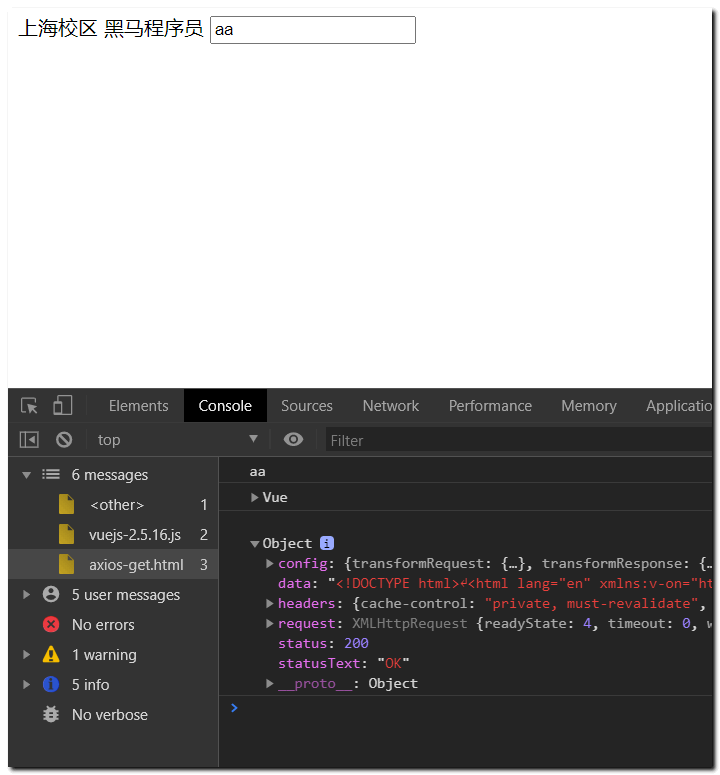 

### 7.3 Post请求

编写一个页面： vue-ajax-post.html

书写语法几乎一致： 只是注意 传递数据不可以使用？拼接，而是使用{key:value} 传递数据

```html

<script>  


//发送post请求,传递数据  使用json格式数据传输   推荐写法！
axios.post("/add.do",{name:"zhangsan"}).then((res) => {  

        console.log("请求发送成功")  

        }).catch((e) => {  

        console.log("发生异常了：" + e)  

        }).finally(() => {  

        console.log("最终会执行的业务逻辑")  

})  

</script>  

```

其他请求语法类似：了解

```js
axios.get(url[, config])

axios.delete(url[, config])

axios.head(url[, config])

axios.post(url[, data[, config]])

axios.put(url[, data[, config]])

axios.patch(url[, data[, config]])

```


### 7.4 vue 表单提交数据-案例巩固

说明： 使用axios将表单数据提交到后台  要求使用vue+axios 实现

1. html页面编写  导入相关js脚本  vue.js  和  axio.js  

```html

<div id="app">

               <form>
                     用户名<input type="text" v-model="formData.username"><br>
                     密码<input type="password" v-model="formData.password"><br>
                     性别
                   <input type="radio" value="male" v-model="formData.sex">男
                   <input type="radio" value="female"v-model="formData.sex">女
                   <br>
                     爱好
                   <input type="checkbox" value="洗澡"v-model="formData.hobby">洗澡
                   <input type="checkbox" value="看电视"v-model="formData.hobby">看电视
                   <input type="checkbox" value="睡觉"v-model="formData.hobby">睡觉
                   <br>
                     学历
                    <select v-model="formData.education">
                        <option value="初中">初中</option>
                        <option value="高中">高中</option>
                        <option value="大专">大专</option>
                        <option value="本科">本科</option>
                    </select>
                   <br>
                   简介<textarea rows="5" cols="20" v-model="formData.remark"></textarea>
                   <br>
                   <input type="button" @click="add" value="提交"></input><br>
               </form>

</div>
```

2. vue模块代码编写  通过ajax完成表单数据的提交！

```vue
 <script>
         var  vm = new Vue({

             el:"#app",
             data:{
               //  提交给后台的数据 都是在data中声明的
                 formData:{
                     username:'',
                     password:'',
                     sex:'',
                     hobby:[],
                     education:'',
                     remark:''
                 }
             },
             methods:{

                 add(){
                     // alert("---"+JSON.stringify(this.formData))
                     //  axios 提交给后台
                     axios.post("/add.do",this.formData).then();

                 }
             }

         })

    </script>
```

测试效果：

 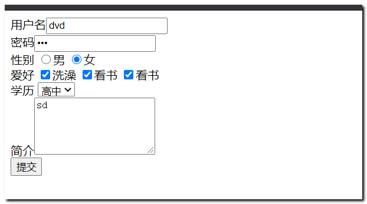  

大家注意：

**通过axios提交表单数据**，会自动将表单数据序列化成json格式的数据，我们在后台controller只需要通过： **@RequestBody 将此json格式数据 封装到实体对象里面即可！**

key:value 格式提交！ 标准的json格式数据传输

 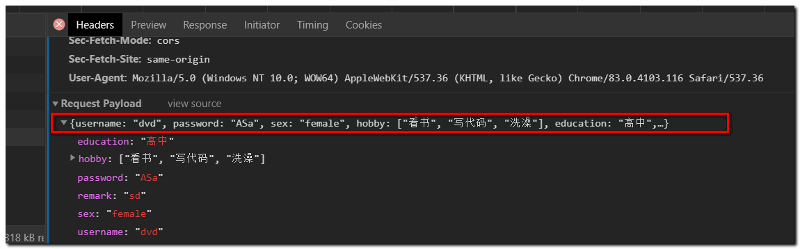 

 


