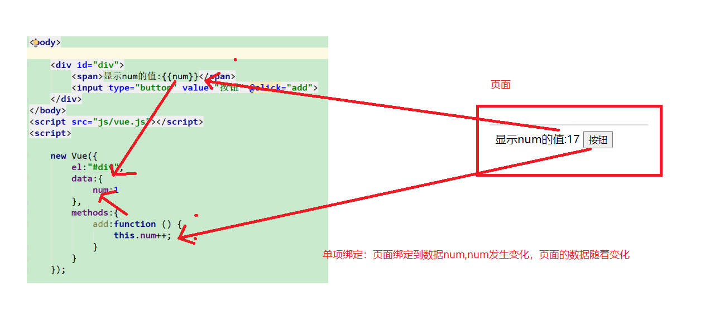
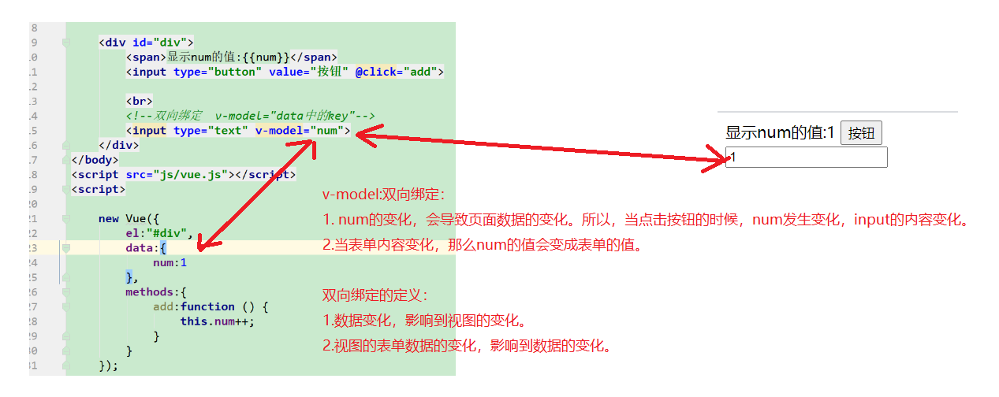
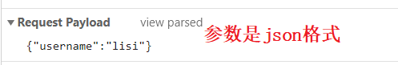
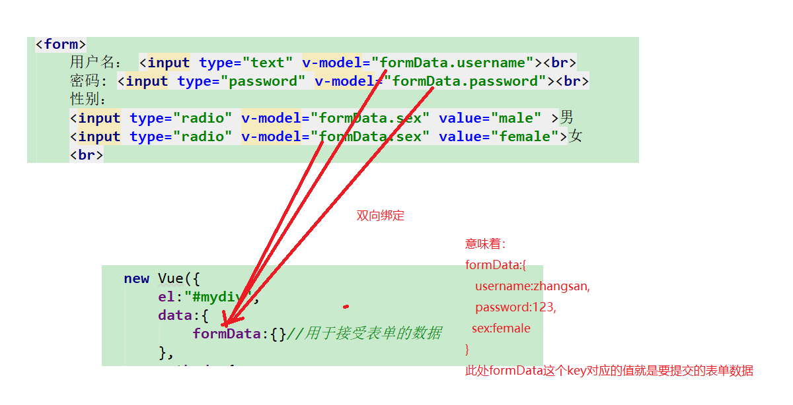
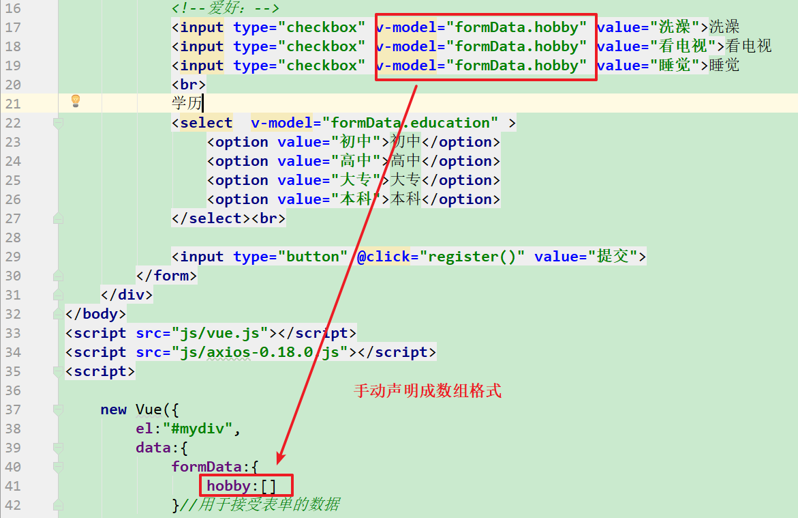

# 课堂笔记

# 1 es6新语法

~~~html
<!DOCTYPE html>
<html lang="en">
<head>
    <meta charset="UTF-8">
    <title>Title</title>
</head>
<body>

<!--

        js: 由3大部分组成：
        （es）ECMAScript:基本语法  （javase）
        BOM:浏览器相关操作
        DOM: html中文档标签的操作
-->


</body>
<script>

    //let username = 'zhangsan';

    //alert("姓名是:"+username);
    //反引号  +${变量名}  用来替代我们以前的字符串拼接变量名。
    //alert(`姓名是:${username}`);

    //json的解构
    //let json = {"username":"zhangsan","password":"123"};
    //es 5
    // let username = json.username;
    // let password = json.password;

    //es6
    //const {username,password}=json;

    //alert(username+":"+password);


    //es6的箭头函数(java中的lambda表达式)
    //this关键字代表的含义不一样。
    // 匿名函数中的this指代调用当前函数的对象，箭头函数中的this指代的是父级作用域的this。
    //es5 声明函数
    let demo = function(a,b) {
        alert("demo");
    }


    //es6
    let demo2 = (a,b)=>{
        alert(a+b);
    }

    demo2(1,2);

    // function demo() {
    //     this;
    //     setInterval( function () {
    //         this;
    //     },1000);
    // }

</script>
</html>
~~~


# 2.vue

## 2.1 vue的介绍

~~~
vue（view）读音是一样的，主要作用域视图的。
是一款满足mvvm开发模式的前端框架。
m: model,数据（ajax请求从后台获取）
v:view，视图 （bootstrap）
vm：view-model  ,将数据填充到视图。(vue,封装了dom操作。)
~~~


## 2.2 vue的快速入门

```html
<!DOCTYPE html>
<html lang="en">
<head>
    <meta charset="UTF-8">
    <title>Title</title>
</head>
<body id="mybody">

    <div id="mydiv">
        <span>{{msg}}</span>
        <input type="button" @click="demo()">
    </div>

    <div>{{msg}}</div>
</body>
<!-- 引入外部资源的script中不能写js代码-->
<script src="js/vue.js"></script>
<script>

    /**
     *  vue的快速入门：
     *      1.引入vue.js文件
     *      2.创建vue对象
     *         a.声明el,
     *              选择器，选择vue的作用范围。
     *              1.如果是作用范围之外的代码，是不会生效的
     *              2.这个作用范围，不能是html表或者body标签
     *         b.声明data
     *              声明vue中的数据的。一般都是json格式。此处的数据包含了自定义初始化数据，也包含了后台要获取的数据。
     *         c.声明methods
     *              以json的格式声明vue的函数。注意：vue中声明的函数只能通过vue来调用。
     *
     *     vue中的this全部都指代vue对象本身。
     *
     */
    var  vue = new Vue({
        el:"#mydiv",//
        data:{
            msg:"这是页面数据",
            dbData:""  //此处声明空，等待ajax请求从后台获取后，然后进行赋值。
        },
        methods:{
            demo:function () {
                alert("vue中声明函数:");
                console.log(this);
            }
        }
    });

    //调用不了vue中的demo中函数
    //demo();
    vue.demo();
</script>
</html>
```

## 2.3 vue的指令

### 2.3.1 插值表达式

~~~
{{key}} 用于在页面上显示文本内容的,不推荐，因为存在插值闪烁现象
~~~

```html
<!DOCTYPE html>
<html lang="en">
<head>
    <meta charset="UTF-8">
    <title>Title</title>
</head>
<body>
    <div id="mydiv">
        <div>{{msg}}</div>
    </div>
</body>
<script src="js/vue.js"></script>
<script>

    /**
     *  {{data中的key}}插值表达式，用于在页面上显示vue对象的data属性中的数据的
     *
     *  但是企业开发一般不推荐使用插值表达式，因为存在插值闪烁现象
     */

    new Vue({
        el:"#mydiv",
        data:{
            msg:"数据"
        }
    });
</script>
</html>
```


### 2.3.2 文本插值

~~~
文本插值：v-html,类似js中的innerHTML属性，能够解析标签，用于设置标签体的内容
~~~

```html
<!DOCTYPE html>
<html lang="en">
<head>
    <meta charset="UTF-8">
    <meta name="viewport" content="width=device-width, initial-scale=1.0">
    <title>文本插值</title>
</head>
<body>
    <div id="div">
        <div>{{msg}}</div>
        <div v-html="msg"></div>
    </div>
</body>
<script src="js/vue.js"></script>
<script>

    /**
     *  {{msg}}插值表达式存在插值闪烁,而且不能识别标签
     *
     *  v-html: 命令的作用：类似js中的innerHTML属性。设置值到标签体的
     */

    new Vue({
        el:"#div",
        data:{
            msg:"<h1>Hello Vue</h1>"
        }
    });
</script>
</html>
```


### 2.3.3 属性绑定

~~~
针对于html中的属性的值，需要来自于vue的data属性，我们使用插值表达式是无效的。所以需要借助属性绑定指令

语法：
<标签名  v-bind:标签属性="vue的data中的key">
简写方式：v-bind省略
<标签名  :标签属性="vue的data中的key">
~~~

```html
<!DOCTYPE html>
<html lang="en" xmlns:v-bind="http://www.w3.org/1999/xhtml" xmlns:v-on="http://www.w3.org/1999/xhtml">
<head>
    <meta charset="UTF-8">
    <meta name="viewport" content="width=device-width, initial-scale=1.0">
    <title>绑定属性</title>
    <style>
        .my{
            border: 1px solid red;
        }
    </style>
</head>

<body>
    <div id="div">
        <!--
            插件表达式不能写在html的标签属性中，因为不会进行vue语法的解析的
        -->
        <a href="{{url}}">百度一下</a>

        <br>
        <!--
            v-bind：为 HTML 标签绑定属性值,此时属性值会进行vue的语法解析。
        -->
        <a v-bind:href="url">百度一下</a>
        <br>
        <!--
            v-bind 可以省略不写
        -->
        <a  :href="url">百度一下</a>
        <br>
        <!--
            也可以绑定其他属性
        -->
        <div :class="cls">我是div</div>
    </div>
</body>
<script src="js/vue.js"></script>
<script>
    new Vue({
        el:"#div",
        data:{
            url:"https://www.baidu.com",
            cls:"my"
        }
    });
</script>
</html>
```

### 2.3.4 条件渲染

~~~
条件判断，用于展示或者隐藏标签的。

 v-if  v-show 他们俩虽然都是控制元素是否显示，但是底层的原理不一样
               v-if 如果条件为false，页面中根本没有这个元素
               v-show如果条件为false，页面中有这个元素只不过它的display属性值为none
~~~

```html
<!DOCTYPE html>
<html lang="en">
<head>
    <meta charset="UTF-8">
    <meta name="viewport" content="width=device-width, initial-scale=1.0">
    <title>条件渲染</title>
</head>
<body>
    <div id="div">
        <!-- 判断num的值，对3取余
            余数为0显示div1
            余数为1显示div2
            余数为2显示div3 -->
        <div v-if="num%3==0">div1</div>
        <div v-if="num%3==1">div2</div>
        <div v-if="num%3==2">div3</div>


        <div v-show="flag">div4</div>

        <!--
           v-if  v-show 他们俩虽然都是控制元素是否显示，但是底层的原理不一样
               v-if 如果条件为false，页面中根本没有这个元素
               v-show如果条件为false，页面中有这个元素只不过它的display属性值为none
       -->
    </div>
</body>
<script src="js/vue.js"></script>
<script>
    new Vue({
        el:"#div",
        data:{
            num:1,
           flag:false
        }
    });
</script>
</html>
```

### 2.3.5 列表渲染（循环遍历）

~~~
v-for="val in array/json"   value就是数组的值或者json的值
v-for="(val,index/key) in array/json" index：索引，key：就是json的key。
~~~

```html
<!DOCTYPE html>
<html lang="en">
<head>
    <meta charset="UTF-8">
    <meta name="viewport" content="width=device-width, initial-scale=1.0">
    <title>列表渲染</title>
</head>
<body>
    <div id="div">
        <ul>
            <!--
                类似java中的增强for循环
            -->
            <li v-for="name in names" v-html="name"></li>
        </ul>

        <hr>


        <ul>
            <!--
                类似java中的增强for循环
                v-for=(value,index) in  array
                value:数组中的值
                index:数组的索引

            -->
            <li v-for="(name,index) in names" v-html="b"></li>
        </ul>


        <hr>
        <ul>
            <!-- 遍历json  ，单个参数直接是json的值-->
            <li v-for="val in student" v-html="val"></li>
        </ul>

        <hr>
        <ul>
            <!-- 遍历json   value就是值，key就是json的key-->
            <li v-for="(value,key) in student" v-html="value"></li>
        </ul>
    </div>
</body>
<script src="js/vue.js"></script>
<script>
    new Vue({
        el:"#div",
        data:{
            names:["张三","李四","王五"],
            student:{
                name:"张三",
                age:23
            }
        }
    });
</script>
</html>
```


### 2.3.6 事件绑定

~~~
 1.如果采用的是js的事件绑定语法，那么是不能使用vue对象中声明的函数的。
 2.vue中声明的函数需要绑定到事件，必须采用vue语法
            语法格式：注意此处的事件名，没有on关键字
                <标签名  v-on:事件名="vue中的函数">

            简写语法：
                <标签名  @事件名="vue中的函数">
~~~


```html
<!DOCTYPE html>
<html lang="en" xmlns:v-on="http://www.w3.org/1999/xhtml">
<head>
    <meta charset="UTF-8">
    <meta name="viewport" content="width=device-width, initial-scale=1.0">
    <title>事件绑定</title>
</head>

<body>
    <div id="div">
        <!-- 绑定不成功，因为此处事件绑定语法是js，但是change函数属于vue对象。-->
        <input type="button" onclick="change()" value="按钮">

        <div>{{name}}</div>

        <!--
            v-on：为 HTML 标签绑定事件
        -->
        <button v-on:click="change">单击_改变div的内容</button>
        <button v-on:dblclick="change">双击_改变div的内容</button>

        <button @click="change">简写_改变div的内容</button>
    </div>
</body>
<script src="js/vue.js"></script>
<script>

    /*
        1.如果采用的是js的事件绑定语法，那么是不能使用vue对象中声明的函数的。
        2.vue中声明的函数需要绑定到事件，必须采用vue语法
            语法格式：注意此处的事件名，没有on关键字
                <标签名  v-on:事件名="vue中的函数">

            简写语法：
                <标签名  @事件名="vue中的函数">
     */

    new Vue({
        el:"#div",
        data:{
            name:"黑马程序员"
        },
        methods:{
            change(){
                //简写方式
                // this.key 直接访问vue对象中的data中的属性值
                //this.name = "传智播客"
                console.log(this);
                //完整的访问方式
                this._data.name="传智播客";
            }
        }
    });
</script>
</html>
```


### 2.3.7 双向绑定（重要）


单项绑定：单方向的绑定（数据的变化，会影响到页面内容的变化）




```html
<!DOCTYPE html>
<html lang="en">
<head>
    <meta charset="UTF-8">
    <title>Title</title>
</head>
<body>

    <div id="div">
        <span>显示num的值:{{num}}</span>
        <input type="button" value="按钮" @click="add">
    </div>
</body>
<script src="js/vue.js"></script>
<script>

    new Vue({
        el:"#div",
        data:{
            num:1
        },
        methods:{
            add:function () {
                this.num++;
            }
        }
    });


</script>
</html>
```


双向绑定：



```html
<!DOCTYPE html>
<html lang="en">
<head>
    <meta charset="UTF-8">
    <title>Title</title>
</head>
<body>

    <div id="div">
        <span>显示num的值:{{num}}</span>
        <input type="button" value="按钮" @click="add">

        <br>
        <!--双向绑定  v-model="data中的key"-->
        <input type="text" v-model="num">
    </div>
</body>
<script src="js/vue.js"></script>
<script>

    new Vue({
        el:"#div",
        data:{
            num:1
        },
        methods:{
            add:function () {
                this.num++;
            }
        }
    });


</script>
</html>
```

### 2.3.8 指令小结

~~~
1.{{key}} 插值表达式，用于在标签体中显示内容的，不好，存在插值闪烁
2.v-html: 文本插值，用于在标签体中显示内容的。
3.v-bind: 给标签的属性绑定vue对象的data中的属性值
	<标签名  v-bind:标签属性="data中的key">
	简写方式  
		<标签名  :标签属性="data中的key">
4. v-if 和v-show
   满足条件显示，不满足条件，不显示。
   	v-if不显示，是在页面中干掉了标签。
   	v-show不显示，是在页面中隐藏了标签。
5. v-for="value in array/json" 遍历循环
6.事件绑定
    <标签名  v-on:事件名="vue中声明的函数">
    简写方式：<标签名  @事件名="vue中声明的函数">
7.双向绑定： 一般用于表单标签，v-model指令。
	单项绑定的定义： vue中data的变化，会影响到页面显示的变化
	
	双向绑定的定义：
		1.vue中data的变化，会影响到页面的显示变化
		2.页面数据内容的更改，同样会影响到vue中data的变化。
    
~~~


# 3.vue的生命周期

~~~
生命周期：指的是vue对象的创建到死亡的一个过程

beforeCreate: vue对象创建前，所有的属性全部都是空的。
created:vue对象的创建，进行data和methods属性的初始化，但是el属性不做处理。
beforeMounted: 挂载前。 已经根据el创建了一个虚拟的document对象，并且赋值给了vue对象的$el属性。但是不做任何vue语法的解析。
mounted: 挂载后，挂载：将data中的数据绑定到视图的过程。针对$el中涉及的vue语法进行解析。
beforeUpdated: 数据更新前
updated:数据更新后。
beforeDestoryed: 销毁前
destoryed:销毁后。

created是常用的，因为这个时机，是用来做data的初始化的，类似于js中的页面加载完成事件，里面一般书写ajax请求，请求后台的数据，然后赋值给vue对象的data属性。
~~~


```html
<!DOCTYPE html>
<html lang="en">
<head>
    <meta charset="UTF-8">
    <meta name="viewport" content="width=device-width, initial-scale=1.0">
    <title>生命周期</title>
    <script src="js/vue.js"></script>
</head>
<body>
    <div id="app">
        {{message}}
    </div>
</body>
<script>
    let vm = new Vue({
            el: '#app',
            data: {
               message: 'Vue的生命周期'
            },
            beforeCreate: function() {
               console.group('------beforeCreate创建前状态------');
               console.log("%c%s", "color:red", "el     : " + this.$el); //undefined
               console.log("%c%s", "color:red", "data   : " + this.$data); //undefined 
               console.log("%c%s", "color:red", "message: " + this.message);//undefined
            },
            created: function() {
               console.group('------created创建完毕状态------');
               console.log("%c%s", "color:red", "el     : " + this.$el); //undefined
               console.log("%c%s", "color:red", "data   : " + this.$data); //已被初始化 
               console.log("%c%s", "color:red", "message: " + this.message); //已被初始化
            },
            beforeMount: function() {
               console.group('------beforeMount挂载前状态------');
               console.log("%c%s", "color:red", "el     : " + (this.$el)); //已被初始化
               console.log(this.$el);
               console.log("%c%s", "color:red", "data   : " + this.$data); //已被初始化  
               console.log("%c%s", "color:red", "message: " + this.message); //已被初始化  
            },
            mounted: function() {
               console.group('------mounted 挂载结束状态------');
               console.log("%c%s", "color:red", "el     : " + this.$el); //已被初始化
               console.log(this.$el);
               console.log("%c%s", "color:red", "data   : " + this.$data); //已被初始化
               console.log("%c%s", "color:red", "message: " + this.message); //已被初始化 
            },
            beforeUpdate: function() {
               console.group('beforeUpdate 更新前状态===============》');
               let dom = document.getElementById("app").innerHTML;
               console.log(dom);
               console.log("%c%s", "color:red", "el     : " + this.$el);
               console.log(this.$el);
               console.log("%c%s", "color:red", "data   : " + this.$data);
               console.log("%c%s", "color:red", "message: " + this.message);
            },
            updated: function() {
               console.group('updated 更新完成状态===============》');
               let dom = document.getElementById("app").innerHTML;
               console.log(dom);
               console.log("%c%s", "color:red", "el     : " + this.$el);
               console.log(this.$el);
               console.log("%c%s", "color:red", "data   : " + this.$data);
               console.log("%c%s", "color:red", "message: " + this.message);
            },
            beforeDestroy: function() {
               console.group('beforeDestroy 销毁前状态===============》');
               console.log("%c%s", "color:red", "el     : " + this.$el);
               console.log(this.$el);
               console.log("%c%s", "color:red", "data   : " + this.$data);
               console.log("%c%s", "color:red", "message: " + this.message);
            },
            destroyed: function() {
               console.group('destroyed 销毁完成状态===============》');
               console.log("%c%s", "color:red", "el     : " + this.$el);
               console.log(this.$el);
               console.log("%c%s", "color:red", "data   : " + this.$data);
               console.log("%c%s", "color:red", "message: " + this.message);
            }
         });

      

        // 更新data中message数据值
       vm.message = "hehe";

    // 销毁Vue对象
    // vm.$destroy();
    // vm.message = "hehe";// 销毁后 Vue 实例会解绑所有内容,更新无效
</script>
</html>
```


# 4.vue的ajax请求（很重要）

## 4.1 get请求

~~~
1.引入axios文件
2.api发送ajax请求
3.servlet接受请求
~~~

DemoServlet

```java
package com.itheima.web;

import javax.servlet.ServletException;
import javax.servlet.annotation.WebServlet;
import javax.servlet.http.HttpServlet;
import javax.servlet.http.HttpServletRequest;
import javax.servlet.http.HttpServletResponse;
import java.io.IOException;

@WebServlet(urlPatterns = "/DemoServlet")
public class DemoServlet extends HttpServlet {

    @Override
    protected void doGet(HttpServletRequest request, HttpServletResponse response) throws ServletException, IOException {
        doPost(request, response);
    }

    @Override
    protected void doPost(HttpServletRequest request, HttpServletResponse response) throws ServletException, IOException {

        String username = request.getParameter("username");
        System.out.println("请求的参数:"+username);


        System.out.println("demoServlet执行了");

        response.getWriter().write("success");
    }
}
```

html

```html
<!DOCTYPE html>
<html lang="en">
<head>
    <meta charset="UTF-8">
    <title>Title</title>
</head>
<body>

    <div id="mydiv">
        {{msg}}

    </div>
</body>
<script src="js/vue.js"></script>
<script src="js/axios-0.18.0.js"></script>
<script>

    new Vue({
        el:"#mydiv",
        data:{
            msg:""
        },
       created:function () {

            //axios.get("DemoServlet?username=zhangsan") //请求的地址,传参的第一种方式
            //get请求传参的第二种方式
            axios.get("DemoServlet",{
                params:{
                    username:"zhangsan",
                    password:"123"
                }
            })
                .then( response=>{
                    //response是vue的axios的ajax请求后的响应对象。内部包含了响应体(data属性)
                    this.msg = response.data;
                    //console.log(response);
                }) // 请求成功的回调函数
                .catch(function (error) {
                    console.log(error);
                })//请求出现异常的回调函数
       }
    });


</script>
</html>
```


小结：

~~~
语法：  axios.get(url)   //请求的地址
			.then(response=>{}) //请求成功的回调，推荐使用箭头函数
             .catch(function(error){});	 //请求异常的回调函数
             
  get请求传递参数的2种方式:
  	1. url？key=value&key=value 
  	2. get(url,{params:jsonParam})
~~~


## 4.2 post请求

```js
/**
 *
 *   注意：post方式传递，传递参数的格式默认是json格式，而我们以前传参都是key=value&key=value格式
 *
 *   所以，此时，request.getParameter(key); 是拿不到数据的。
 *   所以想要拿数据：
 *       1.借助fastjson工具类,
 *       2.springmvc中一个注解。@RequestBody
 */
//post请求
axios.post("DemoServlet",{"username":"lisi"})
    .then(response=>{
        //接受后台的响应体
        this.msg = response.data;
    });
```



DemoServlet获取参数：

~~~java
package com.itheima.web;

import com.alibaba.fastjson.JSON;
import com.itheima.pojo.User;

import javax.servlet.ServletException;
import javax.servlet.annotation.WebServlet;
import javax.servlet.http.HttpServlet;
import javax.servlet.http.HttpServletRequest;
import javax.servlet.http.HttpServletResponse;
import java.io.IOException;

@WebServlet(urlPatterns = "/DemoServlet")
public class DemoServlet extends HttpServlet {

    @Override
    protected void doGet(HttpServletRequest request, HttpServletResponse response) throws ServletException, IOException {
        doPost(request, response);
    }

    @Override
    protected void doPost(HttpServletRequest request, HttpServletResponse response) throws ServletException, IOException {

//        String username = request.getParameter("username");
//        System.out.println("请求的参数:"+username);

        //前端传递的参数是json格式，request.getParameter()方法获取不到，
        //借助了fastjson工具类，将请求中的参数解析到java中的对象。
        User user = JSON.parseObject(request.getInputStream(), User.class);

        System.out.println("demoServlet执行了:"+user.getUsername());

        response.getWriter().write("success");
    }
}
~~~


## 4.3 ajax请求中箭头函数的细节

~~~js
  axios.post("DemoServlet",{"username":"lisi"})
               // .then(response=>{
               //     //接受后台的响应体
               //     this.msg = response.data;
					//此处的this，指代vue对象
               //     console.log(this);
               // });
               .then(function (response) {

                   vue.msg = response.data;
                   //此处的this是window对象，因为匿名函数属于window对象。
                   console.log(this);
               });


           /**
            * 注意：请求成功的回调函数，推荐写箭头函数。
            *   匿名函数中的this，指代的是调用函数的对象
            *   箭头函数中的this，指代的是父级作用域的this
            */

~~~


## 4.4 小结

~~~
vue的ajax请求，
 axios.get(url)
 	  .then(response=>{});
 	  
  axios.post(url)
 	  .then(response=>{}); 	  
 	  
注意：目前需要传递参数的话，推荐使用get方式，2种方式传参，1，url?key=value&key=value
											     2. get(url,{params:jsonParam})			
      不推荐使用post方式。因为post方式是以json格式提交，后台无法直接通过request.getParametr():获取
      必须借助fastjson来解析
~~~


# 5.案例1：表单数据的提交

~~~
案例的重点：vue的双向绑定的使用

案例：
1.准备页面，ajax请求提交表单数据
2.后台准备servlet，（获取输出到控制台即可）
~~~


RegisterServlet

```java
package com.itheima.web;

import com.alibaba.fastjson.JSON;
import com.itheima.pojo.User;
import org.apache.commons.beanutils.BeanUtils;

import javax.servlet.ServletException;
import javax.servlet.annotation.WebServlet;
import javax.servlet.http.HttpServlet;
import javax.servlet.http.HttpServletRequest;
import javax.servlet.http.HttpServletResponse;
import java.io.IOException;
import java.lang.reflect.InvocationTargetException;
import java.util.Map;

@WebServlet(urlPatterns = "/RegisterServlet")
public class RegisterServlet extends HttpServlet {

    @Override
    protected void doGet(HttpServletRequest request, HttpServletResponse response) throws ServletException, IOException {
        doPost(request, response);
    }

    @Override
    protected void doPost(HttpServletRequest request, HttpServletResponse response) throws ServletException, IOException {

        //前端是get提交
//        //获取请求中的参数
//        Map<String, String[]> map = request.getParameterMap();
//
//        //封装到实体中
//        User user = new User();
//        try {
//            BeanUtils.populate(user,map);
//
//        } catch (IllegalAccessException e) {
//            e.printStackTrace();
//        } catch (InvocationTargetException e) {
//            e.printStackTrace();
//        }


        //前端post提交,得这么去获取数据
        request.setCharacterEncoding("utf-8");
        User user = JSON.parseObject(request.getInputStream(),User.class);

        System.out.println("请求的参数:"+user);
        response.getWriter().write("success");
    }
}
```


pojo:

```java
package com.itheima.pojo;

public class User {

    private String username;
    private String password;
    private String education;
    private String sex;


    @Override
    public String toString() {
        return "User{" +
                "username='" + username + '\'' +
                ", password='" + password + '\'' +
                ", education='" + education + '\'' +
                ", sex='" + sex + '\'' +
                '}';
    }

    public String getUsername() {
        return username;
    }

    public void setUsername(String username) {
        this.username = username;
    }

    public String getPassword() {
        return password;
    }

    public void setPassword(String password) {
        this.password = password;
    }

    public String getEducation() {
        return education;
    }

    public void setEducation(String education) {
        this.education = education;
    }

    public String getSex() {
        return sex;
    }

    public void setSex(String sex) {
        this.sex = sex;
    }
}
```

register.html

```html
<!DOCTYPE html>
<html lang="en">
<head>
    <meta charset="UTF-8">
    <title>Title</title>
</head>
<body>
    <div id="mydiv">
        <form>
            用户名： <input type="text" v-model="formData.username"><br>
            密码: <input type="password" v-model="formData.password"><br>
            性别：
            <input type="radio" v-model="formData.sex" value="male" >男
            <input type="radio" v-model="formData.sex" value="female">女
            <br>
            <!--爱好：-->
            <!--<input type="checkbox" value="洗澡">洗澡-->
            <!--<input type="checkbox" value="看电视">看电视-->
            <!--<input type="checkbox" value="睡觉">睡觉-->
            <br>
            学历
            <select v-model="formData.education" >
                <option value="初中">初中</option>
                <option value="高中">高中</option>
                <option value="大专">大专</option>
                <option value="本科">本科</option>
            </select><br>

            <input type="button" @click="register()" value="提交">
        </form>
    </div>
</body>
<script src="js/vue.js"></script>
<script src="js/axios-0.18.0.js"></script>
<script>

    new Vue({
        el:"#mydiv",
        data:{
            formData:{}//用于接受表单的数据
        },
        methods:{
            //点击注册按钮，ajax请求注册，
            register:function () {
                //get请求传参
                // axios.get("RegisterServlet",{params:this.formData}).then(response=>{
                //     if(response.data=="success"){
                //         alert("注册成功");
                //     }
                // });


                //post请求：
                axios.post("RegisterServlet",this.formData).then(response=>{
                    if(response.data=="success"){
                        alert("注册成功");
                    }
                });
            }
        }
    });
</script>
</html>
```


双向绑定：




细节问题：

~~~
一定要注意： 前端get请求提交参数，后台request.getParameter()获取
            前端post请求提交参数，后台通过fastjons进行解析。
~~~


如果是多选框，我们需要手动声明成数组格式：




# 6.案例2：vue改造省市联动

```html
<!DOCTYPE html>
<html lang="en">
<head>
    <meta charset="UTF-8">
    <title>Title</title>
</head>
<body>

<div id="mydiv">
    <!-- 对于下拉列表，this.value获取的是提交给服务器的值，就是选中的option的value的值 -->
    <select id="province" @change="changeCity()" v-model="pid">
        <option value="">---请选择省---</option>
        <option v-for="province in provinces" :value="province.id" v-html="province.name"> </option>
    </select>
    <select id="city">
        <option value="">---请选择城市---</option>
        <option v-for="city in cities" :value="city.id" v-html="city.name"></option>
    </select>
</div>
</body>
<script src="js/vue.js"></script>
<script src="js/axios-0.18.0.js"></script>
<script>

    new Vue({
        el:"#mydiv",
        data:{
            provinces:"",//接受后台响应的所有的省的信息
            pid:"", //接受选中的省的id，作为城市信息查询时的pid
            cities:""  //接受城市信息
        },

        methods:{
            changeCity:function () {
                axios.get("findAreaByPidServlet?pid="+this.pid)
                    .then(response=>{
                        this.cities = response.data;
                    })
            }
        },
        created:function () {
            //ajax请求所有省的信息
            axios.get("findAreaByPidServlet?pid=0")
                .then(response=>{
                      //接受所有省的信息
                    /*
                        [
                            {id:v,name:v,pid:v},
                            {id:v,name:v,pid:v}
                            ...
                        ]
                     */
                    this.provinces = response.data;

                })
        }
    });

</script>
</html>
```


# 7.案例3：自动补全

准备工作：

1.sql

~~~sql
CREATE TABLE `user` (
  `id` int(11) NOT NULL AUTO_INCREMENT,
  `name` varchar(32) DEFAULT NULL,
  `password` varchar(32) DEFAULT NULL,
  PRIMARY KEY (`id`)
);

INSERT INTO `user` VALUES (1, '张三', '123');
INSERT INTO `user` VALUES (2, '李四', '123');
INSERT INTO `user` VALUES (3, '王五', '123');
INSERT INTO `user` VALUES (4, '赵六', '123');
INSERT INTO `user` VALUES (5, '田七', '123');
INSERT INTO `user` VALUES (6, '孙八', '123');
INSERT INTO `user` VALUES (7, '张三丰', '123');
INSERT INTO `user` VALUES (8, '张无忌', '123');
INSERT INTO `user` VALUES (9, '李寻欢', '123');
INSERT INTO `user` VALUES (10, '王维', '123');
INSERT INTO `user` VALUES (11, '李白', '123');
INSERT INTO `user` VALUES (12, '杜甫', '123');
INSERT INTO `user` VALUES (13, '李贺', '123');
INSERT INTO `user` VALUES (14, '李逵', '123');
INSERT INTO `user` VALUES (15, '宋江', '123');
INSERT INTO `user` VALUES (16, '王英', '123');
INSERT INTO `user` VALUES (17, '鲁智深', '123');
INSERT INTO `user` VALUES (18, '武松', '123');
INSERT INTO `user` VALUES (19, '张薇', '123');
INSERT INTO `user` VALUES (20, '张浩', '123');
INSERT INTO `user` VALUES (21, '刘小轩', '123');
INSERT INTO `user` VALUES (22, '刘浩宇', '123');
INSERT INTO `user` VALUES (23, '刘六', '123');
~~~


2.页面

~~~html
<!DOCTYPE html>
<html lang="zh-CN">
<head>
    <meta charset="UTF-8">
    <title>自动完成</title>
    <style type="text/css">
        .content {
            width: 400px;
            margin: 30px auto;
            text-align: center;
        }

        input[type='text'] {
            box-sizing: border-box;
            width: 280px;
            height: 30px;
            font-size: 14px;
            border: 1px solid #38f;
        }

        input[type='button'] {
            width: 100px;
            height: 30px;
            background: #38f;
            border: 0;
            color: #fff;
            font-size: 15px;
        }

        #show {
            box-sizing: border-box;
            position: relative;
            left: 7px;
            font-size: 14px;
            width: 280px;
            border: 1px solid dodgerblue;
            text-align: left;
            border-top: 0;
            /*一开始是隐藏不可见*/
            display: none;
        }

        #show div {
            padding: 4px;
            background-color: white;
        }

        #show div:hover {
            /*鼠标移上去背景变色*/
            background-color: #3388ff;
            color: white;
        }
    </style>
   
</head>
<body>
    <div class="content">
      
            <!-- 文本输入框 -->
        <input type="text">
        <input type="button" value="搜索一下">
        <ul id="show">

        </ul>
    </div>


</body>
</html>

~~~


3.实体

~~~java
public class User3 {
    private Integer id;
    private String name;
    private String password;

    @Override
    public String toString() {
        return "User3{" +
                "id=" + id +
                ", name='" + name + '\'' +
                ", password='" + password + '\'' +
                '}';
    }

    public Integer getId() {
        return id;
    }

    public void setId(Integer id) {
        this.id = id;
    }

    public String getName() {
        return name;
    }

    public void setName(String name) {
        this.name = name;
    }

    public String getPassword() {
        return password;
    }

    public void setPassword(String password) {
        this.password = password;
    }
}
~~~


代码实现：

后台

servlet

```java
package com.itheima.web;

import com.alibaba.fastjson.JSON;
import com.itheima.pojo.User;
import com.itheima.service.UserService;
import com.itheima.service.impl.UserServiceImpl;

import javax.servlet.ServletException;
import javax.servlet.annotation.WebServlet;
import javax.servlet.http.HttpServlet;
import javax.servlet.http.HttpServletRequest;
import javax.servlet.http.HttpServletResponse;
import java.io.IOException;
import java.util.List;

@WebServlet(urlPatterns = "/autoCompleteServlet")
public class AutoCompleteServlet extends HttpServlet {

    @Override
    protected void doGet(HttpServletRequest request, HttpServletResponse response) throws ServletException, IOException {
        doPost(request, response);
    }

    @Override
    protected void doPost(HttpServletRequest request, HttpServletResponse response) throws ServletException, IOException {

        //获取参数
        String name = request.getParameter("name");
        //调用service进行查询
        UserService userService = new UserServiceImpl();
        List<User> userList = userService.findUsersLikeUsername(name);
        //给出响应
        String jsonStr = JSON.toJSONString(userList);
        response.setContentType("text/html;charset=utf-8");
        response.getWriter().write(jsonStr);
    }
}
```

service

```java
package com.itheima.service.impl;

import com.itheima.dao.UserMapper;
import com.itheima.pojo.User;
import com.itheima.service.UserService;
import com.itheima.utils.SqlSessionUtil;
import org.apache.ibatis.session.SqlSession;

import java.util.List;

public class UserServiceImpl implements UserService {
    @Override
    public List<User> findUsersLikeUsername(String name) {

        //调用mapper模糊查询
        SqlSession session = SqlSessionUtil.getSession();
        UserMapper mapper = session.getMapper(UserMapper.class);
        List<User> userList = mapper.findUserLikeUsername(name);
        session.close();
        return userList;
    }
}
```

dao

```java
package com.itheima.dao;

import com.itheima.pojo.User;
import org.apache.ibatis.annotations.Param;
import org.apache.ibatis.annotations.Select;

import java.util.List;

public interface UserMapper {


    @Select("select * from user where name like concat('%',#{username},'%')")
    public List<User> findUserLikeUsername(@Param("username") String username);
}
```

前端：


```html
<!DOCTYPE html>
<html lang="zh-CN">
<head>
    <meta charset="UTF-8">
    <title>自动完成</title>
    <style type="text/css">
        .content {
            width: 400px;
            margin: 30px auto;
            text-align: center;
        }

        input[type='text'] {
            box-sizing: border-box;
            width: 280px;
            height: 30px;
            font-size: 14px;
            border: 1px solid #38f;
        }

        input[type='button'] {
            width: 100px;
            height: 30px;
            background: #38f;
            border: 0;
            color: #fff;
            font-size: 15px;
        }

        #show {
            box-sizing: border-box;
            position: relative;
            left: 7px;
            font-size: 14px;
            width: 280px;
            border: 1px solid dodgerblue;
            text-align: left;
            border-top: 0;
            /*一开始是隐藏不可见*/

        }

        #show div {
            padding: 4px;
            background-color: white;
        }

        #show div:hover {
            /*鼠标移上去背景变色*/
            background-color: #3388ff;
            color: white;
        }
    </style>

</head>
<body>
<div class="content" id="mydiv">

    <!-- 文本输入框 -->
    <input type="text" @input="autoComplete()" v-model="name" >
    <input type="button" value="搜索一下">
    <ul id="show" v-show="flag">
        <li @click="demo" v-for="user in users" v-html="user.name"></li>
    </ul>
</div>
</body>
<script src="js/vue.js"></script>
<script src="js/axios-0.18.0.js"></script>
<script>

    new Vue({
        el:"#mydiv",
        data:{
                name:"",  //接受表单填写的内容，提交给后台的
                users:"",  //接受后台响应的数据
                flag:false //用于控制下拉框的显示和影藏的
        },
        methods:{
            autoComplete:function () {
                //显示下拉列表
                this.flag = true;
                //console.log(this.name);
                axios.get("autoCompleteServlet?name="+this.name)
                    .then(response=>{
                        this.users = response.data;
                    })
            },
            demo:function (ev) {
                //ev:是一个触发当前事件的对象，内部包含了触发当前事件的标签对象
                //console.log(ev.originalTarget.innerHTML);
                this.name = ev.originalTarget.innerHTML;

                //隐藏下拉列表框即可
                this.flag = false;
            }
        }
    });

</script>
</html>
```


