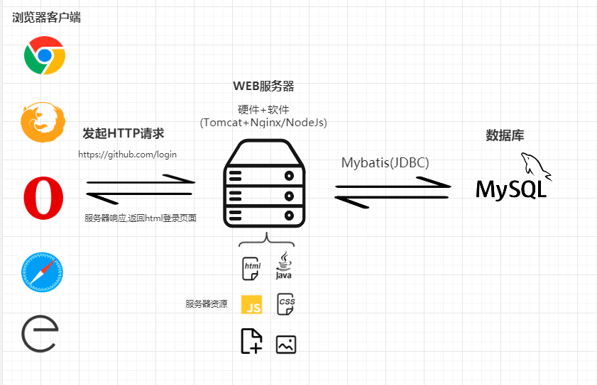
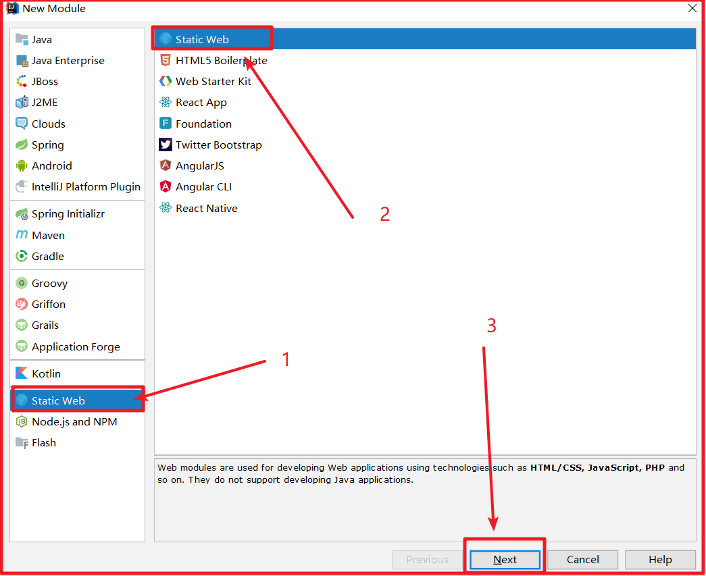
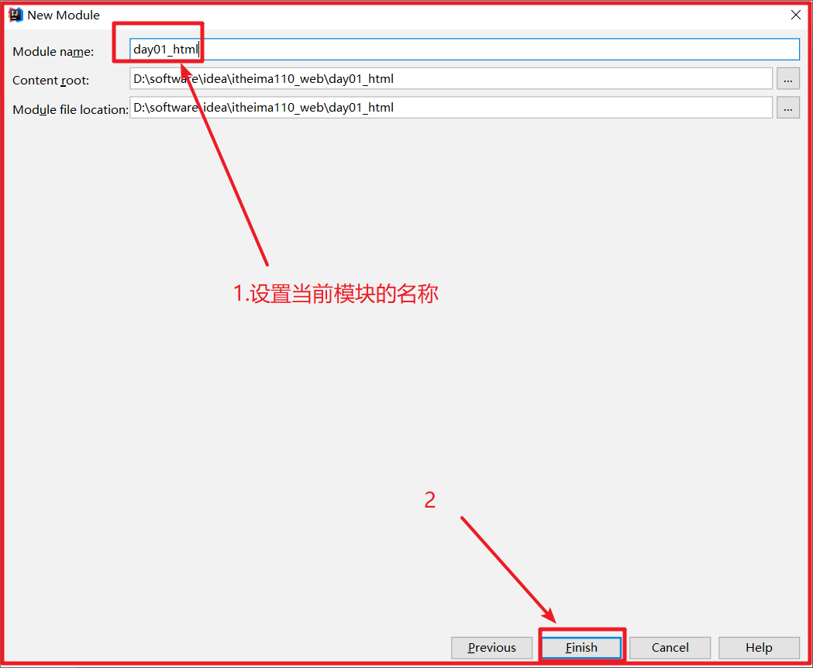
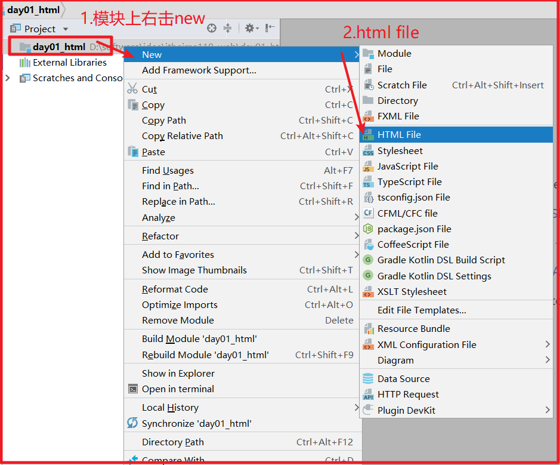
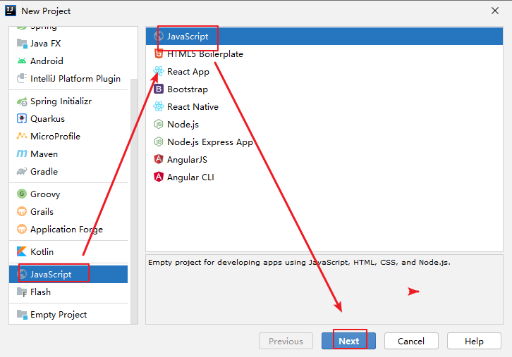
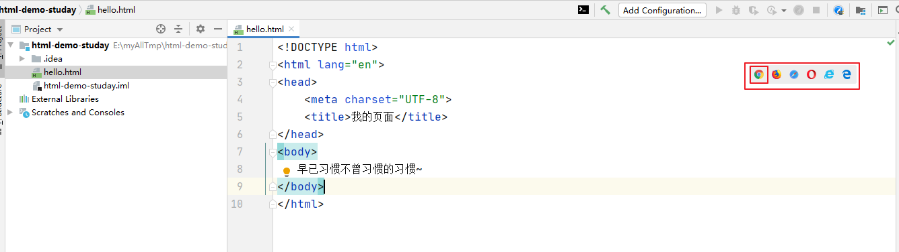
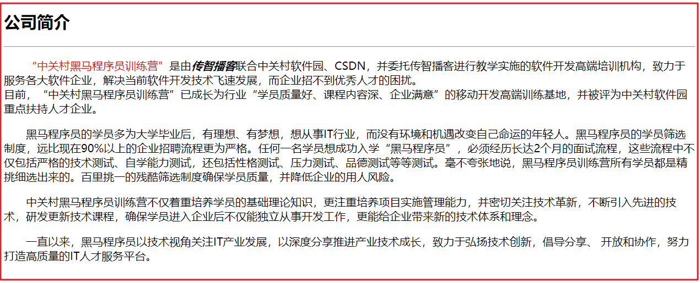
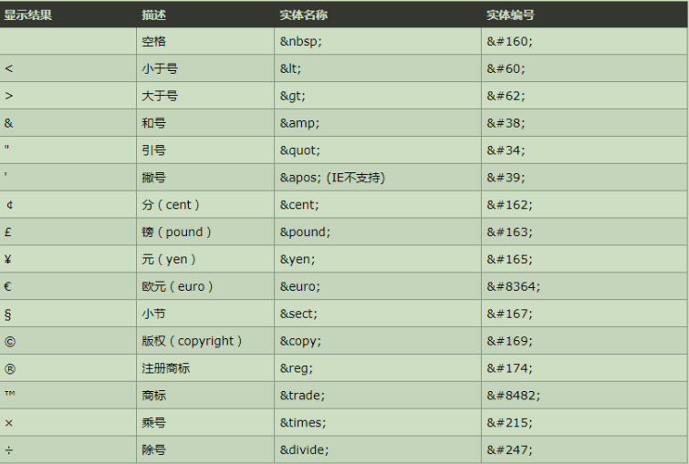
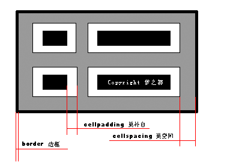

typora-copy-images-to: imgs


~~~tex
1)常用的关系型数据库
  mysql,oracle,db2,sqlserver等
  非关系型数据库：redis，memcache,mongodb,hbase，es等
2)sql分类
  DDL:数据的定义语言，主要是对数据库和表结构的操作，核心的关键字：create,alter,drop ,show ,desc，truncate等；
  DML:数据操纵语言，主要是对表中的数据的操作，核心关键字：insert into,delete from ,update set
  DQL:数据的查询语言，主要是对表中的数据进行查询操作，核心关键字：select 字段1，.... from 表 where 条件 group by 字段1，字段2 having 条件 order by 字段1 asc，字段2 desc limit index,row_size; 
  DCL:数据的控制语言，主要是创建用户以及分配，撤销，修改权限，核心关键字： create user '用户名'@‘主机名’ identified by '密码'；  grant 权限1，权限2，... on 库.表 to '用户名'@‘主机名’; revoke   from  
3）多表查询
	连接查询：
		内连接(交集)：显式内连接(select * from  t1 inner join t2 on 条件)和隐式内连接（where）
		外连接：左外-->以左表为基准，全部显式（left join on）和右外(right join on )
	子查询：
		一个sql查询的结果作为另一个sql的组成部分；
			单行单列：聚合函数
			多行单列：in
			多行多列：as取别名，与其他表进行关联查询；
4）事务
	start transaction;
	commit;
	rollback;
	savepoint 回滚点
	rollback to 回滚点
	事务4大特性：
    ACID:
    	原子性
    	隔离性
    	一致性
    	持久性
    隔离级别：
    	读未提交   脏读，不可重复读，幻读
    	读已提交   不可重复读，幻读
    	可重复读   幻读
    	 串行化
5)索引
	主键索引：唯一+非空+主键索引
	唯一索引：唯一+索引
	普通索引
	联合索引
	全文索引
	空间索引
	Hash索引
6）视图
  语法：create view 视图名称 as select语句；
  视图与表区别：
  	视图：仅保存表结构信息和sql语句，不保存数据本身；
  	表：保存结构和数据；
7）存储过程
  delimiter $
  create procedure 存储过程名称（[in/out/inout] 参数名称 参数类型，....）
  begin
    declare 参数名称 参数类型 default 值；
    set 参数名称 =值；
    select 聚合函数（） intto 变量 from  表；
    
    if 条件 then
       逻辑；
    elseif 条件 then
       逻辑；
     else
       逻辑；
    end if;   
    
    case
      when 条件 then
        逻辑；
      ......
      else
         逻辑
    end case;
    
    while 条件 do
       逻辑；
    end while;
  end$
  
8)innodb
  行锁：基于事务，对数据进行增删改操作，会锁住某些行，其他事务等待这个事务提交后，才能进行操作；
  表锁：索引失效，导致全表查询；
  间隙锁
9）jdbc
	开发流程：
	  1）注册驱动
	  2）获取连接对象
	  3）获取发送sql的Statement对象
	  4）发送sql，获取结果并解析
	  5）关闭资源，释放连接
10）mybatis
	1.动态SQL标签
	  if
	  where
	  set
	  foreach
	  choose when otherwise
	2.多表查询
      association
      collection
      collection+asscoiation
~~~


## 第一章 HTML概述==(了解)==



### 1.1 HTML概念

#### HTML概述

~~~html
html(超文本标记语言):全称Hyper Text Markup Language
超文本: 超越普通文本,可以存放图片,文字,超链接等..
标记: 指的是html定义好的标签
语言: 人跟网页交流的工具
作用: 编写网页,编写出的网页直接使用浏览器打开即可
注意: html是一门弱类型的语言,语法要求不严格,同时html并不是编程语言，而是标记语言(浏览器容错机制)
~~~

#### HTML5说明

~~~html
    2014年10月29日，万维网联盟泪流满面地宣布，经过几乎8年的艰辛努力，HTML5标准规范终于最终制定完成了，并已公开发布，这是一次重大的革新。  
	HTML5将会取代1999年制定的HTML 4.01、XHTML 1.0标准，以期能在互联网应用迅速发展的时候，使网络标准达到符合当代的网络需求，为桌面和移动平台带来无缝衔接的丰富内容。  
   h5业务自适应性
~~~

### 1.2 HTML入门案例

#### HTML扩展名(后缀名)

~~~html
html文件：
	1.后缀名 
		.html (推荐) 
		.htm
	2.文件主要书写html标签
	3.html文件依赖浏览器运行
注意: 编写好的html文件直接使用浏览器打开即可
~~~

#### HTML文件基本结构和入门案例

说明:以https://github.com/login网页结构为例讲解.

实现:

~~~html
<!DOCTYPE html><!-- 声明文档的类型为html页面,同时遵循html5规范 -->
<html> <!-- 页面的根标签,一般一个页面中只有一个 -->
   <head> <!-- html的头信息,一般不用于展示,内部存放一些核心数据信息 -->
        <meta charset="utf-8"/>  <!-- meta:元,charset属性是对meta标签的进一步描述,设置编码格式为utf-8  -->
		<title>我的第一个html页面</title><!-- 定义页面的标题 -->
		<link href="引入外部css资源"/> <!-- link 标签引入外部的css文件  第二天学习内容-->
		<script src="引入外部的js资源文件"></script> <!-- 引入外部js资源 第三天学习 -->
   </head>
   <body> <!-- body标签用于定义页面展示的内容 -->
       早已习惯不曾习惯的习惯~
   </body>
</html>
~~~


### 1.3 使用IDEA创建HTML

#### 在IDEA中创建静态的web模块

  前段开发人员:hbuilder,vscode,webstorm,dw等;

 1.IDEA**2020之前版本**创建静态工程





**使用IDEA创建html网页**



 **2.IDEA2020之前版本创建静态工程**






## 第二章 标签和标签属性==(熟悉)==

### 2.1 标签

#### 标签从哪来

说明:html中的标签是**万维网组织**给制定的,每一个标签都有**固定的**一种效果.

~~~html
html是由标签组成的,通过标签展示页面效果. 一个标签展示一种效果
html中的标签不是随便写的
html中的标签是万维网组织给制定的,每一个标签都有固定的一种效果.
我们在html中不能自定义标签,必须使用万维网制定的这些标签
html 和 xml 有什么关系?
	html: 超文本标记语言
	xml: 可扩展标记语言
	二者都是标记语言,html是特殊的xml,xml中的标签可以自定义,但是html中的标签都是预定义的.
~~~

#### 标签分类

 1.根据标签的书写方式:

 ~~~tex
1.单标签: eg:<meta charset="utf-8"/> <hr/> <br/> 
2.双标签: <h1></h1> <title></title>
 ~~~

2.根据展示效果:

~~~tex
1.行内标签
    使用时不自动换行
    eg:   早已习惯不曾习惯的习惯~
          <a>百度1</a><a>百度2</a>
2.行级标签:
    标签独占一行,使用时自动换行
        eg:<h1>你好</h1><h2>你好</h2> 
~~~


### 2.2 标签的属性

#### 标签属性的作用和书写规范

~~~html
属性作用:
	对标签进一步的描述与说明
	eg: 重要标签,charset属性是对页面编码的说明
		<meta charset="utf-8"/>
	在java中我们经常创建学生对象,在学生对象中有很多属性,(姓名,年龄,性别,成绩...)
属性的书写规范:
	单标签:
		<xxx 属性名称="属性值" 属性名称1="属性值1" />
	双标签: 双标签的属性写在开始标签上
<xxx 属性名称="属性值" 属性名称1="属性值1" >标签体</xxx>
~~~

### 2.3 学习HTML标签的方法

~~~html
HTML学习内容：
	1.学习常用的标签
	2.学习标签的常用属性
~~~

## 第三章 常用标签==(掌握)==

**注意**: html中可以使用快捷提高代码的编写效率

```java
tab键:
	在html页面中直接写标签名称,然后按 tab 键,会自动补全
```

### 3.1 字体标签

#### 任务:案例效果



#### 文字素材

~~~html
公司简介
"中关村黑马程序员训练营"是由传智播客联合中关村软件园、CSDN，并委托传智播客进行教学实施的软件开发高端培训机构，致力于服务各大软件企业，解决当前软件开发技术飞速发展，而企业招不到优秀人才的困扰。目前，“中关村黑马程序员训练营”已成长为行业“学员质量好、课程内容深、企业满意”的移动开发高端训练基地，并被评为中关村软件园重点扶持人才企业。

黑马程序员的学员多为大学毕业后，有理想、有梦想，想从事IT行业，而没有环境和机遇改变自己命运的年轻人。黑马程序员的学员筛选制度，远比现在90%以上的企业招聘流程更为严格。任何一名学员想成功入学“黑马程序员”，必须经历长达2个月的面试流程，这些流程中不仅包括严格的技术测试、自学能力测试，还包括性格测试、压力测试、品德测试等等测试。毫不夸张地说，黑马程序员训练营所有学员都是精挑细选出来的。百里挑一的残酷筛选制度确保学员质量，并降低企业的用人风险。

中关村黑马程序员训练营不仅着重培养学员的基础理论知识，更注重培养项目实施管理能力，并密切关注技术革新，不断引入先进的技术，研发更新技术课程，确保学员进入企业后不仅能独立从事开发工作，更能给企业带来新的技术体系和理念。

一直以来，黑马程序员以技术视角关注IT产业发展，以深度分享推进产业技术成长，致力于弘扬技术创新，倡导分享、 开放和协作，努力打造高质量的IT人才服务平台。
~~~

#### 相关标签

| 标签名 | 常用属性                                | 使用方法               | 说明                                    |
| ------ | --------------------------------------- | ---------------------- | --------------------------------------- |
| h      | align：水平对齐方式                     | `公司简介`             | 水平居中的一级标题。标题标签取值：h1~h6 |
| hr     | size：粗细 color：颜色 noshade:取消阴影 | ``                     | 在页面上创建一条size="2"橘黄色的水平线  |
| font   | color：颜色，size：大小，face：字体     | `传智播客`             | 修饰文字的颜色，字号和字体              |
| b      | 无                                      | `传智播客`             | 将文字加粗                              |
| i      | 无                                      | `黑马程序员`           | 文字倾斜                                |
| p      | 无                                      | `传智播客，黑马程序员` | 将文字划分段落                          |
| br     | 无                                      | `传智播客 黑马程序员`  | 手动换行                                |

##### 【1】标题标签：h

说明:常见的属性-align;

~~~html
<!DOCTYPE html>
<html lang="en">
<head>
    <meta charset="UTF-8">
    <title>Title</title>
</head>
<body>
    <!--
      h标签从h1到h6依次字体大小递减
        align:表示文字位置定义
          left:默认 居左显示
          center:居中显示
          right:居右显示
    -->
    <h1 align="left">我是h1</h1>
    <!--align="center"表示显示居中-->
    <h2 align="center">我是h2</h2>
    <!--align="right"表示显示居中-->
    <h3 align="right">我是h3</h3>
    <h4 style="background-color: aquamarine">我是h4</h4>
    <h5>我是h5</h5>
    <h6>我是h6</h6>
</body>
</html>
~~~


##### 【2】水平线标签：\<hr>

说明:核心属性为size,width,align,color等,其中数值和颜色各种2中定义方式;

~~~html
<!DOCTYPE html>
<html lang="en">
<head>
    <meta charset="UTF-8">
    <title>Title</title>
</head>
<body>
<!--
   hr:水平线标签
     size:厚度
        单位：px
     width:宽度
        取值2种方式：
          1.百分比取值
          2.像素取值
     align:位置
        left
        center 默认
        right
     color:颜色
       2种取值方式：
        1.英文单词取值发
        2.三原色取值法（rgb取值法）
           rgb:由红，绿，蓝三种颜色组成
           表示方式：16进制表示
              #3F434C
              3F：red
              43: green
              4c: blue

-->
    <hr>
    <hr size="10px" color="#00FF00">
    <hr width="500px" color="#FF0000"/>
    <hr width="50%" color="#3F434C"/>
    <hr width="50%" color="red" align="left"/>
    <hr width="50%" color="green" align="right"/>

</body>
</html>
~~~


##### 【3】字体标签:font

说明:字体核心属性color,size,face（字体格式，比如楷体，微软雅黑）等;

~~~html
<!DOCTYPE html>
<html lang="en">
<head>
    <meta charset="UTF-8">
    <title>Title</title>
</head>
<body>

    <!--
      font:字体标签
        color：颜色设置（2种方式）
        size:从1到7依次字体增大，大于7之后默认大小等7
    -->
    <font color="#7fff00" size="1">黑马程序员</font> 的学员多 <font color="red">为大学毕业</font> 后，有理想、
    有梦想，想从事IT行业，1<br/>
    <font color="#7fff00" size="2">黑马程序员</font> 的学员多 <font color="red">为大学毕业</font> 后，有理想、
    有梦想，想从事IT行业，2<br/>
    <font color="#7fff00" size="3">黑马程序员</font> 的学员多 <font color="red">为大学毕业</font> 后，有理想、
    有梦想，想从事IT行业，3<br/>
    <font color="#7fff00" size="4">黑马程序员</font> 的学员多 <font color="red">为大学毕业</font> 后，有理想、
    有梦想，想从事IT行业，4<br/>
    <font color="#7fff00" size="5">黑马程序员</font> 的学员多 <font color="red">为大学毕业</font> 后，有理想、
    有梦想，想从事IT行业，5<br/>
    <font color="#7fff00" size="7">黑马程序员</font> 的学员多 <font color="red">为大学毕业</font> 后，有理想、
    有梦想，想从事IT行业，7<br/>
    <font color="#7fff00" size="8" face="楷体">黑马程序员</font> 的学员多 <font color="red">为大学毕业</font> 后，有理想、
    有梦想，想从事IT行业，8<br/>
    <font color="#7fff00" size="100" face="宋体">黑马程序员</font> 的学员多 <font color="red">为大学毕业</font> 后，有理想、
    有梦想，想从事IT行业，100<br/>

</body>
</html>
~~~


##### 【4】字体加粗/倾斜

说明:加粗常用\<b>和\<strong>标签,斜体字体使用\<i>标签;

~~~html
<!DOCTYPE html>
<html lang="en">
<head>
    <meta charset="UTF-8">
    <title>Title</title>
</head>
<body>

   床前 <strong> <i>明月</i> </strong> 光，疑是地上<i><b>霜</b></i>  。

</body>
</html>
~~~


##### 【5】段落标签\<P>和换行\<br/>

说明:p标签常用属性为align，要实现空格使用style="text-indent: 2em;"属性;

~~~html
<!DOCTYPE html>
<html lang="en">
<head>
    <meta charset="UTF-8">
    <title>Title</title>
</head>
<body>

<!--
  p:段落标签
   标签与标签之间有留白
   是行级标签（标签与标签之间自动换行）
   style="text-indent: 2em":表示空2个空格
-->
<p style="text-indent: 2em">
黑马程序员的学员多为大学毕业后，有理想、有梦想，想从事IT行业，而没有环境和机遇改变自己命运的年轻人。
</p>

<p>
黑马程序员的学员筛选制度，远比现在90%以上的企业招聘流程更为严格。任何一名学员想成功入学“黑马程序员”，
必须经历长达2个月的面试流程，这些流程中不仅包括严格的技术测试、
自学能力测试。 <br> 还包括性格测试、压力测试、品德测试等等测试。毫不夸张地说，
黑马程序员训练营所有学员都是精挑细选出来的。
</p>
<p>
    百里挑一的残酷筛选制度确保学员质量，
    并降低企业的用人风险。
</p>

</body>
</html>
~~~


##### 【6】新闻字体案例


2.代码实现；

~~~html
<!DOCTYPE html>
<html lang="en">
<head>
    <meta charset="UTF-8">
    <title>Title</title>
</head>
<body>
<h2 align="center">公司简介</h2>
<hr color="red">

<p style="text-indent: 2em"><font color="red">"中关村黑马程序员训练营"</font> 是由 <b><i>传智播客</i></b> 联合中关村软件园、CSDN，并委托传智播客进行教学实施的软件开发高端培训机构，
    致力于服务各大软件企业，解决当前软件开发技术飞速发展，而企业招不到优秀人才的困扰。<br>
    目前，“中关村黑马程序员训练营”已成长为行业“学员质量好、课程内容深、企业满意”的移动开发高端训练基地，
    并被评为中关村软件园重点扶持人才企业。
</p>

<p style="text-indent: 2em">黑马程序员的学员多为大学毕业后，有理想、有梦想，想从事IT行业，而没有环境和机遇改变自己命运的年轻人。
    黑马程序员的学员筛选制度，远比现在90%以上的企业招聘流程更为严格。任何一名学员想成功入学“黑马程序员”，
    必须经历长达2个月的面试流程，这些流程中不仅包括严格的技术测试、自学能力测试，还包括性格测试、
    压力测试、品德测试等等测试。毫不夸张地说，黑马程序员训练营所有学员都是精挑细选出来的。百里挑一的残酷筛选制度确保学员质量，
    并降低企业的用人风险。
</p>

<p style="text-indent: 2em">
    中关村黑马程序员训练营不仅着重培养学员的基础理论知识，更注重培养项目实施管理能力，
    并密切关注技术革新，不断引入先进的技术，研发更新技术课程，确保学员进入企业后不仅能独立从事开发工作，
    更能给企业带来新的技术体系和理念。
</p>

<p style="text-indent: 2em">
    一直以来，黑马程序员以技术视角关注IT产业发展，以深度分享推进产业技术成长，致力于弘扬技术创新，
    倡导分享、 开放和协作，努力打造高质量的IT人才服务平台。
</p>

</body>
</html>
~~~


### 3.2 特殊字符



演示代码:

~~~html
<!DOCTYPE html>
<html lang="en">
<head>
    <meta charset="UTF-8">
    <title>Title</title>
</head>
<body>
  <!--窗前    明月     光,疑似       地上    霜     -->
  <!--说明:html对多空格的文字都转换成一个-->
   窗前&nbsp;&nbsp;&nbsp;明月 &nbsp;    光,疑似 &nbsp;&nbsp;&nbsp;      地上&nbsp;&nbsp; 霜;<br/>
  &spades;<br>
&reg;
</body>
</html>
~~~

### 3.3 图片标签\

说明:图片标签核心属性:src,alt,title,width,heigh等

~~~html
<!DOCTYPE html>
<html lang="en">
<head>
    <meta charset="UTF-8">
    <title>Title</title>
</head>
<body>
<!--
   img:行内标签
    src:表示引入外部图片资源
    alt:表示当图片资源加载不到时的提示信息
    title:表示鼠标悬停到图片上时的提示信息
    width:宽度
    height:高度
-->


</body>

</html>
~~~


### 3.4 列表和超链接

#### 无序/有序列表

说明:有序ol核心属性:type(1 a A i I) start等;

​         无序ul核心属性:type(circle,disc,square)等;

两者共有字标签\<li>

~~~html
<!DOCTYPE html>
<html lang="en">
<head>
    <meta charset="UTF-8">
    <title>Title</title>
</head>
<body>

<!--
  ol:有序列表
    type:
      1
      a
      A
      I
      i
-->

<ol>
    <li>张学友</li>
    <li>黎明</li>
    <li>郭富城</li>
    <li>刘德华</li>
</ol>

<ol type="1" start="3">
    <li>张学友</li>
    <li>黎明</li>
    <li>郭富城</li>
    <li>刘德华</li>
</ol>
<ol type="A">
    <li>张学友</li>
    <li>黎明</li>
    <li>郭富城</li>
    <li>刘德华</li>
</ol>
<ol type="I">
    <li>张学友</li>
    <li>黎明</li>
    <li>郭富城</li>
    <li>刘德华</li>
</ol>
<br>
<!--
   ul:表示无序列表
     type:
       circle:空心圆
       disc:实心圆 默认
       square:方块
-->
<ul>
    <li>张学友</li>
    <li>黎明</li>
    <li>郭富城</li>
    <li>刘德华</li>
</ul>
<ul type="circle">
    <li>张学友</li>
    <li>黎明</li>
    <li>郭富城</li>
    <li>刘德华</li>
</ul>
<ul type="square">
    <li>张学友</li>
    <li>黎明</li>
    <li>郭富城</li>
    <li>刘德华</li>
</ul>


</body>
</html>
~~~


#### 超链接标签★

说明:

1.\<a>标签核心属性:href,target(_self,_blank)等,

   作用:**1.超链接：链接到外部的网络资源;2.空链接：阻止超链接;3.锚点定位：**

2.演示锚点需要填充整个页面,可使用大图片演示;

~~~html
<!DOCTYPE html>
<html lang="en">
<head>
    <meta charset="UTF-8">
    <title>Title</title>
</head>
<body>
<!--
   a:
    作用：1）资源跳转 2）类似页面刷新 3）锚点定位
    target:
       _self:新页面覆盖当前的页面
       _blank:新建一个新的页面
-->
      <a target="_self" href="https://www.baidu.com/">百度一下</a>
      <a target="_blank" href="https://www.baidu.com/">百度一下2</a>
      <a target="_self" href="#">刷新页面</a><br>
      <a target="_self" href="#chaoyue">查看杨超越</a><br>
      <a target="_self" href="#yuanbingyan">查看袁冰妍</a><br>

    
    
    
    
    
</body>

</html>
~~~


小结:

~~~tex
1)字体
<h1~6> 从1到6字体大小一次递减；
   属性： <h1 align="center">xxx</h1>
<hr> :水平线
  属性：align,size,width,color
<strong> <b> :字体加粗
<i> :字体倾斜
<font color="red">XX</font>
<p style="text-indent:2em;">:段落标签 
<br>换行标签
2）列表
有序：默认根据数字排序
	<ol type="1/a/A/i/I">
		<li>张三</li>
		<li>张三</li>
	</ol>
无序：默认实心圆显式风格
	<ul type="circle/disc/square">
		<li>张三</li>
		<li>李四</li>
	</ul>
3)图片:行内标签
  
    src:表示引入外部图片资源；
    alt:图片加载不到时提醒信息；
    title：鼠标悬停后的提示信息；
4）超链接a标签
   a:
   	属性：
   		href:表示链接外部资源
   			#:表示跳转到自身页面
   			#id(页面中其他html标签的id)：锚点定位
   		target:
   			_self
   			_blank
   			
~~~


### 3.5 表格标签【重点】

#### 1.表格标签

说明:

1.\<table>标签核心属性:border,width,bgcolor,align,cellpadding,cellspacing等

2.\<tr>标签核心属性:bgcolor,align等;

3.\<td>或者\<th>标签核心属性:bgcolor,align,rowspan,colspan等



说明：

~~~tex
cellpadding:内填充,表示单元格中内容距离单元格框的距离;
cellspacing:外填充,表示单元格之间的距离;
~~~

~~~html
<!DOCTYPE html>
<html lang="en">
<head>
    <meta charset="UTF-8">
    <title>Title</title>
</head>
<body>

<!--
  表格跟标签：table
    table下有若干行：tr
        每一行下有若干列：td/th(将字体加粗)
        属性：
            border：边框

            td:
                rowspan:行级合并 上下合并时，保留上边的单元格，同时定义合并的数量，删除下边多行的单元格
                colspan:列合并

-->
<table border="1px" width="500" align="center" bgcolor="#ffc0cb" cellpadding="4px" cellspacing="4px">
    <tr>
        <th>编号</th>
        <th>姓名</th>
        <th>性别</th>
    </tr>
    <!--就近原则-->
    <tr align="center" bgcolor="aqua">
        <td bgcolor="red">001</td>
        <td colspan="2">张三/男</td>
        <!--<td>男</td>-->
    </tr>
    <tr align="center">
        <td>002</td>
        <td rowspan="2">宋小宝/柳岩</td>
        <td>男</td>
    </tr>
    <tr align="center">
        <td>003</td>
        <!--<td>柳岩</td>-->
        <td>女</td>
    </tr>

</table>

</body>
</html>
~~~


小结

~~~tex
表格：
<table align="right" bgcolor="颜色" width="xxpx" cellpadding="内填充" cellspacing="外填充">
	<tr bgcolor="颜色">
		<th>xx</th>
		<th>xx</th>
		<th>xx</th>
	</tr>
	<tr align="center">
		<td bgcolor="颜色" rowspan="跨行单元格合并" colspan="跨列单元格合并">xx</td>
		<td>xx</td>
		<td>xx</td>
	</tr>
</table>
~~~


## 2.其他:颜色和大小(了解)

~~~html
颜色取值:
	英文单词取值法
	RGB取值法: red green blue
		格式: 以#开头,后面跟6个十六进制的数字
			eg: #0011ff		#01f
			注意: 如果三种颜色上的值一致,可以简写 #01f
		前2位: 代表红色所占的比重
		中2位: 代表绿色所占的比重
		后2位: 代表蓝颜色所占比重
大小取值:
	像素: px (px单位可以省去不写)
	百分百: 宽度可以使用百分百,高度不建议使用百分百
		100% 50%
	厘米 : cm(在html中不好使,在css中可以使用)
~~~

~~~tex
前端3剑客:
 html: html更像是一个毛坯房
 css: 装饰
 javaScript: 门窗,花洒等
~~~

## 第四章、表单标签【掌握】

### 表单的作用

```java
收集用户填写的数据信息,将收集到的数据提交给指定的服务器进行保存
```

说明:依旧以github登录界面为例:https://github.com/


### 5.1 表单标签概述

#### 表单标签的作用

作用：如果要将客户端的数据发送给服务器，我们需要使用表单容器

可见性：在浏览器是不可见的。

#### form的常用属性

| **常用属性** | **作用**                              |
| ------------ | ------------------------------------- |
| **action**   | 将数据指定给服务器的地址              |
| **method**   | 提交数据的方式，有两种方式：GET或POST |

#### get和post的区别

| **提交方法** | **特点**                                                     |
| ------------ | ------------------------------------------------------------ |
| **GET**      | 默认是get方法提交，表单提交的所有的数据显示在地址栏上  地址与参数之间使用?分隔，多个参数之间使用&分隔 |
| **POST**     | 数据提交更加安全，不会显示在地址栏上                         |

### 5.2 案例：表单标签的应用

#### 案例需求

 结合表格布局，制作如图所示的注册页面

#### 常用表单控件

| **表单项**             | **控件代码**                                                 | 属性                                                         | 备注                                                         |
| ---------------------- | ------------------------------------------------------------ | ------------------------------------------------------------ | ------------------------------------------------------------ |
| **文本框**             | <input type="text"  name="名字">                             | type：输入控件的类型  <br/>name: 提交参数给服务器时使用的名字<br/>  value: 文本框中的默认值  <br/>readonly: 内容是只读的，不能修改  <br/>disabled: 不可用，灰色显示，数据不能提交给服务器  <br/>placeholder: 输入前数据前的提示信息 | 如果没有指定type类型，默认是text                             |
| **密码框**             | <input type="password">                                      | 属性同上                                                     | 输入的字符不可见                                             |
| **单选框**             | <input type="radio"  name="gender" value="男" checked="checked"> | checked：默认选中这项  value: 选中这一项的值，如果没有指定，默认值是on | 名字相同的单选框是同一组，一组中只能选中一个。               |
| **复选框**             | <input type="checkbox"  name="hobby" value="游泳">           | checked：默认选中这项  value: 选中这一项的值                 |                                                              |
| **下拉列表**           | <select> 容器  默认是单选        多选                        | name: 给服务器使用的名字  multiple：多选  size: 多选时显示几项 |                                                              |
| \<option> 代表其中一项 | value: 选中这一项的值  selected: 默认选中这项                |                                                              |                                                              |
| **隐藏表单域**         | <input  type="hidden" name="id" value="值"/>                 | name: 给服务器使用的名字  value: 隐藏域的值                  | 表单上不可见，可以将数据提交给服务器。一般用于一些不需要用户看到的数据。 |
| **文件域**             | <input type="file"  name="photo" accept="image/*">           | accept: 指定选择的文件类型  如：image/*                      |                                                              |
| **多行文本域**         | <textarea name="intro"  cols="50" rows="5"></textarea>       | rows:显示的行数  cols:显示的列数                             | 注：没有value值，主体部分就是它的值                          |
| **提交按钮**           | \<input type="submit"  value="注册"/>  <button>按钮文字</button> | value: 按钮上出现的文字  button也可以指定type类型，默认是提交按钮 | 将整个表单提交给服务器                                       |
| **重置按钮**           | <input type="reset"  value="重置"/>                          |                                                              | 还原到没有输入数据前的状态                                   |
| **普通按钮**           | <input type="button"  value="按钮"/>                         |                                                              | 在表单中没有具体的功能，主要用于后期程序开发                 |
| **图片按钮**           | <input type="image"  src="img/regbtn.jpg">                   | x,y: 鼠标点击在图片上的坐标                                  | 具有与submit相同的功能                                       |

##### 【1】input类标签：

说明: 

1.\<input>核心属性type包含:text,password,radio,checkbox,hidden,file等;

2.输入框禁用和只读属性设置;

~~~html
<!DOCTYPE html>
<html lang="en">
<head>
    <meta charset="UTF-8">
    <title>Title</title>
</head>
<body>

<form action="#" method="get">
    <!--文本输入框-->
    <!--readonly表示输入框只读，不能修改，但是可以将数据发送到后台-->
    姓名：<input type="text" name="name" value="laofang" readonly><br>
    昵称：<input type="text" name="name"><br>
    <!--disable：表示禁用输入框
        功能：1）完成数据展示 2）数据不会像后台发送
    -->
    &nbsp;&nbsp;&nbsp;ID：<input type="text" name="ID" value="371481xxxxxxxxx" disabled="true"><br>
    <!--密码输入框-->
    密码：<input type="password" name="password"><br>
    <!--单选框-->
    <!--checked：表示默认选中-->
    性别：<input type="radio" name="sex" value="1" checked>男<input type="radio" name="sex" value="0">女<br>
    <!--checkbox：表示复选框-->
    爱好：<input type="checkbox" name="hobby" value="抽烟">抽烟<input type="checkbox" name="hobby" value="喝酒" checked>喝酒
    <input type="checkbox" name="hobby" value="烫头" checked>烫头<br>
    <!--隐藏输入框-->
    <input type="hidden" name="id" value="001">
    <!--文件输入框-->
    头像：<input type="file" name="file"><br>
    <!--form表单提交按钮-->
    <input type="submit" value="确定提交">
</form>

</body>
</html>
~~~

##### 【2】select下拉选

说明:\<select>标签字标签核心属性:value,selected;

~~~html
<!DOCTYPE html>
<html lang="en">
<head>
    <meta charset="UTF-8">
    <title>Title</title>
</head>
<body>

<form action="#" method="get">
    <!--文本输入框-->
    <!--readonly表示输入框只读，不能修改，但是可以将数据发送到后台-->
    姓名：<input type="text" name="name" value="laofang" readonly><br>
    昵称：<input type="text" name="name"><br>
    <!--disable：表示禁用输入框
        功能：1）完成数据展示 2）数据不会像后台发送
    -->
    &nbsp;&nbsp;&nbsp;ID：<input type="text" name="ID" value="371481xxxxxxxxx" disabled="true"><br>
    <!--密码输入框-->
    密码：<input type="password" name="password"><br>
    <!--单选框-->
    <!--checked：表示默认选中-->
    性别：<input type="radio" name="sex" value="1" checked>男<input type="radio" name="sex" value="0">女<br>
    <!--checkbox：表示复选框-->
    爱好：<input type="checkbox" name="hobby" value="抽烟">抽烟<input type="checkbox" name="hobby" value="喝酒" checked>喝酒
    <input type="checkbox" name="hobby" value="烫头" checked>烫头<br>
    <!--隐藏输入框-->
    <input type="hidden" name="id" value="001">
    <!--文件输入框-->
    头像：<input type="file" name="file"><br>
    <!--下拉选 select  option-->
    <!--对于下拉选，默认向后台传选项值，但是当定义了option下的value属性值之后，就会传value值-->
    地址：
    <select name="province">
        <option value="1">山东</option>
        <option value="2">河南</option>
        <option value="3">江苏</option>
        <option value="4">浙江</option>
    </select>省
    <select name="city">
        <option value="01">济南</option>
        <option value="02">青岛</option>
        <option value="03">南京</option>
        <option value="04">苏州</option>
        <option value="05">杭州</option>
        <option value="06">温州</option>
    </select>市<input type="text" name="special" placeholder="请输入详细地址">

    <br>
    <!--form表单提交按钮-->
    <input type="submit" value="确定提交">
</form>

</body>
</html>
~~~


##### 【3】textarea文本域数据框

说明:\<textarea>核心属性:name,rows,cols,

~~~html
<!DOCTYPE html>
<html lang="en">
<head>
    <meta charset="UTF-8">
    <title>Title</title>
</head>
<body>

<form action="#" method="get">
    <!--文本输入框-->
    <!--readonly表示输入框只读，不能修改，但是可以将数据发送到后台-->
    姓名：<input type="text" name="name" value="laofang" readonly><br>
    昵称：<input type="text" name="name"><br>
    <!--disable：表示禁用输入框
        功能：1）完成数据展示 2）数据不会像后台发送
    -->
    &nbsp;&nbsp;&nbsp;ID：<input type="text" name="ID" value="371481xxxxxxxxx" disabled="true"><br>
    <!--密码输入框-->
    密码：<input type="password" name="password"><br>
    <!--单选框-->
    <!--checked：表示默认选中-->
    性别：<input type="radio" name="sex" value="1" checked>男<input type="radio" name="sex" value="0">女<br>
    <!--checkbox：表示复选框-->
    爱好：<input type="checkbox" name="hobby" value="抽烟">抽烟<input type="checkbox" name="hobby" value="喝酒" checked>喝酒
    <input type="checkbox" name="hobby" value="烫头" checked>烫头<br>
    <!--隐藏输入框-->
    <input type="hidden" name="id" value="001">
    <!--文件输入框-->
    头像：<input type="file" name="file"><br>
    <!--下拉选 select  option-->
    <!--对于下拉选，默认向后台传选项值，但是当定义了option下的value属性值之后，就会传value值-->
    地址：
    <select name="province">
        <option value="1">山东</option>
        <option value="2">河南</option>
        <option value="3">江苏</option>
        <option value="4">浙江</option>
    </select>省
    <select name="city">
        <option value="01">济南</option>
        <option value="02">青岛</option>
        <option value="03">南京</option>
        <option value="04">苏州</option>
        <option value="05">杭州</option>
        <option value="06">温州</option>
    </select>市<input type="text" name="special" placeholder="请输入详细地址">
    <br>
    自我介绍：<textarea name="intro"rows="5" cols="100"></textarea><br>
    <!--form表单提交按钮-->
    <input type="submit" value="确定提交">
</form>

</body>
</html>
~~~


##### 【4】按钮

说明:

1.\<input>标签根据属性type的不同,分为button,submit,reset,image等;

2.使用\<button>标签定义按钮;

~~~html
    <!--form表单提交按钮-->
    <input type="submit" value="确定提交">
    <!--普通按钮-->
    <input type="button" value="普通按钮">
    <!--reset重置按钮，表示对form表单中的数据进行初始化重置-->
    <input type="reset" value="重置form数据">
    <!--普通的button按钮-->
    <button>普通button按钮</button>
    <!--image按钮：1）完成与submit相同的提交功能 2）获取图片像素的位置-->
    <input type="image" name="imag" value="图片提交" src="../图片标签/imgs/1.jpg">
~~~


### 5.3 HTML5中表单控件新增的type属性

| type属性值  | **作用**                               |
| ----------- | -------------------------------------- |
| **date**    | 出现日历选择控件                       |
| placeholder | 输入提示信息                           |
| **email**   | 邮件，如果输入了值，本身自带验证的功能 |
| **color**   | 选择一种颜色                           |
| **number**  | 只能输入数字，并且可以向上或向下选择   |

~~~html
<!DOCTYPE html>
<html lang="en">
<head>
    <meta charset="UTF-8">
    <title>Title</title>
</head>
<body>

<form action="#" method="get">
    <!--文本输入框-->
    <!--readonly表示输入框只读，不能修改，但是可以将数据发送到后台-->
    姓名：<input type="text" name="name" value="laofang" readonly><br>
    昵称：<input type="text" name="name"><br>
    <!--disable：表示禁用输入框
        功能：1）完成数据展示 2）数据不会像后台发送
    -->
    &nbsp;&nbsp;&nbsp;ID：<input type="text" name="ID" value="371481xxxxxxxxx" disabled="true"><br>
    <!--密码输入框-->
    密码：<input type="password" name="password"><br>
    <!--date --生日 -->
    生日：<input type="date" name="birthday"><br>
    <!--type="email"表示邮箱格式类型，不满足这个格式，form提交会提醒失败-->
    肤色：<input type="color" name="color"><br>
    邮箱：<input type="email" name="email"><br>
    <!--number属性表示只能输入数字类型，max表示最大值，min表示最小值-->
    年龄：<input type="number" name="age" max="120" min="0"><br>
    <!--单选框-->
    <!--checked：表示默认选中-->
    性别：<input type="radio" name="sex" value="1" checked>男<input type="radio" name="sex" value="0">女<br>
    <!--checkbox：表示复选框-->
    爱好：<input type="checkbox" name="hobby" value="抽烟">抽烟<input type="checkbox" name="hobby" value="喝酒" checked>喝酒
    <input type="checkbox" name="hobby" value="烫头" checked>烫头<br>
    <!--隐藏输入框-->
    <input type="hidden" name="id" value="001">
    <!--文件输入框-->
    头像：<input type="file" name="file"><br>
    <!--下拉选 select  option-->
    <!--对于下拉选，默认向后台传选项值，但是当定义了option下的value属性值之后，就会传value值-->
    地址：
    <select name="province">
        <option value="1">山东</option>
        <option value="2">河南</option>
        <option value="3">江苏</option>
        <option value="4">浙江</option>
    </select>省
    <select name="city">
        <option value="01">济南</option>
        <option value="02">青岛</option>
        <option value="03">南京</option>
        <option value="04">苏州</option>
        <option value="05">杭州</option>
        <option value="06">温州</option>
    </select>市<input type="text" name="special" placeholder="请输入详细地址">
    <br>
    自我介绍：<textarea name="intro"rows="5" cols="100"></textarea><br>
    <!--form表单提交按钮-->
    <input type="submit" value="确定提交">
    <!--普通按钮-->
    <input type="button" value="普通按钮">
    <!--reset重置按钮，表示对form表单中的数据进行初始化重置-->
    <input type="reset" value="重置form数据">
    <!--普通的button按钮-->
    <button>普通button按钮</button>
    <!--image按钮：1）完成与submit相同的提交功能 2）获取图片像素的位置-->
    <input type="image" name="imag" value="图片提交" src="../图片标签/imgs/1.jpg">

</form>

</body>
</html>
~~~


## 总结

重点：

~~~tex
1）form表单
表单标签格式：
	get:数据在地址栏进行拼接，多个参数之间用&进行拦截，相对不安全的，4kb；
	post:数据在http的请求体中，相对来说安全，传输的数据量比get要大很多；
<form action="数据提交的服务路径" method="get/post">
	<!-- 文本输入框-->
	<input type="text" name="name属性值必须要指定">
	<!-- 密码输入框-->
	<input type="password" name="xx">
	<!-- 单选框 -->
	<input type="radio" name="sex" checked>男<input type="radio" name="sex">女
	<!-- 多选框 -->
	<input type="checkbox" name="hobby" value="1" checked>抽烟 <input type="checkbox" name="hobby" value="2">喝酒 ...... 
	<!--输入隐藏框 -->
	<input type="hidden" name="id" value="001">
	<!-- 文件输入框 -->
	<input type="file" name="file_name">
	<!--下拉选 -->
	<select name="xx">
		<option value="1">河北</option>
		<option value="2">河南</option>
		......
	</select>
	<!--文本域 -->
	<textarea name="xxx"></textarea>
	
	<!--按钮 -->
	<input type="submit" value="提交">
	<input type="button" value="普通按钮">
	<input type="reset" value="重置按钮">
	<!--button在form表单内跟submit功能一致，在form外部，就是普通按钮-->
	<button>按钮<button>
</form>
2）table表格
<table align="center" bgcolor="颜色" cellpadding="内填充" cellspacing="外填充">
	<tr><th>编号<th><th>姓名</th></tr>
	<tr><td>001<td><td>张三</td></tr>
	<tr><td>002<td><td>李四</td></tr>
	<tr><td>003<td><td>王五</td></tr>
</table>
单元格合并：
	1）行级合并 rowspan
	2）列级合并 colspan
3)a标签
<a target="_self/_blank" href="外部资源路径">点击一下</a>
锚点定位：
	<a href="#image_id">定位1</a>
	<image id="image_id" src="image_path">
~~~


