# CSS

## **今日内容学习目标**

熟悉的CSS样式的3种导入方式

熟悉CSS选择器的使用(理解)

了解CSS基本属性使用

了解CSS盒子模型


## 1、 **使用CSS优化网站注册页面**

### 1.1、 **C**SS概述

#### 1.1.1、CSS是什么

CSS 通常称为CSS样式或层叠样式表，又称之为网页的美容师，主要用于设置HTML页面中的文本内容（字体、大小、对齐方式等）、图片的外形（高宽、边框样式、边距等）以及版面的布局等外观显示样式。

CSS可以使HTML页面更好看，CSS色系的搭配可以让用户更舒服，**CSS+DIV布局更佳灵活，更容易绘制出用户需要的结构。**

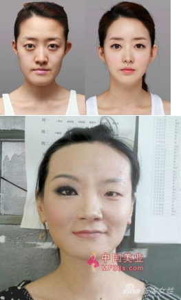

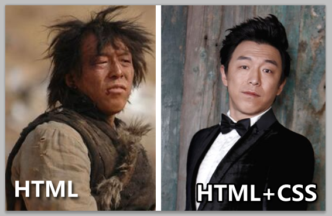


#### 1.1.2、 **CSS名词解释**

CSS (Cascading Style Sheets) ：指层叠样式表

​	样式： 给HTML标签添加需要显示的效果。

​	层叠： 使用不同的添加方式，给同一个HTML标签添加样式，最后所有的样式都叠加到一起，共同作用于该标签。

举例：给同一个标签table添加高度、宽度和背景颜色等。

### 1.2、 **怎么书写CSS** 

一般标签都可以添加一个**style**属性来书写样式给标签添加一些特殊效果。

CSS使用的基本语法：

```html
<标签名 style="样式名1 : 样式值1;样式名2 : 样式值2;…" ></标签名>
```

**注意点：**

1、 样式名 和 样式值 之间通过 ： 来隔开。

2、 多个样式之间使用 ; 隔开。

3、 一般复合样式 (border, font…) 值是多个，而多个值使用空格隔开。例如： border : 1px solid #000； 说明：px表示像素，是一种单位。

补充: 样式非常多，具体的样式名和样式值需要在api中去查询。在今天课程的最后我们会介绍一些常见的css样式。

 

需求：书写div，要求设置：字体为黄色，字体大小100px， 边框为 1px  实线 边框颜色为红色。

分析： 需要使用到的样式：

​	1)color  	  设置字体的颜色

​	2)font-size  设置字体的大小

​	3)border   设置边框    border:border-width border-style border-color; 分别用来修饰边框的粗细，边框的样式，边框的颜色。

代码实现：

```html
<!DOCTYPE html>
<html>
	<head>
		<meta charset="UTF-8">
		<title></title>
	</head>
	<body>
		<!--
			需求：书写div，要求设置：字体为黄色，字体大小100px， 边框为 1px  实线 边框颜色为红色。
			分析：
			字体颜色：color
			字体大小：font-size
			边框：border：border-width border-style border-color
			注意：这里的像素单位px不能省略，省略，效果就不会出现了。border: 1px solid red;
		-->
		<!--<div style="color:yellow;font-size: 100px;border-width: 1px;border-style: solid;border-color: red;">-->
		<div style="color:yellow;font-size: 100px;border: 1px solid red;">
			我是div
		</div>
	</body>
</html>
```

**注意：上述像素px不能省略，省略就不会出现效果了。**

实现效果：

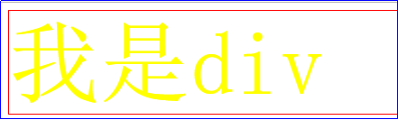

### 1.3、 CSS和HTML结合的方式

上面我们学会了书写css样式的基本语法，而要知道我们的html页面只能书写html标签。那么css可不可以写到html文件中呢？如果可以，那么css可以写在html文件中的什么地方？如果不写在html文件中，我能在当前html文件使用这些css样式么？而我们接下来要做的就是对于这些问题的解决。也就是学习css样式和我们html文件的结合方式。

#### 1.3.1、 **方式一：使用HTML标签的**style属性（行内）

第一种方式：我们在上面的练习中已经用过了，就是通过标签中使用style属性，在style属性中写css样式。

思考一个问题：我们要知道实际开发中，一个页面中有很多div标签，那么基于这样一个情况，如果说有500个标签都是用如上同样的样式。当我们需要统一修改所有标签的文字颜色为黄色的话，那么需要一个一个的去改，这样是非常麻烦的，不利于后期的维护。

**缺点：**

1、html代码和css代码耦合在一起,样式过多后，难以维护；

2、冗余代码过多；

 

#### 1.3.2、**方式二：在**head标签使用style标签设置（内部）

语法格式：

```html
<head>
<style type=”text/css”>
标签名称 ｛
样式名1：样式值1;
样式名2：样式值2;
｝
</style>
</head>
```

注意：

1）上述格式为固定格式，书写在head标签中；

2）使用style标签进行设置，type=”text/css”可以省略。

```html
<style type=”text/css”>存放css内容</style >
```

表示这是层叠样式表,在中间放入css内容。type是它的类型属性，text/css是它的值，表示文本/css,即css文本。表示的是浏览器的解析方式，如果不定义的话，有些CSS效果 ，不同的浏览器解析的不一样。建议书写type属性。

需求：新建一个html页面，在这个页面中书写多个div，设置样式为: 字体为红色，字体大小为100px, 背景色为黄色，边框为 1px  实线 边框颜色为蓝色。

分析：

背景颜色使用**background-color**属性名表示。

代码实现：

```html
<!DOCTYPE html>
<html>
	<head>
		<meta charset="UTF-8">
		<title>方式二：内部引入css样式</title>
		<style type="text/css">
			div{
				color:red;
				font-size: 100px;
				background-color: yellow;
				border:1px solid blue;
			}
		</style>
	</head>
	<body>
		<!--
			需求：新建一个html页面，在这个页面中书写多个div，设置样式为: 字体为红色，
			字体大小为100px, 背景色为黄色，边框为 1px  实线 边框颜色为蓝色。
		-->
		<!--方式二：在head标签中使用css-->
		<div>我是div</div>
		<div>我是div1</div>
		<div>我是div2</div>
	</body>
</html>
```

实现效果：

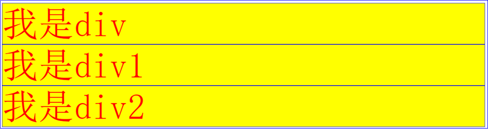

注意：可以发现，通过使用style标签的方式，当前页面如果要修改所有标签的样式的时候，那么只需要修改一处就行了。这样是比较方便的。

但是问题是：我们实际开发中有很多html页面。当项目中所有的html文件都需要使用这个页面中的样式的时候，这时，需要在每个html页面中拷贝一份相同的代码。而且，如果后期需要修改样式，需要每一个html文件都去修改。这样是非常麻烦的。

​	**方式二缺点：** 

​		**代码的复用性低，无法实现多个页面的复用。**

#### 1.3.3、 **方式三：在head标签中使用**link标签（外部）(掌握)

语法格式：

```html
<link rel="stylesheet" type="text/css" href="css文件路径" />
```

注意：

1）rel="stylesheet"表示调用的是一种样式。告诉浏览器这里将采用一个样式表文件。简单来说就是告诉浏览器将采用什么样式来对下面的内容进行处理。**rel="stylesheet" **不能省略。

2） href="css文件路径" 表示引入的外部css文件的路径。

需求：书写多个div，设置样式为: 字体为红色，字体大小为100px, 背景色为黄色，边框为 1px  实线 边框颜色为蓝色。

步骤一：首先创建一个css文件。选中css样式文件夹，鼠标右击   New--》Stylesheet。

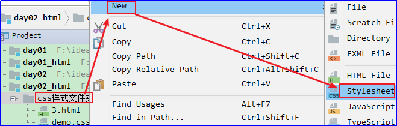

创建css文件,取名为demo.css

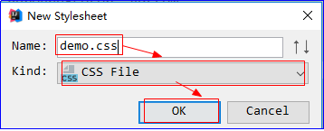

步骤二：然后将上面案例中的css样式拷贝到css文件中：

```css
说明：由于直接将样式放入到css文件中，所以这里不需要在css文件中书写：
<style type="text/css"></style>
```

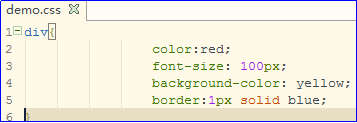

步骤三：在html文件中引入css文件的代码实现：

```html
<!DOCTYPE html>
<html>
	<head>
		<meta charset="UTF-8">
		<title>方式四：使用link从外部引入css文件</title>
		<link rel="stylesheet" type="text/css" href="demo.css"/>
	</head>
	<body>
		<!--
			需求：新建一个html页面，在这个页面中书写多个div，设置样式为: 字体为红色，
			字体大小为100px, 背景色为黄色，边框为 1px  实线 边框颜色为蓝色。
		-->
		<!--方式三：使用link从外部引入css文件-->
		<div>我是div</div>
		<div>我是div1</div>
		<div>我是div2</div>
	</body>
</html>
```

实现效果：

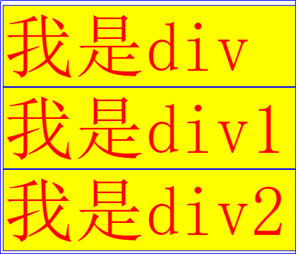

### 1.4、 **CSS选择器**(理解)

上面的案例里面我们使用标签名后面跟着css样式，那么我们就能实现对整个页面上所有对应的标签添加到相应的样式，如果说我想让这样的一个样式作用在我希望的指定的某一些标签之上（例如：指定到一个标签【不写在行内】，或者这一类标签中的某几个…），该如何操作呢，css样式前面应该写什么呢？所以接下来我们要学习的就是css选择器，也就是让我们的css样式选择作用在哪一些具体的标签之上。

#### 1.4.1、 **标签名选择器**

作用在当前页面的所有该名称标签上的。例如上述案例，样式作用在div标签上，那么直接书写div.

如：

```css
div{
				color:red;
				font-size: 100px;
				background-color: yellow;
				border:1px solid blue;
}
```

上述使用的就是标签名选择器。

语法格式：

```css
具体标签名称｛
css代码;
｝
```

代码示例：

```html
<!DOCTYPE HTML>
<html>

	<head>
		<title></title>
		<style type="text/css">
			div {
				color: red;
				font-size: 50px;
				border: 1px solid red;
			}
		</style>
	</head>

	<body>
		<!-- 
		标签名选择器：作用在当前页面的所有该名称标签上的。
		格式：
		标签名   {
			css代码；
		}	
		-->
		<div>我是div</div>
		<div>我是div</div>
		<div>我是div</div>
		<span>我是span,不受影响</span>
	</body>

</html>
```

效果：

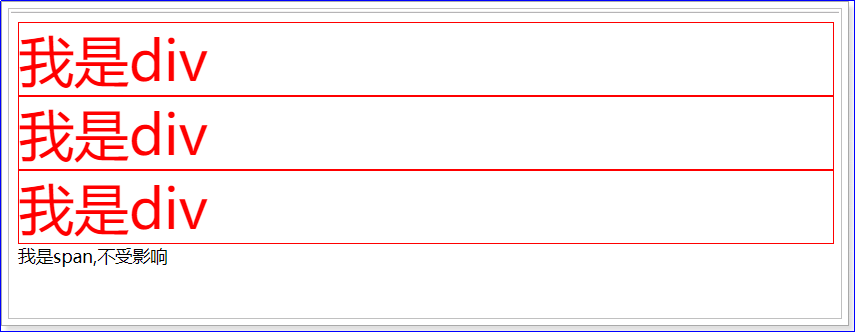

#### 1.4.2、 **ID选择器**

**作用于某一个特定的标签上。根据指定标签的id来设置css样式。**

**说明：一个页面中要求id的属性值唯一。不能重复。**

在css文件中定义ID选择器语法格式：

```css
#ID选择器的名称 ｛
css代码；
｝
```

使用：

```html
<标签名 id=” ID选择器的名称” />
```

需求： 页面上多个div，让第二个div：字体红色 字体大小50px，边框为1px，实线，红色

代码示例：

```html
<!DOCTYPE html>
<html>
	<head>
		<meta charset="UTF-8">
		<title>ID选择器</title>
		<style type="text/css">
			#myDiv{
				color:red;
				font-size: 50px;
				border:1px solid  red;
			}
		</style>
		
	</head>
	<body>
		<!--
			需求： 页面上多个div，让第二个div：字体红色 字体大小50px，边框为1px，实线，红色
			ID选择器：作用在页面上的某一个标签上。
			格式：
			#id选择器名称{
				css代码;
			}
		-->
	</body>
	<div>
		我是div
	</div>
	<div id="myDiv">
		我是div1
	</div>
	<div>
		我是div2
	</div>
</html>
```

实现效果：

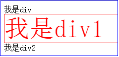

**注意：页面的id值不允许重复。作为一个合格的开发者，只要看到id，第一反应都应该是id的值不能重复。如果一个页面中含有多个div的id属性值一样的情况，并且以该属性值作为选择器名，那么多个div都会改变样式。**

#### 1.4.3、 **class选择器**

作用在一组标签之上。

说明：ID选择器只能作用单个标签。而class选择器可以作用在单个或者多个标签上。

语法格式：

```css
.class选择器的名称 ｛
css代码；
｝
```

使用：

```html
<标签名 class=”class选择器的名称” />
```

需求：页面上有多个div，让第二和第三个div以同样的样式去显示： 字体颜色红色，50px字体大小，边框1px  实线  红色。

代码实现：

```html
<!DOCTYPE html>
<html>
	<head>
		<meta charset="UTF-8">
		<title></title>
		<style type="text/css">
			.mydiv {
				color: red;
				font-size: 50px;
				border: 1px solid red;
			}
		</style>
	</head>
	<body>
		<!-- 
			让第二和第三个div以同样的样式去显示
			class选择器：作用在一组标签之上。
			.class属性值  {
				css代码；
			}
		 -->
		<div>我是div1</div>
		<div class="mydiv">我是div2</div>
		<div class="mydiv">我是div3</div>
		<span>我是span</span>
	</body>
</html>
```

效果：

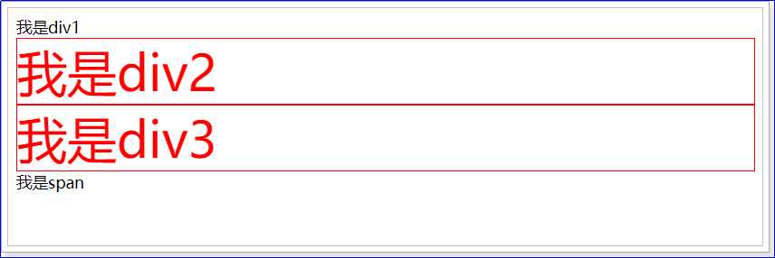

#### **1.4.4、** **组合选择器**

应用场景：如果页面不同的选择器想使用相同的css样式。

语法格式：

```css
选择器1, 选择器2... {
    css代码
}
```

例如：

```css
#div,p {
      color:red;
}
```

说明：上述表示id是div的选择器和标签名是p的选择器组合在一起。

需求：让页面所有的div和span都以同样的样式去显示：字体颜色黄色，50px字体大小，边框1px 实线  红色 。

分析：

这里要求是将所有的div和span都改变样式，其实我们使用class选择器可以实现，但是弊端必须给标签都添加class属性，比较麻烦，所以这里可以使用组合选择器来实现。

代码实现：

```html
<!DOCTYPE html>
<html>
	<head>
		<meta charset="UTF-8">
		<title></title>
		<style type="text/css">
			div,span{
				color:yellow;
				font-size: 50px;
				border:1px solid red;
			}
		</style>
	</head>
	<body>
		<!--需求：
		让页面所有的div和span都以同样的样式去显示：字体颜色黄色，50px字体大小，边框1px 实线  红色 。
		分析：
		这里要求是将所有的div和span都改变样式，其实我们使用class选择器可以实现，但是弊端必须给
		标签都添加class属性，比较麻烦，所以这里可以使用组合选择器来实现
		-->
		<div>我是div1</div>
		<div>我是div2</div>
		<span>我是span1</span>
		<span>我是span2</span>
	</body>
</html>
```

注意：组合选择器可以使用任意的选择器来组合，个数可以任意个。

效果：

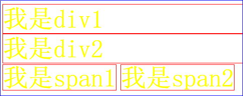

#### 1.4.5、 **关联选择器**

准备代码： 

```html
   <div id="a">
    		<span>我是span1</span>
    		<span>我是span2</span>
    	</div>
    	<span>我是span3</span>
    	<span>我是span4</span>
    	<div>
    		<span>我是span5</span>
    		<span>我是span6</span>
   </div>
```

需求：让id为a的标签下的所有的span以同样的样式去显示：  字体颜色黄色，50px字体大小，边框1px 实线  红色

分析：其实这能通过我们之前学习的class选择器解决，但是这里提供另一种方式，也就是我们这里的关联选择器。可以通过id为a的标签找到下面的所有的span标签，也就是说，关联选择器更加强调的是通过父亲查找孩子。看下面的语法格式和代码演示。

语法格式：

```css
父标签的选择器 后代标签选择器｛
    css代码；
｝
```

代码演示：

```html
<!DOCTYPE html>
<html>
	<head>
		<meta charset="UTF-8">
		<title></title>
		<style type="text/css">
			#a span {
				color: yellow;
				font-size: 50px;
				border: 1px solid red;
			}
		</style>
	</head>
	<body>
		<!--
        	让id为a的标签下的所有的span以同样的样式去显示   字体颜色黄色，50px字体大小，边框1px 实线  红色
        	关联选择器：父子关系
        	格式 
        		父选择器  子选择器  {
        			css代码
        		}
        -->
         <div id="a">
    		<span>我是span1</span>
    		<span>我是span2</span>
    	</div>
    	<span>我是span3</span>
    	<span>我是span4</span>
    	<div>
    		<span>我是span5</span>
    		<span>我是span6</span>
      	</div>
	</body>
</html>
```

实现效果：

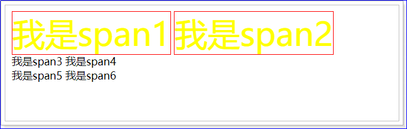

#### **1.4.6、** **属性选择器** **(**了解)

属性选择器是在原有选择器的基础上，通过**标签的属性**，再次对标签进行筛选。

语法格式：

```css
选择器名[属性名="属性值"] {
css样式；
}
```

说明：这里的选择器名一般都是标签名选择器。

需求：给页面所有input标签的type属性为text的标签加上一个边框：边框宽度2px, 实线, 蓝色框。

代码示例：

```html
<!DOCTYPE html>
<html>
	<head>
		<meta charset="UTF-8">
		<title></title>
		<style type="text/css">
			input[type="text"] {
				border: 2px solid blue;
			}
		</style>
	</head>
	<body>
		<!--
        	给页面所有input标签的type属性为text的标签加上一个边框：边框宽度2px, 实线, 蓝色框
        	属性选择器   :通过标签的属性再来对标签进行过滤。
        	格式：
        		选择器名[属性名='属性值'] {
        			css代码；
        		}
        -->
		文本框：<input type="text" /><br />
		密码框：<input type="password" /><br />
		文本框：<input id="txt" type="text" /><br />
		密码框：<input type="password" /><br />
	</body>
</html>
```

实现效果：

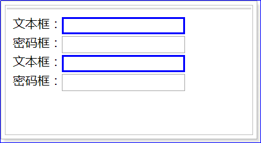


### 1.5、 **C**SS常用的样式

#### 1.5.1、 **边框和尺寸：border、width、height**

1、border ：设置边框的样式。

​	1） 格式：

border：边框宽度(border-width) 边框样式 边框颜色。

​	2）例如：style=”border:1px solid #f00” -----》表示1像素实边红色。

​		a:边框样式取值：solid 实线，none 无边，dashed虚线 等。

2、width、height：用于设置标签的宽度、高度。

格式：

width:标签具体的宽度。

height:标签具体的高度。

需求：给页面某个div设置：宽度200像素，高度200像素，1像素实线黑色的框。

代码示例：

```html
<!DOCTYPE html>
<html>
	<head>
		<meta charset="UTF-8">
		<title></title>
		<style type="text/css">
			div{
				border: 1px solid black;
				/*border: 1px dashed black;*//*dashed表示虚线*/
				width: 200px;
				height: 200px;
			}
		</style>
	</head>
	<body>
		<!--需求：给页面某个div设置：宽度200像素，高度200像素，1像素实线黑色的框。-->
		<!--<div style="width:200px;height:200px;border:1px solid black;">我是div</div>-->
		<div>我是div</div>
	</body>
</html>
```

实现效果：

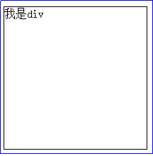

注意：在html中只有块级标签(div、p、ul等)才有高度和宽度，其他标签没有的。

#### 1.5.2、 **转换：display**(掌握)

HTML提供丰富的标签，这些标签被定义成了不同的类型，一般分为：块标签和行内标签。

1、块标签：以区域块方式出现。每个块标签独自占据一整行或多整行。

​	1）常见的块元素：<h1>、<div>、<ul>等

​	2）默认可以设置高度和宽度

2、行内元素：不必在新的一行开始，同时也不强迫其他元素在新的一行显示。

​	1）常见的行内元素：<span>、<a> 等

​	2）设置高度和宽度无效

在开发中，如果希望行内元素具有块元素的特性，或者希望块元素具有行内元素的特性。也就是希望行内元素和块元素之间相互转换。需要使用display属性将**行内元素转换成块级元素** 或者将块级元素转换为行内元素。

语法结构：

```css
选择器 {display : 属性值 }
常用的属性值：
		inline：此元素将显示为行内元素（行内元素默认的display属性值）
		block：此元素将显为块元素（块元素默认的display属性值）
		none：此元素将被隐藏，不显示，也不占用页面空间。
```

需求：定义几个行内元素span，其中将一部分转换为块级标签，进行对比。 

 代码示例：

```html
<!DOCTYPE html>
<html>
	<head>
		<meta charset="UTF-8">
		<title>转换标签</title>
		<style type="text/css">
			span,p{
				/*display: block;*/
				border:1px solid red;
				width: 100px;
				height: 100px;
			}
		</style>
	</head>
	<body>
		<!--需求：定义几个行内元素span，其中将一部分转换为块级标签，进行对比。--> 
		<!--默认显示一行，给普通的行内标签添加高和宽没有起到作用-->
		<span>普通span标签1</span>
		<span>普通span标签2</span>
		<!--每一行显示，高宽有作用了-->
		<span style="display: block;">转换后的span标签1</span>
		<span style="display: block;">转换后的span标签2</span>
		<!--<span style="display: none;">此元素将被隐藏，不显示，也不占用页面空间。</span>-->
		<!--将一个块级标签变为行内标签-->
		<!--<p style="display: inline;">段落1</p>
		<p style="display: inline;">段落2</p>-->
	</body>
</html>
```

实现效果：

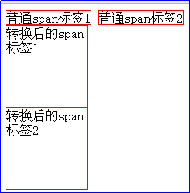

#### 1.5.3、 **字体：color、line**-height

语法格式：

```css
color：     颜色    字体颜色   
line-height:  行高    设置行高
```

需求：书写两个div标签，然后在div标签中写两个span标签。在span标签中演示字体颜色和行高。

分别给2个div设置style样式：height: 50px; width: 200px; border: 1px solid #000;

代码示例：

```html
<!DOCTYPE html>
<html>
	<head>
		<meta charset="UTF-8">
		<title></title>
	</head>
	<body>
		<div style="height: 50px; width: 200px; border: 1px solid #000;">
			<span>多年后</span>
			<span>重相逢</span>
		</div>
		
		<div style="height: 50px; width: 200px; border: 1px solid #000;">
			<span style="line-height: 50px;">我变瘦</span>
			<span style="color:red;">你变受</span>
		</div>
	</body>
</html>
```

**注意： 给元素设置行高一般设置为当前父容器的高度以便于让当前的元素在父元素中纵向居中显示。**

**举例：上述第二个div作为父标签的高度是50px,而他的子标签span的行高也设置为50px,这样可以保证当前span元素居中显示。**

效果：

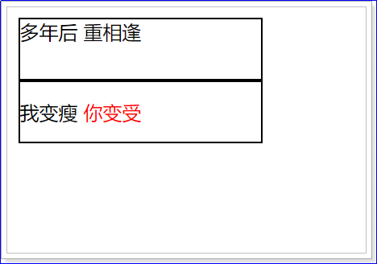

#### 1.5.4、 **背景：**background-color，background-image

语法格式：

```css
background-color： 颜色;  设置元素的背景颜色
background-image : url(图片的路径地址); 
background-repeat: 背景平铺方式; 
背景平铺方式取值：
no-repeat： 不平铺
repeat-x ： 横向平铺
repeat-y ： 纵向平铺
注意：图片默认是平铺满整个盒子的
```

需求：给body设置浅灰色(#eee)的背景色。在body中定义1个div标签，给div标签添加宽度、高度、设置背景颜色为白色(#fff)并加边框，最后设置背景图片，演示背景平铺方式。

代码示例：

```html
<!DOCTYPE html>
<html>

	<head>
		<meta charset="UTF-8">
		<title></title>
		<style type="text/css">
			/*给body设置浅灰色的背景色*/
			body{
				background-color: #eee;
			}
			div{
				width: 800px;/*宽度*/
				height: 800px;/*高度*/
				background-color: #fff;/*设置背景颜色为白色*/
				border: 1px solid red;/*边框*/
				background-image: url(img/lyf.png);/*背景图片*/
			}
		</style>
	</head>

	<body>
		<!--需求：给body设置浅灰色的背景色。在body中定义几个div标签，
		给div标签添加宽度、高度、设置背景颜色为白色并加边框，最后设置背景图片，演示背景平铺方式。
		-->
		<div></div><!--默认平铺满整个div盒子的-->
		<div style="background-repeat: no-repeat;"></div><!--不平铺-->
		<div style="background-repeat: repeat-x;"></div><!--横向平铺-->
		<div style="background-repeat: repeat-y;"></div><!--纵向平铺-->
	</body>
</html>
```

实现效果：

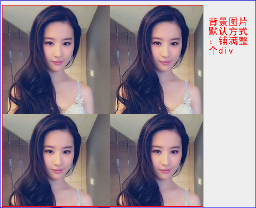

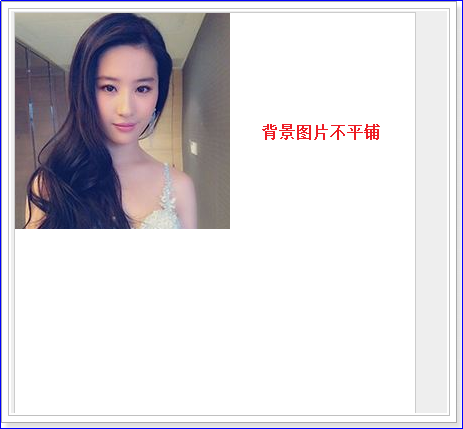

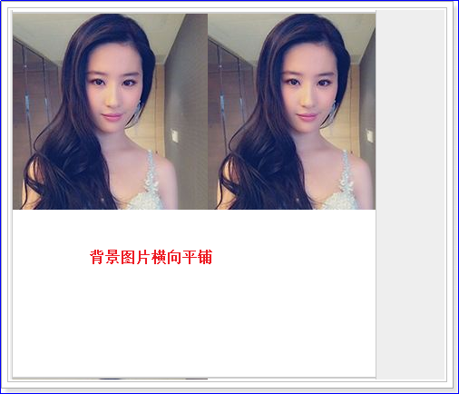

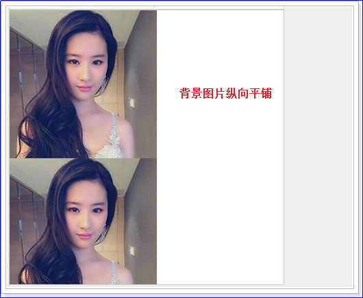

### 1.6、 **边框(盒模型)** **(了解)**

#### 1.6.1、 **什么是盒模型**

我们可以把每一个标签都看成是一个盒子，每个盒子都由元素的内容、内边距（padding）、边框（border）和外边距（margin）组成。而盒子模型的组成跟我们生活中也是一样的：例如在淘宝上买东西，我们的商品和快递盒子之间可能是有距离的。而快递盒子之间也可能存是有距离的。

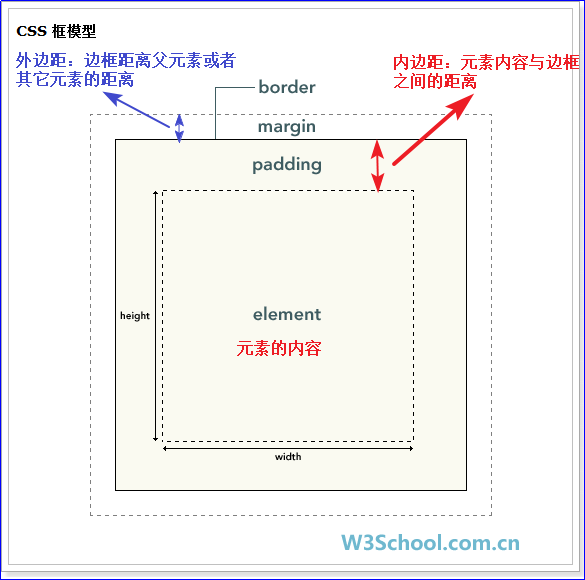

说明：

1）元素的内容相当于快递盒子中的东西。内边距padding相当于盒子和东西之间的空隙。边框border相当于盒子的边框。外边距margin相当于当前盒子和其他快递盒子之间的距离。

2）能够影响当前某一个盒子的大小主要是：元素的内容、内边距padding、边框border。而外边距margin不会影响当前盒子的大小。

#### 1.6.2、 **内边距**

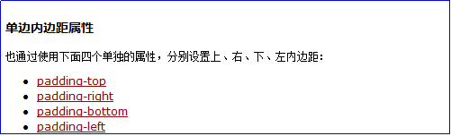

使用css给上述四个属性赋值，可以按照顺时针理解进行赋值。

给盒子的内边距的属性赋值如下所示：

例如：如果我们希望所有h1元素的各边都有10像素的内边距，只需要按照如下做：

h1  {padding: 10px;}

我们还可以按照上、右、下、左的顺序分别设置各边的内边距：

h1  {padding: 10px  0.25px 2px 0.25px;}

 

问题：有时候想设置h1上下的内边距为10px，左右不想设置，那怎么实现呢 ？

```css
方式一： h1 { 10px 0 10px 0 }
方式二： h1 { 10px 0 }  
第一个值表示上下，第二个值表示左右
```

#### 1.6.3、 **外边距**

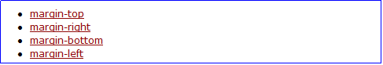

使用方法同内边距一致！

#### 1.6.4、 **案例：演示盒子模型**

1、 先创建一个div，它的内部也创建一个div，两个div同时设置边框 宽度1像素 实线 黑框

2、 外层div高度宽度各500像素，内部div高度，宽度各280像素，背景色为红色

3、 设置内部div的外边距100px，内边距为10px 

代码实现：

```html
<!DOCTYPE html>
<html>
	<head>
		<meta charset="UTF-8">
		<title></title>
		<style type="text/css">
			div{
				border:1px solid black;
			}
			#outerDiv{
				width: 500px;
				height: 500px;
			}
			#innerDiv{
				width: 280px;
				height: 280px;
				background-color: red;
				/*外边距*/
				margin: 100px;
				/*内边距*/
				padding: 10px;
			}
		</style>
	</head>
	<body>
		<!--
			1、先创建一个div，它的内部也创建一个div，两个div同时设置边框 宽度1像素 实线 黑框
			2、外层div高度宽度各500像素，内部div高度，宽度各280像素，背景色为红色
			3、设置内部div的外边距100px，内边距为10px 
		-->
		<div id="outerDiv">
			<div id="innerDiv">
				
			</div>
		</div>
	</body>
</html>
```

实现效果：

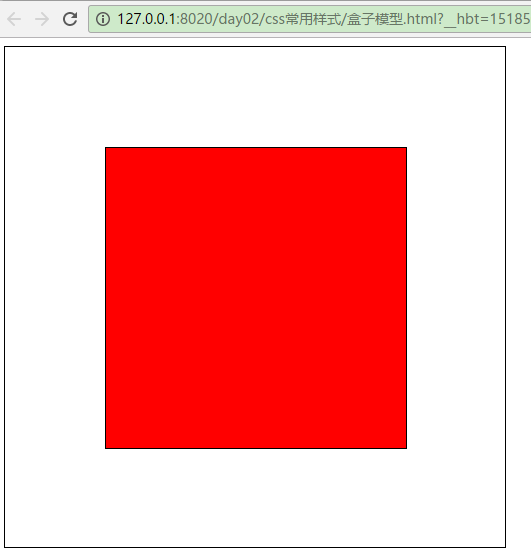

说明：

上述含有两个div，一个标签看作一个盒子。所以上述可以看作两个盒子模型。通过谷歌浏览器可以查看盒子模型。

在谷歌浏览器中按f12即可查看盒子模型。

内部div的盒子模型如下图所示：

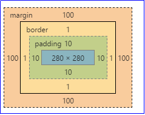

#### 1.6.5、 **总结：面试可能会被问到** 

1、 盒子模型有哪些部分组成

元素的内容(高度、宽度)、内边距（padding）、边框（border）和外边距（margin）组成 。

2、 盒子模型大小受哪些部分影响

盒子模型的大小受元素的内容(高度、宽度)、内边距（padding）、边框（border）的影响，不受外边距的影响

 3、外边距影响在页面中的位置

### 1.7、 **使用CSS美化注册页面的**案例实现

#### 1.7.1、案例效果

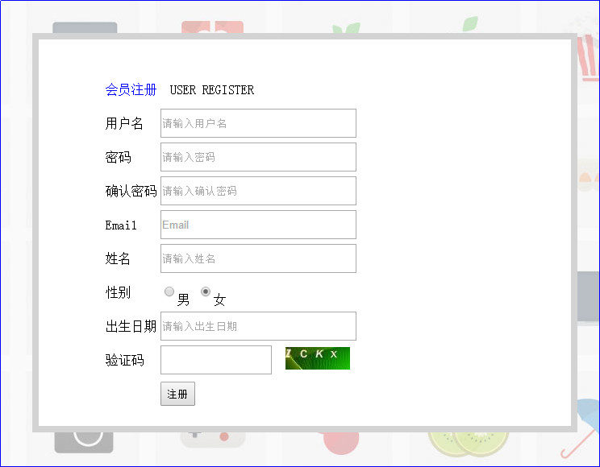

#### 1.7.2、 **案例步骤**

1. 将之前写好的注册页面代码放到新建的html页面中;

2. 使用CSS样式给整个页面即body标签添加背景图片：background-image: url(img/bg.jpg);

3. 我们不需要对整个form表单操作，我们将整个form表单放到一个div中，然后对div进行操作;

4. 开始设置div，宽度：500px,高度：400px,边框border:8px 实体 灰色(lightgray),背景颜色：white,

   让div居中，设置外边距即可：**margin: 50px auto;**

   ​	**说明：50px 表示div的盒子上下是50px,以上优先。auto表示div的盒子左右自动适应**

   发现div中的内容仍然在左上角，可以设置内边距改变其位置。给div设置内边距：padding: 40px 80px;

5. div中的每一行间距很近，所以设置tr行的高度为40px

6. 设置输入框的高度:30px

#### 1.7.3、 **案例代码**

代码实现：

```html
<!DOCTYPE html>
<html>

	<head>
		<meta charset="UTF-8">
		<title></title>
		<style type="text/css">
			/*给整个页面添加背景图片*/
			body{
				background-image: url(img/bg.jpg);
			}
			/*设置div*/
			div
			{
				/*div的宽度*/
				width: 500px;
				/*div的高度*/
				height:400px;
				/*div的边框*/
				border: 8px solid lightgray;/*lightgray表示灰色*/
				/*div的背景颜色*/
				background-color: white;
				/*让div居中，设置外边距即可*/
				margin: 50px auto;/*50px 表示div的盒子上下是50px,以上优先。auto表示div的盒子左右自动适应*/
				/*设置内边距*/
				padding: 40px 80px;
			}
			/*设置行高*/
			tr{
				height: 40px;
			}
			/*设置输入框的高度*/
			input{
				height: 30px;
			}
		</style>
	</head>

	<body>
		<div>
			<!--书写form表单-->
			<form action="#" method="post">
				<!--书写table表格，通过分析需要书写10行3列-->
				<table>
					<!--标题 一行,跨3列-->
					<tr>
						<td colspan="3">
							<font color="blue">会员注册</font>&nbsp;USER REGISTER
						</td>
					</tr>
					<!--用户名-->
					<tr>
						<td>用户名</td>
						<td colspan="2">
							<input type="text" name="username" size="30" placeholder="请输入用户名" />
						</td>
					</tr>
					<tr>
						<td>密码</td>
						<td colspan="2">
							<input type="password" name="password" size="30" placeholder="请输入密码" />
						</td>
					</tr>
					<tr>
						<td>确认密码</td>
						<td colspan="2">
							<input type="password" name="repassword" size="30" placeholder="请输入确认密码" />
						</td>
					</tr>
					<tr>
						<td>Email</td>
						<td colspan="2">
							<input type="text" name="email" size="30" placeholder="Email" />
						</td>
					</tr>
					<tr>
						<td>姓名</td>
						<td colspan="2">
							<input type="text" name="realname" size="30" placeholder="请输入姓名" />
						</td>
					</tr>
					<tr>
						<td>性别</td>
						<td colspan="2">
							<input type="radio" name="sex" />男
							<input type="radio" name="sex" checked="checked" />女
						</td>
					</tr>
					<tr>
						<td>出生日期</td>
						<td colspan="2">
							<input type="text" name="birthday" size="30" placeholder="请输入出生日期" />
						</td>
					</tr>
					<tr>
						<td>验证码</td>
						<td>
							<input type="text" name="checkCode" size="15" />
						</td>
						<td>
							
						</td>
					</tr>
					<tr>
						<td></td>
						<td>
							<!---->
							<input type="submit" value="注册" />
						</td>
						<td></td>
					</tr>
				</table>
			</form>
		</div>
	</body>
</html>
```

实现效果：


## 2、 **总结**

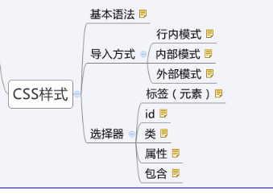


~~~html
第1章、CSS
	1、CSS作用：美化HTML页面（给html标签添加样式）;
	2、CSS选择器：
		【1】基本选择器：
				id选择器：    #id值{样式}   选中页面唯一标签
				class选择器： .class属性值{ 样式 }
				元素选择器：  div{  }
				通用（选择所有）： *{  }
 				
		【2】扩展选择器：
				层级选择器：  div span{}
				属性过滤：    input[type='text']{}
		【3】其他：
				并集（组合）：  div,span{}
				交集（同时满足）：  div#myDiv{}
				伪类（操作状态）：
						a:link{}  默认状态
						a:active{} 正在被点击
						a:visited{} 已经被点击过一次
						a:hover{}   鼠标悬浮在元素上面
					
	 3、常用样式：
			【1】文本样式：
					color:yellow
					text-align:center
					text-indent: 2em
					text-decoration: none,underline
			【2】文字样式：
					font-size:100px
					font-family:楷体
					font-style:italic
					font-weight:bold
			【3】背景：
					background-color:red
					background-image:url("../img/1.jpg")
					background-repeat: no-repeat  
			【4】边框：
					border: 1px solid red;
					border-radius: 5px
			 【5】盒子模型：
					盒子模型内容：
						边框：border（4个边）
					     内容：
						内边距：padding(4个)
						外边距：margin(4个)
				   设置块元素水平居中： margin:auto;

~~~


