# 1.**C**SS概述（了解）

css:层叠样式表。(Cascading Style Sheets).

层叠:叠加一起。

样式表：就是作用在同一个html标签的多个样式效果。

举例：table:边框 背景颜色 高度 宽度等。

作用：使用各种样式美化html编写的网页的。

小结：css是用来美化html书写的网页的。

# 2.在html如何引入css(理解)

引入有三种方式：

1.在html标签内部引入

2.在head标签中使用一个标签:style引入

**3.在head标签中使用link标签引入外部的css文件**

## 1.在html标签内部引入

格式：

~~~html
<标签名 style="样式名:样式值;样式名:样式值;...."></标签名>
~~~

~~~html
<!DOCTYPE html>
<html lang="en">
<head>
    <meta charset="UTF-8">
    <title>Title</title>
</head>
<body>
    <!--需求：书写div，要求设置：字体为黄色，字体大小100px， 边框为 1px  实线 边框颜色为红色。-->
    <!--
        1.style属性值都是书写的是css
        2.在css找那个color表示字体颜色
        3.font-size：表示字体大小
        4.border-width 边框宽度
        5.border-style：边框样式，solid 表示实体
        6.border-color：边框颜色

        注意：
        1.针对边框宽度 样式 颜色，上述我们都是分别写出的样式值。其实在css中如果针对同一个样式名，我们可以使用复合样式来完成。
        例如：边框：
        border: 样式值 样式值 样式值 。。。。
        2.对于边框样式border-style必须书写，否则边框没有css样式效果
    -->
    
div1

    
div2

</body>
</html>
~~~

小结：

1.在html中引入css方式一：

~~~html
<标签名 style="样式名:样式值;样式名:样式值;...."></标签名>
~~~

2.样式：

~~~css
 		2.在css找那个color表示字体颜色
        3.font-size：表示字体大小
        4.border-width 边框宽度
        5.border-style：边框样式，solid 表示实体
        6.border-color：边框颜色
~~~

3.

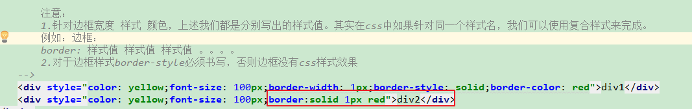

## 2.在head标签中使用一个标签:style引入

格式：

~~~html

~~~

~~~html
<!DOCTYPE html>
<html lang="en">
<head>
    <meta charset="UTF-8">
    <title>Title</title>
    
</head>
<body>
    <!--需求：新建一个html页面，在这个页面中书写多个div，设置样式为: 字体为红色，
    字体大小为100px, 背景色为黄色，边框为 1px  实线 边框颜色为蓝色。-->
    
div1

    
div2

    
div3

</body>
</html>
~~~

小结：

1.在html中引入css方式二：

~~~html
<head>
    
    
</head>
~~~

2.方式二好处：1）减少代码重复性 2）提高阅读性差的问题 3）解耦合(降低html和 css依赖关系)

## 3.**在head标签中使用link标签引入外部的css文件** （重点）

格式：

~~~html
<link type="text/css" href="外部css文件的路径" rel="stylesheet"/>
说明：
1.type="text/css"可以写可以不写
2.href="外部css文件的路径" 必须写
3.rel="stylesheet" 表示引入的是层叠样式表即css，必须写
~~~

步骤：

1.创建外部css文件

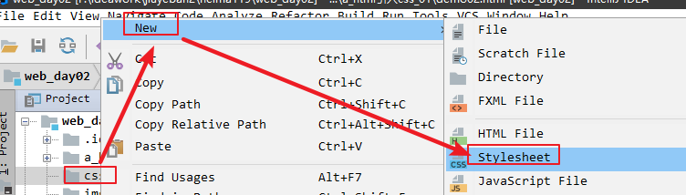

2.在css文件中书写css样式

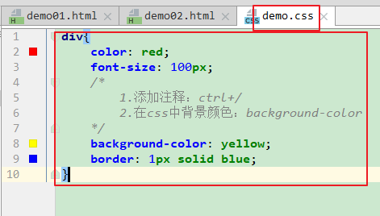

3.在html页面中引入外部的css文件

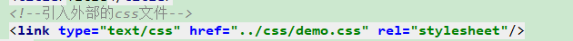

4.书写html标签

~~~html
<!DOCTYPE html>
<html lang="en">
<head>
    <meta charset="UTF-8">
    <title>Title</title>
    <!--引入外部的css文件-->
    <link type="text/css" href="../css/demo.css" rel="stylesheet"/>
</head>
<body>
    <!--需求：新建一个html页面，在这个页面中书写多个div，设置样式为: 字体为红色，
    字体大小为100px, 背景色为黄色，边框为 1px  实线 边框颜色为蓝色。-->
    
div1

    
div2

    
div3

</body>
</html>
~~~

小结：

1.在html页面中引入外部的css文件格式：

~~~html
<link type="text/css" href="外部css文件的路径" rel="stylesheet"/>
~~~

2.创建外部css文件：在创建目录上右键---new---stylesheet

3.方式三好处：1.解耦合  2.减少代码重复性

# 3. **CSS选择器**(理解)

## 1.概念：

选择器就是在css中通过选择器来选择css要作用的html标签。

## 2.常见选择器

### 2.1标签名选择器 掌握

~~~css
标签名{
    样式名:样式值;
    样式名:样式值;
    样式名:样式值;
    ....
}
~~~

~~~css
div{
    color: red;
    font-size: 100px;
    /*
        1.添加注释：ctrl+/
        2.在css中背景颜色：background-color
    */
    background-color: yellow;
    border: 1px solid blue;
}
~~~

### 2.2.ID选择器 掌握

格式：

~~~css
#id属性值{
    样式名:样式值;
    样式名:样式值;
    样式名:样式值;
    ....
}
~~~

特点：只作用在某一个标签上。

~~~html
<!DOCTYPE html>
<html lang="en">
<head>
    <meta charset="UTF-8">
    <title>Title</title>
    
</head>
<body>
<!--需求：作用在第二个div上样式为: 字体为红色，
字体大小为100px, 背景色为黄色，边框为 1px  实线 边框颜色为蓝色。-->

div1

div2

div3

</body>
</html>
~~~

小结：

1.id选择器格式：

~~~html
#id属性值{}
~~~

2.什么时候使用id选择器：作用某一个标签

### 2.3class类选择器 掌握

格式：

~~~css
.class属性值{
    .....
}
~~~

~~~html
<!DOCTYPE html>
<html lang="en">
<head>
    <meta charset="UTF-8">
    <title>Title</title>
    
</head>
<body>
<!--需求：作用在第二个和第三个div上样式为: 字体为红色，
字体大小为100px, 背景色为黄色，边框为 1px  实线 边框颜色为蓝色。-->

div1

div2

div3

</body>
</html>
~~~

小结：

1.class选择器：

~~~css
.class属性值{
    
    ....
}
~~~

2.何时使用class类选择器：一般建议大于一个标签，并不是所有标签

### 2.4 **组合选择器**

~~~css
选择器1, 选择器2... {
    css代码
}
~~~

~~~html
<!DOCTYPE html>
<html lang="en">
<head>
    <meta charset="UTF-8">
    <title>Title</title>
    
</head>
<body>
    <!--需求：让页面所有的div和span都以同样的样式去显示：字体颜色黄色，50px字体大小，边框1px 实线  红色 。-->
    
柳岩

    
杨幂

    冰冰
    蓉蓉
</body>
</html>
~~~

### 2.5 **关联选择器**

~~~html
<!DOCTYPE html>
<html lang="en">
<head>
    <meta charset="UTF-8">
    <title>Title</title>
    
</head>
<body>
    <!--需求：让id为a的标签下的所有的span以同样的样式去显示：  字体颜色黄色，50px字体大小，边框1px 实线  红色-->
    

        我是span1
        我是span2
    

    我是span3
    我是span4
    

        我是span5
        我是span6
    

</body>
</html>
~~~

小结：

1.组合选择器：任意选择器

~~~css
选择器1,选择器2,...{
    
}
~~~

2.关联选择器：包含关系。

~~~css
外部标签选择器 内部标签选择器...{
    
}
~~~

### 2.6 **属性选择器** **(**了解)

~~~css
选择器名[属性名="属性值"] {
	css样式；
}
~~~

~~~html
<!DOCTYPE html>
<html lang="en">
<head>
    <meta charset="UTF-8">
    <title>Title</title>
    
</head>
<body>
    <!--需求：给页面所有input标签的type属性为text的标签加上一个边框：边框宽度2px, 实线, 蓝色框。-->
    <input type="text"/> 
    <input type="password"/> 
    <input type="text"/> 
    <input type="password"/> 
</body>
</html>
~~~

# 4.补充:

## 1.div和span

属于html中的标签。

【1】div

**div属于块级标签，单独占一行**，单独使用没有任何意义。必须借助于css样式一起使用。主要用来页面的布局的。

~~~html

    <form>
        
    </form>

~~~

【2】span

**span属于行内标签。共处一行**。单独存在没有意义，需要借助于css样式一起使用。取代了font标签。

span一般用来设置字体样式。

## 2.配置模板

1.

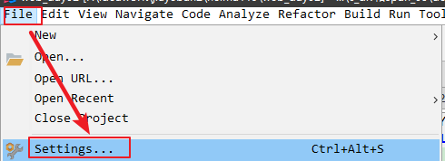

2.

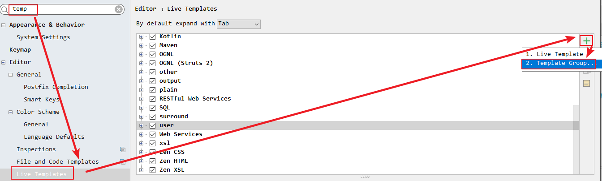

3.

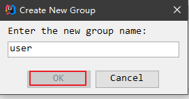

 4.

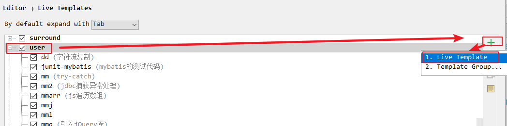

5.

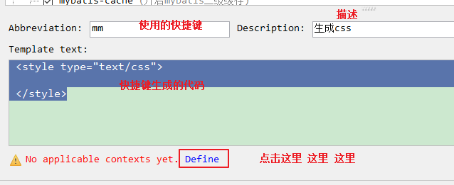

6.

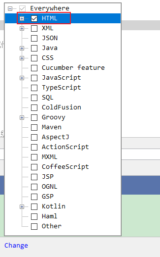

7.

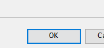

## 3.配置alt+/

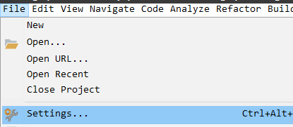

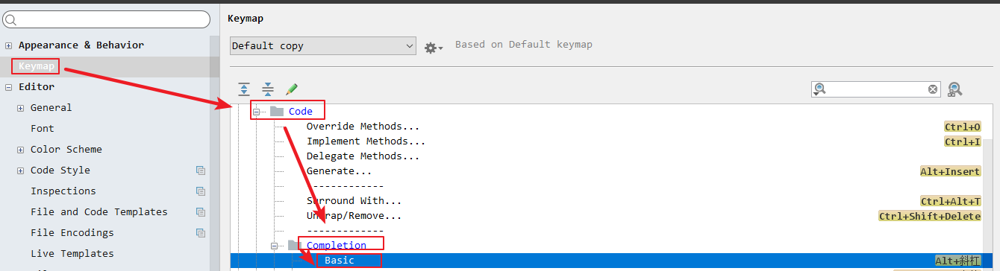

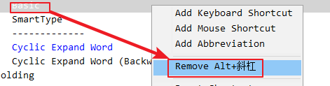

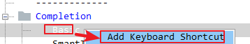

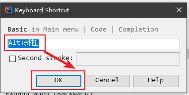

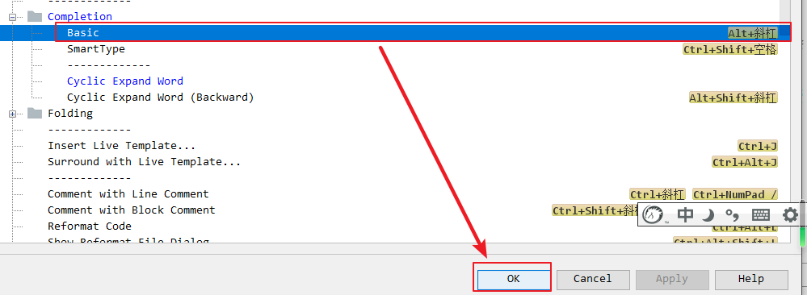

# 5.**C**SS常用的样式(理解)

## 1.标签的高度、宽度以及标签的边框样式

~~~html
<!DOCTYPE html>
<html lang="en">
<head>
    <meta charset="UTF-8">
    <title>Title</title>
    
</head>
<body>
    <!--需求：给页面某个div设置：宽度200像素，高度200像素，1像素实线黑色的框。-->
    <!--
        注意：css样式的高度和宽度只使用于块级标签，不适用行内标签
    -->
    
div1

    span1
</body>
</html>
~~~

小结：

1.在css中，标签的宽度：width,标签的高度：height

2.边框使用border,边框样式：solid 实线  dashed 虚线 none表示默认的，无边框

**3.css样式的高度和宽度只使用于块级标签，不适用行内标签**

## 2. **转换：display**(掌握)

css样式的高度和宽度只使用于块级标签，不适用行内标签。那么我们可以使用css中的样式display将行内标签转换为块级标签，这样，行内标签就可以使用高度和宽度了。

display作用：

1.将行内标签转换为块级标签：

~~~html
span2
~~~

2.将块级标签转换行内标签，高度和宽度就不适用于块级标签

~~~html
 
div1

~~~

**3.使用display样式可以让某个标签隐藏**

~~~html
<!--
        display: none :隐藏某个标签
    -->
    
div2

~~~

代码演示：

~~~html
<!DOCTYPE html>
<html lang="en">
<head>
    <meta charset="UTF-8">
    <title>Title</title>
    
</head>
<body>
    <!--需求：定义几个行内元素span，其中将一部分转换为块级标签，进行对比。-->
    <!--
        display: inline  : 给display样式设置为样式值是inline表示行内标签
    -->
    
div1

    <!--
        display: none :隐藏某个标签
    -->
    
div2

    span1
    <!--
        display: block :给display样式设置为样式值是block表示块级标签
    -->
    span2
</body>
</html>
~~~

小结：

1.display样式具有三个值：

~~~css
1)block:块级标签
2）inline:行内标签
3）none:隐藏某个标签
~~~

## 3.**字体：color、line**-height

color表示字体颜色。

line-height表示行高，一般使用行高在标签中使用，设置的高度和父标签的高度一致，这样可以达到子标签内容居中显示。

~~~html
<!DOCTYPE html>
<html lang="en">
<head>
    <meta charset="UTF-8">
    <title>Title</title>
</head>
<body>
<!--需求：书写两个div标签，然后在div标签中写两个span标签。在span标签中演示字体颜色和行高。

分别给2个div设置style样式：height: 50px; width: 200px; border: 1px solid #000;-->

    1
    2

    3
    4

</body>
</html>
~~~

## 4.**背景：**

【1】背景颜色：background-color

【2】背景图片：background-img

【3】背景图片的平铺方式：background-repeat

~~~html
<!DOCTYPE html>
<html lang="en">
<head>
    <meta charset="UTF-8">
    <title>Title</title>
    
</head>
<body>
<!--需求：给body设置浅灰色(#eee)的背景色。在body中定义1个div标签，-->
<!--给div标签添加宽度、高度、设置背景颜色为白色(#fff)并加边框，最后设置背景图片，演示背景平铺方式。-->

div1

</body>
</html>
~~~

# 6.**边框(盒模型)** **(了解)**

1.盒子模型组成部分：

元素  边框  内边距(元素和边框之间的距离)  外边距(当前盒子和其他盒子之间额距离)

2.四个要素能够影响盒子本身大小的是：

~~~
1）元素本身
2）内边距
3）边框
~~~

3.外边距影响的是当前盒子在页面中的位置

~~~html
<!DOCTYPE html>
<html lang="en">
<head>
    <meta charset="UTF-8">
    <title>Title</title>
    
</head>
<body>
    <!--1、 先创建一个div，它的内部也创建一个div，两个div同时设置边框 宽度1像素 实线 黑框

    2、 外层div高度宽度各500像素，内部div高度，宽度各280像素，背景色为红色

    3、 设置内部div的外边距100px，内边距为10px-->
    

        

        

    

</body>
</html>
~~~

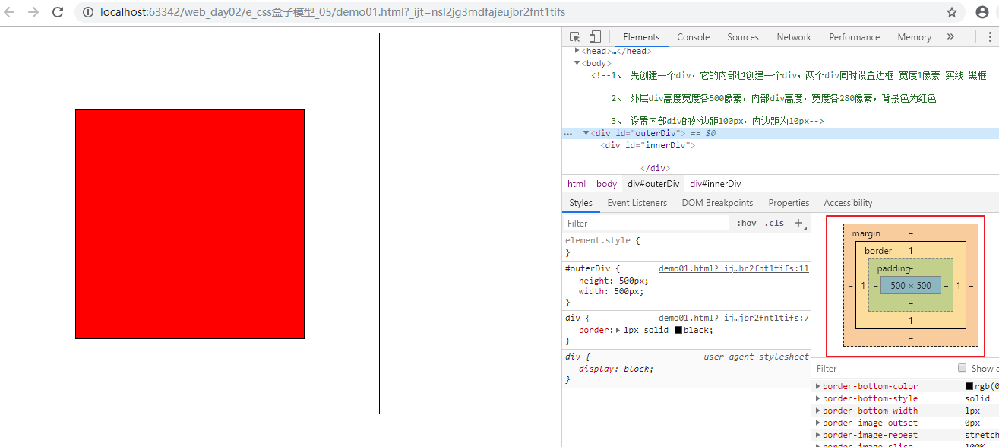

1.能够影响盒子本身大小的是：元素  边框 内边距

2.外边距影响盒子在页面的位置

# 7.使用css美化注册页面(课下完成)

~~~html
<!DOCTYPE html>
<html lang="en">
<head>
    <meta charset="UTF-8">
    <title>Title</title>
    
</head>
<body>

    <form action="#">
        <!--
            table表格：
            10行，3列
        -->
        <table>
            <tr>
                <!--标题   会员注册  一行,跨3列 ，使用td的属性colspan，设置为3，使用font标签设置字体颜色；-->
                <td colspan="3">
                    会员注册&nbsp;&nbsp;USER REGISTER
                </td>
                <!--<td></td>-->
                <!--<td></td>-->
            </tr>
            <tr>
                <!--用户名，文本框即输入内容的列跨2列，使用td的属性colspan，设置为2。
                使用input标签的属性placeholder来设置input标签的默认名字，文本框大小是30；-->
                <td>用户名</td>
                <td colspan="2">
                    <input type="text" name="username" placeholder="请输入用户名" size="30px">
                </td>
                <!--<td></td>-->
            </tr>
            <tr>
                <!--密码、确认密码、Email和姓名都是第三步一样；-->
                <td>密码</td>
                <td colspan="2">
                    <input type="password" name="password" placeholder="请输入密码" size="30px">
                </td>
                <!--<td></td>-->
            </tr>
            <tr>
                <!--密码、确认密码、Email和姓名都是第三步一样；-->
                <td>确认密码</td>
                <td colspan="2">
                    <input type="password" name="repassword" placeholder="请输入确认密码" size="30px">
                </td>
                <!--<td></td>-->
            </tr>
            <tr>
                <!--密码、确认密码、Email和姓名都是第三步一样；-->
                <td>Email</td>
                <td colspan="2">
                    <input type="text" name="email" placeholder="Email" size="30px">
                </td>
                <!--<td></td>-->
            </tr>
            <tr>
                <!--密码、确认密码、Email和姓名都是第三步一样；-->
                <td>姓名</td>
                <td colspan="2">
                    <input type="text" name="realname" placeholder="请输入姓名" size="30px">
                </td>
                <!--<td></td>-->
            </tr>
            <tr>
                <td>性别</td>
                <td colspan="2">
                    <input type="radio" name="sex" id="male"> <label for="male">男</label>
                    <input type="radio" name="sex" id="female"> <label for="female">女</label>
                </td>
                <!--<td></td>-->
            </tr>
            <tr>
                <td>出生日期</td>
                <td colspan="2">
                    <input type="date" size="30px" name="birthday"/>
                </td>
                <!--<td></td>-->
            </tr>
            <tr>
                <!--验证码第2列设置文本框大小是15，第3列引入图片img/checkcode.jpg;-->
                <td>验证码</td>
                <td>
                    <input type="text" name="checkcode" size="15px"/>
                </td>
                <td>
                    
                </td>
            </tr>
            <tr>
                <td></td>
                <td>
                    <!---->
                    <input type="submit" value="注册">
                </td>
                <td></td>
            </tr>
        </table>
    </form>

</body>
</html>
~~~

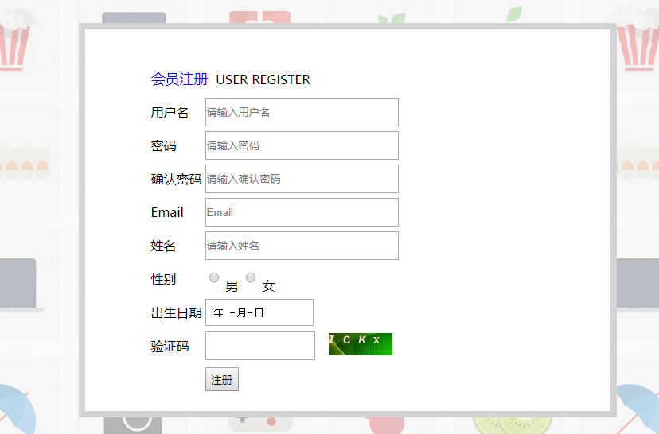

# 8.JavaScript概述(了解)

1.JavaScript概述是一门前端语言。运行这门语言编写的程序不用特意安装一个软件。只需要一个浏览器足以。现在市面各大浏览器都是兼容javascript。

2.javascript由网景公司开发的。简称js.

3.js属于弱类型的脚本语言。

> 脚本语言：python php js等 .脚本理解为剧本，怎么书写怎么执行。不需要编译，直接运行。
>
> 弱类型语言：
>
> ​	java属于强类型语言。定义变量使用很多关键字。byte short int long float double....
>
>    js属于弱类型语言：在ECMA或者es5之前定义任何变量使用var。在es6后定义变量使用let

4.js组成部分

> 组成部分：
>
> 1.核心语法：ECMAScript 简称es.定义变量 函数 数组等
>
> 2.浏览器对象模型：BOM   browser object model。操作浏览器：历史记录数 地址栏 窗口 等
>
> 3.文档对象模型：dom  :  document object model. 操作html的标签

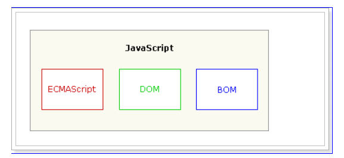

# 9.JavaScript入门(掌握)

## 1.在html中引入js方式

有两种方式：

1.在html页面内部引入  课堂使用

2.在html页面引入外部的js文件 开发经常使用

### 1.1.在html页面内部引入

1.使用标签script引入

~~~html

~~~

2.引入的标签放到哪里合适

引入位置不固定，放到html页面的任意位置都可以。

但是由于js属于阻塞式加载语言，浏览器在加载js代码的时候从上往下加载，不能加载其他代码。如果使用js操作html标签，并且将操作html标签的js代码放到页面上面，会导致报错，找不到使用的html标签。

总结：在js代码放到html页面最下面。

### 1.2在html页面引入外部的js文件 开发经常使用

【1】在外部创建js文件

【2】在html页面中使用如下标签引入外部的js文件

~~~html

~~~

注意：

方式二只是用来引入外部的js文件，不能在文本中书写js代码，如果向书写，那么在下面继续使用script标签，然后在文本书写。

小结：

html引入js有两种方式：

1.在html内部引入：

~~~html

~~~

2.引入外部的：

~~~html

# 方式二只是用来引入外部的js文件，不能在文本中书写js代码，如果向书写，那么在下面继续使用script标签，然后在文本书写。
~~~

## 2.JS三种输出方式

~~~html
<!DOCTYPE html>
<html lang="en">
<head>
    <meta charset="UTF-8">
    <title>Title</title>
</head>
<body>
    <!--引入js-->
    
</body>
</html>
~~~

小结：

三种输出方式：

1.window.alert(输出内容);

2.document.write(输出到浏览器页面中);

3.console.log(输出到浏览器控制台);

## 3.JS变量和常量声明

~~~html
<!DOCTYPE html>
<html lang="en">
<head>
    <meta charset="UTF-8">
    <title>Title</title>
</head>
<body>
    
</body>
</html>
~~~

小结：

1.在核心语法即es5前定义变量使用：var  但是这个关键字var具有作用域问题

2.从es6开始我们定义变量使用：let ; 定义常量使用const

3.你们定义变量使用let会报错。这是idea默认支持es5,我们只需要修改为支持es6即可。

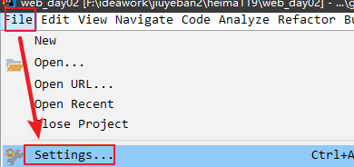

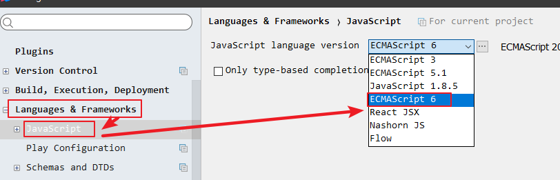

## 4.JS数据类型

数据类型分为两大类：

1.基本数据类型(原始数据类型)：

~~~js
1)数值类型 ： number 包括整数和小数
2）字符类型: string 
	注意：在js中只要是字符类型可以使用双引号或者单引号，建议使用单引号。
    举例："黑马程序员"  '黑马程序员' 
3)布尔类型：boolean  值有两个：true false
4)null类型：空类型
5）undefined：源自于null ,表示未定义的数据类型，等同于null
~~~

~~~html
<!DOCTYPE html>
<html lang="en">
<head>
    <meta charset="UTF-8">
    <title>Title</title>
</head>
<body>
    
</body>
</html>
~~~

小结：

js中的原始数据类型由五种：

number  string  boolean  null   undefined

2.引用数据类型(复合数据类型)：object  Date 等

~~~html
<!DOCTYPE html>
<html lang="en">
<head>
    <meta charset="UTF-8">
    <title>Title</title>
</head>
<body>
    
</body>
</html>
~~~

## 5.typeof关键字

由于在js中定义变量都是使用let，那么我们并不能够看出当前变量具体属于何种数据类型，所以我们这里使用typeof关键字进行判断类型：

~~~js
typeof 变量名
~~~

~~~html
<!DOCTYPE html>
<html lang="en">
<head>
    <meta charset="UTF-8">
    <title>Title</title>
</head>
<body>
    
</body>
</html>
~~~

小结：

1.typeof 变量名：查看某个变量的数据类型

2.typeof 变量名的结果都是以字符类型输出到浏览器控制台

~~~js
console.log(typeof typeof i);//string
console.log(typeof typeof s);//string
~~~

# 10.JavaScript基础语法【记住不同点】

## 1.运算符

### 1.1比较运算符

~~~html
<!DOCTYPE html>
<html lang="en">
<head>
    <meta charset="UTF-8">
    <title>Title</title>
</head>
<body>
    
</body>
</html>
~~~

小结：

 1.比较运算符：
                1）== 和 === 的区别
                    ==  属于非严格比较运算符，如果运算符两侧类型不一致，那么转换为一致类型在比较数值
                    === 属于严格比较运算符，如果运算符两侧类型不一致，那么结果是false，不会比较数值
                2) != 和!==的区别：
                    !=是 == 的取反，称为非严格比较。如果运算符两侧类型不一致，先转换相同类型，在比较数值
                    !==是 === 的取反，称为严格比较。如果运算符两侧类型不一致，返回true

### 1.2逻辑运算符：  &&  ||   ！ 

回顾java：

运算符只是针对布尔类型运算，结果也是布尔类型。

js和java中不一样的是：js中具有六种假。其余都是真。

~~~js
1.false
2. 0
3.null
4.undefined
5.''或者""
6.NaN not a number 不是一个数字
~~~

~~~html
<!DOCTYPE html>
<html lang="en">
<head>
    <meta charset="UTF-8">
    <title>Title</title>
</head>
<body>
    
</body>
</html>
~~~

### 1.3三元运算

~~~js
 		/*
            	5、三元运算符：  条件表达式1 ? 条件表达式2 : 条件表达式3;
         */
        0 || 'abc' ? console.log("真的") : console.log("假的");
~~~

## 2.var和let的区别(了解)

~~~html
<!DOCTYPE html>
<html lang="en">
<head>
    <meta charset="UTF-8">
    <title>Title</title>
</head>
<body>
    
</body>
</html>
~~~

小结：以后定义变量在js中都使用let定义，常量使用const.

## 3.函数

回顾java定义方法：

~~~java
方法修饰符 返回值类型 方法名(参数列表){int i,double d...
    方法体
}
~~~

js中的函数分两类：

1.普通函数

2.匿名函数

### 1.普通函数

格式：

~~~js
function 函数名(参数列表){
    函数体
}
说明：
1.js中定义函数使用关键字function *****
2.js中的函数没有返回值类型，因为函数体返回什么数据类型都是书写let.如果函数需要给调用者返回数据在函数体使用return关键字返回，格式： return 返回的数据; *****
3.函数名属于标识符，和java一样，定义满足小驼峰式。
4.参数列表：不需要书写参数类型，因为什么参数的数据类型都是使用let定义。 *****
	参数列表：a,b,c.... 直接书写参数名
5.js中的函数必须被调用才会执行，和java一样,调用函数格式：函数名(实际参数);
~~~

~~~html
<!DOCTYPE html>
<html lang="en">
<head>
    <meta charset="UTF-8">
    <title>Title</title>
</head>
<body>

</body>
</html>
~~~

小结：

1.

~~~js
function 函数名(参数列表){
            函数体
        }
        说明：
        1.js中定义函数使用关键字function *****
        2.js中的函数没有返回值类型，因为函数体返回什么数据类型都是书写let.如果函数需要给调用者返回数据在函数体使用return关键字返回，格式： return 返回的数据; *****
        3.函数名属于标识符，和java一样，定义满足小驼峰式。
        4.参数列表：不需要书写参数类型，因为什么参数的数据类型都是使用let定义。 *****
            参数列表：a,b,c.... 直接书写参数名
        5.js中的函数必须被调用才会执行，和java一样,调用函数格式：函数名(实际参数);
~~~

2.函数扩展

~~~html
<!DOCTYPE html>
<html lang="en">
<head>
    <meta charset="UTF-8">
    <title>Title</title>
</head>
<body>

</body>
</html>
~~~

