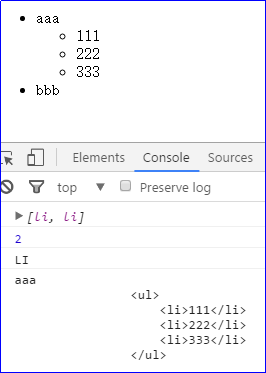

# **Javascript高级** 

## **今日内容学习目标**

**使用JS可以编写各种事件(掌握)**

**使用JS可以获得指定元素(掌握)**

使用JS可以创建元素(理解)

**使用JS可以对元素的属性进行操作(掌握)**

**使用JS可以对元素的标签体进行操作(掌握)**

# **课堂笔记**

# 1、 **完善注册表单校验**

## 1.1、 **案例介绍**

表单校验需求如下：

1. 将错误提示信息显示在对应的表单元素后面。

   


## **1.2、** **相关知识点**

### **1.2.1、** **DOM概述**

DOM对象：Document Object Model 文档对象模型

作用：通过DOM对象可以访问和操作html文件的每一个标签。

最简单的html文件：

```html
<!DOCTYPE html>
<html>
    <head>
        <title>文档标题</title>
    </head>
    <body>
        <a href="xxxx">我的链接</a>
        <h1>我的标题</h1>
    </body>
</html>
```

html文件对应的DOM树内存图：


说明：

1）document对象表示html整个页面的文档对象，要想获取页面中的某个标签必须使用document对象；

2）最上面的根元素是document对象；

### **1.2.2、** **DOM对象中的属性、方法介绍** **（重点）**

#### **1.2.2.1、** **标签**属性的操作：

| **属性名**                            | **描述**                                                     |
| ------------------------------------- | ------------------------------------------------------------ |
| element.getAttribute(属性的名称);     | 根据标签的属性的名字来获取属性的值                           |
| element.setAttribute(属性的名称, 值); | 给标签设置一个属性                                           |
| element.removeAttribute(属性的名称);  | 根据标签的属性的名字来删除属性                               |
| element.children;                     | 获取当前元素（标签）的子元素注意：获取的子级（一层），不管嵌套(不包括孙子，只包括儿子) |
| element.nodeName/tagName;             | 获取标签名 注意：获取的是大写的字符串的标签名                |
| element.innerHTML;                    | 获取当前元素（标签）的文本内容 <div>哈哈<div>                |

说明：

1）上述element表示具体的元素或者标签。例如：div、p标签等。

2）我们也会将标签叫做节点。

练习一：

```html
<input type="text" name="username" id="txt" value="java" />
```

需求1：获取属性 name的值

需求2: 给文本框设置一个属性 hello, 值是world

需求3：删除属性 value 

   代码实现：

```html
<!DOCTYPE html>
<html>

	<head>
		<meta charset="UTF-8">
		<title></title>
	</head>

	<body>
		练习一：
		<input type="text" name="username" id="txt" value="java" />
		<!--
			需求1：获取属性 name的值
			需求2: 给文本框设置一个属性 hello, 值是world
			需求3：删除属性 value
		 -->
		 <script type="text/javascript">
		 	//需求1：获取属性 name的值
		 	//获取input标签
		 	let oName=document.getElementById('txt');
		 	let username=oName.getAttribute('name');
		 	console.log(username);//username
			// 需求2: 给文本框设置一个属性 hello, 值是world
			oName.setAttribute('hello','world');
			//获取设置的属性hello的值
			console.log(oName.getAttribute('hello'));//world
			// 需求3：删除属性 value
			oName.removeAttribute('value');
		 </script>
	</body>
</html>
```

实现效果：


练习二：

```html
<div id="div">我是div</div>
```

需求一：获取标签体的内容

需求二：设置标签体的内容：

```html
<b>我是加粗的</b>
```

代码示例(标签体的内容)：

```html
<!DOCTYPE html>
<html>
	<head>
		<meta charset="UTF-8">
		<title></title>
	</head>
	<body>
		<div id="div">我是div</div>
		<!--
			需求一：获取标签体的内容
			需求二：设置标签体的内容：<b>我是加粗的</b>
		-->
		<script type="text/javascript">
			// 获取div标签
			let oDiv = document.getElementById('div');
			// 需求一：获取标签体的内容 
			// innerHTML 区分字母大小写
//			console.log(oDiv.innerHTML);
			// 需求二：设置标签体的内容：<b>我是加粗的</b>
			//说明innerHTML既可以获取文本内容也可以修改文本内容
//			oDiv.innerHTML='div的内容被修改了';
//			console.log(oDiv.innerHTML);
			// 设置标签体的内容：<b>我是加粗的</b>
			oDiv.innerHTML='<b>我是加粗的</b>';
			console.log(oDiv.innerHTML);
		</script>
	</body>
</html>
```

实现效果：


练习三：

```html
<ul id="ul1">
	<li>aaa
		<ul>
			<li>111</li>
			<li>222</li>
			<li>333</li>
		</ul>
	</li>
	<li>bbb</li>
</ul>
```

需求一：获取ID为ul1的所有的子级

需求二：获取ID为ul1下面第一个li的标签名和内容

代码示例（子级）：

```html
<!DOCTYPE html>
<html>

	<head>
		<meta charset="UTF-8">
		<title></title>
	</head>

	<body>
		<ul id="ul1">
			<li>aaa
				<ul>
					<li>111</li>
					<li>222</li>
					<li>333</li>
				</ul>
			</li>
			<li>bbb</li>
		</ul>
		<!--
			需求一：获取ul的所有的子级
			需求二：获取ID为ul1下面第一个li的标签名和内容
		-->
		<script type="text/javascript">
			// 获取ul标签
			let oUl=document.getElementById('ul1');
			//使用children属性获取ul的所有子集
			console.log(oUl.children);
			//输出数组长度
			console.log(oUl.children.length);//2
			//需求二：获取id为ul1下面第一个li的标签名和内容
			console.log(oUl.children[0].nodeName);//获取标签名 'LI' 大写的
			/*
			 *  aaa
				<ul>
					<li>111</li>
					<li>222</li>
					<li>333</li>
				</ul>
			 */
			console.log(oUl.children[0].innerHTML);//获取标签内容
		</script>
	</body>
</html>
```

实现效果：



#### **1.2.2.2、** **标签（元素）的操作：**

1、获取元素对象（查）

| **方法名**                                        | **描述**                                                     |
| ------------------------------------------------- | ------------------------------------------------------------ |
| document.getElementById(id名称);                  | 通过元素（标签）的id属性值获取标签对象，返回的是单个的标签对象注意：只能从document下面去获取 |
| document.getElementsByName(name属性名称);         | 通过元素（标签）的name属性值获取标签对象，返回的是标签对象的数组。注意：只能从document下面去获取 |
| document/parentNode.getElementsByTagName(标签名); | 通过元素（标签）的名称获取标签的对象,返回的是标签对象的数组。注意：可以从document或者某一个父级标签下面去获取 |
| document/parentNode.getElementsByClassName(类名); | 通过元素（标签）的class属性获取标签对象，返回的是标签对象的数组。注意：可以从document或者某一个父级标签下面去获取 |

​     

练习一：  

```html
<div class="red">div1</div>
<div>div2</div>
<div class="red">div3</div>

<p>p1</p>
<p class="red">p2</p>
<p>p3</p>

<form action="#">
    用户名：<input type="text" name="username" value="suoge"/>
    密码： <input type="password" name="password" value="123"/>
    性别：<input type="radio" name="gender" value="male" />男
    <input type="radio" name="gender" value="female" />女
    <input type="submit" value="提交" />
</form>

```

​	​		

需求1：让页面上所有div字体颜色变蓝色

需求2：让页面上所有class为red的元素背景色变红色

需求3： 获取页面上name为 username 和 gender的元素，并输出其value属性的值

代码示例如下所示：

```html
<!DOCTYPE html>
<html>

	<head>
		<meta charset="UTF-8">
		<title></title>
	</head>

	<body>
		<!--练习一：-->
		<div class="red">div1</div>
		<div>div2</div>
		<div class="red">div3</div>

		<p>p1</p>
		<p class="red">p2</p>
		<p>p3</p>

		<form action="#">
			用户名：<input type="text" name="username" value="suoge"/> 
			密码： <input type="password" name="password" value="123"/> 
			性别：
			<input type="radio" name="gender" value="male" />男
			<input type="radio" name="gender" value="female" />女
			<input type="submit" value="提交" />
		</form>
		<!--需求1：让页面上所有div字体颜色变蓝色 
		需求2：让页面上所有class为red的元素背景色变红色 
		需求3： 获取页面上name为 username 和 gender的元素，并输出其value属性的值-->
		<script type="text/javascript">
			//需求1：让页面上所有div字体颜色变蓝色 
			//获取所有的div标签 获取之后是一个数组
			let aDiv = document.getElementsByTagName('div');
			//遍历数组
			for(let i=0;i < aDiv.length;i++)
			{
				aDiv[i].style.color='blue';
			}
			//需求2：让页面上所有class为red的元素背景色变红色 
			//获取所有的class为red的标签
			let aRed = document.getElementsByClassName('red');
			//遍历数组
			for(let i=0;i<aRed.length;i++)
			{
				aRed[i].style.backgroundColor='red';
			}
			//需求3： 获取页面上name为 username 和 gender的元素，并输出其value属性的值
			//确定页面只有一个name是username的标签可以按照如下方式书写，获取的是input标签
//			let oUsername = document.getElementsByName('username')[0];
			let aUsername = document.getElementsByName('username');
			console.log(aUsername[0].value);
//			console.log(oUsername.value);//根据input标签获取value值
			//获取name是gender的标签
			let aGender = document.getElementsByName('gender');
			console.log(aGender[0].value);
			console.log(aGender[1].value);
		</script>
	</body>
</html>

```

实现效果：


2、新增元素（增）

| **方法名**                                                 | **描述**                                                     |
| ---------------------------------------------------------- | ------------------------------------------------------------ |
| document.createElement(元素名称)                           | 在页面上根据标签名来创建元素，返回创建的标签（元素）对象注意：只能从document下面去创建元素 |
| parentNode.appendChild(要添加的元素对象);                  | 在某一个父级元素（标签)下面去添加一个元素，每次添加到父级元素的最后面，相当于一个追加的操作 |
| parentNode.insertBefore(要添加的元素对象，在谁的前面添加); | 在某一个父级元素（标签)下面去添加一个元素，可以指定在哪一个子元素（标签）的前面添加 |

 

练习二：

```html
<ul>
	<li>bbb</li>
</ul>

```

需求1： 创建一个li添加到ul的最后面

需求2： 再次添加一个li要求添加到ul的第一个位置

代码示例：

```html
<!DOCTYPE html>
<html>

	<head>
		<meta charset="UTF-8">
		<title></title>
	</head>

	<body>
		<!--练习二：-->
		<ul>
			<li>bbb</li>
		</ul>
		<!--需求1： 创建一个li添加到ul的最后面 
		     需求2： 再次添加一个li要求添加到ul的第一个位置
		-->
		<script type="text/javascript">
			//需求1： 创建一个li添加到ul的最后面 
			//创建li标签
			let oLi = document.createElement('li');
			//给li标签添加文本
			oLi.innerHTML='ccc';
			//将li标签添加到ul的最后面
			//获取ul标签 
			/*
			 * 在一个页面中无论书写多少个body标签，最后浏览器读取的时候
			 * 都会将所有的内容放到一个body标签中。所以我们可以根据
			 * document对象直接调用body标签来获取body标签。
			 * document.body.children[0] 表示获取body标签的第一个孩子
			 */
			let oUl = document.body.children[0];
			//将上述的li标签添加到ul标签的最后面
			oUl.appendChild(oLi);
			// 需求2： 再次添加一个li要求添加到ul的第一个位置
			//创建li标签
			let oLi2 = document.createElement('li');
			//给li标签添加文本
			oLi2.innerHTML='aaa';
			// 再次添加一个li要求添加到ul的第一个位置
			//父级.insertBefore(要添加的元素，在谁前面添加);
			oUl.insertBefore(oLi2,oUl.children[0]);
		</script>
	</body>
</html>

```

说明：

 在一个页面中无论书写多少个body标签，最后浏览器读取的时候都会将所有的内容放到一个body标签中。所以我们可以根据document对象直接调用body标签来获取body标签。

 document.body.children[0] 表示获取body标签的第一个孩子。

实现效果：


3、删除元素（删）

| 方法名                                  | 描述                                   |
| --------------------------------------- | -------------------------------------- |
| element.remove();掌握                   | 删除当前的元素（标签）掌握             |
| parentNode.removeChild(要删除的子元素); | 通过父级元素（标签）删除子元素（标签） |

练习三：

```html
<ul>
			<li>aaa</li>
			<li>bbb</li>
			<li>ccc</li>
</ul>

```

需求：删除第一个li标签。

代码示例如下所示：

```html
<!DOCTYPE html>
<html>

	<head>
		<meta charset="UTF-8">
		<title></title>
	</head>

	<body>
		<!--练习三：-->

		<ul>
			<li>aaa</li>
			<li>bbb</li>
			<li>ccc</li>
		</ul>
		<!--需求：删除第一个li标签。-->
		<script type="text/javascript">
			//方式一：直接删除element.remove();
//			document.getElementsByTagName('li')[0].remove();
			//方式二：父级标签.removeChild(子级标签名)
			//获取父级标签ul
			var oUl = document.body.children[0];
			//oUl.children[0] 表示ul的第一个li标签
			oUl.removeChild(oUl.children[0]);
		</script>
	</body>
</html>

```

实现效果：


### **1.2.3、** **事件概述**(掌握)

JS 是事件驱动的语言。

#### **1.2.3.1、** **什么是事件**

我们在浏览器中做的所有的操作，例如：鼠标的点击、鼠标悬停、敲击键盘等等。简单的理解：事件就是用户的操作。

#### **1.2.3.2、** **什么是事件驱动**

JS中会有内部机制监听这一系列的事件，当这些事件发生，JS会响应并且调用与事件相关的函数去处理该事件。

### **1.2.4、** **常用的事件**

| **事件名**      | **描述**                                      |
| --------------- | --------------------------------------------- |
| **onload**      | 某个页面或图像被完全加载之后触发              |
| **onsubmit**    | 当表单提交时触发该事件---注意事件源是表单form |
| **onclick**     | 鼠标点击某个对象                              |
| ondblclick      | 鼠标双击某个对象                              |
| **onblur**      | 元素失去焦点(输入框)                          |
| onfocus         | 元素获得焦点(输入框)                          |
| **onchange**    | 用户改变域的内容。一般使用在select标签中。    |
| onkeydown       | 某个键盘的键被按下                            |
| onkeypress      | 某个键盘的键被按下或按住，一直按住            |
| onkeyup         | 某个键盘的键被松开                            |
| onmousedown     | 某个鼠标按键被按下                            |
| onmouseup       | 某个鼠标按键被松开                            |
| **onmouseover** | 鼠标被移到某元素之上 除了输入框               |
| **onmouseout**  | 鼠标从某元素移开 除了输入框                   |
| onmousemove     | 鼠标被移动                                    |

 

### **1.2.5、** **事件绑定的方式**

#### **1.2.5.1、** **静态绑定**(了解)

静态绑定：直接在标签上拿事件名作为标签的属性名，属性名对应的属性值是一个方法。

语法格式：

```html
<标签 事件名 = "函数名()" ... ></标签>
例如：
<div onclick= "show();"></div>

```

需求：

1、给div标签绑定单击事件,输出div的文本

2、给div标签绑定鼠标悬浮事件，使其背景颜色变红

3、给div标签绑定鼠标移出事件，使其背景颜色变蓝

说明：定义一个div，并给div设置宽、高和背景颜色灰色：#ccc。

设置div的代码：

```css
<style type="text/css">
			div {
				width: 200px;
				height: 200px;
				background-color: #ccc;/*灰色*/
			}
</style>

```

Js的代码实现：

```html
<!DOCTYPE html>
<html>
	<head>
		<meta charset="UTF-8">
		<title></title>
		<style type="text/css">
			div{
				width: 200px;
				height: 200px;
				background-color: #ccc;/*灰色*/
			}
		</style>
	</head>

	<body>
		<!--		
			需求：
			1、给div标签绑定单击事件,输出div的文本
			2、给div标签绑定鼠标悬浮事件，使其背景颜色变红
			3、给div标签绑定鼠标移出事件，使其背景颜色变蓝
			说明：定义一个div，并给div设置宽、高和背景颜色。
			this表示当前函数属于哪个标签，那么这个this就代表哪个标签或者对象
		-->
		<div onclick="show(this);" onmouseover="fnOver(this);" onmouseout="fnOut(this);">我是div</div>
		<script type="text/javascript">
			//1、给div标签绑定单击事件,输出div的文本
			//定义函数，点击div时触发
			function show(obj)
			{
				console.log(obj.innerHTML);
			}
			//2、给div标签绑定鼠标悬浮事件，使其背景颜色变红
			function fnOver(obj)
			{
				obj.style.backgroundColor='red';
			}
			//3、给div标签绑定鼠标移出事件，使其背景颜色变蓝
			function fnOut(obj)
			{
				obj.style.backgroundColor='blue';
			}
		</script>
	</body>
</html>

```

**说明：this表示当前函数属于哪个标签，那么这个this就代表哪个标签或者对象。**

实现效果：

鼠标点击div和移到div上面时触发的。


鼠标移除之后触发的：


#### **1.2.5.2、** **动态绑定**(掌握)

通过静态绑定事件，我们发现html代码和js事件放到一起了，耦合性强。所以我们在开发中一般很少使用静态绑定，我们一般都使用动态绑定。

动态绑定：事件不是直接写到标签中，即不是拿事件作为标签的属性名了。而是通过DOM技术来获取元素（标签），然后直接给标签添加事件，而事件一般后面跟着一个匿名函数。

语法结构：

```javascript
var oDiv = document.getElementById(“div”);
oDiv.事件名 = function() {
	// JS逻辑代码
};

```

需求：使用动态绑定完成。

1、给div标签绑定单击事件,输出div的文本

2、给div标签绑定鼠标悬浮事件，使其背景颜色变红

3、给div标签绑定鼠标移出事件，使其背景颜色变蓝

说明：定义一个div，并给div设置宽、高和背景颜色。

设置div的代码：

```css
<style type="text/css">
			div {
				width: 200px;
				height: 200px;
				background-color: #ccc;/*灰色*/
			}
</style>

```

示例代码：

```html
<!DOCTYPE html>
<html>

	<head>
		<meta charset="UTF-8">
		<title></title>
		<style type="text/css">
			div {
				width: 200px;
				height: 200px;
				background-color: #ccc;/*灰色*/
			}
		</style>
	</head>

	<body>
		<div>我是div</div>
		<!--
			需求：使用动态绑定完成。
			1、给div标签绑定单击事件,输出div的文本
			2、给div标签绑定鼠标悬浮事件，使其背景颜色变红
			3、给div标签绑定鼠标移出事件，使其背景颜色变蓝
			说明：定义一个div，并给div设置宽、高和背景颜色。
		-->
		<script type="text/javascript">
			//获取div标签
			var oDiv = document.getElementsByTagName('div')[0];
			//1、给div标签绑定单击事件,输出div的文本
			//由于使用oDiv对象调用onclick事件，所以这里的this就表示oDiv对象
			oDiv.onclick = function(){
				console.log(this.innerHTML);
			};
			//2、给div标签绑定鼠标悬浮事件，使其背景颜色变红
			oDiv.onmouseover = function(){
				this.style.backgroundColor='red';
			};
			//3、给div标签绑定鼠标移出事件，使其背景颜色变蓝
			oDiv.onmouseout = function(){
				this.style.backgroundColor='blue';
			};
		</script>
	</body>
</html>

```

**说明：由于使用oDiv对象调用onclick事件，所以这里的this就表示oDiv对象。**

实现效果：

鼠标点击div和移到div上面时触发的。


鼠标移除之后触发的：


### **1.2.6、** **JS中的对象**

#### **1.2.6.1、** **Array数组对象**（重点）

##### 目标

1. 数组的创建的方式
2. 数组中的方法

##### 创建数组的四种方式

数组在JS中是一个内置对象

| **创建数组的方式**                    | **说明**                                                     |
| ------------------------------------- | ------------------------------------------------------------ |
| var arr =new Array();var arr = []; √  | 创建长度为0的数组                                            |
| var arr =new Array(n)                 | 创建一个指定长度的数组，长度为n.<br/>举例：var arr = new Array(5);创建数组大小是5的数组。<br/>var arr2=[10];//这里的10表示arr2数组中的数据，数组长度是1 |
| var arr =new Array(元素1,元素2,元素3) | 指定数组中每个元素创建一个数组                               |
| var arr =[元素1,元素2,元素3]√         | 指定数组中每个元素创建一个数组                               |

定义数组代码演示：

~~~javascript
		//定义一个数组
        //var arr=new Array(10);//这里的10表示arr数组中的长度
        var arr=new Array('a');//这里表示数组arr中的数据是a,数组长度是1
        var arr2=[10];//这里的10表示arr2数组中的数据
        console.log(arr.length);//10
        //console.log(arr2.length);//1
        // var arr = [10,"aa"];
~~~


##### 数组的特点

1. 创建数组，元素的类型可以不同
2. 数组的长度可以动态变化的
3. 数组中还包含了方法

##### 数组中元素的获取

跟java一样,通过索引和数组名的方式获得数组中的元素：

获得数组中的一个元素：arr[下标]  从0开始

遍历获得数组中的所有元素：

```javascript
for(let i=0;i<arr.length;i++){
alert(arr[i]);
}

```

代码演示：

~~~javascript
//1.创建数组，元素的类型可以不同
let arr3 = [50, true, "abc", new Date()];
console.log(arr3);
//2.数组的长度可以动态变化的
console.log(arr3.length);
arr3[5] = 99;
//循环输出每个元素
for (var i = 0; i < arr3.length; i++) {
    var arrElement = arr3[i];
    console.log("数组元素："+arrElement);
}
console.log(arr3.length);
//直接修改长度
arr3.length = 3;
console.log(arr3);
~~~

效果：


##### 常用方法

| **方法名**          | **功能**                                                     |
| ------------------- | ------------------------------------------------------------ |
| **concat()**        | 用于拼接一个或多个数组                                       |
| **reverse()**       | 用于数组的反转                                               |
| **join(separator)** | 用于将整个数组使用分隔符拼接成一个字符串。相当于split()反操作 |
| **sort()**          | 对数组进行排序，不带参数是按照编码值进行排序。<br/>如果不是按照编码值排序,那么必须指定比较器。<br/>说明：由于字符串都是按照编码值比较大小的，所以也可以将这个方法这样理解使用：<br/>如果要对数字进行排序，必须指定比较器。如果是按字符串进行排序，那么就是无参。 |
| **pop()**           | 删除并返回数组的最后一个元素                                 |
| **push()**          | 添加一个或者多个元素到数组的最后面                           |

##### 字符串的比较规则

- 字符串比较字符的ASCII码值

- 小写字母 > 大写字母 > 数字

- 两个字符串先比较第1个字符，如果比较出来了大小，就不再继续。

- 如果第1个字符相同，则继续比较第2个，谁大整个字符串就大。后面依次类推。

  ```
  "abcdefg" <  "ac"
  "239874239478" < "A"
  "ABCDEFG" < "x"
  ```


##### 方法演示案例

###### 代码

```html
<!DOCTYPE html>
<html lang="en">
<head>
    <meta charset="UTF-8">
    <title>数组</title>
</head>
<body>
<script type="text/javascript">
    //3. 数组中还包含了方法
    // concat()：用于拼接一个或多个数组
    var a1 = [1, 3, 5];
    var a2 = ["a", "b", "c"];
    var a3 = [99, 100];
    var a4 = a1.concat(a2, a3);
    console.log(a4);//(8) [1, 3, 5, "a", "b", "c", 99, 100]

    // reverse()：用于数组的反转
    a1.reverse();
    console.log(a1);//(3) [5, 3, 1]

    // join(separator)：用于将整个数组使用分隔符拼接成一个字符串。相当于split()反操作
    var str = a3.join("_");
    console.log(str);//99_100

    /*
        sort()：对数组进行排序，不带参数是按照编码值进行排序。
        如果不是按照编码值排序,那么必须指定比较器。
        说明：
        由于字符串都是按照编码值比较大小的，所以也可以将这个方法这样理解使用：
            如果要对数字进行排序，必须指定比较器。如果是按字符串进行排序，那么就是无参
      */
    var arr5 = ["newboy", "Rose", "Tom", "Job", "Jack"];
    console.log("排序前：" + arr5);
    arr5.sort();//按照编码值排序
    console.log("排序后：" + arr5);//Jack,Job,Rose,Tom,newboy 升序

    var arr6 = [100, 5, 24, 83, 9];
    console.log("排序前：" + arr6);
    arr6.sort();//按照编码值排序
    console.log("排序后：" + arr6);//排序后：100,24,5,83,9 编码值升序

    var arr7 = [100, 5, 24, 83, 9];
    console.log("排序前：" + arr7);
    arr7.sort(function (a, b) {
        return b - a;
    });//按照数字大小
    console.log("排序后：" + arr7);//排序后：100,83,24,9,5 大小降序

    // pop()：删除并返回数组的最后一个元素
    var arr8 = ["newboy", "Rose", "Tom", "Job", "Jack"];
    var number = arr8.pop();
    console.log(number);
    console.log(arr8);

    // push()：添加一个元素到数组的最后面
    arr8.push("aaa","bbb");
    console.log(arr8);
</script>
</body>
</html>
```

##### 小结

| **方法名**          | **功能**                                   |
| ------------------- | ------------------------------------------ |
| **concat()**        | 数组拼接                                   |
| **reverse()**       | 反转                                       |
| **join(separator)** | 将数组拼接成一个字符串                     |
| **sort()**          | 排序，无参是按字符串，如果数字要使用比较器 |
| **pop()**           | 删除最后一个元素                           |
| **push()**          | 在最后添加一个或多个元素                   |

#### **1.2.6.2、** **RegExp对象**（重点）

 	创建正则表达式：regulation expression

```javascript
第一种方式：var reg = new RegExp(“正则表达式”); 
第二种方式：var reg = /正则表达式/; √

```

使用正则对象调用的验证字符串的方法：

```javascript
reg.test(字符串); 
验证通过返回true 
验证不通过返回false

```

**说明： 正则表达式一般 需要加上 ^ $ 行首和行尾  表示要从头到尾匹配。**

补充：^  表示以什么开始   $ 以什么结束

需求：使用正则表达式验证指定的字符串是否满足长度是6.

次数：

？ 0 1

\* 0 1 n

\+ 1 n

代码示例：

```html
<!DOCTYPE html>
<html>
	<head>
		<meta charset="UTF-8">
		<title></title>
	</head>
	<body>
		<script type="text/javascript">
			/*
			 * 需求：使用正则表达式验证指定的字符串是否满足长度是6.
			 * 说明：在js中正则表达式的开头使用^  结尾使用$ 表示边界词
			 * regExp.test(str) 验证字符串的合法性
			 * 如果合法，返回true。如果不合法，返回false
			 */
			//定义字符串
			var str='abcdef';
//			方式一:创建正则表达式对象 .
//			var reg = new RegExp('^[0-9a-zA-Z]{6}$');
			//方式二：创建正则表达式对象 
			var reg=/^[0-9a-zA-Z]{6}$/;
			//调用方法判断str字符串的长度是否是6
			console.log(reg.test(str));
		</script>
	</body>
</html>

```

#### 1.2.6.3、String 对象(和java中一致的自己学习)

在js中字符串string属于基本类型，同时js会将字符串string包装成对应包装类类型。可以创建string对象调用string方法。

~~~javascript
1. 构造字符串对象可以使用
    a. 双引号
    b. 单引号
    c. 反引号(重音符) 键盘左上角 esc下面 (es6字符串模板)
        经常用在拼接字符串: 避免单双引手动拼接
            `字符串${变量名}字符串`
	d.构造方法

2. 字符串常用方法
      substring(startIndex,endIndex) 提取字符串中两个指定的索引号之间的字符。  包头不包尾 
      toLowerCase() 把字符串转换为小写。
      toUpperCase() 把字符串转换为大写。
      split() 把字符串分割为字符串数组。
      trim() 去掉首尾空格
~~~


```html
<!DOCTYPE html>
<html lang="zh-CN">
<head>
    <meta charset="UTF-8">
    <title>10-字符串</title>

</head>
<body>
<script type="text/javascript">
    // ------------ 1. 构造字符串对象可以使用  双引号,单引号,反引号
    // let str2 = new String("abc");
    //console.log(str2.toString());abc
    let str = "abc"
    let str2 = 'abc'
    let str3 = `abc`
    console.log(str);
    console.log(str2);
    console.log(str3);

    let i = 100; // 效果: 小丽体重i斤
    let str4 = '小丽体重' + i + '斤'
    console.log(str4);

    let str5 = `小张体重${i}斤`
    console.log(str5);
    // ------------ 2. 字符串常用方法
    
    let str6 = "askfdjASDFAJSDLas"
    var s = str6.toLowerCase();
    console.log(s)
    var s1 = str6.substring(0,2);
    console.log(s1);//as
</script>
</body>
</html>
```

#### 1.2.6.4、 Date 对象(和java中一致的自己学习)


~~~javascript
日期  Date
        1. 创建对象
             let date = new Date(); 获取当前系统时间

        2. 常用方法
            toLocaleString()      转换为本地日期格式的字符串
            getFullYear() 获取日期中的year
            getMonth()   获取日期中的month
            getDate()    获取日期中的 号
            getTime()   获取时间毫秒值(时间原点: 1970年1月1号0时分秒)
~~~


```html
<!DOCTYPE html>
<html lang="zh-CN">
<head>
    <meta charset="UTF-8">
    <title>12-日期</title>
</head>
<body>
    <script>
        let date = new Date();
        //Sun May 24 2020 14:38:34 GMT+0800 (中国标准时间:东八区)
        console.log(date);
        console.log(date.toLocaleString()); // 转换为本地日期格式的字符串
        console.log(date.getFullYear()); // 年 四位
        console.log(date.getMonth()+1);// 月 范围：0~11
        console.log(date.getDate()); // 日
        console.log(date.getTime()); // 1970年~今毫秒值
    </script>

</body>
</html>
```


#### 1.2.6.5、Math 对象(和java中一致的自己学习)

~~~javascript
数学运算
    查询手册完成
    1. 四舍五入 round()
    2. 向下取整 floor() 地板
    3. 向上取整 ceil()  天花板
    4. 产生随机数 random() ：返回 [0,1) 之间的随机数。
            [0,1) 左闭右开区间,包含0不包含1
~~~

```html
<!DOCTYPE html>
<html lang="zh-CN">
<head>
    <meta charset="UTF-8">
    <title>13-数学</title>

</head>
<body>
<body>
<script >
    let n = 1234.567
    //1. 四舍五入取整
    console.log(Math.round(n));
    //2. 向下取整
    console.log(Math.floor(n));
    //3. 向上取整
    console.log(Math.ceil(n));
    //4. 产生随机数
    for (let i = 0; i < 10 ; i++) {
        console.log(Math.random());
    }
</script>
</body>
</html>
```


#### 1.2.6.6、全局函数

我们不需要通过任何对象，可以直接调用的就称为全局函数.

~~~javascript
全局函数 : 在js中不需要对象,直接调用的函数

    1. 字符串转为数字
        a. parseInt() 解析一个字符串并返回一个整数。
            规则: 从左自右解析,碰到非数字解析结束,并返回已结束的结果

        b. parseFloat() 解析一个字符串并返回一个浮点数。
            (保留小数)

            NaN  not a number 这不是一个数  （这哥们六亲不认）
        c. isNaN()  判断一个字符串  如果不是数值返回true 否则返回false

    2. 对字符串编码和解码 (了解)
        encodeURI() 把字符串编码为 URI。
        decodeURI() 解码某个编码的 URI 。

        前端发送数据参数到服务器, 有专门的编码: url编码
           word=%E6%9D%AF%E5%AD%90

           浏览器会将我们输入的内容进行编码(url编码表)
                         看得懂  -> 看不懂    杯子 -> %E6%9D%AF%E5%AD%90
           服务器接收到之后要进行解码
                        看不懂 -> 看得懂    %E6%9D%AF%E5%AD%90 ->  杯子


    3. 把字符串当做js表达式来执行
        eval()  解析 JavaScript 字符串，并把它作为脚本代码来执行。执行其中的的 JavaScript 代码.
~~~


```html
<!DOCTYPE html>
<html lang="zh-CN">
<head>
    <meta charset="UTF-8">
    <title>14-全局函数</title>

</head>
<body>

<script >
    let str = '100.12px'
    let number = parseInt(str);
    console.log(number);

    let number2 = parseFloat(str);
    console.log(number2);

    console.log(1-'abc'); // NaN
    //  c. isNaN()  判断一个字符串  如果不是数值返回true 否则返回false
    console.log(isNaN(1-'abc'));//true
    console.log(isNaN("abc"));//true
    console.log(isNaN(100)) //false

    let str3 = '杯子'
    var result = encodeURI(str3); //编码
    console.log(result);

    console.log(decodeURI(result)) //解码


    /*
    *   浏览器 访问 服务器, 服务器会返回一段 字符串命令(js)
    * */
    let str5 = 'console.log(1234)' //js代码的字符串
    eval(str5) // 解析js代码的字符串, 然后执行js

    // console.log(1234)
</script>
</body>
</html>
```


## **1.3、** **注册验证案例**相关事件

   

| 事件名   | 描述                     |
| -------- | ------------------------ |
| onsubmit | 提交表单时被触发         |
| onblur   | 元素失去焦点时触发(离焦) |

## **1.4、**案例分析

**编写步骤：**

1、 添加错误提示显示区域

 例如：

```html
<span id="usernamespan"></span> 校验不通过，红色字体提示

```

2、 失去焦点时判断用户输入的信息是否合法

3、 点击注册按钮验证所有项

**要求：**

1、 用户名必须是6-10位的字母或者数字

2、 密码长度必须6位任意字符

3、 两次输入密码要一致

## **1.5、** **案例实现**

### **1.5.1、** **书写注册页面的html，并在html页面中**添加错误显示区域

浏览器中显示的页面如下图所示：


分析：该注册页面主要由6行2列的table组成。

具体的html代码如下所示：

```html
<!DOCTYPE html>
<html>
	<head>
		<meta charset="UTF-8">
		<title></title>
	</head>
	<body>
		<!--注册页面-->
		<form action="#" method="post">
			<!--6行2列-->
			<table>
				<tr>
					<td>用户名</td>
					<td><input type="text" name="username" id="username"/></td>
					<!--接收用户名的错误信息-->
					<td><span id="usernamespan"></span></td>
				</tr>
				<tr>
					<td>密码</td>
					<td><input type="password" name="password" id="password"/></td>
					<!--接收密码的错误信息-->
					<td><span id="passwordspan"></span></td>
				</tr>
				<tr>
					<td>确认密码</td>
					<td><input type="password" name="repassword" id="repassword"/></td>
					<!--接收确认密码的错误信息-->
					<td><span id="repasswordspan"></span></td>
				</tr>
				<tr>
					<td>性别</td>
					<td>
						<input type="radio" name="gender" value="male" />男
						<input type="radio" name="gender" value="female" />女
					</td>
					<!--接收性别的错误信息-->
					<td><span id="genderspan"></span></td>
				</tr>
				<tr>
					<td>爱好</td>
					<td>
						<input type="checkbox" name="hobby" value="sing" />唱歌
						<input type="checkbox" name="hobby" value="dance" />跳舞
						<input type="checkbox" name="hobby" value="code" />写代码
					</td>
					<!--接收爱好的错误信息-->
					<td><span id="hobbyspan"></span></td>
				</tr>
				<tr>
					<td></td>
					<td>
						<input type="submit" value="注册" />
						<input type="reset" value="重置" />
					</td>
				</tr>
			</table>
		</form>
	</body>
</html>

```

### **1.5.2、** **使用**JS代码开始验证注册页面

1）校验用户名是否合法。---》用户名必须是6-10位的字母或者数字。

当鼠标离开文本输入框的时候就会触发的事件，所以我们需要在用户名的input标签中添加一个离焦事件onblur,用来验证用户名是否合法。

代码如下：


验证用户名是否满足：用户名必须是6-10位的字母或者数字。的js代码如下所示：

```javascript
<script type="text/javascript">
			//定义函数根据任意标签的id获取标签，防止根据标签id获取标签的代码重复
			function getId(id)
			{
				return document.getElementById(id);
			}
			//定义函数用来验证用户名是否合法
			//用户名必须是6-10位的字母或者数字
			function checkUser()
			{
//				alert("haha");
				//鼠标离开时获取用户名的值
				var userVal=getId('username').value;
				//获取正则表达式对象，6-10位的字母或者数字
				var reg=/^[0-9a-zA-Z]{6,10}$/;
				//判断用户输入的用户名是否符合上述正则表达式对象
				if(reg.test(userVal))
				{
					//返回true，说明符合，输入正确 合法
					getId('usernamespan').innerHTML='';
					//这里返回true，提交表单的时候要使用
					return true;
				}else{
					//非法
					getId('usernamespan').innerHTML='用户名必须是6-10位的字母或者数字';
					//提示信息是红色的
					getId('usernamespan').style.color='red';
					//提交表单的时候要使用
					return false;
				}
			}
</script>

```

2）验证密码。密码长度必须6位的任意字符。

当鼠标离开文本输入框的时候就会触发的事件，所以我们需要在密码的input标签中添加一个离焦事件onblur,用来验证密码是否合法。

代码如下：


验证密码是否满足：密码长度必须6位的任意字符。的js代码如下所示：

```javascript
//验证密码 --->密码长度必须6位的任意字符
			function checkPassword()
			{
				//鼠标离开时获取密码的值
				var passwordVal=getId('password').value;
				//获取正则表达式对象，密码长度必须6位的任意字符
				var reg=/^.{6}$/;
				//判断用户输入的密码是否符合上述正则表达式对象
				if(reg.test(passwordVal))
				{
					//返回true，说明符合，输入正确 合法
					getId('passwordspan').innerHTML='';
					//这里返回true，提交表单的时候要使用
					return true;
				}else{
					//非法
					getId('passwordspan').innerHTML='密码长度必须6位的任意字符';
					//提示信息是红色的
					getId('passwordspan').style.color='red';
					//提交表单的时候要使用
					return false;
				}
		}

```

3）验证确认密码。两次输入密码要一致。

当鼠标离开文本输入框的时候就会触发的事件，所以我们需要在确认密码的input标签中添加一个离焦事件onblur,用来验证确认密码是否合法。

代码如下：


验证确认密码是否满足：两次输入密码要一致。的js代码如下所示：

```javascript
//验证确认密码。两次输入密码要一致。
			function checkRpassword()
			{
				//鼠标离开时获取确认密码的值
				var rePasswordVal=getId('repassword').value;
				//获取密码的值
				var passwordVal=getId('password').value;
				//判断两次输入的密码是否一致
				if(rePasswordVal != passwordVal)
				{
					//不一致
					//非法
					getId('repasswordspan').innerHTML='两次输入密码不一致';
					//提示信息是红色的
					getId('repasswordspan').style.color='red';
					//提交表单的时候要使用
					return false;
				}else
				{
					//一致
					//返回true，说明符合，输入正确 合法
					getId('repasswordspan').innerHTML='';
					//这里返回true，提交表单的时候要使用
					return true;
				}
				
	}

```

4）校验表单是否可以提交。如果上述条件都满足，才可以提交表单，只要有一个不满足就不能提交表单。

那么如何验证表单是否可以提交呢？在js中有一个事件叫做onsubmit事件可以验证，该事件是在提交form表单按钮时触发。

给form表单添加一个id，代码如下所示：


验证表单是否可以提交的代码如下所示：

```javascript
//验证表单是否可以提交
			getId('registerForm').onsubmit = function()
			{
//				alert('haha');
				if(checkUser() && checkPassword() && checkRpassword())
				{
					//可以提交表单，返回true
					return true;
				}else{
					//不可以提交
					return false;
				}
			}

```

效果：


# **2、** **表格隔行换色**

## **2.1、** **案例描述**

开发中，需要使用表格陈列数据，数据过多不易查看，通常使用隔行换色进行表示。


说明：一般表头不会换颜色。

## **2.2、** **案例实现**

将下面的html复制到页面中，完成隔行换色即可。

```html
<!DOCTYPE html>
<html>
	<head>
		<meta charset="UTF-8">
		<title></title>
	</head>
	<body style="margin: 50px;">
		<table border="1" width="1000">
			<tr style="background-color: #999;">
				<th><input type="checkbox"></th>
				<th>分类ID</th>
				<th>分类名称</th>
				<th>分类描述</th>
				<th>操作</th>
			</tr>
			<tr>
				<td align="center"><input type="checkbox" name="chekbox"></td>
				<td>1</td>
				<td>手机数码</td>
				<td>手机数码类商品</td>
				<td><a href="">修改</a>|<a href="">删除</a></td>
			</tr>
			<tr>
				<td align="center"><input type="checkbox" name="chekbox"></td>
				<td>2</td>
				<td>电脑办公</td>
				<td>电脑办公类商品</td>
				<td><a href="">修改</a>|<a href="">删除</a></td>
			</tr>
			<tr>
				<td align="center"><input type="checkbox" name="chekbox"></td>
				<td>3</td>
				<td>鞋靴箱包</td>
				<td>鞋靴箱包类商品</td>
				<td><a href="">修改</a>|<a href="">删除</a></td>
			</tr>
			<tr>
				<td align="center"><input type="checkbox" name="chekbox"></td>
				<td>4</td>
				<td>家居饰品</td>
				<td>家居饰品类商品</td>
				<td><a href="">修改</a>|<a href="">删除</a></td>
			</tr>
		</table>
	</body>
</html>

```

Js代码实现如下：

分析：通过上述结果观察出，第一行表头不需要变颜色，所以获取到所有的tr之后，索引i需要从1开始，i是奇数时行的背景是白色，i是偶数时，行的背景是蓝色。

```javascript
<script type="text/javascript">
			//获取所有的tr
			var aTr = document.getElementsByTagName('tr');
			//遍历数组 表头不用换颜色，所以i从1开始
			for(var i=1;i<aTr.length;i++)
			{
				//是奇数时是白色，i是偶数时是蓝色
				if(i%2 == 1)
				{
					//奇数 背景颜色是白色
					aTr[i].style.backgroundColor='white';
				}else
				{
					//偶数 背景颜色是蓝色
					aTr[i].style.backgroundColor='blue';
				}
			}
</script>

```

实现效果：


# **3、** **复选框全选/全不选**

## **3.1、** **案例描述**

开发中，经常需要对表格数据进行“批量处理”，就需要快速的对列表项进行操作，本案例我们来完成“全选和全不选”。

## **3.2、** **案例相关的JS属性介绍**

### **3.2.1、** **单选/复选选中**

```javascript
ele.checked：  表示元素是否选中
true： 表示选中
false： 表示没有选中
例如：ele.checked = true;   // 设置元素被选中。

```

## **3.3、** **案例实现**

书写html页面，一个复选框和一个div，并在div中书写多个复选框。

```html
<!DOCTYPE html>
<html>
	<head>
		<meta charset="UTF-8">
		<title></title>
	</head>
	<body>
		<input type="checkbox" id="ck" />
		<hr />
		<div id="div">
			<input type="checkbox"/><br />
			<input type="checkbox" /><br />
			<input type="checkbox" /><br />
			<input type="checkbox" /><br />
			<input type="checkbox" />
		</div>
	</body>
</html>

```

使用js来实现复选框的全选和全不选的功能。

分析：

我们希望当我们选择最上面的复选框时，下面的所有复选框全部选择。 如果最上面的复选框没有选择，那么下面所有的复选框也不会全选。

问题：怎样确定最上面的复选框是选择的呢？

在复选框的标签中有个属性checked='checked'，表示复选框勾选。并且当checked='checked'时，输出的结果是true。

如果最上面复选框选择，则下面所有都选择，如果最上面不选择，则下面不选择。也就是说最上面的oCK.checked 是true，那么下面所有的checked值都是true。反之上面是false，下面都是false。

```javascript
<script type="text/javascript">
			//获取最上面的复选框
			var oCK = document.getElementById('ck');
			//获取div中的所有复选框
			var aCK = document.getElementById('div').getElementsByTagName('input');
			/*
			 * 分析：
			 * 我们希望当我们选择最上面的复选框时，下面的所有复选框全部选择
			 * 如果最上面的复选框没有选择，那么下面所有的复选框也不会全选
			 * 问题：怎样确定最上面的复选框是选择的呢？
			 * 在复选框的标签中有个属性checked='checked'，表示复选框勾选
			 * 并且当checked='checked'时，输出的结果是true
			 */
//			console.log(oCK.checked);//false
//	         oCk.onclick=function () {
//上面复选框被选中输出true，没被选中输出false
//	              console.log(oCk.checked);
//            }

			//给oCK绑定点击事件
			oCK.onclick=function()
			{
				//循环div中的所有复选框
				for(var i=0;i<aCK.length;i++)
				{
					//如果最上面复选框选择，则下面所有都选择，如果最上面不选择，则下面不选择
					//也就是说最上面的oCK.checked 是true，那么下面所有的checked值都是true
					//反之上面是false，下面都是false
					aCK[i].checked=oCK.checked;
				}
			};
</script>

```

实现效果：


# **4、** **省市二级联动**

## **4.1、** **案例介绍**

在日常应用中，我们需要完善个人信息，“所在地”要求选择省市，当选择省时，该省对应的市将自动的更新。


## **4.2、** **相关知识点**

### **4.2.1、** **JSON**

JSON 英文全称 JavaScript Object Notation(标记、格式)。JSON 是一种轻量级的数据交换格式。JSON 是用于存储和传输数据的格式。JSON 通常用于服务端和网页之间传递数据的。 JSON 使用 JavaScript 语法，但是 JSON 格式仅仅是一个文本。文本可以被任何编程语言读取以及作为数据格式传递。

JSON在JS里面其实就是一个对象：

定义JSON：

```json
var json = { key1: value1, key2:value2…};

```

说明：按照语法规则，key如何书写都可以，但是为了规范，key最好写在双引号中，这样，在后面我们使用的时候便不会出现获取数据的问题。

使用JSON：

```json
json.key1 来访问键对应的值

```

演示JSON的代码示例：

```html
<!DOCTYPE html>
<html>
	<head>
		<meta charset="UTF-8">
		<title></title>
	</head>
	<body>
		<script type="text/javascript">
			//定义一个json
			var json={"name":"锁哥","age":18,"address":"上海"};
			//输出年龄
//			console.log(json.age);//18
			//上述只是存储一个人的信息，如果存储多个人的信息，可以使用数组进行存储
			var jsonArray = [{"name":"锁哥","age":18,"address":"上海"},
							 {"name":"黑旋风","age":19,"address":"黑龙江"},
							 {"name":"助教","age":29,"address":"北京"}
							 ];
			//访问黑旋风的地址address 由于是数组，所以索引从0开始
			console.log(jsonArray[1].address);//黑龙江
		</script>
	</body>
</html>

```

说明：

如果存储多个人的信息：

var jsonArray = [{"name":"锁哥","age":18,"address":"上海"},{"name":"黑旋风","age":19,"address":"黑龙江"},{"name":"助教","age":29,"address":"北京"}];

实现效果：


**注意：标准格式的JSON键要用双引号引起来，值如果是字符串也必须要双引号引起来。我们后面做数据交互的时候一定要书写标准格式的JSON**

### **4.2.2、** **下拉框**

下拉框代码：

```html
<select id="province" name="province">
		<option value="">--请选择省--</option>
        <option value="sh">上海</option>
</select>

```

事件：

```html
onchange : 当下拉框的内容发生改变的时候触发的事件。

```

获取下拉框的所有option:

```html
oSel.options
说明：oSel表示父标签select对象

```

动态创建option ：

```javascript
var option = new Option(文本，value);
例如：
var option = new Option(‘上海’，‘sh’);

```

添加option：oProSel.appendChild(option);

```javascript
oSel.appendChild(option);//将子标签option添加到父标签oSel上

```

## **4.3、** **代码实现**

因为需要加载一些省市，所以已经给大家在课前资料准备好了一份：


代码实现：

第一步：新建一个html页面：


省市联动的html代码如下所示：

```html
<!DOCTYPE html>
<html>
	<head>
		<meta charset="UTF-8">
		<title></title>
	</head>
	<body>
		<select id="province" name="province">
			 <option value=''>--请选择省--</option>
		</select>
		<select id="city" name="city">
			 <option value=''>--请选择市--</option>
		</select>
	</body>
</html>

```

第二步：将之前准备好的cities.js文件复制到编辑工具的目录中：


cities.js文件中的代码如下所示：

```json
var china = [
    {
        "p_name": "吉林省",
        "p_id": "jl",
        "cities": [
            {
                "c_name": "长春",
                "c_id": "cc"
            },
            {
                "c_name": "四平",
                "c_id": "sp"
            },
            {
                "c_name": "通化",
                "c_id": "th"
            },
            {
                "c_name": "松原",
                "c_id": "sy"
            }
        ]
    },
    {
        "p_name": "辽宁省",
        "p_id": "ln",
        "cities": [
            {
                "c_name": "沈阳",
                "c_id": "sy"
            },
            {
                "c_name": "大连",
                "c_id": "dl"
            },
            {
                "c_name": "抚顺",
                "c_id": "fs"
            },
            {
                "c_name": "铁岭",
                "c_id": "tl"
            }
        ]
        
    },
    {
        "p_name": "山东省",
        "p_id": "sd",
        "cities": [
            {
                "c_name": "济南",
                "c_id": "jn"
            },
            {
                "c_name": "青岛",
                "c_id": "qd"
            },
            {
                "c_name": "威海",
                "c_id": "wh"
            },
            {
                "c_name": "烟台",
                "c_id": "yt"
            }
        ]
        
    },
    {
        "p_name": "上海市",
        "p_id": "sh",
        "cities": [
            {
                "c_name": "闵行区",
                "c_id": "mh"
            },
            {
                "c_name": "徐汇区",
                "c_id": "xh"
            },
            {
                "c_name": "黄浦区",
                "c_id": "hp"
            },
            {
                "c_name": "浦东新区",
                "c_id": "pd"
            }
        ]
        
    }
];

```

说明：上述js文件中的数据以json格式存储的。

第三步：在html页面中导入cities.js。


第四步：在html页面书写js代码完成二级联动的功能。

分析：

```javascript
<script type="text/javascript">
			//书写js代码完成二级联动
			//获取省的下拉框
			var oProSel = document.getElementById('province');
			//获取市的下拉框
			var oCitySel = document.getElementById('city');
			//页面在加载的时候获取省，并将省添加到省的下拉框中
			//循环china数组获取省
			for(var i=0;i<china.length;i++)
			{
				//获取省的名字作为option的文本
				var p_name=china[i].p_name;//吉林省
				//获取省的id作为option的value
				var p_id=china[i].p_id;//jl
				//创建省的option var option=new Option(文本,value);
				var option=new Option(p_name,p_id);
				//将上述option添加到省的下拉框中
				oProSel.appendChild(option);
			}
			
			//每次更改省的时候改变对应省的市
			//所以我们给省的下拉框添加一个onchange事件，每次改变省的下拉框就会触发
			oProSel.onchange = function()
			{
				//每次改变省加载市的时候先清空市的下拉框
//				oCitySel.innerHTML="<option value=''>--请选择市--</option>";
				oCitySel.options.length = 1;//只有一个option：<option value=’’>--请选择市--</option>
//				alert("haha");
				//根据当前下拉框的省加载当前省对应的市
				//获取当前下拉框的value
				var p_id = this.value;//jl
				//遍历china数组
				for(var i=0;i<china.length;i++)
				{
					//判断取出的p_id是否和当前省获取的p_id是否相等
					if(p_id == china[i].p_id)
					{
						//找到省了，获取对应的城市
						var cityJsonArr = china[i].cities;
						//遍历城市的数组，依次取出城市
						for(var j=0;j<cityJsonArr.length;j++)
						{
							//取出城市的c_name作为文本
							var c_name = cityJsonArr[j].c_name;
							//取出城市的c_id作为value
							var c_id = cityJsonArr[j].c_id;
							//创建城市的option
							var option = new Option(c_name,c_id);
							//将城市的option添加到城市的下拉框中
							oCitySel.appendChild(option);
						}
						//找到之后，直接结束for循环
						break;
					}
					
				}
				
			};
</script>

```

实现效果：


# 5、**总结**


