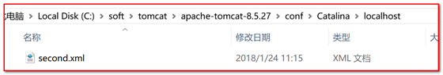
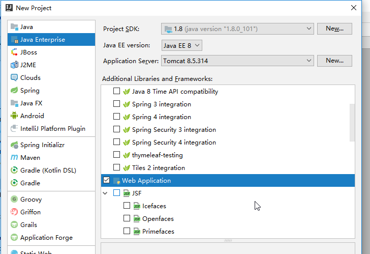
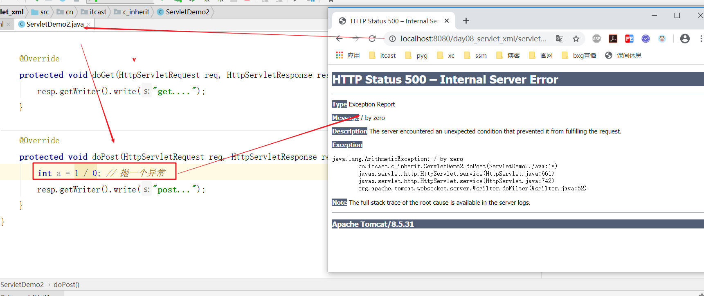

---

typora-copy-images-to: img
---

# day04-tomcat&servlet入门

## 学习目标

-[ ] 能够理解两种软件架构
-[ ] 能够理解WEB资源的概念
-[ ] 能够理解WEB服务器的概念
-[ ] 能够启动和关闭tomcat服务器
-[ ] 能够运用tomcat服务器发布WEB项目        【重点】
-[ ] 能够使用idea编写servlet                             【重点】
-[ ] 能够使用idea配置tomcat的方式发布项目 【重点】
-[ ] 能够使用注解开发servlet                               【重点】

# 课程内容介绍


## 第一章 web相关知识概述【了解】

### 1、WEB简介

Web（World Wide Web）即全球广域网，也称为万维网。它是一种基于超文本和HTTP的、全球性的、动态交互的、跨平台的分布式图形信息系统。是建立在Internet上的一种网络服务，为浏览者在Internet上查找和浏览信息提供了图形化的、易于访问的直观界面，其中的文档及超级链接将Internet上的信息节点组织成一个互为关联的网状结构。

简而言之就是我们平时上网浏览的网页，玩的网页游戏，上网下载资源。对于程序员而言就是前端知识、web服务器知识和数据库知识的结合就是web.

1. web发展阶段介绍

~~~
WEB1.0 开始于1994年.网页是用来阅读，传递信息。 【公司主导】
WEB1.0的任务，其主要特征是大量使用静态的 HTML 网页来发布信息，并开始使用浏览器来获取信息，这个时候主要是单向的信息传递。是将以前没有放在网上的人类知识，通过商业的力量，放到网上去；从内容产生者角度看,WEB1.0是商业公司为主体把内容往网上搬。并没有解决人与人之间沟通、互动和参与的需求，所以Web2.0应运而生。中国黄页
WEB2.0 网页用来交互的。【用户主导】 推出；平台
例如: 微博、淘宝，社区、交友网站、视频网站等等 。这类网站开发常用的技术：java,php，.net(微软技术体系 asp.net c#.net vb.net) 、ruby、python ...
Web2.0 则更注重用户的交互作用，用户既是网站内容的浏览者，也是网站内容的制造者。
~~~

2. JavaWeb概念说明

~~~
Javaweb: 用Java技术来解决相关web互联网领域的技术总和（Web前端+Web后台）。
简而言之: 用java技术开发web服务应用（软件）。比如：京东网站，就是用Java开发的。我们可以通过浏览器访问。
~~~


### 2、软件架构模式

​	生活中，我们从网络中获取资源的方式通常有两种：

~~~
1. 通过浏览器去访问网络资源（B/S）；Broswer / Server
2. 打开特定的软件访问网络资源(C/S)；Client /Server
~~~

​	例如，我们想要观看优酷视频就可以通过以下两种方式：

【方式一】通过浏览器搜索并观看


【方式二】打开优酷客户端搜索并观看


这两种方式对应的正是我们的两种软件结构模式：BS架构和CS架构。

**BS架构** 

B/S架构：又称Browser/Server架构，即浏览器和服务器架构模式。它是通过**浏览器** 和后台**服务器** 进行交互的，如淘宝，京东，12306，百度等等。

~~~
1. 优点：
   1. 用户只需要安装一个浏览器即可访问不同的服务器，不需要安装很多客户端，节约硬盘资源；
   2. 系统更新和升级比较方便；
   3. 跨平台优势；
2. 缺点：
   1. 动画效果受浏览器限制；
   2. 网站的压力集中在服务器端。
~~~

**CS架构**       

C/S架构：又称Client/Server架构，及客户端和服务器架构模式。它是通过**客户端** 和**服务器** 进行交互的，如QQ，迅雷，360，百度网盘等等。

~~~
1. 优点：
   1. 客户端效果炫，用户体验好；
   2. 客户端能够进行部分计算功能，减轻服务器的压力；
2. 缺点：
   1. 需要安装客户端，占用硬盘空间；
   2. 系统升级麻烦，需要安装很多升级包；
~~~

**发展前景** 

~~~
B/S是基于网页语言的、与操作系统无关，所以跨平台也是它的优势，而且以后随着网页语言以及浏览器的进步，B/S在表现能力上的处理以及运行的速度上会越来越快，它的缺点将会越来越少。比如，现在的HTML5，在图形的渲染方面以及音频、文件的处理上已经非常强大了。所以，B/S架构将是未来的软件架构趋势 。
~~~

【结论】B/S架构将是未来软件架构的趋势。

### 3、B/S和C/S通信模式

~~~
1、基于请求-响应交互模型
	浏览器(客户端)向服务器 发送一个请求
	web服务器向浏览器(客户端)回送 一个响应 
	一次请求、一次响应 
2、必须先有请求 再有响应 
3、请求和响应成对出现
~~~


注：B/S模型可以理解为一种特殊C/S模型。

### 4、WEB资源

​	通过浏览器从网络中访问的资源我们称之为WEB资源，这些资源可以分为两类：静态资源和动态资源。

~~~
1. 静态资源：  指web页面中供人们浏览的数据始终是不变的。无论何时，在任何人的电脑上访问，页面都是一样的。就是我们前面学习的前端内容。比如：HTML、CSS、JS、图片、音频、视频等。
2. 动态资源： 指web页面中供人们浏览的数据是由程序产生的，不同时间点访问web页面看到的内容各不相同。
比如：你在不同时间搜索微博的热门话题内容是不一样的，每天的天气情况也是变化的。每次访问购物网站登陆的时候，会显示我们自己的用户名等。这些数据由程序生成，JSP/Servlet、ASP等技术都可以完成。

总结：
	静态资源的数据都是写死在页面上的固定不变。
	动态资源，浏览器访问的结果是变化的（动态web资源就是你的数据都是程序读取数据库生成的数据）。
~~~

接下来主要学习动态web资源。

补充：

```
在之前我们学习javase的时候，我们知道运行要有main方法，因为他是程序的开始。而junit框架使用@Test注解提供入口可以让程序开始运行，仅仅只是为了测试而诞生的。
而从今天开始我们不会在书写main 函数，如果不测试那么也不会书写@Test注解，我们会使用浏览器访问我们书写的后台服务器，而浏览器页面中的每个按钮都可以看作为一个入口，只要点击每个按钮那么后台服务器就会接收前端页面的请求，后台服务器就会开始执行，并且将数据响应给浏览器。
```

### 5、URL请求路径

​	URL （Uniform Resource Locator） ，**统一资源定位符**是对互联网上资源位置的一种表示，互联网上的每个文件都有一个唯一的URL。
书写完整格式如下：

> **协议://ip或者域名:端口号/资源位置**
> **协议**，http、https、ftp等
> **域名**，域名或IP地址，能够帮我们定位到互联网上的某一台服务器
> **端口号**，端口号是一个应用程序在一台服务器上的编号。http协议的默认端口号：80
> **资源位置**，用于描述WEB资源在服务器上的位置
>
> **参数=值**，浏览器和服务器交互传递的数据。


如：

```
http://www.itcast.cn/
https://www.baidu.com/s?ie=UTF-8&wd=java
```


## 第二章  tomcat服务器

### 1、服务器概述

#### 1.1 服务器硬件【硬件】

~~~
	服务器，是提供计算服务的设备。由于服务器需要响应服务请求，并进行处理，因此一般来说服务器应具备承担服务并且保障服务的能力。
	服务器的构成包括处理器、硬盘、内存、系统总线等，和通用的计算机架构类似，但是由于需要提供高可靠的服务，因此在处理能力、稳定性、可靠性、安全性、可扩展性、可管理性等方面要求较高。
	在网络环境下，根据服务器提供的服务类型不同，分为文件服务器，数据库服务器，应用程序服务器，WEB服务器等。
~~~

【小结】可以把服务器理解成一台电脑主机，只不过这台电脑需要提供可靠的服务，因此在处理能力，稳定性，安全性方面要求更高。服务器只是一台设备，必须安装服务器软件才能提供服务。

#### 1.2 服务器软件【软件】

~~~
	服务器软件本质上是一个应用程序（由代码编写而成），运行在服务器设备上。能够接收请求并根据请求给客户端响应数据，发布资源(静态和动态)。
~~~


#### 1.3 常见的web服务器（软件）

1.  Tomcat：Apache组织提供一个免费开源的小型的服务器软件。支持Servlet和JSP规范,性能高。开源，免费，性能高。
2.  WebLogic：Bea公司的一个收费的大型的服务器软件，后被Oracle收购。支持EE的所有的规范
3.  WebSphere：IBM公司的一个收费的大型的服务器软件，支持EE的所有的规范。
4.  JBoss：是一个基于J2EE的开放源代码的应用服务器。JBoss核心服务不包括支持servlet/JSP的WEB容器，一般与Tomcat绑定使用。占用内存。


【注意】今天我们学习的是tomcat服务器。

#### 1.4、JavaEE规范

Java分为三个部分：

1. JavaSE 标准版的Java，开发一些客户端的程序，桌面应用程序。JavaTM Platform Standard Edition 
2. **JavaEE 企业版的Java，开发运行在服务器上程序，必须以JavaSE为基础。Enterprise Edition**
3. JavaME 用于嵌入式开发，手机移动端开发。不再使用。被安卓取代。

在Java中所有的服务器厂商都要实现一组Oracle公司规定的接口，这些接口是称为JavaEE规范。

不同厂商的JavaWeb服务器都实现了这些接口，在JavaEE中一共有13种规范。实现的规范越多，功能越强。


### 2、tomcat服务器

#### 2.1 简介

​	tomcat服务器是一个免费的开源的web应用服务器。是Apache软件基金会的Jakarta项目中的一个核心项目，由Apache，Sun和其他一些公司及个人共同开发而成。由于有了Sun的参与和支持，最新的Servlet和JSP规范总是能在Tomcat中得到体现。

​	因为tomcat技术先进，性能稳定，而且**免费**。因而深受Java爱好者的喜爱，是目前比较流行的Web应用服务器。

​	**【作用】** 运行web项目。

#### 2.2 下载

1. 官网地址：`https://tomcat.apache.org` 选择tomcat8.5版本。


2. 选择要下载的版本；


> 【tomcat软件类型介绍】
>
> tar.gz 文件 是linux和mac操作系统下的压缩版本
> zip文件是window操作系统下压缩版本（我们选择zip文件）

3. 下载完成；

 


#### 2.3 tomcat目录

  将下载的zip文件解压后，可以看到如下的目录结构：


~~~
bin：脚本目录
	启动脚本(启动服务器)：startup.bat
	停止脚本(停止服务器)：shutdown.bat

conf：配置文件目录 (config /configuration)
	核心配置文件：server.xml
	用户权限配置文件：tomcat-users.xml
	所有web项目默认配置文件：web.xml

lib：依赖库，tomcat和web项目中需要使用的jar包

logs：日志文件.
	localhost_access_log.txt tomcat记录用户访问信息，..表示时间。
	例如：localhost_access_log.2017-04-28.txt
	
temp：临时文件目录，文件夹内内容可以任意删除。

webapps：默认情况下发布WEB项目所存放的目录。

work：tomcat处理JSP的工作目录。 
~~~


#### 2.4 tomcat启动和访问

##### (1) 启动

​	双击tomcat解压目录/bin/**startup.bat** 文件即可启动tomcat。


##### (2) 访问

​	tomcat的默认端口为8080，所以在浏览器的地址栏输入：`http://ip:8080`即可访问tomcat服务器。 


##### (3)  关闭

1. 关闭startup.bat启动窗口；
2. 双击tomcat的/bin/shutdown.bat文件；
3. Ctrl+C；

#### 2.5 tomcat启动失败常见原因

##### (1)  JAVA_HOME 配置

​     如果没有配置JAVA_HOME环境变量，在双击“startup.bat”文件运行tomcat时，将**一闪立即关闭**。

​     解决方式：需要正确配置JAVA_HOME环境变量，指向JDK的bin目录的上一级目录；


##### (2）端口号冲突

​	一台拥有ip地址的主机上可以提供多个服务(启动多个软件)，每一个服务都有一个唯一的端口号。所以端口号不能重复。

【端口号冲突报错信息】

~~~
严重: Failed to initialize end point associated with ProtocolHandler ["http-bio-8080"]
java.net.BindException: Address already in use: JVM_Bind <null>:8080
...
Caused by: java.net.BindException: Address already in use: JVM_Bind
...
控制台将出现大量异常信息，描述的是8080端口被占用。
~~~

【解决方案】

1. 修改tomcat端口

  通过修改tomcat目录下conf/server.xml配置文件修改端口号。将8080修改成其他端口号。

~~~xml
<Connector port="8080" protocol="HTTP/1.1"
               connectionTimeout="20000"
               redirectPort="8443" />
~~~

2.端口号占用

``` java
打开dos窗口，在dos窗口中输入如下命令：
netstat –nao
```


找到8080端口的软件的PID.然后，使用任务管理器---->选择详细信息---->查看pid为13144（查询出来的 值），关闭结束进程即可.


### 3、web项目

​	tomcat已经安装完成，我们启动tomcat后就能够通过ip地址和端口访问到这台服务器了。但是，我们通过访问`http://ip:8080`  看到的页面只是tomcat提供的一个页面。真实生活中，百度和淘宝可能使用的服务器都是tomcat，但是我们访问百度和淘宝看到的却是不同的页面，这是因为我们访问的是百度和淘宝各自运行在tomcat中的web项目。


JavaWeb项目与java项目的区别：

* java项目：后台代码；例如之前的javase.
* JavaWeb项目：前端代码+后台代码；

#### 3.1 使用tomcat发布JavaWeb项目

我们的JavaWeb项目开发完成之后，必须发布到tomcat中，并启动tomcat才能够被用户访问到。将我们的JavaWeb项目发布到tomcat有如下两种方式。

##### 方式一：企业中项目部署方式

###### 【1】直接发布   

```
1. 将web项目复制到tomcat的webapps目录下：
说明：我们在tomcat中发布的web项目都会存在于webapps文件夹下，如果这里使用手动发布项目，我们可以先在webapps文件夹下创建一个文件夹heima作为项目名,然后在heima文件夹下新创键一个index.html页面作为该项目的主页，然后输入内容，启动tomcat服务器即可。具体步骤如下所示：
```

**1.在webapps文件夹下新创建一个文件夹heima作为项目名**


**2.在heima文件夹下新创键一个index.html页面，并输入如下内容：**

```
<html>
	<body>
		<h1>我的第一个JavaWeb项目</h1>
	</body>
</html>
```


**3.启动tomcat服务器：双击bin目录下的startup.bat文件**


**4.访问：http://ip:端口号/项目名/资源路径**

访问web目录下的index.html的url为：`http://localhost:8080/heima/index.html` 


补充：我们发现当我们在浏览器地址栏中不输入heima项目下的index.html也可以访问主页面中的内容，如下图所示：


原因：当我们启动tomcat服务器的时候，在tomcat服务下的conf文件夹下有个配置文件叫做web.xml.这个文件中有如下代码：

```
 <welcome-file-list>
        <welcome-file>index.html</welcome-file>
        <welcome-file>index.htm</welcome-file>
        <welcome-file>index.jsp</welcome-file>
  </welcome-file-list>
```

这些代码称为欢迎页面，当我们在访问项目的时候如果不输入页面的时候，那么就会默认访问项目下默认的欢迎页面，从上往下依次访问。访问顺序：index.html、index.htm、index.jsp。所以当我们在浏览器地址栏中不输入页面的时候就会访问欢迎页面。


###### 【2】虚拟路径发布

| 在conf/server.xml文件的host元素中配置Context(上下文)标签 |                    |
| -------------------------------------------------------- | ------------------ |
| **path**属性                                             | 虚拟访问目录的名称 |
| **docBase**属性                                          | Web应用所在目录    |

好处：项目不需要发布在webapps下，因为webapps项目越多，导致tomcat启动越慢。

案例：发布项目到e:\MyWeb\下，index.html文件

找到server.xml文件中148行，host元素，写下面的代码：

~~~xml
<Host name="localhost"  appBase="webapps"
            unpackWARs="true" autoDeploy="true">

        <!-- SingleSignOn valve, share authentication between web applications
             Documentation at: /docs/config/valve.html -->
        <!--
        <Valve className="org.apache.catalina.authenticator.SingleSignOn" />
        -->

        <!-- Access log processes all example.
             Documentation at: /docs/config/valve.html
             Note: The pattern used is equivalent to using pattern="common" -->
        <Valve className="org.apache.catalina.valves.AccessLogValve" directory="logs"
               prefix="localhost_access_log" suffix=".txt"
               pattern="%h %l %u %t &quot;%r&quot; %s %b" />
    	<!--上下文路径，path表示访问地址，docBase表示要访问页面所属文件夹-->
		<Context path="/aaa" docBase="e:\MyWeb"/>
      </Host>                       
~~~

启动tomcat服务器，然后在浏览器上测试：http://localhost:8080/aaa/index.html

     

######   【3】独立的xml配置

idea中默认是这种访问方式

 第一步：在tomcat/conf目录下新建一个Catalina目录（如果已经存在无需创建）     

                            

第二步：在Catalina目录下创建localhost目录   

 

第三步：在localhost中创建xml配置文件，名称为：second（**注：这个名称是浏览器访问路径，随便定义**）   

 

第四步：添加xml文件的内容为：

~~~xml
<?xml version="1.0" encoding="UTF-8" ?>
<Context docBase="E:/MyWeb" reloadable="true"/>
~~~

说明： reloadable="true"表示可以重复加载。

第五步：在e:/MyWeb/下创建index.html，访问测试


##### 方式二：IDEA配置tomcat直接发布项目

我们要想在idea中将项目发布到tomcat中，首先我们要先创建web项目。

###### 1.使用idea创建JavaWeb项目

**【第一步】**  File---New---Project

 

**【第二步】** 选择Java Enterprise版本，选择jdk8,然后配置tomcat。

说明：从今天开始，我们开始使用jdk8，因为jdk11对于一些软件时不兼容的，例如tomcat，学到后面会报各种异常，后面的项目都是使用jdk8.现在企业主流也是jdk8.


选择Tomcat Server之后，在弹出的框中选择tomcat的安装路径。

 

**注意：这里关联的tomcat home指的是tomcat的解压目录（bin目录的上一级目录）；**

 

**【第三步】** 选择使用模板创建项目


**【第四步】** 填写项目名，并为这个web项目配置tomcat


将tomcat配置到项目中。 


**【第五步】** 创建完成，项目结构如下所示：

 


**注意：如果创建项目没有web文件夹,那么在创建项目的时候按照如下选择Web Application即可**





WEB项目结构如下：


src:存放.java源文件。

web:存放静态资源(html,css,js)和jsp的。

WEB-INF:(这个目录下的文件不能通过浏览器直接访问)

​	1.web.xml:当前web项目的核心配置文件，可以管理整个web项目。创建完web项目自动生成的。Servlet2.5必须有。Servlet3.0注解开发可以省略。

​	**2.lib:当前web项目所需要的第三方的jar包存放的位置。需要手动创建一个文件夹lib.**

​	3.classes: .java源文件编译后生成的class文件存放的位置。不用手动创建，运行程序会自动生成该文件夹并且将.java源文件对应的.class文件自动放到该文件夹下。


###### 2.在创建好的web项目下新创键index.html页面


在index.html页面中输入如下内容：

```
<!DOCTYPE html>
<html lang="en">
<head>
    <meta charset="UTF-8">
    <title>Title</title>
</head>
<body>
    <h1>在idea中创建的第一个javaweb项目</h1>
</body>
</html>
```

###### 3.在idea中启动tomcat服务器，部署web项目

第一步：配置JRE

​	在Run Configurations中，选择JRE。


第二步：启动项目


【注】图标1是正常启动，图标2是Debug模式启动

​	启动成功之后，会自动弹出index.html页面

​	


当然我们也可以在页面浏览器地址栏中按照如下访问：


**补充：当我们已经将tomcat启动了，当再次点击绿色三角即启动tomcat按钮的时候会出现如下所示的框：**


Update resources:修改静态资源页面时，选择这个可以将修改后的静态资源页面部署到tomcat服务器上。

Update  classes and resources:这里其实功能和第一个一样。

Redeploy: 表示.java源文件改变时重新部署代码，重新部署。

Restart server:表示.java源文件改变时重新部署代码，重新部署。关闭服务器和开启服务器。效率比较低。


####  3.2页面资源热更新

对于静态页面每次修改之后都要重新部署，所以我们可以在idea中配置页面资源热更新，这样每次修改静态页面之后就不会在重新部署了。


## 第三章  Servlet入门

1. 客户端（浏览器）发送的数据会被提交到服务器；
2. 服务器必须具备：1.接收请求数据；2.处理请求数据(业务逻辑的处理)；3.给浏览器生成响应信息的能力；
3. tomcat服务器遵从了JavaEE规范，Sun公司制定的动态资源规范Servlet实现这个功能；（运行在服务器端，能够接收用户请求，处理请求数据和给浏览器生成响应信息）
4. 在java的世界里制定规范往往是接口来实现的，所以Servlet是一个接口，里边只是定义了一些方法；
5. 如果，我们对这个接口进行具体的实现，就能够完成对用户数据的接收，处理和生成响应信息；


### 1、什么是Servlet

~~~
Servlet 是Server applet 简称，表示服务程序.是运行在服务端的Java小程序，是sun公司提供一套规范，用来处理客户端请求、响应给浏览器的动态web资源。其实servlet的实质就是java代码，通过java的API动态的向客户端输出内容，并且从客户端接收数据。

~~~

**Servlet** 的作用：

1. **接收请求** ：接收客户端发送的请求数据；
2. **业务逻辑的处理**；
3. **响应结果** ：将处理结果响应给客户端（浏览器）；

### 2、Servlet入门开发步骤和代码案例

```java
之前我们一直学习将html页面发布到tomcat服务器中，然后用户通过浏览器访问html页面，其实用户也可以通过
浏览器访问java的类，要想让用户能够访问到我们书写的java类，可以按照如下做法：
1.java类希望让用户通过浏览器访问，需要将被访问的类实现规范(接口)，这个规范(接口)称为Servlet。
这里不需要导入jar包，因为tomcat软件已经集成。
2.创建一个java类实现Servlet接口
3.由于Servlet属于接口，肯定有抽象方法，所以要求自定义实现类实现接口中的所有抽象方法
主要是Servlet接口中的service方法，service方法主要是用来处理来自客户端的服务的
4.操作完成之后，客户端要想访问该类，必须使用Tomcat服务器帮助我们发布项目，需要通知tomcat，已经创建好了
一个类，可以供外部访问
```

代码如下：

```java
public class HelloWorldServlet implements Servlet{
    /*
        处理客户端的服务
     */
    @Override
    public void service(ServletRequest servletRequest, ServletResponse servletResponse) throws ServletException, IOException {
        System.out.println("service......");
    }
    @Override
    public void init(ServletConfig servletConfig) throws ServletException {}
    @Override
    public ServletConfig getServletConfig() {return null;}
    @Override
    public String getServletInfo() { return null;}
    @Override
    public void destroy() {}
}
```

```java
5.发布项目，启动项目,使用浏览器访问这个类；
在浏览器中输入：http://localhost:8080/HelloWorldServlet
```


如上图所示，按照上述访问方式我们是访问不到类的。
那么怎么才能让浏览器客户端访问到我们自己书写的类呢？
将我们书写的类配置到web项目的核心配置文件web.xml中就可以实现客户端访问到类。

那么需要在web.xml中书写如下内容：

```java
	<servlet>
        <servlet-name>helloWorldServlet</servlet-name>
        <servlet-class>com.itheima.sh.quickstart_01.HelloWorldServlet</servlet-class>
    </servlet>
    <servlet-mapping>
        <servlet-name>helloWorldServlet</servlet-name>
        <url-pattern>/hello</url-pattern>
    </servlet-mapping>
```

【**注意】** url-pattern 映射路径前面必须添加"/"；

对上述标签的解释如下所示：

```java
 <servlet>// 将自定义类注册给tomcat，其实就是通知tomcat,有一个类可以被外部访问
     <servlet-name></servlet-name> //类的一个别名，随便写，但是必须保证在当前web.xml文件中唯一
     <servlet-class></servlet-class> //全限定类名 ，tomcat获得类可以帮助我们实例化对象，调用类中的方法。tomcat底层使用反射创建对象
      //对象.方法
  <servlet-mapping> //映射路径，给访问的类加路径
      <servlet-name></servlet-name> //上面配置的别名，必须匹配已经存在的名称
      <url-pattern></url-pattern> //被访问的路径，浏览器最后输入的访问路径，
      例如：http://localhost:8080/hello
```


访问路径为：`http://ip:8080/hello` 

【注意事项】

 使用idea创建的web项目，可以通过配置，访问路径中不需要添加项目名，具体配置如下：


### 3、Servlet执行流程分析

​	之前的java项目中，我们运行一段程序都是使用main方法来运行的。Servlet中没有main方法，那它是怎么运行的呢？


说明：

1.当我们点击run运行的时候，tomcat之所以会启动，是因为程序入口(main方法)在tomcat中

2.tomcat开始运行，会加载web项目里面的配置文件web.xml(xml解析，读取数据)

​		主要是根据url-pattern 找到对应的servlet-class

3.然后tomcat进入等待状态(永不停止，除非手动关闭)

4.当用户在浏览器中输入地址：http://localhost:8080/hello就会定位到tomcat的访问的项目下面的某个servlet中

5.tomcat会根据 /hello 的servlet的虚拟路径 找到HelloServlet的全限定名

6.tomcat底层通过反射创建HelloServlet的对象，并调用HelloServlet的service方法：

~~~java
Class clazz = Class.forName("全限定名");
Servlet servlet = clazz.newInstance();//实际上HelloServlet对象，向上转型
servlet.service();
~~~


### 4、Servlet编程优化

​	我们发现在上述的HelloWorldServlet中，实现Servlet接口后能够接收浏览器发送的请求。由于Servlet是一个接口，我们实现接口后必须重写接口中所有的抽象方法。但是，我们在接口请求和响应数据的时候只需要一个service方法就足够了。所以，我们需要有选择地实现父接口中的方法。那么我们怎样做才能实现使用哪个方法就重写哪个方法呢？

​	我们可以在定义一个类GenericServlet来实现Servlet接口，这个类重写接口中的所有的抽象方法，然后让我们自定义类继承GenericServlet类，这样就可以只重写需要的方法了


​	

#### 4.1 方案一：GenericServlet优化方案

##### (1) GenericServlet简介

> GenericServlet类是一个抽象类，它实现了多个接口，其中有一个是Servlet，所以它重写了Servlet接口中的所有方法。我们只需要继承GenericServlet类，重写其中的service方法即可。

  

##### （2）为什么要继承GenericServlet

1. GenericServlet实现了Servlet接口，我们继承GenericServlet之后相当于间接实现了Servlet接口；
2. GenericServlet中给我们提供了很多通用方法，这些方法已经帮我们实现了很多功能，继承GenericServlet之后可以直接调用这些方法，所以说，GenericServlet相对于Servlet，进行了功能的扩展和衍生；
3. GenericServlet是一个抽象类，里边只有一个抽象方法service()，我们继承GenericServlet之后只需要重写service()方法处理具体的业务逻辑即可，减少了直接实现Servlet接口带来的代码冗余；


##### （3） 案例：使用GenericServlet优化Servlet接口编程

**需求分析** ：使用GenericServlet重写入门案例

**技术分析** ：

     1. 创建一个普通的java类继承GenericServlet；
     2. 在web.xml中配置这个GenericServlet的子类；
     3. 重写service方法，在service方法中完成接收从浏览器请求数据的功能；

**实现步骤** ：

1. 编写一个普通的java类，ServletDemo1，继承GenericServlet；

~~~java
package com.heima.servlet;

import javax.servlet.GenericServlet;
import javax.servlet.ServletException;
import javax.servlet.ServletRequest;
import javax.servlet.ServletResponse;
import java.io.IOException;

/**
 * @author suoge
 */
public class ServletDemo1 extends GenericServlet {
    @Override
    public void service(ServletRequest req, ServletResponse res) throws ServletException, IOException {
        
    }
}
~~~

2. 在web.xml配置ServletDemo1；

~~~xml
    
    <servlet>
        <servlet-name>ServletDemo1</servlet-name>
        <servlet-class>com.heima.servlet.ServletDemo1</servlet-class>
    </servlet>
    <servlet-mapping>
        <servlet-name>ServletDemo1</servlet-name>
        <url-pattern>/demo1</url-pattern>
    </servlet-mapping>
~~~

3. 重写service方法，并在service方法中书写以下代码，完成接收从浏览器请求数据的功能；

~~~java
   @Override
 public void service(ServletRequest req, ServletResponse res) throws ServletException, 			IOException {
        System.out.println("GenericServlet...");
  }
~~~

4. 启动tomcat并访问：

    


#### 4.2 方案二：HttpServlet优化方案

问题：

~~~
	在实际的生活中，客户端（浏览器）给我们发送的请求往往是HTTP协议下的请求，所以我们只需要处理HTTP的请求和响应即可。也就是说我们需要的只是一个与HTTP协议相关的Servlet。
~~~

解决方案：

~~~
Sun公司为我们提供了HttpServlet,对GenericServlet再次进行扩展和功能加强。

实际开发中：我们编写Servlet就可以采用 继承HttpServlet来完成servlet的开发,这样的Servlet我们可以获取更多的业务功能。
~~~

##### （1）HttpServlet简介：

​	HttpServlet是GenericServlet的一个子类。这个类是专门帮我们处理与HTTP协议相关的请求与响应的一个Servlet类，它里边的方法如下：

 

​	因为，在我们的日常生活中最常用的HTTP请求只有get请求和post请求。所以我们在继承了HttpServlet之后只需要重写里边的doGet()方法和doPost()方法即可满足我们的需求：

##### （2）为什么要继承HttpServlet

1. HttpServlet继承了GenericServlet，功能比GenericServlet更强大；
2. GenericServlet中处理不同的请求都使用service()方法，HttpServlet根据不同的请求方式提供了不同的方法进行处理。等于是细化了service()方法；
3. HttpServlet类中的方法参数为HttpServletRequest对象和HttpServletResponse对象。使用这两个对象的好处在于：
   1. HttpServletRequest接口继承了ServletRequest接口，HttpServletResponse接口继承了ServletResponse接口。功能更强大；
   2. HttpServletRequest接口和HttpServletResponse接口为我们提供了很多处理HTTP协议相关的API，HTTP协议正是我们日常生活中使用得比较多的一种协议；


##### （3）HttpServlet编程

【Servlet优化二】HttpServlet编程

~~~java
/**
 * @author suoge
 */
public class FormServlet extends HttpServlet{
    @Override
    protected void doGet(HttpServletRequest req, HttpServletResponse resp) throws ServletException, IOException {
        System.out.println("处理get请求提交的数据.................");
    }

    @Override
    protected void doPost(HttpServletRequest req, HttpServletResponse resp) throws ServletException, IOException {
        System.out.println("处理post请求提交的数据..................");
    }
}
~~~

##### （4）请求是怎么到达doGet（）和doPost()的

​	在我们继承HttpServlet之后，重写了doGet()和doPost()方法。浏览器发送的get请求会被doGet()接收并处理，浏览器发送的post请求会被doPost()请求接收并处理。服务器端是怎么辨别我的请求是get还是post请求的呢？下面，我们看一下HttpServlet的源码中的service方法：

1. 实际处理请求的还是HttpServlet的service()方法；
2. service方法中，接收请求之后获取了请求方式，

~~~java
 protected void service(HttpServletRequest req, HttpServletResponse resp)
        throws ServletException, IOException {
		
        //获取数据的请求方式
        String method = req.getMethod();
		//根据请求方式的不同，调用不同的方法
        if (method.equals(METHOD_GET)) {
            long lastModified = getLastModified(req);
            if (lastModified == -1) {
                //调用doGet()方法
                doGet(req, resp);
            } else {
                long ifModifiedSince;
                try {
                    ifModifiedSince = req.getDateHeader(HEADER_IFMODSINCE);
                } catch (IllegalArgumentException iae) {
                    // Invalid date header - proceed as if none was set
                    ifModifiedSince = -1;
                }
                if (ifModifiedSince < (lastModified / 1000 * 1000)) {
                    maybeSetLastModified(resp, lastModified);
                    doGet(req, resp);
                } else {
                    resp.setStatus(HttpServletResponse.SC_NOT_MODIFIED);
                }
            }

        } else if (method.equals(METHOD_HEAD)) {
            long lastModified = getLastModified(req);
            maybeSetLastModified(resp, lastModified);
            doHead(req, resp);
		//调用doPost()方法
        } else if (method.equals(METHOD_POST)) {
            doPost(req, resp);

        } else if (method.equals(METHOD_PUT)) {
            doPut(req, resp);

        } else if (method.equals(METHOD_DELETE)) {
            doDelete(req, resp);

        } else if (method.equals(METHOD_OPTIONS)) {
            doOptions(req,resp);

        } else if (method.equals(METHOD_TRACE)) {
            doTrace(req,resp);

        } else {
             String errMsg = lStrings.getString("http.method_not_implemented");
            Object[] errArgs = new Object[1];
            errArgs[0] = method;
            errMsg = MessageFormat.format(errMsg, errArgs);

            resp.sendError(HttpServletResponse.SC_NOT_IMPLEMENTED, errMsg);
        }
    }
~~~

说明：HttpServletRequest接口中的方法getMethod()可以获取用户的请求方式：

​	get请求：该方法获取字符串“GET”

​	post请求：该方法获取字符串“POST”

自定义HttpServlet的代码：

```java
public abstract class HttpServlet extends GenericServlet {

    @Override
    public void service(ServletRequest servletRequest, ServletResponse servletResponse) throws ServletException, IOException {
        //强制类型转换
        HttpServletRequest request = (HttpServletRequest)servletRequest;
        HttpServletResponse response = (HttpServletResponse)servletResponse;
        this.service(request,response);
    }

    private void service(HttpServletRequest request, HttpServletResponse response) {
        //获取请求方式
        String method = request.getMethod();//GET POST
        if("GET".equals(method))
        {
            //get
            doGet(request,response);
        }else if("POST".equals(method))
        {
            //post
            doPost(request,response);
        }else
        {
            //其他请求
        }
    }

    protected void doPost(HttpServletRequest request, HttpServletResponse response) {
    }

    protected void doGet(HttpServletRequest request, HttpServletResponse response) {

    }
}
```

HttpServlet类的子类：

```java
public class FormServlet extends HttpServlet {
    @Override
    protected void doPost(HttpServletRequest request, HttpServletResponse response) {
        //post请求执行的方法
    }
    @Override
    protected void doGet(HttpServletRequest request, HttpServletResponse response) {
        //get请求执行的方法
        System.out.println("get.....");
    }
}
```


#### 4.3 Servlet编程优化小结


1. Servlet编程的作用：接收浏览器的请求，处理请求数据，给浏览器响应数据；
2. Servlet接口：
   1. Sun公司规定如果想要在服务端接收和响应客户端的数据，必须实现Servlet接口；
   2. 由于Servlet是一个接口，实现Servlet接口后必须重写其中所有的抽象方法；
3. GenericServlet：
   1. GenericServlet：是一个抽象类，它实现了Servlet接口，与协议无关；
   2. 继承GenericServlet，只需要重写service方法即可接收和响应数据；
4. HttpServlet：
   1. HttpServlet：是一个抽象类，它继承了GenericServlet，为HTTP请求定制的；
   2. 继承HttpServlet，重写doGet和doPost方法，能够更加方便地处理不同请求的数据；

**总结：**

方案二优化总结：

​	1.用户访问服务端都是http协议，使用HttpServlet专门来处理http协议的请求与响应，我们希望使用HttpServlet类的方法中的HttpServletRequest和HttpServletResponse，我们需要子接口，而之前给的是父接口ServletRequest和ServletResponse，所以需要强制类型转换。

​	2.之前无论是get还是post请求都是在service方法中处理，我们希望使用原子性思想，即如果是get请求就执行get方法，如果是post请求就执行post方法。对请求方式进行细分：

通过HttpServletRequest接口中的getMethod()方法来获取请求方式：

​	get请求，该方法获取GET字符串

​	post请求，该方法获取POST字符串


#### 4.4 经验值分享


##### ① 响应状态码405

请求方法没有重写.....

```html
	/*
        注意: 如果我们不重写doGet/doPost方法, 那么父类的doGet/doPost方法会执行(继承)
            给浏览器响应一个错误: 状态码405 (http1.1)
     */
```


 


##### ② 响应状态码500

java代码写错了...

 


### 5、Servlet生命周期

​	生命周期指的是一个对象从创建到销毁的过程。我们的Servlet是由谁创建的，何时创建的，创建之后做了哪些工作，工作完成之后又是何时销毁的呢？下面我们就来看一下Servlet的生命周期。

~~~
1. 谁创建：tomcat创建；
2. 何时创建：启动tomcat之后，在浏览器地址栏中第一次访问这个Servlet的时候，tomcat使用反射技术创建了当前访问servlet的对象。当前servlet对象只会被创建一次，创建完成后使用对象调用init()方法来初始化当前servlet；
3. 创建之后做了哪些工作：每次请求到这个Servlet时，由service方法处理请求和响应信息；
4. 何时销毁：服务器正常关闭，销毁前会调用destory()方法；
~~~

**注意：**

**1、tomcat创建servlet的对象，使用反射技术调用的是自定义servlet中的无参构造方法，所以自定义servlet中必须含有无参构造方法**

**2、初始化的目的是为了让Servlet对象在处理客户端请求前完成一些初始化的工作，如建立数据库的连接，获取配置信息等。对于每一个Servlet实例，init()方法只被调用一次。**(这里我们先了解)

**3、当关闭tomcat服务器的时候，tomcat就会使用servlet的对象调用servlet的destroy()方法，以便让该实例可以释放它所使用的资源，保存数据到持久存储设备中，该实例随后会被Java的垃圾收集器所回收。如果再次需要这个Servlet处理请求，Servlet容器会创建一个新的Servlet实例。**

【测试代码】

~~~java
public interface Servlet {
    /*
    * Servlet对象创建后,使用对象立刻调用init()方法，只调用一次
    */
    public void init(ServletConfig config) throws ServletException;

    /*
    * Servlet对象创建后，每次的请求都由service方法处理
    */
    public void service(ServletRequest req, ServletResponse res)
            throws ServletException, IOException;

    /*
    * Servlet对象销毁前会调用destory方法。主要是用于释放一些资源。
    */
    public void destroy();
}
~~~

【实现类】

~~~java
package com.heima.user.web;
import javax.servlet.*;
import java.io.IOException;
public class LifeCycleTestServlet implements Servlet {
	
    public LifeCycleTestServlet() {
        System.out.println("创建对象执行构造方法");
    }
  
    @Override
    public void init(ServletConfig servletConfig) throws ServletException {
        System.out.println("init.....");
    }


    @Override
    public void service(ServletRequest servletRequest, ServletResponse servletResponse) throws ServletException, IOException {
        System.out.println("service.....");
    }

    @Override
    public void destroy() {
        System.out.println("destroy.....");
    }


    @Override
    public ServletConfig getServletConfig() {
        return null;
    }
    @Override
    public String getServletInfo() {
        return null;
    }
}
~~~

执行的结果如下：


【小结】

```java
1. Servlet对象的创建：
	1. 创建者：tomcat；创建时机：在Servlet第一次被访问的时候；
	2. 特点：
		1. 只会创建一次（单例）；
		2. 对象创建完成之后，会调用init()方法；
2. Servlet运行：
	1. service()方法接收用户的请求，和处理响应；
	2. 特点：
		1. 每次对这个Servlet的访问都会由service()方法来处理；
		2. service()方法的两个参数：request和response对象专门用来处理请求和响应；
3. Servlet销毁：
	1. Servlet对象在服务器正常关闭的时候销毁；
	2. 特点：
		1. 销毁的时候会调用destory()方法；
```


### 6.服务器启动，立刻加载Servlet对象	

`问题`：普通的Servlet对象在我们第一次访问的时候创建， 开发中，如果我们需要在服务器启动的时候，初始化Servlet对象应该如何编写呢？

`需求`：服务器tomcat启动，立刻加载配置文件，获取配置文件信息，为项目后续代码提供数据支持。

`解决`：此时的业务场景，我们需要在`web.xml文件中`给指定的Servlet添加一个标签`<load-on-startup>`

`实现步骤`:在`web.xml`中在**<servlet></servlet>标签内部中配置**:

<load-on-startup>**2**</load-on-startup>  --- 传入正整数,整数越小,被创建的优先级就越高。12345

举例：上述我们在演示servlet的生命周期的时候，创建了LifeCycleServlet，如下：

```java
public class LifeCycleTestServlet implements Servlet {

    public LifeCycleTestServlet() {
        System.out.println("创建对象执行构造方法");
    }
  
    @Override
    public void init(ServletConfig servletConfig) throws ServletException {
        System.out.println("init.....");
    }


    @Override
    public void service(ServletRequest servletRequest, ServletResponse servletResponse) throws ServletException, IOException {
        System.out.println("service.....");
    }

    @Override
    public void destroy() {
        System.out.println("destroy.....");
    }


    @Override
    public ServletConfig getServletConfig() {
        return null;
    }
    @Override
    public String getServletInfo() {
        return null;
    }
}
```

如果我们想在tomcat服务器一启动的时候就初始化servlet对象，我们可以在web.xml文件中按照如下配置：

```xml
<servlet>
      <servlet-name>lifeCycleServlet</servlet-name>
      <servlet-class>com.itheima.sh.lifecycle_04.LifeCycleServlet</servlet-class>
      <!--优先级是2-->
      <load-on-startup>2</load-on-startup>
 </servlet>
 <servlet-mapping>
      <servlet-name>lifeCycleServlet</servlet-name>
      <url-pattern>/life</url-pattern>
 </servlet-mapping>
```

注意：

对于<load-on-startup>**2**</load-on-startup>  --- 传入正整数,整数越小,被创建的优先级就越高。12345

优先级越高，服务器启动的时候就越先被初始化。


### 7、 Servlet映射路径配置规范

在web.xml核心配置文件的标签：<url-pattern></url-pattern>中的映射路径配置存在以下几种方式：

~~~html
1. 完全匹配  		 /user/hello		  资源路径为/user/hello时可以访问
2. 目录匹配			/user/*				 资源路径中含有/user目录均可访问
3. 后缀名匹配	    *.do			     资源路径中以.do结尾的均可访问
4. 缺省路径			/			         访问的路径找不到，就会去找缺省路径
tomcat获得匹配路径时，优先级顺序：1 >2 > 3 > 4
~~~

**注意：开发中一般使用完全匹配，即一个Servlet对应一个映射路径。**

#### 1、完全路径匹配

完全路径匹配就是在映射路径这里<url-pattern></url-pattern>配置什么就在浏览器地址栏访问什么。代码演示如下所示：

创建一个PathOneServlet继承GenericServlet，代码如下：

```java
public class PathOneServlet extends GenericServlet {
    @Override
    public void service(ServletRequest servletRequest, ServletResponse servletResponse) throws ServletException, IOException {
        System.out.println("PathOneServlet......");
    }
}
```

web.xml配置文件中的代码：

```xml
<servlet>
      <servlet-name>pathOneServlet</servlet-name>
      <servlet-class>com.itheima.sh.pathservlet_05.PathOneServlet</servlet-class>
 </servlet>
 <servlet-mapping>
      <servlet-name>pathOneServlet</servlet-name>
      <!--全路径访问-->
      <url-pattern>/user/path</url-pattern>
  </servlet-mapping>
```

注意：/user/path 这里书写的内容不固定，也就是说不一定是user或者path。随便定义。

浏览器地址栏访问：


#### 2、目录匹配

目录匹配	：/user/*

说明：

​	1）当前路径以及子路径都可以访问到servlet。也就是说只要资源路径中含有/user目录均可访问servlet。

​	2）上述路径不一定是user，内容随便书写。

创建一个PathTwoServlet继承HttpServlet

```java
public class PathTwoServlet extends HttpServlet {
    @Override
    protected void doGet(HttpServletRequest req, HttpServletResponse resp) throws ServletException, IOException {
        System.out.println("PathTwoServlet。。。");
    }
}
```

web.xml配置文件中的代码：

```xml
<servlet>
      <servlet-name>pathTwoServlet</servlet-name>
      <servlet-class>com.itheima.sh.pathservlet_05.PathTwoServlet</servlet-class>
 </servlet>
 <servlet-mapping>
      <servlet-name>pathTwoServlet</servlet-name>
      <!--目录匹配访问-->
      <url-pattern>/user/*</url-pattern>
 </servlet-mapping>
```

浏览器地址栏访问：

只要在浏览器地址栏中输入的地址前面是http://localhost:8080/user，后面的内容随便写。

http://localhost:8080/user

或者

http://localhost:8080/user/kajaja/alakal

idea的控制台输出结果：

```
PathTwoServlet。。。
PathTwoServlet。。。
```

#### 3、后缀名匹配

后缀名匹配:*.do.只要资源路径中以.do结尾的均可访问servlet.

创建一个PathThreeServlet继承GenericServlet，代码如下所示：

```java
public class PathThreeServlet extends GenericServlet {
    @Override
    public void service(ServletRequest servletRequest, ServletResponse servletResponse) throws ServletException, IOException {
        System.out.println("PathThreeServlet....");
    }
}
```

web.xml配置文件中的代码：

```xml
 <servlet>
        <servlet-name>pathThreeServlet</servlet-name>
        <servlet-class>com.itheima.sh.pathservlet_05.PathThreeServlet</servlet-class>
    </servlet>
    <servlet-mapping>
        <servlet-name>pathThreeServlet</servlet-name>
        <url-pattern>*.do</url-pattern>
    </servlet-mapping>
```

注意：上述路径*.do。不一定是do，其他的内容也可以。

浏览器访问：

http://localhost:8080/jahahah/alakk.do

idea的控制台如下所示：

PathThreeServlet....

#### 4、缺省路径

缺省路径	: /	. 如果在浏览器输入访问servlet的路径在web.xml中不存在那么就会去找缺省路径。

创建PathFourServlet类继承GenericServlet：

```java
public class PathFourServlet extends GenericServlet {
    @Override
    public void service(ServletRequest servletRequest, ServletResponse servletResponse) throws ServletException, IOException {
        System.out.println("PathFourServlet....");
    }
}
```

web.xml配置文件中的代码：

```xml
  <servlet>
        <servlet-name>pathFourServlet</servlet-name>
        <servlet-class>com.itheima.sh.pathservlet_05.PathFourServlet</servlet-class>
    </servlet>
    <servlet-mapping>
        <servlet-name>pathFourServlet</servlet-name>
        <url-pattern>/</url-pattern>
    </servlet-mapping>
```

浏览器访问：http://localhost:8080/jahahah/alakkkajaajaj

访问的路径不存在，则找缺省路径。

idea控制台输出内容：

PathFourServlet....


### 8、 相对和绝对路径

- 现阶段我们访问资源的方式越来越多，请求路径在编写时难免出现混淆

1. 浏览器的地址栏 (输入服务器某个资源地址,敲回车会发送请求)
2. a标签的href属性 (超链接被点击的时候会发送请求)
3. form表单的action属性 (form中的submit按钮被点击的时候,发送请求)
4. js的loation.href属性 (只要设置, 触发相应的)

```html
<!DOCTYPE html>
<html lang="zh-CN">
<head>
    <meta charset="UTF-8">
    <title>path</title>

</head>
<body>
<h3>测试访问路径：http://localhost:8080/day08_servlet_xml/static/path.html</h3>

<h4>绝对路径</h4>
<!--
    在开发时，强烈建议使用绝对路径
    完整：协议://域名:端口/映射路径名/资源名
    推荐：/映射路径名/资源名 (省略了三要素,前提: 当前页面和所访问的资源必须在同一服务器上)
	注意绝对路径最前面需要加/
-->
<a href="http://localhost:8080/quickServlet">带http协议的绝对路径：quickServlet</a> <br>
<a href="/quickServlet">不带http协议的绝对路径：quickServlet</a>
<h4>相对路径路径</h4>
<!--
    相对路径语法：
        ./ 当前目录  注：./可以省略不写
        ../ 上级目录
	
-->
<a href="./quickServlet">相对路径：quickServlet</a>
</body>
</html>
```

说明：

对于相对路径不是看项目，而是看浏览器地址栏访问的资源路径。

举例：

~~~java
假设我们在浏览器地址栏访问的页面路径：
    http://localhost:8080/index.html
而在index.html页面想使用相对路径访问servlet：
    http://localhost:8080/hello
那么对于上述两个路径而言只有最后一级目录不一样，所以在index.html中直接使用 ./hello 表示在当前路径下查找hello的servlet，当然了这里./可以省略不写 直接书写 <a href="hello">相对路径：helloServlet</a>
~~~

总结：开发中建议书写绝对路径，如果层级比较多，相对路径书写太麻烦并且容易产生错误。


## 第四章  Servlet3.0注解开发

​	在我们上面创建的Servlet中，Servlet的配置信息都是在web.xml中完成的。如果，我们创建的Servlet非常多，就会导致web.xml中的配置非常臃肿，不便于管理。Servlet3.0为我们提供了注解支持，创建Servlet的时候。在这个Servlet类上面添加注解就可以完成Servlet的配置。这样对于创建的servlet类就不用在web.xml配置文件中配置了。接下来我们就开始学习Servlet3.0提供的注解支持。

### 1、Servlet3.0新特性

* 注解支持

  该版本新增了若干注解，用于简化 Servlet、过滤器（Filter）和监听器（Listener）的声明，这使得 web.xml 部署描述文件从该版本开始不再是必选的了。就是可以不再需要web.xml文件了。


### 2、为什么要使用注解

1. web.xml中配置过多servlet不便于管理，容易出错；
2. 注解开发使得开发更敏捷，效率更高；
3. 注解开发是公司未来开发的一种趋势；


### 3、使用IDEA创建3.0版本的Servlet

​	IDEA（2017版本）创建的Servlet默认是3.0版本的，所以我们只需要新建一个Servlet，然后用注解配置即可。具体步骤如下：

#### 第一步：新建一个Servlet；

​	在包上面点击鼠标右键New-->Servlet


给这个Servlet取个名，然后点击OK

 


#### 第二步：配置Servlet

​	创建完成后，Servlet类上面会默认添加一个注解`@WebServlet(name="Servlet3Demo")` 。这个`@WebServlet`注解就是用来配置当前这个Servlet的。这个注解中常用的有两个属性：

1. name属性： 相当于web.xml的 <servlet-name>；
2. urlPatterns属性： 编写访问servlet的路径  类似于 <url-pattern>   

所以，我们需要手动在`@WebServlet` 注解中添加`urlPatterns`属性，来设置映射路径。

```java
package com.heima.servlet;

import javax.servlet.ServletException;
import javax.servlet.annotation.WebServlet;
import javax.servlet.http.HttpServlet;
import javax.servlet.http.HttpServletRequest;
import javax.servlet.http.HttpServletResponse;
import java.io.IOException;
/**
 * @author suoge
 * 1. name属性： 相当于web.xml的 <servlet-name>；
 * 2. urlPatterns属性： 编写访问servlet的路径  类似于 <url-pattern>
 */
@WebServlet(name = "Servlet3Demo",urlPatterns = "/servlet3")
public class Servlet3Demo extends HttpServlet {
    @Override
    protected void doPost(HttpServletRequest request, HttpServletResponse response) throws ServletException, IOException {

    }

    @Override
    protected void doGet(HttpServletRequest request, HttpServletResponse response) throws ServletException, IOException {

    }
}
```

#### 第三步：启动tomcat并访问

访问路径：`http://localhost:8080/servlet3` ；

运行结果：


其实到这里我们已经完成了servlet3.0的注解开发。但是对于我们使用注解开发，我们只需要在浏览器输入@WebServlet注解中的属性urlPatterns 的属性值即可，我们不需要name属性，所以我们可以在idea中更改下servlet生成注解的模板代码。

### 4、优化

#### 4.1 优化一

基于IDEA的模板，快速创建Servlet。

【模板配置代码】

在idea中按照如下操作即可完成修改servlet的注解模板代码： 


说明：打开设置Settings--->搜索框输入tempplate---->找到 File and code Templates---->到右边点击other---->到下面选择Web----->然后选择Servlet Annotated Calss.java---->到原来的模板中只需要修改两个地方，一个是在doPost方法体中加入：doGet(request,response); 来调用doGet方法。

另外一个是将

WebServlet(name = "${Entity_Name} ")            

变为WebServlet("/${Entity_Name}")

**注意：不要将下面的所有的代码都复制你的idea中，只是修改两个地方即可。**

```java
#if (${PACKAGE_NAME} && ${PACKAGE_NAME} != "")package ${PACKAGE_NAME};#end
#parse("File Header.java")
@javax.servlet.annotation.WebServlet("/${Entity_Name}")
public class ${Class_Name} extends javax.servlet.http.HttpServlet {
    protected void doPost(javax.servlet.http.HttpServletRequest request, javax.servlet.http.HttpServletResponse response) throws javax.servlet.ServletException, java.io.IOException {
        doGet(request,response);
    }
    protected void doGet(javax.servlet.http.HttpServletRequest request, javax.servlet.http.HttpServletResponse response) throws javax.servlet.ServletException, java.io.IOException {

    }
}
```

#### 4.2 优化二

在doPost方法中调用doGet方法。这样我们的代码都在goGet()方法里写就可以了。


说明：上述做法的好处是无论前端浏览器是get还是post请求，我们都可以在doGet方法中完成代码的书写。否则在开发的时候有可能会导致是get请求却在doPost方法中完成的代码，或者是post请求却在doGet方法中完成的代码，导致我们无法看到代码完成的效果。

### 5、Servlet开发最终版本

~~~java
@WebServlet("/lastDemo")
public class LastDemoServlet extends HttpServlet {
    protected void doPost(HttpServletRequest request, HttpServletResponse response) throws ServletException, IOException {
        doGet(request,response);
    }

    protected void doGet(HttpServletRequest request, HttpServletResponse response) throws ServletException, IOException {

    }
}
~~~

**小结：**

~~~tex
1、Servlet3.0注解开发小结：
	第一步：创建一个普通类继承HttpServlet，重写doGet和doPost方法；
	第二步：在类上面添加注解 @WebServlet；
	第三步：配置注解@WebServlet的值（映射路径）；

2、@WebServlet注解配置简介：
	【1】简单配置：@WebServlet("/annDemoServlet") 注解的默认值为value值，就等价于web.xml中<url-pattern>/annDemoServlet</url-pattern>；
	【2】其他配置：@WebServlet(name = "AnnDemoServlet",urlPatterns = "/annDemoServlet") 其中的
			name属性值等价于web.xml中<servlet-name>AnnDemoServlet</servlet-name>的值
			urlPatterns的属性值等价于web.xml中<url-pattern>/annDemoServlet</url-pattern>的值
3、注意事项：web.xml配置方式和注解只能使用一种，以后统一使用注解开发。
~~~

WebServlet注解中的属性含义：


## 第五章 今日小结

~~~html
第一章、tomcat
	【1】tomcat：web服务器-运行web资源（静态资源+动态资源）
	【2】默认端口：8080
	【3】项目部署： 把项目交给tomcat运行
			企业应用：
				1、直接部署： 直接把web项目复制到webapps目录
				2、虚拟路径：  conf/server.xml==》 Host中<Context path="/aaa" docBase="E:\MyWeb" />
			     3、独立xml文件： conf/Catalina/localhost/  ==》 aa.xml ==>
					<Context  docBase="E:\MyWeb" reloadabl="true" />

			开发阶段：
				把tomcat配置到idea中，直接通过idea启动
第二章、servlet
	【1】Servlet：Sun公司制定的动态资源规范
				运行在web服务器中的，java程序。 接收用户请求，处理请求，响应数据；
	【2】Servlet入门开发：xml配置
			1、新建类，实现Servlet接口；
			2、重写所有抽象方法。在service方法中处理请求
			3、配置Servlet：
					<servlet>
                      		<servlet-name>HelloServlet</servlet-name>
                      		<servlet-class>com.heima....HelloServlet</servlet-class>
					</servlet>
					<servlet-mapping>
                      		<servlet-name>HelloServlet</servlet-name>
                      		<url-pattern>/hello</url-pattern>
					</servlet-mapping>

	【3】Servlet生命周期：
				创建时机：第一次访问时，被创建；------单例的
	【4】Servlet优化过程：
			实现接口（Servlet）
			继承抽象类（GenericServlet）
			继承抽象类（HttpServlet）
	【5】url-pattern配置规则：
		1、全路径匹配   /web/a
		2、目录名    /user/*   /*
		3、后缀名   *.xxx
		4、缺省路径   /
	
	【6】注解：
			@WebServlet(name="",value={"/demo1","/demo2"})
			@WebServlet("/queryAllServlet")

~~~


## 第六章 作业

学习目标：

1: 独立完成tomcat服务器安装和配置
2: 掌握idea工具发布web项目
3: Servlet程序开发。（掌握注解开发）


小作业：

1. 基于idea工具，创建web工程，注解完成servlet编写，启动项目，浏览器访问servlet！


