typora-copy-images-to: img

# day05-http&request

## 学习目标

-[ ] HTTP概述
-[ ] HTTP协议和组成
-[ ] HTTP请求
-[ ] HttpServletRequest学习
-[ ] 登录案例

请求体API

request域对象API

转发API

请求乱码API

转发四个特点

三层架构+接口 登陆案例

## 第一章 HTTP协议

​	我们平常上网都应该完成过登录的过程，那么，浏览器是如何将用户名和密码传送给服务器的？浏览器发送数据是随意发送的吗？其实浏览器和服务器通信是按照一定格式进行交互的。这就是协议！我们浏览器和服务器是按照HTTP协议进行数据交互的，HTTP协议分为请求协议和响应协议，通信就是一次请求，一次响应。

`什么是协议`：网络通信中，数据以固定的格式传输数据.
`HTTP协议`：超文本传输协议（HTTP，HyperText Transfer Protocol)是互联网上应用最为广泛的一种网络协议。

​                     简而言之：浏览器和服务器数据交换固定的格式。

请求协议：浏览器将数据以请求格式发送到服务器。

响应协议：服务器将数据以响应格式返回给浏览器。

以下是我们平时登录网站的过程分析，根据登录过程我们引出今日的知识点。

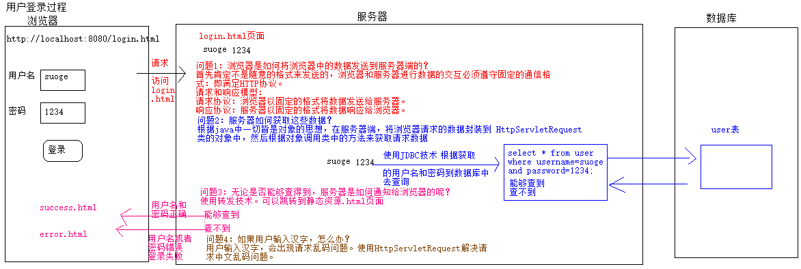

### 1、什么是HTTP协议

​	HTTP协议，全称"超文本传输协议(HyperText Transfer Protocol)"是互联网上应用最为广泛的一种网络协议。简而言之，就是一种在web中传输数据的格式。

注意：我们之前学习过TCP协议。Socket类是TCP协议。HttpServletRequest接口使用的HTTP协议。

HTTP协议

~~~html
超文本传输协议（HTTP，HyperText Transfer Protocol)是互联网上应用最为广泛的一种网络协议。 
所有的WWW文件(客户机/服务器网络)都必须遵守这个标准。设计HTTP最初的目的是为了提供一种发布和接收HTML页面的方法。
1960年美国人TedNelson构思了一种通过计算机处理文本信息的方法，并称之为超文本（hypertext）,这成为了HTTP超文本传输协议标准架构的发展根基。
Ted Nelson组织协调万维网协会（World Wide Web Consortium）和互联网工程工作小组（Internet Engineering Task Force ）共同合作研究，最终发布了一系列的RFC(一系列以编号排定的文件)，其中著名的RFC 2616定义了HTTP 1.1
协议版本：
- [x] HTTP/1.0，发送请求，创建一次连接，获得一个web资源，连接断开。
- [x] HTTP/1.1，发送请求，创建一次连接，获得多个web资源，连接断开。
~~~

### 2、HTTP协议的特点

~~~
1. 基于请求/响应模型的协议。请求和响应必须成对，先有请求后有响应。
~~~

浏览器是通过请求协议将数据传递到服务器，浏览器访问服务器几种方式： （了解一下），其中掌握的就是get和post方式，下面我们使用浏览器抓包工具来分析get和post请求有何不同。

| 请求方式 |                           请求说明                           |
| :------: | :----------------------------------------------------------: |
| OPTIONS  | 返回服务器针对特定资源所支持的HTTP请求方法。也可以利用向Web服务器发送'*'的请求来测试服务器的功能性。 |
|   HEAD   | 向服务器索要与GET请求相一致的响应，只不过响应体将不会被返回。这一方法可以在不必传输整个响应内容的情况下，就可以获取包含在响应消息头中的元信息 |
|   GET    | 向特定的资源发出请求(a href="servlet"标签/js  location.href="servlet"，在浏览器输入网址) |
|   POST   | 向指定资源提交数据进行处理请求（例如提交表单或者上传文件）。数据被包含在请求体中。POST请求可能会导致新的资源的创建或已有资源的修改 |
|   PUT    |                 向指定资源位置上传其最新内容                 |
|  DELETE  |            请求服务器删除Request-URI所标识的资源             |
|  TRACE   |           回显服务器收到的请求，主要用于测试或诊断           |
| CONNECT  |    HTTP/1.1协议中预留给能够将连接改为管道方式的代理服务器    |

虽然HTTP的请求方式有8种，但是我们在实际应用中常用的也**就是get和post**。

重点掌握：**get/post**

### 3、HTTP协议的结构

HTTP协议的结构包括两部分：请求报文，响应报文；

1. 请求报文：浏览器给服务器发送的请求数据的格式。请求报文主要包括：**请求行** ，**请求头** ，**请求体** 。
2. 响应报文：服务器给客户端（浏览器）响应的数据格式。响应报文主要包括：**响应行** ，**响应头** ，**响应体** ；

### 4、浏览器抓包观察请求报文

​       浏览器可以抓取请求的数据，但是现在的浏览器都对请求的参数在格式上进行了优化。如果想要看到原始的请求报文，需要使用到工具。本次课程使用chrome这个工具对请求数据进行抓取分析。

#### 4.1、抓包方法：

##### 4.1.1、在idea中创建html文件

【request01.html文件】

```html
<!DOCTYPE html>
<html lang="en">
<head>
    <meta charset="UTF-8">
    <title>Title</title>
</head>
<body>

<h2>GET请求</h2>
    <form action="/getServlet" method="get">
        用户名：<input type="text" name="username" value="zhangsan" /><br>
        密码：<input type="text" name="pwd" value="123" /><br>
        <input type="submit" value="提交"/>
    </form>


<h2>POST请求</h2>
    <form action="/postServlet" method="post">
        用户名：<input type="text" name="username" value="zhangsan"/><br>
        密码：<input type="text" name="pwd" value="123"/><br>
        <input type="submit" value="提交"/>
    </form>

</body>
</html>
```

##### 4.1.2、在idea中创建Servlet

GetServlet代码如下：

```java
@WebServlet("/getServlet")
public class GetServlet extends HttpServlet {
    protected void doPost(HttpServletRequest request, HttpServletResponse response) throws ServletException, IOException {
        doGet(request, response);
    }

    protected void doGet(HttpServletRequest request, HttpServletResponse response) throws ServletException, IOException {

    }
}
```

PostServlet代码如下：

```java
@WebServlet("/postServlet")
public class PostServlet extends HttpServlet {
    protected void doPost(HttpServletRequest request, HttpServletResponse response) throws ServletException, IOException {
        doGet(request, response);
    }
    protected void doGet(HttpServletRequest request, HttpServletResponse response) throws ServletException, IOException {

    }
}
```

##### 4.1.3、启动Tomcat服务器,打开Chrome  浏览器访问request01.html页面

【页面显示效果】

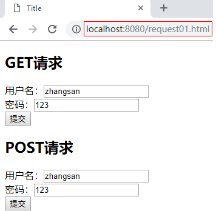

 **点击GET请求提交按钮，然后按下快捷键F12**

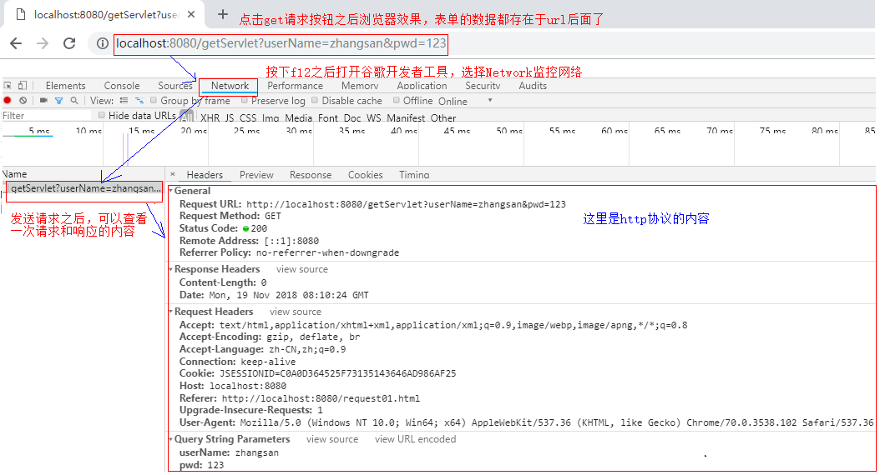

**点击POST请求提交按钮，然后按下快捷键F12**

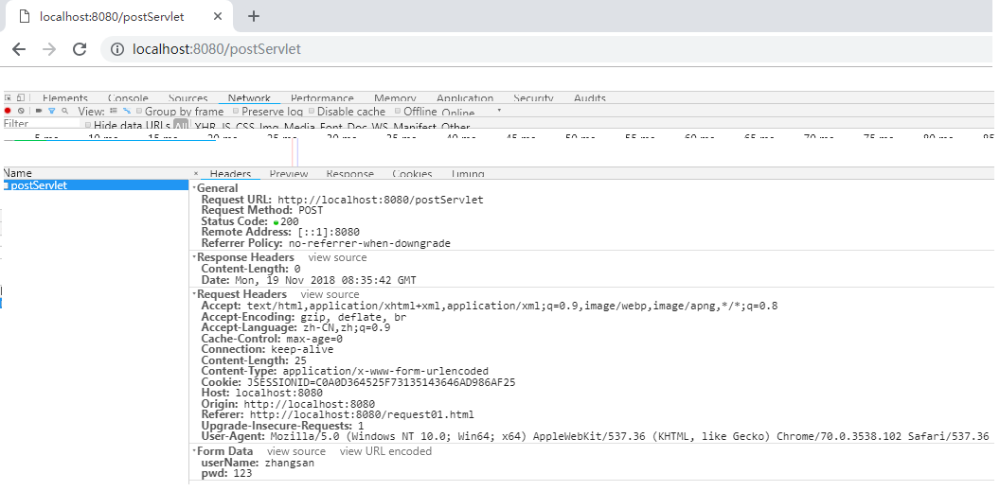

说明：post请求，我们发现表单中的数据没有存在于url后面。

##### 4.1.4、 分别以get和post方式提交表单并抓取数据

###### 【GET请求】请求报文

**请求行：**

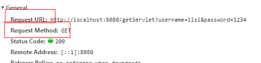

**请求头：**

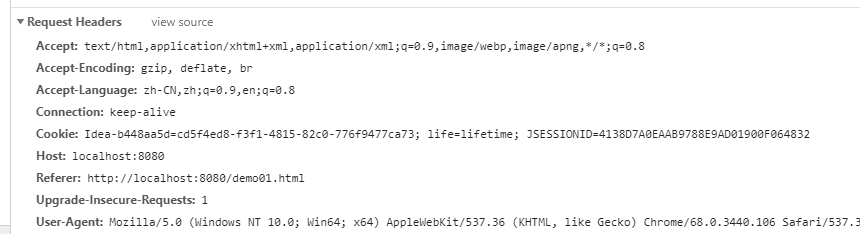

**请求体：**

get请求，请求体为空。


【GET请求抓取包的内容】

~~~
【请求行】
Request URL: http://localhost:8080/getServlet?username=lisi&password=1234
Request Method: GET
【请求头】
Accept: text/html,application/xhtml+xml,application/xml;q=0.9,image/webp,image/apng,*/*;q=0.8
Accept-Encoding: gzip, deflate, br
Accept-Language: zh-CN,zh;q=0.9,en;q=0.8
Connection: keep-alive
Cookie: Idea-b448aa5d=cd5f4ed8-f3f1-4815-82c0-776f9477ca73; life=lifetime; JSESSIONID=4138D7A0EAAB9788E9AD01900F064832
Host: localhost:8080
Referer: http://localhost:8080/demo01.html
Upgrade-Insecure-Requests: 1
User-Agent: Mozilla/5.0 (Windows NT 10.0; Win64; x64) AppleWebKit/537.36 (KHTML, like Gecko) Chrome/68.0.3440.106 Safari/537.36

【请求体】

~~~

###### 【POST请求】请求报文

**请求行：**

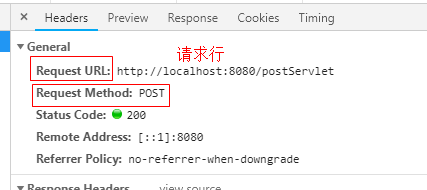

**请求头：**

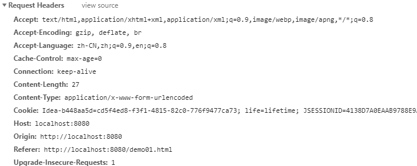

**请求体：**

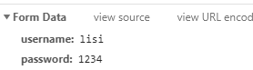

【POST请求抓取包的内容】

~~~
【请求行】
Request URL: http://localhost:8080/postServlet
Request Method: POST
【请求头】
Accept: text/html,application/xhtml+xml,application/xml;q=0.9,image/webp,image/apng,*/*;q=0.8
Accept-Encoding: gzip, deflate, br
Accept-Language: zh-CN,zh;q=0.9,en;q=0.8
Cache-Control: max-age=0
Connection: keep-alive
Content-Length: 27
Content-Type: application/x-www-form-urlencoded
Cookie: Idea-b448aa5d=cd5f4ed8-f3f1-4815-82c0-776f9477ca73; life=lifetime; JSESSIONID=4138D7A0EAAB9788E9AD01900F064832
Host: localhost:8080
Origin: http://localhost:8080
Referer: http://localhost:8080/demo01.html
Upgrade-Insecure-Requests: 1
User-Agent: Mozilla/5.0 (Windows NT 10.0; Win64; x64) AppleWebKit/537.36 (KHTML, like Gecko) Chrome/68.0.3440.106 Safari/537.36

【请求体】
username: lisi
password: 1234
~~~

##### 4.1.5、请求报文分析

###### 【请求行】

​	请求行位于请求报文的第一行，由：**url** **请求方式**   **协议/版本**  组成

~~~
Request URL: http://localhost:8080/postServlet
Request Method: POST
~~~

由于浏览器的原因我们看不到请求协议和版本。

###### 【请求头】

​	位于请求行的下面，以**键值对** 的形式给服务器传递信息，有些请求头信息是非必须的。

~~~
Host: localhost:63342
Connection: keep-aliv
Content-Length: 25
Cookie: JSESSIONID=AEE81E76BF586D353D84886D9B5E0BFD;
User-Agent: Mozilla/5.0 (Windows NT 10.0; Win64; x64) AppleWebKit/537.36 (KHTML, like Gecko) Chrome/67.0.3396.99 Safari/537.36
~~~

 【常用的请求头】：

| 请求头        | 示例                                       | 说明                    |
| ---------- | ---------------------------------------- | --------------------- |
| User-Agent | User-Agent: Mozilla/5.0 (Windows NT 10.0; Win64; x64) | 浏览器携带的用户操作系统，浏览器版本等信息 |

###### 【请求体】

get请求请求体为空；post请求的请求体传递**请求参数** 。

刚才通过抓包看到post请求体中数据

~~~
username: lisi
password: 1234
~~~

#### 5、HTTP协议小结

    1. HTTP：超文本传输协议，定义了浏览器与服务器之间数据传输的格式；
    2. HTTP协议组成：
        1. 请求报文：请求行，请求头，请求体；
             1. 请求行：请求报文中的第一行数据，包括**请求方式**，**URL** ，**协议/版本** ;
             2. 请求头：以键值对的数据格式，给服务器传输数据。常用的请求头：user-agent,cookie；
             3. 请求体：get请求：有请求体，但是没有内容；post请求：请求体传递请求参数；
    	2. 响应报文：响应行，响应头，响应体；

**GET和POST请求区别**

``` java
1. GET请求：
	1）请求行直接传递请求参数.将请求参数追加在URL后面，不安全。例如：form.html?username=jack&username=1234
    补充：但是get请求可以作为商品的分享。
	2）URL长度限制(不同浏览器限制大小不一致)，GET请求方式的数据大小，不可以传输数据量较大或者非文本数据。例如图片或者视频。
	3）请求体里面没有内容。

2.  POST请求：
	1）请求参数以请求体形式发送给服务器，数据传输安全。
	2）请求数据可以为非文本数据，可以传输数据量较大的数据。
	3）只有表单设置为method=”post”才是post请求.
    其他的都是get请求。常见GET请求：地址栏直接访问、<a href=””>、 等
```

浏览器和服务器是以固定的格式进行通信的，采取的HTTP协议的请求协议。浏览器通过请求协议，将数据传送到服务器中。


## 第二章  request&请求数据获取

### 1、什么是HttpServletRequest

​	HttpServletRequest接口的对象代表客户端的请求，当客户端通过HTTP协议访问服务器时，HTTP请求中的所有信息都封装在HttpServletRequest接口的对象中，开发人员通过这个对象的方法，可以获得客户端信息。 

### 2、HttpServletRequest的作用

通过HttpServletRequest接口的对象进行的常用操作:

~~~
1. 获取请求行信息：请求方式，url，ip地址和HTTP版本。
2. 获取请求头信息：浏览器类型，ip地址等。
3. 获取请求参数或者请求体中的数据：url后面拼接的参数或者请求体中提交的参数；
~~~

#### 2.1 获取请求行信息

 	请求行主要包括：**请求方式** ，**url** 和**协议/版本** 。HttpServletRequest接口的对象提供了以下方法来获取这些信息：

| 方法                         | 说明                            |
| ---------------------------- | ------------------------------- |
| String getMethod()           | 获取请求方式的类型 字母是大写的 |
| StringBuffer getRequestURL() | 获取客户端发出请求完整URL       |
| String getRemoteAddr()       | 获取IP地址                      |
| String getProtocol()         | 获取当前协议的名称和版本        |

说明：对于上述方法StringBuffer getRequestURL() 的返回值是StringBuffer ，它也表示字符串缓冲区，用法和StringBuilder一样，只是StringBuffer 是多线程安全的，效率低。StringBuilder是多线程不安全的，效率高。

##### 【案例】获取请求行信息

【java代码】

~~~java
@WebServlet("/rowServlet")
public class RowServlet extends HttpServlet {
    protected void doPost(HttpServletRequest request, HttpServletResponse response) throws ServletException, IOException {
        doGet(request, response);
    }
    protected void doGet(HttpServletRequest request, HttpServletResponse response) throws ServletException, IOException {
        //进行请求行API的学习
        //获取请求行的请求方式
        String method = request.getMethod();
        System.out.println("method = " + method);
        //获取请求行的请求URL
        StringBuffer requestURL = request.getRequestURL();
        System.out.println("requestURL = " + requestURL);
        //获取请求行的请求IP
        String remoteAddr = request.getRemoteAddr();
        System.out.println("remoteAddr = " + remoteAddr);
        //获取请求行的协议版本号
        String protocol = request.getProtocol();
        System.out.println("protocol = " + protocol);
    }
}
~~~

##### 【结果】

  启动服务器，访问Servlet得到结果如下：

~~~
method = GET
requestURL = http://localhost:8080/rowServlet
remoteAddr = 0:0:0:0:0:0:0:1
protocol = HTTP/1.1
~~~

【注意事项】

1. 如果浏览器地址栏中的地址为：http://localhost:8080/rowServlet ，获取的ip地址为：0:0:0:0:0:0:0:1。

   0:0:0:0:0:0:0:1是ipv6的表现形式，对应ipv4来说相当于127.0.0.1，也就是本机。导致上述的原因是客户端和服务器在同一台电脑上。如果不想出现ipv6版本的ip地址格式，在访问网址的时候可以书写127.0.0.1。

   或者在访问servlet的时候，输入具体的ip地址，假设我的电脑ip地址是：192.168.23.10

   访问servlet的时候这样输入：http://192.168.23.10:8080/rowServlet

   那么这里获取的ip地址：remoteAddr = 192.168.23.10

​	通过上述案例，我们可以发现，如果开发中服务器需要获取浏览器发送的行信息，使用对应的api 可以轻松获取！

#### 2.2 获取请求头信息

​	浏览器的请求头信息是由很多：`关键字：值` 即key:value 形式的数据组成的。HttpServletRequest对象给我们提供了两个方法用来获取请求的头信息。

| 方法                           | 作用                                                   |
| ------------------------------ | ------------------------------------------------------ |
| String  getHeader(String name) | 根据请求头的key关键字获取请求头信息                    |
| Enumeration getHeaderNames()   | 返回此请求包含的所有头信息的key,属于对枚举类型进行遍历 |

说明： 枚举属于一种特殊的数据类型，类似于集合，对他遍历也是类似于集合遍历方式。Enumeration类似于Iterator的迭代器。只是Iterator来迭代1.2之后的集合。而Enumeration用来迭代1.2之前集合和枚举类型的。

【说明】请求头的key关键字如下表所示：

|     请求头key     |                         请求头value                          |
| :---------------: | :----------------------------------------------------------: |
|    **referer**    | 浏览器通知服务器，当前请求来自何处,如果是直接访问，则不会有这个头。 |
| If-modified-Since | 浏览器通知服务器，本地缓存的最后变更时间。与另一个响应头组合控制浏览器页面的缓存。 |
|    **cookie**     |       与会话有关技术，用于存放浏览器缓存的cookie信息。       |
|    user‐agent     |       浏览器通知服务器，客户端浏览器与操作系统相关信息       |
|    connection     |        保持连接状态。Keep-Alive 连接中，close 已关闭         |
|     **host**      |                      请求的服务器主机名                      |
|  content-length   |                         请求体的长度                         |
| **content-type**  | 如果是POST请求，会有这个头，默认值为application/x-www-form-urlencoded，表示请求体内容使用url编码 |
|      accept       |       浏览器可支持的MIME类型。文件类型的一种描述方式。       |
|   **mime格式**    | 浏览器请求数据的类型，例如：   text/html ，html文件   text/css，css文件   text/javascript，js文件   image/*，所有图片文件 |
|  accept-encoding  |   浏览器通知服务器，浏览器支持的数据压缩格式。如：GZIP压缩   |
|  accept-language  |  浏览器通知服务器，浏览器支持的语言。各国语言（国际化i18n）  |
|       ....        |                            .....                             |

【代码演示】：编写一个Servlet类来演示获取请求头信息：user-agent

~~~java
@WebServlet("/headerServlet")
public class HeaderServlet extends HttpServlet {
    protected void doPost(HttpServletRequest request, HttpServletResponse response) throws ServletException, IOException {
        doGet(request, response);
    }
    protected void doGet(HttpServletRequest request, HttpServletResponse response) throws ServletException, IOException {
        //请求头学习	
        //获取所有请求key信息
        Enumeration<String> headerNames = request.getHeaderNames();
		//取出每个key
        while (headerNames.hasMoreElements()){
            System.out.println(headerNames.nextElement());
        } 
        //获取user-agent 对应value值
        String header = request.getHeader("user-agent");
        System.out.println("header = " + header);
    }
}
~~~

【运行结果】

~~~
host
connection
upgrade-insecure-requests
user-agent
accept
accept-encoding
accept-language
cookie
header = Mozilla/5.0 (Windows NT 10.0; Win64; x64) AppleWebKit/537.36 (KHTML, like Gecko) Chrome/68.0.3440.106 Safari/537.36
~~~

#### 2.3 获取请求体（请求数据）【重要】

​	学习完了对请求行和请求头的内容，最后一部分就是请求体了，在请求体中，包含的是用户通过浏览器发送的请求参数，因此，我们主要学习的就是获取请求参数的方法。

​	首先，我们来观察一下浏览器中的请求数据是怎么提交的：

1. get请求：get请求提交的数据是拼接在url后面的，如下图所示：

 

2.post请求：post请求的数据是在请求体中发送到后台的：

【请求体】
username: lisi
password: 1234

通过对比，发现数据传递的格式都是：`name=value` ；

##### （1）获取请求参数的方法

| 方法名                                          | 描述                                                         |
| :---------------------------------------------- | ------------------------------------------------------------ |
| String  getParameter(String name)               | getParameter获得指定参数名对应的值。如果没有返回null，如果值有多个获得第一个。  例如：username=jack。**注意：参数name是form表单中的name属性值。**<input name="username"/> |
| String[] getParameterValues(name)               | getParameterValues[] 获取请求数据key相同的多个数据.一般获取的是复选框。例如爱好选项。 |
| Map<String,String[]> request.getParameterMap(); | 获得表单中所有的数据,key表示input标签name的属性值：<input name="username"/>，value是一个数组，表示input输入框的值 |

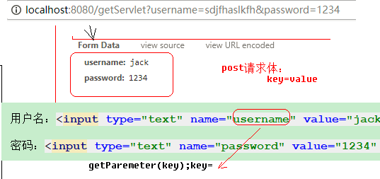

##### （2）案例：获取请求参数练习

1、编写用户表单user.html，提供表单字段：username、password、hobby、education，以post方式提交。

~~~html
 <form action="/requestServlet" method="post">
        用户名：<input type="text" name="username"/><br/>
        密码：  <input type="text" name="password"/><br/>
        爱好：  <input type="checkbox" name="hobby" value="basketball"/> 篮球
               <input type="checkbox" name="hobby" value="football"/> 足球
               <input type="checkbox" name="hobby" value="film"/> 电影 <br/>
        学历：<select name="education">
                <option value="gz">高中</option>
                <option value="dz">大专</option>
                <option value="bk">本科</option>
             </select><br>
        <input type="submit" value="post提交"/>
 </form>
~~~

2、编写Servlet接受用户表单发送的数据.

~~~java
@WebServlet("/requestServlet")
public class RequestServlet extends HttpServlet {
    protected void doPost(HttpServletRequest request, HttpServletResponse response) throws ServletException, IOException {
        doGet(request, response);
    }
    protected void doGet(HttpServletRequest request, HttpServletResponse response) throws ServletException, IOException {
        //非常重要API  请求参数/请求体API
        //获取用户名
        String username = request.getParameter("username");
        System.out.println("username = " + username);
        String password = request.getParameter("password");
        System.out.println("password = " + password);
        //请求爱好
        String[] hobbies = request.getParameterValues("hobby");
        String s = Arrays.toString(hobbies);
        System.out.println("s = " + s);

         //获取学历
        String education = request.getParameter("education");
        System.out.println("education = " + education);

        //获取表单所有信息
        Map<String, String[]> parameterMap = request.getParameterMap();
        Set<String> strings1 = parameterMap.keySet();
        System.out.println("strings1 = " + strings1);
        //获取用户输入所有值
       Collection<String[]> values = parameterMap.values();
        for (String[] strings : values) {
            System.out.println(strings.length);
            System.out.println("strings = " + Arrays.toString(strings));
        }
    }
}

~~~

说明：

对于  Map<String, String[]> parameterMap = request.getParameterMap(); 的返回值是一个Map集合，用来获取用户输入的所有值。

Map集合的key:表单的name属性值。

Map集合的value:以String类型的数组形式存储表单提交的每一项的值。

【运行结果】

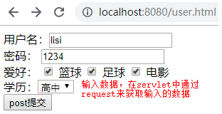

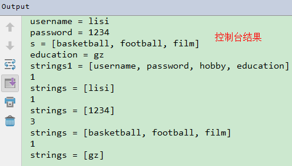


##### （3） BeanUtils

BeanUtils 是 Apache commons组件的成员之一，主要用于简化JavaBean封装数据的操作。它可以给JavaBean封装一个字符串数据，也可以将一个表单提交的所有数据封装到JavaBean中。

> 要用BeanUtils 表单项的name属性值 和 javaBean的属性名一致即可 

###### ① 导入jar包

 

###### ② 使用工具类封装数据

```html
<!DOCTYPE html>
<html lang="zh-CN">
<head>
    <meta charset="UTF-8">
    <title>Title</title>
</head>
<body>
    <form action="/day09-request/ParamServlet" method="get">
        用户 <input type="text" name="username" > <br>
        密码 <input type="text" name="password" > <br>
        性别
        <input type="radio" name="gender" value="male"> 男
        <input type="radio" name="gender" value="female"> 女 <br>
        爱好
        <input type="checkbox" name="hobby" value="smoke"> 抽烟
        <input type="checkbox" name="hobby" value="drink"> 喝酒
        <input type="checkbox" name="hobby" value="perm"> 烫头 <br>
        <input type="submit">
    </form>
</body>
</html>
```


```java
@WebServlet("/ParamServlet")
public class ParamServlet2 extends HttpServlet {

    protected void doGet(HttpServletRequest request, HttpServletResponse response) throws ServletException, IOException {
        this.doPost(request, response);
    }

    protected void doPost(HttpServletRequest request, HttpServletResponse response) throws ServletException, IOException {

        request.setCharacterEncoding("utf-8");
        String username = request.getParameter("username"); // 一个name对应一个value
        String password = request.getParameter("password");
        String gender = request.getParameter("gender");
        String[] hobbies = request.getParameterValues("hobby"); // 一个name对应多个value

        //封装到数据到对象中(JavaBean)
        /*User user = new User();
        user.setUsername(username);
        user.setPassword(password);
        user.setGender(gender);
        user.setHobby(hobbies);
        System.out.println(user);*/

        /*
        *  问题: 只有4个属性,封装比较简单, 如果有40个,还那么些很冗余
        *
        *  解决: BeanUtils (apache出品工具包)
        *       大大简化封装javaBean数据的代码
        *
        *  使用: 1. BeanUtils.jar 放入 web-inf/lib/xx.jar
        *           (两个jar包)
        *       2. 编写代码
        *       BeanUtils.populate(bean,map)
        *           将map中数据的映射到bean中
        *
        *  方法底层原理: 反射(内省)
        *       BeanUtils.populate(user,map);
        *       1. 遍历这个map
        *               key     value
        *        举例:  username  李四
        *
        *       2. 方法反射
        *           Class clazz = user.getClass();  // User.class 对象
        *               Method 指定的方法  = clazz.getMethod(方法名,方法参数列表对应Class对象);
        *               method.invoke(调用此方法的对象,实参);
        *
        *               // setUsername  根据map中遍历出来的key 推导来的
        *          Method method = clazz.getMethod("setUsername",String.class); //获取User类里的setUsername方法对象
         *              //李四 就是 map中遍历出来的key对应的value
          *         method.invoke(user,"李四") // user.setUserName("李四")
        *     总结:
        *       javaBean 的 setXXX 的 xxx 跟Map的key一致 !!!
        *           1. map中的key跟表单项的name属性值 一致
        *           2. setXXX 习惯于 本类的 属性名一致
        *
        *       最终结论:  表单的name 跟 javaBean的属性名一致即可
        *
        * */
        User user = new User(); //空的对象
        Map<String, String[]> map = request.getParameterMap();//获取所有请求参数

        try {
            BeanUtils.populate(user,map);
            System.out.println(user);
        } catch (IllegalAccessException e) {
            e.printStackTrace();
        } catch (InvocationTargetException e) {
            e.printStackTrace();
        }

    }

}
```

 

javaBean

```java
/*
*   JavaBean: java标准类 (三个必须规范)
*   1. public 空参构造
*   2. private 属性
*   2. public get set 方法
*
*
* */
public class User {
    private String username;
    private String password;
    private String gender;
    private String[] hobby;
    // 一个类若不显式声明任何构造, 默认一个public空参构造(隐式声明)

    @Override
    public String toString() {
        return "User{" +
                "username='" + username + '\'' +
                ", password='" + password + '\'' +
                ", gender='" + gender + '\'' +
                ", hobby=" + Arrays.toString(hobby) +
                '}';
    }

    public String getUsername() {
        return username;
    }

    public void setUsername(String username) {
        System.out.println("setUsername被调用了");
        this.username = username;
    }

    public String getPassword() {
        return password;
    }

    public void setPassword(String password) {
        this.password = password;
    }

    public String getGender() {
        return gender;
    }

    public void setGender(String gender) {
        this.gender = gender;
    }

    public String[] getHobby() {
        return hobby;
    }

    public void setHobby(String[] hobby) {
        this.hobby = hobby;
    }
}
```


## 第三章  request作用域

### 1、request的生命周期

request对象生命周期如下图所示：

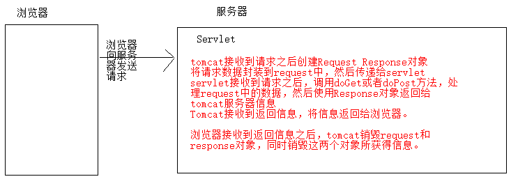

~~~
【一次请求和响应的完整流程】
1、浏览器向servlet发送请求
2、tomcat收到请求后，创建Request和Response两个对象，并将请求数据封装到request对象中，然后传递给Servlet
3、Servlet接收到请求后，调用doget或者dopost方法。处理浏览器的请求信息，然后通过Response返回tomcat服务器信息
4、tomcat接收到返回的信息，返回给浏览器。
5、浏览器接收到返回消息后，tomcat销毁Request和Response两个对象，同时销毁这两个对象所获得的信息。
~~~

* 创建：浏览器给服务器发送请求后，tomcat创建request对象封装请求数据；
* 销毁：服务器给浏览器响应信息结束后销毁；

特点：浏览器每次给服务器发送请求，服务器都会为这次请求创建一个新的request对象。

### 2 、request域对象(重要)

​	问：什么是域对象？

​	在web阶段需要对象来存储数据，获取数据和移除数据,就可以使用域对象来实现。域对象是一个容器，这种容器主要用于servlet与servlet之间的数据传输使用的 .

​	今天讲解的request域对象,就可以在**一次请求中的多个servlet之间**进行数据共享.

​	request域对象,一个存储数据的区域对象.是把request当成一个容器来存储数据，request域存储数据主要是用于在两个servlet之间传递数据。request作为域对象，常用的方法如下：

| 方法                                       | 说明                                                         |
| ------------------------------------------ | ------------------------------------------------------------ |
| void   setAttribute(String name, Object o) | 往request域中设置值                                          |
| Object  getAttribute(String name)          | 从request域中根据name取值,这里的name和setAttribute()方法中的第一个参数name一致 |
| void  removeAttribute(String name)         | 从request域中移除值,这里的name和setAttribute()方法中的第一个参数name一致 |

**以上三个方法都是操作request中域对象中的数据，与请求参数无关。**

【案例】request域对象练习

需求：

    1. 创建一个ScopeServlet类继承HttpServlet类；
    2. 往request域中设置值；
    3. 从request域中取值；
    4. 将request域中的值移除；

~~~java
@WebServlet("/scopeServlet")
public class ScopeServlet extends HttpServlet {
    protected void doPost(HttpServletRequest request, HttpServletResponse response) throws ServletException, IOException {
        doGet(request, response);
    }

    protected void doGet(HttpServletRequest request, HttpServletResponse response) throws ServletException, IOException {
        //使用request域对象，进行存储值，删除值，获取值操作

        Student student = new Student("xiaozhou","1234");

        //向request存储值
        request.setAttribute("msg","柳岩");
        request.setAttribute("stu",student);

        //可以获取值
        String msg = (String) request.getAttribute("msg");
        System.out.println("msg = " + msg);

        //移除request中值
        request.removeAttribute("msg");

        Object msg1 = request.getAttribute("msg");
        if (null== msg1){
            System.out.println("没有获取到值");
        }

        Student student1 = (Student) request.getAttribute("stu");
        System.out.println("student1 = " + student1);
    }
}

~~~

实体类代码

```java
package cn.itheima.value05;

public class Student {
   private String name;
    private String password;
    public Student(String name, String password) {
        this.name = name;
        this.password = password;
    }
    public String getName() {
        return name;
    }
    public void setName(String name) {
        this.name = name;
    }
    public String getPassword() {
        return password;
    }
    public void setPassword(String password) {
        this.password = password;
    }
    @Override
    public String toString() {
        return "Student{" +
                "name='" + name + '\'' +
                ", password='" + password + '\'' +
                '}';
    }
}

```

在浏览器输入地址：http://localhost:8080/scopeServlet

效果图：

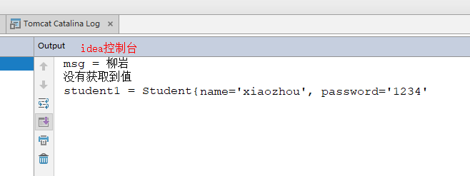

【注意】getParameter()方法和getAttribute()方法的区别

1. getParameter()方法获取的是浏览器提交的数据（是表单提交的数据）；
2. getAttribute()方法获取的是request域中的数据（即获取的都是通过request.setAttribute()设置的值）；

### 3、 请求转发(重要)

我们上面学习了域对象的一种request,主要是负责向request域对象中存储数据，然后以key作为键将数据取出。这种使用存储和获取数据的方式在开发中最为常见的就是请求转发。

 **请求转发：可以从某个servlet到某个html等静态资源，还可以去其他的servlet中。我们之前使用到的请求都是从页面发出，然后请求到Servlet。其实，在Servlet中。请求也可以从一个Servlet发起，然后请求到另一个Servlet或静态页面。这项技术叫做请求转发。**

请求转发的描述可以参考如下图：

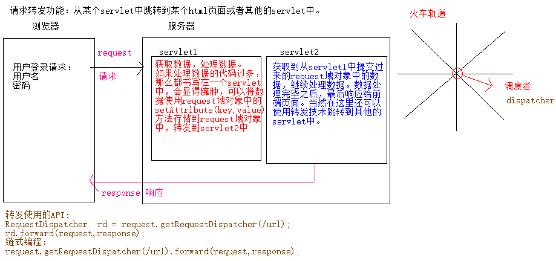

请求转发需要借助以下两个方法实现：

| 方法                                                         | 说明                                                         |
| ------------------------------------------------------------ | ------------------------------------------------------------ |
| RequestDispatcher  getRequestDispatcher(String path)         | 获取请求转发器（该方法需要使用request对象调用）。参数：path指定指向资源的路径名的 `String`。如果该路径名是相对的，那么它必须是相对于当前 servlet 的。 |
| void forward(ServletRequest request, ServletResponse response) | 将请求转发到另一个资源（Servlet）上。参数：request表示客户端对 servlet 发出的请求的 [`ServletRequest`](../javax.servlet.ServletRequest.html)  对象  response 表示 servlet 向客户端返回的响应的 [`ServletResponse`](../javax.servlet.ServletResponse.html) 对象。 |

###### 【案例】请求转发练习

需求：

1. 从一个Servlet转发到一个静态页面；
2. 从一个Servlet转发到另一个Servlet；

【练习一】从一个Servlet转发到dispatcher.html

```java
@WebServlet("/oneServlet")
public class OneServlet extends HttpServlet {
    protected void doPost(HttpServletRequest request, HttpServletResponse response) throws ServletException, IOException {
        doGet(request, response);
    }

    protected void doGet(HttpServletRequest request, HttpServletResponse response) throws ServletException, IOException {
        System.out.println("oneServlet...");
        //转发到静态资源
        request.getRequestDispatcher("/dispatcher.html").forward(request,response);
    }
}
```

dispatcher.html代码

```html
<!DOCTYPE html>
<html lang="en">
<head>
    <meta charset="UTF-8">
    <title>Title</title>
</head>
<body>
<h1>转发到html静态资源</h1>
</body>
</html>
```

效果图：

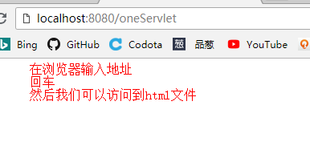

**回车**

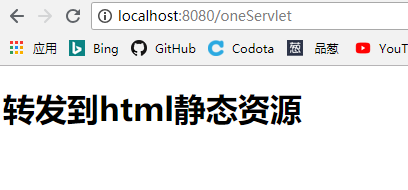

**注意：从OneServlet转发到dispatcher.html页面之后，浏览器地址栏并没有发生变化。**

【练习二】从一个TwoServlet转发到ThrServlet；

【TwoServlet】

~~~java
@WebServlet("/twoServlet")
public class TwoServlet extends HttpServlet {
    protected void doPost(HttpServletRequest request, HttpServletResponse response) throws ServletException, IOException {
        doGet(request, response);
    }
    protected void doGet(HttpServletRequest request, HttpServletResponse response) throws ServletException, IOException {
        //使用转发  去ThrServelt
        //System.out.println("twoServlet...");
        //引入request域对象，向request存储值
        request.setAttribute("flag","help me");
        request.getRequestDispatcher("/thrServlet").forward(request,response);
    }
}
~~~

【ThrServlet】

~~~java
@WebServlet("/thrServlet")
public class ThrServlet extends HttpServlet {
    protected void doPost(HttpServletRequest request, HttpServletResponse response) throws ServletException, IOException {
        doGet(request, response);
    }
    protected void doGet(HttpServletRequest request, HttpServletResponse response) throws ServletException, IOException {
        //System.out.println("thrServlet...");
        //获取request域对象中值
        String flag = (String) request.getAttribute("flag");
        System.out.println("flag = " + flag);
    }
}
~~~

效果图：

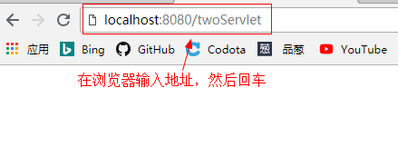

回车后，TwoServlet会转发到ThrServlet，我们可以从ThrServlet中获取域对象中的数据，查看控制台：

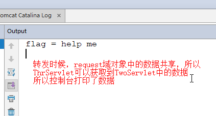

**注意：从TwoServlet转发到ThrServlet之后，浏览器地址栏并没有发生变化。**

###### 【小结】转发

1. 转发是服务器内部的跳转行为；
2. 从一个Servlet转发到另一个资源（静态或动态），能够实现跳转，但是浏览器地址栏地址没有发生改变。因为对浏览器来说本质上就只有一次请求；
3. 请求转发的时候，共享request域中的数据；
4. 无论转发多少次，都是只有一次请求，同时会有一次响应；

## 第四章  登录案例

截止到目前，我们已经能够使用所学的知识完成一个完整的从前端到后台的登录案例了。

### 1、案例需求

```
1. 要求基于所学知识，设计登录表单页面，数据库用户表user(字段: id,username,password).
2. 基于form表单数据提交，将客户端用户输入的账号和密码发送给服务器Servlet .
3. Servlet获取表单提交的账号和密码数据，基于所学的mybatis直接访问数据库 user 表，查询账号和密码是否正确.
4. 根据数据库查询的结果，如果账号或者密码错误，转发到error.html。账号和密码都正确转发到success.html页面.
```

### 2、登录业务流程分析

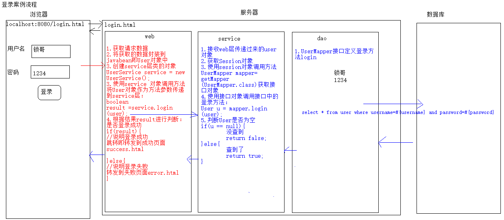


### 3、用户登录实现

#### 3.1 开发前需要准备的工具和技术

1.开发准备

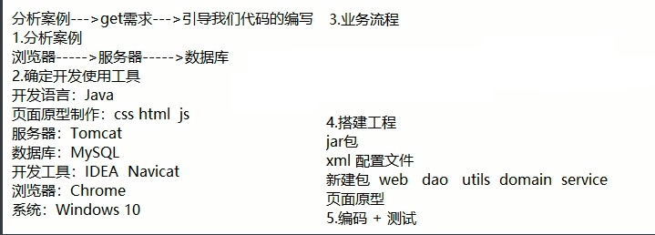

2.搭建环境：

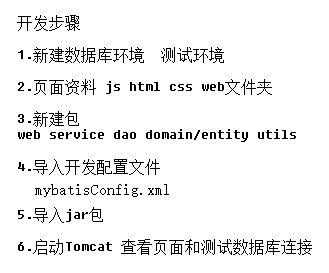

#### 3.2、数据库设计

数据库名称：自定义即可，表名：`user`  字段：**id  username,password**

（可以基于数据库图形软件，navicat工具完成）

```sql
create database day11_db;
use day11_db;
DROP TABLE IF EXISTS `user`;
CREATE TABLE `user` (
  `id` int(11) NOT NULL AUTO_INCREMENT,
  `username` varchar(20) NOT NULL,
  `password` varchar(32) NOT NULL,
  PRIMARY KEY (`id`)
) ENGINE=InnoDB AUTO_INCREMENT=5 DEFAULT CHARSET=utf8;

-- ----------------------------
-- Records of user
-- ----------------------------
INSERT INTO `user` VALUES ('1', 'zhangsan', '1234');
INSERT INTO `user` VALUES ('2', 'lisi', '1234');
INSERT INTO `user` VALUES ('3', 'wangwu', '1234');
INSERT INTO `user` VALUES ('4', 'zhaoliu', '1234');
```

#### 3.3、设计登录页面

将今日下发的资料文件夹中的登录页面下的所有的内容拷贝到新创键的web项目下的web文件夹下。

硬盘上的静态页面如下：

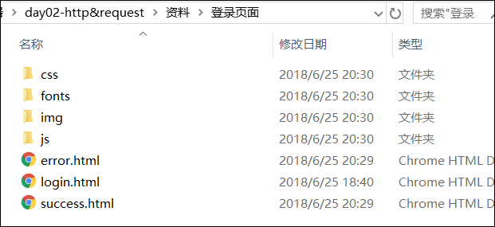

拷贝之后项目的目录结构如下：

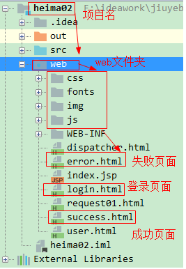

登录页面login.html的代码如下所示：

```html
<!DOCTYPE html>
<html lang="en">
<head>
    <meta charset="utf-8">
    <meta http-equiv="X-UA-Compatible" content="IE=edge">
    <meta name="viewport" content="width=device-width, initial-scale=1">
    <title>登录页面</title>
    <link href="css/bootstrap.min.css" rel="stylesheet">
    <link href="css/login.css" rel="stylesheet">
    <script src="js/jquery.js"></script>
    <script src="js/bootstrap.js"></script>
</head>
<body>
    <div class="container text-center">
        <form class="form-signin" action="/loginServlet">
            <h2 class="form-signin-heading">登录页面</h2>
            <input type="email"  name="username" class="form-control" placeholder="用户名" required autofocus>
            <input type="password"  name="password" class="form-control" placeholder="密码" required>
            <button class="btn btn-lg btn-primary btn-block" type="submit">登录</button>
        </form>
    </div>
</body>
</html>
```

然后启动tomcat，在浏览器中访问登录页面login.html，结果如下所示：

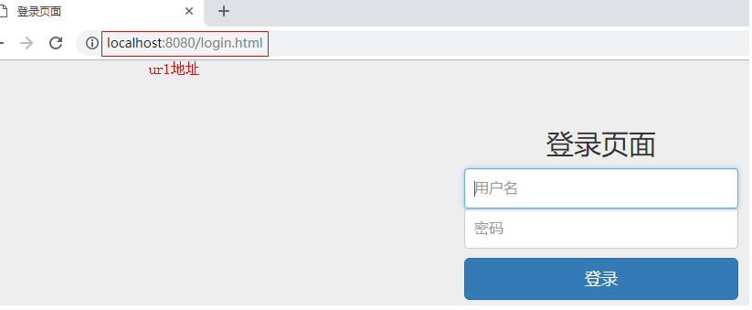

#### 3.4、后台环境搭建

1.在src下创建如下包：

```java
com.itheima.sh.login.web //web层书写servlet
com.itheima.sh.login.service//业务层，编写业务逻辑
com.itheima.sh.login.dao//数据处理层，编写操作数据库的数据
com.itheima.sh.login.domain//存放实体类的
com.itheima.sh.login.utils//存放工具类的
com.itheima.sh.login.test//用来测试的
```

​    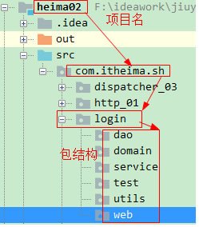

 2.在**WEB-INF**目录下新建lib包，将jar包导入，并将jar包添加到项目的library中：


3.将db.properties、log4j.properties配置文件放到src下面。并在src下创建mybatis核心配置文件mybatisConfig.xml。


**【mybatis核心配置文件mybatisConfig.xml】**

~~~xml
<?xml version="1.0" encoding="UTF-8" ?>
<!DOCTYPE configuration
        PUBLIC "-//mybatis.org//DTD Config 3.0//EN"
        "http://mybatis.org/dtd/mybatis-3-config.dtd">
<configuration>
    <!--加载外部的配置文件-->
    <properties resource="db.properties"></properties>
    <!--别名-->
    <typeAliases>
        <package name="com.itheima.sh.domain"></package>
    </typeAliases>
    <!--mybatis环境的配置
        一个核心配置文件，可以配置多个运行环境，default默认使用哪个运行环境
    -->
    <environments default="development">
        <!--通常我们只需要配置一个就可以了， id是环境的名字 -->
        <environment id="development">
            <!--事务管理器：由JDBC来管理-->
            <!--
                事务管理器type的取值：
                1. JDBC：由JDBC进行事务的管理
                2. MANAGED：事务由容器来管理，后期学习Spring框架的时候，所有的事务由容器管理
            -->
            <transactionManager type="JDBC"/>
            <!--数据源的配置：mybatis自带的连接池-->
            <!--
                数据源：
                1. POOLED：使用mybatis创建的连接池
                2. UNPOOLED：不使用连接池，每次自己创建连接
                3. JNDI：由服务器提供连接池的资源，我们通过JNDI指定的名字去访问服务器中资源。
            -->
            <dataSource type="POOLED">
                <property name="driver" value="${jdbc.driver}"/>
                <property name="url" value="${jdbc.url}"/>
                <property name="username" value="${jdbc.username}"/>
                <property name="password" value="${jdbc.password}"/>
            </dataSource>
        </environment>

    </environments>
    <!--映射器-->
    <mappers>
        <!--加载其它的映射文件 注：注解开发是点号-->
        <!--<package name="com.itheima.sh.dao"></package>-->
        <!--
            加载其它的映射文件 xml形式
                包扫描方式加载mapper映射文件,说明：
                1. 要求mapper映射文件，与mapper接口要放在同一个目录
                2. 要求mapper映射文件的名称，与mapper接口的名称要一致
            -->
        <package name="com.itheima.sh.dao"></package>
    </mappers>
</configuration>
~~~

【db.properties】

~~~properties
jdbc.driver=com.mysql.jdbc.Driver
jdbc.url=jdbc:mysql://localhost:3306/day11_db
jdbc.username=root
jdbc.password=1234
~~~


4.将SessionFactoryUtils工具类放到utils包下。工具类

​	**1).SessionFactoryUtils**

```java
package com.itheima.sh.utils;

import org.apache.ibatis.io.Resources;
import org.apache.ibatis.session.SqlSession;
import org.apache.ibatis.session.SqlSessionFactory;
import org.apache.ibatis.session.SqlSessionFactoryBuilder;

import java.io.IOException;
import java.io.InputStream;

/**
 * @author tiansuo
 * @date 2019-11-12 10:02
 *  会话工厂工具类
        1. 通过静态方法得到一个工厂对象
        2. 通过静态方法得到会话对象
 *
 */
public class SessionFactoryUtils {
    //声明一个工厂对象
    private static SqlSessionFactory factory;
    //在静态代码块中创建会话工厂
    static {
        SqlSessionFactoryBuilder builder = new SqlSessionFactoryBuilder();
        //得到输入流
        try(InputStream inputStream = Resources.getResourceAsStream("mapConfig.xml");) {
            factory = builder.build(inputStream);
        } catch (IOException e) {
            e.printStackTrace();
        }
    }
    /**
     静态方法得到会话工厂
     */
    public static SqlSessionFactory getSessionFactory() {
        return factory;
    }
    /**
     得到会话对象
     */
    public static SqlSession getSession() {
        return factory.openSession();
    }
}

```


### 4、代码实现

#### 4.1 编写实体类User

```java
package com.itheima.sh.login.domain;
public class User {
    private Integer id;
    private String username;
    private String password;
    public Integer getId() {
        return id;
    }
    public void setId(Integer id) {
        this.id = id;
    }
    public String getUsername() {
        return username;
    }
    public void setUsername(String username) {
        this.username = username;
    }
    public String getPassword() {
        return password;
    }
    public void setPassword(String password) {
        this.password = password;
    }
    @Override
    public String toString() {
        return "User{" +
                "id=" + id +
                ", username='" + username + '\'' +
                ", password='" + password + '\'' +
                '}';
    }
}
```


#### 4.2 测试是否可以连接数据库

在com.itheima.sh.test 包下新创键一个Demo01类，代码如下，用来测试是否可以连接到数据库。

```java
package com.itheima.sh.test;

import com.itheima.sh.dao.User2Mapper;
import com.itheima.sh.domain.User2;
import com.itheima.sh.utils.SessionFactoryUtil;
import org.apache.ibatis.session.SqlSession;

import java.util.List;

public class Demo01 {
    public static void main(String[] args) {
        //获取session
        SqlSession sqlSession = SessionFactoryUtil.getSqlSession();
        //获取接口对象
        User2Mapper mapper = sqlSession.getMapper(User2Mapper.class);
        //调用方法查询数据
        List<User2> list = mapper.queryTest();
        list.forEach(System.out::println);
    }
}

```

**【User2Mapper接口】**

~~~java
public interface User2Mapper {
    @Select("select * from user")
    List<User2> queryTest();
}
~~~

idea控制台输出结果：

```
User{id=1, username='zhangsan', password='1234'}
User{id=2, username='lisi', password='1234'}
User{id=3, username='wangwu', password='1234'}
User{id=4, username='zhaoliu', password='1234'}
```

#### 4.3 web层LoginServlet

```java
package com.itheima.sh.web;

import com.itheima.sh.domain.User;
import com.itheima.sh.domain.User2;
import com.itheima.sh.service.UserService;

import javax.servlet.ServletException;
import javax.servlet.annotation.WebServlet;
import javax.servlet.http.HttpServlet;
import javax.servlet.http.HttpServletRequest;
import javax.servlet.http.HttpServletResponse;
import java.io.IOException;

@WebServlet("/loginServlet")
public class LoginServlet extends HttpServlet {
    protected void doPost(HttpServletRequest request, HttpServletResponse response) throws ServletException, IOException {
        doGet(request, response);
    }

    protected void doGet(HttpServletRequest request, HttpServletResponse response) throws ServletException, IOException {
        //解决中文乱码问题
        //request.setCharacterEncoding("utf-8");
        //获取用户名和密码
        String username = request.getParameter("username");
        String password = request.getParameter("password");
        //封装数据 javabean
        User2 user = new User2();
        user.setUsername(username);
        user.setPassword(password);
        //进行登陆业务操作
        UserService service = new UserService();
        boolean result = service.login(user);
        if (result){
            //登陆成功
            //转发跳转success.html
            request.getRequestDispatcher("/success.html").forward(request,response);
        }else {
            //登陆失败
            request.getRequestDispatcher("/error.html").forward(request,response);
        }
    }
}

```


#### 4.4 service层

```java
package com.itheima.sh.service;

import com.itheima.sh.dao.User2Mapper;
import com.itheima.sh.dao.UserMapper;
import com.itheima.sh.domain.User;
import com.itheima.sh.domain.User2;
import com.itheima.sh.utils.SessionFactoryUtil;
import org.apache.ibatis.io.Resources;
import org.apache.ibatis.session.SqlSession;
import org.apache.ibatis.session.SqlSessionFactory;
import org.apache.ibatis.session.SqlSessionFactoryBuilder;

import java.io.IOException;
import java.io.InputStream;
import java.util.List;

public class UserService {
   
    //进行业务逻辑处理
    public boolean login(User2 user) {
        //处理业务逻辑
        //4. 通过会话工厂得到会话对象
        SqlSession session = SessionFactoryUtil.getSqlSession();
        //5. 会话对象得到UserMapper接口的代理对象
        User2Mapper user2Mapper = session.getMapper(User2Mapper.class);
        //接口对象调用方法
        User2 loginUser = user2Mapper.queryUserByUserNameAndPassword(user);

//        if (null == loginUser) {
//            return  false;
//        }else {
//            return  true;
//        }

        //return loginUser == null ? false : true;
        return  loginUser != null;
    }
}
```

#### 4.5DAO层代码

```java
package com.itheima.sh.dao;

import com.itheima.sh.domain.User;
import com.itheima.sh.domain.User2;
import org.apache.ibatis.annotations.Select;

import java.util.List;

public interface User2Mapper {
    @Select("select * from user where username=#{username} and password=#{password}")
    User2 queryUserByUserNameAndPassword(User2 user);
}
```


效果图：

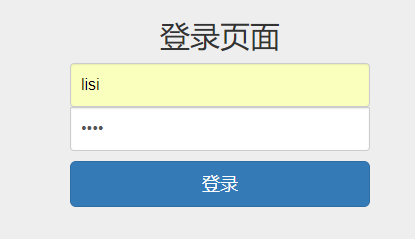

点击登陆按钮

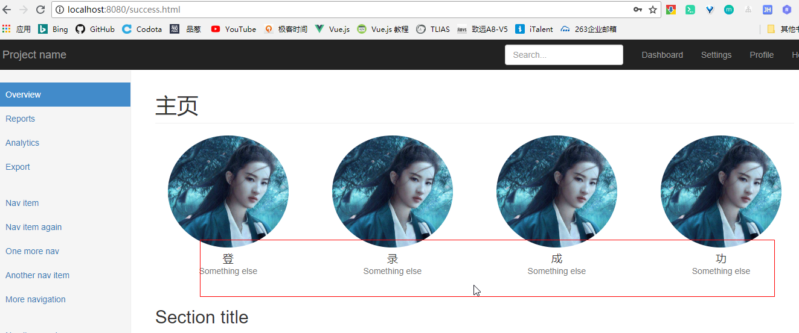

#### 4.6 POST请求中文乱码问题

注意：如果将login.html页面中的form表单改为post提交，此时在登录页面提交汉字的时候，使用request接收数据的时候会出现中文乱码问题。form表单代码：

```html
 <form class="form-signin" action="/loginServlet" method="post">
```

页面输入数据：

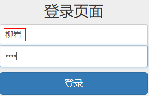

后台servlet接收的数据结果：

username = ??????

##### 4.6.1 乱码产生原因

原因：Tomcat8只对于get请求处理了乱码问题。post请求并没有处理乱码。所以我们要手动进行处理。在进行手动处理乱码之前，我们要知道乱码是如何产生的。

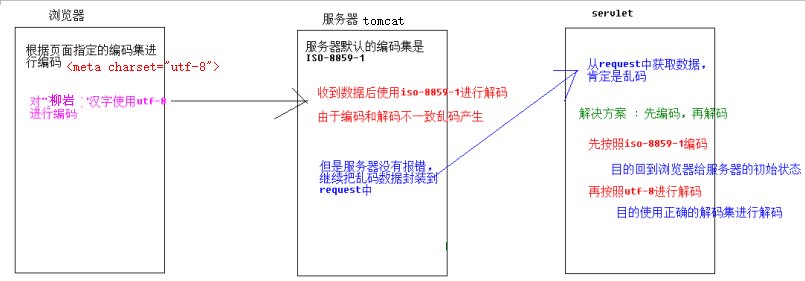

乱码发生过程总结如下：

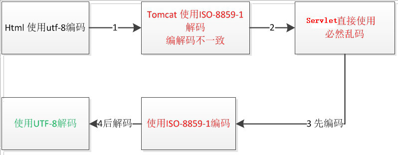

##### 4.6.2 解决POST乱码

默认情况下，tomcat服务器使用的的编码方式：iso-8859-1。而html页面是utf-8,我们可以采用先编码在解码的方式来处理。先将从页面获取的数据编码为iso-8859-1.然后在使用UTF-8进行解码。

代码如下：

```java
@WebServlet("/loginServlet")
public class LoginServlet extends HttpServlet {
    protected void doPost(HttpServletRequest request, HttpServletResponse response) throws ServletException, IOException {
        doGet(request, response);
    }

    protected void doGet(HttpServletRequest request, HttpServletResponse response) throws ServletException, IOException {
        //获取用户名和密码
        String username = request.getParameter("username");
        //方式一：
        //编码
//        String encodeUsername = URLEncoder.encode(username, "iso-8859-1");
		//解码
//        username = URLDecoder.decode(encodeUsername, "utf-8");
        //方式二：
        //编码
//        byte[] bytes = username.getBytes("iso-8859-1");
		//解码
//        username = new String(bytes, "utf-8");
        //方式二变为一行代码
        username = new String(username.getBytes("iso-8859-1"), "utf-8");
        String password = request.getParameter("password");
        System.out.println("username = " + username);
        System.out.println("password = " + password);
		//封装数据 javabean
        User2 user = new User2();
        user.setUsername(username);
        user.setPassword(password);
        //进行登陆业务操作
        UserService service = new UserService();
        boolean result = service.login(user);
        if (result){
            //登陆成功
            //转发跳转success.html
            request.getRequestDispatcher("/success.html").forward(request,response);
        }else {
            //登陆失败
           request.getRequestDispatcher("/error.html").forward(request,response);
        }
    }
}
```

说明：

1、URLEncoder属于java.net包下的类，专门用来对HTML表单进行编码的。该类中的静态方法：

```java
static String encode(String s, String enc) 使用特定的编码方案将字符串转换为指定的编码格式。
	参数：
		s 要编码的字符串
		enc 使用的编码表
```

2、URLDecoder属于java.net包下的类，专门用来对HTML表单进行解码的。该类中的静态方法：

```java
static String decode(String s, String enc) 使用特定的编码方案解码指定字符串。  
	参数：
		s 要解码的字符串
		enc 使用的编码表
```

控制台输出结果：username = 柳岩

注意：上述代码是可以解决post请求，可是如果换成**get**请求又会出现乱码。因为Tomcat8已经对于get请求处理了乱码问题。换句话说get请求方式我们拿到的已经是正确的数据了，如果在使用iso-8859-1编码,然后使用utf-8解码，又会导致乱码。所以我们可以使用另一种方式来解决post乱码。即使用request对象中的方法：setCharacterEncoding(String chasetName)

代码：

```java
 protected void doGet(HttpServletRequest request, HttpServletResponse response) throws ServletException, IOException {
        //解决post中文乱码问题
        request.setCharacterEncoding("utf-8");
        //获取用户名和密码
        String username = request.getParameter("username");
        String password = request.getParameter("password");
        System.out.println("username = " + username);
        System.out.println("password = " + password);
		//封装数据 javabean
        User2 user = new User2();
        user.setUsername(username);
        user.setPassword(password);
        //进行登陆业务操作
        UserService service = new UserService();
        boolean result = service.login(user);
        if (result){
            //登陆成功
            //转发跳转success.html
            request.getRequestDispatcher("/success.html").forward(request,response);
        }else {
            //登陆失败
           request.getRequestDispatcher("/error.html").forward(request,response);
        }
```

控制台输出结果：username = 柳岩.

**注意：**

​	1.request.setCharacterEncoding("utf-8"); 处理乱码一定放在获取数据的代码之前，一般我们都放在方法第一句话。先设置编码，在获取数据。

​	2.request.setCharacterEncoding("utf-8");表示设置请求编码集，只对请求体中的数据有效。而post具有请求体，get有请求体，请求体没有数据，所以只对post有效，get无效。

## 作业：

1、完成登录项目环境搭建；

2、完成登录页面制作；

3、完成登录后台业务代码的实现；


## 总结

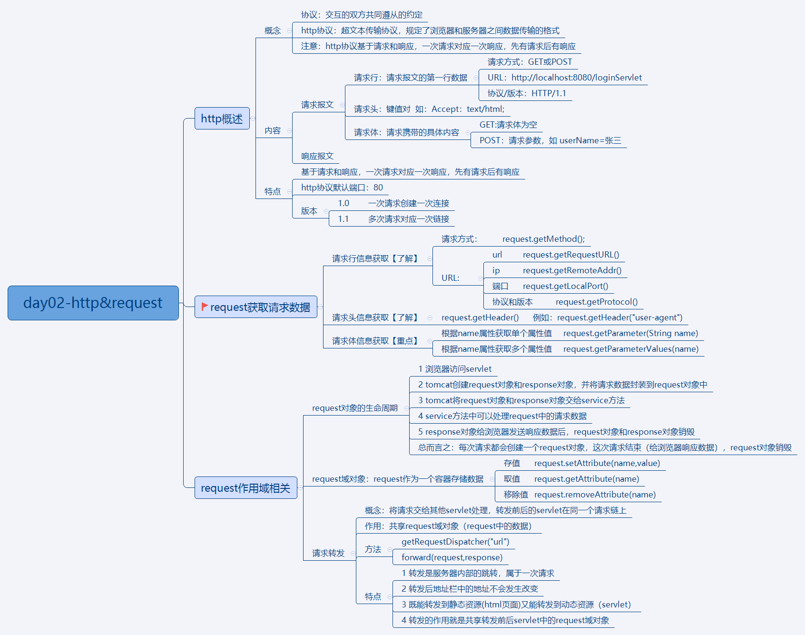
