# 1.Servlet实现方式(重点)

一共三种：

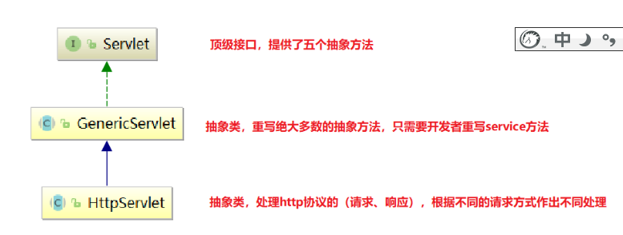

## 1.1实现Servlet方式二：自定义类继承GenericServlet

好处：只在子类中重写service即可。不用重写所有的抽象方法。

步骤：

1.自定义类继承GenericServlet类

2.在子类中重写service方法，处理业务逻辑

3.在web.xml中进行映射路径的配置

4.在浏览器客户端访问servlet类


~~~java
package com.itheima.sh.a_servlet_01;

import javax.servlet.GenericServlet;
import javax.servlet.ServletException;
import javax.servlet.ServletRequest;
import javax.servlet.ServletResponse;
import java.io.IOException;

/*
1.自定义类继承GenericServlet类
 */
public class Demo01Servlet extends GenericServlet {


    //    2.在子类中重写service方法，处理业务逻辑
    @Override
    public void service(ServletRequest servletRequest, ServletResponse servletResponse) throws ServletException, IOException {
        System.out.println("service....");
    }
}

~~~

~~~xml
<?xml version="1.0" encoding="UTF-8"?>
<web-app xmlns="http://java.sun.com/xml/ns/javaee"
           xmlns:xsi="http://www.w3.org/2001/XMLSchema-instance"
           xsi:schemaLocation="http://java.sun.com/xml/ns/javaee
		  http://java.sun.com/xml/ns/javaee/web-app_3_1.xsd"
           version="3.1">

    <!--3.在web.xml中进行映射路径的配置-->
    <servlet>
        <servlet-name>demo01Servlet</servlet-name>
        <servlet-class>com.itheima.sh.a_servlet_01.Demo01Servlet</servlet-class>
    </servlet>

    <servlet-mapping>
        <servlet-name>demo01Servlet</servlet-name>
        <url-pattern>/demo01</url-pattern>
    </servlet-mapping>


</web-app>

~~~

小结：

1.方式二的好处是只需要重写service方法，在方法体内部处理业务逻辑即可。


## 1.2实现Servlet方式三_自定义类继承HttpServlet(掌握)

好处：

​	1.可以处理满足http协议的请求和响应

​	2.根据不同的请求做不同的处理：get post

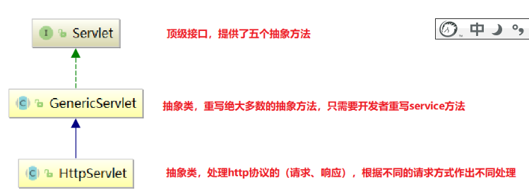

步骤：

​	1.自定义类继承HttpServlet

​	2.在子类中根据不同的请求方式重写请求方式的方法：

​			get请求---重写doGet方法

​			post请求---重写doPost方法

​	3.在方法体中书写处理业务逻辑的代码

​	4.在web.xml中进行配置

​	5.浏览器客户端访问servlet


~~~java
package com.itheima.sh.a_servlet_01;

import javax.servlet.ServletException;
import javax.servlet.http.HttpServlet;
import javax.servlet.http.HttpServletRequest;
import javax.servlet.http.HttpServletResponse;
import java.io.IOException;

/*
    1.自定义类继承HttpServlet
 */
public class Demo02Servlet extends HttpServlet {
    /*
        	2.在子类中根据不同的请求方式重写请求方式的方法：
​			get请求---重写doGet方法
​			post请求---重写doPost方法
     */
    //	3.在方法体中书写处理业务逻辑的代码
    @Override
    protected void doGet(HttpServletRequest req, HttpServletResponse resp) throws ServletException, IOException {
        System.out.println("get....");
    }

    @Override
    protected void doPost(HttpServletRequest req, HttpServletResponse resp) throws ServletException, IOException {
        System.out.println("post....");
    }
}

~~~


~~~xml
<!--4.在web.xml中进行配置-->
    <servlet>
        <servlet-name>demo02Servlet</servlet-name>
        <servlet-class>com.itheima.sh.a_servlet_01.Demo02Servlet</servlet-class>
    </servlet>

    <servlet-mapping>
        <servlet-name>demo02Servlet</servlet-name>
        <url-pattern>/demo02</url-pattern>
    </servlet-mapping>
~~~

小结：

实现servlet方式三的好处：1）可以处理满足http协议的请求和响应 2）可以根据不同的请求执行对应的方法


## 1.3实现servlet方式三_继承HttpServlet的疑问

疑问：就是正常浏览器访问tomcat服务器需要访问servlet接口中的service方法，但是我们方式三在子类中没有重写servlet中的service方法，只重写了doGet和doPost方法，那么底层是如何执行的呢？

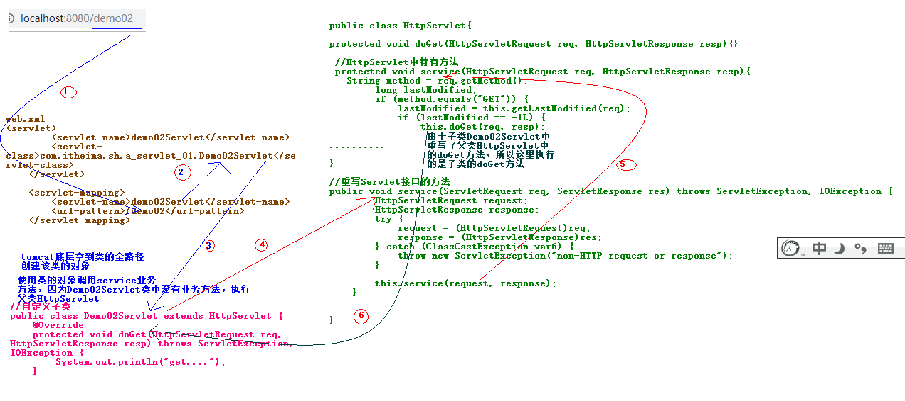

小结：

1.继承HttpServlet方式，在子类中直接重写父类HttpServlet中的doGet和doPost方法

2.然后当我们访问自定义类的servlet的时候先访问HttpServlet类实现Servlet接口中的service方法，在service方法体中调用了重载的service方法，在该方法体内部获取请求方式，根据不同的请求方式来执行对应的方法。


## 1.4实现servlet的三种方式的总结

~~~java
1.自定义类实现Servlet接口，重写所有的抽象方法，不能处理满足http协议的请求和响应
2.自定义类继承GenericServlet抽象类，该抽象类是Servlet接口的子类，这种方式只重写service方法即可，但是不能处理满足http协议的请求和响应
    
3.自定义类继承HttpServlet抽象类,该抽象类是GenericServlet的子类,根据不同的请求方式执行对应方法：
    	get----doGet
    	post---doPost
  可以处理满足http协议的请求和响应
~~~

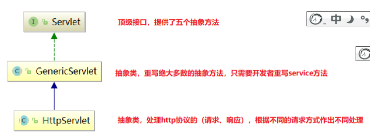

## 1.5编写servlet常见问题

### 1.遇到500错误

表示服务器内部异常。

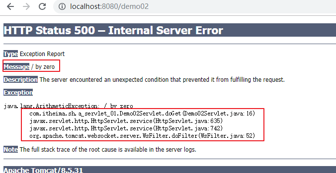

### 2.遇到404错误

浏览器客户端访问服务器的资源不存在。

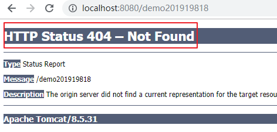

### 3.遇到405错误

服务器servlet没有重写doGet或者doPost方法。

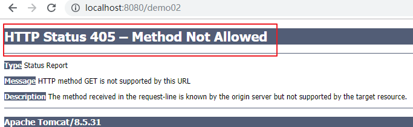


# 2.Servlet生命周期(掌握)

就是表示servlet从创建到销毁的整个过程。

## 1.图解

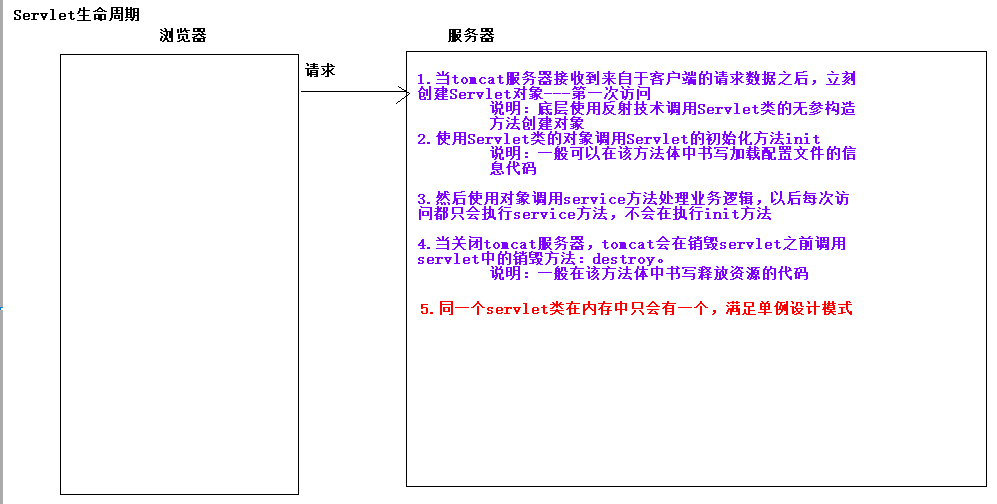


## 2.代码实现

~~~java
package com.itheima.sh.a_servlet_01;

import javax.servlet.*;
import java.io.IOException;

public class Life01Servlet implements Servlet {
    /*
        反射调用无参构造方法创建对象
     */

    public Life01Servlet() {
        System.out.println("无参构造。。。。");
    }

    @Override
    public void init(ServletConfig servletConfig) throws ServletException {
        System.out.println("init。。。。");
    }

    @Override
    public ServletConfig getServletConfig() {
        return null;
    }

    @Override
    public void service(ServletRequest servletRequest, ServletResponse servletResponse) throws ServletException, IOException {
        System.out.println("service。。。。");
    }

    @Override
    public String getServletInfo() {
        return null;
    }

    @Override
    public void destroy() {
        System.out.println("destroy。。。。");
    }
}

~~~

结果：

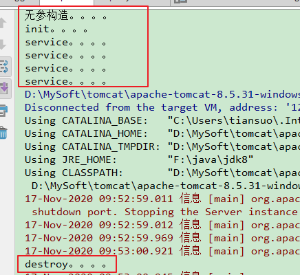

小结：

1.何时创建servlet？

第一次访问servlet的时候创建

2.谁创建的？

tomcat服务器创建的

3.创建对象时做了什么？

调用无参创建对象，然后立刻调用init初始化方法

4.每次访问servlet执行哪个方法

service

5.何时销毁servlet？

关闭tomcat服务器，调用destroy方法


# 3.服务器启动，立刻加载Servlet对象	(理解)

步骤：

在web.xml核心配置文件中对应的servlet标签中按照如下配置：

~~~xml
 <servlet>
        <servlet-name>life01Servlet</servlet-name>
        <servlet-class>com.itheima.sh.a_servlet_01.Life01Servlet</servlet-class>
        <!--
            load-on-startup 标签可以让tomcat服务器启动就创建对应的servlet。标签文本值有：
            12345，数字越小，创建servlet的优先级越高
        -->
        <load-on-startup>2</load-on-startup>
    </servlet>

    <servlet-mapping>
        <servlet-name>life01Servlet</servlet-name>
        <url-pattern>/life01</url-pattern>
    </servlet-mapping>
~~~

小结：

1. load-on-startup 标签可以让tomcat服务器启动就创建对应的servlet。标签文本值有：
            12345，数字越小，创建servlet的优先级越高
        
        ~~~xml
        <load-on-startup>2</load-on-startup>
        ~~~
        
        # 4. Servlet映射路径配置规范(掌握)
        
        servlet映射路径一共有四种：
        
        1.完全路径匹配：就是访问什么在web.xml中配置什么路径。/hello   /user
        
        ~~~java
        package com.itheima.sh.a_servlet_01;
        
        import javax.servlet.GenericServlet;
        import javax.servlet.ServletException;
        import javax.servlet.ServletRequest;
        import javax.servlet.ServletResponse;
        import java.io.IOException;
        
        public class PathOneServlet extends GenericServlet {
            @Override
            public void service(ServletRequest servletRequest, ServletResponse servletResponse) throws ServletException, IOException {
                System.out.println("PathOneServlet....");
            }
        }
        
        ~~~
        
        ~~~xml
         <servlet>
                <servlet-name>pathOneServlet</servlet-name>
                <servlet-class>com.itheima.sh.a_servlet_01.PathOneServlet</servlet-class>
            </servlet>
        
            <servlet-mapping>
                <servlet-name>pathOneServlet</servlet-name>
                <!--完全路径匹配-->
                <url-pattern>/user/one</url-pattern>
            </servlet-mapping>
        ~~~
        
        
        
        
        
        2.目录匹配：/user/*		 只要访问以/user开始的的路径都可以访问
        
        ~~~java
        package com.itheima.sh.a_servlet_01;
        
        import javax.servlet.GenericServlet;
        import javax.servlet.ServletException;
        import javax.servlet.ServletRequest;
        import javax.servlet.ServletResponse;
        import java.io.IOException;
        
        public class PathTwoServlet extends GenericServlet {
            @Override
            public void service(ServletRequest servletRequest, ServletResponse servletResponse) throws ServletException, IOException {
                System.out.println("PathTwoServlet....");
            }
        }
        
        ~~~
        
        ~~~xml
        <servlet>
                <servlet-name>pathTwoServlet</servlet-name>
                <servlet-class>com.itheima.sh.a_servlet_01.PathTwoServlet</servlet-class>
            </servlet>
        
            <servlet-mapping>
                <servlet-name>pathTwoServlet</servlet-name>
                <!--目录匹配-->
                <url-pattern>/user/*</url-pattern>
            </servlet-mapping>
        ~~~
        
        
        
        
        
        3.后缀名匹配：*.do *.action   **注意这里不能书写/**  访问以.do或者.action结尾的资源路径，后缀名都属于标识   符
        
        ~~~java
        package com.itheima.sh.a_servlet_01;
        
        import javax.servlet.GenericServlet;
        import javax.servlet.ServletException;
        import javax.servlet.ServletRequest;
        import javax.servlet.ServletResponse;
        import java.io.IOException;
        
        public class PathThrServlet extends GenericServlet {
            @Override
            public void service(ServletRequest servletRequest, ServletResponse servletResponse) throws ServletException, IOException {
                System.out.println("PathThrServlet....");
            }
        }
        
        ~~~
        
        ~~~xml
         <servlet>
                <servlet-name>pathThrServlet</servlet-name>
                <servlet-class>com.itheima.sh.a_servlet_01.PathThrServlet</servlet-class>
            </servlet>
        
            <servlet-mapping>
                <servlet-name>pathThrServlet</servlet-name>
                <!--后缀名匹配，前面不能加/-->
                <url-pattern>*.suoge</url-pattern>
            </servlet-mapping>
        ~~~
        
        
        
        4.缺省路径：/      如果上述三种路径都不满足就访问缺省路径。
        
        ~~~java
        package com.itheima.sh.a_servlet_01;
        
        import javax.servlet.GenericServlet;
        import javax.servlet.ServletException;
        import javax.servlet.ServletRequest;
        import javax.servlet.ServletResponse;
        import java.io.IOException;
        
        public class PathFourServlet extends GenericServlet {
            @Override
            public void service(ServletRequest servletRequest, ServletResponse servletResponse) throws ServletException, IOException {
                System.out.println("PathFourServlet....");
            }
        }
        
        ~~~
        
        ~~~xml
         <servlet>
                <servlet-name>pathFourServlet</servlet-name>
                <servlet-class>com.itheima.sh.a_servlet_01.PathFourServlet</servlet-class>
            </servlet>
        
            <servlet-mapping>
                <servlet-name>pathFourServlet</servlet-name>
                <!--缺省路径匹配-->
                <url-pattern>/</url-pattern>
            </servlet-mapping>
        ~~~
        
        

上述访问路径的优先级：  完全路径匹配 > 目录匹配  >  后缀名匹配  > 缺省路径


# 4.相对和绝对路径(掌握)

【1】绝对路径 掌握

~~~html
 <!--
        绝对路径：
        有两种写法：
            1.带网络三要素：
            http://ip地址:端口号/资源路径
            2.不带网络三要素：
               /资源路径   这里的/不能省略 ，要求访问的资源必须在同一个服务器上
    -->
    <a href="http://127.0.0.1:8080/pathAbso">带网络三要素的绝对路径</a><br>
    <a href="/pathAbso">不带网络三要素的绝对路径</a><br>
~~~

【2】相对路径 理解

demo01.html

~~~html
 <!--
        相对路径：不是相对当前项目，针对当前浏览器地址栏上的url而言的。
        假设我们在浏览器地址栏访问的页面路径：


           http://localhost:8080/demo01.html
        而在demo01.html页面想使用相对路径访问servlet：
            http://localhost:8080/pathAbso

            说明：
            如果在http://localhost:8080/demo01.html 页面中访问 http://localhost:8080/pathAbso 该servlet，我们通过url观察发现
            只有最后一级目录不一样，所以在demo01.html页面中相对的路径的写法是：./pathAbso  这里的./表示当前路径 可以省略不写即直接写 pathAbso

    -->
    <a href="./pathAbso">相对路径</a><br>
    <a href="pathAbso">相对路径</a><br>
~~~

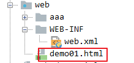

demo02.html

~~~html
 <!--
        相对路径：不是相对当前项目，针对当前浏览器地址栏上的url而言的。
        假设我们在浏览器地址栏访问的页面路径：


           http://localhost:8080/aaa/demo02.html
        而在demo01.html页面想使用相对路径访问servlet：
            http://localhost:8080/pathAbso

            说明：
            如果在http://localhost:8080/aaa/demo02.html 页面中访问 http://localhost:8080/pathAbso 该servlet，我们通过url观察发现
            在demo02.html也面中书写访问的servlet即pathAbso和当前页面的父目录aaa是同等目录，所以我这里先找该页面的父目录，然后在找
            该servlet即pathAbso
            ../pathAbso    ../表示上一级目录或者父目录，找到父目录之后再找servlet即pathAbso
    -->
    <a href="../pathAbso">相对路径</a><br>
~~~

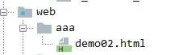

servlet:

~~~java
package com.itheima.sh.b_servlet_02;

import javax.servlet.ServletException;
import javax.servlet.http.HttpServlet;
import javax.servlet.http.HttpServletRequest;
import javax.servlet.http.HttpServletResponse;
import java.io.IOException;

public class PathAbso01Servlet extends HttpServlet {
    @Override
    protected void doGet(HttpServletRequest req, HttpServletResponse resp) throws ServletException, IOException {
        System.out.println("get....");
    }

    @Override
    protected void doPost(HttpServletRequest req, HttpServletResponse resp) throws ServletException, IOException {
        System.out.println("post....");
    }
}

~~~

# 5.Servlet3.0注解开发 （掌握）

## 1.代码实现

说明：之前我们都是使用web.xml进行servlet映射路径的配置。这样配置的弊端：web.xml中具有非常多个配置信息，显得非常臃肿并且容易出错。使用web.xml配置映射路径的方式属于servlet2.5的技术。

从servlet3.0开始引入注解配置访问servlet取代了web.xml配置。

配置步骤：

1.在包上右键---new---servlet(create new Servlet)

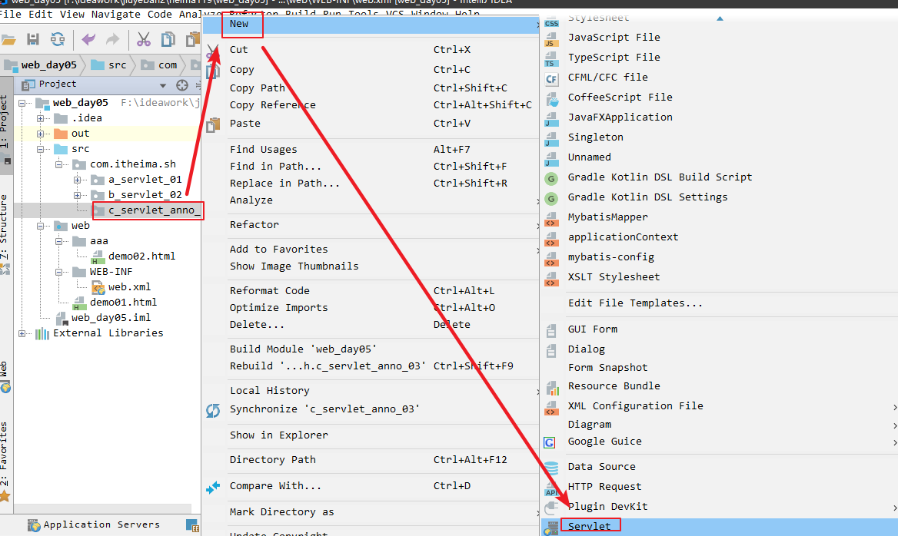

2.输入类名

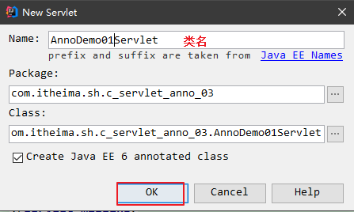


~~~java
package com.itheima.sh.c_servlet_anno_03;

import javax.servlet.ServletException;
import javax.servlet.annotation.WebServlet;
import javax.servlet.http.HttpServlet;
import javax.servlet.http.HttpServletRequest;
import javax.servlet.http.HttpServletResponse;
import java.io.IOException;

@WebServlet("/annoDemo01Servlet")
public class AnnoDemo01Servlet extends HttpServlet {
    protected void doPost(HttpServletRequest request, HttpServletResponse response) throws ServletException, IOException {
        doGet(request, response);
    }

    protected void doGet(HttpServletRequest request, HttpServletResponse response) throws ServletException, IOException {
        System.out.println("注解开发");
    }
}

~~~


浏览器访问的路径：


## 2.注意事项

### 2.1修改idea创建注解的servlet模板

1.

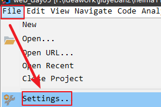

2.

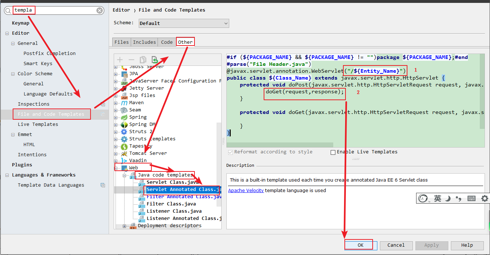

~~~java
#if (${PACKAGE_NAME} && ${PACKAGE_NAME} != "")package ${PACKAGE_NAME};#end
#parse("File Header.java")
@javax.servlet.annotation.WebServlet("/${Entity_Name}")
public class ${Class_Name} extends javax.servlet.http.HttpServlet {
    protected void doPost(javax.servlet.http.HttpServletRequest request, javax.servlet.http.HttpServletResponse response) throws javax.servlet.ServletException, java.io.IOException {
            doGet(request,response);
    }

    protected void doGet(javax.servlet.http.HttpServletRequest request, javax.servlet.http.HttpServletResponse response) throws javax.servlet.ServletException, java.io.IOException {

    }
}

~~~


### 2.2关于servlet3.0注解开发的疑问_配置路径省略了属性urlPatterns

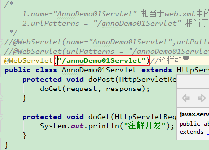

正常我们在WebServlet注解中配置的路径赋值给属性urlPatterns，但是urlPatterns不能省略的，在一个注解中，如果含有多个属性，并且每个属性都有默认值，此时给value赋值可以省略value属性。

注意啦：在WebServlet注解中属性value和urlPatterns属性是一个意思。

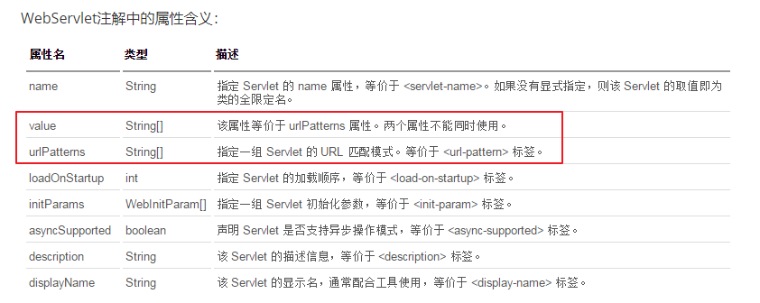


# 6.接下来讲解的知识点应用场景(掌握)

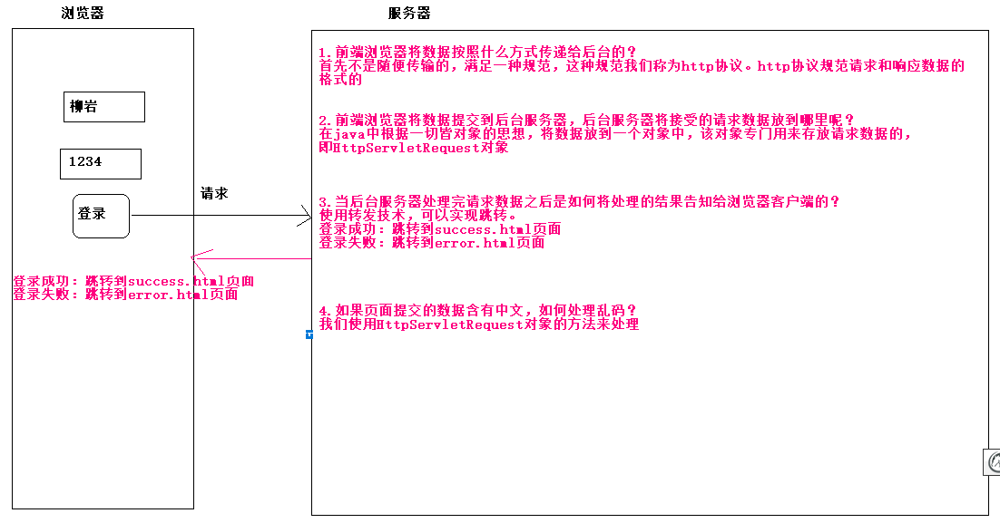

# 7.HTTP协议(掌握)

## 1.概念

全称：超文本传输协议（HTTP，HyperText Transfer Protocol)是互联网上应用最为广泛的一种网络协议。

  简而言之：浏览器和服务器数据交换固定的格式。

## 2.分类

分为两类：

【1】请求报文协议：1）请求行  2）请求头 3）请求体

【2】响应报文协议：1）响应行 2）响应头 3）响应体


## 3.特点

1.先有请求

2.再有响应

3.一个请求对应一个响应


## 4.浏览器抓包观察请求报文

步骤：

1.在浏览器访问页面，然后按f12 点击网络：

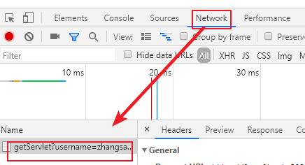


2.抓包结果分析

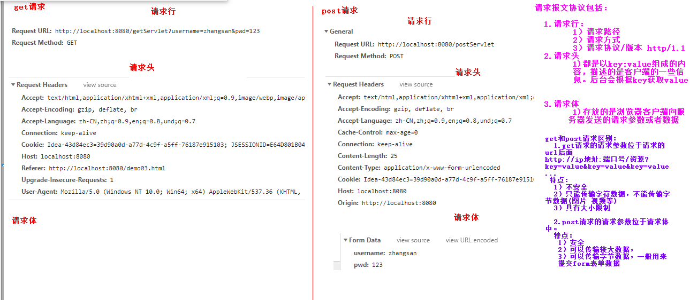


小结：

get请求和post请求区别：

~~~html
1. GET请求：
	1）请求行直接传递请求参数.将请求参数追加在URL后面，不安全。例如：form.html?username=jack&username=1234
    补充：但是get请求可以作为商品的分享。
	2）URL长度限制(不同浏览器限制大小不一致)，GET请求方式的数据大小，不可以传输数据量较大或者非文本数据。例如图片或者视频。
	3）请求体里面没有内容。

2.  POST请求：
	1）请求参数以请求体形式发送给服务器，数据传输安全。
	2）请求数据可以为非文本数据，可以传输数据量较大的数据。
	3）只有表单设置为method=”post”才是post请求.
    其他的都是get请求。常见GET请求：地址栏直接访问、<a href=””>、 location.href=""等
~~~


代码实现：

~~~html
<!DOCTYPE html>
<html lang="en">
<head>
    <meta charset="UTF-8">
    <title>Title</title>
</head>
<body>

<h2>GET请求</h2>
<form action="/getServlet" method="get">
    用户名：<input type="text" name="username" value="zhangsan" /><br>
    密码：<input type="text" name="pwd" value="123" /><br>
    <input type="submit" value="提交"/>
</form>


<h2>POST请求</h2>
<form action="/postServlet" method="post">
    用户名：<input type="text" name="username" value="zhangsan"/><br>
    密码：<input type="text" name="pwd" value="123"/><br>
    <input type="submit" value="提交"/>
</form>

</body>
</html>
~~~


~~~java
package com.itheima.sh.d_http_04;

import javax.servlet.ServletException;
import javax.servlet.annotation.WebServlet;
import javax.servlet.http.HttpServlet;
import javax.servlet.http.HttpServletRequest;
import javax.servlet.http.HttpServletResponse;
import java.io.IOException;

@WebServlet("/getServlet")
public class GetServlet extends HttpServlet {
    protected void doPost(HttpServletRequest request, HttpServletResponse response) throws ServletException, IOException {
        doGet(request, response);
    }

    protected void doGet(HttpServletRequest request, HttpServletResponse response) throws ServletException, IOException {
        System.out.println("get....");
    }
}


package com.itheima.sh.d_http_04;

import javax.servlet.ServletException;
import javax.servlet.annotation.WebServlet;
import javax.servlet.http.HttpServlet;
import javax.servlet.http.HttpServletRequest;
import javax.servlet.http.HttpServletResponse;
import java.io.IOException;

@WebServlet("/postServlet")
public class PostServlet extends HttpServlet {
    protected void doPost(HttpServletRequest request, HttpServletResponse response) throws ServletException, IOException {
        doGet(request, response);
    }

    protected void doGet(HttpServletRequest request, HttpServletResponse response) throws ServletException, IOException {
        System.out.println("post....");
    }
}

~~~


# 8.HttpServletRequest(掌握)

## 1.介绍

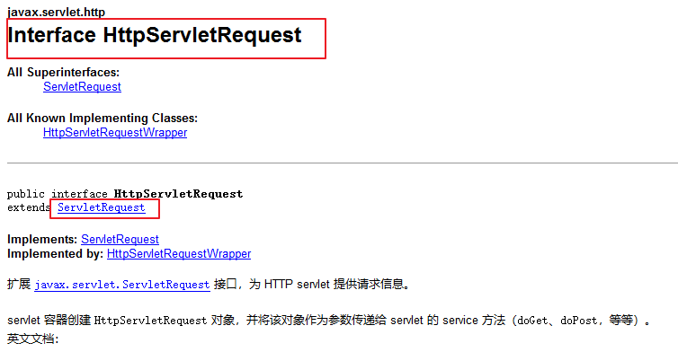

1.HttpServletRequest的父接口是ServletRequest

2.ServletRequest不能处理满足http协议的请求的

3.HttpServletRequest接口可以处理满足http协议的请求的

4.HttpServletRequest接口对象由tomcat创建的


## 2.作用

处理浏览器客户端的请求的。主要处理请求报文协议：请求行 请求头 请求体。


## 3.方法

### 3.1获取请求行信息

请求行数据：请求方式 url  请求协议。

| 方法                         | 说明                            |
| ---------------------------- | ------------------------------- |
| String getMethod()           | 获取请求方式的类型 字母是大写的 |
| StringBuffer getRequestURL() | 获取客户端发出请求完整URL       |
| String getRemoteAddr()       | 获取IP地址                      |
| String getProtocol()         | 获取当前协议的名称和版本        |

~~~java
package com.itheima.sh.e_httpservletrequest_05;

import javax.servlet.ServletException;
import javax.servlet.annotation.WebServlet;
import javax.servlet.http.HttpServlet;
import javax.servlet.http.HttpServletRequest;
import javax.servlet.http.HttpServletResponse;
import java.io.IOException;

@WebServlet("/httpServletRequestDemo01Servlet")
public class HttpServletRequestDemo01Servlet extends HttpServlet {
    protected void doPost(HttpServletRequest request, HttpServletResponse response) throws ServletException, IOException {
        doGet(request, response);
    }

    protected void doGet(HttpServletRequest request, HttpServletResponse response) throws ServletException, IOException {
        /*
            获取请求行信息方法：
                1.String getMethod()获取请求方式的类型 字母是大写的  GET POST
                2.StringBuffer getRequestURL()获取客户端发出请求完整URL
                3.String getRemoteAddr()获取IP地址
                4.String getProtocol()获取当前协议的名称和版本
         */
        //1.String getMethod()获取请求方式的类型 字母是大写的  GET POST
        System.out.println(request.getMethod());//GET
        //2.StringBuffer getRequestURL()获取客户端发出请求完整URL
        System.out.println(request.getRequestURL());//http://localhost:8080/httpServletRequestDemo01Servlet
        //3.String getRemoteAddr()获取IP地址
        /*
            0:0:0:0:0:0:0:1  属于ipv6
            获取ipv6的原因是：客户端和服务器端在同一台机器上，并且ip地址使用的是localhost。
            如果不想获取ipv6即获取ipv4那么我们访问的ip地址书写不是localhost,例如127.0.0.1
         */
        System.out.println(request.getRemoteAddr());
        //4.String getProtocol()获取当前协议的名称和版本
        System.out.println(request.getProtocol());//HTTP/1.1
    }
}

~~~

小结：

获取请求行的方法：

~~~java
获取请求行信息方法：
    1.String getMethod()获取请求方式的类型 字母是大写的  GET POST
    2.StringBuffer getRequestURL()获取客户端发出请求完整URL
    3.String getRemoteAddr()获取IP地址
    4.String getProtocol()获取当前协议的名称和版本
~~~

### 3.2获取请求头信息

请求头信息涵盖客户端的一些信息，以key:value形式存在。

| 方法                           | 作用                                                   |
| ------------------------------ | ------------------------------------------------------ |
| String  getHeader(String name) | 根据请求头的key关键字获取请求头信息                    |
| Enumeration getHeaderNames()   | 返回此请求包含的所有头信息的key,属于对枚举类型进行遍历 |

~~~java
package com.itheima.sh.e_httpservletrequest_05;

import javax.servlet.ServletException;
import javax.servlet.annotation.WebServlet;
import javax.servlet.http.HttpServlet;
import javax.servlet.http.HttpServletRequest;
import javax.servlet.http.HttpServletResponse;
import java.io.IOException;
import java.util.Enumeration;

@WebServlet("/httpServletRequestDemo02Servlet")
public class HttpServletRequestDemo02Servlet extends HttpServlet {
    protected void doPost(HttpServletRequest request, HttpServletResponse response) throws ServletException, IOException {
        doGet(request, response);
    }

    protected void doGet(HttpServletRequest request, HttpServletResponse response) throws ServletException, IOException {
        /*
            1.String  getHeader(String name)根据请求头的key关键字获取请求头信息
            2.Enumeration getHeaderNames()返回此请求包含的所有头信息的key,属于对枚举类型进行遍历
         */

        //1.String  getHeader(String name)根据请求头的key关键字获取请求头信息
        //需求：获取User-Agent 的value
        //Mozilla/5.0 (Windows NT 10.0; Win64; x64) AppleWebKit/537.36 (KHTML, like Gecko) Chrome/73.0.3683.103 Safari/537.36
        System.out.println(request.getHeader("User-Agent"));
        //2.Enumeration getHeaderNames()返回此请求包含的所有头信息的key,属于对枚举类型进行遍历
        /*
            Enumeration:属于jdk1.0开始就有的迭代器，从jdk1.2开始被Iterator取代了。
                1. boolean hasMoreElements() 测试此枚举是否包含更多的元素。 有数据返回true，否则返回false
                2. E nextElement()  获取下一个数据
         */
        Enumeration<String> en = request.getHeaderNames();
        while(en.hasMoreElements()){
            /*
                host
                connection
                cache-control
                upgrade-insecure-requests
                user-agent
                accept
                accept-encoding
                accept-language
             */
            System.out.println(en.nextElement());
        }
    }
}

~~~

小结：

1.String  getHeader(String name)根据请求头的key关键字获取请求头信息

2.Enumeration getHeaderNames()返回此请求包含的所有头信息的key,属于对枚举类型进行遍历

3.Enumeration:属于jdk1.0开始就有的迭代器，从jdk1.2开始被Iterator取代了。
                1. boolean hasMoreElements() 测试此枚举是否包含更多的元素。 有数据返回true，否则返回false
                                2. E nextElement()  获取下一个数据

### 3.3获取页面的请求参数(最为重要)

get请求：请求参数位于url后面

post请求：请求参数位于请求体中

| 方法名                                          | 描述                                                         |
| :---------------------------------------------- | ------------------------------------------------------------ |
| String  getParameter(String name)               | getParameter获得指定参数名对应的值。如果没有返回null，如果值有多个获得第一个。  例如：username=jack。**注意：参数name是form表单中的name属性值。**<input name="username"/> |
| String[] getParameterValues(name)               | getParameterValues[] 获取请求数据key相同的多个数据.一般获取的是复选框。例如爱好选项。 |
| Map<String,String[]> request.getParameterMap(); | 获得表单中所有的数据,key表示input标签name的属性值：<input name="username"/>，value是一个数组，表示input输入框的值 |

~~~java
package com.itheima.sh.e_httpservletrequest_05;

import javax.servlet.ServletException;
import javax.servlet.annotation.WebServlet;
import javax.servlet.http.HttpServlet;
import javax.servlet.http.HttpServletRequest;
import javax.servlet.http.HttpServletResponse;
import java.io.IOException;
import java.util.Arrays;
import java.util.Map;
import java.util.Set;

@WebServlet("/httpServletRequestDemo03Servlet")
public class HttpServletRequestDemo03Servlet extends HttpServlet {
    protected void doPost(HttpServletRequest request, HttpServletResponse response) throws ServletException, IOException {
        doGet(request, response);
    }

    protected void doGet(HttpServletRequest request, HttpServletResponse response) throws ServletException, IOException {
        /*
            1.String  getParameter(String name)getParameter获得指定参数名对应的值。如果没有返回null，如果值有多个获得第一个。
                 例如：username=jack。**注意：参数name是form表单中的name属性值。**<input name="username"/>
            2.String[] getParameterValues(name)getParameterValues[] 获取请求数据key相同的多个数据.一般获取的是复选框。例如爱好选项。
            3.Map<String,String[]> request.getParameterMap();获得表单中所有的数据,
                key表示input标签name的属性值：<input name="username"/>，value是一个数组，表示input输入框的值
         */
        // 1.String  getParameter(String name)getParameter获得指定参数名对应的值
        //1.1获取用户名的值
        // 用户名：<input type="text" name="username"/> getParameter方法的参数username是form表单的name属性值
        String username = request.getParameter("username");
        System.out.println("username = " + username);
        //1.2获取密码
        String password = request.getParameter("password");
        System.out.println("password = " + password);


        //2.String[] getParameterValues(name)getParameterValues[] 获取请求数据key相同的多个数据.一般获取的是复选框
        //2.1获取爱好的value属性值
        //<input type="checkbox" name="hobby" value="basketball"/>
        String[] arr = request.getParameterValues("hobby");
        System.out.println(Arrays.toString(arr));

        /*
            3.Map<String,String[]> request.getParameterMap();获得表单中所有的数据.
            key表示input标签name的属性值：<input name="username"/>，value是一个数组，表示input输入框的值
         */
        Map<String, String[]> map = request.getParameterMap();
//        System.out.println("map = " + map);
        //使用entrySet
        Set<Map.Entry<String, String[]>> entries = map.entrySet();
        //遍历
        /*
            username----[lisi]
            password----[1234]
            hobby----[basketball, football]
            education----[gz]

            说明：
            Map集合的key是html标签的name属性值,
            value是标签的value值
         */
        for (Map.Entry<String, String[]> entry : entries) {
            String key = entry.getKey();
            String[] value = entry.getValue();
            //输出
            System.out.println(key+"----"+Arrays.toString(value));
        }
    }
}

~~~

小结：

获取页面中的请求参数：

 1.String  getParameter(String name)getParameter获得指定参数名对应的值

 2.String[] getParameterValues(name)getParameterValues[] 获取请求数据key相同的多个数据.一般获取的是复选框

3.Map<String,String[]> request.getParameterMap();获得表单中所有的数据,

​           Map集合的key是html标签的name属性值,
​            value是标签的value值

 4.jdk8遍历map集合：

~~~java
		/*
            遍历map集合使用jdk8方式
         */
        map.forEach((key,value)->{
            System.out.println(key+"----"+Arrays.toString(value));
        });
~~~


# 9. BeanUtils(掌握)

需求：将页面中的所有数据封装到对应实体类中。

步骤：

1.定义和表单对应的实体类

2.创建servlet

3.在servlet中使用HttpServletRequest接口对象调用方法将数据封装到上述定义的实体类中

4.输出结果


~~~html
<!DOCTYPE html>
<html lang="zh-CN">
<head>
    <meta charset="UTF-8">
    <title>Title</title>
</head>
<body>
<form action="/paramServlet" method="get">
    用户 <input type="text" name="username" > <br>
    密码 <input type="text" name="password" > <br>
    性别
    <input type="radio" name="gender" value="male"> 男
    <input type="radio" name="gender" value="female"> 女 <br>
    爱好
    <input type="checkbox" name="hobby" value="smoke"> 抽烟
    <input type="checkbox" name="hobby" value="drink"> 喝酒
    <input type="checkbox" name="hobby" value="perm"> 烫头 <br>
    <input type="submit">
</form>
</body>
</html>
~~~

~~~java
package com.itheima.sh.e_httpservletrequest_05;

import java.util.Arrays;

/*
    1.定义和表单对应的实体类
 */
public class User {
    //成员变量---实体类成员变量名要和页面标签的name属性值一致
    //用户 <input type="text" name="username" >
    private String username;
    private String password;
    private String gender;
    private String[] hobby;
    //构造方法

    public User() {
    }

    public String getUsername() {
        return username;
    }

    public void setUsername(String username) {
        this.username = username;
    }

    public String getPassword() {
        return password;
    }

    public void setPassword(String password) {
        this.password = password;
    }

    public String getGender() {
        return gender;
    }

    public void setGender(String gender) {
        this.gender = gender;
    }

    public String[] getHobby() {
        return hobby;
    }

    public void setHobby(String[] hobby) {
        this.hobby = hobby;
    }

    @Override
    public String toString() {
        return "User{" +
                "username='" + username + '\'' +
                ", password='" + password + '\'' +
                ", gender='" + gender + '\'' +
                ", hobby=" + Arrays.toString(hobby) +
                '}';
    }
}

~~~

~~~java
package com.itheima.sh.e_httpservletrequest_05;

import org.apache.commons.beanutils.BeanUtils;

import javax.servlet.ServletException;
import javax.servlet.annotation.WebServlet;
import javax.servlet.http.HttpServlet;
import javax.servlet.http.HttpServletRequest;
import javax.servlet.http.HttpServletResponse;
import java.io.IOException;
import java.lang.reflect.InvocationTargetException;
import java.util.Map;

//2.创建servlet
@WebServlet("/paramServlet")
public class ParamServlet extends HttpServlet {
    protected void doPost(HttpServletRequest request, HttpServletResponse response) throws ServletException, IOException {
        doGet(request, response);
    }

    protected void doGet(HttpServletRequest request, HttpServletResponse response) throws ServletException, IOException {
        //3.在servlet中使用HttpServletRequest接口对象调用方法将数据封装到上述定义的实体类中
        //3.1创建实体类User对象
        User user = new User();
        //3.2获取页面提交的数据
        Map<String, String[]> map = request.getParameterMap();

        try {
            //3.3将页面提交的数据封装到user对象中
            /*
                我们在这里封装数据使用第三方工具Apache公司开发的BeanUtils。
                1.使用前需要导包
                2.使用BeanUtils工具类调用静态方法将map集合的所有数据封装到user对象中
                BeanUtils.populate(对象,map);
             */
            BeanUtils.populate(user,map);
            //4.输出结果
            System.out.println("user = " + user);
        } catch (Exception e) {
            e.printStackTrace();
        }
    }
}

~~~

小结：

1.如果页面提交的数据有很多并且需要封装到实体类对象中，此时我们可以借助于第三方工具类BeanUtils来封装。

2.使用该工具类需要导包：

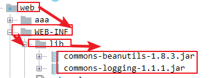

3.使用BeanUtils工具类中的静态方法：

~~~java
 BeanUtils.populate(对象,map集合);
~~~

4.BeanUtils工具类底层实现方式：

~~~java
1.获取要封装实体类的Class对象
    BeanUtils.populate(user,map);//map<key,value>  key username password
     Class clazz = user.getClass();
2.使用Class对象调用方法创建User类的对象
    User user =(User)clazz.newInstance();
3.使用反射获取User实体类中的setXxx()方法
    Method m = clazz.getMethod("setUsername",String.class);
4.执行setUsername方法
    m.invoke(user,value);
~~~

注意：如果使用BeanUtils工具类将页面的数据封装到实体类中，要求页面的name属性值必须和实体类的setXxxx()方法将set去掉，X变为x.例如 name属性值是username,那么实体类赋值方法 setUsername


# 10.request的生命周期（掌握）

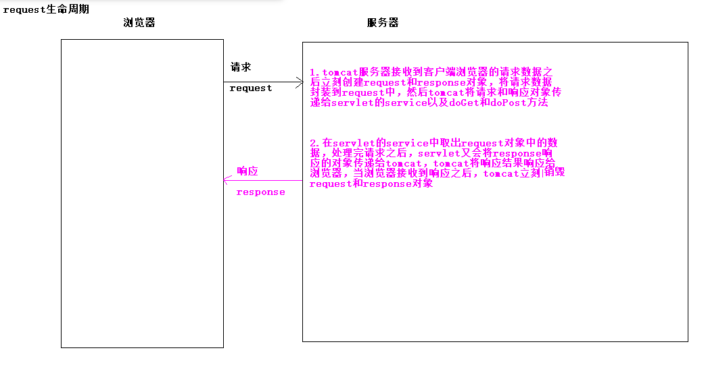

小结：

1.谁创建？

tomcat创建

2.什么时候创建？

tomcat接收到请求创建

3.何时销毁？

浏览器接收到响应数据，tomcat销毁request和response对象


# 11.HttpServletRequest域对象(掌握)

HttpServletRequest属于一个域对象，可以向HttpServletRequest中存储数据，从该对象中获取数据，并删除数据。域对象可以理解为一个容器。

只要是域对象都有如下几个方法：

| 方法                                       | 说明                                                         |
| ------------------------------------------ | ------------------------------------------------------------ |
| void   setAttribute(String name, Object o) | 往request域中设置值                                          |
| Object  getAttribute(String name)          | 从request域中根据name取值,这里的name和setAttribute()方法中的第一个参数name一致 |
| void  removeAttribute(String name)         | 从request域中移除值,这里的name和setAttribute()方法中的第一个参数name一致 |

~~~java
package com.itheima.sh.f_httpservletrequest_scope_06;

import javax.servlet.ServletException;
import javax.servlet.annotation.WebServlet;
import javax.servlet.http.HttpServlet;
import javax.servlet.http.HttpServletRequest;
import javax.servlet.http.HttpServletResponse;
import java.io.IOException;

@WebServlet("/requestScope01Servlet")
public class RequestScope01Servlet extends HttpServlet {
    protected void doPost(HttpServletRequest request, HttpServletResponse response) throws ServletException, IOException {
        doGet(request, response);
    }

    protected void doGet(HttpServletRequest request, HttpServletResponse response) throws ServletException, IOException {
        /*
            request域对象演示：
                1.void   setAttribute(String name, Object o)往request域中设置值
                2.Object  getAttribute(String name)从request域中根据name取值,这里的name和setAttribute()方法中的第一个参数name一致
                3.void  removeAttribute(String name)从request域中移除值,这里的name和setAttribute()方法中的第一个参数name一致
         */
        //1.void   setAttribute(String name, Object o)往request域中设置值
        request.setAttribute("msg","用户名或者密码错误");
        //2.Object  getAttribute(String name)从request域中根据name取值,这里的name和setAttribute()方法中的第一个参数name一致
        //getAttribute方法参数msg是setAttribute方法的第一个参数
        String msg = (String) request.getAttribute("msg");
        System.out.println("msg = " + msg);

        // 3.void  removeAttribute(String name)从request域中移除值,这里的name和setAttribute()方法中的第一个参数name一致
        request.removeAttribute("msg");

        String msg1 = (String) request.getAttribute("msg");
        System.out.println("msg1 = " + msg1);
    }
}

~~~

小结：

1.request作为域对象具有三个方法：

~~~java
setAttribute(name,value); 向域对象中存储数据
Object getAttribute(name);从域对象中获取数据
void removeAttribute(name);从域对象中删除数据
~~~

2.Object getAttribute(name) 和String getParameter(String name)区别

​	1)  Object getAttribute(name)  获取的一定使用request域对象中使用setAttitude存储的值

​	2）String getParameter(String name) 获取的数据一定是来自于浏览器页面中的


# 12.请求转发技术(掌握)

## 1.介绍

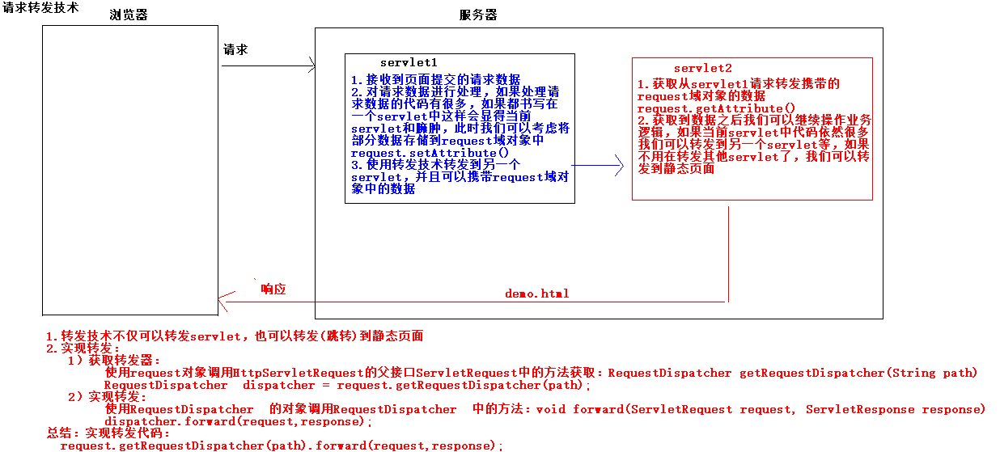

小结：

1.使用转发技术可以实现servlet之间的跳转同时可以实现从一个servlet跳转到静态页面

2.转发技术可以携带request域对象的数据

3.转发技术的代码实现：

~~~java
request.getRequestDispatcher(path).forward(request,response);
~~~


## 2.代码实现

【1】练习1：从一个Servlet转发到一个静态页面；

步骤：

1.创建servlet

~~~java
package com.itheima.sh.f_httpservletrequest_scope_06;

import javax.servlet.RequestDispatcher;
import javax.servlet.ServletException;
import javax.servlet.annotation.WebServlet;
import javax.servlet.http.HttpServlet;
import javax.servlet.http.HttpServletRequest;
import javax.servlet.http.HttpServletResponse;
import java.io.IOException;
//1.创建servlet
@WebServlet("/requestDispa01Servlet")
public class RequestDispa01Servlet extends HttpServlet {
    protected void doPost(HttpServletRequest request, HttpServletResponse response) throws ServletException, IOException {
        doGet(request, response);
    }

    protected void doGet(HttpServletRequest request, HttpServletResponse response) throws ServletException, IOException {
        //3.在servlet中使用转发技术跳转到静态页面
        //1.获取转发器
        RequestDispatcher dispatcher = request.getRequestDispatcher("/dispatcher.html");
        //2.转换
        dispatcher.forward(request,response);
    }
}

~~~


2.创建静态页面

```html
<!DOCTYPE html>
<html lang="en">
<head>
    <meta charset="UTF-8">
    <title>Title</title>
</head>
<body>
    <!--2.创建静态页面-->
    <h1>我是转发过来的。。。。</h1>
</body>
</html>
```

3.在servlet中使用转发技术跳转到静态页面


小结：

1.使用转发技术url地址栏不会改变，因为只有一次请求，地址栏会记录者最开始请求的url地址，地址不会改变

2.转发技术属于服务器内部的技术


【2】从一个Servlet转发到另一个Servlet

步骤：

1.创建两个servlet

2.在第一个servlet中向request域对象中存储数据

3.在第一个servlet中使用转发技术跳转到另一个servlet中

4.在第二个servlet中取出request中的数据

5.输出控制台

~~~java
package com.itheima.sh.f_httpservletrequest_scope_06;

import javax.servlet.ServletException;
import javax.servlet.annotation.WebServlet;
import javax.servlet.http.HttpServlet;
import javax.servlet.http.HttpServletRequest;
import javax.servlet.http.HttpServletResponse;
import java.io.IOException;

@WebServlet("/requestDispa02Servlet")
public class RequestDispa02Servlet extends HttpServlet {
    protected void doPost(HttpServletRequest request, HttpServletResponse response) throws ServletException, IOException {
        doGet(request, response);
    }

    protected void doGet(HttpServletRequest request, HttpServletResponse response) throws ServletException, IOException {
        //2.在第一个servlet中向request域对象中存储数据
        request.setAttribute("age",18);

        //3.在第一个servlet中使用转发技术跳转到另一个servlet中
        request.getRequestDispatcher("/requestDispa03Servlet").forward(request,response);
    }
}

~~~


~~~java
package com.itheima.sh.f_httpservletrequest_scope_06;

import javax.servlet.ServletException;
import javax.servlet.annotation.WebServlet;
import javax.servlet.http.HttpServlet;
import javax.servlet.http.HttpServletRequest;
import javax.servlet.http.HttpServletResponse;
import java.io.IOException;

@WebServlet("/requestDispa03Servlet")
public class RequestDispa03Servlet extends HttpServlet {
    protected void doPost(HttpServletRequest request, HttpServletResponse response) throws ServletException, IOException {
        doGet(request, response);
    }

    protected void doGet(HttpServletRequest request, HttpServletResponse response) throws ServletException, IOException {
        //4.在第二个servlet中取出request中的数据
        Integer age = (Integer) request.getAttribute("age");

        //5.输出控制台
        System.out.println("age = " + age);
    }
}

~~~


