# day06-HttpServletResponse

## 学习目标

-[ ] HttpServletResponse对象简介
-[ ] HttpServletResponse常用API
-[ ] HttpServletResponse重定向
-[ ] 登录案例--重定向
-[ ] HttpServletResponse解决响应中文乱码
-[ ] HttpServletResponse之下载功能实现


知识点回顾  

知识点总结：

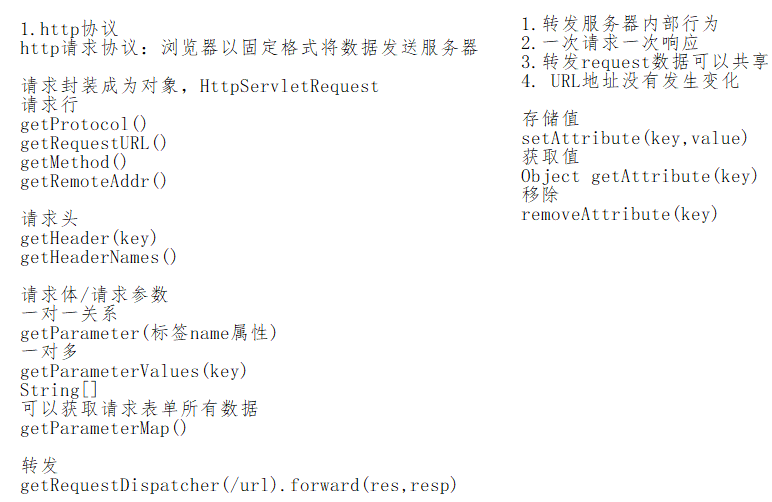


## 第一章 HTTP响应详解

​	昨天我们学习了HTTP请求协议及HttpServletRequest对象，今天我们来学习HTTP协议中的另一部分：HTTP响应协议及HttpServletResponse对象。

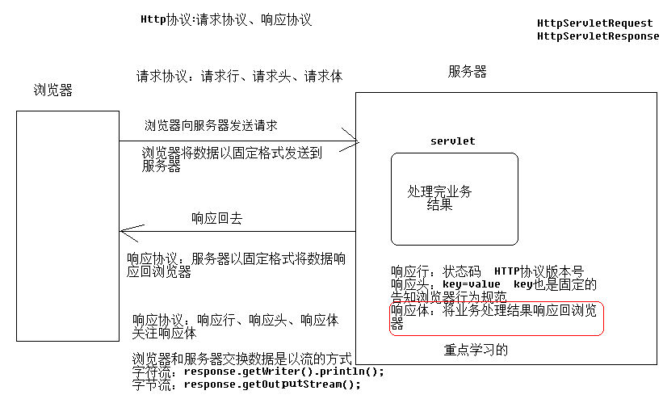

### 1、HTTP响应报文

​	HTTP是基于请求和响应的协议，一次请求对应一次响应。请求和响应的数据格式都遵从HTTP的超文本传输协议。与HTTP的请求一样，HTTP响应的数据也分为3部分：**响应行** ，**响应头** ，**响应体** 这3部分组成。请求是通过浏览器将数据传送到服务器，而响应是将服务器处理的结果回送到浏览器。

### 2、使用抓包工具查看响应数据

​	创建一个web项目，在web项目的web文件夹下创建一个hello.html页面。将下面的代码复制到hello.html页面中，启动项目，通过：url:`http://localhost:8080/hello.html`访问这个页面。使用chrome工具抓包。

【素材】hello.html静态页面

~~~html
<!DOCTYPE html>
<html>
<head>
<meta charset="UTF-8">
<title>Insert title here</title>
</head>
<body> 
    <h2>get请求</h2>
    <form action="/getServlet" method="get">
        用户名：<input type="text" name="username" value="suoge" /> <br/>
        密码：<input type="text" name="password" value="1234" /> <br/>
        <input type="submit" value="get提交" />
    </form>
     <h2>post请求</h2>
    <form action="/postServlet" method="post">
        用户名：<input type="text" name="username" value="suoge" /> <br/>
        密码：<input type="text" name="password" value="1234" /> <br/>
        <input type="submit" value="post提交" />
    </form>
</body>
</html>
~~~

分别创建GetServlet和PostServlet，代码如下：

GetServlet的代码如下：

```java
@WebServlet("/getServlet")
public class GetServlet extends HttpServlet {
    protected void doPost(HttpServletRequest request, HttpServletResponse response) throws ServletException, IOException {
        doGet(request, response);
    }
    protected void doGet(HttpServletRequest request, HttpServletResponse response) throws ServletException, IOException {
        //给浏览器响应数据
        response.getWriter().print("hello response");
    }
}
```

PostServlet的代码如下：

```java
@WebServlet("/postServlet")
public class PostServlet extends HttpServlet {
    protected void doPost(HttpServletRequest request, HttpServletResponse response) throws ServletException, IOException {
        doGet(request, response);
    }
    protected void doGet(HttpServletRequest request, HttpServletResponse response) throws ServletException, IOException {
        //给浏览器响应数据
        response.getWriter().print("hello response");
    }
}
```


抓取的响应报文如下图所示：

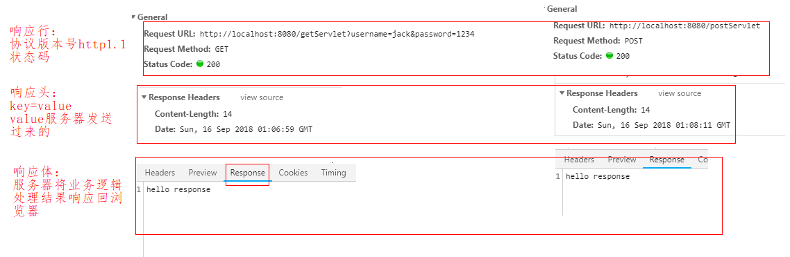

说明：

​	1）由于浏览器的原因，浏览器会把请求行和响应行信息放在了一起；

​	2）get和post请求的响应没有区别；

### 【响应行】

响应行格式：协议/版本  状态码   

>  如：HTTP/1.1 200 ;

常见状态码：

| 状态码  | 状态码描述            | 说明                                                         |
| ------- | --------------------- | ------------------------------------------------------------ |
| **200** | OK                    | 请求已成功，请求所希望的响应头或数据体将随此响应返回。出现此状态码是表示正常状态。 |
| **302** | Move temporarily      | 重定向，请求的资源临时从不同的 地址响应请求。                |
| **304** | Not Modified          | 从**浏览器**缓存中读取数据，不从服务器重新获取数据。例如，用户第一次从浏览器访问服务器端图片资源，以后在访问该图片资源的时候就不会再从服务器上加载而直接到浏览器缓存中加载，这样效率更高。 |
| **404** | Not Found             | 请求资源不存在。通常是用户路径编写错误，也可能是服务器资源已删除。 |
| 403     | Forbidden             | 服务器已经理解请求，但是拒绝执行它                           |
| 405     | Method Not Allowed    | 请求行中指定的请求方法不能被用于请求相应的资源               |
| **500** | Internal Server Error | 服务器内部错误。通常程序抛异常                               |

### **【响应头】** 

响应头也是用的键值对key:value，服务器基于**响应头**通知浏览器的行为。

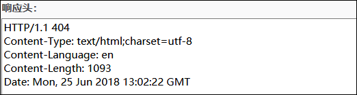 

**常见的响应头** ：

|      响应头Key      |                         响应头value                          |
| :-----------------: | :----------------------------------------------------------: |
|      location       |     指定响应的路径，需要与状态码302配合使用，完成重定向      |
|    content-Type     | 响应正文的类型（MIME类型，属于服务器里面的一种类型，例如文件在window系统有自己的类型，.txt  .doc  .jpg。文件在服务器中也有自己的类型），同时还可以解决乱码问题。例如：text/html;charset=UTF-8 |
| content-disposition | 通过浏览器以附件形式解析正文，例如：attachment;filename=xx.zip |
|       refresh       | 页面刷新，例如：3;url=www.itcast.cn    //三秒刷新页面到www.itcast.cn |

说明：

MimeType：标识数据类型

~~~
最早的HTTP协议中，并没有附加的数据类型信息，所有传送的数据都被客户程序解释为超文本标记语言HTML 文档，而为了支持多媒体数据类型，HTTP协议中就使用了附加在文档之前的MIME数据类型信息来标识数据类型。
	MIME意为多功能Internet邮件扩展，它设计的最初目的是为了在发送电子邮件时附加多媒体数据，让邮件客户程序能根据其类型进行处理。然而当它被HTTP协议支持之后，它的意义就更为显著了。它使得HTTP传输的不仅是普通的文本，而变得丰富多彩。
	每个MIME类型由两部分组成，前面是数据的大类别，例如声音audio、图象image等，后面定义具体的种类。
常见的MIME类型(通用型)：
				windows    tomcat
超文本标记语言文本 .html      text/html ***
xml文档 .xml 				text/xml
XHTML文档 .xhtml 			application/xhtml+xml
普通文本 .txt 				text/plain ***
PDF文档 .pdf 				application/pdf
Microsoft Word文件 .word 	application/msword
PNG图像 .png  			image/png ***
GIF图形 .gif 				image/gif
JPEG图形 .jpeg,.jpg 		image/jpeg
......
~~~


### 【响应体】

​	响应体，就是服务器发送给浏览器的数据。当前浏览器向服务器请求的资源是hello.html，所以服务器给浏览器响应的数据是一个html页面。

请求资源路径：

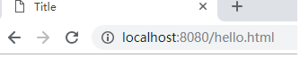

响应结果：

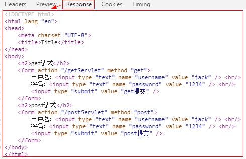 

如果请求是servlet,那么浏览器的响应体接收到的是servlet响应的数据：

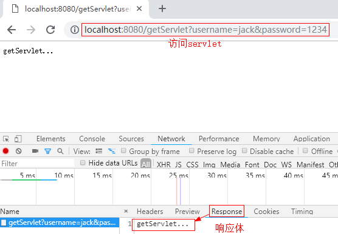

**总结：**

响应行：协议版本号 状态码 200(一切正常) 404(找不到资源路径) 500(服务器报异常) 302(和location一起使用，实现重定向) 304(从浏览器缓存中读取数据) 405(服务器的servlet没有重写doGet和doPost方法)

响应头：

location  指定响应的路径

content-type:告诉浏览器文件格式，告诉浏览器不要解析html文件，解决中文乱码问题

refresh 定时刷新

content-disposition 以附件形式展示图片等资源

响应体：

服务器处理的结果响应到浏览器中

## 第二章  HttpServletResponse对象

`遇到问题` : 服务器接受客户端的请求之后，处理请求之后，服务器如何将对应的数据响应给客户端呢？

`解决方案` : 一切皆对象，Servlet程序接受客户端请求之后，通过HttpServletResponse对象来完成向客户端的响应。

通过该对象，将`数据`返回给客户端。

### 1、HttpServletResponse对象作用

​	HttpServletResponse对象代表服务器响应，tomcat创建HttpServletResponse对象，并将该对象作为参数传递给servlet的service方法。

这个对象的**作用**：

设置响应行、头、体

下面，就这几方面对HttpServletResponse对象的常用API进行详细讲解。


### 2、HttpServletResponse对象常用API

#### 2.1【响应行】

​	响应行：协议/版本        如：HTTP/1.1 200 。这里边的信息，我们通常只会用到状态码，操作状态码的方法setStatus(int  code);

| 方法                  | 说明        |
| ------------------- | --------- |
| setStatus(int code) | 向浏览器发送状态码 |

【常用状态码】

| 对应的状态码响应状态码常量 | 说明           |
| ------------- | ------------ |
| 200           | 响应成功         |
| 404           | 资源路径错误或资源被删除 |
| 500           | 服务器内部错误      |
| 302           | 重定向          |

#### 2.2 【响应头】

| 方法                                  | 说明      |
| ----------------------------------- | ------- |
| setHeader(String name,String value) | 设置响应头信息 |

【常见响应头】

|      响应头Key      |                         响应头value                          |
| :-----------------: | :----------------------------------------------------------: |
|       refresh       | 页面刷新，例如：3;url=http://www.itcast.cn //三秒刷新页面到http://www.itcast.cn |
|    content-type     | 设置响应**数据的类型（MIME类型）**和**编码格式** 例如：text/html;charset=UTF-8 |
|      location       |    指定响应的路径，需要与状态码302配合使用，完成重定向。     |
| content-disposition | 通过浏览器以附件形式解析正文，例如：attachment;filename=xx.zip。 |

##### 2.2.1.常见响应头

【练习】响应头---定时刷新

​	需求：1. 访问到Servlet类3秒后跳转到百度；


~~~java
@WebServlet("/refreshServlet")
public class RefreshServlet extends HttpServlet {
    protected void doPost(HttpServletRequest request, HttpServletResponse response) throws ServletException, IOException {
        doGet(request, response);
    }
    protected void doGet(HttpServletRequest request, HttpServletResponse response) throws ServletException, IOException {
        //实现refresh关键字跳转功能 响应头API
        //方法具有2个参数  关键字  跳转地址
        response.setHeader("refresh","3;url=http://www.baidu.com");
    }
}
~~~

浏览器输入地址：http://localhost:8080/refreshServlet

**注意：3秒以后自动跳转到百度主页，前提你要联网啊。**

【练习】content-type 设置响应数据的类型。告诉浏览器不要解析html格式数据。

``` java
@WebServlet("/contentServlet")
public class ContentServlet extends HttpServlet {
    protected void doPost(HttpServletRequest request, HttpServletResponse response) throws ServletException, IOException {
        doGet(request, response);
    }
    protected void doGet(HttpServletRequest request, HttpServletResponse response) throws ServletException, IOException {
        //告诉浏览器不要解析html格式数据
        //每次写这些方法，代码太多，而且API还经常使用  setContentType(text/plain)
//        response.setHeader("content-type","text/plain");
        response.setContentType("text/plain");
        response.getWriter().print("<html><body><h1>itcast</h1></body></html>");
    }
}

```

说明：text/plain的意思是将文件设置为纯文本的形式，浏览器在获取到这种文件时并不会对其进行处理。

抓包查看浏览器信息：

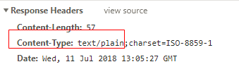

效果图：

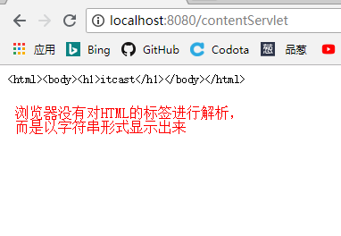

##### 2.2.2.处理响应乱码

###### 2.2.2.1乱码产生的原因

​	服务器如果需要响应给浏览器**中文数据**，tomcat使用`getWriter()`输出字符时，对于中文需要进行编码处理，而tomcat8 默认编码是`ISO-8859-1`,该码表是不支持中文编码的。所以响应给浏览器，出现乱码。

代码如下：

```java
 protected void doGet(HttpServletRequest request, HttpServletResponse response) throws ServletException, IOException {
        response.getWriter().print("<html><body><h1>黑马</h1></body></html>");
    }
```


###### 2.2.2.2响应乱码解决方案

​	因为`HttpServletResponse`实现类是由tomcat服务器提供的。所以服务器在向浏览器输出数据之前，对于**中文**要采用支持中文的编码进行编码，通过`response.setContentType("text/html;charset=utf-8"); ` ：

1. 设置响应的数据类型（text/html）;
2. 设置响应的数据编码（utf-8）；

###### 2.2.2.3处理响应乱码的API

| 方法                                       | 说明    |
| ---------------------------------------- | ----- |
| `response.setHeader("content-type","text/html;charset=utf-8");` | 设置响应头 |
| `response.setContentType("text/html;charset=utf-8");` | 简写方式  |

**【注意事项】** 

1. 开发中通常使用`response.setContentType("text/html;charset=utf-8");`来处理响应乱码；
2. 处理响应乱码必须书写在响应数据之前才起作用；


【练习】content-type 设置响应数据的类型和编码

~~~java
@WebServlet("/encodeServlet")
public class EncodeServlet extends HttpServlet {
    protected void doPost(HttpServletRequest request, HttpServletResponse response) throws ServletException, IOException {
        doGet(request, response);
    }
    protected void doGet(HttpServletRequest request, HttpServletResponse response) throws ServletException, IOException {
        //设置响应头：content-type

        //乱码产生的原因：编解码不一致
        //tomcat的编码是：ISO-8859-1

        //通过设置响应头
        //1.设置响应的数据格式；
        //2.设置响应数据的编码格式；
//         response.setHeader("content-type","text/html;charset=utf-8");
        //简化API
        response.setContentType("text/html;charset=utf-8");
        response.getWriter().print("传智播客黑马程序员");
    }
}

~~~

效果图：如果没有进行响应乱码的处理，则浏览器显示的是乱码.处理之后的效果如下所示：

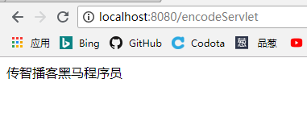

##### 2.2.3.重定向(掌握)

【重定向原理分析】

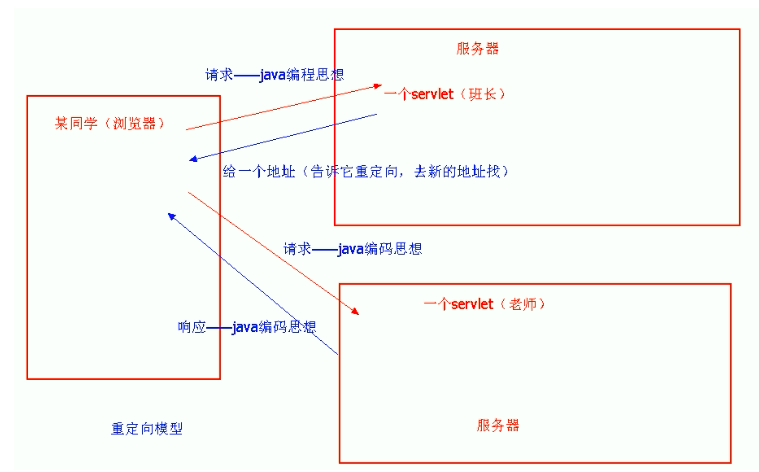

【重定向API】：  重定向可以去一个servlet，也可以去一个html静态资源.

| 方法                                       | 说明                 |
| ---------------------------------------- | ------------------ |
| `response.setStatus(302); response.setHeader("location", "/otherServlet");` | 通过设置响应状态码和响应头实现重定向 |
| `response.sendRedirect("/otherServlet");` | 重定向的简写方式           |

**【注意事项】** 

1. 开发中通常使用`response.sendRedirect("/otherServlet");`来实现重定向。

【练习】通过设置响应头location和响应行的状态码302完成重定向。

方法：

~~~java
 	 //方式一：
	 //location+302 共同完成重定向
     response.setHeader("location", "url");
    //响应行
     response.setStatus(302);
	//方式二：
	//简化的API
     response.sendRedirect("url");
~~~

班长的servlet,【MonitorServlet.java】:

~~~java
@WebServlet("/monitorServlet")
public class MonitorServlet extends HttpServlet {
    protected void doPost(HttpServletRequest request, HttpServletResponse response) throws ServletException, IOException {
        doGet(request, response);
    }
    protected void doGet(HttpServletRequest request, HttpServletResponse response) throws ServletException, IOException {
        //使用重定向
//        response.setHeader("location","/suogeServlet");
//        response.setStatus(302);
        response.sendRedirect("/suogeServlet");
    }
}
~~~

【SuogeServlet.java】

~~~java
@WebServlet("/suogeServlet")
public class SuogeServlet extends HttpServlet {
    protected void doPost(HttpServletRequest request, HttpServletResponse response) throws ServletException, IOException {
        doGet(request, response);
    }
    protected void doGet(HttpServletRequest request, HttpServletResponse response) throws ServletException, IOException {
        //处理响应乱码
        response.setContentType("text/html;charset=utf-8");
        response.getWriter().print("一起学习Java");
    }
}
~~~

浏览器地址栏输入访问网站效果：

http://localhost:8080/monitorServlet

回车之后，浏览器地址栏变为：

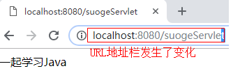

#### 2.3、转发和重定向的区别

​	完成重定向操作之后，同学们心里有一个疑问：之前学习的转发和现在的重定向都可以完成跳转，都可以跳转到一个servlet，也可以跳转到一个html静态资源，功能相同。那么他们之间有什么区别呢？

【转发和重定向区别】

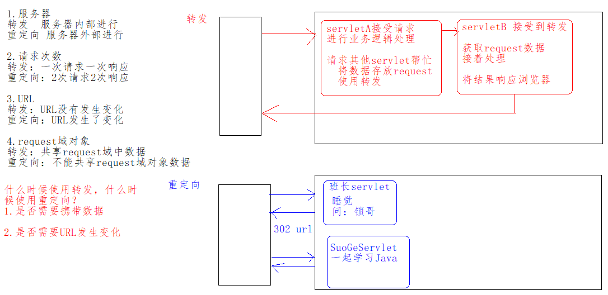

转发和重定向的另一种解释：

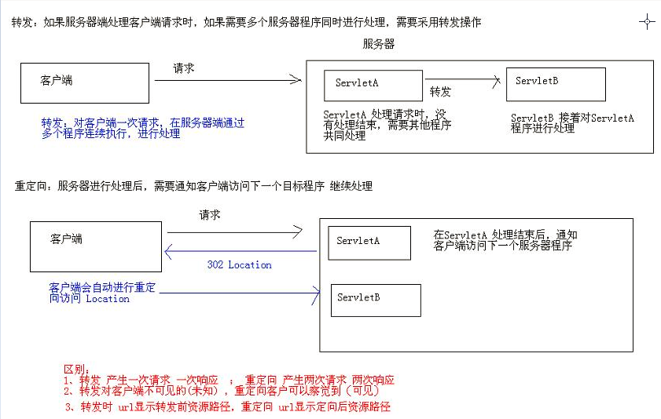

##### 2.3.1、转发和重定向的区别

| 区别点          | 转发           | 重定向        |
| ------------ | ------------ | ---------- |
| 实现原理         | 服务器内部        | 浏览器执行      |
| 请求次数         | 一次           | 两次         |
| 浏览器地址栏地址     | 不变化          | 变为第二次请求的地址 |
| 能否共享request域 | 能够共享         | 不能共享       |
| 作用           | 共享request域对象 | 完成跳转       |

##### 2.3.2、转发和重定向怎么选择

1. 如果需要共享request域，必须使用转发；
2. 如果需要将浏览器地址栏地址变为第二次请求的地址，必须使用重定向；

##### 2.3.3、【案例】通过转发和重定向改造登录案例

需求：

1. 登录成功：因为不需要携带数据，所以重定向到首页success.html；
2. 登录失败，响应给浏览器错误信息，并且让用户重新登录;


【LoginInterServlet.java】

~~~java

@WebServlet("/loginInterServlet")
public class LoginInterServlet extends HttpServlet {
    protected void doPost(HttpServletRequest request, HttpServletResponse response) throws ServletException, IOException {
        doGet(request, response);
    }

    protected void doGet(HttpServletRequest request, HttpServletResponse response) throws ServletException, IOException {
        //解决请求中文乱码问题
        request.setCharacterEncoding("utf-8");
        //获取用户名和密码

        String username = request.getParameter("username");
        String password = request.getParameter("password");
        User user = new User();
        user.setUsername(username);
        user.setPassword(password);

        //进行登陆业务逻辑处理
        UserServiceIn service = new UserService();
        boolean result = service.login(user);

        String jieguo = "";
        jieguo = result?"用户登陆成功":"用户登陆失败";
        request.setAttribute("msg",jieguo);

        //list商品信息
//        request.setAttribute("msg","loginerror");
        if (result){
            //登陆成功 转发 success.html
//            request.getRequestDispatcher("/success.html").forward(request,response);
            //登陆成功不需要携带数据 使用重定向
            response.sendRedirect("/success.html");
        }else {
            //登陆失败
//            request.getRequestDispatcher("/error.html").forward(request,response);
            //登陆失败，响应给浏览器错误信息，并且让用户重新登录
            //由于响应信息含有中文，需要处理响应乱码
             //响应给用户
            response.setContentType("text/html;charset=utf-8");
            response.getWriter().print("<html>");
            response.getWriter().print("<body>");
            response.getWriter().print("<form action='/loginInterServlet' method='post'>");
            response.getWriter().print("用户名：<input type='text' name='username'/><br/>");
            response.getWriter().print("密码：<input type='password' name='password'/><br/>");
            response.getWriter().print("<input type='submit' value='登录'/>");
            response.getWriter().print("</form>");
            response.getWriter().print("</body>");
            response.getWriter().print("</html>");
        }
    }
}
~~~

登录失败结果：

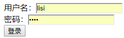

登录成功结果：

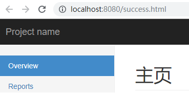

说明：上述代码中，对于登录失败的时候，响应给浏览器的代码都书写在了一个servlet中，显得代码过于臃肿，我们可以把登录失败时响应给浏览器的代码放到另一个servlet中。这样代码就不会显得那么臃肿了。

**需求：将登录信息转发到一个专门处理登录结果的Servlet。由这个Servlet给浏览器响应信息。**

修改上述的servlet代码如下：

```java
  protected void doGet(HttpServletRequest request, HttpServletResponse response) throws ServletException, IOException {
        //解决中文乱码问题
        request.setCharacterEncoding("utf-8");
        //获取用户名和密码
        String username = request.getParameter("username");
        String password = request.getParameter("password");
        //进行登陆业务逻辑处理
        User user = new User();
        user.setUsername(username);
        user.setPassword(password);

        //进行登陆业务逻辑处理
        UserServiceIn service = new UserService();
        boolean result = service.login(user);
        
        String msg = result ? "用户登陆成功" : "用户登陆失败";
      //将错误信息存入域对象中
        request.setAttribute("msg",msg);
        if (result){
            //登陆成功
//            request.getRequestDispatcher("/success.html").forward(request,response);
            response.sendRedirect("/success.html");
        }else {
            //登陆失败
            //转发到处理错误的servlet中
          request.getRequestDispatcher("/loginErrorServlet").forward(request,response);
        }
    }
```


【LoginErrorServlet.java】

~~~java
@WebServlet("/loginErrorServlet")
public class LoginErrorServlet extends HttpServlet {
    protected void doPost(HttpServletRequest request, HttpServletResponse response) throws ServletException, IOException {
        doGet(request, response);
    }
    protected void doGet(HttpServletRequest request, HttpServletResponse response) throws ServletException, IOException {
        //解决中文乱码问题
        response.setContentType("text/html;charset=utf-8");
 		String msg = (String) request.getAttribute("msg");
        response.getWriter().print("<html>");
        response.getWriter().print("<body>");
        response.getWriter().print("<form action='loginInterServlet' method='post'>");
        response.getWriter().print(" <font style='color: red'>"+msg+"</font><br/>");
        response.getWriter().print("用户名：<input type='text' name='username'/><br/>");
        response.getWriter().print("密码：<input type='password' name='password'/><br/>");
        response.getWriter().print("<input type='submit' value='登录'/>");
        response.getWriter().print("</form>");
        response.getWriter().print("</body>");
        response.getWriter().print("</html>");
    }
}

~~~

登录失败效果演示：

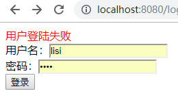

总结登录流程：

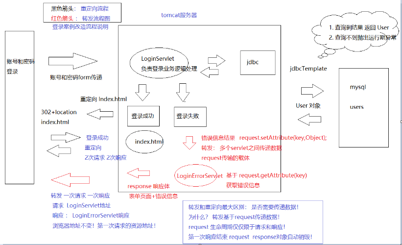


#### 2.4【响应体】 

| 方法                                     | 说明                           |
| -------------------------------------- | ---------------------------- |
| ServletOutputStream  getOutputStream() | 用于向浏览器输出二进制数据。【字节流--文件下载】    |
| java.io.PrintWriter getWriter()        | 用于向浏览器输出字符数据。【字符流--给浏览器响应数据】 |

【练习】getWriter()方法练习

~~~java
@WebServlet("/responseDemo1")
public class ResponseDemo1 extends HttpServlet {
    protected void doPost(HttpServletRequest request, HttpServletResponse response) throws ServletException, IOException {
        doGet(request, response);
    }
    protected void doGet(HttpServletRequest request, HttpServletResponse response) throws ServletException, IOException {
        /* response.getWriter()方法向浏览器打印数据：
         *
         *   方式一：response.getWriter().print()： 可以打印任意任类型的数据
                *
         * */
        char[] arr = {'a','b'};
        List<String> list = new ArrayList<>();
        list.add("liuyan");
        list.add("zhuyin");
        list.add("guanxiaotong");
        response.getWriter().println("hello");
        response.getWriter().println('a');
        response.getWriter().println(65);
        response.getWriter().println(true);
        response.getWriter().println(arr);
        response.getWriter().println(list);
    }
}
~~~

效果图：

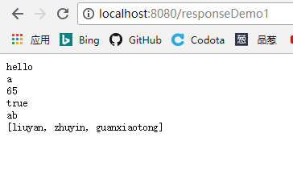

**点击源码**

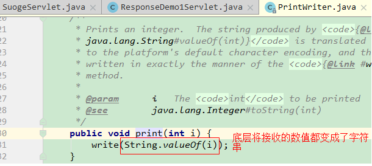

## 第三章、【案例】文件下载

对于在浏览器页面中我们以附件形式下载某个资源，我们应该不再陌生。接下来我们就要实现这个以附件形式下载某个资源的功能。举例：如下网站就可以进行浏览器以附件形式下载资源。

https://tomcat.apache.org/download-80.cgi

要想实现文件的下载，我们先学习一个API,即ServletContext。

### 3.1 ServletContext对象介绍

**ServletContext对象**：当tomcat服务器启动的时候，会为每个web项目创建一个唯一的ServletContext对象，该对象代表当前整个Web应用项目。该对象不仅封装了当前web应用的所有信息，而且实现了多个servlet的数据共享.在ServletContext中可以存放共享数据，ServletContext对象是真正的一个全局对象，凡是web容器中的Servlet都可以访问。

​	在每个项目中可以有多个Servlet程序，每个Servlet程序都是独立的。当前这个项目的配置信息，就必须使用描述这个项目的ServletContext对象获取。

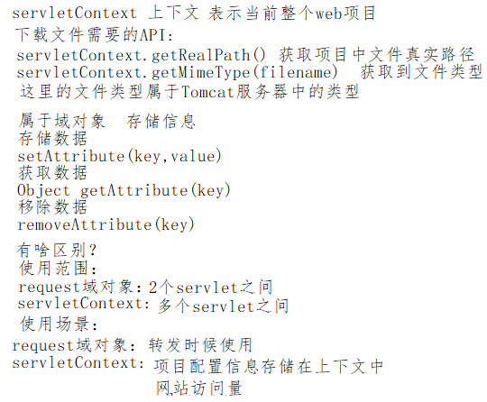	

| 方法名                                  | 描述                                                     |
| --------------------------------------- | -------------------------------------------------------- |
| setAttribute(String name,Object object) | 向ServletContext中存数据                                 |
| getAttribute(String name)               | 从ServletContext中取数据                                 |
| removeAttribute(name)                   | 从ServletContext中移除数据                               |
| String getRealPath(String path)         | 返回资源文件在服务器文件系统上的真实路径(文件的绝对路径) |
| getMimeType(fileName)                   | 获取服务器中文件类型                                     |

ServletContext对象，tomcat为每一个web项目单独创建的一个上下文（知上知下贯穿全文）对象。有如下功能：

1.可以在多个servlet之间共享数据

​	存放：setAttribute()

​	获得：getAttribute()

​	删除：removeAttribute()

2.可以获得当前WEB项目中的指定资源（文件）

​	String path = getRealPath( String string);


需求1：如何获取上下文servletContext对象。

```java
使用HttpServlet类的父类 GenericServlet 中的方法:getServletContext();
```

代码如下：

```java
/*
    获取上下文ServletContext对象：
    使用HttpServlet类的父类 GenericServlet 中的方法:getServletContext();
 */
@WebServlet("/servletContextDemoServlet")
public class ServletContextDemoServlet extends HttpServlet {
    protected void doPost(HttpServletRequest request, HttpServletResponse response) throws ServletException, IOException {
        doGet(request, response);
    }
    protected void doGet(HttpServletRequest request, HttpServletResponse response) throws ServletException, IOException {
        //获取ServletContext类的对象
        ServletContext servletContext = getServletContext();
    }
}
```

需求2：如何获取服务器中每个文件的路径。例如，在当前项目下的web文件夹下放一个1.jpg的图片，获取其真实路径(绝对路径)。

``` java
@WebServlet("/servletContextDemoServlet")
public class ServletContextDemoServlet extends HttpServlet {
    protected void doPost(HttpServletRequest request, HttpServletResponse response) throws ServletException, IOException {
        doGet(request, response);
    }
    protected void doGet(HttpServletRequest request, HttpServletResponse response) throws ServletException, IOException {
        ServletContext servletContext = getServletContext();
        //如何获取服务器中每个文件的路径。
        // 例如，在当前项目下的web文件夹下放一个1.jpg的图片，获取其真实路径(绝对路径)。
        String realPath = servletContext.getRealPath("/1.jpg");
        /*
            输出结果：
            realPath = 			F:\ideawork\jiuyeban2\heima60\heima03\out\artifacts\web_war_exploded\1.jpg
            说明：我们的项目在发布的时候会被打成一个war包，这个war包下的class文件会被放在tomcat下被运行。
            所以这里获取的真实路径是这个war包下的1.jpg所在的路径。
         */
        System.out.println("realPath = " + realPath);
    }
}
```

说明：

获取结果：

```java
realPath = 	F:\ideawork\jiuyeban2\heima60\heima03\out\artifacts\web_war_exploded\1.jpg
说明：我们的项目在发布的时候会被打成一个war包，这个war包下的class文件会被放在tomcat下被运行。
     所以这里获取的真实路径是这个war包下的1.jpg所在的路径。
```

如图：

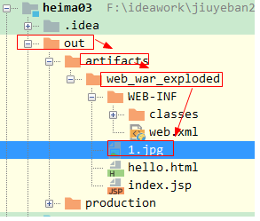

需求3：获取当前项目下的1.jpg在服务器中的文件类型。

```java
/*
    需求3：获取当前项目下的1.jpg在服务器中的文件类型。
    getMimeType("1.jpg");这里书写获取文件类型的文件名和后缀名即可
 */
  String mimeType = servletContext.getMimeType("1.jpg");
  System.out.println("mimeType = " + mimeType);//mimeType = image/jpeg
```

**注意：对于方法 getMimeType("1.jpg");这里书写获取文件类型的文件名和后缀名即可**

### 3.2 浏览器下载文件需求

~~~java
通常情况下，使用浏览器访问网站时，往往需要下载服务器资源。资源可能是文本数据或者二进制数据。
例如： 图片下载、文件下载、电影下载等。那么此时我们该如何编写代码，让客户通过浏览器获取服务器上的资源呢？
~~~

【解决方案】

~~~
1.手动给浏览器设置响应头（content-disposition）告诉浏览器以文件下载的方式打开这个文件；
2.当用户浏览器访问Servlet时，我们可以通过HttpServletResponse对象提供的getOutputStream()输出流，将服务器磁盘中的资源基于流输出给浏览器。
~~~


### 3.3 案例效果

​	用户点击页面的链接，浏览器开始下载文件；

### 3.4 案例分析

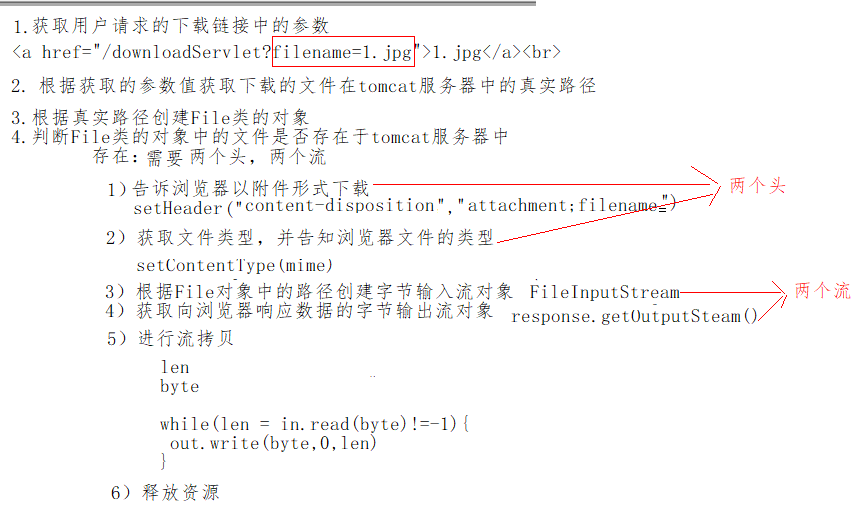

步骤：

1. 创建一个页面，展示所有要被下载的文件的链接；
2. 链接有下载的文件名称，发送给服务器的servlet，让servlet进行处理；
3. 服务器加载文件资源；
4. 提示浏览器，以下载的方式，获取服务器资源；
5. 使用IO的方式，将文件数据输出到浏览器（response.getOutputStream()）;

### 3.5 实现过程

#### 1、将下发资料中的下载文件拷贝到当前项目的WEB-INF下面

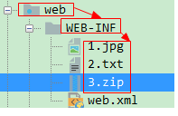

说明：将下载的文件放到WEB-INF下面，更安全，用户不会通过浏览器对其访问。

#### 2、编写文件下载页面

【原始页面】

download.html

~~~html
<!DOCTYPE html>
<html lang="en">
<head>
    <meta charset="UTF-8">
    <title>文件下载</title>
</head>
<body>
<a href="1.jpg">1.jpg</a><br>
<a href="2.txt">2.txt</a><br>
<a href="3.zip">3.zip</a><br>
</body>
</html>

~~~

【改进页面】

download.html

~~~html
<!DOCTYPE html>
<html lang="en">
<head>
    <meta charset="UTF-8">
    <title>文件下载</title>
</head>
<body>
    <a href="/downloadServlet?filename=1.jpg">1.jpg</a><br>
    <a href="/downloadServlet?filename=2.txt">2.txt</a><br>
    <a href="/downloadServlet?filename=3.zip">3.zip</a><br>
</body>
</html>
~~~

#### 3、编写Servlet处理文件下载逻辑

【提示】

1. 获取当前项目中资源的真实路径；

~~~java
 String realPath = getServletContext().getRealPath("/WEB-INF/"+filename)；
~~~

2. 获取文件的mimeType；

~~~java
String mimeType =  getServletContext().getMimeType(fileName);
~~~


【参考代码】 文件下载

~~~java
@WebServlet("/downloadServlet")
public class DownLoadServlet extends HttpServlet {
    protected void doPost(HttpServletRequest request, HttpServletResponse response) throws ServletException, IOException {
        doGet(request, response);
    }
    protected void doGet(HttpServletRequest request, HttpServletResponse response) throws ServletException, IOException {
         //解决请求中文乱码问题
        request.setCharacterEncoding("UTF-8");
        //解决响应体乱码问题
        response.setContentType("text/html;charset=utf-8");
     	//获取用户请求携带过来的参数
        String filename = request.getParameter("filename");
        //获取上下文对象
        ServletContext servletContext = getServletContext();
        //获取文件真实路径
        String realPath = servletContext.getRealPath("WEB-INF\\" + filename);
        System.out.println("realPath = " + realPath);
        //创建File类的对象
        File f = new File(realPath);
        //判断文件是否存在于服务器中
        if (f.exists()){
            //当前文件存在
            //两个流  两个头
            //设置浏览器以附件形式进行下载
            response.setHeader("Content-Disposition","attachment;filename="+filename);
            //获取文件类型
            String mimeType = servletContext.getMimeType(filename);
            //告诉浏览器文件类型
            response.setContentType(mimeType);
            //创建字节输入流对象关联服务器中的文件
            FileInputStream fis = new FileInputStream(f);
            //创建输出流向浏览器中写数据
            ServletOutputStream os = response.getOutputStream();
            //拷贝数据
            byte[] buf = new byte[1024];
            int len = 0;
            while((len=fis.read(buf))!=-1)
            {
                os.write(buf,0,len);
            }
            //释放资源
            fis.close();
            os.close();
        }
    }
}
~~~

效果图：

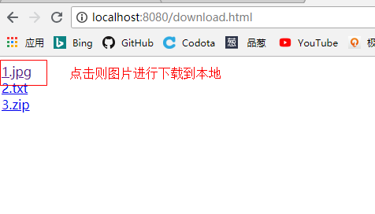

补充说明：

1、我们上述的文件名都没有汉字，将1.jpg改为刘亦菲.jpg.则会出现乱码问题。

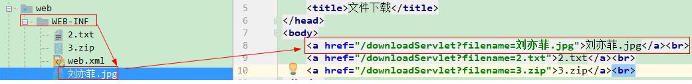

解决乱码问题：

首先要处理接收请求中文乱码问题：

```java
 request.setCharacterEncoding("utf-8");
```

然后解决响应给浏览器的乱码问题：

```java
//解决响应体乱码问题
response.setContentType("text/html;charset=utf-8");
```

说明：上述只是解决响应体乱码问题，不能解决响应头乱码问题，由于告诉浏览器以附件形式下载，使用的文件名在响应头中响应给浏览器，所以上述不能解决乱码问题。所以我们采用另外一种解决方案。

使用我们之前学习过的URLEncoder按照UTF-8的编码方式对filename文件名进行编码。

```java
  //设置浏览器以附件形式下载
  //对文件名编码
  String encodeFilename = URLEncoder.encode(filename, "UTF-8");
  response.setHeader("Content-Disposition","attachment;filename="+encodeFilename);
```

2、关于设置文件为附件的形式

```java
//我们的标准代码
response.setHeader("Content-Disposition","attachment;filename="+encodeFilename);
//如果不加attachment关键字，则用户点击图片就可以直接在浏览器查看图片了，而我们的功能是下载。所以要加attachment关键字,attachment表示附件的意思
//response.setHeader("Content-Disposition","filename="+encode);
```

说明：

​	1)对于response.setHeader("Content-Disposition","attachment;filename="+encodeFilename);

​		如果不加attachment关键字，则用户点击图片就可以直接在浏览器查看图片了，而我们的功能是下载。所以要加attachment关键字,attachment表示附件的意思。

​		如果不书写 filename ，那么下载的文件名字就是当前servlet的路径名字。

 3、【文件下载】两个头+流拷贝

1. 设置响应头：Content-Disposition 告诉浏览器以附件的形式来处理文件；
2. 设置响应头： response.setContentType(mimeType) 告诉浏览器下载的文件的类型；
3. 流拷贝：
   1. 将文件读取到流里边： FileInputStream fin = new FileInputStream(file)；
   2. 将流写给浏览器：response.getOutputStream().write(arr,0,len);


## 第四章、注册案例

### 4.1注册案例流程图

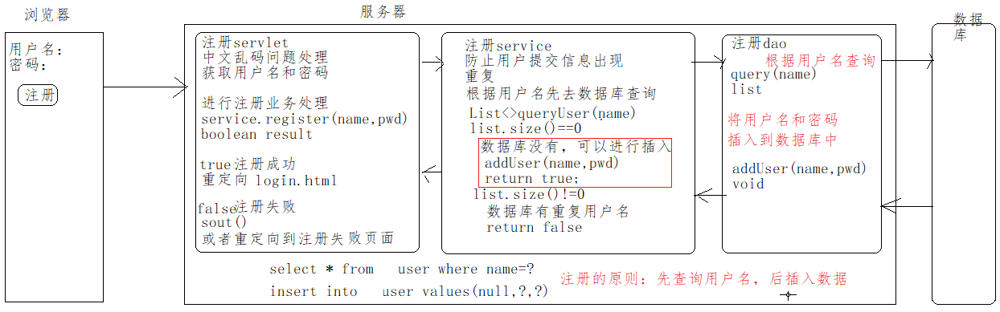

### 4.2代码实现

直接在之前登录的项目中完成注册功能即可。

注册前端页面register.html：

```html
<!DOCTYPE html>
<html lang="en">
<head>
    <meta charset="UTF-8">
    <title>Title</title>
</head>
<body>
<form action="/registerServlet" method="post">
    用户名：<input type="text" name="username"><br>
    密码：<input type="password" name="password"><br>
    <input type="submit" value="注册">
</form>
</body>
</html>
```

web层代码

```java
package com.itheima.sh.web;
import com.itheima.sh.domain.User2;
import com.itheima.sh.service.UserService;
import javax.servlet.ServletException;
import javax.servlet.annotation.WebServlet;
import javax.servlet.http.HttpServlet;
import javax.servlet.http.HttpServletRequest;
import javax.servlet.http.HttpServletResponse;
import java.io.IOException;
@WebServlet("/registerServlet")
public class RegisterServlet extends HttpServlet {
    protected void doPost(HttpServletRequest request, HttpServletResponse response) throws ServletException, IOException {
        doGet(request, response);
    }
    protected void doGet(HttpServletRequest request, HttpServletResponse response) throws ServletException, IOException {
        //解决请求乱码
        request.setCharacterEncoding("UTF-8");
        //获取用户名
        String username = request.getParameter("username");
        //获取密码
        String password = request.getParameter("password");
        //创建业务层对象
        UserService userService = new UserService();
        //使用业务层对象调用方法注册
        boolean boo = userService.register(username,password);
        //对boo结果进行判断
        if (boo) {
            //注册成功，跳转到登录页面，不需要携带数据
            response.sendRedirect("/login.html");
        } else {
            //注册失败，跳转到注册失败页面或者输出一句话
//            System.out.println("注册失败");
            response.sendRedirect("/registererror.html");
        }
    }
}
```

service层代码:

UserService类

~~~java
public boolean register(String username, String password) {
        //根据用户名username到数据库中查询是否存在该用户名  有  注册失败  无 可以进行插入操作
        //4. 通过会话工厂得到会话对象
        SqlSession session = SessionFactoryUtil.getSqlSession();
        //5. 会话对象得到User2Mapper接口的代理对象
        User2Mapper user2Mapper = session.getMapper(User2Mapper.class);
        //根据用户名查询用户是否存在
        User2 u = user2Mapper.findUserByUsername(username);
        //判断u是否等于null
        if(u == null){
            //没有该用户名，可以注册
            user2Mapper.register(username,password);
            //提交事务
            session.commit();
//            //返回给web层
            return true;
        }else{
            //有用户名，不能注册
            return false;
        }
    }
~~~

dao层

User2Mapper接口代码

~~~java
public interface User2Mapper {
    //根据用户名查询用户信息
    @Select("select * from user where username=#{username}")
    User2 findUserByUsername(String username);
    //根据用户名和密码进行注册
    @Insert("insert into user values(null,#{username},#{password})")
    void register(@Param("username")String username, @Param("password")String password);
}
~~~

说明：

1.在dao接口方法中的参数前面加@param注解情景：

~~~java
1)当只有一个参数时，dao接口的方法中可不用添加注解。Mybatis可成功匹配参数。也可以添加注解@Param
2)当大于一个参数时，dao接口的方法中需要使用注解@Param(“XXX”)为Mybatis指定参数名称。
    例如：@Param("username")String username 由于双引号中书写的是username,那么sql语句中也必须是username，如果双引号中是name,那么sql语句中也是name.
~~~


实体类User2：

```java
package com.itheima.sh.domain;

public class User2 {
    private Integer id;
    private String username;
    private String password;
    public Integer getId() {
        return id;
    }
    public void setId(Integer id) {
        this.id = id;
    }
    public String getUsername() {
        return username;
    }
    public void setUsername(String username) {
        this.username = username;
    }
    public String getPassword() {
        return password;
    }
    public void setPassword(String password) {
        this.password = password;
    }
    @Override
    public String toString() {
        return "User{" +
                "id=" + id +
                ", username='" + username + '\'' +
                ", password='" + password + '\'' +
                '}';
    }
}
```


## 今日小结

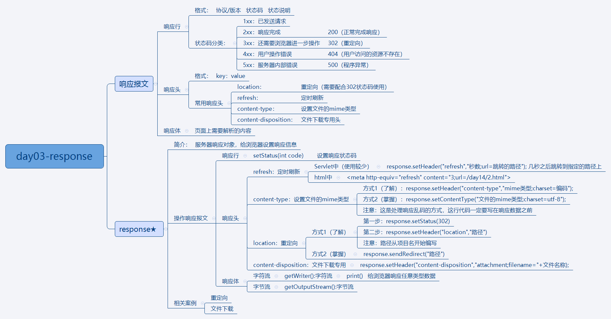


##   今日作业

1. 能够处理响应乱码；
2. 能够理解重定向原理，并编写重定向代码；
3. 能够理解重定向和转发的应用场景；
4. 能够转发和重定向完善登录案例；
5. 能够编写代码完成文件下载功能；
6. 能够完成注册案例;


