~~~java
hashmap源码讲解：
https://www.bilibili.com/video/BV1FE411t7M7?from=search&seid=6770237609394974548
~~~


# 1.登录案例(必须完成)

## 1.开发步骤

1.画流程开发图

2.搭建项目环境

3.根据流程图编写代码

4.浏览器访问服务器，测试功能

## 2.画流程开发图

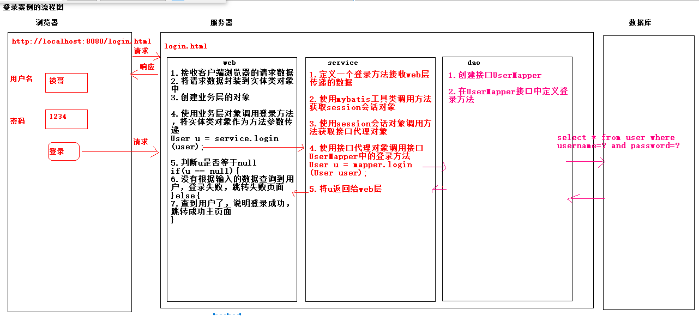


## 3.搭建项目环境

### 3.1后台环境

#### 1.数据库环境

~~~java
create database day11_db;
use day11_db;
DROP TABLE IF EXISTS `user`;
CREATE TABLE `user` (
  `id` int(11) NOT NULL AUTO_INCREMENT,
  `username` varchar(20) NOT NULL,
  `password` varchar(32) NOT NULL,
  PRIMARY KEY (`id`)
) ENGINE=InnoDB AUTO_INCREMENT=5 DEFAULT CHARSET=utf8;

-- ----------------------------
-- Records of user
-- ----------------------------
INSERT INTO `user` VALUES ('1', 'zhangsan', '1234');
INSERT INTO `user` VALUES ('2', 'lisi', '1234');
INSERT INTO `user` VALUES ('3', 'wangwu', '1234');
INSERT INTO `user` VALUES ('4', 'zhaoliu', '1234');
~~~

#### 2.创建工程并创建分层包

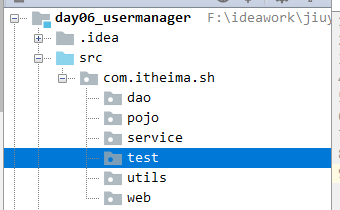

#### 3.导入第三方jar包

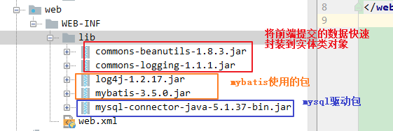


#### 4.配置文件

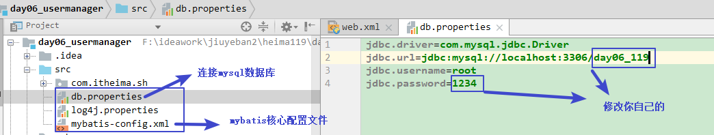

#### 5.实体类

~~~java
package com.itheima.sh.pojo;

public class User {
    //成员变量
    private Integer id;
    private String username;
    private String password;

    public User() {
    }

    public Integer getId() {
        return id;
    }

    public void setId(Integer id) {
        this.id = id;
    }

    public String getUsername() {
        return username;
    }

    public void setUsername(String username) {
        this.username = username;
    }

    public String getPassword() {
        return password;
    }

    public void setPassword(String password) {
        this.password = password;
    }

    @Override
    public String toString() {
        return "User{" +
                "id=" + id +
                ", username='" + username + '\'' +
                ", password='" + password + '\'' +
                '}';
    }
}

~~~


#### 6.测试类

~~~java
package com.itheima.sh.test;

import com.itheima.sh.pojo.User;
import com.itheima.sh.utils.SessionFactoryUtils;
import org.apache.ibatis.session.SqlSession;
import org.junit.Test;

import java.util.List;

public class UserManagerTest {
    @Test
    public void queryAllUsers(){
        //1.使用mybatis的工具类获取会话对象
        SqlSession session = SessionFactoryUtils.getSession();
        //2.使用会话对象调用方法获取接口代理对象
        UserMapper mapper = session.getMapper(UserMapper.class);
        //3.使用接口代理对象调用方法查询所有用户
        List<User> list = mapper.queryAllUsers();
        //4.遍历集合打印到控制台
        System.out.println("list = " + list);
    }
}

~~~


#### 7.工具类

~~~java
package com.itheima.sh.utils;

import org.apache.ibatis.io.Resources;
import org.apache.ibatis.session.SqlSession;
import org.apache.ibatis.session.SqlSessionFactory;
import org.apache.ibatis.session.SqlSessionFactoryBuilder;

import java.io.IOException;
import java.io.InputStream;

/**
 * @author tiansuo
 * @date 2019-11-12 10:02
 *  会话工厂工具类
        1. 通过静态方法得到一个工厂对象
        2. 通过静态方法得到会话对象
 *
 */
public class SessionFactoryUtils {
    //声明一个工厂对象
    private static SqlSessionFactory factory;
    //在静态代码块中创建会话工厂
    static {
        SqlSessionFactoryBuilder builder = new SqlSessionFactoryBuilder();
        //得到输入流
        try(InputStream inputStream = Resources.getResourceAsStream("mybatis-config.xml");) {
            factory = builder.build(inputStream);
        } catch (IOException e) {
            e.printStackTrace();
        }
    }
    /**
     静态方法得到会话工厂
     */
    public static SqlSessionFactory getSessionFactory() {
        return factory;
    }
    /**
     得到会话对象
     */
    public static SqlSession getSession() {
        return factory.openSession();
    }
}

~~~

#### 8.UserMapper接口

~~~java
package com.itheima.sh.dao;

import com.itheima.sh.pojo.User;
import org.apache.ibatis.annotations.Select;

import java.util.List;

public interface UserMapper {
    @Select("select * from user")
    List<User> queryAllUsers();
}

~~~


### 3.2前台环境

直接将资料中的内容复制到工程下面的web文件夹即可。

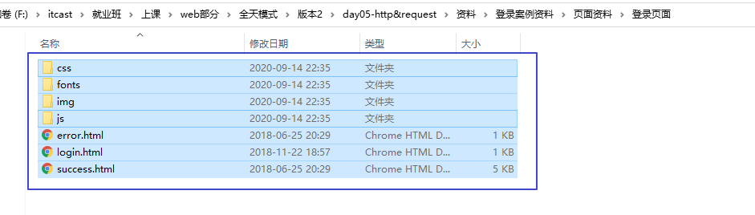

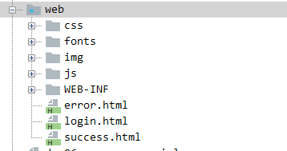


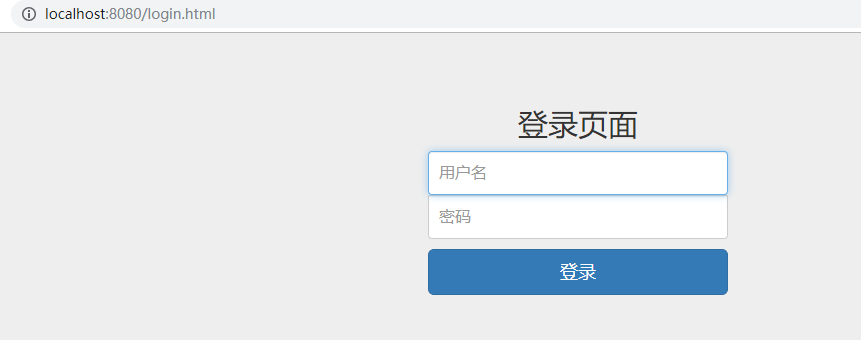


## 4.根据流程图编写代码

### 1.dao层

~~~java
package com.itheima.sh.dao;

import com.itheima.sh.pojo.User;
import org.apache.ibatis.annotations.Select;

import java.util.List;
//1.创建接口UserMapper

public interface UserMapper {
    
    //2.在UserMapper接口中定义登录方法
    /*
        username=#{username}:
            1.等号左边的username看数据表的字段名
            2.#{username}:大括号中的username，由于login方法参数是User实体类类型，所以这里的username书写看User实体类中的成员变量名username
            实际上这里调用的是User实体类中的getUsername
     */
    @Select("select * from user where username=#{username} and password=#{password}")
    User login(User user);

}

~~~

小结：

1.定义根据用户名和密码查询的方法

2.

~~~java
username=#{username}:
            1.等号左边的username看数据表的字段名
            2.#{username}:大括号中的username，由于login方法参数是User实体类类型，所以这里的username书写看User实体类中的成员变量名username
            实际上这里调用的是User实体类中的getUsername
~~~


### 2.service层

```java
package com.itheima.sh.service;

import com.itheima.sh.dao.UserMapper;
import com.itheima.sh.pojo.User;
import com.itheima.sh.utils.SessionFactoryUtils;
import org.apache.ibatis.session.SqlSession;

/*
    业务层
 */
public class UserService {
    //1.定义一个登录方法接收web层传递的数据
    public User login(User user){
        //2.使用mybatis工具类调用方法获取会话对象
        SqlSession session = SessionFactoryUtils.getSession();
        //3.使用session对象调用UserMapper接口代理对象
        UserMapper mapper = session.getMapper(UserMapper.class);
        //4.使用接口代理对象mapper调用接口中的方法根据用户名和密码查询数据
        User u = mapper.login(user);
        //5.关闭session
        session.close();
        //6.返回u
        return u;
    }
}
```

小结：

使用mybatis工具类获取接口代理对象，调用方法查询用户并返回查询的实体类对象给web层。

### 3.web层

~~~java
package com.itheima.sh.web;

import com.itheima.sh.pojo.User;
import com.itheima.sh.service.UserService;

import javax.servlet.ServletException;
import javax.servlet.annotation.WebServlet;
import javax.servlet.http.HttpServlet;
import javax.servlet.http.HttpServletRequest;
import javax.servlet.http.HttpServletResponse;
import java.io.IOException;

@WebServlet("/loginServlet")
public class LoginServlet extends HttpServlet {
    protected void doPost(HttpServletRequest request, HttpServletResponse response) throws ServletException, IOException {
        doGet(request, response);
    }

    protected void doGet(HttpServletRequest request, HttpServletResponse response) throws ServletException, IOException {
        //1.接收客户端浏览器的请求数据
        //<input type="text"  name="username" class="form-control" placeholder="用户名" required autofocus>
        String username = request.getParameter("username");
        String password = request.getParameter("password");
        //2.将请求数据封装到实体类对象中
        User user = new User();
        user.setUsername(username);
        user.setPassword(password);
        //3.创建业务层的对象
        UserService service = new UserService();
        //4.使用业务层对象调用登录方法，将实体类对象作为方法参数传递
        User u = service.login(user);

        //5.判断u是否等于null
        if(u == null){
            //6.没有根据输入的数据查询到用户，登录失败，跳转失败页面
            request.getRequestDispatcher("/error.html").forward(request,response);
        }else{
            //7.查到用户了，说明登录成功，跳转成功主页面
            request.getRequestDispatcher("/success.html").forward(request,response);
        }
    }
}
~~~

## 5.解决post请求乱码问题

从tomcat8开始以后，对于get请求乱码，tomcat已经解决。对于post请求中文乱码没有解决，需要我们自己处理。

### 1.post请求乱码产生的原因

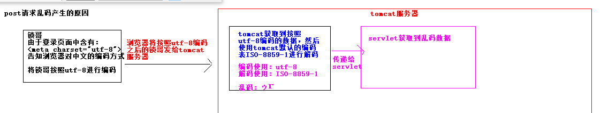

小结：

页面使用的编码表是UTF-8编码，tomcat使用的是默认编码表ISO-8859-1进行解码，编码和解码使用的编码表不一致导致乱码。

### 2.解决post请求乱码

#### 2.1解决post乱码思路

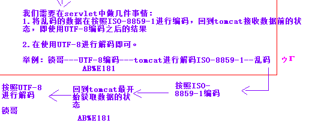

小结：

1.先按照ISO-8859-1编码

2.在按照UTF-8进行重新解码

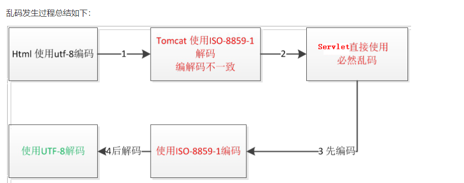

#### 2.2实现

~~~java
package com.itheima.sh.web;

import com.itheima.sh.pojo.User;
import com.itheima.sh.service.UserService;

import javax.servlet.ServletException;
import javax.servlet.annotation.WebServlet;
import javax.servlet.http.HttpServlet;
import javax.servlet.http.HttpServletRequest;
import javax.servlet.http.HttpServletResponse;
import java.io.IOException;
import java.net.URLDecoder;
import java.net.URLEncoder;

@WebServlet("/loginServlet")
public class LoginServlet extends HttpServlet {
    protected void doPost(HttpServletRequest request, HttpServletResponse response) throws ServletException, IOException {
        doGet(request, response);
    }

    protected void doGet(HttpServletRequest request, HttpServletResponse response) throws ServletException, IOException {
        //处理请求乱码
        request.setCharacterEncoding("utf-8");
        //1.接收客户端浏览器的请求数据
        //<input type="text"  name="username" class="form-control" placeholder="用户名" required autofocus>
        String username = request.getParameter("username");

        /*
            解决post请求乱码实现：
            方式一：
                编码：URLEncoder：HTML 格式编码的实用工具类。编码方法：
                    static String encode(String s, String enc)  参数：s 编码的字符串  enc  编码使用的编码表
                解码：URLDecoder ： HTML 格式解码的实用工具类，解码方法：
                    static String decode(String s, String enc)   参数：s 解码的字符串  enc  解码使用的编码表
         */
        //编码：URLEncoder：HTML 格式编码的实用工具类。编码方法：
//        String encode = URLEncoder.encode(username, "ISO-8859-1");
//        //解码：URLDecoder ： HTML 格式解码的实用工具类，解码方法：
//        username = URLDecoder.decode(encode, "UTF-8");

         /*
            解决post请求乱码实现：
            方式二：
                编码：使用String类的方法进行编码：byte[] getBytes(String charsetName)   参数表示指定的码表
                解码：使用String类的构造方法：String(byte[] bytes, String charsetName) 参数：第一个参数是字节数组 第二个参数表示指定的码表
         */
         // 编码：使用String类的方法进行编码：byte[] getBytes(String charsetName)   参数表示指定的码表
//        byte[] bytes = username.getBytes("ISO-8859-1");
//        // 解码：使用String类的构造方法：String(byte[] bytes, String charsetName) 参数：第一个参数是字节数组 第二个参数表示指定的码表
//        username = new String(bytes, "UTF-8");
//        username = new String(username.getBytes("ISO-8859-1"), "UTF-8");

        /*
            解决post请求乱码实现：
            方式三：推荐使用
            使用request对象调用方法： void setCharacterEncoding(String env) 参数：env指定的编码表
                                    说明：
                                        1.该方法是用来解决请求体数据的乱码问题。get请求体没有数据，post请求体含有数据。可以认为该方法
                                        就是解决post请求乱码的
                                        2.该方法必须放到获取所有请求数据之前处理乱码。
         */
        //处理请求乱码
//        request.setCharacterEncoding("utf-8");
        String password = request.getParameter("password");
        //2.将请求数据封装到实体类对象中
        User user = new User();
        user.setUsername(username);
        user.setPassword(password);
        //3.创建业务层的对象
        UserService service = new UserService();
        //4.使用业务层对象调用登录方法，将实体类对象作为方法参数传递
        User u = service.login(user);

        //5.判断u是否等于null
        if(u == null){
            //6.没有根据输入的数据查询到用户，登录失败，跳转失败页面
            request.getRequestDispatcher("/error.html").forward(request,response);
        }else{
            //7.查到用户了，说明登录成功，跳转成功主页面
            request.getRequestDispatcher("/success.html").forward(request,response);
        }

    }
}
~~~

小结：

1.tomcat8以后对于get请求乱码已经处理完毕，我们只需要处理post请求

2.处理post请求乱码有三种方式：

方式一：

~~~java
 /*
            解决post请求乱码实现：
            方式一：
                编码：URLEncoder：HTML 格式编码的实用工具类。编码方法：
                    static String encode(String s, String enc)  参数：s 编码的字符串  enc  编码使用的编码表
                解码：URLDecoder ： HTML 格式解码的实用工具类，解码方法：
                    static String decode(String s, String enc)   参数：s 解码的字符串  enc  解码使用的编码表
         */
        //编码：URLEncoder：HTML 格式编码的实用工具类。编码方法：
//        String encode = URLEncoder.encode(username, "ISO-8859-1");
//        //解码：URLDecoder ： HTML 格式解码的实用工具类，解码方法：
//        username = URLDecoder.decode(encode, "UTF-8");
~~~

方式二：

~~~java
  /*
            解决post请求乱码实现：
            方式二：
                编码：使用String类的方法进行编码：byte[] getBytes(String charsetName)   参数表示指定的码表
                解码：使用String类的构造方法：String(byte[] bytes, String charsetName) 参数：第一个参数是字节数组 第二个参数表示指定的码表
         */
         // 编码：使用String类的方法进行编码：byte[] getBytes(String charsetName)   参数表示指定的码表
//        byte[] bytes = username.getBytes("ISO-8859-1");
//        // 解码：使用String类的构造方法：String(byte[] bytes, String charsetName) 参数：第一个参数是字节数组 第二个参数表示指定的码表
//        username = new String(bytes, "UTF-8");
//        username = new String(username.getBytes("ISO-8859-1"), "UTF-8");
~~~

**方式三：使用最多**

~~~java
 /*
            解决post请求乱码实现：
            方式三：推荐使用
            使用request对象调用方法： void setCharacterEncoding(String env) 参数：env指定的编码表
                                    说明：
                                        1.该方法是用来解决请求体数据的乱码问题。get请求体没有数据，post请求体含有数据。可以认为该方法
                                        就是解决post请求乱码的
                                        2.该方法必须放到获取所有请求数据之前处理乱码。
         */
        //处理请求乱码
        request.setCharacterEncoding("utf-8");
~~~


# 2.HTTP响应详解(掌握)

## 1.HTTP响应报文协议介绍

HTTP协议包含两类：

1.请求报文协议：

2.响应报文协议：

​	1）响应行

​	2）响应头

​	3）响应体

## 2.使用抓包查看响应报文协议内容

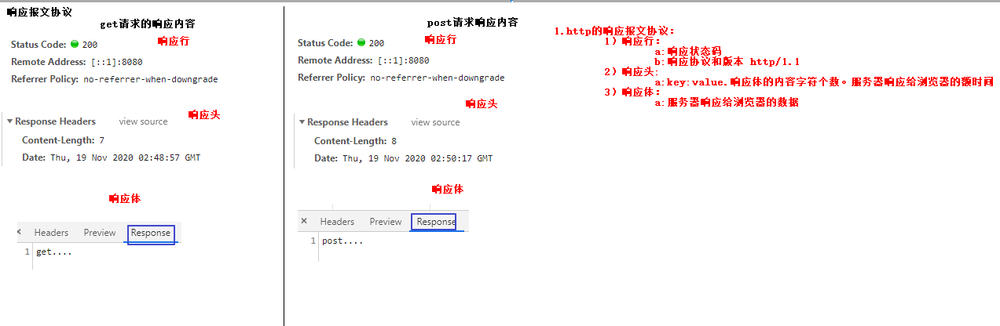

~~~html
<!DOCTYPE html>
<html>
<head>
    <meta charset="UTF-8">
    <title>Insert title here</title>
</head>
<body>
<h2>get请求</h2>
<form action="/getServlet" method="get">
    用户名：<input type="text" name="username" value="suoge" /> <br/>
    密码：<input type="text" name="password" value="1234" /> <br/>
    <input type="submit" value="get提交" />
</form>
<h2>post请求</h2>
<form action="/postServlet" method="post">
    用户名：<input type="text" name="username" value="suoge" /> <br/>
    密码：<input type="text" name="password" value="1234" /> <br/>
    <input type="submit" value="post提交" />
</form>
</body>
</html>
~~~

~~~java
package com.itheima.sh.a_http_01;

import javax.servlet.ServletException;
import javax.servlet.annotation.WebServlet;
import javax.servlet.http.HttpServlet;
import javax.servlet.http.HttpServletRequest;
import javax.servlet.http.HttpServletResponse;
import java.io.IOException;

@WebServlet("/getServlet")
public class GetServlet extends HttpServlet {
    protected void doPost(HttpServletRequest request, HttpServletResponse response) throws ServletException, IOException {
        doGet(request, response);
    }

    protected void doGet(HttpServletRequest request, HttpServletResponse response) throws ServletException, IOException {
        //响应给浏览器数据
        response.getWriter().print("get....");
    }
}

~~~

~~~java
package com.itheima.sh.a_http_01;

import javax.servlet.ServletException;
import javax.servlet.annotation.WebServlet;
import javax.servlet.http.HttpServlet;
import javax.servlet.http.HttpServletRequest;
import javax.servlet.http.HttpServletResponse;
import java.io.IOException;

@WebServlet("/postServlet")
public class PostServlet extends HttpServlet {
    protected void doPost(HttpServletRequest request, HttpServletResponse response) throws ServletException, IOException {
        doGet(request, response);
    }

    protected void doGet(HttpServletRequest request, HttpServletResponse response) throws ServletException, IOException {
        //响应给浏览器数据
        response.getWriter().print("post....");
    }
}

~~~


小结：

1.http响应报文协议：

​	1）响应行：

​			a:响应状态码

| 状态码  | 状态码描述            | 说明                                                         |
| ------- | --------------------- | ------------------------------------------------------------ |
| **200** | OK                    | 请求已成功，请求所希望的响应头或数据体将随此响应返回。出现此状态码是表示正常状态。 |
| **302** | Move temporarily      | 重定向，请求的资源临时从不同的 地址响应请求。                |
| **304** | Not Modified          | 从**浏览器**缓存中读取数据，不从服务器重新获取数据。例如，用户第一次从浏览器访问服务器端图片资源，以后在访问该图片资源的时候就不会再从服务器上加载而直接到浏览器缓存中加载，这样效率更高。 |
| **404** | Not Found             | 请求资源不存在。通常是用户路径编写错误，也可能是服务器资源已删除。 |
| 403     | Forbidden             | 服务器已经理解请求，但是拒绝执行它                           |
| 405     | Method Not Allowed    | 请求行中指定的请求方法不能被用于请求相应的资源               |
| **500** | Internal Server Error | 服务器内部错误。通常程序抛异常                               |

​			b:响应协议/版本

​	2）响应头：

​			a:key：value  服务器响应给浏览器 

|      响应头Key      |                         响应头value                          |
| :-----------------: | :----------------------------------------------------------: |
|      location       |     指定响应的路径，需要与状态码302配合使用，完成重定向      |
|    content-Type     | 响应正文的类型（MIME类型，属于服务器里面的一种类型，例如文件在window系统有自己的类型，.txt  .doc  .jpg。文件在服务器中也有自己的类型），同时还可以解决乱码问题。例如：text/html;charset=UTF-8 |
| content-disposition | 通过浏览器以附件形式解析正文，例如：attachment;filename=xx.zip |
|       refresh       | 页面刷新，例如：3;url=www.itcast.cn    //三秒刷新页面到www.itcast.cn |

​	3）响应体：

​			a:服务器响应给浏览器的数据


# 3.HttpServletResponse对象介绍(掌握)

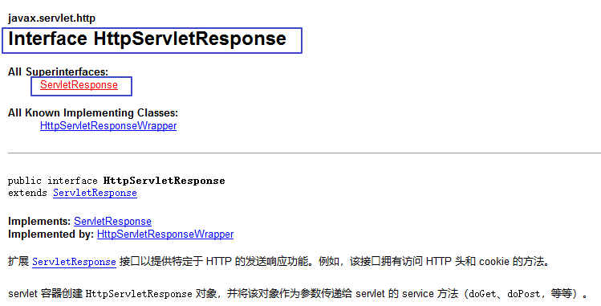

1.HttpServletResponse属于一个接口，父接口是ServletResponse，父接口不能处理满足http协议的响应，但是子接口HttpServletResponse可以处理

2.HttpServletResponse接口对象由tomcat创建的

3.HttpServletResponse接口对象只要用来服务器向客户端浏览器响应数据的。


# 4.HttpServletResponse的方法

## 4.1响应行

| 方法                | 说明               |
| ------------------- | ------------------ |
| setStatus(int code) | 向浏览器发送状态码 |

| 对应的状态码响应状态码常量 | 说明                     |
| -------------------------- | ------------------------ |
| 200                        | 响应成功                 |
| 404                        | 资源路径错误或资源被删除 |
| 500                        | 服务器内部错误           |
| 302                        | 重定向                   |

## 4.2响应头

| 方法                                | 说明           |
| ----------------------------------- | -------------- |
| setHeader(String name,String value) | 设置响应头信息 |

常见响应头：

|      响应头Key      |                         响应头value                          |
| :-----------------: | :----------------------------------------------------------: |
|       refresh       | 页面刷新，例如：3;url=http://www.itcast.cn //三秒刷新页面到http://www.itcast.cn |
|    content-type     | 设置响应**数据的类型（MIME类型）**和**编码格式** 例如：text/html;charset=UTF-8 |
|      location       |    指定响应的路径，需要与状态码302配合使用，完成重定向。     |
| content-disposition | 通过浏览器以附件形式解析正文，例如：attachment;filename=xx.zip。 |

说明：

1.MIME类型 描述文件在tomcat服务器中的类型。

  windows系统       tomcat服务器

  .txt                         text/plain

  .html                      text/html

【1】	需求：1. 访问到Servlet类3秒后跳转到百度；

~~~java
package com.itheima.sh.b_httpservletresponse_02;

import javax.servlet.ServletException;
import javax.servlet.annotation.WebServlet;
import javax.servlet.http.HttpServlet;
import javax.servlet.http.HttpServletRequest;
import javax.servlet.http.HttpServletResponse;
import java.io.IOException;

@WebServlet("/response01Servlet")
public class Response01Servlet extends HttpServlet {
    protected void doPost(HttpServletRequest request, HttpServletResponse response) throws ServletException, IOException {
        doGet(request, response);
    }

    protected void doGet(HttpServletRequest request, HttpServletResponse response) throws ServletException, IOException {
        //	需求：1. 访问到Servlet类3秒后跳转到百度；
        /*
            1.refresh 表示定时刷新，固定的key
            2.    秒数;url=跳转地址

         */
        response.setHeader("refresh","3;url=http://www.baidu.com");
    }
}

~~~

【2】【练习】content-type 设置响应数据的类型。告诉浏览器不要解析html格式数据。

~~~java
package com.itheima.sh.b_httpservletresponse_02;

import javax.servlet.ServletException;
import javax.servlet.annotation.WebServlet;
import javax.servlet.http.HttpServlet;
import javax.servlet.http.HttpServletRequest;
import javax.servlet.http.HttpServletResponse;
import java.io.IOException;

@WebServlet("/response02Servlet")
public class Response02Servlet extends HttpServlet {
    protected void doPost(HttpServletRequest request, HttpServletResponse response) throws ServletException, IOException {
        doGet(request, response);
    }

    protected void doGet(HttpServletRequest request, HttpServletResponse response) throws ServletException, IOException {
        //【练习】content-type 设置响应数据的类型。告诉浏览器不要解析html格式数据。
        //text/plain 表示MIME类型，即普通文本.txt在tomcat中的类型
        response.setHeader("content-type","text/plain");

        //响应数据
        response.getWriter().print("<h1>itcast</h1>");
    }
}

~~~

小结：

1.定时刷新：

~~~java
 response.setHeader("refresh","3;url=http://www.baidu.com");
~~~

2.告知浏览器的响应数据类型：

~~~java
 response.setHeader("content-type","text/plain");
~~~


## 4.3解决响应中文乱码问题

~~~java
package com.itheima.sh.b_httpservletresponse_02;

import javax.servlet.ServletException;
import javax.servlet.annotation.WebServlet;
import javax.servlet.http.HttpServlet;
import javax.servlet.http.HttpServletRequest;
import javax.servlet.http.HttpServletResponse;
import java.io.IOException;

@WebServlet("/response03Servlet")
public class Response03Servlet extends HttpServlet {
    protected void doPost(HttpServletRequest request, HttpServletResponse response) throws ServletException, IOException {
        doGet(request, response);
    }

    protected void doGet(HttpServletRequest request, HttpServletResponse response) throws ServletException, IOException {
        //【练习】content-type 设置响应数据的类型。告诉浏览器不要解析html格式数据。
        //text/plain 表示MIME类型，即普通文本.txt在tomcat中的类型
//        response.setHeader("content-type","text/plain");

        //响应数据
        /*
            响应乱码产生原因：
                1.如果不指定编码表，那么tomcat服务器会使用默认的编码表ISO-8859-1进行编码，该编码表不支持中文
                2.浏览器拿到数据之后按照浏览器编码表UTF-8进行解码
            解决响应的中文乱码：
                要告知服务器使用UTF-8编码表进行编码
                方式一：
                    response.setHeader("content-type","text/plain;charset=utf-8");
                方式二：推荐使用
                 response.setContentType("text/plain;charset=utf-8");

         */
        // 1.要告知服务器使用UTF-8编码表进行编码
//        response.setHeader("content-type","text/plain;charset=utf-8");
        response.setContentType("text/plain;charset=utf-8");
        response.getWriter().print("<h1>黑马程序员</h1>");
    }
}

~~~

小结：

解决响应中文乱码问题：

~~~java
 response.setContentType("text/plain;charset=utf-8"); 响应的普通文本
 response.setContentType("text/html;charset=utf-8"); 响应的超级文本，解析html标签
~~~

## 4.4重定向(掌握)

【1】思想

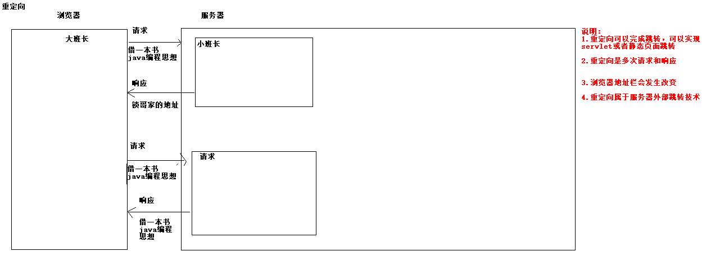

【2】实现重定向

需要的方法：

| 方法                                                         | 说明                                 |
| ------------------------------------------------------------ | ------------------------------------ |
| `response.setStatus(302); response.setHeader("location", "/otherServlet");` | 通过设置响应状态码和响应头实现重定向 |
| `response.sendRedirect("/otherServlet");` 建议使用           | 重定向的简写方式                     |

~~~java
package com.itheima.sh.c_httpservletresponse_03;

import javax.servlet.ServletException;
import javax.servlet.annotation.WebServlet;
import javax.servlet.http.HttpServlet;
import javax.servlet.http.HttpServletRequest;
import javax.servlet.http.HttpServletResponse;
import java.io.IOException;

@WebServlet("/smallMonitorServlet")
public class SmallMonitorServlet extends HttpServlet {
    protected void doPost(HttpServletRequest request, HttpServletResponse response) throws ServletException, IOException {
        doGet(request, response);
    }

    protected void doGet(HttpServletRequest request, HttpServletResponse response) throws ServletException, IOException {
        System.out.println("小班长。。。。");
        //重定向到锁哥
        //设置状态码
//        response.setStatus(302);
//        //设置响应头给浏览器
//        response.setHeader("location","/suoGeServlet");

        response.sendRedirect("/suoGeServlet");
    }
}

~~~


~~~java
package com.itheima.sh.c_httpservletresponse_03;

import javax.servlet.ServletException;
import javax.servlet.annotation.WebServlet;
import javax.servlet.http.HttpServlet;
import javax.servlet.http.HttpServletRequest;
import javax.servlet.http.HttpServletResponse;
import java.io.IOException;

@WebServlet("/suoGeServlet")
public class SuoGeServlet extends HttpServlet {
    protected void doPost(HttpServletRequest request, HttpServletResponse response) throws ServletException, IOException {
        doGet(request, response);
    }

    protected void doGet(HttpServletRequest request, HttpServletResponse response) throws ServletException, IOException {
        //输出
        System.out.println("锁哥。。。。借你一本书");
    }
}

~~~

小结：

1.重定向可以实现servlet和静态页之间的跳转

2.完成重定向有两种方式：

​	1）

~~~java
 //设置状态码
response.setStatus(302);
//设置响应头给浏览器
response.setHeader("location","/suoGeServlet");
~~~

​	2)推荐使用

~~~java
 response.sendRedirect("/suoGeServlet");
~~~


【3】转发和重定向的区别

- 思想

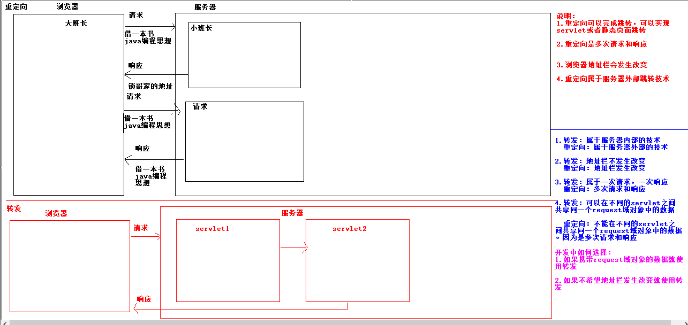


- 应用场景

改造登录案例：

需求：

1.登录成功跳转到成功页面，地址栏发生改变

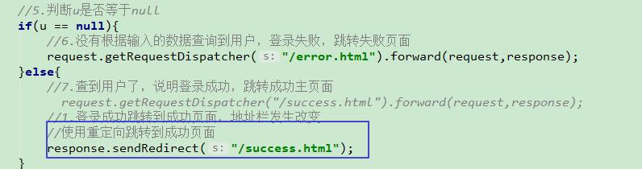

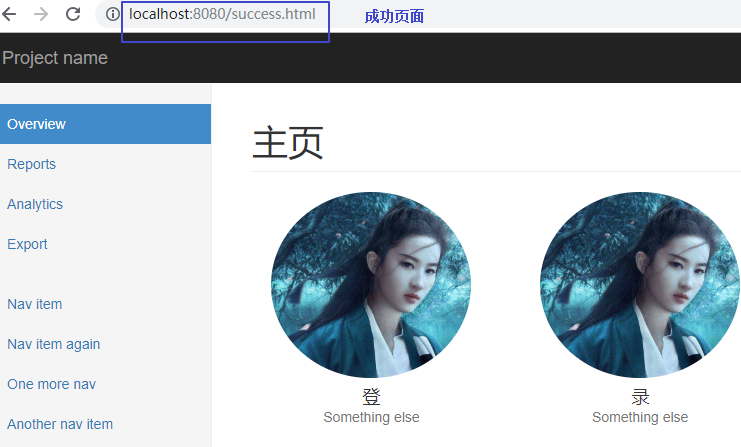


2.登录失败跳转到类似于登录页面，在该页面中先用户名或者密码错误并直接可以在该页面进行登录

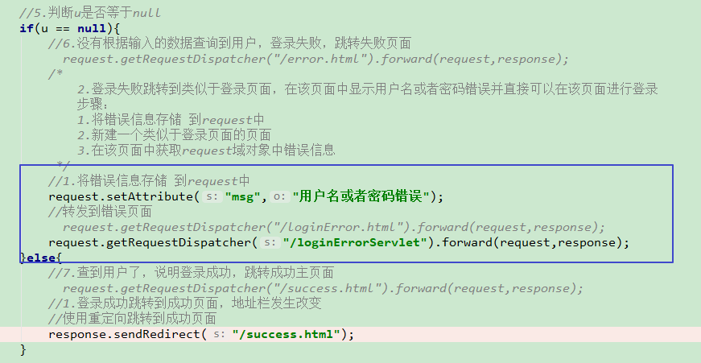


LoginErrorServlet：

~~~java
package com.itheima.sh.web;

import javax.servlet.ServletException;
import javax.servlet.annotation.WebServlet;
import javax.servlet.http.HttpServlet;
import javax.servlet.http.HttpServletRequest;
import javax.servlet.http.HttpServletResponse;
import java.io.IOException;

@WebServlet("/loginErrorServlet")
public class LoginErrorServlet extends HttpServlet {
    protected void doPost(HttpServletRequest request, HttpServletResponse response) throws ServletException, IOException {
        doGet(request, response);
    }

    protected void doGet(HttpServletRequest request, HttpServletResponse response) throws ServletException, IOException {
        //处理响应中文乱码
        response.setContentType("text/html;charset=utf-8");
        //获取从loginServlet中转发过来的request域对象数据
        String msg = (String) request.getAttribute("msg");
        /*
            使用java代码给浏览器响应html标签，标签内容就是loginError.html页面所有内容

             2.登录失败跳转到类似于登录页面，在该页面中显示用户名或者密码错误并直接可以在该页面进行登录
         */
        response.getWriter().print("<html>");
        response.getWriter().print("<body>");
        response.getWriter().print("<form  action=\"/loginServlet\" method=\"get\">");
        response.getWriter().print("<h2>登录页面</h2>");
        /*
            "<font color=\"red\">"
            "用户名或者密码错误"
            "</font>"

            <font color="red">用户名或者密码错误</font>
         */
        response.getWriter().print("<font color=\"red\">"+msg+"</font><br>");
        response.getWriter().print("<input type=\"text\"  name=\"username\" placeholder=\"用户名\"><br>");
        response.getWriter().print("<input type=\"password\"  name=\"password\" placeholder=\"密码\" ><br>");
        response.getWriter().print("<button type=\"submit\">登录</button>");
        response.getWriter().print("</form>");
        response.getWriter().print("</body>");
        response.getWriter().print("</html>");
    }
}

~~~

小结：

何时使用转发？

携带request域对象的数据。

~~~java
 request.getRequestDispatcher("/loginErrorServlet").forward(request,response);
~~~


何时使用重定向？

不用携带request域对象的数据。地址发生改变

~~~java
 //使用重定向跳转到成功页面
response.sendRedirect("/success.html");
~~~


## 4.5响应体

方法：

| 方法                                   | 说明                                                   |
| -------------------------------------- | ------------------------------------------------------ |
| ServletOutputStream  getOutputStream() | 用于向浏览器输出二进制数据。【字节流--文件下载】       |
| java.io.PrintWriter getWriter()        | 用于向浏览器输出字符数据。【字符流--给浏览器响应数据】 |

### 1.tomcat服务器向浏览器响应字符数据

java.io.PrintWriter getWriter()  用于向浏览器输出字符数据。【字符流--给浏览器响应数据】

~~~java
package com.itheima.sh.c_httpservletresponse_04;

import javax.servlet.ServletException;
import javax.servlet.annotation.WebServlet;
import javax.servlet.http.HttpServlet;
import javax.servlet.http.HttpServletRequest;
import javax.servlet.http.HttpServletResponse;
import java.io.IOException;
import java.io.PrintWriter;

@WebServlet("/responseBodyServlet")
public class ResponseBodyServlet extends HttpServlet {
    protected void doPost(HttpServletRequest request, HttpServletResponse response) throws ServletException, IOException {
        doGet(request, response);
    }

    protected void doGet(HttpServletRequest request, HttpServletResponse response) throws ServletException, IOException {
        /*
            tomcat服务器向浏览器响应字符数据:
                java.io.PrintWriter getWriter()  用于向浏览器输出字符数据。【字符流--给浏览器响应数据】
         */
//        response.setContentType("text/plain;charset=utf-8");
        /*
            说明：
            如果响应类型是普通文本即text/plain 那么换行是pw.println()
            如果响应是超文本即text/html 那么换行是<br/>
         */
        response.setContentType("text/html;charset=utf-8");
        PrintWriter pw = response.getWriter();
        //响应字符数据
        pw.println(100);
        pw.println("<br/>");
        pw.println(12.3);
        pw.println("<br/>");
        pw.println(true);
        pw.println("<br/>");
        pw.println("黑马程序员");
    }
}

~~~

小结：

1.tomcat服务器向浏览器响应字符数据使用的方法：

~~~java
 PrintWriter pw = response.getWriter();
 pw.println(100);
~~~

2.如果响应类型是普通文本即text/plain 那么换行是pw.println().如果响应是超文本即text/html 那么换行是<br/>

3.响应的字符数据都是变为字符串


### 2.浏览器以附件形式下载服务器文件(课下必须完成)

#### 2.1目标

浏览器以附件形式下载服务器文件

#### 2.2使用的知识点

【1】响应体的方法：服务器向浏览器响应字节数据的方法：

~~~java
ServletOutputStream  getOutputStream()用于向浏览器输出二进制数据。【字节流--文件下载】
~~~

【2】ServletContext上下文对象

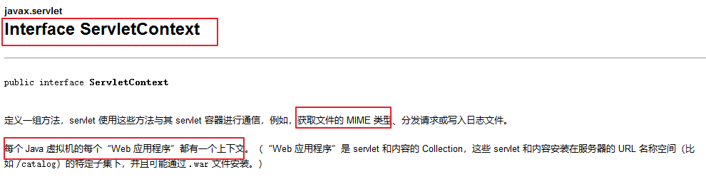

1.ServletContext属于一个接口

2.ServletContext表示一个上下文，表示当前整个web项目的对象

3.作用：

​	1）获取当前web项目中某个文件在tomcat中的MIME类型,使用ServletContext中的方法：

~~~java
String getMimeType(String file) 参数：file表示指定文件名，例如：demo.jpg  123.txt等
~~~

​	2）获取指定文件在当前web项目中的实际路径，使用ServletContext中的方法：

~~~java
String getRealPath(String path)  参数：path表示指定文件的路径名 ：web/demo.jpg
~~~

​	3）ServletContext属于一个域对象：

~~~java
1.void setAttribute(String name, Object object)  向ServletContext域对象中存储数据
2.Object getAttribute(String name) 从ServletContext域对象中获取数据
3.void removeAttribute(String name) 从ServletContext域对象中删除数据
~~~

说明：ServletContext作为域对象表示整个web项目，可以在多次请求和响应之间共享数据。


4.如何获取ServletContext接口对象?

使用HttpServlet的父类GenericServlet中的方法：

~~~java
 public ServletContext getServletContext(){}
~~~

说明：ServletContext是在tomcat一启动就被tomcat创建了，关闭tomcat，该对象自动消失。


ServletContext使用代码演示：

~~~java
package com.itheima.sh.d_servletcontext_05;

import javax.servlet.ServletContext;
import javax.servlet.ServletException;
import javax.servlet.annotation.WebServlet;
import javax.servlet.http.HttpServlet;
import javax.servlet.http.HttpServletRequest;
import javax.servlet.http.HttpServletResponse;
import java.io.IOException;

@WebServlet("/servletContextDemo01Servlet")
public class ServletContextDemo01Servlet extends HttpServlet {
    protected void doPost(HttpServletRequest request, HttpServletResponse response) throws ServletException, IOException {
        doGet(request, response);
    }

    protected void doGet(HttpServletRequest request, HttpServletResponse response) throws ServletException, IOException {
        /*
            ServletContext演示：
            1.如何获取ServletContext接口对象?
            使用HttpServlet的父类GenericServlet中的方法： public ServletContext getServletContext(){}
         */
        ServletContext servletContext = getServletContext();
        /*
            获取当前web项目中某个文件在tomcat中的MIME类型,使用ServletContext中的方法：
                String getMimeType(String file) 参数：file表示指定文件名，例如：demo.jpg  123.txt等
         */
        String mimeType = servletContext.getMimeType("1.jpg");//参数只需要给文件名.后缀名即可
        System.out.println("mimeType = " + mimeType);//mimeType = image/jpeg

        /*
            获取指定文件在当前web项目中的实际路径，使用ServletContext中的方法：
            String getRealPath(String path)  参数：path表示指定文件的路径名 ：
         */
        String realPath = servletContext.getRealPath("aaa\\1.jpg");
        //realPath = F:\ideawork\jiuyeban2\heima119\web_day06_response\out\artifacts\web_war_exploded\aaa\1.jpg
        System.out.println("realPath = " + realPath);
    }
}

~~~

小结：

1.如何获取ServletContext接口对象?

~~~java
使用HttpServlet的父类GenericServlet中的方法： public ServletContext getServletContext(){}
~~~

2.获取当前web项目中某个文件在tomcat中的MIME类型,使用ServletContext中的方法：

~~~java
String getMimeType(String file) 参数：file表示指定文件名，例如：demo.jpg  123.txt等。参数只需要给文件名.后缀名即可
~~~

3.获取指定文件在当前web项目中的实际路径，使用ServletContext中的方法：

~~~java
 String getRealPath(String path)  参数：path表示指定文件的路径名 ：
 String realPath = servletContext.getRealPath("aaa\\1.jpg");
~~~

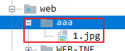


#### 2.3案例代码实现

【1】案例分析(步骤)

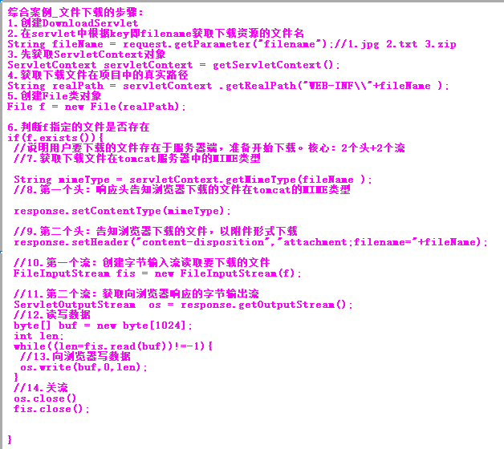

~~~java
综合案例_文件下载的步骤：
1.创建DownloadServlet
2.在servlet中根据key即filename获取下载资源的文件名
String fileName = request.getParameter("filename");//1.jpg 2.txt 3.zip
3.先获取ServletContext对象
ServletContext servletContext = getServletContext();
4.获取下载文件在项目中的真实路径
String realPath = servletContext .getRealPath("WEB-INF\\"+fileName );
5.创建File类对象
File f = new File(realPath);

6.判断f指定的文件是否存在
if(f.exists()){
 //说明用户要下载的文件存在于服务器端，准备开始下载。核心：2个头+2个流
 //7.获取下载文件在tomcat服务器中的MIME类型
 
 String mimeType = servletContext.getMimeType(fileName );
 //8.第一个头：响应头告知浏览器下载的文件在tomcat的MIME类型

 response.setContentType(mimeType);

 //9.第二个头：告知浏览器下载的文件，以附件形式下载
 response.setHeader("content-disposition","attachment;filename="+fileName);

 //10.第一个流：创建字节输入流读取要下载的文件
 FileInputStream fis = new FileInputStream(f);

 //11.第二个流：获取向浏览器响应的字节输出流
 ServletOutputStream  os = response.getOutputStream();
 //12.读写数据
 byte[] buf = new byte[1024];
 int len;
 while((len=fis.read(buf))!=-1){
  //13.向浏览器写数据
  os.write(buf,0,len);
 }
 //14.关流
 os.close()
 fis.close();

}
~~~


【2】代码实现

~~~java
package com.itheima.sh.d_servletcontext_05;

import javax.servlet.ServletContext;
import javax.servlet.ServletException;
import javax.servlet.ServletOutputStream;
import javax.servlet.annotation.WebServlet;
import javax.servlet.http.HttpServlet;
import javax.servlet.http.HttpServletRequest;
import javax.servlet.http.HttpServletResponse;
import java.io.File;
import java.io.FileInputStream;
import java.io.IOException;

@WebServlet("/downloadServlet")
public class DownloadServlet extends HttpServlet {
    protected void doPost(HttpServletRequest request, HttpServletResponse response) throws ServletException, IOException {
        doGet(request, response);
    }

    protected void doGet(HttpServletRequest request, HttpServletResponse response) throws ServletException, IOException {
        //2.在servlet中根据key即filename获取下载资源的文件名
        String fileName = request.getParameter("filename");//1.jpg 2.txt 3.zip
        //3.先获取ServletContext对象
        ServletContext servletContext = getServletContext();
        //4.获取下载文件在项目中的真实路径
        String realPath = servletContext .getRealPath("WEB-INF\\"+fileName );
        //5.创建File类对象
        File f = new File(realPath);

        //6.判断f指定的文件是否存在
        if(f.exists()){
            //说明用户要下载的文件存在于服务器端，准备开始下载。核心：2个头+2个流
            //7.获取下载文件在tomcat服务器中的MIME类型
            String mimeType = servletContext.getMimeType(fileName );
            //8.第一个头：响应头告知浏览器下载的文件在tomcat的MIME类型
            response.setContentType(mimeType);

            //9.第二个头：告知浏览器下载的文件，以附件形式下载
            response.setHeader("content-disposition","attachment;filename="+fileName);

            //10.第一个流：创建字节输入流读取要下载的文件
            FileInputStream fis = new FileInputStream(f);

            //11.第二个流：获取向浏览器响应的字节输出流
            ServletOutputStream os = response.getOutputStream();
            //12.读写数据
            byte[] buf = new byte[1024];
            int len;
            while((len=fis.read(buf))!=-1){
                //13.向浏览器写数据
                os.write(buf,0,len);
            }
            //14.关流
            os.close();
            fis.close();
        }
    }
}

~~~


#### 2.4文件下载案例注意事项

【1】在以附件形式响应头代码中：

~~~java
 response.setHeader("content-disposition","attachment;filename="+fileName);
~~~

attachment必须写，表示附件下载，如果不写那么不会下载本地而是在浏览器上面查看

filename=必须写，如果不写，下载的文件名是当前路径名


【2】如果文件名含有中文，那么下载的文件出现中文乱码问题，如何解决？

~~~java
 //9.第二个头：告知浏览器下载的文件，以附件形式下载
 //对响应头中的文件名fileName进行按照UTF-8进行编码
 String encodeFileName = URLEncoder.encode(fileName, "UTF-8");
// response.setHeader("content-disposition","attachment;filename="+fileName);
 response.setHeader("content-disposition","attachment;filename="+encodeFileName);
~~~


# 5.注册案例(课下必须完成)

## 1.开发步骤：

1.画注册流程图

2.根据流程图编写代码

3.浏览器访问服务器，测试功能

## 2.画注册流程图

注意：注册案例需要先根据注册的用户名查询数据，如果用户名存在注册失败，用户名不存在，注册成功。

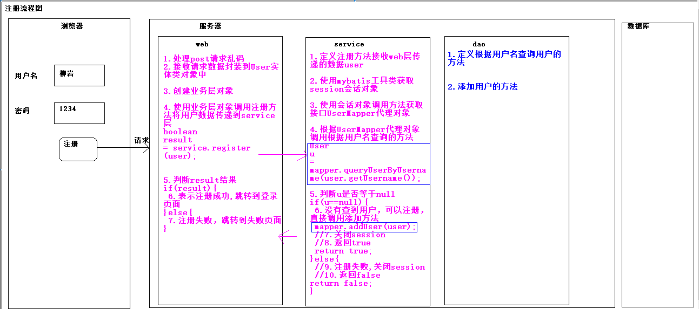

## 3.根据流程图编写代码

### 3.1dao层

~~~java
package com.itheima.sh.dao;

import com.itheima.sh.pojo.User;
import org.apache.ibatis.annotations.Insert;
import org.apache.ibatis.annotations.Param;
import org.apache.ibatis.annotations.Select;

import java.util.List;
//1.创建接口UserMapper

public interface UserMapper {
   
    //1.定义根据用户名查询用户的方法
    @Select("select * from user where username=#{username}")
    User queryUserByUsername(@Param("username") String username);

    //2.添加用户的方法
    @Insert("insert into user values(null,#{username},#{password})")
    void addUser(User user);
}

~~~


### 3.2service层

~~~java
package com.itheima.sh.service;

import com.itheima.sh.dao.UserMapper;
import com.itheima.sh.pojo.User;
import com.itheima.sh.utils.SessionFactoryUtils;
import org.apache.ibatis.session.SqlSession;

/*
    业务层
 */
public class UserService {
    //1.定义一个登录方法接收web层传递的数据
    public User login(User user) {
        //2.使用mybatis工具类调用方法获取会话对象
        SqlSession session = SessionFactoryUtils.getSession();
        //3.使用session对象调用UserMapper接口代理对象
        UserMapper mapper = session.getMapper(UserMapper.class);
        //4.使用接口代理对象mapper调用接口中的方法根据用户名和密码查询数据
        User u = mapper.login(user);
        //5.关闭session
        session.close();
        //6.返回u
        return u;
    }


    //1.定义注册方法接收web层传递的数据user
    public boolean register(User user) {
        //2.使用mybatis工具类获取session会话对象
        SqlSession session = SessionFactoryUtils.getSession();
        //3.使用会话对象调用方法获取接口UserMapper代理对象
        UserMapper mapper = session.getMapper(UserMapper.class);

        //4.根据UserMapper代理对象 调用根据用户名查询的方法
        String username = user.getUsername();
        User u = mapper.queryUserByUsername(username);

        //5.判断u是否等于null
        if (u == null) {
            //6.没有查到用户，可以注册，直接调用添加方法
            mapper.addUser(user);
            //提交事务
            session.commit();
            //7.关闭session
            session.close();
            //8.返回true
            return true;
        } else {
            //9.注册失败,关闭session
            session.close();
            //10.返回false
            return false;
        }
    }

}

~~~

小结：

1.在业务层我们主要是先根据用户名查询用户是否存在，如果不存在在执行添加用户方法，存在则不添加。

**2.别忘记提交事务，增删改需要提交事务**

### 3.3web层

~~~java
package com.itheima.sh.web;

import com.itheima.sh.pojo.User;
import com.itheima.sh.service.UserService;
import org.apache.commons.beanutils.BeanUtils;

import javax.servlet.ServletException;
import javax.servlet.annotation.WebServlet;
import javax.servlet.http.HttpServlet;
import javax.servlet.http.HttpServletRequest;
import javax.servlet.http.HttpServletResponse;
import java.io.IOException;
import java.lang.reflect.InvocationTargetException;

@WebServlet("/registerServlet")
public class RegisterServlet extends HttpServlet {
    protected void doPost(HttpServletRequest request, HttpServletResponse response) throws ServletException, IOException {
        doGet(request, response);
    }

    protected void doGet(HttpServletRequest request, HttpServletResponse response) throws ServletException, IOException {
        //1.处理post请求乱码
        request.setCharacterEncoding("utf-8");
        //2.接收请求数据封装到User实体类对象中
        User user = new User();
        try {
            BeanUtils.populate(user, request.getParameterMap());
            //3. 创建业务层对象
            UserService service = new UserService();
            //4. 使用业务层对象调用注册方法将用户数据传递到service层
            boolean result = service.register(user);
            //5. 判断result结果
            if (result) {
                //6. 表示注册成功, 跳转到登录页面
                response.sendRedirect("/login.html");
            } else {
                //7. 注册失败，跳转到失败页面
                response.sendRedirect("/registerError.html");
            }
        } catch (Exception e) {
            e.printStackTrace();
        }
    }
}

~~~


### 3.4 页面实现

register.html页面：

~~~html
<!DOCTYPE html>
<html lang="en">
<head>
    <meta charset="UTF-8">
    <title>Title</title>
</head>
<body>
<form action="/registerServlet" method="post">
    用户名：<input type="text" name="username"><br>
    密码：<input type="password" name="password"><br>
    <input type="submit" value="注册">
</form>
</body>
</html>
~~~

registerError.html

~~~html
<!DOCTYPE html>
<html lang="en">
<head>
    <meta charset="UTF-8">
    <title>Title</title>
</head>
<body>
    <h2>注册失败，<a href="register.html">重新注册</a></h2>
</body>
</html>
~~~

