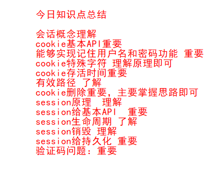
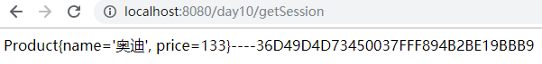
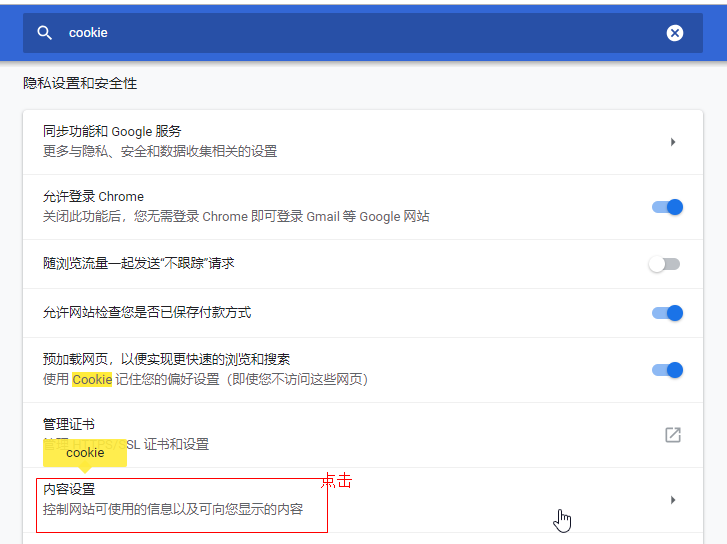

# day07--cookie&session

## 学习目标

-[ ] 了解会话的概念
-[ ] 理解cookie的概念
-[ ] 能够创建，发送，接收，删除cookie
-[ ] 能够说出cookie的执行原理
-[ ] 能够说出session的概念
-[ ] 能够获取session对象，添加，删除，获取session中的数据
-[ ] 能够完成登录验证码案例

**今日知识点回顾，要求大家能够理解**



 请求API回顾


响应API回顾


## 第一章  会话技术

### 1、什么是会话(了解)

​	在日常生活中，从拨通电话到挂断电话之间的一连串的你问我答的过程就是一个会话。Web应用中的会话过程类似于生活中的打电话过程，它指的是一个客户端（浏览器）与Web服务器之间连续发生的一系列请求和响应过程，例如，一个用户在某网站上的整个购物过程就是一个会话。

简而言之：从用户访问网站开始到离开网站，关闭浏览器，这个过程就叫会话。


**注意：**每个用户在使用浏览器与服务器进行会话的过程中，不可避免各自会产生一些数据，程序要想办法为每个用户保存这些数据。Servlet在会话过程中保存数据使用到的技术有两种：Cookie技术和Session技术。

【小结】

1. Cookie和Session技术都是**在会话期间产生的** ；
2. Cookie和Session的作用都是**保存数据** ；

​    关于Cookie和Session的相关知识，将在下面的小节进行详细讲解。

## 第二章	Cookie技术

### 1、Cookie是什么

​	Cookie英文意指饼干，Cookie就是服务器暂存放在我们电脑上的一笔资料(where？打开浏览器)，使用我们电脑来保存一些服务器希望保存的内容。Cookie是由服务器端生成，发送给浏览器，浏览器会将Cookie以key/value形式的数据保存到某个目录下的文本文件内，下次请求同一网站时就会将该Cookie发送给服务器。当然前提是浏览器设置了启用cookie。

​	Cookie作用：减轻服务器保存数据的压力。

​	问题：我们发现将数据保存在浏览器中?而不是保存到服务器或者数据库中？

​	将数据保存到服务器中，会增加服务器的压力。同时，如果用户不进行购买，并没有带来经济利润。存储到数据库中，如果没有登录到网站，那么将无法查询出数据。而存储到浏览器中可以减轻服务器端压力，并且用户不用登陆也可以将商品添加到购物车中。

​	关于cookie介绍如下图所示：

​	

​	如何在浏览器中查看当前cookie：


注意：通过上面演示我们发现，当我们访问某个网站的时候，网站服务器会在我们浏览器中生成一个cookie,并且存在的时间有的网站还会很久，这样对于用户来说很不好。占用户电脑的硬盘位置。那我们能否禁用cookie，不让网站在我们的电脑浏览器端生产cookie呢？

不可以。因为当我们禁用了cookie，首先商品不能保存到购物车中了，并且由于cookie被禁用了，会导致有的网站我们不能登录了。

### 2、Cookie的应用场景

​	在开发中，cookie使用最多的应用场景就是登录页面记住用户名和密码的功能。


**案例的原理如下图所示：**


注意：上述就是使用cookie技术记住用户名和密码的案例原理。但是由于我们还没有学习如何在页面中获取cookie中的数据，所以今天这里我们暂时还实现不了该整体的功能。但是我们可以使用接下来要学习的cookie的API能够实现除了在页面获取cookie数据的其他功能。

并且可以实现向服务器再次发送请求时，在另一个servlet中从cookie中获取用户名和密码。

实现功能如下图所示：


### 3、案例需要使用的Cookie基本API(重要)

​	Cookie的基本API包括Cookie的创建，往Cookie中添加数据，获取Cookie中的数据以及将Cookie响应给浏览器。

| 方法                | 使用示例                                                     | 说明                                       |
| ------------------- | ------------------------------------------------------------ | ------------------------------------------ |
| 创建Cookie对象      | Cookie(String name,String value)name表示指定 cookie 名称 ，value 表示指定 cookie 值 | Cookie c1 = new Cookie("username","suoge") |
| 获取cookie的name值  | String  getName()                                            | c1.getName()                               |
| 获取cookie的value值 | String getValue()                                            | c1.getValue()                              |
| 设置cookie的值      | void  setValue(String value)                                 | c1.setValue("李四")                        |

说明：上述都是该案例中需要的Cookie类中的API.但是该案例除了需要上述API，还需要如下API:

```java
1、HttpServletResponse接口中的方法：
  	void addCookie(Cookie cookie)   将cookie发送给浏览器
  	
2、HttpServletRequest接口中的方法：
	Cookie[] getCookies()  获取浏览器发送的cookie
```

### 4、案例的实现的步骤

- 步骤一：浏览器发送请求
- 步骤二：服务器创建cookie并且响应cookie
- 步骤三：浏览器自动保存cookie
- 步骤四：浏览器再次发送请求时请求头中会携带cookie （不管第二次请求的是servlet，还是页面）

### 5、案例的代码实现

#### 5.1、登录页面login.html的代码

```html
<form action="/loginServlet" method="post">
    用户名：<input type="text" name="username"><br>
    密码：<input type="password" name="password"><br>
    记住用户名和密码：<input type="checkbox" name="check"><br>
    <input type="submit" value="提交">
</form>
```

#### 5.2、案例的java后台代码-将cookie响应给浏览器

~~~java
@WebServlet("/loginServlet")
public class LoginServlet extends HttpServlet {
    protected void doPost(HttpServletRequest request, HttpServletResponse response) throws ServletException, IOException {
        doGet(request, response);
    }
    protected void doGet(HttpServletRequest request, HttpServletResponse response) throws ServletException, IOException {
        //解决乱码问题
        request.setCharacterEncoding("utf-8");
        //获取用户提交信息
        String username = request.getParameter("username");
        String password = request.getParameter("password");
         /*
            登录业务逻辑处理，到数据库查询用户名和密码是否存在
            假设存在
         */
        //获取CheckBox的值
        String check = request.getParameter("check");

        if ("on".equals(check)){
            //用户点击记住用户名和密码
            //生成cookie
            Cookie cookieName = new Cookie("name",username);
            Cookie cookiePwd = new Cookie("pwd",password);
            //将cookie响应回浏览器
            response.addCookie(cookieName);
            response.addCookie(cookiePwd);
        }
    }
}
~~~

浏览器接收到服务器响应的cookie结果如下所示：


#### 5.3、案例的java后台代码-浏览器再次向服务器发送请求并携带cookie给另一个servlet

【案例】从request请求中获取cookie

​	第一个案例完成之后，登录成功之后，访问一个新的Servlet，在这个Servlet中获取请求中携带的cookie。

~~~java
@WebServlet("/getCookieServlet")
public class GetCookieServlet extends HttpServlet {
    protected void doPost(HttpServletRequest request, HttpServletResponse response) throws ServletException, IOException {
        doGet(request, response);
    }
    protected void doGet(HttpServletRequest request, HttpServletResponse response) throws ServletException, IOException {
        //可以获取到浏览器保存所有cookie
        //获取cookie request
        Cookie[] cookies = request.getCookies();
        for (Cookie cookie : cookies) {
            //获取cookie名称
            if ("name".equals(cookie.getName())){
                System.out.println(cookie.getName());
                //获取cookie的值
                System.out.println(cookie.getValue());
            }else  if ("pwd".equals(cookie.getName()))
            {
                System.out.println(cookie.getName());
                //获取cookie的值
                System.out.println(cookie.getValue());
            }
        }
    }
}
~~~

**控制台结果**


#### 5.4、关于cookie中存储特殊字符问题 (理解原理即可)

tomcat8之前的版本，不支持中文，tomcat8以后的版本，支持中文.但是如果直接向cookie中存储特殊字符，例如空格,分号(;),逗号(,),等号(=)等特殊字符。那么就会出现问题。在向cookie中存储特殊字符之前必须要先进行编码处理，然后从cookie中取出之后在进行解码处理。

代码演示如下所示：

SpecialServlet.java

```java
@WebServlet("/specialServlet")
public class SpecialServlet extends HttpServlet {
    protected void doPost(HttpServletRequest request, HttpServletResponse response) throws ServletException, IOException {
        doGet(request, response);
    }
    protected void doGet(HttpServletRequest request, HttpServletResponse response) throws ServletException, IOException {
        //向cookie中保存特殊字符
        //定义一个字符串空格
        String str = "12  34";
        //将字符串str存储到cookie中
        Cookie cookie = new Cookie("demo",str);
        //cookie响应回浏览器
        response.addCookie(cookie);
    }
}
```

浏览器访问服务器结果：


报错原因：cookie中不可以存储特殊的字符。

解决方案：

在向cookie中存储特殊字符之前必须要先进行编码处理，然后从cookie中取出之后在进行解码处理。

编码处理使用的API:

```java
 String encode = URLEncoder.encode(str, "utf-8");
```

解码处理使用的API:

```java
//对cookie进行解码
String decode = URLDecoder.decode(value, "utf-8");
```


演示编码处理特殊字符存储到cookie中代码：

```java
@WebServlet("/specialServlet")
public class SpecialServlet extends HttpServlet {
    protected void doPost(HttpServletRequest request, HttpServletResponse response) throws ServletException, IOException {
        doGet(request, response);
    }
    protected void doGet(HttpServletRequest request, HttpServletResponse response) throws ServletException, IOException {
        //向cookie中保存特殊字符
        //定义一个字符串空格
        String str = "12  34";
        //将字符串str存储到cookie中
//        Cookie cookie = new Cookie("demo",str);

        //对cookie中保存特殊字符解决方案
        // 对特殊字符进行一次编码
        //进行编码处理
        String encode = URLEncoder.encode(str, "utf-8");
        //将编码之后的数据存储到cookie中
        Cookie cookie = new Cookie("demo",encode);

        //cookie响应回浏览器
        response.addCookie(cookie);
    }
}
```

演示解码处理特殊字符，从cookie中获取数据代码：

``` java
@WebServlet("/decodeServlet")
public class DecodeServlet extends HttpServlet {
    protected void doPost(HttpServletRequest request, HttpServletResponse response) throws ServletException, IOException {
        doGet(request, response);
    }
    protected void doGet(HttpServletRequest request, HttpServletResponse response) throws ServletException, IOException {
        //获取cookie
        Cookie[] cookies = request.getCookies();
        for (Cookie cookie : cookies) {
            if ("demo".equals(cookie.getName())){
                //获取到当前编码cookie
                String value = cookie.getValue();
                //对cookie进行解码
                String decode = URLDecoder.decode(value, "utf-8");
                //解码后值
                System.out.println("解码后值 = " + decode);
            }
        }
    }
}
```

注意：上述代码中只要保证编码和解码使用的编码表一致即可。

案例控制台效果图：


### 6、Cookie的存活时间&有效路径

​	在上面的案例中我们发现，将浏览器关闭。然后再打开一个新的浏览器，查看浏览器中的cookie，发现之前保存的cookie都消失了。我们再次登录发现之前设置的Cookie的到期时间为"浏览器会话结束"。


 

​	如果，我们想让这个cookie在浏览器关闭后能够在一段时间内都存在，比如记住用户名或密码一周。我们可以通过设置Cookie的最大存活时间来对这个Cookie进行设置。

【Cookie级别】

* **会话级别** 的Cookie：浏览器关闭后消失；
* **持久化** 的Cookie：浏览器关闭后能够保存一段时间；具体的时间可以使用相关API进行设置。

注意：如果没有设置Cookie的保存时间，那么Cookie就是会话级别的Cookie。

#### 6.1 Cookie的最大存活时间(重要)

​	设置Cookie的最大存活时间的方法是：

| 方法                         | 使用示例                                                | 说明                                                         |
| ---------------------------- | ------------------------------------------------------- | ------------------------------------------------------------ |
| void setMaxAge(int  seconds) | `userNameCookie.setMaxAge(60*60);`设置存活时间是1小时。 | 设置Cookie的有效时间,单位是秒：<br />如果没有设置，cookie只会保存在浏览器的缓存中，浏览器关闭后cookie立即被删除。<br /> 如果设置有效时间，在时间范围内，cookie被写入到浏览器端，关闭浏览器下次访问仍可活的，直到过期。 |

【案例1】cookie的存活时间练习

需求：向cookie中存储数据，并设置cookie的存活时间为1周；

~~~java
 package cn.itheima.life02;
@WebServlet("/lifeServlet")
public class LifeServlet extends HttpServlet {
    protected void doPost(HttpServletRequest request, HttpServletResponse response) throws ServletException, IOException {
        doGet(request, response);
    }
    protected void doGet(HttpServletRequest request, HttpServletResponse response) throws ServletException, IOException {
        //新建life  cookie
        Cookie cookieLife = new Cookie("life","lifetime");
        //设置cookie存活时间 存活一周
        cookieLife.setMaxAge(60*60*24*7);
        response.addCookie(cookieLife);
    }
}

~~~

【注意事项】Cookie分类

1. 会话级别的Cookie：浏览器关闭后销毁；
2. 持久型的Cookie：设置最大存活时间，在存活的时间内，浏览器关闭，依然存在；

#### 6.2  Cookie的有效路径(了解即可)

​	当我们访问某个商城网站的时候，由于商城网站会分为多个部分，例如包含用户模块、商品模块等。那么当我们访问用户模块我们希望请求携带的是用户的cookie，而不需要商品的cookie。但是按照我们之前的做法，只要访问服务器，那么所有的cookie都会被携带到服务器中，这并不符合我们开发中的需求。所以我们接下来要学习Cookie的有效路径，只要设置了Cookie的有效路径就可以解决访问哪个模块就携带哪个模块的Cookie。

​	说明：Cookie的有效路径指的是Cookie允许被访问的路径。设置路径，以及子路径都被允许访问。方法如下：

| 方法                       | 使用示例                                          | 说明                                                         |
| -------------------------- | ------------------------------------------------- | ------------------------------------------------------------ |
| void  setPath(String path) | cookie.setPath("/suoge")<br />cookie.setPath("/") | * cookie.setPath("/suoge")：指的是/suoge路径及其子路径可以访问这个cookie，例如：/suoge/a/b/c都可以访问；<br />*cookie.setPath("/")指的是当前tomcat下的所有的web项目都可以访问这个cookie。如果代码中不进行有效路径的设置，那么就是默认的路径/，即tomcat下的所有的web项目都可以访问这个cookie； |

【练习】Cookie的有效路径练习

需求：

1. 在PathServlet中创建一个Cookie，设置路径为"/suoge/a/b";
2. 新建一个PathTwoServlet，设置该servlet的访问路径："/suoge/a/b/d";
3. 新建一个PathThrServlet，设置该servlet的访问路径：/suoge/a";
4. 分别在PathTwoServlet，PathThrServlet中获取cookie；


【设置cookie】

1.新建PathServlet，设置有效路径为/suoge/a/b

~~~java
@WebServlet("/pathServlet")
public class PathServlet extends HttpServlet {
    protected void doPost(HttpServletRequest request, HttpServletResponse response) throws ServletException, IOException {
        doGet(request, response);
    }
    protected void doGet(HttpServletRequest request, HttpServletResponse response) throws ServletException, IOException {
        //给cookie设置有效路径
        Cookie cookie = new Cookie("path","path");
        //给cookie设置生存时间 1小时
        cookie.setMaxAge(60*60);
        //给cookie设置有效路径
        cookie.setPath("/suoge/a/b");
        //cookie响应浏览器
        response.addCookie(cookie);
    }
}
~~~

浏览器效果：


【获取cookie】

新建PathTwoServlet，设置该servlet的访问路径：/suoge/a/b/d

~~~java
@WebServlet("/suoge/a/b/d")
public class PathTwoServlet extends HttpServlet {
    protected void doPost(HttpServletRequest request, HttpServletResponse response) throws ServletException, IOException {
        doGet(request, response);
    }
    protected void doGet(HttpServletRequest request, HttpServletResponse response) throws ServletException, IOException {
        //获取cookie
        Cookie[] cookies = request.getCookies();
        for (Cookie cookie : cookies) {
            System.out.println(cookie.getName());
            System.out.println(cookie.getValue());
        }
    }
}
~~~

【浏览器效果】


【idea控制台效果】


**注意：浏览器中有什么cookie，那么访问对应的servlet就会在请求中携带什么cookie**

新建PathThrServlet，设置该servlet的访问路径：/suoge/a

```java
@WebServlet("/suoge/a")
public class PathThrServlet extends HttpServlet {
    protected void doPost(HttpServletRequest request, HttpServletResponse response) throws ServletException, IOException {
        doGet(request, response);
    }
    protected void doGet(HttpServletRequest request, HttpServletResponse response) throws ServletException, IOException {
        //获取cookie
        Cookie[] cookies = request.getCookies();
        for (Cookie cookie : cookies) {
            System.out.println(cookie.getName());
            System.out.println(cookie.getValue());
        }
    }
}
```

【浏览器效果】：


【idea控制台效果】：

idea的控制台中并没有获取到之前的cookie中的path。

当给cookie设置有效路径"/suoge/a/b"后：

1. 访问路径：/suoge				获取不到cookie；
2. 访问路径：/suoge/a/b/d                 **能获取到cookie** ;
3. 访问路径：/suoge/a/b                    **能获取到cookie** ；
4. 访问路径：/suoge/a/d                    获取不到cookie;

【结论】

1. 当设置cookie的有效路径后，只能在有效径或其子路径下访问这个cookie；
2. 如果不给cookie设置有效路径，默认的有效路径为"/" ，即在当前tomcat下的任意访问路径均可获取这个cookie；

### 7、Cookie删除(重要)

​	通常情况下，如果浏览器中的cookie存储的太多，我们要对浏览器中的cookie进行删除。删除浏览器中的cookie有以下几种方式：

​	1)在浏览器中手动删除cookie；

​	


2)等待设置cookie的时间到，自动删除;

3)使用代码来删除，Servlet中没有专门提供API去删除cookie。我们可以通过以下方式删除cookie；

说明：思想：置换或者替换。

【操作步骤】

1. 创建与要删除的cookie同名的cookie，将其值设置成"";
2. **将这个cookie的最大存活时间设置成0；**
3. **设置这个cookie的有效路径（与原cookie的有效路径一致）；**
4. 将这个新的cookie响应给浏览器，置换原来的cookie；

【参考代码】

1.首先生成cookie  代码参考：CreServlet.java

```java
@WebServlet("/creServlet")
public class CreServlet extends HttpServlet {
    protected void doPost(HttpServletRequest request, HttpServletResponse response) throws ServletException, IOException {
        doGet(request, response);
    }
    protected void doGet(HttpServletRequest request, HttpServletResponse response) throws ServletException, IOException {
        //创建cookie
        Cookie cookie = new Cookie("cre","hello");
        //设置cookie存活时间
        cookie.setMaxAge(60*60);
         //设置路径
        cookie.setPath("/");
        response.addCookie(cookie);
    }
}
```

效果：


cookie删除的操作  参考代码：DeleteServlet.java

~~~java
@WebServlet("/delServlet")
public class DeleteServlet extends HttpServlet {
    protected void doPost(HttpServletRequest request, HttpServletResponse response) throws ServletException, IOException {
        doGet(request, response);
    }
    protected void doGet(HttpServletRequest request, HttpServletResponse response) throws ServletException, IOException {
        //删除cookie
        //新建相同名称cookie
        Cookie cookie = new Cookie("cre","");
        //保证cookie有效路径一致
        //设置cookie存活时间  0
        cookie.setMaxAge(0);
        //浏览器接受新的cookie，置换之前cookie，完成cookie删除
        response.addCookie(cookie);
    }
}
~~~

效果：

关闭浏览器，在浏览器中查看cookie。


【小结】让cookie消失的几种方法

1. 没有设置最大存活时间的cookie，浏览器关闭后cookie立即消失；
2. 使用浏览器手动清除cookie；
3. 浏览器禁用cookie；
4. 通过Servlet技术将cookie删除；
5. 等待设置的时间到，自己消失。

### 8、Cookie小结

* Cookie：服务器在客户端（浏览器）存储数据的技术；
* Cookie分类：
  * 会话级别：没有设置最大存活时间的cookie，浏览器关闭后消失；
  * 持久级别：设置了最大存活时间，浏览器关闭后不会消失；
* Cookie基本API:
  * 创建Cookie：Cookie c = new Cookie("name","zhangsan");
  * 获取name值：c.getName();
  * 获取value值：c.getValue();
  * 将cookie响应给浏览器：response.addCookie(c);
  * 获取所有的cookie：Cookie[]  cookies = request.getCookies();
* Cookie的有效时间：
  * setMaxAge(int seconds)：以秒为单位设置cookie的存活时间；
* Cookie的有效路径：
  * setPath(String path)：设置cookie的有效路径，在这个路径及其子路径下有效；
* Cookie删除：
  * 客户端：
    * 会话级别的cookie，关闭浏览器后cookie立即消失；
    * 禁用cookie；
    * 手动清除cookie；
  * 服务端：
    * 通过Servlet，将原来的cookie置换；
* Cookie的优势及弊端：
  * 优势：
    * 为服务端标识用户提供依据；
    * 减轻了服务端数据存储的压力；
  * 弊端：
    * 数据存储在客户端不安全；
    * 存储的数据大小受限，一个cookie存储的数据最大为4K；

### 9、综合案例

#### 9.1 商品浏览记录

**需求**

​	做一个商品页面，当我们访问后，在页面上点击查看商品浏览记录后，可以查看到以前浏览过的商品信息


##### 9.1.1 需求分析

      


##### 9.1.2 代码实现

###### ① goods.html

```html
<!DOCTYPE html>
<html lang="zh-CN">
<head>
    <meta charset="UTF-8">
    <title>Title</title>
</head>
<body>

        <a href="/goodsServlet?good=galaxy">三星手机</a> <br>
        <a href="/goodsServlet?good=chuizi">锤子手机</a> <br>
        <a href="/goodsServlet?good=xiaomi">小米手机</a> <br>
</body>
</html>
```

###### ② goods2.thml

```html
<!DOCTYPE html>
<html lang="zh-CN">
<head>
    <meta charset="UTF-8">
    <title>Title</title>
</head>
<body>
    <a href="goods.html">继续浏览</a> <br>
    <a href="/HistoryServlet">查看浏览记录</a> <br>
</body>
</html>
```


###### ③ GoodsServlet

```java
@WebServlet("/goodsServlet")
public class GoodsServlet extends HttpServlet {

    protected void doGet(HttpServletRequest request, HttpServletResponse response) throws ServletException, IOException {
        this.doPost(request, response);
    }

    protected void doPost(HttpServletRequest request, HttpServletResponse response) throws ServletException, IOException {
        //1. 获取请求参数(用户当前浏览的商品)
        String good = request.getParameter("good");
        //2. 获取用户的请求中携带过来的cookie,并取出name=history的cookie
        Cookie cookie = CookieUtils.getCookie(request, "history");
        //3. 判断cookie是否为空
        if(cookie == null){
            //3.1 新建cookie,存数据,并响应
            Cookie newCookie = new Cookie("history", good);
            newCookie.setMaxAge(60*30);
            response.addCookie(newCookie);

        }else{
            //3.2 如果不为空,接着判断记录是否重复
            String value = cookie.getValue();

            String[] array = value.split("_");
            List<String> list = Arrays.asList(array);
            //如果记录不存在
            if(!list.contains(good)){
                //追加记录
                value = value + "_" + good;

                //创建新cookie,覆盖旧cookie
                Cookie newCookie = new Cookie("history", value);
                newCookie.setMaxAge(60*30);
                response.addCookie(newCookie);
            }
        }

        //4. 响应一个页面: goods2.html(重定向)
        response.sendRedirect("/goods2.html");

    }

}
```


###### ④ HistoryServlet

```java
@WebServlet("/HistoryServlet")
public class HistoryServlet extends HttpServlet {

    protected void doGet(HttpServletRequest request, HttpServletResponse response) throws ServletException, IOException {
        this.doPost(request, response);
    }

    protected void doPost(HttpServletRequest request, HttpServletResponse response) throws ServletException, IOException {
         response.setContentType("text/html;charset=utf-8");//响应体中文乱码

        //1. 获取指定的cookie,name=history
        Cookie cookie = CookieUtils.getCookie(request, "history");

        //2. 判空
        if(cookie == null){
            response.getWriter().print("暂无浏览记录");
        }else{
            String value = cookie.getValue();
            String[] array = value.split("_");

            response.getWriter().print("<h1>您的商品浏览记录</h1>");
            response.getWriter().print(Arrays.toString(array));
            response.getWriter().print(" <br><a href='goods.html'>继续浏览</a> <br>");
        }
    }

}
```

###### ⑤ CookieUtils

```java
public class CookieUtils {
    /**
     *  根据指定的name获取对应的cookie,如果不存在返回null
     * @param request 请求
     * @param specified  指定的cookie的name
     * @return
     */
    public static Cookie getCookie(HttpServletRequest request,String specified){
        Cookie[] cookies = request.getCookies();
        if(cookies != null && cookies.length > 0){
            for (Cookie cookie : cookies) {
                String name = cookie.getName();
                if(specified.equalsIgnoreCase(name)){
                    //这种情况,存在符合条件的cookie
                    return cookie;
                }
            }
        }
        return null;
    }
}

```


## 第三章	Session技术

我们学习完cookie技术之后，我们发现cookie的弊端是数据的不安全性。而在开发中对于存储的数据安全性有极高要求的则不能使用cookie技术来存储。例如登录网站之后，用户的用户名和密码就不能存储在cookie中，而需要存储在另一个会话技术session中。那么我们先了解下session的原理。


### 1、Session是什么

​	Session是服务器为每个访问这个服务器的客户端用户创建的一个容器。这个容器中存储的数据能够在多个request之间实现共享。而且，这个容器只属于当前这个用户。

### 2、Session是怎么标识每一个用户的

​	表面上，我们说Session容器是属于某一个用户。其实在会话过程中，只有客户端(浏览器)和服务器两个角色。所以，Session容器标识的不是用户，而是当前用户正在使用的浏览器。浏览器与服务器交流是通过给服务器发送请求实现的，浏览器的每次请求中如果都有一个相同的标记用来标记session。服务器就能够识别这个用户了。这个标记叫做JSESSIONID。

### 3、Session的作用

1. 为每个访问服务器的用户创建一个存储数据的容器；

2. 容器中的数据在多个请求之间共享；

3. 整个会话过程中，所有的servlet都可以共享session中的数据;

4. session属于域对象，整个会话过程中，可以向其中存储数据，在其他servlet中获取数据。

5. 使用范围：

   1)request : 2个servlet，使用在转发。一次请求

   2)servletContext:全局。整个web项目，可以读取配置文件中的数据

   3)session:整个会话过程中的所有的servlet之间

   servletContext > session>request 

### 4、Session容器创建和销毁的API	

获取session的API详细说明：**api要求记住第一个API**

**4.1request.getSession()**

```java
创建session 如果session不存在，创建session，存在，获取当前session
request.getSession();
```

4.2HttpSession session1 = request.getSession(true);

```java
HttpSession session1 = request.getSession(true);
//两个API效果相同 request.getSession(true); 等于 request.getSession();
创建session 如果session不存在，创建session，存在，获取当前session
```

4.3request.getSession(false);

```java
request.getSession(false);
如果当前存在session 获取当前session， 不存在，不获取session,返回null
```

4.4session.invalidate() ;

```java
session.invalidate()使当前session失效,即销毁当前session
```

4.5补充：String sessionId = session.getId();

```java
String sessionId = session.getId();  获取session的唯一标识id
```

【参考代码】

```java
@WebServlet("/createInvaliSessionServlet")
public class CreateInvaliSessionServlet extends HttpServlet {
    protected void doPost(HttpServletRequest request, HttpServletResponse response) throws ServletException, IOException {
        doGet(request, response);
    }
    protected void doGet(HttpServletRequest request, HttpServletResponse response) throws ServletException, IOException {
        //创建session 如果session不存在，创建session，存在，获取当前session
        HttpSession session = request.getSession();
        //获取session的id
        String sessionId = session.getId();
        System.out.println(sessionId);//E3ED5876FF2F6D355EC6B5DA8893CEC2
        //request.getSession(true); 等于 request.getSession();
        HttpSession session1 = request.getSession(true);
        //获取session的id
        String session1Id = session1.getId();
        System.out.println(session1Id);//E3ED5876FF2F6D355EC6B5DA8893CEC2

        //当前session销毁。。
        //这里使用session或者session1销毁都可以，因为他俩都是一样的
        session.invalidate();
        HttpSession session2 = request.getSession(false);//如果当前存在session 获取当前session， 不存在，不获取session
        System.out.println(session2);//null
        if (null== session2){
            System.out.println("session没有被创建");
        }
    }
}
```

效果图：


### 5、Session的其他常用API(了解)

| HttpSession接口方法    | **作用**                                                     |
| ---------------------- | ------------------------------------------------------------ |
| long getCreationTime() | **表示会话创建的时间**，返回long类型。  表示1970-1-1到这个时间之间相差的毫秒数 |
| boolean isNew()        | 判断当前是否是一个新的会话，是的返回true                     |

代码演示如下：

~~~java
package com.itheima.sh.web;

import javax.servlet.ServletException;
import javax.servlet.annotation.WebServlet;
import javax.servlet.http.HttpServlet;
import javax.servlet.http.HttpServletRequest;
import javax.servlet.http.HttpServletResponse;
import javax.servlet.http.HttpSession;
import java.io.IOException;
import java.io.PrintWriter;
import java.sql.Timestamp;
@WebServlet("/sessionAPIServlet")
public class SessionAPIServlet extends HttpServlet {
    protected void doPost(HttpServletRequest request, HttpServletResponse response) throws ServletException, IOException {
        doGet(request, response);
    }
    protected void doGet(HttpServletRequest request, HttpServletResponse response) throws ServletException, IOException {
        //得到会话对象
        HttpSession session = request.getSession();
        //表示会话创建的时间，返回long类型。表示1970-1-1到这个时间之间相差的毫秒数
        long creationTime = session.getCreationTime();
        //String s1 = new Date(creationTime).toString();
        //System.out.println("s1 = " + s1);//2017-10-10
        //使用Timestamp将毫秒转换为日期格式
        String s = new Timestamp(creationTime).toLocaleString();//2017-10-10 15:13:44
        System.out.println("会话创建时间：" + s);

        //判断当前是否是一个新的会话，是的返回true
        boolean aNew = session.isNew();
        System.out.println("是否是新的会话："+aNew);
    }
}
~~~


### 6、Session域对象的API(重要)

​	由于session属于域对象，所以Session其他的常用API包括：往session容器中存储数据，删除数据，获取数据。

| 方法                                        | 使用示例                               | 说明                                              |
| ------------------------------------------- | -------------------------------------- | ------------------------------------------------- |
| void setAttribute(String name,Object value) | session.setAttribute("loginUser",user) | 将一个对象与一个名称关联<br />之后存储到session中 |
| Object getAttribute( String name)           | session.getAttribute("loginUser")      | 通过名称获取session<br />中的数据                 |
| void removeAttribute(String name)           | session.removeAttribute("loginUser")   | 根据指定名称删除<br />session中的数据             |

【练习】Session常用方法练习

需求：

1. 在第一个setSessionServlet中向session中存储数据；
2. 在另外一个getSessionServlet中获取session中存储的值，打印session值；

【代码一】SetSessionServlet：往session中设置值

~~~java
@WebServlet("/setSessionServlet")
public class SetSessionServlet extends HttpServlet {
    protected void doPost(HttpServletRequest request, HttpServletResponse response) throws ServletException, IOException {
        doGet(request, response);
    }
    protected void doGet(HttpServletRequest request, HttpServletResponse response) throws ServletException, IOException {
        //创建session
        HttpSession session = request.getSession();
        System.out.println(session.getId());
        //向session中存储数据
        session.setAttribute("one","test");
    }
}
~~~

【代码二】GetSessionServlet:从session中取值

~~~java
@WebServlet("/getSessionServlet")
public class GetSessionServlet extends HttpServlet {
    protected void doPost(HttpServletRequest request, HttpServletResponse response) throws ServletException, IOException {
        doGet(request, response);
    }
    protected void doGet(HttpServletRequest request, HttpServletResponse response) throws ServletException, IOException {
        //获取session
        HttpSession session = request.getSession();
        System.out.println(session.getId());
        //获取session中存储值
        String one = (String) session.getAttribute("one");
        System.out.println(one);
    }
}
~~~

效果图：


### 7、Session的生命周期(了解即可)

#### 7.1 Session创建

​	当客户端浏览器第一次访问服务器时，服务器为每个浏览器创建不同的HttpSession对象。在服务器端使用request.getSession()方法来获得HttpSession对象。

当第一次执行 request.getSession()是session对象就被创建了。后续的request.getSession()只能获取已创建的session。


#### 7.2 Session销毁

##### 方式一：tomcat服务器非正常关闭(例如电脑电源突然断电)【了解】

##### 方式二：时间超出了session的存活时间

​	session的默认存活时间是30分钟，在tomcat的全局配置文件web.xml中。(路径：tomcat/config/web.xml)

 

​	我们可以在web.xml中自己设置这个存活时间。我们设置的这个时间会覆盖原来的存活时间。

【注意】

~~~
注意：30分钟从什么时候开始计算？
从用户最后一次访问时间开始计算：
Session生成后，只要用户继续访问，服务器就会更新Session的最后访问时间，并维护该Session。用户每访问服务器一次，无论是否读写Session，服务器都认为该用户的Session"活跃（active）"了一次。
~~~

**注意：**开发中一般我们将session设置为30分钟，所以没有必要对session的存活时间进行设置。这个知识点了解就好了。

如果想手动配置session的存活时间，可以将session-config这段配置复制到自己项目中的web.xml中。就可以修改session的存活时间了

【web.xml配置】

~~~xml
<?xml version="1.0" encoding="UTF-8"?>
<web-app xmlns="http://java.sun.com/xml/ns/javaee"
           xmlns:xsi="http://www.w3.org/2001/XMLSchema-instance"
           xsi:schemaLocation="http://java.sun.com/xml/ns/javaee
		  http://java.sun.com/xml/ns/javaee/web-app_3_1.xsd"
           version="3.1">
    <!--将session的存活时间设置成50-->
    <session-config>
        <session-timeout>50</session-timeout>
    </session-config>
</web-app>
~~~

**提示**：知识点了解即可，不需要掌握。

##### 方式三：立即销毁

| HttpSession方法 | **功能描述**                         |
| --------------- | ------------------------------------ |
| invalidate()    | 会话立刻失效，一般用于用户退出，注销 |

代码演示：

~~~java
@WebServlet("/sessionAPIServlet")
public class SessionAPIServlet extends HttpServlet {
    protected void doPost(HttpServletRequest request, HttpServletResponse response) throws ServletException, IOException {
        doGet(request, response);
    }

    protected void doGet(HttpServletRequest request, HttpServletResponse response) throws ServletException, IOException {
        //得到会话对象
        HttpSession session = request.getSession();
        String sessionId = session.getId();
        //立即销毁
        session.invalidate();
        System.out.println("sessionId = " + sessionId);
    }
}
~~~

每次访问session的唯一标识sessionId都不一样。


##### 方式四：手动设置过期时间

如何在服务器上查看session的销毁时间？

查看Session的销毁时间：

| session中的方法              | **说明**                                                   |
| ---------------------------- | ---------------------------------------------------------- |
| int getMaxInactiveInterval() | 得到服务器上会话最大的非活动时间间隔，默认是1800秒(30分钟) |

【注意】

~~~html
时间间隔的含义：如果你在这段时间内再次发送请求给服务器，服务器将会重新计时。
~~~

手动设置Session的过期时间：

| HttpSession的方法                    | **功能描述**                         |
| ------------------------------------ | ------------------------------------ |
| void  setMaxInactiveInterval(int 秒) | 设置会话最大非活动时间时隔，单位是秒 |

【演示】设置会话过期的时间为5秒，输出过期的时间，输出会话ID   

~~~java
/**
 * 会话存在的时间
 */
@WebServlet("/demo4")
public class Demo4MaxAgeServlet extends HttpServlet {
    protected void doGet(HttpServletRequest request, HttpServletResponse response) throws ServletException, IOException {
        //创建会话
        HttpSession session = request.getSession();
        //设置过期时间,5秒
        session.setMaxInactiveInterval(5);
        //当前会话存活的时间是
        System.out.println("会话存在的时间：" + session.getMaxInactiveInterval());
        System.out.println("会话ID: " + session.getId());
    }
}
~~~


#### 7.3 浏览器关闭后，session持久化方案(重要)

​    通过上面的学习，我们已经知道在服务器创建session的过程中同时生成一个jsessionid和一个cookie，将jsessionid存储到cookie中，然后响应到浏览器中，当下次访问服务器的时候会将cookie中的jsessionid取出到服务器中找对应的session。那么现在会有2个问题，cookie属于什么级别的呢？如果cookie消失，还可不可以找到对应的session？

答案：首先服务器创建的cookie属于会话级别的cookie，即把浏览器关闭，cookie就会消失，由于jsessionid存储在cookie中，也会随着消失，下次打开浏览器在访问服务器的时候就找不到对应的session了，服务器又会重新创建一个新的session容器。那么如果多次创建session并且多次关闭浏览器就会在服务器端产生多个无用的session，会占服务器的资源，服务器性能降低。

​	补充：session在服务器中的存活时间默认是30分钟。30分钟之后才可以消失。不是浏览器关闭了就消失。

上述问题的代码演示如下：

```java
@WebServlet("/persistenceServlet")
public class PersistenceServlet extends HttpServlet {
    protected void doPost(HttpServletRequest request, HttpServletResponse response) throws ServletException, IOException {
        doGet(request, response);
    }
    protected void doGet(HttpServletRequest request, HttpServletResponse response) throws ServletException, IOException {
        //创建session并获取session的id
        String id = request.getSession().getId();
        //输出id
        System.out.println(id);
    }
}
```

idea控制台结果：


说明：在浏览器访问上述servlet，然后关闭浏览器，然后再次访问servlet，连续重复多次，发现每次session的id都不一样，说明了浏览器关闭，就找不到之前的session了，重新请求就会重新创建一个新的session。

【解决问题】：

我们使用session持久化方案可以解决 上述问题。我们只需要把会话级别的cookie变为持久化级别的cookie，那么就可以解决了。建议让cookie存活时间也是30分钟，和session存活时间一致。

【实现方案】：

       	1. 在Servlet中创建session并获取JSESSIONID；
     	2. 创建Cookie对象，将上述从session中获取的JSESSIONID放到cookie中;
     	3. 手动设置存放JESSIONID的cookie的存活时间为30分钟；
     	4. 将存放JESSIONID的cookie响应给浏览器；

原理图：


【参考代码】

~~~java
@WebServlet("/persistenceServlet")
public class PersistenceServlet extends HttpServlet {
    protected void doPost(HttpServletRequest request, HttpServletResponse response) throws ServletException, IOException {
        doGet(request, response);
    }
    protected void doGet(HttpServletRequest request, HttpServletResponse response) throws ServletException, IOException {
        //进行session持久化操作
        //创建session并获取session的id
        String id = request.getSession().getId();
        /*
            将session的id放到cookie中，注意JSESSIONID是session的id名字
         */
        Cookie cookie = new Cookie("JSESSIONID",id);
        //输出id
        System.out.println("id = " + id);
        //对cookie进行持久化操作 存活30分钟
        cookie.setMaxAge(60*30);
        //cookie响应回浏览器
        response.addCookie(cookie);
    }
}
~~~

【运行结果】


关闭浏览器再次访问：http://localhost:8080/persistenceServlet


**总结**：因为cookie被我们持久化了，所以，即使用户再次关闭浏览器，都会一直访问到刚才的session。不会再次创建新的session而消耗内存了。

**session持久化很重要，要求大家掌握**

### 8、Session的钝化与活化技术(了解)

#### 目标

了解服务器会话的钝化和活化技术

#### 提问

判断下面的说法是否正确？

1. 浏览器关闭的时候，服务器端的session就销毁？ 

   不会。session存在服务器端，和浏览器没有关系。

2. 服务器关闭的时候，服务端的会话就销毁？ 

   1）tomcat正常关闭：session会被钝化===》work\Catalina\localhost\项目名

   2）tomcat非正常关闭：session会销毁

#### 概念

在正常的情况下，如果服务器关闭或重启，服务器会将所有session域中数据(对象)以文件的方式保存到服务器的硬盘上，下次服务器重新启动的时候，读取硬盘上文件，把这些对象还原。

#### 回顾

```java
package com.itheima.sh.servletcontext_03;

import java.io.Serializable;

public class Product implements Serializable {

    private String name;
    private Integer price;

    public Product(String name, Integer price) {
        this.name = name;
        this.price = price;
    }

    public Product() {
    }

    public String getName() {
        return name;
    }

    public void setName(String name) {
        this.name = name;
    }

    public Integer getPrice() {
        return price;
    }

    public void setPrice(Integer price) {
        this.price = price;
    }

    @Override
    public String toString() {
        return "Product{" +
                "name='" + name + '\'' +
                ", price=" + price +
                '}';
    }
}

```


1. 序列化： 将内存中对象以文件的方式保存
2. 反序列化： 读取文件，还原成对象       

```java
public class SerializeTest {
    @Test
    public void testWrite( ) throws Exception {
        //对象序列化：对象==》文件保存在本地
        Product product = new Product("宝马",122);
        //1、创建文件输出流
        FileOutputStream outputStream = new FileOutputStream("product.txt");
        //2、创建对象流
        ObjectOutputStream oos = new ObjectOutputStream(outputStream);
        //3、写出文件
        oos.writeObject(product);
        oos.close();
    }


    /**
     * 测试反序列化
     */
    @Test
    public void testRead( ) throws Exception {
        //1、创建文件输入流
        FileInputStream inputStream = new FileInputStream("product.txt");
        //2、创建对象输入流
        ObjectInputStream ois = new ObjectInputStream(inputStream);
        //3、将product.bin文件转换成 Product对象
        Product product = (Product) ois.readObject();
        System.out.println("product = " + product);
    }

}
```


#### 会话的钝化

钝化：将session中所有的对象写入到服务器硬盘文件上

**注：项目要部署在tomcat中才有效果，在idea中没有效果.必须将当前项目打成war包放到安装tomcat时webapps路径下，然后到bin目录下启动tomcat(startup.bat)和关闭tomcat(shutdown.bat)，然后就会在如下路径下生成一个session钝化的一个文件：**

```tex
在work目录下：work\Catalina\localhost\项目名\SESSIONS.ser
```

#### 会话的活化

 活化：将服务器硬盘上文件读取出来，还原成会话对象。

以上过程由tomcat完成，程序员不用理会。要保存的对象必须实现序列化的接口。             

#### 步骤

1. 如果一个会话中的对象要正确的钝化，必须要实现序列化的接口
2. 向会话域中保存Product对象
3. 在另一个Servlet中取出Product对象输出看有没有数据
4. 在tomcat中**==正常关闭服务器==**，观察work目录下是否有序列化的文件
5. 重启tomcat服务器，观察work目录下变化
6. 在浏览器没有关闭的情况下再读取会话域中的数据，看能够读取出来

**注：项目要部署在tomcat中才有效果，在idea中没有效果.必须将当前项目打成war包放到安装tomcat时webapps路径下，然后到bin目录下启动tomcat(startup.bat)和关闭tomcat(shutdown.bat)，然后就会在如下路径下生成一个session钝化的一个文件：**

#### 代码演示：

**【Session创建】**

~~~java
@WebServlet("/setSession")
public class SetSessionServlet extends HttpServlet {
    protected void doPost(HttpServletRequest request, HttpServletResponse response) throws ServletException, IOException {
        doGet(request, response);
    }

    protected void doGet(HttpServletRequest request, HttpServletResponse response) throws ServletException, IOException {
        response.setContentType("text/html;charset=utf-8");
        //1、创建session
        HttpSession session = request.getSession();

        //2、将对象存储到session中
        Product product = new Product("奥迪", 133);
        session.setAttribute("product", product);
        response.getWriter().print("Session创建成功，sessionId = " + session.getId());
    }
}
~~~


**【Session获取】**

~~~java
@WebServlet("/getSession")
public class GetSessionServlet extends HttpServlet {
    protected void doPost(HttpServletRequest request, HttpServletResponse response) throws ServletException, IOException {
        doGet(request, response);
    }

    protected void doGet(HttpServletRequest request, HttpServletResponse response) throws ServletException, IOException {
        //1、接收请求数据
        HttpSession session = request.getSession();
        //2、处理请求
        Product product = (Product) session.getAttribute("product");
        //System.out.println("从Session中获取到数据：product = " + product);
        //3、响应数据
        response.setContentType("text/html;charset=utf-8");
        response.getWriter().print(product.toString()+"----"+session.getId());
    }
}
~~~

将项目打成war包：

1.点击idea中的项目结构：在idea的右上角。


2.进入目录结构按照如下操作：


3.选择Build工程


4.


5.然后按照如下操作：


6.将上述打好包的工程放到tomcat的安装webapps目录下：


7.到tomcat的bin目录下去启动tomcat


8.在浏览器分别访问setSession和getSession


9.正常关闭tomcat：到tomcat的bin目录下去关闭。


我们就会在work\Catalina\localhost\day10发下session钝化后的文件：


10.再次启动tomcat服务器，然后在浏览器中访问setSession和getSession




 

#### 小结

1. 什么是session的钝化与活化？

   序列化和反序列化

2. 钝化的对象需要实现哪个接口？

   ```tex
   java.io.Serializable
   ```

### 9、Cookie禁用后Session的处理【了解】

#### 目标

1. Cookie禁用后重定向的处理
2. Cookie禁用后超连接的处理

#### 禁用Cookie后会话中共享数据导致的问题

1. 把浏览器的Cookie禁用
2. 在一个Servlet1中向session中添加一个数据，重定向到Servlet2。
3. 在另一个Servlet2中的session中读取数据并显示出来
4. 无法得到原来会话中的信息


**禁用cookie**




说明：由于cookie被禁用了，那么浏览器每次访问服务器都会重新创建一个session，并且也不会将sessionid保存到浏览器端了，浏览器中不会有任何关于cookie的信息了。那么请求的时候也不会携带cookie到服务器中了，那么这样会导致每次向服务器发送请求都会生成一个新的session，导致之前的session失效了。那么如果用户禁用浏览器中的cookie，我们应该如何解决上述这种情况呢，保证session不失效，可以一直使用呢？

可以使用两种解决方案：1）重定向重写URL 2)超连接重写URL

说明：

1. 什么是URL重写：

   通过地址栏将会话ID带回给服务器

2. 处理机制：

   **首先会判断Cookie是否可用(如果cookie被禁用，那么获取不到cookie，是null)，如果可用，则URL重写不起作用。如果Cookie不可用，则使用URL重写的功能。**

   **将URL(访问地址)进行重写，在原来的URL基础上，添加当前会话的ID。**

#### 解决方案：

##### 【1】重定向的解决方法

1. 重定向的解决方法：

| 方法                             | 说明                                               |
| -------------------------------- | -------------------------------------------------- |
| response.encodeRedirectURL(path) | 将重定向跳转的地址进行重写，添加一个会话ID在后面。 |

重写前的URL：

```tex
demo3
```

重写后的URL：

```tex
demo3;jsessionid=B28EAE0FBCDEBE675060BDC9E3FF9ABD                   
```


###### 没有重写URL代码

~~~java
@WebServlet("/demo2")
public class Demo2SetServlet extends HttpServlet {
    protected void doPost(HttpServletRequest request, HttpServletResponse response) throws ServletException, IOException {
        doGet(request, response);
    }
    protected void doGet(HttpServletRequest request, HttpServletResponse response) throws ServletException, IOException {
        response.setContentType("text/html;charset=utf-8");
        //得到会话(会话域)
        HttpSession session = request.getSession();
        //放会话域中存入数据
        session.setAttribute("product",new Product("手机",888));
        response.sendRedirect("/demo3");
    }
}
~~~

~~~java
@WebServlet("/demo3")
public class Demo3GetServlet extends HttpServlet {
    protected void doPost(HttpServletRequest request, HttpServletResponse response) throws ServletException, IOException {
        doGet(request, response);
    }
    protected void doGet(HttpServletRequest request, HttpServletResponse response) throws ServletException, IOException {
         response.setContentType("text/html;charset=utf-8");
        //得到会话(会话域)
        HttpSession session = request.getSession();
        Product product = (Product) session.getAttribute("product");
        response.getWriter().print(product);
    }
}
~~~

效果：


说明：如果没有重写URL,我们发现重定向之后没有获取到商品信息。

###### 重写URL代码

```java
@WebServlet("/demo2")
public class Demo2SetServlet extends HttpServlet {
    protected void doPost(HttpServletRequest request, HttpServletResponse response) throws ServletException, IOException {
        doGet(request, response);
    }

    protected void doGet(HttpServletRequest request, HttpServletResponse response) throws ServletException, IOException {
        response.setContentType("text/html;charset=utf-8");
        //得到会话(会话域)
        HttpSession session = request.getSession();
        String url = "/demo3";
        //放会话域中存入数据
        session.setAttribute("product",new Product("手机",888));
        //使用URL重写
        String demo3 = response.encodeRedirectURL(url);
        System.out.println(demo3);
        //demo3就是重写的URL
        response.sendRedirect(demo3);
    }
}

```

~~~java
@WebServlet("/demo3")
public class Demo3GetServlet extends HttpServlet {
    protected void doPost(HttpServletRequest request, HttpServletResponse response) throws ServletException, IOException {
        doGet(request, response);
    }
    protected void doGet(HttpServletRequest request, HttpServletResponse response) throws ServletException, IOException {
        response.setContentType("text/html;charset=utf-8");
        //得到会话(会话域)
        HttpSession session = request.getSession();
        Product product = (Product) session.getAttribute("product");
        response.getWriter().print(product);
    }
}
~~~

效果：


##### 【2】超链接的解决方法

| 方法                     | 说明                        |
| ------------------------ | --------------------------- |
| response.encodeURL(path) | 对要跳转到的地址使用URL重写 |

###### 步骤

1. 在servlet1中输出一个链接，跳转到servlet2中。
2. 使用上面的方法对href的地址进行URL重写，再设置href属性
3. 查看跳转的链接地址

###### 代码

```java
@WebServlet("/demo2")
public class Demo2SetServlet extends HttpServlet {
    protected void doPost(HttpServletRequest request, HttpServletResponse response) throws ServletException, IOException {
        doGet(request, response);
    }

    protected void doGet(HttpServletRequest request, HttpServletResponse response) throws ServletException, IOException {
        response.setContentType("text/html;charset=utf-8");
        //得到会话(会话域)
        HttpSession session = request.getSession();
        String url = "/demo3";
        //放会话域中存入数据
        session.setAttribute("product",new Product("手机",888));
        //使用URL重写
        String demo3 = response.encodeRedirectURL(url);
        System.out.println(demo3);
        //demo3就是重写的URL
//        response.sendRedirect(demo3);
        String encodeURL = response.encodeURL(url);

        response.getWriter().print("<a href='" + encodeURL + "'>取出商品</a>");
    }
}

@WebServlet("/demo3")
public class Demo3GetServlet extends HttpServlet {
    protected void doPost(HttpServletRequest request, HttpServletResponse response) throws ServletException, IOException {
        doGet(request, response);
    }

    protected void doGet(HttpServletRequest request, HttpServletResponse response) throws ServletException, IOException {
        response.setContentType("text/html;charset=utf-8");
        //得到会话(会话域)
        HttpSession session = request.getSession();
        Product product = (Product) session.getAttribute("product");
        response.getWriter().print(product);
    }
}
```


##### 两个方法的区别

1. 共同点：都在URL后面添加了会话ID，实现了URL的重写

   /demo3;jsessionid=9F713440C9DA145D99F4E1C358E402C1

2. 不同点：
   1. encodeURL方法会修改不正确的URL地址，修改完成以后再添加JSESSIONID
   
   2. encodeRedirectURL如果路径是错误的则什么都不做
   
      


#### 小结

| 方法                             | 说明         |
| -------------------------------- | ------------ |
| response.encodeRedirectURL(path) | 重定向中使用 |
| response.encodeURL(path)         | 超链接的使用 |


### 10、Session综合案例(重要)

​	验证码校验案例

#### 10.1 验证码校验

##### 10.1.1【验证码】

 	验证码是由服务器给浏览器端生成的一张图片，这张图片上有扭曲变形的数字或文字。主要是用来防止恶意注册或者登陆的。

##### 10.1.2【验证码校验流程】


##### 10.1.3【登录页面login.html】

```html
<!DOCTYPE html>
<html lang="en">
<head>
    <meta charset="UTF-8">
    <title>登录页面</title>
</head>
<body>
    <h2>登录页面</h2>
    <form action="/loginCheckCodeServlet" method="post">
        账号<input type="text" name="username"><br>
        密码<input type="password" name="password"><br>
        验证码<input type="text" name="code">
        <!--页面一加载就向checkCodeServlet发送请求-->
        <br>
        <input type="submit" value="登录">
    </form>
</body>
</html>
```

【页面效果】：


##### 10.1.4【生成验证码的servlet】CheckCodeServlet

说明：生成的验证码使用java中的GUI来完成的。了解即可，做案例的时候只需将下面的代码复制到CheckCodeServlet中即可。

```java
/*
    说明：验证码是一张图片，而这个图片中的内容是使用代码生成的。
    分析和步骤：
    1）创建一个可以存放图片的缓冲区BufferedImage作为画布；
    2）通过画布获取到针对这个画布的画笔；
    3）修改画布的背景颜色为白色；
    4）设置画布的边框，画边框的时候需要注意下，如果这里写画布的宽width和高height ，就会超出画布就会看不见，所以width和height 分别-1；
    5）创建一个获取随机数的对象；
    6）给画布上写数据；
    7）给画布上画干扰线；
    8）需要把画布中的内容响应给浏览器；ImageIO.write(bi,"JPG",response.getOutputStream());
 */
@WebServlet("/checkCodeServlet")
public class CheckCodeServlet extends HttpServlet {
    protected void doPost(HttpServletRequest request, HttpServletResponse response) throws ServletException, IOException {
        doGet(request, response);
    }
    protected void doGet(HttpServletRequest request, HttpServletResponse response) throws ServletException, IOException {
        //定义画布的宽和高
        int width=120;
        int height=30;
        //创建一个可以存放图片的缓冲区，作为画布
        //BufferedImage.TYPE_INT_RGB 表示生成图片的类型
        BufferedImage bi = new BufferedImage(width, height, BufferedImage.TYPE_INT_RGB);
        //通过画布获取到针对这个画布的画笔
        Graphics g = bi.getGraphics();
        //修改画布的背景颜色  每次使用画笔的时候都得给画笔指定颜色
        g.setColor(Color.WHITE);
        //填充画布
        g.fillRect(0, 0, width, height);
        //设置画布的边框
        //给画笔指定颜色
        g.setColor(Color.RED);
        //给画布画边框 如果这里写width height 就会超过画布，因为边框也会占一个像素，所以这里宽和高都需要-1
        g.drawRect(0, 0, width-1, height-1);
        //创建一个获取随机数的对象
        Random r = new Random();
        //给画布上画干扰线
        //循环控制画多条线
        for(int i=1;i<=3;i++)
        {
            //设置画笔的颜色
            g.setColor(new Color(r.nextInt(255),r.nextInt(255),r.nextInt(255)));
            //向画布上画干扰线
            //drawLine(x1, y1, x2, y2) 这里四个参数是因为两个点画成一条线
            g.drawLine(r.nextInt(width), r.nextInt(height), r.nextInt(width), r.nextInt(height));
        }
        //定义数据准备向画布中写数据
        String data="abcdefghigklmnpqrstuvwxyzABCDEFGHIGKLMNOPQRSTUVWXYZ123456789";
        //创建字符串缓冲区
        StringBuilder sb = new StringBuilder();

        //循环控制画四个字符
        for (int i = 1; i <=4; i++) {
            //设置画笔的颜色 Color.BLUE这里的颜色固定了，只能是蓝色，我们可以让颜色随机变化
//			g.setColor(Color.BLUE);
            g.setColor(new Color(r.nextInt(255),r.nextInt(255),r.nextInt(255)));
            //设置字体  Font.ITALIC表示斜体
            g.setFont(new Font("宋体", Font.ITALIC, 20));
            //给画布上写内容 20表示从x轴的位置开始书写 25表示y轴位置开始书写
//			g.drawString("哈哈哈哈", 20, 25);
            /*
             * data.charAt()表示根据函数的参数进行查找字符
             * data.length()表示字符串的长度
             * r.nextInt()表示生成随机数，但是随机数的范围在0~data字符串的长度
             */
            String str = data.charAt(r.nextInt(data.length())) + "";
            g.drawString(str, 20*i, 25);
            //将验证码内容拼接到字符串缓冲区中
            sb.append(str);
        }
        //  验证码保存到session中
        request.getSession().setAttribute("checkcode",sb.toString());
        //将生成的验证码图片响应给浏览器
        ImageIO.write(bi,"JPG",response.getOutputStream());
    }
}
```

**注意：上述虽然实现了登录页面加载的时候获取到验证码的图片，但是我们每次点击图片，图片并没有发生改变，我们希望当验证码图片看不清楚的时候可以再次向CheckCodeServlet中发送请求并获取一张新的验证码图片，所以在登录页面给验证码图片添加一个点击的js事件**

给验证码图片的img标签添加点击事件。

```html
<br>
```

添加完成之后，书写js代码：

```javascript
<script type="text/javascript">
        //自定义函数向checkCodeServlet发送请求获取验证码图片
        function changeCheckCode(obj)
        {
            alert("锁哥");
            obj.src = "/checkCodeServlet";
        }
 </script>
```

说明：但是当我们点击验证码图片，函数changeCheckCode被执行了，但是图片没有改变。原因是在浏览器第一次加载图片之后将图片放到浏览器缓存中了，而以后再点击图片发送请求的时候页面不会到changeCheckCode中获取验证码图片，而是从浏览器缓存中获取，因为浏览器会认为你每次点击图片都是原来的请求，而我们希望每次点击图片都是一个新的请求。只有这样浏览器才会将新的请求发送给服务器。而不是从浏览器缓存中获取验证码图片。

做法：我们可以先看下其他网站怎么做的，例如网易的163，网址：www.163.com.访问到注册邮箱的页面，可以使用f12抓包技术来查看。


说明：点击一次验证码，都会抓住一次请求，发现每次后面的参数都不一样，这里使用的是系统时间，因为系统时间一直在变化。这样每次点击图片的时候都是发送新的请求，而不会再从浏览器缓存中获取验证码了。

给js函数中的请求路径添加系统时间，由于是get请求 ，直接使用?拼接参数。

【给验证码添加单击事件】每次点击后重新加载

```java
<script type="text/javascript">
        //自定义函数向checkCodeServlet发送请求获取验证码图片
        function changeCheckCode(obj)
        {
            // alert("锁哥");
            obj.src = "/checkCodeServlet?"+new Date().getTime();//new Date().getTime() 表示将系统时间变为毫秒
        }
 </script>
```

效果图：点击img标签，验证码会发生变化，不从缓存中获取数据，直接走新的请求。


【完整页面】

``` html
<!DOCTYPE html>
<html lang="en">
<head>
    <meta charset="UTF-8">
    <title>登录页面</title>
</head>
<body>
    <h2>登录页面</h2>
    <form action="/loginCheckCodeServlet" method="post">
        账号<input type="text" name="username"><br>
        密码<input type="password" name="password"><br>
        验证码<input type="text" name="code">
        <!--页面一加载就向checkCodeServlet发送请求-->
        <br>
        <input type="submit" value="登录">
    </form>
    <script type="text/javascript">
        //自定义函数向checkCodeServlet发送请求获取验证码图片
        function changeCheckCode(obj)
        {
            // alert("锁哥");
            obj.src = "/checkCodeServlet?"+new Date().getTime();//new Date().getTime() 表示将系统时间变为毫秒
        }
    </script>
</body>
</html>
```

##### 10.1.5【校验验证码是否输入正确】

```java
@WebServlet("/loginCheckCodeServlet")
public class CheckServlet extends HttpServlet {
    protected void doPost(HttpServletRequest request, HttpServletResponse response) throws ServletException, IOException {
        doGet(request, response);
    }

    protected void doGet(HttpServletRequest request, HttpServletResponse response) throws ServletException, IOException {
        //处理请求乱码
        request.setCharacterEncoding("utf-8");
        //获取用户提交的用户名和密码
        String username = request.getParameter("username");
        String password = request.getParameter("password");
        //获取用户输入的验证码
        String code = request.getParameter("code");
        /*
            从session中获取验证码 ,在生成验证码的servlet中CheckCodeServlet书写这样的代码：
              request.getSession().setAttribute("checkcode",sb.toString());
              表示将验证码已经放到session中了，所以我们要获取出来
         */
        String checkcode = (String) request.getSession().getAttribute("checkcode");
        //判断用户输入的验证码code和随机生成的验证码checkcode是否一致，忽略大小写
        if(checkcode.equalsIgnoreCase(code))
        {
            System.out.println("验证码正确");
        }else
        {
            System.out.println("验证码错误");
        }
    }
}
```

### 11、Servlet作用域总结

* ServletContext域：

  一个WEB应用（项目）对应一个ServletContext，这个对象中保存的数据在整个WEB项目中都有效；

  * 创建：服务器启动的时候；
  * 销毁：服务器关闭或项目移除后；

* HttpSession：

  一次会话的过程中，服务器给客户端（浏览器）创建一个session。这个对象中保存的数据，一次会话（多次请求）内数据有效；

  * 创建：服务器第一次调用getSession()的时候；
  * 销毁：
    * 服务器不正常关闭；
    * Session过期了：默认存活时间30分钟；
    * 手动调用session的invalidate()方法；

* HttpServletRequest：

  一次请求创建一个request。这个对象中保存的数据，一次请求（请求链）内数据有效；

  * 创建：客户端向服务器发送一次请求；
  * 销毁：服务器为这次请求做出响应之后，销毁request；


【API操作】操作三个作用域对象的API

* 存储数据：setAttribute(name,value);

* 获得数据：getAttribute(name);

* 删除数据：removeAttribute(name)；

  大小：HttpServletRequest<HttpSession<ServletContext

## 第四章 今日小结


## 第五章   课后作业

1. 能理解会话的概念；
2. 能够使用Cookie，设置Cookie的最大存活时间；
3. 能够完成记住用户名和密码的后台代码；
4. 能够理解Session原理：
5. 能够完善登录，验证码校验案例；


