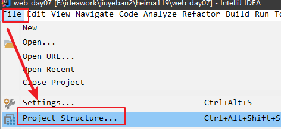

# 1.会话技术介绍掌握

就是用户打开浏览器访问网站开始直到关闭浏览器的过程就是一次会话。


# 2.Cookie技术

## 1.介绍


1.Cookie属于一个类，可以直接创建对象

2.Cookie是在服务器端创建的，然后tomcat服务器会将创建的cookie以及cookie中的数据响应给浏览器，保存到浏览器端。

​	说明：

​		好处：减轻服务器压力。

​		弊端：不安全

3.使用HttpServletResponse中的对象调用方法addCookie将服务器创建的cookie直接保存到浏览器端

4.当我们下次访问同一个服务器会携带相同的cookie信息，在服务器中我们可以使用HttpServletRequest对象调用方法getCookies获取随着请求携带过来的所有的cookie。


## 2.Cookie的应用场景

记住用户名和密码：


说明：我们目前还不能完成第二次访问登录页面，在页面中取出cookie中的用户名和密码。


## 3.Cookie的常用API(掌握)

【1】构造方法

~~~java
Cookie(String name, String value) 
~~~

【2】操作Cookie类中的name和value方法

~~~java
1.String getName() 获取cookie类中的name值
2.String getValue()  获取cookie类中的value值
3.void setValue(String newValue) 修改value值
~~~

【3】使用HttpServletResponse中的对象调用方法addCookie将服务器创建的cookie直接保存到浏览器端

~~~java
void addCookie(Cookie cookie)   参数需要一个cookie类的对象
~~~

 【4】使用HttpServletRequest对象调用方法getCookies获取随着请求携带过来的所有的cookie。

~~~java
Cookie[] getCookies()  获取随着请求的所有cookie放到数组中
~~~


【案例实现】

login.html

~~~html
<!DOCTYPE html>
<html lang="en">
<head>
    <meta charset="UTF-8">
    <title>Title</title>
</head>
<body>
    <form action="/loginServlet" method="post">
        用户名：<input type="text" name="username"><br>
        密码：<input type="password" name="password"><br>
        记住用户名和密码：<input type="checkbox" name="check"><br>
        <input type="submit" value="提交">
    </form>
</body>
</html>
~~~

loginServlet：

~~~java
package com.itheima.sh.a_cookie_01;

import javax.servlet.ServletException;
import javax.servlet.annotation.WebServlet;
import javax.servlet.http.Cookie;
import javax.servlet.http.HttpServlet;
import javax.servlet.http.HttpServletRequest;
import javax.servlet.http.HttpServletResponse;
import java.io.IOException;

@WebServlet("/loginServlet")
public class LoginServlet extends HttpServlet {
    protected void doPost(HttpServletRequest request, HttpServletResponse response) throws ServletException, IOException {
        doGet(request, response);
    }

    protected void doGet(HttpServletRequest request, HttpServletResponse response) throws ServletException, IOException {
        //1.处理post请求乱码
        request.setCharacterEncoding("utf-8");
        //2.获取用户名和密码
        String username = request.getParameter("username");
        String password = request.getParameter("password");
        //3.获取复选框的value属性值
        String check = request.getParameter("check");
        //4.判断用户是否希望记住用户名和密码
        if("on".equals(check)){
            //5.假设用户希望记住，我们创建cookie对象将用户名和密码存储到cookie中
            //Cookie(String name, String value)
            Cookie cookie1 = new Cookie("username", username);
            Cookie cookie2 = new Cookie("password", password);
            //6.响应给浏览器 void addCookie(Cookie cookie)   参数需要一个cookie类的对象
            response.addCookie(cookie1);
            response.addCookie(cookie2);
        }

    }
}

~~~


login2Servlet:

~~~java
package com.itheima.sh.a_cookie_01;

import javax.servlet.ServletException;
import javax.servlet.annotation.WebServlet;
import javax.servlet.http.Cookie;
import javax.servlet.http.HttpServlet;
import javax.servlet.http.HttpServletRequest;
import javax.servlet.http.HttpServletResponse;
import java.io.IOException;

@WebServlet("/login2Servlet")
public class Login2Servlet extends HttpServlet {
    protected void doPost(HttpServletRequest request, HttpServletResponse response) throws ServletException, IOException {
        doGet(request, response);
    }

    protected void doGet(HttpServletRequest request, HttpServletResponse response) throws ServletException, IOException {
        //1.获取页面中所有的cookie 使用HttpServletRequest对象调用方法getCookies获取随着请求携带过来的所有的cookie。
        //Cookie[] getCookies()  获取随着请求的所有cookie放到数组中
        Cookie[] cookies = request.getCookies();
        //2.遍历数组取出用户名和密码的cookie
        for (Cookie cookie : cookies) {
            //3.输出用户名和密码的cookie中的value值和name值
            String cookieName = cookie.getName();
            //判断是否是用户名
            if("username".equals(cookieName)){
                System.out.println(cookieName+"----"+cookie.getValue());
            }else if("password".equals(cookieName)){
                //判断是否是密码
                System.out.println(cookieName+"----"+cookie.getValue());
            }

        }

    }
}

~~~


小结：

1.常见API

| 方法                | 使用示例                                                     | 说明                                       |
| ------------------- | ------------------------------------------------------------ | ------------------------------------------ |
| 创建Cookie对象      | Cookie(String name,String value)name表示指定 cookie 名称 ，value 表示指定 cookie 值 | Cookie c1 = new Cookie("username","suoge") |
| 获取cookie的name值  | String  getName()                                            | c1.getName()                               |
| 获取cookie的value值 | String getValue()                                            | c1.getValue()                              |
| 设置cookie的值      | void  setValue(String value)                                 | c1.setValue("李四")                        |


2.响应给浏览器cookie的api:

HttpServletResponse接口中的方法：void addCookie(Cookie cookie)   将cookie发送给浏览器

3.获取浏览器的请求中所有的cookie：

HttpServletRequest接口中的方法：Cookie[] getCookies()  获取浏览器发送的cookie


## 4.关于cookie中存储特殊字符问题 (理解原理即可)

但是如果直接向cookie中存储特殊字符，例如空格,分号(;),逗号(,),等号(=)等特殊字符。那么就会出现问题。在向cookie中存储特殊字符之前必须要先进行编码处理，然后从cookie中取出之后在进行解码处理。

【1】向cookie中存储特殊字符问题演示

~~~java
package com.itheima.sh.b_cookie_02;

import javax.servlet.ServletException;
import javax.servlet.annotation.WebServlet;
import javax.servlet.http.Cookie;
import javax.servlet.http.HttpServlet;
import javax.servlet.http.HttpServletRequest;
import javax.servlet.http.HttpServletResponse;
import java.io.IOException;

@WebServlet("/specialCookie01Servlet")
public class SpecialCookie01Servlet extends HttpServlet {
    protected void doPost(HttpServletRequest request, HttpServletResponse response) throws ServletException, IOException {
        doGet(request, response);
    }

    protected void doGet(HttpServletRequest request, HttpServletResponse response) throws ServletException, IOException {
        /*
            向cookie中存储特殊字符问题演示
         */
        //1.创建Cookie类的对象
        Cookie cookie = new Cookie("msg", "12 34");
        //2.将cookie存储到浏览器端
        response.addCookie(cookie);
    }
}

~~~


【2】解决向cookie中存储特殊字符的问题

方案：在向cookie中存储特殊字符前进行编码，然后取出之后需要解码。

~~~java
package com.itheima.sh.b_cookie_02;

import javax.servlet.ServletException;
import javax.servlet.annotation.WebServlet;
import javax.servlet.http.Cookie;
import javax.servlet.http.HttpServlet;
import javax.servlet.http.HttpServletRequest;
import javax.servlet.http.HttpServletResponse;
import java.io.IOException;
import java.net.URLEncoder;

@WebServlet("/specialCookie01Servlet")
public class SpecialCookie01Servlet extends HttpServlet {
    protected void doPost(HttpServletRequest request, HttpServletResponse response) throws ServletException, IOException {
        doGet(request, response);
    }

    protected void doGet(HttpServletRequest request, HttpServletResponse response) throws ServletException, IOException {
        /*
            向cookie中存储特殊字符问题演示
         */
        //1.创建Cookie类的对象
//        Cookie cookie = new Cookie("msg", "12 34");报错
        String str = "12 34";
        //编码
        String encode = URLEncoder.encode(str, "utf-8");
        Cookie cookie = new Cookie("msg", encode);
        //2.将cookie存储到浏览器端
        response.addCookie(cookie);
    }
}

~~~


~~~java
package com.itheima.sh.b_cookie_02;

import javax.servlet.ServletException;
import javax.servlet.annotation.WebServlet;
import javax.servlet.http.Cookie;
import javax.servlet.http.HttpServlet;
import javax.servlet.http.HttpServletRequest;
import javax.servlet.http.HttpServletResponse;
import java.io.IOException;
import java.net.URLDecoder;

@WebServlet("/specialCookie02Servlet")
public class SpecialCookie02Servlet extends HttpServlet {
    protected void doPost(HttpServletRequest request, HttpServletResponse response) throws ServletException, IOException {
        doGet(request, response);
    }

    protected void doGet(HttpServletRequest request, HttpServletResponse response) throws ServletException, IOException {
        //1.获取浏览器的cookie
        Cookie[] cookies = request.getCookies();
        //2.遍历cookie数组
        for (Cookie cookie : cookies) {
            //3.取出cookie的name
            String cookieName = cookie.getName();
            //4.判断cookieName的值是否是msg
            if("msg".equals(cookieName)){
                //5.取出value
                String value = cookie.getValue();
                //6.解码并输出
                String decode = URLDecoder.decode(value, "utf-8");
                System.out.println(decode);
            }
        }
    }
}

~~~

小结：

1.cookie中不能直接存储特殊字符：空格 分号等，如果存储必须先编码在存储：

~~~java
 String encode = URLEncoder.encode(str, "utf-8");
~~~


2.在获取的时候需要解码：

~~~java
 String decode = URLDecoder.decode(value, "utf-8");
~~~

## 5.Cookie的存活时间 掌握

cookie默认的存活时间是会话结束即关闭浏览器。我们平常开发中对于某些cookie中存储的数据希望保存的时间更长一些，而不是浏览器关闭就不存在。如果想让cookie长久保存我们可以使用Cookie类的方法即可：

~~~java
 void setMaxAge(int expiry) 参数是秒
~~~

【1】需求：向cookie中存储数据，并设置cookie的存活时间为1周；

~~~java
package com.itheima.sh.b_cookie_02;

import javax.servlet.ServletException;
import javax.servlet.annotation.WebServlet;
import javax.servlet.http.Cookie;
import javax.servlet.http.HttpServlet;
import javax.servlet.http.HttpServletRequest;
import javax.servlet.http.HttpServletResponse;
import java.io.IOException;

@WebServlet("/cookiePersis01Servlet")
public class CookiePersis01Servlet extends HttpServlet {
    protected void doPost(HttpServletRequest request, HttpServletResponse response) throws ServletException, IOException {
        doGet(request, response);
    }

    protected void doGet(HttpServletRequest request, HttpServletResponse response) throws ServletException, IOException {
        //【1】需求：向cookie中存储数据，并设置cookie的存活时间为1周；持久化cookie
        //1.创建cookie对象
        Cookie cookie = new Cookie("age", "18");
        //2.设置cookie的最大存活时间  void setMaxAge(int expiry) 参数是秒
        cookie.setMaxAge(60*60*24*7);
        //3.响应cookie给浏览器
        response.addCookie(cookie);
    }
}

~~~


小结：

1.cookie分为两种：

​	1）会话级别的cookie：关闭浏览器cookie自动销毁

​	2）持久化级别的cookie：通过Cookie类的方法setMaxAge设置cookie的存活时间


## 6.设置cookie的有效路径(理解)

如果系统特别复杂的情况下，我只希望访问系统的用户模块时携带用户的cookie，不需要携带其他模块的cookie。

设置cookie有效路径：/user  即可。

设置cookie的有效路径,使用Cookie类中的方法：

~~~java
void setPath(String uri)  参数中书写有效路径
~~~

需求：

1. 在PathServlet中创建一个Cookie，设置路径为"/suoge/a/b";
2. 新建一个PathTwoServlet，设置该servlet的访问路径："/suoge/a/b/d";
3. 新建一个PathThrServlet，设置该servlet的访问路径：/suoge/a";
4. 分别在PathTwoServlet，PathThrServlet中获取cookie；

~~~java
package com.itheima.sh.b_cookie_02;

import javax.servlet.ServletException;
import javax.servlet.annotation.WebServlet;
import javax.servlet.http.Cookie;
import javax.servlet.http.HttpServlet;
import javax.servlet.http.HttpServletRequest;
import javax.servlet.http.HttpServletResponse;
import java.io.IOException;

@WebServlet("/pathServlet")
public class PathServlet extends HttpServlet {
    protected void doPost(HttpServletRequest request, HttpServletResponse response) throws ServletException, IOException {
        doGet(request, response);
    }

    protected void doGet(HttpServletRequest request, HttpServletResponse response) throws ServletException, IOException {
        //在PathServlet中创建一个Cookie，设置路径为"/suoge/a/b";
        //1.创建cookie对象
        Cookie cookie = new Cookie("name", "柳岩");
        //2.设置有效路径  void setPath(String uri)  参数中书写有效路径
        cookie.setPath("/suoge/a/b");
        //3.响应给浏览器
        response.addCookie(cookie);
    }
}

~~~


~~~java
package com.itheima.sh.b_cookie_02;

import javax.servlet.ServletException;
import javax.servlet.annotation.WebServlet;
import javax.servlet.http.Cookie;
import javax.servlet.http.HttpServlet;
import javax.servlet.http.HttpServletRequest;
import javax.servlet.http.HttpServletResponse;
import java.io.IOException;
import java.util.Arrays;

@WebServlet("/suoge/a/b/d")
public class PathTwoServlet extends HttpServlet {
    protected void doPost(HttpServletRequest request, HttpServletResponse response) throws ServletException, IOException {
        doGet(request, response);
    }

    protected void doGet(HttpServletRequest request, HttpServletResponse response) throws ServletException, IOException {
        //新建一个PathTwoServlet，设置该servlet的访问路径："/suoge/a/b/d";
        //1.获取浏览器所有的cookie
        Cookie[] cookies = request.getCookies();
        /*
            通过演示我们发现这里获取的cookie：
                age   路径是  /     只要访问同一个ip地址或者域名都会携带cookie信息
                name  路径是  /suoge/a/b  我们这里访问的servlet路径是：/suoge/a/b/d  因为
                            cookie的name有效路径是/suoge/a/b，而访问的servlet路径属于其子路径。只要访问cookie
                            有效路径的本身以及子路径都会携带cookie
         */
        System.out.println(Arrays.toString(cookies));
    }
}

~~~


~~~java
package com.itheima.sh.b_cookie_02;

import javax.servlet.ServletException;
import javax.servlet.annotation.WebServlet;
import javax.servlet.http.Cookie;
import javax.servlet.http.HttpServlet;
import javax.servlet.http.HttpServletRequest;
import javax.servlet.http.HttpServletResponse;
import java.io.IOException;
import java.util.Arrays;

@WebServlet("/suoge/a")
public class PathThrServlet extends HttpServlet {
    protected void doPost(HttpServletRequest request, HttpServletResponse response) throws ServletException, IOException {
        doGet(request, response);
    }

    protected void doGet(HttpServletRequest request, HttpServletResponse response) throws ServletException, IOException {
        //新建一个PathTwoServlet，设置该servlet的访问路径："/suoge/a/b/d";
        //1.获取浏览器所有的cookie
        Cookie[] cookies = request.getCookies();
        /*
            通过演示我们发现这里获取的cookie：
                age   路径是  /     只要访问同一个ip地址或者域名都会携带cookie信息
                name  路径是  /suoge/a/b  我们这里访问的servlet路径是：/suoge/a 因为
                            cookie的name有效路径是/suoge/a/b，而访问的servlet路径不属于其子路径以及本身路径。所以不会携带cookie
         */
//        System.out.println(Arrays.toString(cookies));
    }
}

~~~

小结：

1.如果访问的servlet路径是要携带的cookie的**路径本身或者子路径**，此时会携带该cookie，否则不会携带cookie

2.面试题：

当给cookie设置有效路径"/user/role"后：

访问的servlet路径是：

   a:/user     不会携带

   b:/user/aaa   不会携带

  c:/user/role  会携带

  d: /role  不会携带

  e:/user/role/aaa  会携带

  

## 7.Cookie删除(重要)

1.如果cookie是会话级别的cookie，关闭浏览器会话结束，cookie消失

2.在浏览器手动清除


**3.使用代码进行删除  掌握**

思想是替换。把持久化的cookie变为会话级别的cookie。

步骤：

1.创建cookie   new Cookie(name,value), name值就是要删除的cookie的name,value的值是"" 空字符串

2.设置cookie的存活时间是0

3.设置cookie的有效路径和原来的有效路径一致

4.响应给浏览器


~~~java
package com.itheima.sh.b_cookie_02;

import javax.servlet.ServletException;
import javax.servlet.annotation.WebServlet;
import javax.servlet.http.Cookie;
import javax.servlet.http.HttpServlet;
import javax.servlet.http.HttpServletRequest;
import javax.servlet.http.HttpServletResponse;
import java.io.IOException;

@WebServlet("/deleteCookie01Servlet")
public class DeleteCookie01Servlet extends HttpServlet {
    protected void doPost(HttpServletRequest request, HttpServletResponse response) throws ServletException, IOException {
        doGet(request, response);
    }

    protected void doGet(HttpServletRequest request, HttpServletResponse response) throws ServletException, IOException {
        //3.使用代码进行删除  掌握**
        //思想是替换。把持久化的cookie变为会话级别的cookie。
        //步骤：
        //1.创建cookie   new Cookie(name,value), name值就是要删除的cookie的name,value的值是"" 空字符串
        Cookie cookie = new Cookie("age", "");

        //2.设置cookie的存活时间是0
        cookie.setMaxAge(0);
        //3.设置cookie的有效路径和原来的有效路径一致
        cookie.setPath("/");
        //4.响应给浏览器
        response.addCookie(cookie);
    }
}

~~~


## 8.使用cookie记住浏览商品的历史记录(课下完成)

【1.需求】

​	做一个商品页面，当我们访问后，在页面上点击查看商品浏览记录后，可以查看到以前浏览过的商品信息

【2.分析】

1.创建两个页面：

​		goods.html    展示商品信息

~~~html
<!DOCTYPE html>
<html lang="zh-CN">
<head>
    <meta charset="UTF-8">
    <title>Title</title>
</head>
<body>
    <a href="/goodsServlet?good=galaxy">三星手机</a> <br>
    <a href="/goodsServlet?good=chuizi">锤子手机</a> <br>
    <a href="/goodsServlet?good=xiaomi">小米手机</a> <br>
</body>
</html>
~~~

​	    goods2.html  点击该页面的按钮就可以查看浏览商品的历史记录

~~~html
<!DOCTYPE html>
<html lang="zh-CN">
<head>
    <meta charset="UTF-8">
    <title>Title</title>
</head>
<body>
<a href="goods.html">继续浏览</a> <br>
<a href="/historyServlet">查看浏览记录</a> <br>
</body>
</html>
~~~


2.创建2个servlet：

​		goodsServlet:当用户在goods.html页面中点击浏览商品，执行该servlet，将浏览的商品存储到cookie中，然后响应给浏览器。

~~~java
package com.itheima.sh.c_cookie_test_03;

import javax.servlet.ServletException;
import javax.servlet.annotation.WebServlet;
import javax.servlet.http.Cookie;
import javax.servlet.http.HttpServlet;
import javax.servlet.http.HttpServletRequest;
import javax.servlet.http.HttpServletResponse;
import java.io.IOException;
import java.util.Arrays;
import java.util.List;

/*
    goodsServlet:当用户在goods.html页面中点击浏览商品，执行该servlet，将浏览的商品存储到cookie中，然后响应给浏览器。
 */
@WebServlet("/goodsServlet")
public class GoodsServle extends HttpServlet {
    protected void doPost(HttpServletRequest request, HttpServletResponse response) throws ServletException, IOException {
        doGet(request, response);
    }

    protected void doGet(HttpServletRequest request, HttpServletResponse response) throws ServletException, IOException {
        //1.获取浏览的商品名
        String good = request.getParameter("good");
        //2.获取页面中的所有cookie
        Cookie cookieHistory = CookieUtils.getCookies(request,"history");
        /*
            3.判断获取的cookie是否是null
                如果是null  说明之前没有浏览过商品，第一次浏览
                如果不是null 说明之前浏览过商品
         */
        if(cookieHistory == null){
            //4.如果是null  说明之前没有浏览过商品，第一次浏览,创建Cookie将商品存储到cookie中
            Cookie cookie = new Cookie("history", good);
            //5.设置cookie最大存活时间
            cookie.setMaxAge(60*60);
            //6.响应给浏览器
            response.addCookie(cookie);
        }else{
             /*
                    7.如果不是null 说明之前浏览过商品
                                        name        value
                    cookie 中的数据：  history   galaxy_chuizi
             */
            //获取cookie中的value  ===》galaxy_chuizi
            String value = cookieHistory.getValue();
            //8.按照_下划线字符进行切割变为数组 {galaxy,chuizi,...}
            String[] arr = value.split("_");
            //9.将数组转换为集合List   static <T> List<T>asList(T... a)
            List<String> list = Arrays.asList(arr);
            //10.使用List集合中的方法  boolean contains(Object o)
            // 判断集合list中是否含有当前浏览的商品
            if(!list.contains(good)){
                //11.不包含 {galaxy,chuizi} 不包含xiaomi 我们要将xiaomi拼接到value值
                //value = galaxy_chuizi_xiaomi===>history====>galaxy_chuizi_xiaomi
                value=value+"_"+good;
                //将新的value覆盖之前的value
                cookieHistory.setValue(value);
                //12.将新的cookie响应给浏览器
                response.addCookie(cookieHistory);
            }
        }

    }
}

~~~

工具类：

~~~java
package com.itheima.sh.c_cookie_test_03;

import javax.servlet.http.Cookie;
import javax.servlet.http.HttpServletRequest;
/*
    工具类用来判断浏览器中是否含有name是history的cookie，如果有则返回，没有返回null
 */
public class CookieUtils {
    ////String cookieNameHistory="history"
    public static Cookie getCookies(HttpServletRequest request, String cookieNameHistory) {
        //1.获取浏览器所有的cookie
        Cookie[] cookies = request.getCookies();
        //防止空指针异常我们这里需要对数组cookies判断
        if(cookies!=null && cookies.length>0){
            //2.遍历数组取出每个cookie
            for (Cookie cookie : cookies) {
                //3.取出cookie的name值
                String name = cookie.getName();
                //4.判断name是否等于cookieNameHistory即history
                if(cookieNameHistory.equals(name)){
                    //5.说明含有name是history的cookie，返回cookie
                    return cookie;
                }
            }
        }

        //能够执行到这里说明浏览器没有name是history的cookie
        return null;
    }
}

~~~

​	   historyServlet:在  goods2.html页面中点击历史记录按钮，执行该servlet，在该servlet中取出浏览器客户端的历史记录的cookie并将商品历史记录响应给浏览器。

~~~java
package com.itheima.sh.c_cookie_test_03;

import javax.servlet.ServletException;
import javax.servlet.annotation.WebServlet;
import javax.servlet.http.Cookie;
import javax.servlet.http.HttpServlet;
import javax.servlet.http.HttpServletRequest;
import javax.servlet.http.HttpServletResponse;
import java.io.IOException;
import java.util.Arrays;

/*
       historyServlet:在  goods2.html页面中点击历史记录按钮，执行该servlet，在该servlet中取出浏览器客户端的历史记录的cookie并将商品历史记录响应给浏览器。
 */
@WebServlet("/historyServlet")
public class HistoryServlet extends HttpServlet {
    protected void doPost(HttpServletRequest request, HttpServletResponse response) throws ServletException, IOException {
        doGet(request, response);
    }

    protected void doGet(HttpServletRequest request, HttpServletResponse response) throws ServletException, IOException {

        response.setContentType("text/html;charset=utf-8");
        //1.获取cookie
        Cookie cookieHistory = CookieUtils.getCookies(request, "history");
        //2.判断cookie是否等于null
        if(cookieHistory == null){
            //3.等于null，说明没有历史记录，响应给浏览器一句话
            response.getWriter().print("<a href=\"/goods.html\">您还没有浏览记录，去浏览吧</a>");
        }else{
            //4.不等于null,说明有历史记录，取出cookie的value  galaxy_chuizi_xiaomi
            String value = cookieHistory.getValue();
            //5.按照_下划线切割为数组
            String[] arr = value.split("_");
            //6.响应给浏览器
            response.getWriter().print("您浏览的商品记录是:"+Arrays.toString(arr));
            response.getWriter().print("<br><a href=\"/goods.html\">继续浏览</a>");
        }


    }
}

~~~


# 3.Session技术

## 1.session介绍

session属于在服务器中创建的，存在服务器中。属于会话过程中的技术，用来存储数据。


1.Session会话技术属于HttpSession接口类型

2.属于在服务器中创建的，存在服务器中，并且可以保留一段时间(默认30min)

## 2.Session原理 掌握


小结：

1.用户第一次访问的时候，tomcat会创建对应的session容器，每个容器具有唯一的标识JSESSIONID,然后tomcat底层创建会话级别的cookie存储唯一标识JSESSIONID存储到浏览器端。


2.用户再次访问，tomcat中取出session并从cookie中取出之前保存的唯一标识JSESSIONID进行比较查找自己的session容器


## 3.Session的域对象操作 掌握

session属于域对象，具有三个方法：

~~~java
void setAttribute(String name, Object value) 
Object getAttribute(String name)  
void removeAttribute(String name) 
~~~

三个域对象使用范围：

request < session < servletContext


## 4.Session容器创建和销毁的API	

获取session的API详细说明：**api要求记住第一个API**

**4.1request.getSession()**

```java
创建session 如果session不存在，创建session，存在，获取当前session
request.getSession();
```

4.2HttpSession session1 = request.getSession(true);

```java
HttpSession session1 = request.getSession(true);
//两个API效果相同 request.getSession(true); 等于 request.getSession();
创建session 如果session不存在，创建session，存在，获取当前session
```

4.3request.getSession(false);

```java
request.getSession(false);
如果当前存在session 获取当前session， 不存在，不获取session,返回null
```

4.4session.invalidate() ;

```java
session.invalidate()使当前session失效,即销毁当前session
```

4.5补充：String sessionId = session.getId();

```java
String sessionId = session.getId();  获取session的唯一标识id
```

代码演示：

~~~java
package com.itheima.sh.d_session_04;

import javax.servlet.ServletException;
import javax.servlet.annotation.WebServlet;
import javax.servlet.http.HttpServlet;
import javax.servlet.http.HttpServletRequest;
import javax.servlet.http.HttpServletResponse;
import javax.servlet.http.HttpSession;
import java.io.IOException;

@WebServlet("/sessionDemo01Servlet")
public class SessionDemo01Servlet extends HttpServlet {
    protected void doPost(HttpServletRequest request, HttpServletResponse response) throws ServletException, IOException {
        doGet(request, response);
    }

    protected void doGet(HttpServletRequest request, HttpServletResponse response) throws ServletException, IOException {
        /*
            session创建和销毁的api演示：
         */
        //1.创建session
        HttpSession session = request.getSession();
        //2.获取唯一标识并输出
        System.out.println(session.getId());


        //3.创建session  有则获取，没有则创建
        HttpSession session2 = request.getSession(true);
        //4.获取唯一标识并输出
        System.out.println(session2.getId());

        //销毁session  session.invalidate()使当前session失效,即销毁当前session
        session.invalidate();
        //5.创建session  有则获取，没有则不获取返回null
        HttpSession session3 = request.getSession(false);
        System.out.println("session3 = " + session3);
        if(session3!=null){
            //6.获取唯一标识并输出
            System.out.println(session3.getId());
        }


    }
}

~~~

小结：

**1.创建session 掌握**

~~~java
HttpSession session = request.getSession();
~~~

2.

~~~java
  HttpSession session2 = request.getSession(true); 参数是true表示有session就获取没有则创建
  HttpSession session2 = request.getSession(false); 参数是false表示有session就获取没有则返回null
~~~

3.销毁session方法：

~~~java
 session.invalidate();
~~~

4.获取session的唯一标识JSESSIONID:

~~~java
session3.getId()
~~~


## 5.Session的其他常用API(了解)

| HttpSession接口方法    | **作用**                                                     |
| ---------------------- | ------------------------------------------------------------ |
| long getCreationTime() | **表示会话创建的时间**，返回long类型。  表示1970-1-1到这个时间之间相差的毫秒数 |
| boolean isNew()        | 判断当前是否是一个新的会话，是的返回true,否则就是false       |

~~~java
package com.itheima.sh.d_session_04;

import javax.servlet.ServletException;
import javax.servlet.annotation.WebServlet;
import javax.servlet.http.HttpServlet;
import javax.servlet.http.HttpServletRequest;
import javax.servlet.http.HttpServletResponse;
import javax.servlet.http.HttpSession;
import java.io.IOException;
import java.sql.Timestamp;
import java.util.Date;

@WebServlet("/sessionDemo02Servlet")
public class SessionDemo02Servlet extends HttpServlet {
    protected void doPost(HttpServletRequest request, HttpServletResponse response) throws ServletException, IOException {
        doGet(request, response);
    }

    protected void doGet(HttpServletRequest request, HttpServletResponse response) throws ServletException, IOException {
        /*
            1.long getCreationTime()**表示会话创建的时间**，返回long类型。  表示1970-1-1到这个时间之间相差的毫秒数
            2.boolean isNew()判断当前是否是一个新的会话，是的返回true
         */
        //创建session
        HttpSession session = request.getSession();
        //long getCreationTime()**表示会话创建的时间**，返回long类型。  表示1970-1-1到这个时间之间相差的毫秒数
        /*long creationTime = session.getCreationTime();
        System.out.println("creationTime = " + creationTime);
        //将creationTime毫秒转换为日期时间
        Date date = new Date(creationTime);
        System.out.println(date.toString());
        //2020-11-20 14:52:46
        System.out.println(date.toLocaleString());

        //Timestamp(long time) 2020-11-20 14:54:30
        System.out.println(new Timestamp(creationTime).toLocaleString());*/


        //2.boolean isNew()判断当前是否是一个新的会话，是的返回true
        System.out.println(session.isNew());
    }
}

~~~

## 6.session的域对象练习

~~~java
package com.itheima.sh.d_session_04;

import javax.servlet.ServletException;
import javax.servlet.annotation.WebServlet;
import javax.servlet.http.HttpServlet;
import javax.servlet.http.HttpServletRequest;
import javax.servlet.http.HttpServletResponse;
import javax.servlet.http.HttpSession;
import java.io.IOException;

@WebServlet("/sessionScope01Servlet")
public class SessionScope01Servlet extends HttpServlet {
    protected void doPost(HttpServletRequest request, HttpServletResponse response) throws ServletException, IOException {
        doGet(request, response);
    }

    protected void doGet(HttpServletRequest request, HttpServletResponse response) throws ServletException, IOException {
        //1.创建session
        HttpSession session = request.getSession();
        //2.向session中存储数据
        session.setAttribute("username","锁哥");
        System.out.println(session.getId());

        //重定向到sessionScope02Servlet
        response.sendRedirect("/sessionScope02Servlet");
    }
}

~~~


~~~java
package com.itheima.sh.d_session_04;

import javax.servlet.ServletException;
import javax.servlet.annotation.WebServlet;
import javax.servlet.http.HttpServlet;
import javax.servlet.http.HttpServletRequest;
import javax.servlet.http.HttpServletResponse;
import javax.servlet.http.HttpSession;
import java.io.IOException;

@WebServlet("/sessionScope02Servlet")
public class SessionScope02Servlet extends HttpServlet {
    protected void doPost(HttpServletRequest request, HttpServletResponse response) throws ServletException, IOException {
        doGet(request, response);
    }

    protected void doGet(HttpServletRequest request, HttpServletResponse response) throws ServletException, IOException {
        //1.获取session
        HttpSession session = request.getSession();
        //2.从session中获取数据
        String username = (String) session.getAttribute("username");
        System.out.println(session.getId());
    }
}

~~~

小结：

session作为域对象可以在多次请求中共享session容器中的数据。


## 7.Session的生命周期(了解即可)


小结：

1.session的创建时间：第一次访问执行代码request.getSession();

2.销毁session：

​	1）默认是30min，时间到自动销毁

​	2）执行方法：invalidate()

​	3)服务器非正常关闭

​	4）手动设置过期时间：

| HttpSession的方法                    | **功能描述**                         |
| ------------------------------------ | ------------------------------------ |
| void  setMaxInactiveInterval(int 秒) | 设置会话最大非活动时间时隔，单位是秒 |

| session中的方法              | **说明**                                                   |
| ---------------------------- | ---------------------------------------------------------- |
| int getMaxInactiveInterval() | 得到服务器上会话最大的非活动时间间隔，默认是1800秒(30分钟) |

~~~java
package com.itheima.sh.e_session_05;

import javax.servlet.ServletException;
import javax.servlet.annotation.WebServlet;
import javax.servlet.http.HttpServlet;
import javax.servlet.http.HttpServletRequest;
import javax.servlet.http.HttpServletResponse;
import javax.servlet.http.HttpSession;
import java.io.IOException;

@WebServlet("/sessionDestroy01Servlet")
public class SessionDestroy01Servlet extends HttpServlet {
    protected void doPost(HttpServletRequest request, HttpServletResponse response) throws ServletException, IOException {
        doGet(request, response);
    }

    protected void doGet(HttpServletRequest request, HttpServletResponse response) throws ServletException, IOException {

        //创建session
        HttpSession session = request.getSession();
        System.out.println("更改session的存活时间前="+session.getId());
        //1.int getMaxInactiveInterval()得到服务器上会话最大的非活动时间间隔，默认是1800秒(30分钟)
        int time = session.getMaxInactiveInterval();
        System.out.println("time = " + time);

        //2.void  setMaxInactiveInterval(int 秒)设置会话最大非活动时间时隔，单位是秒
//        session.setMaxInactiveInterval(5);
        //负数时间指示会话永远不会超时。 
        session.setMaxInactiveInterval(-1);
        System.out.println("更改session的存活时间后="+session.getId());
        int time2 = session.getMaxInactiveInterval();
        System.out.println("time = " + time2);

    }
}

~~~


## 8.浏览器关闭后，session持久化方案(重要)

【1】tomcat在创建cookie的时候属于会话级别的cookie，关闭浏览器，cookie消失，下次打开浏览器不会携带之前的cookie即cookie中的JSESSIONID到tomcat服务器中了，那么这样会造成tomcat服务器中会有很多个不能使用色session容器(session依然还在，只是找不到了)。严重的话会造成服务器宕机。

~~~java
package com.itheima.sh.e_session_05;

import javax.servlet.ServletException;
import javax.servlet.annotation.WebServlet;
import javax.servlet.http.HttpServlet;
import javax.servlet.http.HttpServletRequest;
import javax.servlet.http.HttpServletResponse;
import javax.servlet.http.HttpSession;
import java.io.IOException;

@WebServlet("/sessionPersis01Servlet")
public class SessionPersis01Servlet extends HttpServlet {
    protected void doPost(HttpServletRequest request, HttpServletResponse response) throws ServletException, IOException {
        doGet(request, response);
    }

    protected void doGet(HttpServletRequest request, HttpServletResponse response) throws ServletException, IOException {
        //1.获取session
        HttpSession session = request.getSession();
        System.out.println(session.getId());


    }
}

~~~


【2】持久化session来解决上述问题

主要问题是cookie是会话级别的，我们只需要将会话级别的cookie变为持久化级别的即可。

步骤：

1.创建session

2.获取session的JSESSIOID的值

3.创建Cookie ,Cookie("JSESSIOID",值)

4.使用cookie对象调用方法setMaxAge()进行cookie的持久化，存活时间建议30min

5.将cookie响应给浏览器

~~~java
package com.itheima.sh.e_session_05;

import javax.servlet.ServletException;
import javax.servlet.annotation.WebServlet;
import javax.servlet.http.*;
import java.io.IOException;

@WebServlet("/sessionPersis01Servlet")
public class SessionPersis01Servlet extends HttpServlet {
    protected void doPost(HttpServletRequest request, HttpServletResponse response) throws ServletException, IOException {
        doGet(request, response);
    }

    protected void doGet(HttpServletRequest request, HttpServletResponse response) throws ServletException, IOException {
        //1.创建session
        HttpSession session = request.getSession();
        //2.获取session的JSESSIOID的值
        String sessionId = session.getId();
        System.out.println(sessionId);
        //3.创建Cookie ,Cookie("JSESSIOID",值)
        Cookie cookie = new Cookie("JSESSIONID", sessionId);
        //4.使用cookie对象调用方法setMaxAge()进行cookie的持久化，存活时间建议30min
        cookie.setMaxAge(60*30);
        //5.将cookie响应给浏览器
        response.addCookie(cookie);

    }
}
~~~


## 9.Session的钝化与活化技术(了解) 面试

### 1.介绍

钝化：就是正常关闭tomcat服务器，会将session容器中的数据长久保存到硬盘上。底层原理是序列化。

活化：就是启动tomcat服务器，将之前钝化的session容器读取到内存中。底层原理是反序列化。

**注意：**

**1.由于钝化和活化的原理是序列化和反序列，所以要求存储在session容器中的对象所属类必须实现序列化接口Serializable。**

**2.演示钝化和活化效果不能在idea中演示，我们需要将当前项目打成war包放到tomcat服务器中的webapps目录下进行演示。**

### 2.钝化和活化的演示

【1】代码：

~~~java
package com.itheima.sh.f_session_06;

import javax.servlet.ServletException;
import javax.servlet.annotation.WebServlet;
import javax.servlet.http.HttpServlet;
import javax.servlet.http.HttpServletRequest;
import javax.servlet.http.HttpServletResponse;
import javax.servlet.http.HttpSession;
import java.io.IOException;

@WebServlet("/setSessionServlet")
public class SetSessionServlet extends HttpServlet {
    protected void doPost(HttpServletRequest request, HttpServletResponse response) throws ServletException, IOException {
        doGet(request, response);
    }

    protected void doGet(HttpServletRequest request, HttpServletResponse response) throws ServletException, IOException {
        response.setContentType("text/html;charset=utf-8");
        //1.创建session
        HttpSession session = request.getSession();
        //2.获取session的id
        String sessionId = session.getId();
        //3.创建商品对象
        Product p = new Product("笔记本", 9999);
        //4.将商品对象存储到session中
        session.setAttribute("p",p);
        //5.响应数据
        response.getWriter().print("setSessionServlet.....当前JSESSIONID="+sessionId);
    }
}

~~~


~~~java
package com.itheima.sh.f_session_06;

import javax.servlet.ServletException;
import javax.servlet.annotation.WebServlet;
import javax.servlet.http.HttpServlet;
import javax.servlet.http.HttpServletRequest;
import javax.servlet.http.HttpServletResponse;
import javax.servlet.http.HttpSession;
import java.io.IOException;

@WebServlet("/getSessionServlet")
public class GetSessionServlet extends HttpServlet {
    protected void doPost(HttpServletRequest request, HttpServletResponse response) throws ServletException, IOException {
        doGet(request, response);
    }

    protected void doGet(HttpServletRequest request, HttpServletResponse response) throws ServletException, IOException {
        response.setContentType("text/html;charset=utf-8");
        //1.获取session
        HttpSession session = request.getSession();
        //2.获取session的id
        String sessionId = session.getId();
        //3.从session中取出商品
        Product p = (Product) session.getAttribute("p");
        //4.响应数据
        response.getWriter().print("getSessionServlet.....当前JSESSIONID="+sessionId+",p="+p.toString());
    }
}

~~~

【2】打war包

1.




2.


3.


4.


5.


6.构建完成之后：


7.将上述生成的war包复制到tomcat的webapps目录下：


8.到tomcat的bin目录下启动tomcat


注意：这里启动一定将idea中的tomcat关闭。


9.在浏览器中访问servlet


10.正常关闭tomcat:bin目录下面的shutdown.bat

11.在如下目录生成session的钝化文件：


12.正常启动tomcat

钝化文件就会被加载到内存，文件自动消失


13.小结：

钝化：就是正常关闭tomcat服务器，将session中的的数据长久保存到硬盘上，会在work\Catalina\localhost\项目名下生成一个钝化文件。该文件中保存的就是session中的数据。实现原理是序列化。

活化：启动tomcat服务器将之前钝化的文件读取内存中，文件会自动消失。原理是反序列化。

要求对象所属类必须实现序列化接口Serializable。


## 10.Cookie禁用后Session的处理【了解】

### 1.问题

cookie禁用后，浏览器中不能保存cookie了，那么没有cookie，就没有JSESSIONID,那么这样就找不到tomcat服务器中的session容器了，这样会造成tomcat服务器中的存在过多的不能使用的session容器。

### 2.解决问题

重写url即在url后面拼接当前session的唯一标识JSESSIONID.

分类：

1)重定向重写URL 

2)超连接重写URL

#### 2.1重定向重写URL 

| 方法                             | 说明                                               |
| -------------------------------- | -------------------------------------------------- |
| response.encodeRedirectURL(path) | 将重定向跳转的地址进行重写，添加一个会话ID在后面。 |

~~~java
package com.itheima.sh.g_session_cookie_disabled_07;

import javax.servlet.ServletException;
import javax.servlet.annotation.WebServlet;
import javax.servlet.http.HttpServlet;
import javax.servlet.http.HttpServletRequest;
import javax.servlet.http.HttpServletResponse;
import javax.servlet.http.HttpSession;
import java.io.IOException;

@WebServlet("/demo01")
public class Demo01Servlet extends HttpServlet {
    protected void doPost(HttpServletRequest request, HttpServletResponse response) throws ServletException, IOException {
        doGet(request, response);
    }

    protected void doGet(HttpServletRequest request, HttpServletResponse response) throws ServletException, IOException {
        /*
            重定向重写URL 方式解决禁用cookie访问session的问题：
            response.encodeRedirectURL(path)将重定向跳转的地址进行重写，添加一个会话ID在后面。
         */
        //1.创建session
        HttpSession session = request.getSession();
        //2.输出id
        System.out.println(session.getId());
        //3.重定向到  /demo02
        String path = "/demo02";
        // response.encodeRedirectURL(path)将重定向跳转的地址进行重写，添加一个会话ID在后面。
        ///demo02;jsessionid=0073C2468966D58AF52BBC728A688577
        String url = response.encodeRedirectURL(path);
        response.sendRedirect(url);
    }
}

~~~

~~~java
package com.itheima.sh.g_session_cookie_disabled_07;

import javax.servlet.ServletException;
import javax.servlet.annotation.WebServlet;
import javax.servlet.http.HttpServlet;
import javax.servlet.http.HttpServletRequest;
import javax.servlet.http.HttpServletResponse;
import javax.servlet.http.HttpSession;
import java.io.IOException;

@WebServlet("/demo02")
public class Demo02Servlet extends HttpServlet {
    protected void doPost(HttpServletRequest request, HttpServletResponse response) throws ServletException, IOException {
        doGet(request, response);
    }

    protected void doGet(HttpServletRequest request, HttpServletResponse response) throws ServletException, IOException {
        //1.创建session
        HttpSession session = request.getSession();
        //2.输出id
        System.out.println(session.getId());
    }
}

~~~


#### 2.2超连接重写URL

| 方法                     | 说明                        |
| ------------------------ | --------------------------- |
| response.encodeURL(path) | 对要跳转到的地址使用URL重写 |

~~~java
package com.itheima.sh.g_session_cookie_disabled_07;

import javax.servlet.ServletException;
import javax.servlet.annotation.WebServlet;
import javax.servlet.http.HttpServlet;
import javax.servlet.http.HttpServletRequest;
import javax.servlet.http.HttpServletResponse;
import javax.servlet.http.HttpSession;
import java.io.IOException;

@WebServlet("/demo03")
public class Demo03Servlet extends HttpServlet {
    protected void doPost(HttpServletRequest request, HttpServletResponse response) throws ServletException, IOException {
        doGet(request, response);
    }

    protected void doGet(HttpServletRequest request, HttpServletResponse response) throws ServletException, IOException {
        response.setContentType("text/html;charset=utf-8");
        /*
            超连接重写URL 方式解决禁用cookie访问session的问题：
            response.encodeURL(path)对要跳转到的地址使用URL重写
         */
        //1.创建session
        HttpSession session = request.getSession();
        //2.输出id
        System.out.println(session.getId());
        //3.超连接重写URL  /demo04
        String path = "/demo04";
        //4.响应给浏览器一个超链接
        String url = response.encodeURL(path);
        //<a href='/demo04'>超连接重写URL</a>
//        response.getWriter().print("<a href='"+url+"'>超连接重写URL</a>");
        response.getWriter().print("<a href=\""+url+"\">超连接重写URL</a>");
    }
}

~~~


~~~java
package com.itheima.sh.g_session_cookie_disabled_07;

import javax.servlet.ServletException;
import javax.servlet.annotation.WebServlet;
import javax.servlet.http.HttpServlet;
import javax.servlet.http.HttpServletRequest;
import javax.servlet.http.HttpServletResponse;
import javax.servlet.http.HttpSession;
import java.io.IOException;

@WebServlet("/demo04")
public class Demo04Servlet extends HttpServlet {
    protected void doPost(HttpServletRequest request, HttpServletResponse response) throws ServletException, IOException {
        doGet(request, response);
    }

    protected void doGet(HttpServletRequest request, HttpServletResponse response) throws ServletException, IOException {
        //1.创建session
        HttpSession session = request.getSession();
        //2.输出id
        System.out.println(session.getId());
    }
}

~~~


小结：

1.如果cookie被禁用，如何找到对应的session？

重写url,有种方式：

​	1）重定向重写url:

~~~java
 String url = response.encodeRedirectURL(path);
~~~

​	2）超链接重写url

~~~java
String url = response.encodeURL(path);
~~~

核心思想都是在url后面拼接当前session的JSESSIONID.

~~~
/demo02;jsessionid=0073C2468966D58AF52BBC728A688577
~~~

2.两种方式区别：

​		超链接重写url：如果url是空字符串，那么也会在url后面拼接JSESSIONID.

​		重定向重写url:   如果url是空字符串，不做拼接


