# day08-JSP&EL&JSTL

## 学习目标

-[ ] 了解JSP的作用
-[ ] jsp常用内置对象
-[ ] EL表达式学习
-[ ] JSTL标签库学习


##  第一章 JSP

### 1、概述

#### 1.1 JSP引入

​	在前几天的登录案例中，登录失败后为了能够响应登录的错误信息。我们特意创建了一个LoginErrorServlet用来动态地拼接错误信息。

【代码如下】

1. LoginErrorServlet：登录失败，手动拼接login.html页面，并将错误信息动态地添加进去。

~~~java
  	   //3.给浏览器生成响应信息
        boolean result = service.login(username,password);
        String msg = result ? "用户登陆成功" : "用户登陆失败";
        request.setAttribute("msg",msg);
        if (result){
            //登陆成功
            response.sendRedirect("/success.html");
        }else {
            //登陆失败
            //转发到处理错误的servlet中
          request.getRequestDispatcher("/loginErrorServlet").forward(request,response);
        }
~~~

2. LoginErrorServlet：手动拼接html页面，动态展示登录错误信息。

~~~java
@Override
    protected void doPost(HttpServletRequest request, HttpServletResponse response) throws ServletException, IOException {
        //响应给用户
        response.setContentType("text/html;charset=utf-8");
        //接收错误的信息
        String msg = (String) request.getAttribute("msg");
        //获取输出流
        PrintWriter writer = response.getWriter();
         //拼接登录的html页面
        response.getWriter().print("<html>");
        response.getWriter().print("<body>");
        response.getWriter().print("<form action='loginInterServlet' method='post'>");
        response.getWriter().print(" <font style='color: red'>"+msg+"</font><br/>");
        response.getWriter().print("用户名：<input type='text' name='username'/><br/>");
        response.getWriter().print("密码：<input type='password' name='password'/><br/>");
        response.getWriter().print("<input type='submit' value='登录'/>");
        response.getWriter().print("</form>");
        response.getWriter().print("</body>");
        response.getWriter().print("</html>");
    }
~~~

说明:上述虽然能够达到我们的需求。但是他有以下两个缺点：

​	1)  拼接麻烦开发效率低;

​	2)  阅读性差，代码难以维护;

问题：既然以前在servlet有上述缺点，为什么还要使用拼接呢？

因为如果我们想在html页面显示错误的信息，我们只能采用这种方式，html页面不能够书写java代码。而我们既不采用上述拼接标签的方式，还想实现简单的效果。我们可以使用jsp技术，在jsp中可以书写java代码同时还可以书写html标签。这样 就能够使用jsp技术在客户端和服务端直接进行数据交互了。

#### 1.2JSP是什么

​	JSP全名为Java Server Pages，中文名叫java服务器页面，其本质是一个**Servlet** ，它是由Sun 公司倡导、许多公司参与一起建立的一种**动态网页** 技术标准。其实就是一个既能书写Servlet代码又能书写HTML代码的文件。

#### 1.3 创建JSP文件

 	在web目录下，新建一个jsp文件，点击鼠标右键New --- JSP---给这个文件取个名字。

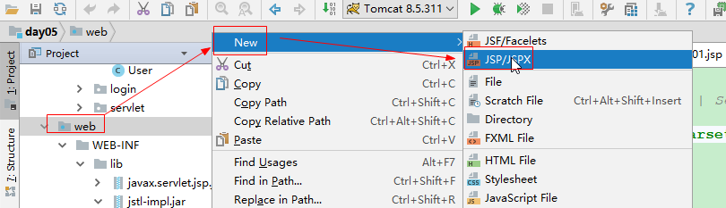

​								 【图1  创建JSP】

文件内容如下：

~~~html
<%@ page contentType="text/html;charset=UTF-8" language="java" %>
<html>
<head>
    <title>Title</title>
</head>
<body>

</body>
</html>
~~~


#### 1.4 在JSP中书写代码

jsp中既可以书写java代码，同时还可以书写html标签。我们完成练习如何在jsp页面中书写java代码。

【需求】

1. 在jsp页面上获取当前日期，并将其格式化成字符串"yyyy-MM-dd HH:mm:ss"；
2. 将这个字符串展示在浏览器上；

说明：

​	1）jsp中的注释：<%--注释内容--%>，添加注释的快捷键是：ctrl+/;

​	2）在jsp中书写代码有三种方式，我们这里先介绍一种，格式：

​		<%java代码%>

【参考代码】**demo01.jsp**

~~~jsp
<%@ page import="java.util.Date" %>
<%@ page import="java.text.SimpleDateFormat" %><%--
  Created by IntelliJ IDEA.
  User: tiansuo
  Date: 2018-01-09
  Time: 19:15
  To change this template use File | Settings | File Templates.
--%>
<%@ page contentType="text/html;charset=UTF-8" language="java" %>
<html>
<head>
    <title>Title</title>
</head>
<body>
    <%--
        jsp中的注释
        【需求】
        1. 在jsp页面上获取当前日期，并将其格式化成字符串"yyyy-MM-dd HH:mm:ss"；
        2. 将这个字符串展示在浏览器上；
    --%>
    <%
        //获取当前系统时间
        Date d = new Date(); 
        //创建日期格式化解析器对象
        SimpleDateFormat sdf = new SimpleDateFormat("yyyy-MM-dd HH:mm:ss");
        //使用日期格式化解析器对象调用方法格式化日期对象d
        String s_date = sdf.format(d);
        //控制台输出
        System.out.println("s_date = " + s_date);
        //将这个字符串展示在浏览器上
        response.getWriter().print(s_date);
    %>
</body>
</html>
~~~

【运行结果】启动tomcat，并且访问这个jsp页面。

 在浏览器看到 format格式的日期：

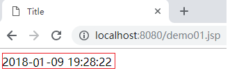

【控制台输出】

```
s_date = 2018-01-09 19:28:22
```

### 2、JSP的运行原理

​	通过上面的jsp初体验, 我们看到jsp中既可以编写java代码也可以直接编写html代码，相对servlet更加方便.并且我们通过浏览器访问到的jsp页面，最后在浏览器中看到了响应到浏览器中的结果。那么整个过程的执行流程是怎样的呢，我们可以参考如下图：

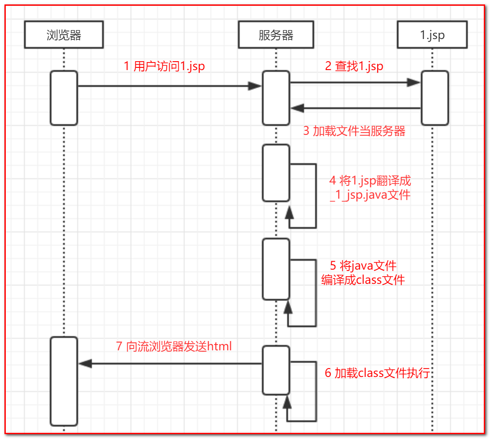

通过上面的执行流程，我们可以找到jsp生成的.java源文件，这样就可以知道jsp的真正原理，同时可以看下jsp为什么是servlet。

如何查看生成的.java源文件呢？

​	我们可以到tomcat中查看一下上面案例中的jsp页面是怎么样的一种存在。IDEA借助tomcat发布web项目的机制:动态发布（为每一个web项目创建一个单独的发布文件）。我们可以通过tomcat其中日志中的CATALINA_BASE路径找到我们当前这个JSP页面在tomcat中的位置：

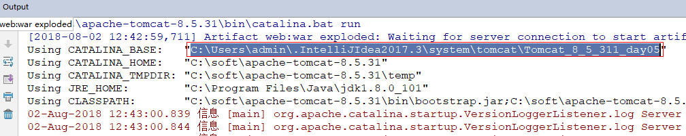

​								【图1 IDEA发布项目的路径】

找到这个目录后，会看到以下3个文件夹：

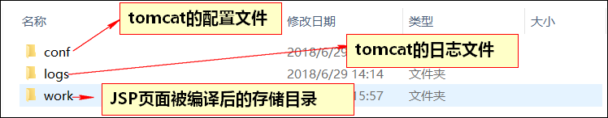

​						【图2  文件目录】

我们打开C:\Users\admin\.IntelliJIdea2017.3\system\tomcat\Tomcat_8_5_311_day05目录发现有两个文件：

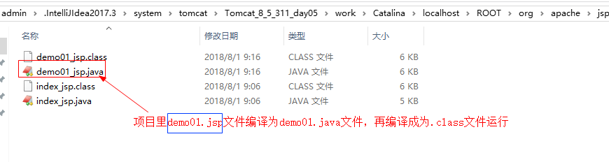  

​							【图3  JSP被翻译后的代码】

打开**demo01_jsp.java**文件后，代码如下所示：

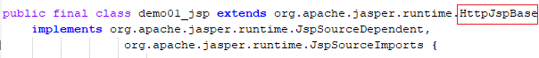

我们可以看到当前的jsp文件被翻译成了一个类，这个类继承HttpJspBase类，那么这个HttpJspBase类又是什么？

**注意**:jsp的翻译由服务器完成，HttpJspBase类一定也是tomcat服务器的内容，所以我们需要找到org.apache.jasper.runtime.HttpJspBase这个类，这个类可以到tomcat的安装目录下的lib文件夹下找到jasper.jar，将其解压，找如下目录：org\apache\jasper\runtime，找到HttpJspBase.class。

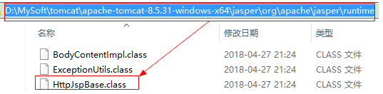

使用反编译工具打开，如下所示：

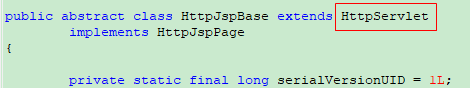

通过观察源码，根据我们所学习的继承关系，**我们发现JSP其实底层就是一个servlet**。通过观察源码，我们发现我们刚刚编写的所有代码都在该Servlet里面的service方法内部。

```java
public final class demo01_jsp extends org.apache.jasper.runtime.HttpJspBase {
     
     public void _jspService(final javax.servlet.http.HttpServletRequest request, final javax.servlet.http.HttpServletResponse response)
      throws java.io.IOException, javax.servlet.ServletException {
    try {
      response.setContentType("text/html;charset=UTF-8");
      pageContext = _jspxFactory.getPageContext(this, request, response,
      			null, true, 8192, true);
      _jspx_page_context = pageContext;
      application = pageContext.getServletContext();
      config = pageContext.getServletConfig();
      session = pageContext.getSession();
      out = pageContext.getOut();
      _jspx_out = out;

      out.write('\r');
      out.write('\n');
      out.write("\r\n");
      out.write("\r\n");
      out.write("<html>\r\n");
      out.write("<head>\r\n");
      out.write("    <title>Title</title>\r\n");
      out.write("</head>\r\n");
      out.write("<body>\r\n");
      out.write("    ");
      out.write("\r\n");
      out.write("    ");

        //获取当前系统时间
        Date d = new Date();
        //创建日期格式化解析器对象
        SimpleDateFormat sdf = new SimpleDateFormat("yyyy-MM-dd HH:mm:ss");
        //使用日期格式化解析器对象调用方法格式化日期对象d
        String s_date = sdf.format(d);
        //控制台输出
        System.out.println("s_date = " + s_date);
        //将这个字符串展示在浏览器上
        response.getWriter().print(s_date);
    
      out.write("\r\n");
      out.write("</body>\r\n");
      out.write("</html>\r\n");
    } catch (java.lang.Throwable t) {
      。。。。
  }
}
```

**总结：**

​	1. <% %>中书写的代码被直接解析成java代码；

​	2.jsp之所以可以编写html代码，其实本质上也是类似我们使用Servlet直接输出的。也就是说底层还是像我们之前做法一样进行标签拼接。html部分都被out.write("")方法以字符串的形式拼接，然后响应给浏览器；

​	3.在这个java文件中有个_jspService，这个方法有两个参数request，response；

​	4. 由于我们自己编写的代码全部都落入到了service方法内部一开始就已经声明了request,response,session,application(ServletContext)等对象了,这些对象成为之jsp内置对象。

### 3、JSP中书写java代码的三种方式

​	在JSP页面的body标签中，可以直接书写html代码和JS代码。但是，如果在JSP页面中书写java代码。必须遵循固定的格式，才能够生效；JSP页面中书写java代码有三种方式：1.脚本片段；2.脚本声明；3.脚本表达式；

#### 方式一：脚本片段

​	脚本片段指的是一段java代码。书写格式：<%  java 代码    %> 

【示例】 **demo02.jsp**

~~~jsp
<%@ page contentType="text/html;charset=UTF-8" language="java" %>
<html>
<head>
    <title>Title</title>
</head>
<body>
<%
    //书写java代码，向浏览器输出数据
    response.getWriter().println("hello jsp");
%>
</body>
</html>

~~~

【被翻译后的源码】

```java
 out.write("\r\n");
 out.write("    ");
 response.getWriter().println("hello jsp");
 out.write("\r\n");
```

【页面结果】：

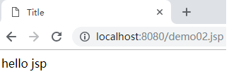

#### 方式二：脚本声明

 	脚本片段虽然可以嵌入java代码，但是如果，我们要给当前的jsp中定义一些成员方法或者成员变量，就需要一个新的技术——脚本声明.

​	说明：通过查看jsp的源代码我们发现，脚本片段的代码都会存在service方法中，而方法中是不可以定义一个方法的。

​	脚本声明的格式：<%! 书写Java代码 %>

【示例一】声明成员变量 **demo03.jsp**

~~~java
<%@ page contentType="text/html;charset=UTF-8" language="java" %>
<html>
<head>
    <title>Title</title>
</head>
<body>
<%!
    int num = 10;
    public void method(){}
%>
</body>
</html>

~~~

【被翻译后的代码】成员变量

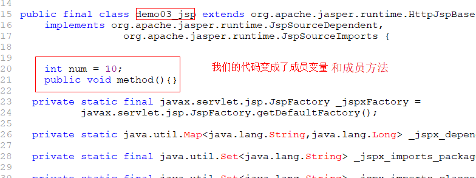

#### 方式三：脚本表达式

​	虽然脚本声明和脚本片段已经可以书写Java代码了，但是如果我们要使用java代码向页面输出一些内容，还是需要 使用原来的response对象，比较繁琐，因此，我们需要一个更加简便的方式，可以代替response**向页面输出内容 ** ——这个就是脚本表达式。

​	脚本表达式的格式：<%= 向浏览器输出的内容 %>     等价于：out.print( 向浏览器输出的内容)

【示例】在页面输出信息

~~~java
<%@ page contentType="text/html;charset=UTF-8" language="java" %>
<html>
<head>
    <title>Title</title>
</head>
<body>
<%="传智播客"%>
<%="上海黑马"%>
<%
response.getWriter().print("response");
%>
</body>
</html>

~~~

【浏览器页面结果】：

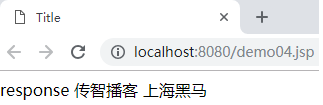

【被翻译后的代码】：

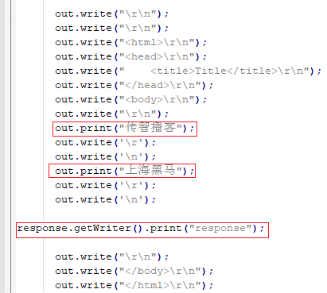

**注意：**

上面代码中，我们书写代码的顺序是先：

```java
<%="传智播客"%>
<%="上海黑马"%>
```

再：

```java
response.getWriter().print("response");
```

可是浏览器查看数据的结果是

```java
response 传智播客 上海黑马
```

原因：response.getWriter()获取的输出流是：PrintWriter。而脚本表达式<%=%>  等价于：out.print( 向浏览器输出的内容).并且这种方式获取的输出流是：JspWriter。其实导致上述输出结果前后顺序就是PrintWriter和JspWriter。

JspWriter：将输出的内容先放到jsp内置的缓冲区中，然后再刷新输出。

PrintWriter：是不使用jsp内置的缓冲区,直接将内容写到网页中。

**总结：**

​	1.不要同时使用脚本表达式和response同时往页面输出信息，会出现顺序不一致。现象：response会出现在最前面。使用一种输出即可。

​	2.脚本表达式`<%= str %>` ：在页面输出内容，在service方法中起作用；

​	3.脚本片段`<%  %>` ：在service方法中，原样输出的代码片段；属于局部为，放在_jspService方法中

​	4.脚本声明：`<%! String str = "黑马程序员" %>` ：定义成员变量；

### 4、JSP的三大指令

#### 4.1 指令概述

​	JSP指令（directive）是为JSP引擎而设计的，它们并不直接产生任何可见输出效果，而只是告诉引擎如何处理JSP页面中的其余部分。

​	指令用来声明JSP页面的一些属性，比如编码方式，文档类型。我们在servlet中也会声明我们使用的编码方式和响应的文档类型的，而JSP就是用指令来声明的。

##### 【1】JSP页面的3大指令

~~~html
a)  page：页面
<%@page contentType="text/html;charset=utf-8" %>
    说明：声明jsp页面的编码方式
b)	taglib：引入标签库
c)	include：包含
~~~

##### 【2】指令的格式

~~~jsp
<%@指令名 属性名="属性值"%>
~~~


#### 4.2 taglib指令

【作用】

~~~html
用于在JSP页面中导入JSTL标签库；
~~~

【格式】

~~~jsp
<%@taglib prefix="c" uri="http://java.sun.com/jsp/jstl/core" %>
说明：表示引入外部的jstl标签库的。
prefix="c" 表示前缀
uri="http://java.sun.com/jsp/jstl/core" 表示jstl标签库的地址
~~~


#### 4.3 include指令

【作用】

~~~html
在一个JSP页面中静态包含另外一个JSP页面；
~~~

【格式】

~~~jsp
<%@include file="URL" %> 指定要导入页面的地址
~~~

【使用示例】

需求：课后的原型中的页面放到web文件夹下面。然后打开主页index.jsp.在主页中引入header.jsp页面。

~~~jsp
<!--引入头部-->
<div id="header">
    <%@include file="header.jsp"%>
</div>
~~~

【效果】

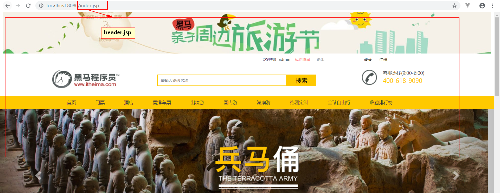


#### 小结

三大指令是什么？分别的作用是？

1. page：设置网页上一些属性
2. taglib：导入标签库
3. include：包含另一个JSP页面

### 5、page指令

#### 5.1、page指令概述

##### 【1】page指令的作用

​	page是jsp中必须使用的一个指令，用于设置JSP上各种页面的属性，告诉tomcat如何将一个JSP翻译成Servlet

##### 【2】语法格式

~~~jsp
<%@page 属性名="属性值" %>
~~~

​	可以放在JSP中任何位置，一般建议放在页面的最顶部

#### 5.2、page指令的属性

##### 【1】导包相关属性：

~~~jsp
language="java" 当前页面使用的语言，不写默认是java
import="java.util.*" 导入java.util下所有类，导包
~~~

**方式一：**每个page指令导入一个类

~~~jsp
<%@page import="java.text.SimpleDateFormat"%>
<%@page import="java.util.Date"%>
~~~

**方式二：**一个page指令的import属性导入所有的包，包之间使用逗号分隔

~~~jsp
<%@page import="java.util.Date,java.text.SimpleDateFormat"%>
~~~

作用：相当于导包

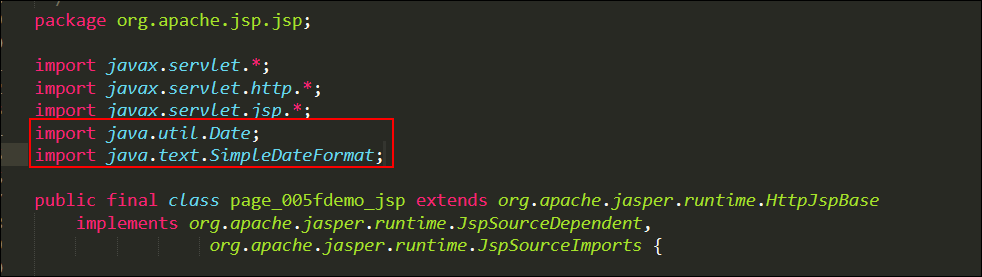

【代码演示】

~~~jsp
<%--<%@ page import="java.util.Date" %>
<%@ page import="java.text.SimpleDateFormat" %>
<%@ page import="java.util.ArrayList" %>--%>
<%@ page import="java.util.*,java.text.SimpleDateFormat" %>

<%--
  Created by IntelliJ IDEA.
  User: tiansuo
  Date: 2018-10-10
  Time: 14:59
  To change this template use File | Settings | File Templates.
--%>
<%@ page contentType="text/html;charset=UTF-8" language="java" %>
<html>
<head>
    <title>Title</title>
</head>
<body>
<%
    //创建日期对象
    Date date = new Date();
    SimpleDateFormat simpleDateFormat = new SimpleDateFormat();
    ArrayList<String> list = new ArrayList<>();
%>
</body>
</html>

~~~


##### 【2】与编码相关属性：

~~~jsp
<%@ page contentType="text/html;charset=UTF-8" language="java"%>
~~~

【作用】设置响应编码

~~~java
response.setContentType("text/html;charset=UTF-8");
~~~


##### 【3】与错误相关

###### 相关属性：

~~~html
1、errorPage="错误页面的URL"：
	用于指定如果当前页面出错，转发到哪个页面去：<%@ page language="java"  errorPage="error.jsp"%>

2、isErrorPage="false"：默认是false,指定true表示是错误页面
	当前这个页面是否是一个错误页面，错误页面可以多使用一个内置对象。exception：<%@ page isErrorPage="true"%>
~~~


###### 错误页面跳转的3种设置：

1、通过page指令的errorPage属性指定：如果页面出错，转发到error.jsp这个页面

~~~jsp
<%@ page errorPage="error.jsp"%>
~~~

代码演示：

~~~jsp
<%--跳转到错误页面--%>
<%@page errorPage="../error.jsp" %>

<%@ page contentType="text/html;charset=UTF-8" language="java" %>
<html>
<head>
    <title>Title</title>
</head>
<body>
<%
    int i = 1 / 0;
%>
    hello world
</body>
</html>
~~~

~~~jsp
<%@ page contentType="text/html;charset=UTF-8" language="java" %>
<%--声明是错误页面--%>
<%@page isErrorPage="true" %>
<html>
<head>
    <title>Title</title>
</head>
<body>
    <h2>错误页面</h2>
    <%=exception.getMessage()%>
</body>
</html>
~~~

页面效果：

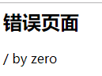


2、通过web.xml文件指定错误码：响应状态码为404则跳转到404.jsp页面

如果不指定，那么按照以前报错方式，会出现如下错误页面：

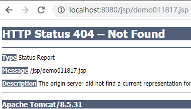

我们可以在web.xml进行配置跳转到更加好看一些的页面。

~~~xml
<!-- 指定错误页面 -->
<error-page>
	<!-- 指定错误码 -->
	<error-code>404</error-code>
	<!-- 出错以后跳转到哪个页面 -->
	<location>/404.jsp</location>
</error-page>
~~~

404.jsp页面代码：

~~~jsp
<%@ page contentType="text/html;charset=UTF-8" language="java" %>
<html>
<head>
    <title>Title</title>
</head>
<body>
    
</body>
</html>
~~~


3、通过web.xml文件指定错误类型：发生空指针，则跳转到null.jsp页面

~~~xml
<!-- 指定错误的类型 -->
<error-page>
	<exception-type>java.lang.NullPointerException</exception-type>
	<location>/null.jsp</location>
</error-page>

~~~

demo02.jsp

~~~jsp
<%@ page contentType="text/html;charset=UTF-8" language="java" %>
<html>
<head>
    <title>Title</title>
</head>
<body>
    <%
        String s = null;
        s.length();
    %>
</body>
</html>
~~~

报空指针异常后的页面：null.jsp

~~~jsp
<%@ page contentType="text/html;charset=UTF-8" language="java" %>
<html>
<head>
    <title>Title</title>
</head>
<body>
    <h2>发生空指针异常了</h2>
</body>
</html>
~~~

浏览器效果：

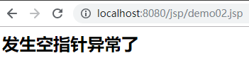


#### page指令小结：

| **属性名**                                           | **作用**                                                     |
| ---------------------------------------------------- | ------------------------------------------------------------ |
| **language="java"**                                  | 指定JSP页面使用语言                                          |
| **import="{package.class \| package.\*}"**           | 导入包：<br />1. 每个import包入一个包<br />2. 一个import导入多个包，使用逗号分隔 |
| **errorPage="relative_url"**                         | 当前页面出错，转发到哪个错误页面                             |
| **isErrorPage="true\|false"**                        | 当前是否是一个错误页面                                       |
| **contentType="mimeType [ ;charset=characterSet ]"** | 指定页面类型和编码，不指定会有乱码                           |


### 6、JSP常用动作标签

#### 6.1、什么是动作标签

​	JSP动作标签**利用XML语法格式的标记来控制Servlet引擎的行为** 。利用JSP动作标签可以动态包含其他jsp页面、把用户跳转到另外的页面、为Java插件生成HTML代码。

#### 6.2、常用动作标签

​	JSP页面动作标签很多，常用的主要有以下3种：

~~~html
<jsp:include/>：动态包含
<jsp:forward/>：跳转 类似之前学习的转发技术
<jsp:param/>：参数设置
~~~

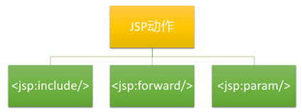 


#### 6.3、常用标签使用

##### 【1】`<jsp:include>`

【作用】

~~~html
用于一个JSP页面动态包含另一个JSP页面
~~~

【语法】

~~~jsp
<jsp:include page="URL"/> URL是被包含的JSP页面
~~~

【使用示例】

a.jsp

~~~jsp
<%@ page contentType="text/html;charset=UTF-8" language="java" %>
<html>
<head>
    <title>Title</title>
</head>
<body>
    <h1>我是A页面</h1>
    <%int m1=10; %>

    <!-- 静态包含： -->
    <%@include file="b.jsp" %>

    <!-- 动态包含 -->
    <%-- <jsp:include page="b.jsp"/> --%>
</body>
</html>
~~~

b.jsp

~~~jsp
<%@ page contentType="text/html;charset=UTF-8" language="java" %>
<html>
<head>
    <title>Title</title>
</head>
<body>
    <h2>我是B页面</h2>
    <%int m=20; %>
</body>
</html>
~~~

【动态包含和静态包含】

|                     | 静态包含include指令                                          | 动态包含include动作                                          |
| ------------------- | ------------------------------------------------------------ | ------------------------------------------------------------ |
| **语法格式**        | <%@include  file="URL"%>                                     | <jsp:include  page="URL"/>                                   |
| **包含的方式**      | 静态包含包含的是页面的内容。如果A包含B，则先将B的页面内容复制到A页面中，再运行A页面。  B页面中不能出现与A页面同名的变量 | 动态包含包含的是页面的执行结果，如果A包含B，则先将B执行，再将B执行的结果包含到A页面中，执行A页面。  B页面中可以出现与A页面中同名的变量 |
| **生成Servlet个数** | 只能生成了一个Servlet                                        | 生成了两个Servlet                                            |

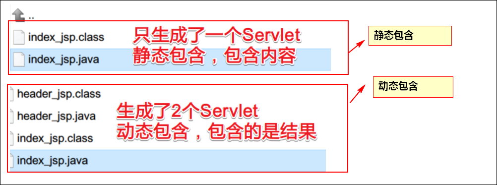

说明：

​	如果只是引入jsp，不需要改变，那么使用静态引入。如果引入的jsp页面是变化的，那么使用动态引入。


##### 【2】`<jsp:forward>`

用于页面的转发，与request.getRequestDispatcher("/URL").foward(request,response);功能一样的

~~~jsp
<jsp:forward page="URL"/> 转发
~~~


##### 【3】`<jsp:param>`

用于给`<jsp:forward>`和`<jsp:include>`提供参数

~~~jsp
<jsp:param value="张三" name="user"/>
~~~


##### forward和param动作

###### **目标**

1. forward作用
2. param的功能

###### forward

1. 功能：用于转发，相当于request.getRequestDispatcher("/URL").forward(request, response)
2. 语法

```jsp
<jsp:forward page="/页面地址"/>
```

###### param

1. 功能：给forward和include提供参数名和值

2. 语法：做为子标签存在

   需求：在c.jsp页面中使用转发标签forward转发到d.jsp页面。

   c.jsp页面

```jsp
<%--
  Created by IntelliJ IDEA.
  User: tiansuo
  Date: 2018-10-10
  Time: 16:41
  To change this template use File | Settings | File Templates.
--%>
<%@ page contentType="text/html;charset=UTF-8" language="java" %>
<html>
<head>
    <title>Title</title>
</head>
<body>
    <h2>c页面</h2>
    <%
        //解决中文乱码问题 <jsp:param name="username" value="张三"/> 是在d.jsp后面携带数据跳转到d.jsp页面的，通过浏览器的，需要先按照UTF-8编码之后在进行传递。然后在d.jsp页面使用request.getParameter("username")获取数据
        request.setCharacterEncoding("UTF-8");
        //向域对象request中存储数据
        request.setAttribute("age",19);
    %>
    <%--转发动作，携带的参数，可以在d.jsp上接收这参数,通过浏览器转发过去的，所以要想获取param携带的数据必须使用getParameter()方法获取数据--%>
    <jsp:forward page="d.jsp">
        <jsp:param name="username" value="张三"/>
    </jsp:forward>
</body>
</html>

```

d.jsp页面：

~~~jsp
<%--
  Created by IntelliJ IDEA.
  User: tiansuo
  Date: 2018-10-10
  Time: 16:41
  To change this template use File | Settings | File Templates.
--%>
<%@ page contentType="text/html;charset=UTF-8" language="java" %>
<html>
<head>
    <title>Title</title>
</head>
<body>
    <h2>d页面</h2>
    <%--获取request域对象中的数据--%>
    <%=request.getAttribute("age")%>
    <%--获取转发param标签通过浏览器携带的数据--%>
    <%=request.getParameter("username")%>
</body>
</html>

~~~

###### 案例演示

1. 从c.jsp转发到d.jsp
2. c在请求域中添加键和值，d看能够得到值并且输出
3. c转发的时候带参数，username和age，在d中获取并且输出
4. 汉字乱码问题的解决
5. 转发，url地址栏并没有发生改变

###### 效果

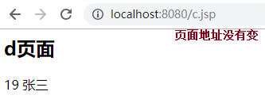 

###### 小结

1. forward作用：在JSP页面上实现转发
2. param的功能：在转发的时候提供其它的参数名和参数值


### 7、JSP页面常用对象

​	我们发现，我们在JSP页面中书写的代码最终都会翻译到_jspService()方法中，我们发现这个方法中有两个形参：**HttpServletRequest对象** ，**HttpServletResponse对象** 。所以说，JSP的本质就是一个Servlet。我们可以直接在JSP页面上使用这两个对象。

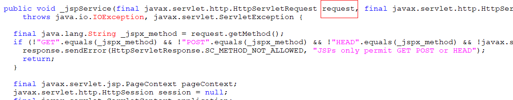

#### 【需求】登录页面改造

​	改造登录后的页面，用户登陆失败以后，跳转到login.jsp,在jsp页面中动态显示用户登陆错误中的信息。

【思路】

1. 登录失败后直接转发到一个jsp页面；
2. 在jsp页面上使用request对象获取request中的值;

【LoginServlet代码】

  说明：LoginServlet中，登录失败之后，直接转发到login.jsp页面。

```java
protected void doGet(HttpServletRequest request, HttpServletResponse response) throws ServletException, IOException {
        //解决中文乱码问题
        request.setCharacterEncoding("utf-8");
        //获取用户名和密码
        String username = request.getParameter("username");
        String password = request.getParameter("password");
        UserServiceInter service = new UserServiceInterImpl();
        boolean result = service.login(username,password);
        String msg = result ? "用户登陆成功" : "用户登陆失败";
        request.setAttribute("msg",msg);
        if (result){
            response.sendRedirect("/success.html");
        }else {
            //转发到login.jsp页面
            request.getRequestDispatcher("/login.jsp").forward(request,response);
        }
    }
```

【login.jsp页面】

~~~jsp
<%@ page contentType="text/html;charset=UTF-8" language="java" %>
<!DOCTYPE html>
<html lang="en">
<head>
    <meta charset="utf-8">
    <meta http-equiv="X-UA-Compatible" content="IE=edge">
    <meta name="viewport" content="width=device-width, initial-scale=1">
    <title>登录页面</title>

    <link href="css/bootstrap.min.css" rel="stylesheet">
    <link href="css/login.css" rel="stylesheet">
    <script src="js/jquery.js"></script>
    <script src="js/bootstrap.js"></script>
</head>
<body>
<%
    String msg = (String) request.getAttribute("msg");
%>
<div class="container text-center">
    <form class="form-signin" action="/loginInterServlet" method="get">
        <h2 class="form-signin-heading">登录页面</h2>
        <font color="red"><%=msg%></font>
        <input type="text"  name="username" class="form-control" placeholder="用户名" required autofocus>
        <input type="password"  name="password" class="form-control" placeholder="密码" required>
        <button class="btn btn-lg btn-primary btn-block" type="submit">登录</button>
    </form>
</div>
</body>
</html>
~~~

说明：上述代码中：

```java
<font color="red"><%=msg%></font>
```

能够使用msg获取数据，因为编译之后存在于同一个类中，编译jsp如下所示：

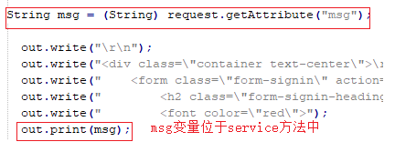

效果图：浏览器访问login.html页面

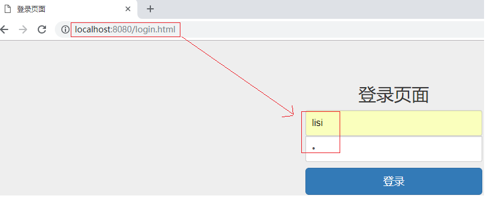

登录密码输入错误：

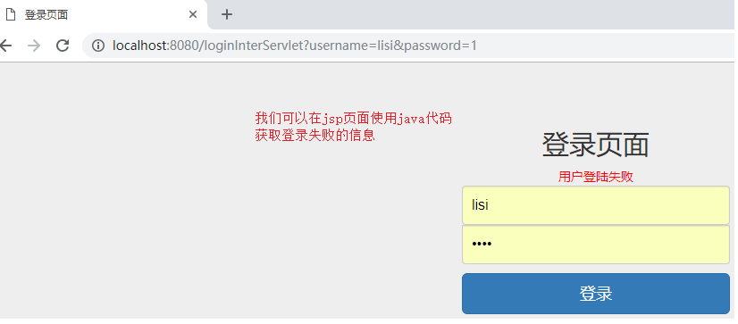

小结：

- JSP作用：给浏览器生成响应信息；
- JSP特点：动态网页，html+java，由服务器来运行的。本质上是一个Servlet；
- 书写Java代码的三种方式：
  - 脚本片段：java代码片段，在service方法中起作用。格式:<%  System.out.println("hello")  %>；
  - 脚本表达式：直接在页面输出内容，在service方法中起作用，等价于out.print(内容)。格式：<%= "传智播客"%>
  - 脚本声明：定义成员变量，方法。在当前类中都起作用。<%!int a=10;%>
- JSP页面常用的对象：request,response;

## 第二章 EL表达式

### 1、EL概述

#### 1.1 引入

**问题：**

按照上述代码实现方式，如果用户登录失败，我们不用再单独书写一个LoginErrorServlet,直接新创键一个login.jsp页面即可。

但是我们先访问login.html，然后错误在跳转到login.jsp页面，那么我们是否可以直接访问login.jsp页面，而不用再使用login.html页面。这样更为简单。

在浏览器中直接访问login.jsp页面：

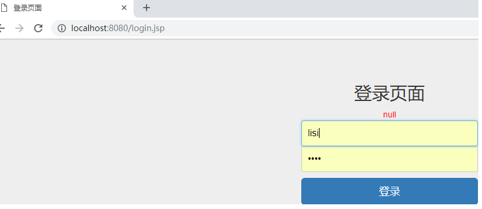

我们发现最开始访问jsp页面，页面显示null,原因是最开始访问request中的msg没有任何数据，所以是null。那么有的同学就会想在login.jsp页面中使用java代码对request中的msg进行判断。虽然可以实现，但是脚本表达式在JSP页面上书写起来比较麻烦。而在页面上取值在开发中使用的又比较多，所以Sun公司为了简化在页面上的取值操作。我们这里有更为简单的方案，就是我们下面要讲解的EL表达式。


【需求】使用EL表达式改造login.jsp页面的取值操作

提示：EL表达式从request域对象中取值：`${request域对象中的key}`

**温馨提示：**

原来JSP页面中的脚本表达式<%=msg%>被EL表达式取代。

【代码示例】**login.jsp**

```jsp
<%@ page contentType="text/html;charset=UTF-8" language="java" %>
<!DOCTYPE html>
<html lang="en">
<head>
    <meta charset="utf-8">
    <meta http-equiv="X-UA-Compatible" content="IE=edge">
    <meta name="viewport" content="width=device-width, initial-scale=1">
    <title>登录页面</title>

    <link href="css/bootstrap.min.css" rel="stylesheet">
    <link href="css/login.css" rel="stylesheet">
    <script src="js/jquery.js"></script>
    <script src="js/bootstrap.js"></script>
</head>
<body>
<%
//    String msg = (String) request.getAttribute("msg");
%>
<div class="container text-center">
    <form class="form-signin" action="/loginInterServlet" method="get">
        <h2 class="form-signin-heading">登录页面</h2>
        <%--<font color="red"><%=msg%></font>--%>
        <font color="red">${msg}</font>
        <input type="text"  name="username" class="form-control" placeholder="用户名" required autofocus>
        <input type="password"  name="password" class="form-control" placeholder="密码" required>
        <button class="btn btn-lg btn-primary btn-block" type="submit">登录</button>
    </form>
</div>

</body>
</html>
```

说明：

​	1）在jsp页面中使用EL表达式可以简化Java代码。

​	2）EL表达式从域对象取值，如果域对象中有值则获取，没有值则不获取。

#### 1.2 EL简介

~~~java
EL全称： Expression Language 中文的意思是EL表达式。
作用：代替jsp中脚本表达式<%=输出内容%>的功能，简化对java代码的操作，从【域对象】中取值。 EL表达式简化<%= %>方式取值   
EL语法表达式的格式：${域对象中的key} 
~~~

### 2、EL取值

#### 2.1 JSP的四大域对象

​	JSP的四大域对象指的是：page域，request域，session域，application域。我们通常使用EL表达式从这4个域对象中取值。以下是这4个域对象的详细信息：

| 域对象        | 在EL中的对象名称 | 在servlet中的对象名                                          | 说明                                                         |
| ------------- | ---------------- | ------------------------------------------------------------ | ------------------------------------------------------------ |
| page域        | pageScope        | pageContext，属于javax.servlet.jsp.PageContext类的对象       | page域指的是当前JSP页面，其中存储的数据只在当前页面有效，因为jsp本质是servlet，所以page域只在一个servlet中有效。 |
| request域     | requestScope     | request，属于javax.servlet.http.HttpServletRequest接口的对象 | request域：一次请求或请求链中request域                       |
| session域     | sessionScope     | session,属于javax.servlet.http.HttpSession接口的对象         | session域：一次会话过程中，session域                         |
| application域 | applicationScope | application，属于javax.servlet.ServletContext接口的对象      | application域：服务启动后整个项目对应的ServletContext域      |

#### 2.2 EL表达式从四大域中取值

​	EL表达式从指定的域中取值的方式如下：

| 域对象        | 取值方式                  |
| ------------- | ------------------------- |
| page域        | `${pageScope.key}`        |
| request域     | `${requestScope.key}`     |
| session域     | `${sessionScope.key}`     |
| application域 | `${applicationScope.key}` |

【需求】

1. 在一个JSP页面中，使用脚本片段分别向page域、request域，session域，application域和中存储数据；
2. 使用EL表达式从这4个域中取值；

【参考代码】

~~~jsp
<%@ page contentType="text/html;charset=UTF-8" language="java" %>
<html>
<head>
    <title>Title</title>
</head>
<body>
    <%--
             EL表达式 page  request  session  application 四大域对象
             【需求】
            1. 在一个JSP页面中，使用脚本表达式分别向page域、request域，session域，application域和中存储数据；
            2. 使用EL表达式从这4个域中取值；
    --%>
    <%
        //page域，对一servlet中的pageContext对象
        pageContext.setAttribute("pageValue","page的值");
        //request域
        request.setAttribute("requestValue","request的值");
        //session域
        request.getSession().setAttribute("sessionValue","session的值");
        //application域，属于ServletContext类的对象
        application.setAttribute("applicationValue","application的值");
    %>
    <%--
        EL表达式来域对象中取值
    --%>
    page中取值：${pageScope.pageValue}<br>
    request中取值：${requestScope.requestValue}<br>
    session中取值${sessionScope.sessionValue}<br>
    application中取值${applicationScope.applicationValue}<br>
</body>
</html>
~~~

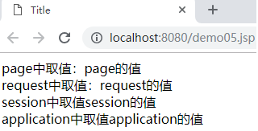

#### 2.3 EL表达式搜索数据

​	EL表达式取值的时候也可以不指定域，如果取值的时候不指定域对象。就会按照从page域--->request域--->session域--->application域从小到大逐级根据key值查找。

****

~~~jsp
<%@ page contentType="text/html;charset=UTF-8" language="java" %>
<html>
<head>
    <title>Title</title>
</head>
<body>
    <%--
             EL表达式 page  request  session  application 四大域对象
             【需求】
            1. 在一个JSP页面中，使用脚本表达式分别向page域、request域，session域，application域和中存储数据；
            2. 使用EL表达式从这4个域中取值；
    --%>
    <%
        //page域，对一servlet中的pageContext对象
        pageContext.setAttribute("pageValue","page的值");
        //request域
        request.setAttribute("requestValue","request的值");
        //session域
        request.getSession().setAttribute("sessionValue","session的值");
        //application域，属于ServletContext类的对象
        application.setAttribute("applicationValue","application的值");
        //向域对象中存储值，key值一样，则先从小向大的域中查找
        pageContext.setAttribute("value","page的值");
        request.setAttribute("value","requst的值");
    %>
    <%--
        EL表达式来域对象中取值
    --%>
    page中取值：${pageScope.pageValue}<br>
    request中取值：${requestScope.requestValue}<br>
    session中取值${sessionScope.sessionValue}<br>
    application中取值${applicationScope.applicationValue}<br>
    相同的key:${value}
</body>
</html>
~~~

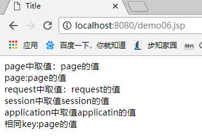

#### 2.4 EL表达式从cookie中取值

​	之前我们在学习cookie的时候，做过记住用户名和密码的案例，但是前端页面我们并没有实现。因为我们还没有学习使用什么技术在前端如何将cookie中的数据取出，而今天我们学习了EL表达式，我们就可以实现前端记住用户名和密码的案例了。

new Cookie(name,value)

使用EL表达式获取cookie中的值格式：(掌握)

```java
cookie.cookie的name名.value
例如：
 Cookie cookieName = new Cookie("username","锁哥");
 cookie.username.value获取的值是锁哥。
```

创建一个登陆的jsp页面：

~~~jsp
<%--
  Created by IntelliJ IDEA.
  User: tiansuo
  Date: 2020-09-20
  Time: 16:52
  To change this template use File | Settings | File Templates.
--%>
<%@ page contentType="text/html;charset=UTF-8" language="java" %>
<html>
<head>
    <title>Title</title>
</head>
<body>
    <form action="/login2Servlet">
        <input name="username" type="text" placeholder="请输入账号"><br>
        <input name="password" type="password" placeholder="请输入密码"><br>
        <input type="submit" value="登录">
        <br>
        <input type="checkbox" name="ck" class="checkbox">记住用户名和密码
    </form>
</body>
</html>

~~~


```jsp
<%@ page contentType="text/html;charset=UTF-8" language="java" %>
<html>
<head>
    <title>Title</title>
</head>
<body>
  <form action="/loginServlet" method="post">
        <%--
            ${cookie.username.value} 表示从浏览器存储的cookie中获取值
            cookie表示对象名
            username 表示cookie中的名，看服务器端给的什么名字，这里就写什么名字，不固定。可以理解为key
            value属于固定属性。表示获取值
        --%>
        用户名：<input type="text" name="username" value="${cookie.username.value}"><br>
        密码：<input type="password" name="password" value="${cookie.password.value}"><br>
        <input type="submit" value="提交">
    </form>
</body>
</html>
```

在servlet生成cookie     **LoginServlet.java**

```java
@WebServlet("/loginServlet")
public class LoginServlet extends HttpServlet {
    protected void doPost(HttpServletRequest request, HttpServletResponse response) throws ServletException, IOException {
        doGet(request, response);
    }
    protected void doGet(HttpServletRequest request, HttpServletResponse response) throws ServletException, IOException {
        //获取用户名和密码
        String username = request.getParameter("username");
        String password = request.getParameter("password");
        //创建cookie
        Cookie cookieName = new Cookie("username",username);
        Cookie cookiePsw = new Cookie("password",password);
        response.addCookie(cookieName);
        response.addCookie(cookiePsw);
    }
}
```

温馨提示：要去访问Java代码LoginServlet，才能将cookie存储到浏览器中

**效果图：**

先访问：http://localhost:8080/login.jsp也面，点击登录按钮，访问了LoginServlet，在LoginServlet中 生成cookie。

再访问login.jsp页面，使用EL表达式获取用户名和密码

http://localhost:8080/login.jsp

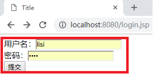

### 3、EL运算符

​	EL表达式获取到值之后可以直接通过运算符进行运算。EL表达式的运算符主要有以下几类：算术运算，关系运算，逻辑运算，三元运算，empty运算符。

【素材】页面数据准备**demo08.jsp**

~~~jsp
<%
    request.setAttribute("n1",40);
    request.setAttribute("n2",30);
    request.setAttribute("n3","20");
    request.setAttribute("n4","10");
%>
~~~

#### 3.1 算术运算

​	顾名思义，算术运算是进行算术运算的符号，和java中的一致。主要包括：加，减，乘，除，取余。具体使用如下表：

| 运算符 | 说明 | 使用示例   | 结果 |
| ------ | ---- | ---------- | ---- |
| +      | 加   | `${n1+n2}` | 70   |
| -      | 减   | `${n1-n2}` | 10   |
| *      | 乘   | `${n1*n2}` | 1200 |
| /或div | 除   | `${n1/n4}` | 4    |
| %或mod | 取余 | ${n1%n4}   | 0    |

【代码示例】**demo08.jsp**代码片段

~~~jsp
算数运算：<br>
    n1+n2:${n1 + n2}<br>
    n1-n3:${n1 - n3}<br>
    n3-n4:${n3-n4}<br>
    n2*n3:${n2 * n3}<br>
~~~

效果图：

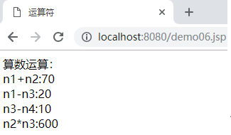


**注意**：在进行算术运算的时候，EL表达式会对字符串中的内容进行判断，如果都是数值，那么会转化为数值再进行算术运算，如果含有非数字类型，则会报异常。

#### 3.2 关系运算

```jsp
<%
    request.setAttribute("n1",40);
    request.setAttribute("n2",30);
    request.setAttribute("n3","20");
    request.setAttribute("n4","10");
%>
```

  关系运算符是判断两个数据的大小关系的，关系运算符有：==，!=，<，<=，>，>=。具体使用方法如下：

| 运算符      | 说明                           | 使用示例      | 结果  |
| ----------- | ------------------------------ | ------------- | ----- |
| `== ` 或 eq | 等于  equal                    | `${n1 == n2}` | false |
| `!=` 或ne   | 不等于  not equal              | `${n1 != n2}` | true  |
| `>` 或 gt   | 大于 greater than              | `${n1 > n2}`  | true  |
| `>=` 或ge   | 大于等于 greater than or equal | `${n1 >= n2}` | true  |
| `<` 或 lt   | 小于 less than                 | `${n1 < n2}`  | false |
| `<=`  或le  | 小于等于 less than or equal    | `${n1 <= n2}` | false |

【代码示例】**demo08.jsp**

~~~html
关系运算符：<br>
n1==n2:${n1==n2}<br>
n3>=n4:${n3>=n4}<br>
n1!=n2:${n1 ne n2}<br>
~~~

效果：

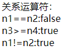

#### 3.3 逻辑运算

  逻辑运算符包括：&& ，||，!  使用方法如下：

| 运算符     | 说明             | 使用示例           | 结果  |
| ---------- | ---------------- | ------------------ | ----- |
| && 或  and | 逻辑与,一假即假  | `${true && false}` | false |
| \|\| 或 or | 逻辑或，一真即真 | `${true || false}` | true  |
| ! 或 not   | 非，取反         | `${!false}`        | true  |

参考代码**demo08.jsp**

``` java
逻辑运算符：<br>
false && true:${false && true}<br>
false || true:${false || true}<br>
!false:${!false}<br>
```

#### 3.4 三元运算

  EL表达式也支持三元运算符：如，判断n1是否大于等于n2，可以写成如下：参考代码**demo08.jsp**

~~~jsp
<%--
 	表达式1?表达式2：表达式3
--%>
三元运算符：<br>
${n1>=n2?"正确":"错误！"}<br>
~~~

#### 3.5 empty运算

empty运算符表示判断数据是否为空，如果为空返回true。对以下数据运算返回true：

1. 字符串：""；
2. 空集合（size=0）：List  list = new ArrayList();
3. 空对象(null)：Student stu = null；String s=null;Object obj=null;

【代码示例】 **demo08.jsp**

~~~jsp
<%
        String str = "";
		request.setAttribute("str",str);
        Student student=null;
		request.setAttribute("student",student);
        List<String> list = new ArrayList<>();
		request.setAttribute("list",list);
 %>
    empty:<br>
    ${empty str}<br>
    ${empty student}<br>
    <%--
        not empty list :表示对empty的结果取反，由于list.size()等于0，所以empty list的结果是true,
        但是这里加了一个not，结果变为了false
    --%>
    ${not empty list}<br>
~~~

页面效果：

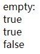

**demo08.jsp**完整代码

```jsp
<%@ page import="java.util.ArrayList" %>
<%@ page import="java.util.List" %>
<%@ page import="com.itheima.sh.el.cookie_01.Student" %><%--
  Created by IntelliJ IDEA.
  User: tiansuo
  Date: 2018-01-15
  Time: 8:59
  To change this template use File | Settings | File Templates.
--%>
<%@ page contentType="text/html;charset=UTF-8" language="java" %>
<html>
<head>
    <title>运算符</title>
</head>
<body>
    <%
        //向request域对象中存储数据
        request.setAttribute("n1",40);
        request.setAttribute("n2",30);
        request.setAttribute("n3","20");
        request.setAttribute("n4","10");
    %>
    算数运算：<br>
    n1+n2:${n1 + n2}<br>
    n1-n3:${n1 - n3}<br>
    n3-n4:${n3-n4}<br>
    n2*n3:${n2 * n3}<br>
    关系运算符：<br>
    n1==n2:${n1==n2}<br>
    n3>=n4:${n3>=n4}<br>
    n1!=n2:${n1 ne n2}<br>
    逻辑运算符：<br>
    false && true:${false && true}<br>
    false || true:${false || true}<br>
    !false:${!false}<br>
    <%--
     表达式1?表达式2：表达式3
    --%>
    三元运算符：<br>
    ${n1>=n2?"正确":"错误！"}<br>
    <%
        String str = "";
        Student student=null;
        List<String> list = new ArrayList<>();
    %>
    empty:<br>
    ${empty str}<br>
    ${empty student}<br>
    <%--
        not empty list :表示对empty的结果取反，由于list.size()等于0，所以empty list的结果是true,
        但是这里加了一个not，结果变为了false
    --%>
    ${not empty list}<br>
</body>
</html>
```

效果图：

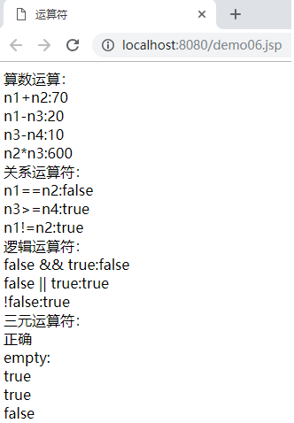

【注】**not empty可以用在EL表达式中，判断非空的情况。**

EL表达式小结：

* EL：Expression  Language；
* EL语法：${ }
* 作用：简化脚本表达式的取值，简化<%= request.getAttribute("name") %>   ===>    ${name}
* jsp的四大域对象
  * page域：pageContext     pageContext.setAttrubute()   pageContext.getAttribute()       JSP特有     作用范围：当前的JSP页面
  * requst域：request          request.setAttribute()    request.getAttribute()    作用范围：一次请求和响应之间
  * session域： session       session.setAttribute()    session.getAttribute()  作用范围：会话期间（多次请求和响应）
  * servletContext域：application    application.setAttribute()     application.getAttribute()    作用范围：整个项目；
* jsp从四大域中取值（指定域对象）：
  * ${pageScope.name}
  * ${requestScope.name}
  * ${sessionScope.name}
  * ${applicationScope.name}
* JSP搜索域对象中的值：page --- request --- session --- servletContext
  * ${name}
* 运算
  * 算术运算
  * 关系运算
  * 逻辑运算：&& ||  ！
  * 三元运算
  * empty运算：empty      not   empty
    * 空字符串：""
    * 空对象：null
    * 空集合：list.size = 0;

## 第三章  JSTL标签库

### 1、JSTL概述

#### 1.1 、JSTL引入

【案例】在页面中遍历数组：**demo09.jsp**

~~~java
<%@ page contentType="text/html;charset=UTF-8" language="java" %>
<html>
<head>
    <title>JSTL</title>
</head>
<body>
<%
    int[] arr = {123,456,789};
    for (int i : arr) {
        response.getWriter().print("<h1>"+i+"</h1>");
    }
%>
</body>
</html>


~~~

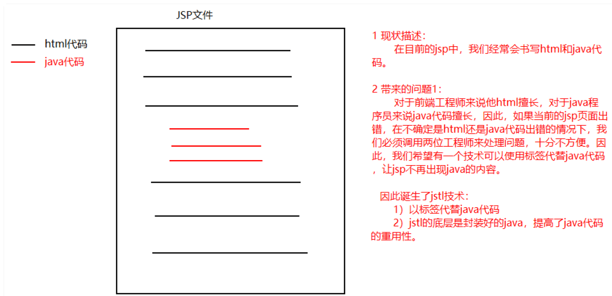

#### 1.2、JSTL是什么

~~~
从JSP 1.1规范开始JSP就支持使用自定义标签，使用自定义标签大大降低了JSP页面的复杂度，同时增强了代码的重
用性，因此自定义标签在WEB应用中被广泛使用。

许多WEB应用厂商都开发出了自己的一套标签库提供给用户使用，这导致出现了许多功能相同的标签，令网页制作者无所适从，不知道选择哪一家的好。

为了解决这个问题，
Apache Jakarta小组归纳汇总了那些网页设计人员经常遇到的问题，
开发了一套用于解决这些常用问题的自定义标签库，
这套标签库被SUN公司定义为标准标签库（The JavaServer Pages Standard Tag Library），简称JSTL。

使用JSTL可以解决用户选用不同WEB厂商的自定义标签时的困惑，JSP规范同时也允许WEB容器厂商按JSTL标签库的
标准提供自己的实现，以获取最佳性能
~~~

**注意：由于jstl标签属于第三方的，使用的时候必须导入核心jar包。并且在使用标签的jsp页面导入核心jar包中的类。**

#### 1.3、JSTL核心标签库

|     标签名称      |                             作用                             |
| :---------------: | :----------------------------------------------------------: |
|   <c:out>(掌握)   |            通常用于输出一段文本内容到客户端浏览器            |
|      <c:set>      |                  用于设置各种Web域中的属性                   |
|    <c:remove>     |                  用于删除各种Web域中的属性                   |
|     <c:catch>     |            用于捕获嵌套在标签体中的内容抛出的异常            |
|   <c:if>(掌握)    |                    java代码if(){}语句功能                    |
| <c:choose>(掌握)  | 用于指定多个条件选择的组合边界，它必须与c:when和c:otherwise标签一起使用 |
| <c:forEach>(掌握) |                   代替java代码for循环语句                    |
|   <c:forTokens>   |                      迭代操作String字符                      |
|     <c:param>     |                      给请求路径添加参数                      |
|      <c:url>      |               重写url，在请求路径添加sessionid               |
|    <c:import>     |         用于在JSP页面中导入一个URL地址指向的资源内容         |
|   <c:redirect>    |          用于将当前的访问请求转发或重定向到其他资源          |


### 2、JSTL标签应用

#### 2.1 安装JSTL

​	我们已经知道JSTL标签是将一段java代码功能封装成一个标签来使用。所以，我们使用JSTL标签之前必须导入被封装的java代码---jar包。JSTL标签库主要依赖以下两个jar包：

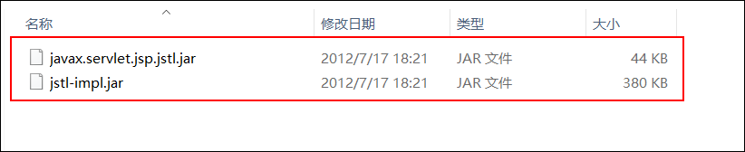

​	我们在IDEA的web项目的WEB-INF目录下创建一个lib文件夹，然后将jar包复制到这个文件夹里。选中这些jar包，右键---add as library即可将jar包导入到项目中。

#### 2.2 将标签库资源引入JSP页面

​	在JSP页面中通过以下标签，通过taglib标签引入JSTL资源： 

~~~jsp
<%@taglib prefix="c" uri="http://java.sun.com/jsp/jstl/core" %>
~~~

【注意】

1. prefix：是jstl标签在使用的时候的前缀；
2. uri：是标签库的资源路径；

#### 2.3 在JSP页面中使用JSTL标签

   在JSP页面中书写"<c: "，如果出现如下图的提示则说明标签库引入成功，我们可以根据提示信息使用自己需要的标签。

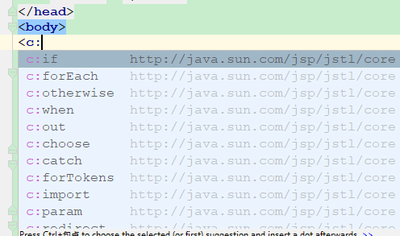


【代码示例】**demo10.jsp**

~~~jsp
<%@ taglib prefix="c" uri="http://java.sun.com/jsp/jstl/core" %>
<%@ page contentType="text/html;charset=UTF-8" language="java" %>
<html>
<head>
    <title>JSTL标签库</title>
</head>
<body>
<c:out value="传智播客，黑马程序猿"></c:out>
</body>
</html>
~~~

效果：

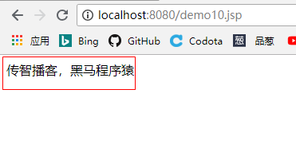

### 3、常用JSTL标签

#### 3.1 c:if标签

##### 3.1.1 作用

​	`<c:if test="判断条件"></c:if>`标签的作用相当于java中的if判断语句。

##### 3.1.2 属性

test：if的判断条件

##### 3.1.3 使用示例

【案例】使用java代码在jsp页面向request域对象中存储一个对象，使用`<c:if>`标签判断该对象是否为空。

【代码实现】**demo11.jsp**

~~~JSP
<%@ taglib prefix="c" uri="http://java.sun.com/jsp/jstl/core" %>
<%@ page import="com.itheima.sh.el.cookie_01.Student" %>
<%@ page contentType="text/html;charset=UTF-8" language="java" %>
<html>
<head>
    <title>Title</title>
</head>
<body>
    <%--
        if(判断条件){
            判断条件是真，执行代码
        }
        <c:if test="判断条件"></c:if>
    --%>
<%
    //创建学生对象
    Student s=null;
    //将学生对象s存储到request域对象中
    request.setAttribute("s",s);
%>
<%--判断 这里需要获取request域对象中的s.所以需要使用EL表达式--%>
<c:if test="${s == null}">
    <c:out value="学生为空"></c:out>
</c:if>
<c:if test="${s != null}">
    <c:out value="学生不为空"></c:out>
</c:if>
</body>
</html>
~~~

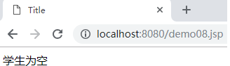


#### 3.2 c:foreach标签

##### 3.2.1 c:foreach标签的作用

​	`<c:foreach>`标签的作用相当于java中的for循环。主要是对数组和集合进行遍历。

~~~java
for(数组或者集合数据类型 变量名 : 数组或者集合名){
    
}
变量名 ：数组或者集合中的数据
int[] arr ={10,20,30};
//增强for循环 x相当于var  arr 相当于items
for(int x : arr){
    
}
//普通for循环 i=1 相当于 begin=0
<c:foreach begin="0" end="${arr.length-1}" step="1"/>
for(int i=0;i<arr.length;i++){
    
}
~~~


##### 3.2.2  c:foreach标签的属性

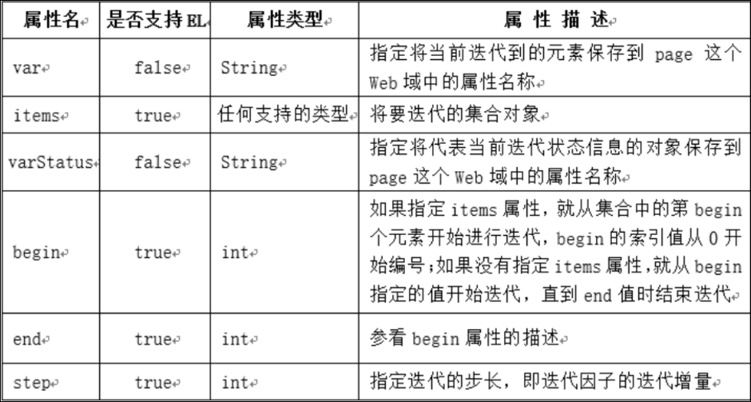

~~~
var：在不循环对象的时候，保存的是控制循环的变量；在循环对象的时候，保存的是被循环对象中的数据。就是集合或者数组中的数据。******
items：指定要循环的对象。就是数组或者集合名字。******
varStatus：保存了当前循环过程中的信息（循环的开始、结束、步长、次数等）
begin：设置循环的开始。起始索引，例如 int i=0;
end：设置循环的结束.就是结束的值。例如：i<=arr.length-1中的arr.length-1。
step：设置步长——间隔几次循环，执行一次循环体中的内容。例如：i++.
~~~

在使用<c:forEach>标签时，需要注意如下几点说明：

```
如果指定begin属性，其值必须大于或等于零；
如果指定步长（step属性），其值必须大于或等于1；
如果items属性的值为null，则要处理的集合对象为空，这时不执行迭代操作；
如果指定的begin属性的值大于或等于集合对象的长度，不执行迭代操作；
如果指定的end属性的值小于begin属性的值，不执行迭代操作；
```

##### 3.2.3 c:foreach标签的使用

【案例】c：foreach遍历案例

【需求】

1. 遍历普通数组；
2. 遍历map集合；
3. **遍历实体类对象list集合；**

【需求一】遍历普通数组.

```java
<%@ taglib prefix="c" uri="http://java.sun.com/jsp/jstl/core" %>
<%@ page contentType="text/html;charset=UTF-8" language="java" %>
<html>
<head>
    <title>遍历数组</title>
</head>
<body>
    <%
        //定义数组
        String[] arr={"篮球","足球","排球"};
        //增强for循环
        for (String s : arr) {
            System.out.println(s);
        }
        //将数组存入到域对象中
        request.setAttribute("arr",arr);
    %>
    <%--
        items 相当于  arr，将要迭代的数组对象arr
        var="item" 相当于s,数组中的数据
    --%>
    <c:forEach items="${arr}" var="item">
        ${item}<br/>
    </c:forEach>
</body>
</html>
```

【需求二】遍历map集合.

```java
<%@ taglib prefix="c" uri="http://java.sun.com/jsp/jstl/core" %>
<%@ page import="java.util.HashMap" %>
<%@ page import="java.util.Map" %>
<%@ page contentType="text/html;charset=UTF-8" language="java" %>
<html>
<head>
    <title>Title</title>
</head>
<body>
    <%
        Map map = new HashMap();
        map.put("one","火箭");
        map.put("two","湖人");
        map.put("thr","马刺");
        map.put("four","猛龙");
        request.setAttribute("map",map);
    %>
    <%--
        使用jstl遍历map
        item 表示键值对对象
        ${item.key} 通过键值对象调用属性key获取map集合中的键
        ${item.value} 通过键值对象调用属性value获取map集合中的值
    --%>
    <c:forEach items="${map}" var="item">
        map集合中的key:${item.key},map集合中的value:${item.value}<br/>
    </c:forEach>
</body>
</html>
```

效果：

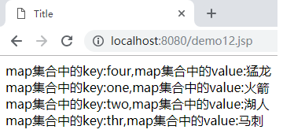

【需求三】遍历实体类对象list集合.

我们已经学习完jsp技术，接下来我们先看下jsp在企业流程开发中扮演怎样的角色，然后可以根据流程完成一个小的案例。

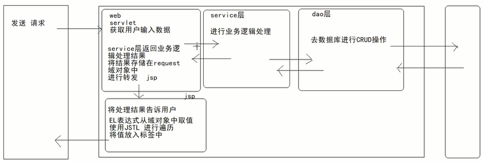

【创建一个商品的实体类：】

```java
public class Product {
    //属性
    private String pname;//商品名
    private double price;//商品价格
    //构造方法

    public Product(String pname, double price) {
        this.pname = pname;
        this.price = price;
    }

    //get set方法
    public String getPname() {
        return pname;
    }
    public void setPname(String pname) {
        this.pname = pname;
    }
    public double getPrice() {
        return price;
    }
    public void setPrice(double price) {
        this.price = price;
    }
}
```

【商品的servlet:】

```java
@WebServlet("/productServlet")
public class ProductServlet extends HttpServlet {
    protected void doPost(HttpServletRequest request, HttpServletResponse response) throws ServletException, IOException {
        doGet(request, response);
    }
    protected void doGet(HttpServletRequest request, HttpServletResponse response) throws ServletException, IOException {
        //去数据库查询商品信息
        Product product1 = new Product("布娃娃",9.9);
        Product product2 = new Product("苹果手机",99);
        Product product3 = new Product("外星人电脑",12000);
        Product product4 = new Product("鼠标",8);
        Product product5 = new Product("抹茶",20);

        List<Product> list = new ArrayList<>();
        list.add(product1);
        list.add(product2);
        list.add(product3);
        list.add(product4);
        list.add(product5);

        //将数据存储在域对象中
        request.setAttribute("list",list);
        //使用转发  list.jsp
        request.getRequestDispatcher("/list.jsp").forward(request,response);
    }
}
```

【显示商品页面:】

```jsp
<%@ taglib prefix="c" uri="http://java.sun.com/jsp/jstl/core" %>
<%@ page contentType="text/html;charset=UTF-8" language="java" %>
<html>
<head>
    <title>Title</title>
</head>
<body>
    <%--取出商品信息.使用EL表达式和JSTL将数据遍历出来，放在标签里面--%>
    <c:forEach items="${list}" var="product">
        商品名:<font color="green">${product.pname}</font>,惊爆价：<font color="red">${product.price}</font><br/>
    </c:forEach>
</body>
</html>
```

说明：上述使用 product.pname ，product.price。底层是调用对应的getPname()和getPrice()方法。

访问路径：http://localhost:8080/produceServlet

效果图：

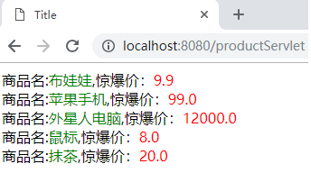


## 第四章  MVC模式和JSP的发展

### 1、MVC设计模式

MVC设计模式： Model-View-Controller简写。

MVC是软件工程中的一种软件架构模式，它是一种**分离业务逻辑**与**显示界面**的设计方法。它把软件系统分为三个基本部分：模型（Model）、视图（View）和控制器（Controller）。

- 控制器Controller：对请求进行处理，负责请求转发；
- 视图View：界面设计人员进行图形界面设计；
- 模型Model：编写程序应用的功能（实现算法等等）、数据库管理；

如下图所示：

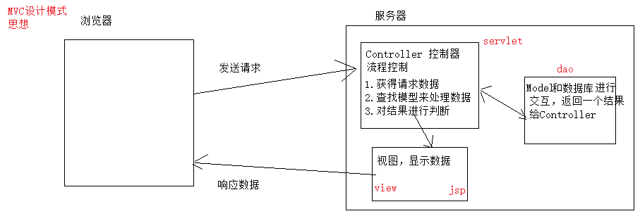

​	MVC可对程序的后期维护和扩展提供了方便，并且使程序某些部分的重用提供了方便。而且MVC也使程序简化，更加直观。

​	注意，MVC不是Java的特有的，几乎现在所有B/S结构的软件都采用了MVC设计模式。

### 2、JSP发展

当SUN公司推出JSP后，同时也提供相应的开发模式.

#### 2.1、model1时代---一个JSP页面搞定前端和后台

​	JSP技术主要用来简化动态网页的开发过程，由于它在形式上和html文档比较相似，因此与Servlet相比，用JSP来编写动态网页更加直观。但是服务器端只有JSP页面，所有的操作都在JSP页面中，连访问数据库的API也在JSP页面中完成。也就是说，所有的东西都在一起，对后期的维护和扩展极为不利。

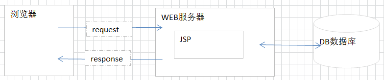


#### 2.2、model2时代---弱化在JSP页面书写java代码

​	但是，当网页非常复杂时，JSP文件中的大量的html标记和java程序片段混杂在一起，会大大削弱JSP代码的可读性和可维护性，而且会增加调试JSP文件的难度。于是，出现了EL表达式帮助我们在JSP页面上简化从容器中取值的操作。【EL表达式】---简化取值

​	如果是在JSP页面上处理一些业务逻辑，JSTL标签库给我们提供了一个解决思路。将java代码封装成标签。直接在JSP页面书写标签，如`<c:if>` 即可完成相应逻辑。【JSTL标签库】---将java代码封装成标签.

Model2使用到的技术有：Servlet、JSP、JavaBean。Model2 是MVC设计模式在Java语言的具体体现。

- JSP：视图层，用来与用户打交道。负责接收用户的数据，以及显示数据给用户；
- Servlet：控制层，负责找到合适的模型对象来处理业务逻辑，转发到合适的视图；
- JavaBean：模型层，完成具体的业务工作，例如：转账等。

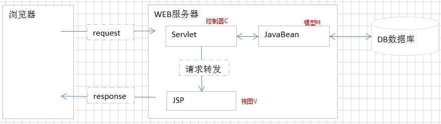

### 3、三层架构(补充)

​	JSP模式是理论基础，但实际开发中，我们常将服务器端程序，根据逻辑进行分层。一般比较常见的是分三层，我们称为：经典三层体系架构。三层分别是：表示层、业务逻辑层、数据访问层。区分层次的目的即为了“高内聚，低耦合”的思想。高内聚：开发人员可以只关注整个结构中的其中某一层，各层功能明确，代码结构标准化，程序员集中对每一层的实现；低耦合：可以降低层与层之间的依赖，利于各层逻辑的复用，在后期维护的时候，极大地降低了维护成本和维护时间；扩展性强：可以很容易的用新的实现来替换原有层次的实现。

- 表示层：又称为 web层，与浏览器进行数据交互的。
- 业务逻辑层：又称为service层，专门用于处理业务数据的。
- 数据访问层：又称为dao层，与数据库进行数据交换的。将数据库的一条记录与JavaBean进行对应。

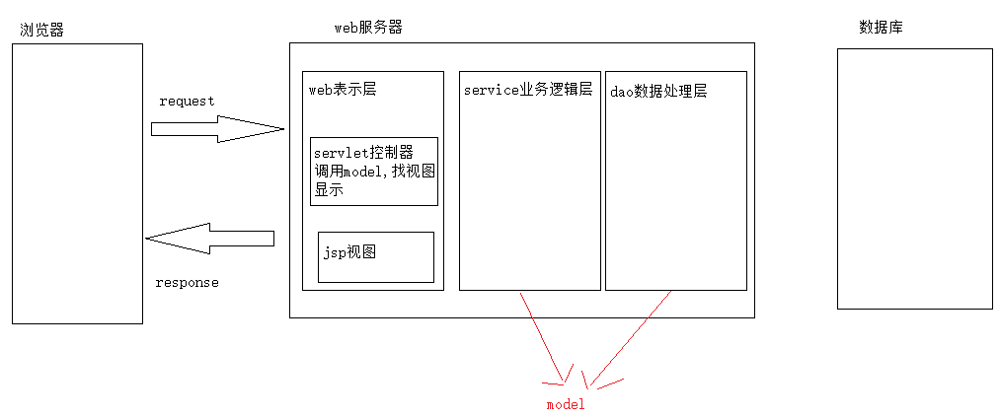

面向接口编程思想：

为什么要使用接口编程？

1.先有代码还是先有业务 需求

面向接口编程就是先把客户的业务逻辑先提取出来，作为接口，业务具体实现通过该接口的实现类来完成。

2.编程原则

其遵循的思想是：对扩展开放，对修改关闭。其恰恰就是遵循的是使用接口来实现。当各个类变化时，不需要对已经编写的系统进行改动，添加新的实现类就可以了，不在担心新改动的类对系统的其他模块造成影响。

3.降低耦合性，解耦

耦合就是联系 ，耦合越强，联系越紧密。在程序中紧密的联系并不是一件好的事情，因为两种事物之间联系越紧密，你更换其中之一的难度就越大，扩展功能和debug的难度也就越大。

4.程序扩展性

可扩展性是指当需要为程序添加新的功能时，对其他模块的影响和添加的代价。


## 第五章   案例-查询所有书籍

### 1     运行效果

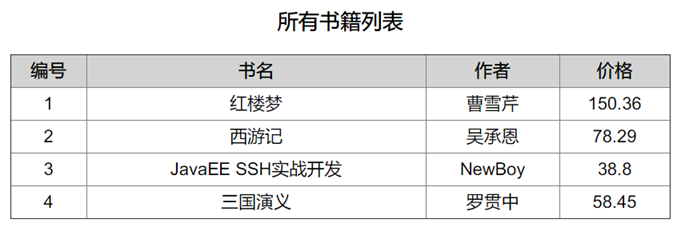

​                              

### 2     架构设计

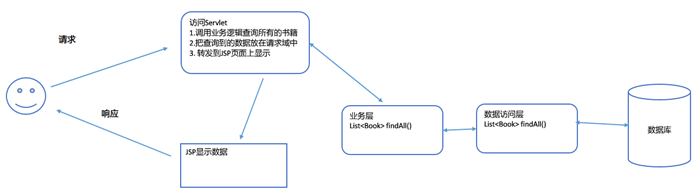

 

### 3     表结构与数据

~~~sql
create table book (
	id int primary key auto_increment,
	name varchar(30),
	author varchar(20),
	price double
);

insert into book (name,author,price) values ('红楼梦','曹雪芹',150.36),('西游记','吴承恩',78.29),('JavaEE SSH实战开发','NewBoy',38.8),('三国演义','罗贯中',58.45);

select * from book;
~~~

### 4    书籍的实体类

~~~java
package com.itheima.sh.demo01;

public class Book {
    private int id;    //编号
    private String name;  //书名
    private String author;  //作者
    private double price;  //价格
    //setter/getter

    public int getId() {
        return id;
    }

    public void setId(int id) {
        this.id = id;
    }

    public String getName() {
        return name;
    }

    public void setName(String name) {
        this.name = name;
    }

    public String getAuthor() {
        return author;
    }

    public void setAuthor(String author) {
        this.author = author;
    }

    public double getPrice() {
        return price;
    }

    public void setPrice(double price) {
        this.price = price;
    }

    @Override
    public String toString() {
        return "Book{" +
                "id=" + id +
                ", name='" + name + '\'' +
                ", author='" + author + '\'' +
                ", price=" + price +
                '}';
    }
}
~~~

### 5 导核心包

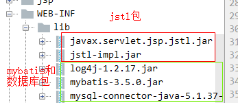

### 6     会话工具类和配置文件

**【SessionFactoryUtils】**

~~~java
package com.itheima.sh.utils;

import org.apache.ibatis.io.Resources;
import org.apache.ibatis.session.SqlSession;
import org.apache.ibatis.session.SqlSessionFactory;
import org.apache.ibatis.session.SqlSessionFactoryBuilder;

import java.io.IOException;
import java.io.InputStream;

/**
 * @author tiansuo
 * @date 2019-11-12 10:02
 *  会话工厂工具类
        1. 通过静态方法得到一个工厂对象
        2. 通过静态方法得到会话对象
 *
 */
public class SessionFactoryUtils {
    //声明一个工厂对象
    private static SqlSessionFactory factory;
    //在静态代码块中创建会话工厂
    static {
        SqlSessionFactoryBuilder builder = new SqlSessionFactoryBuilder();
        //得到输入流
        try(InputStream inputStream = Resources.getResourceAsStream("mapConfig.xml");) {
            factory = builder.build(inputStream);
        } catch (IOException e) {
            e.printStackTrace();
        }
    }
    /**
     静态方法得到会话工厂
     */
    public static SqlSessionFactory getSessionFactory() {
        return factory;
    }
    /**
     得到会话对象
     */
    public static SqlSession getSession() {
        return factory.openSession();
    }
}

~~~

**【mybatisConfig.xml】**

~~~xml
<?xml version="1.0" encoding="UTF-8" ?>
<!DOCTYPE configuration
        PUBLIC "-//mybatis.org//DTD Config 3.0//EN"
        "http://mybatis.org/dtd/mybatis-3-config.dtd">
<configuration>
    <!--加载外部的配置文件-->
    <properties resource="db.properties"></properties>
    <!--别名-->
    <!--<typeAliases>
        <package name="com.itheima.sh.domain"></package>
    </typeAliases>-->
    <!--mybatis环境的配置
        一个核心配置文件，可以配置多个运行环境，default默认使用哪个运行环境
    -->
    <environments default="development">
        <!--通常我们只需要配置一个就可以了， id是环境的名字 -->
        <environment id="development">
            <!--事务管理器：由JDBC来管理-->
            <!--
                事务管理器type的取值：
                1. JDBC：由JDBC进行事务的管理
                2. MANAGED：事务由容器来管理，后期学习Spring框架的时候，所有的事务由容器管理
            -->
            <transactionManager type="JDBC"/>
            <!--数据源的配置：mybatis自带的连接池-->
            <!--
                数据源：
                1. POOLED：使用mybatis创建的连接池
                2. UNPOOLED：不使用连接池，每次自己创建连接
                3. JNDI：由服务器提供连接池的资源，我们通过JNDI指定的名字去访问服务器中资源。
            -->
            <dataSource type="POOLED">
                <property name="driver" value="${jdbc.driver}"/>
                <property name="url" value="${jdbc.url}"/>
                <property name="username" value="${jdbc.username}"/>
                <property name="password" value="${jdbc.password}"/>
            </dataSource>
        </environment>

    </environments>
    <!--映射器-->
    <mappers>
        <!--加载其它的映射文件 注：注解开发是点号-->
        <!-- <package name="com.itheima.sh.dao"></package>-->
        <!--加载其它的映射文件 注：不是点号-->
        <!--<mapper resource="org/mybatis/example/BlogMapper.xml"/>-->
        <!--
            加载其它的映射文件 xml形式
                包扫描方式加载mapper映射文件,说明：
                1. 要求mapper映射文件，与mapper接口要放在同一个目录
                2. 要求mapper映射文件的名称，与mapper接口的名称要一致
            -->
        <package name="com.itheima.sh.dao"></package>
    </mappers>
</configuration>
~~~

**【db.properties】**

~~~properties
jdbc.driver=com.mysql.jdbc.Driver
jdbc.url=jdbc:mysql://localhost:3306/db3
jdbc.username=root
jdbc.password=1234
~~~

**【log4j.properties】**

~~~properties
### 设置Logger输出级别和输出目的地 ###
log4j.rootLogger=debug, stdout

### 把日志信息输出到控制台 ###
log4j.appender.stdout=org.apache.log4j.ConsoleAppender
log4j.appender.stdout.Target=System.out
log4j.appender.stdout.layout=org.apache.log4j.SimpleLayout

~~~


### 7 查询所有书籍的主页面index.jsp

~~~jsp
<%@ page contentType="text/html;charset=UTF-8" language="java" %>
<html>
<head>
    <title>Title</title>
    <style type="text/css">
        body {
            /*文本居中*/
            text-align: center;
        }

        a {
            /*去除下划线*/
            text-decoration: none;
            /*字体*/
            font-size: 30px;
            /*定义粗体字符*/
            font-weight: bold;
            /*字体颜色*/
            color: green;
        }
    </style>
</head>
<body>
<a href="/queryAllServlet">查询所有的书籍</a>
</body>
</html>

~~~


### 8 BookServlet显示所有的书籍列表

~~~java
@WebServlet("/queryAllServlet")
public class QueryAllServlet extends HttpServlet {
    protected void doPost(HttpServletRequest request, HttpServletResponse response) throws ServletException, IOException {
        doGet(request, response);
    }

    protected void doGet(HttpServletRequest request, HttpServletResponse response) throws ServletException, IOException {

        //1、处理数据：调用service查询数据
        BookService bookService = new BookService();
        List<Book> bookList =  bookService.queryAll();

        //2、响应数据
        request.setAttribute("list", bookList);
        request.getRequestDispatcher("/list.jsp").forward(request,response);
    }
}
~~~


### 9  业务层

~~~java
public class BookService {
    /**
     * 查询所有书籍
     * @return
     */
    public List<Book> queryAll() {
        BookMapper bookMapper = SessionFactoryUtils.getSession().getMapper(BookMapper.class);
        return bookMapper.queryAll();
    }
}
~~~


### 10  数据访问层

~~~java
public interface BookMapper {
    @Select("select * from book")
    List<Book> queryAll();
}

~~~


### 11     显示书籍列表的list.jsp

**【使用到的页面】**

~~~jsp
<%@ taglib prefix="c" uri="http://java.sun.com/jsp/jstl/core" %>
<%@ page contentType="text/html;charset=UTF-8" language="java" %>
<html>
<head>
    <title>Title</title>
    <style>
        tr{
            height: 40px;
            /*行文本居中*/
            text-align: center;
        }
        table{
            /*table表格在页面居中显示*/
            margin: auto;
            /*
                border-collapse 属性设置表格的边框是否被合并为一个单一的边框
                属性值是collapse：如果可能，边框会合并为一个单一的边框。会忽略 border-spacing 属性
            */
            border-collapse: collapse;
        }
    </style>
</head>
<body>
    <table border="1px" cellspacing="0" width="600">
        <caption><h2>书籍列表</h2></caption>
        <tr>
            <th>编号</th>
            <th>书籍名称</th>
            <th>作者</th>
            <th>价格</th>
        </tr>
		 <%--使用jstl结合EL从后台queryAllServlet的reques域对象中取出数据--%>
        ...............
    </table>
</body>
</html>
~~~

**【完整页面】**

~~~jsp
<%@ taglib prefix="c" uri="http://java.sun.com/jsp/jstl/core" %>
<%@ page contentType="text/html;charset=UTF-8" language="java" %>
<html>
<head>
    <title>Title</title>
    <style>
        tr{
            height: 40px;
            /*行文本居中*/
            text-align: center;
        }
        table{
            /*table表格在页面居中显示*/
            margin: auto;
            /*
                border-collapse 属性设置表格的边框是否被合并为一个单一的边框
                属性值是collapse：如果可能，边框会合并为一个单一的边框。会忽略 border-spacing 属性
            */
            border-collapse: collapse;
        }
    </style>
</head>
<body>
    <table border="1px" cellspacing="0" width="600">
        <caption><h2>书籍列表</h2></caption>
        <tr>
            <th>编号</th>
            <th>书籍名称</th>
            <th>作者</th>
            <th>价格</th>
        </tr>
 		<%--使用jstl结合EL从后台queryAllServlet的request域对象中取出数据--%>
        <c:forEach items="${list}" var="book">
            <tr>
                <td>${book.id}</td>
                <td>${book.name}</td>
                <td>${book.author}</td>
                <td>${book.price}</td>
            </tr>
        </c:forEach>
    </table>
</body>
</html>
~~~


### 12 页面显示效果

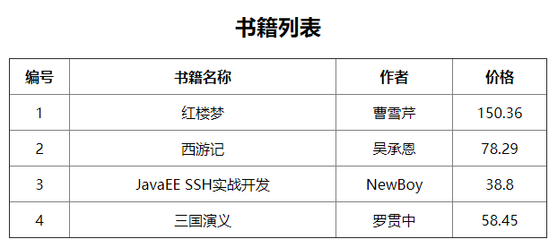


