---

typora-copy-images-to: img
---

# day09-过滤器、监听器

## 学习目标

-[ ] 能够说出过滤器的作用
-[ ] 能够编写过滤器
-[ ] 能够说出过滤器生命周期相关的方法
-[ ] 能够根据过滤器判断指定的过滤是否起作用
-[ ] 能够说出什么是过滤器链
-[ ] 能够编写过滤器对非法字符进行过滤

## 第一章   过滤器简介

### 1、Java Web的三大组件

| **组件**     | **作用**                                                     | **实现接口**                                  |
| ------------ | ------------------------------------------------------------ | --------------------------------------------- |
| **Servlet**  | 小应用程序，在JavaWeb的服务器中主要做为控制器来使用  可以处理用户的请求并且做出响应 | javax.servlet.Servlet                         |
| **Filter**   | 过滤器，对用户发送的请求或响应进行集中处理，实现请求的拦截   | javax.servlet.Filter                          |
| **Listener** | 监听器，在某些框架中会使用到监听器，如：Spring框架  在Web执行过程中，引发一些事件，对相应事件进行处理。主要是监听Servlet的3大域对象的创建销毁以及属性的变化 | javax.servlet.XxxListener  每个事件有一个接口 |


### 2、过滤器是什么

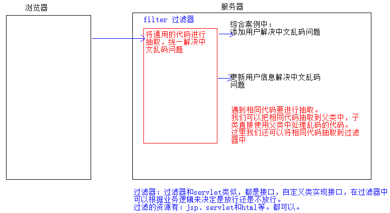

​	过滤器（filter）本质是Java中预先定义好了不同的接口，和servlet类似。可以过滤不同的内容，具体怎么过滤，需要使用者定义一个实现类，然后实现接口中的过滤方法，在方法中书写过滤的条件。filter是对客户端访问资源的过滤，符合条件放行，不符合条件不放行。

​	简而言之，是在servlet之前执行，拦截(过滤)请求，将servlet中一些共同的业务代码抽取出来，这就是过滤器作用。比如：请求乱码处理。

​	

## 第二章  过滤器开发入门

### 1、过滤器API介绍

 Filter是由Tomcat启动时创建，是javax.servlet包下面的一个接口，这个接口中定义了3个方法。

```java
package javax.servlet;
import java.io.IOException;
public interface Filter {
    void init(FilterConfig var1) throws ServletException;
    void doFilter(ServletRequest var1, ServletResponse var2, FilterChain var3) throws IOException, ServletException;
    void destroy();
}
```

| 方法                                       | 说明              |
| ---------------------------------------- | --------------- |
| void  init(FilterConfig  filterConfig)   | 过滤器对象创建的时候调用的方法 |
| void doFilter(ServletRequest request, ServletResponse response, FilterChain chain) | 执行过滤的方法         |
| void destory()                           | 过滤器销毁的时候调用的方法   |

说明：

​	1.tomcat服务器一启动就会调用过滤器中的无参构造方法创建过滤器类的对象，然后立刻调用初始化init方法。

​	2.每次访问拦截的资源都会执行一次执行过滤的方法doFilter

​	3.正常关闭tomcat服务器，执行销毁过滤器的方法destory

### 2、过滤器开发步骤

​	项目中如果需要使用到过滤器，使用Servlet3.0的注解方式进行创建。创建步骤如下：

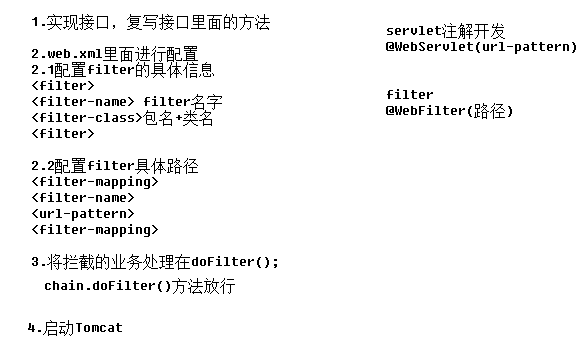

* 第一步：新建一个普通java类，实现Filter接口；
* 第二步：根据提示重写Filter接口的3个方法；
* 第三步：在这个类上面通过注解的方式配置这个Filter；
  * 注解@WebFilter：配置Filter的注解，这个注解有两个参数；
    * filterName：设置过滤器的名称；
    * urlPatterns：配置这个过滤器要拦截的资源的路径；
* 第四步：在doFilter（）方法中，书写过滤的业务逻辑；
  * chain.doFilter()方法放行；

**过滤器是在请求资源之前执行，这点非常重要**

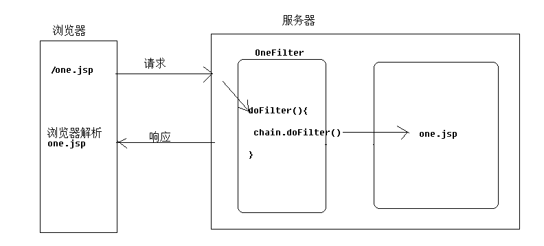

【参考代码】

**filter的web.xml版本**

``` java
package cn.itheima.filter01;

import javax.servlet.*;
import java.io.IOException;

public class FilterOne implements Filter {
    @Override
    public void init(FilterConfig filterConfig) throws ServletException {
    }
    @Override
    public void doFilter(ServletRequest servletRequest, ServletResponse servletResponse, FilterChain filterChain) throws IOException, ServletException {
        //doFilter 每一次请求都会执行  进行过滤业务逻辑处理
        //如果想放行
//        filterChain.doFilter(servletRequest,servletResponse);
    }
    @Override
    public void destroy() {
    }
}
```

说明：filterChain.doFilter(servletRequest,servletResponse);方法被执行，相当于放行的功能。

XML配置  和servlet一样，需要在web.xml中进行配置

``` xml
	 <filter>
        <filter-name>one</filter-name>
        <filter-class>cn.itheima.filter01.FilterOne</filter-class>
    </filter>
    <filter-mapping>
        <filter-name>one</filter-name>
        <url-pattern>/filter01.html</url-pattern>
    </filter-mapping>
```


filter01.html

``` html
<!DOCTYPE html>
<html lang="en">
<head>
    <meta charset="UTF-8">
    <title>Title</title>
</head>
<body>
<h1>来拦截我啊！</h1>
</body>
</html>
```

效果：访问http://localhost:8080/filter01.html

浏览器没有得到html资源。

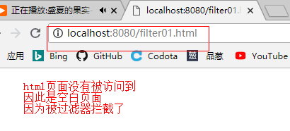

**Filter的注解版本**

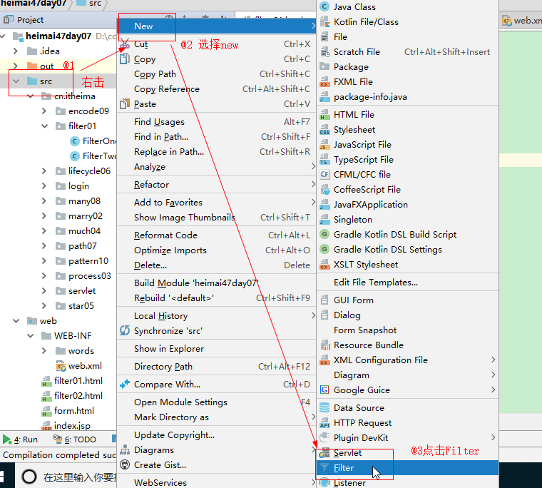

**注解代码参考**

``` java
package cn.itheima.filter01;

import javax.servlet.*;
import javax.servlet.annotation.WebFilter;
import javax.servlet.http.HttpServletRequest;
import javax.servlet.http.HttpServletResponse;
import java.io.IOException;

@WebFilter("/filter02.html")
public class FilterTwo implements Filter {
    public void destroy() {
    }

    /*
    每一次请求，只要路径匹配，都会执行
     */
    public void doFilter(ServletRequest req, ServletResponse resp, FilterChain chain) throws ServletException, IOException {
        HttpServletRequest request = (HttpServletRequest) req;
        HttpServletResponse response = (HttpServletResponse) resp;
        //code...
        //放行
        System.out.println("执行过滤方法。。。");
        chain.doFilter(request, response);  //放行，没有拦截，准许用户访问资源
    }

    public void init(FilterConfig config) throws ServletException {

    }

}

```

filter02.html页面

```java
<!DOCTYPE html>
<html lang="en">
<head>
    <meta charset="UTF-8">
    <title>Title</title>
</head>
<body>
<h1>请不要拦截我</h1>
</body>
</html>
```

效果：

访问链接：http://localhost:8080/filter02.html

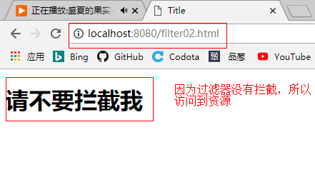

说明:可以修改idea中的配置过滤器的模板：

```java
#if (${PACKAGE_NAME} && ${PACKAGE_NAME} != "")package ${PACKAGE_NAME};#end
#parse("File Header.java")
@javax.servlet.annotation.WebFilter("/${Entity_Name}")
public class ${Class_Name} implements javax.servlet.Filter {
    @Override
    public void destroy() {
    }
    @Override
    public void doFilter(javax.servlet.ServletRequest req, javax.servlet.ServletResponse resp, javax.servlet.FilterChain chain) throws javax.servlet.ServletException, java.io.IOException {
        javax.servlet.http.HttpServletRequest request = (javax.servlet.http.HttpServletRequest)req;
        javax.servlet.http.HttpServletResponse response = (javax.servlet.http.HttpServletResponse)resp;
        //your  code.... 
        chain.doFilter(request, response);
    }
    @Override
    public void init(javax.servlet.FilterConfig config) throws javax.servlet.ServletException {
    }
}
```


**总结:**

1)**chain.doFilter(request, response)**方法的作用:

​	当不写**chain.doFilter(request, response)**方法时候，html文件访问不到，被拦截；

​	当有了**chain.doFilter(request, response)**方法时候，html文件可以访问，被放行；所以：**chain.doFilter(request, response)**具有放行的作用。

### 3、过滤器应用练习

**需求：实现横刀夺爱案例来应用过滤器**：

案例描述：新建表单，用input标签提交数据，如果表单提交数据中含有"love me"，不让servlet接收。

案例步骤：

​	a:新建servlet，接收表单提交数据，含有"love me",就输出"我们结婚吧"。

​	b:新建filter，在doFilter()之前判断表单提交的数据是否含有"love me"，有的话，拦截，并输出，"抢走新娘"

1）前端页面：

marry.html

``` html
<!DOCTYPE html>
<html lang="en">
<head>
    <meta charset="UTF-8">
    <title>Title</title>
</head>
<body>
<form action="/marryServlet" method="post">
    女神：<input type="text" name="word"><br>
    <input type="submit" value="发短信">
</form>
</body>
</html>
```

2）后台servlet：

MarryServlet.java

```java
@WebServlet("/marryServlet")
public class MarryServlet extends HttpServlet {
    protected void doPost(HttpServletRequest request, HttpServletResponse response) throws ServletException, IOException {
        doGet(request, response);
    }

    protected void doGet(HttpServletRequest request, HttpServletResponse response) throws ServletException, IOException {
        //解决响应乱码问题
        response.setContentType("text/html;charset=utf-8");
        String word = request.getParameter("word");
        if (word.contains("loveme")){
            response.getWriter().print("我们结婚吧");
        }
        System.out.println("我和女神聊天");
    }
}


```

3）过滤器：

MarryFilter.java

``` java
//这里路径书写拦截的servlet
@WebFilter("/marryServlet")
public class MarryFilter implements Filter {
    public void destroy() {
    }
    public void doFilter(ServletRequest req, ServletResponse resp, FilterChain chain) throws ServletException, IOException {
        HttpServletRequest request = (HttpServletRequest) req;
        HttpServletResponse response = (HttpServletResponse) resp;
        String word = request.getParameter("word");
        if (word.contains("loveme")){
            //不放行
            System.out.println("抢走新娘！哈哈");
            return;
        }else {
            //放行
            chain.doFilter(request, response);
        }
    }

    public void init(FilterConfig config) throws ServletException {

    }

}

```

效果：

访问链接：http://localhost:8080/marry.html  输入带有loveme的信息，点击发短信按钮

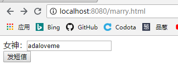

过滤器拦截到，进行横刀夺爱了

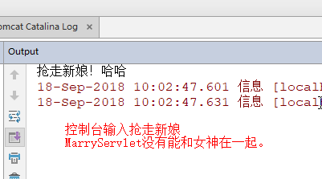

## 第三章  过滤器的执行流程

### 1、过滤器中代码执行顺序

ProcessFilter.java

``` java
@WebFilter("/process")
public class ProcessFilter implements Filter {
    @Override
    public void destroy() {
    }
    @Override
    public void doFilter(ServletRequest req, ServletResponse resp, FilterChain chain) throws ServletException, IOException {
        HttpServletRequest request = (HttpServletRequest) req;
        HttpServletResponse response = (HttpServletResponse) resp;
        //your  code....
        System.out.println("doFilter()之前执行。。。");
        chain.doFilter(request, response);
        System.out.println("doFilter()之后执行。。。");
    }
    @Override
    public void init(FilterConfig config) throws ServletException {
    }
}
```

ProcessServlet.java

```java
@WebServlet("/process")
public class ProcessServlet extends HttpServlet {
    @Override
    protected void doPost(HttpServletRequest request, HttpServletResponse response) throws ServletException, IOException {
        doGet(request, response);
    }

    @Override
    protected void doGet(HttpServletRequest request, HttpServletResponse response) throws ServletException, IOException {
        System.out.println("Servlet执行了。。。");
    }
}

```

执行效果图：

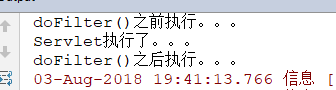

运行原理图

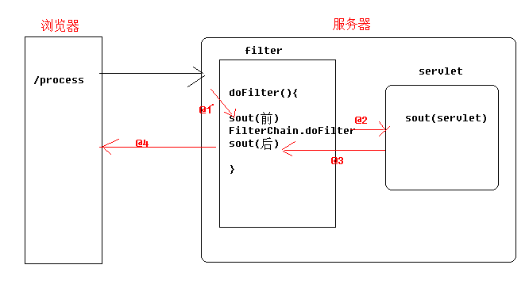

说明：servlet响应给浏览器的内容，过滤器也对其进行了拦截过滤。

### 2、过滤器中请求和响应对象

过滤器的doFilter(ServletRequest req, ServletResponse resp, FilterChain chain)方法中的request对象和response对象与servlet中请求对象和响应对象相同。

过滤器的执行流程如下：

1. 客户端（浏览器）的HttpRequest到达Servlet之前，被Filter的doFilter()方法拦截；
2. 根据需要，我们可以获取或者修改HttpRequest对象中的数据；
3. 在这个请求响应给浏览器之前，Filter拦截了HttpResponse对象；
4. 根据需要，我们可以获取或者修改HttpReponse对象中的数据；
5. 最后，由doFilter中的chain决定是否让这个请求通过；


代码：ProcessServlet.java

```java
@WebServlet("/processServlet")
public class ProcessServlet extends HttpServlet {
    protected void doPost(HttpServletRequest request, HttpServletResponse response) throws ServletException, IOException {
        doGet(request, response);
    }
    protected void doGet(HttpServletRequest request, HttpServletResponse response) throws ServletException, IOException {
        //代码肯定被执行
        System.out.println(request);
        System.out.println(response);
        System.out.println("servlet被执行了。。。");
    }
}
```

ProcessFilter.java

``` java
@WebFilter("/processServlet")
public class ProcessFilter implements Filter {
    public void destroy() {
    }
    public void doFilter(ServletRequest req, ServletResponse resp, FilterChain chain) throws ServletException, IOException {
        HttpServletRequest request = (HttpServletRequest) req;
        HttpServletResponse response = (HttpServletResponse) resp;
        //code...
        System.out.println("在doFilter()之前执行。。。");
        System.out.println(request);
        System.out.println(response);
        chain.doFilter(request, response);
        System.out.println("在doFilter()之后执行。。。");
        // 拦截请求对象和响应对象就是servlet请求对象和响应对象
    }

    public void init(FilterConfig config) throws ServletException {

    }

}

```

控制台运行效果图

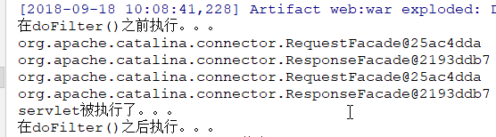


### 3、多个Filter执行顺序

问题：如果多个过滤器都对相同路径进行匹配，执行顺序该是什么？ 

Filter默认是按照字母顺序执行的，如果过滤器名字第一个字母相同，再看过滤器名字的第二个字母，以此类推。从而形成一个执行链条。

代码AFilter.java

```java
@WebFilter("/apple")
public class AFilter implements Filter {
    @Override
    public void destroy() {
    }
    @Override
    public void doFilter(ServletRequest req, ServletResponse resp, FilterChain chain) throws ServletException, IOException {
        HttpServletRequest request = (HttpServletRequest) req;
        HttpServletResponse response = (HttpServletResponse) resp;
        //your  code....
        System.out.println("这是在AFilter之前执行。。。");
        chain.doFilter(request, response);
        System.out.println("这是在AFilter之后执行。。。");
    }
    @Override
    public void init(FilterConfig config) throws ServletException {
    }
}

```

代码：BFilter.java

```java
@WebFilter("/apple")
public class BFilter implements Filter {
    @Override
    public void destroy() {
    }
    @Override
    public void doFilter(ServletRequest req, ServletResponse resp, FilterChain chain) throws ServletException, IOException {
        HttpServletRequest request = (HttpServletRequest) req;
        HttpServletResponse response = (HttpServletResponse) resp;
        //your  code....
        System.out.println("这是在BFilter之前执行。。。");
        chain.doFilter(request, response);
        System.out.println("这是在BFilter之后执行。。。");
    }
    @Override
    public void init(FilterConfig config) throws ServletException {
    }
}
```

代码：CFilter.java

```java
@WebFilter("/apple")
public class CFilter implements Filter {
    @Override
    public void destroy() {
    }
    @Override
    public void doFilter(ServletRequest req, ServletResponse resp, FilterChain chain) throws ServletException, IOException {
        HttpServletRequest request = (HttpServletRequest) req;
        HttpServletResponse response = (HttpServletResponse) resp;
        //your  code....
        System.out.println("这是在CFilter之前执行。。。");
        chain.doFilter(request, response);
        System.out.println("这是在CFilter之后执行。。。");
    }
    @Override
    public void init(FilterConfig config) throws ServletException {
    }
}
```

代码：AppleServlet.java

```java
@WebServlet("/apple")
public class AppleServlet extends HttpServlet {
    @Override
    protected void doPost(HttpServletRequest request, HttpServletResponse response) throws ServletException, IOException {
        doGet(request, response);
    }
    @Override
    protected void doGet(HttpServletRequest request, HttpServletResponse response) throws ServletException, IOException {
        System.out.println("AppleServlet");
    }
}
```

上述代码执行效果图：

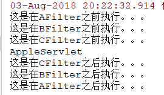

执行流程图：

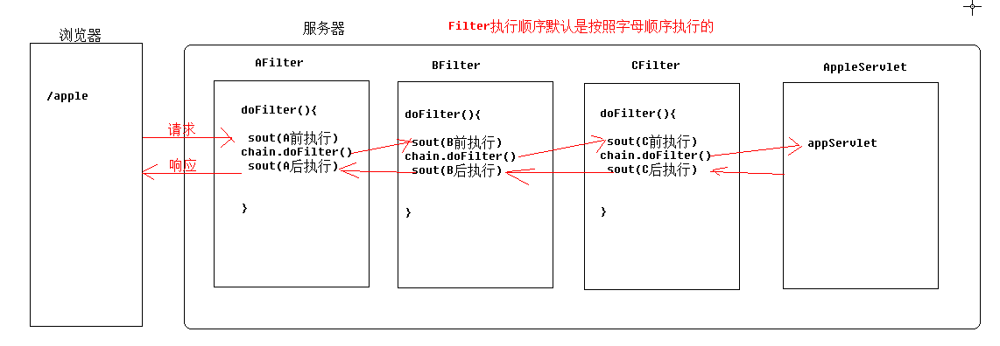


## 第四章   Filter的生命周期

我们之前学习过servlet生命周期，并且上面，我们分析了Filter的执行流程。我们有没有想过，我们并没有向Filter发送请求，请求是怎么进入到doFilter()中的呢？Filter类的对象是在什么时候创建的呢?创建之后又是怎么工作的呢？最后是在什么时候销毁的呢？这些问题就是Filter的生命周期问题。接下来我们要学习过滤器filter的生命周期，和servlet的生命周期差不多。

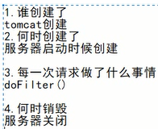

### 1.filter生命周期代码

接下来我们可以通过以下代码对Filter的生命周期问题进行验证：

【验证Filter的生命周期】LifecycleFilter.java

~~~java
@WebFilter("/lifecycle")
public class LifecycleFilter implements Filter {
    @Override
    public void destroy() {
        System.out.println("被销毁了。。。");
    }

    @Override
    public void doFilter(ServletRequest req, ServletResponse resp, FilterChain chain) throws ServletException, IOException {
        HttpServletRequest request = (HttpServletRequest) req;
        HttpServletResponse response = (HttpServletResponse) resp;
        //your  code....
        System.out.println("doFilter()被执行了。。。");
        chain.doFilter(request, response);
    }

    @Override
    public void init(FilterConfig config) throws ServletException {
        System.out.println("初始化了。。。");
    }

    public LifecycleFilter() {
        System.out.println("构造方法被执行了。。。");
    }
}

~~~

重启服务器：在浏览器输入访问过滤器地址，并查看控制台。

http://localhost:8080/lifecycle

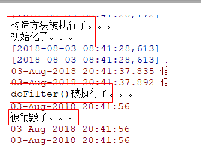

【结论】

1. Filter类的对象是在服务器启动的时候创建的；
2. Filter类对象创建完成后会调用init()方法；
3. 每当一个请求的路径是满足过滤器的配置路径，那么就会执行一次过滤器的doFilter方法 (类似于service方法)
4. 当服务器停止的时候，销毁过滤器，执行过滤器的destory方法    

### 2.doFilter()方法

​	doFilter()方法是拦截请求的方法，只要一个请求符合Filter拦截路径，都会被doFilter()方法拦截。doFilter()方法有3个参数，这3个参数的作用分别如下：

| 参数                 | 说明                                                         |
| -------------------- | ------------------------------------------------------------ |
| ServletRequest req   | ServletRequest是HttpServletRequest类的父接口，其中包含了被拦截的请求的信息 |
| ServletResponse resp | ServletResponse是HttpServletResponse类的父接口，其中包含了被拦截的响应的信息 |
| FilterChain chain    | FilterChain给Filter提供了放行的方法。chain.doFilter();       |

FilterChain 是一个接口，里面有doFilter(req，resp)方法，作用是将浏览器提交请求对象和响应对象传到过滤器的资源里面去，所以doFilter()方法具有放行的作用。


### 3.destory()方法

​	过滤器的销毁方法。服务器停止的时候，销毁过滤器，调用一次destory方法。

【测试】在destory()方法中输出一句话，如下：

~~~java
    @Override
    public void destroy() {
      System.out.println("服务器关闭");
        System.out.println("LifecycleFilter的destory方法执行了.......................");
    }
~~~

【关闭tomcat】查看结果

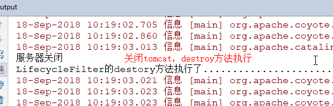

【结论】

1. 过滤器是在服务器停止时销毁的；
2. 过滤器销毁后会调用destory()方法；

### 【小结】Filter生命周期小结

1. 当服务器启动的时候，过滤器就被初始化了，执行过滤器的init方法
2. 每当一个请求的路径是满足过滤器的配置路径，那么就会执行一次过滤器的doFilter方法 
3. 当服务器停止的时候，销毁过滤器，执行过滤器的destory方法    


## 第五章   Filter的映射路径

​	映射路径指的是当前这个Filter需要拦截的路径。这个路径的配置方式有3种：

1. 精确匹配：匹配指定的urlpattern；
2. 模糊匹配：匹配复合条件的一类路径；
3. 多路径匹配：一个filter匹配多个资源；


### 1、精确匹配

​	精确匹配，要求访问的资源路径必须与Filter的urlPatterns中的配置一致。如下：

| 精确匹配                      | 说明                      |
| ----------------------------- | ------------------------- |
| urlPatterns = "/index.jsp"    | 拦截对index.jsp页面的请求 |
| urlPatterns = "/loginServlet" | 拦截对loginServlet的请求  |
| urlPatterns = "/a.jsp"        | 拦截对a.jsp的请求         |

### 2、模糊匹配

​	有时候，我们需要对这个服务器中的所有请求都有所特殊处理，比如处理post请求的乱码问题。我们就需要对所有的请求都设置乱码处理。这时候，就需要对所有的请求进行拦截。如果通过上面的精确匹配模式，需要配置很多的请求，这样就比较麻烦了。如果通过urlPatterns的模糊匹配，就能够对这些请求进行统一处理。

​	模糊匹配主要有以下3种写法：

| 模糊匹配               | 使用示例                | 说明                                  |
| ---------------------- | ----------------------- | ------------------------------------- |
| urlPatterns = "/*"     | urlPatterns = "/*"      | 对所有的请求都进行拦截                |
| urlPatterns = "/xxx/*" | urlPatterns = "/user/*" | 对映射路径中/user下的所有资源进行拦截 |
| urlPatterns = "*.xxx"  | urlPatterns = "*.jsp"   | 对指定后缀的请求进行拦截 **不加/**    |

**使用场景**

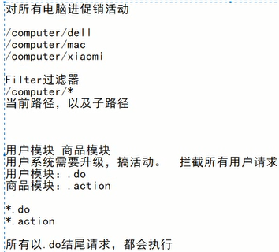

今天电商狂欢日，产品经理要求对所有购买的电脑进行打9折

http://localhost:8080/computer/dell

http://localhost:8080/computer/xiaomi

http://localhost:8080/computer/thinkpad

**效果**：我们只要过滤器中路径设置为：/computer/*，那么任何电脑的请求都会被过滤器拦截。

**使用场景**

网站有很多种请求：浏览商品，购买商品，删除商品；用户登录，修改用户信息，注册用户信息。

我们可以将请求分为两类：xxx.action和xxx.do

这样可以分清楚网站请求的类别。

效果：我们只要在过滤器中设置路径为：*.action，那么，所有以.action结尾的请求都会被过滤器拦截。

代码演示如下：

对所有的请求都进行拦截:

```java
@WebFilter("/*")
public class OneFilter implements Filter {
    public void destroy() {
    }
    public void doFilter(ServletRequest req, ServletResponse resp, FilterChain chain) throws ServletException, IOException {
        HttpServletRequest request = (HttpServletRequest) req;
        HttpServletResponse response = (HttpServletResponse) resp;
        System.out.println("OneFilter执行了。。。");
//        chain.doFilter(request, response);
    }
    public void init(FilterConfig config) throws ServletException {
    }
}
```

对映射路径中/user下的所有资源进行拦截:

```java
@WebFilter("/user/*")
public class TwoFilter implements Filter {
    public void destroy() {
    }
    public void doFilter(ServletRequest req, ServletResponse resp, FilterChain chain) throws ServletException, IOException {
        HttpServletRequest request = (HttpServletRequest) req;
        HttpServletResponse response = (HttpServletResponse) resp;
        System.out.println("TwoFilter执行了。。。。。");
//        chain.doFilter(request, response);
    }
    public void init(FilterConfig config) throws ServletException {
    }
}
```

对指定后缀的请求进行拦截:

```java
@WebFilter("*.action")
public class ThrFilter implements Filter {
    public void destroy() {
    }
    public void doFilter(ServletRequest req, ServletResponse resp, FilterChain chain) throws ServletException, IOException {
        HttpServletRequest request = (HttpServletRequest) req;
        HttpServletResponse response = (HttpServletResponse) resp;
        System.out.println("ThrFilter执行了。。。。");
//        chain.doFilter(request, response);
    }
    public void init(FilterConfig config) throws ServletException {
    }
}
```


### 3、多个路径匹配

一个过滤器可以匹配多个路径

xml实现方式：

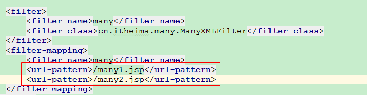

注解实现方式：

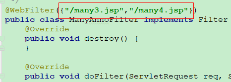

温馨提示：路径没有/，Tomcat会报错！

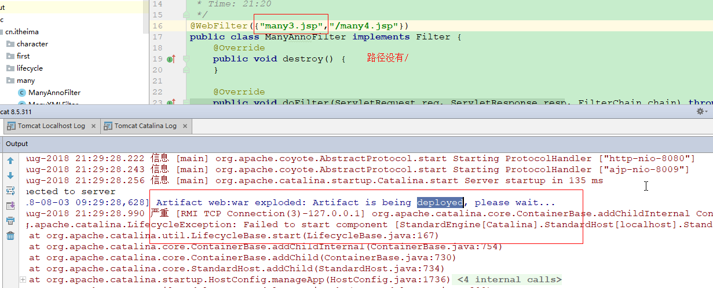

## 第六章 过滤器的拦截方式

什么是拦截方式：对浏览器或服务器过来的请求进行拦截。

~~~
1.通过浏览器发送的请求：默认的
2.请求转发：默认不拦截
~~~

案例：演示过滤器的拦截方式。分别从浏览器和服务器转发过来的请求。

**【代码如下】**

HelloServlet:

~~~java
@WebServlet("/helloServlet")
public class HelloServlet extends HttpServlet {
    protected void doPost(HttpServletRequest request, HttpServletResponse response) throws ServletException, IOException {
        doGet(request, response);
    }

    protected void doGet(HttpServletRequest request, HttpServletResponse response) throws ServletException, IOException {
        System.out.println("helloServlet 接收了请求。。。。。");
        //响应数据
        response.getWriter().print("hello");
    }
}
~~~

HelloFilter:

~~~java
@WebFilter("/helloServlet")
public class HelloFilter implements Filter {
    public void destroy() {
    }

    public void doFilter(ServletRequest req, ServletResponse resp, FilterChain chain) throws ServletException, IOException {
        HttpServletRequest request = (HttpServletRequest) req;
        HttpServletResponse response = (HttpServletResponse) resp;
        System.out.println("HelloFilter拦截了请求。。。。");
        chain.doFilter(request, response);
        System.out.println("HelloFilter拦截了响应。。。。");
    }
    public void init(FilterConfig config) throws ServletException {
    }
}
~~~


### 1. 默认的拦截方式 

只对从浏览器直接发送过来的请求进行拦截，值：REQUEST

在浏览器中直接访问HelloServlet，看过滤器是否拦截。

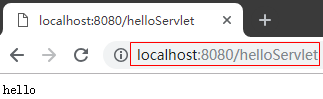

显示是拦截了。

### 2. 来自转发的请求被拦截

1. 在filter.jsp转发到HelloServlet，查看过滤器是否拦截。

filter.jsp页面代码：

~~~jsp
<%@ page contentType="text/html;charset=UTF-8" language="java" %>
<html>
<head>
    <title>Title</title>
</head>
<body>
   <%-- <jsp:forward page="/helloServlet"/>--%>
     <%
      request.getRequestDispatcher("/helloServlet").forward(request, response);
  	 %>
</body>
</html>
~~~

在浏览器上直接访问filter.jsp页面。

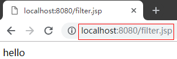

idea控制台：

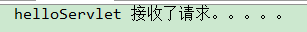

我们发现直接访问jsp,然后在jsp页面转发访问helloServlet，过滤器没有拦截。

因为过滤器默认只拦截从浏览器的直接请求。不拦截请求转发的请求，如果希望过滤器对请求转发的请求进行拦截，我们必须按照如下进行配置。

2.过滤器的配置

配置方式1：web.xml

~~~xml
	<!--配置一个过滤器-->
    <filter>
        <!--过滤器名字-->
        <filter-name>hello</filter-name>
        <!--过滤器的类全名-->
        <filter-class>com.itheima.sh.demo01.HelloFilter</filter-class>
    </filter>
    <filter-mapping>
        <!--过滤器名字，必须与上面的名字相同-->
        <filter-name>hello</filter-name>
        <!--过滤的地址-->
        <url-pattern>/helloServlet</url-pattern>
        <!--配置拦截方式，为转发-->
        <dispatcher>FORWARD</dispatcher>
        <!--配置拦截方式，浏览器的请求-->
        <dispatcher>REQUEST</dispatcher>
    </filter-mapping>

~~~

说明：

1)在web.xml中配置之后必须去掉过滤器中的注解

~~~java
//@WebFilter("/helloServlet")
public class HelloFilter implements Filter {
    public void destroy() {
    }
    public void doFilter(ServletRequest req, ServletResponse resp, FilterChain chain) throws ServletException, IOException {
        HttpServletRequest request = (HttpServletRequest) req;
        HttpServletResponse response = (HttpServletResponse) resp;
        System.out.println("HelloFilter拦截了请求。。。。");
        chain.doFilter(request, response);
        System.out.println("HelloFilter拦截了响应。。。。");
    }
    public void init(FilterConfig config) throws ServletException {
    }
}
~~~

2)如果只配置 <dispatcher>FORWARD</dispatcher> 只会拦截转发的请求，必须还得配置 <dispatcher>REQUEST</dispatcher>同时还得拦截浏览器的请求。


配置方式2：注解

~~~java
@WebFilter(urlPatterns = "/helloServlet", dispatcherTypes = {DispatcherType.FORWARD,DispatcherType.REQUEST})
public class HelloFilter implements Filter {
    public void destroy() {
    }
    public void doFilter(ServletRequest req, ServletResponse resp, FilterChain chain) throws ServletException, IOException {
        HttpServletRequest request = (HttpServletRequest) req;
        HttpServletResponse response = (HttpServletResponse) resp;
        System.out.println("HelloFilter拦截了请求。。。。");
        chain.doFilter(request, response);
        System.out.println("HelloFilter拦截了响应。。。。");
    }
    public void init(FilterConfig config) throws ServletException {
    }
}
~~~

**注意：去掉web.xml文件中的拦截代码。**

### 3 拦截类型小结

| **拦截类型** | **作用**                                     |
| ------------ | -------------------------------------------- |
| **REQUEST**  | 只对直接来源于浏览器的请求才过滤(包含重定向) |
| **FORWARD**  | 对服务器的转发进行过滤                       |

## 第七章   Filter应用案例

### 1、Filter统一解决post请求乱码问题

​	8.0版本以上的tomcat为我们解决了get请求的乱码问题。我们需要自己处理post请求的乱码问题，因为我们的一个项目中可能有很多的请求。当然，我们可以在每一个Servlet中都对post的乱码进行处理。但是，Filter给我们提供了一个更加便捷的方式。我们自定义一个Filter类，拦截所有的请求，然后对这些请求进行post乱码处理即可。

【参考代码】：

1）页面：register.jsp

```html
<%@ page contentType="text/html;charset=UTF-8" language="java" %>
<html>
<head>
    <title>form</title>
</head>
<body>
<form action="/registerServlet" method="post">
    用户名：<input type="text" name="name"><br>
    密码：<input type="password" name="password"><br>
    <input type="submit" value="提交">
</form>
</body>
</html>
```

2）后台 servlet代码：

RegisterServlet.java

```java
@WebServlet("/registerServlet")
public class RegisterServlet extends HttpServlet {
    protected void doPost(HttpServletRequest request, HttpServletResponse response) throws ServletException, IOException {
        doGet(request, response);
    }
    protected void doGet(HttpServletRequest request, HttpServletResponse response) throws ServletException, IOException {
        //处理请求乱码
        //request.setCharacterEncoding("utf-8");
        //处理响应乱码
        //response.setContentType("text/html;charset=utf-8");
        /*
            在这里我们需要处理post请求乱码和响应乱码，如果多个servlet，那么我们就会每个servlet
            中都会进行处理，这样代码会冗余，我们可以考虑使用过滤器来解决处理乱码问题
         */
        //获取用户数据
        String name = request.getParameter("name");
        String password = request.getParameter("password");
        System.out.println("name = " + name);
        response.getWriter().println("哈哈，乱码解决楼！");
    }
}

```

说明：上述代码中我们需要处理post请求乱码和响应乱码，如果多个servlet，那么我们就会每个servlet中都会进行处理，这样代码会冗余，我们可以考虑使用过滤器来解决处理乱码问题。即将处理乱码的代码放到过滤器中来处理。

3）过滤器EncodingFilter中的代码：

```java
@WebFilter("/*")
public class EncodingFilter implements Filter {
    public void destroy() {
    }
    public void doFilter(ServletRequest req, ServletResponse resp, FilterChain chain) throws ServletException, IOException {
        HttpServletRequest request = (HttpServletRequest) req;
        HttpServletResponse response = (HttpServletResponse) resp;
        //统一处理post请求乱码
        request.setCharacterEncoding("utf-8");
        //统一处理响应乱码
        response.setContentType("text/html;charset=utf-8");
        //放行
        chain.doFilter(request, response);
    }
    public void init(FilterConfig config) throws ServletException {
    }
}
```

### 2、过滤器案例--登录权限校验

【需求】

1. 登录之后：能够访问hack.html，然后下载黑客视频资源，成为NB黑客；
2. 未登录：跳转到登录页面，并提示"请先登录"；
3. 我们对hack.html页面进行过滤，


详细描述：

1.页面：hack.html 访问这个页面要求必须先登录，不登录不能访问，使用过滤器书写代码让其跳转到登录页面login.html.

2.登录LoginServlet中获取用户名和密码，存放到User对象中，然后在session中。最后重定向到hack.html 

3.使用一个过滤器对hack.html 进行拦截，先从session中获取用户信息，如果没有登录，获取的是null。跳转到登录页面。如果不为null，说明登录了，可以访问hack.html。


下载资源页面：hack.html

```html
<!DOCTYPE html>
<html lang="en">
<head>
    <meta charset="UTF-8">
    <title>Title</title>
</head>
<body>
<h1>黑客。。</h1>
<a href="javascript:;">下载黑客资源</a>
</body>
</html>
```

页面login.html

```html
<!DOCTYPE html>
<html lang="en">
<head>
    <meta charset="UTF-8">
    <title>Title</title>
</head>
<body>
 <form action="/loginServlet" method="post">
     用户名：<input type="text" name="name"><br>
     密码：<input type="password" name="password"><br>
     <input type="submit" value="登录">
 </form>
</body>
</html>
```

javabean，User类：

```java
public class User {
    private String name;
    private String password;

    public User(String name, String password) {
        this.name = name;
        this.password = password;
    }

    public User() {
    }

    public String getName() {
        return name;
    }

    public void setName(String name) {
        this.name = name;
    }

    public String getPassword() {
        return password;
    }

    public void setPassword(String password) {
        this.password = password;
    }

    @Override
    public String toString() {
        return "User{" +
                "name='" + name + '\'' +
                ", password='" + password + '\'' +
                '}';
    }
}
```

LoginServlet代码：

```java
@WebServlet("/loginServlet")
public class LoginServlet extends HttpServlet {
    protected void doPost(HttpServletRequest request, HttpServletResponse response) throws ServletException, IOException {
        doGet(request, response);
    }
    protected void doGet(HttpServletRequest request, HttpServletResponse response) throws ServletException, IOException {
        //获取用户名和密码
        String name = request.getParameter("name");
        String password = request.getParameter("password");
        User user = new User(name,password);
        System.out.println("user = " + user);
        //将用户信息保存session中
        request.getSession().setAttribute("user",user);
        response.sendRedirect("/hack.html");
    }
}
```

LoginFilter代码：

```java
@WebFilter("/hack.html")
public class LoginFilter implements Filter {
    public void destroy() {
    }

    public void doFilter(ServletRequest req, ServletResponse resp, FilterChain chain) throws ServletException, IOException {
        HttpServletRequest request = (HttpServletRequest) req;
        HttpServletResponse response = (HttpServletResponse) resp;
        //获取用户信息
        User user = (User) request.getSession().getAttribute("user");
        if (user == null) {
            //没有登陆
            response.sendRedirect("/login.html");
            return;
        } else {
            //放行。。
            chain.doFilter(request, response);
        }
    }
    public void init(FilterConfig config) throws ServletException {
    }
}
```


## 第八章 监听器概述

### 8.1 作用：

监听作用域(请求域，会话域，上下文域)中发生的各种事件，并且对事件做出响应。

~~~html
1)域对象的创建和销毁
2)域对象中属性添加、删除和修改
~~~

### 8.2 监听器的接口分类

| **事件源**             | **监听器接口**                  | **时机**                 |
| ---------------------- | ------------------------------- | ------------------------ |
| **ServletContext**     | ServletContextListener          | 上下文域创建和销毁       |
| **ServletContext**     | ServletContextAttributeListener | 上下文域属性增删改的操作 |
| **HttpSession **       | HttpSessionListener             | 会话域创建和销毁         |
| **HttpSession **       | HttpSessionAttributeListener    | 会话域属性增删改的操作   |
| **HttpServletRequest** | ServletRequestListener          | 请求域创建和销毁         |
| **HttpServletRequest** | ServletRequestAttributeListener | 请求域属性增删改的操作   |

说明：

1.我们只演示最经常使用的监听器ServletContextListener，其余监听器不经常使用，如果使用，使用方式都一样。

## 第九章 ServletContextListener

### 9.1概述

#### 【1】作用：

 用于监听上下文域ServletContext的创建和销毁

#### 【2】ServletContext运行时机：

~~~html
a)创建：Web服务器启动，加载项目的时候
b)销毁：Web项目关闭的时候
~~~

#### 【3】接口中的方法：

| **接口中的方法**                                      | **功能**                    |
| ----------------------------------------------------- | --------------------------- |
| **void contextDestroyed(ServletContextEvent sce)**    | 上下文域销毁的时候执行1次   |
| **void contextInitialized(ServletContextEvent  sce)** | 上下文域初始化的时候执行1次 |

说明：上述方法参数都有一个ServletContextEvent 事件类，可以调用该类中的方法获取域对象ServletContext

#####  ServletContextEvent中的方法

| ServletContextEvent中的方法             | **功能**       |
| --------------------------------------- | -------------- |
| **ServletContext getServletContext() ** | 得到上下文对象 |

### 9.2 监听器开发步骤：

~~~html
1)编写一个类，实现ServletContextListener监听器的接口
2)重写接口中所有的方法
3)在web.xml中配置listener，或者使用注解@WebListener
~~~

 **【代码实现】**

监听器：

~~~java
public class ContextDemoListener implements ServletContextListener{
    @Override
    public void contextInitialized(ServletContextEvent servletContextEvent) {
        System.out.println("监听器：ServletContext对象创建了。。。。。");
        /*
            ServletContext对象创建完成：表示tomcat启动完成。
            我们可以加载配置文件(连接池)
         */
        ServletContext servletContext = servletContextEvent.getServletContext();
        servletContext.setAttribute("dataSource","连接池");
    }
    @Override
    public void contextDestroyed(ServletContextEvent servletContextEvent) {
        System.out.println("监听器：ServletContext对象销毁了。。。。。");
    }
}

~~~

说明：对于监听器使用描述：

 ServletContext对象创建完成：表示tomcat启动完成。在实际开发中我们可以在监听器的初始化方法contextInitialized中书写加载配置文件，获取连接池。然后存储到ServletContext域对象中，当前项目其他的servlet就可以使用了。

**web.xml注册监听器：**

告知tomcat服务器具有监听器。

~~~xml
 <!--注册监听器-->
    <listener>
        <listener-class>com.itheima.sh.listener.demo02.ContextDemoListener</listener-class>
    </listener>
~~~

**使用注解注册监听器：**

直接在监听器上面添加注解@WebListener即可。

~~~java
@WebListener
public class ContextDemoListener implements ServletContextListener{
    @Override
    public void contextInitialized(ServletContextEvent servletContextEvent) {
        System.out.println("监听器：ServletContext对象创建了。。。。。");
        /*
            ServletContext对象创建完成：表示tomcat启动完成。
            我们可以加载配置文件(连接池)
         */
        ServletContext servletContext = servletContextEvent.getServletContext();
        servletContext.setAttribute("dataSource","连接池");
    }

    @Override
    public void contextDestroyed(ServletContextEvent servletContextEvent) {
        System.out.println("监听器：ServletContext对象销毁了。。。。。");

    }
}

~~~


## 第十章 ServletContextListener的应用

### 案例：模拟spring框架

需求：可以在项目启动时读取配置文件。

web.xml

~~~xml
<?xml version="1.0" encoding="UTF-8"?>
<web-app xmlns="http://xmlns.jcp.org/xml/ns/javaee"
         xmlns:xsi="http://www.w3.org/2001/XMLSchema-instance"
         xsi:schemaLocation="http://xmlns.jcp.org/xml/ns/javaee http://xmlns.jcp.org/xml/ns/javaee/web-app_3_1.xsd"
         version="3.1">
    
    <!--全局配置参数-->
    <context-param>
        <param-name>configLocation</param-name>
        <param-value>words.properties</param-value>
    </context-param>
</web-app>
~~~

监听器代码：

~~~java
@WebListener
public class MyListener implements ServletContextListener {

    // 监听ServletContext创建
    /*
        ServletContextEvent 上下文事件对象，获取ServletContext
     */
    @Override
    public void contextInitialized(ServletContextEvent servletContextEvent) {
        System.out.println("ServletContext已经创建了...");

        // 通过servletContextEvent获取上下文对象
        ServletContext servletContext = servletContextEvent.getServletContext();
        // 我可以去加载公司定义配置文件的名称....
        String configLocation = servletContext.getInitParameter("configLocation");
        System.out.println("动态获取配置文件名称：" + configLocation);
    }

    // 监听ServletContext销毁
    @Override
    public void contextDestroyed(ServletContextEvent servletContextEvent) {
        System.out.println("ServletContext已经销毁了....");
    }
}
~~~


