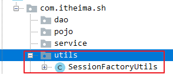

# 1.使用JSTL标签库的c:foreach遍历集合(掌握)

## 1.遍历map集合

~~~jsp
<%@ taglib prefix="c" uri="http://java.sun.com/jsp/jstl/core" %>
<%@ page import="java.util.HashMap" %><%--
  Created by IntelliJ IDEA.
  User: tiansuo
  Date: 2020-11-23
  Time: 8:37
  To change this template use File | Settings | File Templates.
--%>
<%@ page contentType="text/html;charset=UTF-8" language="java" %>
<html>
<head>
    <title>Title</title>
</head>
<body>
    <%--遍历map集合--%>
    <%--脚本片段--%>
    <%
        //1.创建map集合
        HashMap<String, String> hm = new HashMap<String, String>();
        //2.添加数据
        hm.put("001","湖人队");
        hm.put("002","勇士队");
        hm.put("003","马刺队");
        hm.put("004","猛龙队");
        //3.将map集合存储到域对象中
        request.setAttribute("map",hm);
    %>

    <%--使用jstl标签遍历map集合--%>
    <%--
        1.items="${requestScope.map}" 表示从request域对象中获取map集合
        2.var="entry" entry表示map集合中的每个键值对对象
    --%>
    <c:forEach items="${requestScope.map}" var="entry">
        key:${entry.key},value:${entry.value} 
    </c:forEach>
</body>
</html>

~~~

结果：

小结：

使用JSTL的c:foreach标签遍历map集合，var中保存的是键值对整体对象，**我们需要使用var的属性值.key获取map集合的键，使用var的属性值.value获取map集合值。**

## 2.**遍历实体类对象list集合；** 开发经常使用

步骤：

1.创建一个实体类Product

~~~java
package com.itheima.sh.a_jstl_01;
//1.创建一个实体类Product
public class Product {
    private String pname;
    private double price;

    public Product() {
    }

    public Product(String pname, double price) {
        this.pname = pname;
        this.price = price;
    }

    public String getPname() {
        return pname;
    }

    public void setPname(String pname) {
        this.pname = pname;
    }

    public double getPrice() {
        return price;
    }

    public void setPrice(double price) {
        this.price = price;
    }

    @Override
    public String toString() {
        return "Product{" +
                "pname='" + pname + '\'' +
                ", price=" + price +
                '}';
    }
}

~~~

2.创建一个servlet，将数据封装到实体类中，然后将多个实体类对象放到list集合中，最后将list集合放到request中

~~~java
package com.itheima.sh.a_jstl_01;

import javax.servlet.ServletException;
import javax.servlet.annotation.WebServlet;
import javax.servlet.http.HttpServlet;
import javax.servlet.http.HttpServletRequest;
import javax.servlet.http.HttpServletResponse;
import java.io.IOException;
import java.util.ArrayList;
import java.util.Collections;

@WebServlet("/productListServlet")
public class ProductListServlet extends HttpServlet {
    protected void doPost(HttpServletRequest request, HttpServletResponse response) throws ServletException, IOException {
        doGet(request, response);
    }

    protected void doGet(HttpServletRequest request, HttpServletResponse response) throws ServletException, IOException {
        /*
            2.创建一个servlet，将数据封装到实体类中，然后将多个实体类对象放到list集合中，最后将list集合放到request中
         */
        //将数据封装到实体类中
        Product p1 = new Product("笔记本", 9999);
        Product p2 = new Product("手机", 5999);
        Product p3 = new Product("电视机", 3999);

        //然后将多个实体类对象放到list集合中
        ArrayList<Product> list = new ArrayList<Product>();
        Collections.addAll(list, p1, p2, p3);

        //最后将list集合放到request中
        request.setAttribute("products",list);

        //转发到jsp页面
        request.getRequestDispatcher("/productList.jsp").forward(request,response);
    }
}

~~~

3.创建jsp页面，在该页面中取出list数据并显示页面

~~~jsp
<%@ taglib prefix="c" uri="http://java.sun.com/jsp/jstl/core" %>
<%--
  Created by IntelliJ IDEA.
  User: tiansuo
  Date: 2020-11-23
  Time: 8:52
  To change this template use File | Settings | File Templates.
--%>
<%@ page contentType="text/html;charset=UTF-8" language="java" %>
<html>
<head>
    <title>Title</title>
</head>
<body>
    <%--3.创建jsp页面，在该页面中取出list数据并显示页面--%>
    <%--
        1.items="${requestScope.products}"  表示获取request中的集合对象即 request.setAttribute("products",list);
        2.var="p" 表示list集合中每个商品对象

        3.${p.pname} p表示商品对象，p.pname底层调用了Product实体类中的getPname()方法
    --%>
    <c:forEach items="${requestScope.products}" var="p">
        商品名:${p.pname},惊爆价:${p.price} 
    </c:forEach>
</body>
</html>

~~~

小结：

使用c:foreach标签遍历list集合中的实体类对象，var中的属性值就是list集合的每个实体类对象，然后使用实体类**对象调用实体类的成员变量名即可获取数据，其实调用的是实体类的get方法。**

# 2.MVC模式和JSP的发展

## 1.MVC设计模式(掌握)

MVC设计模式是一种思想，不仅仅使用在java中。

> 1.M:model 模型
>
> 2.V:View 视图
>
> 3.C:Controller 控制器

小结：

1.M:model 模型 ，操作数据

2.V:View 视图 ，显示数据

3.C:Controller 控制器，负责分发和控制

## 2.JSP发展了解

model1时代：jsp刚开始诞生的时候所有的代码都放到jsp中。例如：操作数据库的jdbc,显示数据等

model2时代：基于mvc设计模式的思想。jsp只是用来作为视图显示数据的，使用servlet负责进行分发或者控制，model模型即业务层、dao层、实体( javabean )

## 3.面向接口编程思想

思想就是体现的是 ：

​	高内聚：关注具体的每个层

​	低耦合：降低耦合度，依赖关系。

为什么要使用接口编程？

1.先有代码还是先有业务 需求

面向接口编程就是先把客户的业务逻辑先提取出来，作为接口，业务具体实现通过该接口的实现类来完成。

2.编程原则

其遵循的思想是：对扩展开放，对修改关闭。其恰恰就是遵循的是使用接口来实现。当各个类变化时，不需要对已经编写的系统进行改动，添加新的实现类就可以了，不在担心新改动的类对系统的其他模块造成影响。

3.降低耦合性，解耦

耦合就是联系 ，耦合越强，联系越紧密。在程序中紧密的联系并不是一件好的事情，因为两种事物之间联系越紧密，你更换其中之一的难度就越大，扩展功能和debug的难度也就越大。

4.程序扩展性

可扩展性是指当需要为程序添加新的功能时，对其他模块的影响和添加的代价。

# 3.案例-查询所有书籍 课下完成

## 1.效果

点击查询所有书籍按钮，将数据库的所有书籍信息显示到页面中

## 2.实现步骤

1.搭建项目环境

2.创建主页的jsp页面

3.创建servlet接收请求

4.创建业务层，在业务层中使用mybatis调用dao层查询数据库的数据

5.创建dao层，定义方法使用注解向数据库查询数据

6.在展示书籍信息的页面展示所有的书籍

## 3.代码实现

### 1.搭建项目环境

#### 1.1数据库环境

~~~sql
create table book (
	id int primary key auto_increment,
	name varchar(30),
	author varchar(20),
	price double
);

insert into book (name,author,price) values ('红楼梦','曹雪芹',150.36),('西游记','吴承恩',78.29),('JavaEE SSH实战开发','NewBoy',38.8),('三国演义','罗贯中',58.45);

select * from book;
~~~

#### 1.2导包

#### 1.3创建的包

#### 1.4导入配置文件

【1】创建存储配置文件的目录

1）

2）

3）

说明：resources目录相当于src目录。

【2】导入配置文件

#### 1.5导入工具类

~~~java
package com.itheima.sh.utils;

import org.apache.ibatis.io.Resources;
import org.apache.ibatis.session.SqlSession;
import org.apache.ibatis.session.SqlSessionFactory;
import org.apache.ibatis.session.SqlSessionFactoryBuilder;

import java.io.IOException;
import java.io.InputStream;

/**
 * @author tiansuo
 * @date 2019-11-12 10:02
 *  会话工厂工具类
        1. 通过静态方法得到一个工厂对象
        2. 通过静态方法得到会话对象
 *
 */
public class SessionFactoryUtils {
    //声明一个工厂对象
    private static SqlSessionFactory factory;
    //在静态代码块中创建会话工厂
    static {
        SqlSessionFactoryBuilder builder = new SqlSessionFactoryBuilder();
        //得到输入流
        try(InputStream inputStream = Resources.getResourceAsStream("mybatis-config.xml");) {
            factory = builder.build(inputStream);
        } catch (IOException e) {
            e.printStackTrace();
        }
    }
    /**
     静态方法得到会话工厂
     */
    public static SqlSessionFactory getSessionFactory() {
        return factory;
    }
    /**
     得到会话对象
     */
    public static SqlSession getSession() {
        return factory.openSession();
    }
}

~~~

#### 1.6标准类

~~~java
package com.itheima.sh.pojo;

public class Book {
    //成员变量
    private Integer id;
    private String name;
    private String author;
    private Double price;
    //构造方法

    public Book() {
    }

    //成员方法

    public Integer getId() {
        return id;
    }

    public void setId(Integer id) {
        this.id = id;
    }

    public String getName() {
        return name;
    }

    public void setName(String name) {
        this.name = name;
    }

    public String getAuthor() {
        return author;
    }

    public void setAuthor(String author) {
        this.author = author;
    }

    public Double getPrice() {
        return price;
    }

    public void setPrice(Double price) {
        this.price = price;
    }

    @Override
    public String toString() {
        return "Book{" +
                "id=" + id +
                ", name='" + name + '\'' +
                ", author='" + author + '\'' +
                ", price=" + price +
                '}';
    }
}

~~~

### 2.创建主页的jsp页面

~~~jsp
<%@ page contentType="text/html;charset=UTF-8" language="java" %>
<html>
<head>
    <title>Title</title>
    
</head>
<body>
<a href="/queryAllServlet">查询所有的书籍</a>
</body>
</html>

~~~

### 3.创建servlet接收请求

~~~java
package com.itheima.sh.web;

import com.itheima.sh.pojo.Book;

import javax.servlet.ServletException;
import javax.servlet.annotation.WebServlet;
import javax.servlet.http.HttpServlet;
import javax.servlet.http.HttpServletRequest;
import javax.servlet.http.HttpServletResponse;
import java.io.IOException;
import java.util.List;

@WebServlet("/queryAllServlet")
public class QueryAllServlet extends HttpServlet {
    protected void doPost(HttpServletRequest request, HttpServletResponse response) throws ServletException, IOException {
        doGet(request, response);
    }

    protected void doGet(HttpServletRequest request, HttpServletResponse response) throws ServletException, IOException {
        //1.创建业务层对象
        UserService userService = new UserService();
        //2.使用业务层对象调用查询所有书籍的方法,返回list集合
        List<Book> list =  userService.queryAllBooks();
        //3.将list集合放到request中
        request.setAttribute("bookList",list);
        //4.转发到展示书籍jsp页面list.jsp
        request.getRequestDispatcher("/list.jsp").forward(request,response);
    }
}

~~~

### 4.service层

创建业务层，在业务层中使用mybatis调用dao层查询数据库的数据

~~~java
package com.itheima.sh.service;

import com.itheima.sh.pojo.Book;
import com.itheima.sh.utils.SessionFactoryUtils;
import org.apache.ibatis.session.SqlSession;

import java.util.List;

public class UserService {
    //创建业务层，在业务层中使用mybatis调用dao层查询数据库的数据
    public List<Book> queryAllBooks() {
        //1.使用工具类获取mybatis中的session
        SqlSession session = SessionFactoryUtils.getSession();
        //2.使用session会话对象调用方法获取接口代理对象
        BookMapper mapper = session.getMapper(BookMapper.class);
        //3.使用接口代理对象调用方法获取所有的书籍存储到list集合中
        List<Book> list = mapper.queryAllBooks();
        //4.返回list集合给web层
        return list;
    }
}

~~~

### 5.dao层

创建dao层，定义方法使用注解向数据库查询数据

~~~java
package com.itheima.sh.dao;

import com.itheima.sh.pojo.Book;
import org.apache.ibatis.annotations.Select;

import java.util.List;

public interface BookMapper {
    //查询所有的书籍
    @Select("select * from book")
    List<Book> queryAllBooks();
}

~~~

### 6.在展示书籍信息的页面展示所有的书籍

~~~jsp
<%@ taglib prefix="c" uri="http://java.sun.com/jsp/jstl/core" %>
<%@ page contentType="text/html;charset=UTF-8" language="java" %>
<html>
<head>
    <title>Title</title>
    
</head>
<body>
<table border="1px" cellspacing="0" width="600">
    <caption><h2>书籍列表</h2></caption>
    <tr>
        <th>编号</th>
        <th>书籍名称</th>
        <th>作者</th>
        <th>价格</th>
    </tr>
    <%--使用jstl结合EL从后台queryAllServlet的reques域对象中取出数据--%>
    <%--tr>td*4 按tab--%>
    <c:forEach items="${requestScope.bookList}" var="book">
        <tr>
            <td>${book.id}</td>
            <td>${book.name}</td>
            <td>${book.author}</td>
            <td>${book.price}</td>
        </tr>
    </c:forEach>
</table>
</body>
</html>
~~~

小结：

使用jstl+el获取list集合中的数据显示到页面中。

# 4.Java Web的三大组件 掌握

| **组件**     | **作用**                                                     | **实现接口**                                  |
| ------------ | ------------------------------------------------------------ | --------------------------------------------- |
| **Servlet**  | 小应用程序，在JavaWeb的服务器中主要做为控制器来使用  可以处理用户的请求并且做出响应 | javax.servlet.Servlet                         |
| **Filter**   | 过滤器，对用户发送的请求或响应进行集中处理，实现请求的拦截   | javax.servlet.Filter                          |
| **Listener** | 监听器，在某些框架中会使用到监听器，如：Spring框架  在Web执行过程中，引发一些事件，对相应事件进行处理。主要是监听Servlet的3大域对象的创建销毁以及属性的变化 | javax.servlet.XxxListener  每个事件有一个接口 |

# 5.过滤器介绍 理解

1.Filter属于一个接口

2.作用：用来过滤动态资源(servlet jsp)和静态资源(html)

补充：过滤器作用：

说明：

1.如果过滤器放行则可以访问服务器的资源

2.如过滤器不放行则不让浏览器访问服务器资源

# 6.过滤器开发入门(掌握)

## 1.过滤器API介绍

Filter表示过滤器接口，我们想使用该接口必须自定义类实现接口并实现该接口中的所有抽象方法。

| 方法                                                         | 说明                                               |
| ------------------------------------------------------------ | -------------------------------------------------- |
| void  init(FilterConfig  filterConfig)                       | 过滤器对象创建的时候调用的方法                     |
| void doFilter(ServletRequest request, ServletResponse response, FilterChain chain) | 执行过滤的方法，每次访问别拦截的资源都会执行该方法 |
| void destory()                                               | 过滤器销毁的时候调用的方法                         |

## 2.过滤器开发步骤

1.自定义过滤器类实现过滤器接口Filter

2.在自定义类中实现过滤器接口Filter中的所有抽象方法

3.在doFilter方法体中书写拦截资源的代码

​	方法说明：

~~~java
Filter过滤器接口的：
void doFilter(ServletRequest request, ServletResponse response, FilterChain chain)
    	参数：
    		request：表示请求对象，不满足http协议
    		response：表示响应对象，不满足http协议
    		chain：属于FilterChain的接口，表示过滤器链。
    		FilterChain接口中具有一个放行方法：
    	    void doFilter(ServletRequest request, ServletResponse response)  
    			如果放行，希望浏览器可以访问拦截的资源则执行该方法
    			如果不放行，不希望浏览器访问拦截的资源则不执行该方法
~~~

4.配置过滤器

5.访问被拦截的资源

## 3.代码实现

过滤器类：

~~~java
package com.itheima.sh.b_filter_01;

import javax.servlet.*;
import java.io.IOException;

//1.自定义过滤器类实现过滤器接口Filter
public class MyFilter implements Filter{
    //2.在自定义类中实现过滤器接口Filter中的所有抽象方法
    @Override
    public void init(FilterConfig filterConfig) throws ServletException {

    }
    //3.在doFilter方法体中书写拦截资源的代码
    @Override
    public void doFilter(ServletRequest servletRequest, ServletResponse servletResponse, FilterChain filterChain) throws IOException, ServletException {
        System.out.println("执行过滤器了...");
        //不放行
        /*
            Filter过滤器接口的：
                void doFilter(ServletRequest request, ServletResponse response, FilterChain chain)
                        参数：
                            request：表示请求对象，不满足http协议
                            response：表示响应对象，不满足http协议
                            chain：属于FilterChain的接口，表示过滤器链。
                            FilterChain接口中具有一个放行方法：
                            void doFilter(ServletRequest request, ServletResponse response)
                                如果放行，希望浏览器可以访问拦截的资源则执行该方法
                                如果不放行，不希望浏览器访问拦截的资源则不执行该方法
         */
        //放行
        filterChain.doFilter(servletRequest,servletResponse);
    }

    @Override
    public void destroy() {

    }
}

~~~

说明：

 1.如果放行，希望浏览器可以访问拦截的资源则执行该方法：

​    filterChain.doFilter(servletRequest,servletResponse);

2.如果不放行，不希望浏览器访问拦截的资源则不执行该方法

web.xml

~~~xml
<?xml version="1.0" encoding="UTF-8"?>
<web-app xmlns="http://java.sun.com/xml/ns/javaee"
           xmlns:xsi="http://www.w3.org/2001/XMLSchema-instance"
           xsi:schemaLocation="http://java.sun.com/xml/ns/javaee
		  http://java.sun.com/xml/ns/javaee/web-app_3_1.xsd"
           version="3.1">

    <!--配置过滤器-->
    <!--表示关联的过滤器类-->
    <filter>
        <filter-name>myFilter</filter-name>
        <!--过滤器类的全路径，底层获取这里使用反射技术调用无参构造方法创建过滤器类的对象-->
        <filter-class>com.itheima.sh.b_filter_01.MyFilter</filter-class>
    </filter>

    <filter-mapping>
        <filter-name>myFilter</filter-name>
        <!--配置被拦截的资源-->
        <url-pattern>/filter01.html</url-pattern>
    </filter-mapping>
</web-app>

~~~

被拦截的页面：

~~~xml
<!DOCTYPE html>
<html lang="en">
<head>
    <meta charset="UTF-8">
    <title>Title</title>
</head>
<body>
    <h1>来拦截我啊</h1>
</body>
</html>
~~~

小结：

1.配置过滤器有两种方式：

1）xml版本：

~~~xml
  <!--配置过滤器-->
    <!--表示关联的过滤器类-->
    <filter>
        <filter-name>myFilter</filter-name>
        <!--过滤器类的全路径，底层获取这里使用反射技术调用无参构造方法创建过滤器类的对象-->
        <filter-class>com.itheima.sh.b_filter_01.MyFilter</filter-class>
    </filter>

    <filter-mapping>
        <filter-name>myFilter</filter-name>
        <!--配置被拦截的资源-->
        <url-pattern>/filter01.html</url-pattern>
    </filter-mapping>
~~~

2)注解版本配置

使用注解必须去掉xml版本。

## 4.过滤器入门练习(课下完成)

### 1.需求

**需求：实现横刀夺爱案例来应用过滤器**：

案例描述：新建表单，用input标签提交数据，如果表单提交数据中含有"love me"，不让servlet接收。

案例步骤：

​	a:新建servlet，接收表单提交数据，含有"love me",就输出"我们结婚吧"。

​	b:新建filter，在doFilter()之前判断表单提交的数据是否含有"love me"，有的话，拦截，并输出，"抢走新娘"

### 2.步骤

1.创建一个html页面

2.创建servlet

3.创建过滤器Filter,拦截是Servlet

### 3.实现

#### 3.1.创建一个html页面

~~~html
<!DOCTYPE html>
<html lang="en">
<head>
    <meta charset="UTF-8">
    <title>Title</title>
</head>
<body>
<form action="/marryServlet" method="post">
    女神：<input type="text" name="word"> 
    <input type="submit" value="发短信">
</form>
</body>
</html>
~~~

#### 3.2.创建servlet

~~~java
package com.itheima.sh.b_filter_01;

import javax.servlet.ServletException;
import javax.servlet.annotation.WebServlet;
import javax.servlet.http.HttpServlet;
import javax.servlet.http.HttpServletRequest;
import javax.servlet.http.HttpServletResponse;
import java.io.IOException;

@WebServlet("/marryServlet")
public class MarryServlet extends HttpServlet {
    protected void doPost(HttpServletRequest request, HttpServletResponse response) throws ServletException, IOException {
        doGet(request, response);
    }

    protected void doGet(HttpServletRequest request, HttpServletResponse response) throws ServletException, IOException {
        //接收表单提交数据，含有"love me",就输出"我们结婚吧"。
        //1.处理请求乱码
        request.setCharacterEncoding("utf-8");
        //处理响应乱码
        response.setContentType("text/html;charset=utf-8");
        //2.获取数据
        String word = request.getParameter("word");
        //3.判断接收的数据中是否含有 love me，如果含有则输出我们结婚吧 不含有则算了吧
        if(word.contains("loveme")){
            response.getWriter().print("我们结婚吧....");
        }else{
            response.getWriter().print("算了吧，没车没房....");
        }
    }
}

~~~

#### 3.3.创建过滤器Filter,拦截是Servlet

【1】创建Filter

【2】修改模板

~~~java
#if (${PACKAGE_NAME} && ${PACKAGE_NAME} != "")package ${PACKAGE_NAME};#end
#parse("File Header.java")
@javax.servlet.annotation.WebFilter("/${Entity_Name}")
public class ${Class_Name} implements javax.servlet.Filter {
    public void destroy() {
    }

    public void doFilter(javax.servlet.ServletRequest req, javax.servlet.ServletResponse resp, javax.servlet.FilterChain chain) throws javax.servlet.ServletException, java.io.IOException {
        javax.servlet.http.HttpServletRequest request = (javax.servlet.http.HttpServletRequest)req;
        javax.servlet.http.HttpServletResponse response = (javax.servlet.http.HttpServletResponse)resp;
        chain.doFilter(request, response);
    }

    public void init(javax.servlet.FilterConfig config) throws javax.servlet.ServletException {

    }

}

~~~

【3】

代码实现：

~~~java
package com.itheima.sh.b_filter_01;

import javax.servlet.*;
import javax.servlet.annotation.WebFilter;
import javax.servlet.http.HttpServletRequest;
import javax.servlet.http.HttpServletResponse;
import java.io.IOException;
/*
    这里配置的是被拦截的资源路径
 */
@WebFilter("/marryServlet")
public class MarryFilter implements Filter {
    public void destroy() {
    }
    /*
        	b:新建filter，在doFilter()之前判断表单提交的数据是否含有"love me"，有的话，拦截，并输出，"抢走新娘"
     */
    public void doFilter(ServletRequest req, ServletResponse resp, FilterChain chain) throws ServletException, IOException {
        HttpServletRequest request = (HttpServletRequest) req;
        HttpServletResponse response = (HttpServletResponse) resp;
        
        //1.处理请求乱码
        request.setCharacterEncoding("utf-8");
        //2.处理响应乱码
        response.setContentType("text/html;charset=utf-8");
        //3.获取请求数据
        String word = request.getParameter("word");
        //4.判断请求数据是否含有loveme,
        if(word.contains("loveme")){
            //有的话，拦截，并输出，"抢走新娘".
            response.getWriter().print("抢走新娘..我是丈母娘，没车没房，结什么婚..");
        }else{
            //没有，则放行可以访问被拦截的资源marryServlet
            chain.doFilter(request, response);
        }
    }

    public void init(FilterConfig config) throws ServletException {

    }

}

~~~

小结：

1.如果过滤器让浏览器访问被拦截的资源需要放行：

~~~java
 chain.doFilter(request, response);
~~~

2.如果过滤器不让浏览器访问被拦截的资源需要不放行，不执行代码：

~~~java
 chain.doFilter(request, response);
~~~

# 7.过滤器的执行流程

## 1.一个过滤器的执行流程

~~~java
package com.itheima.sh.c_process_filter;

import javax.servlet.*;
import javax.servlet.annotation.WebFilter;
import javax.servlet.http.HttpServletRequest;
import javax.servlet.http.HttpServletResponse;
import java.io.IOException;

@WebFilter("/processDemo01Servlet")
public class ProcessFilter implements Filter {
    public void destroy() {
    }

    public void doFilter(ServletRequest req, ServletResponse resp, FilterChain chain) throws ServletException, IOException {
        HttpServletRequest request = (HttpServletRequest) req;
        HttpServletResponse response = (HttpServletResponse) resp;
        System.out.println("放行前。。。。ProcessFilter");
        chain.doFilter(request, response);
        System.out.println("放行后。。。。ProcessFilter");
    }

    public void init(FilterConfig config) throws ServletException {

    }

}

~~~

~~~java
package com.itheima.sh.c_process_filter;

import javax.servlet.ServletException;
import javax.servlet.annotation.WebServlet;
import javax.servlet.http.HttpServlet;
import javax.servlet.http.HttpServletRequest;
import javax.servlet.http.HttpServletResponse;
import java.io.IOException;

@WebServlet("/processDemo01Servlet")
public class ProcessDemo01Servlet extends HttpServlet {
    protected void doPost(HttpServletRequest request, HttpServletResponse response) throws ServletException, IOException {
        doGet(request, response);
    }

    protected void doGet(HttpServletRequest request, HttpServletResponse response) throws ServletException, IOException {
        System.out.println("servlet....");
    }
}

~~~

小结：

1.如果浏览器访问被拦截的资源会先执行过滤器，如果放行在执行被拦截的资源。然后执行完被拦截的资源在执行过滤器，响应给浏览器

2.过滤器中的请求和响应和servlet的请求和响应是同一个对象

## 2.多个Filter执行顺序

~~~java
package com.itheima.sh.c_process_filter;

import javax.servlet.*;
import javax.servlet.annotation.WebFilter;
import javax.servlet.http.HttpServletRequest;
import javax.servlet.http.HttpServletResponse;
import java.io.IOException;

@WebFilter("/apple")
public class AFilter implements Filter {
    public void destroy() {
    }

    public void doFilter(ServletRequest req, ServletResponse resp, FilterChain chain) throws ServletException, IOException {
        HttpServletRequest request = (HttpServletRequest) req;
        HttpServletResponse response = (HttpServletResponse) resp;
        System.out.println("AFilter....放行前");
        chain.doFilter(request, response);
        System.out.println("AFilter....放行后");
    }

    public void init(FilterConfig config) throws ServletException {

    }

}

~~~

~~~java
package com.itheima.sh.c_process_filter;

import javax.servlet.*;
import javax.servlet.annotation.WebFilter;
import javax.servlet.http.HttpServletRequest;
import javax.servlet.http.HttpServletResponse;
import java.io.IOException;

@WebFilter("/apple")
public class BFilter implements Filter {
    public void destroy() {
    }

    public void doFilter(ServletRequest req, ServletResponse resp, FilterChain chain) throws ServletException, IOException {
        HttpServletRequest request = (HttpServletRequest) req;
        HttpServletResponse response = (HttpServletResponse) resp;
        System.out.println("BFilter....放行前");
        chain.doFilter(request, response);
        System.out.println("BFilter....放行后");
    }

    public void init(FilterConfig config) throws ServletException {

    }

}

~~~

~~~java
package com.itheima.sh.c_process_filter;

import javax.servlet.ServletException;
import javax.servlet.annotation.WebServlet;
import javax.servlet.http.HttpServlet;
import javax.servlet.http.HttpServletRequest;
import javax.servlet.http.HttpServletResponse;
import java.io.IOException;

@WebServlet("/apple")
public class AppleServlet extends HttpServlet {
    protected void doPost(HttpServletRequest request, HttpServletResponse response) throws ServletException, IOException {
        doGet(request, response);
    }

    protected void doGet(HttpServletRequest request, HttpServletResponse response) throws ServletException, IOException {
        System.out.println("AppleServlet....");
    }
}

~~~

小结：

1.**如果同一个包下**，**多个过滤器拦截同一个资源**，那么按照过滤器类的名字字母升序来依次执行

2.执行完拦截资源后依次在按照相反顺序执行

# 8.Filter的生命周期 掌握

> 1.谁创建
>
> tomcat
>
> 2.何时创建
>
> 启动tomcat服务器立刻创建Filter过滤器对象。使用过滤器类的全限定名，使用反射调用无参构造方法创建过滤器类的对象，然后使用对象立刻调用过滤器的init方法进行初始化
>
> 3.创建对象后做了什么
>
> ​	1）使用对象调用init方法初始化  只执行一次
>
> ​    2）每次访问被拦截的资源都会使用过滤器对象调用过滤器中的doFilter方法

> 4.何时销毁
>
> ​	关闭tomcat服务器销毁，销毁之前使用过滤器对象调用destroy方法。

~~~java
package com.itheima.sh.d_filter_life_04;

import javax.servlet.*;
import javax.servlet.annotation.WebFilter;
import javax.servlet.http.HttpServletRequest;
import javax.servlet.http.HttpServletResponse;
import java.io.IOException;

@WebFilter("/life")
public class LifeDemo01Filter implements Filter {
    //无参构造方法

    public LifeDemo01Filter() {
        System.out.println("过滤器类的构造方法...");
    }

    public void destroy() {
        System.out.println("destroy....");
    }

    public void doFilter(ServletRequest req, ServletResponse resp, FilterChain chain) throws ServletException, IOException {
        HttpServletRequest request = (HttpServletRequest) req;
        HttpServletResponse response = (HttpServletResponse) resp;
        System.out.println("doFilter....前");
        chain.doFilter(request, response);
        System.out.println("doFilter....后");
    }

    public void init(FilterConfig config) throws ServletException {
        System.out.println("init....");
    }

}

~~~

~~~java
package com.itheima.sh.d_filter_life_04;

import javax.servlet.ServletException;
import javax.servlet.annotation.WebServlet;
import javax.servlet.http.HttpServlet;
import javax.servlet.http.HttpServletRequest;
import javax.servlet.http.HttpServletResponse;
import java.io.IOException;

@WebServlet("/life")
public class Life01Servlet extends HttpServlet {
    protected void doPost(HttpServletRequest request, HttpServletResponse response) throws ServletException, IOException {
        doGet(request, response);
    }

    protected void doGet(HttpServletRequest request, HttpServletResponse response) throws ServletException, IOException {
        System.out.println("Life01Servlet......");
    }
}

~~~

# 9.Filter的映射路径 掌握

​	映射路径指的是当前这个Filter需要拦截的路径。这个路径的配置方式有3种：

1. 精确匹配：匹配指定的urlpattern；
2. 模糊匹配：匹配复合条件的一类路径；
3. 多路径匹配：一个filter匹配多个资源；

## 9.1精确匹配

精确匹配：匹配指定的urlpattern；

就是访问什么资源就配置过滤器拦截什么资源。

| 精确匹配                      | 说明                      |
| ----------------------------- | ------------------------- |
| urlPatterns = "/index.jsp"    | 拦截对index.jsp页面的请求 |
| urlPatterns = "/loginServlet" | 拦截对loginServlet的请求  |
| urlPatterns = "/a.jsp"        | 拦截对a.jsp的请求         |

## 9.2模糊匹配

模糊匹配：匹配复合条件的一类路径。

举例：拦截用户模块下面的所有访问路径。过滤器的拦截路径：/user/*

| 模糊匹配               | 使用示例                | 说明                                  |
| ---------------------- | ----------------------- | ------------------------------------- |
| urlPatterns = "/*"     | urlPatterns = "/*"      | **对所有的请求都进行拦截**            |
| urlPatterns = "/xxx/*" | urlPatterns = "/user/*" | 对映射路径中/user下的所有资源进行拦截 |
| urlPatterns = "*.xxx"  | urlPatterns = "*.jsp"   | 对指定后缀的请求进行拦截 **不加/**    |

【1】对所有的请求都进行拦截:

~~~java
package com.itheima.sh.e_filter_path_05;

import javax.servlet.*;
import javax.servlet.annotation.WebFilter;
import javax.servlet.http.HttpServletRequest;
import javax.servlet.http.HttpServletResponse;
import java.io.IOException;

@WebFilter("/*")
public class PathOneFilter implements Filter {
    public void destroy() {
    }

    public void doFilter(ServletRequest req, ServletResponse resp, FilterChain chain) throws ServletException, IOException {
        HttpServletRequest request = (HttpServletRequest) req;
        HttpServletResponse response = (HttpServletResponse) resp;
        System.out.println("我全部拦截");
        chain.doFilter(request, response);
    }
    public void init(FilterConfig config) throws ServletException {
    }
}

~~~

说明：/*表示对所有的请求进行拦截。

## 9.3多个路径匹配

### 1.使用web.xml进行配置

~~~java
package com.itheima.sh.e_filter_path_05;

import javax.servlet.*;
import java.io.IOException;

public class PathTwoFilter implements Filter {
    @Override
    public void init(FilterConfig filterConfig) throws ServletException {

    }

    @Override
    public void doFilter(ServletRequest servletRequest, ServletResponse servletResponse, FilterChain filterChain) throws IOException, ServletException {
        System.out.println("doFilter。。。。");
        //放行
        filterChain.doFilter(servletRequest,servletResponse);
    }

    @Override
    public void destroy() {

    }
}

~~~

~~~xml
 <!--过滤器的多路径匹配-->
    <filter>
        <filter-name>pathTwoFilter</filter-name>
        <filter-class>com.itheima.sh.e_filter_path_05.PathTwoFilter</filter-class>
    </filter>

    <filter-mapping>
        <filter-name>pathTwoFilter</filter-name>
        <!--demo02.jsp-->
        <url-pattern>/demo02.jsp</url-pattern>
        <!--demo03.html-->
        <url-pattern>/demo03.html</url-pattern>
    </filter-mapping>
~~~

### 2.使用注解方式配置

将xml版本删除。

~~~java
package com.itheima.sh.e_filter_path_05;

import javax.servlet.*;
import javax.servlet.annotation.WebFilter;
import java.io.IOException;

//@WebFilter(urlPatterns={"/demo02.jsp","/demo03.html"})
@WebFilter({"/demo02.jsp","/demo03.html"})
public class PathTwoFilter implements Filter {
    @Override
    public void init(FilterConfig filterConfig) throws ServletException {

    }

    @Override
    public void doFilter(ServletRequest servletRequest, ServletResponse servletResponse, FilterChain filterChain) throws IOException, ServletException {
        System.out.println("doFilter。。。。");
        //放行
        filterChain.doFilter(servletRequest,servletResponse);
    }

    @Override
    public void destroy() {

    }
}

~~~

小结：

Filter的映射路径配置有三种：

1.精确匹配  ：就是拦截什么资源就配置具体的资源路径 ：/a.jsp  、 /demo01.html   、 /demoServlet

2.模糊匹配： /*  拦截所有   、  /user/*     *.jsp     * .html  ....

3.多路径匹配：一次可以拦截多个路径

> 1)web.xml
>
> 		<filter-mapping>
> 	    <filter-name>pathTwoFilter</filter-name>
> 	    <!--demo02.jsp-->
> 	    <url-pattern>/demo02.jsp</url-pattern>
> 	    <!--demo03.html-->
> 	    <url-pattern>/demo03.html</url-pattern>
> 	</filter-mapping>
> 2)注解
>
> ​	@WebFilter(urlPatterns={"/demo02.jsp","/demo03.html"})

# 10.过滤器的拦截方式 掌握

## 1.在服务器内部使用请求转发访问的拦截介绍

过滤器的拦截方式有两种：

1.直接从浏览器的请求：默认的。REQUEST

2.在服务器内部使用请求转发访问的：必须配置，默认是不拦截请求转发的。FORWARD

~~~java
package com.itheima.sh.f_filter_method_06;

import javax.servlet.*;
import javax.servlet.annotation.WebFilter;
import javax.servlet.http.HttpServletRequest;
import javax.servlet.http.HttpServletResponse;
import java.io.IOException;

@WebFilter("/methodDemo02Servlet")
public class Method01Filter implements Filter {
    public void destroy() {
    }

    public void doFilter(ServletRequest req, ServletResponse resp, FilterChain chain) throws ServletException, IOException {
        HttpServletRequest request = (HttpServletRequest) req;
        HttpServletResponse response = (HttpServletResponse) resp;
        System.out.println("该过滤器拦截methodDemo02Servlet。。。");
        //不放行，不能访问methodDemo02Servlet
        //chain.doFilter(request, response);
    }

    public void init(FilterConfig config) throws ServletException {

    }

}

~~~

~~~java
package com.itheima.sh.f_filter_method_06;

import javax.servlet.ServletException;
import javax.servlet.annotation.WebServlet;
import javax.servlet.http.HttpServlet;
import javax.servlet.http.HttpServletRequest;
import javax.servlet.http.HttpServletResponse;
import java.io.IOException;

@WebServlet("/methodDemo01Servlet")
public class MethodDemo01Servlet extends HttpServlet {
    protected void doPost(HttpServletRequest request, HttpServletResponse response) throws ServletException, IOException {
        doGet(request, response);
    }

    protected void doGet(HttpServletRequest request, HttpServletResponse response) throws ServletException, IOException {
        System.out.println("methodDemo01Servlet...");
        //请求 转发到methodDemo02Servlet
        request.getRequestDispatcher("/methodDemo02Servlet").forward(request,response);
    }
}

~~~

~~~java
package com.itheima.sh.f_filter_method_06;

import javax.servlet.ServletException;
import javax.servlet.annotation.WebServlet;
import javax.servlet.http.HttpServlet;
import javax.servlet.http.HttpServletRequest;
import javax.servlet.http.HttpServletResponse;
import java.io.IOException;

@WebServlet("/methodDemo02Servlet")
public class MethodDemo02Servlet extends HttpServlet {
    protected void doPost(HttpServletRequest request, HttpServletResponse response) throws ServletException, IOException {
        doGet(request, response);
    }

    protected void doGet(HttpServletRequest request, HttpServletResponse response) throws ServletException, IOException {
        System.out.println("methodDemo02Servlet....");
    }
}

~~~

浏览器访问：

控制台输出：

通过上述结果我们发现在methodDemo01Servlet请求转发到methodDemo02Servlet，并且在过滤器中对methodDemo02Servlet进行拦截，没有拦截到。因为过滤器默认是不拦截请求转发的，只拦截从浏览器的请求。

## 2.在过滤器中配置拦截服务器内部的请求转发

配置方式有两种：

### 1.web.xml配置

~~~XML
<!--过滤器的拦截方式-->
    <filter>
        <filter-name>method01Filter</filter-name>
        <filter-class>com.itheima.sh.f_filter_method_06.Method01Filter</filter-class>
    </filter>

    <filter-mapping>
        <filter-name>method01Filter</filter-name>
        <url-pattern>/methodDemo02Servlet</url-pattern>
        <!--拦截转发的-->
        <!--
            注意：如果只配置转发的拦截，那么浏览器的请求就不会拦截了
        -->
        <dispatcher>FORWARD</dispatcher>

        <!--配置拦截浏览器-->
        <dispatcher>REQUEST</dispatcher>
    </filter-mapping>
~~~

### 2.注解配置 掌握

注意：一定删除xml版本。

~~~java
package com.itheima.sh.f_filter_method_06;

import javax.servlet.*;
import javax.servlet.annotation.WebFilter;
import javax.servlet.http.HttpServletRequest;
import javax.servlet.http.HttpServletResponse;
import java.io.IOException;
/*
	1.dispatcherTypes:表示拦截方式
	2.DispatcherType.FORWARD： DispatcherType属于枚举类型，表示拦截转发
	3.DispatcherType.REQUEST 拦截浏览器的请求

*/
@WebFilter(urlPatterns = "/methodDemo02Servlet",dispatcherTypes = {DispatcherType.FORWARD,DispatcherType.REQUEST})
public class Method01Filter implements Filter {
    public void destroy() {
    }

    public void doFilter(ServletRequest req, ServletResponse resp, FilterChain chain) throws ServletException, IOException {
        HttpServletRequest request = (HttpServletRequest) req;
        HttpServletResponse response = (HttpServletResponse) resp;
        System.out.println("该过滤器拦截methodDemo02Servlet。。。");
        //不放行，不能访问methodDemo02Servlet
        //chain.doFilter(request, response);
    }

    public void init(FilterConfig config) throws ServletException {

    }

}

~~~

小结：

1.直接从浏览器的请求：默认的。REQUEST

2.在服务器内部使用请求转发访问的：必须配置，默认是不拦截请求转发的。FORWARD

​	1）web.xml

​	2)注解版本配置：

3.要配置，对于转发和浏览器的请求必须都得配置。

# 11.Filter应用案例（课下完成）

## 1.Filter统一解决全站乱码问题

我们之前在不同的servlet中都是针对于post请求都要书写处理请求乱码的代码：

~~~java
request.setCharacterEncoding("utf-8");
~~~

在不同的servlet中处理响应乱码都要书写：

~~~java
response.setContentType("text/html;charset=utf-8");
~~~

这样在每个servlet中书写代码，代码会很冗余，所以我们可以将处理post请求和响应的乱码的代码书写在过滤器中，然后在过滤器中拦截所有的资源 ： /*  这样访问当前所有的资源都会先执行该过滤器，会处理乱码。

~~~jsp
<%@ page contentType="text/html;charset=UTF-8" language="java" %>
<html>
<head>
    <title>form</title>
</head>
<body>
<form action="/registerServlet" method="post">
    用户名：<input type="text" name="name"> 
    密码：<input type="password" name="password"> 
    <input type="submit" value="提交">
</form>
</body>
</html>
~~~

~~~java
package com.itheima.sh.g_filter_test_07;

import javax.servlet.*;
import javax.servlet.annotation.WebFilter;
import javax.servlet.http.HttpServletRequest;
import javax.servlet.http.HttpServletResponse;
import java.io.IOException;

@WebFilter("/*")
public class EncodingFilter implements Filter {
    public void destroy() {
    }

    public void doFilter(ServletRequest req, ServletResponse resp, FilterChain chain) throws ServletException, IOException {
        HttpServletRequest request = (HttpServletRequest) req;
        HttpServletResponse response = (HttpServletResponse) resp;
        //处理请求的乱码
        request.setCharacterEncoding("utf-8");
        //处理响应的乱码
        response.setContentType("text/html;charset=utf-8");
        chain.doFilter(request, response);
    }

    public void init(FilterConfig config) throws ServletException {

    }

}

~~~

~~~java
package com.itheima.sh.g_filter_test_07;

import javax.servlet.ServletException;
import javax.servlet.annotation.WebServlet;
import javax.servlet.http.HttpServlet;
import javax.servlet.http.HttpServletRequest;
import javax.servlet.http.HttpServletResponse;
import java.io.IOException;

@WebServlet("/registerServlet")
public class RegisterServlet extends HttpServlet {
    protected void doPost(HttpServletRequest request, HttpServletResponse response) throws ServletException, IOException {
        doGet(request, response);
    }

    protected void doGet(HttpServletRequest request, HttpServletResponse response) throws ServletException, IOException {
        //1.获取数据
        String name = request.getParameter("name");
        String password = request.getParameter("password");
        System.out.println("name = " + name);
        System.out.println("password = " + password);
        //2.响应数据
        response.getWriter().print("黑马程序员");
    }
}

~~~

小结：

使用EncodingFilter过滤器拦截所有的请求资源路径，这样可以处理请求和响应的乱码问题。

## 2.过滤器案例--登录权限校验

### 2.1【需求】

1. 登录之后：能够访问hack.html，然后下载黑客视频资源，成为NB黑客；
2. 未登录：跳转到登录页面，并提示"请先登录"；
3. 我们对hack.html页面进行过滤，

详细描述：

1.页面：hack.html 访问这个页面要求必须先登录，不登录不能访问，使用过滤器书写代码让其跳转到登录页面login.html.

2.登录LoginServlet中获取用户名和密码，存放到User对象中，然后在session中。最后重定向到hack.html 

3.使用一个过滤器对hack.html 进行拦截，先从session中获取用户信息，如果没有登录，获取的是null。跳转到登录页面。如果不为null，说明登录了，可以访问hack.html。

### 2.2步骤

1.创建一个hack.html页面

~~~html
<!DOCTYPE html>
<html lang="en">
<head>
    <meta charset="UTF-8">
    <title>Title</title>
</head>
<body>
    <h1><a href="javascript:">下载黑客视频资源，成为NB黑客</a></h1>
</body>
</html>
~~~

2.创建login.html页面

~~~html
<!DOCTYPE html>
<html lang="en">
<head>
    <meta charset="UTF-8">
    <title>Title</title>
</head>
<body>
    <form action="/loginServlet" method="post">
        用户名：<input type="text" name="name"> 
        密码：<input type="password" name="password"> 
        <input type="submit" value="登录">
    </form>
</body>
</html>
~~~

3.创建LoginServlet，接收从login.html页面请求数据。将请求数据即用户名和密码封装到实体类对象，并存储到session会话对象中，重定向到hack.html页面

~~~java
package com.itheima.sh.g_filter_test_07;

public class User {

    private String name;
    private String password;

    public User() {
    }

    public String getName() {
        return name;
    }

    public void setName(String name) {
        this.name = name;
    }

    public String getPassword() {
        return password;
    }

    public void setPassword(String password) {
        this.password = password;
    }

    @Override
    public String toString() {
        return "User{" +
                "name='" + name + '\'' +
                ", password='" + password + '\'' +
                '}';
    }
}

~~~

~~~java
package com.itheima.sh.g_filter_test_07;

import javax.servlet.ServletException;
import javax.servlet.annotation.WebServlet;
import javax.servlet.http.HttpServlet;
import javax.servlet.http.HttpServletRequest;
import javax.servlet.http.HttpServletResponse;
import javax.servlet.http.HttpSession;
import java.io.IOException;

@WebServlet("/loginServlet")
public class LoginServlet extends HttpServlet {
    protected void doPost(HttpServletRequest request, HttpServletResponse response) throws ServletException, IOException {
        doGet(request, response);
    }

    protected void doGet(HttpServletRequest request, HttpServletResponse response) throws ServletException, IOException {
        //3.创建LoginServlet，
        //接收从login.html页面请求数据。
        String name = request.getParameter("name");
        String password = request.getParameter("password");
        //将请求数据即用户名和密码封装到实体类对象，
        User user = new User();
        user.setName(name);
        user.setPassword(password);
        //并存储到session会话对象中
        HttpSession session = request.getSession();
        session.setAttribute("u",user);
        //重定向到hack.html页面
        response.sendRedirect("/hack.html");

    }
}

~~~

4.创建过滤器，拦截hack.html.在该过滤器中获取session中数据，判断是否含有数据，如果没有，说明没有登录，跳转到登录页面，如果登录了则放行可以访问hack.html页面

~~~java
package com.itheima.sh.g_filter_test_07;

import javax.servlet.*;
import javax.servlet.annotation.WebFilter;
import javax.servlet.http.HttpServletRequest;
import javax.servlet.http.HttpServletResponse;
import java.io.IOException;

//4.创建过滤器，拦截hack.html.
@WebFilter("/hack.html")
public class LoginFilter implements Filter {
    public void destroy() {
    }

    public void doFilter(ServletRequest req, ServletResponse resp, FilterChain chain) throws ServletException, IOException {
        HttpServletRequest request = (HttpServletRequest) req;
        HttpServletResponse response = (HttpServletResponse) resp;
        //在该过滤器中获取session中数据， session.setAttribute("u",user);
        User user = (User) request.getSession().getAttribute("u");
        // 判断是否含有数据，
        if (user == null) {
            // 如果没有，说明没有登录，跳转到登录页面
            response.sendRedirect("/login.html");
        } else {
            //如果登录了则放行可以访问hack.html页面
            chain.doFilter(request, response);
        }
    }

    public void init(FilterConfig config) throws ServletException {

    }

}

~~~

# 12.监听器 掌握

## 1.介绍

监听器，在某些框架中会使用到监听器，如：Spring框架  在Web执行过程中，引发一些事件，对相应事件进行处理。主要是监听Servlet的3大域对象(request session servletContext)的创建销毁以及属性的变化。

~~~java
1)域对象的创建和销毁
2)域对象中属性添加、删除和修改
~~~

## 2.分类

| **事件源**             | **监听器接口**                  | **时机**                 |
| ---------------------- | ------------------------------- | ------------------------ |
| **ServletContext**     | ServletContextListener          | 上下文域创建和销毁       |
| **ServletContext**     | ServletContextAttributeListener | 上下文域属性增删改的操作 |
| **HttpSession **       | HttpSessionListener             | 会话域创建和销毁         |
| **HttpSession **       | HttpSessionAttributeListener    | 会话域属性增删改的操作   |
| **HttpServletRequest** | ServletRequestListener          | 请求域创建和销毁         |
| **HttpServletRequest** | ServletRequestAttributeListener | 请求域属性增删改的操作   |

说明：这里重点讲解ServletContextListener 监听器。监听上下文域创建和销毁。

回顾：

ServletContext是在tomcat服务器启动的时候创建的。ServletContext是在关闭tomcat服务器的时候销毁的。

## 3.ServletContextListener

监听上下文域ServletContext对象的创建和销毁。

1.ServletContextListener属于一个接口

2.ServletContextListener该监听器用来监听ServletContext对象的创建和销毁的

3.我们想使用该监听器接口必须自定义实现类实现该接口并实现接口中的所有的抽象方法

4.ServletContextListener接口中的方法：

| **接口中的方法**                                      | **功能**                    |
| ----------------------------------------------------- | --------------------------- |
| **void contextDestroyed(ServletContextEvent sce)**    | 上下文域销毁的时候执行1次   |
| **void contextInitialized(ServletContextEvent  sce)** | 上下文域初始化的时候执行1次 |

5.上述方法的参数类型ServletContextEvent ，属于一个事件类，该类用于通知当前项目的ServletContext对象的创建和销毁的。该事件类中具有以下方法：

~~~java
 ServletContext getServletContext() 获取ServletContext对象的
~~~

## 4.监听器开发步骤

1.自定义一个监听器实现类实现监听器接口ServletContextListener

2.在自定义类中实现ServletContextListener中的所有的抽象方法

3.告知tomcat具有该监听器：1）web.xml   2)注解版本

~~~java
package com.itheima.sh.h_listener_08;

import javax.servlet.ServletContextEvent;
import javax.servlet.ServletContextListener;
import javax.servlet.annotation.WebListener;

//1.自定义一个监听器实现类实现监听器接口ServletContextListener
//向tomcat注册监听器
@WebListener
public class MyContextListener implements ServletContextListener{
    //2.在自定义类中实现ServletContextListener中的所有的抽象方法
    @Override
    public void contextInitialized(ServletContextEvent servletContextEvent) {
        System.out.println("ServletContext对象创建了.....");
    }

    @Override
    public void contextDestroyed(ServletContextEvent servletContextEvent) {
        System.out.println("ServletContext对象销毁了.....");
    }
}

~~~

~~~xml
<!--向tomcat注册监听器-->
    <listener>
        <!--tomcat使用反射技术调用监听器类的无参构造方法创建对象-->
        <listener-class>com.itheima.sh.h_listener_08.MyContextListener</listener-class>
    </listener>
~~~

小结：

1.使用监听器步骤：

​	1）自定义一个监听器实现类实现监听器接口ServletContextListener

​	2）在自定义类中实现ServletContextListener中的所有的抽象方法

​	3）告知tomcat具有该监听器：

​		1）web.xml   

~~~xml
<!--向tomcat注册监听器-->
    <listener>
        <!--tomcat使用反射技术调用监听器类的无参构造方法创建对象-->
        <listener-class>com.itheima.sh.h_listener_08.MyContextListener</listener-class>
    </listener>
~~~

​		2)注解版本

## 5.案例：模拟spring框架

需求：可以在项目启动时读取配置文件。获取配置文件的名字。

步骤：

1.在web.xml进行配置文件的配置

2.创建自定义监听器类监听ServletContext的创建和销毁

3.在自定义监听器类中实现监听器的抽象方法

4.实现的方法体中读取web.xml文件中关于当前项目配置文件的信息

5.输出结果

~~~java
package com.itheima.sh.h_listener_08;

import javax.servlet.ServletContext;
import javax.servlet.ServletContextEvent;
import javax.servlet.ServletContextListener;
import javax.servlet.annotation.WebListener;

//2.创建自定义监听器类监听ServletContext的创建和销毁
//别忘记注册监听器
@WebListener
public class SpringContextListener implements ServletContextListener{
    //3.在自定义监听器类中实现监听器的抽象方法
    @Override
    public void contextInitialized(ServletContextEvent servletContextEvent) {
        //4.实现的方法体中读取web.xml文件中关于当前项目配置文件的信息
        //4.1根据事件类对象servletContextEvent调用方法获取ServletContext上下文对象
        ServletContext servletContext = servletContextEvent.getServletContext();
        //4.2使用上下文对象调用方法获取web.xml配置文件中的数据
        /*
            <context-param>
                <param-name>jdbc</param-name>
                <param-value>jdbc.properties</param-value>
            </context-param>
         */
        String str = servletContext.getInitParameter("jdbc");
        System.out.println("str = " + str);
    }

    @Override
    public void contextDestroyed(ServletContextEvent servletContextEvent) {
        System.out.println("释放资源....销毁。。。。");
    }
}

~~~

~~~xml
 <!--配置当前项目的配置文件信息-->
    <!--1.在web.xml进行配置文件的配置-->
    <context-param>
        <param-name>jdbc</param-name>
        <param-value>jdbc.properties</param-value>
    </context-param>
~~~

# 13.Boostrap前端框架(理解)

## 1.介绍

Boostrap属于前端框架，底层使用jQuery+css完成的。jQuery也属于一个前端框架，底层使用原生js编写。

Boostrap用来美化前端页面的。

支持响应式布局：随着不同电子设备的窗口大小变化而变化。

支持响应式布局的网站：www.apple.com    https://www.sony.com/

不支持响应式布局的网站：www.taobao.com www.jd.com

支持响应式布局的网站一般这个网站结构比较简单。单一。复杂的网站不要使用响应式布局。

中文官网：www.bootcss.com

## 2.Boostrap的模板搭建

步骤：

1.到官网下载生产环境的依赖的库

2.将下载的资源库导入idea中

3.创建html页面，在页面中引入bootstrap库

【1】打开离线文档

【2】

【3】复制官网的基本模板到idea的html页面

~~~html
<!DOCTYPE html>
<html lang="zh-CN">
<head>
    <meta charset="utf-8">
    <!--
        content="IE=edge" 支持IE的最新浏览器edge
    -->
    <meta http-equiv="X-UA-Compatible" content="IE=edge">
    <!--
        1.name="viewport" 视窗
        2.content="width=device-width, initial-scale=1"
                width=device-width 设备宽度
                initial-scale=1 等比例1:1缩放
    -->
    <meta name="viewport" content="width=device-width, initial-scale=1">
    <!-- 上述3个meta标签*必须*放在最前面，任何其他内容都*必须*跟随其后！ -->
    <title>Bootstrap 101 Template</title>

    <!-- Bootstrap -->
    <!--导入bootstrap的css库-->
    <link href="css/bootstrap.min.css" rel="stylesheet">

    <!-- HTML5 shim and Respond.js for IE8 support of HTML5 elements and media queries -->
    <!-- WARNING: Respond.js doesn't work if you view the page via file:// -->
    <!--[if lt IE 9]>
  <!--  
    
    <![endif]-->
</head>
<body>
<h1>你好，世界！</h1>

<!-- jQuery (necessary for Bootstrap's JavaScript plugins) -->
<!--引入jQuery库-->

<!-- Include all compiled plugins (below), or include individual files as needed -->
<!--引入bootstrap的js文件-->

</body>
</html>
~~~

## 3.全局CSS样式

### 1.按钮

~~~html
<!DOCTYPE html>
<html lang="zh-CN">
<head>
    <meta charset="utf-8">
    <!--
        content="IE=edge" 支持IE的最新浏览器edge
    -->
    <meta http-equiv="X-UA-Compatible" content="IE=edge">
    <!--
        1.name="viewport" 视窗
        2.content="width=device-width, initial-scale=1"
                width=device-width 设备宽度
                initial-scale=1 等比例1:1缩放
    -->
    <meta name="viewport" content="width=device-width, initial-scale=1">
    <!-- 上述3个meta标签*必须*放在最前面，任何其他内容都*必须*跟随其后！ -->
    <title>Bootstrap 101 Template</title>

    <!-- Bootstrap -->
    <!--导入bootstrap的css库-->
    <link href="css/bootstrap.min.css" rel="stylesheet">

    <!-- HTML5 shim and Respond.js for IE8 support of HTML5 elements and media queries -->
    <!-- WARNING: Respond.js doesn't work if you view the page via file:// -->
    <!--[if lt IE 9]>
    <!--  
      
<![endif]-->
</head>
<body>
<button>按钮</button>
<a class="btn btn-default" href="#" role="button">Link</a>
<button class="btn btn-default" type="submit">Button</button>
<input class="btn btn-default" type="button" value="Input">
<input class="btn btn-default" type="submit" value="Submit">

<!-- Standard button -->
<button type="button" class="btn btn-default">登录</button>

<!-- Provides extra visual weight and identifies the primary action in a set of buttons -->
<button type="button" class="btn btn-primary">注册</button>

<!-- Indicates a successful or positive action -->
<button type="button" class="btn btn-success">提交</button>

<!-- Contextual button for informational alert messages -->
<button type="button" class="btn btn-info">查询</button>

<!-- Indicates caution should be taken with this action -->
<button type="button" class="btn btn-warning">修改</button>

<!-- Indicates a dangerous or potentially negative action -->
<button type="button" class="btn btn-danger">删除</button>

<!-- Deemphasize a button by making it look like a link while maintaining button behavior -->
<button type="button" class="btn btn-link">（链接）Link</button>

<!-- jQuery (necessary for Bootstrap's JavaScript plugins) -->
<!--引入jQuery库-->

<!-- Include all compiled plugins (below), or include individual files as needed -->
<!--引入bootstrap的js文件-->

</body>
</html>
~~~

小结：

bootstrap框架底层使用的是css的class类选择器选择标签并作用样式，要求必须给标签class属性，属性值必须按照官网赋值。

按钮：

~~~html
btn-danger :红色
btn-warning ： 黄色
~~~

### 2.表格

~~~html
<!DOCTYPE html>
<html lang="zh-CN">
<head>
    <meta charset="utf-8">
    <!--
        content="IE=edge" 支持IE的最新浏览器edge
    -->
    <meta http-equiv="X-UA-Compatible" content="IE=edge">
    <!--
        1.name="viewport" 视窗
        2.content="width=device-width, initial-scale=1"
                width=device-width 设备宽度
                initial-scale=1 等比例1:1缩放
    -->
    <meta name="viewport" content="width=device-width, initial-scale=1">
    <!-- 上述3个meta标签*必须*放在最前面，任何其他内容都*必须*跟随其后！ -->
    <title>Bootstrap 101 Template</title>

    <!-- Bootstrap -->
    <!--导入bootstrap的css库-->
    <link href="css/bootstrap.min.css" rel="stylesheet">

    <!-- HTML5 shim and Respond.js for IE8 support of HTML5 elements and media queries -->
    <!-- WARNING: Respond.js doesn't work if you view the page via file:// -->
    <!--[if lt IE 9]>
    <!--  
      
<![endif]-->
</head>
<body>
    <h1>表格</h1>
    <!--
        1.table 表示当前是一个表格
        2.table-striped 表示条纹状
        3.table-bordered 表示表格边框
        4.table-hover 鼠标悬停
        5.success 绿色
    -->
    <table class="table table-striped table-bordered table-hover">
        <tr class="success">
            <td>编号</td>
            <td>姓名</td>
            <td>性别</td>
            <td>电话</td>
        </tr>
        <tr>
            <td>1302</td>
            <td>贝吉塔</td>
            <td>男</td>
            <td>139918129801</td>
        </tr>
        <tr>
            <td>1303</td>
            <td>孙悟空</td>
            <td>男</td>
            <td>139918129801</td>
        </tr>
        <tr>
            <td>1304</td>
            <td>龟仙人</td>
            <td>男</td>
            <td>139918129801</td>
        </tr>
    </table>

<!-- jQuery (necessary for Bootstrap's JavaScript plugins) -->
<!--引入jQuery库-->

<!-- Include all compiled plugins (below), or include individual files as needed -->
<!--引入bootstrap的js文件-->

</body>
</html>
~~~

